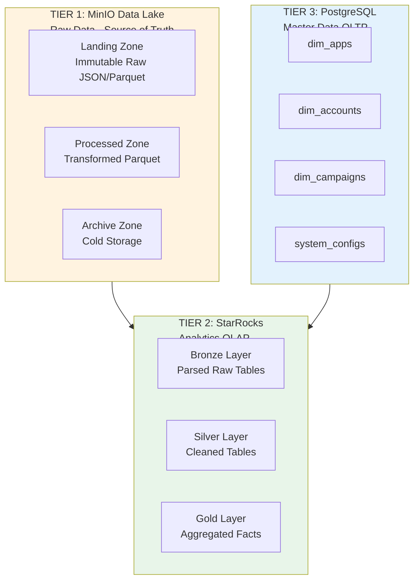
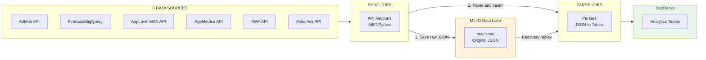
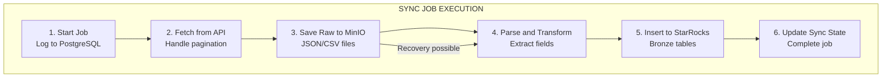
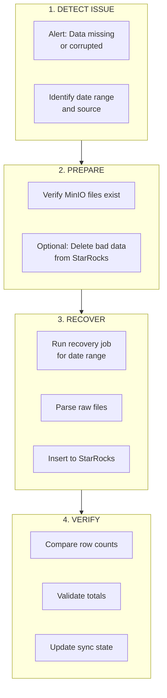

# AMOBEAR DATA STORAGE ARCHITECTURE

## MinIO Data Lake & StarRocks Schema Design

**Document Version:** 2.3

**Date:** March 2025

**Purpose:** Chi tiết cấu trúc lưu trữ raw data và analytics schema

**Cập nhật 2.1:** bronze.mediation_table — thêm 3 cột (ad_source_instance_id, ad_source_instance_name, impression_ctr); DDL CREATE TABLE + subsection "Cột mới bronze.mediation_table và cách sử dụng" (mục đích, Silver SoW, hash_key, migration).

**Cập nhật 2.2:** Nguồn Adjust (Attribution/MMP): MinIO `raw/adjust/parquet/`; bronze.adjust_report (date, app_token, dimension columns, *_metrics_json); không lưu app_id/app_name — mapping qua silver.dim_app_identifiers.adjust_id. Parquet sync Phase 1 (API→MinIO) + Phase 2 (MinIO→StarRocks). doc 119; migrations 001–005.

**Cập nhật 2.3:** Ghi **bronze.admob_table**, **bronze.mkt_table**, **bronze.mediation_table** qua **`StarRocksAdmobReportTablesWriter`**: ưu tiên HTTP **Stream Load** JSON (`StarRocks:HttpHost`, `HttpPort`, auth giống XMP/Firebase); kích thước mỗi request = **`StarRocks:StreamLoadBatchSize`**; lỗi hoặc không cấu hình FE → fallback **INSERT** MySQL theo batch (`StarRocks:InsertBatchSize`; mediation dùng thêm `StarRocks:MediationTableInsertBatchSize`). Code: `MediationPro.Infrastructure/StarRocks/StarRocksAdmobReportTablesWriter.cs`, `StarRocksStreamLoadClient`.

---

# 1. STORAGE ARCHITECTURE OVERVIEW

## 1.1 Three-Tier Storage Model



## 1.2 Data Flow



---

# 2. MinIO DATA LAKE STRUCTURE

## 2.1 Bucket Organization

```
amobear-datalake/                    # Main bucket
│
├── raw/                             # LANDING ZONE - Immutable raw responses
│   │
│   ├── admob/                       # AdMob API responses
│   │   ├── accounts/                # Account structure sync
│   │   │   └── 2025-01-30/
│   │   │       └── accounts_20250130_001.json
│   │   ├── apps/                    # App list sync
│   │   │   └── 2025-01-30/
│   │   │       └── apps_20250130_001.json
│   │   ├── ad_units/                # Ad unit structure
│   │   │   └── 2025-01-30/
│   │   │       └── ad_units_20250130_001.json
│   │   ├── mediation_groups/        # Mediation configuration
│   │   │   └── 2025-01-30/
│   │   │       └── mediation_groups_20250130_001.json
│   │   └── performance/             # Performance reports
│   │       └── 2025-01-30/
│   │           ├── performance_20250130_001.json
│   │           ├── performance_20250130_002.json
│   │           └── _manifest.json
│   │
│   ├── firebase/                    # Firebase/BigQuery exports
│   │   └── events/
│   │       └── 2025-01-30/
│   │           ├── events_20250130_000000.parquet
│   │           ├── events_20250130_000001.parquet
│   │           └── _manifest.json
│   │
│   ├── applovin/                    # AppLovin MAX API
│   │   ├── revenue/                 # Revenue reports
│   │   │   └── 2025-01-30/
│   │   │       └── revenue_20250130_001.json
│   │   ├── user_revenue/            # User-level revenue
│   │   │   └── 2025-01-30/
│   │   │       └── user_revenue_20250130_001.csv.gz
│   │   └── cohort/                  # Cohort data
│   │       └── 2025-01-30/
│   │           ├── cohort_revenue_20250130.json
│   │           ├── cohort_impressions_20250130.json
│   │           └── cohort_sessions_20250130.json
│   │
│   ├── appmetrica/                  # AppMetrica API
│   │   ├── stats/                   # Aggregated stats
│   │   │   └── 2025-01-30/
│   │   │       └── stats_20250130_001.json
│   │   ├── logs/                    # Raw logs export
│   │   │   ├── events/
│   │   │   │   └── 2025-01-30/
│   │   │   │       └── events_20250130.csv.gz
│   │   │   ├── sessions/
│   │   │   │   └── 2025-01-30/
│   │   │   │       └── sessions_20250130.csv.gz
│   │   │   └── crashes/
│   │   │       └── 2025-01-30/
│   │   │           └── crashes_20250130.csv.gz
│   │   └── profiles/                # User profiles
│   │       └── 2025-01-30/
│   │           └── profiles_20250130.json
│   │
│   ├── xmp/                         # XMP API
│   │   └── costs/
│   │       └── 2025-01-30/
│   │           ├── costs_20250130_page001.json
│   │           ├── costs_20250130_page002.json
│   │           └── _manifest.json
│   │
│   └── meta/                        # Meta Ads API
│       ├── campaigns/
│       │   └── 2025-01-30/
│       │       └── campaigns_20250130.json
│       ├── adsets/
│       │   └── 2025-01-30/
│       │       └── adsets_20250130.json
│       └── insights/
│           └── 2025-01-30/
│               └── insights_20250130.json
│
│   ├── adjust/                      # Adjust Report Service (Parquet)
│   │   └── parquet/
│   │       └── 2025-01-30/
│   │           ├── adjust_20250130_0_ad_spend.parquet
│   │           ├── adjust_20250130_0_conversion.parquet
│   │           └── ...               # Một file theo (ngày, chunk, metric group); Phase 2 đọc → merge → StarRocks
│
├── processed/                       # PROCESSED ZONE - Transformed data
│   ├── daily_metrics/
│   │   └── 2025-01-30/
│   │       └── metrics.parquet
│   ├── user_features/
│   │   └── 2025-01-30/
│   │       └── features.parquet
│   └── ltv_cohorts/
│       └── 2025-01-30/
│           └── ltv.parquet
│
├── archive/                         # ARCHIVE ZONE - Cold storage > 2 years
│   └── raw/
│       └── 2023/
│           └── admob/
│
├── checkpoints/                     # Flink/Spark checkpoints
│   ├── flink/
│   └── spark/
│
└── metadata/                        # Schema registry, manifests
    ├── schemas/
    │   ├── admob_performance_v1.json
    │   ├── firebase_events_v1.json
    │   └── ...
    └── sync_state/
        └── last_sync_timestamps.json

```

## 2.2 File Naming Convention

```
{source}_{endpoint}_{date}_{sequence}.{format}

Examples:
- admob_performance_20250130_001.json
- firebase_events_20250130_000001.parquet
- xmp_costs_20250130_page001.json
- applovin_user_revenue_20250130_001.csv.gz

```

## 2.3 Manifest File Format

Mỗi sync job tạo manifest file để track files đã sync:

```json
// raw/admob/performance/2025-01-30/_manifest.json
{
  "source": "admob",
  "endpoint": "performance",
  "sync_date": "2025-01-30",
  "sync_started_at": "2025-01-30T02:00:00Z",
  "sync_completed_at": "2025-01-30T02:45:00Z",
  "status": "completed",
  "files": [
    {
      "filename": "performance_20250130_001.json",
      "size_bytes": 15234567,
      "records_count": 45678,
      "checksum_md5": "abc123...",
      "date_range": {
        "start": "2025-01-29",
        "end": "2025-01-29"
      }
    },
    {
      "filename": "performance_20250130_002.json",
      "size_bytes": 12345678,
      "records_count": 34567,
      "checksum_md5": "def456...",
      "date_range": {
        "start": "2025-01-28",
        "end": "2025-01-28"
      }
    }
  ],
  "total_records": 80245,
  "total_size_bytes": 27580245,
  "api_requests_count": 45,
  "errors": []
}

```

## 2.4 Raw JSON Structure Examples

### AdMob Performance Response

```json
// raw/admob/performance/2025-01-30/performance_20250130_001.json
{
  "_metadata": {
    "source": "admob",
    "endpoint": "mediationReport",
    "fetched_at": "2025-01-30T02:15:00Z",
    "account_id": "pub-1234567890",
    "request_params": {
      "start_date": "2025-01-29",
      "end_date": "2025-01-29",
      "dimensions": ["DATE", "APP", "AD_UNIT", "COUNTRY", "FORMAT"],
      "metrics": ["ESTIMATED_EARNINGS", "IMPRESSIONS", "CLICKS", "MATCHED_REQUESTS", "MATCH_RATE"]
    }
  },
  "data": {
    "rows": [
      {
        "dimensionValues": {
          "DATE": {"value": "20250129"},
          "APP": {"value": "com.amobear.weather", "displayLabel": "Weather Pro"},
          "AD_UNIT": {"value": "ca-app-pub-xxx/123456", "displayLabel": "Banner_Home"},
          "COUNTRY": {"value": "US"},
          "FORMAT": {"value": "BANNER"}
        },
        "metricValues": {
          "ESTIMATED_EARNINGS": {"microsValue": "125670000"},
          "IMPRESSIONS": {"integerValue": "45678"},
          "CLICKS": {"integerValue": "234"},
          "MATCHED_REQUESTS": {"integerValue": "48000"},
          "MATCH_RATE": {"doubleValue": 0.9516}
        }
      }
      // ... more rows
    ]
  }
}

```

### AppLovin Revenue Response

```json
// raw/applovin/revenue/2025-01-30/revenue_20250130_001.json
{
  "_metadata": {
    "source": "applovin",
    "endpoint": "maxReport",
    "fetched_at": "2025-01-30T03:00:00Z",
    "request_params": {
      "start": "2025-01-29",
      "end": "2025-01-29",
      "columns": "day,application,package_name,platform,country,ad_format,network,impressions,estimated_revenue,ecpm"
    }
  },
  "data": {
    "results": [
      {
        "day": "2025-01-29",
        "application": "Weather Pro",
        "package_name": "com.amobear.weather",
        "platform": "android",
        "country": "US",
        "ad_format": "INTER",
        "network": "ADMOB_BIDDING",
        "impressions": 12345,
        "estimated_revenue": 156.78,
        "ecpm": 12.70
      }
      // ... more rows
    ]
  }
}

```

### XMP Costs Response

```json
// raw/xmp/costs/2025-01-30/costs_20250130_page001.json
{
  "_metadata": {
    "source": "xmp",
    "endpoint": "media/account/report",
    "fetched_at": "2025-01-30T00:30:00Z",
    "page": 1,
    "total_pages": 5,
    "request_params": {
      "start_date": "2025-01-29",
      "end_date": "2025-01-29",
      "metrics": ["cost", "xmp_cost"],
      "dimension": ["date", "account_id", "product_id", "store_package_id", "module", "os"]
    }
  },
  "data": {
    "code": 0,
    "data": {
      "list": [
        {
          "date": "2025-01-29",
          "account_id": "acc_123",
          "account_name": "Amobear Main",
          "product_id": "prod_456",
          "product_name": "Weather Pro Campaign",
          "store_package_id": "com.amobear.weather",
          "module": "facebook",
          "os": "android",
          "timezone": "UTC",
          "currency": "USD",
          "cost": 1234.56,
          "xmp_cost": 1234.56
        }
        // ... more rows
      ],
      "page_info": {
        "page": 1,
        "page_size": 200,
        "total_count": 856
      }
    }
  }
}

```

---

# 3. STARROCKS SCHEMA DESIGN

StarRocks sử dụng MySQL protocol; kết nối qua MySqlConnector hoặc driver MySQL. Kiểu dữ liệu tương thích MySQL (VARCHAR, BIGINT, DECIMAL, DATE, DATETIME). Primary key model hoặc Duplicate key model thay cho ReplacingMergeTree.

## 3.1 Database Organization

Hệ thống dùng **một tầng database** cho từng layer (bronze, silver, gold). Toàn bộ bảng AdMob (kể cả 3 bảng report admob_table, mkt_table, mediation_table) nằm trong **bronze**.

```sql
-- Create databases for each layer (StarRocks)
CREATE DATABASE IF NOT EXISTS bronze;  -- Raw parsed data (gồm admob_performance, admob_table, mkt_table, mediation_table)
CREATE DATABASE IF NOT EXISTS silver;  -- Cleaned/enriched data
CREATE DATABASE IF NOT EXISTS gold;    -- Aggregated facts/dimensions
CREATE DATABASE IF NOT EXISTS ml;      -- ML features and predictions
```

## 3.2 Bronze Layer - Raw Parsed Tables

### AdMob Tables

**Đường ghi 3 bảng report (admob_table, mkt_table, mediation_table):** **`StarRocksAdmobReportTablesWriter`** — nếu có **`StarRocks:HttpHost`** (Stream Load FE), mỗi lệnh ghi ưu tiên **PUT JSON** tới `bronze.<table>`; ngược lại hoặc khi Stream Load lỗi → **INSERT** đa dòng qua MySQL protocol (giữ batch insert như trước). Chi tiết key cấu hình: mục cập nhật **2.3** ở đầu tài liệu.

```sql
-- bronze.admob_accounts: Account master from API
CREATE TABLE bronze.admob_accounts (
    account_id VARCHAR(255) NOT NULL,
    account_name VARCHAR(500),
    currency_code VARCHAR(20),
    reporting_time_zone VARCHAR(100),
    _synced_at DATETIME NOT NULL,
    _source_file VARCHAR(1000)
)
DUPLICATE KEY(account_id)
DISTRIBUTED BY HASH(account_id) BUCKETS 4
PROPERTIES("replication_num" = "1");

-- bronze.admob_apps: App list from API (linked_app_info lưu JSON nếu cần)
CREATE TABLE bronze.admob_apps (
    app_id VARCHAR(255) NOT NULL,
    account_id VARCHAR(255) NOT NULL,
    app_name VARCHAR(500),
    platform VARCHAR(50),
    linked_app_info JSON,
    _synced_at DATETIME NOT NULL,
    _source_file VARCHAR(1000)
)
DUPLICATE KEY(account_id, app_id)
DISTRIBUTED BY HASH(app_id) BUCKETS 4
PROPERTIES("replication_num" = "1");

-- bronze.admob_ad_units: Ad unit structure
CREATE TABLE bronze.admob_ad_units (
    ad_unit_id VARCHAR(255) NOT NULL,
    app_id VARCHAR(255) NOT NULL,
    account_id VARCHAR(255) NOT NULL,
    ad_unit_name VARCHAR(500),
    ad_format VARCHAR(50),
    _synced_at DATETIME NOT NULL,
    _source_file VARCHAR(1000)
)
DUPLICATE KEY(account_id, app_id, ad_unit_id)
DISTRIBUTED BY HASH(ad_unit_id) BUCKETS 4
PROPERTIES("replication_num" = "1");

-- bronze.admob_mediation_groups: Mediation configuration (waterfall lines lưu JSON)
CREATE TABLE bronze.admob_mediation_groups (
    mediation_group_id VARCHAR(255) NOT NULL,
    account_id VARCHAR(255) NOT NULL,
    mediation_group_name VARCHAR(500),
    state VARCHAR(50),
    targeting_ad_unit_ids JSON,
    targeting_countries JSON,
    targeting_format VARCHAR(50),
    mediation_ab_experiment_state VARCHAR(50),
    mediation_group_lines JSON,
    _synced_at DATETIME NOT NULL,
    _source_file VARCHAR(1000)
)
DUPLICATE KEY(account_id, mediation_group_id)
DISTRIBUTED BY HASH(mediation_group_id) BUCKETS 4
PROPERTIES("replication_num" = "1");

-- bronze.admob_performance: Daily performance metrics (MAIN TABLE)
CREATE TABLE bronze.admob_performance (
    date DATE NOT NULL,
    account_id VARCHAR(255) NOT NULL,
    app_id VARCHAR(255) NOT NULL,
    app_name VARCHAR(500),
    ad_unit_id VARCHAR(255),
    ad_unit_name VARCHAR(500),
    ad_format VARCHAR(50),
    country VARCHAR(10),
    platform VARCHAR(20) DEFAULT '',
    estimated_earnings DECIMAL(20,6),
    impressions BIGINT,
    clicks INT,
    ad_requests BIGINT,
    matched_requests BIGINT,
    match_rate DECIMAL(18,6),
    show_rate DECIMAL(18,6),
    ctr DECIMAL(18,6),
    ecpm DECIMAL(20,4),
    ad_source_id VARCHAR(255) DEFAULT '',
    ad_source_name VARCHAR(255) DEFAULT '',
    _synced_at DATETIME NOT NULL,
    _source_file VARCHAR(1000),
    _data_date DATE
)
DUPLICATE KEY(date, account_id, app_id, ad_unit_id, country, ad_format)
DISTRIBUTED BY HASH(app_id) BUCKETS 8
PROPERTIES("replication_num" = "1");

-- bronze.admob_table, bronze.mkt_table, bronze.mediation_table: 3 bảng report theo docs/admob (z_main_last_3_day)
-- Sync từ AdMob Mediation Report API với 3 spec khác nhau (dimensions + country chunk cho mediation). PRIMARY KEY = hash_key → INSERT = UPSERT.
-- admob_table: 6 dimensions (DATE, AD_UNIT, APP, FORMAT, PLATFORM, APP_VERSION_NAME), 8 metrics (gồm IMPRESSION_CTR) + show_rate
-- mkt_table: 6 dimensions (DATE, APP, COUNTRY, APP_VERSION_NAME, FORMAT, PLATFORM), 8 metrics + show_rate
-- mediation_table: 9 dimensions (DATE, AD_SOURCE, AD_SOURCE_INSTANCE, AD_UNIT, MEDIATION_GROUP, APP, COUNTRY, FORMAT, PLATFORM), 8 metrics (gồm IMPRESSION_CTR) + show_rate; sync theo từng country chunk (5 châu lục + 11 cặp country)
CREATE TABLE IF NOT EXISTS bronze.admob_table (
    hash_key VARCHAR(64) NOT NULL,
    date DATE, ad_unit_name VARCHAR(255), ad_unit_id VARCHAR(255), app_id VARCHAR(128), format VARCHAR(64),
    app_version_name VARCHAR(128), app_name VARCHAR(255), platform VARCHAR(32),
    ad_requests BIGINT, clicks BIGINT, estimated_earnings DOUBLE, impressions BIGINT,
    matched_requests BIGINT, match_rate DOUBLE, show_rate DOUBLE, observed_ecpm DOUBLE
)
PRIMARY KEY (hash_key) DISTRIBUTED BY HASH(hash_key) BUCKETS 10 PROPERTIES("replication_num" = "1");

CREATE TABLE IF NOT EXISTS bronze.mkt_table (
    hash_key VARCHAR(64) NOT NULL,
    date DATE, app_id VARCHAR(128), country VARCHAR(32), app_version_name VARCHAR(128), app_name VARCHAR(255),
    format VARCHAR(64), platform VARCHAR(32),
    ad_requests BIGINT, clicks BIGINT, estimated_earnings DOUBLE, impressions BIGINT,
    matched_requests BIGINT, match_rate DOUBLE, show_rate DOUBLE, observed_ecpm DOUBLE
)
PRIMARY KEY (hash_key) DISTRIBUTED BY HASH(hash_key) BUCKETS 10 PROPERTIES("replication_num" = "1");

CREATE TABLE IF NOT EXISTS bronze.mediation_table (
    hash_key VARCHAR(64) NOT NULL,
    date DATE, ad_unit_name VARCHAR(255), ad_unit_id VARCHAR(255), app_id VARCHAR(128), country VARCHAR(32),
    ad_source_name VARCHAR(255), ad_source_id VARCHAR(255),
    ad_source_instance_id VARCHAR(255), ad_source_instance_name VARCHAR(255),
    mediation_group_name VARCHAR(255), mediation_group_id VARCHAR(255),
    app_name VARCHAR(255), format VARCHAR(64), platform VARCHAR(32),
    ad_requests BIGINT, clicks BIGINT, estimated_earnings DOUBLE, impressions BIGINT, impression_ctr DOUBLE,
    matched_requests BIGINT, match_rate DOUBLE, show_rate DOUBLE, observed_ecpm DOUBLE
)
PRIMARY KEY (hash_key) DISTRIBUTED BY HASH(hash_key) BUCKETS 10 PROPERTIES("replication_num" = "1");
```

#### Cột mới bronze.mediation_table và cách sử dụng

Bảng **bronze.mediation_table** có thêm 3 cột (từ AdMob dimension **AD_SOURCE_INSTANCE** và metric **IMPRESSION_CTR**), dùng cho phân tích sâu mediation và waterfall:

| Cột | Kiểu | Nguồn API | Mục đích |
|-----|------|-----------|----------|
| **ad_source_instance_id** | VARCHAR(255) | Dimension AD_SOURCE_INSTANCE | ID instance nguồn quảng cáo (vd: ca-app-pub-xxx:asi:5678). Phân biệt từng instance trong mediation group (AdMob default vs instance tùy chỉnh). **Dùng cho:** SoW theo instance, so sánh eCPM/earnings từng dòng waterfall, tối ưu thứ tự. |
| **ad_source_instance_name** | VARCHAR(255) | DisplayLabel của AD_SOURCE_INSTANCE | Tên hiển thị (vd: "AdMob (default)"). Dùng làm label trên Dashboard/Report. |
| **impression_ctr** | DOUBLE | Metric IMPRESSION_CTR | CTR (clicks/impressions) từ API. **Dùng cho:** Chart/alert CTR theo ad_source, instance, country, format; không cần tính thủ công. |

- **Silver:** **silver.daily_sow_analysis** lấy `ad_source_instance_id` từ bronze.mediation_table (GROUP BY ad_source_instance_id) để tính SoW theo từng instance.
- **Hash key:** PK `hash_key` = MD5(date + ad_source_id + **ad_source_instance_id** + ad_unit_id + mediation_group_id + app_id + country + format + platform).
- **Migration:** Bảng đã tồn tại cần ALTER thêm 3 cột; DDL chạy trong **StarRocksSchemaInitializer** (idempotent). Chi tiết: **docs/admob/MEDIATION_TABLE_EVALUATION.md** mục 6.

#### Revenue 30D cho waterfall trong Mediation Group detail

Từ implementation hiện tại:

- Màn **Mediation Group detail > Waterfall** lấy `Revenue 30D` **live** từ `bronze.mediation_table`, không đọc Redis cache.
- Granularity là **waterfall line**: query `SUM(estimated_earnings)` và `GROUP BY ad_source_instance_id`, sau đó normalize line id bằng `SUBSTRING_INDEX(ad_source_instance_id, ':asi:', -1)`.
- Filter chính:
  - `date` trong cửa sổ 30 ngày, inclusive
  - `app_id = <admob app id>`
  - `mediation_group_id = <full id>` hoặc short id sau `:mg:`
  - `ad_source_id = 1215381445328257950` (AdMob waterfall)
  - `ad_source_instance_id IS NOT NULL` và có pattern `:asi:`

Ý nghĩa:

- `ad_source_instance_id` là khóa đúng để phân biệt từng dòng waterfall trong cùng mediation group.
- Nếu môi trường chưa chạy `performance-sync` hoặc dữ liệu `ad_source_instance_id` còn null, `Revenue 30D` theo line sẽ không đáng tin.

#### Cache app-level cho waterfall ad unit 30 ngày

Ngoài line-level revenue ở MG detail, hệ thống còn có cache app-level:

- Redis key: `dashboard:app:{appId}:waterfalladunits:30days`
- Mỗi item cache gồm:
  - `WaterfallDbId`
  - `AdmobNetworkWaterfallAdUnitId`
  - `Revenue`
  - `Countries`

Nguồn tính cache này:

- Resolve `admobNetworkWaterfallAdUnitId -> ad_unit_id[]` từ PostgreSQL (`ad_unit_waterfall_mappings`)
- Query `bronze.mediation_table` theo `ad_unit_id`
- Aggregate revenue/countries ngược lại cho từng waterfall ad unit

Cache này dùng cho:

- App waterfall list
- Global waterfall list

Cache này **không** dùng cho `Revenue 30D` của từng line trong MG detail.

### Firebase Tables

**Triển khai hiện tại:** Mỗi app một bảng **bronze.fb_{sanitized_app_id}** (vd. `fb_com_earthmap_livesatellite_worldmap_view`), tạo tại runtime bởi ứng dụng (StarRocksFirebaseWriter). Luồng: **Firebase → BigQuery → GCS (parquet) → MinIO → .NET Parse → StarRocks Stream Load**. Đối chiếu schema BigQuery (GCS) với StarRocks: **docs/firebase-project/BIGQUERY-SCHEMA-STORAGE.md**.

**Pipeline Jobs (Hangfire):**
- `firebase-pipeline-daily` (`0 4 * * *` UTC): Load T-1 data, parallel 5 apps
- `firebase-pipeline-weekly` (`0 6 * * 0` UTC): Smart Recovery - chỉ reload nếu data thiếu/lệch >1%

#### Cột đang lưu (bronze.fb_*)

| Cột StarRocks | Nguồn BigQuery | Ghi chú |
|---------------|----------------|---------|
| event_date | event_date | |
| event_timestamp | event_timestamp | |
| user_pseudo_id | user_pseudo_id | |
| install_date | (tính từ user_first_touch_timestamp) | |
| retention_day | (tính từ event_timestamp, install_date) | |
| event_name | event_name | |
| app_version | app_info.version | BQ: version trong RECORD app_info |
| device_json | device (RECORD) | Nguyên JSON |
| geo_json | geo (RECORD) | Nguyên JSON |
| traffic_source_json | traffic_source (RECORD) | Nguyên JSON |
| event_params_json | event_params (REPEATED RECORD) | Nguyên JSON |
| user_properties_json | user_properties (REPEATED RECORD) | Nguyên JSON |
| **raw_event_json** | **Toàn bộ event** | Chứa mọi field BQ (event_value_in_usd, user_id, privacy_info, user_ltv, stream_id, platform, ecommerce, items, app_info đầy đủ, …) |

- **Query nhanh / DAU-DAV:** Dùng cột scalar và các cột *_json (device, geo, event_params, user_properties).
- **Không mất dữ liệu so với BQ:** Toàn bộ event lưu trong **raw_event_json**. Nếu bảng fb_* đã tạo trước khi có cột này, chạy: `ALTER TABLE bronze.fb_<tên_bảng> ADD COLUMN raw_event_json STRING NULL;` (chi tiết: **BIGQUERY-SCHEMA-STORAGE.md**).

#### DDL tham khảo (schema chung cho một bảng fb_*)

```sql
-- Ví dụ bronze.fb_com_example_app (tên bảng do StarRocksFirebaseWriter tạo từ app_id)
-- Thực tế ứng dụng CREATE TABLE IF NOT EXISTS tại runtime; script init chỉ cần CREATE DATABASE bronze.
CREATE TABLE bronze.fb_<sanitized_app_id> (
    event_date DATE,
    event_timestamp BIGINT,
    user_pseudo_id VARCHAR(255),
    install_date DATE,
    retention_day INT,
    event_name VARCHAR(255),
    app_version VARCHAR(100),
    device_json STRING,
    geo_json STRING,
    traffic_source_json STRING,
    event_params_json STRING,
    user_properties_json STRING,
    raw_event_json STRING
)
DUPLICATE KEY(event_date, event_name, user_pseudo_id, event_timestamp)
PARTITION BY RANGE(event_date) ()
DISTRIBUTED BY HASH(user_pseudo_id) BUCKETS 16
PROPERTIES(
    "replication_num" = "1",
    "dynamic_partition.enable" = "true",
    "dynamic_partition.time_unit" = "MONTH",
    "dynamic_partition.start" = "-36",
    "dynamic_partition.end" = "3",
    "dynamic_partition.prefix" = "p",
    "dynamic_partition.buckets" = "16",
    "dynamic_partition.history_partition_num" = "36",
    "compression" = "ZSTD"
);
```

**Bảng tổng hợp (legacy tham khảo):** Một số tài liệu cũ đề cập bảng chung `bronze.firebase_events` với cột flatten; triển khai hiện tại dùng **per-app fb_*** thay thế.

**Session aggregation:** ETL job có thể populate `silver.daily_app_engagement` (DAU, DAV, sessions) từ các bảng fb_*.

### AppLovin Tables

```sql
-- bronze.applovin_revenue: Aggregated revenue from MAX
CREATE TABLE bronze.applovin_revenue (
    date DATE NOT NULL,
    hour TINYINT NULL,
    application VARCHAR(500),
    package_name VARCHAR(255) NOT NULL,
    platform VARCHAR(50),
    country VARCHAR(10),
    ad_format VARCHAR(50),
    network VARCHAR(255),
    network_placement VARCHAR(500) DEFAULT '',
    impressions BIGINT,
    estimated_revenue DECIMAL(20,6),
    ecpm DECIMAL(20,4),
    _synced_at DATETIME NOT NULL,
    _source_file VARCHAR(1000)
)
DUPLICATE KEY(date, package_name, country, ad_format, network)
DISTRIBUTED BY HASH(package_name) BUCKETS 4
PROPERTIES("replication_num" = "1");

-- bronze.applovin_cohort: Cohort analysis data
CREATE TABLE bronze.applovin_cohort (
    cohort_date DATE NOT NULL,
    day_number INT NOT NULL,
    observation_date DATE NULL,
    application VARCHAR(500),
    package_name VARCHAR(255) NOT NULL,
    platform VARCHAR(50),
    country VARCHAR(10),
    installs BIGINT,
    revenue DECIMAL(20,6),
    revenue_per_user DECIMAL(20,6),
    sessions BIGINT,
    sessions_per_user DECIMAL(18,4),
    impressions BIGINT,
    impressions_per_user DECIMAL(18,4),
    retained_users BIGINT,
    retention_rate DECIMAL(18,4),
    _synced_at DATETIME NOT NULL,
    _source_file VARCHAR(1000)
)
DUPLICATE KEY(package_name, cohort_date, day_number, country, platform)
DISTRIBUTED BY HASH(package_name) BUCKETS 4
PROPERTIES("replication_num" = "1");

-- bronze.applovin_user_revenue: User-level (aggregated)
CREATE TABLE bronze.applovin_user_revenue (
    date DATE NOT NULL,
    user_id VARCHAR(255),
    idfa VARCHAR(255) NULL,
    idfv VARCHAR(255) NULL,
    package_name VARCHAR(255) NOT NULL,
    platform VARCHAR(50),
    country VARCHAR(10),
    ad_unit_count SMALLINT,
    total_impressions INT,
    total_revenue DECIMAL(20,6),
    _synced_at DATETIME NOT NULL,
    _source_file VARCHAR(1000)
)
DUPLICATE KEY(date, package_name, user_id)
DISTRIBUTED BY HASH(package_name) BUCKETS 4
PROPERTIES("replication_num" = "1");
```

### AppMetrica Tables

```sql
-- bronze.appmetrica_stats: Aggregated stats from Reporting API
CREATE TABLE bronze.appmetrica_stats (
    date DATE NOT NULL,
    app_id BIGINT NOT NULL,
    operating_system VARCHAR(50),
    country VARCHAR(10),
    device_type VARCHAR(50),
    app_version VARCHAR(100),
    users BIGINT,
    new_users BIGINT,
    sessions BIGINT,
    avg_session_duration_sec DECIMAL(18,2),
    events BIGINT,
    crashes INT,
    errors INT,
    revenue DECIMAL(20,6),
    revenue_events INT,
    _synced_at DATETIME NOT NULL,
    _source_file VARCHAR(1000)
)
DUPLICATE KEY(date, app_id, operating_system, country)
DISTRIBUTED BY HASH(app_id) BUCKETS 4
PROPERTIES("replication_num" = "1");

-- bronze.appmetrica_sessions: Session-level from Logs API
CREATE TABLE bronze.appmetrica_sessions (
    session_id VARCHAR(255) NOT NULL,
    app_id BIGINT NOT NULL,
    session_start_datetime DATETIME,
    session_end_datetime DATETIME NULL,
    appmetrica_device_id VARCHAR(255),
    profile_id VARCHAR(255) NULL,
    os_name VARCHAR(50),
    os_version VARCHAR(100),
    device_model VARCHAR(100),
    device_manufacturer VARCHAR(100),
    device_type VARCHAR(50),
    country VARCHAR(10),
    city VARCHAR(100),
    duration_sec INT,
    event_count SMALLINT,
    is_crashed BOOLEAN DEFAULT false,
    _synced_at DATETIME NOT NULL,
    _source_file VARCHAR(1000)
)
DUPLICATE KEY(app_id, session_start_datetime, appmetrica_device_id)
DISTRIBUTED BY HASH(app_id) BUCKETS 4
PROPERTIES("replication_num" = "1");

-- bronze.appmetrica_crashes: Crash logs
CREATE TABLE bronze.appmetrica_crashes (
    crash_id VARCHAR(255) NOT NULL,
    app_id BIGINT NOT NULL,
    crash_datetime DATETIME,
    appmetrica_device_id VARCHAR(255),
    os_name VARCHAR(50),
    os_version VARCHAR(100),
    app_version VARCHAR(100),
    device_model VARCHAR(100),
    crash_group_id VARCHAR(255),
    crash_reason TEXT,
    crash_message TEXT,
    _synced_at DATETIME NOT NULL,
    _source_file VARCHAR(1000)
)
DUPLICATE KEY(app_id, crash_datetime, crash_group_id)
DISTRIBUTED BY HASH(app_id) BUCKETS 4
PROPERTIES("replication_num" = "1");
```

### XMP Tables

```sql
-- bronze.xmp_costs: UA cost data from XMP
CREATE TABLE bronze.xmp_costs (
    hash_key VARCHAR(64) NOT NULL,
    date DATE NOT NULL,
    account_id VARCHAR(255),
    account_name VARCHAR(500),
    product_id VARCHAR(255),
    product_name VARCHAR(500),
    store_package_id VARCHAR(255),
    module VARCHAR(50),
    os VARCHAR(20),
    timezone VARCHAR(50),
    currency VARCHAR(10),
    cost DECIMAL(20,6),
    xmp_cost DECIMAL(20,6),
    _synced_at DATETIME NOT NULL,
    _source_file VARCHAR(1000)
)
DUPLICATE KEY(hash_key)
DISTRIBUTED BY HASH(hash_key) BUCKETS 4
PROPERTIES("replication_num" = "1");
```

### Meta Ads Tables

```sql
-- bronze.meta_campaigns: Campaign structure
CREATE TABLE bronze.meta_campaigns (
    account_id VARCHAR(255) NOT NULL,
    campaign_id VARCHAR(255) NOT NULL,
    campaign_name VARCHAR(500),
    status VARCHAR(50),
    effective_status VARCHAR(50),
    objective VARCHAR(100),
    buying_type VARCHAR(50),
    daily_budget DECIMAL(20,2) NULL,
    lifetime_budget DECIMAL(20,2) NULL,
    start_time DATETIME NULL,
    stop_time DATETIME NULL,
    created_time DATETIME,
    updated_time DATETIME,
    _synced_at DATETIME NOT NULL,
    _source_file VARCHAR(1000)
)
DUPLICATE KEY(account_id, campaign_id)
DISTRIBUTED BY HASH(campaign_id) BUCKETS 4
PROPERTIES("replication_num" = "1");

-- bronze.meta_adsets: Ad set structure (targeting_* có thể lưu JSON)
CREATE TABLE bronze.meta_adsets (
    account_id VARCHAR(255) NOT NULL,
    campaign_id VARCHAR(255) NOT NULL,
    adset_id VARCHAR(255) NOT NULL,
    adset_name VARCHAR(500),
    status VARCHAR(50),
    effective_status VARCHAR(50),
    targeting_countries JSON,
    targeting_age_min TINYINT NULL,
    targeting_age_max TINYINT NULL,
    targeting_genders JSON,
    daily_budget DECIMAL(20,2) NULL,
    lifetime_budget DECIMAL(20,2) NULL,
    bid_amount DECIMAL(20,4) NULL,
    billing_event VARCHAR(50),
    optimization_goal VARCHAR(100),
    start_time DATETIME NULL,
    stop_time DATETIME NULL,
    _synced_at DATETIME NOT NULL,
    _source_file VARCHAR(1000)
)
DUPLICATE KEY(account_id, campaign_id, adset_id)
DISTRIBUTED BY HASH(adset_id) BUCKETS 4
PROPERTIES("replication_num" = "1");

-- bronze.meta_insights: Performance data
CREATE TABLE bronze.meta_insights (
    date DATE NOT NULL,
    account_id VARCHAR(255),
    campaign_id VARCHAR(255),
    campaign_name VARCHAR(500),
    adset_id VARCHAR(255) NULL,
    adset_name VARCHAR(500) NULL,
    ad_id VARCHAR(255) NULL,
    ad_name VARCHAR(500) NULL,
    country VARCHAR(10) DEFAULT 'ALL',
    platform VARCHAR(20) DEFAULT 'ALL',
    spend DECIMAL(20,6),
    reach BIGINT,
    impressions BIGINT,
    frequency DECIMAL(18,4),
    clicks INT,
    unique_clicks INT,
    cpc DECIMAL(20,4),
    cpm DECIMAL(20,4),
    ctr DECIMAL(18,4),
    actions_install INT NULL,
    actions_purchase INT NULL,
    actions_purchase_value DECIMAL(20,2) NULL,
    _synced_at DATETIME NOT NULL,
    _source_file VARCHAR(1000)
)
DUPLICATE KEY(date, account_id, campaign_id, adset_id, country)
DISTRIBUTED BY HASH(campaign_id) BUCKETS 4
PROPERTIES("replication_num" = "1");
```

#### Adjust (Attribution / MMP) — bronze.adjust_report

Nguồn: **Adjust Report Service API** (Parquet). Luồng: **Phase 1** gọi API theo (ngày, chunk metrics) → lưu raw Parquet vào MinIO `raw/adjust/parquet/`; **Phase 2** đọc từng file từ MinIO → parse → merge theo dimension key → INSERT StarRocks. Chi tiết: **docs/119 - ADJUST REPORT SERVICE API PARQUET SYNC.md**.

- **Chỉ lưu `app_token`** (Adjust app token). Không lưu app_id, app_name — mapping chung qua **silver.dim_app_identifiers** (cột `adjust_id` = app_token); JOIN để lấy admob_app_id, display_name.
- **Dimension columns** (cố định, có index): date, app_token, country_code, os_name, network, partner_name, campaign, campaign_id_network, campaign_network.
- **Metrics** (biến đổi): lưu theo nhóm JSON (Datascape glossary): dimensions_json, conversion_metrics_json, cohort_metrics_json, ad_spend_metrics_json, revenue_metrics_json, skad_metrics_json, fraud_metrics_json, assist_metrics_json, insight_metrics_json, other_metrics_json, payload_json.
- Dedup: DELETE theo date [+ app_tokens] rồi INSERT. DUPLICATE KEY(date, app_token). Migrations: `docker/starrocks/migrations/` (001–005); dim_app_identifiers có cột adjust_id (migration 005).

```sql
-- bronze.adjust_report (schema tham chiếu)
-- date, app_token, country_code, os_name, network, partner_name, campaign, campaign_id_network, campaign_network,
-- _synced_at, dimensions_json, conversion_metrics_json, ... (theo Datascape), payload_json, _sync_job_type
-- DUPLICATE KEY(date, app_token) DISTRIBUTED BY HASH(app_token) BUCKETS 4
```

## 3.3 Silver Layer - Cleaned & Enriched

```sql
-- silver.daily_app_revenue: Unified revenue across networks
CREATE TABLE silver.daily_app_revenue (
    date DATE NOT NULL,
    app_id VARCHAR(255) NOT NULL,
    platform VARCHAR(50),
    country VARCHAR(10),
    admob_impressions BIGINT,
    admob_revenue DECIMAL(20,6),
    admob_ecpm DECIMAL(20,4),
    applovin_impressions BIGINT,
    applovin_revenue DECIMAL(20,6),
    applovin_ecpm DECIMAL(20,4),
    ironsource_revenue DECIMAL(20,6) DEFAULT 0,
    unity_revenue DECIMAL(20,6) DEFAULT 0,
    total_impressions BIGINT,
    total_ad_revenue DECIMAL(20,6),
    blended_ecpm DECIMAL(20,4),
    _updated_at DATETIME NOT NULL
)
DUPLICATE KEY(app_id, date, platform, country)
DISTRIBUTED BY HASH(app_id) BUCKETS 8
PROPERTIES("replication_num" = "1");

-- silver.daily_app_engagement: Unified engagement metrics
CREATE TABLE silver.daily_app_engagement (
    date DATE NOT NULL,
    app_id VARCHAR(255) NOT NULL,
    platform VARCHAR(50),
    country VARCHAR(10),
    dau BIGINT,
    new_users BIGINT,
    returning_users BIGINT,
    dav BIGINT,
    dav_ratio DECIMAL(18,4),
    sessions BIGINT,
    avg_session_duration_sec DECIMAL(18,2),
    sessions_per_user DECIMAL(18,4),
    crashes INT,
    crash_rate DECIMAL(18,6),
    _updated_at DATETIME NOT NULL
)
DUPLICATE KEY(app_id, date, platform, country)
DISTRIBUTED BY HASH(app_id) BUCKETS 8
PROPERTIES("replication_num" = "1");

-- silver.daily_app_costs: Unified UA costs
CREATE TABLE silver.daily_app_costs (
    date DATE NOT NULL,
    app_id VARCHAR(255) NOT NULL,
    platform VARCHAR(50),
    country VARCHAR(10),
    source VARCHAR(50),
    xmp_cost DECIMAL(20,6),
    meta_cost DECIMAL(20,6),
    total_cost DECIMAL(20,6),
    installs INT,
    cpi DECIMAL(20,4),
    _updated_at DATETIME NOT NULL
)
DUPLICATE KEY(app_id, date, platform, country, source)
DISTRIBUTED BY HASH(app_id) BUCKETS 8
PROPERTIES("replication_num" = "1");
```

## 3.4 Gold Layer - Business Facts

```sql
-- gold.fact_daily_app_metrics: Main fact table
CREATE TABLE gold.fact_daily_app_metrics (
    date DATE NOT NULL,
    app_id VARCHAR(255) NOT NULL,
    app_name VARCHAR(500),
    platform VARCHAR(50),
    country VARCHAR(10),
    dau BIGINT,
    dav BIGINT,
    new_users BIGINT,
    sessions BIGINT,
    total_ad_revenue DECIMAL(20,6),
    admob_revenue DECIMAL(20,6),
    applovin_revenue DECIMAL(20,6),
    other_revenue DECIMAL(20,6),
    iap_revenue DECIMAL(20,6) DEFAULT 0,
    total_impressions BIGINT,
    banner_impressions BIGINT DEFAULT 0,
    interstitial_impressions BIGINT DEFAULT 0,
    rewarded_impressions BIGINT DEFAULT 0,
    native_impressions BIGINT DEFAULT 0,
    blended_ecpm DECIMAL(20,4),
    total_ua_cost DECIMAL(20,6),
    paid_installs INT,
    organic_installs INT,
    cpi DECIMAL(20,4),
    arpdau DECIMAL(20,6),
    arpdav DECIMAL(20,6),
    dav_ratio DECIMAL(18,4),
    ua_roi DECIMAL(18,4),
    crash_rate DECIMAL(18,6),
    _updated_at DATETIME NOT NULL
)
DUPLICATE KEY(app_id, date, platform, country)
DISTRIBUTED BY HASH(app_id) BUCKETS 8
PROPERTIES("replication_num" = "1");

-- gold.fact_user_ltv: User-level LTV
CREATE TABLE gold.fact_user_ltv (
    user_id VARCHAR(255) NOT NULL,
    app_id VARCHAR(255) NOT NULL,
    platform VARCHAR(50),
    install_date DATE,
    install_source VARCHAR(50),
    install_country VARCHAR(10),
    campaign_id VARCHAR(255) NULL,
    ltv_d0 DECIMAL(20,6),
    ltv_d1 DECIMAL(20,6),
    ltv_d3 DECIMAL(20,6),
    ltv_d7 DECIMAL(20,6),
    ltv_d14 DECIMAL(20,6),
    ltv_d30 DECIMAL(20,6),
    ltv_d60 DECIMAL(20,6),
    ltv_d90 DECIMAL(20,6),
    lifetime_ad_revenue DECIMAL(20,6),
    lifetime_iap_revenue DECIMAL(20,6),
    lifetime_total_revenue DECIMAL(20,6),
    lifetime_sessions INT,
    lifetime_days_active SMALLINT,
    last_active_date DATE,
    predicted_ltv_d180 DECIMAL(20,6) NULL,
    churn_probability FLOAT NULL,
    _updated_at DATETIME NOT NULL
)
DUPLICATE KEY(app_id, install_date, user_id)
DISTRIBUTED BY HASH(app_id) BUCKETS 8
PROPERTIES("replication_num" = "1");

-- gold.fact_campaign_performance: Campaign-level ROI
CREATE TABLE gold.fact_campaign_performance (
    date DATE NOT NULL,
    app_id VARCHAR(255) NOT NULL,
    source VARCHAR(50),
    campaign_id VARCHAR(255),
    campaign_name VARCHAR(500),
    country VARCHAR(10),
    platform VARCHAR(50),
    cost DECIMAL(20,6),
    impressions BIGINT,
    clicks INT,
    installs INT,
    ctr DECIMAL(18,4),
    cvr DECIMAL(18,4),
    cpi DECIMAL(20,4),
    d0_revenue DECIMAL(20,6),
    d1_revenue DECIMAL(20,6),
    d7_revenue DECIMAL(20,6),
    d30_revenue DECIMAL(20,6),
    roas_d0 DECIMAL(18,4),
    roas_d1 DECIMAL(18,4),
    roas_d7 DECIMAL(18,4),
    roas_d30 DECIMAL(18,4),
    _updated_at DATETIME NOT NULL
)
DUPLICATE KEY(app_id, date, source, campaign_id)
DISTRIBUTED BY HASH(app_id) BUCKETS 8
PROPERTIES("replication_num" = "1");
```

## 3.5 Dimension Tables (from PostgreSQL - replicated)

```sql
-- gold.dim_apps: Replicated from PostgreSQL
CREATE TABLE gold.dim_apps (
    app_id VARCHAR(255) NOT NULL,
    app_name VARCHAR(500),
    bundle_id VARCHAR(255),
    platform VARCHAR(50),
    category VARCHAR(100),
    sub_category VARCHAR(100),
    admob_app_id VARCHAR(100) NULL,
    admob_account_id VARCHAR(100) NULL,
    applovin_package VARCHAR(255) NULL,
    firebase_project_id VARCHAR(100) NULL,
    appmetrica_app_id BIGINT NULL,
    status VARCHAR(20),
    launch_date DATE NULL,
    business_unit VARCHAR(100),
    product_manager VARCHAR(255),
    monetization_type VARCHAR(50),
    _updated_at DATETIME NOT NULL
)
DUPLICATE KEY(app_id)
DISTRIBUTED BY HASH(app_id) BUCKETS 4
PROPERTIES("replication_num" = "1");
```

---

# 4. PostgreSQL MASTER DATA

## 4.1 Core Tables

```sql
-- App master data
CREATE TABLE apps (
    id SERIAL PRIMARY KEY,
    app_id VARCHAR(255) UNIQUE NOT NULL,    -- Internal ID
    app_name VARCHAR(255) NOT NULL,
    bundle_id VARCHAR(255),
    platform VARCHAR(50) NOT NULL,
    category VARCHAR(100),
    sub_category VARCHAR(100),

    -- External system IDs
    admob_app_id VARCHAR(100),
    admob_account_id VARCHAR(100),
    applovin_package VARCHAR(255),
    firebase_project_id VARCHAR(100),
    appmetrica_app_id BIGINT,

    -- Status
    status VARCHAR(20) DEFAULT 'active',
    launch_date DATE,

    -- Business
    business_unit VARCHAR(100),
    product_manager VARCHAR(255),

    -- Monetization config
    monetization_type VARCHAR(50),
    primary_mediation VARCHAR(50),

    -- Timestamps
    created_at TIMESTAMP DEFAULT NOW(),
    updated_at TIMESTAMP DEFAULT NOW()
);

CREATE INDEX idx_apps_bundle ON apps(bundle_id);
CREATE INDEX idx_apps_status ON apps(status);

-- AdMob accounts
CREATE TABLE admob_accounts (
    id SERIAL PRIMARY KEY,
    account_id VARCHAR(100) UNIQUE NOT NULL,
    account_name VARCHAR(255),
    currency_code VARCHAR(10),
    reporting_time_zone VARCHAR(50),

    -- OAuth credentials (encrypted)
    refresh_token_encrypted TEXT,

    status VARCHAR(20) DEFAULT 'active',
    created_at TIMESTAMP DEFAULT NOW(),
    updated_at TIMESTAMP DEFAULT NOW()
);

-- AppLovin accounts
CREATE TABLE applovin_accounts (
    id SERIAL PRIMARY KEY,
    account_name VARCHAR(255),
    report_key_encrypted TEXT,

    status VARCHAR(20) DEFAULT 'active',
    created_at TIMESTAMP DEFAULT NOW()
);

-- XMP accounts
CREATE TABLE xmp_accounts (
    id SERIAL PRIMARY KEY,
    client_id VARCHAR(100) NOT NULL,
    client_secret_encrypted TEXT,
    account_name VARCHAR(255),

    status VARCHAR(20) DEFAULT 'active',
    created_at TIMESTAMP DEFAULT NOW()
);

-- AppMetrica accounts
CREATE TABLE appmetrica_accounts (
    id SERIAL PRIMARY KEY,
    oauth_token_encrypted TEXT,
    account_name VARCHAR(255),

    status VARCHAR(20) DEFAULT 'active',
    created_at TIMESTAMP DEFAULT NOW()
);

-- Meta accounts
CREATE TABLE meta_accounts (
    id SERIAL PRIMARY KEY,
    account_id VARCHAR(100) UNIQUE NOT NULL,
    account_name VARCHAR(255),
    access_token_encrypted TEXT,

    status VARCHAR(20) DEFAULT 'active',
    created_at TIMESTAMP DEFAULT NOW()
);

-- App to account mapping
CREATE TABLE app_account_mapping (
    id SERIAL PRIMARY KEY,
    app_id VARCHAR(255) REFERENCES apps(app_id),
    source VARCHAR(50) NOT NULL,              -- admob, applovin, xmp, meta, appmetrica
    external_account_id VARCHAR(100) NOT NULL,
    external_app_id VARCHAR(255),

    created_at TIMESTAMP DEFAULT NOW(),
    UNIQUE(app_id, source)
);

-- Campaign to app mapping (for attribution)
CREATE TABLE campaign_app_mapping (
    id SERIAL PRIMARY KEY,
    campaign_id VARCHAR(100) NOT NULL,
    campaign_name VARCHAR(500),
    app_id VARCHAR(255) REFERENCES apps(app_id),
    source VARCHAR(50) NOT NULL,              -- facebook, google, tiktok

    created_at TIMESTAMP DEFAULT NOW(),
    updated_at TIMESTAMP DEFAULT NOW(),
    UNIQUE(campaign_id, source)
);

```

## 4.2 Sync State Tables

```sql
-- Track sync job status
CREATE TABLE sync_jobs (
    id SERIAL PRIMARY KEY,
    job_name VARCHAR(100) NOT NULL,
    source VARCHAR(50) NOT NULL,
    endpoint VARCHAR(100),

    started_at TIMESTAMP NOT NULL,
    completed_at TIMESTAMP,
    status VARCHAR(20) NOT NULL,              -- running, completed, failed

    -- Stats
    records_fetched INT,
    records_inserted INT,
    files_written INT,

    -- Error info
    error_message TEXT,
    error_details JSONB,

    -- MinIO files
    raw_files JSONB,                          -- Array of file paths

    created_at TIMESTAMP DEFAULT NOW()
);

CREATE INDEX idx_sync_jobs_source ON sync_jobs(source, started_at DESC);
CREATE INDEX idx_sync_jobs_status ON sync_jobs(status);

-- Track last sync timestamp per source/endpoint
CREATE TABLE sync_state (
    id SERIAL PRIMARY KEY,
    source VARCHAR(50) NOT NULL,
    endpoint VARCHAR(100) NOT NULL,
    account_id VARCHAR(100),

    last_sync_at TIMESTAMP,
    last_data_date DATE,

    updated_at TIMESTAMP DEFAULT NOW(),
    UNIQUE(source, endpoint, account_id)
);

```

---

# 5. DATA SYNC IMPLEMENTATION

## 5.1 Sync Job Flow



## 5.2 Generic Sync Service

```csharp
// SyncService.cs - StarRocks kết nối qua MySqlConnector (MySQL protocol)
public abstract class BaseSyncService<TRawResponse, TParsedRecord>
{
    protected readonly IMinioClient _minio;
    protected readonly IDbConnection _starrocks;   // MySqlConnector cho StarRocks (MySQL protocol)
    protected readonly IDbConnection _postgres;
    protected readonly ILogger _logger;

    public async Task<SyncResult> ExecuteAsync(SyncConfig config)
    {
        var jobId = await StartJob(config);

        try
        {
            // Step 1: Fetch from API
            var rawResponses = await FetchFromApiAsync(config);

            // Step 2: Save raw to MinIO
            var files = await SaveToMinioAsync(rawResponses, config);

            // Step 3: Parse records
            var records = ParseRecords(rawResponses);

            // Step 4: Insert to StarRocks
            await InsertToStarRocksAsync(records, files);

            // Step 5: Update sync state
            await CompleteJob(jobId, files.Count, records.Count);

            return new SyncResult { Success = true, RecordsProcessed = records.Count };
        }
        catch (Exception ex)
        {
            await FailJob(jobId, ex);
            throw;
        }
    }

    private async Task<List<string>> SaveToMinioAsync(
        List<TRawResponse> responses,
        SyncConfig config)
    {
        var files = new List<string>();
        var date = DateTime.UtcNow.ToString("yyyy-MM-dd");
        var basePath = $"raw/{config.Source}/{config.Endpoint}/{date}";

        for (int i = 0; i < responses.Count; i++)
        {
            var filename = $"{config.Endpoint}_{date.Replace("-", "")}_{i+1:D3}.json";
            var fullPath = $"{basePath}/{filename}";

            // Add metadata
            var withMetadata = new
            {
                _metadata = new
                {
                    source = config.Source,
                    endpoint = config.Endpoint,
                    fetched_at = DateTime.UtcNow,
                    request_params = config.RequestParams
                },
                data = responses[i]
            };

            var json = JsonSerializer.Serialize(withMetadata);

            await _minio.PutObjectAsync(new PutObjectArgs()
                .WithBucket("amobear-datalake")
                .WithObject(fullPath)
                .WithStreamData(new MemoryStream(Encoding.UTF8.GetBytes(json)))
                .WithContentType("application/json"));

            files.Add(fullPath);
        }

        // Write manifest
        await WriteManifestAsync(basePath, files, responses);

        return files;
    }

    protected abstract Task<List<TRawResponse>> FetchFromApiAsync(SyncConfig config);
    protected abstract List<TParsedRecord> ParseRecords(List<TRawResponse> responses);
    protected abstract Task InsertToStarRocksAsync(List<TParsedRecord> records, List<string> sourceFiles);
}

```

## 5.3 AdMob Sync Implementation

```csharp
// AdMobPerformanceSyncService.cs
public class AdMobPerformanceSyncService : BaseSyncService<AdMobReportResponse, AdMobPerformanceRecord>
{
    private readonly IAdMobApiClient _admobClient;

    protected override async Task<List<AdMobReportResponse>> FetchFromApiAsync(SyncConfig config)
    {
        var responses = new List<AdMobReportResponse>();
        var accounts = await _admobClient.GetAccountsAsync();

        foreach (var account in accounts)
        {
            var report = await _admobClient.GenerateMediationReportAsync(
                accountId: account.Id,
                startDate: config.StartDate,
                endDate: config.EndDate,
                dimensions: new[] { "DATE", "APP", "AD_UNIT", "COUNTRY", "FORMAT" },
                metrics: new[] { "ESTIMATED_EARNINGS", "IMPRESSIONS", "CLICKS",
                               "MATCHED_REQUESTS", "MATCH_RATE", "SHOW_RATE" }
            );

            responses.Add(report);
            await Task.Delay(100); // Rate limiting
        }

        return responses;
    }

    protected override List<AdMobPerformanceRecord> ParseRecords(List<AdMobReportResponse> responses)
    {
        var records = new List<AdMobPerformanceRecord>();

        foreach (var response in responses)
        {
            foreach (var row in response.Rows)
            {
                records.Add(new AdMobPerformanceRecord
                {
                    Date = ParseDate(row.DimensionValues["DATE"]),
                    AccountId = response.AccountId,
                    AppId = row.DimensionValues["APP"].Value,
                    AppName = row.DimensionValues["APP"].DisplayLabel,
                    AdUnitId = row.DimensionValues["AD_UNIT"].Value,
                    AdUnitName = row.DimensionValues["AD_UNIT"].DisplayLabel,
                    AdFormat = row.DimensionValues["FORMAT"].Value,
                    Country = row.DimensionValues["COUNTRY"].Value,

                    EstimatedEarnings = ParseMicros(row.MetricValues["ESTIMATED_EARNINGS"]),
                    Impressions = ParseLong(row.MetricValues["IMPRESSIONS"]),
                    Clicks = ParseInt(row.MetricValues["CLICKS"]),
                    MatchedRequests = ParseLong(row.MetricValues["MATCHED_REQUESTS"]),
                    MatchRate = ParseDouble(row.MetricValues["MATCH_RATE"]),

                    // Calculate derived
                    Ecpm = CalculateEcpm(
                        ParseMicros(row.MetricValues["ESTIMATED_EARNINGS"]),
                        ParseLong(row.MetricValues["IMPRESSIONS"])
                    )
                });
            }
        }

        return records;
    }

    protected override async Task InsertToStarRocksAsync(
        List<AdMobPerformanceRecord> records,
        List<string> sourceFiles)
    {
        var sql = @"
            INSERT INTO bronze.admob_performance
            (date, account_id, app_id, app_name, ad_unit_id, ad_unit_name,
             ad_format, country, estimated_earnings, impressions, clicks,
             matched_requests, match_rate, ecpm, _source_file)
            VALUES
            (@date, @account_id, @app_id, @app_name, @ad_unit_id, @ad_unit_name,
             @ad_format, @country, @estimated_earnings, @impressions, @clicks,
             @matched_requests, @match_rate, @ecpm, @source_file)
        ";

        var sourceFile = string.Join(",", sourceFiles);

        var sourceFile = string.Join(",", sourceFiles);
        foreach (var record in records)
        {
            // Dùng _starrocks (MySqlConnection) với parameterized INSERT
            await using var cmd = _starrocks.CreateCommand();
            cmd.CommandText = sql;
            // Add parameters: @date, @account_id, ... @source_file
            // cmd.ExecuteNonQueryAsync();
        }
    }
}

```

---

# 6. RECOVERY PROCEDURES

## 6.1 Full Recovery from MinIO

```python
# recovery_job.py
import boto3
import json
from datetime import datetime, timedelta
import pymysql  # StarRocks uses MySQL protocol

class RecoveryJob:
    def __init__(self, minio_client, starrocks_connection):
        self.minio = minio_client
        self.sr = starrocks_connection  # pymysql connection or connection params

    def recover_admob_performance(self, start_date: str, end_date: str):
        """
        Recover AdMob performance data from MinIO raw files
        """
        # List files in date range
        prefix = f"raw/admob/performance/"

        current_date = datetime.strptime(start_date, "%Y-%m-%d")
        end = datetime.strptime(end_date, "%Y-%m-%d")

        while current_date <= end:
            date_str = current_date.strftime("%Y-%m-%d")
            path = f"{prefix}{date_str}/"

            # List files for this date
            objects = self.minio.list_objects(
                "amobear-datalake",
                prefix=path
            )

            for obj in objects:
                if obj.object_name.endswith('.json') and not obj.object_name.endswith('_manifest.json'):
                    self._process_file(obj.object_name)

            current_date += timedelta(days=1)

    def _process_file(self, file_path: str):
        """
        Read raw JSON and insert to StarRocks
        """
        # Download file
        response = self.minio.get_object("amobear-datalake", file_path)
        raw_data = json.loads(response.read())

        # Parse records
        records = []
        for row in raw_data['data'].get('rows', []):
            record = self._parse_admob_row(row, raw_data['_metadata'])
            records.append(record)

        # Batch insert to StarRocks
        if records:
            self._insert_to_starrocks(records, file_path)

    def _parse_admob_row(self, row: dict, metadata: dict) -> dict:
        return {
            'date': self._parse_date(row['dimensionValues']['DATE']['value']),
            'account_id': metadata.get('account_id', ''),
            'app_id': row['dimensionValues']['APP']['value'],
            'app_name': row['dimensionValues']['APP'].get('displayLabel', ''),
            'ad_unit_id': row['dimensionValues']['AD_UNIT']['value'],
            'ad_unit_name': row['dimensionValues']['AD_UNIT'].get('displayLabel', ''),
            'ad_format': row['dimensionValues']['FORMAT']['value'],
            'country': row['dimensionValues'].get('COUNTRY', {}).get('value', 'ALL'),
            'estimated_earnings': self._parse_micros(row['metricValues'].get('ESTIMATED_EARNINGS', {})),
            'impressions': int(row['metricValues'].get('IMPRESSIONS', {}).get('integerValue', 0)),
            'clicks': int(row['metricValues'].get('CLICKS', {}).get('integerValue', 0)),
            'matched_requests': int(row['metricValues'].get('MATCHED_REQUESTS', {}).get('integerValue', 0)),
            'match_rate': float(row['metricValues'].get('MATCH_RATE', {}).get('doubleValue', 0)),
        }

    def _insert_to_starrocks(self, records: list, source_file: str):
        # StarRocks: dùng pymysql execute many
        with self.sr.cursor() as cur:
            cur.executemany(
                """
                INSERT INTO bronze.admob_performance
                (date, account_id, app_id, app_name, ad_unit_id, ad_unit_name,
                 ad_format, country, estimated_earnings, impressions, clicks,
                 matched_requests, match_rate, _source_file)
                VALUES (%s, %s, %s, %s, %s, %s, %s, %s, %s, %s, %s, %s, %s, %s)
                """,
                [(r['date'], r['account_id'], r['app_id'], r['app_name'],
                  r['ad_unit_id'], r['ad_unit_name'], r['ad_format'], r['country'],
                  r['estimated_earnings'], r['impressions'], r['clicks'],
                  r['matched_requests'], r['match_rate'], source_file)
                 for r in records]
            )
        self.sr.commit()

```

## 6.2 Recovery Workflow



---

# 7. SUMMARY

## 7.1 Storage Responsibilities

| Layer | Storage | Data | Retention | Purpose |
| --- | --- | --- | --- | --- |
| **Raw** | MinIO | Original API responses | Forever | Recovery, audit, replay |
| **Bronze** | StarRocks | Parsed raw data | 3 years | Fast query on raw |
| **Silver** | StarRocks | Cleaned, enriched | 3 years | Analysis ready |
| **Gold** | StarRocks | Aggregated facts | 3 years | Dashboard, reports |
| **Master** | PostgreSQL | Configs, mappings | Forever | Reference data |

## 7.2 Data Flow Summary

```
API Response → MinIO (raw JSON) → StarRocks Bronze → Silver → Gold
                    ↓
              Recovery source

```

## 7.3 Key Design Decisions

| Decision | Choice | Rationale |
| --- | --- | --- |
| Raw format | JSON with metadata | Preserves original structure |
| Partitioning | By date | Efficient recovery by date range |
| StarRocks model | DUPLICATE KEY | Insert-only; dedup at query time if needed |
| MinIO retention | Forever | Cheap storage, critical for recovery |
| Manifest files | Per sync job | Track completeness, enable verification |

---

**Document Version:** 2.0

**Last Updated:** February 2025

**Changelog:** v2.0 — Chuyển toàn bộ schema và mô tả từ ClickHouse sang StarRocks (MySQL protocol, DUPLICATE KEY, VARCHAR/BIGINT/DECIMAL). Kết nối từ .NET qua MySqlConnector, từ Python qua pymysql.

*This document defines the storage architecture for Amobear Data Platform.*
