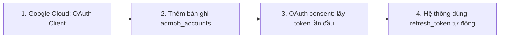

# Hướng dẫn thêm tài khoản AdMob mới vào Mediation Pro

**Tài liệu:** Quy trình đầy đủ từ cấu hình Google Cloud (OAuth 2.0) đến lấy access token và vận hành trong hệ thống.  
**Phiên bản:** 1.0  
**Cập nhật:** 2025

---

## Lưu ý quan trọng: OAuth 2.0 vs Service Account

- **AdMob API** (đọc báo cáo publisher, apps, ad units, mediation…) dùng **OAuth 2.0** với **tài khoản Google có quyền truy cập AdMob** (publisher).
- Hệ thống **không dùng Service Account key (file JSON)** cho AdMob. Thay vào đó:
  - Dùng **OAuth 2.0 Client** (Client ID + Client Secret) tạo trong Google Cloud Console.
  - Người dùng (hoặc admin) **đăng nhập Google một lần** để cấp quyền → hệ thống nhận **refresh_token** và dùng nó để lấy **access_token** tự động sau này.
- Nếu bạn nghe “service account” trong ngữ cảnh “tài khoản cho ứng dụng”, ở đây chính là **OAuth Client** (ứng dụng Web/Desktop) trong Google Cloud, **không phải** Service Account (key JSON).

---

## Tổng quan quy trình



| Bước | Nội dung |
|------|----------|
| 1 | Tạo/ chọn project Google Cloud → Bật AdMob API → Tạo OAuth 2.0 Client (Web hoặc Desktop) → Lấy **Client ID** và **Client Secret** |
| 2 | Thêm một dòng vào bảng **admob_accounts** (PostgreSQL) với Publisher ID (pub-xxx), Client ID, Client Secret, timezone, is_default, enabled |
| 3 | Gọi API Mediation Pro để lấy URL authorize → Mở URL → Đăng nhập Google → Consent → Callback lưu **access_token** và **refresh_token** vào `admob_accounts` |
| 4 | TokenRefreshJob tự refresh access_token; các job sync/API dùng token từ DB |

---

# Bước 1: Cấu hình trên Google Cloud Console

## 1.1 Tạo hoặc chọn project

1. Vào [Google Cloud Console](https://console.cloud.google.com/).
2. Chọn project có sẵn hoặc **Create Project** (ví dụ: `mediation-pro-admob`).
3. Đảm bảo billing đã bật nếu cần (AdMob API thường vẫn dùng được trong free tier cho mục đích đọc báo cáo).

## 1.2 Bật AdMob API

1. Trong project đã chọn: **APIs & Services** → **Library**.
2. Tìm **Google AdMob API**.
3. Chọn **Enable**.

## 1.3 Cấu hình OAuth consent screen (nếu chưa có)

1. **APIs & Services** → **OAuth consent screen**.
2. Chọn **External** (hoặc Internal nếu chỉ dùng trong G Workspace).
3. Điền **App name**, **User support email**, **Developer contact**.
4. Ở **Scopes**: Add scope (sau có thể thêm khi tạo OAuth Client):
   - `https://www.googleapis.com/auth/admob.readonly`
   - `https://www.googleapis.com/auth/admob.report`
5. **Save and Continue** qua các bước (Test users nếu External).

## 1.4 Tạo OAuth 2.0 Client (Credentials)

1. **APIs & Services** → **Credentials** → **Create Credentials** → **OAuth client ID**.
2. **Application type**:
   - **Web application**: dùng nếu redirect về backend (ví dụ `https://your-api.com/api/AdMobAuth/callback`).
   - **Desktop app**: cũng được; redirect URI có thể `http://localhost` hoặc URI custom.
3. Đặt tên (ví dụ: `Mediation Pro AdMob`).
4. **Authorized redirect URIs** (bắt buộc phải khớp chính xác với backend):
   - Development: `http://localhost:5000/api/AdMobAuth/callback` (hoặc port API của bạn).
   - Production: `https://your-domain.com/api/AdMobAuth/callback`.
5. **Create** → Copy **Client ID** và **Client Secret** (chỉ hiện một lần; có thể tạo lại secret nếu mất).

**Ví dụ:**

- Client ID: `123456789-xxxx.apps.googleusercontent.com`
- Client Secret: `GOCSPX-xxxxxxxxxxxx`

---

# Bước 2: Thêm tài khoản AdMob vào Mediation Pro (PostgreSQL)

Tài khoản AdMob được lưu trong bảng **admob_accounts**. Bạn cần có **Publisher ID** (dạng `pub-xxxxxxxxxxxxxxxx`) từ [AdMob Console](https://admob.google.com/) (Settings → Account information).

## 2.1 Cấu trúc bảng admob_accounts (tham khảo)

| Cột | Kiểu | Mô tả |
|-----|------|--------|
| id | integer | PK, tự tăng |
| display_name | string | Tên hiển thị (vd: "Tài khoản chính") |
| account_id | string | **Publisher ID** (pub-xxx), dùng khi gọi AdMob API |
| client_id | string | OAuth Client ID từ Google Cloud |
| client_secret | string | OAuth Client Secret |
| is_default | boolean | true nếu là tài khoản mặc định (chỉ nên 1 bản ghi true) |
| timezone_offset_hours | integer | Offset giờ so với UTC (vd: 8 = GMT+7/VN) |
| enabled | boolean | true = bật đồng bộ |
| created_at, updated_at | timestamp | Tự set |
| access_token, refresh_token, token_expires_at, token_type, token_updated_at | nullable | Để trống lúc đầu; điền sau bước 3 |

## 2.2 Thêm bản ghi bằng SQL

Kết nối PostgreSQL (database trong `ConnectionStrings:DefaultConnection` của appsettings), chạy:

```sql
INSERT INTO admob_accounts (
    display_name,
    account_id,
    client_id,
    client_secret,
    is_default,
    timezone_offset_hours,
    enabled,
    created_at,
    updated_at
) VALUES (
    'Tài khoản AdMob chính',           -- display_name
    'pub-9820030150756925',             -- account_id (Publisher ID của bạn)
    '123456789-xxxx.apps.googleusercontent.com',  -- client_id
    'GOCSPX-xxxxxxxxxxxx',              -- client_secret
    true,                               -- is_default (chỉ 1 account = true)
    8,                                  -- timezone_offset_hours (VD: 8 = GMT+8)
    true,                               -- enabled
    NOW(),
    NOW()
);
```

- Nếu đã có tài khoản mặc định (`is_default = true`), với tài khoản mới hãy để `is_default = false`.
- `timezone_offset_hours`: theo múi giờ bạn dùng cho AdMob (vd Việt Nam = 7, có thể set 8 nếu account AdMob để GMT+8).

---

# Bước 3: Lấy access_token lần đầu (OAuth consent)

Sau khi có bản ghi trong `admob_accounts`, cần chạy luồng OAuth **một lần** để lấy **refresh_token** và **access_token**; hệ thống sẽ lưu vào các cột token của chính bản ghi đó.

## 3.1 Lấy URL authorize

Gọi API Mediation Pro (backend đang chạy):

**Request:**

```http
GET /api/AdMobAuth/authorize
```

Hoặc có redirect URI tùy chỉnh:

```http
GET /api/AdMobAuth/authorize?redirectUri=https://your-api.com/api/AdMobAuth/callback
```

**Response mẫu:**

```json
{
  "authorizationUrl": "https://accounts.google.com/o/oauth2/v2/auth?client_id=..."
}
```

- **Lưu ý:** API này dùng **tài khoản mặc định** (`is_default = true`) trong `admob_accounts` để lấy `client_id` và build URL. Đảm bảo đúng account vừa thêm đang là default (hoặc sửa code để chọn theo `account_id` nếu bạn mở rộng).

## 3.2 Mở URL và đăng nhập Google

1. Copy `authorizationUrl` từ response, dán vào trình duyệt.
2. Đăng nhập bằng **tài khoản Google có quyền truy cập AdMob** (publisher).
3. Nếu được hỏi, chọn **Allow** để cấp quyền AdMob (readonly + report).
4. Trình duyệt sẽ redirect về **redirect_uri** (callback của backend), dạng:
   `https://your-api.com/api/AdMobAuth/callback?code=4/0Axxxx...&state=...`

## 3.3 Backend nhận code và lưu token

- **Nếu bạn gọi từ browser:** Chỉ cần mở URL authorize và sau khi đăng nhập, redirect sẽ về backend; backend tự đổi `code` lấy token và lưu vào `admob_accounts` (cột `access_token`, `refresh_token`, `token_expires_at`, `token_type`, `token_updated_at`).
- **Nếu bạn test local và redirect về localhost:** Đảm bảo redirect URI trong Google Cloud đã thêm đúng `http://localhost:5000/api/AdMobAuth/callback` (hoặc port tương ứng).

Response callback thành công thường dạng:

```json
{
  "message": "Token saved successfully",
  "accountId": "pub-9820030150756925",
  "expiresAt": "2025-02-07T..."
}
```

Sau bước này, token đã nằm trong bảng **admob_accounts** (theo đúng account_id).

---

# Bước 4: Kiểm tra và vận hành

## 4.1 Kiểm tra trạng thái token

```http
GET /api/AdMobAuth/status/{accountId}
```

Ví dụ: `GET /api/AdMobAuth/status/pub-9820030150756925`

Response mẫu:

```json
{
  "accountId": "pub-9820030150756925",
  "status": "Valid",
  "expiresAt": "2025-02-07T...",
  "expiresInMinutes": 58.5,
  "hasRefreshToken": true,
  "canAutoRefresh": true
}
```

## 4.2 Refresh token thủ công (nếu cần)

```http
POST /api/AdMobAuth/refresh/{accountId}
```

Ví dụ: `POST /api/AdMobAuth/refresh/pub-9820030150756925`

## 4.3 Lấy access_token (cho debug / tích hợp)

```http
GET /api/AdMobAuth/token/{accountId}
```

- Nếu token sắp hết hạn, backend sẽ tự refresh rồi trả access_token mới.

## 4.4 Tự động refresh trong hệ thống

- **TokenRefreshJob** (Hangfire) chạy định kỳ (vd mỗi 30 phút), refresh token cho mọi account enabled trong `admob_accounts`.
- Các job sync (Performance, Structure, …) và API AdMob đều lấy token từ DB (qua `AdMobAuthManager`), nên chỉ cần OAuth consent **một lần**; sau đó hệ thống dùng refresh_token để duy trì access_token.
- Job **Performance Sync** gọi `mediationReport:generate` qua **Redis Global Gate** (Doc **136**) — điều phối quota API giữa nhiều job; không liên quan OAuth/token.

---

# Tóm tắt checklist

- [ ] Google Cloud: Project đã tạo/chọn, **AdMob API** đã bật.
- [ ] OAuth consent screen đã cấu hình (External/Internal, scopes admob.readonly + admob.report).
- [ ] **OAuth 2.0 Client** (Web hoặc Desktop) đã tạo; **Redirect URI** khớp với backend (localhost + production).
- [ ] Đã copy **Client ID** và **Client Secret**.
- [ ] Đã có **Publisher ID** (pub-xxx) từ AdMob Console.
- [ ] Đã **INSERT** một dòng vào **admob_accounts** (account_id, client_id, client_secret, timezone, is_default, enabled).
- [ ] Đã gọi **GET /api/AdMobAuth/authorize**, mở URL, đăng nhập Google và consent.
- [ ] Đã kiểm tra **GET /api/AdMobAuth/status/{accountId}** → status Valid, hasRefreshToken true.
- [ ] Đã bật **TokenRefreshJob** (Hangfire) để token tự refresh.

---

# Xử lý lỗi thường gặp

| Triệu chứng | Nguyên nhân có thể | Cách xử lý |
|-------------|--------------------|------------|
| "Chưa cấu hình tài khoản AdMob trong DB" | Chưa có bản ghi `admob_accounts` hoặc không có bản ghi `is_default = true` | Kiểm tra bảng `admob_accounts`, đảm bảo có ít nhất một bản ghi với `enabled = true` và (nếu dùng mặc định) `is_default = true`. |
| "redirect_uri_mismatch" | Redirect URI trên Google Cloud không khớp URL callback thực tế | Trong Credentials → OAuth Client → Authorized redirect URIs thêm đúng URL (scheme + host + path), ví dụ `https://your-api.com/api/AdMobAuth/callback`. |
| "No token found for account" | Chưa chạy bước 3 (authorize + callback) | Gọi `/api/AdMobAuth/authorize`, mở URL, đăng nhập và consent; đảm bảo redirect về đúng backend. |
| "No refresh token available" | Lần consent không yêu cầu offline access hoặc đã thu hồi | Dùng lại `/authorize` với `prompt=consent` (backend đã set) và đăng nhập lại, chọn Allow để nhận refresh_token mới. |
| Token hết hạn liên tục | TokenRefreshJob không chạy hoặc lỗi | Kiểm tra Hangfire dashboard, job `TokenRefreshJob`; xem log backend khi refresh; kiểm tra `refresh_token` trong DB còn đúng. |
| Performance sync không chạy / API generate 409 | Redis gate đang giữ session hoặc job xếp hàng | Doc **136**, **02-TROUBLESHOOTING** — kiểm tra `admob:mediation-report:session`, restart API hoặc đợi drain queue. |

---

# Mock write mode khi test waterfall apply

Nếu cần test UI/flow apply waterfall mà **không ghi thật lên AdMob**, backend hỗ trợ toggle:

- Config key: `AdMob:UseMockMutationResponses`
- Default: `false`
- Có thể bật bằng `appsettings.json` hoặc environment variable `AdMob__UseMockMutationResponses=true`

Khi bật:

- Các API **read** của AdMob vẫn gọi thật
- Các API **mutation** như `UpdateMediationGroup`, `batchCreate adMobNetworkWaterfallAdUnits`, `batchCreate adUnitMappings`, và delete mapping/unit sẽ trả **mock response**
- Phù hợp để test flow `Apply Waterfall` hoặc `Cleanup` mà không chạm dữ liệu thật trên AdMob

Khi tắt:

- Toàn bộ call mutation quay lại client AdMob thật như bình thường

---

# Tham chiếu nhanh API AdMob Auth

| Method | Endpoint | Mô tả |
|--------|----------|--------|
| GET | `/api/AdMobAuth/authorize` | Lấy URL để user đăng nhập Google và consent (query: `redirectUri`, `state` tùy chọn). |
| GET | `/api/AdMobAuth/callback` | Callback nhận `code` từ Google; backend đổi code lấy token và lưu vào `admob_accounts`. |
| GET | `/api/AdMobAuth/token/{accountId}` | Trả về access_token (tự refresh nếu cần). |
| POST | `/api/AdMobAuth/refresh/{accountId}` | Refresh token thủ công. |
| GET | `/api/AdMobAuth/status/{accountId}` | Trạng thái token (Valid/Expired, expiresIn, hasRefreshToken, canAutoRefresh). |

---

Tài liệu này độc lập với **99-MEDIATION PRO PLATFORM.md**; khi cập nhật quy trình (vd thêm bước kiểm tra, đa tài khoản, hoặc đổi sang OAuth theo account_id), nên cập nhật lại file **101-ADMOB-ACCOUNT-SETUP.md** và version ở đầu tài liệu.
