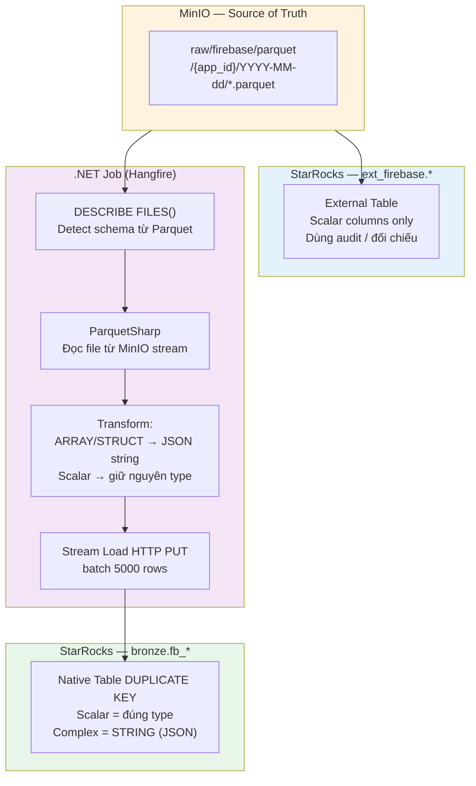
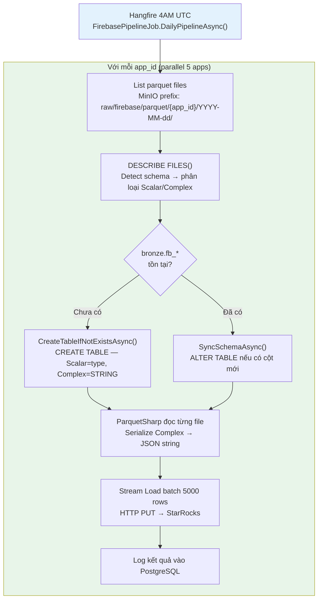

# Firebase Parquet → MinIO → StarRocks: Dynamic Schema Load

**Document Version:** 2.0
**Date:** March 2026
**Scope:** Load Parquet từ MinIO vào StarRocks Bronze layer với dynamic schema detection. Complex columns (STRUCT/ARRAY) được serialize thành JSON string bởi .NET trước khi Stream Load.

---

## 1. Tổng quan giải pháp

### Vấn đề đã gặp & kết luận

| Vấn đề | Kết quả |
|---|---|
| `INSERT INTO ... SELECT * FROM FILES()` | ❌ Lỗi cast ARRAY\<STRUCT\> → VARCHAR |
| `CAST(col AS STRING)` trong SQL | ❌ Không hỗ trợ nested STRUCT |
| `to_json(col)` trong SQL | ❌ Không có function với nested ARRAY\<STRUCT\> |
| External Table khai báo STRUCT/ARRAY | ❌ StarRocks ENGINE=file không support complex types trong DDL |
| External Table chỉ scalar columns | ✅ Dùng được — cho audit/đối chiếu |
| `SELECT * FROM FILES()` ad-hoc | ✅ Đọc được — StarRocks tự handle type khi query |
| **.NET đọc Parquet → serialize → Stream Load** | ✅ **Giải pháp production** |

### Architecture



---

## 2. Cấu hình kết nối

### MinIO

| Tham số | Giá trị |
|---|---|
| Endpoint | `172.19.8.100:9000` |
| AccessKey | `uDMO8zHkxZ6oBrMTN3Xy` |
| SecretKey | `ix8fbfrAojHAiFH33GTlHkHDZ6sqsXdcZFNCd4jY` |
| UseSSL | `false` |
| Path style | `true` — **bắt buộc** với MinIO |

### Path structure MinIO

```
amobear-datalake/raw/firebase/parquet/
└── {app_id}/
    └── YYYY-MM-dd/
        └── *.parquet
```

> **Quan trọng:** Path trong FILES() phải có `/*` hoặc `/*/*` — StarRocks không tự đệ quy subfolder.

### StarRocks

| Tham số | Giá trị |
|---|---|
| Protocol | MySQL (port 9030) |
| Stream Load | HTTP (port 8030 → redirect 8040) |
| Driver .NET | `MySqlConnector` + `Dapper` |
| Database | `bronze` |
| Table naming | `fb_{sanitized_app_id}` — lowercase, ký tự đặc biệt → `_` |

---

## 3. SQL Reference

### 3.1 Test đọc file ad-hoc

Dùng để verify file tồn tại và xem data thực tế. `SELECT *` hoạt động vì StarRocks giữ nguyên native type khi query — không INSERT.

```sql
SELECT *
FROM FILES(
    "path"                            = "s3://amobear-datalake/raw/firebase/parquet/ar_tracer_trace_drawing_ios/2026-02-01/*",
    "format"                          = "parquet",
    "aws.s3.access_key"               = "uDMO8zHkxZ6oBrMTN3Xy",
    "aws.s3.secret_key"               = "ix8fbfrAojHAiFH33GTlHkHDZ6sqsXdcZFNCd4jY",
    "aws.s3.endpoint"                 = "http://172.19.8.100:9000",
    "aws.s3.enable_ssl"               = "false",
    "aws.s3.enable_path_style_access" = "true"
)
LIMIT 5;
```

### 3.2 Detect schema từ Parquet

Output: `col_name | col_type | is_nullable` — dùng để phân loại Scalar vs Complex và generate DDL động.

```sql
DESCRIBE FILES(
    "path"                            = "s3://amobear-datalake/raw/firebase/parquet/{app_id}/{date}/*",
    "format"                          = "parquet",
    "aws.s3.access_key"               = "uDMO8zHkxZ6oBrMTN3Xy",
    "aws.s3.secret_key"               = "ix8fbfrAojHAiFH33GTlHkHDZ6sqsXdcZFNCd4jY",
    "aws.s3.endpoint"                 = "http://172.19.8.100:9000",
    "aws.s3.enable_ssl"               = "false",
    "aws.s3.enable_path_style_access" = "true"
);
```

### 3.3 Audit — đối chiếu row count

```sql
SELECT 'external' AS src, COUNT(*) AS cnt
FROM ext_firebase.ar_tracer_trace_drawing_ios
WHERE event_date = '2026-02-01'
UNION ALL
SELECT 'bronze', COUNT(*)
FROM bronze.fb_ar_tracer_trace_drawing_ios
WHERE event_date = '2026-02-01';
```

---

## 4. Schema Strategy

### 4.1 Type Mapping — Parquet → StarRocks Native Table

| Parquet / BigQuery Type | StarRocks Type | Ghi chú |
|---|---|---|
| `boolean` | `BOOLEAN` | |
| `int`, `int32` | `INT` | |
| `bigint`, `int64` | `BIGINT` | |
| `float` | `FLOAT` | |
| `double` | `DOUBLE` | |
| `decimal(p,s)` | `DECIMAL(38,9)` | Max precision cho an toàn |
| `date` | `DATE` | |
| `timestamp`, `datetime` | `DATETIME` | |
| `varchar`, `char`, `string` | `STRING` | |
| `struct<*>` | `STRING` | .NET serialize → JSON object string |
| `array<struct<*>>` | `STRING` | .NET serialize → JSON array string |
| `map<*>` | `STRING` | .NET serialize → JSON string |
| Unknown | `STRING` | Fallback an toàn |

### 4.2 Firebase Schema thực tế — phân loại cột

Schema lấy từ `DESCRIBE FILES()` trên file Parquet Firebase BQ export:

**Scalar columns** — map sang đúng type StarRocks:

| Column | StarRocks Type |
|---|---|
| `event_date` | `VARCHAR(65533)` |
| `event_timestamp` | `BIGINT` |
| `event_name` | `VARCHAR(65533)` |
| `event_previous_timestamp` | `BIGINT` |
| `event_value_in_usd` | `DOUBLE` |
| `event_bundle_sequence_id` | `BIGINT` |
| `event_server_timestamp_offset` | `BIGINT` |
| `user_id` | `VARCHAR(65533)` |
| `user_pseudo_id` | `VARCHAR(65533)` |
| `user_first_touch_timestamp` | `BIGINT` |
| `stream_id` | `VARCHAR(65533)` |
| `platform` | `VARCHAR(65533)` |
| `is_active_user` | `BOOLEAN` |
| `batch_event_index` | `BIGINT` |
| `batch_page_id` | `BIGINT` |
| `batch_ordering_id` | `BIGINT` |

**Complex columns** — tất cả map sang `STRING` (JSON):

| Column | Parquet Type gốc | Ghi chú |
|---|---|---|
| `event_params` | `ARRAY<STRUCT<key, value<...>>>` | JSON array |
| `user_properties` | `ARRAY<STRUCT<key, value<...>>>` | JSON array |
| `privacy_info` | `STRUCT<...>` | JSON object |
| `user_ltv` | `STRUCT<revenue, currency>` | JSON object |
| `device` | `STRUCT<...>` | JSON object |
| `geo` | `STRUCT<city, country, ...>` | JSON object |
| `app_info` | `STRUCT<id, version, ...>` | JSON object |
| `traffic_source` | `STRUCT<name, medium, source>` | JSON object |
| `event_dimensions` | `STRUCT<hostname>` | JSON object |
| `ecommerce` | `STRUCT<...>` | JSON object |
| `items` | `ARRAY<STRUCT<..., item_params ARRAY<STRUCT>>>` | JSON array (nested) |
| `collected_traffic_source` | `STRUCT<...>` | JSON object |
| `session_traffic_source_last_click` | `STRUCT<STRUCT<STRUCT<...>>>` | JSON object (deeply nested) |
| `publisher` | `STRUCT<ad_revenue_in_usd, ad_format, ...>` | JSON object |

### 4.3 DDL Native Bronze Table

```sql
CREATE TABLE IF NOT EXISTS bronze.fb_ar_tracer_trace_drawing_ios (
    -- Scalar columns
    event_date                        VARCHAR(65533),
    event_timestamp                   BIGINT,
    event_name                        VARCHAR(65533),
    event_previous_timestamp          BIGINT,
    event_value_in_usd                DOUBLE,
    event_bundle_sequence_id          BIGINT,
    event_server_timestamp_offset     BIGINT,
    user_id                           VARCHAR(65533),
    user_pseudo_id                    VARCHAR(65533),
    user_first_touch_timestamp        BIGINT,
    stream_id                         VARCHAR(65533),
    platform                          VARCHAR(65533),
    is_active_user                    BOOLEAN,
    batch_event_index                 BIGINT,
    batch_page_id                     BIGINT,
    batch_ordering_id                 BIGINT,

    -- Complex columns → STRING (JSON)
    event_params                      STRING,
    user_properties                   STRING,
    privacy_info                      STRING,
    user_ltv                          STRING,
    device                            STRING,
    geo                               STRING,
    app_info                          STRING,
    traffic_source                    STRING,
    event_dimensions                  STRING,
    ecommerce                         STRING,
    items                             STRING,
    collected_traffic_source          STRING,
    session_traffic_source_last_click STRING,
    publisher                         STRING
)
DUPLICATE KEY(event_date, event_name, user_pseudo_id, event_timestamp)
DISTRIBUTED BY HASH(user_pseudo_id) BUCKETS 8
PROPERTIES("replication_num" = "1");
```

> DDL này là **template chung cho tất cả apps** — schema Firebase BQ export chuẩn, không thay đổi theo app. Chỉ đổi tên table khi tạo cho app khác.

### 4.4 DDL External Table (Audit — scalar only)

StarRocks `ENGINE=file` không support STRUCT/ARRAY trong DDL. Chỉ khai báo scalar columns.

```sql
CREATE DATABASE IF NOT EXISTS ext_firebase;

CREATE EXTERNAL TABLE ext_firebase.ar_tracer_trace_drawing_ios (
    event_date                    VARCHAR(65533),
    event_timestamp               BIGINT,
    event_name                    VARCHAR(65533),
    event_previous_timestamp      BIGINT,
    event_value_in_usd            DOUBLE,
    event_bundle_sequence_id      BIGINT,
    event_server_timestamp_offset BIGINT,
    user_id                       VARCHAR(65533),
    user_pseudo_id                VARCHAR(65533),
    user_first_touch_timestamp    BIGINT,
    stream_id                     VARCHAR(65533),
    platform                      VARCHAR(65533),
    is_active_user                BOOLEAN,
    batch_event_index             BIGINT,
    batch_page_id                 BIGINT,
    batch_ordering_id             BIGINT
    -- Complex columns bỏ qua — dùng FILES() ad-hoc nếu cần xem raw
)
ENGINE = file
PROPERTIES (
    "path"                            = "s3://amobear-datalake/raw/firebase/parquet/ar_tracer_trace_drawing_ios/*/",
    "format"                          = "parquet",
    "aws.s3.access_key"               = "uDMO8zHkxZ6oBrMTN3Xy",
    "aws.s3.secret_key"               = "ix8fbfrAojHAiFH33GTlHkHDZ6sqsXdcZFNCd4jY",
    "aws.s3.endpoint"                 = "http://172.19.8.100:9000",
    "aws.s3.enable_ssl"               = "false",
    "aws.s3.enable_path_style_access" = "true"
);
```

---

## 5. Implementation — .NET Core

### 5.1 Các class cần implement

```
FirebaseSchemaAnalyzer
    ├── Nhận output từ DESCRIBE FILES()
    ├── Phân loại: Scalar vs Complex (prefix: struct/array/map)
    └── Trả về List<SchemaColumn> với StarRocksType và Category

FirebaseBronzeTableManager
    ├── CreateTableIfNotExistsAsync(tableName, columns)
    │     └── Generate DDL động: Scalar = đúng type, Complex = STRING
    └── SyncSchemaAsync(tableName, newColumns, existingColumns)
          └── ALTER TABLE thêm cột mới nếu schema drift

FirebaseParquetTransformer  (dùng ParquetSharp + MinIO SDK)
    ├── Đọc file Parquet từ MinIO theo prefix partition
    ├── Với Scalar column: giữ nguyên giá trị C# primitive
    ├── Với Complex column: JsonSerializer.Serialize(value) → string
    └── Yield IAsyncEnumerable<Dictionary<string, object?>>

FirebaseStreamLoader
    ├── Gọi FirebaseParquetTransformer để lấy rows
    ├── Batch 5000 rows → serialize thành JSON array
    └── HTTP PUT → StarRocks Stream Load API

FirebaseParquetSyncJob  (Hangfire)
    ├── RunDailyAsync() — cron 3:00 AM UTC+7, tất cả apps
    └── RunBackfillAsync(appId?, from, to) — manual trigger
```

### 5.2 Schema phân loại logic

- **Complex** = type bắt đầu bằng `struct`, `array`, hoặc `map` (case-insensitive)
- **Scalar** = tất cả còn lại → map theo bảng 4.1
- Fallback unknown type → `STRING`

### 5.3 Transform logic

- Complex column: `JsonSerializer.Serialize(rawValue)` — cho dù deeply nested, .NET serialize được toàn bộ
- Scalar null: giữ `null`
- Complex null: giữ `null` (không serialize `"null"` string)

### 5.4 Stream Load config

| Tham số | Giá trị |
|---|---|
| URL | `http://{SR_HOST}:8030/api/bronze/{tableName}/_stream_load` |
| Method | `PUT` |
| Headers | `format: json`, `strip_outer_array: true`, `ignore_json_size: true` |
| Auth | Basic auth (user:password base64) |
| Batch size | 5000 rows |
| Redirect handling | Nếu Location trả về `127.0.0.1` → thay bằng SR host thực |

> **Lưu ý redirect:** StarRocks FE (8030) redirect sang BE (8040) với địa chỉ `127.0.0.1`. Client phải detect và thay bằng IP thực của server — đây là known issue với on-premise deployment.

### 5.5 Hangfire Schedule

| Job ID | Tên | Cron | Mô tả |
|---|---|---|---|
| `firebase-pipeline-daily` | Firebase Pipeline Daily (T-1) | `0 4 * * *` (UTC) | Load dữ liệu ngày hôm qua, parallel 5 apps |
| `firebase-pipeline-weekly` | Firebase Pipeline Smart Recovery | `0 6 * * 0` (UTC) | Chủ nhật - kiểm tra và chỉ reload nếu thiếu/lệch |

**Manual trigger qua JobsTestController:**
- `POST /api/jobs/firebase-pipeline/run?date=yyyy-MM-dd&skipExport=false`
- `POST /api/jobs/firebase-pipeline/run-range?startDate=...&endDate=...`
- `POST /api/jobs/firebase-pipeline/diagnostics?date=...&appKey=...&eventName=...`

### 5.6 Smart Recovery Flow (Weekly Job)

Thay vì reload toàn bộ 7 ngày × 500 apps (hàng tỷ rows), job weekly chỉ reload khi cần:

```
Smart Recovery Flow
├── Với mỗi ngày (7 ngày gần nhất):
│   ├── Với mỗi app (parallel 5 apps):
│   │   ├── 1. Kiểm tra MinIO có files? → Nếu không: Copy từ GCS
│   │   ├── 2. Đếm rows từ Parquet (metadata, không load data)
│   │   ├── 3. Đếm rows từ StarRocks: COUNT(*) WHERE event_date = ...
│   │   ├── 4. So sánh: |parquet - starrocks| / parquet
│   │   │   ├── > 1% (threshold) → RELOAD ngày đó cho app đó
│   │   │   └── ≤ 1% → SKIP (không reload)
│   │   └── 5. Nếu RELOAD: RunPipelineFromMinioOnlyAsync()
│   └── Cuối cùng: DAU/DAV CHỈ cho apps đã reload
```

**Cấu hình:**
- `Firebase:IntegrityCheckThreshold`: 0.01 (mặc định 1%)
- `Firebase:AppParallelDegree`: 5 (số apps chạy đồng thời)

### 5.7 NuGet packages

| Package | Version | Dùng cho |
|---|---|---|
| `MySqlConnector` | 2.* | Kết nối StarRocks MySQL protocol |
| `Dapper` | 2.* | Execute DESCRIBE, CREATE TABLE |
| `ParquetSharp` | 16.* | Đọc file Parquet |
| `Minio` | 6.* | List và download object từ MinIO |
| `Hangfire.Core` | 1.* | Job scheduling |

---

## 6. Flow hoàn chỉnh



---

## 7. Query patterns trên Bronze Table

Các cột Complex đã là JSON string — dùng `get_json_string` hoặc `JSON_EXTRACT`.

```sql
-- DAU theo ngày
SELECT
    event_date,
    COUNT(DISTINCT user_pseudo_id) AS dau,
    COUNT(*)                       AS total_events
FROM bronze.fb_ar_tracer_trace_drawing_ios
GROUP BY event_date
ORDER BY event_date DESC;

-- Ad revenue từ publisher STRUCT
-- publisher = {"ad_revenue_in_usd":0.001,"ad_format":"Interstitial","ad_source_name":"AdMob","ad_unit_id":"..."}
SELECT
    event_date,
    get_json_string(publisher, '$.ad_source_name') AS ad_source,
    get_json_string(publisher, '$.ad_format')       AS ad_format,
    SUM(CAST(get_json_string(publisher, '$.ad_revenue_in_usd') AS DOUBLE)) AS revenue_usd
FROM bronze.fb_ar_tracer_trace_drawing_ios
WHERE event_name = 'ad_impression'
GROUP BY 1, 2, 3
ORDER BY 1 DESC, 4 DESC;

-- Geo breakdown
SELECT
    get_json_string(geo, '$.country') AS country,
    COUNT(DISTINCT user_pseudo_id)    AS users
FROM bronze.fb_ar_tracer_trace_drawing_ios
WHERE event_date = '2026-02-01'
GROUP BY 1
ORDER BY 2 DESC;

-- App version từ app_info STRUCT
SELECT
    get_json_string(app_info, '$.version') AS app_version,
    COUNT(DISTINCT user_pseudo_id)         AS dau
FROM bronze.fb_ar_tracer_trace_drawing_ios
WHERE event_date = '2026-02-01'
GROUP BY 1
ORDER BY 2 DESC;

-- event_params: lấy giá trị param cụ thể (JSON array)
-- event_params = [{"key":"firebase_screen","value":{"string_value":"HomeScreen","int_value":null,...}}, ...]
SELECT
    event_date,
    event_name,
    user_pseudo_id,
    get_json_string(event_params, '$[0].key')                AS first_param_key,
    get_json_string(event_params, '$[0].value.string_value') AS first_param_str
FROM bronze.fb_ar_tracer_trace_drawing_ios
WHERE event_date = '2026-02-01'
  AND event_name = 'ad_impression'
LIMIT 100;
```

---

## 8. Các lỗi đã gặp & cách xử lý

| Lỗi | Nguyên nhân | Fix |
|---|---|---|
| `No file exists for FileTable` | Path trỏ vào folder, không có `.parquet` trực tiếp | Thêm `/*` hoặc `/*/*` cuối path |
| `No files found matching pattern` | Data chưa sync vào MinIO | Verify MinIO path |
| `Invalid type cast ARRAY<STRUCT> to varchar` | `INSERT INTO ... SELECT *` — StarRocks không auto cast | Dùng .NET ParquetSharp serialize + Stream Load |
| `No matching function to_json(array<struct>)` | StarRocks version không support | Dùng .NET serialize thay SQL function |
| `ENGINE=file` DDL lỗi STRUCT/ARRAY type | StarRocks External Table không support complex types | Chỉ khai báo scalar columns trong External Table DDL |
| `get_json_string` trả NULL | JSON path sai hoặc data là null | Verify JSON structure thực tế trước khi query |
| Stream Load redirect 127.0.0.1 | FE redirect sang BE với internal IP | Detect và replace 127.0.0.1 → SR host thực trong HttpClient |
| `Right expr should be value` | Parameterized `@param` trong DELETE trên StarRocks | Dùng literal string trong WHERE — không dùng parameterized DELETE |
| Schema drift — cột mới trong Parquet | Firebase/BQ thêm field | `SyncSchemaAsync()` tự xử lý ALTER TABLE |
| `Error: The row is out of partition ranges` | Data date nằm ngoài dynamic partition range | Tự động gọi `EnsurePartitionExistsAsync()` trước insert |
| `Fail, too many filtered rows` | Stream Load filter >0% rows (default reject all) | Cấu hình `StarRocks:MaxFilterRatio` = 0.01 (1%) |
| Dynamic partition conflict khi ADD PARTITION | Phải disable dynamic partition trước khi manual add | Code tự disable → add → re-enable trong finally block |

---

## 9. Dynamic Partitioning & Partition Management

### 9.1 Cấu hình partition khi tạo bảng

```sql
PROPERTIES(
    "dynamic_partition.enable" = "true",
    "dynamic_partition.time_unit" = "MONTH",
    "dynamic_partition.start" = "-36",           -- Giữ 36 tháng = 3 năm lịch sử
    "dynamic_partition.end" = "3",               -- Tạo trước 3 tháng tương lai
    "dynamic_partition.prefix" = "p",
    "dynamic_partition.buckets" = "16",
    "dynamic_partition.history_partition_num" = "36"  -- Tạo partition cho data lịch sử
);
```

### 9.2 Tự động đảm bảo partition tồn tại

Trước mỗi thao tác INSERT/DELETE cho một ngày cụ thể, pipeline gọi `EnsurePartitionExistsAsync(appId, date)`:

```csharp
// 1. Đảm bảo bảng tồn tại
await EnsureTableForAppAsync(appId);

// 2. Kiểm tra partition đã có chưa
// 3. Nếu chưa có:
//    a. Disable dynamic_partition.enable
//    b. ADD PARTITION IF NOT EXISTS
//    c. Re-enable dynamic_partition.enable (trong finally)
```

Điều này giải quyết lỗi "out of partition ranges" khi data date nằm ngoài range mà dynamic partitioning chưa tạo kịp.

---

## 11. Checklist triển khai

```
□ Verify StarRocks version: SELECT version()
□ Test network từ SR BE → MinIO: curl http://172.19.8.100:9000/minio/health/live
□ Chạy DESCRIBE FILES() với 1 app, 1 ngày → verify schema output
□ Chạy SELECT * FROM FILES() LIMIT 5 → verify data đọc được
□ Test SanitizeTableName() với app_id có dấu chấm, gạch ngang
□ Test CreateTableIfNotExistsAsync() với app mới
□ Test SyncSchemaAsync() với schema có cột mới
□ Test ParquetSharp đọc 1 file: verify Complex columns ra JSON string hợp lệ
□ Test Stream Load 1 batch nhỏ (100 rows) → verify data vào bảng
□ Test get_json_string(publisher, '$.ad_revenue_in_usd') sau khi load
□ Tạo External Table scalar-only → verify audit query row count khớp
□ Test manual API: /api/jobs/firebase-pipeline/run?date=2026-03-01
□ Verify Hangfire recurring jobs đã đăng ký: firebase-pipeline-daily, firebase-pipeline-weekly
□ Monitor Stream Load time, tune batch size nếu cần
□ Kiểm tra EnsurePartitionExistsAsync() với data cũ (ngoài dynamic range)
□ Test Smart Recovery: so sánh row count MinIO vs StarRocks
```

---

## 12. Cấu hình appsettings.json

BigQuery export: mặc định thử bảng streaming (`events_intraday_YYYYMMDD`) trước; nếu bảng không tồn tại thì tự động fallback sang daily (`events_YYYYMMDD`). Không cần cấu hình theo từng app.

```json
{
  "Firebase": {
    "UseStarRocksFilesLoad": false,           // false = .NET parse mode (recommended)
    "AppParallelDegree": 5,                   // Số apps chạy đồng thời
    "IntegrityCheckThreshold": 0.01           // 1% tolerance cho smart recovery
  },
  "StarRocks": {
    "MaxFilterRatio": 0.01,                   // Allow 1% filtered rows trong Stream Load
    "StreamLoad": {
      "BatchSize": 5000,
      "TimeoutMs": 120000
    }
  }
}
```
