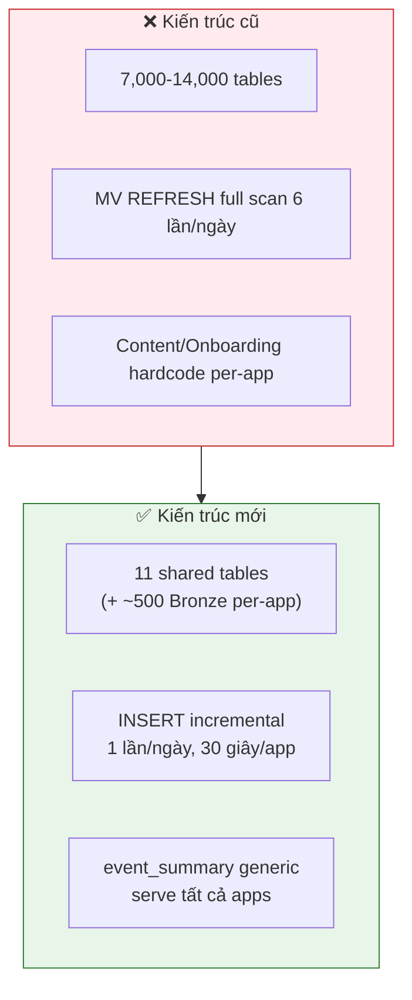
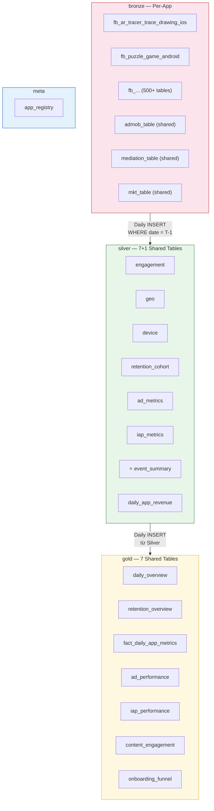
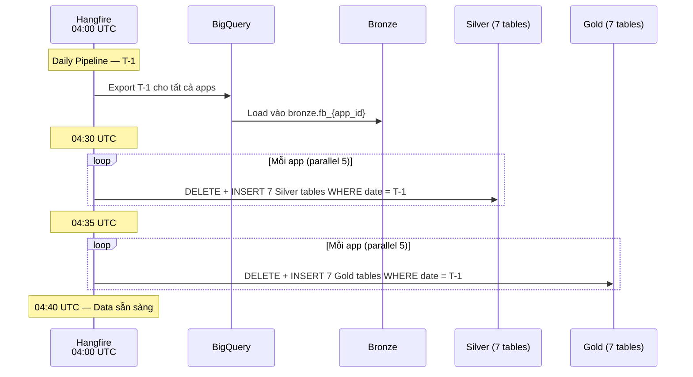
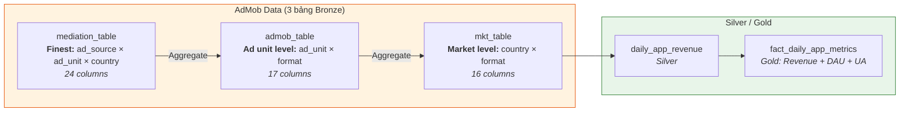

# Amobear Analytics — Hệ thống tổng quát
## Firebase + AdMob → StarRocks: Bronze / Silver / Gold cho 500+ Apps

> **Stack:** StarRocks Standalone — 128 CPU / 512GB RAM / 8TB SSD
> **Quy mô:** 500-1000 apps, 2-3M rows/ngày/app
> **Data Sources:** Firebase/GA4, AdMob, Mediation Networks, Marketing/UA
> **Kiến trúc:** Multi-tenant Bronze/Silver/Gold — 7 Silver + 7 Gold + 1 Meta = 15 shared tables
> **Pipeline:** Incremental daily INSERT (T-1), không dùng MV REFRESH

---

## Mục lục

1. [Vấn đề & Quyết định thiết kế](#1-vấn-đề--quyết-định-thiết-kế)
2. [Kiến trúc tổng thể](#2-kiến-trúc-tổng-thể)
3. [Bronze Layer — Per-App Tables](#3-bronze-layer--per-app-tables)
4. [Data Sources — AdMob / Mediation / Marketing](#4-data-sources--admob--mediation--marketing)
5. [Silver Layer — 7 Shared Tables](#5-silver-layer--7-shared-tables)
6. [Gold Layer — 7 Shared Tables](#6-gold-layer--7-shared-tables)
7. [Daily INSERT Pipeline — Silver](#7-daily-insert-pipeline--silver)
8. [Daily INSERT Pipeline — Gold](#8-daily-insert-pipeline--gold)
9. [Backfill — Fill dữ liệu lịch sử](#9-backfill--fill-dữ-liệu-lịch-sử)
10. [Monitoring & Verification](#10-monitoring--verification)
11. [Hướng dẫn thêm app mới](#11-hướng-dẫn-thêm-app-mới)
12. [Best Practices & Guardrails](#12-best-practices--guardrails)

---

## 1. Vấn đề & Quyết định thiết kế

### 1.1 Vấn đề #1 — Hàng ngàn tables

Nếu mỗi app tạo riêng Silver/Gold tables:

```
500 apps × 14 tables = 7,000 tables
1000 apps × 14 tables = 14,000 tables
→ Metadata overhead, schema drift, không thể query cross-app
```

**Giải pháp:** Multi-tenant tables với cột `app_id`. Tổng **15 shared tables** thay vì 14,000.

### 1.2 Vấn đề #2 — MV REFRESH full scan

```
MATERIALIZED VIEW REFRESH ASYNC EVERY 4 HOUR
→ Full scan Bronze mỗi 4h (500M+ rows)
→ 6 lần/ngày × 10-30 phút = CPU/IO spike liên tục
→ Chỉ có 2-3M rows mới mỗi ngày (T-1 data)
```

**Giải pháp:** TABLE thường + incremental `DELETE → INSERT WHERE event_date = T-1`. Scan đúng 1 partition, ~30 giây/app.

### 1.3 Vấn đề #3 — Bảng app-specific không tổng quát

Bảng `silver.content` (draw_with_lesson, magic_photo...) và `silver.onboarding` (intro_category_choose...) chỉ phù hợp 1 app, không dùng được cho 499 apps còn lại.

**Giải pháp:** Thay bằng `silver.event_summary` — 1 bảng generic 5 cột, tự động có data cho mọi event của mọi app, không cần biết trước event catalog.

### 1.4 Tổng hợp quyết định



| | Cũ | Mới |
|---|---|---|
| **Shared tables** | 7,000-14,000 | **15** |
| **Daily job** | Full scan 500M+ rows, 6 lần/ngày | **1 partition 2-3M rows, 1 lần/ngày** |
| **Thêm app mới** | Kiểm tra schema, có thể sửa DDL | **Zero changes** |
| **Cross-app query** | UNION ALL 500 tables | **WHERE app_id IN (...)** |

---

## 2. Kiến trúc tổng thể

### 2.1 Database & Schema Layout



### 2.2 Pipeline Flow



### 2.3 Sizing

| Table | Rows/app/ngày | 500 apps/ngày | 500 apps/năm |
|-------|--------------|---------------|--------------|
| `engagement` | 1 | 500 | 182K |
| `geo` | ~100 | 50K | 18M |
| `device` | ~200 | 100K | 36M |
| `retention_cohort` | ~30 | 15K | 5.5M |
| `ad_metrics` | ~500 | 250K | 91M |
| `iap_metrics` | ~100 | 50K | 18M |
| `event_summary` | ~150 | 75K | 27M |
| `daily_app_revenue` | ~100 | 50K | 18M |
| **Tổng Silver** | | **~590K/ngày** | **~215M/năm** |
| **Bronze (so sánh)** | 2-3M | **~1.25B/ngày** | **~456B/năm** |

> Silver chỉ bằng 0.05% Bronze — rất nhỏ, query rất nhanh.

---

## 3. Bronze Layer — Per-App Tables

> Giữ nguyên kiến trúc per-app vì Bronze rất lớn và query pattern khác nhau.

### 3.1 DDL Bronze (production)

```sql
CREATE TABLE bronze.fb_<app_id> (
    event_date            DATE          NOT NULL  COMMENT 'Partition key',
    event_name            VARCHAR(255)  NOT NULL DEFAULT '',
    user_pseudo_id        VARCHAR(255)  NOT NULL DEFAULT '',
    event_timestamp       BIGINT(20)    NOT NULL DEFAULT '',
    install_date          DATE          NULL,
    retention_day         INT(11)       NULL,
    app_version           VARCHAR(100)  NULL,
    device_json           VARCHAR(65533) NULL,
    geo_json              VARCHAR(65533) NULL,
    traffic_source_json   VARCHAR(65533) NULL,
    event_params_json     VARCHAR(65533) NULL,
    user_properties_json  VARCHAR(65533) NULL,
    raw_event_json        VARCHAR(65533) NULL,
    remark                VARCHAR(50)   NOT NULL DEFAULT 'final'
)
ENGINE=OLAP
DUPLICATE KEY(event_date, event_name, user_pseudo_id, event_timestamp)
PARTITION BY RANGE(event_date) (...)
DISTRIBUTED BY HASH(user_pseudo_id) BUCKETS 16
PROPERTIES(
    "compression" = "ZSTD",
    "dynamic_partition.enable" = "true",
    "dynamic_partition.time_unit" = "MONTH",
    "dynamic_partition.start" = "-12",
    "dynamic_partition.end" = "2",
    "dynamic_partition.prefix" = "p",
    "dynamic_partition.buckets" = "16",
    "storage_medium" = "SSD",
    "replication_num" = "1"
);
```

### 3.2 JSON Paths chuẩn (dùng cho tất cả apps)

```sql
-- Device
get_json_string(device_json, '$.mobile_brand_name')
get_json_string(device_json, '$.mobile_model_name')
get_json_string(device_json, '$.operating_system_version')
get_json_string(device_json, '$.language')

-- Geo
get_json_string(geo_json, '$.country')

-- Event Params
get_json_string(event_params_json, '$.ga_session_id')
get_json_string(event_params_json, '$.engagement_time_msec.int_value')
get_json_string(event_params_json, '$.engagement_time_msec')

-- Revenue
get_json_string(raw_event_json, '$.event_value_in_usd')

-- Attribution
get_json_string(user_properties_json, '$.af_status')
```

---

## 4. Data Sources — AdMob / Mediation / Marketing

### 4.1 Sơ đồ quan hệ



### 4.2 Khi nào dùng bảng nào?

| Câu hỏi | Bảng | Layer |
|----------|------|-------|
| Tổng revenue, ARPDAU, ROI hôm qua? | `gold.fact_daily_app_metrics` | Gold |
| Revenue by country? | `silver.daily_app_revenue` | Silver |
| Ad unit nào revenue cao nhất? | `bronze.admob_table` | Bronze |
| Ad source nào eCPM tốt nhất? | `bronze.mediation_table` | Bronze |
| Mediation group nào fill rate kém? | `bronze.mediation_table` | Bronze |
| eCPM theo app version? | `bronze.mkt_table` | Bronze |

### 4.3 Schema tóm tắt

**bronze.admob_table:** `hash_key(PK)`, `date`, `ad_unit_name`, `ad_unit_id`, `app_id`, `format`, `app_version_name`, `app_name`, `platform`, `ad_requests`, `clicks`, `estimated_earnings`, `impressions`, `matched_requests`, `match_rate`, `show_rate`, `observed_ecpm`

**bronze.mediation_table:** Thêm `country`, `ad_source_name/id`, `ad_source_instance_name/id`, `mediation_group_name/id`, `impression_ctr` so với admob_table

**bronze.mkt_table:** Bỏ `ad_unit_*` và `ad_source_*`, thêm `country`, `app_version_name`

**silver.daily_app_revenue:** `date`, `account_id`, `app_id`, `platform`, `country`, `total_revenue`, `total_impressions`, `total_ad_requests`, `total_matched_requests`, `ecpm`, `fill_rate`, `_updated_at`

**gold.fact_daily_app_metrics:** `date`, `account_id`, `app_id`, `platform`, `total_revenue`, `ad_unit_revenue`, `waterfall_revenue`, `total_impressions`, `total_ad_requests`, `total_matched_requests`, `ecpm`, `fill_rate`, **`dau`**, **`dav`**, **`arpdau`**, **`ua_cost`**, **`roi`**, `_updated_at`

---

## 5. Silver Layer — 7 Shared Tables

> Tất cả tables đều có `app_id` column + `PARTITION BY RANGE(event_date)` + dynamic partition.
> PROPERTIES chung cho tất cả Silver/Gold tables (bỏ qua ở DDL dưới đây):

```sql
-- PROPERTIES chung (áp dụng cho tất cả Silver/Gold tables)
PARTITION BY RANGE(event_date) ()
DISTRIBUTED BY HASH(app_id) BUCKETS 4
PROPERTIES(
    "replication_num" = "1",
    "dynamic_partition.enable" = "true",
    "dynamic_partition.time_unit" = "MONTH",
    "dynamic_partition.start" = "-12",
    "dynamic_partition.end" = "2",
    "dynamic_partition.prefix" = "p",
    "dynamic_partition.buckets" = "4",
    "compression" = "ZSTD"
);
```

### 5.1 silver.engagement

```sql
CREATE TABLE IF NOT EXISTS silver.engagement (
    event_date            DATE          NOT NULL,
    app_id                VARCHAR(100)  NOT NULL,
    dau                   INT           COMMENT 'session_start ∪ user_engagement users',
    new_users             INT           COMMENT 'first_open users',
    dav                   INT           COMMENT 'ad_impression* users',
    sessions              INT           COMMENT 'Unique user × ga_session_id',
    total_events          BIGINT        COMMENT 'COUNT(*)',
    ad_impressions        BIGINT,
    ad_clicks             BIGINT,
    total_engagement_msec BIGINT        COMMENT 'SUM(engagement_time_msec)',
    paying_users          INT           COMMENT 'in_app_purchase users'
)
DUPLICATE KEY(event_date, app_id)
...;  -- PROPERTIES chung
```

### 5.2 silver.geo

```sql
CREATE TABLE IF NOT EXISTS silver.geo (
    event_date        DATE          NOT NULL,
    app_id            VARCHAR(100)  NOT NULL,
    country           VARCHAR(100),
    dau               INT,
    new_users         INT,
    dav               INT,
    ad_impressions    BIGINT,
    ad_clicks         BIGINT,
    paying_users      INT,
    iap_revenue_usd   DOUBLE
)
DUPLICATE KEY(event_date, app_id, country)
...;
```

### 5.3 silver.device

```sql
CREATE TABLE IF NOT EXISTS silver.device (
    event_date        DATE          NOT NULL,
    app_id            VARCHAR(100)  NOT NULL,
    brand             VARCHAR(100),
    model             VARCHAR(255),
    os_version        VARCHAR(100),
    device_language   VARCHAR(50),
    dau               INT,
    total_events      BIGINT,
    paying_users      INT,
    iap_revenue_usd   DOUBLE
)
DUPLICATE KEY(event_date, app_id, brand, model)
...;
```

### 5.4 silver.retention_cohort

```sql
CREATE TABLE IF NOT EXISTS silver.retention_cohort (
    event_date            DATE          NOT NULL,
    app_id                VARCHAR(100)  NOT NULL,
    install_date          DATE          NOT NULL,
    retention_day         INT           NOT NULL,
    active_users          INT,
    total_engagement_msec BIGINT,
    ad_impressions        BIGINT,
    ad_users              INT,
    iap_revenue_usd       DOUBLE
)
DUPLICATE KEY(event_date, app_id, install_date, retention_day)
...;
```

### 5.5 silver.ad_metrics

```sql
CREATE TABLE IF NOT EXISTS silver.ad_metrics (
    event_date        DATE          NOT NULL,
    app_id            VARCHAR(100)  NOT NULL,
    ad_format         VARCHAR(50),
    ad_placement      VARCHAR(100),
    country           VARCHAR(100),
    retention_day     INT,
    impressions       BIGINT,
    clicks            BIGINT,
    completes         BIGINT,
    rewards           BIGINT,
    requests          BIGINT,
    load_fails        BIGINT,
    ad_users          INT,
    active_users      INT,
    ad_revenue        DOUBLE
)
DUPLICATE KEY(event_date, app_id, ad_format, ad_placement)
...;
```

### 5.6 silver.iap_metrics

```sql
CREATE TABLE IF NOT EXISTS silver.iap_metrics (
    event_date        DATE          NOT NULL,
    app_id            VARCHAR(100)  NOT NULL,
    country           VARCHAR(100),
    device_model      VARCHAR(255),
    retention_day     INT,
    iap_shows         BIGINT,
    iap_clicks        BIGINT,
    iap_open_views    BIGINT,
    iap_open_pays     BIGINT,
    iap_purchases     BIGINT,
    iap_fails         BIGINT,
    iap_closes        BIGINT,
    iap_users         INT,
    active_users      INT,
    iap_revenue_usd   DOUBLE,
    trial_starts      INT,
    trial_expires     INT,
    trial_cancels     INT,
    sub_cancels       INT,
    sub_expires       INT,
    sub_upgrades      INT,
    refunds           INT
)
DUPLICATE KEY(event_date, app_id, country, device_model)
...;
```

### 5.7 ⭐ silver.event_summary

```sql
CREATE TABLE IF NOT EXISTS silver.event_summary (
    event_date        DATE          NOT NULL,
    app_id            VARCHAR(100)  NOT NULL,
    event_name        VARCHAR(255)  NOT NULL,
    event_count       BIGINT        COMMENT 'COUNT(*)',
    unique_users      INT           COMMENT 'COUNT(DISTINCT user_pseudo_id)'
)
DUPLICATE KEY(event_date, app_id, event_name)
...;
```

**Đặc điểm:** 5 cột, tự động có data cho mọi event, 75K rows/ngày cho 500 apps. Thay thế hoàn toàn các bảng app-specific (content, onboarding). Team DA viết SQL pivot theo event catalog riêng của từng app.

### 5.8 Meta: app_registry

```sql
CREATE TABLE IF NOT EXISTS meta.app_registry (
    app_id            VARCHAR(100)  NOT NULL,
    app_name          VARCHAR(255),
    bundle_id         VARCHAR(255),
    platform          VARCHAR(20),
    bronze_table      VARCHAR(255)  NOT NULL,
    is_active         BOOLEAN       DEFAULT TRUE,
    created_at        DATETIME      DEFAULT CURRENT_TIMESTAMP
)
DUPLICATE KEY(app_id)
DISTRIBUTED BY HASH(app_id) BUCKETS 1
PROPERTIES("replication_num" = "1");
```

---

## 6. Gold Layer — 7 Shared Tables

### 6.1 gold.daily_overview

```sql
CREATE TABLE IF NOT EXISTS gold.daily_overview (
    event_date        DATE          NOT NULL,
    app_id            VARCHAR(100)  NOT NULL,
    dau               INT,
    new_users         INT,
    dav               INT,
    sessions          INT,
    avg_sessions      DOUBLE        COMMENT 'sessions / dau',
    avg_dur_min       DOUBLE        COMMENT 'engagement_msec / dau / 60000',
    ad_impressions    BIGINT,
    ad_clicks         BIGINT,
    paying_users      INT,
    iap_rev           DOUBLE,
    iaa_rev           DOUBLE,
    total_rev         DOUBLE,
    arpdau            DOUBLE,
    ad_penetration    DOUBLE        COMMENT 'dav / dau × 100'
)
DUPLICATE KEY(event_date, app_id)
...;
```

### 6.2 gold.retention_overview

```sql
CREATE TABLE IF NOT EXISTS gold.retention_overview (
    event_date        DATE          NOT NULL,
    app_id            VARCHAR(100)  NOT NULL,
    install_date      DATE          NOT NULL,
    retention_day     INT           NOT NULL,
    total_new_users   INT,
    active_users      INT,
    retention_rate    DOUBLE,
    avg_play_time_min DOUBLE,
    ad_impressions    BIGINT,
    impdau            DOUBLE,
    iap_rev_cum       DOUBLE,
    total_ltv         DOUBLE
)
DUPLICATE KEY(event_date, app_id, install_date, retention_day)
...;
```

### 6.3 gold.fact_daily_app_metrics (từ AdMob pipeline — đã tồn tại)

> Schema giữ nguyên: `date`, `account_id`, `app_id`, `platform`, `total_revenue`, `ad_unit_revenue`, `waterfall_revenue`, `total_impressions`, `total_ad_requests`, `total_matched_requests`, `ecpm`, `fill_rate`, `dau`, `dav`, `arpdau`, `ua_cost`, `roi`, `_updated_at`

### 6.4 gold.ad_performance

Pre-calculated ad metrics — Superset query trực tiếp, không cần ROUND/NULLIF.

```sql
CREATE TABLE IF NOT EXISTS gold.ad_performance (
    event_date        DATE          NOT NULL,
    app_id            VARCHAR(100)  NOT NULL,
    ad_format         VARCHAR(50),
    ad_placement      VARCHAR(100),
    country           VARCHAR(100),
    retention_day     INT,
    -- Raw metrics
    impressions       BIGINT,
    clicks            BIGINT,
    completes         BIGINT,
    rewards           BIGINT,
    requests          BIGINT,
    load_fails        BIGINT,
    ad_users          INT,
    active_users      INT,
    ad_revenue        DOUBLE,
    -- Pre-calculated (Superset SELECT trực tiếp)
    ecpm              DOUBLE        COMMENT 'ad_revenue / impressions × 1000',
    ctr               DOUBLE        COMMENT 'clicks / impressions × 100',
    fill_rate         DOUBLE        COMMENT '(requests - load_fails) / requests × 100',
    arpu              DOUBLE        COMMENT 'ad_revenue / active_users',
    ad_user_percent   DOUBLE        COMMENT 'ad_users / active_users × 100',
    imp_per_ad_user   DOUBLE        COMMENT 'impressions / ad_users',
    video_complete_rate DOUBLE      COMMENT 'completes / impressions × 100',
    reward_rate       DOUBLE        COMMENT 'rewards / impressions × 100'
)
DUPLICATE KEY(event_date, app_id, ad_format, ad_placement)
...;
```

### 6.5 gold.iap_performance

Pre-calculated IAP funnel conversion rates + subscription lifecycle.

```sql
CREATE TABLE IF NOT EXISTS gold.iap_performance (
    event_date        DATE          NOT NULL,
    app_id            VARCHAR(100)  NOT NULL,
    country           VARCHAR(100),
    device_model      VARCHAR(255),
    retention_day     INT,
    -- Funnel raw
    iap_shows         BIGINT,
    iap_clicks        BIGINT,
    iap_open_views    BIGINT,
    iap_open_pays     BIGINT,
    iap_purchases     BIGINT,
    iap_fails         BIGINT,
    iap_closes        BIGINT,
    iap_users         INT,
    active_users      INT,
    iap_revenue_usd   DOUBLE,
    -- Subscription
    trial_starts      INT,
    trial_expires     INT,
    trial_cancels     INT,
    sub_cancels       INT,
    sub_expires       INT,
    sub_upgrades      INT,
    refunds           INT,
    -- Pre-calculated
    pay_rate              DOUBLE    COMMENT 'iap_users / active_users × 100',
    show_to_click_rate    DOUBLE    COMMENT 'iap_clicks / iap_shows × 100',
    show_to_purchase_rate DOUBLE    COMMENT 'iap_purchases / iap_shows × 100',
    click_to_purchase_rate DOUBLE   COMMENT 'iap_purchases / iap_clicks × 100',
    trial_to_sub_rate     DOUBLE    COMMENT 'sub_upgrades / trial_starts × 100',
    refund_rate           DOUBLE    COMMENT 'refunds / iap_purchases × 100',
    arppu                 DOUBLE    COMMENT 'iap_revenue / iap_users'
)
DUPLICATE KEY(event_date, app_id, country, device_model)
...;
```

### 6.6 gold.content_engagement

Per-app content metrics từ `event_summary`. DDL generic với **10 slots** (slot1..slot10) — mỗi app map events khác nhau vào các slots qua INSERT query.

> **Thiết kế:** DDL dùng tên slot generic. Ý nghĩa mỗi slot được define trong INSERT query và trong `meta.app_content_config`. Superset dùng alias trong SQL query hoặc trong dataset config.

```sql
CREATE TABLE IF NOT EXISTS gold.content_engagement (
    event_date        DATE          NOT NULL,
    app_id            VARCHAR(100)  NOT NULL,
    country           VARCHAR(100),
    dau               INT,
    -- Slot-based metrics (mỗi app map khác nhau)
    slot1_name        VARCHAR(100)  COMMENT 'Tên metric slot 1, vd: lesson_starts',
    slot1_users       INT,
    slot1_count       BIGINT,
    slot2_name        VARCHAR(100)  COMMENT 'Tên metric slot 2, vd: lesson_completions',
    slot2_users       INT,
    slot2_count       BIGINT,
    slot3_name        VARCHAR(100),
    slot3_users       INT,
    slot3_count       BIGINT,
    slot4_name        VARCHAR(100),
    slot4_users       INT,
    slot4_count       BIGINT,
    slot5_name        VARCHAR(100),
    slot5_users       INT,
    slot5_count       BIGINT,
    slot6_name        VARCHAR(100),
    slot6_users       INT,
    slot6_count       BIGINT,
    slot7_name        VARCHAR(100),
    slot7_users       INT,
    slot7_count       BIGINT,
    slot8_name        VARCHAR(100),
    slot8_users       INT,
    slot8_count       BIGINT,
    slot9_name        VARCHAR(100),
    slot9_users       INT,
    slot9_count       BIGINT,
    slot10_name       VARCHAR(100),
    slot10_users      INT,
    slot10_count      BIGINT,
    -- Pre-calculated rates
    rate1             DOUBLE        COMMENT 'slot1_users / dau × 100 (vd: drawing_adoption_rate)',
    rate2             DOUBLE        COMMENT 'slot2_count / slot1_count × 100 (vd: completion_rate)',
    rate3             DOUBLE        COMMENT 'App-defined rate 3'
)
DUPLICATE KEY(event_date, app_id, country)
...;
```

### 6.7 gold.onboarding_funnel

Tương tự content_engagement — **8 step slots** cho funnel bất kỳ, mỗi app map events riêng.

```sql
CREATE TABLE IF NOT EXISTS gold.onboarding_funnel (
    event_date        DATE          NOT NULL,
    app_id            VARCHAR(100)  NOT NULL,
    country           VARCHAR(100),
    -- Funnel steps (mỗi app map events khác nhau)
    step1_name        VARCHAR(100)  COMMENT 'vd: first_open',
    step1_users       INT,
    step2_name        VARCHAR(100)  COMMENT 'vd: language_choose',
    step2_users       INT,
    step3_name        VARCHAR(100),
    step3_users       INT,
    step4_name        VARCHAR(100),
    step4_users       INT,
    step5_name        VARCHAR(100),
    step5_users       INT,
    step6_name        VARCHAR(100),
    step6_users       INT,
    step7_name        VARCHAR(100),
    step7_users       INT,
    step8_name        VARCHAR(100),
    step8_users       INT,
    -- Pre-calculated rates
    completion_rate   DOUBLE        COMMENT 'step8_users / step1_users × 100',
    step1_to_2_drop   DOUBLE        COMMENT '(1 - step2/step1) × 100',
    step2_to_3_drop   DOUBLE        COMMENT '(1 - step3/step2) × 100',
    step3_to_4_drop   DOUBLE,
    step4_to_5_drop   DOUBLE,
    step5_to_6_drop   DOUBLE,
    step6_to_7_drop   DOUBLE,
    step7_to_8_drop   DOUBLE
)
DUPLICATE KEY(event_date, app_id, country)
...;
```

---

## 7. Daily INSERT Pipeline — Silver

> **Pattern:** DELETE + INSERT, chạy 1 lần/ngày sau khi Bronze pipeline xong.
> **Params:** `${app_id}`, `${target_date}`, `${bronze_table}`

### 7.1 silver.engagement

```sql
DELETE FROM silver.engagement
WHERE app_id = '${app_id}' AND event_date = '${target_date}';

INSERT INTO silver.engagement
SELECT
    event_date, '${app_id}',
    COUNT(DISTINCT CASE WHEN event_name IN ('session_start','user_engagement')
        THEN user_pseudo_id END),
    COUNT(DISTINCT CASE WHEN event_name = 'first_open' THEN user_pseudo_id END),
    COUNT(DISTINCT CASE WHEN event_name LIKE 'ad_impression%' THEN user_pseudo_id END),
    COUNT(DISTINCT CASE WHEN event_name = 'session_start'
        THEN CONCAT(user_pseudo_id,'_',COALESCE(
            get_json_string(event_params_json,'$.ga_session_id'),'')) END),
    COUNT(*),
    SUM(CASE WHEN event_name LIKE 'ad_impression%' THEN 1 ELSE 0 END),
    SUM(CASE WHEN event_name = 'ad_clicked' THEN 1 ELSE 0 END),
    SUM(CASE WHEN event_name = 'user_engagement'
        THEN CAST(COALESCE(
            get_json_string(event_params_json,'$.engagement_time_msec.int_value'),
            get_json_string(event_params_json,'$.engagement_time_msec'),'0') AS BIGINT)
        ELSE 0 END),
    COUNT(DISTINCT CASE WHEN event_name = 'in_app_purchase' THEN user_pseudo_id END)
FROM ${bronze_table}
WHERE event_date = '${target_date}'
GROUP BY event_date;
```

### 7.2 silver.geo

```sql
DELETE FROM silver.geo
WHERE app_id = '${app_id}' AND event_date = '${target_date}';

INSERT INTO silver.geo
SELECT
    event_date, '${app_id}',
    get_json_string(geo_json, '$.country'),
    COUNT(DISTINCT CASE WHEN event_name IN ('session_start','user_engagement')
        THEN user_pseudo_id END),
    COUNT(DISTINCT CASE WHEN event_name = 'first_open' THEN user_pseudo_id END),
    COUNT(DISTINCT CASE WHEN event_name LIKE 'ad_impression%' THEN user_pseudo_id END),
    SUM(CASE WHEN event_name LIKE 'ad_impression%' THEN 1 ELSE 0 END),
    SUM(CASE WHEN event_name = 'ad_clicked' THEN 1 ELSE 0 END),
    COUNT(DISTINCT CASE WHEN event_name = 'in_app_purchase' THEN user_pseudo_id END),
    SUM(CASE WHEN event_name = 'in_app_purchase'
        THEN CAST(COALESCE(get_json_string(raw_event_json,
            '$.event_value_in_usd'),'0') AS DOUBLE) ELSE 0 END)
FROM ${bronze_table}
WHERE event_date = '${target_date}'
GROUP BY event_date, get_json_string(geo_json, '$.country');
```

### 7.3 silver.device

```sql
DELETE FROM silver.device
WHERE app_id = '${app_id}' AND event_date = '${target_date}';

INSERT INTO silver.device
SELECT
    event_date, '${app_id}',
    get_json_string(device_json, '$.mobile_brand_name'),
    get_json_string(device_json, '$.mobile_model_name'),
    get_json_string(device_json, '$.operating_system_version'),
    get_json_string(device_json, '$.language'),
    COUNT(DISTINCT CASE WHEN event_name IN ('session_start','user_engagement')
        THEN user_pseudo_id END),
    COUNT(*),
    COUNT(DISTINCT CASE WHEN event_name = 'in_app_purchase' THEN user_pseudo_id END),
    SUM(CASE WHEN event_name = 'in_app_purchase'
        THEN CAST(COALESCE(get_json_string(raw_event_json,
            '$.event_value_in_usd'),'0') AS DOUBLE) ELSE 0 END)
FROM ${bronze_table}
WHERE event_date = '${target_date}'
GROUP BY event_date,
    get_json_string(device_json, '$.mobile_brand_name'),
    get_json_string(device_json, '$.mobile_model_name'),
    get_json_string(device_json, '$.operating_system_version'),
    get_json_string(device_json, '$.language');
```

### 7.4 silver.retention_cohort

```sql
DELETE FROM silver.retention_cohort
WHERE app_id = '${app_id}' AND event_date = '${target_date}';

INSERT INTO silver.retention_cohort
SELECT
    event_date, '${app_id}', install_date, retention_day,
    COUNT(DISTINCT CASE WHEN event_name IN ('session_start','user_engagement')
        THEN user_pseudo_id END),
    SUM(CASE WHEN event_name = 'user_engagement'
        THEN CAST(COALESCE(
            get_json_string(event_params_json,'$.engagement_time_msec.int_value'),
            get_json_string(event_params_json,'$.engagement_time_msec'),'0') AS BIGINT)
        ELSE 0 END),
    SUM(CASE WHEN event_name LIKE 'ad_impression%' THEN 1 ELSE 0 END),
    COUNT(DISTINCT CASE WHEN event_name LIKE 'ad_impression%' THEN user_pseudo_id END),
    SUM(CASE WHEN event_name = 'in_app_purchase'
        THEN CAST(COALESCE(get_json_string(raw_event_json,
            '$.event_value_in_usd'),'0') AS DOUBLE) ELSE 0 END)
FROM ${bronze_table}
WHERE event_date = '${target_date}'
  AND install_date IS NOT NULL AND retention_day IS NOT NULL
GROUP BY event_date, install_date, retention_day;
```

### 7.5 silver.ad_metrics

```sql
DELETE FROM silver.ad_metrics
WHERE app_id = '${app_id}' AND event_date = '${target_date}';

INSERT INTO silver.ad_metrics
SELECT
    event_date, '${app_id}',
    COALESCE(get_json_string(event_params_json,'$.ad_format.string_value'),
        get_json_string(event_params_json,'$.ad_format'),'unknown') AS ad_format,
    get_json_string(event_params_json,'$.ad_placement.string_value') AS ad_placement,
    get_json_string(geo_json,'$.country'), retention_day,
    SUM(CASE WHEN event_name LIKE 'ad_impression%' THEN 1 ELSE 0 END),
    SUM(CASE WHEN event_name = 'ad_clicked' THEN 1 ELSE 0 END),
    SUM(CASE WHEN event_name = 'ad_complete' THEN 1 ELSE 0 END),
    SUM(CASE WHEN event_name = 'ad_reward' THEN 1 ELSE 0 END),
    SUM(CASE WHEN event_name = 'ad_request' THEN 1 ELSE 0 END),
    SUM(CASE WHEN event_name = 'ad_load_fail' THEN 1 ELSE 0 END),
    COUNT(DISTINCT CASE WHEN event_name LIKE 'ad_impression%' THEN user_pseudo_id END),
    COUNT(DISTINCT CASE WHEN event_name IN ('session_start','user_engagement')
        THEN user_pseudo_id END),
    SUM(CASE WHEN event_name LIKE 'ad_impression%'
        THEN CAST(COALESCE(
            get_json_string(event_params_json,'$.value.double_value'),
            get_json_string(event_params_json,'$.value'),'0') AS DOUBLE) ELSE 0 END)
FROM ${bronze_table}
WHERE event_date = '${target_date}'
  AND event_name IN ('ad_impression','ad_impression1','ad_impression2','ad_impression3',
      'ad_impression4','ad_impression_custom','ad_clicked','ad_complete','ad_reward',
      'ad_request','ad_load_fail','banner_event','session_start','user_engagement')
GROUP BY event_date, ad_format, ad_placement,
    get_json_string(geo_json,'$.country'), retention_day;
```

### 7.6 silver.iap_metrics

```sql
DELETE FROM silver.iap_metrics
WHERE app_id = '${app_id}' AND event_date = '${target_date}';

INSERT INTO silver.iap_metrics
SELECT
    event_date, '${app_id}',
    get_json_string(geo_json,'$.country'),
    get_json_string(device_json,'$.mobile_model_name'),
    retention_day,
    SUM(CASE WHEN event_name = 'iap_show' THEN 1 ELSE 0 END),
    SUM(CASE WHEN event_name = 'iap_click' THEN 1 ELSE 0 END),
    SUM(CASE WHEN event_name = 'iap_open_view' THEN 1 ELSE 0 END),
    SUM(CASE WHEN event_name = 'iap_open_pay' THEN 1 ELSE 0 END),
    SUM(CASE WHEN event_name IN ('iap_purchase','in_app_purchase') THEN 1 ELSE 0 END),
    SUM(CASE WHEN event_name = 'iap_fail_purchase' THEN 1 ELSE 0 END),
    SUM(CASE WHEN event_name = 'iap_close' THEN 1 ELSE 0 END),
    COUNT(DISTINCT CASE WHEN event_name IN ('iap_purchase','in_app_purchase')
        THEN user_pseudo_id END),
    COUNT(DISTINCT CASE WHEN event_name IN ('session_start','user_engagement')
        THEN user_pseudo_id END),
    SUM(CASE WHEN event_name IN ('in_app_purchase','iap_purchase')
        THEN CAST(COALESCE(get_json_string(raw_event_json,
            '$.event_value_in_usd'),'0') AS DOUBLE) ELSE 0 END),
    SUM(CASE WHEN event_name = 'trial_started' THEN 1 ELSE 0 END),
    SUM(CASE WHEN event_name = 'trial_expired' THEN 1 ELSE 0 END),
    SUM(CASE WHEN event_name = 'trial_canceled' THEN 1 ELSE 0 END),
    SUM(CASE WHEN event_name = 'subscription_canceled' THEN 1 ELSE 0 END),
    SUM(CASE WHEN event_name = 'subscription_expired' THEN 1 ELSE 0 END),
    SUM(CASE WHEN event_name = 'subscription_upgraded' THEN 1 ELSE 0 END),
    SUM(CASE WHEN event_name = 'refund' THEN 1 ELSE 0 END)
FROM ${bronze_table}
WHERE event_date = '${target_date}'
  AND event_name IN ('iap_show','iap_click','iap_open_view','iap_open_pay',
      'iap_purchase','in_app_purchase','iap_fail_purchase','iap_close',
      'trial_started','trial_expired','trial_canceled',
      'subscription_canceled','subscription_expired','subscription_upgraded',
      'refund','session_start','user_engagement')
GROUP BY event_date, get_json_string(geo_json,'$.country'),
    get_json_string(device_json,'$.mobile_model_name'), retention_day;
```

### 7.7 ⭐ silver.event_summary

```sql
DELETE FROM silver.event_summary
WHERE app_id = '${app_id}' AND event_date = '${target_date}';

INSERT INTO silver.event_summary
SELECT
    event_date,
    '${app_id}',
    event_name,
    COUNT(*),
    COUNT(DISTINCT user_pseudo_id)
FROM ${bronze_table}
WHERE event_date = '${target_date}'
GROUP BY event_date, event_name;
```

---

## 8. Daily INSERT Pipeline — Gold

### 8.1 gold.daily_overview

```sql
DELETE FROM gold.daily_overview
WHERE app_id = '${app_id}' AND event_date = '${target_date}';

INSERT INTO gold.daily_overview
SELECT
    event_date, app_id, dau, new_users, dav, sessions,
    ROUND(sessions * 1.0 / NULLIF(dau, 0), 2),
    ROUND(total_engagement_msec / NULLIF(dau, 0) / 60000.0, 2),
    ad_impressions, ad_clicks, paying_users,
    0, 0, 0, 0,  -- revenue filled by AdMob pipeline
    ROUND(dav * 100.0 / NULLIF(dau, 0), 2)
FROM silver.engagement
WHERE app_id = '${app_id}' AND event_date = '${target_date}';
```

### 8.2 gold.retention_overview

```sql
DELETE FROM gold.retention_overview
WHERE app_id = '${app_id}' AND event_date = '${target_date}';

INSERT INTO gold.retention_overview
WITH d0 AS (
    SELECT install_date, SUM(active_users) AS d0_users
    FROM silver.retention_cohort
    WHERE app_id = '${app_id}' AND retention_day = 0
    GROUP BY install_date
)
SELECT r.event_date, r.app_id, r.install_date, r.retention_day,
    d.d0_users, r.active_users,
    ROUND(r.active_users * 100.0 / NULLIF(d.d0_users, 0), 2),
    ROUND(r.total_engagement_msec / NULLIF(r.active_users, 0) / 60000.0, 2),
    r.ad_impressions,
    ROUND(r.ad_impressions * 1.0 / NULLIF(r.active_users, 0), 1),
    r.iap_revenue_usd,
    ROUND(r.iap_revenue_usd / NULLIF(d.d0_users, 0), 4)
FROM silver.retention_cohort r
JOIN d0 d ON r.install_date = d.install_date
WHERE r.app_id = '${app_id}' AND r.event_date = '${target_date}';
```

### 8.3 gold.fact_daily_app_metrics

> INSERT từ AdMob pipeline riêng — combine `silver.daily_app_revenue` + `silver.engagement`.

### 8.4 gold.ad_performance

```sql
DELETE FROM gold.ad_performance
WHERE app_id = '${app_id}' AND event_date = '${target_date}';

INSERT INTO gold.ad_performance
SELECT
    event_date, app_id, ad_format, ad_placement, country, retention_day,
    impressions, clicks, completes, rewards, requests, load_fails,
    ad_users, active_users, ad_revenue,
    -- Pre-calculated
    ROUND(ad_revenue / NULLIF(impressions, 0) * 1000, 2),
    ROUND(clicks * 100.0 / NULLIF(impressions, 0), 2),
    ROUND((requests - load_fails) * 100.0 / NULLIF(requests, 0), 1),
    ROUND(ad_revenue / NULLIF(active_users, 0), 4),
    ROUND(ad_users * 100.0 / NULLIF(active_users, 0), 1),
    ROUND(impressions * 1.0 / NULLIF(ad_users, 0), 1),
    ROUND(completes * 100.0 / NULLIF(impressions, 0), 1),
    ROUND(rewards * 100.0 / NULLIF(impressions, 0), 1)
FROM silver.ad_metrics
WHERE app_id = '${app_id}' AND event_date = '${target_date}';
```

### 8.5 gold.iap_performance

```sql
DELETE FROM gold.iap_performance
WHERE app_id = '${app_id}' AND event_date = '${target_date}';

INSERT INTO gold.iap_performance
SELECT
    event_date, app_id, country, device_model, retention_day,
    iap_shows, iap_clicks, iap_open_views, iap_open_pays,
    iap_purchases, iap_fails, iap_closes,
    iap_users, active_users, iap_revenue_usd,
    trial_starts, trial_expires, trial_cancels,
    sub_cancels, sub_expires, sub_upgrades, refunds,
    -- Pre-calculated
    ROUND(iap_users * 100.0 / NULLIF(active_users, 0), 2),
    ROUND(iap_clicks * 100.0 / NULLIF(iap_shows, 0), 2),
    ROUND(iap_purchases * 100.0 / NULLIF(iap_shows, 0), 2),
    ROUND(iap_purchases * 100.0 / NULLIF(iap_clicks, 0), 2),
    ROUND(sub_upgrades * 100.0 / NULLIF(trial_starts, 0), 2),
    ROUND(refunds * 100.0 / NULLIF(iap_purchases, 0), 2),
    ROUND(iap_revenue_usd / NULLIF(iap_users, 0), 2)
FROM silver.iap_metrics
WHERE app_id = '${app_id}' AND event_date = '${target_date}';
```

### 8.6 gold.content_engagement (⚠️ INSERT per-app — ví dụ AR Tracer)

> INSERT query khác nhau cho mỗi app vì event mapping khác nhau.
> Xem tài liệu chi tiết app để biết event mapping cụ thể.

```sql
DELETE FROM gold.content_engagement
WHERE app_id = '${app_id}' AND event_date = '${target_date}';

-- Ví dụ cho AR Tracer:
INSERT INTO gold.content_engagement
SELECT
    es.event_date, '${app_id}',
    NULL AS country,  -- hoặc thêm GROUP BY country nếu cần
    e.dau,
    -- Slot 1: Drawing starts
    'drawing_starts',
    SUM(CASE WHEN es.event_name IN ('draw_with_lesson','draw_with_template',
        'content_draw','lessons_drawing','lessons_free_start_drawing',
        'lessons_Pro_start_drawing') THEN es.unique_users ELSE 0 END),
    SUM(CASE WHEN es.event_name IN ('draw_with_lesson','draw_with_template',
        'content_draw','lessons_drawing','lessons_free_start_drawing',
        'lessons_Pro_start_drawing') THEN es.event_count ELSE 0 END),
    -- Slot 2: Drawing completions
    'drawing_completions',
    SUM(CASE WHEN es.event_name IN ('draw_finish_with_lesson',
        'draw_finish_with_template','content_done') THEN es.unique_users ELSE 0 END),
    SUM(CASE WHEN es.event_name IN ('draw_finish_with_lesson',
        'draw_finish_with_template','content_done') THEN es.event_count ELSE 0 END),
    -- Slot 3: Lesson starts
    'lesson_starts',
    SUM(CASE WHEN es.event_name IN ('draw_with_lesson','lessons_drawing',
        'lessons_free_start_drawing','lessons_Pro_start_drawing')
        THEN es.unique_users ELSE 0 END),
    SUM(CASE WHEN es.event_name IN ('draw_with_lesson','lessons_drawing',
        'lessons_free_start_drawing','lessons_Pro_start_drawing')
        THEN es.event_count ELSE 0 END),
    -- Slot 4: Lesson completions
    'lesson_completions',
    SUM(CASE WHEN es.event_name = 'draw_finish_with_lesson' THEN es.unique_users ELSE 0 END),
    SUM(CASE WHEN es.event_name = 'draw_finish_with_lesson' THEN es.event_count ELSE 0 END),
    -- Slot 5: Template starts
    'template_starts',
    SUM(CASE WHEN es.event_name = 'draw_with_template' THEN es.unique_users ELSE 0 END),
    SUM(CASE WHEN es.event_name = 'draw_with_template' THEN es.event_count ELSE 0 END),
    -- Slot 6: Pro lessons
    'pro_lessons',
    SUM(CASE WHEN es.event_name = 'lessons_Pro_start_drawing' THEN es.unique_users ELSE 0 END),
    SUM(CASE WHEN es.event_name = 'lessons_Pro_start_drawing' THEN es.event_count ELSE 0 END),
    -- Slot 7: Free lessons
    'free_lessons',
    SUM(CASE WHEN es.event_name = 'lessons_free_start_drawing' THEN es.unique_users ELSE 0 END),
    SUM(CASE WHEN es.event_name = 'lessons_free_start_drawing' THEN es.event_count ELSE 0 END),
    -- Slot 8: Magic photo
    'magic_photo',
    SUM(CASE WHEN es.event_name = 'magic_photo_draw' THEN es.unique_users ELSE 0 END),
    SUM(CASE WHEN es.event_name = 'magic_photo_draw' THEN es.event_count ELSE 0 END),
    -- Slot 9: Shares
    'shares',
    SUM(CASE WHEN es.event_name IN ('preview_share','preview_lesson_share',
        'preview_template_share','my_creative_share') THEN es.unique_users ELSE 0 END),
    SUM(CASE WHEN es.event_name IN ('preview_share','preview_lesson_share',
        'preview_template_share','my_creative_share') THEN es.event_count ELSE 0 END),
    -- Slot 10: Camera captures
    'captures',
    SUM(CASE WHEN es.event_name = 'drawing_capture' THEN es.unique_users ELSE 0 END),
    SUM(CASE WHEN es.event_name = 'drawing_capture' THEN es.event_count ELSE 0 END),
    -- Rates
    NULL, NULL, NULL  -- calculated in Superset or post-processing
FROM silver.event_summary es
JOIN silver.engagement e ON es.event_date = e.event_date AND es.app_id = e.app_id
WHERE es.app_id = '${app_id}' AND es.event_date = '${target_date}'
GROUP BY es.event_date, e.dau;
```

### 8.7 gold.onboarding_funnel (⚠️ INSERT per-app — ví dụ AR Tracer)

```sql
DELETE FROM gold.onboarding_funnel
WHERE app_id = '${app_id}' AND event_date = '${target_date}';

-- Ví dụ cho AR Tracer (8 bước):
INSERT INTO gold.onboarding_funnel
SELECT
    event_date, '${app_id}',
    NULL AS country,
    'first_open',
    SUM(CASE WHEN event_name = 'first_open' THEN unique_users ELSE 0 END),
    'language_choose',
    SUM(CASE WHEN event_name = 'language_choose' THEN unique_users ELSE 0 END),
    'intro_next_click',
    SUM(CASE WHEN event_name = 'intro_next_click' THEN unique_users ELSE 0 END),
    'intro_category_choose',
    SUM(CASE WHEN event_name = 'intro_category_choose' THEN unique_users ELSE 0 END),
    'intro_user_level_choose',
    SUM(CASE WHEN event_name = 'intro_user_level_choose' THEN unique_users ELSE 0 END),
    'intro_user_age_choose',
    SUM(CASE WHEN event_name = 'intro_user_age_choose' THEN unique_users ELSE 0 END),
    'intro_iap',
    SUM(CASE WHEN event_name = 'intro_iap' THEN unique_users ELSE 0 END),
    'end_onboard',
    SUM(CASE WHEN event_name IN ('end_onboard_global','end_onboard_iaa','end_onboard_jp')
        THEN unique_users ELSE 0 END),
    -- Rates
    NULL, NULL, NULL, NULL, NULL, NULL, NULL, NULL  -- post-calculated
FROM silver.event_summary
WHERE app_id = '${app_id}' AND event_date = '${target_date}'
GROUP BY event_date;
```

---

## 9. Backfill — Fill dữ liệu lịch sử

### 9.1 Tìm date range

```sql
SELECT MIN(event_date), MAX(event_date), COUNT(DISTINCT event_date)
FROM bronze.fb_ar_tracer_trace_drawing_ios;
```

### 9.2 Backfill nhanh (chia theo tháng)

```sql
-- Ví dụ: event_summary cho tháng 1
INSERT INTO silver.event_summary
SELECT event_date, 'ar_tracer_trace_drawing_ios',
    event_name, COUNT(*), COUNT(DISTINCT user_pseudo_id)
FROM bronze.fb_ar_tracer_trace_drawing_ios
WHERE event_date BETWEEN '2026-01-01' AND '2026-01-31'
GROUP BY event_date, event_name;

-- Lặp cho tháng 2, 3, 4, 5...
-- Lặp cho 6 Silver tables còn lại
```

### 9.3 Shell script backfill

```bash
#!/bin/bash
# backfill_silver.sh <app_id> <bronze_table> <start_date> <end_date>
APP_ID="$1"; BRONZE="$2"; START="$3"; END="$4"
current="$START"
while [[ "$current" <= "$END" ]]; do
    echo "Processing $APP_ID: $current"
    # Chạy 7 INSERT queries với target_date = $current
    # ... (thay ${app_id}, ${bronze_table}, ${target_date})
    current=$(date -d "$current + 1 day" +%Y-%m-%d)
done
```

---

## 10. Monitoring & Verification

### 10.1 Data freshness

```sql
SELECT app_id, MAX(event_date) AS latest,
    DATEDIFF(CURDATE(), MAX(event_date)) AS days_behind
FROM silver.engagement
GROUP BY app_id HAVING days_behind > 1
ORDER BY days_behind DESC;
```

### 10.2 Silver vs Bronze cross-check

```sql
SELECT b.event_date,
    b.dau AS bronze_dau, s.dau AS silver_dau,
    IF(b.dau = s.dau, '✅', '❌') AS status
FROM (
    SELECT event_date,
        COUNT(DISTINCT CASE WHEN event_name IN ('session_start','user_engagement')
            THEN user_pseudo_id END) AS dau
    FROM bronze.fb_ar_tracer_trace_drawing_ios
    WHERE event_date >= DATE_SUB(CURDATE(), INTERVAL 7 DAY)
    GROUP BY event_date
) b
LEFT JOIN silver.engagement s
    ON b.event_date = s.event_date AND s.app_id = 'ar_tracer_trace_drawing_ios'
ORDER BY b.event_date;
```

### 10.3 event_summary coverage

```sql
WITH bronze_cnt AS (
    SELECT COUNT(DISTINCT event_name) AS cnt
    FROM bronze.fb_ar_tracer_trace_drawing_ios WHERE event_date = CURDATE()-1
),
silver_cnt AS (
    SELECT COUNT(DISTINCT event_name) AS cnt
    FROM silver.event_summary
    WHERE app_id = 'ar_tracer_trace_drawing_ios' AND event_date = CURDATE()-1
)
SELECT b.cnt AS bronze, s.cnt AS silver, IF(b.cnt=s.cnt,'✅','❌') AS match
FROM bronze_cnt b, silver_cnt s;
```

---

## 11. Hướng dẫn thêm app mới

```
1. Register app:
   INSERT INTO meta.app_registry VALUES ('new_app_id', 'App Name', 'com.company.app',
       'ios', 'bronze.fb_new_app_id', TRUE, NOW());

2. Backfill 7 Silver tables (thay ${app_id} và ${bronze_table})

3. Backfill 7 Gold tables (ad_performance, iap_performance dùng chung;
   content_engagement, onboarding_funnel cần viết INSERT per-app)

4. Thêm app vào daily pipeline loop

5. Team DA khám phá events:
   SELECT event_name, SUM(event_count) AS total, SUM(unique_users) AS users
   FROM silver.event_summary WHERE app_id = 'new_app_id'
   AND event_date >= CURDATE()-7 GROUP BY event_name ORDER BY total DESC;

6. Tạo Superset dashboards dùng event_summary + engagement/geo/retention
   → KHÔNG cần thay đổi DDL
```

---

## 12. Best Practices & Guardrails

### Query pattern

```
Gold    → dashboard KPIs (DAU, Revenue, Retention)
Silver  → drill-down by country/device/format/event
Bronze  → ad-hoc user-level investigation
```

### Anti-patterns

| ❌ | ✅ |
|---|---|
| SELECT * FROM bronze | Chỉ SELECT cột cần |
| Query Bronze không có event_date | LUÔN có WHERE event_date |
| Scan Bronze > 7 ngày cho dashboard | Dùng Silver / Gold |
| Tạo Silver table per-app | Shared table + app_id |
| Hardcode app events vào DDL | Dùng event_summary |
| MV REFRESH ASYNC | TABLE + incremental INSERT |

### Schedule

| Thời gian | Action |
|-----------|--------|
| 04:00 UTC | BigQuery → Bronze |
| 04:30 UTC | Silver INSERT (7 tables × N apps, parallel 5) |
| 04:35 UTC | Gold INSERT (7 tables × N apps, parallel 5) |
| 04:40 UTC | ✅ Dashboard data ready |
| 06:00 CN | Weekly smart recovery (7 ngày, reload nếu diff > 1%) |
