# MEDIATION PRO — DEPLOYMENT ARCHITECTURE

## Tài liệu Kiến trúc Triển khai Mở rộng

**Phiên bản:** 1.2

**Ngày:** Tháng 3 / 2026

**Phạm vi:** Infrastructure Scale-out — On-premise VMware / Ubuntu 22 / Docker Compose

**Mục đích:** Tài liệu tham chiếu để lập kế hoạch chi phí, triển khai và vận hành

**Changelog:**

| Version | Ngày | Thay đổi |
| --- | --- | --- |
| 1.0 | 03/2025 | Khởi tạo — kiến trúc tổng thể, 2 mô hình Minimum/Recommended |
| 1.1 | 03/2025 | Bổ sung Centralized Logging (Loki Stack), phân tách PRTG vs Prometheus |
| 1.2 | 03/2025 | **Loại bỏ Docker Swarm** — toàn bộ stack chạy Docker Compose thuần; tái phân bổ resource vào OLAP layer; bổ sung section StarRocks Performance Tuning |

---

## MỤC LỤC

1. [Tổng quan mô hình triển khai](https://www.notion.so/MEDIATION-PRO-DEPLOYMENT-ARCHITECTURE-31a6c469fe4680c5b784ec9ba5559cb8?pvs=21)
2. [Phân tầng kiến trúc](https://www.notion.so/MEDIATION-PRO-DEPLOYMENT-ARCHITECTURE-31a6c469fe4680c5b784ec9ba5559cb8?pvs=21)
3. [Sơ đồ hạ tầng toàn hệ thống](https://www.notion.so/MEDIATION-PRO-DEPLOYMENT-ARCHITECTURE-31a6c469fe4680c5b784ec9ba5559cb8?pvs=21)
4. [Cấu hình máy chủ — Minimum](https://www.notion.so/MEDIATION-PRO-DEPLOYMENT-ARCHITECTURE-31a6c469fe4680c5b784ec9ba5559cb8?pvs=21)
5. [Cấu hình máy chủ — Recommended](https://www.notion.so/MEDIATION-PRO-DEPLOYMENT-ARCHITECTURE-31a6c469fe4680c5b784ec9ba5559cb8?pvs=21)
6. [Chi tiết từng lớp dịch vụ](https://www.notion.so/MEDIATION-PRO-DEPLOYMENT-ARCHITECTURE-31a6c469fe4680c5b784ec9ba5559cb8?pvs=21)
7. [StarRocks OLAP — Performance & Tuning](https://www.notion.so/MEDIATION-PRO-DEPLOYMENT-ARCHITECTURE-31a6c469fe4680c5b784ec9ba5559cb8?pvs=21)
8. [Mạng và kết nối nội bộ](https://www.notion.so/MEDIATION-PRO-DEPLOYMENT-ARCHITECTURE-31a6c469fe4680c5b784ec9ba5559cb8?pvs=21)
9. [CI/CD Pipeline](https://www.notion.so/MEDIATION-PRO-DEPLOYMENT-ARCHITECTURE-31a6c469fe4680c5b784ec9ba5559cb8?pvs=21)
10. [Monitoring & Observability](https://www.notion.so/MEDIATION-PRO-DEPLOYMENT-ARCHITECTURE-31a6c469fe4680c5b784ec9ba5559cb8?pvs=21)
11. [Backup & Disaster Recovery](https://www.notion.so/MEDIATION-PRO-DEPLOYMENT-ARCHITECTURE-31a6c469fe4680c5b784ec9ba5559cb8?pvs=21)
12. [Bảng tổng hợp chi phí](https://www.notion.so/MEDIATION-PRO-DEPLOYMENT-ARCHITECTURE-31a6c469fe4680c5b784ec9ba5559cb8?pvs=21)
13. [Rủi ro và giảm thiểu](https://www.notion.so/MEDIATION-PRO-DEPLOYMENT-ARCHITECTURE-31a6c469fe4680c5b784ec9ba5559cb8?pvs=21)
14. [Roadmap triển khai 90 ngày](https://www.notion.so/MEDIATION-PRO-DEPLOYMENT-ARCHITECTURE-31a6c469fe4680c5b784ec9ba5559cb8?pvs=21)

---

## 1. TỔNG QUAN MÔ HÌNH TRIỂN KHAI

### 1.1 Triết lý thiết kế

> **"Mediation Pro là OLAP-first platform. Resource phải tập trung vào data layer — không lãng phí vào orchestration overhead."**
> 

Hệ thống phục vụ nhiều team kinh doanh (DA, Marketing, Product, Content) khai thác dữ liệu đồng thời. Priority tuyệt đối là:

```
1. StarRocks query performance — người dùng không chờ
2. Data pipeline stability    — số liệu luôn fresh và đúng
3. HA của data layer          — không mất data, không mất access
4. Simplicity của app layer   — dễ maintain, dễ deploy
```

### 1.2 Quyết định kiến trúc cốt lõi

| Quyết định | Lựa chọn | Lý do |
| --- | --- | --- |
| **Orchestration** | ❌ Bỏ Docker Swarm | Internal tool, 5–10s downtime deploy acceptable. Complexity không tương xứng value |
| **App deployment** | ✅ Docker Compose thuần | Đơn giản, CTO tự handle, debug dễ, CI/CD straightforward |
| **OLAP engine** | ✅ StarRocks cluster 3 FE + 3 BE | HA thực sự, query parallelism, data replicated 3× |
| **StarRocks BE priority** | ✅ CPU + RAM + NVMe tối đa | BE node là nơi query chạy — bottleneck chính khi nhiều concurrent users |
| **App server** | ✅ 1 VM dedicated, nhỏ gọn | Giải phóng budget cho data nodes |

### 1.3 Hai mô hình triển khai

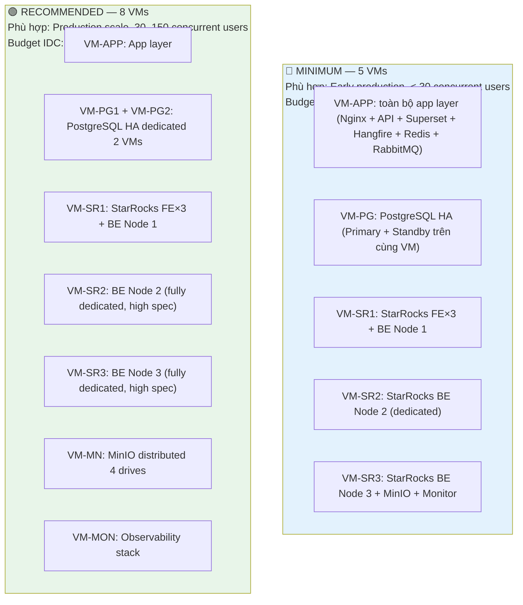

---

## 2. PHÂN TẦNG KIẾN TRÚC

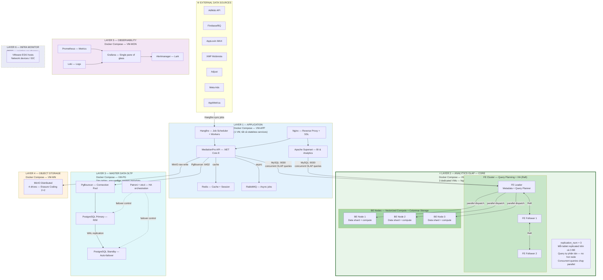

---

## 3. SƠ ĐỒ HẠ TẦNG TOÀN HỆ THỐNG

### 3.1 Minimum — 5 VMs

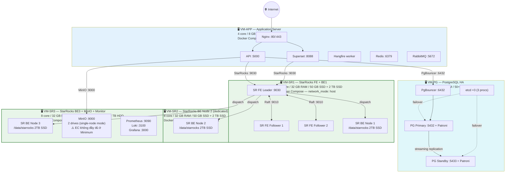

> ⚠️ **MinIO trong Minimum**: Với 5 VMs, MinIO chỉ có 2 drives trên VM-SR3 — không đủ để chạy Erasure Coding 4-drive đúng cách. Hai lựa chọn:
> 
> - **Option A (5 VMs)**: MinIO single-node mode — đơn giản, chấp nhận SPOF cho raw storage
> - **Option B (6 VMs)**: Thêm 1 VM nhỏ cho MinIO → 2 VMs × 2 drives = EC 2+2 hoạt động đúng

---

### 3.2 Recommended — 8 VMs

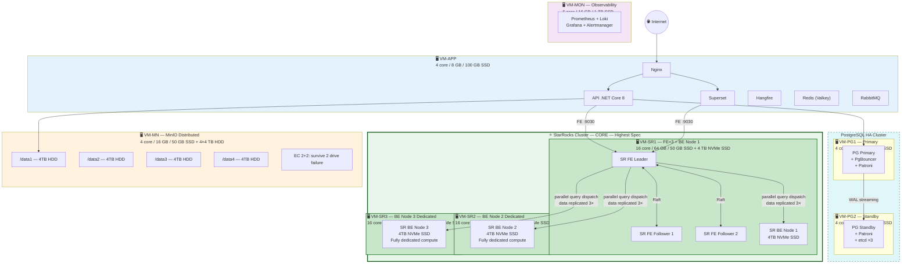

---

## 4. CẤU HÌNH MÁY CHỦ — MINIMUM

### 4.1 Layout 5 VMs

| VM | Vai trò | vCPU | RAM | OS Disk | Data Disk | Services |
| --- | --- | --- | --- | --- | --- | --- |
| **VM-APP** | Application layer | 4 core | 8 GB | 50 GB SSD | — | Nginx, API, Superset, Hangfire, Redis, RabbitMQ |
| **VM-PG** | PostgreSQL HA | 4 core | 16 GB | 50 GB SSD | 300 GB SSD | PG Primary + Standby, PgBouncer, Patroni, etcd×3 |
| **VM-SR1** | StarRocks FE + BE1 | 8 core | 32 GB | 50 GB SSD | 2 TB SSD | FE Leader + 2 Follower, BE Node 1 |
| **VM-SR2** | StarRocks BE2 dedicated | 8 core | 32 GB | 50 GB SSD | 2 TB SSD | BE Node 2 only |
| **VM-SR3** | StarRocks BE3 + Storage + Monitor | 8 core | 32 GB | 50 GB SSD | 2 TB SSD + 2×2 TB HDD | BE Node 3, MinIO (2 drives), Prometheus, Loki, Grafana |
| **Tổng** |  | **32 core** | **120 GB** | **250 GB SSD** | **≈ 12 TB** |  |

### 4.2 HA Coverage — Minimum

| Service | HA | SPOF | RTO |
| --- | --- | --- | --- |
| **StarRocks FE** | ✅ 3-node Raft | Không | <30 giây auto-elect |
| **StarRocks BE** | ✅ Data replicated 3× | Không | Tự động rebalance |
| **PostgreSQL** | ✅ Primary + Standby | Không | <30 giây Patroni |
| **MinIO** | ⚠️ Single-node (2 drives) | **CÓ** — VM-SR3 | Restart + restore |
| **API / Superset** | ⚠️ Single container | **CÓ** — VM-APP | <2 phút restart |
| **Redis** | ⚠️ Single node | **CÓ** — VM-APP | <1 phút restart |
| **Monitoring** | ⚠️ Single (collocate SR3) | **CÓ** — VM-SR3 | <5 phút restart |

---

## 5. CẤU HÌNH MÁY CHỦ — RECOMMENDED

### 5.1 Layout 8 VMs

| VM | Vai trò | vCPU | RAM | OS Disk | Data Disk | Ghi chú |
| --- | --- | --- | --- | --- | --- | --- |
| **VM-APP** | Application layer | 4 core | 8 GB | 50 GB SSD | 100 GB SSD | Toàn bộ stateless services |
| **VM-PG1** | PostgreSQL Primary | 4 core | 16 GB | 50 GB SSD | 500 GB SSD | NVMe nếu write-heavy |
| **VM-PG2** | PostgreSQL Standby | 4 core | 16 GB | 50 GB SSD | 500 GB SSD | etcd×3 collocated |
| **VM-SR1** | StarRocks FE×3 + BE1 | **16 core** | **64 GB** | 50 GB SSD | **4 TB NVMe SSD** | FE nhẹ; BE là workload chính |
| **VM-SR2** | StarRocks BE2 dedicated | **16 core** | **64 GB** | 50 GB SSD | **4 TB NVMe SSD** | Fully dedicated OLAP compute |
| **VM-SR3** | StarRocks BE3 dedicated | **16 core** | **64 GB** | 50 GB SSD | **4 TB NVMe SSD** | Fully dedicated OLAP compute |
| **VM-MN** | MinIO Distributed | 4 core | 16 GB | 50 GB SSD | 4 × 4 TB HDD | EC 2+2 |
| **VM-MON** | Observability | 6 core | 16 GB | 50 GB SSD | 1 TB SSD | Prometheus + Loki + Grafana |
| **Tổng** |  | **70 core** | **264 GB** | **400 GB SSD** | **≈ 29 TB** |  |

> 🎯 **Tại sao StarRocks BE spec cao nhất hệ thống?**
> 
> 
> Khi 30–150 users concurrent query Superset + API, StarRocks BE chịu toàn bộ compute load: vectorized column scan, hash join, parallel aggregation. **16 core + 64 GB RAM per BE** đảm bảo không bị throttle. **NVMe SSD** giảm I/O latency từ ~1ms (SATA SSD) xuống ~0.1ms — quan trọng với columnar scan hàng tỷ rows.
> 

### 5.2 HA Coverage — Recommended

| Service | HA Level | Cơ chế | Recovery |
| --- | --- | --- | --- |
| **StarRocks FE** | ✅ 3-node Raft | Auto-elect Leader | <30 giây |
| **StarRocks BE** | ✅ Data replicated 3× | Tablet auto-rebalance | Tự động |
| **PostgreSQL** | ✅ Primary + Hot Standby | Patroni auto-failover | <30 giây |
| **MinIO** | ✅ EC 4 drives 2+2 | Survive 2 drive failure | Tự động |
| **API / Superset** | ⚠️ Single container | restart: unless-stopped | <2 phút |
| **Redis** | ⚠️ Single node | restart: unless-stopped | <1 phút |
| **Monitoring** | ⚠️ Single VM | restart: unless-stopped | <5 phút |

---

## 6. CHI TIẾT TỪNG LỚP DỊCH VỤ

### 6.1 Application Layer — Docker Compose

```yaml
# /opt/mediation/docker-compose.app.yml
version: '3.8'

services:
  nginx:
    image: nginx:1.26-alpine
    ports:
      - "80:80"
      - "443:443"
    volumes:
      - ./nginx/nginx.conf:/etc/nginx/nginx.conf:ro
      - ./nginx/ssl:/etc/nginx/ssl:ro
    restart: unless-stopped

  api:
    image: registry.amobear.internal/mediation-api:${API_TAG}
    environment:
      - ASPNETCORE_ENVIRONMENT=Production
      - ConnectionStrings__StarRocks=Host=${SR_FE_IP};Port=9030;Database=gold;...
      - ConnectionStrings__Postgres=Host=${PG_IP};Port=6432;Database=mediation;...
      - Redis__Host=redis
    depends_on: [redis]
    restart: unless-stopped
    healthcheck:
      test: ["CMD", "curl", "-f", "<http://localhost:5000/health>"]
      interval: 30s
      timeout: 10s
      retries: 3

  superset:
    image: registry.amobear.internal/superset:${SUP_TAG}
    environment:
      - SUPERSET_SECRET_KEY=${SUPERSET_SECRET}
      - SQLALCHEMY_DATABASE_URI=postgresql://superset:${PG_PASS}@${PG_IP}:6432/superset
      - REDIS_HOST=redis
    restart: unless-stopped

  hangfire:
    image: registry.amobear.internal/mediation-api:${API_TAG}
    environment:
      - RUN_MODE=HangfireWorker
      - ConnectionStrings__StarRocks=Host=${SR_FE_IP};Port=9030;...
    restart: unless-stopped

  redis:
    image: valkey/valkey:7.2-alpine
    volumes:
      - redis_data:/data
    restart: unless-stopped

  rabbitmq:
    image: rabbitmq:3.13-management-alpine
    environment:
      - RABBITMQ_DEFAULT_USER=${RMQ_USER}
      - RABBITMQ_DEFAULT_PASS=${RMQ_PASS}
    volumes:
      - rabbitmq_data:/var/lib/rabbitmq
    restart: unless-stopped

volumes:
  redis_data:
  rabbitmq_data:
```

---

### 6.2 StarRocks — Docker Compose với host networking

```yaml
# /opt/starrocks/docker-compose.fe.yml  — VM-SR1
version: '3.8'
services:
  starrocks-fe:
    image: starrocks/fe-ubuntu:3.2-latest
    container_name: starrocks-fe
    network_mode: host        # Bắt buộc — FE/BE giao tiếp qua nhiều ports nội bộ
    volumes:
      - ./fe/conf/fe.conf:/opt/starrocks/fe/conf/fe.conf:ro
      - fe_meta:/opt/starrocks/fe/meta
      - fe_log:/opt/starrocks/fe/log
    restart: unless-stopped
    ulimits:
      nofile: { soft: 65536, hard: 65536 }
volumes:
  fe_meta:
  fe_log:
```

```yaml
# /opt/starrocks/docker-compose.be.yml  — VM-SR1/2/3
version: '3.8'
services:
  starrocks-be:
    image: starrocks/be-ubuntu:3.2-latest
    container_name: starrocks-be
    network_mode: host
    volumes:
      - ./be/conf/be.conf:/opt/starrocks/be/conf/be.conf:ro
      - /data/starrocks:/opt/starrocks/be/storage   # NVMe SSD mount
      - be_log:/opt/starrocks/be/log
    restart: unless-stopped
    ulimits:
      nofile: { soft: 65536, hard: 65536 }
volumes:
  be_log:
```

---

### 6.3 PostgreSQL HA — Patroni failover sequence

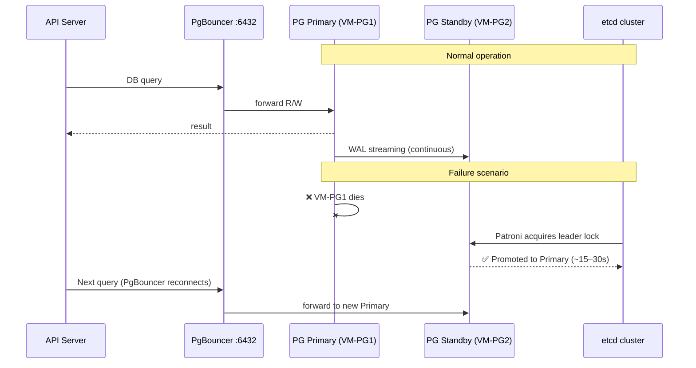

---

### 6.4 MinIO Distributed — Erasure Coding

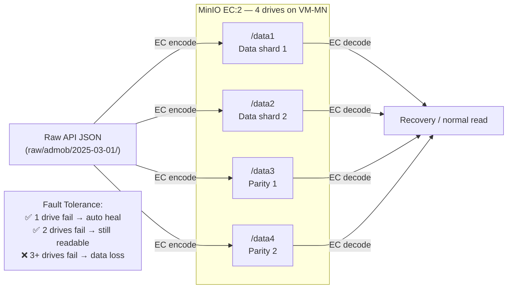

---

## 7. STARROCKS OLAP — PERFORMANCE & TUNING

### 7.1 Query Execution — Hiểu để tối ưu đúng chỗ

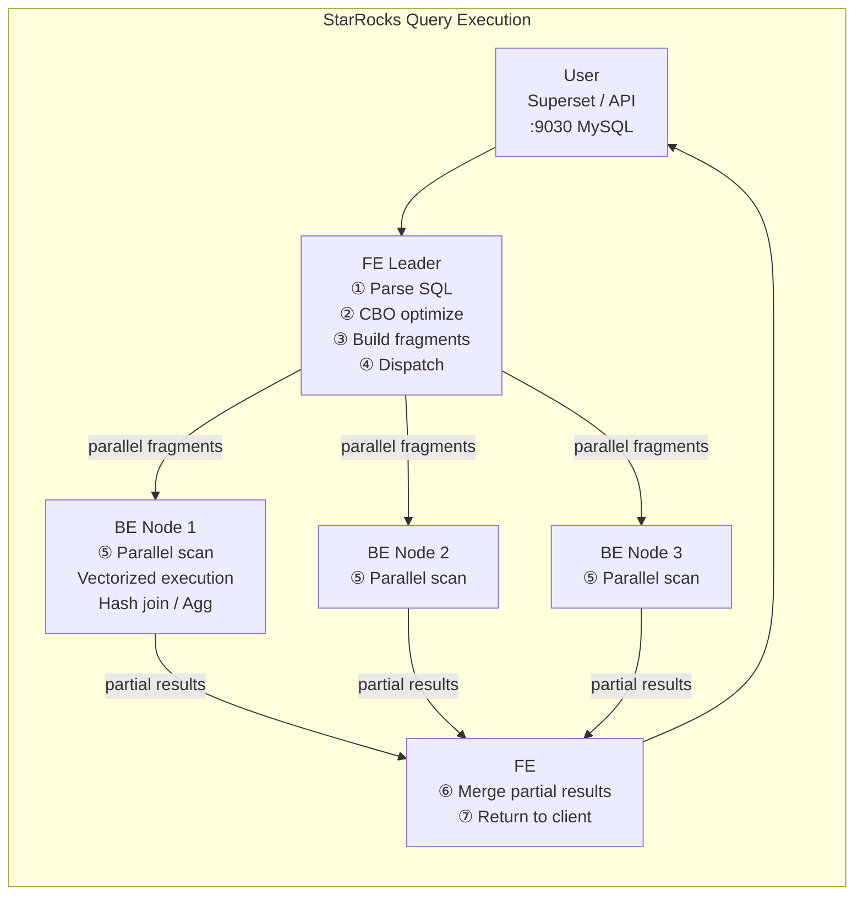

**Key insight cho việc sizing:**

| Thành phần | Role trong query | Resource bottleneck |
| --- | --- | --- |
| FE | Parse + plan + coordinate | RAM (metadata) |
| **BE** | **Actual compute + storage scan** | **CPU + RAM + Disk I/O** |
| Network | Fragment result transfer | Bandwidth giữa BE nodes |

> **BE là nơi query thực sự chạy** — 30 concurrent users = 30 queries chạy song song trên BE. CPU và RAM BE là bottleneck duy nhất cần quan tâm khi tune performance.
> 

---

### 7.2 Table Design — Partition + Bucket đúng cách

```sql
-- ✅ Gold layer — tối ưu cho dashboard time-range queries
CREATE TABLE gold.daily_revenue (
    report_date       DATE         NOT NULL,
    app_id            VARCHAR(64)  NOT NULL,
    platform          VARCHAR(16)  NOT NULL,
    ad_format         VARCHAR(32),
    country           VARCHAR(8),
    total_revenue     DECIMAL(18,6),
    total_impressions BIGINT,
    ecpm              DECIMAL(10,4),
    sow               DECIMAL(5,4),
    _updated_at       DATETIME
)
DUPLICATE KEY(report_date, app_id, platform)
PARTITION BY RANGE(report_date) (
    START ("2024-01-01") END ("2026-12-31")
    EVERY (INTERVAL 1 MONTH)           -- Auto monthly partitions
)
DISTRIBUTED BY HASH(app_id) BUCKETS 32 -- 32 buckets cho 200+ apps
PROPERTIES (
    "replication_num"      = "3",       -- Replicate trên cả 3 BE
    "storage_medium"       = "SSD",
    "compression"          = "LZ4",     -- Fast decompress cho OLAP
    "bloom_filter_columns" = "app_id, country"
);
```

**Anti-patterns phổ biến và cách fix:**

```sql
-- ❌ SAI: Không có partition filter → full table scan
SELECT * FROM gold.daily_revenue WHERE app_id = 'com.game1';

-- ✅ ĐÚNG: Luôn filter partition trước
SELECT app_id, SUM(total_revenue), SUM(total_impressions)
FROM gold.daily_revenue
WHERE report_date >= '2025-01-01'   -- partition pruning: chỉ scan tháng cần
  AND app_id = 'com.game1'
GROUP BY app_id;

-- ❌ SAI: SELECT * trên bảng columnar (kéo toàn bộ columns)
SELECT * FROM silver.admob_performance WHERE event_date = '2025-03-01';

-- ✅ ĐÚNG: Chỉ lấy columns cần thiết
SELECT app_id, SUM(estimated_earnings), SUM(impressions)
FROM silver.admob_performance
WHERE event_date >= '2025-01-01'
GROUP BY app_id;
```

---

### 7.3 Materialized Views — Pre-compute cho dashboard nhanh

```sql
-- MV: Rolling 30-day revenue per app — refresh mỗi ngày
CREATE MATERIALIZED VIEW mv_app_revenue_30d
DISTRIBUTED BY HASH(app_id) BUCKETS 8
REFRESH ASYNC EVERY (INTERVAL 1 DAY)
AS
SELECT
    app_id,
    platform,
    SUM(total_revenue)      AS revenue_30d,
    SUM(total_impressions)  AS impressions_30d,
    AVG(ecpm)               AS avg_ecpm_30d,
    AVG(sow)                AS avg_sow_30d
FROM gold.daily_revenue
WHERE report_date >= CURRENT_DATE - INTERVAL 30 DAY
GROUP BY app_id, platform;

-- StarRocks CBO tự động rewrite query sau sang MV:
-- User gõ query này → FE detect match → redirect sang MV
SELECT app_id, SUM(total_revenue)
FROM gold.daily_revenue
WHERE report_date >= CURRENT_DATE - 30
GROUP BY app_id
ORDER BY 2 DESC LIMIT 20;
-- → P95 latency: từ 8s xuống <1s
```

---

### 7.4 BE Node Config — be.conf cho production

```
# /opt/starrocks/be/conf/be.conf

# Storage path — mount NVMe SSD
storage_root_path = /opt/starrocks/be/storage

# Memory — đặt 75% total RAM của VM
# Recommended VM: 64GB → set 48GB
mem_limit = 48GB

# Parallel execution threads = số vCPU
pipeline_exec_thread_pool_thread_num = 16
pipeline_scan_thread_pool_thread_num = 16

# Max concurrent queries per BE node
query_max_concurrency = 50

# Compaction (background — giữ read performance)
max_compaction_threads = 4
cumulative_compaction_check_interval_seconds = 10

# NVMe optimizations
enable_direct_io = true           # Bypass OS page cache
max_read_ahead_size = 4194304     # 4MB read-ahead

# Network
brpc_socket_max_unwritten_bytes = 1073741824  # 1GB buffer
```

---

### 7.5 FE Node Config — fe.conf cho production

```
# /opt/starrocks/fe/conf/fe.conf

# JVM heap — FE cần RAM cho metadata của 200+ apps
-Xmx16384m    # 16GB heap

# Query limits
query_timeout = 300              # 5 phút max
max_query_instances = 2000

# Parallelism per query
parallel_fragment_exec_instance_num = 8

# Connection management
qe_max_connection = 1024

# Auto statistics (CBO optimizer)
enable_collect_statistics = true
statistic_auto_collect_interval = 3600  # Refresh mỗi giờ

# Result cache (same query = cached result)
query_cache_capacity = 536870912  # 512MB
```

---

### 7.6 Superset — Connection pool và cache

```python
# superset_config.py

# StarRocks connection
SQLALCHEMY_DATABASE_URI = "starrocks://user:pass@VM_SR1_IP:9030/gold"

# Connection pool — critical khi nhiều concurrent users
SQLALCHEMY_POOL_SIZE = 20
SQLALCHEMY_MAX_OVERFLOW = 40
SQLALCHEMY_POOL_TIMEOUT = 30
SQLALCHEMY_POOL_RECYCLE = 3600

# Query execution timeout
SUPERSET_WEBSERVER_TIMEOUT = 300   # 5 phút

# Redis cache — tránh re-query cùng dashboard
CACHE_CONFIG = {
    'CACHE_TYPE': 'RedisCache',
    'CACHE_DEFAULT_TIMEOUT': 600,   # 10 phút
    'CACHE_KEY_PREFIX': 'superset_',
    'CACHE_REDIS_HOST': 'VM_APP_IP',
    'CACHE_REDIS_PORT': 6379,
}

# Async queries cho heavy dashboards
GLOBAL_ASYNC_QUERIES_TRANSPORT = "ws"
RESULTS_BACKEND = RedisCache(
    host='VM_APP_IP', port=6379, key_prefix='sr_result_'
)
```

---

### 7.7 Key metrics cần monitor cho StarRocks

```
FE Metrics — :8030/metrics
├── starrocks_fe_query_total          → Request rate
├── starrocks_fe_query_err            → Error rate   ⚠️ Alert > 1%
├── starrocks_fe_query_latency_ms_p99 → P99 latency  ⚠️ Alert > 10s
├── starrocks_fe_connection_total     → Active connections
└── starrocks_fe_pending_task_num     → Queue depth

BE Metrics — :8040/metrics
├── starrocks_be_cpu_idle             → CPU idle     ⚠️ Alert < 20%
├── starrocks_be_mem_total_bytes      → RAM used     ⚠️ Alert > 85%
├── starrocks_be_disk_used_capacity   → Disk used    ⚠️ Alert > 75%
├── starrocks_be_compaction_score     → Compaction lag (keep < 10)
└── starrocks_be_scan_rows_per_second → Scan throughput

Grafana panels cần có:
1. Query latency P50 / P95 / P99 — line chart 24h
2. Concurrent active queries — gauge realtime
3. BE CPU % per node — heatmap
4. BE disk growth — projection đến khi full
5. Top 10 slow queries — table (query text + duration + user)
6. Data freshness — last sync time per source (AdMob, Firebase...)
```

---

## 8. MẠNG VÀ KẾT NỐI NỘI BỘ

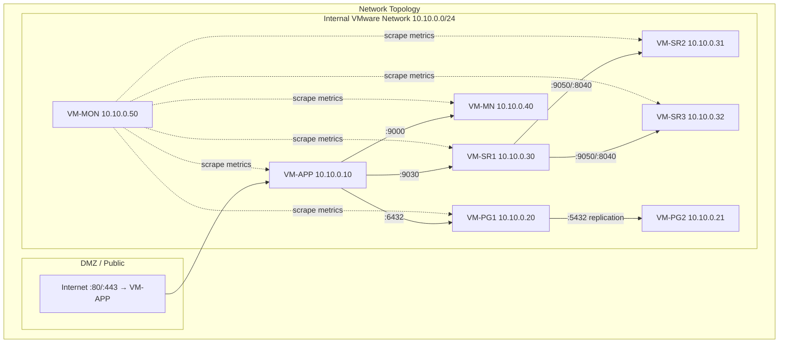

**Firewall rules:**

| Source | Destination | Port | Mục đích |
| --- | --- | --- | --- |
| Internet | VM-APP | 80, 443 | Web access |
| VM-APP | VM-SR1 | **9030** | StarRocks query |
| VM-APP | VM-PG1 | 6432 | PgBouncer |
| VM-APP | VM-MN | 9000 | MinIO API |
| VM-SR1 | VM-SR2, VM-SR3 | 9050, 8040, 8060 | BE communication |
| VM-SR1,2,3 | VM-SR1 | 9010, 9020 | FE Raft |
| VM-PG1 | VM-PG2 | 5432 | WAL replication |
| VM-MON | All VMs | 9100, 8040, 9187… | Prometheus scrape |
| VPN/Jump | All VMs | 22 | Admin SSH only |
| **BLOCK** | **All VMs** | **9030, 5432, 9000** | **KHÔNG expose DB ra internet** |

---

## 9. CI/CD PIPELINE

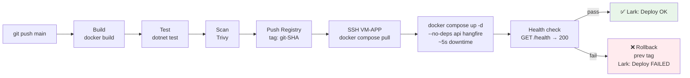

**Deploy script — đơn giản, không cần Swarm:**

```bash
#!/bin/bash
# deploy.sh — triggered bởi GitHub Actions

set -e
NEW_TAG=$1
PREV_TAG=$(cat /opt/mediation/.current_tag 2>/dev/null || echo "")

echo "Deploying $NEW_TAG (previous: $PREV_TAG)"

# Pull new images
docker compose -f /opt/mediation/docker-compose.app.yml pull api hangfire

# Rolling update (~5s downtime acceptable for internal tool)
docker compose -f /opt/mediation/docker-compose.app.yml \\
  up -d --no-deps api hangfire

# Health check
sleep 10
if curl -sf <http://localhost:5000/health>; then
    echo "$NEW_TAG" > /opt/mediation/.current_tag
    echo "✅ Deploy $NEW_TAG success"
else
    echo "❌ Health check failed — rolling back to $PREV_TAG"
    API_TAG=$PREV_TAG docker compose -f /opt/mediation/docker-compose.app.yml \\
      up -d --no-deps api hangfire
    exit 1
fi
```

---

## 10. MONITORING & OBSERVABILITY

### 10.1 Phân chia trách nhiệm

| Câu hỏi | Tool |
| --- | --- |
| "VMware host đang dùng bao nhiêu % CPU?" | **PRTG** |
| "Switch IDC có port down không?" | **PRTG** |
| "StarRocks BE query P95 là bao nhiêu?" | **Prometheus + Grafana** |
| "Job sync AdMob 3h sáng có fail không?" | **Loki** |
| "BE disk còn bao lâu đến full?" | **Prometheus + Grafana** |

### 10.2 Stack trên VM-MON

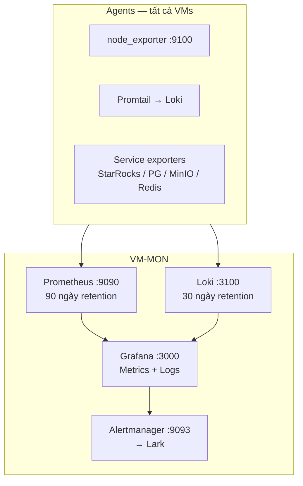

### 10.3 Grafana Dashboards

| Dashboard | ID / Type | Dùng cho |
| --- | --- | --- |
| Node Exporter Full | ID: 1860 | CPU/RAM/Disk tất cả VMs |
| Docker cAdvisor | ID: 893 | Container metrics |
| PostgreSQL | ID: 9628 | PG performance + lag |
| MinIO | ID: 13332 | Storage health |
| Redis (Valkey) | ID: 763 | Cache stats |
| **StarRocks Performance** | Custom | **Query latency, BE disk, FE QPS, concurrent users** |
| **Data Pipeline Health** | Custom | **Sync jobs, lag per source, bronze/gold row counts** |
| **OLAP User Activity** | Custom | **Top slow queries, concurrent sessions, cache hit rate** |

### 10.4 Alert Rules

| Alert | Condition | Severity | Action |
| --- | --- | --- | --- |
| StarRocks query P95 > 10s | FE latency metric | 🔴 Critical | @CTO Lark |
| BE disk > 75% | Per BE node | 🔴 Critical | Lark #alerts |
| BE CPU > 80% sustained | Per BE node | 🟡 Warning | Lark #alerts |
| API 5xx > 5% | HTTP error rate | 🔴 Critical | @CTO Lark |
| Sync job failed | Loki log pattern | 🔴 Critical | Lark #alerts |
| PG replication lag > 60s | pg_exporter | 🟡 Warning | Lark #alerts |
| Data lag > 4h | Hangfire metric | 🟡 Warning | Lark #data-team |
| Any VM disk > 85% | node_exporter | 🔴 Critical | @CTO Lark |

### 10.5 Docker Compose VM-MON

```yaml
# /opt/monitoring/docker-compose.yml
version: '3.8'
services:
  prometheus:
    image: prom/prometheus:v2.51.0
    volumes:
      - ./prometheus/prometheus.yml:/etc/prometheus/prometheus.yml:ro
      - ./prometheus/rules/:/etc/prometheus/rules/:ro
      - prometheus_data:/prometheus
    command:
      - '--config.file=/etc/prometheus/prometheus.yml'
      - '--storage.tsdb.retention.time=90d'
      - '--web.enable-lifecycle'
    ports: ["9090:9090"]
    restart: unless-stopped

  loki:
    image: grafana/loki:2.9.0
    volumes:
      - ./loki/config.yml:/etc/loki/local-config.yaml:ro
      - loki_data:/loki
    command: -config.file=/etc/loki/local-config.yaml
    ports: ["3100:3100"]
    restart: unless-stopped

  grafana:
    image: grafana/grafana:11.0.0
    volumes:
      - grafana_data:/var/lib/grafana
      - ./grafana/provisioning:/etc/grafana/provisioning:ro
    environment:
      - GF_SECURITY_ADMIN_PASSWORD=${GRAFANA_PASSWORD}
      - GF_USERS_ALLOW_SIGN_UP=false
    ports: ["3000:3000"]
    depends_on: [prometheus, loki]
    restart: unless-stopped

  alertmanager:
    image: prom/alertmanager:v0.27.0
    volumes:
      - ./alertmanager/alertmanager.yml:/etc/alertmanager/alertmanager.yml:ro
    ports: ["9093:9093"]
    restart: unless-stopped

volumes:
  prometheus_data:
  loki_data:
  grafana_data:
```

---

## 11. BACKUP & DISASTER RECOVERY

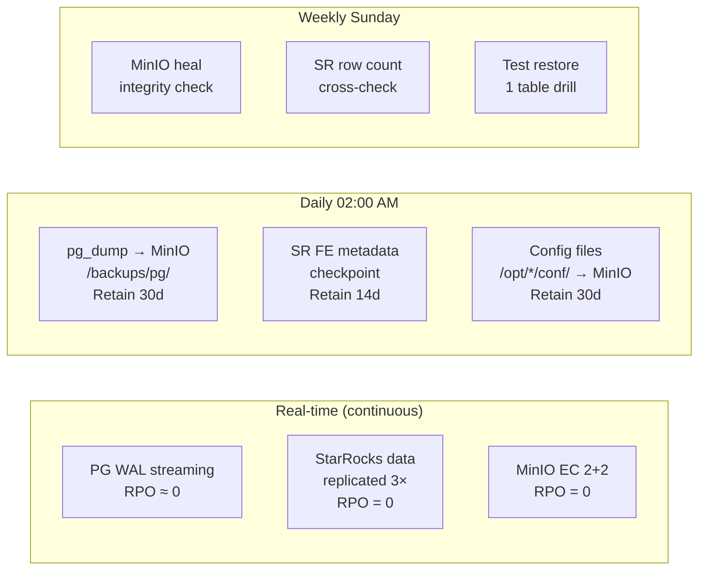

**RTO / RPO:**

| Scenario | RPO | RTO | Action |
| --- | --- | --- | --- |
| VM-APP crash | 0 | <10 phút | `docker compose up` |
| PG Primary fail | ~0 | <30 giây | Patroni auto |
| StarRocks FE fail | 0 | <30 giây | Raft auto-elect |
| StarRocks BE fail | 0 | Tự động | Tablet rebalance |
| MinIO drive fail | 0 | Tự động | EC rebuild |
| Full VM-SR die | 0 | <1 giờ | Spin new VM, rejoin |
| Data corruption | Backup gần nhất | 2–8 giờ | Replay từ MinIO |

---

## 12. BẢNG TỔNG HỢP CHI PHÍ

> 💡 Giá ước tính on-premise IDC Việt Nam. Cần verify với IDC provider.
> 

### 12.1 CapEx — Phần cứng

**Minimum — 5 VMs:**

| VM | Spec | Đơn giá | Thành tiền |
| --- | --- | --- | --- |
| VM-APP | 4c/8GB/50GB SSD | $600–900 | $600–900 |
| VM-PG | 4c/16GB/50+300GB SSD | $1,200–1,800 | $1,200–1,800 |
| VM-SR1 | 8c/32GB/50+2TB SSD | $2,500–3,500 | $2,500–3,500 |
| VM-SR2 | 8c/32GB/50+2TB SSD | $2,500–3,500 | $2,500–3,500 |
| VM-SR3 | 8c/32GB/50+2TB SSD+2×HDD | $3,000–4,000 | $3,000–4,000 |
| **Tổng Minimum** |  |  | **~$9,800–13,700** |

**Recommended — 8 VMs:**

| VM | Spec | Đơn giá | Thành tiền |
| --- | --- | --- | --- |
| VM-APP | 4c/8GB/100GB SSD | $700–1,000 | $700–1,000 |
| VM-PG1 + PG2 | 4c/16GB/500GB SSD ×2 | $1,500–2,000 | $3,000–4,000 |
| **VM-SR1** | **16c/64GB/50+4TB NVMe** | **$5,000–8,000** | **$5,000–8,000** |
| **VM-SR2** | **16c/64GB/50+4TB NVMe** | **$5,000–8,000** | **$5,000–8,000** |
| **VM-SR3** | **16c/64GB/50+4TB NVMe** | **$5,000–8,000** | **$5,000–8,000** |
| VM-MN | 4c/16GB/50+4×4TB HDD | $2,500–3,500 | $2,500–3,500 |
| VM-MON | 6c/16GB/50+1TB SSD | $1,500–2,000 | $1,500–2,000 |
| **Tổng Recommended** |  |  | **~$22,700–34,500** |

### 12.2 OpEx — Hàng tháng

| Hạng mục | Minimum | Recommended |
| --- | --- | --- |
| IDC rack / slot | $150–250 | $300–500 |
| Bandwidth | $50–100 | $100–200 |
| Điện (UPS) | $80–120 | $200–350 |
| IP tĩnh | $10–20 | $20–40 |
| **Tổng/tháng** | **~$290–490** | **~$620–1,090** |

### 12.3 Phần mềm — 100% Open Source

| Tool | License | Chi phí |
| --- | --- | --- |
| StarRocks Community | Apache 2.0 | $0 |
| PostgreSQL + Patroni | PostgreSQL / MIT | $0 |
| MinIO Community | AGPL-3.0 | $0 |
| Valkey (Redis fork) | Apache 2.0 | $0 |
| Apache Superset | Apache 2.0 | $0 |
| Prometheus + Grafana + Loki | Apache / AGPL | $0 |
| Docker + Docker Compose | Apache 2.0 | $0 |
| Ubuntu 22.04 LTS | Free | $0 |
| PRTG | Commercial (existing) | Đã có sẵn |
| **Tổng Software** |  | **$0** |

### 12.4 Tổng chi phí 12 tháng đầu

|  | **Minimum** | **Recommended** |
| --- | --- | --- |
| CapEx (Hardware) | ~$9,800–13,700 | ~$22,700–34,500 |
| OpEx × 12 tháng | ~$3,480–5,880 | ~$7,440–13,080 |
| Setup one-time | ~$1,500–2,500 | ~$2,000–4,000 |
| **Tổng Year 1** | **~$14,780–22,080** | **~$32,140–51,580** |
| **Chi phí từ tháng 2** | **~$290–490/tháng** | **~$620–1,090/tháng** |

> 📊 **vs Cloud**: AWS/GCP tương đương ~$4,000–8,000/tháng. On-premise break-even sau 12–18 tháng, tiết kiệm 60–70% dài hạn.
> 

---

## 13. RỦI RO VÀ GIẢM THIỂU

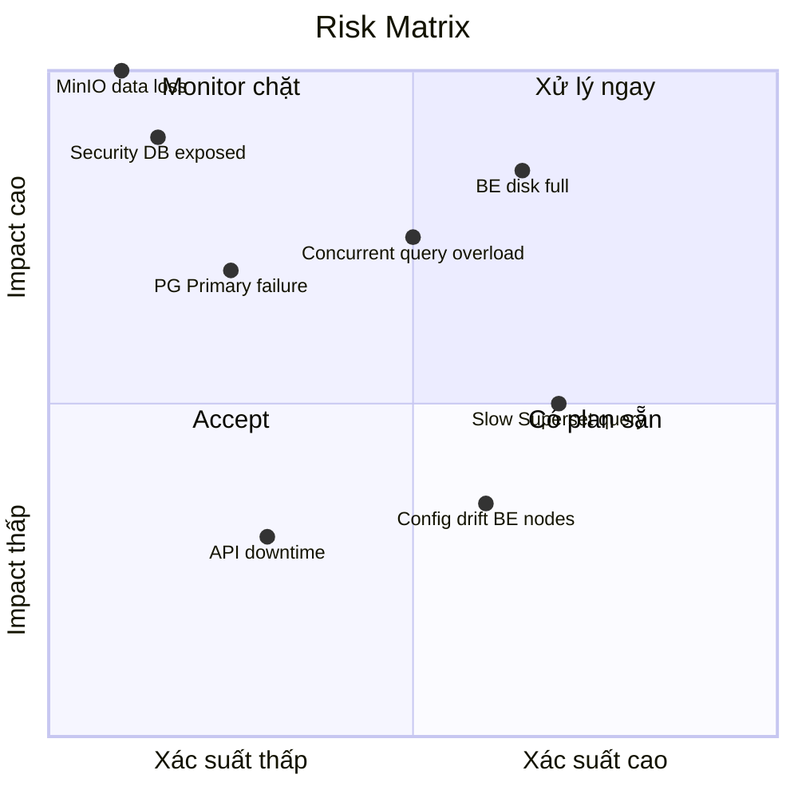

| Rủi ro | Xác suất | Impact | Mitigation |
| --- | --- | --- | --- |
| **StarRocks BE disk full** | Cao | Cao | Alert 75%; partition TTL; daily growth monitoring |
| **Concurrent query overload** | Trung bình | Cao | `query_max_concurrency=50` per BE; Superset pool; query timeout 5 phút |
| **Slow Superset queries** | Cao | Trung bình | Enforce partition filter; Materialized Views; Redis cache 10 phút |
| **MinIO data loss** | Rất thấp | Cực cao | EC 2+2; weekly integrity check; weekly restore drill |
| **PG Primary failure** | Trung bình | Cao | Patroni auto-failover; monthly drill |
| **DB/port exposed to internet** | Trung bình | Rất cao | Firewall strict; VPN cho admin; không expose :9030 |
| **Config drift giữa BE nodes** | Cao | Trung bình | Version-controlled configs; Ansible sync |

---

## 14. ROADMAP TRIỂN KHAI 90 NGÀY

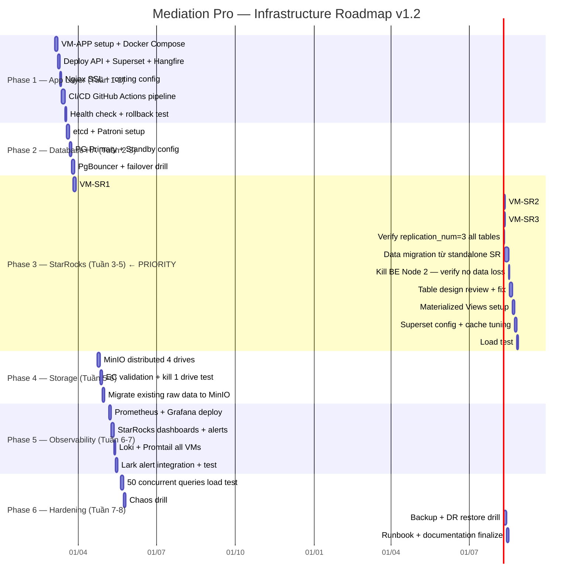

### Checklist Go-Live

```
PRE-PRODUCTION CHECKLIST v1.2

Infrastructure
□ Tất cả VMs reachable qua internal network 10.10.0.0/24
□ Firewall: port 9030, 5432, 9000 KHÔNG accessible từ internet
□ SSH key-based auth; password SSH disabled
□ Docker Compose up; restart: unless-stopped on tất cả services

Application (VM-APP)
□ CI/CD pipeline end-to-end hoạt động
□ Health check GET /health → 200 trong <100ms
□ Rollback test: deploy broken image → rollback thành công
□ Secrets trong .env; không hardcode trong compose file

StarRocks ← ƯU TIÊN CAO NHẤT
□ SHOW PROC '/frontends' → 3 FE, 1 Leader, 2 Follower, Alive=true
□ SHOW PROC '/backends'  → 3 BE, Alive=true, Decommissioned=false
□ replication_num=3 verified trên tất cả production tables
□ Kill BE Node 2 → queries vẫn chạy đúng (tablet failover OK)
□ Kill FE Leader → Follower elect Leader trong <30 giây
□ 30 concurrent Superset queries → tất cả complete < 10 giây
□ Query không có partition filter → bị block hoặc warning
□ be.conf: mem_limit=48GB, pipeline_exec_thread_pool=16
□ Materialized Views refresh successfully

PostgreSQL
□ Patroni failover drill: kill Primary → Standby promote <30 giây
□ PgBouncer: max_client_conn=200, pool đủ cho API + Superset
□ pg_dump test restore thành công

MinIO
□ 4 drives healthy; EC:2 mode confirmed
□ Kill 1 drive → objects still readable
□ Weekly minio admin heal job scheduled

Observability
□ StarRocks performance dashboard: latency + BE disk + FE QPS hiển thị
□ Loki: logs từ tất cả containers visible
□ Alert test: trigger disk > 75% → Lark message trong <2 phút
□ PRTG: VMware hosts vẫn monitored (không thay đổi)

Security
□ Admin UIs (Grafana :3000, MinIO :9001, RabbitMQ :15672) chỉ qua VPN
□ Secrets không trong git history
□ Docker registry authentication
```

---

## PHỤ LỤC: TOOLCHAIN TỔNG HỢP

| Layer | Tool | Version | License | Notes |
| --- | --- | --- | --- | --- |
| Container | Docker Engine | 26.x | Apache 2.0 |  |
| Compose | Docker Compose v2 | Built-in | Apache 2.0 | **Không dùng Swarm** |
| Registry | Harbor / GHCR | Latest | Apache 2.0 |  |
| **OLAP — Core** | **StarRocks** | **3.2.x** | **Apache 2.0** | **3 FE + 3 BE dedicated** |
| OLTP | PostgreSQL | 16.x | PostgreSQL |  |
| HA Agent | Patroni | 3.x | MIT |  |
| Consensus | etcd | 3.5.x | Apache 2.0 |  |
| Conn Pool | PgBouncer | 1.22.x | ISC |  |
| Object Store | MinIO | RELEASE.2024 | AGPL-3.0 | EC 2+2 |
| Cache | **Valkey** | 7.2.x | **Apache 2.0** | Redis fork; drop-in replacement |
| Message Queue | RabbitMQ | 3.13.x | MPL 2.0 |  |
| BI / Analytics | Apache Superset | 4.x | Apache 2.0 |  |
| Metrics | Prometheus | 2.51.x | Apache 2.0 |  |
| Dashboard | Grafana | 11.x | AGPL-3.0 | Single pane of glass |
| Alerting | Alertmanager | 0.27.x | Apache 2.0 | → Lark webhook |
| Log Aggregation | Loki | 2.9.x | Apache 2.0 |  |
| Log Shipper | Promtail | 2.9.x | Apache 2.0 | Agent per VM |
| Infra Monitor | PRTG | Existing | Commercial | VMware + Network (no change) |
| Reverse Proxy | Nginx | 1.26 | BSD |  |
| Backend | .NET Core | 8 LTS | MIT |  |
| IaC (optional) | Ansible | Latest | GPL | Config drift prevention |

---

*Tài liệu được chuẩn bị bởi CTO Advisory cho Amobear / Mediation Pro Platform.*

*Version 1.2 — Tháng 3/2025 — OLAP-first, Docker Compose thuần, StarRocks Performance Tuning*

*Review định kỳ mỗi quý hoặc khi có thay đổi infrastructure lớn.*