# 113 — WATERFALL OPTIMIZER MODULE

**Document Version:** 3.0  
**Updated:** 2026-03-07  
**Replaces:** v2.0 (February 2025)  
**Scope:** Tài liệu gốc chuẩn cho module Waterfall Optimizer trong Mediation Pro Platform  
**Audience:** Cursor AI, Dev team, Mediation team

---

## TABLE OF CONTENTS

1. [Tổng quan Module](#1-tổng-quan-module)
2. [Kiến trúc hệ thống](#2-kiến-trúc-hệ-thống)
3. [Database Schema](#3-database-schema)
4. [Data Sources & SoW Calculation](#4-data-sources--sow-calculation)
5. [Config System — Dynamic DB-driven](#5-config-system--dynamic-db-driven)
6. [Rule Engine — Cơ chế thực thi](#6-rule-engine--cơ-chế-thực-thi)
7. [Rule Sets](#7-rule-sets)
8. [Action Types & Floor Calculation](#8-action-types--floor-calculation)
9. [Output & Recommendation Lifecycle](#9-output--recommendation-lifecycle)
10. [API Endpoints](#10-api-endpoints)
11. [UI Components](#11-ui-components)
12. [Apply Recommendations → AdMob Write API](#12-apply-recommendations--admob-write-api)
13. [Checklist triển khai](#13-checklist-triển-khai)
14. [Appendix: Quick Reference](#14-appendix-quick-reference)

---

## 1. TỔNG QUAN MODULE

### 1.1 Mục đích

Waterfall Optimizer là module **phân tích và đề xuất tối ưu hóa** cấu hình waterfall cho ad mediation. Module này:

- Phân tích **Share of Wallet (SoW)** — tỷ lệ revenue của từng ad source instance trong mediation group
- Áp dụng **bộ rules động** (lưu trong PostgreSQL) để sinh recommendations
- Hỗ trợ team Mediation quyết định: giữ, tăng/giảm floor, thêm/xóa instance
- **Tự động apply** các thay đổi qua AdMob Write API sau khi được approve

### 1.2 Điểm khác biệt so với quy trình cũ

| Trước (Manual) | Sau (Mediation Pro) |
|---|---|
| Export CSV từ AdMob Console | Auto-sync từ AdMob API hàng ngày |
| Paste vào Excel Waterfall Optimizer | Engine tính tự động, không cần Excel |
| Mở Dolphin tool, apply thủ công từng floor | Approve trên Dashboard → auto-apply qua AdMob Write API |
| Không có lịch sử thay đổi | Audit trail đầy đủ |
| 2–4 giờ/ngày × 200+ apps = không thể | Tự động, scale được |
| Rule logic hard-code trong Excel | Rule logic lưu trong DB, thay đổi không cần deploy |

### 1.3 Workflow tổng quan

```mermaid
flowchart LR
    subgraph Sync["1. DATA SYNC (Auto - Daily)"]
        S1["AdMob Mediation Report API"]
        S2["StarRocks bronze.mediation_table"]
    end

    subgraph Calc["2. CALCULATION (Auto - Daily)"]
        C1["SoW Calculator<br>Tính revenue % per instance"]
        C2["silver.daily_sow_analysis"]
    end

    subgraph Engine["3. RULE ENGINE (Auto - Daily)"]
        E1["Load Config từ PostgreSQL<br>(App-specific hoặc Global)"]
        E2["Load Rule Group từ PostgreSQL<br>(App-specific hoặc Default)"]
        E3["Evaluate Rules theo display_order"]
        E4["Sinh Recommendations"]
    end

    subgraph Review["4. REVIEW (Manual)"]
        R1["Mediation team review<br>trên Dashboard"]
        R2["Approve / Reject"]
    end

    subgraph Apply["5. APPLY (Auto - after Approve)"]
        A1["AdMob Write API<br>batchCreate / batchUpdate / PATCH MG"]
        A2["Audit log"]
    end

    Sync --> Calc --> Engine --> Review --> Apply

    style Sync fill:#e3f2fd
    style Calc fill:#fff3e0
    style Engine fill:#fce4ec
    style Review fill:#e8f5e9
    style Apply fill:#f3e5f5
```

### 1.4 Key Concepts

| Concept | Definition | Formula |
|---|---|---|
| **SoW (Share of Wallet)** | Phần trăm revenue của 1 instance so với tổng revenue của Mediation Group | `instance_revenue / mg_total_revenue × 100` |
| **Match Rate** | Tỷ lệ requests được matched (có ad fill) | `matched_requests / total_requests × 100` |
| **Observed eCPM** | eCPM thực tế từ AdMob report | `(revenue / impressions) × 1000` |
| **Floor Price** | Giá sàn minimum để ad được serve | Set trong AdMob, tính bằng USD |
| **Waterfall** | Thứ tự priority của các ad sources | Sort theo floor price DESC |
| **Mediation Group (MG)** | Nhóm targeting + danh sách ad sources | Ví dụ: "Rewarded US Android" |
| **Rule Group** | Tập hợp các rules áp dụng cho 1 nhóm apps | Lưu trong `waterfall_recommendation_rule_groups` |

---

## 2. KIẾN TRÚC HỆ THỐNG

### 2.1 Component Architecture

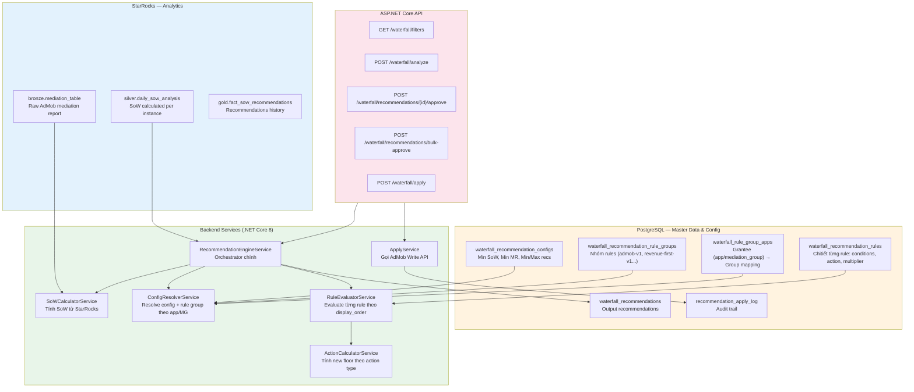

### 2.2 Config Resolution Flow

Engine resolve config và rule group theo thứ tự ưu tiên:
- Config: App-specific > Global
- Rule Group: Mediation Group-specific > App-specific > Default

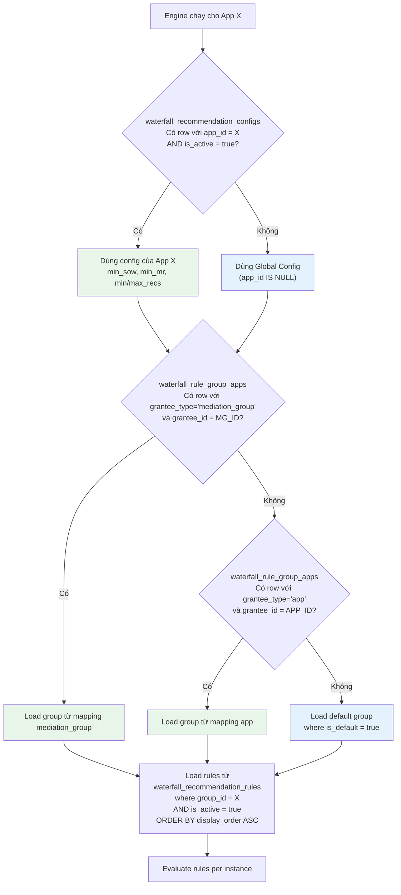

---

## 3. DATABASE SCHEMA

### 3.1 ERD đầy đủ

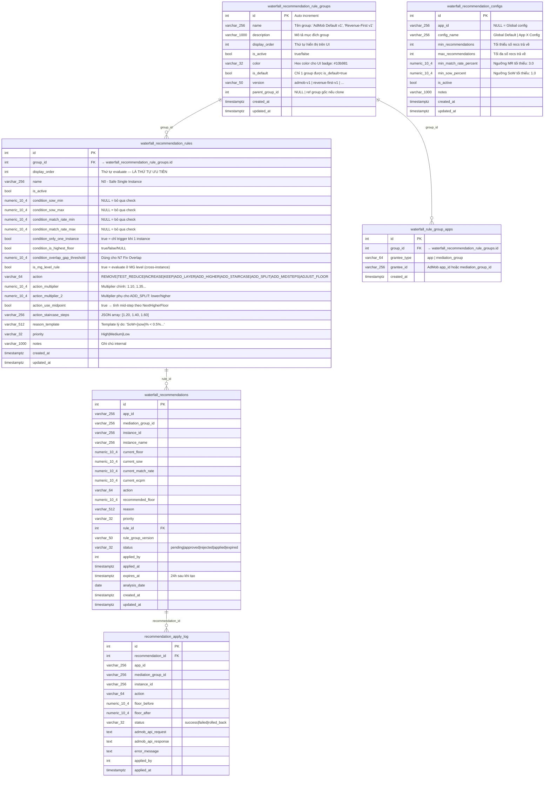

### 3.2 Indexes quan trọng

```sql
-- Performance indexes
CREATE INDEX idx_wrc_app_id ON waterfall_recommendation_configs(app_id);
CREATE UNIQUE INDEX idx_wrga_grantee ON waterfall_rule_group_apps(grantee_type, grantee_id);
CREATE INDEX idx_wrrules_group_active ON waterfall_recommendation_rules(group_id, is_active, display_order);
CREATE INDEX idx_recs_app_date ON waterfall_recommendations(app_id, analysis_date, status);
CREATE INDEX idx_recs_mg_status ON waterfall_recommendations(mediation_group_id, status);
```

---

## 4. DATA SOURCES & SOW CALCULATION

### 4.1 Nguồn dữ liệu: AdMob Mediation Report

Dữ liệu được sync tự động từ **AdMob Mediation Report API** vào `bronze.mediation_table` (StarRocks).

| Column | StarRocks Field | Bắt buộc | Mô tả |
|---|---|---|---|
| App | app_id | ✅ | AdMob App ID |
| Platform | platform | ✅ | Android / iOS |
| Mediation Group | mediation_group_id | ✅ | MG ID |
| Ad Source | ad_source | ✅ | Loại network |
| Ad Source Instance | ad_source_instance_id | ✅ | Instance ID (dùng thay tên) |
| Ad Source Instance Name | ad_source_instance_name | ✅ | Tên instance (hiển thị) |
| Estimated Earnings | estimated_earnings | ✅ | Revenue USD |
| Observed eCPM | observed_ecpm | ✅ | eCPM thực tế |
| Requests | requests | ✅ | Ad requests |
| Match Rate | match_rate | ✅ | % matched |
| Impressions | impressions | ✅ | Số impression |

> **Lưu ý:** `ad_source_instance_id` được dùng làm key chính để join với bảng waterfall structure trong PostgreSQL. Không parse floor từ instance name.

### 4.2 Ad Source Classification

Chỉ **AdMob Network Waterfall** instances mới được apply recommendation rules. Các loại khác bị loại khỏi analysis.

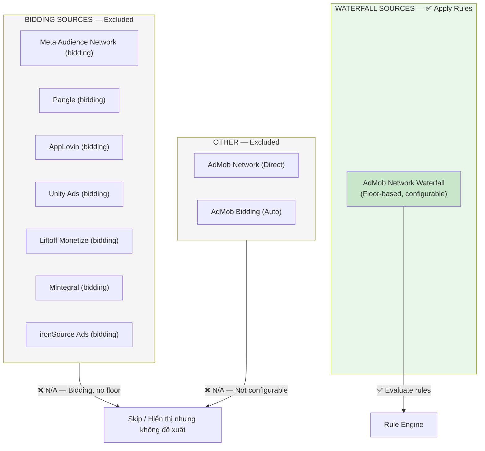

### 4.3 SoW Calculation

#### StarRocks Silver View: `silver.daily_sow_analysis`

```sql
-- Logic tính SoW — chạy daily, kết quả lưu vào silver layer
SELECT
    event_date,
    app_id,
    mediation_group_id,
    ad_source_instance_id,
    ad_source_instance_name,
    ad_source,
    observed_ecpm,
    match_rate,
    requests,
    impressions,
    estimated_earnings,
    SUM(estimated_earnings) OVER (
        PARTITION BY event_date, app_id, mediation_group_id
    ) AS mg_total_revenue,
    CASE
        WHEN SUM(estimated_earnings) OVER (
            PARTITION BY event_date, app_id, mediation_group_id
        ) = 0 THEN 0
        ELSE estimated_earnings /
             SUM(estimated_earnings) OVER (
                 PARTITION BY event_date, app_id, mediation_group_id
             ) * 100
    END AS sow_percent,
    -- Rank để xác định highest floor
    RANK() OVER (
        PARTITION BY event_date, app_id, mediation_group_id
        ORDER BY observed_ecpm DESC
    ) AS floor_rank,
    -- Count instances per network để detect single instance
    COUNT(ad_source_instance_id) OVER (
        PARTITION BY event_date, app_id, mediation_group_id, ad_source
    ) AS instance_count_in_network
FROM bronze.mediation_table
WHERE event_date >= CURRENT_DATE - INTERVAL 7 DAY  -- 7-day window
  AND ad_source = 'AdMob Network Waterfall'         -- Chỉ waterfall instances
  AND event_date = (SELECT MAX(event_date) - INTERVAL 6 DAY FROM bronze.mediation_table)  -- 7 ngày gần nhất
GROUP BY
    event_date, app_id, mediation_group_id,
    ad_source_instance_id, ad_source_instance_name, ad_source,
    observed_ecpm, match_rate, requests, impressions, estimated_earnings
```

#### Engine sử dụng 7-day aggregate

```sql
-- 7-day aggregate — đây là input thực tế cho engine
SELECT
    app_id,
    mediation_group_id,
    ad_source_instance_id,
    ad_source_instance_name,
    SUM(estimated_earnings)  AS revenue_7d,
    AVG(observed_ecpm)       AS avg_ecpm,
    AVG(match_rate)          AS avg_match_rate,
    SUM(requests)            AS total_requests,
    SUM(impressions)         AS total_impressions,
    SUM(estimated_earnings) / SUM(SUM(estimated_earnings)) OVER (
        PARTITION BY app_id, mediation_group_id
    ) * 100 AS sow_percent,
    MAX(CASE WHEN floor_rank = 1 THEN 1 ELSE 0 END) AS is_highest_floor,
    MAX(instance_count_in_network) AS instance_count_in_network
FROM silver.daily_sow_analysis
WHERE event_date >= CURRENT_DATE - INTERVAL 7 DAY
GROUP BY app_id, mediation_group_id, ad_source_instance_id, ad_source_instance_name
```

### 4.4 SoW Distribution Example

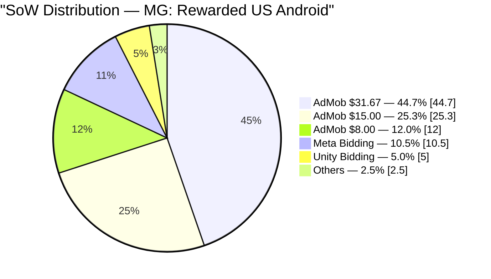

---

## 5. CONFIG SYSTEM — DYNAMIC DB-DRIVEN

### 5.1 Nguyên tắc thiết kế

> **Toàn bộ cấu hình được lưu trong PostgreSQL.** Engine không có bất kỳ hard-code rule logic nào. Thay đổi rule → update DB → có hiệu lực ngay lần chạy tiếp theo, không cần deploy.

### 5.2 Config Hierarchy

```
App X
  └─ Config: waterfall_recommendation_configs
  │    ├─ App-specific (app_id = X)  ← Ưu tiên cao nhất
  │    └─ Global (app_id IS NULL)    ← Fallback
  │
  └─ Rule Group: waterfall_rule_group_apps → waterfall_recommendation_rule_groups
       ├─ MG-specific (grantee_type='mediation_group', grantee_id=MG_ID) ← Ưu tiên cao nhất
       ├─ App-specific (grantee_type='app', grantee_id=APP_ID)            ← Fallback 1
       └─ Default group (is_default = true)                                ← Fallback 2
```

### 5.3 Config Parameters

| Parameter | Field | Default | Ý nghĩa |
|---|---|---|---|
| Min SoW | `min_sow_percent` | **1.0%** | Instance SoW dưới ngưỡng này bị coi là "yếu" |
| Min Match Rate | `min_match_rate_percent` | **3.0%** | Instance MR dưới ngưỡng này có demand thấp |
| Min Recommendations | `min_recommendations` | **5** | Số recs tối thiểu trả về |
| Max Recommendations | `max_recommendations` | **20** | Cap số recs — tránh overwhelm team |

> **Tại sao Min SoW = 1.0%?** Đây là ngưỡng phân loại chính của bộ rule Revenue-First v1. Instance SoW = 0.95% sẽ vào vùng "yếu" và được xem xét điều chỉnh. Bộ AdMob default cũ dùng 0.9%.

### 5.4 Rule Group Versions

| Version | `version` field | Mô tả | is_default |
|---|---|---|---|
| AdMob Recommended | `admob-v1` | Bộ rules gốc, conservative | **true** |
| Revenue-First v1 | `revenue-first-v1` | Bộ rules mới, tối ưu ARPU | false |
| *(future)* | `aggressive-v1` | Bộ rules tích cực hơn | false |

---

## 6. RULE ENGINE — CƠ CHẾ THỰC THI

### 6.1 Evaluation Flow

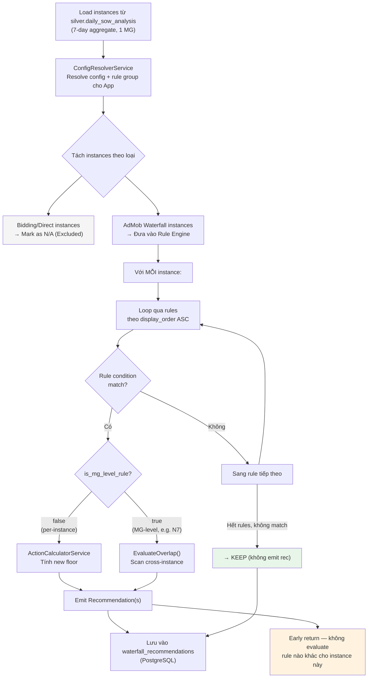

### 6.2 Condition Matching Logic

| Condition Field | Logic | Ví dụ |
|---|---|---|
| `condition_sow_min` | `sow >= value` (NULL = skip) | `1.0` → SoW ≥ 1% |
| `condition_sow_max` | `sow < value` (NULL = skip) | `5.0` → SoW < 5% |
| `condition_match_rate_min` | `mr >= value` (NULL = skip) | `3.0` → MR ≥ 3% |
| `condition_match_rate_max` | `mr < value` (NULL = skip) | `2.0` → MR < 2% |
| `condition_only_one_instance` | `instanceCount == 1` (NULL = skip) | Chỉ trigger khi 1 instance |
| `condition_is_highest_floor` | `isHighestFloor == value` (NULL = skip) | `true` = chỉ highest |
| `condition_overlap_gap_threshold` | Dùng trong MG-level scan (N7) | `12.0` → gap < 12% |

**Default logic giữa conditions: AND**  
**Ngoại lệ — N8 (is_highest_floor = true):** dùng OR giữa `condition_sow_min` và `condition_match_rate_min`

> Đề xuất: thêm field `condition_logic` (varchar: `AND`|`OR`) cho tổng quát hơn khi có thêm OR-based rules.

### 6.3 Early Return & Priority Order

**Quan trọng:** Engine dừng ngay sau khi rule đầu tiên match, không tiếp tục evaluate rule khác. Thứ tự `display_order` **chính là thứ tự ưu tiên**.

```
display_order 1  → N0 (Single Instance Guard)        [Guard — luôn trước]
display_order 2  → N1 (Kill Dead Weight)
display_order 3  → N2 (Healthy Sleeper)
display_order 4  → N4 (Very High MR)                 [Trước N3 — signal mạnh hơn]
display_order 5  → N10 (Concentration ≥ 30%)         [Trước N3/N9 — subset extreme]
display_order 6  → N9 (Raise Base ≥ 15%)             [Trước N3 — subset]
display_order 7  → N3 (Proven Winner 10–30%)
display_order 8  → N5 (Low-MR Trap)                  [Trước N6 — cùng SoW ≥ 5%, khác MR]
display_order 9  → N6 (Ladder Smoothing)
display_order 10 → N7 (Fix Overlap — MG-level)       [Xử lý riêng, sau per-instance]
display_order 11 → N8 (Expand Top Ceiling)
→ No match: KEEP
```

---

## 7. RULE SETS

### 7.1 AdMob Default v1 — Rule Set gốc

*version = `admob-v1` | is_default = true*

| # | Rule Name | Conditions | Action | Formula |
|---|---|---|---|---|
| 1 | Kill & Remove | SoW < 1% AND MR < Min MR | REMOVE | — |
| 2 | Safe Single Instance | Only 1 instance in network | TEST_REDUCE | CurrentFloor × 0.85 |
| 3 | Increase Low SoW | Min SoW ≤ SoW < 1% AND MR ≥ Min | INCREASE | eCPM × 1.10 |
| 4 | Keep Healthy | 1% ≤ SoW ≤ 3% | KEEP | — |
| 5 | Increase Medium SoW Low MR | 3% < SoW ≤ 5% AND MR < Min | INCREASE | eCPM × 1.10 |
| 6 | Increase Medium SoW Good MR | 3% < SoW ≤ 5% AND MR ≥ Min | INCREASE | eCPM × 1.20 |
| 7 | Add Layer | SoW > 5% AND NOT highest floor | ADD_LAYER | (CurrentFloor + NextFloor) / 2 |
| 8 | Add Higher | SoW > 5% AND IS highest floor | ADD_HIGHER | eCPM × 1.40 |

**Decision tree (AdMob Default v1):**

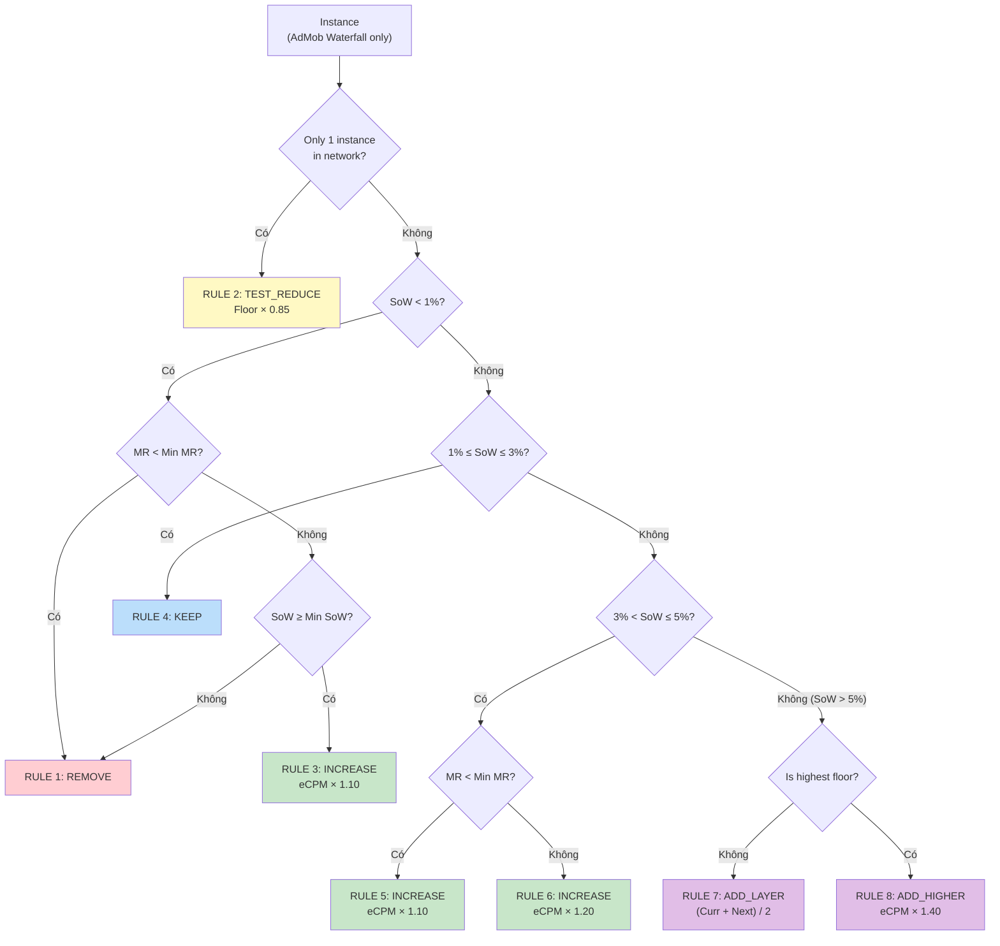

---

### 7.2 Revenue-First Waterfall v1 — Rule Set nâng cao

*version = `revenue-first-v1` | is_default = false*

Bộ rules tối ưu **ARPU và revenue** thay vì chỉ fill rate. Dùng multiplier theo observed eCPM thực, hỗ trợ staircase multi-step.

#### 7.2.1 Constants tham chiếu

| Constant | Giá trị | Dùng trong |
|---|---|---|
| SoW_Kill | 0.5% | N1: ngưỡng xóa |
| SoW_Min | 1.0% (từ config) | N2, phân loại thấp/cao |
| SoW_High | 5.0% | N5, N6 |
| SoW_Major | 10.0% | N3 |
| SoW_Extreme | 15.0% | N9 |
| SoW_Concentrate | 30.0% | N10 |
| MR_Dead | 1.0% | N1 |
| MR_FloorOk | 3.0% (từ config) | N2, N3, N6 |
| MR_VeryHigh | 8.0% | N4 |
| Overlap_Gap | 12.0% | N7 |

#### 7.2.2 Bảng Rules đầy đủ

| # | Rule | Conditions (IF) | Action | Floor Formula | Priority | display_order |
|---|---|---|---|---|---|---|
| N0 | Safe Single Instance | `instanceCount == 1` | TEST_REDUCE | `× 0.85` | High | 1 |
| N1 | Kill Dead Weight | `SoW < 0.5% AND MR < 1%` | REMOVE | — | High | 2 |
| N2 | Save Healthy Sleeper | `Min_SoW ≤ SoW < 1% AND MR ≥ 3%` | INCREASE | `ObsEcpm × 1.10` | Medium | 3 |
| N4 | Harvest Very High MR | `SoW ≥ 1% AND MR ≥ 8%` | INCREASE | `ObsEcpm × 1.35` | High | 4 |
| N10 | Rebalance Concentration | `SoW ≥ 30%` | ADD_STAIRCASE | `×1.10, ×1.25, ×1.45, ×1.80` | High | 5 |
| N9 | Raise Base Floor | `15% ≤ SoW < 30% AND MR ≥ 4%` | INCREASE | `ObsEcpm × 1.12` | Medium | 6 |
| N3 | Promote Proven Winner | `10% ≤ SoW < 30% AND MR ≥ 3%` | ADD_STAIRCASE | `×1.20, ×1.40, ×1.60` | High | 7 |
| N5 | Repair Low-MR Trap | `SoW ≥ 5% AND MR < 2%` | ADD_SPLIT | Lower `×0.90`, Higher `×1.15` | High | 8 |
| N6 | Ladder Smoothing | `SoW ≥ 5% AND MR ≥ 3%` | ADD_MIDSTEPS | `+1/3×gap`, `+2/3×gap` | Medium | 9 |
| N7 | Fix Overlap *(MG-level)* | `gap < 12% AND weak_sow < 1%` | ADJUST_FLOOR | `WeakFloor × 0.85` | Medium | 10 |
| N8 | Expand Top Ceiling | `IsHighest AND (SoW ≥ 0.8% OR MR ≥ 3%)` | ADD_STAIRCASE | `×1.40, ×1.80` | High | 11 |

#### 7.2.3 Decision tree (Revenue-First v1)

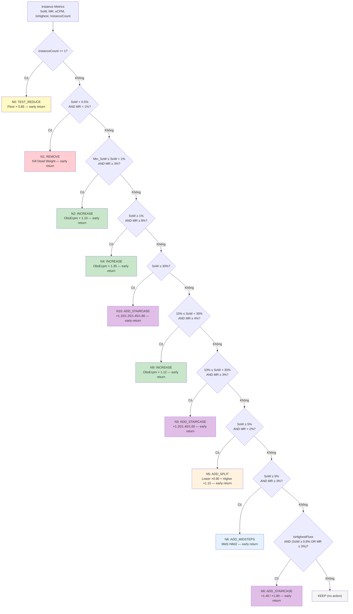

---

## 8. ACTION TYPES & FLOOR CALCULATION

### 8.1 Tất cả Action Types

| Action | Mô tả | Input Fields | Output |
|---|---|---|---|
| `REMOVE` | Xóa instance khỏi waterfall | — | 1 recommendation REMOVE |
| `KEEP` | Không làm gì | — | Không emit (silence = KEEP) |
| `TEST_REDUCE` | Giảm floor + flag monitor | `action_multiplier` | 1 rec, `NewFloor = CurrentFloor × multiplier`, flag `requires_monitoring` |
| `INCREASE` | Tăng floor theo observed eCPM | `action_multiplier` | 1 rec, `NewFloor = ObsEcpm × multiplier` |
| `ADD_LAYER` | Thêm floor trung gian | `action_multiplier` hoặc `action_use_midpoint` | 1 rec ADD_LAYER |
| `ADD_HIGHER` | Thêm floor cao hơn | `action_multiplier` | 1 rec ADD_HIGHER |
| `ADD_STAIRCASE` | Thêm N floors cùng lúc | `action_staircase_steps` (JSON) | N recs ADD_HIGHER |
| `ADD_SPLIT` | Thêm 1 lower + 1 higher | `action_multiplier` (lower), `action_multiplier_2` (higher) | 2 recs |
| `ADD_MIDSTEPS` | Thêm 2 mid-steps | `action_use_midpoint = true`, cần `NextHigherFloor` | 2 recs |
| `ADJUST_FLOOR` | Điều chỉnh floor bậc yếu (N7) | `action_multiplier` | 1 rec per weak instance |

### 8.2 Floor Calculation chi tiết

```
INCREASE:
  NewFloor = round(ObservedEcpm × action_multiplier, 2)
  ※ Dùng ObservedEcpm, KHÔNG dùng CurrentFloor

TEST_REDUCE:
  NewFloor = round(CurrentFloor × action_multiplier, 2)
  ※ Dùng CurrentFloor (giảm từ floor hiện tại)

ADD_LAYER (midpoint):
  action_use_midpoint = true
  NewFloor = round(CurrentFloor + (NextHigherFloor - CurrentFloor) / 2, 2)
  ※ Nếu không có NextHigherFloor → fallback: CurrentFloor × 1.25

ADD_LAYER (multiplier):
  action_use_midpoint = false
  NewFloor = round(CurrentFloor × action_multiplier, 2)

ADD_HIGHER:
  NewFloor = round(CurrentFloor × action_multiplier, 2)
  hoặc NewFloor = round(ObservedEcpm × action_multiplier, 2)
  ※ Tùy rule — xem action_use_midpoint

ADD_STAIRCASE (parse JSON):
  steps = parse(action_staircase_steps)  -- "[1.20, 1.40, 1.60]"
  For each step:
    NewFloor[i] = round(CurrentFloor × step, 2)
  Emit N recommendations

ADD_SPLIT:
  NewFloor_lower  = round(CurrentFloor × action_multiplier, 2)
  NewFloor_higher = round(CurrentFloor × action_multiplier_2, 2)
  Emit 2 recommendations

ADD_MIDSTEPS:
  gap = NextHigherFloor - CurrentFloor
  Mid1 = round(CurrentFloor + gap / 3, 2)
  Mid2 = round(CurrentFloor + gap * 2 / 3, 2)
  Emit 2 recommendations

ADJUST_FLOOR (N7 - MG-level):
  WeakInstance = instance với SoW thấp hơn trong cặp overlap
  NewFloor = round(WeakInstance.CurrentFloor × action_multiplier, 2)
```

### 8.3 Guard Conditions (áp dụng sau calculation)

```
1. NewFloor > 0                          -- Không tạo floor âm hoặc zero
2. NewFloor != CurrentFloor              -- Không tạo rec nếu không đổi gì
3. ObservedEcpm == 0 → fallback:         -- Instance mới, dùng CurrentFloor thay thế
     NewFloor = CurrentFloor × multiplier
4. ADD_STAIRCASE: MG instances > 8 →    -- Không tạo staircase nếu waterfall đã dày
     cap staircase ở 2 bậc cao nhất
5. N7: Max 1 ADJUST_FLOOR per instance per run  -- Tránh duplicate
```

---

## 9. OUTPUT & RECOMMENDATION LIFECYCLE

### 9.1 Recommendation Fields

| Field | Type | Mô tả |
|---|---|---|
| `app_id` | string | AdMob App ID |
| `mediation_group_id` | string | MG ID |
| `instance_id` | string | `ad_source_instance_id` |
| `instance_name` | string | Tên hiển thị |
| `current_floor` | decimal | Floor hiện tại |
| `current_sow` | decimal | SoW % (7-day) |
| `current_match_rate` | decimal | Match rate % (7-day avg) |
| `current_ecpm` | decimal | Observed eCPM (7-day avg) |
| `action` | enum | REMOVE / INCREASE / ADD_HIGHER / ... |
| `recommended_floor` | decimal | Floor mới đề xuất (NULL nếu REMOVE/KEEP) |
| `reason` | string | Lý do (render từ `reason_template`) |
| `priority` | enum | High / Medium / Low |
| `rule_id` | int | Rule nào đã trigger |
| `rule_group_version` | string | `admob-v1` / `revenue-first-v1` |
| `status` | enum | pending / approved / rejected / applied / expired |
| `expires_at` | timestamp | 24h sau khi tạo — sau đó không apply được |
| `analysis_date` | date | Ngày chạy analysis |

### 9.2 Status Lifecycle

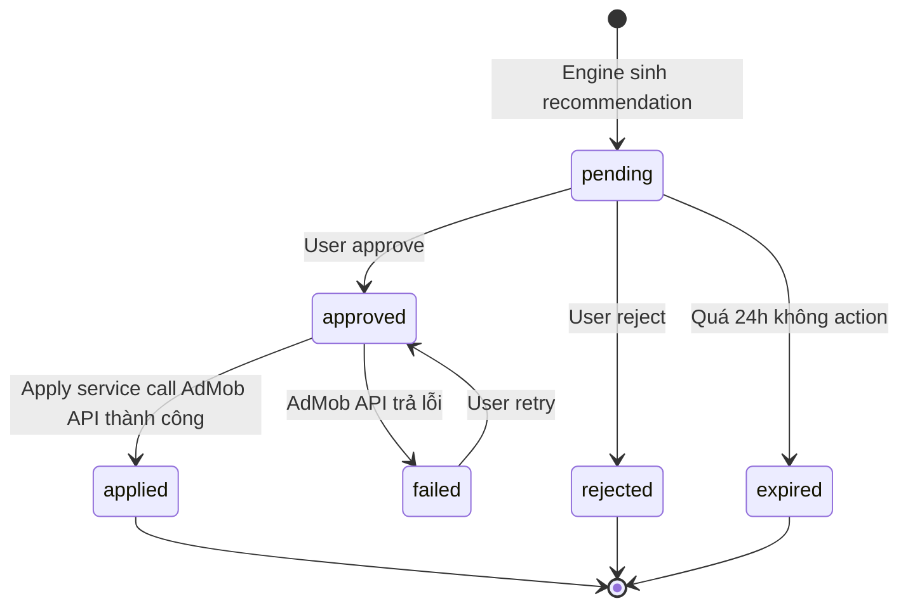

### 9.3 Priority Classification

| Priority | Conditions | Màu UI | Ý nghĩa |
|---|---|---|---|
| **High** | Action = REMOVE, ADD_STAIRCASE, ADD_HIGHER, ADD_SPLIT | 🔴 Red / Purple | Cần action ngay |
| **Medium** | Action = INCREASE, ADD_MIDSTEPS, TEST_REDUCE, ADJUST_FLOOR | 🟡 Amber | Nên action sớm |
| **Low** | Action = KEEP | 🔵 Blue | Không cần action |
| **N/A** | Bidding / Direct sources | ⚪ Gray | Excluded |

---

## 10. API ENDPOINTS

### 10.1 Full API Spec

| Method | Endpoint | Auth | Mô tả |
|---|---|---|---|
| `GET` | `/api/waterfall/filters` | Required | Lấy list apps, platforms, MGs có data |
| `POST` | `/api/waterfall/analyze` | Required | Chạy analysis cho 1 app/MG, trả recommendations |
| `GET` | `/api/waterfall/recommendations` | Required | Lấy danh sách recommendations (filter by app, status, date) |
| `POST` | `/api/waterfall/recommendations/{id}/approve` | Required | Approve 1 recommendation |
| `POST` | `/api/waterfall/recommendations/{id}/reject` | Required | Reject 1 recommendation |
| `POST` | `/api/waterfall/recommendations/bulk-approve` | Required | Approve nhiều recommendations |
| `POST` | `/api/waterfall/apply` | Required | Apply approved recommendations → AdMob API |
| `GET` | `/api/waterfall/configs` | Admin | Lấy danh sách configs |
| `POST` | `/api/waterfall/configs` | Admin | Tạo config mới |
| `PUT` | `/api/waterfall/configs/{id}` | Admin | Update config |
| `GET` | `/api/waterfall/rule-groups` | Admin | Lấy danh sách rule groups |
| `GET` | `/api/waterfall/rule-groups/{id}/rules` | Admin | Lấy rules của group |
| `POST` | `/api/waterfall/rule-groups` | Admin | Tạo rule group mới |
| `POST` | `/api/waterfall/rule-groups/{id}/clone` | Admin | Clone group để tạo biến thể |
| `PUT` | `/api/waterfall/rules/{id}` | Admin | Update 1 rule |

### 10.2 POST /api/waterfall/analyze — Request/Response

```json
// REQUEST
{
  "appId": "ca-app-pub-xxx",
  "mediationGroupId": "mg-xxx",      // null = analyze tất cả MGs của app
  "dateRangeDays": 7,                 // default 7
  "overrideMinSow": null,             // optional override config
  "overrideMinMatchRate": null        // optional override config
}

// RESPONSE
{
  "analysisDate": "2026-03-07",
  "appId": "ca-app-pub-xxx",
  "configUsed": {
    "configId": 1,
    "configName": "Revenue-First v1 - Pilot App 1",
    "minSowPercent": 1.0,
    "minMatchRatePercent": 3.0,
    "ruleGroupId": 2,
    "ruleGroupName": "Revenue-First Waterfall v1",
    "ruleGroupVersion": "revenue-first-v1"
  },
  "mediationGroups": [
    {
      "mediationGroupId": "mg-xxx",
      "mediationGroupName": "Rewarded US Android",
      "totalRevenue7d": 1250.50,
      "instanceCount": 6,
      "recommendations": [
        {
          "id": 12345,
          "instanceId": "asi-xxx",
          "instanceName": "AdMob Network $5.00",
          "currentFloor": 5.00,
          "currentSow": 32.5,
          "currentMatchRate": 4.2,
          "currentEcpm": 6.80,
          "action": "ADD_STAIRCASE",
          "recommendedFloors": [6.80, 8.50, 10.88],
          "reason": "SoW=32.5% ≥ 30% — waterfall mất cân bằng. Tạo 4 bậc staircase.",
          "priority": "High",
          "ruleId": 5,
          "ruleName": "N10 - Rebalance Concentration",
          "status": "pending",
          "expiresAt": "2026-03-08T10:00:00Z"
        }
      ]
    }
  ]
}
```

---

## 11. UI COMPONENTS

### 11.1 Screen Map

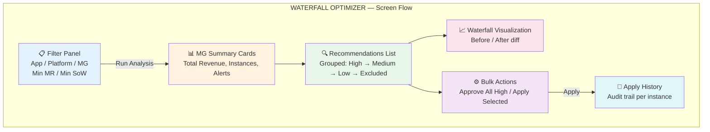

### 11.2 Recommendation Card

```
┌─────────────────────────────────────────────────────────┐
│ 🔴 HIGH    AdMob Network $5.00                   [N10]  │
├─────────────────────────────────────────────────────────┤
│ SoW: 32.5%  │  MR: 4.2%  │  eCPM: $6.80  │  Rev: $406 │
├─────────────────────────────────────────────────────────┤
│ Action: ADD STAIRCASE (4 bậc)                           │
│ New floors: $6.80 → $8.50 → $10.88 → +1 more           │
├─────────────────────────────────────────────────────────┤
│ Reason: SoW ≥ 30% — waterfall mất cân bằng nghiêm trọng│
├─────────────────────────────────────────────────────────┤
│              [✅ Approve]    [❌ Reject]                 │
└─────────────────────────────────────────────────────────┘
```

### 11.3 Waterfall Visualization — Before/After

```
CURRENT WATERFALL          RECOMMENDED WATERFALL
─────────────────          ─────────────────────
$31.67  SoW: 44%           $31.67  SoW: 44%      (unchanged)
$15.00  SoW: 25%     →     $25.00  NEW ──────────── ✅ ADD_HIGHER
$8.00   SoW: 12%           $19.00  NEW ──────────── ✅ ADD_HIGHER
$5.00   SoW: 32%           $15.00  SoW: 25%      (unchanged)
                            $12.00  NEW ──────────── ✅ ADD_LAYER
                            $8.00   SoW: 12%      (unchanged)
                            $6.80   NEW ──────────── ✅ STAIRCASE
                            $5.00   SoW: 32%      (unchanged)
```

Color coding: 🟢 Added (green) | 🔴 Removed (red) | 🟡 Changed (yellow) | ⚪ Unchanged

### 11.4 Config & Rule Management UI (Admin)

| Screen | Mô tả |
|---|---|
| **App Configs** | CRUD configs, gán cho app / global, hiển thị rule group đang dùng |
| **Rule Groups** | Danh sách groups, badge version, clone group, activate/deactivate |
| **Rule Editor** | CRUD rules trong group, drag-drop reorder (= thay đổi display_order), test condition |
| **Group Apps** | Assign app vào group, xem app đang dùng group nào |

---

## 12. APPLY RECOMMENDATIONS → ADMOB WRITE API

### 12.1 Mapping Action → API Calls

| Action | AdMob Write APIs | Chi tiết |
|---|---|---|
| `REMOVE` | W4: `mediationGroups PATCH` | Set line `state = "REMOVED"` |
| `TEST_REDUCE` / `INCREASE` | W2: `waterfallAdUnits:batchUpdate` | `globalFloorMicros = NewFloor × 1,000,000` |
| `ADD_LAYER` / `ADD_HIGHER` / `ADD_STAIRCASE` | W1 → W3 → W4 | Tạo ad unit → link mapping → thêm vào MG |
| `ADD_SPLIT` | W1 → W3 → W4 (×2) | 2 lần W1+W3+W4 cho lower và higher |
| `ADJUST_FLOOR` | W2: `waterfallAdUnits:batchUpdate` | Update floor của bậc yếu |

### 12.2 Validation trước khi Apply

```
1. Recommendation.status == "approved"
2. Recommendation.expires_at > NOW()          -- Không apply rec cũ hơn 24h
3. MG chưa bị thay đổi kể từ analysis_date   -- Re-sync MG structure, compare
4. Không có A/B experiment đang chạy trên MG
5. NewFloor trong range hợp lý: $0.01 - $500
6. AdMob Write API allowlist đã được cấp      -- Prerequisite từ Google
```

### 12.3 Apply Flow

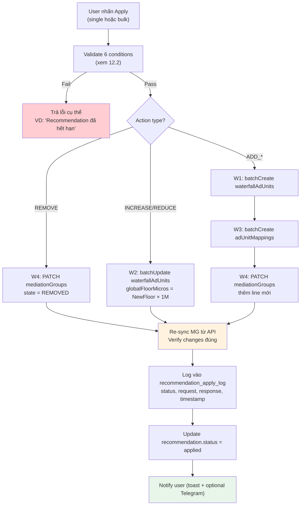

---

## 13. CHECKLIST TRIỂN KHAI

### 13.1 Database

- [ ] Migration: thêm fields mới vào `waterfall_recommendation_rules` (`action_multiplier_2`, `action_staircase_steps`, `condition_overlap_gap_threshold`, `is_mg_level_rule`, `notes`)
- [ ] Migration: thêm fields vào `waterfall_recommendation_configs` (`config_name`, `is_active`, `notes`)
- [ ] Migration: thêm fields vào `waterfall_recommendation_rule_groups` (`version`, `parent_group_id`)
- [ ] Migration: tạo bảng `recommendation_apply_log` nếu chưa có
- [ ] Indexes: tạo các indexes trong Section 3.2
- [ ] Seed: Global config `min_sow_percent = 1.0`
- [ ] Seed: Rule group "AdMob Default v1" (is_default = true, version = admob-v1)
- [ ] Seed: 8 rules cho AdMob Default v1
- [ ] Seed: Rule group "Revenue-First Waterfall v1" (is_default = false, version = revenue-first-v1)
- [ ] Seed: 11 rules cho Revenue-First v1

### 13.2 Backend Services

- [ ] `ConfigResolverService`: resolve config + rule group theo hierarchy (App → Global/Default)
- [ ] `SoWCalculatorService`: query `silver.daily_sow_analysis`, 7-day aggregate
- [ ] `RuleEvaluatorService`: loop theo `display_order`, early-return, handle `is_mg_level_rule`
- [ ] `ActionCalculatorService`: implement tất cả 10 action types (Section 8.1)
- [ ] Guard conditions sau calculation (Section 8.3)
- [ ] N7 MG-level overlap scan (sort by floor → scan pairs → emit ADJUST_FLOOR)
- [ ] N8 OR condition logic
- [ ] `ApplyService`: validate → execute AdMob Write API → verify → log
- [ ] Recommendation expiry: auto-expire records > 24h (Hangfire job)

### 13.3 API

- [ ] Tất cả endpoints trong Section 10.1
- [ ] Swagger documentation đầy đủ
- [ ] Auth + permission check (Mediation role cho analyze/approve/apply, Admin role cho config/rules)

### 13.4 UI

- [ ] Filter Panel với cascading dropdowns
- [ ] Recommendations List, grouped by priority
- [ ] Recommendation Card với action details
- [ ] Waterfall Before/After visualization
- [ ] Bulk approve + apply
- [ ] Apply history / audit trail
- [ ] Admin: Config management UI
- [ ] Admin: Rule Group & Rule Editor (drag-drop reorder)

### 13.5 Validation & Testing

- [ ] Unit test: tất cả action type calculations với examples cụ thể
- [ ] Unit test: guard conditions
- [ ] Integration test: dry-run engine trên pilot apps, verify output
- [ ] Validate N0 guard: không có REMOVE cho single-instance
- [ ] Validate N10 trước N3 khi SoW ≥ 30%
- [ ] Validate N5 tạo đúng 2 recommendations
- [ ] Validate N7 không duplicate

---

## 14. APPENDIX: QUICK REFERENCE

### 14.1 AdMob Default v1 — Rule Summary

| Rule | SoW | MR | Other | Action | Formula |
|---|---|---|---|---|---|
| 1 | < 1% | < Min | Not only instance | REMOVE | — |
| 2 | any | any | Only 1 instance | TEST_REDUCE | Floor × 0.85 |
| 3 | Min ≤ SoW < 1% | ≥ Min | — | INCREASE | eCPM × 1.10 |
| 4 | 1–3% | any | — | KEEP | — |
| 5 | 3–5% | < Min | — | INCREASE | eCPM × 1.10 |
| 6 | 3–5% | ≥ Min | — | INCREASE | eCPM × 1.20 |
| 7 | > 5% | any | Not highest floor | ADD_LAYER | (Curr + Next) / 2 |
| 8 | > 5% | any | Is highest floor | ADD_HIGHER | eCPM × 1.40 |

### 14.2 Revenue-First v1 — Rule Summary

| Rule | SoW | MR | Other | Action | Formula |
|---|---|---|---|---|---|
| N0 | any | any | instanceCount == 1 | TEST_REDUCE | Floor × 0.85 |
| N1 | < 0.5% | < 1% | — | REMOVE | — |
| N2 | Min ≤ SoW < 1% | ≥ 3% | — | INCREASE | eCPM × 1.10 |
| N4 | ≥ 1% | ≥ 8% | — | INCREASE | eCPM × 1.35 |
| N10 | ≥ 30% | any | — | ADD_STAIRCASE | ×1.10/1.25/1.45/1.80 |
| N9 | 15–30% | ≥ 4% | — | INCREASE | eCPM × 1.12 |
| N3 | 10–30% | ≥ 3% | — | ADD_STAIRCASE | ×1.20/1.40/1.60 |
| N5 | ≥ 5% | < 2% | — | ADD_SPLIT | ×0.90 (lower), ×1.15 (higher) |
| N6 | ≥ 5% | ≥ 3% | — | ADD_MIDSTEPS | +1/3 gap, +2/3 gap |
| N7 *(MG)* | — | — | gap < 12%, weak SoW < 1% | ADJUST_FLOOR | WeakFloor × 0.85 |
| N8 | ≥ 0.8% OR MR≥3% | ≥ 3% | Is highest floor | ADD_STAIRCASE | ×1.40/1.80 |

### 14.3 Glossary

| Term | Definition |
|---|---|
| **SoW** | Share of Wallet — tỷ lệ revenue của instance so với tổng MG revenue |
| **eCPM** | Effective Cost Per Mille — revenue per 1000 impressions |
| **Match Rate** | Tỷ lệ ad requests được fill (matched) |
| **Floor Price** | Giá sàn minimum để ad được serve, tính bằng USD |
| **Waterfall** | Danh sách ad sources sắp xếp theo floor price DESC |
| **Mediation Group (MG)** | Nhóm targeting + ad sources của 1 ad unit |
| **Rule Group** | Tập hợp rules áp dụng cho 1 nhóm apps |
| **Config** | Bộ thresholds: min SoW, min MR, min/max recommendations |
| **Early Return** | Dừng evaluate sau khi rule đầu tiên match |
| **MG-level Rule** | Rule scan cross-instance trong 1 MG (N7) |
| **Staircase** | Tập hợp nhiều floors được thêm cùng lúc với multiplier tăng dần |

---

*Document version: 3.0 | Updated: 2026-03-07*  
*Replaces: v2.0 (Feb 2025) — cập nhật config system dynamic DB-driven, Revenue-First v1 rule set, full schema, action types mới*  
*Tài liệu gốc chuẩn cho Waterfall Optimizer Module — mọi update phải sync với doc này trước*