# 114 — AI SQL Assistant for Data Analysts

> **Module:** Mediation Pro Platform — AI-Powered Analytics  
> **Stack:** .NET Core 8 + Claude/Gemini/ChatGPT API + StarRocks + React + Superset  
> **Version:** 1.4 — 2026-03-09  
> **CRAFT Framework:** Context, Role, Action, Format, Tone  
> **Classification:** Internal — Implementation Guide for Cursor AI

---

## Mục lục

1. Tổng quan & Mục tiêu
2. Kiến trúc hệ thống
3. CRAFT Prompt Framework — Nguyên tắc cốt lõi
4. 3-Layer Prompt Architecture
5. Knowledge Base — Cách hoạt động trong luồng chat
   - 5.5 Scoring Config — Admin Tunable
6. Pinned Metrics — Vai trò và cách sử dụng
   - 6.4 Metrics Catalog — Thư viện metrics tập trung
7. Anti-Noise Mechanisms — Chống nhiễu thông tin
8. Role-Specific Prompt Templates
   - 8.6 Base Rules — Global (tách riêng)
   - 8.7 CRAFT Defaults — Global Format & Tone
   - 8.8 Role Prompt Admin UI
   - 8.9 Version History & Rollback
9. Context Management System
   - 9.3 Rename context & conversation
10. Shared Context Library
    - 10.6 Data Context Management UI
    - 10.7 Flow hoàn chỉnh (updated)
11. **Conversation Share, Deep Link & Fork**
12. SQL Generation & Validation
13. SQL Explain in Details
14. Query Execution & Preview
15. View/Dataset Auto-Creation
16. Multi-Provider AI (Claude / Gemini / ChatGPT)
17. Token Quota & Cost Control
18. Integration với Superset
19. Security & Permission
20. Database Design
21. API Design
    - 21.2 Permission Matrix
22. Phân kỳ triển khai
23. Rủi ro & Giảm thiểu
24. KPI/OKR

---

## 1. Tổng quan & Mục tiêu

### 1.1 Bài toán

DA team hiện tại phải:
- Tự viết SQL trên Superset SQL Lab, tra cứu schema thủ công
- Nhớ logic nghiệp vụ (238 metrics, 7 MVs, 5 Gold tables, naming conventions)
- Tạo View/Dataset thủ công khi cần dashboard mới
- Không có trợ lý giúp validate SQL trước khi chạy trên StarRocks
- Không có tài liệu living — best practices và metric definitions phân tán nhiều nơi

### 1.2 Giải pháp: AI SQL Assistant

Tích hợp AI Agent vào Mediation Pro theo nguyên tắc **CRAFT**, cho phép DA:

1. **Hỏi bằng ngôn ngữ tự nhiên** → AI sinh SQL tương thích StarRocks
2. **Test nhanh kết quả** → Preview data ngay trên Mediation Pro
3. **Tạo View/Dataset** → Auto-create StarRocks View + Superset Dataset
4. **Học từ context** → AI hiểu schema, metrics, best practices của Amobear
5. **Quản lý context riêng** → Mỗi DA có workspace riêng, tránh AI over-thinking
6. **Explain in Details** → AI giải thích SQL bằng tiếng Việt, giúp DA học
7. **Chọn AI model** → Claude, Gemini, hoặc ChatGPT tùy preference
8. **Shared Context Library** → Senior DA tạo template context, chia sẻ cho team
9. **Share conversation** → Copy link chia sẻ cuộc hội thoại; mở link (deep link) xem read-only hoặc Fork sang context của mình để tiếp tục hỏi
10. **Rename context & conversation** → Đổi tên context hoặc cuộc hội thoại qua modal Apply/Cancel

### 1.3 Phạm vi Phase

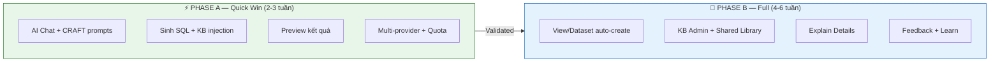

---

## 2. Kiến trúc hệ thống

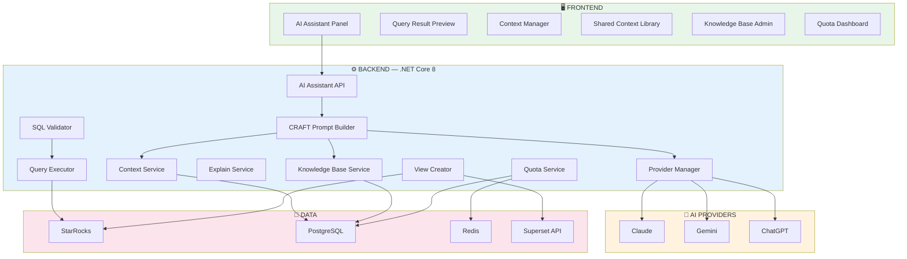

---

## 3. CRAFT Prompt Framework — Nguyên tắc cốt lõi

Mọi prompt gửi tới AI đều tuân thủ **CRAFT**:

| Element | Ý nghĩa | Áp dụng trong hệ thống |
|---|---|---|
| **C — Context** | Background, dữ liệu, phạm vi | Schema DDL + KB entries + Pinned Metrics + Conversation History |
| **R — Role** | AI đóng vai gì | Role-specific persona (DA Assistant, Mediation Advisor, Product Analyst...) |
| **A — Action** | Yêu cầu cụ thể | User question + explicit task (generate SQL, explain, create view...) |
| **F — Format** | Cấu trúc output | Strict JSON schema với sql, explanation, tables_used, warnings... |
| **T — Tone** | Giọng điệu, ngôn ngữ | Vietnamese, data-driven, actionable, include metric formulas |

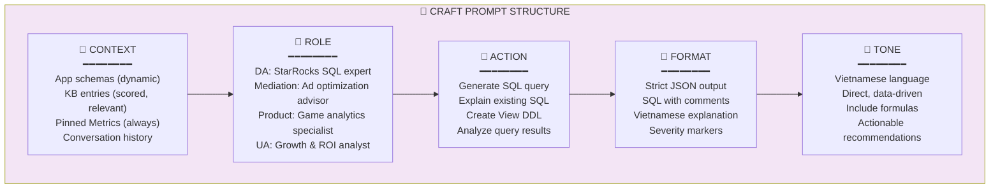

**Tại sao CRAFT quan trọng?**

Không có CRAFT, AI "đoán" bạn muốn gì → output generic, SQL có thể sai syntax, dùng sai table, thiếu filter. Với CRAFT, mỗi element loại bỏ 1 lớp mơ hồ:
- Context loại bỏ: "dùng table nào?" → chỉ có tables trong scope
- Role loại bỏ: "trả lời kiểu gì?" → đúng persona, đúng depth
- Action loại bỏ: "làm gì với câu hỏi?" → task cụ thể
- Format loại bỏ: "output ra sao?" → JSON parseable, không cần guess
- Tone loại bỏ: "viết bằng ngôn ngữ gì?" → Vietnamese, kèm formula

---

## 4. 3-Layer Prompt Architecture

Prompt được tổ hợp từ **3 layers**, mỗi layer có tần suất thay đổi khác nhau:

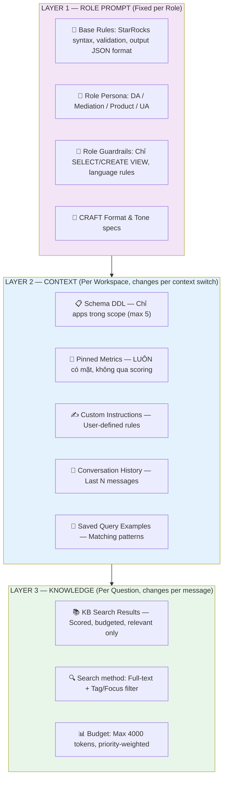

**Tần suất thay đổi:**

| Layer | Khi nào thay đổi | Overhead |
|---|---|---|
| **L1 — Role Prompt** | Khi admin cập nhật role template (hiếm) | 0 — cached |
| **L2 — Context** | Khi user switch context hoặc update settings | Low — 1 DB query |
| **L3 — Knowledge** | Mỗi message — search KB theo câu hỏi | Medium — full-text search |

---

## 5. Knowledge Base — Cách hoạt động trong luồng chat

### 5.1 KB KHÔNG hiển thị trực tiếp cho DA

KB là **"kiến thức ngầm"** được inject vào prompt. DA không biết AI đang dùng KB entry nào — giống khi bạn hỏi chuyên gia, bạn không biết họ đang recall kiến thức nào.

### 5.2 Luồng chi tiết: Từ câu hỏi → KB injection → AI response

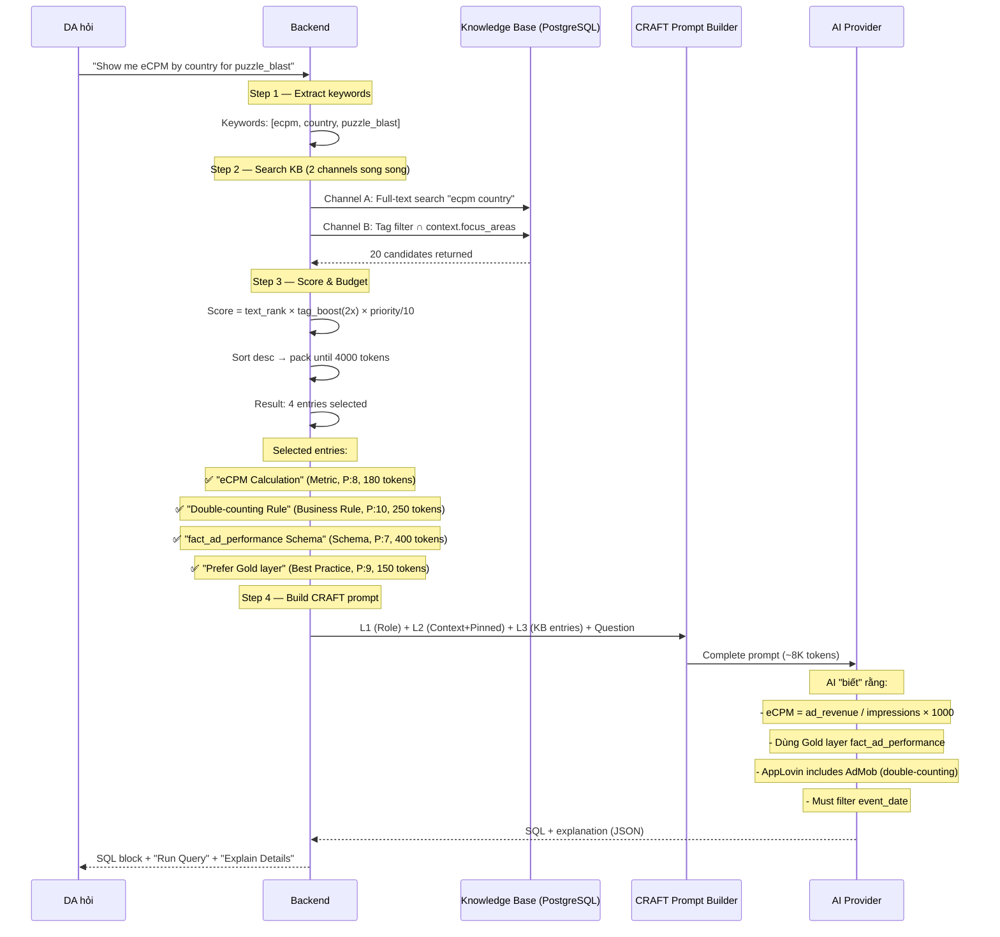

### 5.3 KB Entry Structure (đã có trong giao diện)

Mỗi entry trong KB admin page (ảnh 2 bạn gửi) chứa:

| Field | Ví dụ | Vai trò trong prompt |
|---|---|---|
| **Title** | "eCPM Calculation" | Heading trong KB section của prompt |
| **Category** | Metric / Schema / Business Rule / FAQ / Query Pattern / Best Practice | Filter sidebar + scoring boost |
| **Priority (P)** | 1-10, P:10 = quan trọng nhất | Nhân vào score khi ranking |
| **Tags** | `iaa, ecpm, revenue` | Match với keywords từ user question |
| **Focus Areas** | `iaa, iap, retention, level` | Match với context.focus_areas → boost 2x |
| **Content** | `eCPM = ad_revenue / impressions * 1000` | Inject vào prompt section `## Relevant Knowledge` |

### 5.4 Scoring Formula

```
Score(entry) = text_search_rank(entry, question)
             × tag_boost(entry.tags ∩ question_keywords ? 1.5 : 1.0)
             × focus_boost(entry.focus_areas ∩ context.focus_areas ? 2.0 : 1.0)
             × (entry.priority / 10.0)
```

**Ví dụ cụ thể:**

DA trong context "Game Analytics" (focus: level, retention) hỏi "drop rate analysis":

| KB Entry | text_rank | tag_boost | focus_boost | priority | Final Score |
|---|---|---|---|---|---|
| "Level optimization flow" | 0.8 | 1.5 | **2.0** (level) | 9 | 0.8×1.5×2.0×0.9 = **2.16** ✅ |
| "drop_rate formula" | 0.9 | 1.5 | **2.0** (level) | 8 | 0.9×1.5×2.0×0.8 = **2.16** ✅ |
| "drop_rate vs churn_rate FAQ" | 0.7 | 1.5 | **2.0** (level) | 5 | 0.7×1.5×2.0×0.5 = **1.05** ✅ |
| "eCPM Calculation" | 0.3 | 1.0 | 1.0 (iaa≠level) | 8 | 0.3×1.0×1.0×0.8 = **0.24** ❌ loại |
| "Double-counting Rule" | 0.2 | 1.0 | 1.0 (iaa≠level) | 10 | 0.2×1.0×1.0×1.0 = **0.20** ❌ loại |

→ Chỉ 3 entries liên quan level/retention được inject. eCPM và double-counting bị loại vì không relevant.

### 5.5 Scoring Config — Admin Tunable

Các tham số scoring không hardcode trong backend. `super_admin` tune qua UI (`/admin/ai/system-config` → tab Scoring):

| Config Key | Default | Mô tả | Ảnh hưởng |
|---|---|---|---|
| `kb_token_budget` | 4000 | Max tokens cho KB injection per question | Budget lớn → nhiều KB entries → AI có nhiều context hơn nhưng tốn token |
| `kb_max_candidates` | 20 | Max KB entries search trả về | Ít → nhanh hơn, có thể miss. Nhiều → chậm hơn, scoring quan trọng hơn |
| `kb_max_inject` | 8 | Max KB entries inject vào prompt | Giới hạn tuyệt đối dù còn token budget |
| `kb_tag_boost` | 1.5 | Boost khi entry.tags ∩ question_keywords | Tăng → ưu tiên tag match hơn full-text |
| `kb_focus_boost` | 2.0 | Boost khi entry.focus_areas ∩ context.focus_areas | Tăng → ưu tiên entries cùng domain mạnh hơn |
| `default_max_history` | 20 | Số messages giữ trong conversation | Nhiều → AI hiểu context tốt hơn, tốn token |
| `default_temperature` | 0.1 | Temperature mặc định | Thấp → deterministic, cao → creative |
| `default_provider` | claude | AI provider mặc định | Ảnh hưởng cost và quality |
| `max_prompt_tokens` | 32000 | Max total prompt tokens | Giới hạn tổng L1 + L2 + L3 |
| `data_context_budget` | 15000 | Max tokens cho Data Context | Giới hạn doc 115 injection |
| `schema_injection_budget` | 8000 | Max tokens cho schema DDL | Giới hạn schema injection per context |

**Admin UI — Scoring Config:**

```
┌──────────────────────────────────────────────────────────────┐
│  ⚙️ AI Scoring Configuration                                │
├──────────────────────────────────────────────────────────────┤
│                                                              │
│  ── KB Search & Scoring ──────────────────────────────────  │
│  Token Budget per question:  [ 4000  ] tokens                │
│  Max KB candidates:          [ 20    ] entries               │
│  Max KB inject:              [ 8     ] entries               │
│                                                              │
│  ── Boost Factors ────────────────────────────────────────  │
│  Tag match boost:            [ 1.5   ] ×                     │
│  Focus area match boost:     [ 2.0   ] ×                     │
│                                                              │
│  ── Conversation Defaults ────────────────────────────────  │
│  Default max history:        [ 20    ] messages              │
│  Default temperature:        [ 0.1   ]                       │
│  Default provider:           [ Claude ▼ ]                    │
│                                                              │
│  ── Token Limits ─────────────────────────────────────────  │
│  Max total prompt tokens:    [ 32000 ]                       │
│  Data Context budget:        [ 15000 ] tokens                │
│  Schema injection budget:    [ 8000  ] tokens                │
│                                                              │
│  [↩️ Reset Defaults]                         [💾 Save]       │
└──────────────────────────────────────────────────────────────┘
```

Scoring formula cập nhật (đọc config từ DB):

```
Score(entry) = text_search_rank(entry, question)
             × tag_boost(entry.tags ∩ question_keywords ? CONFIG['kb_tag_boost'] : 1.0)
             × focus_boost(entry.focus_areas ∩ context.focus_areas ? CONFIG['kb_focus_boost'] : 1.0)
             × (entry.priority / 10.0)
```

---

## 6. Pinned Metrics — Vai trò và cách sử dụng

### 6.1 Pinned Metrics ≠ KB

| | Knowledge Base | Pinned Metrics |
|---|---|---|
| **Khi nào inject** | Conditional — search per question | **ALWAYS** — mọi question trong context |
| **Số lượng** | 95+ entries, chọn 3-8 per question | 3-5 per context |
| **Scoring** | Full-text + tag + focus + priority | Không scoring, luôn có |
| **Ví von** | 📚 Thư viện — tra khi cần | 📖 Từ điển luôn mở trên bàn |
| **Mục đích** | Business rules, schema docs, patterns | "Ngôn ngữ" của context — metrics DA quan tâm nhất |

### 6.2 Cách inject vào prompt

```markdown
## Pinned Metrics (ALWAYS PRESENT — this context's key metrics)
- drop_rate = drop_users / start_users × 100 — Level-specific user dropout
  Source: gold.fact_level_performance_{app_id}
- win_rate = win_count / start_count × 100 — Level completion rate
  Source: gold.fact_level_performance_{app_id}  
- reach_rate = start_users / total_input × 100 — Level reach funnel
  Source: gold.fact_level_performance_{app_id}

## Relevant Knowledge (selected per question — scored, budgeted)
### Level optimization flow (Business Rule, P:9)
When analyzing level health, check: drop_rate > 15% → needs attention...

### drop_rate vs churn_rate (FAQ, P:5)
drop_rate is level-specific (fail/quit a level), churn_rate is app-wide...
```

### 6.3 Khi nào Pinned Metrics đặc biệt quan trọng

| Scenario | KB search có thể miss | Pinned Metrics giải quyết |
|---|---|---|
| "Which levels need attention?" | Câu hỏi mơ hồ, KB search kém | AI biết ngay: "attention" = drop_rate > 15% |
| "How's the game doing?" | Quá generic để search KB | AI có drop_rate, win_rate, reach_rate → trả lời đúng |
| "Compare level 10 vs 20" | Không rõ compare gì | AI so sánh tất cả pinned metrics cho 2 levels |
| "Any issues?" | Search KB trả quá nhiều | AI check thresholds từ pinned metrics trước |

### 6.4 Metrics Catalog — Thư viện metrics tập trung

Thay vì user tự gõ metric name + formula khi setup Pinned Metrics, hệ thống cung cấp **Metrics Catalog** do `super_admin` quản lý tập trung.

```mermaid
flowchart LR
    subgraph Admin ["🔑 super_admin"]
        A1["Tạo / Sửa / Import<br/>Metrics vào Catalog"]
    end
    subgraph Catalog ["📊 Metrics Catalog (238 metrics)"]
        C1["Revenue: eCPM, ARPDAU, fill_rate..."]
        C2["Engagement: DAU, sessions, avg_dur..."]
        C3["Retention: D1, D7, D30, LTV..."]
        C4["IAP: pay_rate, ARPPU, conversion..."]
        C5["UA: CPI, ROI, ROAS..."]
        C6["Game: drop_rate, win_rate, reach..."]
    end
    subgraph User ["👤 DA User"]
        U1["Pick từ catalog<br/>khi setup Pinned Metrics"]
        U2["Hoặc tự tạo custom metric"]
    end

    Admin --> Catalog
    Catalog --> U1
    U1 --> U2

    style Catalog fill:#e3f2fd
    style Admin fill:#fff3e0
```

**Mỗi metric trong Catalog chứa:**

| Field | Ví dụ | Mục đích |
|---|---|---|
| `metric_key` | `ecpm` | Unique key, dùng để reference |
| `display_name` | `eCPM` | Tên hiển thị |
| `domain` | `revenue` | Nhóm: revenue, engagement, retention, iap, ua, game, ad_perf |
| `formula` | `ad_revenue / impressions × 1000` | Công thức dạng text (cho user đọc) |
| `formula_sql` | `ROUND(SUM(ad_revenue) / NULLIF(SUM(impressions), 0) * 1000, 2)` | SQL thực tế (cho AI tham chiếu) |
| `description` | `Revenue per 1000 ad impressions` | Mô tả tiếng Việt |
| `source_table` | `gold.ad_performance` | Bảng chứa dữ liệu |
| `unit` | `$` | Đơn vị: `%`, `$`, `count`, `ratio` |
| `thresholds` | `{"healthy": "> 5", "warning": "2-5", "critical": "< 2"}` | Ngưỡng đánh giá tự động |
| `tags` | `[iaa, ecpm, revenue]` | Cho KB scoring match |
| `priority` | `8` | Priority mặc định khi pin vào context |

**Lợi ích Metrics Catalog:**

1. **User không cần nhớ formula** — chỉ pick từ catalog, formula tự điền
2. **Admin quản lý 1 nơi** — sửa formula → cập nhật tất cả contexts đang pin metric đó
3. **AI có `formula_sql`** — tham chiếu trực tiếp, giảm hallucination
4. **Thresholds tự động** — AI biết "healthy/warning/critical" khi phân tích
5. **Domain grouping** — user dễ browse, filter theo domain

**Admin UI — Metrics Catalog (`/admin/ai/metrics-catalog`):**

```
┌──────────────────────────────────────────────────────────────────┐
│  📊 Metrics Catalog                  238 metrics  [+ Add] [📥 Import]│
├──────────────────────────────────────────────────────────────────┤
│                                                                  │
│  Filter: [All Domains ▼] [🔍 Search metrics...]                 │
│                                                                  │
│  Revenue (45) │ Engagement (32) │ Retention (28) │ IAP (35)     │
│  UA (25)      │ Game (40)       │ Ad Perf (33)                  │
│                                                                  │
│  ┌────────┬──────────┬─────────────────────┬──────────┬────┬───┐│
│  │ Key    │ Name     │ Formula             │ Source   │ P  │   ││
│  ├────────┼──────────┼─────────────────────┼──────────┼────┼───┤│
│  │ ecpm   │ eCPM     │ ad_rev/imp×1000     │ gold.ad_ │ 8  │✏️🗑││
│  │ arpdau │ ARPDAU   │ total_rev/dau       │ gold.dai │ 9  │✏️🗑││
│  │ dau    │ DAU      │ COUNT(DISTINCT...)  │ silver.e │ 9  │✏️🗑││
│  │ d1_ret │ D1 Ret.  │ d1_users/cohort×100 │ gold.ret │ 8  │✏️🗑││
│  │ drop_r │ Drop Rate│ drop/start×100      │ gold.con │ 7  │✏️🗑││
│  │ ...    │          │                     │          │    │   ││
│  └────────┴──────────┴─────────────────────┴──────────┴────┴───┘│
│                                                                  │
│  Page 1 of 12  [< Prev] [Next >]                                │
└──────────────────────────────────────────────────────────────────┘
```

**User Pick từ Catalog (khi setup Pinned Metrics trong Context):**

```
┌──────────────────────────────────────────────────────────────┐
│  📌 Pinned Metrics — Game Analytics Context                  │
├──────────────────────────────────────────────────────────────┤
│                                                              │
│  [+ Add from Catalog]  [+ Add Custom Metric]                 │
│                                                              │
│  ┌──────────────────────────────────────────────────────────┐│
│  │ 📊 drop_rate (from catalog)                          [🗑]││
│  │ Formula: drop_users / start_users × 100                  ││
│  │ Source: gold.content_engagement  •  Threshold: < 15%     ││
│  ├──────────────────────────────────────────────────────────┤│
│  │ 📊 win_rate (from catalog)                           [🗑]││
│  │ Formula: win_count / start_count × 100                   ││
│  │ Source: gold.content_engagement  •  Threshold: 40-70%    ││
│  ├──────────────────────────────────────────────────────────┤│
│  │ ✏️ my_custom_metric (custom)                         [🗑]││
│  │ Formula: (editable) level_starts / dau × 100             ││
│  │ Source: (editable)                                       ││
│  └──────────────────────────────────────────────────────────┘│
└──────────────────────────────────────────────────────────────┘
```

---

## 7. Anti-Noise Mechanisms — Chống nhiễu thông tin

### 7.1 Bốn cơ chế chống nhiễu

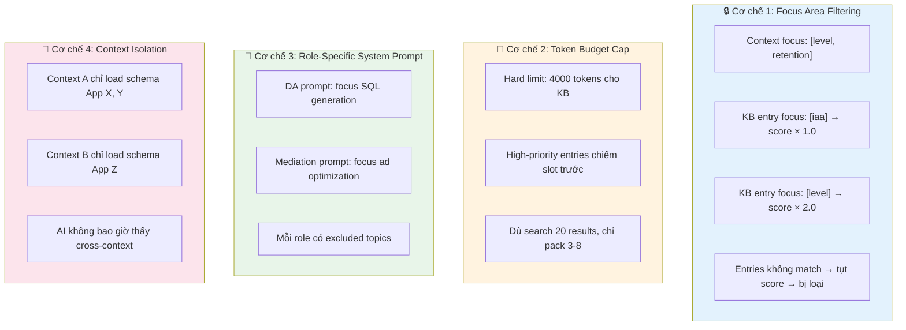

### 7.2 Noise Reduction Matrix

| Noise Source | Without Protection | With CRAFT + Anti-Noise |
|---|---|---|
| KB có 95 entries, hầu hết không liên quan | AI nhận 95 entries → confused, token waste | Score + budget → chỉ 3-8 relevant entries |
| Context "Game" nhưng KB có ad rules | AI áp dụng ad rules cho game question | Focus filter loại ad entries khỏi Game context |
| DA hỏi mơ hồ "any issues?" | AI hallucinate vì không biết check gì | Pinned Metrics → AI check thresholds cụ thể |
| Multiple contexts chung 1 user | AI mix schema từ context khác | Context isolation → chỉ load đúng workspace |
| Conversation dài, drift topic | AI bị ảnh hưởng bởi messages cũ | max_history = 20 → auto-trim old messages |

---

## 8. Role-Specific Prompt Templates

### 8.1 Role Prompt Library

Mỗi role có **System Prompt chuẩn** (Layer 1), lưu trong DB, admin quản lý:

```sql
CREATE TABLE ai_role_prompts (
    id              UUID PRIMARY KEY DEFAULT gen_random_uuid(),
    role_key        VARCHAR(50) UNIQUE NOT NULL,  -- 'da', 'mediation', 'product', 'ua'
    display_name    VARCHAR(100) NOT NULL,
    
    -- CRAFT components
    craft_context   TEXT NOT NULL,   -- Background description
    craft_role      TEXT NOT NULL,   -- Persona definition
    craft_action    TEXT NOT NULL,   -- Default task description
    craft_format    TEXT NOT NULL,   -- Output format spec (JSON schema)
    craft_tone      TEXT NOT NULL,   -- Language, style rules
    
    -- Guardrails
    included_topics TEXT[] DEFAULT '{}',  -- Topics this role should know
    excluded_topics TEXT[] DEFAULT '{}',  -- Topics to ignore
    
    is_active       BOOLEAN DEFAULT true,
    version         INT DEFAULT 1,
    updated_at      TIMESTAMPTZ DEFAULT NOW()
);
```

### 8.2 DA Role Prompt (Default)

```
[C — CONTEXT]
You are part of Amobear's analytics platform (200+ mobile apps, 50M+ users).
Data architecture: Bronze (raw) → Silver (MVs) → Gold (facts) on StarRocks.
You have access to the app schemas, metrics, and best practices provided below.

[R — ROLE]  
You are a StarRocks SQL expert assistant for Data Analysts.
Your expertise: SQL generation, query optimization, data exploration.
You understand mobile game analytics: DAU, retention, eCPM, LTV, level metrics.

[A — ACTION]
Generate StarRocks-compatible SQL from natural language questions.
Explain queries in Vietnamese.
Follow the validation rules strictly.

[F — FORMAT]
Return ONLY valid JSON (no markdown fences):
{
  "sql": "SELECT ...",
  "explanation": "Vietnamese explanation",
  "tables_used": ["gold.fact_daily_overview_xxx"],
  "estimated_complexity": "low|medium|high",
  "warnings": [],
  "suggested_chart": "line|bar|pie|table|null"
}

[T — TONE]
- Vietnamese language for explanations
- Direct, data-driven, include metric formulas
- SQL comments explaining business logic
- Flag both opportunities and risks

[RULES — Non-negotiable]
1. ONLY SELECT or CREATE VIEW
2. ALWAYS event_date filter on Bronze/Silver
3. Use get_json_string(), never JSON_EXTRACT
4. Prefer Gold → Silver → Bronze
5. CAST JSON values when calculating
6. LIMIT 1000 default
7. No SELECT * on Bronze
```

### 8.3 Mediation Role Prompt

```
[R — ROLE]
You are an Ad Monetization Advisor for the Mediation team.
Your expertise: eCPM optimization, waterfall management, SoW analysis,
network comparison (AdMob, AppLovin, Meta), fill rate optimization.

[INCLUDED TOPICS]
ad_revenue, ecpm, fill_rate, sow, waterfall, ad_format, ad_placement,
network_performance, floor_price, impression, click, ctr

[EXCLUDED TOPICS]
level_design, game_difficulty, booster_usage, stage_progression
(These are Product team's domain — redirect if asked)
```

### 8.4 Product Role Prompt

```
[R — ROLE]
You are a Game Analytics Specialist for the Product team.
Your expertise: level design analytics, retention analysis, engagement metrics,
player behavior, drop-off analysis, session quality, progression funnel.

[INCLUDED TOPICS]
level_performance, drop_rate, win_rate, retention, session_duration,
playtime, progression, booster_usage, stage_analysis

[EXCLUDED TOPICS]
waterfall_optimization, floor_price, sow_analysis, network_comparison
(These are Mediation team's domain — redirect if asked)
```

### 8.5 UA Role Prompt

```
[R — ROLE]
You are a User Acquisition & Growth Analyst.
Your expertise: CPI analysis, campaign ROI, LTV/CAC, budget optimization,
channel performance, new user quality, retention by source.

[INCLUDED TOPICS]
ua_cost, cpi, roi, ltv, cac, campaign, install, new_users,
cost_attribution, channel_performance, budget

[EXCLUDED TOPICS]
waterfall_management, level_design, ad_placement_optimization
(These are other teams' domains — redirect if asked)
```

### 8.6 Base Rules — Global (tách riêng khỏi Role Prompt)

Hiện tại 7 rules non-negotiable (ONLY SELECT, event_date filter, LIMIT 1000...) đang **copy-paste trong mỗi role prompt**. Nếu cần sửa 1 rule → phải sửa tất cả roles.

**Giải pháp:** Tách Base Rules thành entry trong `ai_system_configs`, inject **trước** role prompt khi assemble Layer 1.

```
LAYER 1 ASSEMBLY ORDER:
┌──────────────────────────────┐
│ 1. Base Rules (Global)       │ ← Từ ai_system_configs['base_rules']
│    ONLY SELECT, LIMIT,       │   Áp dụng cho MỌI role
│    event_date, JSON syntax   │   Admin sửa 1 chỗ → ảnh hưởng tất cả
├──────────────────────────────┤
│ 2. CRAFT Defaults (Global)   │ ← Từ ai_system_configs['craft_format_default', 'craft_tone_default']
│    Format: JSON output spec  │   Role có thể override nếu cần
│    Tone: Vietnamese, data... │
├──────────────────────────────┤
│ 3. Role Prompt (Per Role)    │ ← Từ ai_role_prompts
│    Context + Role + Action   │   Chỉ chứa nội dung đặc thù
│    + Format override (opt)   │   Không lặp lại base rules
│    + Tone override (opt)     │
├──────────────────────────────┤
│ = Assembled Layer 1 Prompt   │
└──────────────────────────────┘
```

**Base Rules mặc định (lưu trong `ai_system_configs`):**

```
[RULES — Non-negotiable, áp dụng mọi role]
1. ONLY SELECT or CREATE VIEW — tuyệt đối không INSERT/UPDATE/DELETE/DROP
2. ALWAYS filter event_date on Bronze/Silver tables
3. Use get_json_string(), never JSON_EXTRACT (StarRocks syntax)
4. Prefer Gold → Silver → Bronze (performance priority)
5. CAST JSON values when calculating: CAST(get_json_string(...) AS INT)
6. LIMIT 1000 default, max 10000
7. No SELECT * on Bronze (JSON columns quá lớn)
8. Multi-tenant: ALWAYS WHERE app_id = '...' on Silver/Gold
9. JOIN Firebase↔AdMob qua dim_app_identifiers
10. JOIN country cross-source qua dim_country
```

### 8.7 CRAFT Defaults — Global Format & Tone

Thay vì mỗi role tự định nghĩa Format & Tone (thường giống nhau 80%), admin định nghĩa **defaults** global. Role chỉ override khi cần khác biệt.

**Format Default (lưu trong `ai_system_configs`):**

```
[F — FORMAT DEFAULT]
Return ONLY valid JSON (no markdown fences):
{
  "sql": "SELECT ...",
  "explanation": "Vietnamese explanation",
  "tables_used": ["gold.fact_daily_overview_xxx"],
  "estimated_complexity": "low|medium|high",
  "warnings": [],
  "suggested_chart": "line|bar|pie|table|null"
}
```

**Tone Default (lưu trong `ai_system_configs`):**

```
[T — TONE DEFAULT]
- Vietnamese language for explanations
- Direct, data-driven, include metric formulas
- SQL comments explaining business logic
- Flag both opportunities and risks
```

**Override logic:**

| Trường hợp | Kết quả |
|---|---|
| Role **không có** craft_format | Dùng Format Default |
| Role **có** craft_format | Override hoàn toàn Format Default |
| Role **không có** craft_tone | Dùng Tone Default |
| Role **có** craft_tone | Override hoàn toàn Tone Default |

### 8.8 Role Prompt Admin UI (`/admin/ai/role-prompts`)

Trang quản lý dành cho `super_admin`, permission `ai.manage_system`:

```
┌──────────────────────────────────────────────────────────────────┐
│  ⚙️ AI Role Prompt Management                     [+ New Role]  │
├──────────────────────────────────────────────────────────────────┤
│                                                                  │
│  ┌─ 🔒 Global Base Rules ─────────────────────────── [✏️ Edit] ─┐│
│  │ 1. ONLY SELECT or CREATE VIEW                                ││
│  │ 2. ALWAYS event_date filter on Bronze/Silver                 ││
│  │ 3. Use get_json_string(), never JSON_EXTRACT                 ││
│  │ ...7 more rules                                              ││
│  │ Version: v3 • Updated: 2026-03-08 by admin@amobear.com      ││
│  └──────────────────────────────────────────────────────────────┘│
│                                                                  │
│  ┌─ 🎨 CRAFT Defaults ──────────────────────────── [✏️ Edit] ──┐│
│  │ Format Default: JSON {sql, explanation, tables_used...}      ││
│  │ Tone Default: Vietnamese, data-driven, include formulas      ││
│  │ Version: v2 • Updated: 2026-03-05                            ││
│  └──────────────────────────────────────────────────────────────┘│
│                                                                  │
│  ── Role Prompts ────────────────────────────────────────────── │
│  ┌──────────┬──────────┬──────────┬──────────┬──────────┐      │
│  │ 🔬 DA    │ 💰 Med.  │ 🎮 Prod. │ 📈 UA    │ + Custom │      │
│  │ ✅Active │ ✅Active │ ✅Active │ ✅Active │          │      │
│  └──────────┴──────────┴──────────┴──────────┴──────────┘      │
│                                                                  │
│  ┌─ 🔬 Data Analyst Assistant ──── v5 ── ✅ Active ────────────┐│
│  │                                                              ││
│  │  [C] Context ────────────────────────────────────── [✏️]    ││
│  │  You are part of Amobear's analytics platform                ││
│  │  (200+ mobile apps, 50M+ users)...                          ││
│  │                                                              ││
│  │  [R] Role ───────────────────────────────────────── [✏️]    ││
│  │  You are a StarRocks SQL expert assistant for DA...          ││
│  │                                                              ││
│  │  [A] Action ─────────────────────────────────────── [✏️]    ││
│  │  Generate StarRocks-compatible SQL from natural language...  ││
│  │                                                              ││
│  │  [F] Format ──── ☐ Override default ────────────── [✏️]     ││
│  │  (Using global default — JSON {sql, explanation...})        ││
│  │                                                              ││
│  │  [T] Tone ────── ☐ Override default ────────────── [✏️]     ││
│  │  (Using global default — Vietnamese, data-driven...)        ││
│  │                                                              ││
│  │  Included Topics: [sql] [analytics] [metrics] [dashboard]   ││
│  │  Excluded Topics: (none)                                     ││
│  │                                                              ││
│  │  [📋 History (5 versions)]  [👁️ Preview Assembled]  [🧪 Test]│
│  └──────────────────────────────────────────────────────────────┘│
└──────────────────────────────────────────────────────────────────┘
```

**Nút "Preview Assembled"** — Hiển thị prompt Layer 1 đã assemble đầy đủ (Base Rules + Defaults + Role), giúp admin thấy output thực tế trước khi deploy.

**Nút "Test"** — Admin nhập sample question, hệ thống assemble full prompt (L1 + mock L2 + mock L3) và gửi tới AI provider, trả kết quả để admin đánh giá chất lượng.

### 8.9 Version History & Rollback

Mỗi thay đổi Base Rules, CRAFT Defaults, hoặc Role Prompt đều tạo **version mới** tự động:

```
┌──────────────────────────────────────────────────────────────┐
│  📋 Version History — DA Role Prompt                         │
├──────────────────────────────────────────────────────────────┤
│                                                              │
│  v5 (current) • 2026-03-08 • admin@amobear.com              │
│  "Added IAP analysis topics to included list"                │
│  [👁️ View]                                                   │
│                                                              │
│  v4 • 2026-03-01 • admin@amobear.com                        │
│  "Refined Action section for better SQL generation"          │
│  [👁️ View]  [↩️ Rollback to this version]                    │
│                                                              │
│  v3 • 2026-02-20 • admin@amobear.com                        │
│  "Initial CRAFT structure"                                   │
│  [👁️ View]  [↩️ Rollback to this version]                    │
│                                                              │
└──────────────────────────────────────────────────────────────┘
```

**Rollback** = tạo version mới (v6) với nội dung copy từ version được chọn (v3). Không xoá history.

---

## 9. Context Management System

### 9.1 Context = Workspace + CRAFT Configuration

Mỗi context kết hợp **scope data** (apps, tables) với **CRAFT configuration** (role, metrics, instructions):

```sql
CREATE TABLE ai_contexts (
    id                    UUID PRIMARY KEY DEFAULT gen_random_uuid(),
    user_id               UUID NOT NULL REFERENCES users(id),
    name                  VARCHAR(100) NOT NULL,
    description           TEXT,
    icon                  VARCHAR(50) DEFAULT '📊',
    color                 VARCHAR(7) DEFAULT '#3B82F6',
    
    -- Scope (CRAFT Context)
    app_ids               TEXT[] DEFAULT '{}',
    schema_filter         TEXT[] DEFAULT '{}',
    focus_areas           TEXT[] DEFAULT '{}',
    
    -- CRAFT Role
    role_prompt_id        UUID REFERENCES ai_role_prompts(id),  -- Link to role template
    
    -- CRAFT Tone/Format customization
    system_prompt_override TEXT,             -- Custom instructions (appended to role)
    preferred_layer       VARCHAR(10) DEFAULT 'gold',
    preferred_provider    VARCHAR(20) DEFAULT 'claude',
    max_history           INT DEFAULT 20,
    temperature           DECIMAL(2,1) DEFAULT 0.1,
    explain_detail_default BOOLEAN DEFAULT false,
    
    -- Sharing
    is_shared             BOOLEAN DEFAULT false,
    shared_by             UUID REFERENCES users(id),
    cloned_from           UUID REFERENCES ai_contexts(id),
    
    -- Metadata
    is_active             BOOLEAN DEFAULT true,
    is_default            BOOLEAN DEFAULT false,
    created_at            TIMESTAMPTZ DEFAULT NOW(),
    updated_at            TIMESTAMPTZ DEFAULT NOW(),
    UNIQUE(user_id, name)
);
```

### 9.2 Dynamic Schema Injection

| Scenario | Schema injected | Token ~est |
|---|---|---|
| 1 app, Gold layer | 5 Gold tables DDL | ~2K tokens |
| 1 app, All layers | Gold + Silver + Bronze | ~8K tokens |
| Cross-app (2 apps) | 2 × Gold tables | ~4K tokens |

> ⚠️ Hard limit: max 5 app schemas. Hơn 5 → suggest dùng Gold aggregated views.

### 9.3 Rename context & conversation

- **Context:** Dropdown trên từng context trong sidebar → "Rename" → modal nhập tên mới → Apply gọi `PUT /api/v1/ai-assistant/contexts/{id}` với `name`, Cancel đóng modal.
- **Conversation:** Dropdown trên từng cuộc hội thoại trong sidebar → "Rename" → modal nhập tiêu đề mới → Apply gọi `PUT /api/v1/ai-assistant/conversations/{id}/title` với `title`, Cancel đóng modal.
- Frontend: component `RenameModal` dùng chung (props: `open`, `onOpenChange`, `title`, `currentName`, `onApply`). State rename modal (type: context | conversation, id, currentName) quản lý tại `AiAssistantContent`; sidebar nhận `onOpenRenameContext` và `onOpenRenameConversation`.

---

## 10. Shared Context Library

### 10.1 Tổng quan

Shared Context Library gồm **2 loại template**:

| | System Template | User-Published Template |
|---|---|---|
| **Ai quản lý** | `super_admin` qua Admin UI | Senior DA publish context cá nhân |
| **Mục đích** | Template chuẩn cho toàn công ty | Chia sẻ best practice giữa team |
| **Đánh dấu** | `is_system_template = true` | `is_system_template = false` |
| **Xoá được** | Chỉ super_admin | Chỉ người tạo / super_admin |
| **Chỉnh sửa** | Chỉ super_admin (qua modal) | Chỉ người tạo |
| **Hiển thị** | Luôn hiện đầu danh sách, badge "Official" | Hiện trong tab "Community" |
| **Approval** | Không cần (admin tạo) | `is_approved` flag — super_admin bật Yes/No |

> **Community Template Approval:** Khi user publish context, template mặc định `is_approved = false` (chưa được duyệt, hiện với badge "Pending"). `super_admin` review và bật `is_approved = true` → hiện bình thường trong library. Templates chưa approved vẫn hiển thị nhưng có badge "Pending Review" và xếp sau approved templates.

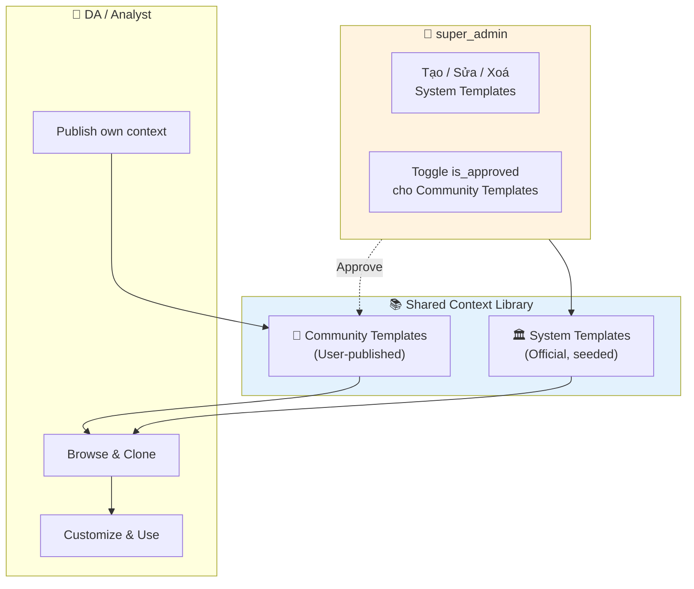

### 10.2 Entity Update — AiContext

```csharp
// Thêm vào AiContext entity
public bool IsSystemTemplate { get; set; }    // true = managed by super_admin
public string? SystemContextKey { get; set; }  // unique key cho system templates (vd: "game_analytics_starter")
public bool IsApproved { get; set; }           // community templates: super_admin toggle yes/no
public bool IncludeDataContext { get; set; }   // true = inject System Data Context vào Layer 2
```

### 10.3 System Template CRUD — super_admin

**API Endpoints (thêm mới):**

| Method | Endpoint | Permission | Mô tả |
|---|---|---|---|
| `GET` | `/api/ai-contexts/templates` | `ai.ask` | Lấy tất cả shared templates (system + community) |
| `POST` | `/api/ai-contexts/templates` | `ai.manage_templates` | Tạo system template (super_admin) |
| `PUT` | `/api/ai-contexts/templates/{id}` | `ai.manage_templates` | Sửa system template |
| `DELETE` | `/api/ai-contexts/templates/{id}` | `ai.manage_templates` | Xoá system template |

**Modal tạo/sửa System Template** (cho super_admin):

```
┌─────────────────────────────────────────────────────┐
│  📝 Create / Edit System Context Template           │
├─────────────────────────────────────────────────────┤
│                                                     │
│  Template Key:  [ game_analytics_starter ]          │
│  Name:          [ 🎮 Game Analytics Starter ]       │
│  Description:   [ Standard context for... ]         │
│  Icon:  [🎮 ▼]    Color: [#3B82F6 🎨]              │
│                                                     │
│  ── Scope ──────────────────────────────────────── │
│  Focus Areas:   [level] [retention] [+]             │
│  Schema Filter: [gold ▼] [silver ▼]                │
│                                                     │
│  ── CRAFT Configuration ────────────────────────── │
│  Role Prompt:   [DA ▼]                              │
│  AI Provider:   [Claude ▼]   Model: [sonnet ▼]     │
│  Temperature:   [0.1 ▼]                             │
│  Max History:   [20]                                 │
│                                                     │
│  Custom Instructions:                               │
│  ┌───────────────────────────────────────────────┐ │
│  │ Always include level_id in game queries.      │ │
│  │ Vietnamese explanations.                       │ │
│  └───────────────────────────────────────────────┘ │
│                                                     │
│  ── Pinned Metrics ─────────────────────────────── │
│  [+ Add Metric]                                     │
│  • drop_rate = drop_users / start_users × 100  [✏️][🗑️] │
│  • win_rate = win_count / start_count × 100    [✏️][🗑️] │
│  • reach_rate = start_users / total_input × 100 [✏️][🗑️] │
│                                                     │
│  ── Data Context ───────────────────────────────── │
│  System Data Context: [✅ Bao gồm]                  │
│  (Tự động inject toàn bộ cấu trúc data hệ thống)   │
│                                                     │
│              [Cancel]  [💾 Save Template]            │
└─────────────────────────────────────────────────────┘
```

### 10.4 Pre-built System Templates (seeded)

| # | Template Key | Name | Role | Focus | Pinned Metrics | Data Context |
|---|---|---|---|---|---|---|
| 1 | `game_analytics_starter` | 🎮 Game Analytics Starter | DA | level, retention | drop_rate, win_rate, reach_rate | ✅ |
| 2 | `ad_revenue_pro` | 💰 Ad Revenue Pro | Mediation | iaa | eCPM, ARPDAU, fill_rate, SoW | ✅ |
| 3 | `iap_analytics` | 🛒 IAP Analytics | DA | iap | pay_rate, ARPPU, conversion_rate | ✅ |
| 4 | `growth_retention` | 📈 Growth & Retention | UA | retention | D1/D7/D30, DAU, LTV | ✅ |
| 5 | `explorer_blank` | 🔍 Explorer (blank) | DA | all | (none) | ✅ |

### 10.5 Data Context — Kiến thức hệ thống chung

Mỗi context template (cả system lẫn user) có thể bật/tắt **System Data Context** — một tài liệu tổng hợp mô tả toàn bộ cấu trúc dữ liệu của hệ thống (Bronze/Silver/Gold tables, naming conventions, query patterns).

Khi được bật, Data Context sẽ được inject vào **Layer 2** của prompt, sau Schema DDL và trước Pinned Metrics:

```
┌─────────────────────────────────────────────────────┐
│ LAYER 2 — CONTEXT                                    │
│                                                      │
│ ## Available Schemas (dynamic per context)            │
│ ...                                                  │
│                                                      │
│ ## System Data Context (if enabled)                  │
│ ... (từ file 115 - DATA CONTEXT FOR AI)              │
│                                                      │
│ ## Pinned Metrics (per context)                      │
│ ...                                                  │
└─────────────────────────────────────────────────────┘
```

> **Chi tiết Data Context:** Xem tài liệu **115 - DATA CONTEXT FOR AI ASSISTANT.md** — tổng hợp từ doc 100 (Storage Architecture) và doc 111 (Views & Metrics Sets).

### 10.6 Data Context Management UI (`/admin/ai/system-config` → tab Data Context)

Nội dung Data Context (doc 115) được lưu trong `ai_system_configs` (key = `system_data_context`) thay vì file markdown tĩnh. `super_admin` quản lý qua Rich Markdown Editor với **versioning** và khả năng **switch version**:

```
┌──────────────────────────────────────────────────────────────────┐
│  📝 System Data Context Management                               │
├──────────────────────────────────────────────────────────────────┤
│                                                                  │
│  Active Version: [v1.1 ▼]  │  Tokens: 12,450 / 15,000           │
│                                                                  │
│  ┌─ Version Selector ──────────────────────────────────────────┐│
│  │ ● v1.1 (active) — 2026-03-09 — "Thêm dim tables, JOIN..."  ││
│  │ ○ v1.0 — 2026-03-01 — "Initial data context"               ││
│  │ [+ Create New Version]   [↩️ Switch Active to Selected]      ││
│  └─────────────────────────────────────────────────────────────┘│
│                                                                  │
│  ── Content Editor (Rich Markdown) ──────────────────────────── │
│  ┌─────────────────────────────────────────────────────────────┐│
│  │ # Amobear Data Context for AI Assistant                     ││
│  │                                                             ││
│  │ ## 1. Kiến trúc tổng quan                                   ││
│  │ ### 1.1 Three-Tier Storage                                  ││
│  │ API Sources (6) → MinIO → StarRocks (Bronze→Silver→Gold)   ││
│  │ + PostgreSQL (Master Data)                                  ││
│  │                                                             ││
│  │ | Layer | Storage | Mục đích | Retention |                  ││
│  │ |-------|---------|----------|-----------|                   ││
│  │ | Raw   | MinIO   | Original | Forever   |                  ││
│  │ | Bronze| StarRocks| Parsed  | 3 năm     |                  ││
│  │ ...                                                         ││
│  └─────────────────────────────────────────────────────────────┘│
│                                                                  │
│  Token Budget: ████████████░░░░ 12,450 / 15,000 (83%)           │
│  ⚠️ Gần đạt token budget. Cân nhắc tóm tắt các phần ít dùng.  │
│                                                                  │
│  [👁️ Preview in Prompt]                      [💾 Save Version]  │
└──────────────────────────────────────────────────────────────────┘
```

**Versioning logic:**

| Hành động | Kết quả |
|---|---|
| **Save Version** | Tạo version mới (v1.2) với nội dung hiện tại. Version cũ giữ nguyên. |
| **Switch Active** | Đổi version đang active (ảnh hưởng tất cả contexts có bật Data Context). Không xoá version khác. |
| **Create New Version** | Clone từ version active, mở editor để sửa. |

**Khi nào cần tạo version mới:**
- Thêm tables/columns mới vào StarRocks
- Thay đổi naming conventions
- Thêm/sửa query patterns
- Cập nhật business rules

### 10.7 Flow hoàn chỉnh (updated)

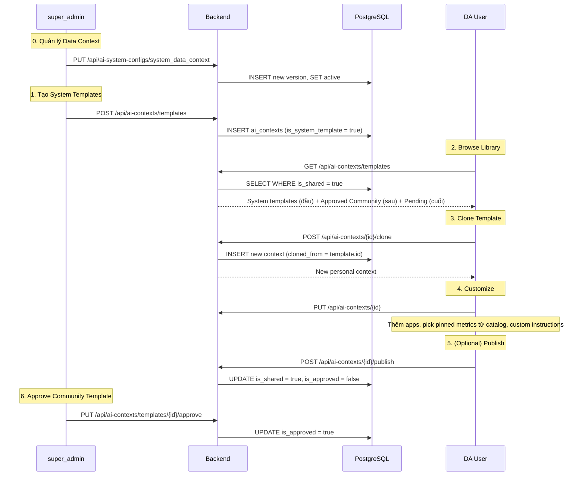

---

## 11. Conversation Share, Deep Link & Fork

### 11.1 Share conversation & Copy Link

- Owner bấm **Share** trên cuộc hội thoại → backend `POST /api/v1/ai-assistant/conversations/{id}/share` set `IsShared = true`.
- Modal hiển thị link: `{origin}/ai-assistant?conversationId={id}`; user copy để gửi cho người khác.

### 11.2 Deep link (?conversationId=)

- Mở URL dạng `/ai-assistant?conversationId={id}` (cùng tab hoặc tab mới): frontend đọc `conversationId` từ query, gọi `GET /api/v1/ai-assistant/conversations/{id}`.
- Backend trả `ConversationDetailDto` gồm `IsOwner`, `IsShared`, `contextId`, `contextName`, `messages`. Nếu không phải owner và conversation chưa share → 404.
- Frontend set `activeContextId` / `activeConversationId` theo kết quả; với shared link dùng `sharedLinkContextFallback` (id + name) khi context không nằm trong danh sách contexts của user.

### 11.3 Xem shared (read-only) & Fork

- Khi `IsShared === true` và `IsOwner === false`: UI hiển thị ở chế độ xem shared (có thể hiển thị badge/label "Shared").
- User **không** gửi tin nhắn mới trực tiếp vào conversation gốc. Khi bấm gửi: mở modal **Chọn context để Fork** (ChooseContextForForkModal) → user chọn context đích → gọi `POST /api/v1/ai-assistant/conversations/{id}/fork?targetContextId={targetContextId}`.
- Backend tạo bản sao conversation (messages copy sang conversation mới thuộc user), trả `ConversationDetailDto` của conversation mới. Frontend chuyển sang context đã chọn + conversation mới, có thể gửi ngay câu hỏi đang pending (pending ask sau fork).

### 11.4 Luồng tổng thể

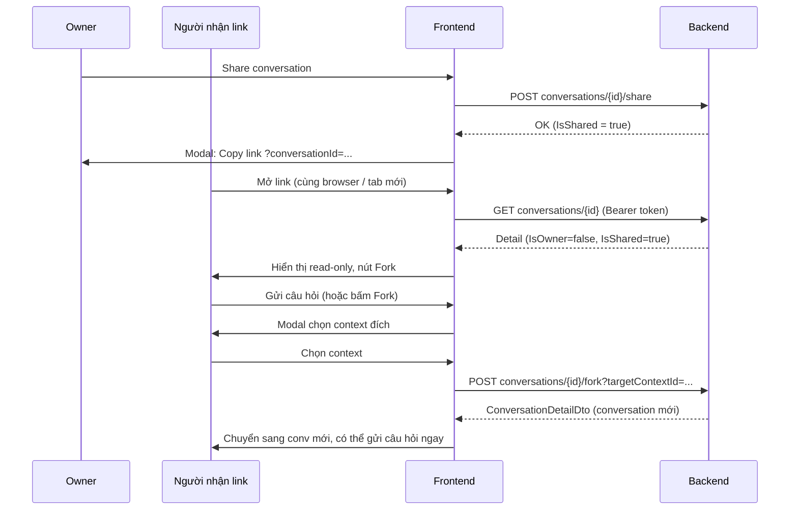

---

## 12. SQL Generation & Validation

### 12.1 Complete Prompt Assembly (CRAFT in Action)

```
┌─────────────────────────────────────────────────────────────┐
│ LAYER 1 — ASSEMBLED (Base Rules + Defaults + Role Prompt)    │
│                                                             │
│ [RULES — Global Base Rules, from ai_system_configs]          │
│ 1. ONLY SELECT or CREATE VIEW                                │
│ 2. ALWAYS event_date filter on Bronze/Silver                 │
│ ... (10 rules, shared by all roles)                          │
│                                                             │
│ [F — FORMAT DEFAULT, from ai_system_configs]                 │
│ Return JSON: {sql, explanation, tables_used...}              │
│                                                             │
│ [T — TONE DEFAULT, from ai_system_configs]                   │
│ Vietnamese, data-driven, include formulas...                 │
│                                                             │
│ [C] You are part of Amobear's analytics platform...          │
│ [R] You are a StarRocks SQL expert for Data Analysts...      │
│ [A] Generate SQL from natural language...                    │
│ [F override] (only if role has custom format)                │
│ [T override] (only if role has custom tone)                  │
├─────────────────────────────────────────────────────────────┤
│ LAYER 2 — CONTEXT (from ai_contexts + relations)            │
│                                                             │
│ ## Available Schemas                                         │
│ Apps in scope: puzzle_blast                                  │
│ -- gold.fact_level_performance_puzzle_blast                   │
│ --   event_date DATE, level_id INT, drop_rate DOUBLE...      │
│                                                             │
│ ## System Data Context (if enabled, from ai_system_configs)  │
│ ... (doc 115 content — Three-Tier Storage, tables, rules...) │
│                                                             │
│ ## Pinned Metrics (ALWAYS PRESENT, from catalog + custom)    │
│ - drop_rate = drop_users / start_users × 100                │
│ - win_rate = win_count / start_count × 100                   │
│                                                             │
│ ## Custom Instructions                                       │
│ Always include level_id. Vietnamese explanations.            │
├─────────────────────────────────────────────────────────────┤
│ LAYER 3 — KNOWLEDGE (from KB search, per question)          │
│                                                             │
│ ## Relevant Knowledge                                        │
│ ### Level optimization flow (Business Rule, P:9)             │
│ drop_rate > 15% → needs game design review...                │
│                                                             │
│ ### Best practice: filter event_date (Best Practice, P:10)   │
│ Always WHERE event_date >= DATE_SUB(CURDATE(), N)            │
├─────────────────────────────────────────────────────────────┤
│ CONVERSATION HISTORY (last N messages)                       │
│ User: "Which levels have issues?"                            │
│ Assistant: {"sql": "SELECT level_id...", ...}                │
├─────────────────────────────────────────────────────────────┤
│ CURRENT QUESTION                                             │
│ "Now show me the worst 10 by drop rate"                      │
└─────────────────────────────────────────────────────────────┘
```

### 12.2 SQL Validation Pipeline

6 rules, unchanged:

| Rule | Check | Action on Fail |
|---|---|---|
| Syntax | Parse SQL AST | Re-prompt AI |
| Destructive Ops | INSERT/UPDATE/DELETE/DROP | Hard block |
| Partition Filter | event_date on Bronze/Silver | Auto-inject 30 days |
| LIMIT | Must ≤ 10000 | Auto-inject 1000 |
| Timeout | EXPLAIN cost | Warn if > 30s |
| Column Safety | No SELECT * on Bronze | Block |

---

## 13. SQL Explain in Details

Nút "Explain Details" trong giao diện (ảnh 1). Khi bấm, AI trả thêm:

```json
{
    "detailed_explanation": {
        "sql_breakdown": [
            {"clause": "FROM gold.fact_level_performance_*", 
             "explain": "Gold layer: drop_rate đã tính sẵn. Bronze phải COUNT DISTINCT 2M rows/ngày."}
        ],
        "performance_notes": "Partition pruning: scan ~3,500 rows thay vì 14M.",
        "business_context": "drop_rate > 15% → cần điều chỉnh game design.",
        "learning_tips": ["Gold layer pre-calculate → luôn thử Gold trước"]
    }
}
```

Mỗi lần explain = 1 AI call riêng (~800 tokens, ~$0.002). Settings: per context default + per message toggle + admin force-on cho beginner.

---

## 14-15. Query Execution & View Creation

(Unchanged from v1.1 — xem chi tiết tại doc gốc)

Safety limits: timeout 60s, max 1000 rows preview, max 3 concurrent/user.
View naming: `gold.v_*`, `silver.sv_*`, `temp.tmp_*`. Superset auto-register Dataset only (no Chart).

---

## 16. Multi-Provider AI

3 providers: Claude (best accuracy), Gemini (fastest/cheapest), ChatGPT (all-rounder).
User chọn per context (default) hoặc per message (override).
Fallback chain: claude → chatgpt → gemini.

---

## 17. Token Quota & Cost Control

3-tier config: global → role → user override.
Redis counters real-time, PG persistence async.
Soft limit 80% (warning), hard limit 100% (block).

---

## 18. Integration với Superset

(Unchanged from v1.1)

---

## 19. Security & Permission

### 19.1 Authentication & Session

> Updated note: The current remember-me behavior is:
>
> - Access token and user are stored in `localStorage` for cross-tab access.
> - Only `Remember me = true` stores a `refreshToken` and enables auto-refresh up to `RefreshTokenExpiryDays`.
> - `Remember me = false` is access-token-only; after expiry the app clears auth session data and redirects to `/login`.

- Mọi API AI Assistant đều yêu cầu `[Authorize]`; frontend gửi `Authorization: Bearer {accessToken}`.
- **Token lưu trong localStorage** (sau khi đăng nhập và khi refresh token) để **cùng origin mở link share ở tab mới vẫn có session**. Trước đây khi không chọn "Remember me" token chỉ lưu sessionStorage → tab mới không có token → bị redirect về login; đã sửa lưu luôn vào localStorage.
- AuthGuard kiểm tra `GET /api/v1/auth/me`; nếu 401/403 thì clear auth và redirect `/login`. ProtectedRoute bọc toàn bộ `/ai-assistant`.

### 19.2 Permission (Screen Function)

- Trang AI Assistant yêu cầu quyền màn hình `s-ai-assistant` function `chat` (ScreenFunctionGuard). Admin quản lý role/permission qua hệ thống có sẵn.

---

## 20. Database Design

### 20.1 Complete Schema (All Tables)

```sql
-- ============================================================
-- 1. System Configs (NEW in v1.3 — Base Rules, CRAFT Defaults, Scoring, Data Context)
-- ============================================================
CREATE TABLE ai_system_configs (
    id              UUID PRIMARY KEY DEFAULT gen_random_uuid(),
    config_key      VARCHAR(50) UNIQUE NOT NULL,
    config_value    TEXT NOT NULL,
    description     TEXT,
    config_type     VARCHAR(20) NOT NULL DEFAULT 'text',  -- 'text', 'json', 'number', 'boolean'
    category        VARCHAR(50) NOT NULL,                 -- 'base_rules', 'craft_defaults', 'scoring', 'data_context'
    is_active       BOOLEAN DEFAULT true,
    version         INT DEFAULT 1,
    updated_by      UUID REFERENCES users(id),
    updated_at      TIMESTAMPTZ DEFAULT NOW()
);

-- Seed system configs
INSERT INTO ai_system_configs (config_key, config_value, description, config_type, category) VALUES
-- Base Rules
('base_rules', '[RULES — Non-negotiable]\n1. ONLY SELECT or CREATE VIEW\n2. ALWAYS event_date filter on Bronze/Silver\n3. Use get_json_string(), never JSON_EXTRACT\n4. Prefer Gold → Silver → Bronze\n5. CAST JSON values when calculating\n6. LIMIT 1000 default, max 10000\n7. No SELECT * on Bronze\n8. Multi-tenant: ALWAYS WHERE app_id\n9. JOIN Firebase↔AdMob qua dim_app_identifiers\n10. JOIN country cross-source qua dim_country',
 'Global base rules áp dụng cho mọi role prompt', 'text', 'base_rules'),
-- CRAFT Defaults
('craft_format_default', '[F — FORMAT DEFAULT]\nReturn ONLY valid JSON (no markdown fences):\n{\n  "sql": "SELECT ...",\n  "explanation": "Vietnamese explanation",\n  "tables_used": [],\n  "estimated_complexity": "low|medium|high",\n  "warnings": [],\n  "suggested_chart": "line|bar|pie|table|null"\n}',
 'Default output format cho mọi role (role có thể override)', 'text', 'craft_defaults'),
('craft_tone_default', '[T — TONE DEFAULT]\n- Vietnamese language\n- Direct, data-driven, include metric formulas\n- SQL comments explaining business logic\n- Flag both opportunities and risks',
 'Default tone cho mọi role (role có thể override)', 'text', 'craft_defaults'),
-- Scoring Config
('kb_token_budget', '4000', 'Max tokens cho KB injection per question', 'number', 'scoring'),
('kb_max_candidates', '20', 'Max KB entries search trả về', 'number', 'scoring'),
('kb_max_inject', '8', 'Max KB entries inject vào prompt', 'number', 'scoring'),
('kb_tag_boost', '1.5', 'Boost factor khi entry.tags match question keywords', 'number', 'scoring'),
('kb_focus_boost', '2.0', 'Boost factor khi entry.focus_areas match context.focus_areas', 'number', 'scoring'),
('default_max_history', '20', 'Số messages giữ trong conversation', 'number', 'scoring'),
('default_temperature', '0.1', 'Temperature mặc định', 'number', 'scoring'),
('default_provider', 'claude', 'AI provider mặc định', 'text', 'scoring'),
('max_prompt_tokens', '32000', 'Max total prompt tokens (L1+L2+L3)', 'number', 'scoring'),
('data_context_budget', '15000', 'Max tokens cho Data Context injection', 'number', 'scoring'),
('schema_injection_budget', '8000', 'Max tokens cho schema DDL injection', 'number', 'scoring'),
-- Data Context (nội dung doc 115)
('system_data_context', '# Amobear Data Context for AI Assistant\n...full content from doc 115...',
 'System Data Context — inject vào Layer 2 khi context bật include_data_context', 'text', 'data_context');

-- System Config Version History
CREATE TABLE ai_system_config_versions (
    id              UUID PRIMARY KEY DEFAULT gen_random_uuid(),
    config_id       UUID NOT NULL REFERENCES ai_system_configs(id) ON DELETE CASCADE,
    version         INT NOT NULL,
    config_value    TEXT NOT NULL,
    change_note     TEXT,
    created_by      UUID REFERENCES users(id),
    created_at      TIMESTAMPTZ DEFAULT NOW(),
    UNIQUE(config_id, version)
);

-- ============================================================
-- 2. Role Prompts (updated in v1.3 — craft_format/tone nullable for defaults)
-- ============================================================
CREATE TABLE ai_role_prompts (
    id              UUID PRIMARY KEY DEFAULT gen_random_uuid(),
    role_key        VARCHAR(50) UNIQUE NOT NULL,
    display_name    VARCHAR(100) NOT NULL,
    craft_context   TEXT NOT NULL,
    craft_role      TEXT NOT NULL,
    craft_action    TEXT NOT NULL,
    craft_format    TEXT,              -- NULL = use global default from ai_system_configs
    craft_tone      TEXT,              -- NULL = use global default from ai_system_configs
    included_topics TEXT[] DEFAULT '{}',
    excluded_topics TEXT[] DEFAULT '{}',
    is_active       BOOLEAN DEFAULT true,
    version         INT DEFAULT 1,
    updated_by      UUID REFERENCES users(id),
    updated_at      TIMESTAMPTZ DEFAULT NOW()
);

-- Role Prompt Version History
CREATE TABLE ai_role_prompt_versions (
    id              UUID PRIMARY KEY DEFAULT gen_random_uuid(),
    role_prompt_id  UUID NOT NULL REFERENCES ai_role_prompts(id) ON DELETE CASCADE,
    version         INT NOT NULL,
    craft_context   TEXT NOT NULL,
    craft_role      TEXT NOT NULL,
    craft_action    TEXT NOT NULL,
    craft_format    TEXT,
    craft_tone      TEXT,
    included_topics TEXT[] DEFAULT '{}',
    excluded_topics TEXT[] DEFAULT '{}',
    change_note     TEXT,
    created_by      UUID REFERENCES users(id),
    created_at      TIMESTAMPTZ DEFAULT NOW(),
    UNIQUE(role_prompt_id, version)
);

-- Seed 4 role prompts
INSERT INTO ai_role_prompts (role_key, display_name, craft_context, craft_role, craft_action, included_topics, excluded_topics) VALUES
('da', 'Data Analyst Assistant', '...', '...', '...', 
 '{sql,analytics,metrics,dashboard}', '{}'),
('mediation', 'Mediation Advisor', '...', '...', '...', 
 '{ad_revenue,ecpm,waterfall,sow,fill_rate}', '{level_design,booster}'),
('product', 'Product Analytics Specialist', '...', '...', '...', 
 '{level,retention,engagement,drop_rate,session}', '{waterfall,floor_price,sow}'),
('ua', 'UA Growth Analyst', '...', '...', '...', 
 '{cpi,roi,ltv,campaign,budget,install}', '{waterfall,level_design}');

-- ============================================================
-- 3. Metrics Catalog (NEW in v1.3)
-- ============================================================
CREATE TABLE ai_metrics_catalog (
    id              UUID PRIMARY KEY DEFAULT gen_random_uuid(),
    metric_key      VARCHAR(100) UNIQUE NOT NULL,   -- 'ecpm', 'arpdau', 'd1_retention'
    display_name    VARCHAR(200) NOT NULL,           -- 'eCPM'
    domain          VARCHAR(50) NOT NULL,            -- 'revenue', 'engagement', 'retention', 'iap', 'ua', 'game', 'ad_perf'
    formula         TEXT NOT NULL,                   -- 'ad_revenue / impressions × 1000'
    formula_sql     TEXT,                            -- 'ROUND(SUM(ad_revenue) / NULLIF(SUM(impressions), 0) * 1000, 2)'
    description     TEXT,                            -- Mô tả tiếng Việt
    source_table    VARCHAR(200),                    -- 'gold.ad_performance'
    unit            VARCHAR(20) DEFAULT '',          -- '%', '$', 'count', 'ratio'
    thresholds      JSONB,                           -- {"healthy": "> 5", "warning": "2-5", "critical": "< 2"}
    tags            TEXT[] DEFAULT '{}',             -- Cho KB scoring match
    default_priority INT DEFAULT 5,                  -- Priority mặc định khi pin vào context
    is_active       BOOLEAN DEFAULT true,
    created_by      UUID REFERENCES users(id),
    updated_at      TIMESTAMPTZ DEFAULT NOW()
);

-- Seed sample metrics (238 total — ví dụ 10)
INSERT INTO ai_metrics_catalog (metric_key, display_name, domain, formula, formula_sql, source_table, unit, thresholds, tags, default_priority) VALUES
('ecpm', 'eCPM', 'revenue', 'ad_revenue / impressions × 1000',
 'ROUND(SUM(ad_revenue) / NULLIF(SUM(impressions), 0) * 1000, 2)',
 'gold.ad_performance', '$', '{"healthy": "> 5", "warning": "2-5", "critical": "< 2"}',
 '{iaa,ecpm,revenue,ad}', 8),
('arpdau', 'ARPDAU', 'revenue', 'total_revenue / dau',
 'ROUND(SUM(total_rev) / NULLIF(SUM(dau), 0), 4)',
 'gold.daily_overview', '$', '{"healthy": "> 0.05", "warning": "0.02-0.05", "critical": "< 0.02"}',
 '{revenue,arpdau,monetization}', 9),
('dau', 'DAU', 'engagement', 'COUNT(DISTINCT user_pseudo_id) WHERE session_start ∪ user_engagement',
 'dau', 'gold.daily_overview', 'count', NULL,
 '{engagement,dau,users}', 9),
('d1_retention', 'D1 Retention', 'retention', 'active_users_day_1 / cohort_size × 100',
 'retention_rate WHERE retention_day = 1', 'gold.retention_overview', '%',
 '{"healthy": "> 35", "warning": "30-35", "critical": "< 30"}',
 '{retention,d1,cohort}', 8),
('d7_retention', 'D7 Retention', 'retention', 'active_users_day_7 / cohort_size × 100',
 'retention_rate WHERE retention_day = 7', 'gold.retention_overview', '%',
 '{"healthy": "> 15", "warning": "10-15", "critical": "< 10"}',
 '{retention,d7,cohort}', 8),
('drop_rate', 'Drop Rate', 'game', 'drop_users / start_users × 100',
 'ROUND(drop_users * 100.0 / NULLIF(start_users, 0), 2)',
 'gold.content_engagement', '%', '{"healthy": "< 15", "warning": "15-25", "critical": "> 25"}',
 '{game,level,drop_rate,progression}', 7),
('fill_rate', 'Fill Rate', 'ad_perf', '(requests - load_fails) / requests × 100',
 'fill_rate', 'gold.ad_performance', '%',
 '{"healthy": "> 80", "warning": "60-80", "critical": "< 60"}',
 '{iaa,fill_rate,ad}', 7),
('pay_rate', 'Pay Rate', 'iap', 'iap_users / active_users × 100',
 'pay_rate', 'gold.iap_performance', '%',
 '{"healthy": "> 3", "warning": "1-3", "critical": "< 1"}',
 '{iap,pay_rate,monetization}', 8),
('cpi', 'CPI', 'ua', 'ua_cost / installs',
 'ROUND(SUM(ua_cost) / NULLIF(SUM(installs), 0), 2)',
 'gold.fact_daily_app_metrics', '$', NULL,
 '{ua,cpi,cost,acquisition}', 7),
('roi', 'ROI', 'ua', '(revenue - cost) / cost × 100',
 'roi', 'gold.fact_daily_app_metrics', '%',
 '{"healthy": "> 100", "warning": "50-100", "critical": "< 50"}',
 '{ua,roi,revenue,cost}', 8);

-- ============================================================
-- 4. Contexts (updated in v1.3: is_approved, include_data_context)
-- ============================================================
CREATE TABLE ai_contexts (
    id                    UUID PRIMARY KEY DEFAULT gen_random_uuid(),
    user_id               UUID NOT NULL REFERENCES users(id),
    name                  VARCHAR(100) NOT NULL,
    description           TEXT,
    icon                  VARCHAR(50) DEFAULT '📊',
    color                 VARCHAR(7) DEFAULT '#3B82F6',
    app_ids               TEXT[] DEFAULT '{}',
    schema_filter         TEXT[] DEFAULT '{}',
    focus_areas           TEXT[] DEFAULT '{}',
    role_prompt_id        UUID REFERENCES ai_role_prompts(id),
    system_prompt_override TEXT,
    preferred_layer       VARCHAR(10) DEFAULT 'gold',
    preferred_provider    VARCHAR(20) DEFAULT 'claude',
    max_history           INT DEFAULT 20,
    temperature           DECIMAL(2,1) DEFAULT 0.1,
    explain_detail_default BOOLEAN DEFAULT false,
    include_data_context  BOOLEAN DEFAULT true,           -- NEW: inject System Data Context vào L2
    is_shared             BOOLEAN DEFAULT false,
    is_approved           BOOLEAN DEFAULT false,          -- NEW: super_admin approval cho community templates
    is_system_template    BOOLEAN DEFAULT false,          -- NEW: true = managed by super_admin
    system_context_key    VARCHAR(100),                   -- NEW: unique key cho system templates
    shared_by             UUID REFERENCES users(id),
    cloned_from           UUID REFERENCES ai_contexts(id),
    is_active             BOOLEAN DEFAULT true,
    is_default            BOOLEAN DEFAULT false,
    created_at            TIMESTAMPTZ DEFAULT NOW(),
    updated_at            TIMESTAMPTZ DEFAULT NOW(),
    UNIQUE(user_id, name)
);

-- 4b. Pinned Metrics (updated: link to catalog)
CREATE TABLE ai_context_pinned_metrics (
    id              UUID PRIMARY KEY DEFAULT gen_random_uuid(),
    context_id      UUID NOT NULL REFERENCES ai_contexts(id) ON DELETE CASCADE,
    catalog_metric_id UUID REFERENCES ai_metrics_catalog(id),  -- NEW: link to catalog (NULL = custom metric)
    metric_name     VARCHAR(100) NOT NULL,
    metric_formula  TEXT NOT NULL,
    description     TEXT,
    source_table    VARCHAR(200),
    display_order   INT DEFAULT 0,
    created_at      TIMESTAMPTZ DEFAULT NOW()
);

-- 5-12. Remaining tables (unchanged from v1.1)
-- ai_conversations, ai_messages,
-- ai_context_saved_queries, ai_shared_context_stats,
-- ai_knowledge_base, ai_kb_feedback,
-- ai_token_quotas, ai_token_usage, ai_audit_log
-- (See v1.1 migration SQL for full DDL)
```

### 20.2 ER Diagram

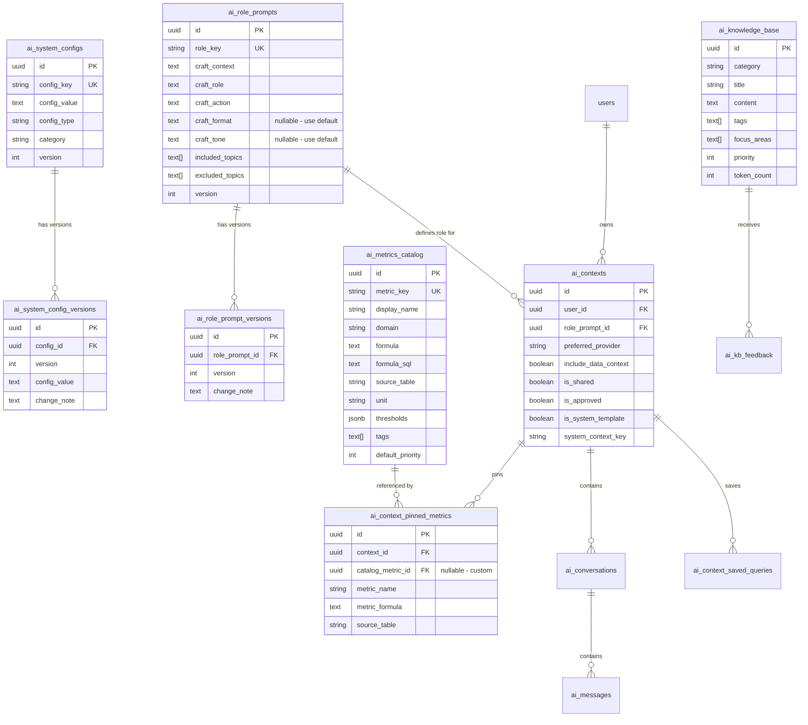

---

## 21. API Design

### 21.1 Full Endpoint List (AI Assistant — đúng với implementation hiện tại)

| Method | Endpoint | Permission | Mô tả |
|---|---|---|---|
| | **AI Assistant — Chat & Query** | | |
| `POST` | `/api/ai-assistant/ask` | `ai.ask` | Gửi câu hỏi |
| `POST` | `/api/ai-assistant/ask/stream` | `ai.ask` | Streaming response |
| `POST` | `/api/ai-assistant/execute` | `ai.execute` | Chạy SQL |
| `POST` | `/api/ai-assistant/explain-details` | `ai.ask` | Giải thích SQL |
| `POST` | `/api/ai-assistant/create-view` | `ai.create_view` | Tạo View |
| `POST` | `/api/ai-assistant/apply-view` | `ai.create_view` | Apply View lên Superset |
| `GET/DELETE` | `/api/ai-assistant/conversations[/{id}]` | `ai.ask` | Quản lý conversations |
| | **Contexts** | | |
| `CRUD` | `/api/ai-contexts` | `ai.manage_contexts` | CRUD personal contexts |
| `GET` | `/api/ai-contexts/shared` | `ai.ask` | Browse shared library |
| `POST` | `/api/ai-contexts/{id}/publish` | `ai.publish_context` | Publish lên community |
| `POST` | `/api/ai-contexts/{id}/clone` | `ai.manage_contexts` | Clone template |
| `POST` | `/api/ai-contexts/{id}/rate` | `ai.ask` | Rate template |
| | **Context Templates (super_admin)** | | |
| `GET` | `/api/ai-contexts/templates` | `ai.ask` | Lấy tất cả templates |
| `POST` | `/api/ai-contexts/templates` | `ai.manage_templates` | Tạo system template |
| `PUT` | `/api/ai-contexts/templates/{id}` | `ai.manage_templates` | Sửa system template |
| `DELETE` | `/api/ai-contexts/templates/{id}` | `ai.manage_templates` | Xoá system template |
| `PUT` | `/api/ai-contexts/templates/{id}/approve` | `ai.manage_templates` | Toggle is_approved |
| | **Knowledge Base** | | |
| `CRUD` | `/api/ai-knowledge-base` | `ai.manage_kb` | CRUD KB entries |
| `POST` | `/api/ai-knowledge-base/import` | `ai.manage_kb` | Import bulk |
| `GET` | `/api/ai-knowledge-base/review-queue` | `ai.manage_kb` | Review queue |
| | **System Config (super_admin)** | | |
| `GET` | `/api/ai-system-configs` | `ai.manage_system` | Lấy tất cả configs |
| `GET` | `/api/ai-system-configs/{key}` | `ai.manage_system` | Lấy config by key |
| `PUT` | `/api/ai-system-configs/{key}` | `ai.manage_system` | Cập nhật config (auto version) |
| `GET` | `/api/ai-system-configs/{key}/versions` | `ai.manage_system` | Xem version history |
| `POST` | `/api/ai-system-configs/{key}/rollback/{version}` | `ai.manage_system` | Rollback config |
| | **Role Prompts (super_admin)** | | |
| `CRUD` | `/api/ai-role-prompts` | `ai.manage_system` | CRUD role prompts |
| `GET` | `/api/ai-role-prompts/{id}/versions` | `ai.manage_system` | Version history |
| `POST` | `/api/ai-role-prompts/{id}/rollback/{version}` | `ai.manage_system` | Rollback version |
| `POST` | `/api/ai-role-prompts/{id}/preview` | `ai.manage_system` | Preview assembled L1 |
| `POST` | `/api/ai-role-prompts/{id}/test` | `ai.manage_system` | Test với sample question |
| | **Metrics Catalog** | | |
| `GET` | `/api/ai-metrics-catalog` | `ai.ask` | Browse catalog (user pick) |
| `CRUD` | `/api/ai-metrics-catalog` | `ai.manage_system` | Admin CRUD metrics |
| `POST` | `/api/ai-metrics-catalog/import` | `ai.manage_system` | Import bulk CSV/JSON |
| | **Quota & Usage** | | |
| `GET` | `/api/ai-assistant/my-usage` | `ai.ask` | Usage cá nhân |
| `GET` | `/api/ai-assistant/team-usage` | `ai.manage_quotas` | Usage team |
| `CRUD` | `/api/ai-token-quotas` | `ai.manage_quotas` | CRUD quotas |
| | **Providers** | | |
| `GET` | `/api/ai-providers[/compare]` | `ai.ask` | So sánh providers |

**Base path thực tế:** `api/v1/ai-assistant` (controller `[Route("api/v1/ai-assistant")]`). Các endpoint liên quan Share/Fork/Rename:

- `PUT /api/v1/ai-assistant/contexts/{id}` — cập nhật context (body có `name` → rename context).
- `GET /api/v1/ai-assistant/conversations/{id}` — chi tiết conversation (trả `IsOwner`, `IsShared`).
- `POST /api/v1/ai-assistant/conversations/{id}/share` — bật share, sau đó frontend copy link `?conversationId=...`.
- `POST /api/v1/ai-assistant/conversations/{id}/fork?targetContextId=...` — fork sang context đích.
- `PUT /api/v1/ai-assistant/conversations/{id}/title` — đổi tiêu đề (rename conversation), body `{ "title": "..." }`.

### 21.2 Permission Matrix

| Permission | Ai có | Scope |
|---|---|---|
| `ai.ask` | Tất cả DA/Analyst | Chat, browse catalog, browse templates |
| `ai.execute` | DA có quyền chạy SQL | Execute queries |
| `ai.create_view` | Senior DA | Tạo View + Superset Dataset |
| `ai.manage_contexts` | DA | CRUD personal contexts |
| `ai.publish_context` | DA | Publish context lên community |
| `ai.manage_templates` | `super_admin` | System templates + approve community |
| `ai.manage_kb` | Admin/Senior DA | KB entries CRUD |
| `ai.manage_system` | `super_admin` | System configs, role prompts, metrics catalog |
| `ai.manage_quotas` | Admin | Token quotas |

---

## 22. Phân kỳ triển khai

### 22.1 Roadmap

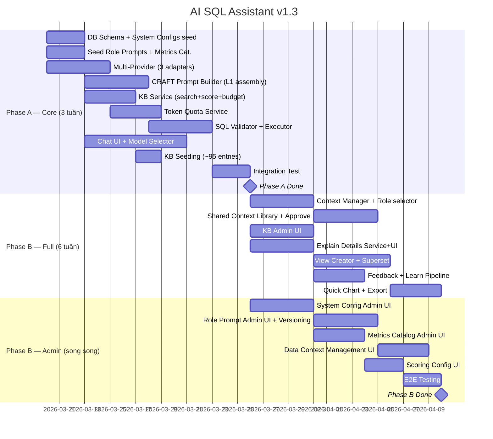

### 22.2 Checklist

**Phase A — Core (ngày 1-21):**
- [ ] DB migration: all tables bao gồm ai_system_configs, ai_metrics_catalog, version tables
- [ ] Seed system configs (base_rules, craft_defaults, scoring config, data context)
- [ ] Seed 4 role prompts (DA, Mediation, Product, UA) — craft_format/tone = NULL (dùng default)
- [ ] Seed metrics catalog (~238 metrics từ doc 111 + doc 115)
- [ ] AI Provider: Claude + Gemini + ChatGPT adapters
- [ ] Provider Manager with fallback chain
- [ ] **CRAFT Prompt Builder** (3-layer assembly: Base Rules + Defaults + Role → Context + DataContext + Pinned → KB)
- [ ] **KB Service** (full-text search + tag filter + scoring từ ai_system_configs + budget packing)
- [ ] Token Quota Service (Redis + PG)
- [ ] Context Service (CRUD + schema loading + pinned metrics from catalog)
- [ ] SQL Validator (6 rules) + Query Executor
- [ ] Chat UI with model selector + quota bar
- [ ] Seed KB from doc 111 (~95 entries)

**Phase B — Full Features (ngày 22-63):**
- [ ] Context Manager with role prompt selector
- [ ] Shared Context Library (publish, clone, rate, is_approved flag)
- [ ] Seed 5 starter system context templates
- [ ] KB Admin CRUD + search + categories
- [ ] Explain Details service + UI toggle
- [ ] CREATE VIEW generator + Superset dataset
- [ ] Feedback + learned queries → review queue
- [ ] Quick chart + CSV export + Copy-to-Superset

**Phase B — Admin Management (song song ngày 22-63):**
- [ ] System Config Admin UI (`/admin/ai/system-config`)
  - [ ] Base Rules editor + versioning
  - [ ] CRAFT Defaults editor (Format & Tone) + versioning
  - [ ] Scoring Config form (tunable parameters)
- [ ] Role Prompt Admin UI (`/admin/ai/role-prompts`)
  - [ ] CRAFT component editor (C-R-A-F-T tabs)
  - [ ] Format/Tone override toggle (use default or custom)
  - [ ] Included/Excluded topics manager
  - [ ] Version history + rollback
  - [ ] Preview Assembled prompt
  - [ ] Test with sample question
- [ ] Metrics Catalog Admin UI (`/admin/ai/metrics-catalog`)
  - [ ] CRUD metrics (key, formula, formula_sql, thresholds, tags)
  - [ ] Domain grouping + filter
  - [ ] Bulk import (CSV/JSON)
  - [ ] User-facing: pick from catalog khi setup Pinned Metrics
- [ ] Data Context Management UI (`/admin/ai/system-config` → tab Data Context)
  - [ ] Rich Markdown editor
  - [ ] Token counter + budget warning
  - [ ] Version selector + switch active version
  - [ ] Preview in prompt
- [ ] Community Template approval (toggle is_approved)
- [ ] E2E Testing tất cả admin features

---

## 23. Rủi ro & Giảm thiểu

| Risk | Mitigation |
|---|---|
| AI hallucination | CRAFT reduces ambiguity + Validator + EXPLAIN + preview |
| Token cost runaway | Quota per user + daily/monthly cap + Redis enforcement |
| KB noise → wrong SQL | 4 anti-noise mechanisms: focus filter, budget cap, role exclusion, context isolation |
| Role prompt drift | Version control on ai_role_prompts, admin review |
| All providers down | 3 providers + fallback chain |

---

## 24. KPI/OKR

| KR | Target |
|---|---|
| SQL valid first try | > 80% |
| Time question → data | < 2 min |
| Queries/DA/day | > 10 |
| KB noise rate (irrelevant injection) | < 10% |
| DA satisfaction | > 4/5 |
| Monthly cost per DA | < $30 |
| Shared contexts adopted | > 50% DA |

---

> 📄 **v1.4 Changes vs v1.3 (2026-03-09 — hoàn thiện tính năng hiện tại):**
> - NEW §9.3: Rename context & conversation — modal Apply/Cancel, PUT contexts/{id} (name), PUT conversations/{id}/title.
> - NEW §11: Conversation Share, Deep Link & Fork — Share → copy link; deep link ?conversationId=; xem shared read-only; Fork (chọn context đích, pending ask); luồng sequence diagram.
> - UPDATED §1.2: Bổ sung mục 9 (Share conversation), 10 (Rename context & conversation).
> - NEW §19: Security & Permission — Auth & Session (token localStorage để mở link share tab mới không bị văng login), Permission (ScreenFunctionGuard s-ai-assistant/chat).
> - UPDATED §21.1: Ghi rõ base path api/v1/ai-assistant và các endpoint share/fork/rename.
> - Renumbered sections: 11 (Share/Fork) → 12–24 (SQL, Explain, … Security 19, DB 20, API 21, Phân kỳ 22, Rủi ro 23, KPI 24).
>
> 📄 **v1.3 Changes vs v1.2:**
> - NEW §5.5: Scoring Config — admin tunable parameters (kb_token_budget, boost factors, etc.)
> - NEW §6.4: Metrics Catalog — thư viện 238 metrics tập trung, admin quản lý, user pick khi pin
> - NEW §8.6: Base Rules tách riêng khỏi Role Prompt → ai_system_configs, shared by all roles
> - NEW §8.7: CRAFT Defaults — global Format & Tone, role chỉ override khi cần
> - NEW §8.8: Role Prompt Admin UI wireframe (`/admin/ai/role-prompts`)
> - NEW §8.9: Version History & Rollback cho role prompts + system configs
> - NEW §10.6: Data Context Management UI — Rich editor, versioning, switch active version
> - UPDATED §10.1: Thêm is_approved flag cho Community Templates (simple yes/no)
> - UPDATED §10.2: Entity thêm IsApproved, IncludeDataContext
> - UPDATED §10.7: Flow hoàn chỉnh bao gồm approval + data context management
> - UPDATED §11.1: Complete Prompt Assembly phản ánh Base Rules + Defaults + Data Context
> - NEW §19: ai_system_configs, ai_system_config_versions, ai_role_prompt_versions, ai_metrics_catalog tables
> - UPDATED §19: ai_contexts thêm include_data_context, is_approved, is_system_template, system_context_key
> - UPDATED §19: ai_context_pinned_metrics thêm catalog_metric_id (link to catalog)
> - UPDATED §19: ai_role_prompts — craft_format/craft_tone nullable (use defaults)
> - UPDATED §20: 42 endpoints (was 28) — thêm system config, role prompt admin, metrics catalog, template approval
> - NEW §20.2: Permission Matrix
> - UPDATED §21: Roadmap + Checklist bao gồm Admin Management track
>
> 📄 **v1.2 Changes vs v1.1:**
> - NEW §3: CRAFT Framework as core principle
> - NEW §4: 3-Layer Prompt Architecture (Role → Context → Knowledge)
> - NEW §5: KB detailed flow with scoring formula + examples
> - NEW §6: Pinned Metrics vs KB comparison + use cases
> - NEW §7: 4 Anti-Noise Mechanisms
> - NEW §8: Role-Specific Prompt Templates (4 roles) + DB table
> - UPDATED §9: Context links to role_prompt_id
> - UPDATED §19: ai_role_prompts table + seeding
> - UPDATED §21: Checklist aligned with CRAFT components
