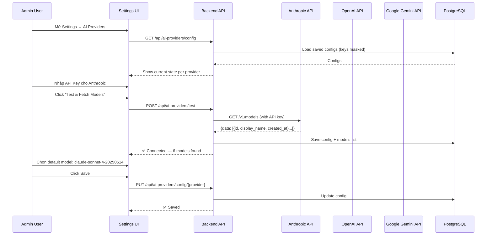
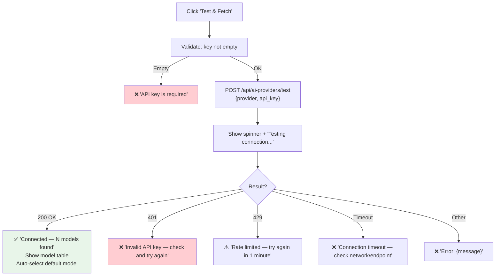

# 112c — AI Provider Settings: Cấu hình & Auto-Discovery

> **Purpose:** Thiết kế màn hình Settings để cấu hình API key cho 3 AI providers + auto-fetch models  
> **Stack:** React + shadcn/ui + .NET Core 8  
> **Reference:** 112 v1.2 FINAL  
> **Version:** 1.0 — 2026-03-08

---

## Mục lục

1. Tổng quan luồng hoạt động
2. API Discovery — 3 Providers
3. Database Design
4. UI Design — Settings Page
5. Backend Implementation
6. v0.dev Prompt
7. Security

---

## 1. Tổng quan luồng hoạt động



**Nguyên tắc:**
- Admin chỉ cần nhập **API Key** — hệ thống tự gọi API lấy danh sách models
- Hệ thống **test connection** trước khi lưu — không lưu key không hợp lệ
- API Key được **encrypt** trước khi lưu vào DB — hiển thị masked (`sk-...abc123`)
- Mỗi provider có **Verify** endpoint riêng — hệ thống tự xử lý khác biệt API

---

## 2. API Discovery — 3 Providers

### 2.1 Anthropic Claude

```
GET https://api.anthropic.com/v1/models
Headers:
  x-api-key: {API_KEY}
  anthropic-version: 2023-06-01

Response:
{
  "data": [
    {
      "id": "claude-sonnet-4-20250514",
      "display_name": "Claude Sonnet 4",
      "created_at": "2025-05-14T00:00:00Z",
      "type": "model"
    },
    {
      "id": "claude-opus-4-6",
      "display_name": "Claude Opus 4.6",
      "created_at": "2026-02-04T00:00:00Z",
      "type": "model"
    }
  ],
  "has_more": true
}
```

**Config cần thiết:** API Key only  
**Endpoint:** `https://api.anthropic.com`  
**Auth:** Header `x-api-key`

### 2.2 OpenAI ChatGPT

```
GET https://api.openai.com/v1/models
Headers:
  Authorization: Bearer {API_KEY}

Response:
{
  "data": [
    {
      "id": "gpt-4o",
      "object": "model",
      "created": 1715367049,
      "owned_by": "system"
    },
    {
      "id": "gpt-4o-mini",
      "object": "model",
      "created": 1721172741,
      "owned_by": "system"
    }
  ]
}
```

**Config cần thiết:** API Key + (optional) Organization ID, Project ID  
**Endpoint:** `https://api.openai.com`  
**Auth:** Header `Authorization: Bearer`  
**Lưu ý:** OpenAI trả về RẤT nhiều models (embeddings, whisper, dall-e...). Backend cần **filter chỉ chat models** (gpt-4o, gpt-4o-mini, gpt-4-turbo, o1, o3...).

### 2.3 Google Gemini

```
GET https://generativelanguage.googleapis.com/v1beta/models?key={API_KEY}

Response:
{
  "models": [
    {
      "name": "models/gemini-2.0-flash",
      "displayName": "Gemini 2.0 Flash",
      "description": "Fast and versatile...",
      "inputTokenLimit": 1048576,
      "outputTokenLimit": 8192,
      "supportedGenerationMethods": ["generateContent", "countTokens"]
    },
    {
      "name": "models/gemini-2.5-pro-preview-05-06",
      "displayName": "Gemini 2.5 Pro Preview",
      ...
    }
  ]
}
```

**Config cần thiết:** API Key only  
**Endpoint:** `https://generativelanguage.googleapis.com`  
**Auth:** Query parameter `key=`  
**Lưu ý:** Filter models có `supportedGenerationMethods` includes `generateContent`.

### 2.4 Comparison — Data mà backend extract

| Field | Anthropic | OpenAI | Gemini |
|---|---|---|---|
| Model ID | `data[].id` | `data[].id` | `models[].name` (remove "models/" prefix) |
| Display Name | `data[].display_name` | (derive from id) | `models[].displayName` |
| Created | `data[].created_at` (ISO) | `data[].created` (unix) | N/A |
| Context Window | Hardcoded map | Hardcoded map | `models[].inputTokenLimit` |
| Supported | `data[].type == "model"` | Filter by id prefix | `supportedGenerationMethods ∋ generateContent` |

---

## 3. Database Design

```sql
CREATE TABLE ai_provider_configs (
    id              UUID PRIMARY KEY DEFAULT gen_random_uuid(),
    provider_key    VARCHAR(20) UNIQUE NOT NULL,   -- 'anthropic', 'openai', 'gemini'
    display_name    VARCHAR(100) NOT NULL,          -- 'Anthropic Claude'
    
    -- Connection
    api_key_encrypted BYTEA,                        -- AES-256 encrypted
    api_key_hint    VARCHAR(20),                    -- 'sk-...abc123' (last 6 chars)
    endpoint_url    VARCHAR(500),                   -- Custom endpoint (optional override)
    extra_config    JSONB DEFAULT '{}',             -- OpenAI: {organization_id, project_id}
    
    -- Status
    is_enabled      BOOLEAN DEFAULT false,
    is_connected    BOOLEAN DEFAULT false,
    last_test_at    TIMESTAMPTZ,
    last_test_error TEXT,
    
    -- Models (auto-fetched)
    available_models JSONB DEFAULT '[]',            -- [{id, display_name, context_window, ...}]
    default_model   VARCHAR(100),                   -- Selected default model ID
    models_fetched_at TIMESTAMPTZ,
    
    -- Pricing (admin-configurable, USD per token)
    cost_per_input_token  DECIMAL(12,10) DEFAULT 0,
    cost_per_output_token DECIMAL(12,10) DEFAULT 0,
    
    -- Metadata
    created_at      TIMESTAMPTZ DEFAULT NOW(),
    updated_at      TIMESTAMPTZ DEFAULT NOW()
);

-- Seed 3 providers (no keys yet)
INSERT INTO ai_provider_configs (provider_key, display_name, endpoint_url, cost_per_input_token, cost_per_output_token) VALUES
('anthropic', 'Anthropic Claude', 'https://api.anthropic.com', 0.000003, 0.000015),
('openai', 'OpenAI ChatGPT', 'https://api.openai.com', 0.0000025, 0.00001),
('gemini', 'Google Gemini', 'https://generativelanguage.googleapis.com', 0.000000075, 0.0000003);
```

---

## 4. UI Design — Settings Page

### 4.1 Page Layout

```
┌─────────────────────────────────────────────────────────────┐
│  Mediation Pro → Settings → AI Providers                     │
│                                                              │
│  Configure AI providers for SQL Assistant, Daily Briefing,   │
│  and other AI-powered features.                              │
│                                                              │
│  ┌────────────────────────────────────────────────────────┐ │
│  │ 🟠 Anthropic Claude                        ✅ Connected │ │
│  │                                                        │ │
│  │ API Key:                                               │ │
│  │ ┌──────────────────────────────────┐                   │ │
│  │ │ sk-ant-api03-...Xk7abc  🔒 [👁]  │  [Test & Fetch]  │ │
│  │ └──────────────────────────────────┘                   │ │
│  │                                                        │ │
│  │ Status: ✅ Connected — 6 models found (2 min ago)      │ │
│  │                                                        │ │
│  │ Default Model: [claude-sonnet-4-20250514 ▼]            │ │
│  │                                                        │ │
│  │ Available Models:                                      │ │
│  │ ┌──────────────────────────────────────────────────┐  │ │
│  │ │ Model                    │ Context │ Created     │  │ │
│  │ ├──────────────────────────┼─────────┼─────────────┤  │ │
│  │ │ ● Claude Opus 4.6        │ 200K    │ Feb 2026    │  │ │
│  │ │ ○ Claude Sonnet 4.6      │ 200K    │ Feb 2026    │  │ │
│  │ │ ○ Claude Sonnet 4.5      │ 200K    │ Sep 2025    │  │ │
│  │ │ ○ Claude Sonnet 4        │ 200K    │ May 2025    │  │ │
│  │ │ ○ Claude Haiku 4.5       │ 200K    │ Oct 2025    │  │ │
│  │ │ ○ Claude Haiku 3.5       │ 200K    │ Oct 2024    │  │ │
│  │ └──────────────────────────────────────────────────┘  │ │
│  │                                                        │ │
│  │ Pricing (USD per 1M tokens):                           │ │
│  │ Input: [$3.00    ]  Output: [$15.00    ]               │ │
│  │                                                        │ │
│  │ Endpoint: [https://api.anthropic.com           ] ⓘ     │ │
│  │                                                        │ │
│  │              [Disable Provider]      [💾 Save Changes]  │ │
│  └────────────────────────────────────────────────────────┘ │
│                                                              │
│  ┌────────────────────────────────────────────────────────┐ │
│  │ 🟢 OpenAI ChatGPT                     ✅ Connected     │ │
│  │                                                        │ │
│  │ API Key:                                               │ │
│  │ ┌──────────────────────────────────┐                   │ │
│  │ │ sk-proj-...def789      🔒 [👁]   │  [Test & Fetch]  │ │
│  │ └──────────────────────────────────┘                   │ │
│  │                                                        │ │
│  │ Organization ID (optional):                            │ │
│  │ ┌──────────────────────────────────┐                   │ │
│  │ │ org-abc123                        │                   │ │
│  │ └──────────────────────────────────┘                   │ │
│  │                                                        │ │
│  │ Project ID (optional):                                 │ │
│  │ ┌──────────────────────────────────┐                   │ │
│  │ │ proj-xyz456                       │                   │ │
│  │ └──────────────────────────────────┘                   │ │
│  │                                                        │ │
│  │ Status: ✅ Connected — 8 chat models found             │ │
│  │                                                        │ │
│  │ Default Model: [gpt-4o ▼]                              │ │
│  │                                                        │ │
│  │ Available Models:                                      │ │
│  │ ┌──────────────────────────────────────────────────┐  │ │
│  │ │ ● gpt-4o                 │ 128K    │ May 2024    │  │ │
│  │ │ ○ gpt-4o-mini            │ 128K    │ Jul 2024    │  │ │
│  │ │ ○ gpt-4-turbo            │ 128K    │ Apr 2024    │  │ │
│  │ │ ○ o3                     │ 200K    │ Apr 2025    │  │ │
│  │ │ ○ o3-mini                │ 200K    │ Jan 2025    │  │ │
│  │ │ ○ gpt-4.1                │ 1M      │ Apr 2025    │  │ │
│  │ │ ○ gpt-4.1-mini           │ 1M      │ Apr 2025    │  │ │
│  │ │ ○ gpt-4.1-nano           │ 1M      │ Apr 2025    │  │ │
│  │ └──────────────────────────────────────────────────┘  │ │
│  │                                                        │ │
│  │ Pricing: Input: [$2.50] Output: [$10.00]               │ │
│  │ Endpoint: [https://api.openai.com              ]       │ │
│  │              [Disable Provider]      [💾 Save Changes]  │ │
│  └────────────────────────────────────────────────────────┘ │
│                                                              │
│  ┌────────────────────────────────────────────────────────┐ │
│  │ 🔵 Google Gemini                       ⚠️ Not Connected│ │
│  │                                                        │ │
│  │ API Key:                                               │ │
│  │ ┌──────────────────────────────────┐                   │ │
│  │ │ Enter your Gemini API key...      │  [Test & Fetch]  │ │
│  │ └──────────────────────────────────┘                   │ │
│  │                                                        │ │
│  │ Status: ⚠️ No API key configured                       │ │
│  │                                                        │ │
│  │ Available Models: —                                    │ │
│  │                                                        │ │
│  │ Pricing: Input: [$0.075] Output: [$0.30]               │ │
│  │ Endpoint: [https://generativelanguage.googleapis.com]  │ │
│  │                                                        │ │
│  │                                    [💾 Save Changes]    │ │
│  └────────────────────────────────────────────────────────┘ │
│                                                              │
│  ── FALLBACK ORDER ──                                        │
│  Drag to reorder priority when a provider fails:             │
│  ┌────────────────────────────────────────────────────────┐ │
│  │ ≡ 1. 🟠 Anthropic Claude                               │ │
│  │ ≡ 2. 🟢 OpenAI ChatGPT                                 │ │
│  │ ≡ 3. 🔵 Google Gemini (not connected)                  │ │
│  └────────────────────────────────────────────────────────┘ │
│                                                              │
│  ── GLOBAL SETTINGS ──                                       │
│  Default temperature: [0.1 ▼]                                │
│  Max tokens per request: [4096 ▼]                            │
│  Request timeout (seconds): [60    ]                         │
│                                                              │
│                                           [💾 Save All]      │
└──────────────────────────────────────────────────────────────┘
```

### 4.2 Provider Card States

| State | Visual | Trigger |
|---|---|---|
| **Not Connected** | Gray border, ⚠️ icon, "No API key" | No key saved |
| **Testing** | Pulsing border, spinner | After "Test & Fetch" click |
| **Connected** | Green border, ✅ icon, model list visible | Test passed |
| **Error** | Red border, ❌ icon, error message | Test failed |
| **Disabled** | Muted, strikethrough, toggle off | Admin disabled |

### 4.3 "Test & Fetch Models" Button Behavior



### 4.4 Model Table Features

- Radio button để chọn **default model** (●/○)
- Columns: Model name (display_name), Context Window, Created date
- Sort: mới nhất trên cùng
- Badge: "Recommended" cho model mà hệ thống suggest (e.g. claude-sonnet-4 cho Claude)
- Tooltip trên model name: full model ID

### 4.5 API Key Input

- Type: password by default (●●●●●●)
- Eye icon (👁) toggle show/hide
- Lock icon (🔒) indicates encrypted storage
- Khi đã lưu: hiển thị masked hint `sk-ant-...abc123`
- Khi edit: clear field, placeholder "Enter new key to replace"

---

## 5. Backend Implementation

### 5.1 API Endpoints

| Method | Endpoint | Description | Permission |
|---|---|---|---|
| `GET` | `/api/ai-providers/config` | Get all provider configs (keys masked) | `admin` |
| `POST` | `/api/ai-providers/test` | Test key + fetch models | `admin` |
| `PUT` | `/api/ai-providers/config/{provider}` | Save config + key | `admin` |
| `PUT` | `/api/ai-providers/fallback-order` | Update fallback order | `admin` |
| `PUT` | `/api/ai-providers/global-settings` | Update global settings | `admin` |
| `POST` | `/api/ai-providers/{provider}/refresh-models` | Re-fetch models | `admin` |

### 5.2 Test & Fetch Service

```csharp
public class AiProviderConfigService
{
    private readonly HttpClient _http;
    private readonly IEncryptionService _encryption;
    private readonly AiProviderConfigRepository _repo;

    // Chat model ID prefixes for filtering OpenAI
    private static readonly string[] OpenAiChatPrefixes = 
    { 
        "gpt-4o", "gpt-4-turbo", "gpt-4.1", "gpt-3.5-turbo", 
        "o1", "o3", "o4", "gpt-5",
        "chatgpt-4o"
    };

    public async Task<TestResult> TestAndFetchAsync(
        string providerKey, string apiKey, JsonDocument? extraConfig, 
        CancellationToken ct)
    {
        return providerKey switch
        {
            "anthropic" => await TestAnthropicAsync(apiKey, ct),
            "openai"    => await TestOpenAiAsync(apiKey, extraConfig, ct),
            "gemini"    => await TestGeminiAsync(apiKey, ct),
            _           => throw new ArgumentException($"Unknown provider: {providerKey}")
        };
    }

    private async Task<TestResult> TestAnthropicAsync(string apiKey, CancellationToken ct)
    {
        var request = new HttpRequestMessage(HttpMethod.Get, 
            "https://api.anthropic.com/v1/models");
        request.Headers.Add("x-api-key", apiKey);
        request.Headers.Add("anthropic-version", "2023-06-01");

        var response = await _http.SendAsync(request, ct);
        
        if (!response.IsSuccessStatusCode)
            return TestResult.Failed(response.StatusCode, 
                await response.Content.ReadAsStringAsync(ct));

        var json = await response.Content.ReadFromJsonAsync<AnthropicModelsResponse>(ct);
        
        var models = json!.Data
            .Where(m => m.Type == "model")
            .Select(m => new DiscoveredModel
            {
                ModelId = m.Id,
                DisplayName = m.DisplayName,
                CreatedAt = m.CreatedAt,
                ContextWindow = GetAnthropicContextWindow(m.Id),
                IsRecommended = m.Id.Contains("sonnet-4")
            })
            .OrderByDescending(m => m.CreatedAt)
            .ToList();

        return TestResult.Success(models);
    }

    private async Task<TestResult> TestOpenAiAsync(
        string apiKey, JsonDocument? extraConfig, CancellationToken ct)
    {
        var request = new HttpRequestMessage(HttpMethod.Get, 
            "https://api.openai.com/v1/models");
        request.Headers.Add("Authorization", $"Bearer {apiKey}");
        
        // Optional Organization/Project headers
        if (extraConfig != null)
        {
            if (extraConfig.RootElement.TryGetProperty("organization_id", out var orgId))
                request.Headers.Add("OpenAI-Organization", orgId.GetString());
            if (extraConfig.RootElement.TryGetProperty("project_id", out var projId))
                request.Headers.Add("OpenAI-Project", projId.GetString());
        }

        var response = await _http.SendAsync(request, ct);
        
        if (!response.IsSuccessStatusCode)
            return TestResult.Failed(response.StatusCode,
                await response.Content.ReadAsStringAsync(ct));

        var json = await response.Content.ReadFromJsonAsync<OpenAiModelsResponse>(ct);
        
        // Filter: chỉ lấy chat-capable models
        var models = json!.Data
            .Where(m => OpenAiChatPrefixes.Any(p => m.Id.StartsWith(p)))
            .Select(m => new DiscoveredModel
            {
                ModelId = m.Id,
                DisplayName = FormatOpenAiName(m.Id),
                CreatedAt = DateTimeOffset.FromUnixTimeSeconds(m.Created).UtcDateTime,
                ContextWindow = GetOpenAiContextWindow(m.Id),
                IsRecommended = m.Id == "gpt-4o"
            })
            .OrderByDescending(m => m.CreatedAt)
            .DistinctBy(m => m.ModelId)
            .ToList();

        return TestResult.Success(models);
    }

    private async Task<TestResult> TestGeminiAsync(string apiKey, CancellationToken ct)
    {
        var response = await _http.GetAsync(
            $"https://generativelanguage.googleapis.com/v1beta/models?key={apiKey}&pageSize=100", 
            ct);
        
        if (!response.IsSuccessStatusCode)
            return TestResult.Failed(response.StatusCode,
                await response.Content.ReadAsStringAsync(ct));

        var json = await response.Content.ReadFromJsonAsync<GeminiModelsResponse>(ct);
        
        // Filter: chỉ lấy models hỗ trợ generateContent
        var models = json!.Models
            .Where(m => m.SupportedGenerationMethods?.Contains("generateContent") == true)
            .Where(m => m.Name.Contains("gemini"))  // Skip embedding-only models
            .Select(m => new DiscoveredModel
            {
                ModelId = m.Name.Replace("models/", ""),
                DisplayName = m.DisplayName,
                ContextWindow = m.InputTokenLimit,
                IsRecommended = m.Name.Contains("gemini-2.0-flash")
                    || m.Name.Contains("gemini-2.5-flash")
            })
            .OrderByDescending(m => m.DisplayName)
            .ToList();

        return TestResult.Success(models);
    }

    /// <summary>
    /// Save config with encrypted API key.
    /// </summary>
    public async Task SaveConfigAsync(
        string providerKey, SaveProviderRequest request, CancellationToken ct)
    {
        var config = await _repo.GetByKeyAsync(providerKey, ct);
        if (config == null) throw new NotFoundException();

        // Encrypt API key
        if (!string.IsNullOrEmpty(request.ApiKey))
        {
            config.ApiKeyEncrypted = _encryption.Encrypt(request.ApiKey);
            config.ApiKeyHint = MaskKey(request.ApiKey);
        }

        config.DefaultModel = request.DefaultModel;
        config.ExtraConfig = request.ExtraConfig;
        config.EndpointUrl = request.EndpointUrl;
        config.CostPerInputToken = request.CostPerInputToken;
        config.CostPerOutputToken = request.CostPerOutputToken;
        config.IsEnabled = request.IsEnabled;
        config.UpdatedAt = DateTime.UtcNow;

        await _repo.UpdateAsync(config, ct);
    }

    private string MaskKey(string key)
    {
        if (key.Length <= 10) return "***";
        return key[..6] + "..." + key[^6..];
    }
}

public record TestResult
{
    public bool IsSuccess { get; init; }
    public string? ErrorMessage { get; init; }
    public int? StatusCode { get; init; }
    public List<DiscoveredModel> Models { get; init; } = new();
    
    public static TestResult Success(List<DiscoveredModel> models) => 
        new() { IsSuccess = true, Models = models };
    public static TestResult Failed(System.Net.HttpStatusCode code, string error) => 
        new() { IsSuccess = false, StatusCode = (int)code, ErrorMessage = error };
}

public record DiscoveredModel
{
    public string ModelId { get; init; } = "";
    public string DisplayName { get; init; } = "";
    public DateTime? CreatedAt { get; init; }
    public int? ContextWindow { get; init; }
    public bool IsRecommended { get; init; }
}
```

### 5.3 Encryption Service

```csharp
public interface IEncryptionService
{
    byte[] Encrypt(string plainText);
    string Decrypt(byte[] cipherText);
}

// Implementation: AES-256-GCM
// Key from environment: AI_ENCRYPTION_KEY (32 bytes, base64)
// IV generated per encryption, prepended to ciphertext
```

### 5.4 Integration: ProviderManager đọc config từ DB

Thay vì đọc API key từ `appsettings.json` (hardcoded), `AiProviderManager` giờ đọc từ DB:

```csharp
public class AiProviderManager
{
    private readonly AiProviderConfigRepository _configRepo;
    private readonly IEncryptionService _encryption;
    
    public async Task<IAiProvider> GetProviderAsync(string providerKey, CancellationToken ct)
    {
        var config = await _configRepo.GetByKeyAsync(providerKey, ct);
        if (config == null || !config.IsEnabled || config.ApiKeyEncrypted == null)
            throw new ProviderNotConfiguredException(providerKey);
        
        var apiKey = _encryption.Decrypt(config.ApiKeyEncrypted);
        var model = config.DefaultModel;
        var endpoint = config.EndpointUrl;
        
        return providerKey switch
        {
            "anthropic" => new ClaudeProvider(apiKey, model, endpoint),
            "openai"    => new ChatGptProvider(apiKey, model, endpoint, config.ExtraConfig),
            "gemini"    => new GeminiProvider(apiKey, model, endpoint),
            _           => throw new ArgumentException()
        };
    }
}
```

---

## 6. v0.dev Prompt

```
Create an AI Provider Settings page using React, shadcn/ui, and TailwindCSS.

Page header: "AI Providers" with subtitle "Configure AI providers for SQL Assistant and other AI features."

THREE PROVIDER CARDS stacked vertically. Each card has:
- Header: provider icon (colored dot: amber=Anthropic, green=OpenAI, blue=Gemini) + name + connection status badge (green "Connected" / amber "Not Connected" / red "Error")
- API Key input: password type with show/hide toggle (eye icon), lock icon, "Test & Fetch Models" button next to it
- Status line: shows connection result, model count, last tested time
- For OpenAI only: additional inputs for Organization ID and Project ID (optional, with helper text)
- Default Model dropdown: populated after successful test
- Available Models table: columns for Model name (with radio for default selection), Context Window, Created date. "Recommended" badge on suggested models.
- Pricing inputs: two small number inputs for "Input $/1M tokens" and "Output $/1M tokens"
- Endpoint URL input: with default pre-filled, small text
- Footer: "Disable Provider" outline button (left) + "Save Changes" primary button (right)

Card states:
- Not connected: gray border, muted content, model table hidden
- Testing: amber pulsing border, spinner on button
- Connected: green left border (4px), all fields visible, model table shown
- Error: red left border, error message in red text below status

Below the 3 cards:

FALLBACK ORDER section: drag-and-drop sortable list of 3 providers with grip handle (≡). Each item shows icon + name + status badge. Disabled providers are grayed out.

GLOBAL SETTINGS section: three inputs in a row — Default temperature (dropdown 0.0-1.0), Max tokens (dropdown 1024/2048/4096/8192), Request timeout seconds (number input).

Bottom: "Save All" primary button.

Design: clean, professional admin panel style. Cards have subtle shadow. Form inputs use standard shadcn style. Provider colors are consistent throughout (amber, green, blue).
```

---

## 7. Cập nhật Pricing khi model mới / giá thay đổi

**Cách cập nhật:** Qua **Settings → AI Providers** (màn hình `/ai-assistant/settings`).

- Mỗi provider có 2 ô **Pricing (USD per 1M tokens):**
  - **Input:** giá USD cho 1 triệu token input (vd: `3.00` = $3/1M input tokens).
  - **Output:** giá USD cho 1 triệu token output (vd: `15.00` = $15/1M output tokens).
- Sau khi chỉnh, bấm **Save Changes** cho provider đó. Giá được lưu vào DB (`ai_provider_configs.cost_per_input_token`, `cost_per_output_token`).
- **Khi nào dùng:** Khi gọi AI (Ask, streaming), hệ thống ước tính cost bằng giá **đã lưu trong DB** cho provider đó. Nếu chưa set (0 hoặc null), hệ thống fallback sang bảng giá mặc định trong code (theo từng model).
- **Model mới:** Nếu bạn thêm model mới (vd model mới của Claude) và muốn ước tính cost chung cho cả provider, chỉ cần cập nhật **một bộ giá Input/Output** cho provider đó trong Settings — áp dụng cho mọi model của provider. Nếu cần giá **riêng từng model**, hiện tại có thể dùng chung giá provider; sau có thể mở rộng bảng pricing theo từng model.

**Tóm tắt:** Cập nhật pricing bằng cách chỉnh **Input / Output (USD per 1M tokens)** trong Settings → AI Providers và Save. Không cần sửa code hay deploy lại.

---

## 8. Security

| Concern | Mitigation |
|---|---|
| API key storage | AES-256-GCM encrypted in DB, key from env var |
| API key exposure in UI | Show masked hint only, never send full key back to client |
| API key in transit | HTTPS only, key sent in request body (POST), not URL |
| Admin access | Settings page requires `admin` role |
| Key rotation | "Test & Fetch" with new key → encrypt + replace old |
| API key in logs | Never log API keys, mask in error messages |

---

> 📄 **Doc 112c bao gồm:** 3 provider API discovery specs, DB schema (ai_provider_configs), Settings UI wireframe, backend TestAndFetch implementation, v0.dev prompt, security measures.
> **Integration:** ProviderManager đọc config từ DB thay vì appsettings.json → admin có thể thay đổi key mà không cần redeploy.
