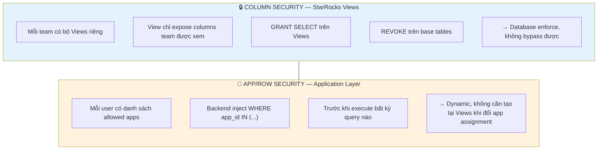
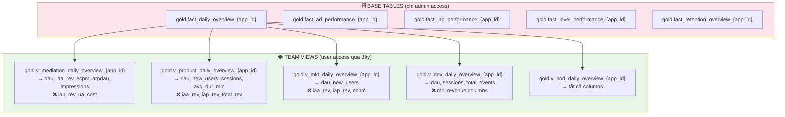
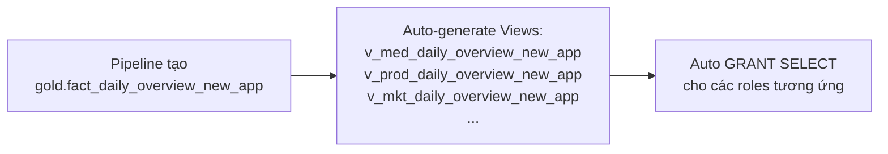
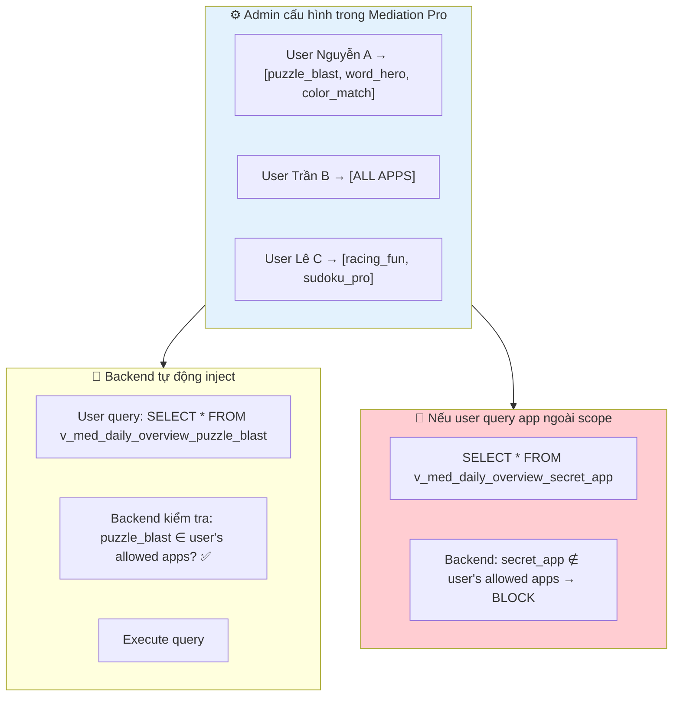
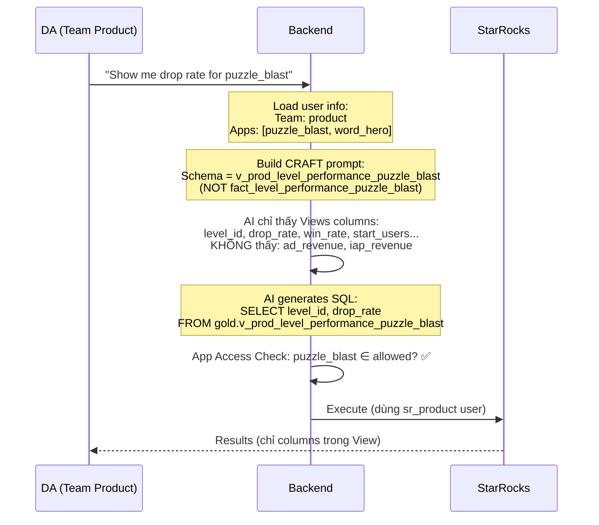
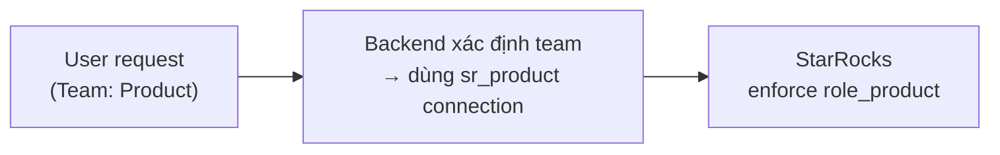
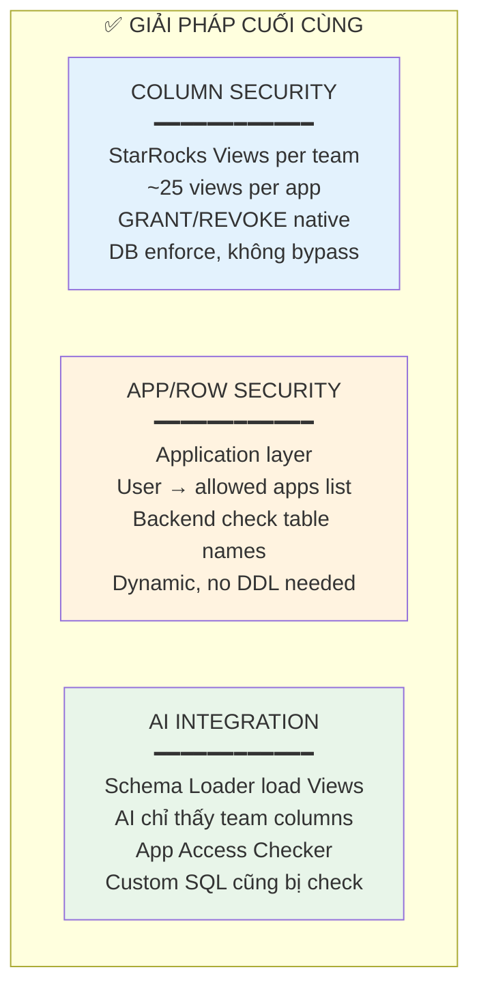

# 112d — Data Access Policy: Phân quyền theo Team & App

> **Module:** Mediation Pro — Hybrid View-based Column Security + App Filter  
> **Nguyên tắc:** Database enforce những gì database làm tốt, Application enforce những gì cần dynamic  
> **Version:** 2.0 — 2026-03-08

---

## 1. Bài toán

Mỗi user tại Amobear:
- Chỉ được xem **một số apps** nhất định (trừ BOD/Senior DA xem tất cả)
- Chỉ được xem **một nhóm metrics** phù hợp với team/vai trò

| Team | Ví dụ metrics được xem | KHÔNG được xem |
|---|---|---|
| **BOD** | Tất cả | — |
| **Mediation** | Ad revenue, eCPM, SoW, fill rate, DAU | IAP chi tiết, UA cost |
| **Product** | DAU, retention, level metrics, sessions | Revenue chi tiết, UA cost |
| **Marketing/UA** | Cost, CPI, installs, ROI, retention | Revenue chi tiết, level internals |
| **Dev** | Firebase events, crashes, sessions | Revenue, cost |

Đồng thời, AI SQL Assistant phải **tự động tuân thủ** phân quyền — kể cả khi user tự viết SQL custom.

---

## 2. Giải pháp: Hybrid 2 tầng



**Tại sao hybrid?**

| Bài toán | Giải ở đâu | Lý do |
|---|---|---|
| "Ai xem metrics nào" (Column) | **StarRocks Views** | Ít thay đổi (team structure ổn định), cần enforce tuyệt đối |
| "Ai xem apps nào" (Row) | **Application Layer** | Thay đổi thường xuyên (assign/remove apps), cần dynamic |

---

## 3. Column Security — StarRocks Views

### 3.1 Kiến trúc



### 3.2 View Naming Convention

```
gold.v_{team}_{base_table_name}_{app_id}
```

| Base Table | Mediation View | Product View | MKT View | Dev View | BOD View |
|---|---|---|---|---|---|
| fact_daily_overview | v_med_daily_overview | v_prod_daily_overview | v_mkt_daily_overview | v_dev_daily_overview | v_bod_daily_overview |
| fact_ad_performance | v_med_ad_performance | ❌ No access | ❌ No access | ❌ No access | v_bod_ad_performance |
| fact_iap_performance | ❌ No access | v_prod_iap_performance | ❌ No access | ❌ No access | v_bod_iap_performance |
| fact_level_performance | ❌ No access | v_prod_level_performance | ❌ No access | ❌ No access | v_bod_level_performance |
| fact_retention_overview | v_med_retention_overview | v_prod_retention_overview | v_mkt_retention_overview | ❌ No access | v_bod_retention_overview |

**Số views:** ~20-25 views per app (5 teams × 4-5 tables trung bình). BOD views chỉ là alias 1:1 để giữ nhất quán naming.

### 3.3 StarRocks Role & Grant

```sql
-- Tạo roles
CREATE ROLE role_mediation;
CREATE ROLE role_product;
CREATE ROLE role_mkt;
CREATE ROLE role_dev;
CREATE ROLE role_bod;

-- REVOKE base tables cho tất cả (trừ admin)
REVOKE SELECT ON ALL TABLES IN DATABASE gold FROM role_mediation;
REVOKE SELECT ON ALL TABLES IN DATABASE gold FROM role_product;
-- ...

-- GRANT views theo team
GRANT SELECT ON TABLE gold.v_med_daily_overview_* TO ROLE role_mediation;
GRANT SELECT ON TABLE gold.v_med_ad_performance_* TO ROLE role_mediation;
GRANT SELECT ON TABLE gold.v_med_retention_overview_* TO ROLE role_mediation;

GRANT SELECT ON TABLE gold.v_prod_daily_overview_* TO ROLE role_product;
GRANT SELECT ON TABLE gold.v_prod_level_performance_* TO ROLE role_product;
-- ...

-- Assign roles cho StarRocks users
GRANT role_mediation TO USER 'sr_mediation'@'%';
GRANT role_product TO USER 'sr_product'@'%';
-- ...
```

### 3.4 Automation: Tạo Views khi thêm App mới

Khi pipeline tạo tables mới cho app mới, **đồng thời tạo Views cho tất cả teams**:



Đây là **Hangfire job** chạy sau mỗi lần pipeline tạo app table mới — template-based, không cần manual.

---

## 4. App/Row Security — Application Layer

### 4.1 Mô hình



### 4.2 Cách enforce

Mọi query trước khi execute đều đi qua **App Access Checker**:

1. Extract tên tables từ SQL
2. Extract app_id từ table name (vì naming convention: `v_med_daily_overview_{app_id}`)
3. Check app_id ∈ user's allowed_apps
4. Nếu có app không được phép → **block query**, trả message rõ ràng

Đơn giản, không cần parse columns hay complex AST — chỉ check table names.

---

## 5. Integration với AI SQL Assistant

### 5.1 AI chỉ thấy Views của team mình



### 5.2 Khi user hỏi ngoài scope

| Scenario | Xử lý |
|---|---|
| Hỏi metric ngoài team scope (ví dụ Product hỏi revenue) | AI không thấy revenue columns trong schema → trả lời: "Metric này không có trong data scope của bạn" |
| Hỏi app ngoài assigned list | App Access Checker block → "Bạn không có quyền truy cập app này" |
| Custom SQL query app ngoài scope | Cùng App Access Checker → block |
| Custom SQL query base table trực tiếp | StarRocks GRANT/REVOKE → "Access denied" tại DB level |

### 5.3 Schema Loader thay đổi

Schema Loader trong CRAFT Prompt Builder bây giờ load **Views thay vì base tables**:

```
Trước: load gold.fact_daily_overview_{app_id} → toàn bộ columns
Sau:   load gold.v_prod_daily_overview_{app_id} → chỉ columns team Product được xem
```

AI tự nhiên không biết columns bị ẩn tồn tại → không thể sinh SQL truy vấn chúng.

---

## 6. StarRocks User Mapping

### 6.1 1 StarRocks User per Team

Thay vì tạo 1 StarRocks user per Mediation Pro user (quá nhiều), tạo **1 StarRocks user per team**:

| Mediation Pro Team | StarRocks User | StarRocks Role | Dùng khi |
|---|---|---|---|
| Mediation | `sr_mediation` | `role_mediation` | Backend SET ROLE trước khi execute query |
| Product | `sr_product` | `role_product` | |
| Marketing | `sr_mkt` | `role_mkt` | |
| Dev | `sr_dev` | `role_dev` | |
| BOD / Senior DA | `sr_bod` | `role_bod` | Full access |

### 6.2 Backend connection switch



Backend maintain **connection pool per team** (5 pools) — hoặc dùng `SET ROLE` trên shared connection.

---

## 7. Admin UI — Quản lý phân quyền

### 7.1 Hai tab đơn giản

```
┌─────────────────────────────────────────────────────┐
│  Settings → Data Access                              │
│                                                      │
│  [Tab: App Assignment]  [Tab: Team Metric Config]    │
│                                                      │
│  ── APP ASSIGNMENT ──                                │
│                                                      │
│  ┌───────────────┬───────────┬────────────────────┐ │
│  │ User          │ Team      │ App Access          │ │
│  ├───────────────┼───────────┼────────────────────┤ │
│  │ Nguyễn A      │ Mediation │ 50 apps [Edit]     │ │
│  │ Trần B        │ Product   │ 15 apps [Edit]     │ │
│  │ Lê C          │ MKT       │ 30 apps [Edit]     │ │
│  │ Admin D       │ BOD       │ All apps ✅         │ │
│  └───────────────┴───────────┴────────────────────┘ │
│                                                      │
│  [Edit] mở dialog chọn apps (checkbox list + search) │
│                                                      │
│  ── TEAM METRIC CONFIG ──                            │
│                                                      │
│  Hiển thị matrix: Team × Table → columns visible     │
│  ⚠️ Thay đổi ở đây = ALTER VIEW trên StarRocks       │
│  → Cần Admin/DBA approve trước khi apply             │
│                                                      │
└─────────────────────────────────────────────────────┘
```

**App Assignment** thay đổi thường xuyên → admin tự thao tác.
**Team Metric Config** thay đổi hiếm → cần review vì ảnh hưởng StarRocks Views.

---

## 8. Quy trình vận hành

### 8.1 Khi thêm App mới

```
Pipeline tạo Gold tables → Auto-generate Views cho 5 teams → Auto GRANT
→ Admin assign app cho users trên Mediation Pro (App Assignment tab)
```

### 8.2 Khi thêm team/role mới

```
DBA tạo StarRocks role + user → Tạo View templates cho team mới
→ Admin cấu hình Team Metric Config → Generate Views cho tất cả apps
```

### 8.3 Khi thêm metric/column mới vào base table

```
Pipeline thêm column → ALTER VIEW cho teams cần xem column đó
→ Không ảnh hưởng teams không cần xem
```

---

## 9. Tổng kết



| Tiêu chí | Đánh giá |
|---|---|
| **Complexity** | Thấp — Views + app filter, không cần Ranger hay complex parser |
| **Security** | Cao — Column enforce tại DB, không bypass bằng SQL tricks |
| **Maintenance** | Trung bình — Views auto-generate, app assignment qua UI |
| **AI compatible** | Tốt — AI tự nhiên chỉ thấy đúng data |
| **Performance** | Không ảnh hưởng — Views trong StarRocks là logical, không copy data |
| **Scalability** | 200 apps × 25 views = 5000 views — acceptable cho StarRocks |

---

> 📄 **Doc 112d v2:** Hybrid View-based CLS + App-filter RLS. Đơn giản hóa từ 3-point enforcement xuống 2 tầng rõ ràng. StarRocks enforce column security qua Views + GRANT/REVOKE. Application enforce app access qua table name checking.
