# 115 — AI Daily App Insight & AI-Powered Alert Builder

> **Module:** Mediation Pro Platform — Automated Intelligence & Smart Alerts  
> **Stack:** .NET Core 8 + Hangfire + Claude/Gemini/ChatGPT + StarRocks + Telegram/Lark  
> **Reference:** 114 (AI SQL Assistant v1.4), 112d (Data Access Policy), 99 (Platform)  
> **Version:** 1.0 — 2026-03-12

---

## Mục lục

**Part A — AI Daily App Insight**

1. Bài toán & Giá trị
2. Kiến trúc tổng thể
3. Insight Generation Pipeline
4. Insight Template & Structure
5. Insight Admin — Cấu hình structure
6. Insight Viewer — Tab trên App Detail
7. Notification & Delivery

**Part B — AI-Powered Alert Builder**

8. Bài toán & Giá trị
9. Kiến trúc Alert System (System + User-defined)
10. Alert Context — Tích hợp AI Assistant
11. AI Alert Builder Flow
12. Alert Evaluation & Notification
13. Alert Management UI

**Part C — Tích hợp & Triển khai**

14. Shared Infrastructure
15. Phân kỳ triển khai
16. Rủi ro & KPI

---

# PART A — AI DAILY APP INSIGHT

## 1. Bài toán & Giá trị

### 1.1 Hiện trạng

- Pipeline hoàn tất data T-1 vào **~5:00 AM UTC** mỗi ngày
- Từ 5 AM → 8-9 AM (team đến), **không ai phân tích** — data nằm yên
- Mỗi team phải tự mở dashboard, tự tìm anomaly trong 200+ apps
- Không có **bức tranh tổng hợp** cho từng app — mỗi người nhìn 1 góc

### 1.2 Giải pháp: Daily App Insight

Sau khi pipeline hoàn tất, hệ thống **tự động tạo insight cho từng app**, bao gồm:

- Tổng hợp KPIs T-1 so với T-2, 7-day avg, 14-day avg
- AI phân tích xu hướng, phát hiện anomaly, đưa nhận định
- Khuyến nghị cụ thể cho từng team (kinh doanh, marketing, UA, DA)
- Auto-push notification cho users được phân quyền app đó

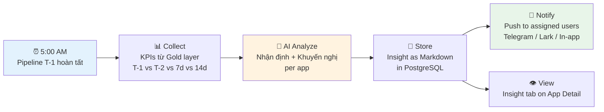

### 1.3 Giá trị

| Trước | Sau |
|---|---|
| Team tự tìm insight, mất 1-2h | 7:00 AM đã có insight per app, AI viết sẵn |
| Mỗi người nhìn 1 góc | Insight đa chiều: revenue, engagement, UA, level |
| Anomaly bị bỏ sót | AI scan toàn bộ metrics, flag issues tự động |
| Không có audit trail | Insight lưu lịch sử, xem lại bất kỳ ngày nào |

---

## 2. Kiến trúc tổng thể

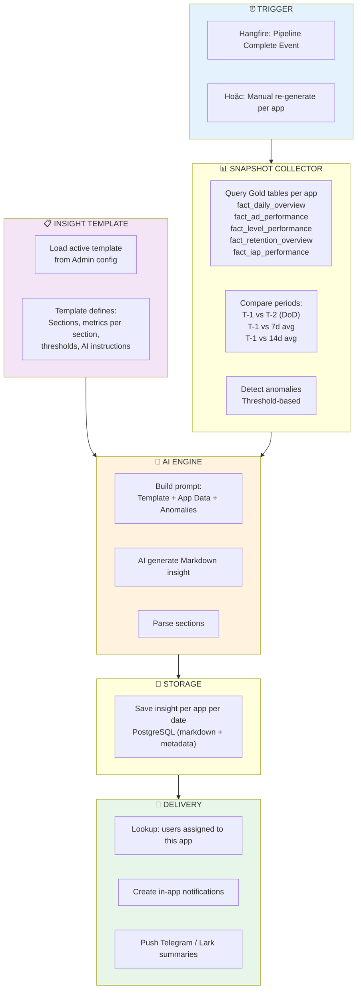

---

## 3. Insight Generation Pipeline

### 3.1 Trigger: Event-driven

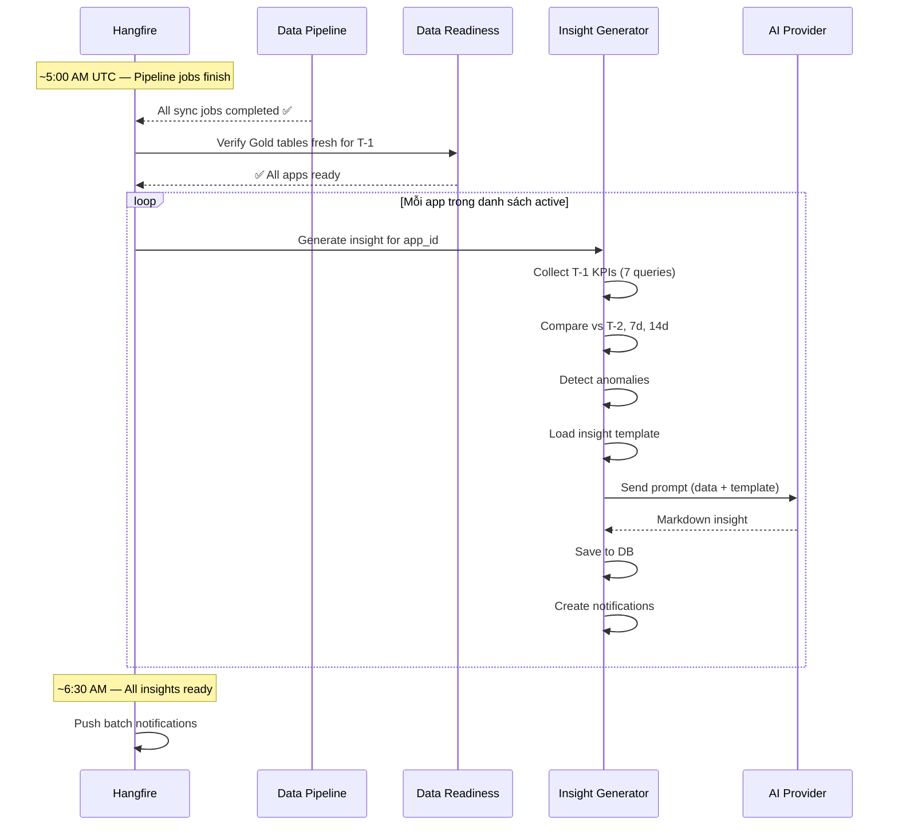

### 3.2 Data Collection — 7 queries per app

Mỗi app, hệ thống chạy 7 queries trên **Gold layer** (chạy nhanh, milliseconds per query):

| # | Query | Data | So sánh |
|---|---|---|---|
| 1 | **Daily Overview** | DAU, new_users, total_rev, iaa_rev, iap_rev, ARPDAU, sessions | T-2, 7d, 14d |
| 2 | **Ad Performance** | eCPM by format, impressions, fill_rate, CTR, ad_penetration | T-2, 7d |
| 3 | **IAP Performance** | purchases, iap_users, pay_rate, ARPPU, top packages | T-2, 7d |
| 4 | **Retention** | D1, D3, D7 retention rates, LTV progression | 7d, 14d |
| 5 | **Level Health** | Top 5 problematic levels (drop_rate > 15%), win_rate outliers | 7d |
| 6 | **Geo Breakdown** | Top 5 countries by revenue, significant changes | T-2 |
| 7 | **UA Metrics** (nếu có) | CPI, installs, ROI by channel | T-2, 7d |

> ⚡ **Performance:** 7 queries × Gold layer × milliseconds = <2s per app. 200 apps × 2s = ~7 phút total. Chạy parallel 10 apps → ~1.5 phút.

### 3.3 Anomaly Detection (rule-based, trước khi gọi AI)

| Metric | Alert khi | Severity |
|---|---|---|
| Revenue | ±20% vs 7d avg | 🔴 Critical (giảm) / 🟢 Positive (tăng) |
| DAU | ±15% vs 7d avg | 🔴 / 🟢 |
| eCPM | ±15% vs 7d avg | 🟡 Warning |
| D1 Retention | ±10% vs 14d avg | 🟡 Warning |
| Fill Rate | < 85% absolute | 🟡 Warning |
| Level drop_rate | > 20% absolute | 🔴 Critical |
| New Users | ±25% vs 7d avg | 🟡 / 🟢 |
| ARPDAU | ±15% vs 7d avg | 🟡 |

Anomalies được **gửi kèm data cho AI** để AI có context khi viết nhận định.

---

## 4. Insight Template & Structure

### 4.1 Concept: Configurable Template

Insight không hard-code — admin cấu hình **template** gồm các sections, mỗi section có metrics + AI instructions riêng.

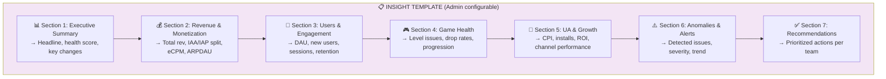

### 4.2 Mỗi Section gồm

| Field | Mô tả | Ví dụ |
|---|---|---|
| `section_key` | Identifier | `revenue_monetization` |
| `title` | Tiêu đề hiển thị | `💰 Revenue & Monetization` |
| `metrics` | Danh sách metrics cần query | `['total_rev', 'iaa_rev', 'iap_rev', 'ecpm', 'arpdau']` |
| `comparison_periods` | So sánh với periods nào | `['dod', '7d_avg', '14d_avg']` |
| `ai_instruction` | Hướng dẫn AI viết section này | `"Phân tích revenue trend. Nếu IAA giảm, check eCPM + fill_rate. Nếu IAP giảm, check pay_rate + ARPPU."` |
| `audience` | Ai quan tâm section này | `['bod', 'mediation', 'da']` |
| `sort_order` | Thứ tự hiển thị | `2` |
| `is_active` | Bật/tắt section | `true` |

### 4.3 Insight Output Format (Markdown)

```markdown
# 📊 Daily Insight — Puzzle Blast — 2026-03-11

## Health Score: 72/100 (↓ from 78)

---

## 💰 Revenue & Monetization

**Total Revenue: $5,230** (↑3.2% vs hôm qua, ↑8.1% vs 7d avg)

- IAA Revenue: $4,180 (80%) — eCPM $7.20 ↑5% vs 7d
- IAP Revenue: $1,050 (20%) — pay_rate 2.1% ↔ stable

**Nhận định:** Revenue tăng tốt nhờ eCPM cải thiện ở rewarded format.
eCPM interstitial giảm nhẹ (-3%) cần monitor.

---

## 👥 Users & Engagement

**DAU: 125,000** (↓2.1% vs hôm qua, ↔ vs 7d avg)

- New Users: 8,200 (↑12% vs 7d) — UA campaigns đang hiệu quả
- D1 Retention: 38% (↓2pp vs 14d avg) — ⚠️ cần chú ý
- Avg Session: 12.5 min (↑5% vs 7d)

**Nhận định:** DAU giảm nhẹ nhưng new users tăng mạnh → 
retention đang là vấn đề. D1 giảm có thể do app version mới.

---

## ⚠️ Anomalies

🔴 **D1 Retention giảm 2pp** — Từ 40% (14d avg) xuống 38%.
   → Kiểm tra app version gần nhất, có thể bug gây drop.

🟡 **eCPM Interstitial giảm 3%** — $5.80 → $5.63.
   → Theo dõi thêm 2-3 ngày, nếu tiếp tục giảm → review waterfall.

🟢 **New Users +12%** — UA campaigns performing well.

---

## ✅ Recommendations

1. **[Product]** Investigate D1 retention drop — check latest app version
2. **[Mediation]** Monitor interstitial eCPM — review floor if continues
3. **[UA]** New users growth strong — consider +10% budget allocation
4. **[DA]** Deep dive retention by country — check if localized issue
```

---

## 5. Insight Admin — Cấu hình Structure

### 5.1 Admin UI: Insight Template Manager

```
┌───────────────────────────────────────────────────────────────┐
│  ⚙️ Settings → AI Insight Template                             │
├───────────────────────────────────────────────────────────────┤
│                                                                │
│  ── GLOBAL SETTINGS ──                                         │
│  AI Provider for Insights: [Claude ▼]                          │
│  Max apps per batch: [50  ]  (top by revenue)                  │
│  Parallel degree: [10 ]                                        │
│  Generate time: After pipeline + [30 min] buffer               │
│                                                                │
│  ── SECTIONS ── (drag to reorder)                              │
│                                                                │
│  ≡ 📊 Executive Summary          [Active ✅]  [Edit] [Delete] │
│  ≡ 💰 Revenue & Monetization     [Active ✅]  [Edit] [Delete] │
│  ≡ 👥 Users & Engagement         [Active ✅]  [Edit] [Delete] │
│  ≡ 🎮 Game Health                [Active ✅]  [Edit] [Delete] │
│  ≡ 📢 UA & Growth                [Active ✅]  [Edit] [Delete] │
│  ≡ ⚠️ Anomalies & Alerts         [Active ✅]  [Edit] [Delete] │
│  ≡ ✅ Recommendations             [Active ✅]  [Edit] [Delete] │
│                                                                │
│  [+ Add Section]                                               │
│                                                                │
│  ── AI INSTRUCTIONS (global) ──                                │
│  ┌─────────────────────────────────────────────────────────┐  │
│  │ Write in Vietnamese. Be direct, data-driven.            │  │
│  │ Always compare with previous periods.                    │  │
│  │ Health score 1-100 based on: revenue trend (30%),        │  │
│  │ DAU trend (25%), retention (25%), level health (20%).    │  │
│  │ Recommendations must be specific and assignable.         │  │
│  └─────────────────────────────────────────────────────────┘  │
│                                                                │
│  [Preview with sample app]           [💾 Save Template]        │
└───────────────────────────────────────────────────────────────┘
```

### 5.2 Section Edit Dialog

```
┌──────────────────────────────────────────────────┐
│  ✏️ Edit Section: Revenue & Monetization          │
├──────────────────────────────────────────────────┤
│                                                   │
│  Title: [💰 Revenue & Monetization            ]  │
│  Key:   [revenue_monetization                 ]  │
│                                                   │
│  Metrics (pick from Metrics Catalog):             │
│  [total_rev ×] [iaa_rev ×] [iap_rev ×]           │
│  [ecpm ×] [arpdau ×] [fill_rate ×]               │
│  [+ Add metric]                                   │
│                                                   │
│  Comparison: ☑ DoD  ☑ 7d avg  ☑ 14d avg          │
│                                                   │
│  Audience: ☑ BOD  ☑ Mediation  ☐ Product  ☐ UA   │
│                                                   │
│  AI Instruction for this section:                 │
│  ┌──────────────────────────────────────────┐    │
│  │ Analyze revenue trends. If IAA drops,     │    │
│  │ check eCPM + fill_rate by network.        │    │
│  │ If IAP drops, check pay_rate + ARPPU.     │    │
│  │ Highlight top performing ad format.        │    │
│  └──────────────────────────────────────────┘    │
│                                                   │
│  Anomaly Thresholds:                              │
│  Revenue change alert: [±20 %] vs 7d avg          │
│  eCPM change alert:   [±15 %] vs 7d avg           │
│                                                   │
│                    [Cancel]     [💾 Save Section]  │
└──────────────────────────────────────────────────┘
```

> 💡 **Key insight:** Admin có thể thêm/bớt/sắp xếp sections, thay đổi metrics, chỉnh thresholds, sửa AI instructions — tất cả không cần code. Khi business thay đổi, insight template thay đổi theo.

---

## 6. Insight Viewer — Tab trên App Detail

### 6.1 App Detail thêm tab "AI Insight"

```
┌──────────────────────────────────────────────────────────────┐
│  App: Puzzle Blast                                            │
│  [Overview] [Performance] [Waterfall] [📊 AI Insight] [Logs] │
├──────────────────────────────────────────────────────────────┤
│                                                               │
│  📊 AI Daily Insight                [◀ Mar 10] Mar 11 [Mar 12 ▶]  │
│                                                               │
│  Health Score: ██████████░░ 72/100 (↓6 vs yesterday)          │
│  Generated: 6:45 AM • Provider: Claude • Tokens: 3,200       │
│                                                               │
│  ┌─ Markdown Viewer ──────────────────────────────────────┐  │
│  │                                                         │  │
│  │  ## 💰 Revenue & Monetization                           │  │
│  │                                                         │  │
│  │  **Total Revenue: $5,230** (↑3.2% vs hôm qua)          │  │
│  │  - IAA: $4,180 (80%) — eCPM $7.20 ↑5%                  │  │
│  │  - IAP: $1,050 (20%) — pay_rate 2.1% stable             │  │
│  │                                                         │  │
│  │  **Nhận định:** Revenue tăng tốt nhờ eCPM cải thiện...  │  │
│  │                                                         │  │
│  │  ## 👥 Users & Engagement                               │  │
│  │  ...                                                    │  │
│  │                                                         │  │
│  └─────────────────────────────────────────────────────────┘  │
│                                                               │
│  [📥 Export PDF]  [📋 Copy Markdown]  [🔄 Re-generate]        │
│                                                               │
└──────────────────────────────────────────────────────────────┘
```

### 6.2 Features

| Feature | Mô tả |
|---|---|
| **Date navigation** | Xem insight bất kỳ ngày nào (lưu lịch sử) |
| **Markdown renderer** | Hiển thị insight dạng formatted với headers, bold, lists, emoji |
| **Health score bar** | Visual indicator, color-coded |
| **Re-generate** | Admin/Senior DA có thể trigger lại cho ngày hiện tại |
| **Export PDF** | Xuất insight thành PDF để share offline |
| **Copy Markdown** | Copy raw markdown để paste vào Telegram/Slack |

---

## 7. Notification & Delivery

### 7.1 Flow

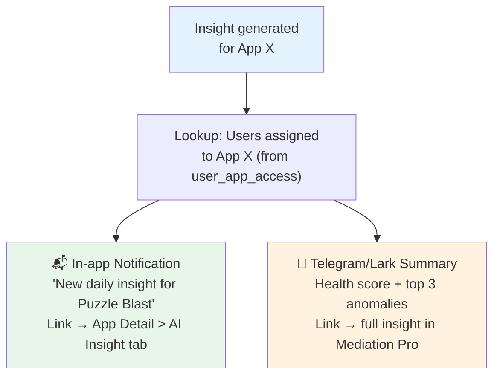

### 7.2 Notification content

**In-app:** Badge trên bell icon, notification list item với app icon + "Daily insight available" + health score.

**Telegram/Lark:** Compact summary per app (chỉ gửi cho apps có anomaly 🔴 hoặc 🟡):

```
📊 Puzzle Blast — 11/03/2026
Health: 72/100 (↓6)

🔴 D1 Retention giảm 2pp (38% < 40% avg)
🟡 eCPM Interstitial -3%
🟢 New Users +12%

→ Xem chi tiết: [link]
```

> Không gửi Telegram cho apps "healthy" (score > 80, no anomalies) — tránh spam.

---

# PART B — AI-POWERED ALERT BUILDER

## 8. Bài toán & Giá trị

### 8.1 Hiện trạng Alerts

Hệ thống alert hiện tại (doc 99 §16) là **system-level** — admin cấu hình rules cố định cho tất cả apps (eCPM drop > 20%, revenue drop > 30%...). Vấn đề:

- User không tự tạo alert được — phải nhờ admin
- Mỗi người quan tâm metrics khác nhau — cần **personalized alerts**
- Alert rules cứng nhắc — không adapt theo context từng app

### 8.2 Giải pháp: 2-tier Alert System

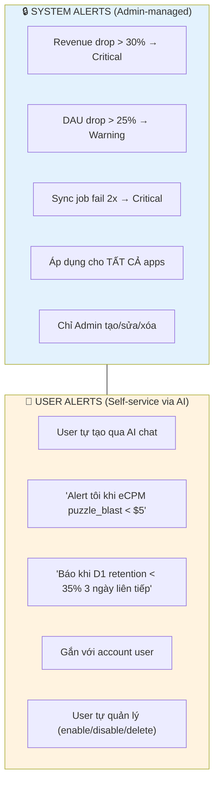

---

## 9. Kiến trúc Alert System

### 9.1 Overview

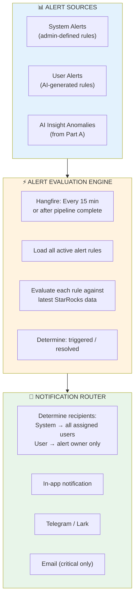

### 9.2 Alert Rule Model (cả System và User)

Mỗi alert rule bao gồm:

| Field | System Alert | User Alert |
|---|---|---|
| `scope` | `system` | `user` |
| `owner` | admin user_id | user user_id |
| `app_scope` | `all` hoặc list app_ids | specific app_ids (trong user's access) |
| `metric` | metric_key (from catalog) | metric_key |
| `condition` | `<`, `>`, `change_pct`, `consecutive_days` | Same — AI generates |
| `threshold` | Numeric value | AI generates from user intent |
| `severity` | admin chọn | AI suggests, user confirm |
| `notification_channels` | admin config | user chọn (in-app, telegram) |
| `is_active` | admin toggle | user toggle |
| `sql_query` | Optional custom SQL | AI generates |

> 💡 **Key design:** System alerts và User alerts dùng **cùng table, cùng evaluation engine**. Chỉ khác `scope` và `owner`. Đơn giản hóa maintenance.

---

## 10. Alert Context — Tích hợp AI Assistant

### 10.1 New System Context: "Alert Builder"

Thêm 1 **system context template** trong AI Assistant dành riêng cho việc tạo alerts:

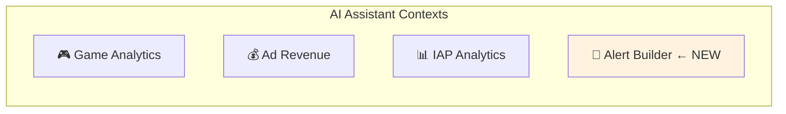

### 10.2 Alert Builder Role Prompt (CRAFT)

```
[C — CONTEXT]
You are part of Amobear's alert system. You help users create 
monitoring alerts for their mobile apps on StarRocks.

[R — ROLE]
You are an Alert Configuration Assistant. You understand:
- All metrics in the Metrics Catalog (eCPM, DAU, retention, revenue...)
- StarRocks SQL for alert conditions
- Alert best practices (thresholds, severity, frequency)

[A — ACTION]
Help users define alert rules from natural language descriptions.
Generate: metric, condition, threshold, SQL query, severity, description.

[F — FORMAT]
Return JSON:
{
  "alert_name": "...",
  "description": "Vietnamese description",
  "metric_key": "ecpm",
  "app_ids": ["puzzle_blast"],
  "condition_type": "threshold | change_pct | consecutive",
  "operator": "< | > | <= | >=",
  "threshold_value": 5.0,
  "comparison_period": "7d_avg | yesterday | fixed",
  "consecutive_days": null,
  "severity": "critical | warning | info",
  "sql_query": "SELECT ... HAVING ...",
  "evaluation_frequency": "after_pipeline | every_15min | hourly",
  "suggested_channels": ["in_app", "telegram"]
}

[T — TONE]
Vietnamese. Confirm understanding before generating.
Explain why the threshold/severity was suggested.
```

---

## 11. AI Alert Builder Flow

### 11.1 User tạo alert qua AI chat

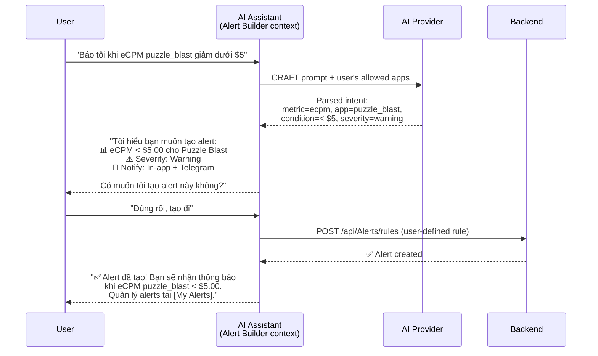

### 11.2 Các loại alert user có thể tạo qua AI

| User nói | AI tạo rule |
|---|---|
| "Báo khi eCPM < $5" | `metric=ecpm, operator=<, threshold=5.0` |
| "Alert khi revenue giảm 20% so với tuần trước" | `condition_type=change_pct, threshold=-20, comparison=7d_avg` |
| "Báo khi D1 retention < 35% 3 ngày liên tiếp" | `condition_type=consecutive, threshold=35, consecutive_days=3` |
| "Alert khi DAU tăng đột biến > 50%" | `condition_type=change_pct, threshold=+50` |
| "Theo dõi fill rate, báo khi < 85%" | `metric=fill_rate, operator=<, threshold=85` |

### 11.3 Luồng confirm trước khi tạo

AI **luôn** hiển thị summary và **hỏi confirm** trước khi tạo alert — không auto-create. User phải nói "tạo đi" hoặc click "Create Alert" button.

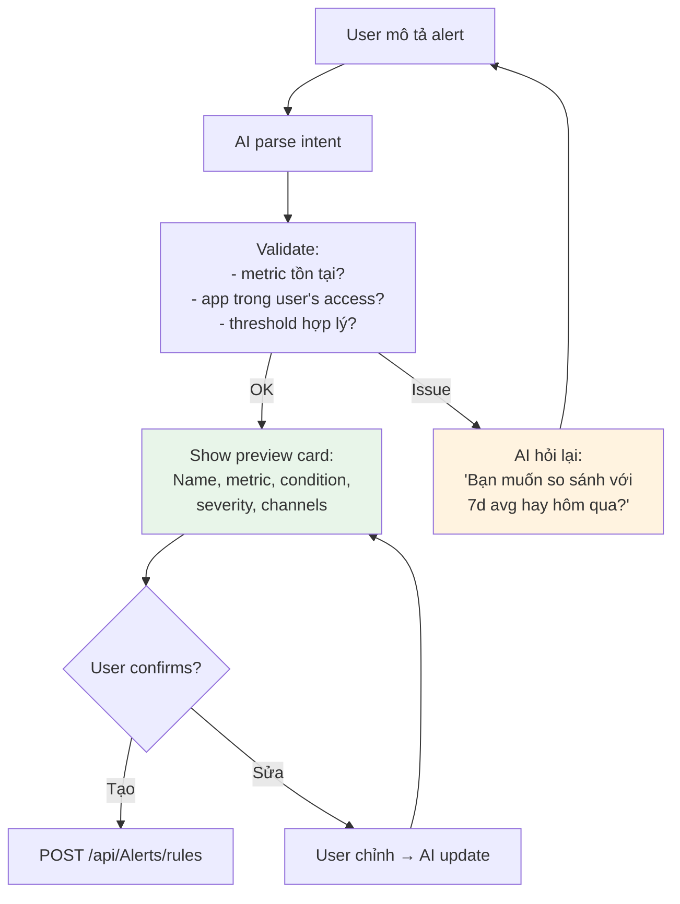

---

## 12. Alert Evaluation & Notification

### 12.1 Evaluation Flow

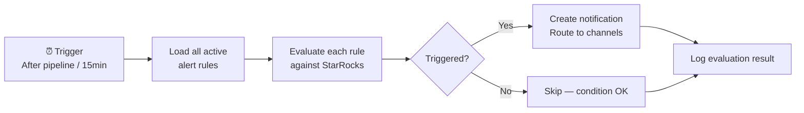

### 12.2 Notification Routing

| Alert Type | Recipients | Channels |
|---|---|---|
| **System alert** | All users assigned to affected app(s) | In-app + Telegram group |
| **User alert** | Alert owner only | Owner's chosen channels |
| **Insight anomaly** (Part A) | Users assigned to app | In-app + Telegram (if 🔴/🟡) |

---

## 13. Alert Management UI

### 13.1 My Alerts Page (user-facing)

```
┌──────────────────────────────────────────────────────────────┐
│  🔔 My Alerts                                                 │
│  [Tab: All] [Tab: System] [Tab: My Alerts] [+ Create via AI] │
├──────────────────────────────────────────────────────────────┤
│                                                               │
│  ── ACTIVE ALERTS ──                                          │
│                                                               │
│  🔒 Revenue Drop > 30% (System)           All apps   [🔴]    │
│     Last triggered: 2 days ago                                │
│                                                               │
│  🔒 DAU Drop > 25% (System)               All apps   [🟡]    │
│     Never triggered                                           │
│                                                               │
│  👤 eCPM < $5.00 (My Alert)               puzzle_blast [🟡]  │
│     Created: Mar 10 • Last triggered: Never                   │
│     [Edit] [Disable] [Delete]                                 │
│                                                               │
│  👤 D1 Retention < 35% 3 days (My Alert)   word_hero   [🟡]  │
│     Created: Mar 8 • Last triggered: Mar 11                   │
│     [Edit] [Disable] [Delete]                                 │
│                                                               │
│  ── TRIGGERED ALERTS (recent) ──                              │
│                                                               │
│  🔴 Mar 11 08:15 — Revenue Drop 32% for color_match          │
│     System alert • Acknowledged by Admin D                    │
│                                                               │
│  🟡 Mar 11 06:45 — D1 Retention 34% for word_hero            │
│     My alert • 3rd consecutive day below threshold            │
│                                                               │
└──────────────────────────────────────────────────────────────┘
```

### 13.2 System Alert Admin (admin-facing)

Trang riêng cho admin quản lý system-level alerts — CRUD rules, set severity, choose channels, view trigger history.

### 13.3 "Create via AI" Button

Click → mở AI Assistant sidebar với **Alert Builder context** đã active. User chat bình thường, AI guide qua flow tạo alert.

---

# PART C — TÍCH HỢP & TRIỂN KHAI

## 14. Shared Infrastructure

### 14.1 Reuse từ hệ thống hiện có

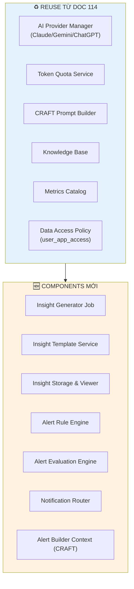

### 14.2 Shared Notification System

Cả Insight notifications và Alert notifications dùng **chung 1 notification infrastructure**:

| Component | Shared |
|---|---|
| Notification table (PostgreSQL) | ✅ Chung — `source_type`: 'insight' / 'system_alert' / 'user_alert' |
| In-app notification bell | ✅ Chung — filter by source_type nếu cần |
| Telegram bot | ✅ Chung — route theo channel config |
| User preference (channels) | ✅ Chung — user chọn channels 1 lần |

### 14.3 Gợi ý Database

| Table | Mô tả |
|---|---|
| `insight_templates` | Template sections config (admin configurable) |
| `insight_template_sections` | Sections thuộc template |
| `app_daily_insights` | Generated insights per app per date (markdown + metadata) |
| `alert_rules` | Alert rules (system + user, cùng table, phân biệt bằng `scope`) |
| `alert_evaluations` | Log mỗi lần evaluate (triggered/skipped/error) |
| `alert_notifications` | Notifications đã gửi |
| `user_notification_preferences` | User chọn channels (in-app, telegram, email) |

---

## 15. Phân kỳ triển khai

### 15.1 Roadmap

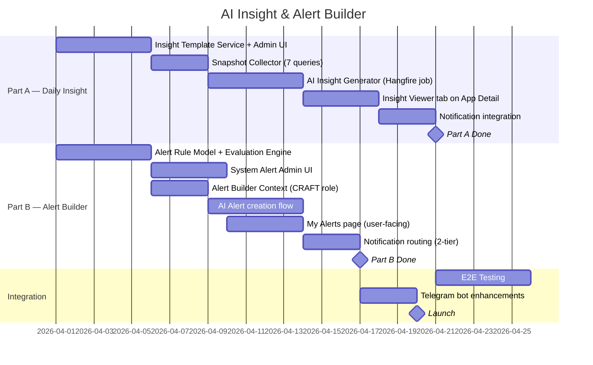

### 15.2 Checklist

**Part A — Daily Insight (3 tuần):**
- [ ] Insight template admin UI (sections CRUD, drag reorder, AI instructions)
- [ ] Snapshot collector: 7 queries per app on Gold layer
- [ ] Anomaly detector: threshold-based, pre-AI
- [ ] AI insight generator: CRAFT prompt per app, Markdown output
- [ ] Storage: `app_daily_insights` table
- [ ] Insight viewer tab on App Detail page (Markdown renderer, date navigation)
- [ ] Re-generate button (admin/senior DA)
- [ ] Notification: in-app + Telegram for anomaly apps
- [ ] Hangfire job: trigger after pipeline, parallel 10 apps

**Part B — Alert Builder (3 tuần, parallel với Part A):**
- [ ] Alert rule model: unified table for system + user alerts
- [ ] Alert evaluation engine: Hangfire job, 15 min cycle
- [ ] System alert admin UI (CRUD rules)
- [ ] Alert Builder CRAFT role prompt (new system context)
- [ ] AI alert creation flow: parse → validate → preview → confirm → create
- [ ] My Alerts page: tabs (All/System/My Alerts), triggered history
- [ ] Notification routing: system → all assigned users, user → owner only
- [ ] "Create via AI" button → open AI Assistant with Alert context

---

## 16. Rủi ro & KPI

### 16.1 Rủi ro

| Risk | Impact | Mitigation |
|---|---|---|
| AI insight sai nhận định | Medium | Insight kèm raw numbers, user verify. Label "AI-generated" |
| Quá nhiều notifications | High | Chỉ notify apps có anomaly. User-defined alerts có rate limit |
| Insight generation quá lâu | Medium | Parallel 10 apps. Top 50 apps by revenue, expand gradually |
| User tạo alert vô nghĩa | Low | AI validate trước khi tạo. Max 20 alerts per user |
| Token cost cho insights | Low | ~$0.02/app × 50 apps = $1/ngày. Rất thấp |

### 16.2 KPI

**Daily Insight:**

| Metric | Target |
|---|---|
| Insight delivery time | Before 7:00 AM UTC+7 |
| User read rate (in-app) | > 60% daily |
| Anomaly detection accuracy | > 85% true positive |
| AI insight quality score | > 4/5 (monthly survey) |
| Time saved per person/day | > 30 min |

**Alert Builder:**

| Metric | Target |
|---|---|
| User-defined alerts created | > 5 per active user |
| Alert accuracy (true positive) | > 80% |
| Time to create alert via AI | < 2 min |
| Alert response time (acknowledge) | < 30 min for critical |

---

> 📄 **Doc 115 bao gồm:**
> - **Part A:** AI Daily App Insight — pipeline, template admin, 7 sections configurable, Markdown viewer, notification
> - **Part B:** AI-Powered Alert Builder — 2-tier (system + user-defined), Alert Builder CRAFT context, AI creation flow, My Alerts UI
> - **Part C:** Shared infra (reuse Provider Manager, Quota, CRAFT, KB, Metrics Catalog, Data Access Policy), unified notification system
> - Roadmap: 2 tracks parallel, ~3 tuần mỗi track
