# 116 — RAG Enhancement: Nâng cấp trí tuệ cho AI Platform

> **Module:** Mediation Pro — Retrieval-Augmented Generation  
> **Mục tiêu:** Chuyển từ keyword search sang semantic understanding  
> **Stack:** pgvector + Embedding APIs + .NET Core 8  
> **Reference:** 114 (AI SQL Assistant v1.4), 115 (Insight & Alert), 111 (StarRocks Metrics)  
> **Version:** 1.0 — 2026-03-13

---

## Mục lục

1. Tại sao cần RAG — Giới hạn hệ thống hiện tại
2. RAG Architecture cho Mediation Pro
3. Phase 1 — Hybrid Search (KB Enhancement)
4. Phase 2 — Document RAG (Internal Docs Index)
5. Phase 3 — Contextual RAG (Multi-source Intelligence)
6. Embedding Strategy
7. Integration với hệ thống hiện có
8. Phân kỳ triển khai
9. Chi phí & ROI
10. Rủi ro

---

## 1. Tại sao cần RAG — Giới hạn hệ thống hiện tại

### 1.1 Hệ thống KB hiện tại (doc 114 §5)

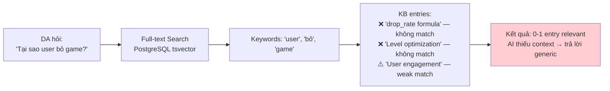

**Vấn đề cốt lõi:** Full-text search match **từ khóa**, không match **ý nghĩa**.

| DA hỏi | KB entry liên quan | Full-text match? | Semantic match? |
|---|---|---|---|
| "Tại sao user bỏ game?" | "drop_rate formula" | ❌ Không match | ✅ Liên quan trực tiếp |
| "App đang hoạt động tốt không?" | "Health score calculation" | ❌ Không match | ✅ Chính xác |
| "Tối ưu quảng cáo thế nào?" | "Waterfall optimization best practice" | ⚠️ Weak | ✅ Perfect match |
| "Revenue giảm do đâu?" | "Double-counting warning AppLovin/AdMob" | ❌ Không match | ✅ Có thể liên quan |

### 1.2 Scoring hiện tại vs RAG

```
Hiện tại:
Score = text_search_rank × tag_boost × focus_boost × priority

Với RAG:
Score = MAX(text_search_rank, vector_similarity) × tag_boost × focus_boost × priority
         ↑                      ↑
    Keyword match         Semantic match (NEW)
```

RAG không **thay thế** full-text search — nó **bổ sung** 1 signal mới (vector similarity). Hệ thống scoring hiện tại (tag_boost, focus_boost, priority, budget packing) giữ nguyên 100%.

---

## 2. RAG Architecture cho Mediation Pro

### 2.1 Tổng quan 3 Phases

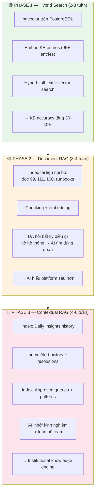

### 2.2 Architecture Overview

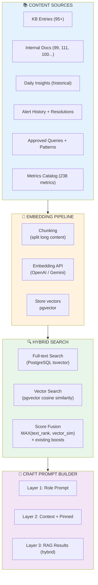

---

## 3. Phase 1 — Hybrid Search (KB Enhancement)

### 3.1 Mục tiêu

Nâng cấp KB search từ **keyword-only** sang **keyword + semantic**, không thay đổi bất kỳ component nào khác.

### 3.2 Thay đổi kỹ thuật

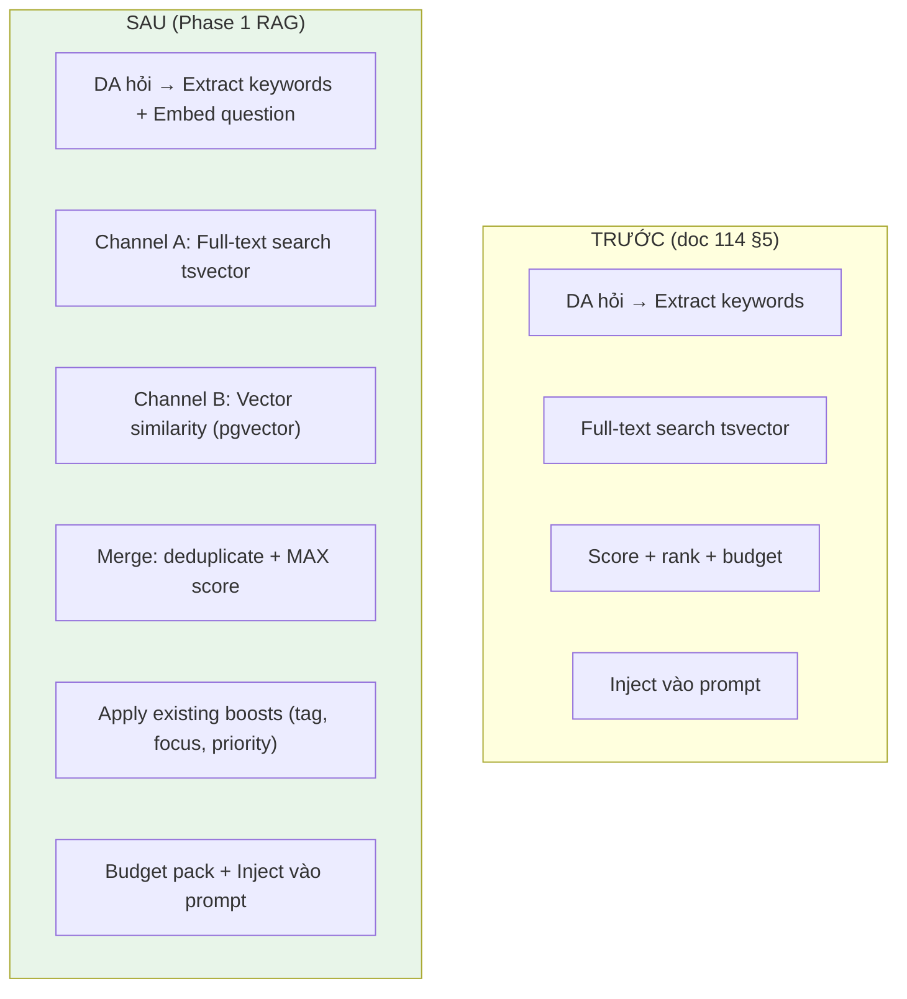

### 3.3 Luồng chi tiết

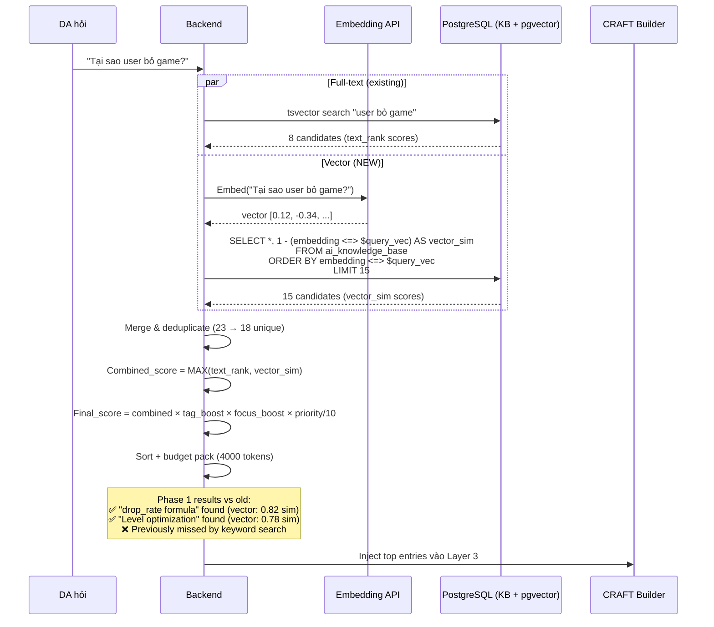

### 3.4 Gợi ý kỹ thuật

**PostgreSQL pgvector setup:**

```sql
-- Bật extension
CREATE EXTENSION IF NOT EXISTS vector;

-- Thêm cột embedding vào bảng KB hiện có
ALTER TABLE ai_knowledge_base 
ADD COLUMN embedding vector(1536);  -- 1536 for OpenAI text-embedding-3-small

-- Index cho fast similarity search
CREATE INDEX idx_kb_embedding ON ai_knowledge_base 
USING ivfflat (embedding vector_cosine_ops) WITH (lists = 10);
-- lists = sqrt(row_count), ~10 cho ~95 entries, tăng khi KB lớn hơn
```

**Embedding khi nào:**
- Khi admin tạo/sửa KB entry → gọi Embedding API → lưu vector
- Batch job: embed toàn bộ entries chưa có vector (migration lần đầu)
- Question embedding: mỗi lần DA hỏi, embed câu hỏi real-time (~50ms)

**Score fusion (trong KnowledgeBaseService):**

```
// Pseudo-code
var textResults = await FullTextSearch(question, limit: 20);
var vectorResults = await VectorSearch(questionEmbedding, limit: 15);

var merged = MergeAndDeduplicate(textResults, vectorResults);

foreach (entry in merged)
{
    entry.CombinedScore = Math.Max(
        entry.TextRank ?? 0,
        entry.VectorSimilarity ?? 0
    );
    
    // Áp dụng existing boosts (unchanged)
    entry.FinalScore = entry.CombinedScore
        * TagBoost(entry, questionKeywords)
        * FocusBoost(entry, contextFocusAreas)
        * (entry.Priority / 10.0);
}

return BudgetPack(merged.OrderByDescending(e => e.FinalScore), tokenBudget: 4000);
```

### 3.5 Impact Assessment

| Metric | Trước (keyword) | Sau (hybrid) | Cải thiện |
|---|---|---|---|
| KB search relevance | ~60% queries có ≥1 relevant entry | ~85-90% | +30-40% |
| "Câu hỏi mơ hồ" match | Gần như 0% | ~70% | Significant |
| Vietnamese question match | Kém (tsvector yếu với tiếng Việt) | Tốt (embedding hiểu semantic) | Major |
| Latency per search | ~5ms | ~55ms (+50ms embedding call) | Acceptable |
| Token cost per search | $0 | ~$0.00002 (embedding) | Negligible |

---

## 4. Phase 2 — Document RAG (Internal Docs Index)

### 4.1 Mục tiêu

Index toàn bộ tài liệu nội bộ Amobear để AI có thể trả lời bất kỳ câu hỏi nào về hệ thống.

### 4.2 Document Sources

| Document | Nội dung | Size ~est | Chunks ~est |
|---|---|---|---|
| **Doc 99** | Mediation Pro Platform (architecture, flow, schedule) | ~50K tokens | ~100 chunks |
| **Doc 111** | StarRocks Views & Metrics (schema, queries, best practices) | ~40K tokens | ~80 chunks |
| **Doc 100** | Data Storage Architecture (DDL, table relationships) | ~30K tokens | ~60 chunks |
| **Doc 114** | AI SQL Assistant (CRAFT, KB, contexts, API) | ~40K tokens | ~80 chunks |
| **Doc 115** | AI Insight & Alert Builder | ~15K tokens | ~30 chunks |
| **Runbooks** | Operational procedures, troubleshooting | Variable | Variable |
| **Total** | | ~175K tokens | ~350 chunks |

### 4.3 Chunking Strategy

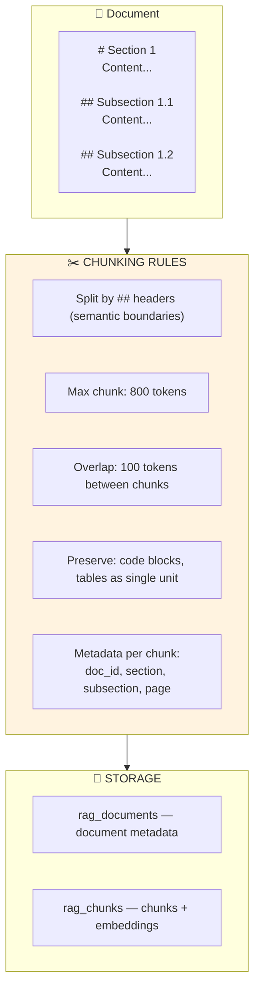

### 4.4 Gợi ý Database

```sql
-- Document registry
CREATE TABLE rag_documents (
    id              UUID PRIMARY KEY DEFAULT gen_random_uuid(),
    doc_key         VARCHAR(50) UNIQUE NOT NULL,   -- 'doc_99', 'doc_111'
    title           VARCHAR(200) NOT NULL,
    source_path     TEXT,                           -- file path or URL
    total_chunks    INT DEFAULT 0,
    total_tokens    INT DEFAULT 0,
    last_indexed_at TIMESTAMPTZ,
    version         INT DEFAULT 1,
    is_active       BOOLEAN DEFAULT true
);

-- Document chunks with embeddings
CREATE TABLE rag_chunks (
    id              UUID PRIMARY KEY DEFAULT gen_random_uuid(),
    document_id     UUID NOT NULL REFERENCES rag_documents(id),
    chunk_index     INT NOT NULL,
    section_title   VARCHAR(200),
    content         TEXT NOT NULL,
    token_count     INT NOT NULL,
    embedding       vector(1536),
    metadata        JSONB DEFAULT '{}',            -- {section, subsection, has_code, has_table}
    
    UNIQUE(document_id, chunk_index)
);

CREATE INDEX idx_rag_chunks_embedding ON rag_chunks 
USING ivfflat (embedding vector_cosine_ops) WITH (lists = 20);
```

### 4.5 Search Integration

Khi DA hỏi, search 3 channels song song:

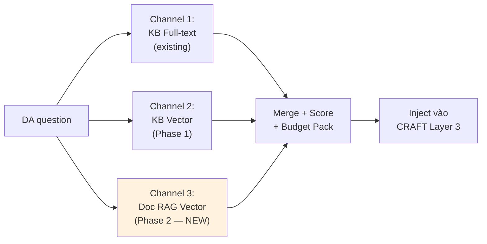

**Budget allocation (4000 tokens total):**

| Source | Budget share | Rationale |
|---|---|---|
| KB entries (hybrid) | 2500 tokens | Business rules, metrics — highest priority |
| Doc RAG chunks | 1500 tokens | System knowledge — supplementary |

> KB entries luôn ưu tiên hơn doc chunks vì KB được curate bởi admin (higher signal-to-noise).

### 4.6 Ví dụ thực tế

DA hỏi: *"Pipeline chạy lúc mấy giờ? Nếu data T-1 chưa có thì làm sao?"*

| Source | Result |
|---|---|
| KB full-text | ❌ Không tìm thấy (KB không chứa schedule info) |
| KB vector | ❌ Không tìm thấy |
| **Doc RAG** | ✅ Doc 99 §17.1: "Daily Pipeline 04:00 UTC" + §17.4: "Retry strategy: 5min → 15min → 30min → CRITICAL alert" |

→ AI trả lời chính xác với reference từ tài liệu hệ thống.

### 4.7 Document Update Flow

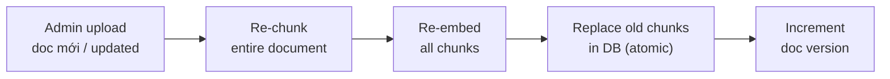

Admin upload qua UI (Markdown file) hoặc auto-sync từ Git repository.

---

## 5. Phase 3 — Contextual RAG (Multi-source Intelligence)

### 5.1 Mục tiêu

AI không chỉ hiểu "kiến thức tĩnh" (KB + docs) mà còn hiểu **kinh nghiệm tích lũy** từ toàn bộ team qua thời gian.

### 5.2 New Data Sources

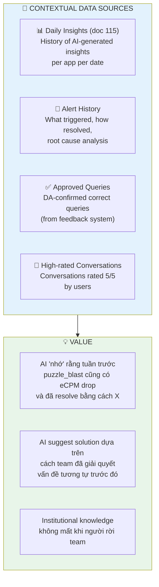

### 5.3 Insight History RAG

Mỗi Daily Insight (doc 115) sau khi generate sẽ được **embed và index**:

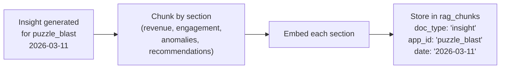

**Use case:** DA hỏi "puzzle_blast gần đây có vấn đề gì không?" → RAG tìm insights 7-14 ngày gần nhất → AI tổng hợp trend, so sánh, đưa nhận định dựa trên chuỗi insights liên tục.

### 5.4 Alert Resolution RAG

Khi user resolve alert (acknowledge + note lý do), resolution note được embed:

```
Alert: eCPM puzzle_blast giảm 22% (2026-03-05)
Resolution by: Nguyễn A
Note: "Do AdMob network bid giảm seasonal. Đã giảm floor 10%, 
eCPM recover sau 2 ngày. Không cần action thêm."
```

**Use case:** Lần sau eCPM giảm tương tự, AI tìm resolution cũ → suggest: *"Lần trước eCPM giảm tương tự (03/05), team đã giảm floor 10% và recover sau 2 ngày. Bạn có muốn áp dụng tương tự?"*

### 5.5 Approved Query Patterns RAG

Queries mà DA confirm "correct" (thumbs up) được embed:

```
Question: "Top 10 levels có drop rate cao nhất cho puzzle_blast"
SQL: SELECT level_id, ROUND(drop_rate, 1)...
Rating: ★★★★★ by 3 users
```

**Use case:** User mới hỏi tương tự → RAG tìm approved query → AI dùng làm template thay vì generate from scratch → accuracy cao hơn.

---

## 6. Embedding Strategy

### 6.1 Model Selection

| Model | Dimensions | Cost/1M tokens | Quality | Recommendation |
|---|---|---|---|---|
| OpenAI `text-embedding-3-small` | 1536 | $0.02 | Good | ✅ **Default** — balance cost/quality |
| OpenAI `text-embedding-3-large` | 3072 | $0.13 | Excellent | For critical use cases |
| Gemini `text-embedding-004` | 768 | Free (limited) | Good | Backup / cost savings |

### 6.2 Khi nào embed

| Trigger | What gets embedded | Frequency |
|---|---|---|
| KB entry created/updated | Entry content | On change |
| Document indexed/updated | All chunks | On upload |
| Daily Insight generated | Insight sections | Daily (after pipeline) |
| Alert resolved with note | Resolution note | On resolution |
| Query rated ★★★★★ | Question + SQL | On rating |
| DA question asked | Question text | Real-time per request |

### 6.3 Embedding Cost Estimate

| Source | Items | Avg tokens | Total tokens | Cost (OpenAI small) |
|---|---|---|---|---|
| KB entries | 95 | 300 | 28,500 | $0.0006 |
| Internal docs (one-time) | 350 chunks | 500 | 175,000 | $0.0035 |
| Daily insights (per day) | 50 apps × 7 sections | 200 | 70,000 | $0.0014 |
| Questions (per day) | 200 questions | 50 | 10,000 | $0.0002 |
| **Daily running cost** | | | ~80,000 | **$0.0016/day** |
| **Monthly running cost** | | | ~2.4M | **~$0.05/month** |

> 💡 Embedding cost gần như **zero** — $0.05/tháng. ROI cực cao so với cải thiện search quality.

---

## 7. Integration với hệ thống hiện có

### 7.1 Thay đổi tối thiểu

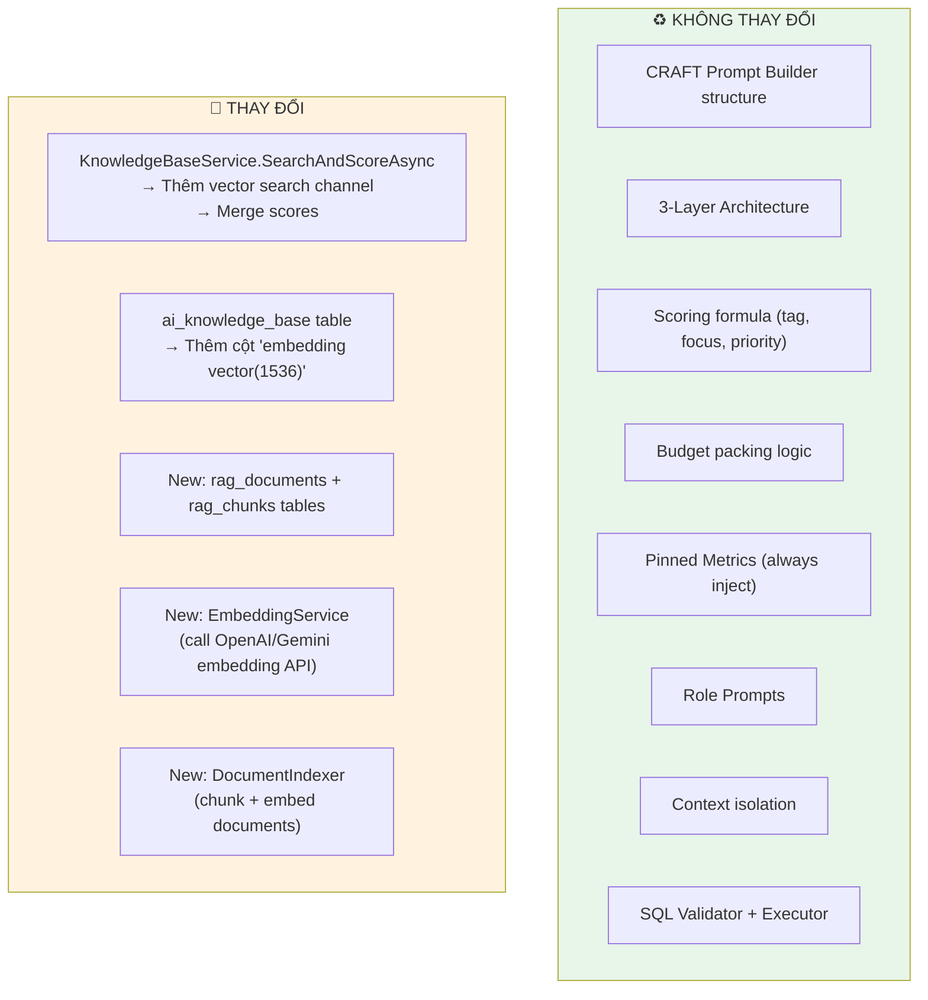

### 7.2 Service Layer Changes

| Service | Change | Impact |
|---|---|---|
| `KnowledgeBaseService` | Add vector search parallel channel + score fusion | Medium — core change |
| `EmbeddingService` (NEW) | Wrap embedding API calls (OpenAI/Gemini) | Low — simple HTTP client |
| `DocumentIndexerService` (NEW) | Chunk markdown → embed → store | Low — batch job |
| `CraftPromptBuilder` | Layer 3 now includes doc RAG results | Low — append to existing |
| `InsightGenerator` (doc 115) | After generate → embed insight sections | Low — append step |
| All others | No change | None |

---

## 8. Phân kỳ triển khai

### 8.1 Roadmap

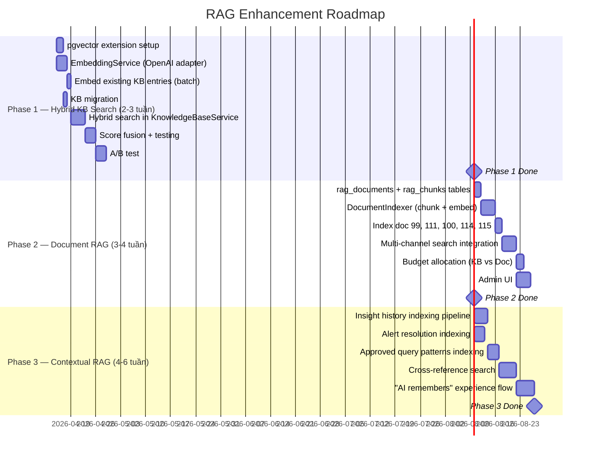

### 8.2 Checklist

**Phase 1 — Hybrid KB Search (tuần 1-3):**
- [ ] `CREATE EXTENSION vector` trên PostgreSQL
- [ ] `ALTER TABLE ai_knowledge_base ADD COLUMN embedding vector(1536)`
- [ ] `EmbeddingService` — wrapper OpenAI `text-embedding-3-small` API
- [ ] Batch embed 95+ existing KB entries
- [ ] Auto-embed on KB entry create/update (hook in KB admin)
- [ ] `KnowledgeBaseService.SearchAndScoreAsync` — thêm vector search channel
- [ ] Score fusion: `MAX(text_rank, vector_sim) × tag × focus × priority`
- [ ] A/B test: log cả keyword-only results và hybrid results, so sánh relevance

**Phase 2 — Document RAG (tuần 4-7):**
- [ ] `rag_documents` + `rag_chunks` tables
- [ ] `DocumentIndexerService` — chunk markdown by headers, max 800 tokens, 100 overlap
- [ ] Index all internal docs (99, 111, 100, 114, 115)
- [ ] 3-channel search: KB full-text + KB vector + Doc RAG vector
- [ ] Budget allocation: 2500 KB + 1500 Doc
- [ ] Admin UI: upload/re-index documents, view chunks, search preview
- [ ] Auto-reindex khi document version thay đổi

**Phase 3 — Contextual RAG (tuần 8-13):**
- [ ] Hook InsightGenerator → embed insight sections after generation
- [ ] Hook Alert resolution → embed resolution notes
- [ ] Hook query feedback (★★★★★) → embed question + SQL
- [ ] Contextual search: include insight history + resolutions in results
- [ ] "Similar issue in the past" feature — AI references previous resolutions
- [ ] Retention policy: chỉ index insights/alerts/queries trong 90 ngày gần nhất

---

## 9. Chi phí & ROI

### 9.1 Chi phí

| Item | One-time | Monthly | Notes |
|---|---|---|---|
| pgvector extension | $0 | $0 | Free PostgreSQL extension |
| Embed KB entries (95) | $0.001 | ~$0.01 | Negligible |
| Embed docs (350 chunks) | $0.004 | $0 (unless re-index) | One-time |
| Embed questions (200/day) | — | $0.006 | Real-time |
| Embed insights (50 apps × 7/day) | — | $0.04 | Daily batch |
| **Total** | **~$0.005** | **~$0.05** | |

### 9.2 ROI

| Benefit | Estimate |
|---|---|
| KB search relevant rate: 60% → 85% | 40% improvement |
| DA time finding info: 10 min → 2 min | 8 min saved per query |
| "Unanswerable" questions: 30% → 10% | 67% reduction |
| Onboarding new DA: 2 weeks → 3 days | AI knows all docs |
| Institutional knowledge retention | Priceless |

---

## 10. Rủi ro

| Risk | Impact | Mitigation |
|---|---|---|
| Embedding API downtime | Medium | Fallback to keyword-only (graceful degradation) |
| Vector search returns irrelevant | Low | MAX fusion — keyword still works as safety net |
| pgvector performance at scale | Low | ivfflat index, ~350 chunks = trivial for pgvector |
| Stale document index | Medium | Version tracking, admin re-index button |
| Embedding model changes | Low | Re-embed batch job, vectors stored not model-dependent on retrieval |

---

> 📄 **Doc 116 — RAG Enhancement Proposal:**
> - **Phase 1 (2-3 tuần):** pgvector + hybrid KB search. Minimal change, maximum impact. Cost: ~$0.05/month.
> - **Phase 2 (3-4 tuần):** Index 5 internal docs (~350 chunks). AI hiểu toàn bộ platform architecture.
> - **Phase 3 (4-6 tuần):** Index insights, alerts, approved queries. AI trở thành institutional memory.
> - **Total timeline:** 10-13 tuần, có thể chạy **song song** với doc 115 (Insight & Alert).
> - **Nguyên tắc:** RAG bổ sung, không thay thế. Scoring formula, CRAFT, budget packing — tất cả giữ nguyên.
