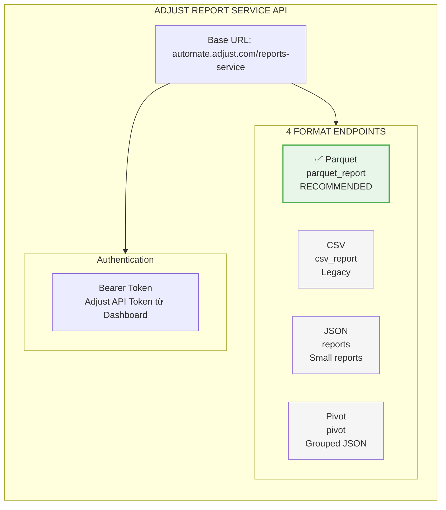
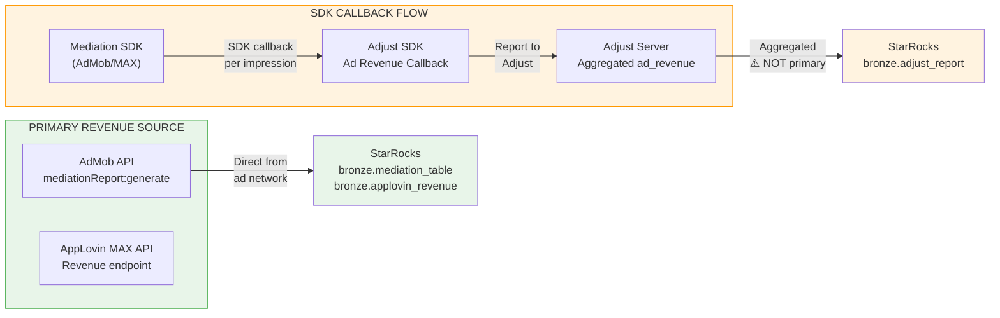
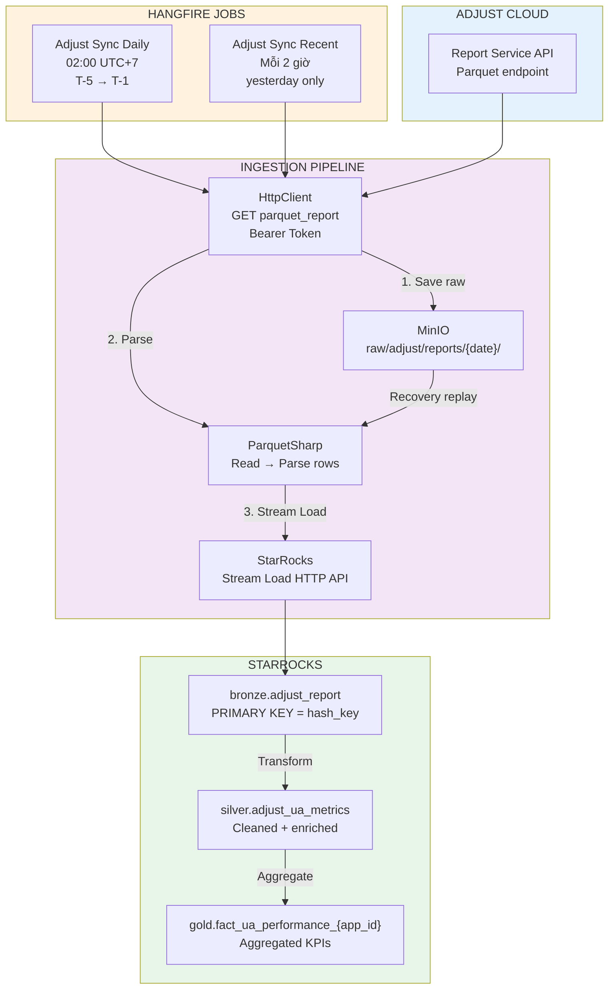
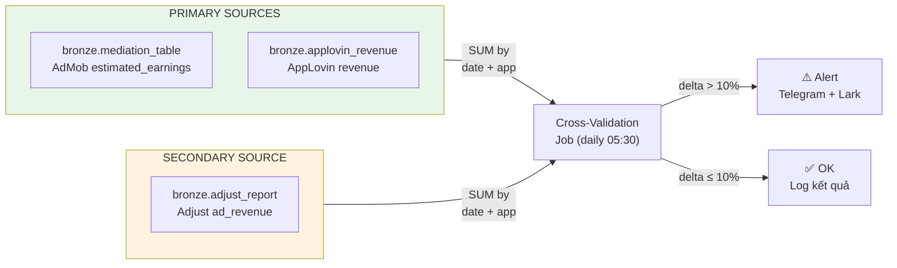
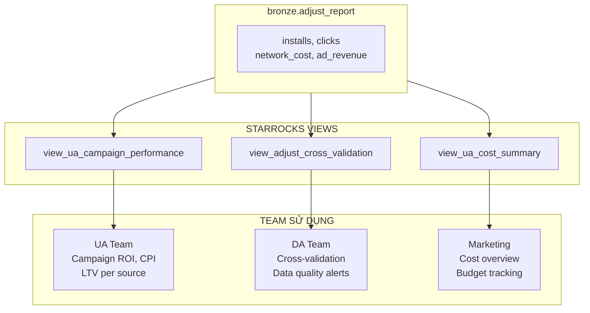

# 119 — ADJUST REPORT SERVICE API — PARQUET SYNC STRATEGY

**Document Version:** 1.1  

**Date:** March 2026  

**Purpose:** Đánh giá Adjust Report Service API (Parquet endpoint) và phương án đồng bộ dữ liệu Adjust vào Mediation Pro platform.

**Liên quan:** [99 — Mediation Pro Platform](99%20-%20MEDIATION%20PRO%20PLATFORM.md), [100 — Amobear Data Storage Architecture](100%20-%20AMOBEAR%20DATA%20STORAGE%20ARCHITECTURE.md), [115 — Data Context](115%20-%20DATA%20CONTEXT%20FOR%20AI%20ASSISTANT.md), [ADJUST_INTEGRATION_GUIDE](adjust/ADJUST_INTEGRATION_GUIDE.md)

**v1.1 (bổ sung triển khai):** Chu kỳ cohort token **`d{n}`** (Parquet/API); `filters_data` cho `cohort_metrics` / `full_cohort_periods`; nhóm metric `AdjustParquetMetricGroups` (all / core / ua); phân loại cột `AdjustMetricCategory` (HashSet base + bóc hậu tố); client `GetFiltersDataRawAsync` / `FetchParquetReportAsync`.

---

# 1. TỔNG QUAN ADJUST REPORT SERVICE API

## 1.1 API Overview

Adjust Report Service API cung cấp 4 format endpoint để query aggregated data:



## 1.2 Tại sao chọn Parquet endpoint

| Tiêu chí | Parquet | CSV | JSON |
|-----------|---------|-----|------|
| **File size** | Nhỏ nhất (columnar + Brotli compression) | Lớn 5-10x so với Parquet | Lớn nhất |
| **Typed columns** | ✅ Schema trong file | ❌ Mọi thứ là string | ✅ Nhưng verbose |
| **Parse performance** | Nhanh (ParquetSharp native) | Chậm (string parsing) | Trung bình |
| **Adjust recommendation** | ✅ Best practice cho large reports | Legacy | Small reports only |
| **Phù hợp pipeline hiện tại** | ✅ Đã có ParquetSharp cho Firebase | ❌ Cần thêm CSV parser | ❌ Khác pattern |

> **Quyết định:** Dùng Parquet endpoint — khớp pattern Firebase/BigQuery pipeline đã có (ParquetSharp → StarRocks Stream Load).

## 1.3 Dimensions có sẵn

| Dimension | Kiểu | Ví dụ | Dùng cho |
|-----------|------|-------|----------|
| `day` | Date | 2026-03-14 | Time series, partition key |
| `app` / `app_token` | String | com.random.app / abc123 | Filter/group theo app |
| `country` / `country_code` | String | US | Geo breakdown |
| `network` | String | AppLovin, Facebook Installs | Network attribution |
| `campaign` / `campaign_id_network` | String | — | Campaign-level UA |
| `adgroup` / `adgroup_id_network` | String | — | Adgroup drill-down |
| `creative` / `creative_id_network` | String | — | Creative analysis |
| `os_name` | String | android, ios | Platform split |
| `partner_name` / `partner_id` | String | AppLovin / 34 | Partner attribution |
| `store_type` | String | google_play | Store breakdown |

## 1.4 Metrics chính

| Metric | Ý nghĩa | Sử dụng tại Amobear |
|--------|---------|---------------------|
| `installs` | Số lượt install (Adjust attributed) | UA KPI chính |
| `clicks` | Clicks trên ad | CTR analysis |
| `impressions` | Ad impressions (UA side) | CPM tính toán |
| `network_cost` | Chi phí UA từ network report | Cost input cho ROI |
| `network_ecpi` | eCPI từ network | CPI benchmark |
| `ad_revenue` | Ad revenue aggregated từ SDK callbacks | ⚠️ Cross-validation only |
| `all_revenue` | Tổng revenue (ad + IAP) | LTV calculation |
| `cohort_*` / `{base}_d{n}` | Cohort metrics (token chu kỳ **`d0`, `d7`, `d120`** theo Adjust) | Retention & LTV cohort (JSON `cohort_*_metrics_json` trên Bronze) |

## 1.5 Cohort — token `d{số}` & khám phá API

- Adjust / Datascape dùng hậu tố **`_d{n}`**, **`_w{n}`**, **`_m{n}`** trong tên cột Parquet và metric API (vd. `revenue_total_per_user_d30`, `cohort_size_d7`). **Không** dùng `_30d`, `_7d` làm chuẩn (có thể gặp ở tài liệu cũ hoặc nguồn khác).
- Glossary mô tả `{base}_{cohort_period}` — khi request `metrics=`, ghép đúng token từ [filters_data](https://dev.adjust.com/en/api/rs-api/filters-data) `required_filters=full_cohort_periods,cohort_metrics`.
- Lỗi **Unsupported metric:** đối chiếu slug với [Datascape metrics glossary](https://help.adjust.com/en/article/datascape-metrics-glossary) và response `filters_data` (vd. cumulative: `lifetime_value_iap`, `roas_iap`; không dùng tên UI kiểu `ltv_iap_all_users_…` nếu không có trong API).

**Code (backend):**

| Thành phần | Vai trò |
|------------|---------|
| `AdjustParquetMetricGroups` | `Dimensions` chung; `GetAllGroups` / `GetCoreGroups` / `GetUAGroups` — chuỗi `metrics` theo từng request; cohort ngày qua `CohortPeriodToken(day)` → `d0`, `d3`, … |
| `AdjustParquetSyncJob` | Phase 1: `FetchParquetReportAsync` → MinIO `raw/adjust/reports/{date}/`; Phase 2: parse + merge + `AdjustStarRocksWriter`. Config: `Adjust:ParquetMetricGroups`, `Adjust:ParquetAppsPerChunk`, `Adjust:ParquetDelayBetweenMetricGroupsMs` |
| `AdjustParquetReportParser` | Parquet → `AdjustReportRecord`; `AdjustMetricCategory.SplitByCategory` → các JSON nhóm |
| `AdjustMetricCategory` | `CohortCumulativeMetricBases` / `CohortNonCumulativeMetricBases` + regex hậu tố cohort |
| `AdjustApiClient` | `GetAppsAsync`, `GetFiltersDataRawAsync`, `FetchParquetReportAsync` |

## 1.6 Filters quan trọng (parquet_report)

```
GET /reports-service/parquet_report
  ?dimensions=day,app,country_code,network,campaign_id_network
  &metrics=installs,clicks,network_cost,network_ecpi,ad_revenue
  &date_period=2026-03-09:2026-03-14          # T-5 .. T-1
  &app_token__in={token1},{token2},{token3}    # Filter apps
  &ad_spend_mode=network                       # Cost từ network
  &utc_offset=+07:00                           # UTC+7 cho Vietnam
  &attribution_source=dynamic                  # Default
```

**Logical date shortcuts:** `yesterday`, `today`, `this_week`, `last_week`, `this_month`, `last_month`, `this_month_until_yesterday`

**Relative dates:** `-10d:-3d` (10 ngày trước đến 3 ngày trước)

---

# 2. CAVEAT QUAN TRỌNG — ADJUST AD_REVENUE



**Nguyên tắc đã xác lập:**

- **Primary revenue source** = AdMob API (`bronze.mediation_table`) + AppLovin MAX API (`bronze.applovin_revenue`)
- **Adjust `ad_revenue`** = Dữ liệu aggregated từ SDK callbacks, đã đi qua 2 lớp trung gian
- **Dùng Adjust ad_revenue cho:**
  - UA analytics: attribution revenue per campaign/source
  - Cross-validation: so sánh tổng Adjust vs tổng AdMob+AppLovin, alert nếu delta > 10%
  - LTV calculation: cohort-level revenue per install source
- **KHÔNG dùng Adjust ad_revenue làm:** nguồn doanh thu chính trên dashboard Mediation

> **Lưu ý thêm:** Adjust `ad_revenue` có thể bao gồm cả AdMob revenue report qua AppLovin MAX SDK → cần cẩn thận dedup khi cross-validate (tương tự issue AppLovin dedup đã xử lý ở Gold layer).

---

# 3. PHƯƠNG ÁN ĐỒNG BỘ — DUAL-JOB PATTERN

## 3.1 Kiến trúc tổng quan



## 3.2 Chi tiết 2 Jobs (giống AdMob)

| Thuộc tính | Job 1: Adjust Parquet Sync (Today) | Job 2: Adjust Parquet Sync (T-1 to T-5) |
|------------|-----------------------------------|----------------------------------------|
| **Schedule** | Mỗi 2 giờ (UTC, ví dụ `0 */2 * * *`) — `SyncTodayAsync` | Mỗi 12 giờ — `SyncT1ToT5Async` |
| **date_period** | **Today** (một ngày: UTC `DateTime.UtcNow.Date`) | **T-5 .. T-1** (5 ngày lịch) |
| **Dimensions** | day, app, country_code, network, campaign_id_network | Giống Job 1 |
| **Metrics** | Theo `AdjustParquetMetricGroups` (mặc định từ config; có thể UA = conversion + cohort cum/non-cum + ad spend + revenue) | Giống Job 1 |
| **Mục đích** | Lấy dữ liệu ngày hiện tại (cập nhật thường xuyên) | Đồng bộ lại 5 ngày gần nhất (delayed/finalized data) |
| **MinIO path** | `raw/adjust/reports/{yyyy-MM-dd}/` (một prefix / ngày; file `adjust_yyyyMMdd_{chunk}_{category}.parquet`) | Theo từng ngày trong T-1..T-5 |
| **MinIO cleanup** | Trước khi tải: xóa toàn bộ object dưới prefix `raw/adjust/reports/{date}/` rồi tải mới (phục vụ backfill đọc lại từ MinIO) | Theo từng ngày trong khoảng T-1..T-5 |
| **Hangfire job_id** | `adjust-parquet-sync-today` | `adjust-parquet-sync-t1-t5` |

> **Pattern nhất quán:** Giống AdMob — Performance Sync (Today) 2h/lần + Performance Sync (Last 3 Days) 12h/lần. Lưu MinIO theo ngày như các nguồn khác; cleanup prefix theo ngày trước khi tải để có thể backfill từ MinIO (`POST .../adjust-parquet-load-from-minio?date=yyyy-MM-dd`).

## 3.3 Lịch chạy tổng hợp (bổ sung vào §17.2 của doc 99)

```mermaid
gantt
    title Adjust Parquet Sync (UTC)
    dateFormat HH:mm
    axisFormat %H:%M

    section Adjust
    Adjust Sync Today (2h/lần)   :adj1, 00:00, 15m
    Adjust Sync T-1..T-5 (12h)   :adj2, 00:00, 30m
```



| Time (UTC) | Job | Mô tả | Frequency |
|------------|-----|--------|-----------|
| **0h, 2h, 4h, …** | Adjust Parquet Sync **Today** | Đồng bộ **ngày hiện tại**. MinIO: cleanup `raw/adjust/reports/{today}/` rồi tải Parquet. | **Mỗi 2 giờ** |
| **0h, 12h** | Adjust Parquet Sync **T-1 to T-5** | Đồng bộ lại **T-1 đến T-5**. Mỗi ngày: cleanup prefix theo ngày → tải → ghi StarRocks. | **Mỗi 12 giờ** |

---

# 4. STARROCKS SCHEMA

## 4.1 Bronze Table

```sql
-- bronze.adjust_report: Adjust Report Service data (Parquet endpoint)
-- PRIMARY KEY = hash_key → INSERT = UPSERT
CREATE TABLE IF NOT EXISTS bronze.adjust_report (
    hash_key          VARCHAR(64)   NOT NULL  COMMENT 'MD5(date+app_token+country_code+network+campaign_id_network)',
    date              DATE          NOT NULL,
    app_token         VARCHAR(50)   NOT NULL,
    app_name          VARCHAR(500),
    country_code      VARCHAR(10),
    os_name           VARCHAR(20),
    network           VARCHAR(255),
    campaign          VARCHAR(500),
    campaign_id_network VARCHAR(255),
    campaign_network  VARCHAR(500),
    adgroup           VARCHAR(500),
    adgroup_id_network VARCHAR(255),
    partner_name      VARCHAR(255),
    partner_id        VARCHAR(50),
    -- Metrics
    installs          BIGINT        DEFAULT 0,
    clicks            BIGINT        DEFAULT 0,
    impressions       BIGINT        DEFAULT 0,
    network_cost      DECIMAL(20,6) DEFAULT 0,
    network_ecpi      DECIMAL(20,6) DEFAULT 0,
    ad_revenue        DECIMAL(20,6) DEFAULT 0  COMMENT '⚠️ Aggregated from SDK — cross-validation only',
    all_revenue       DECIMAL(20,6) DEFAULT 0,
    -- Meta
    _synced_at        DATETIME      NOT NULL,
    _source_file      VARCHAR(1000),
    _sync_job_type    VARCHAR(20)   COMMENT 'daily | recent'
)
PRIMARY KEY(hash_key)
-- Nếu bảng đã tồn tại (từ JSON sync) mà chưa có _sync_job_type: ALTER TABLE bronze.adjust_report ADD COLUMN _sync_job_type VARCHAR(20) NULL;
PARTITION BY RANGE(date) ()
DISTRIBUTED BY HASH(app_token) BUCKETS 8
PROPERTIES(
    "dynamic_partition.enable" = "true",
    "dynamic_partition.time_unit" = "MONTH",
    "dynamic_partition.start" = "-12",
    "dynamic_partition.end" = "2",
    "replication_num" = "1",
    "compression" = "ZSTD"
);
```

## 4.2 MinIO Storage Path (theo ngày, giống các source khác)

```
amobear-datalake/
├── raw/
│   └── adjust/
│       └── reports/
│           └── 2026-03-14/
│               ├── adjust_20260314_000_conversion.parquet
│               ├── adjust_20260314_000_cohort_cumulative.parquet
│               └── ...  (một file / chunk / nhóm metric; suffix = category)
```

- Một prefix theo ngày: `raw/adjust/reports/{yyyy-MM-dd}/`. Không chia daily/recent.
- Trước khi tải cho một ngày: **xóa toàn bộ object** dưới prefix đó (`DeleteObjectsByPrefix`), rồi tải mới từ API. Phục vụ backfill: đọc lại từ MinIO bằng `POST .../adjust-parquet-load-from-minio?date=yyyy-MM-dd`.

---

# 5. CROSS-VALIDATION ENGINE

## 5.1 Luồng cross-validate



## 5.2 Logic so sánh

```sql
-- Cross-validation query: so sánh tổng revenue giữa primary sources và Adjust
WITH primary_rev AS (
    SELECT 
        date,
        app_id,
        SUM(estimated_earnings) AS primary_revenue
    FROM bronze.mediation_table
    WHERE date = CURRENT_DATE() - INTERVAL 1 DAY
    GROUP BY date, app_id
),
adjust_rev AS (
    SELECT
        date,
        app_token,
        SUM(ad_revenue) AS adjust_revenue
    FROM bronze.adjust_report
    WHERE date = CURRENT_DATE() - INTERVAL 1 DAY
    GROUP BY date, app_token
)
SELECT
    p.date,
    p.app_id,
    p.primary_revenue,
    a.adjust_revenue,
    ABS(p.primary_revenue - a.adjust_revenue) / NULLIF(p.primary_revenue, 0) * 100 AS delta_pct
FROM primary_rev p
LEFT JOIN adjust_rev a ON p.app_id = a.app_token AND p.date = a.date
WHERE ABS(p.primary_revenue - a.adjust_revenue) / NULLIF(p.primary_revenue, 0) > 0.10;
```

> **Lưu ý:** Mapping `app_id` (AdMob) ↔ `app_token` (Adjust) cần bảng dimension trong PostgreSQL (`dim_apps`).

---

# 6. TRADE-OFFS

| Quyết định | Chọn | Lý do | Trade-off |
|------------|------|-------|-----------|
| **Format** | Parquet | Nhỏ hơn CSV 5-10x, typed, khớp pattern Firebase | Cần ParquetSharp (đã có) |
| **Sync window** | T-5 daily + yesterday/2h | Bắt delayed data, cập nhật nhanh T-1 | Nhiều API calls hơn single daily |
| **Dimensions** | day, app, country, network, campaign | Đủ cho UA analytics | Không có creative-level (thêm sau nếu cần) |
| **ad_revenue usage** | Cross-validation only | SDK callback data, không chính xác bằng direct API | Cần maintain thêm 1 validation job |
| **Hash key** | MD5(date+app+country+network+campaign) | UPSERT tránh duplicate, khớp pattern mediation_table | Phải đảm bảo đúng composite key |
| **Batch strategy** | `app_token__in` gộp nhiều app/request | Tránh 429 (50 concurrent limit) | Response size lớn hơn, cần monitor memory |

---

# 7. RỦI RO & GIẢM THIỂU

| # | Rủi ro | Mức độ | Giảm thiểu |
|---|--------|--------|------------|
| R1 | **Rate limit 429** — Adjust giới hạn 50 concurrent requests | Trung bình | Batch apps bằng `app_token__in` (20-30 apps/request), không query từng app. Retry với exponential backoff. |
| R2 | **Binary response handling** — Parquet là binary, không phải JSON | Thấp | HttpClient dùng `ReadAsByteArrayAsync()`, KHÔNG `ReadAsStringAsync()`. Unit test verify parse. |
| R3 | **Brotli compression** — Adjust output Parquet với Brotli | Thấp | ParquetSharp handle Brotli natively. Verify trong dev trước production. |
| R4 | **Stream Load redirect** — StarRocks FE → BE redirect dùng `127.0.0.1` | Đã biết | Override redirect URL trong HttpClient (đã có solution cho AdMob/Firebase). |
| R5 | **Dedup với AppLovin** — Adjust `ad_revenue` có thể chứa revenue đã report qua AppLovin MAX | Cao | KHÔNG dùng Adjust ad_revenue làm primary. Chỉ cross-validate ở aggregate level (tổng ngày/app). |
| R6 | **app_token mapping** — Adjust dùng token riêng, khác AdMob app ID | Trung bình | Bảng `dim_apps` trong PostgreSQL phải có cột `adjust_app_token`. Populate khi onboard app. |
| R7 | **Data delay** — Adjust data có thể chưa finalize trong 24-48h | Trung bình | Daily job sync T-5 tự backfill. Alert nếu T-2 data vẫn thiếu sau 48h. |

---

# 8. SỬ DỤNG TRONG PLATFORM

## 8.1 Ai dùng dữ liệu Adjust?



## 8.2 Metrics từ Adjust data

| Metric | Công thức | Team | Phase |
|--------|-----------|------|-------|
| **CPI** | network_cost / installs | UA | Phase 2 |
| **ROAS** | (ad_revenue × N days) / network_cost | UA | Phase 2 |
| **Install Volume** | SUM(installs) by source | UA, Marketing | Phase 2 |
| **Cost Efficiency** | network_cost by network/campaign | Marketing | Phase 2 |
| **Revenue Delta** | ABS(adjust_ad_revenue - primary_revenue) / primary_revenue | DA | Phase 2 |

---

# 9. API REFERENCE — QUICK CHEAT SHEET

## 9.1 Parquet Report Request

```http
GET https://automate.adjust.com/reports-service/parquet_report
    ?dimensions=day,app,country_code,network,campaign_id_network
    &metrics=installs,clicks,impressions,network_cost,network_ecpi,ad_revenue
    &date_period=-5d:-1d
    &app_token__in={token1},{token2},{token3}
    &ad_spend_mode=network
    &utc_offset=+07:00
    &sort=-installs

Authorization: Bearer {adjust_api_token}
Accept: application/octet-stream
```

## 9.2 Response

- **Format:** Binary Parquet (Brotli compressed)
- **Content-Type:** `application/octet-stream`
- **Response codes:** 200 (data), 204 (empty), 400 (bad request), 401 (auth), 429 (rate limit), 503/504 (server)

## 9.3 Logical Date Shortcuts

| Value | Ý nghĩa |
|-------|---------|
| `yesterday` | Ngày hôm qua |
| `today` | Hôm nay (có thể chưa đầy đủ) |
| `this_week` | Thứ 2 tuần này → hôm nay |
| `last_week` | Thứ 2 → CN tuần trước |
| `this_month` | Ngày 1 tháng này → hôm nay |
| `last_month` | Tháng trước đầy đủ |
| `this_month_until_yesterday` | Ngày 1 → hôm qua |
| `-5d:-1d` | 5 ngày trước → 1 ngày trước (relative) |

---

# 10. ĐÁNH GIÁ VỚI HỆ THỐNG DATA HIỆN TẠI (DOC 115)

## 10.1 Khớp với Data Context

| Doc 115 | Parquet pipeline (doc 119) | Ghi chú |
|---------|-----------------------------|--------|
| **Vai trò Adjust** | Attribution / Reference (MMP) | Không thay đổi — revenue chính vẫn AdMob + AppLovin |
| **bronze.adjust_report** | Cùng bảng, cùng partition (date) | Parquet job ghi thêm cột `_sync_job_type` (daily \| recent) |
| **silver.adjust_daily_metrics** | Nguồn từ bronze.adjust_report | Transform job (đã planned) join `dim_app_identifiers.adjust_app_token` → `app_id` (admob_app_id) |
| **gold.fact_campaign_roi** | Feed từ silver.adjust_daily_metrics | Data flow giữ nguyên: Adjust → silver → gold |
| **dim_app_identifiers.adjust_app_token** | Map app_token ↔ admob_app_id | Cần populate khi onboard app; dùng cho Silver/Gold JOIN |
| **Cross-validation** | Primary (AdMob+AppLovin) vs Adjust ad_revenue | Job so sánh tổng theo date+app; alert nếu delta > 10% |

## 10.2 So sánh Parquet vs JSON (đang dùng)

| Tiêu chí | Parquet (doc 119) | JSON (sync hiện tại) |
|----------|--------------------|----------------------|
| **Kích thước response** | Nhỏ hơn 5–10× (columnar + Brotli) | Lớn, dễ timeout khi nhiều app |
| **Parse** | Parquet.Net (đã có cho Firebase) | System.Text.Json |
| **Raw lưu trữ** | MinIO `raw/adjust/reports/{yyyy-MM-dd}/` | Không lưu raw JSON (chỉ ghi StarRocks) |
| **Recovery** | Có thể replay từ MinIO Parquet | Không replay được |
| **Khuyến nghị Adjust** | Best practice cho large reports | Phù hợp report nhỏ |
| **Schedule** | Daily (T-5→T-1) + Recent (yesterday / 2h) | Một job theo khoảng ngày |

**Kết luận:** Parquet phù hợp hơn cho production: ít timeout, có raw trên MinIO, thống nhất với pipeline Firebase (Parquet.Net → StarRocks). JSON sync giữ lại cho test hoặc backfill linh hoạt.

---

# 11. TƯƠNG THÍCH VỚI KIẾN TRÚC HIỆN TẠI

| Component | Hiện tại | Adjust Parquet integration |
|-----------|----------|----------------------------|
| **Ingestion** | BaseSyncService / Hangfire jobs | `AdjustParquetSyncJob.SyncTodayAsync`, `AdjustParquetSyncJob.SyncT1ToT5Async` |
| **Job scheduler** | Hangfire, `hangfire_job_schedules` | Cron: today mỗi ~2h; T-1..T-5 mỗi ~12h (xem doc 99 §17.3) |
| **Raw storage** | MinIO `amobear-datalake/raw/` | `raw/adjust/reports/{yyyy-MM-dd}/` |
| **Parse** | Parquet (Firebase) | `AdjustParquetReportParser` (ParquetSharp) đọc Parquet → `AdjustReportRecord` |
| **Analytics** | StarRocks Bronze → Silver → Gold | Cùng `bronze.adjust_report`; Silver/Gold theo doc 115 |
| **Auth** | PostgreSQL `adjust_accounts` | Dùng chung account, không thêm config mới |
| **Monitoring** | Prometheus + Grafana | Thêm metrics: sync duration, row count, error rate (optional) |

> **Ghi chú:** Adjust Parquet parser dùng **ParquetSharp** (`AdjustParquetReportParser`). Firebase pipeline có thể dùng thư viện Parquet khác — không bắt buộc trùng package.

---

## 12. CHANGELOG

| Phiên bản | Nội dung |
|-----------|----------|
| **1.0** | Chiến lược Parquet, dual job, MinIO, StarRocks bronze, cross-validation. |
| **1.1** | Chuẩn hóa **119** (số tài liệu); cohort **`d{n}`**; bảng mapping code; sửa path MinIO (bỏ daily/recent); job thực tế `AdjustParquetSyncJob`; ghi chú ParquetSharp. |
