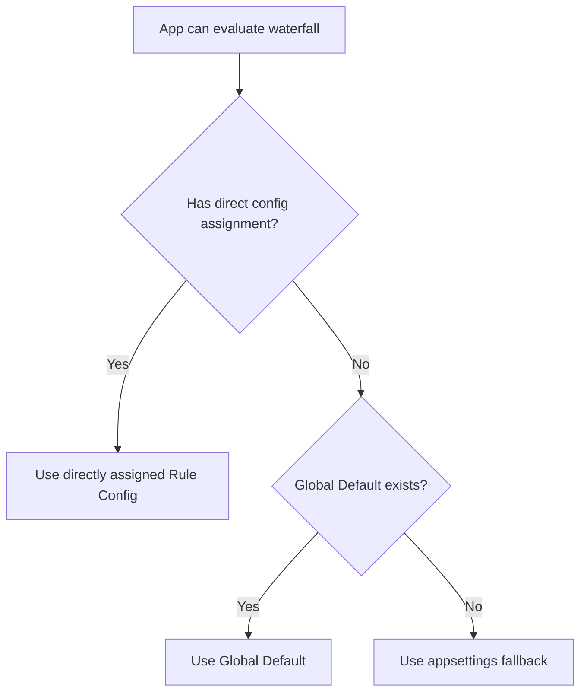
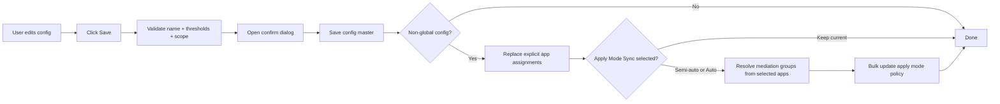
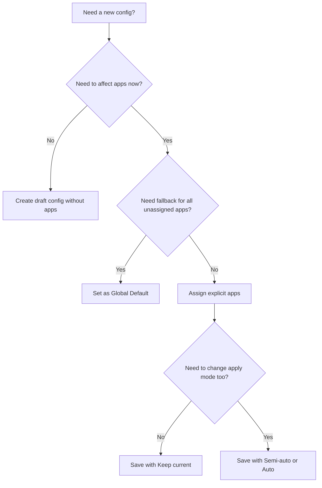

# 119 - WATERFALL RULE CONFIG USER MANUAL

## Summary

Tai lieu nay huong dan team van hanh su dung man `Waterfall Rules` sau khi doi sang mo hinh `config master + app mapping`.

Muc tieu cua man nay:

- Tao `Rule Config` dung chung cho nhieu app
- Cho phep tao config nhap khi chua gan app nao
- Gan moi app vao toi da 1 config truc tiep
- Cau hinh 1 `Global Default` lam fallback cho app chua duoc gan config
- Dong bo `Apply Mode` cho mediation groups cua cac app duoc chon khi save config

## Core Concepts

| Concept | Meaning |
| --- | --- |
| `Rule Config` | Cau hinh dung chung gom `Config Name`, thresholds, `Rule Group`, notes |
| `Direct assignment` | App duoc gan truc tiep vao 1 config cu the |
| `Global Default` | Config fallback cho moi app chua co direct assignment |
| `Appsettings fallback` | Nguon cuoi cung khi app khong co direct assignment va he thong chua co global default |
| `Apply Mode Sync` | Tuy chon doi `semi_auto` hoac `auto` cho mediation groups cua cac app dang duoc assign trong lan save hien tai |

## Effective Config Resolution

### Important Rules

- `Config Name` la bat buoc va phai unique sau khi trim, khong phan biet hoa thuong.
- Mot app chi duoc thuoc toi da 1 config truc tiep tai mot thoi diem.
- `Global Default` khong cho phep explicit app assignments.
- Chuyen `Global Default` tu config A sang config B duoc xu ly atomically trong cung mot lan save.

## Screen Map

### Waterfall Rules table

Bang hien thi tung config that, khong con group tam theo thresholds.

Moi row co the hien thi:

- `Config Name`
- badge `Global Default` neu la config fallback
- `Rule Group`
- thresholds
- so app dang thuoc config
- danh sach app preview bang avatar

Voi row `Global Default`, cot app hien thi so app dang fallback vao config nay, tuc la cac app chua co direct assignment.

### Create / Edit dialog

Dialog chia thanh 2 cot:

- ben trai: `Config Name`, `Use as Global Default`, thresholds, `Rule Group`, notes, `Apply Mode Sync`
- ben phai: `App Assignments`

Trong danh sach app:

- moi item hien avatar app
- status nam ben phai item
- cac status chinh:
  - `Unassigned`
  - `Assigned`
  - `Assigned here`
  - `Will reassign`

Neu app dang thuoc config khac va user tick chon, he thong se canh bao truoc khi save.

## Save Flow

## Common Tasks

### 1. Create a draft config

Dung khi muon chuan bi config truoc, chua ap vao app nao.

Steps:

1. Mo `Waterfall Rules`.
2. Chon `Create Config`.
3. Nhap `Config Name`.
4. Cau hinh thresholds va `Rule Group`.
5. Khong can chon app nao.
6. Bam `Create Config`.
7. Xac nhan popup save.

Result:

- Config duoc tao thanh cong.
- Chua co app nao bi anh huong.
- Config co the duoc assign sau.

### 2. Create config va assign app ngay

Steps:

1. Mo `Create Config`.
2. Nhap `Config Name` duy nhat.
3. Chon app trong `App Assignments`.
4. Neu can, chon `Apply Mode Sync`:
   - `Keep current`
   - `Semi-auto`
   - `Auto`
5. Bam `Create Config`.
6. Xem popup confirm.

Neu trong danh sach co app da thuoc config khac:

- dialog se hien warning tom tat
- popup confirm se liet ke app nao dang thuoc config nao
- user phai xac nhan de he thong chuyen app sang config moi

### 3. Switch Global Default

Steps:

1. Edit config can dat lam global.
2. Bat `Use as Global Default`.
3. Save va xac nhan popup.

Behavior:

- He thong tu bo co global o config cu va gan cho config moi trong cung mot lan save.
- Khong co khoang trong tam thoi khong co default.
- App chua co direct assignment se fallback sang global moi.

### 4. Edit mot config da co app

Khi edit config dang duoc nhieu app su dung:

- thay doi thresholds hoac `Rule Group` se ap vao toan bo app dang thuoc config do
- popup confirm luon nhac pham vi anh huong
- neu co tick them app dang nam o config khac, save se dong thoi reassign cac app do

### 5. Apply Mode Sync

`Apply Mode Sync` chi dung cho app duoc assign truc tiep trong lan save hien tai.

| Option | Meaning |
| --- | --- |
| `Keep current` | Khong doi apply mode cua mediation groups |
| `Semi-auto` | Doi policy sang `semi_auto`, tao due alert o chu ky 7 ngay |
| `Auto` | Doi policy sang `auto`, tu apply actionable changes khi den chu ky 7 ngay |

Luu y:

- Tinh nang nay khong apply waterfall ngay tai thoi diem save.
- Khong dung cho `Global Default`.
- Neu config la draft va khong co app nao duoc assign, phan nay khong co tac dung.

### 6. Manage config cho mot app tu App Detail

Trong `App Overview`:

1. Mo card `Waterfall Config`.
2. Xem `Source` hien tai:
   - `Direct`
   - `Global Default`
   - `Appsettings`
3. Bam edit.
4. Chon 1 config cu the hoac `Use fallback`.

Behavior:

- Chon config moi se dua app vao config do.
- `Use fallback` se bo direct assignment, de app dung `Global Default` neu co, neu khong thi dung `appsettings`.

## Operator Notes

- Dung ten config theo nghiep vu, vi du `Rewarded Tier A`, `Interstitial Low MR Recovery`, `Global Default`.
- Nen tao draft config truoc neu can review thresholds voi team mediation.
- Khi thay doi config dang duoc nhieu app dung, can kiem tra warning popup truoc khi confirm.
- Neu muon doi apply mode hang loat, nen chon app scope ro rang trong dialog de tranh doi nham policy cua nhieu mediation groups.

## Troubleshooting

### Config name bi bao trung

Nguyen nhan:

- Ten da ton tai sau khi trim
- Khac nhau chi o chu hoa / chu thuong

Xu ly:

- Dat ten moi ro nghia hon
- Them suffix version nghiep vu nhu `v2`, `Low MR`, `Android`, `Rewarded`

### App count cua Global Default lon hon 0 du khong assign truc tiep

Day la behavior dung.

`Global Default` hien thi so app dang fallback vao no, khong phai so app duoc assign truc tiep.

### Khong thay `Apply Mode Sync`

Kiem tra cac dieu kien:

- config khong phai `Global Default`
- co it nhat 1 app duoc chon
- user co quyen manage apply policy

## Quick Decision Diagram

## Related Files

- `frontend/components/waterfall-rules/waterfall-configs-panel.tsx`
- `frontend/components/waterfall-rules/create-edit-config-dialog.tsx`
- `frontend/components/waterfall-rules/configs-table.tsx`
- `frontend/components/apps/app-detail/app-waterfall-config-card.tsx`
- `backend/MediationPro.Api/Controllers/WaterfallRecommendationSettingsController.cs`
