# 120 — Amobear Nexus: Multi-Mediation Intelligence Platform

> **Module:** Amobear Nexus (formerly Mediation Pro) — Feature Extension Proposal
> 
> 
> **Stack:** .NET Core 8 + Nexus SDK (Android/iOS) + StarRocks + PostgreSQL + Kafka (Phase 3)
> 
> **Reference:** 99 (Platform), 113 (Waterfall Optimizer v3.0), 115 (AI Insight & Alert), 116 (RAG), HyperBid Tools Analysis
> 
> **Version:** 1.0 — 2026-03-25
> 

---

## Mục lục

1. Bối cảnh & Chiến lược
2. Gap Analysis: Nexus hiện tại vs Thị trường
3. Năm nhóm tính năng mới — Tổng quan
4. FG1 — Waterfall Benchmark Engine (Qualified Benchmark)
5. FG2 — Experiment Engine (AB Testing)
6. FG3 — User Segment Engine
7. FG4 — Multi-Mediation Orchestration
8. FG5 — LTV Intelligence & UA Feedback Loop
9. Về Kafka Event System — Đúng thời điểm
10. Database Schema tổng hợp
11. Roadmap 6 tháng
12. KPI & OKR
13. Rủi ro & Mitigation

---

# 1. Bối cảnh & Chiến lược

## 1.1 Từ Mediation Pro đến Amobear Nexus

Mediation Pro đã xây dựng được foundation vững:

- AdMob data pipeline hoàn chỉnh (Bronze/Silver/Gold)
- Waterfall Optimizer với 2 rule sets (Default 8 rules + Revenue-First 11 rules)
- AdMob Write API integration (read + apply)
- AI Suite (SQL Assistant, Daily Insight, Alert Builder)
- Multi-source data: Adjust, AppMetrica, AppLovin MAX, XMP, Firebase realtime

HyperBid Tools — một multi-mediation SDK đang bán cho publishers — validate rằng:

- **Multi-mediation backfill** tạo +7-27% ARPDAU uplift (case study thực tế)
- **AB testing ở mediation level** là nhu cầu thật (test waterfall, test network, test floor price)
- **User segmentation** (GEO, device tier, install age) cho phép apply waterfall khác nhau per segment
- **LTV + UA feedback loop** giúp optimize UA spend dựa trên actual ad revenue

Tuy nhiên, HyperBid là vendor bên ngoài — dùng họ có nghĩa là trao data cho TopOn (mẹ của HyperBid), thêm SDK dependency, mất data ownership. Amobear Nexus sẽ build in-house với lợi thế: **own toàn bộ data, tích hợp sâu với Waterfall Optimizer, và có Kafka event pipeline sắp tới**.

## 1.2 Insight quan trọng nhất: "5-7 ngày" là vấn đề process, không phải technology

Team mediation hiện mất 5-7 ngày để lên waterfall cho app/GEO mới. Phân tích kỹ:

**Không phải do thiếu data** — với Adjust (vài giờ delay), Firebase realtime, AppMetrica, data đã available trong 12-24h. Bottleneck duy nhất là AdMob Reporting API có data T-1.

**Mà do thiếu framework ra quyết định:**

- Team set waterfall sequential (thử → chờ → sửa → chờ), không parallel
- Không có internal benchmark từ 200+ apps đang chạy
- Không có ngưỡng statistical confidence để biết "khi nào data đủ để quyết định"
- Mỗi app/GEO mới được treat như bài toán mới hoàn toàn

**Giải pháp đúng:**

- **Hour 0:** Apply benchmark waterfall từ similar apps/GEO trong portfolio → app có waterfall hợp lý ngay lập tức
- **Hour 12-24:** ~500-2000 impressions → đủ cho initial validation
- **Day 2-3:** Waterfall Optimizer refine dựa trên actual data
- → Rút ngắn từ 5-7 ngày xuống **12-24h cho waterfall hợp lý, 2-3 ngày cho waterfall tối ưu**

**Nhưng — benchmark phải đáng tin.** Nếu base trên waterfall đang hoạt động kém, ta vô tình nhân bản cái kém ra toàn portfolio. Đây là lý do FG1 (Benchmark Engine) cần có **Benchmark Quality Scoring** trước khi cho phép dùng làm template.

---

# 2. Gap Analysis

```mermaid
flowchart LR
    subgraph HAVE["✅ ĐÃ CÓ (Mediation Pro)"]
        H1["AdMob waterfall optimization<br/>11 rules, Write API"]
        H2["StarRocks pipeline<br/>Bronze/Silver/Gold"]
        H3["Multi-source data<br/>Adjust, AppMetrica,<br/>AppLovin, XMP, Firebase"]
        H4["AI Suite<br/>SQL, Insight, Alert"]
        H5["Monitoring & alerts"]
    end

    subgraph NEED["🔶 CẦN THÊM (Nexus)"]
        N1["Benchmark Engine<br/>+ Quality Scoring"]
        N2["Experiment Engine<br/>AB test waterfall"]
        N3["User Segmentation<br/>GEO, device, LTV tier"]
        N4["Multi-mediation<br/>orchestration"]
        N5["LTV + UA feedback"]
    end

    subgraph LATER["⏳ SAU (Kafka era)"]
        L1["Real-time experiment metrics"]
        L2["Live anomaly detection"]
        L3["User-level event stream"]
        L4["Real-time segment assignment"]
    end

    HAVE --> NEED --> LATER
```

| Capability | Nexus hiện tại | HyperBid | Nexus mục tiêu |
| --- | --- | --- | --- |
| AdMob waterfall optimization | ✅ 11 rules, DB-driven | ❌ | ✅ Giữ + extend |
| **Qualified benchmark engine** | ❌ | ❌ | ✅ **Unique advantage** |
| AB testing mediation | ❌ | ✅ | ✅ Experiment Engine |
| User segmentation | ❌ | ✅ | ✅ Segment Engine |
| Multi-mediation routing | ❌ | ✅ (core) | ✅ Thin SDK + server config |
| Data pipeline depth | ✅ StarRocks full | 🔶 Basic dashboard | ✅ Giữ nguyên |
| AI features | ✅ CRAFT, Insight, Alert | ❌ Buzzword | ✅ Giữ + extend |
| Data ownership | ✅ 100% on-premise | ❌ Vendor | ✅ On-premise |
| LTV calculation | 🔶 Planned | ✅ Có | ✅ Build |
| Real-time events | 🔶 Firebase stream only | ❌ | ✅ Kafka (Phase 3) |

---

# 3. Năm nhóm tính năng — Tổng quan

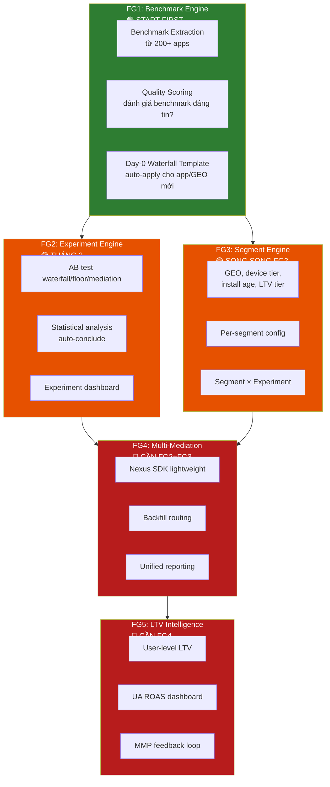

**Thứ tự ưu tiên:** FG1 trước — vì chi phí gần bằng 0 (chỉ query StarRocks data sẵn có), nhưng giải quyết ngay pain point 5-7 ngày. FG2/FG3 song song sau đó. FG4/FG5 cần FG2+FG3 làm foundation.

---

# 4. FG1 — Waterfall Benchmark Engine (Qualified Benchmark)

## 4.1 Bài toán

Amobear có 200+ apps, hàng chục GEOs, hàng trăm Mediation Groups đang chạy mỗi ngày. Đây là gold mine data mà team chưa khai thác: khi launch app mới ở Brazil, hoàn toàn có thể lấy eCPM range từ apps đang chạy tốt ở Brazil cùng category.

**Nhưng rủi ro lớn nhất:** nếu benchmark lấy từ waterfall đang hoạt động kém, ta nhân bản cái kém ra toàn portfolio. **Garbage in, garbage out.** Cần Quality Scoring để đảm bảo chỉ benchmark từ waterfall "đã proven" mới được dùng.

## 4.2 Kiến trúc tổng thể

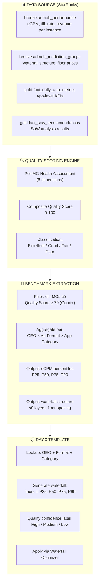

## 4.3 Quality Scoring — 6 Dimensions

Đây là phần critical nhất. Mỗi Mediation Group được chấm điểm trên 6 chiều:

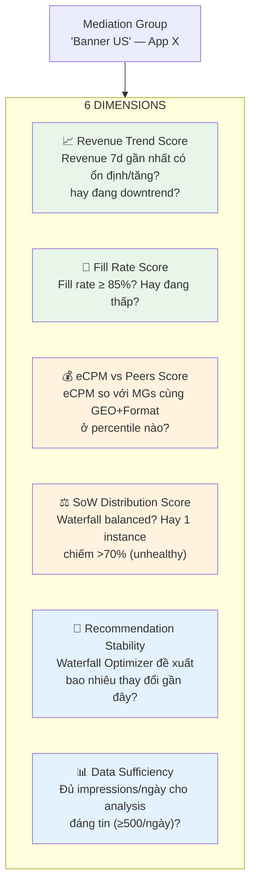

### Detail từng dimension:

| # | Dimension | Cách tính | Score range | Weight |
| --- | --- | --- | --- | --- |
| **D1** | Revenue Trend | Linear regression slope 7 ngày. Stable/tăng = cao, giảm mạnh = thấp | 0-100 | 20% |
| **D2** | Fill Rate | fill_rate ≥ 90% → 100, 80-90% → 70, 70-80% → 40, <70% → 10 | 0-100 | 15% |
| **D3** | eCPM vs Peers | Percentile rank trong nhóm cùng GEO+Format. P75+ → 100, P25-P75 → 60, <P25 → 20 | 0-100 | 25% |
| **D4** | SoW Distribution | Entropy-based. Balanced (top instance < 40% SoW) → cao. Dominated (top > 70%) → thấp | 0-100 | 15% |
| **D5** | Recommendation Stability | Số critical/high recommendations trong 14 ngày. 0 → 100, 1-2 → 70, 3-5 → 40, >5 → 10 | 0-100 | 15% |
| **D6** | Data Sufficiency | Avg impressions/day 7d. ≥1000 → 100, 500-1000 → 70, 100-500 → 40, <100 → 10 | 0-100 | 10% |

### Composite Score:

```
Quality Score = D1×0.20 + D2×0.15 + D3×0.25 + D4×0.15 + D5×0.15 + D6×0.10
```

### Classification:

| Score | Grade | Dùng cho benchmark? | Ý nghĩa |
| --- | --- | --- | --- |
| **80-100** | 🟢 Excellent | ✅ Ưu tiên cao nhất | Waterfall optimized, ổn định, eCPM tốt |
| **70-79** | 🔵 Good | ✅ Có thể dùng | Waterfall khá tốt, đủ tin cậy |
| **50-69** | 🟡 Fair | ⚠️ Chỉ dùng nếu không có nguồn tốt hơn | Có vấn đề, cần cảnh báo |
| **<50** | 🔴 Poor | ❌ KHÔNG dùng cho benchmark | Waterfall kém, dùng sẽ làm tệ hơn |

## 4.4 Benchmark Extraction Logic

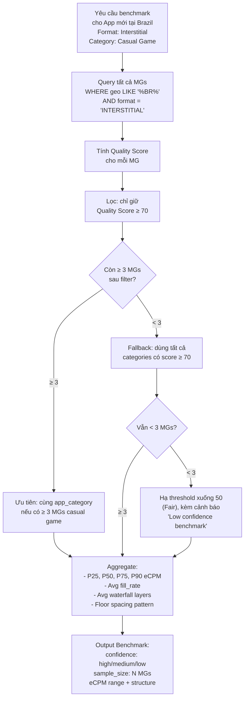

## 4.5 Benchmark Freshness & Decay

Benchmark không phải tính 1 lần rồi dùng mãi. Ad market thay đổi theo mùa, theo event, theo policy.

| Rule | Logic |
| --- | --- |
| **Auto-refresh** | Benchmark tính lại hàng tuần (Hangfire job Sunday 3AM) |
| **Decay warning** | Benchmark > 14 ngày mà chưa refresh → label "Stale" |
| **Seasonal flag** | Q4 (holiday season), Q1 (post-holiday drop) → benchmark kèm seasonal note |
| **Significant change alert** | Nếu benchmark mới khác > 20% so với lần trước → alert team review |

## 4.6 Day-0 Waterfall Template Generation

Khi app mới hoặc GEO mới được phát hiện, hệ thống tự generate waterfall:

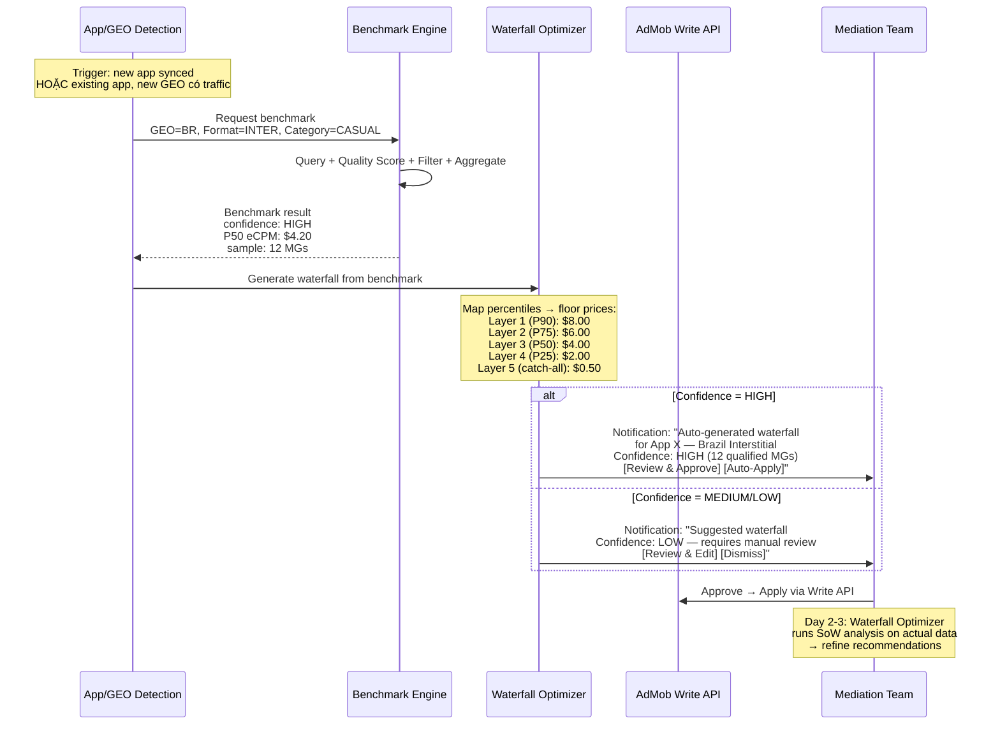

## 4.7 Floor Price Mapping từ Benchmark

```
Input benchmark: eCPM P25=$2.10, P50=$4.20, P75=$6.30, P90=$8.40
Average fill_rate ở qualified MGs: 82%

Waterfall template generation:

Layer 1 (aggressive):  floor = P90 × 1.2  = $10.00  → Capture high-value, expect low fill
Layer 2 (high):        floor = P90         = $8.40   → Target top quartile
Layer 3 (above-median): floor = P75        = $6.30   → Target above average
Layer 4 (median):      floor = P50         = $4.20   → Target median eCPM
Layer 5 (conservative): floor = P25        = $2.10   → Broader fill
Layer 6 (catch-all):   floor = P25 × 0.3  = $0.63   → Maximize fill rate

Lưu ý:
- Nếu fill_rate benchmark < 75% → bỏ Layer 1, shift tất cả xuống
- Nếu fill_rate benchmark > 90% → thêm Layer 0 = P90 × 1.5 (push ceiling)
- Minimum gap giữa 2 layers: 15% (tránh quá dày)
```

## 4.8 Benchmark Dashboard UI

```
┌──────────────────────────────────────────────────────────────────┐
│  📐 Waterfall Benchmarks                        [Refresh Now]     │
│  Last updated: Mar 23, 2026 03:00 AM                              │
├──────────────────────────────────────────────────────────────────┤
│                                                                    │
│  Filter: [GEO: All ▼] [Format: All ▼] [Category: All ▼]         │
│                                                                    │
│  ┌────────────────────────────────────────────────────────────┐  │
│  │ GEO    │ Format       │ Qual. MGs │ Avg Score │ eCPM P50  │  │
│  │ US     │ Interstitial │ 42        │ 🟢 82     │ $12.30    │  │
│  │ US     │ Rewarded     │ 38        │ 🟢 78     │ $15.50    │  │
│  │ US     │ Banner       │ 35        │ 🔵 72     │ $3.20     │  │
│  │ BR     │ Interstitial │ 12        │ 🔵 71     │ $4.20     │  │
│  │ BR     │ Rewarded     │ 10        │ 🟡 65     │ $5.80     │  │
│  │ IN     │ Interstitial │ 28        │ 🟢 76     │ $1.80     │  │
│  │ IN     │ Banner       │ 25        │ 🟡 62     │ $0.45     │  │
│  │ RU     │ Interstitial │ 8         │ 🟡 58     │ $2.10     │  │
│  └────────────────────────────────────────────────────────────┘  │
│                                                                    │
│  ⚠️ 3 benchmarks marked "Low confidence" (< 5 qualified MGs)     │
│  🔄 2 benchmarks "Stale" (> 14 days since refresh)                │
│                                                                    │
│  [Click row for detail: eCPM distribution, contributing MGs,      │
│   quality score breakdown, generated template preview]             │
└──────────────────────────────────────────────────────────────────┘
```

## 4.9 Benchmark Quality Detail View (khi click 1 row)

```
┌──────────────────────────────────────────────────────────────────┐
│  📐 Benchmark Detail: US — Interstitial                           │
├──────────────────────────────────────────────────────────────────┤
│                                                                    │
│  Confidence: 🟢 HIGH (42 qualified MGs, avg score 82)             │
│                                                                    │
│  eCPM Distribution                                                 │
│  P10: $5.20 | P25: $8.10 | P50: $12.30 | P75: $18.40 | P90: $25 │
│  ████░░░░░░░░░░████████████████████░░░░░░████                     │
│  $0              $10             $20            $30                │
│                                                                    │
│  Quality Score Distribution of Contributing MGs                    │
│  🟢 Excellent (80+):  18 MGs  ████████████████████                │
│  🔵 Good (70-79):     24 MGs  ████████████████████████████        │
│  🟡 Fair (excluded):  12 MGs  (not used in benchmark)             │
│  🔴 Poor (excluded):   5 MGs  (not used in benchmark)             │
│                                                                    │
│  Top Contributing Apps (score ≥ 80)                                │
│  ┌────────────────────────────────────────────────────────────┐  │
│  │ App                  │ Score │ eCPM  │ Fill  │ Trend       │  │
│  │ Weather Pro          │ 92    │ $14.2 │ 93%   │ ↑ Stable    │  │
│  │ Puzzle Blast         │ 88    │ $11.8 │ 89%   │ → Stable    │  │
│  │ Photo Editor Plus    │ 85    │ $13.5 │ 91%   │ ↑ Growing   │  │
│  └────────────────────────────────────────────────────────────┘  │
│                                                                    │
│  Generated Template Preview                                        │
│  Layer 1: $30.00 (P90×1.2) | Layer 2: $25.00 | Layer 3: $18.40  │
│  Layer 4: $12.30 | Layer 5: $8.10 | Layer 6: $2.40 (catch-all)  │
│                                                                    │
│  [Apply as Template]  [Customize & Apply]  [Export]                │
└──────────────────────────────────────────────────────────────────┘
```

---

# 5. FG2 — Experiment Engine (AB Testing)

## 5.1 Bài toán

Mỗi thay đổi waterfall hiện tại là "all-or-nothing" — apply cho 100% traffic rồi chờ xem. Cần AB test trước khi rollout.

**Kết hợp với FG1:** Benchmark template tạo waterfall ban đầu, nhưng team muốn test variant khác (ví dụ: benchmark suggest 6 layers, team muốn test 4 layers xem có tốt hơn không). Experiment Engine cho phép test song song.

## 5.2 Experiment Types

| Type | Mô tả | Ví dụ |
| --- | --- | --- |
| `waterfall_floor` | Test floor price khác nhau cho cùng MG | Control: $5, $10, $15 vs Variant: $4, $8, $12, $20 |
| `waterfall_structure` | Test số layers, spacing | Control: 4 layers vs Variant: 6 layers |
| `benchmark_validation` | **Validate benchmark template** trước khi rollout toàn bộ | Benchmark template vs current waterfall |
| `mediation_priority` | Test thứ tự mediation (FG4) | Control: MAX first vs Variant: TopOn first |
| `segment_config` | Test config cho 1 segment (FG3) | New users: delay 30s vs delay 60s |

> **Lưu ý:** Type `benchmark_validation` là bridge giữa FG1 và FG2 — mỗi khi benchmark template được generate, nên chạy experiment validate trước khi apply cho 100% traffic.
> 

## 5.3 Experiment Data Model

```mermaid
erDiagram
    EXPERIMENTS ||--o{ EXPERIMENT_GROUPS : contains
    EXPERIMENT_GROUPS ||--o{ EXPERIMENT_CONFIGS : has
    EXPERIMENTS ||--|| APPS : belongs_to
    EXPERIMENTS ||--o{ EXPERIMENT_RESULTS : generates

    EXPERIMENTS {
        uuid id PK
        int app_id FK
        varchar name
        varchar type "waterfall_floor | waterfall_structure | benchmark_validation | mediation_priority | segment_config"
        varchar status "draft | running | concluded | cancelled"
        int traffic_percent "% total traffic in experiment"
        varchar allocation_method "user_hash | random | segment_based"
        uuid target_segment_id FK_nullable "chỉ test trên segment cụ thể"
        timestamp start_date
        timestamp end_date
        varchar primary_metric "arpdau | ecpm | fill_rate | revenue"
        jsonb secondary_metrics
        int min_sample_per_group "default 1000 impressions"
        int min_running_days "default 3"
        decimal min_effect_size "default 0.02 = 2%"
        varchar conclusion
        text conclusion_notes
        uuid concluded_by FK_nullable
    }

    EXPERIMENT_GROUPS {
        uuid id PK
        uuid experiment_id FK
        varchar name "control | variant_a | variant_b"
        int traffic_weight "percent within experiment"
        boolean is_control
    }

    EXPERIMENT_CONFIGS {
        uuid id PK
        uuid group_id FK
        varchar config_type "waterfall | mediation_priority | floor_price | ad_frequency"
        jsonb config_value
    }

    EXPERIMENT_RESULTS {
        uuid id PK
        uuid experiment_id FK
        uuid group_id FK
        date result_date
        decimal arpdau
        decimal ecpm
        decimal fill_rate
        decimal revenue
        int impressions
        int dau
        decimal p_value
        decimal confidence_level
        decimal effect_size
    }
```

## 5.4 Experiment Lifecycle

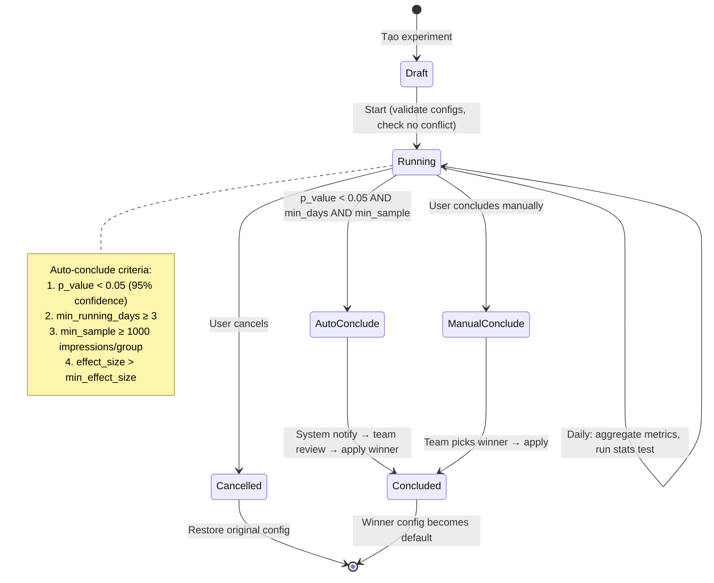

## 5.5 Statistical Methods

| Metric type | Test | Khi nào |
| --- | --- | --- |
| Revenue, ARPDAU, eCPM | Welch's t-test | So sánh means, default |
| Fill rate, CTR | Chi-squared test | So sánh proportions |
| Revenue (heavy tail) | Mann-Whitney U | Khi Shapiro-Wilk reject normality |

**Bayesian option (phase 2):** Cho phép "early stopping" khi posterior probability > 95%. Đặc biệt hữu ích cho `benchmark_validation` experiments nơi muốn quyết định nhanh.

## 5.6 Conflict Prevention

```
Rules:
1. Mỗi MG chỉ có tối đa 1 experiment running cùng lúc
2. Mỗi app chỉ có tối đa 3 experiments running cùng lúc
3. Experiment không chạy trên app đang trong Price Discovery mode
4. Tổng traffic_percent của tất cả experiments trên 1 app ≤ 80%
   (ít nhất 20% traffic luôn trên default config)
```

---

# 6. FG3 — User Segment Engine

## 6.1 Bài toán

Một waterfall không phù hợp cho tất cả users. HyperBid validate: segment user theo GEO/device/install date rồi apply config khác nhau tăng ARPDAU đáng kể.

Amobear có data để segment sâu hơn HyperBid vì có Adjust attribution, Firebase user properties, và AppMetrica — cho phép thêm dimension UA source và LTV tier.

## 6.2 Segment Dimensions

| Dimension | Source data | Ví dụ values | Use case |
| --- | --- | --- | --- |
| `geo` | IP → GeoIP | US, VN, IN, BR | Floor price khác nhau per GEO |
| `device_tier` | Device model mapping | high, mid, low | Low-end: bớt heavy ad format |
| `install_age_days` | Install date | 0, 1, 7, 30+ | New user: delay ads → retention |
| `ltv_tier` | Revenue history (FG5) | whale, dolphin, minnow, free | High-LTV: ít ads, bảo vệ retention |
| `os_version` | Device info | Android 14+, iOS 17+ | Compatibility |
| `app_version` | App info | 3.2.1+ | Test by version |
| `ua_source` | Adjust attribution | organic, facebook, google | Config khác cho paid vs organic |
| `network_type` | Device info | wifi, cellular | Video ads chỉ trên wifi |

## 6.3 Segment Data Model

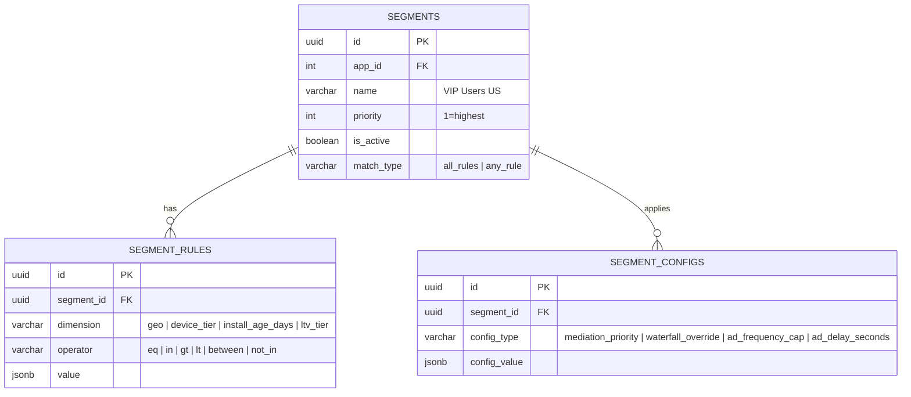

## 6.4 Segment Resolution

```
User ad request → Load segments (ORDER BY priority) → First match wins

Priority resolution khi có Experiment active:
1. User trong active experiment? → Experiment config (override)
2. User match segment? → Segment config
3. Else → Default app config
```

## 6.5 Pre-built Segment Templates

Để team không cần tạo từ scratch mỗi app:

| Template | Rules | Config | Rationale |
| --- | --- | --- | --- |
| "New User Protection" | install_age_days ≤ 1 | ad_delay: 60s, frequency_cap: 3/session | Tăng D1 retention |
| "VIP User (IAP)" | ltv_tier = whale | frequency_cap: 2/session, no_splash: true | Bảo vệ payers |
| "Low-end Device" | device_tier = low | no_rewarded_video: true, frequency_cap: 5/session | Giảm crash |
| "High-value GEO" | geo IN (US, CA, GB, AU) | waterfall_override: high_floor_template | Maximize eCPM |
| "Tier 3 Fill Priority" | geo IN (IN, BR, RU, MX) | waterfall_override: fill_priority_template | Maximize fill rate |

---

# 7. FG4 — Multi-Mediation Orchestration

## 7.1 Bài toán

Khi AdMob không fill (đặc biệt Tier 3 GEOs), impression bị mất. HyperBid validate: thêm backfill mediation layer tăng 7-27% ARPDAU.

## 7.2 Approach: Thin SDK + Server Config

**Quan trọng:** Nexus SDK KHÔNG wrap mediation SDKs. Nó chỉ:

1. Nhận config từ server (mediation priority, segment assignment, experiment group)
2. Quyết định thứ tự request ad
3. Track events (fill/no-fill, eCPM, revenue) gửi về server

Mediation SDKs (AdMob, MAX, TopOn) vẫn integrate riêng như bình thường.

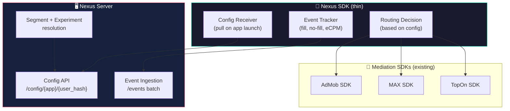

## 7.3 Routing Logic

```
Khi ad request:
1. SDK check config → primary_mediation = "max"
2. Request ad từ MAX
3. MAX respond:
   - Fill → serve ad, track event
   - No-fill → check backfill_mediations = ["topon", "admob_direct"]
4. Request ad từ TopOn (backfill #1)
5. TopOn respond:
   - Fill → serve ad, track event
   - No-fill → Request AdMob direct (backfill #2)
6. Nếu tất cả no-fill → track "unfilled" event
```

## 7.4 Config Schema

```sql
CREATE TABLE nexus_app_configs (
    app_id              VARCHAR(100) PRIMARY KEY,
    app_name            VARCHAR(200),
    platform            VARCHAR(10),              -- 'android' | 'ios'
    primary_mediation   VARCHAR(50),              -- 'max' | 'topon' | 'admob'
    backfill_mediations JSONB DEFAULT '[]',       -- ["topon", "admob"] priority order
    backfill_enabled    BOOLEAN DEFAULT false,
    backfill_timeout_ms INT DEFAULT 5000,
    ad_formats          JSONB,                    -- {"banner": true, "inter": true, ...}
    is_active           BOOLEAN DEFAULT true,
    updated_at          TIMESTAMPTZ DEFAULT now(),
    updated_by          INT REFERENCES users(id)
);
```

## 7.5 Unified Revenue Reporting

**Double-counting prevention** — nguyên tắc từ Doc 99:

| Data source | Dùng trong Gold aggregation? | Dùng cho | Ghi chú |
| --- | --- | --- | --- |
| AdMob Reporting API (direct) | ✅ YES | Official AdMob revenue | Primary source |
| AppLovin MAX API (direct) | ✅ YES | Official MAX revenue | Primary source |
| TopOn API (direct) | ✅ YES | Official TopOn revenue | Primary source |
| Adjust `ad_revenue` | ❌ NO | Cross-validation only | SDK-reported, duplicates |
| AppMetrica `ad_revenue` | ❌ NO | Cross-validation only | SDK-reported, duplicates |
| Nexus SDK eCPM callback | ❌ NO | Real-time estimation only | Estimate, not official |

---

# 8. FG5 — LTV Intelligence & UA Feedback Loop

## 8.1 Bài toán

UA team buy users nhưng không biết actual ad revenue per user → không thể optimize ROAS. HyperBid giải quyết bằng "API report to MMP". Nexus có thể làm tốt hơn vì own toàn bộ data.

## 8.2 LTV Pipeline

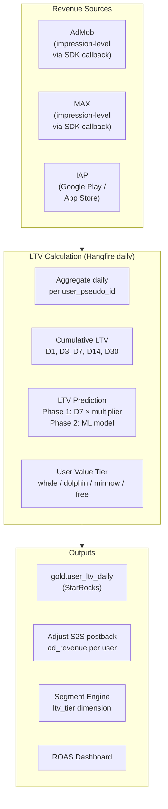

## 8.3 ROAS Dashboard

Trang mới trong Nexus cho UA team, hiển thị: campaign → LTV → ROAS. Data sources: Adjust (attribution), StarRocks (revenue), XMP (cost).

---

# 9. Về Kafka Event System — Đúng thời điểm

## 9.1 Kafka giải quyết bài gì?

Kafka **KHÔNG** giải quyết bài toán "5-7 ngày waterfall" — bài đó giải bằng process + benchmark (FG1). Kafka cũng KHÔNG thay thế AdMob Reporting API (vẫn T-1 delay).

**Kafka có giá trị thực khi đã có Experiment Engine + Segment Engine running:**

| Use case | Không Kafka (batch) | Có Kafka (stream) | Cần Kafka? |
| --- | --- | --- | --- |
| Benchmark quality scoring | Query StarRocks daily → đủ | Overkill | ❌ |
| Experiment daily metrics | Hangfire job 4AM → đủ | Near-realtime experiment dashbard | 🔶 Nice-to-have |
| Fill rate anomaly detection | Alert Engine 15min cycle → OK | Detect trong seconds | ✅ High value |
| User segment assignment | Server-side per request → OK | Pre-compute, sub-millisecond | ✅ High value |
| Nexus SDK event ingestion | REST batch endpoint → OK for pilot | Handle 50M+ users scale | ✅ Required at scale |
| Real-time eCPM estimation | SDK callback eCPM, batch aggregate | Live eCPM tracker | 🔶 Nice-to-have |

## 9.2 Kafka Timing

```mermaid
flowchart LR
    subgraph NOW["Bây giờ (Q2 2026)"]
        N1["FG1: Benchmark Engine<br/>Batch queries, Hangfire"]
        N2["FG2: Experiment Engine<br/>Daily aggregation"]
        N3["FG3: Segment Engine<br/>Server-side resolution"]
    end

    subgraph MID["Q3 2026"]
        M1["FG4: Multi-mediation<br/>SDK event → REST batch<br/>OK cho pilot 5-10 apps"]
        M2["FG5: LTV pipeline<br/>Daily batch OK"]
    end

    subgraph KAFKA["Q4 2026 — Kafka"]
        K1["SDK events → Kafka → StarRocks<br/>Scale 50M+ users"]
        K2["Real-time experiment metrics"]
        K3["Live fill rate anomaly detection"]
        K4["Stream LTV calculation"]
        K5["Real-time segment re-assignment"]
    end

    NOW -->|"Validate trước"| MID -->|"Scale đòi hỏi"| KAFKA

    style NOW fill:#2e7d32,color:#fff
    style MID fill:#e65100,color:#fff
    style KAFKA fill:#1565c0,color:#fff
```

**Nguyên tắc:** Build batch first, validate logic, rồi upgrade lên Kafka khi scale đòi hỏi. Không build Kafka trước khi có consumer thông minh (Experiment + Segment engines).

---

# 10. Database Schema Tổng hợp

## 10.1 PostgreSQL (Config + Metadata)

| Table | FG | Mô tả |
| --- | --- | --- |
| `waterfall_benchmarks` | FG1 | Benchmark results per GEO × format × category |
| `waterfall_benchmark_contributions` | FG1 | MGs đóng góp vào mỗi benchmark + quality score |
| `waterfall_quality_scores` | FG1 | Quality score per MG (6 dimensions + composite) |
| `waterfall_templates` | FG1 | Generated Day-0 templates |
| `experiments` | FG2 | Experiment definitions |
| `experiment_groups` | FG2 | Groups (control/variants) |
| `experiment_configs` | FG2 | Config per group |
| `experiment_results` | FG2 | Daily results per group |
| `segments` | FG3 | Segment definitions |
| `segment_rules` | FG3 | Rules per segment |
| `segment_configs` | FG3 | Config per segment |
| `segment_templates` | FG3 | Pre-built templates |
| `nexus_app_configs` | FG4 | Multi-mediation routing config |
| `nexus_mediation_accounts` | FG4 | Credentials per mediation platform |
| `user_ltv_configs` | FG5 | LTV calculation configs |
| `ua_postback_configs` | FG5 | MMP postback settings |

## 10.2 StarRocks (Analytics)

| Table | Layer | FG | Mô tả |
| --- | --- | --- | --- |
| `bronze.nexus_events` | Bronze | FG4 | Raw events từ Nexus SDK |
| `silver.experiment_daily_metrics` | Silver | FG2 | Aggregated experiment metrics per group per day |
| `silver.segment_performance` | Silver | FG3 | Performance per segment per day |
| `silver.benchmark_source_metrics` | Silver | FG1 | Pre-aggregated MG metrics cho quality scoring |
| `gold.waterfall_benchmarks` | Gold | FG1 | Materialized benchmark eCPM percentiles |
| `gold.user_ltv_daily` | Gold | FG5 | User-level cumulative LTV |
| `gold.campaign_roas` | Gold | FG5 | Campaign ROAS aggregations |

---

# 11. Roadmap 6 tháng

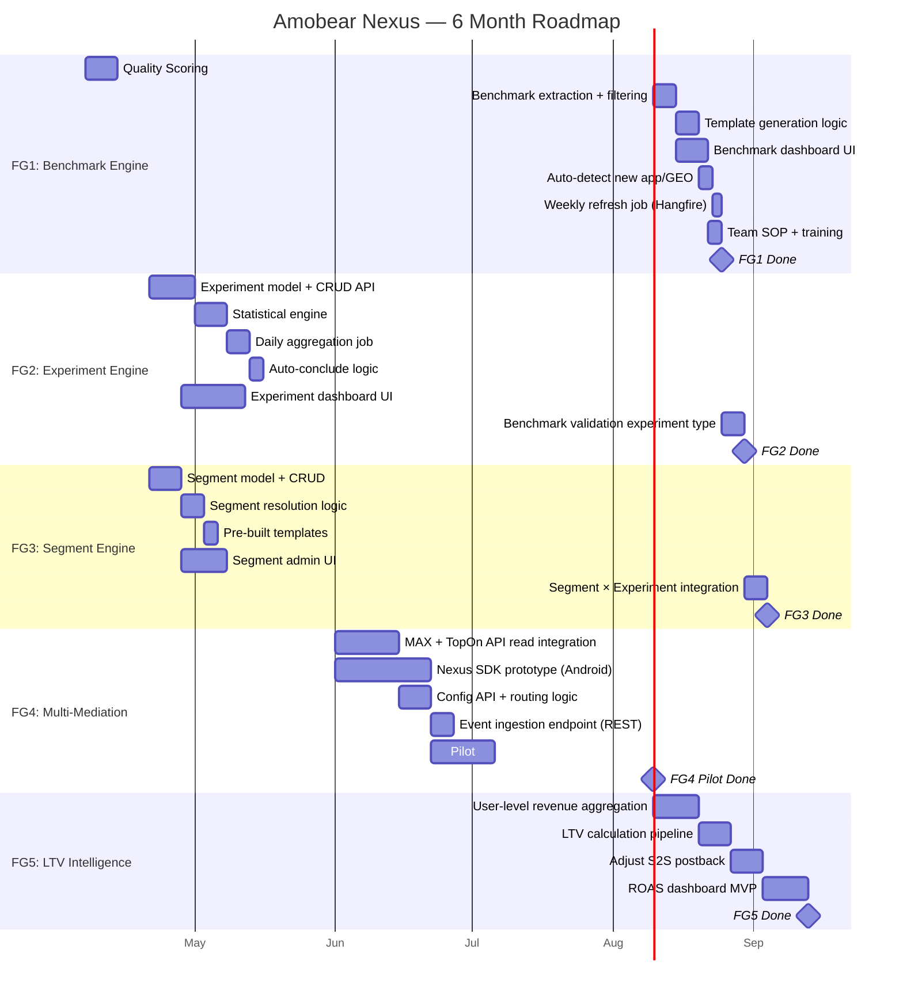

### Checklist 30-60-90 ngày

**30 ngày (Tháng 4):**

- [ ]  FG1: Benchmark Engine live — quality scoring, extraction, template generation
- [ ]  FG1: Team SOP mới — benchmark waterfall apply Hour 0 cho app/GEO mới
- [ ]  FG2: Experiment model + statistical engine MVP
- [ ]  FG3: Segment model + resolution logic
- [ ]  Validate: team thực sự dùng benchmark? Feedback?

**60 ngày (Tháng 5):**

- [ ]  FG2: Experiment Engine hoàn chỉnh + dashboard + auto-conclude
- [ ]  FG2: `benchmark_validation` type — test benchmark vs current waterfall
- [ ]  FG3: Segment Engine + pre-built templates
- [ ]  FG3 × FG2: Experiment target specific segment
- [ ]  Validate: ít nhất 5 experiments concluded, benchmark accuracy ±15%?

**90 ngày (Tháng 6):**

- [ ]  FG4: MAX + TopOn data integration
- [ ]  FG4: Nexus SDK prototype, pilot 5-10 apps
- [ ]  FG5: LTV pipeline design started
- [ ]  Kafka: Architecture design finalized cho Q4

---

# 12. KPI & OKR

## Q2 2026 (Tháng 4-6)

**Objective: Launch Nexus Benchmark + Experiment + Segment — giảm time-to-optimize cho app/GEO mới**

| Key Result | Target | Đo lường |
| --- | --- | --- |
| KR1: Time-to-first-waterfall cho app/GEO mới | 5-7d → **≤ 24h** | Measure từ first traffic → waterfall applied |
| KR2: Benchmark quality coverage | ≥ 80% GEO×format combos có benchmark ≥ Good | Count qualified benchmarks |
| KR3: Benchmark accuracy | Predicted eCPM ±15% vs actual sau 14 ngày | Compare benchmark P50 vs actual eCPM |
| KR4: Experiments velocity | ≥ 5 experiments concluded | Count concluded experiments |
| KR5: Team adoption | 100% mediation team dùng benchmark + experiment daily | Usage tracking |

## Q3 2026 (Tháng 7-9)

**Objective: Scale với multi-mediation, validate revenue impact**

| Key Result | Target | Đo lường |
| --- | --- | --- |
| KR1: Multi-mediation ARPDAU uplift | +10-15% trên pilot apps | AB test: single vs multi-mediation |
| KR2: Segment-based optimization lift | +5-10% ARPDAU vs no-segment | Experiment measurement |
| KR3: Benchmark continuously improving | Quality score portfolio tăng ≥ 5 points avg | Monthly tracking |
| KR4: Zero "garbage benchmark" incidents | 0 cases benchmark gây revenue drop | Incident tracking |

---

# 13. Rủi ro & Mitigation

| # | Rủi ro | Impact | Likelihood | Mitigation |
| --- | --- | --- | --- | --- |
| 1 | **Benchmark quality scoring sai** → bad template | 🔴 Critical | Medium | 6-dimension scoring + Quality ≥ 70 threshold + `benchmark_validation` experiment trước khi full rollout |
| 2 | **Benchmark data insufficient** cho GEO hiếm | 🟡 Medium | High | Fallback hierarchy: same category → all categories → "Low confidence" label. Team manual review required |
| 3 | **Statistical error** trong experiments | 🟡 High | Medium | Proper tests, minimum sample, min 3 days, peer review |
| 4 | **Ad network policy violation** multi-mediation | 🔴 Critical | Medium | Thin SDK, không wrap SDKs. Chỉ route traffic, không manipulate serving |
| 5 | **Double-counting revenue** multi-mediation | 🔴 Critical | High | Strict source labeling. Gold layer: chỉ direct API data |
| 6 | **Scope creep** | 🟡 High | High | FG1 first (2 tuần). Validate trước khi move to FG2/FG3 |
| 7 | **Team capacity** — SDK + backend + frontend | 🟡 Medium | High | FG1 không cần mobile dev. FG4 SDK outsource nếu cần |
| 8 | **Benchmark seasonality** — Q4 benchmark khác Q1 | 🟡 Medium | High | Seasonal flag, weekly refresh, significant change alert |
| 9 | **Kafka premature investment** | 🟡 Medium | Medium | Batch first (REST + Hangfire). Kafka chỉ khi scale 50M+ cần |

---

# 14. Tổng kết

Amobear Nexus mở rộng theo 5 hướng, thứ tự ưu tiên dựa trên impact/effort ratio:

| Priority | Feature Group | Effort | Impact | Rationale |
| --- | --- | --- | --- | --- |
| 🥇 **#1** | FG1: Benchmark Engine | 2-3 tuần | 🔴 Rất cao | Giải quyết ngay pain point 5-7 ngày. Chi phí thấp nhất (chỉ query data sẵn có). Quality scoring đảm bảo không garbage-in-garbage-out |
| 🥈 **#2** | FG2: Experiment Engine | 4-5 tuần | 🔴 Cao | Validate benchmark trước rollout. AB test mọi thay đổi waterfall. Foundation cho FG4 |
| 🥉 **#3** | FG3: Segment Engine | 3-4 tuần | 🟡 Cao | Personalize waterfall per user group. Song song FG2 |
| **#4** | FG4: Multi-Mediation | 6-8 tuần | 🔴 Rất cao | Backfill = +7-27% ARPDAU (validated by HyperBid). Cần SDK work |
| **#5** | FG5: LTV Intelligence | 4-5 tuần | 🟡 Cao | UA feedback loop. Cần FG4 data |

**Unique advantages so với HyperBid:**

- **Qualified Benchmark** — HyperBid không có. Đây là giải pháp thực cho cold-start problem
- **Quality Scoring** — đảm bảo benchmark đáng tin trước khi apply
- **Data ownership** — 100% on-premise, không trao data cho vendor
- **Deep integration** — Benchmark → Experiment validate → Waterfall Optimizer apply → AI Insight monitor, toàn bộ closed-loop