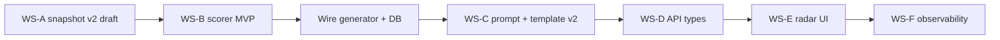

# Planning — Nâng cấp App Insight (bước 2, doc 121)

Tài liệu gốc: [121_-_App_Health_Intelligence_Framework.md](./121_-_App_Health_Intelligence_Framework.md). Nền tảng v1: [117 - AI INSIGHT AND ALERT BUILDER.md](./117%20-%20AI%20INSIGHT%20AND%20ALERT%20BUILDER.md).

**Trạng thái codebase (điểm neo):** pipeline v1 (`AppInsightSnapshotBuilder`, `AppInsightSingleAppGenerator`, `AppInsightMarkdownGenerator`), bảng `app_daily_insights` đã có `dimension_scores_json`, `health_tier` (nullable). UI prototype: `docs/ui-prototype/command-center-dashboard/...`.

**Mục tiêu bước 2:** từ “daily report một điểm số” → **8 dimension + tier + radar + output Markdown giàu cấu trúc**, chỉ **mở rộng** contract (doc 121 §8: backward compatible).

---

## 1. North star & phạm vi

| Mục | Mô tả |
|-----|--------|
| **Người dùng** | BOD xem radar + tier; Mediation/UA/Product xem dimension liên quan; vận hành vẫn dùng generation runs / daily feed. |
| **Kỹ thuật** | Mỗi insight (completed) có thể có `dimensionScores` (8 khóa cố định), `healthTier`; snapshot JSON có `schemaVersion`; API/FE v1 không vỡ khi thiếu v2 data. |
| **Ngoài phạm vi giai đoạn đầu** | Auto-action L3/L4, Telegram; role-based *second AI pass* (ưu tiên filter UI trước). |

**Tám khóa dimension (khớp doc 121 §2):** đặt tên ổn định trong code/API, ví dụ: `revenueMonetization`, `growthAcquisition`, `engagementRetention`, `productContent`, `adInfrastructure`, `unitEconomics`, `portfolioPosition`, `optimizationVelocity`.

---

## 2. Workstreams (song song có điều kiện)

### WS-A — Dữ liệu & snapshot (blocker cho scorer)

1. **Inventory Gold/StarRocks:** liệt kê fact/view đã có cho từng dimension (doc 121 §6.1: 12 query). Đánh dấu *ready / partial / missing*.
2. **Contract snapshot v2:** mở rộng output `AppInsightSnapshotBuilder` (hoặc collector mới + compose): thêm object `dimensions` hoặc top-level keys mới; `snapshot.schemaVersion = 2`; giữ nguyên `dailyOverview` hiện tại.
3. **Incremental delivery:** ship từng khối (ví dụ trước: revenue + ad infra + engagement proxy từ metrics hiện có); các dimension chưa có fact → `null` + `dataGaps[]`.

**DoD WS-A:** tài liệu `docs/app-insight-snapshot-schema-v2.md` (hoặc comment OpenAPI) + ít nhất 3 dimension có số liệu thật từ warehouse; phần còn lại explicit gap.

### WS-B — Scoring & tier

1. **`AppHealthDimensionScorer` (mới):** input = snapshot v2 + optional weights; output = `IReadOnlyDictionary<string, double?>` (8 keys) + `healthTier` + `compositeScore` (0–100).
2. **Weights:** MVP = constants trong code hoặc JSON trên `InsightTemplate`; sau có thể admin UI.
3. **Unit tests:** bảng golden (metric X → score band); case thiếu dữ liệu → `null` dimension, không throw.

**DoD WS-B:** generator gọi scorer sau `BuildAsync`; ghi `dimension_scores_json`, cập nhật `health_tier` (và có thể điều chỉnh `HealthScore` composite cho align narrative).

### WS-C — AI & template

1. **Prompt v2:** khi có đủ ≥1 dimension non-null, append hướng dẫn §7.1 (bảng breakdown + dòng radar data cho copy-paste/Mermaid nếu cần).
2. **Template:** thêm template seed “Health Intelligence v2” (`IsDefault = false`) hoặc flag trên template `OutputSchemaVersion`.
3. **Token/latency:** giới hạn section length; tùy chọn `maxSections` theo role (sau).

**DoD WS-C:** một lần regenerate cho app test cho ra Markdown có bảng 8 dòng (hoặc N dòng có data).

### WS-D — API & types

1. **`AppDailyInsightDto`:** expose `dimensionScores`, `healthTier` typed; `metadata.schemaVersion`.
2. **Daily feed:** mở rộng item list nếu UI cần severity từ dimension (optional).
3. **Frontend `types/api.ts` + `insightApi`:** parse nullable scores.

**DoD WS-D:** viewer và daily feed không crash khi `dimensionScores` null (v1 rows).

### WS-E — UI (prototype → production)

1. **App Detail — tab AI Insight:** `RadarChart` (Recharts), legend + tier badge; ẩn radar nếu không có đủ điểm tối thiểu (config: ví dụ ≥3 dimension).
2. **Tương tác:** click cạnh radar → scroll tới `##` section tương ứng (id/anchor trong Markdown renderer hoặc map section_key).
3. **Daily Insights:** card có thể hiển thị mini radar hoặc chỉ tier + top anomaly (defer nếu API chưa có).

**DoD WS-E:** một màn hình demo với data mock + một màn hình với API thật.

### WS-F — Vận hành & chất lượng

1. Logging: dimension coverage % per run; alert khi >X% app thiếu dimension chính.
2. So sánh v1 vs v2 trên staging (cost token, thời gian job).

---

## 3. Thứ tự thực hiện đề xuất (gantt logic)

- **Tuần 1–2:** WS-A (contract + 3 dimension data) + WS-B skeleton + tests.
- **Tuần 3–4:** WS-B hoàn chỉnh 8 keys (null-safe) + WS-C + WS-D.
- **Tuần 5–6:** WS-E + WS-F; bắt đầu WS “Role filter” (chỉ ẩn dimension trên UI theo permission).

---

## 4. Backlog có thể ticket hóa (ví dụ)

| ID | Epic | Task | Ưu tiên |
|----|------|------|---------|
| P2-01 | Snapshot | Định nghĩa JSON schema v2 + ví dụ fixture | P0 |
| P2-02 | Snapshot | Implement query batch 2–3 (revenue mix, geo, …) tùy data sẵn có | P0 |
| P2-03 | Scorer | `AppHealthDimensionScorer` + 10 unit tests | P0 |
| P2-04 | Pipeline | `AppInsightSingleAppGenerator` ghi `dimension_scores_json` | P0 |
| P2-05 | AI | Nhánh prompt v2 + template seed | P1 |
| P2-06 | API | DTO + controller mapping | P1 |
| P2-07 | FE | Radar + tier banner + fallback v1 | P1 |
| P2-08 | FE | Anchor scroll từ radar | P2 |
| P2-09 | RBAC | Ẩn dimension theo screen function / role | P2 |
| P2-10 | Ops | Metrics job: % coverage dimension | P3 |

---

## 5. Rủi ro & giảm thiểu

| Rủi ro | Giảm thiểu |
|--------|------------|
| Gold chậm/không đủ 12 query | Giao incremental; scorer chấp nhận sparse vector. |
| Chi phí AI tăng | Template v2 tách; giới hạn độ dài; optional “compact mode”. |
| Admin sửa template v1 | Template v2 riêng; không migrate ép. |
| Radar gây nhiễu khi data kém | Ngưỡng tối thiểu dimension; hiển thị “Insufficient data”. |

---

## 6. Liên kết mã & doc trong repo

| Thành phần | Vị trí |
|------------|--------|
| Snapshot v1 | `MediationPro.Infrastructure/Services/AppInsight/AppInsightSnapshotBuilder.cs` |
| Generate + lưu DB | `AppInsightSingleAppGenerator.cs` |
| Prompt AI | `AppInsightMarkdownGenerator.cs` |
| Entity | `AppDailyInsight` (`dimension_scores_json`, `health_tier`) |
| API | `AppInsightsController`, DTOs `MediationPro.Core/DTOs/AppInsight/` |
| Seed template v1 | `InsightTemplateDefaults.cs` |
| Planning tổng rollout | Kế hoạch App Insight v1 trong repo (không sửa file plan gốc nếu policy nội bộ yêu cầu) |

---

## 7. Checkpoint “bước 2 đã đủ ship internal”

- [ ] ≥1 môi trường non-prod: insight completed có `dimension_scores_json` non-null cho đa số app active.
- [ ] UI: radar + tier hiển thị; deep link từ daily feed vẫn hoạt động.
- [ ] Không regression: app chỉ có insight v1 cũ vẫn mở tab AI Insight bình thường.
- [ ] Runbook ngắn: cách bật/tắt template v2, cách đọc `dataGaps` trong metadata.

---

*Tài liệu này là planning sống: cập nhật khi inventory StarRocks/Gold thay đổi hoặc khi ưu tiên sản phẩm dịch chuyển (ví dụ ưu tiên 4 dimension thay vì 8).*
