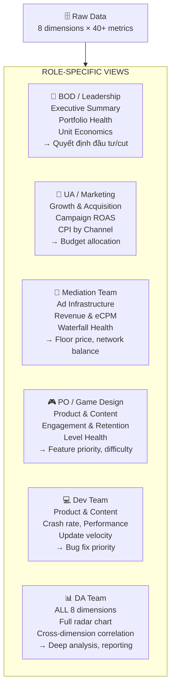
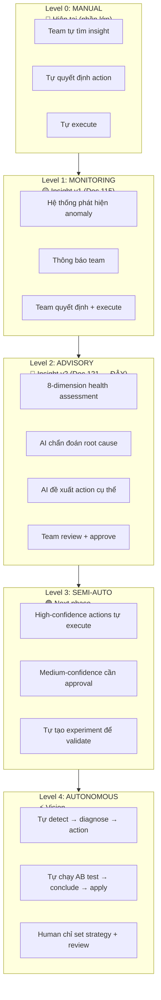
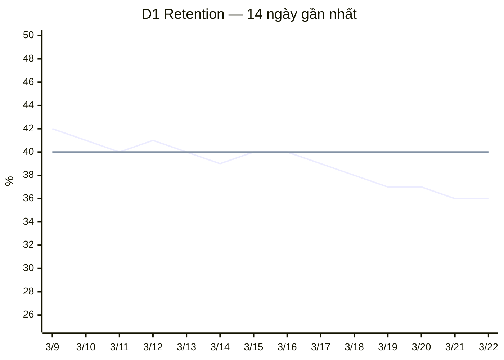
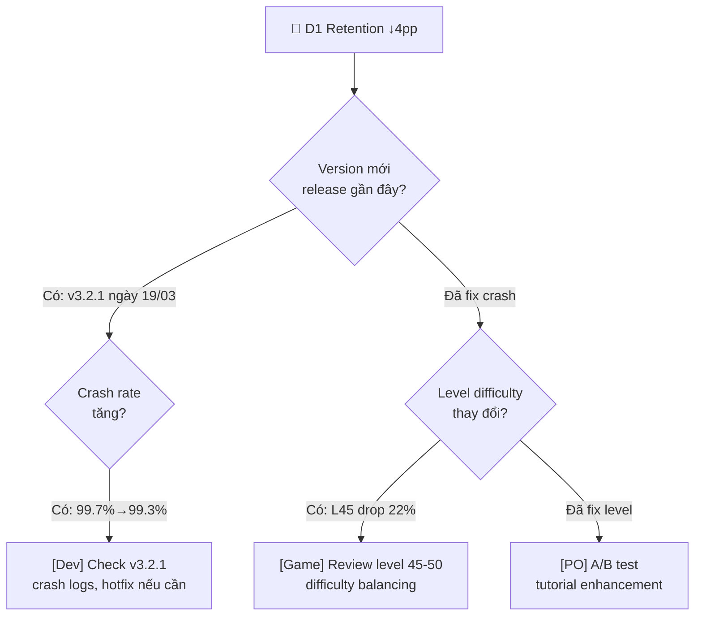
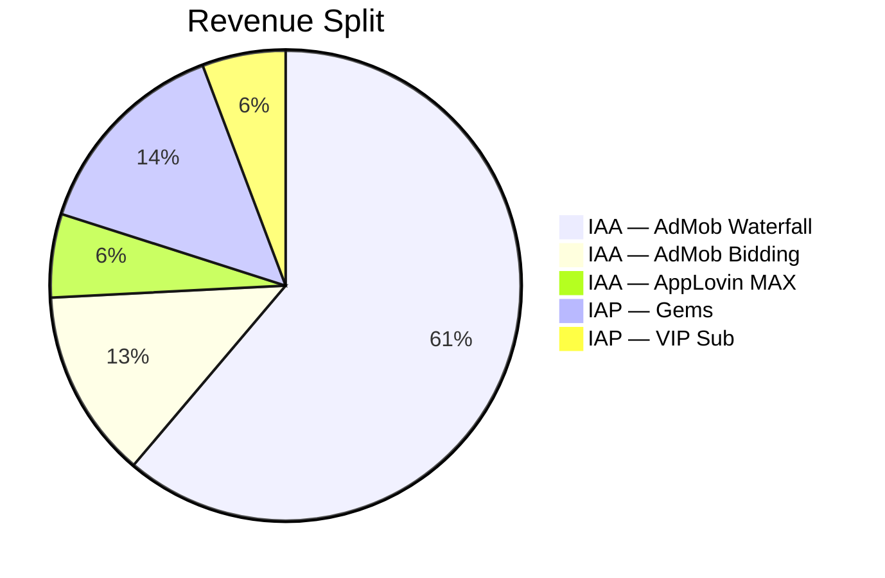
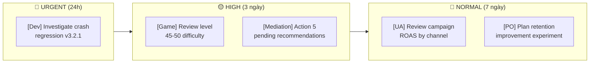

# 121 — App Health Intelligence Framework

> **Module:** Amobear Nexus — AI Insight Engine v2.0
> **Tầm nhìn:** Từ "daily report" → "autonomous app health intelligence"
> **Stack:** .NET Core 8 + StarRocks + AI (Claude/Gemini) + Hangfire
> **Reference:** 115 (AI Insight v1), 120 (Multi-Mediation), 99 (Platform), 114 (AI SQL Assistant)
> **Version:** 1.0 — 2026-03-26

---

## 1. Tầm nhìn: Đánh giá App như đánh giá Doanh nghiệp

### 1.1 Insight v1 vs v2 — Paradigm Shift

```mermaid
flowchart LR
    subgraph V1["v1: DAILY REPORT<br/>(Doc 115)"]
        V1A["7 queries cố định"]
        V1B["So sánh T-1 vs T-2, 7d"]
        V1C["1 health score tổng"]
        V1D["AI viết tóm tắt"]
        V1E["→ Báo cáo giám sát"]
    end

    subgraph V2["v2: HEALTH INTELLIGENCE<br/>(Doc 121 — BÀI NÀY)"]
        V2A["8 dimensions × 40+ metrics"]
        V2B["Radar chart đa chiều"]
        V2C["Mỗi role nhìn góc khác"]
        V2D["AI chẩn đoán + kê đơn"]
        V2E["Auto-action khi confident"]
        V2F["→ Bác sĩ cho app"]
    end

    V1 -->|"Nâng cấp"| V2

    style V1 fill:#fff3e0
    style V2 fill:#e8f5e9
```



### 1.2 Phép ẩn dụ: App = Doanh nghiệp

| Góc đánh giá doanh nghiệp | Dimension cho App | Data Sources | Team chịu trách nhiệm |
|---|---|---|---|
| **Tài chính** (Revenue, Profit, Cash flow) | 💰 Revenue & Monetization | AdMob + AppLovin + IAP | Mediation, BOD |
| **Sales & Marketing** (Pipeline, CAC, Growth) | 📈 Growth & Acquisition | Adjust + XMP + Meta | UA, Marketing |
| **Khách hàng** (NPS, Churn, Satisfaction) | 👥 Engagement & Retention | Firebase + AppMetrica | Product, Game |
| **Sản phẩm** (Quality, Innovation, R&D) | 🎮 Product & Content Health | Firebase events + Level data | Dev, PO, Game Design |
| **Vận hành** (Efficiency, Uptime, SLA) | 📡 Ad Infrastructure | Waterfall + SoW + Fill Rate | Mediation |
| **Tài chính nâng cao** (Unit economics, LTV) | 💵 Unit Economics | All sources combined | DA, BOD, UA |
| **Thị trường** (Market share, Competitive) | 🌍 Portfolio Position | Benchmark (doc 120) + Geo | Marketing, BOD |
| **Tổ chức** (Agility, Velocity) | ⚡ Optimization Velocity | Experiments + Recommendations | All teams |

---

## 2. Tám Dimensions — Chi tiết

### 2.1 Tổng quan Radar Chart


> Mermaid radar chart ở trên minh họa concept. Trong Nexus, dùng Recharts RadarChart (React component) để render interactive.

### 2.2 Dimension 1: 💰 Revenue & Monetization (Tài chính)

**Câu hỏi trả lời:** "App đang kiếm tiền tốt không? Xu hướng revenue ra sao?"

| Metric | Source | Cách tính | Weight |
|---|---|---|---|
| Total Revenue trend | AdMob + AppLovin | 7d linear regression slope | 25% |
| ARPDAU level vs peers | Gold layer | Percentile rank trong portfolio | 20% |
| Revenue mix health | AdMob + IAP | IAA/IAP ratio vs optimal (70/30 hoặc tuỳ category) | 15% |
| eCPM trend by format | AdMob + AppLovin | Weighted avg eCPM 7d trend | 20% |
| IAP conversion health | Firebase + AppMetrica | pay_rate, ARPPU vs 14d avg | 20% |

**Score 0-100:**
- Revenue tăng + ARPDAU top quartile + eCPM stable = 90+
- Revenue flat + ARPDAU median = 60-70
- Revenue giảm >15% = dưới 40

**AI Instruction cho dimension này:**
```
Phân tích revenue đa nguồn. So sánh AdMob waterfall revenue vs AppLovin MAX bidding.
Nếu IAA chiếm >85% total revenue → cảnh báo phụ thuộc quảng cáo quá mức.
Nếu IAP giảm → check pay_rate trước, nếu pay_rate OK mà ARPPU giảm → vấn đề pricing.
Tạo mermaid pie chart cho revenue split.
Tạo mermaid xychart cho revenue trend 14 ngày.
```

**Khuyến nghị tự động:**
- Revenue ↓20% + eCPM ↓ → `[Mediation]` Review waterfall, check fill rate
- Revenue ↓20% + eCPM OK + DAU ↓ → `[UA]` Check campaign health
- IAP revenue ↓ + pay_rate ↓ → `[Product]` Review IAP placement, pricing

---

### 2.3 Dimension 2: 📈 Growth & Acquisition (Sales & Marketing)

**Câu hỏi trả lời:** "App đang tăng trưởng không? UA hiệu quả không? Organic vs Paid?"

| Metric | Source | Cách tính | Weight |
|---|---|---|---|
| New Users trend | Adjust + Firebase | 7d installs trend (organic + paid) | 20% |
| Organic ratio | Adjust | organic_installs / total_installs | 20% |
| CPI efficiency | XMP + Meta + Adjust | CPI vs target, CPI trend | 20% |
| Campaign ROAS | XMP + Meta + Adjust + AdMob | D7 revenue / UA cost per campaign | 25% |
| Geo expansion health | Adjust | Revenue diversification by country (entropy) | 15% |

**Score 0-100:**
- Installs tăng + CPI giảm + ROAS > 1.5x = 85+
- Installs flat + CPI stable = 60-70
- Installs giảm + CPI tăng = dưới 40

**AI Instruction:**
```
Phân tích growth từ 3 góc: volume (installs), efficiency (CPI), returns (ROAS).
So sánh organic vs paid ratio — organic > 40% là healthy.
Break down CPI theo channel (Meta, Google, TikTok, Unity) từ XMP data.
Nếu có campaign ROAS < 1.0 → flag ngay, đề xuất pause hoặc reduce budget.
Tạo mermaid bar chart cho CPI by channel.
Tạo mermaid flowchart cho recommended UA budget reallocation nếu có vấn đề.
```

**Khuyến nghị tự động:**
- ROAS < 0.8 trên campaign cụ thể → `[UA]` Pause campaign, reallocate budget
- Organic ratio ↓ dưới 30% → `[Marketing]` Review ASO, content marketing
- CPI spike >30% → `[UA]` Check creative fatigue, audience saturation

---

### 2.4 Dimension 3: 👥 Engagement & Retention (Khách hàng)

**Câu hỏi trả lời:** "User có quay lại không? Có engage sâu không? Churn ở đâu?"

| Metric | Source | Cách tính | Weight |
|---|---|---|---|
| D1/D7/D30 retention | Firebase + AppMetrica | vs 14d avg, vs category benchmark | 30% |
| DAU trend | Firebase + AppMetrica | 7d/14d trend, weekday vs weekend | 20% |
| Session depth | Firebase + AppMetrica | avg session length, sessions/user/day | 20% |
| Stickiness (DAU/MAU) | Firebase | DAU/MAU ratio, trend | 15% |
| Churn prediction signal | Adjust cohort + Firebase | D1→D7 drop curve steepness | 15% |

**Score 0-100:**
- D1 > 40% + D7 > 20% + DAU/MAU > 20% = 85+
- D1 35-40% + D7 15-20% = 60-70
- D1 < 30% hoặc D7 < 10% = dưới 40

**AI Instruction:**
```
Retention là leading indicator quan trọng nhất — revenue follows retention.
So sánh D1/D7/D30 với category benchmark (puzzle D1 avg 38%, casual D1 avg 32%).
Phân tích retention by cohort date để phát hiện version impact.
Nếu D1 giảm mà new users tăng → UA đang mang về low-quality users.
Nếu D7 giảm mà D1 OK → vấn đề core loop, không phải onboarding.
Tạo mermaid xychart cho retention curve D1→D30.
Nếu phát hiện retention drop → tạo mermaid flowchart cho investigation path.
```

**Khuyến nghị tự động:**
- D1 ↓ + version mới release → `[Dev]` Check crash logs, performance regression
- D1 OK nhưng D7 ↓ → `[PO/Game]` Review core loop, progression difficulty
- Retention ↓ chỉ ở 1 GEO → `[Marketing]` Check localization, cultural fit

---

### 2.5 Dimension 4: 🎮 Product & Content Health (Sản phẩm)

**Câu hỏi trả lời:** "Nội dung game/app có vấn đề gì? User stuck ở đâu? Crash?"

| Metric | Source | Cách tính | Weight |
|---|---|---|---|
| Level/Content health | Firebase events | drop_rate, win_rate outliers, progression | 25% |
| Crash rate | Firebase Crashlytics + AppMetrica | crash_free_rate, ANR rate | 25% |
| Feature adoption | Firebase events | key_feature_usage / DAU | 20% |
| Session quality | AppMetrica | avg session, bounce rate, depth | 15% |
| Update velocity | App Store data | days since last update, update frequency | 15% |

**Score 0-100:**
- Crash-free > 99.5% + no level với drop > 20% + active updates = 85+
- Crash-free 99-99.5% + vài levels có vấn đề = 60-70
- Crash-free < 99% hoặc nhiều levels drop > 25% = dưới 40

**AI Instruction:**
```
Product health đánh giá "chất lượng bên trong" — khác với revenue (kết quả bên ngoài).
List top 5 levels/screens có drop_rate cao nhất, so sánh với 7d trước.
Crash rate by version — highlight nếu version mới gây regression.
Nếu là game: phân tích difficulty curve (win_rate nên giảm dần, không spike).
Nếu là utility app: phân tích feature funnel (onboarding → core feature → repeat).
Tạo mermaid flowchart cho user journey với drop-off points highlighted.
```

**Khuyến nghị tự động:**
- Crash rate spike sau update → `[Dev]` Hotfix priority, consider rollback
- Level drop_rate > 25% → `[Game Design]` Review difficulty, add hints
- Feature adoption < 10% cho key feature → `[PO]` Improve discoverability

---

### 2.6 Dimension 5: 📡 Ad Infrastructure Health (Vận hành)

**Câu hỏi trả lời:** "Waterfall đang hoạt động hiệu quả không? Fill rate? Network balance?"

| Metric | Source | Cách tính | Weight |
|---|---|---|---|
| Fill rate | AdMob + AppLovin | weighted avg across formats | 20% |
| SoW distribution (entropy) | AdMob | top instance SoW %, entropy score | 20% |
| Waterfall quality score | Doc 120 benchmark | 6-dimension quality score | 25% |
| Recommendation stability | Waterfall Optimizer | pending critical recommendations count | 15% |
| Network diversification | AdMob + AppLovin | HHI index across networks | 20% |

**Score 0-100:**
- Fill > 90% + balanced SoW + quality > 80 = 85+
- Fill 80-90% + acceptable SoW = 60-70
- Fill < 80% hoặc 1 instance > 70% SoW = dưới 40

**AI Instruction:**
```
Ad infra health = "động cơ" tạo ra revenue.
Phân tích fill rate by format, by country — tìm format/country fill thấp.
SoW analysis: nếu 1 ad source > 60% SoW → unhealthy dependency.
So sánh waterfall quality vs benchmark (doc 120).
Nếu có recommendation pending > 3 ngày → flag team chưa action.
Tạo mermaid pie chart cho SoW distribution.
Tạo mermaid flowchart cho waterfall diagnostic nếu có vấn đề.
```

---

### 2.7 Dimension 6: 💵 Unit Economics (Tài chính nâng cao)

**Câu hỏi trả lời:** "App có profitable không? LTV vs CAC? Payback period?"

| Metric | Source | Cách tính | Weight |
|---|---|---|---|
| ARPDAU vs benchmark | Gold layer + Benchmark | percentile rank | 20% |
| LTV D7/D30 trend | Adjust cohort + AdMob + AppLovin | cumulative revenue per user | 25% |
| LTV/CAC ratio | Adjust + XMP + Meta | LTV D30 / CPI | 25% |
| Payback period | All sources combined | days to recover UA cost | 15% |
| Revenue per session | AdMob + Firebase | revenue / sessions | 15% |

**Score 0-100:**
- LTV/CAC > 3.0 + payback < 7 days + ARPDAU top quartile = 85+
- LTV/CAC 1.5-3.0 + payback < 30 days = 60-70
- LTV/CAC < 1.0 = dưới 30 (BURNING MONEY)

**AI Instruction:**
```
Unit economics = "app có đáng để scale không?"
LTV/CAC > 3.0 = excellent (scale aggressively)
LTV/CAC 1.5-3.0 = good (optimize then scale)
LTV/CAC < 1.0 = WARNING — đang đốt tiền mỗi user acquired

Tạo mermaid xychart cho LTV curve D1→D30 vs CPI line.
Nếu LTV/CAC < 1.5 → tạo mermaid flowchart "Path to Profitability":
  option A: increase LTV (monetization tuning)
  option B: decrease CAC (creative optimization, channel shift)
  option C: pause UA, focus organic

So sánh unit economics by GEO — có thể profitable ở US nhưng burn ở SEA.
```

**Khuyến nghị tự động:**
- LTV/CAC < 1.0 → `[BOD]` ⚠️ Alert: app đang unprofitable per user
- Payback > 60 days → `[UA]` Reduce spend, optimize targeting
- ARPDAU ↓ nhưng CPI ↑ → `[All]` Double-squeeze — cần urgent review

---

### 2.8 Dimension 7: 🌍 Portfolio Position (Thị trường)

**Câu hỏi trả lời:** "App này đứng ở đâu trong portfolio? So với benchmark thế nào?"

| Metric | Source | Cách tính | Weight |
|---|---|---|---|
| Revenue rank in portfolio | Gold layer | percentile vs all apps | 25% |
| eCPM vs benchmark | Doc 120 FG1 | vs qualified benchmark P50 | 25% |
| Growth rate vs portfolio avg | Adjust + Firebase | installs growth percentile | 20% |
| Geo diversification | Adjust | revenue HHI across countries | 15% |
| Category leadership | All sources | rank within app category | 15% |

**AI Instruction:**
```
Portfolio position = "app này quan trọng thế nào với Amobear?"
Rank app theo revenue contribution — top 10 apps chiếm bao nhiêu % total portfolio revenue?
So sánh eCPM, ARPDAU, retention với benchmark từ doc 120 (FG1).
Flag nếu app phụ thuộc > 60% revenue từ 1 country.
Tạo mermaid quadrant chart: Revenue (x-axis) vs Growth (y-axis) — phân loại star/cash cow/question mark/dog.
```

---

### 2.9 Dimension 8: ⚡ Optimization Velocity (Tổ chức)

**Câu hỏi trả lời:** "Team đang optimize app này nhanh không? Experiment có chạy? Recommendation có được action?"

| Metric | Source | Cách tính | Weight |
|---|---|---|---|
| Recommendation action rate | Waterfall Optimizer | approved/total recommendations 30d | 30% |
| Experiment activity | Doc 120 FG2 | experiments concluded 30d | 25% |
| Alert response time | Alert Builder | avg time to acknowledge/resolve | 20% |
| Insight read rate | Insight Viewer | % users read daily insight | 15% |
| Time since last optimization | Waterfall Optimizer | days since last waterfall change | 10% |

**Score 0-100:**
- Action rate > 80% + experiments running + fast response = 85+
- Action rate 50-80% + occasional experiments = 60-70
- Action rate < 30% + no experiments + slow response = dưới 40

**AI Instruction:**
```
Optimization velocity = "team có đang quan tâm app này không?"
Nếu score thấp → có thể app bị "bỏ quên" — cần alert leadership.
Nếu có recommendations pending > 7 ngày → flag risk.
Nếu không có experiment nào trong 30 ngày → đề xuất experiment ideas.
Đây là dimension duy nhất đánh giá CON NGƯỜI chứ không phải APP.
```

---

## 3. Composite Health Score — Công thức

### 3.1 Weighted Score by App Category

Khác nhau app category có weight khác nhau:

| Dimension | Puzzle Game | AI Utility | Video App | Casual Game |
|---|---|---|---|---|
| 💰 Revenue & Monetization | 20% | 25% | 20% | 20% |
| 📈 Growth & Acquisition | 10% | 15% | 15% | 10% |
| 👥 Engagement & Retention | 20% | 15% | 20% | 20% |
| 🎮 Product & Content | 15% | 15% | 10% | 20% |
| 📡 Ad Infrastructure | 15% | 10% | 15% | 10% |
| 💵 Unit Economics | 10% | 10% | 10% | 10% |
| 🌍 Portfolio Position | 5% | 5% | 5% | 5% |
| ⚡ Optimization Velocity | 5% | 5% | 5% | 5% |

### 3.2 Classification

| Score | Grade | Biểu tượng | Ý nghĩa | Action |
|---|---|---|---|---|
| 90-100 | S-Tier | 🏆 | Star performer. Scale aggressively | Auto: increase UA budget 10% |
| 80-89 | A-Tier | 🟢 | Healthy. Monitor & optimize | Normal operations |
| 65-79 | B-Tier | 🔵 | Acceptable. Has improvement areas | Flag improvement areas |
| 50-64 | C-Tier | 🟡 | Warning. Multiple dimensions declining | Priority review meeting |
| 30-49 | D-Tier | 🟠 | Unhealthy. Needs intervention | Escalate to PO + BOD |
| 0-29 | F-Tier | 🔴 | Critical. Consider sunset | BOD decision: fix or kill |

---

## 4. Role-Specific Views — Mỗi vai trò nhìn góc khác

### 4.1 Nguyên tắc

Cùng 1 app, 1 bộ data, nhưng mỗi role nhìn insight khác nhau — giống như báo cáo tài chính có bản cho CEO, bản cho CFO, bản cho Sales VP.



### 4.2 View Matrix — Ai thấy gì

| Dimension | BOD | UA/MKT | Mediation | PO/Game | Dev | DA |
|---|---|---|---|---|---|---|
| 💰 Revenue | ★★★ Summary | ★★ ROAS impact | ★★★ Full detail | ★ Overview | ★ Overview | ★★★ Full |
| 📈 Growth | ★★ Trend | ★★★ Full detail | ★ Overview | ★★ Impact | ☆ | ★★★ Full |
| 👥 Engagement | ★★ Trend | ★★ Quality signal | ★ DAV ratio | ★★★ Full detail | ★★ Crashes | ★★★ Full |
| 🎮 Product | ★ Overview | ☆ | ☆ | ★★★ Full detail | ★★★ Crashes+Perf | ★★★ Full |
| 📡 Ad Infra | ★ Fill rate | ☆ | ★★★ Full detail | ☆ | ☆ | ★★★ Full |
| 💵 Unit Economics | ★★★ Full detail | ★★★ LTV/CAC | ★★ ARPDAU | ★★ LTV impact | ☆ | ★★★ Full |
| 🌍 Portfolio | ★★★ Full detail | ★★ Geo | ★★ Benchmark | ★ Rank | ☆ | ★★★ Full |
| ⚡ Velocity | ★★★ Team perf | ★ Campaign velocity | ★★ Action rate | ★★ Experiment | ★ Release cycle | ★★★ Full |

**★★★** = Full section with detailed analysis
**★★** = Summary with key metrics
**★** = One-liner overview
**☆** = Hidden (not relevant)

### 4.3 AI Output khác nhau cho mỗi role

**Cùng 1 sự kiện: "Revenue giảm 25%"**

**BOD nhận:**
> 💰 Puzzle Blast revenue giảm 25% ($5,230 → $3,922). LTV/CAC hiện 1.2x — gần break-even. Đề xuất: hold UA budget, đợi mediation team optimize waterfall (ETA 2 ngày). Nếu không cải thiện sau 5 ngày → consider reduce investment.

**Mediation team nhận:**
> 📡 Revenue giảm 25% — root cause: eCPM interstitial giảm 18% ($5.80 → $4.75) + fill rate giảm từ 92% → 84%. SoW analysis: Meta Audience Network fill kém, Pangle timeout tăng. Khuyến nghị: (1) Review waterfall floor cho Inter format (2) Check AdMob network config (3) Consider thêm bidder backup.

**UA team nhận:**
> 📈 Revenue/user giảm → ROAS impacted. Current D7 ROAS: 1.1x (was 1.5x). Campaigns still profitable nhưng margin thin. Khuyến nghị: (1) Reduce budget 20% cho campaigns CPI > $1.2 (2) Hold new campaigns cho đến khi revenue ổn định (3) Focus budget vào GEOs có ARPDAU stable (US, JP).

**PO/Game team nhận:**
> 👥 Revenue drop có thể liên quan product: D1 retention giảm 2pp (38% → 36%), session length giảm 8%. Check: version 3.2.1 release 3 ngày trước có thay đổi ad placement? Level 45-50 drop_rate tăng lên 22%.

---

## 5. Autonomy Levels — Con đường tới Automation

### 5.1 Mô hình 5 Levels (Inspiration: Tesla FSD)



### 5.2 Ví dụ cụ thể: eCPM giảm 15%

| Level | Hệ thống làm gì | Team làm gì |
|---|---|---|
| **L0** | Không gì | Team tự phát hiện khi mở dashboard |
| **L1** | Alert: "eCPM giảm 15%" | Team investigate, quyết định, action thủ công |
| **L2** | "eCPM giảm 15% do Meta Audience fill↓. Đề xuất: tăng floor $2.00→$2.50 cho instance #3, thêm Pangle backup" | Team review, approve/reject |
| **L3** | Tự tạo AB test: control (current) vs variant (đề xuất). Chạy 3 ngày. Nếu variant win → auto-apply | Team nhận notification: "đã optimize, kết quả +8%" |
| **L4** | Detect → diagnose → tự create experiment → conclude → apply → monitor → iterate. Team nhận weekly summary | Team set targets, review portfolio weekly |

### 5.3 Confidence Score cho Auto-Actions

Mỗi đề xuất action được gắn confidence score:

| Confidence | Criteria | Auto-action? |
|---|---|---|
| **95%+** | Đã validated bằng AB test trước đó, pattern lặp lại >3 lần | ✅ Auto-apply (L3+) |
| **80-94%** | Benchmark data strong (FG1 quality > 80), similar pattern 1-2 lần | ⚡ Auto-create AB test |
| **60-79%** | Reasonable analysis nhưng chưa có historical validation | 📋 Suggest, cần approval |
| **<60%** | Insufficient data hoặc conflicting signals | 💬 Flag cho DA deep dive |

---

## 6. Data Collection Upgrade — 12 Queries per App

### 6.1 So sánh v1 vs v2

| # | v1 (Doc 115) | v2 (Doc 121) | Source mới |
|---|---|---|---|
| 1 | Daily Overview | 💰 Revenue multi-source | + AppLovin revenue |
| 2 | Ad Performance | 📡 Ad Infra full (SoW, quality, benchmark) | + FG1 benchmark |
| 3 | IAP Performance | 💰 IAP + subscription analysis | Same |
| 4 | Retention | 👥 Retention + cohort + stickiness | + Adjust cohort |
| 5 | Level Health | 🎮 Product health (levels + crashes + features) | + AppMetrica crashes |
| 6 | Geo Breakdown | 🌍 Geo × dimension matrix | Same, richer |
| 7 | UA Metrics | 📈 Growth full (organic/paid, CPI, ROAS) | + XMP cost, Meta detail |
| **8** | *(mới)* | 💵 Unit Economics (LTV, CAC, payback) | Adjust cohort + XMP + AdMob |
| **9** | *(mới)* | 🌍 Portfolio position (rank, benchmark compare) | FG1 benchmark + Gold |
| **10** | *(mới)* | ⚡ Optimization velocity (actions, experiments) | PostgreSQL metadata |
| **11** | *(mới)* | 📈 Campaign-level ROAS | XMP + Meta + Adjust |
| **12** | *(mới)* | 👥 Cohort LTV curve | Adjust cohort + AppLovin cohort |

### 6.2 Performance estimate

12 queries × Gold layer (pre-aggregated) = ~3s per app
200 apps × 3s / 10 parallel = ~60s total
+ AI generation: ~5s per app × 200 / 10 parallel = ~100s
**Total: ~3 phút cho toàn bộ portfolio** (vs ~1.5 phút v1)

---

## 7. AI Output Format v2 — Enhanced Markdown

### 7.1 Structure cho mỗi App Daily Insight

```markdown
# 📊 Puzzle Blast — Health Intelligence — 2026-03-22

## 🏆 Health Score: 72/100 (B-Tier) ↓6 vs yesterday

[Radar chart data: revenue=85, growth=72, engagement=58, product=80, ad_infra=90, unit_econ=68, portfolio=75, velocity=45]

### Score Breakdown
| Dimension | Score | Trend | Status |
|---|---|---|---|
| 💰 Revenue & Monetization | 85/100 | ↑3 | 🟢 Strong |
| 📈 Growth & Acquisition | 72/100 | ↔ | 🔵 Good |
| 👥 Engagement & Retention | 58/100 | ↓8 | 🟡 Warning |
| 🎮 Product & Content | 80/100 | ↔ | 🟢 Healthy |
| 📡 Ad Infrastructure | 90/100 | ↑2 | 🟢 Excellent |
| 💵 Unit Economics | 68/100 | ↓5 | 🔵 Acceptable |
| 🌍 Portfolio Position | 75/100 | ↔ | 🔵 #4 in portfolio |
| ⚡ Optimization Velocity | 45/100 | ↓10 | 🟡 Slow |

> **Tóm tắt:** Revenue mạnh nhờ waterfall tối ưu, nhưng engagement đang báo động.
> D1 retention giảm liên tiếp 3 ngày — cần investigation product team.
> Optimization velocity thấp — 5 recommendations chưa action trong 10 ngày.

---

## 🔴 Top Priority: Engagement & Retention (58/100)

D1 Retention giảm từ 40% → 36% trong 3 ngày. Đây là **leading indicator** — 
nếu không fix, revenue sẽ follow trong 7-14 ngày.



**Root cause analysis:**
- Version 3.2.1 released ngày 19/03 — retention bắt đầu giảm cùng thời điểm
- Crash-free rate: 99.3% (giảm từ 99.7%) — có correlation
- Level 45 drop_rate tăng lên 22% (từ 14%) — difficulty spike



---

## 💰 Revenue & Monetization (85/100) — Strong

**Total Revenue: $5,230** (↑3.2% vs hôm qua, ↑8.1% vs 7d avg)



... (các sections tiếp theo cho từng dimension)

---

## ✅ Action Plan — Ưu tiên theo urgency



| # | Action | Team | Urgency | Confidence | Auto-action? |
|---|---|---|---|---|---|
| 1 | Check v3.2.1 crash logs, prepare hotfix | Dev | 🔴 24h | 85% | Create Jira ticket |
| 2 | Review level 45-50 difficulty, reduce by 10% | Game | 🟡 3 ngày | 70% | Suggest AB test |
| 3 | Apply 5 waterfall recommendations | Mediation | 🟡 3 ngày | 92% | ⚡ Auto-apply (L3) |
| 4 | Reduce budget for campaigns CPI > $1.5 | UA | 🔵 7 ngày | 65% | Flag for review |
| 5 | Plan engagement experiment (tutorial v2) | PO | 🔵 7 ngày | 55% | Suggest only |
```

---

## 8. Phân kỳ triển khai v1 → v2

### Phase 1 (Sprint 1-2): Foundation

- [ ] Refactor 7 queries → 12 queries (thêm unit economics, portfolio, velocity, campaign ROAS, cohort LTV)
- [ ] 8-dimension scoring engine với configurable weights per category
- [ ] Radar chart data model (8 scores per app per date)
- [ ] Enhanced AI prompt template với role-specific output blocks
- [ ] Composite health score với tiered classification (S/A/B/C/D/F)

### Phase 2 (Sprint 3-4): Role Views + Visualization

- [ ] Role-based view filtering (mỗi user role thấy dimensions relevant)
- [ ] Interactive radar chart component (Recharts RadarChart)
- [ ] Historical radar chart animation (play back 30 ngày, xem dimensions thay đổi)
- [ ] Dimension drill-down: click segment trên radar → scroll to detail section
- [ ] Cross-dimension correlation analysis (AI detect: "retention ↓ sẽ ảnh hưởng revenue trong 7 ngày")

### Phase 3 (Sprint 5-6): Automation

- [ ] Confidence scoring per recommendation
- [ ] Auto-create AB test cho recommendations confidence > 80%
- [ ] Auto-apply cho validated patterns confidence > 95%
- [ ] Autonomy level tracking per app (L0 → L4)
- [ ] Portfolio autonomy dashboard (bao nhiêu app ở mỗi level)

---

## 9. KPI cho Insight v2

| Metric | v1 Target | v2 Target | Improvement |
|---|---|---|---|
| Dimensions analyzed | 1 (overall) | 8 (radar) | 8x depth |
| Metrics per insight | ~20 | ~45 | 2.25x |
| Data sources used | 2-3 | 6 (all) | Full coverage |
| Role-specific views | 1 (generic) | 6 (per role) | Targeted |
| Avg action items per insight | 3-4 | 5-8 (prioritized) | Actionable |
| Auto-executable actions | 0 | 20-30% of actions | L3 automation |
| Time to first action | ~2 hours | ~15 min (pre-chewed) | 8x faster |

---

> **Tóm tắt Doc 121:**
> - Chuyển từ "daily report" sang "app health intelligence" — 8 dimensions như đánh giá doanh nghiệp
> - Radar chart đa chiều, mỗi role nhìn insight khác nhau
> - AI không chỉ báo cáo mà **chẩn đoán root cause** + **kê đơn action plan** + **gắn confidence score**
> - 5 Autonomy Levels (L0→L4) — con đường tới autonomous app optimization
> - Leverage toàn bộ 6 data sources: AdMob, AppLovin, Firebase, AppMetrica, Adjust, XMP/Meta
> - v2 tương thích ngược v1 — chỉ MỞ RỘNG, không break gì hiện có
