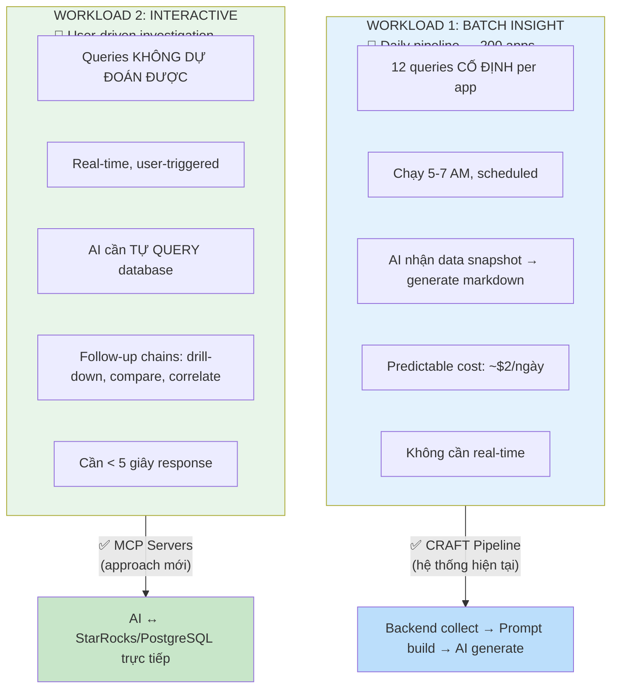
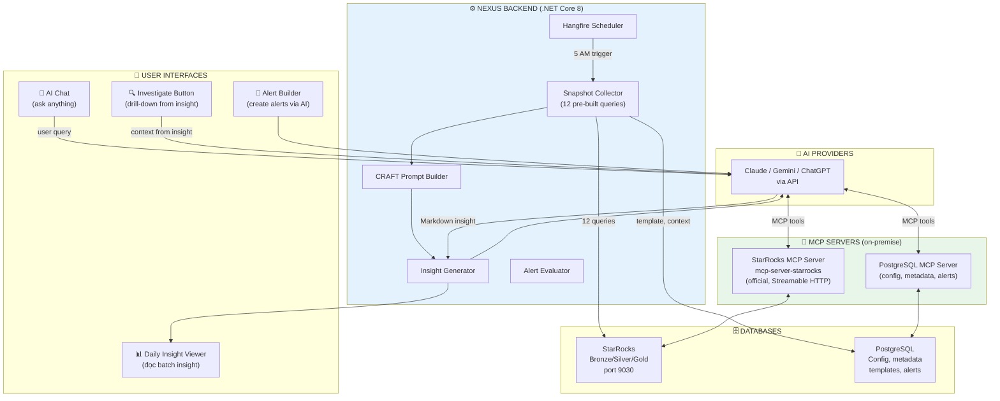
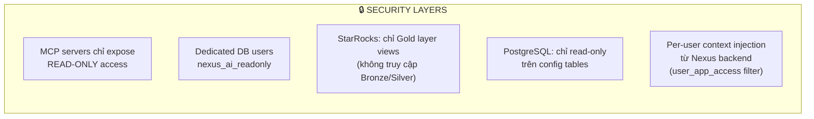
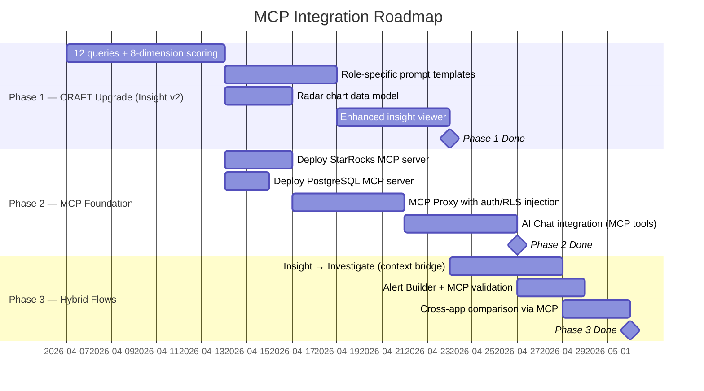

# 122 — AI Architecture Decision: CRAFT Pipeline + MCP Hybrid

> **Decision:** Hybrid Architecture — CRAFT cho batch, MCP cho interactive
> **Platform:** Amobear Nexus
> **Reference:** 114 (AI SQL Assistant), 115 (Insight & Alert), 121 (Health Intelligence)
> **Version:** 1.0 — 2026-03-26

---

## 1. Hai Workloads, Hai Kiến trúc



### Tại sao KHÔNG dùng MCP cho batch?

| Lý do | Chi tiết |
|---|---|
| **Queries đã biết trước** | 12 queries cố định per app — không cần AI tự viết SQL |
| **Cost control** | CRAFT: backend query trước, AI chỉ nhận kết quả → 1 AI call per app. MCP: AI có thể gọi 5-10 queries per app → 5-10x token cost |
| **Security đơn giản hơn** | Batch chạy bằng system account. MCP cần per-user access control phức tạp |
| **Reliability** | CRAFT pipeline đã proven. MCP thêm network hops, timeout risks cho 200 apps × 12 queries |
| **Template control** | CRAFT cho phép inject template instructions, app context, anomaly data vào prompt — MCP không có cơ chế này |

### Tại sao PHẢI dùng MCP cho interactive?

| Lý do | Chi tiết |
|---|---|
| **Unpredictable queries** | "Tại sao revenue giảm ở Brazil?" → AI cần tự explore, viết SQL, iterate |
| **Multi-step reasoning** | Query 1 → phát hiện eCPM drop → Query 2 → drill down by network → Query 3 → check fill rate |
| **Speed of development** | Không cần viết backend API cho mỗi loại query. MCP = AI tự query |
| **Schema awareness** | StarRocks MCP tự expose schema → AI biết tables, columns, types |
| **Killer feature** | User đọc insight → click "investigate" → AI đã có context + direct DB access → deep-dive ngay |

---

## 2. Kiến trúc Hybrid Chi tiết



---

## 3. MCP Setup cho Amobear Nexus

### 3.1 StarRocks MCP Server

```json
{
  "mcpServers": {
    "starrocks-nexus": {
      "transport": "streamable-http",
      "url": "http://172.19.8.x:8080/mcp",
      "env": {
        "STARROCKS_HOST": "172.19.8.x",
        "STARROCKS_PORT": "9030",
        "STARROCKS_USER": "nexus_ai_readonly",
        "STARROCKS_PASSWORD": "${STARROCKS_AI_PASSWORD}",
        "STARROCKS_DB": "amobear_nexus",
        "STARROCKS_OVERVIEW_LIMIT": "20000"
      }
    }
  }
}
```

**Tools available:**
- `read_query` — Execute SELECT queries
- `list_databases` / `list_tables` — Schema exploration
- `table_overview` / `db_overview` — Table summaries with sample data
- `query_and_plotly_chart` — Query + auto-generate chart

**Security:** Dedicated read-only user `nexus_ai_readonly` với access chỉ tới Gold layer views.

### 3.2 PostgreSQL MCP Server

```json
{
  "mcpServers": {
    "postgres-nexus": {
      "transport": "streamable-http",
      "url": "http://172.19.8.x:8081/mcp",
      "env": {
        "POSTGRES_HOST": "172.19.8.x",
        "POSTGRES_PORT": "5432",
        "POSTGRES_USER": "nexus_ai_readonly",
        "POSTGRES_PASSWORD": "${PG_AI_PASSWORD}",
        "POSTGRES_DB": "amobear_nexus"
      }
    }
  }
}
```

**Dùng cho:** Alert rules, insight templates, app configs, experiment metadata, waterfall configs.

### 3.3 Security Layer — Critical



**Vấn đề quan trọng:** MCP cho AI truy cập trực tiếp DB — nhưng Data Access Policy hiện tại (doc 112d) dùng application-layer WHERE injection. Giải pháp:

| Approach | Mô tả | Recommendation |
|---|---|---|
| **Option A: Proxy MCP** | Nexus backend wrap MCP server, inject WHERE clause per user | ✅ Recommended — giữ security model hiện tại |
| **Option B: DB-level RLS** | Tạo StarRocks views per role, MCP user connect qua role-specific views | ⚠️ StarRocks OSS không có native RLS |
| **Option C: Trust AI** | Inject user's allowed app_ids trong system prompt, trust AI sẽ filter | ❌ Không reliable — AI có thể query wrong data |

**Recommended: Option A — Proxy MCP.** Nexus backend nhận MCP request từ AI, inject `WHERE app_id IN (user_allowed_apps)` trước khi forward tới StarRocks. Backend đóng vai MCP proxy — AI nghĩ nó đang nói chuyện với DB, nhưng thực tế backend đang filter.

---

## 4. Bốn Luồng AI trong Nexus

### Luồng 1: Daily Insight (CRAFT — Không đổi)

```
5:00 AM → Hangfire trigger
→ Per app: 12 queries to StarRocks (backend, direct)
→ Anomaly detection (rule-based, backend)
→ Load template + app context (PostgreSQL)
→ Build CRAFT prompt (data + template + context)
→ AI generate markdown (1 API call per app)
→ Store insight → Notify users
```

**Không dùng MCP vì:** queries cố định, cần inject template, cost predictable.

### Luồng 2: Interactive Chat (MCP — MỚI)

```
User: "Tại sao revenue Puzzle Blast giảm 25%?"
→ AI (with StarRocks MCP + PostgreSQL MCP):
  → Tool: read_query("SELECT date, revenue, ecpm, dau FROM gold.fact_daily... WHERE app_id='puzzle_blast' ORDER BY date DESC LIMIT 14")
  → Tool: read_query("SELECT ad_format, ecpm, fill_rate FROM gold.fact_ad_performance... WHERE app_id='puzzle_blast' AND date >= '2026-03-15'")
  → Tool: read_query("SELECT country, revenue, dau FROM gold.fact_daily... WHERE app_id='puzzle_blast' GROUP BY country")
  → AI synthesize: "Revenue giảm chủ yếu do eCPM Interstitial drop 18% + fill rate giảm ở US market..."
```

**MCP vượt trội vì:** AI tự quyết định cần query gì, iterate cho đến khi đủ data.

### Luồng 3: Insight → Investigate (HYBRID — KEY INNOVATION)

```
User đọc Daily Insight → thấy "🔴 D1 Retention ↓4pp"
→ Click "🔍 Investigate"
→ Mở AI Chat sidebar, PRE-LOADED với:
  - Insight context (8 dimensions, scores, anomalies)
  - App context (scenarios, game design)
  - StarRocks MCP connection
  - PostgreSQL MCP connection
→ AI: "Tôi đã đọc insight hôm nay. D1 Retention giảm từ 40% → 36%.
  Tôi sẽ drill down để tìm root cause..."
  → Tool: read_query("SELECT version, COUNT(*), AVG(retention_d1) FROM ...")
  → Tool: read_query("SELECT level_id, drop_rate FROM ...")
  → AI: "Phát hiện: version 3.2.1 có D1 35.8% vs version 3.2.0 có D1 40.2%..."
```

**Hybrid vì:** batch insight cung cấp context (bạn đã biết vấn đề gì), MCP cho phép deep-dive (tìm root cause).

### Luồng 4: Alert Builder (MCP-assisted)

```
User: "Báo tôi khi eCPM puzzle blast < $5"
→ AI (CRAFT role prompt + MCP):
  → Tool: read_query("SELECT AVG(ecpm) FROM gold... WHERE app_id='puzzle_blast' AND date >= DATE_SUB(CURDATE(), INTERVAL 7 DAY)")
  → AI: "eCPM hiện tại $7.20, 7d avg $6.86. $5.00 threshold = giảm 27%. Tôi suggest severity Warning."
  → Generate alert rule JSON
  → User confirm → POST /api/alerts
```

**MCP hữu ích vì:** AI cần check real data để suggest threshold hợp lý.

---

## 5. Impact cho Doc 121 (Health Intelligence v2)

### Batch Insight — Nâng cấp CRAFT pipeline

| Component | v1 (Doc 115) | v2 (Doc 121) | Thay đổi |
|---|---|---|---|
| Queries per app | 7 | 12 | +5 queries mới |
| Scoring | 1 health score | 8 dimensions × radar | Scoring engine mới |
| Role views | 1 generic | 6 role-specific | Prompt template per role |
| Output | Markdown | Markdown + Mermaid + radar data | Enhanced template |
| **Architecture** | **CRAFT pipeline** | **CRAFT pipeline** | **KHÔNG ĐỔI** |

### Interactive — THÊM MCP layer

| Feature | Current | With MCP | Impact |
|---|---|---|---|
| AI Chat | AI generate SQL → user copy → run elsewhere | AI query StarRocks directly → show results | 10x faster |
| Investigation | Manual: user check multiple dashboards | AI drill-down automatically, multi-step | From 30 min → 3 min |
| Alert validation | AI guess threshold | AI query real data → data-backed suggestion | Much better defaults |
| Cross-app compare | Not possible in chat | AI query multiple apps, generate comparison | New capability |
| Trend analysis | Pre-built charts only | AI run arbitrary queries → dynamic charts | Unlimited flexibility |

---

## 6. Implementation Roadmap



### 30-60-90 Day Checklist

**30 ngày:**
- [ ] CRAFT pipeline upgrade: 12 queries, 8-dimension scoring, role templates
- [ ] Deploy StarRocks MCP server (official) trên IDC
- [ ] Deploy PostgreSQL MCP server
- [ ] MCP Proxy service với authentication + app_id filtering
- [ ] AI Chat: integrate MCP tools, test với DA team

**60 ngày:**
- [ ] Insight v2 live: radar chart, role views, enhanced output
- [ ] "Investigate" button: bridge insight context → MCP chat session
- [ ] Alert Builder: MCP-assisted threshold validation
- [ ] Đo lường: investigation time giảm bao nhiêu?

**90 ngày:**
- [ ] Cross-app comparison via MCP
- [ ] Auto-correlation detection (AI tự tìm liên quan giữa dimensions)
- [ ] L3 automation: high-confidence actions auto-create experiments
- [ ] Portfolio-level health intelligence (aggregate all apps)

---

## 7. Cost Comparison

| Flow | Current (CRAFT only) | Hybrid (CRAFT + MCP) | Notes |
|---|---|---|---|
| Daily Insight (batch) | ~$2/day (200 apps × $0.01) | ~$2/day — **không đổi** | CRAFT pipeline, same cost |
| AI Chat (interactive) | ~$0.50/session (1-2 queries) | ~$1.50/session (5-8 MCP queries) | 3x cost per session nhưng 10x value |
| Alert Builder | ~$0.05/alert creation | ~$0.10/alert (+ validation query) | Marginal increase |
| Investigation | ~$0.50/session | ~$2.00/session (deep MCP drill-down) | Highest value-add |
| **Monthly estimate** | ~$80/month | ~$150/month | +$70/month for massive capability uplift |

---

## 8. Risk & Mitigation

| Risk | Impact | Mitigation |
|---|---|---|
| MCP server downtime | Medium | Graceful degradation: AI Chat falls back to CRAFT (no live query, suggest SQL instead) |
| AI query too expensive data | Low | StarRocks MCP user chỉ access Gold views. Query timeout 10s |
| Security leak via MCP | High | MCP Proxy pattern: backend inject WHERE filter. No direct DB exposure |
| Token cost spike | Medium | Per-session MCP query limit (max 10 queries). Rate limit per user |
| AI writes bad SQL | Low | MCP read-only mode. StarRocks query governor (max rows, timeout) |

---

> **Tóm tắt Decision:**
>
> | Use Case | Engine | Lý do |
> |---|---|---|
> | Daily Insight (batch, 200 apps) | **CRAFT Pipeline** | Queries cố định, cost predictable, template control |
> | AI Chat (interactive investigation) | **MCP StarRocks + PostgreSQL** | Unpredictable queries, multi-step reasoning |
> | Alert Builder (create + validate) | **CRAFT + MCP assist** | CRAFT for structure, MCP for data validation |
> | Insight → Investigate | **CRAFT context + MCP execution** | Best of both: pre-built context + live query |
>
> **Không phải chọn 1 — dùng cả 2 cho đúng việc.**
