# 122 — Nexus AI Engine: Kiến trúc Tổng thể

> **Module:** Amobear Nexus — AI Engine Architecture Decision
> **Quyết định:** Hangfire + MCP Servers + Agentic Layer (không dùng OpenClaw)
> **Stack:** .NET Core 8 + Hangfire + MCP Servers + AI Providers + PostgreSQL + StarRocks
> **Reference:** 114 (AI SQL Assistant), 115 (Insight & Alert), 120 (Multi-Mediation), 121 (Health Intelligence)
> **Version:** 1.0 — 2026-03-26

---

# 1. Câu hỏi gốc: Hangfire vs OpenClaw?

## 1.1 Phân tích OpenClaw

OpenClaw là open-source AI agent framework viral nhất 2026 (250K+ GitHub stars). Nó biến LLM thành autonomous agent — tự thực thi tasks, nhớ context, kết nối messaging (Telegram, Slack, WhatsApp).

**Điểm mạnh lý thuyết cho Nexus:**
- Multi-channel messaging (Telegram, Lark) — trùng nhu cầu notification
- Persistent memory across sessions
- Skills system (modular extensions)
- Agent tự quyết định + hành động — phù hợp tầm nhìn L3/L4 autonomy

**Nhưng — khi đánh giá cho production system like Nexus:**

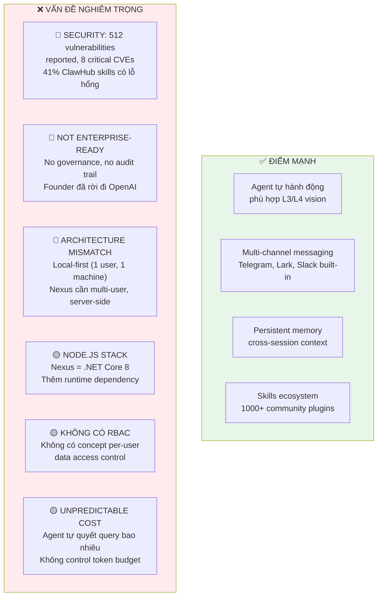

## 1.2 Verdict: KHÔNG dùng OpenClaw cho Nexus

| Tiêu chí | Yêu cầu Nexus | OpenClaw | Verdict |
|---|---|---|---|
| **Security** | On-premise, data sovereignty, audit trail | 512 vulnerabilities, prompt injection risk | ❌ Fail |
| **Multi-user** | 50+ users, role-based, per-user data access | Single-user, personal assistant | ❌ Fail |
| **Stack** | .NET Core 8 ecosystem | Node.js | ❌ Mismatch |
| **Reliability** | 5 AM batch, 200 apps, zero failure tolerance | "Too dangerous for non-technical users" (maintainer quote) | ❌ Fail |
| **Cost control** | Predictable $2-5/day | Agent decides how many queries to run | ❌ Uncontrolled |
| **Scheduling** | Cron, event-driven, pipeline triggers | Cron basic, designed for interactive | 🟡 Weak |
| **Data governance** | WHERE injection, app_access policy | No concept of data governance | ❌ Fail |

**Kết luận:** OpenClaw là proof-of-concept tuyệt vời cho personal AI agent, nhưng fundamentally không phù hợp production enterprise system. Rủi ro bảo mật + kiến trúc single-user + stack mismatch = đủ lý do để loại.

## 1.3 Thay vào đó: Build Agentic Capabilities IN Nexus

Ý tưởng đúng của OpenClaw (AI tự hành động, multi-step reasoning, persistent memory) hoàn toàn có thể build trong Nexus mà không cần OpenClaw framework:

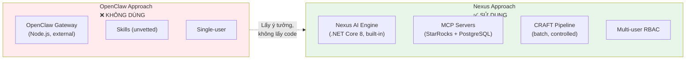

---

# 2. Kiến trúc Tổng thể: Nexus AI Engine

## 2.1 Ba tầng AI

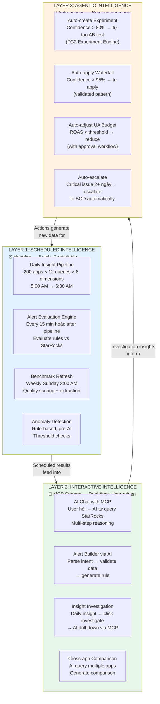

## 2.2 Vì sao 3 layers?

| Layer | Engine | Khi nào chạy | AI Model | Cost Model | Autonomy |
|---|---|---|---|---|---|
| **L1: Scheduled** | Hangfire | Cron/Event triggers | CRAFT → AI API | Fixed ~$2/day | L1-L2 |
| **L2: Interactive** | MCP Servers | User-triggered | AI + MCP tools | Pay-per-session ~$1-2/session | L2 |
| **L3: Agentic** | Hangfire + Rules Engine | Condition-triggered | CRAFT + MCP hybrid | Per-action ~$0.10 | L3-L4 |

---

# 3. Layer 1: Scheduled Intelligence (Hangfire)

## 3.1 Tại sao giữ Hangfire?

```mermaid
flowchart LR
    subgraph HF["HANGFIRE — ĐÃ PROVEN"]
        H1["✅ .NET native<br/>Không thêm runtime"]
        H2["✅ Dashboard UI<br/>Monitor jobs, retry, logs"]
        H3["✅ Cron + Event triggers<br/>After pipeline, weekly, custom"]
        H4["✅ Retry với backoff<br/>Failed jobs auto-retry"]
        H5["✅ Parallel execution<br/>10 apps concurrent"]
        H6["✅ Team đã quen<br/>Đang chạy production"]
    end

    subgraph Jobs["SCHEDULED JOBS"]
        J1["🕐 2:00 AM — Data Sync<br/>AdMob, Firebase, etc."]
        J2["🕐 4:00 AM — Transform<br/>Bronze → Silver → Gold"]
        J3["🕐 5:00 AM — Insight Gen<br/>12 queries × 200 apps"]
        J4["🕐 5:00 AM — Alert Eval<br/>Check all active rules"]
        J5["🕐 6:30 AM — Notify<br/>Push insights + alerts"]
        J6["🕐 Sunday 3 AM — Benchmark<br/>Quality score + extract"]
        J7["🕐 Every 15 min — Alert<br/>Re-evaluate triggered rules"]
    end

    HF --> Jobs
```

## 3.2 Daily Insight Pipeline (v2 — 8 dimensions)

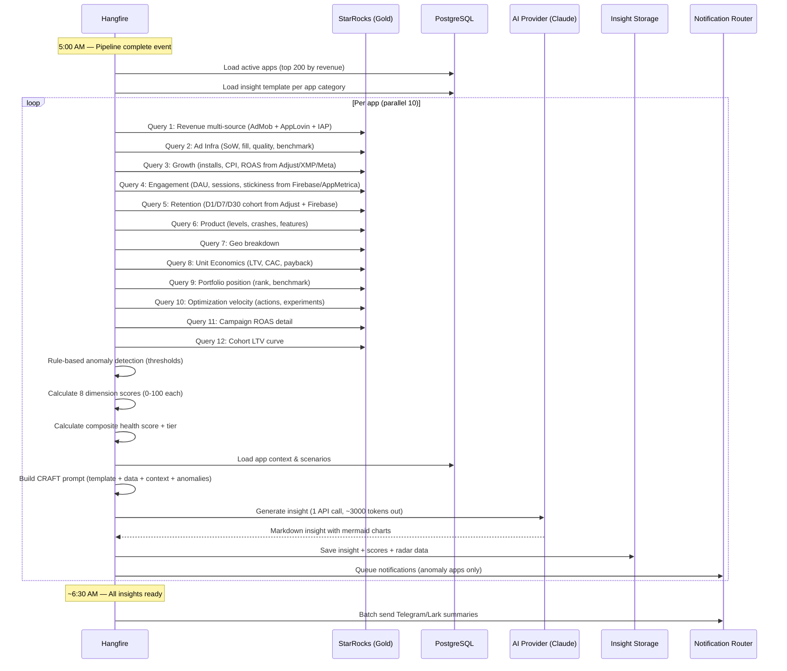

## 3.3 Alert Evaluation Pipeline

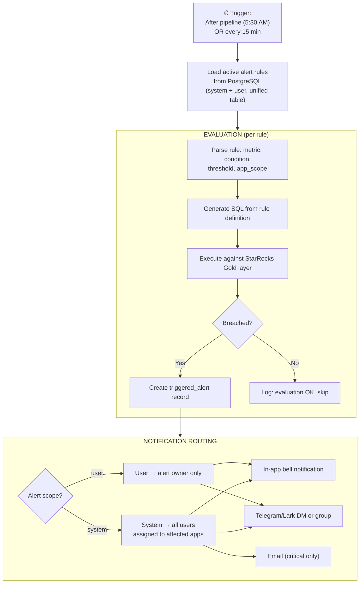

---

# 4. Layer 2: Interactive Intelligence (MCP Servers)

## 4.1 Kiến trúc MCP

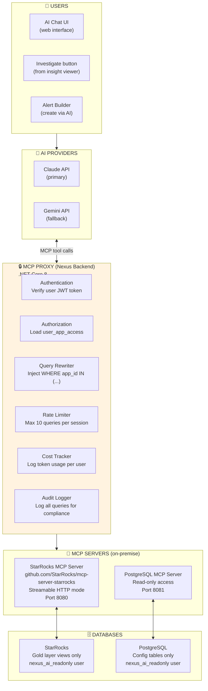

## 4.2 MCP Proxy — Tại sao cần?

Đây là component QUAN TRỌNG NHẤT trong kiến trúc MCP. Không bao giờ expose MCP server trực tiếp cho AI.

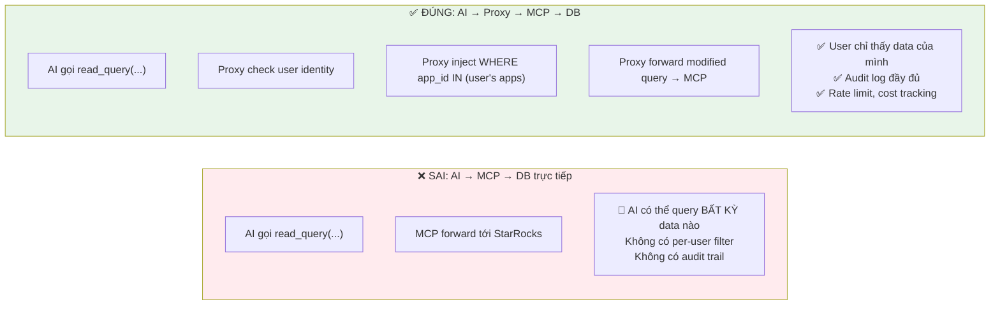

## 4.3 Ba luồng Interactive

### Luồng A: AI Chat — Free exploration

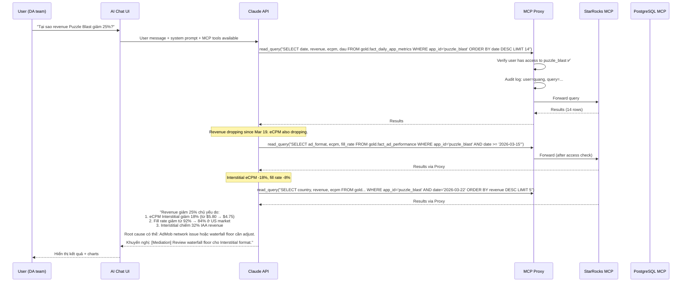

### Luồng B: Insight → Investigate (Hybrid)

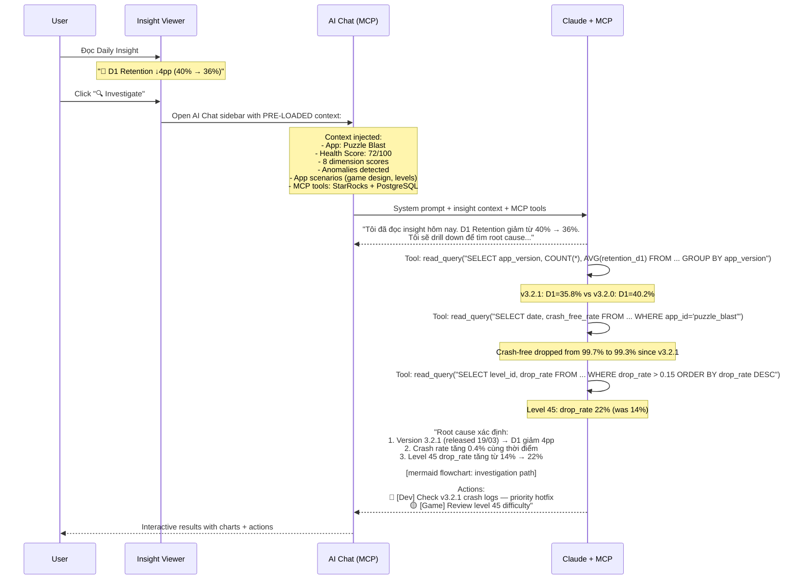

### Luồng C: Alert Builder + MCP validation

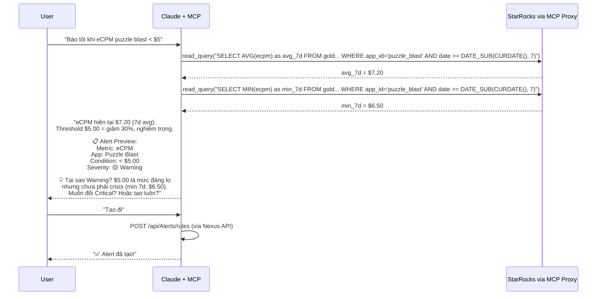

---

# 5. Layer 3: Agentic Intelligence (Semi-Autonomous)

## 5.1 Từ Advisory → Auto-Action

Layer 3 là nơi Nexus bắt đầu TỰ HÀNH ĐỘNG — nhưng có kiểm soát, không phải OpenClaw-style "agent wild".

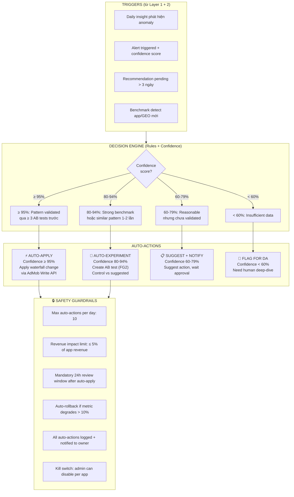

## 5.2 Ví dụ Auto-Actions

| Trigger | Confidence | Action | Safety |
|---|---|---|---|
| eCPM giảm 15%, pattern đã validate 5 lần | 96% | Auto-adjust waterfall floor -10% | Rollback nếu revenue giảm thêm |
| App mới launch, benchmark available | 88% | Auto-create AB test: benchmark vs blank | Test 7 ngày, auto-conclude |
| ROAS < 0.8 trên campaign cụ thể | 72% | Suggest: pause campaign | Notify UA team, wait approval |
| D1 retention drop, nhiều nguyên nhân có thể | 45% | Flag cho DA team deep-dive | Không auto-action |

## 5.3 Implementation: Hangfire + Rules Engine (không cần OpenClaw)

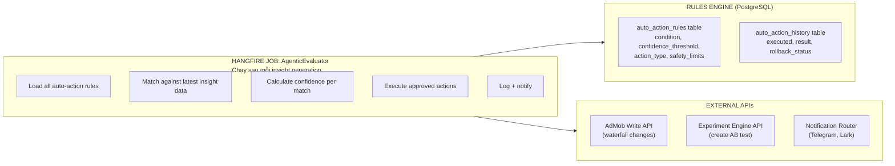

**Key insight:** Layer 3 KHÔNG CẦN OpenClaw vì:
- Auto-actions là RULE-BASED + CONFIDENCE SCORE, không phải "AI tự quyết"
- Hangfire job chạy evaluation loop, giống alert evaluation nhưng với action execution
- Safety guardrails là code logic, không phải AI judgment
- Tất cả đều trong .NET ecosystem đã có

---

# 6. Tổng hợp: Flow Toàn bộ 24 giờ

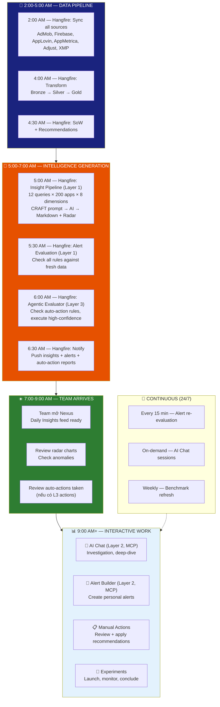

---

# 7. Component Matrix

| Component | Engine | Layer | Existing? | Effort |
|---|---|---|---|---|
| Data Sync Jobs | Hangfire | L1 | ✅ Có | 0 |
| Transform Pipeline | Hangfire | L1 | ✅ Có | 0 |
| SoW + Recommendations | Hangfire | L1 | ✅ Có | 0 |
| Insight Generator (v1) | Hangfire + CRAFT | L1 | 🔶 Doc 115 | 3 tuần |
| Insight Generator (v2 — 8 dimensions) | Hangfire + CRAFT | L1 | 🆕 Doc 121 | +2 tuần |
| Alert Evaluation Engine | Hangfire | L1 | 🔶 Doc 115 | 2 tuần |
| Benchmark Engine | Hangfire | L1 | 🆕 Doc 120 FG1 | 3 tuần |
| **StarRocks MCP Server** | **MCP (official)** | **L2** | **🆕 Deploy** | **3 ngày** |
| **PostgreSQL MCP Server** | **MCP (community)** | **L2** | **🆕 Deploy** | **2 ngày** |
| **MCP Proxy (auth + RLS)** | **.NET Core 8** | **L2** | **🆕 Build** | **1 tuần** |
| AI Chat + MCP integration | MCP + AI API | L2 | 🆕 | 2 tuần |
| Insight → Investigate bridge | Hybrid | L2 | 🆕 | 1 tuần |
| Alert Builder + MCP validation | MCP + CRAFT | L2 | 🔶 Doc 115 | +1 tuần |
| **Agentic Evaluator** | **Hangfire + Rules** | **L3** | **🆕 Build** | **2 tuần** |
| Auto-action Safety Guardrails | .NET Core 8 | L3 | 🆕 | 1 tuần |
| Experiment auto-create | Hangfire + FG2 API | L3 | 🆕 Cần FG2 | Sau FG2 |

---

# 8. Roadmap 6 tháng

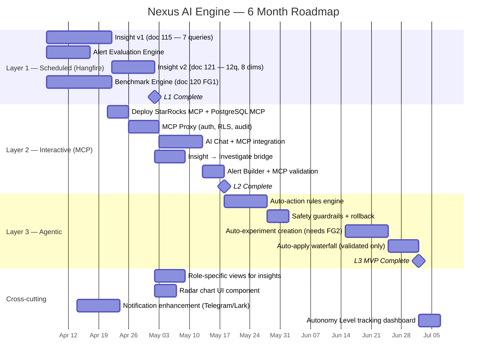

### 30-60-90 Day Checklist

**30 ngày (Tháng 4):**
- [ ] Layer 1: Insight v1 live (7 queries, CRAFT pipeline)
- [ ] Layer 1: Alert Evaluation Engine live (15-min cycle)
- [ ] Layer 1: Benchmark Engine FG1 (quality scoring, extraction)
- [ ] Layer 2: StarRocks MCP + PostgreSQL MCP deployed on IDC
- [ ] Layer 2: MCP Proxy service running with auth + RLS injection
- [ ] Validate: team nhận daily insight lúc 7 AM, format OK?

**60 ngày (Tháng 5):**
- [ ] Layer 1: Insight v2 live (12 queries, 8 dimensions, radar chart)
- [ ] Layer 2: AI Chat + MCP hoạt động — DA team dùng hàng ngày
- [ ] Layer 2: Insight → Investigate bridge hoạt động
- [ ] Layer 2: Alert Builder + MCP validation
- [ ] Role-specific views: mỗi role thấy insight khác nhau
- [ ] Đo lường: investigation time giảm bao nhiêu?

**90 ngày (Tháng 6):**
- [ ] Layer 3: Agentic evaluator MVP — auto-create experiments
- [ ] Layer 3: Safety guardrails proven (rollback tested)
- [ ] Layer 3: Auto-apply waterfall cho validated patterns
- [ ] Autonomy Level tracking: bao nhiêu app ở L1/L2/L3?
- [ ] Portfolio health intelligence: aggregate all apps

---

# 9. Cost Summary

| Component | Monthly Cost | Notes |
|---|---|---|
| Hangfire jobs (existing) | $0 | .NET native, no license |
| StarRocks MCP Server | $0 | Open-source, runs on existing IDC |
| PostgreSQL MCP Server | $0 | Open-source, runs on existing IDC |
| MCP Proxy | $0 | Custom .NET service, self-hosted |
| AI tokens — Batch insight | ~$60/month | 200 apps × $0.01 × 30 days |
| AI tokens — Interactive MCP | ~$90/month | ~3 sessions/day × $1.5 × 20 workdays |
| AI tokens — Alert Builder | ~$10/month | ~100 alerts/month × $0.10 |
| AI tokens — Agentic actions | ~$15/month | ~150 auto-evaluations × $0.10 |
| **Total AI infra cost** | **~$175/month** | **Cho entire AI engine** |

---

# 10. Risk & Mitigation

| # | Risk | Impact | Mitigation |
|---|---|---|---|
| 1 | MCP Proxy bypass | 🔴 Data leak | MCP servers KHÔNG expose external port. Chỉ Proxy có network access |
| 2 | AI query expensive Gold tables | 🟡 Performance | StarRocks query governor: max 10s timeout, max 10K rows return |
| 3 | Auto-action gây revenue drop | 🔴 Revenue loss | Safety guardrails: 5% revenue cap, 24h review, auto-rollback, kill switch |
| 4 | Token cost spike (MCP sessions) | 🟡 Budget | Per-user daily limit (20K tokens), per-session limit (10 queries) |
| 5 | StarRocks MCP server instability | 🟡 Service down | Graceful degradation: AI Chat falls back to "suggest SQL" mode |
| 6 | Audit compliance | 🟡 Governance | MCP Proxy logs every query: who, when, what, result row count |
| 7 | AI hallucinate wrong SQL | 🟡 Wrong data | Read-only MCP user. Proxy validates SQL syntax before forward |

---

# 11. Tổng kết: Tại sao kiến trúc này tốt hơn OpenClaw

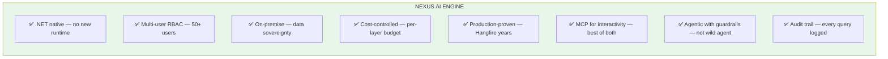

**Nguyên tắc thiết kế:**

| Nguyên tắc | Giải thích |
|---|---|
| **Batch ≠ Interactive** | Dùng đúng tool cho đúng việc. Hangfire cho batch, MCP cho interactive |
| **Proxy everything** | AI KHÔNG BAO GIỜ truy cập DB trực tiếp. Mọi thứ qua Proxy |
| **Confidence before action** | Auto-action CHỈ khi confidence ≥ threshold + safety limits |
| **Graceful degradation** | MCP down → AI Chat vẫn hoạt động (suggest SQL mode). Batch insight không bị ảnh hưởng |
| **Cost predictability** | Batch cost cố định. Interactive cost có cap. Agentic cost per-action |
| **Own the stack** | Không dependency vào framework bên ngoài. Mọi thứ trong .NET ecosystem |

---

> **Quyết định cuối cùng:**
>
> | Câu hỏi | Trả lời |
> |---|---|
> | Hangfire hay OpenClaw? | **Hangfire** — cho batch/scheduled. Không dùng OpenClaw |
> | Thêm gì mới? | **MCP Servers** — cho interactive AI. **Agentic Rules Engine** — cho auto-actions |
> | OpenClaw có vai trò gì? | **Inspiration only** — ý tưởng agent tốt, implementation không phù hợp enterprise |
> | Chi phí thêm? | **~$175/month** AI tokens. $0 infrastructure (self-hosted MCP) |
> | Timeline? | L1 (tháng 4) → L2 (tháng 5) → L3 (tháng 6) — 3 tháng cho full AI engine |
