# 123 — Nexus AI Engine v2: Agentic Upgrade Plan

> **Module:** Amobear Nexus — AI Engine nâng cấp theo 18 Agentic OS Patterns
> **Inspiration:** "Giải phẫu một Agentic Operating System" — Lâm Nguyễn (18 patterns từ 513K LOC Claude Code)
> **Stack:** .NET Core 8 + Hangfire + MCP Servers + Multi-Provider AI + StarRocks + PostgreSQL
> **Reference:** 114 (AI SQL Assistant), 115 (Insight), 120 (Multi-Mediation), 121 (Health Intelligence), 122 (CRAFT+MCP Hybrid)
> **Version:** 1.0 — 2026-04-01

---

## Mục lục

1. Tổng quan: Từ Tool đến Agentic OS
2. Mapping 18 Patterns → Nexus
3. Upgrade 1: Query Loop + Agentic Mode
4. Upgrade 2: Smart Model Router
5. Upgrade 3: Multi-Agent Report Builder
6. Upgrade 4: Context Defense cho Long Sessions
7. Upgrade 5: Permission & Safety Pipeline
8. Upgrade 6: Skill System cho Nexus
9. Upgrade 7: Background Intelligence
10. Tổng hợp Architecture v2
11. Roadmap triển khai
12. Cost & Risk

---

# 1. Tổng quan: Từ Tool đến Agentic OS

## 1.1 Nexus AI hiện tại đang ở đâu?

Theo thang 5 mức AI maturity (Chương 1, Lâm Nguyễn):

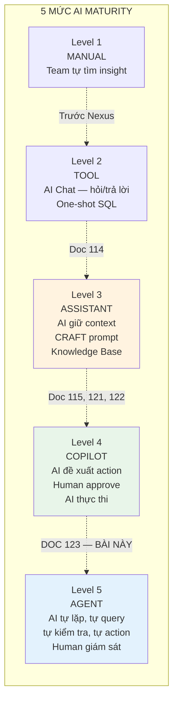

| Capability | Level hiện tại | Target Level | Gap |
|---|---|---|---|
| AI Chat (SQL Assistant) | L3 — Assistant (giữ context, CRAFT) | L4-L5 — Agent (tự query MCP, multi-step) | Query Loop + MCP |
| Daily Insight | L2 — Tool (one-shot generation) | L4 — Copilot (đề xuất action, human approve) | Agentic evaluation |
| Alert Builder | L3 — Assistant (parse intent, suggest) | L4 — Copilot (validate data, auto-create) | MCP validation |
| Auto-actions | L1 — Manual (chưa có) | L3-L4 — Semi-auto (confidence-based) | Agentic Rules Engine |
| Report Builder | L1 — Manual (chưa có) | L5 — Agent (multi-agent report) | Multi-agent orchestration |

## 1.2 Bảy Upgrades từ 18 Patterns

```mermaid
flowchart TB
    subgraph Patterns["18 AGENTIC OS PATTERNS<br/>(Lâm Nguyễn)"]
        P1["#1 Async generator query loop"]
        P2["#2 Stop-reason state machine"]
        P3["#3 Escalating recovery"]
        P4["#4 Concurrency-safe partitioning"]
        P5["#5 Streaming tool execution"]
        P6["#6 Context modifier chain"]
        P7["#7 Coordinator restriction"]
        P8["#8 Fork isolation"]
        P9["#9 5-layer context defense"]
        P10["#10 Permission classification"]
        P11["#11 Conditional skill activation"]
        P12["#12 Shell-in-prompt"]
        P13["#13 Dynamic skill discovery"]
        P14["#14 4-point plugin extension"]
        P15["#15 Security sandbox"]
        P16["#16 Reconciliation install"]
        P17["#17 Native replacement"]
        P18["#18 Terminal rendering"]
    end

    subgraph Upgrades["7 NEXUS UPGRADES"]
        U1["U1: Query Loop + Agentic Mode<br/>#1, #2, #3"]
        U2["U2: Smart Model Router<br/>#3 (escalating), #17"]
        U3["U3: Multi-Agent Report Builder<br/>#4, #5, #7, #8"]
        U4["U4: Context Defense<br/>#9"]
        U5["U5: Permission & Safety<br/>#10, #15"]
        U6["U6: Skill System<br/>#11, #12, #13"]
        U7["U7: Background Intelligence<br/>#6, #14 (tasks)"]
    end

    P1 & P2 & P3 --> U1
    P3 & P17 --> U2
    P4 & P5 & P7 & P8 --> U3
    P9 --> U4
    P10 & P15 --> U5
    P11 & P12 & P13 --> U6
    P6 & P14 --> U7
```

---

# 2. Mapping 18 Patterns → Nexus

## 2.1 Bảng ánh xạ chi tiết

| # | Pattern (Claude Code) | Áp dụng Nexus | Priority | Effort |
|---|---|---|---|---|
| **#1** | Async generator query loop | **Query Loop cho AI Chat** — while loop: query MCP → AI reason → query tiếp → cho đến khi AI kết luận xong | 🔴 P0 | 2 tuần |
| **#2** | Stop-reason state machine (needsFollowUp) | **needsFollowUp flag** cho query loop — AI trả tool_use block → continue, không có → dừng. Derived từ content, không trust API metadata | 🔴 P0 | Bundled với #1 |
| **#3** | Escalating recovery | **Multi-provider fallback**: Claude timeout → retry ×3 → switch Gemini → surface error. Rate limit → queue → retry | 🟡 P1 | 1 tuần |
| **#4** | Concurrency-safe partitioning | **Parallel MCP queries**: READ queries (SELECT) chạy song song, WRITE queries tuần tự. partitionMcpCalls() per invocation | 🟡 P1 | 1 tuần |
| **#5** | Streaming tool execution | **Stream MCP results**: Không đợi tất cả queries xong — stream results ngay khi có, UI hiển thị progressive | 🟡 P1 | 1 tuần |
| **#6** | Context modifier chain | **Context accumulation**: Mỗi MCP query result modify session context cho query tiếp. AI "nhớ" kết quả queries trước | 🔴 P0 | Bundled với #1 |
| **#7** | Coordinator restriction | **Report Coordinator**: Agent điều phối BỊ CẤM tự query data. Chỉ có: assign task, send message, synthesize output. Workers query data | 🟡 P1 | 2 tuần |
| **#8** | Fork isolation | **Parallel report sections**: Mỗi worker agent tạo 1 section riêng biệt. Không conflict vì output là markdown sections, không phải shared files | 🟡 P1 | Bundled với #7 |
| **#9** | 5-layer context defense | **Session context management**: truncate tool results → micro-compact → auto-summarize → reactive compact. Giữ long investigation sessions sống | 🟡 P1 | 2 tuần |
| **#10** | Permission classification | **MCP query classification**: classify query thành read-only/aggregate/mutation. Read-only → auto-approve. Mutation → block. Aggregate → check budget | 🔴 P0 | 1 tuần |
| **#11** | Conditional skill activation | **Context-aware prompts**: Khi user hỏi về revenue → activate "Ad Revenue" skill. Khi hỏi về retention → activate "Engagement" skill. Auto-detect từ topic | 🟡 P2 | 2 tuần |
| **#12** | Shell-in-prompt (dynamic context) | **Data-in-prompt**: Inject live metrics vào AI prompt trước khi AI respond. VD: "Current eCPM: $7.20, DAU: 125K" injected automatically | 🟡 P1 | 1 tuần |
| **#13** | Dynamic skill discovery | **Metrics Catalog as skills**: Mỗi metrics category = 1 skill. AI discover relevant skills based on user's question topic | 🟡 P2 | 1 tuần |
| **#14** | 4-point plugin extension | **Team-specific extensions**: Mỗi team (Mediation, UA, Product) có thể define custom AI commands, custom prompts, custom report templates | 🟡 P2 | 3 tuần |
| **#15** | Security sandbox | **MCP Proxy safety**: Mọi AI query đi qua proxy. Read-only enforcement. Per-user app access. Query timeout. Cost tracking | 🔴 P0 | Bundled MCP Proxy |
| **#16** | Reconciliation install | Không áp dụng trực tiếp — Nexus không có plugin marketplace | ⚪ Skip | — |
| **#17** | Native replacement | **Model cost optimization**: Replace heavy model bằng lighter model cho simple tasks. "Native replacement" ở AI level | 🔴 P0 | 2 tuần |
| **#18** | Terminal rendering | Không áp dụng — Nexus là web UI, không phải terminal | ⚪ Skip | — |

**Áp dụng: 16 trong 18 patterns.** 2 patterns skip vì domain mismatch (terminal rendering, plugin marketplace).

---

# 3. Upgrade 1: Query Loop + Agentic Mode

## 3.1 Hiện tại vs Upgrade

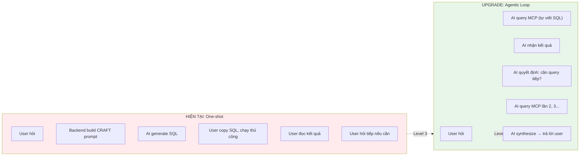

## 3.2 Nexus Query Loop Design (áp dụng Pattern #1, #2, #6)

```mermaid
flowchart TB
    subgraph Loop["NEXUS QUERY LOOP<br/>(Inspired by Claude Code query.ts)"]
        START["User message arrives"]
        
        subgraph P1["PHASE 1: Context Assembly"]
            P1A["Load user's allowed apps"]
            P1B["Load active CRAFT context"]
            P1C["Load relevant KB entries (RAG)"]
            P1D["Inject live metrics snapshot<br/>(Pattern #12: data-in-prompt)"]
            P1E["Check context budget<br/>→ auto-compact if needed"]
        end

        subgraph P2["PHASE 2: AI Call"]
            P2A["Send prompt to AI provider<br/>(Claude primary)"]
            P2B["Stream response"]
            P2C["Detect MCP tool calls<br/>in response"]
            P2D["Set needsFollowUp = true<br/>if tool calls found<br/>(Pattern #2)"]
        end

        subgraph P3["PHASE 3: Tool Execution"]
            P3A["Classify MCP calls<br/>(Pattern #10: permission)"]
            P3B["Partition: read-only parallel<br/>vs mutating serial<br/>(Pattern #4)"]
            P3C["Execute via MCP Proxy<br/>(Pattern #15: safety)"]
            P3D["Collect results<br/>Update context<br/>(Pattern #6: modifier chain)"]
        end

        subgraph P4["PHASE 4: Stop or Continue"]
            P4A{"needsFollowUp?"}
            P4B["Continue: append results<br/>to conversation,<br/>go to Phase 1"]
            P4C["Stop: return final<br/>response to user"]
            P4D["Recovery: if error<br/>→ retry ×3 → fallback<br/>(Pattern #3)"]
        end

        START --> P1 --> P2 --> P3 --> P4
        P4A -->|"true<br/>(more queries needed)"| P4B --> P1
        P4A -->|"false<br/>(AI done)"| P4C
        P4A -->|"error"| P4D
    end

    style P1 fill:#e3f2fd
    style P2 fill:#fff3e0
    style P3 fill:#e8f5e9
    style P4 fill:#fce4ec
```

## 3.3 State Machine ẩn (Pattern #2)

Nexus Query Loop có 6 transition types:

| Transition | Khi nào | Action |
|---|---|---|
| `next_turn` | AI trả tool_use blocks → needsFollowUp = true | Append results, continue loop |
| `completed` | AI trả text response, no tools → needsFollowUp = false | Return response to user |
| `provider_fallback` | Claude timeout/error → switch to Gemini | Clear state, retry with fallback |
| `context_compact` | Token count > 80% context window | Auto-summarize, continue |
| `budget_exceeded` | MCP query count > session limit (10) | Inject "budget exceeded" message, force stop |
| `user_abort` | User click cancel / navigate away | Graceful shutdown, save partial |

## 3.4 needsFollowUp — Quyết định quan trọng nhất

```
// Pseudocode — Nexus Query Loop Phase 2
foreach (var block in aiResponse.ContentBlocks)
{
    if (block.Type == "tool_use" && block.Name.StartsWith("mcp_"))
    {
        needsFollowUp = true;
        mcpToolCalls.Add(ParseMcpToolCall(block));
    }
}
// KHÔNG dùng aiResponse.StopReason — unreliable (Pattern #2)
// Derive từ actual content: có tool_use → cần follow up
```

---

# 4. Upgrade 2: Smart Model Router

## 4.1 Bài toán

Nexus hiện tại dùng 1 model per session (Claude hoặc Gemini hoặc ChatGPT, user chọn). Mọi câu hỏi — đơn giản hay phức tạp — đều dùng cùng model, cùng cost.

**Insight từ Pattern #3 (Escalating Recovery) + Pattern #17 (Native Replacement):**
Không phải mọi task cần model mạnh nhất. "SELECT revenue FROM gold... WHERE app_id='puzzle_blast'" không cần Claude Opus. Gemini Flash hoặc local model đủ tốt, cost 1/10.

## 4.2 Thiết kế: 3-Tier Model Router

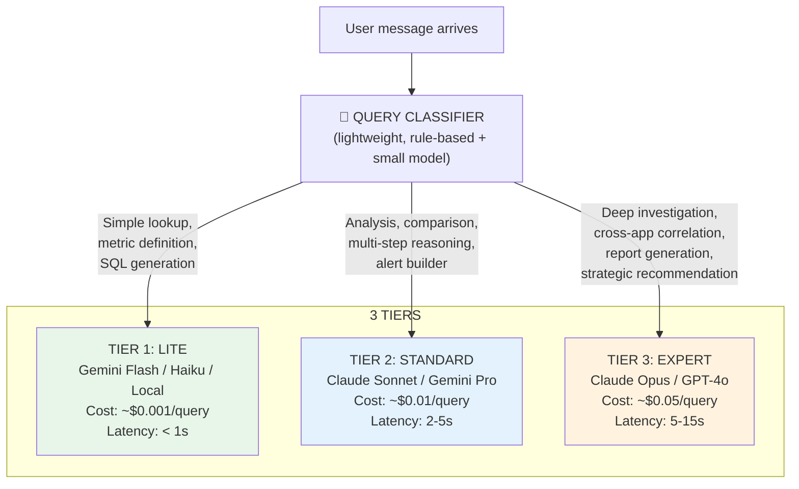

## 4.3 Classification Rules

| Signal | Tier 1 (Lite) | Tier 2 (Standard) | Tier 3 (Expert) |
|---|---|---|---|
| **Token count** | < 100 tokens input | 100-500 tokens | > 500 tokens |
| **Query type** | "eCPM là gì?", metric lookup | "Tại sao revenue giảm?", analysis | "So sánh 5 apps, tìm pattern" |
| **MCP calls expected** | 0-1 (simple lookup) | 2-5 (multi-step) | 5+ (deep investigation) |
| **Context needed** | Metrics Catalog only | KB + app context | Full 8-dimension + history |
| **Output type** | Short answer, SQL | Analysis paragraph + chart | Full report with mermaid |
| **Agentic loop** | No loop (one-shot) | 2-3 iterations | 5+ iterations |

## 4.4 Escalating within session

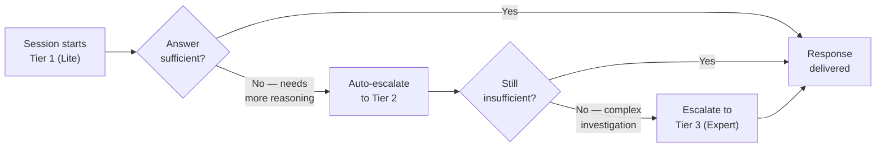

**Auto-escalation signals:**
- Tier 1 trả "I need more context" hoặc SQL thiếu chính xác → escalate Tier 2
- Tier 2 cần > 5 MCP queries hoặc cross-dimension analysis → escalate Tier 3
- User explicitly requests: "phân tích sâu hơn" → escalate

## 4.5 Cost Impact

| Scenario | Current (all Claude Sonnet) | With Router | Savings |
|---|---|---|---|
| 100 simple lookups/day | $1.00 | $0.10 (Tier 1) | 90% |
| 20 analysis sessions/day | $0.20 | $0.20 (Tier 2) | 0% |
| 5 deep investigations/day | $0.25 | $0.25 (Tier 3) | 0% |
| **Daily total** | **$1.45** | **$0.55** | **62% savings** |

---

# 5. Upgrade 3: Multi-Agent Report Builder

## 5.1 Bài toán

User yêu cầu: "Tạo báo cáo tổng hợp Puzzle Blast tuần này — bao gồm revenue, UA performance, retention, và waterfall health."

Hiện tại: AI Chat generate 1 response dài → thiếu depth vì 1 model call không đủ context cho tất cả dimensions.

**Áp dụng Pattern #7 (Coordinator Restriction) + #8 (Fork Isolation) + #4 (Concurrency Partitioning):**

## 5.2 Kiến trúc Multi-Agent Report

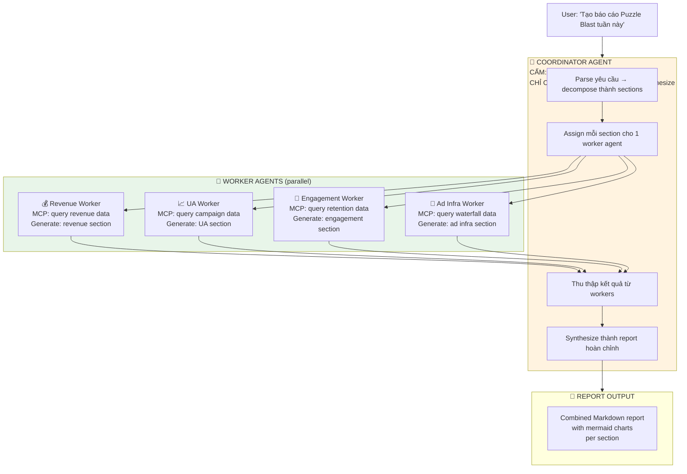

## 5.3 Coordinator Restriction (Pattern #7) — Chi tiết

```
COORDINATOR TOOLS (restricted):
✅ AssignTask(worker_type, task_description)
✅ SendMessage(worker_id, message)  
✅ SynthesizeReport(sections[])
✅ NotifyUser(status_update)

❌ KHÔNG CÓ: MCP read_query (cấm query data)
❌ KHÔNG CÓ: GenerateSection (cấm tự viết)
❌ KHÔNG CÓ: CreateChart (cấm tự tạo chart)

Tại sao? Nếu coordinator có thể query data, nó sẽ tự làm tất cả 
→ sequential, không parallel. Constraint BUỘC delegation.
```

## 5.4 Worker Agent Specification

| Worker | CRAFT Context | MCP Access | Output |
|---|---|---|---|
| Revenue Worker | "Ad Revenue" context + Metrics Catalog (revenue) | StarRocks Gold: revenue, eCPM, ARPDAU | Markdown section + pie chart + trend chart |
| UA Worker | "Growth" context + campaign knowledge | StarRocks Gold: installs, CPI, ROAS + PostgreSQL: campaign configs | Markdown section + ROAS table + channel comparison |
| Engagement Worker | "Engagement" context + retention benchmarks | StarRocks Gold: DAU, retention, sessions | Markdown section + retention curve + cohort chart |
| Ad Infra Worker | "Waterfall" context + SoW knowledge | StarRocks Gold: fill rate, SoW, quality scores | Markdown section + SoW pie + waterfall health radar |

## 5.5 Concurrency (Pattern #4)

```
4 workers chạy SONG SONG — mỗi worker query StarRocks independently.
Không conflict vì:
1. Tất cả MCP queries là READ-ONLY (SELECT) → concurrent-safe
2. Mỗi worker produce RIÊNG 1 markdown section → không overlap
3. Context modifier chain (Pattern #6): mỗi worker result 
   accumulate vào coordinator's context cho synthesis step

Pattern #8 (Fork Isolation) đơn giản hóa:
- Claude Code dùng Git worktree vì agents sửa files
- Nexus workers produce markdown strings, không sửa shared state
- → Isolation tự nhiên, không cần worktree mechanism
```

## 5.6 Planning Mode (User's Request)

Trước khi chạy multi-agent, coordinator có **Planning Mode** (inspired by Claude Code Plan Mode):

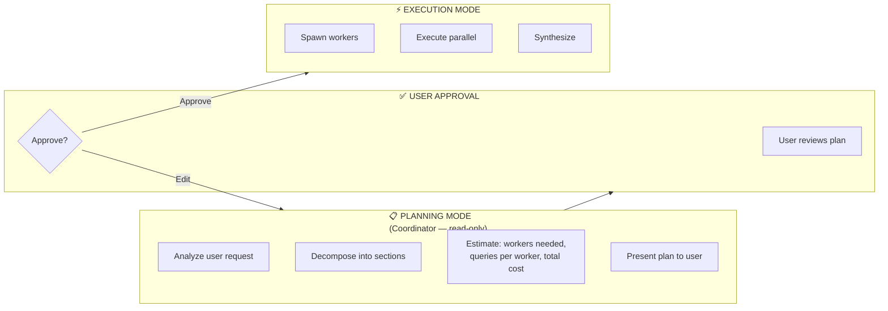

**Plan output example:**
```
📋 Kế hoạch báo cáo Puzzle Blast (tuần 12-18/03/2026):

Sections:
1. 💰 Revenue & Monetization — Worker 1 (~3 MCP queries)
2. 📈 UA & Campaign Performance — Worker 2 (~4 MCP queries)  
3. 👥 Engagement & Retention — Worker 3 (~3 MCP queries)
4. 📡 Waterfall & Ad Infrastructure — Worker 4 (~3 MCP queries)
5. 📊 Executive Summary — Coordinator synthesize

Estimated: 13 MCP queries, ~$0.15 cost, ~45 seconds
Model: Workers use Tier 2 (Sonnet), Synthesis use Tier 3 (Opus)

[Approve] [Edit Sections] [Cancel]
```

---

# 6. Upgrade 4: Context Defense cho Long Sessions

## 6.1 Áp dụng Pattern #9: 4-Layer Defense cho Nexus

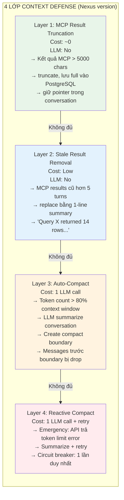

## 6.2 Session Memory (qua sessions)

Áp dụng Claude Code memory system:
- Cuối mỗi AI Chat session → extract key findings vào `ai_session_memories` table
- Đầu session mới → load relevant memories (RAG search)
- "Quên conversation, nhớ lessons"

---

# 7. Upgrade 5: Permission & Safety Pipeline

## 7.1 Áp dụng Pattern #10: Classification-based cho MCP

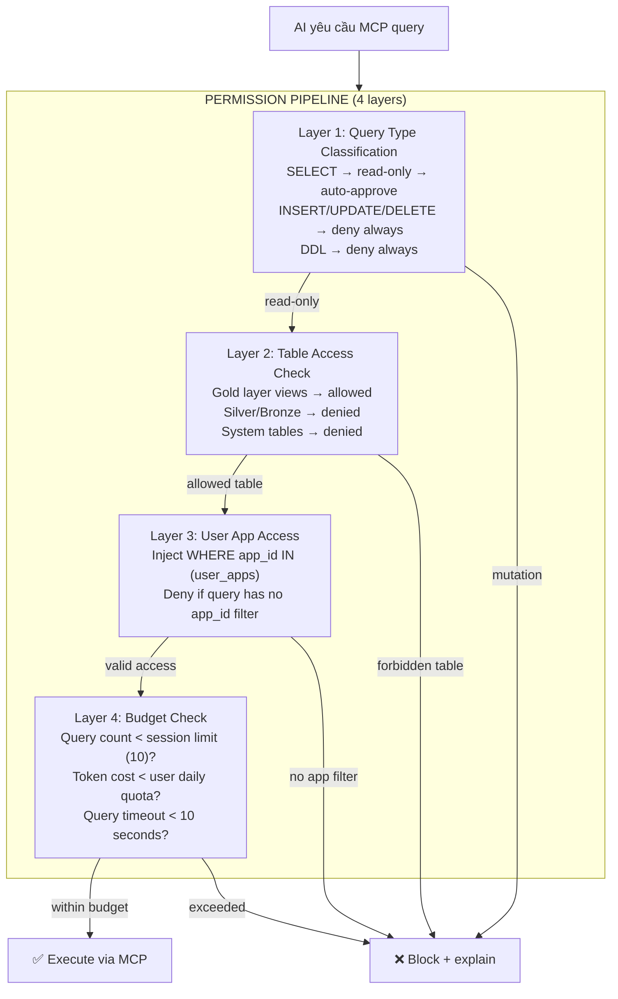

## 7.2 Denial Tracking (chống permission fatigue)

```
Áp dụng Claude Code pattern:
- Nếu AI bị deny cùng pattern 3 lần liên tiếp → auto-deny lần sau
- Nếu AI bị deny 20 lần tổng trong session → force stop session
- recordSuccess() reset consecutive nhưng giữ total
```

---

# 8. Upgrade 6: Skill System cho Nexus

## 8.1 Áp dụng Pattern #11, #12, #13

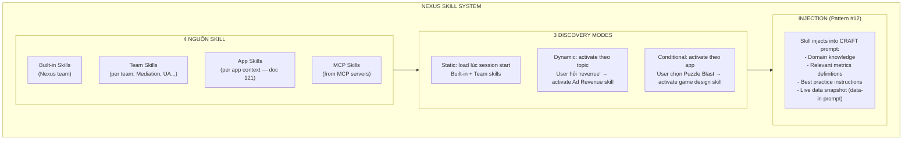

## 8.2 Ví dụ Built-in Skills

| Skill | Activate khi | Inject |
|---|---|---|
| `ad_revenue_analysis` | Topic: revenue, eCPM, monetization | Revenue metrics + AdMob/AppLovin context + waterfall knowledge |
| `ua_campaign_analysis` | Topic: CPI, ROAS, installs, campaign | Campaign metrics + Adjust/XMP context + budget optimization tips |
| `retention_deep_dive` | Topic: retention, D1, D7, churn, engagement | Retention metrics + cohort analysis knowledge + benchmark data |
| `waterfall_optimization` | Topic: waterfall, floor price, SoW, fill rate | SoW calculation + rule engine knowledge + benchmark reference |
| `cross_app_comparison` | User mentions 2+ apps, hoặc "so sánh" | Multi-app query templates + portfolio ranking context |
| `alert_builder` | Topic: alert, monitor, báo, theo dõi | Alert rule model + threshold best practices + CRAFT for alert JSON |

---

# 9. Upgrade 7: Background Intelligence

## 9.1 Nexus "Dream" Agent (Inspired by Claude Code Dream Task)

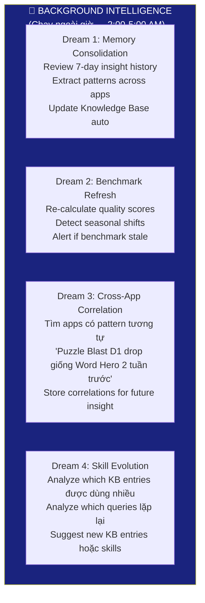

---

# 10. Tổng hợp Architecture v2

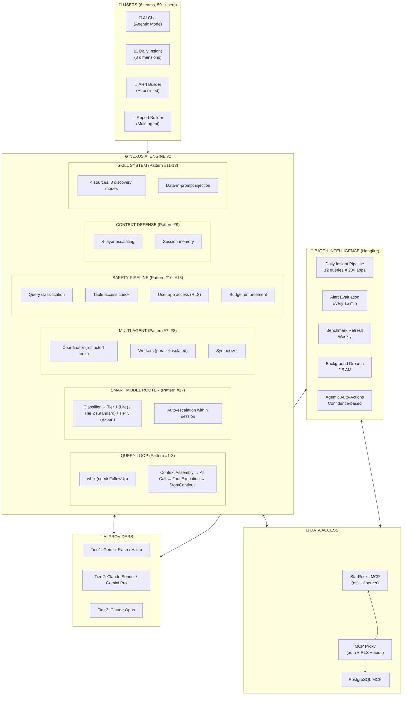

---

# 11. Roadmap triển khai

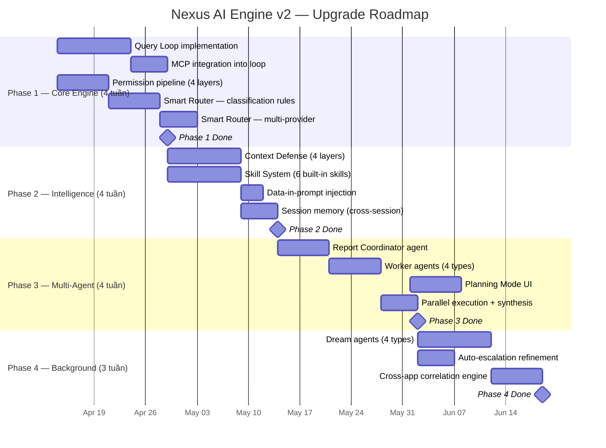

### 30-60-90-120 Day Checklist

**30 ngày (Tháng 4):**
- [ ] Query Loop live — AI Chat mode: while(needsFollowUp) loop
- [ ] MCP queries trong loop — AI tự viết + execute SQL
- [ ] Permission pipeline — 4-layer classification active
- [ ] Smart Router — Tier 1/2/3 classification working
- [ ] Đo lường: investigation time, query accuracy, cost per session

**60 ngày (Tháng 5):**
- [ ] Context Defense — 4 layers active, long sessions survive
- [ ] Skill System — 6 built-in skills, auto-activate by topic
- [ ] Data-in-prompt — live metrics injected automatically
- [ ] Session memory — key findings persist across sessions
- [ ] Đo lường: session length (should increase), AI relevance score

**90 ngày (Tháng 6):**
- [ ] Multi-Agent Report Builder — coordinator + 4 workers
- [ ] Planning Mode — user approves before execution
- [ ] Parallel worker execution — 4 sections in ~45 seconds
- [ ] Đo lường: report quality score, time to generate, cost per report

**120 ngày (Tháng 7):**
- [ ] Background Dreams — 4 types running nightly
- [ ] Cross-app correlation — AI detects patterns across portfolio
- [ ] Auto-escalation tuned — optimal Tier distribution
- [ ] Đo lường: KB growth from dreams, correlation accuracy

---

# 12. Cost & Risk

## 12.1 Cost Estimate

| Component | Monthly Cost | Notes |
|---|---|---|
| Batch insight (Hangfire, unchanged) | ~$60 | 200 apps × $0.01 × 30 days |
| AI Chat — Agentic mode (Tier mix) | ~$50 | 60% Tier 1, 30% Tier 2, 10% Tier 3 |
| Multi-Agent reports | ~$30 | ~10 reports/week × $0.15 × 4 weeks |
| Alert Builder (MCP-assisted) | ~$10 | ~100 alerts/month |
| Background Dreams | ~$20 | 4 dreams × 30 nights × $0.02 |
| **Total** | **~$170/month** | **vs $175 estimate in doc 122** |

## 12.2 Pattern Áp Dụng Summary

| Pattern # | Tên | Upgrade # | Status |
|---|---|---|---|
| #1 | Async generator query loop | U1 | 🔴 Phase 1 |
| #2 | needsFollowUp state machine | U1 | 🔴 Phase 1 |
| #3 | Escalating recovery | U1 + U2 | 🔴 Phase 1 |
| #4 | Concurrency-safe partitioning | U3 | 🟡 Phase 3 |
| #5 | Streaming tool execution | U1 | 🟡 Phase 2 |
| #6 | Context modifier chain | U1 | 🔴 Phase 1 |
| #7 | Coordinator restriction | U3 | 🟡 Phase 3 |
| #8 | Fork isolation | U3 | 🟡 Phase 3 |
| #9 | 5-layer context defense | U4 | 🟡 Phase 2 |
| #10 | Permission classification | U5 | 🔴 Phase 1 |
| #11 | Conditional skill activation | U6 | 🟡 Phase 2 |
| #12 | Shell/Data-in-prompt | U6 | 🟡 Phase 2 |
| #13 | Dynamic skill discovery | U6 | 🟡 Phase 2 |
| #14 | 4-point extension | Future | ⚪ Backlog |
| #15 | Security sandbox | U5 | 🔴 Phase 1 |
| #16 | Reconciliation install | Skip | ⚪ N/A |
| #17 | Native replacement (model router) | U2 | 🔴 Phase 1 |
| #18 | Terminal rendering | Skip | ⚪ N/A |

**16/18 patterns áp dụng. 2 skip (domain mismatch).**

## 12.3 Risk

| # | Risk | Impact | Mitigation |
|---|---|---|---|
| 1 | Query Loop infinite loop | 🔴 Cost spike, system hang | Max 10 iterations per session. Budget cap. User abort button |
| 2 | Smart Router misclassifies | 🟡 Wrong model chosen | Fallback: user can force tier. Log + improve classification rules |
| 3 | Multi-Agent coordination failure | 🟡 Report incomplete | Timeout per worker (30s). Coordinator detects missing sections. Graceful degradation: deliver available sections |
| 4 | Context Defense loses critical info | 🟡 AI "forgets" important context | Compact summary reviewed by AI before discard. Session memory preserves key facts |
| 5 | Permission pipeline too strict | 🟡 AI can't query needed data | Classification reviewable. Admin can whitelist specific patterns |
| 6 | Dream agent produces wrong KB entries | 🟡 Bad knowledge propagation | Dream output flagged "AI-generated, needs review". Auto-expire after 30 days without validation |

---

> **Tóm tắt Doc 123:**
>
> Nexus AI Engine v2 áp dụng **16 trong 18 Agentic OS patterns** (từ phân tích Claude Code 513K LOC) để nâng cấp AI từ Level 3 (Assistant) lên Level 4-5 (Copilot/Agent):
>
> | Upgrade | Patterns | Impact |
> |---|---|---|
> | **U1: Query Loop** | #1, #2, #3, #6 | AI tự lặp, tự query MCP, multi-step reasoning |
> | **U2: Smart Router** | #3, #17 | 62% cost savings, right model for right task |
> | **U3: Multi-Agent Report** | #4, #7, #8 | Parallel report generation, coordinator delegation |
> | **U4: Context Defense** | #9 | Long investigation sessions survive (hours) |
> | **U5: Permission Pipeline** | #10, #15 | Classification-based safety, not binary allow/deny |
> | **U6: Skill System** | #11, #12, #13 | Context-aware AI with auto-activated domain knowledge |
> | **U7: Background Dreams** | Dream tasks | AI tự cải thiện KB, phát hiện cross-app patterns |
>
> **Timeline:** 4 phases × ~4 tuần = 4 tháng (April → July 2026)
> **Cost:** ~$170/month total AI infrastructure
> **Principle:** Build agentic capabilities IN Nexus — không dùng OpenClaw hay framework bên ngoài
