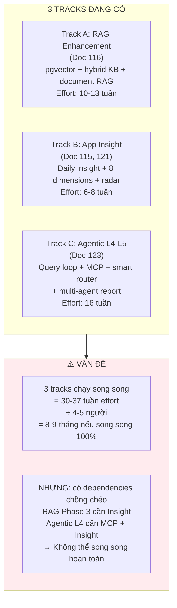
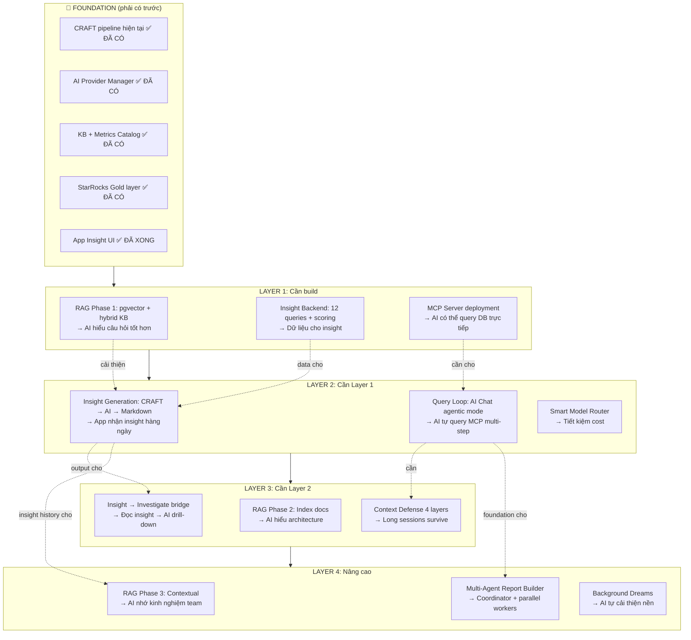
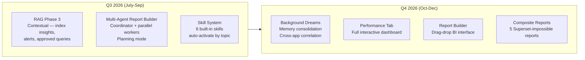
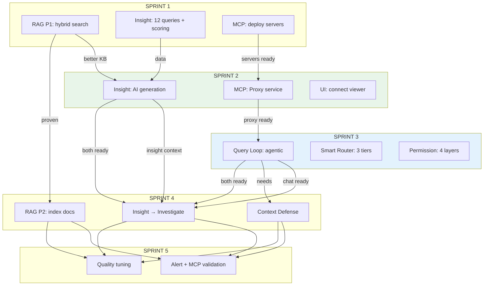

# 124 — Nexus AI Roadmap: 3 Tracks → 1 Kế hoạch Thực tế

> **Mục đích:** Gộp 3 initiatives (RAG, App Insight, Agentic L4-L5) thành 1 lộ trình có thứ tự, xác định rõ cái gì làm trước / sau / bỏ
> **Thực trạng:** UI App Insight đã xong. Team ~4-5 người. On-premise IDC.
> **Version:** 1.0 — 2026-04-04

---

## 1. Đánh giá thẳng thắn: 3 tracks hiện tại



**Nhận định CTO:** 30+ tuần effort cho 4-5 người = phải chia rất kỹ. Nhưng quan trọng hơn — 3 tracks này KHÔNG độc lập. Chúng có dependency chain rõ ràng, và có component DÙNG CHUNG.

---

## 2. Phân tích Dependencies



---

## 3. Khuyến nghị: Cắt gì, Giữ gì, Defer gì

### 3.1 Nguyên tắc

Tôi đánh giá theo 3 tiêu chí: **Impact** (giá trị cho user), **Dependency** (có cần cho bước sau không), và **Risk** (độ phức tạp kỹ thuật).

### 3.2 Verdict từng component

| Component | Impact | Dependency | Risk | Verdict |
|---|---|---|---|---|
| **RAG Phase 1** (pgvector + hybrid KB) | 🟡 Medium — KB search tốt hơn 30-40% | 🟢 High — cải thiện mọi AI feature | 🟢 Low — 2-3 tuần, isolated | ✅ **LÀM NGAY** |
| **Insight Backend** (12 queries + 8-dim scoring) | 🔴 Critical — trái tim của insight | 🔴 Critical — data cho insight, investigate | 🟡 Medium — queries cần test kỹ | ✅ **LÀM NGAY** |
| **Insight Generation** (CRAFT → AI → Markdown) | 🔴 Critical — user nhận insight daily | 🔴 Critical — cần cho investigate, RAG P3 | 🟡 Medium — prompt tuning | ✅ **LÀM NGAY** |
| **MCP Servers** (deploy StarRocks + PostgreSQL) | 🟡 Medium — chỉ cần cho interactive | 🔴 Critical — foundation cho L4-L5 | 🟢 Low — deploy official server | ✅ **LÀM SONG SONG** |
| **MCP Proxy** (auth + RLS + audit) | 🟡 Medium | 🔴 Critical — security cho MCP | 🟡 Medium — custom service | ✅ **LÀM SAU MCP deploy** |
| **Query Loop** (agentic while loop) | 🟢 High — AI Chat upgrade lớn | 🟡 Medium — cho investigate bridge | 🟡 Medium — new pattern | ✅ **LÀM sau MCP Proxy** |
| **Smart Router** (3-tier model) | 🟢 High — 62% cost savings | 🟢 Low — optimization | 🟢 Low — rule-based classifier | ✅ **LÀM cùng Query Loop** |
| **RAG Phase 2** (index docs) | 🟡 Medium — AI hiểu docs | 🟡 Medium — cho RAG P3 | 🟢 Low — batch job | ✅ **LÀM sau RAG P1 proven** |
| **Context Defense** (4 layers) | 🟡 Medium — long sessions | 🟡 Medium — cho multi-agent | 🟡 Medium — nhiều edge cases | ✅ **LÀM khi Query Loop stable** |
| **Insight → Investigate** (hybrid bridge) | 🟢 High — killer feature | 🟢 Low | 🟢 Low — context pass-through | ✅ **LÀM khi cả Insight + Query Loop xong** |
| **RAG Phase 3** (contextual) | 🟡 Medium | 🟢 Low | 🟡 Medium | ⏸️ **DEFER — Q3 2026** |
| **Multi-Agent Report** (coordinator + workers) | 🟡 Medium — nice to have | 🟢 Low | 🔴 High — phức tạp nhất | ⏸️ **DEFER — Q3 2026** |
| **Background Dreams** | 🟢 Low — bonus | 🟢 Low | 🟡 Medium | ⏸️ **DEFER — Q4 2026** |
| **Skill System** (6 skills) | 🟡 Medium | 🟢 Low | 🟡 Medium | ⏸️ **DEFER — sau L4 stable** |
| **Alert Builder + MCP validation** | 🟡 Medium | 🟢 Low | 🟢 Low | ✅ **BONUS nếu thừa time** |

### 3.3 Tóm tắt: 10 items LÀM, 4 items DEFER

```
✅ LÀM (Q2 2026 — 12-14 tuần):
   RAG P1, Insight Backend, Insight Gen, MCP Deploy,
   MCP Proxy, Query Loop, Smart Router, RAG P2,
   Context Defense, Insight→Investigate

⏸️ DEFER (Q3-Q4 2026):
   RAG P3, Multi-Agent Report, Background Dreams, Skill System

❌ BỎ: Không bỏ gì — chỉ defer. Tất cả đều có giá trị, 
   nhưng dependencies buộc phải tuần tự.
```

---

## 4. Lộ trình Gộp — 5 Sprints × 2-3 tuần

```mermaid
gantt
    title Nexus AI — Unified Roadmap Q2 2026
    dateFormat YYYY-MM-DD
    axisFormat %b %d

    section Sprint 1 — Foundation (tuần 1-3)
    RAG P1: pgvector setup + embedding service     :s1a, 2026-04-07, 5d
    RAG P1: Hybrid KB search + score fusion        :s1b, after s1a, 5d
    Insight: 12 queries snapshot collector          :s1c, 2026-04-07, 7d
    Insight: 8-dimension scoring engine             :s1d, after s1c, 5d
    MCP: Deploy StarRocks MCP (official)            :s1e, 2026-04-14, 3d
    MCP: Deploy PostgreSQL MCP                      :s1f, 2026-04-14, 2d
    Sprint 1 Done                                   :milestone, m1, 2026-04-25, 0d

    section Sprint 2 — Insight Live (tuần 4-6)
    Insight: CRAFT template + AI generation         :s2a, 2026-04-28, 7d
    Insight: Connect UI viewer (đã xong) với backend :s2b, after s2a, 3d
    Insight: Notification (in-app + Telegram)       :s2c, after s2b, 3d
    MCP: Proxy service (auth + RLS + audit)         :s2d, 2026-04-28, 7d
    RAG P1: A/B test keyword vs hybrid              :s2e, 2026-04-28, 5d
    Sprint 2 Done — INSIGHT LIVE 🎉                 :milestone, m2, 2026-05-16, 0d

    section Sprint 3 — Agentic Chat (tuần 7-9)
    Query Loop: while(needsFollowUp) implementation :s3a, 2026-05-19, 7d
    Query Loop: MCP tool integration in loop        :s3b, after s3a, 5d
    Smart Router: 3-tier classifier                 :s3c, 2026-05-19, 5d
    Smart Router: Multi-provider fallback           :s3d, after s3c, 3d
    Permission Pipeline: 4-layer MCP classification :s3e, 2026-05-19, 5d
    Sprint 3 Done — AGENTIC CHAT LIVE 🎉            :milestone, m3, 2026-06-06, 0d

    section Sprint 4 — Bridge + RAG P2 (tuần 10-12)
    Insight → Investigate bridge                    :s4a, 2026-06-09, 5d
    Context Defense: 4 layers                       :s4b, 2026-06-09, 7d
    RAG P2: Document indexer + chunking             :s4c, 2026-06-09, 5d
    RAG P2: Index docs 99,111,100,114,115           :s4d, after s4c, 3d
    RAG P2: 3-channel search integration            :s4e, after s4d, 4d
    Sprint 4 Done                                   :milestone, m4, 2026-06-27, 0d

    section Sprint 5 — Polish + Alert (tuần 13-14)
    Alert Builder: MCP-assisted validation          :s5a, 2026-06-30, 5d
    Insight v2 tuning: prompt quality + radar chart  :s5b, 2026-06-30, 5d
    Performance monitoring + cost optimization      :s5c, after s5a, 4d
    Q2 Done — FULL AI ENGINE LIVE 🎉               :milestone, m5, 2026-07-11, 0d
```

---

## 5. Chi tiết từng Sprint

### Sprint 1: Foundation (Tuần 1-3, April 7-25)

**Mục tiêu:** RAG P1 working + Insight data ready + MCP servers deployed

**Team allocation:**
- **BE-1 (Senior):** RAG P1 — pgvector setup, EmbeddingService, hybrid search
- **BE-2:** Insight — 12 queries snapshot collector, anomaly detection
- **BE-3:** Insight — 8-dimension scoring engine, composite health score
- **DevOps/BE-4:** MCP — Deploy StarRocks MCP + PostgreSQL MCP servers trên IDC

**Deliverables:**
- [ ] pgvector extension enabled trên PostgreSQL production
- [ ] EmbeddingService wrapping OpenAI text-embedding-3-small
- [ ] 95+ KB entries embedded (batch migration)
- [ ] Hybrid search: keyword + vector, score fusion working
- [ ] 12 Gold layer queries returning correct data per app
- [ ] 8-dimension scores calculated correctly (test với 5 apps)
- [ ] StarRocks MCP server running on port 8080
- [ ] PostgreSQL MCP server running on port 8081

**Checkpoint:** Cuối Sprint 1 — demo hybrid KB search (before/after) + show 8-dimension scores cho Puzzle Blast

---

### Sprint 2: Insight Live (Tuần 4-6, April 28 - May 16)

**Mục tiêu:** App Insight generation live + MCP Proxy ready

**Team allocation:**
- **BE-1:** MCP Proxy service — auth, RLS injection, audit logging, rate limiting
- **BE-2:** Insight CRAFT template builder — assemble prompt from template + data + context
- **BE-3:** Insight AI generation — Hangfire job, parallel 10 apps, store markdown + scores
- **FE (if available):** Connect Insight Viewer UI (đã xong) với backend API

**Deliverables:**
- [ ] Insight generation pipeline: 5 AM trigger → 12 queries → anomaly detect → CRAFT prompt → AI generate → store
- [ ] Insight Viewer UI connected: date navigation, health score banner, markdown rendering
- [ ] Notification: in-app bell + Telegram summary cho anomaly apps
- [ ] MCP Proxy: auth middleware, WHERE injection per user, query audit log
- [ ] RAG P1 A/B test: log both keyword-only and hybrid results, compare relevance

**Checkpoint — MILESTONE 🎉:** Cuối Sprint 2 — team nhận daily insight lúc 7 AM cho top 20 apps. Demo Insight Viewer live.

**Đây là checkpoint quan trọng nhất.** Nếu insight quality tốt → team adopt → data cho Sprint 4 (investigate bridge). Nếu insight quality kém → tuning prompt trước khi tiếp Sprint 3.

---

### Sprint 3: Agentic Chat (Tuần 7-9, May 19 - June 6)

**Mục tiêu:** AI Chat nâng cấp từ one-shot lên agentic loop + smart model routing

**Team allocation:**
- **BE-1 (Senior):** Query Loop — while(needsFollowUp) core implementation
- **BE-2:** Query Loop — MCP tool integration (StarRocks + PostgreSQL via Proxy)
- **BE-3:** Smart Router — classifier rules + multi-provider fallback
- **BE-4:** Permission Pipeline — 4-layer MCP query classification

**Deliverables:**
- [ ] Query Loop: AI Chat hỏi → AI tự viết SQL → query MCP → nhận results → quyết định tiếp/dừng
- [ ] Multi-step demo: "tại sao revenue Puzzle Blast giảm?" → AI query 3-4 lần → synthesize answer
- [ ] Smart Router: simple questions → Tier 1 (Gemini Flash), analysis → Tier 2 (Sonnet), deep → Tier 3 (Opus)
- [ ] Permission: read-only auto-approve, mutation deny, budget cap 10 queries/session
- [ ] Escalating recovery: retry ×3 → fallback provider → surface error

**Checkpoint — MILESTONE 🎉:** Cuối Sprint 3 — DA team dùng agentic AI Chat. Demo: user hỏi 1 câu → AI tự query 3-4 lần → trả lời tổng hợp.

---

### Sprint 4: Bridge + RAG P2 (Tuần 10-12, June 9-27)

**Mục tiêu:** Kết nối Insight ↔ AI Chat + Context Defense + RAG docs

**Team allocation:**
- **BE-1:** Insight → Investigate bridge — pass insight context to AI Chat session
- **BE-2:** Context Defense — 4 layers (truncate, stale removal, auto-compact, reactive)
- **BE-3:** RAG P2 — DocumentIndexer, chunk 5 docs, 3-channel search
- **FE:** "Investigate" button trên Insight Viewer → mở AI Chat sidebar pre-loaded

**Deliverables:**
- [ ] Click "Investigate" trên insight anomaly → AI Chat mở với full context
- [ ] AI Chat sessions survive > 30 phút (context defense working)
- [ ] 5 internal docs indexed (~350 chunks) — AI trả lời được "pipeline chạy lúc mấy giờ?"
- [ ] 3-channel search: KB keyword + KB vector + Doc RAG

**Checkpoint:** Demo insight → investigate flow end-to-end. User đọc "D1 retention ↓4pp" → click investigate → AI tự query by version, by level → tìm root cause.

---

### Sprint 5: Polish + Alert (Tuần 13-14, June 30 - July 11)

**Mục tiêu:** Alert builder enhancement + quality tuning + metrics

**Team allocation:**
- **Full team:** Bug fixes, prompt tuning, performance optimization
- **BE-1:** Alert Builder — MCP-assisted threshold validation
- **BE-2:** Insight v2 tuning — prompt quality improvement based on user feedback
- **BE-3:** Monitoring — cost tracking, query performance, usage analytics

**Deliverables:**
- [ ] Alert Builder: AI check real data trước khi suggest threshold
- [ ] Insight quality score > 4/5 (internal survey)
- [ ] AI cost dashboard: daily/weekly cost by feature, by user
- [ ] Performance baseline: avg query time, MCP latency, generation time

---

## 6. Sau Q2 — Deferred Items (Q3-Q4 2026)



**Tại sao Performance Tab và Report Builder defer sang Q4?**

Đây là quyết định khó nhưng đúng:

Performance Tab và Report Builder là **visualization features** — rất cool nhưng không thêm "intelligence" vào hệ thống. User hiện tại xem metrics qua Superset + existing dashboard. Chưa hoàn hảo nhưng FUNCTIONAL.

Insight + Agentic Chat + RAG là **intelligence features** — thay đổi cách user làm việc. Từ "tự tìm" sang "AI tìm cho". Từ "hỏi 1 câu" sang "AI investigate tự động". Đây là giá trị mà KHÔNG tool nào khác cho được.

Build intelligence first → visualization second. Intelligence tạo data (insights, health scores, investigation findings) → visualization hiển thị data đó sau.

---

## 7. Dependency Map rõ ràng



---

## 8. Risk Mitigation

| Sprint | Risk | Mitigation |
|---|---|---|
| S1 | pgvector performance issue | ivfflat index, chỉ ~95 entries → trivial. Test trước trên staging |
| S1 | 12 queries cho Gold layer chưa đủ data | Chỉ build queries cho data sources đã có. Skip queries cho sources chưa integrate |
| S2 | AI insight quality kém | Bắt đầu với top 5 apps (manual review). Tuning prompt 2-3 rounds trước khi scale 20+ |
| S2 | MCP Proxy security hole | Penetration test trước deploy. Read-only DB user. No external port exposure |
| S3 | Query Loop infinite loop | Hard cap: max 10 iterations. Budget: max 10 MCP queries per session. User abort button |
| S3 | Smart Router misclassifies | Start conservative: default Tier 2. Only downgrade to Tier 1 for explicit simple patterns |
| S4 | Context Defense loses important info | Compact summary reviewed by AI. Session memory preserves key facts |
| S4 | RAG P2 chunking poor quality | Manual review first 50 chunks. Adjust chunk size/overlap based on retrieval quality |

---

## 9. KPI cho mỗi Sprint

| Sprint | KPI | Target | Đo lường |
|---|---|---|---|
| S1 | KB search relevance (hybrid vs keyword) | +30% improvement | Log both, compare top-3 relevance |
| S1 | Scoring engine accuracy (8 dims) | Agree with manual assessment 80% | DA team spot-check 10 apps |
| S2 | Insight delivery time | Before 7:00 AM UTC+7 | Hangfire job completion time |
| S2 | Insight quality (user rating) | ≥ 3.5/5 first iteration | Internal survey after 1 week |
| S3 | AI Chat multi-step success | 70% queries resolved in 1 session | Log query → MCP calls → resolution |
| S3 | Cost per session (with router) | < $0.02 avg | Token tracking per session |
| S4 | Investigate conversion | 30% insight anomalies get investigated | Track button clicks |
| S4 | Long session survival | Sessions > 20 min don't crash | Context defense metrics |
| S5 | Overall AI usage | 60%+ daily active users of AI features | Login + feature usage tracking |

---

## 10. Tổng kết

```
TRƯỚC (3 tracks riêng lẻ, 30+ tuần):
  Track A: RAG ──────────────────────────► 13 tuần
  Track B: Insight ────────────────► 8 tuần  
  Track C: Agentic ────────────────────────────────► 16 tuần
  = Không rõ thứ tự, dependencies chồng chéo

SAU (1 lộ trình gộp, 14 tuần):
  S1 ─── S2 ─── S3 ─── S4 ─── S5
  RAG P1  Insight  Agentic  Bridge   Polish
  + Data  LIVE 🎉  LIVE 🎉  + RAG P2  + Alert
  + MCP              + Router
  
  Tuần 1────6────9────12────14
         ↑         ↑         ↑
     Insight    Agentic   Full AI
      live       live     Engine
```

**Ba nguyên tắc:**

Thứ nhất, **build bottom-up theo dependency.** RAG P1 cải thiện mọi AI feature → làm trước. MCP servers cần cho agentic → deploy sớm, dùng sau. Insight cần data + RAG → build sau RAG P1.

Thứ hai, **deliver value sớm.** Sprint 2 kết thúc = team nhận daily insight. Sprint 3 = AI Chat upgrade sẵn sàng. Không phải chờ 14 tuần mới có gì dùng được.

Thứ ba, **defer visualization, prioritize intelligence.** Performance Tab và Report Builder rất đẹp nhưng chúng là OUTPUT layer. Intelligence layer (insight, agentic, RAG) phải có trước — nó TẠO RA data mà visualization HIỂN THỊ.
