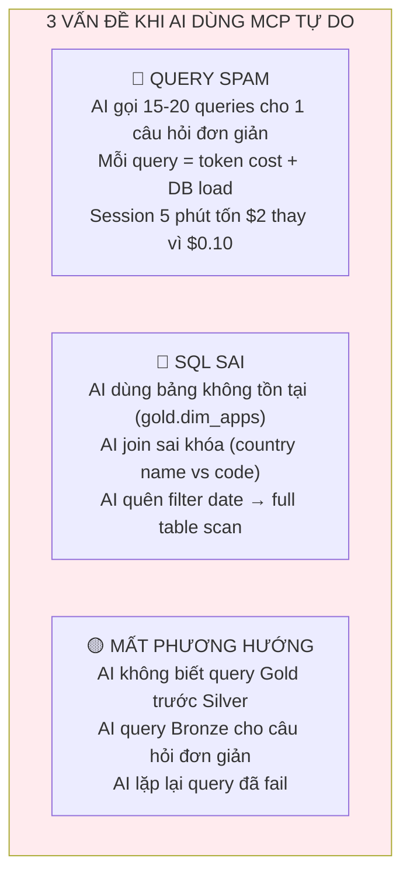
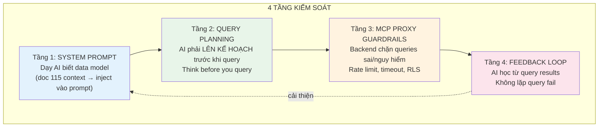
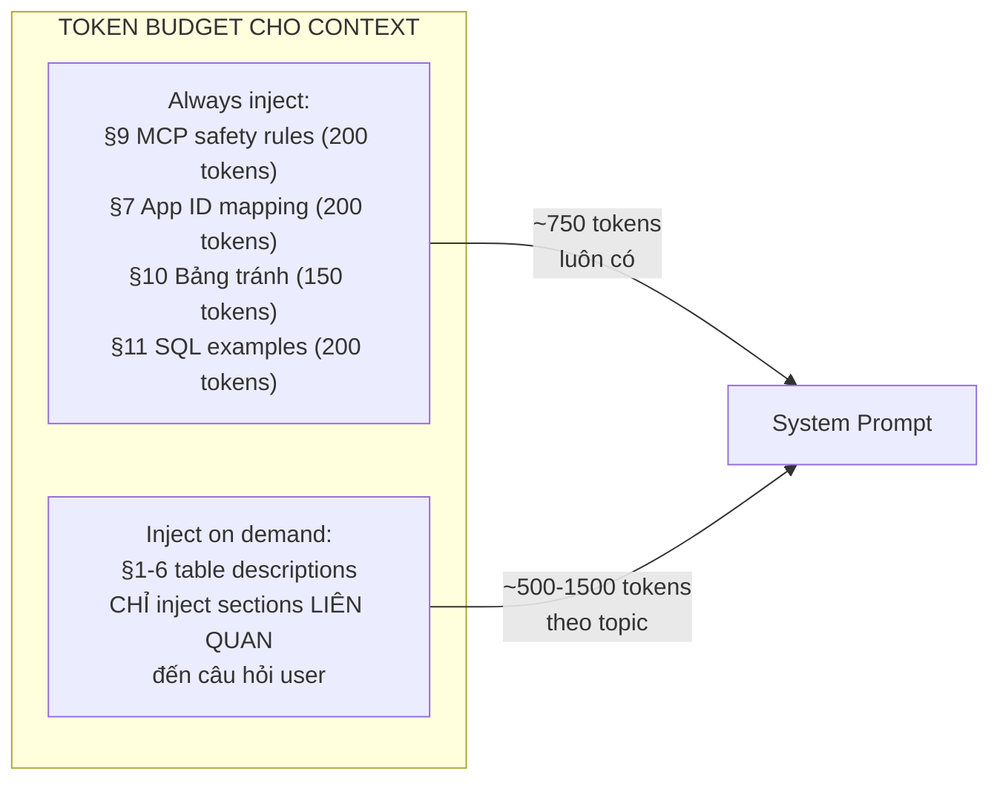
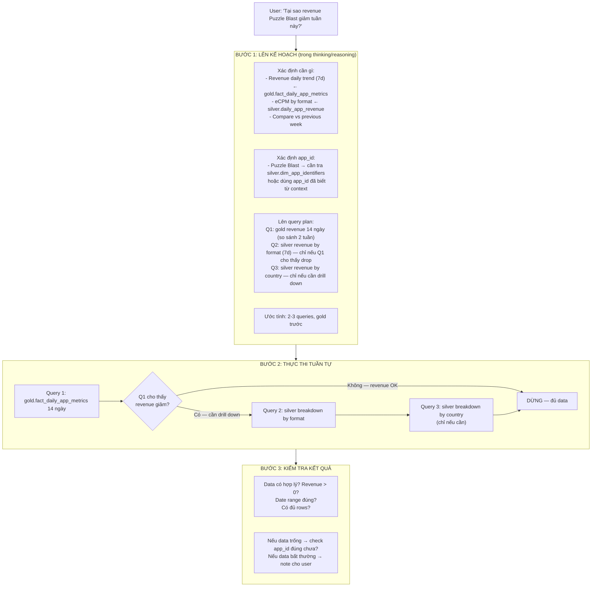
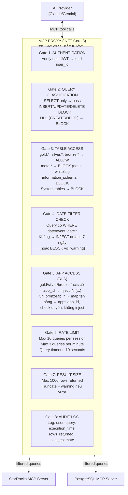

# 125 — MCP Discipline: Kiểm soát AI truy vấn Database chuẩn xác

> **Mục đích:** Hướng dẫn chi tiết cách để AI sử dụng MCP đúng, tránh query tràn lan, SQL sai
> **Áp dụng cho:** Nexus AI Assistant (interactive chat) + App Insight (batch generation)
> **Stack:** StarRocks MCP (official) + PostgreSQL MCP + MCP Proxy (.NET Core 8)
> **Reference:** Doc 115 (Data Context), Doc 122 (CRAFT+MCP Hybrid), Doc 123 (Agentic Upgrade)
> **Version:** 1.0 — 2026-04-06

---

## 1. Vấn đề cốt lõi: AI + MCP = "đứa trẻ được vào bếp"

Khi bạn cho AI quyền truy cập trực tiếp database qua MCP, 3 vấn đề xảy ra ngay:



**Root cause:** AI không được dạy đúng cách. Nó có access nhưng thiếu DISCIPLINE — biết query gì, ở đâu, khi nào, và quan trọng nhất: khi nào KHÔNG query.

---

## 2. Giải pháp 4 tầng



---

## 3. Tầng 1: System Prompt — Dạy AI data model

### 3.1 Nguyên tắc: AI phải "học" trước khi được "làm"

Doc 115 (Data Context) đã rất tốt. Nhưng cần bổ sung thêm **rules of engagement** — không chỉ "data ở đâu" mà "cách dùng data đúng".

### 3.2 System prompt bổ sung cho MCP sessions

Inject vào system prompt TRƯỚC mỗi AI session có MCP access:

```markdown
## QUY TẮC TRUY VẤN MCP (bắt buộc tuân thủ)

### Thứ tự ưu tiên bảng
1. LUÔN bắt đầu từ **gold** layer — dữ liệu đã tổng hợp, nhanh nhất
2. Chỉ xuống **silver** khi gold THIẾU dimension cần thiết (VD: cần breakdown by country mà gold không có)
3. Chỉ xuống **bronze** khi silver THIẾU (VD: cần raw events, JSON fields, cohort detail)
4. **KHÔNG BAO GIỜ** query bronze trước khi check gold/silver

### Bắt buộc filter date
- MỌI query StarRocks PHẢI có `WHERE date >= ...` hoặc `WHERE event_date >= ...`
- Mặc định: 7 ngày gần nhất. Tối đa: 90 ngày (trừ khi user yêu cầu rõ ràng)
- Format date: `DATE_SUB(CURDATE(), INTERVAL 7 DAY)` — StarRocks syntax
- KHÔNG dùng `NOW()` cho date filter — dùng `CURDATE()`

### Bảng KHÔNG tồn tại — tuyệt đối tránh
- ❌ `gold.dim_apps` — KHÔNG CÓ. Dùng `silver.dim_app_identifiers`
- ❌ `gold.fact_campaign_roi` — CHƯA CÓ pipeline
- ❌ `silver.adjust_daily_metrics` — CHƯA CÓ ETL
- ❌ `silver.meta_daily_campaign_insights` — CHƯA CÓ ETL
- ❌ Bất kỳ bảng nào bắt đầu bằng `gold_fact_*` hoặc `gold.dim_*` (trừ mapping RLS)

### Cách viết SQL đúng
- LUÔN dùng `database.table`: `gold.fact_daily_app_metrics`, KHÔNG `fact_daily_app_metrics`
- LUÔN dùng backtick cho reserved words: `date`, `key`, `order`, `group`
- Country: `silver.daily_app_revenue` dùng ISO 2 chữ, `silver.geo` dùng tên đầy đủ. Join qua `silver.dim_country` nếu cần convert
- App ID: hầu hết silver/gold dùng `admob_app_id`. Adjust dùng `app_token`. AppMetrica dùng `application_id` (BIGINT)
- AppLovin: join qua `package_name` + `platform`

### Giới hạn query
- Tối đa **6 queries** cho 1 câu hỏi user
- Mỗi query phải có LIMIT (mặc định LIMIT 100, tối đa LIMIT 1000)
- Nếu 3 queries đầu KHÔNG TRẢ data hữu ích → DỪNG LẠI, giải thích cho user data hiện có
- KHÔNG lặp lại query đã fail — phân tích lỗi, sửa rồi mới thử lại

### Khi KHÔNG nên query
- Câu hỏi về ĐỊNH NGHĨA metric (eCPM là gì?) → trả lời từ knowledge base, KHÔNG query
- Câu hỏi về CẤU HÌNH hệ thống → tra PostgreSQL config tables, KHÔNG query StarRocks
- Câu hỏi đã trả lời TRONG CONTEXT hiện tại → dùng kết quả cũ, KHÔNG query lại
```

### 3.3 Data Context injection (from doc 115)

Doc 115 đã cover rất tốt. Inject như sau:

```
System prompt = 
  [CRAFT Role Prompt]
  + [MCP Query Rules — mục 3.2 ở trên]
  + [Doc 115 Data Context — sections 1-11]
  + [User's app_access list]
  + [Current conversation context]
```

**Vấn đề token:** Doc 115 full = ~3000-4000 tokens. Giải pháp:



VD: User hỏi về revenue → inject §6 Gold + §5.2 Silver monetization. User hỏi về retention → inject §5.3 Silver Firebase + §6.3 Gold Firebase.

---

## 4. Tầng 2: Query Planning — "Think before you query"

### 4.1 Pattern: Plan → Execute → Verify

Đây là cải tiến quan trọng nhất. Thay vì AI nhận câu hỏi → lập tức query MCP, buộc AI phải:



### 4.2 System prompt cho Query Planning

Thêm vào MCP rules:

```markdown
### Quy trình truy vấn (BẮT BUỘC)

Trước khi gọi BẤT KỲ MCP query nào, PHẢI suy nghĩ trong <thinking> block:

1. **Xác định mục tiêu:** Câu hỏi user cần data gì cụ thể?
2. **Chọn bảng:** Gold trước. Silver chỉ khi cần dimension mà gold không có. Bronze chỉ khi cần raw detail.
3. **Lên query plan:** Liệt kê 1-3 queries cần chạy. Query đầu tiên LUÔN là gold layer.
4. **Conditional execution:** Query 2+ chỉ chạy NẾU query 1 cho thấy cần drill down.
5. **Budget check:** Tổng queries ≤ 6. Nếu plan cần > 6 → simplify hoặc báo user scope quá rộng.

Ví dụ thinking:
<thinking>
User hỏi revenue trend Puzzle Blast.
- Cần: daily revenue 14 ngày
- Bảng: gold.fact_daily_app_metrics (đã có revenue, ecpm, dau)
- App ID: ca-app-pub-xxx~yyy (đã biết từ context)
- Plan: 1 query gold layer, LIMIT 14. Đủ cho câu hỏi này.
- Không cần silver/bronze vì gold đã có đủ metric.
</thinking>
```

### 4.3 Anti-pattern: Những gì AI KHÔNG NÊN LÀM

```markdown
### ❌ CẤM (Anti-patterns)

1. **Spam discovery queries:**
   ❌ "Để tôi xem có những bảng gì..." → SHOW TABLES FROM gold
   ❌ "Để tôi xem schema..." → DESCRIBE gold.fact_daily_app_metrics
   → BẠN ĐÃ BIẾT schema từ Data Context. KHÔNG cần discovery.

2. **Lặp query fail:**
   ❌ Query fail → chạy lại y hệt
   ✅ Query fail → đọc error → SỬA SQL → chạy lại (tối đa 1 lần retry)

3. **Query không có date filter:**
   ❌ SELECT * FROM bronze.mkt_table WHERE app_id = '...'
   ✅ SELECT * FROM bronze.mkt_table WHERE app_id = '...' AND `date` >= DATE_SUB(CURDATE(), INTERVAL 7 DAY)

4. **SELECT * trên bảng lớn:**
   ❌ SELECT * FROM bronze.fb_com_puzzle_blast LIMIT 100
   ✅ SELECT event_name, COUNT(*) FROM bronze.fb_com_puzzle_blast WHERE event_date >= '2026-03-30' GROUP BY event_name

4b. **`app_id` trên `bronze.fb_*` (Firebase raw — sai):**
   Mỗi app một bảng `bronze.fb_{sanitized_firebase_app_key}` (vd. `fb_ar_tracer_trace_drawing_ios`); **không có cột `app_id`.**
   ❌ `FROM bronze.fb_… WHERE app_id IN (…)`
   ✅ `FROM bronze.fb_… WHERE event_date …` (+ LIMIT). Phân quyền MCP: **check đầu pipeline** — map `fb_*` → `apps.app_id` qua `firebase_params.firebaseAppKey`, không rewrite SQL.

5. **Query bảng không tồn tại:**
   ❌ SELECT * FROM gold.dim_apps — BẢNG NÀY KHÔNG TỒN TẠI
   ✅ SELECT * FROM silver.dim_app_identifiers WHERE display_name LIKE '%puzzle%'

6. **Giả định data format:**
   ❌ WHERE country = 'United States' (trên bảng dùng ISO code)
   ✅ WHERE country = 'US' (check format trước hoặc join dim_country)
```

---

## 5. Tầng 3: MCP Proxy Guardrails

### 5.1 Kiến trúc Proxy



### 5.2 Gate 4 chi tiết: Auto-inject date filter

```csharp
// Pseudo-code cho MCP Proxy
public class DateFilterGuard
{
    private static readonly string[] DateColumns = 
        { "date", "event_date", "stat_date", "cohort_date", "install_date" };
    
    public QueryResult Validate(string sql, string targetDb)
    {
        // Bronze/Silver/Gold tables PHẢI có date filter
        if (targetDb is "bronze" or "silver" or "gold")
        {
            bool hasDateFilter = DateColumns.Any(col => 
                sql.Contains($"WHERE", StringComparison.OrdinalIgnoreCase) &&
                sql.Contains(col, StringComparison.OrdinalIgnoreCase));
            
            if (!hasDateFilter)
            {
                // Option A: Auto-inject (recommended)
                // Thêm "AND `date` >= DATE_SUB(CURDATE(), INTERVAL 7 DAY)"
                
                // Option B: Block with warning
                return QueryResult.Blocked(
                    "Query thiếu date filter. Thêm WHERE `date` >= DATE_SUB(CURDATE(), INTERVAL 7 DAY)");
            }
        }
        return QueryResult.Allowed();
    }
}
```

### 5.3 Gate 5 chi tiết: RLS — App Access Control

```csharp
public class AppAccessGuard
{
    public QueryResult Validate(string sql, int userId)
    {
        // Load user's allowed apps
        var allowedApps = _userAppAccess.GetAllowedAppIds(userId);
        // ["ca-app-pub-xxx~111", "ca-app-pub-xxx~222", ...]
        
        // Check if query has app_id filter
        bool hasAppFilter = sql.Contains("app_id", StringComparison.OrdinalIgnoreCase);
        
        if (!hasAppFilter)
        {
            // Một số bảng dimension không cần app filter (dim_country, dim_app_identifiers)
            if (IsLookupTable(sql)) return QueryResult.Allowed();
            
            // Data tables PHẢI có app filter
            return QueryResult.Blocked(
                "Query thiếu app_id filter. Thêm WHERE app_id IN (user_allowed_apps)");
        }
        
        // Inject RLS: thay WHERE app_id = 'xxx' thành WHERE app_id IN (allowed_list)
        // Hoặc append AND app_id IN (...) vào existing WHERE
        var modifiedSql = InjectAppFilter(sql, allowedApps);
        return QueryResult.Modified(modifiedSql);
    }
    
    private bool IsLookupTable(string sql)
    {
        // Bảng dimension/lookup không cần app filter
        var lookupTables = new[] { 
            "dim_app_identifiers", "dim_country", "dim_package_admob_mapping",
            "dim_booster_price" };
        return lookupTables.Any(t => sql.Contains(t));
    }
}
```

### 5.4 Gate 6: Rate Limiting chi tiết

```
Session limits:
- Max 10 MCP queries per AI chat session
- Max 3 queries per rolling 60 seconds (burst protection)
- Query execution timeout: 10 seconds (StarRocks), 5 seconds (PostgreSQL)

When limit reached:
- AI nhận error: "Query limit reached (10/10). Please summarize findings."
- AI PHẢI synthesize từ data đã có, KHÔNG được request thêm queries
- User can start new session if need more investigation

Cost tracking:
- Mỗi query estimate token cost: input_tokens + output_tokens
- Daily budget per user: 50K tokens for MCP queries
- Alert admin nếu user vượt 80% daily budget
```

---

## 6. Tầng 4: Feedback Loop — AI học từ kết quả

### 6.1 Error handling trong Query Loop

```markdown
### Khi query trả lỗi

1. **Table not found:** "Table gold.dim_apps does not exist"
   → DỪNG. Không retry. Check Data Context cho bảng đúng.
   → Thường do AI hallucinate tên bảng. Refer lại doc 115 §10.

2. **Column not found:** "Unknown column 'revenue_total'"  
   → Check column name trong Data Context. Có thể là `total_revenue` thay vì `revenue_total`.
   → Retry 1 lần với column name đúng.

3. **Timeout:** "Query exceeded 10s timeout"
   → Query quá nặng. Thêm stricter date filter hoặc LIMIT.
   → KHÔNG retry cùng query. Simplify trước.

4. **Empty result:** 0 rows returned
   → Kiểm tra: app_id đúng chưa? Date range có data chưa? 
   → Có thể pipeline chưa chạy cho ngày hôm nay (data T-1).
   → Thông báo user: "Không có data cho filter này. Có thể do: [reasons]"

5. **Access denied:** "User does not have access to app_id xxx"
   → Từ MCP Proxy RLS gate. AI không nên retry.
   → Thông báo user: "Bạn không có quyền truy cập app này."
```

### 6.2 Result validation

```markdown
### Kiểm tra kết quả trước khi trả lời user

1. **Sanity check numbers:**
   - Revenue < 0? → Bất thường, note cho user
   - eCPM > $100? → Có thể outlier, check sample size
   - DAU = 0 ngày gần nhất? → Pipeline có thể chưa chạy

2. **Check data freshness:**
   - MAX(date) trong kết quả < CURDATE() - 2? → Data stale, warn user
   - "Data gần nhất: 2026-04-04. Hôm nay 2026-04-06 — thiếu 2 ngày."

3. **Cross-validate nếu cần:**
   - Revenue từ gold vs sum từ silver → nên gần bằng nhau
   - Nếu lệch > 10% → note discrepancy, suggest data team check
```

---

## 7. Ví dụ End-to-End: User hỏi → AI Plan → Query → Answer

### Scenario: "Revenue của Puzzle Blast 7 ngày qua so với tuần trước thế nào?"

```
BƯỚC 1: AI THINKING (Planning)
━━━━━━━━━━━━━━━━━━━━━━━━━━━━━━
<thinking>
User muốn so sánh revenue 7 ngày gần nhất vs 7 ngày trước đó.
- Cần: daily revenue 14 ngày
- Bảng: gold.fact_daily_app_metrics (đã có total_revenue, ecpm)
- App: Puzzle Blast → app_id = 'ca-app-pub-xxx~yyy' (từ context)
- Plan: 1 query gold, 14 ngày, LIMIT 14
- Không cần silver/bronze — gold đã đủ
- Budget: 1 query / tối đa 6
</thinking>

BƯỚC 2: AI QUERY (qua MCP)
━━━━━━━━━━━━━━━━━━━━━━━━━━━━━━
Tool: mcp_starrocks_read_query
SQL:
SELECT `date`, total_revenue, ecpm, total_impressions, fill_rate
FROM gold.fact_daily_app_metrics
WHERE app_id = 'ca-app-pub-xxx~yyy'
  AND `date` >= DATE_SUB(CURDATE(), INTERVAL 14 DAY)
ORDER BY `date` DESC
LIMIT 14

BƯỚC 2.5: MCP PROXY XỬ LÝ
━━━━━━━━━━━━━━━━━━━━━━━━━━━━━━
Gate 2: SELECT → PASS ✅
Gate 3: gold.* → PASS ✅
Gate 4: date filter present → PASS ✅
Gate 5: app_id = 'ca-app-pub-xxx~yyy' → check user access → PASS ✅
Gate 6: 1/10 queries → PASS ✅
→ Forward to StarRocks MCP Server

BƯỚC 3: AI NHẬN KẾT QUẢ
━━━━━━━━━━━━━━━━━━━━━━━━━━━━━━
14 rows returned. AI validates:
- Dates continuous? ✅
- Revenue > 0? ✅ ($4,800 - $5,500 range)
- Latest date = yesterday? ✅

BƯỚC 4: AI TRÌNH BÀY (KHÔNG cần query thêm)
━━━━━━━━━━━━━━━━━━━━━━━━━━━━━━
"Revenue Puzzle Blast 7 ngày gần nhất (Mar 31 - Apr 5):
- Tổng: $36,450 (avg $5,207/ngày)
- So với tuần trước (Mar 24 - Mar 30): $34,200 (avg $4,886/ngày)
- Thay đổi: +$2,250 (+6.6%)

eCPM tăng từ $6.80 → $7.20 (+5.9%), đây là driver chính cho revenue increase."

→ Tổng: 1 query. Đủ trả lời câu hỏi. Không cần thêm.
```

### Scenario phức tạp hơn: "Tại sao revenue giảm? Drill down chi tiết"

```
BƯỚC 1: PLANNING
━━━━━━━━━━━━━━━━━━━━━━━━━━━━━━
<thinking>
User muốn root cause analysis. Cần multi-step:
Q1: gold.fact_daily_app_metrics 14d — xác nhận trend
Q2: silver.daily_app_revenue by format — nếu Q1 xác nhận giảm, xem format nào
Q3: silver.daily_app_revenue by country — nếu cần, xem country nào
Conditional: Q2 & Q3 chỉ chạy nếu Q1 cho thấy giảm thật.
Budget: 3 queries / tối đa 6
</thinking>

BƯỚC 2: QUERY 1 (Gold)
━━━━━━━━━━━━━━━━━━━━━━━━━━━━━━
SELECT `date`, total_revenue, ecpm, fill_rate, total_impressions
FROM gold.fact_daily_app_metrics
WHERE app_id = 'ca-app-pub-xxx~yyy'
  AND `date` >= DATE_SUB(CURDATE(), INTERVAL 14 DAY)
ORDER BY `date` DESC

→ Kết quả: Revenue giảm 20% trong 3 ngày gần nhất. Confirmed.
→ needsFollowUp = true → tiếp Q2

BƯỚC 3: QUERY 2 (Silver — breakdown by format)
━━━━━━━━━━━━━━━━━━━━━━━━━━━━━━
SELECT `date`, ad_format, SUM(total_revenue) as rev, 
       AVG(ecpm) as avg_ecpm, AVG(fill_rate) as avg_fill
FROM silver.daily_app_revenue
WHERE app_id = 'ca-app-pub-xxx~yyy'
  AND `date` >= DATE_SUB(CURDATE(), INTERVAL 7 DAY)
GROUP BY `date`, ad_format
ORDER BY `date` DESC, rev DESC

→ Kết quả: Interstitial eCPM giảm 18%, Rewarded stable, Banner stable.
→ Root cause identified: Interstitial format.
→ Có thể dừng tại đây, HOẶC query 1 thêm nếu cần country.

BƯỚC 4: QUERY 3 (Conditional — chỉ nếu cần country detail)
━━━━━━━━━━━━━━━━━━━━━━━━━━━━━━
<thinking>
eCPM interstitial giảm. Cần check: giảm ở tất cả countries hay chỉ 1 country?
Nếu chỉ 1 country → vấn đề local (network, bid). Nếu tất cả → vấn đề global (floor price).
</thinking>

SELECT country, SUM(total_revenue) as rev, AVG(ecpm) as avg_ecpm
FROM silver.daily_app_revenue  
WHERE app_id = 'ca-app-pub-xxx~yyy'
  AND `date` >= DATE_SUB(CURDATE(), INTERVAL 7 DAY)
  AND ad_format = 'INTERSTITIAL'
GROUP BY country
ORDER BY rev DESC
LIMIT 10

→ Kết quả: US eCPM giảm 25%, các country khác stable.
→ Root cause: US market Interstitial eCPM drop.
→ DỪNG. 3 queries. Đủ cho root cause analysis.
```

---

## 8. Cấu hình MCP Proxy cụ thể

### 8.1 StarRocks MCP Server config

```json
{
  "STARROCKS_HOST": "172.19.8.xxx",
  "STARROCKS_PORT": "9030",
  "STARROCKS_USER": "nexus_ai_readonly",
  "STARROCKS_PASSWORD": "${SR_AI_PASSWORD}",
  "STARROCKS_DB": "",
  "STARROCKS_OVERVIEW_LIMIT": "5000",
  "MCP_TRANSPORT_MODE": "streamable-http"
}
```

**User `nexus_ai_readonly`:** Tạo trên StarRocks với quyền tối thiểu:

```sql
-- Tạo user read-only cho AI
CREATE USER 'nexus_ai_readonly' IDENTIFIED BY 'secure_password';

-- Grant SELECT only trên 3 databases
GRANT SELECT ON gold.* TO 'nexus_ai_readonly';
GRANT SELECT ON silver.* TO 'nexus_ai_readonly';
GRANT SELECT ON bronze.* TO 'nexus_ai_readonly';

-- KHÔNG grant meta.*, information_schema, hoặc system tables
-- KHÔNG grant INSERT, UPDATE, DELETE, CREATE, DROP
```

### 8.2 PostgreSQL MCP Server config

```json
{
  "POSTGRES_HOST": "172.19.8.xxx",
  "POSTGRES_PORT": "5432",
  "POSTGRES_USER": "nexus_ai_readonly",
  "POSTGRES_PASSWORD": "${PG_AI_PASSWORD}",
  "POSTGRES_DB": "mediationpro"
}
```

**User PostgreSQL:** Read-only, chỉ tables cần thiết:

```sql
-- Tạo user read-only
CREATE USER nexus_ai_readonly WITH PASSWORD 'secure_password';

-- Grant SELECT chỉ trên tables AI cần đọc
GRANT SELECT ON apps, ad_units, mediation_groups, 
    alert_rules, users, teams, app_permissions,
    ai_knowledge_base, ai_metrics_catalog, ai_contexts,
    waterfall_recommendation_rules, waterfall_recommendations
TO nexus_ai_readonly;

-- KHÔNG grant trên: admob_accounts (credentials), refresh_tokens, 
-- meta_integrations, hoặc bất kỳ table chứa secrets
```

---

## 9. Monitoring & Iteration

### 9.1 Metrics theo dõi

| Metric | Target | Alert khi |
|---|---|---|
| Queries per session (avg) | 2-4 | > 8 |
| Query success rate | > 90% | < 80% |
| Avg query execution time | < 2 seconds | > 5 seconds |
| Tables not found errors | 0 per day | > 3 per day |
| Date filter violations (caught by proxy) | 0 | > 5 per day |
| RLS violations (caught by proxy) | 0 | Any |
| Token cost per session | < $0.05 | > $0.20 |

### 9.2 Weekly review

Mỗi tuần review `mcp_audit_logs`:
- Top 10 queries by frequency → cần cache?
- Queries bị block bởi proxy → AI prompt cần cải thiện?
- Slow queries > 5s → cần materialized view?
- Error patterns → update anti-pattern list trong system prompt

---

## 10. Checklist triển khai

**Tuần 1:**
- [ ] Tạo StarRocks user `nexus_ai_readonly` với GRANT SELECT only
- [ ] Tạo PostgreSQL user `nexus_ai_readonly` với GRANT SELECT specific tables
- [ ] Deploy StarRocks MCP server (streamable-http mode)
- [ ] Deploy PostgreSQL MCP server
- [ ] Test kết nối: MCP Inspector → query gold.fact_daily_app_metrics

**Tuần 2:**
- [ ] Build MCP Proxy service: 8 gates
- [ ] Gate 2 (query classification) + Gate 4 (date filter) + Gate 6 (rate limit)
- [ ] Gate 5 (RLS): load user app_access → inject WHERE
- [ ] Gate 8 (audit log): log to `mcp_audit_logs` table

**Tuần 3:**
- [ ] Integrate system prompt (§3.2 rules + doc 115 context)
- [ ] Test với DA team: 10 câu hỏi thực tế, đo accuracy + query count
- [ ] Tuning: adjust rate limits, prompt rules based on test results
- [ ] Deploy to production (behind feature flag)

---

> **Tóm tắt: 4 tầng kiểm soát**
>
> | Tầng | Ai kiểm soát | Kiểm soát gì |
> |---|---|---|
> | 1. System Prompt | AI tự discipline | Biết data ở đâu, query gì, khi nào KHÔNG query |
> | 2. Query Planning | AI tự plan | Think → Plan → Execute → Verify. Conditional execution |
> | 3. MCP Proxy | Backend code | 8 gates: auth, classify, table access, date, RLS, rate limit, size, audit |
> | 4. Feedback Loop | AI + human review | Error handling, result validation, weekly prompt improvement |
>
> **Nguyên tắc vàng:** AI phải BIẾT data model (tầng 1), phải NGHĨ trước khi query (tầng 2), backend CHẶN nếu AI sai (tầng 3), và hệ thống TỰ CẢI THIỆN qua feedback (tầng 4).
