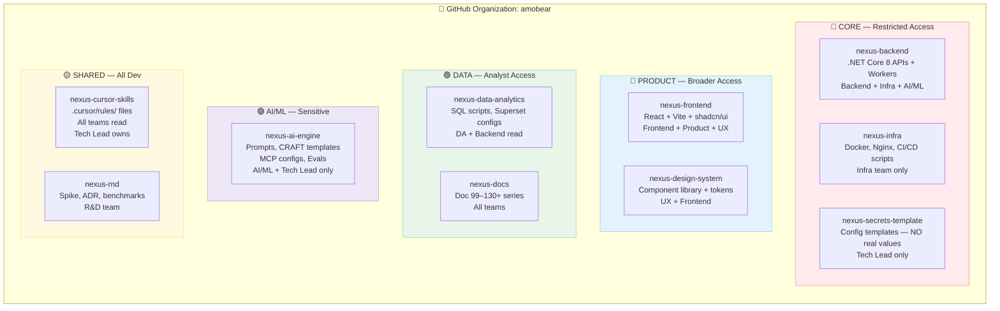
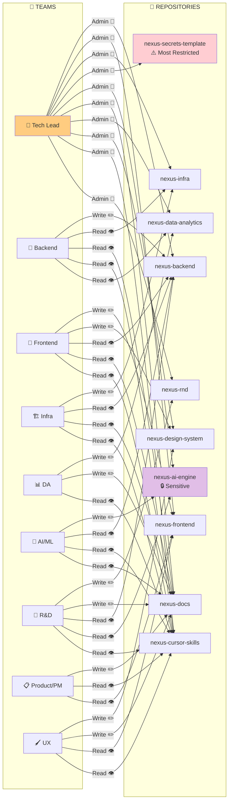
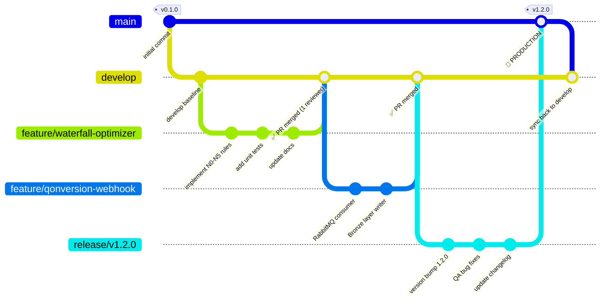
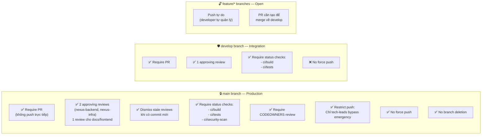
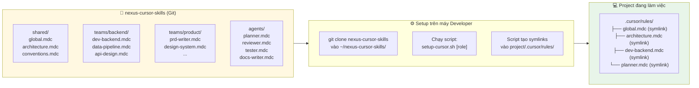

# Doc 130 — Git Organization & Repository Strategy v1.0

> **Classification:** Internal — Confidential  
> **Audience:** Tech Lead, Backend, Infra/DevOps, DA, R&D, AI/ML, Product  
> **Last updated:** April 2026  
> **Owner:** CTO / Tech Lead

---

## Mục lục

1. [Tổng quan & Lý do chọn Multi-repo](#1-tổng-quan--lý-do-chọn-multi-repo)
2. [Danh sách Repositories](#2-danh-sách-repositories)
3. [Cấu trúc thư mục từng Repo](#3-cấu-trúc-thư-mục-từng-repo)
4. [Permission Matrix — Team × Repo](#4-permission-matrix--team--repo)
5. [Branching Strategy](#5-branching-strategy)
6. [Secret Management](#6-secret-management)
7. [Branch Protection & CODEOWNERS](#7-branch-protection--codeowners)
8. [CI/CD Pipeline per Repo](#8-cicd-pipeline-per-repo)
9. [Cursor Skills Integration](#9-cursor-skills-integration)
10. [Rủi ro & Giảm thiểu](#10-rủi-ro--giảm-thiểu)
11. [Checklist Triển khai](#11-checklist-triển-khai)
12. [Document Control](#12-document-control)

---

## 1. Tổng quan & Lý do chọn Multi-repo

### 1.1 Bối cảnh

Amobear Nexus là internal analytics & intelligence platform phục vụ 6 nhóm người dùng nội bộ (Mediation, UA, Product, DA, Marketing, Leadership). Team dev bao gồm 7 nhóm kỹ thuật: Backend, Infra/DevOps, DA, R&D, AI/ML, và Product (PM + UX). Mỗi nhóm có domain knowledge riêng, security requirement khác nhau, và không cần thấy code của nhau.

### 1.2 Monorepo vs Multi-repo — Phân tích

| Tiêu chí | Monorepo | Multi-repo | Quyết định |
|----------|----------|------------|------------|
| Phân quyền per-team | ❌ GitHub không hỗ trợ folder-level permission | ✅ Repo-level RBAC native | **Multi-repo** |
| Secret isolation | ❌ Một repo = một secret scope | ✅ Mỗi repo có GitHub Secrets riêng | **Multi-repo** |
| AI keys & prompts nhạy cảm | ❌ Tất cả thấy được | ✅ `nexus-ai-engine` restricted riêng | **Multi-repo** |
| Infra scripts | ❌ Developer thường không cần thấy | ✅ `nexus-infra` tách biệt | **Multi-repo** |
| CI/CD pipeline độc lập | ⚠️ Phức tạp khi chung repo | ✅ Mỗi repo deploy riêng | **Multi-repo** |
| Data sovereignty (on-premise IDC) | ❌ Khó kiểm soát access | ✅ Restrict theo repo | **Multi-repo** |
| Quản lý nhiều repos | ✅ Không cần | ⚠️ Cần effort quản lý | Trade-off chấp nhận được |
| Cross-repo refactor | ✅ Dễ hơn | ⚠️ Cần phối hợp | Trade-off chấp nhận được |

> **Kết luận:** Với team đa dạng (PM, UX, DA không cần thấy backend code), data sovereignty requirement, và AI credentials nhạy cảm — **Multi-repo là lựa chọn đúng** cho Amobear Nexus.

### 1.3 Kiến trúc tổng quan



**Chú thích màu:**
- 🔴 **Đỏ — Restricted:** Chỉ các role kỹ thuật core mới có access. Chứa business logic, infra scripts, và credentials template.
- 🔵 **Xanh dương — Product:** Frontend và Product team cùng collaborate. Không chứa server-side logic.
- 🟢 **Xanh lá — Data:** DA team làm chủ. SQL và BI configs.
- 🟣 **Tím — AI/ML:** Nhạy cảm nhất sau secrets-template. Chứa system prompts và MCP configs.
- 🟡 **Vàng — Shared:** Tất cả dev đọc được nhưng chỉ Tech Lead có quyền write vào `nexus-cursor-skills`.

---

## 2. Danh sách Repositories

| # | Repository | Visibility | Owner Team | Mô tả ngắn |
|---|-----------|-----------|-----------|------------|
| 1 | `nexus-backend` | Private | tech-leads | .NET Core 8 — APIs, Workers, Hangfire jobs, AI Engine integration |
| 2 | `nexus-infra` | Private | infra-team | Docker Compose, Nginx, CI/CD scripts, monitoring configs |
| 3 | `nexus-secrets-template` | Private | tech-leads | Template files only — không chứa credentials thực |
| 4 | `nexus-ai-engine` | Private | ai-ml-team | CRAFT prompts, MCP configs, knowledge base, eval scripts |
| 5 | `nexus-frontend` | Private | frontend-team | React + Vite + Refine + shadcn/ui dashboard |
| 6 | `nexus-design-system` | Private | ux-team | Component library, design tokens, Storybook |
| 7 | `nexus-data-analytics` | Private | da-team | SQL scripts, Superset dashboard configs, metrics catalog |
| 8 | `nexus-docs` | Private | all-teams | Doc series 99–130+, PRDs, ADRs, release notes |
| 9 | `nexus-cursor-skills` | Private | tech-leads | Cursor `.mdc` rule files cho tất cả teams |
| 10 | `nexus-rnd` | Private | rnd-team | Spike research, benchmarks, PoC experiments |

> **Lưu ý quan trọng:** Tất cả 10 repos đều là **Private**. Không có repo nào Public.

---

## 3. Cấu trúc thư mục từng Repo

### 3.1 `nexus-backend` — Core Platform

```
nexus-backend/
├── src/
│   ├── Nexus.API/                      # ASP.NET Core — REST APIs + SSE Streaming
│   │   ├── Controllers/
│   │   ├── Middleware/                 # Auth, RBAC, Audit logging
│   │   └── Program.cs
│   ├── Nexus.Workers/                  # Background services
│   │   ├── SyncJobs/                   # Dual-job pattern: Daily + Quick-pull
│   │   ├── HangfireJobs/               # Job registration + scheduling
│   │   └── RabbitMQ/                   # Consumers (Qonversion webhook, etc.)
│   ├── Nexus.Core/                     # Domain models, interfaces
│   │   ├── Entities/
│   │   ├── Interfaces/
│   │   └── Constants/                  # Metrics definitions, layer names
│   ├── Nexus.Infrastructure/           # External dependencies
│   │   ├── StarRocks/                  # MySqlConnector — Bronze/Silver/Gold
│   │   ├── PostgreSQL/                 # Npgsql + EF Core 8 + pgvector
│   │   ├── MinIO/                      # amobear-datalake bucket
│   │   ├── Redis/                      # Caching + Pub/Sub
│   │   └── RabbitMQ/                   # Publishers
│   └── Nexus.AI/                       # AI Engine — calls nexus-ai-engine configs
│       ├── Providers/                  # Claude, Gemini, ChatGPT adapters
│       ├── QueryLoop/                  # Agentic query loop (Pattern #1-3)
│       ├── MCP/                        # MCP Proxy client
│       └── SmartRouter/                # Tier 1/2/3 model routing
├── tests/
│   ├── Nexus.UnitTests/
│   │   └── (xUnit + Moq)
│   └── Nexus.IntegrationTests/
│       └── (TestContainers cho DB)
├── .cursor/
│   └── rules/                          # Backend Cursor skills (symlink từ nexus-cursor-skills)
├── appsettings.json                    # Dev defaults — không có credentials thực
├── appsettings.Development.json        # Local dev overrides
├── appsettings.Production.template.json  # Template — xem nexus-secrets-template
├── .gitignore                          # Bắt buộc exclude: *.Production.json, .env
├── .github/
│   ├── CODEOWNERS
│   └── workflows/
│       ├── ci.yml                      # Build + test khi có PR
│       └── deploy.yml                  # Deploy khi merge vào main
└── README.md
```

**Quy tắc quan trọng cho `nexus-backend`:**
- File `appsettings.Production.json` **tuyệt đối không commit** — có trong `.gitignore`
- Mọi credentials đọc từ `IConfiguration` — không hardcode
- `Nexus.AI/` chỉ chứa AI integration code, không chứa prompts (prompts ở `nexus-ai-engine`)

---

### 3.2 `nexus-infra` — Infrastructure as Code

```
nexus-infra/
├── docker/
│   ├── docker-compose.yml              # Full stack: tất cả services
│   ├── docker-compose.override.yml     # Dev local overrides
│   └── nginx/
│       ├── nexus.conf                  # Reverse proxy config
│       └── ssl/                        # Cert paths (không chứa cert files)
├── scripts/
│   ├── deploy.sh                       # Deploy lên IDC server
│   ├── rollback.sh                     # Rollback version
│   ├── backup-postgres.sh              # Theo Doc 105
│   ├── restore-starrocks.sh            # Theo Doc 99e
│   └── secrets-init.sh                 # Setup /etc/nexus/ trên server mới
├── monitoring/
│   ├── prometheus/
│   │   └── prometheus.yml
│   ├── grafana/
│   │   ├── dashboards/                 # Pre-built Nexus dashboards JSON
│   │   └── datasources/
│   └── loki/
│       └── loki-config.yml
├── starrocks/
│   ├── fe.conf                         # FE node config
│   └── be.conf                         # BE node config — chú ý BE IP, không dùng 127.0.0.1
├── .github/
│   └── workflows/
│       └── infra-validate.yml          # Validate docker-compose syntax
└── README.md                           # Setup guide cho server mới
```

> ⚠️ **Chỉ Infra team có Write access.** Deploy scripts nếu lọt ra ngoài = có thể bị abuse để deploy malicious code lên production on-premise.

---

### 3.3 `nexus-secrets-template` — Credentials Templates

```
nexus-secrets-template/
├── README.md                           # Hướng dẫn: đọc file này trước
├── appsettings.Production.template.json
│   # Ví dụ nội dung:
│   # {
│   #   "StarRocks": { "Host": "{{STARROCKS_HOST}}", "Port": 9030 },
│   #   "Claude": { "ApiKey": "{{CLAUDE_API_KEY}}" }
│   # }
├── .env.template
│   # POSTGRES_CONNECTION_STRING={{POSTGRES_CS}}
│   # MINIO_ACCESS_KEY={{MINIO_KEY}}
│   # RABBITMQ_CONNECTION={{RABBITMQ_CS}}
├── github-secrets-list.md              # Danh sách GitHub Secrets cần tạo per repo
└── server-setup/
    ├── secrets-init.sh                 # Script tạo /etc/nexus/ với file thực từ Vault
    └── required-secrets-checklist.md  # Checklist verify trước khi deploy
```

> 🔒 **Tech Lead only.** Repo này không có CI/CD, không có webhooks. Chỉ 2 người tối đa có access: CTO và Infra lead.

---

### 3.4 `nexus-ai-engine` — AI/ML Sensitive Assets

```
nexus-ai-engine/
├── prompts/
│   ├── craft/                          # CRAFT framework templates
│   │   ├── base-template.md            # Context, Role, Action, Format, Tone
│   │   ├── sql-assistant.md
│   │   ├── daily-briefing.md
│   │   └── alert-builder.md
│   ├── system/                         # System prompts per feature
│   │   ├── coordinator-agent.md        # Multi-agent coordinator
│   │   └── worker-agents/              # Revenue, UA, Engagement, Ad Infra workers
│   └── evaluations/                    # Prompt test cases — input/expected output pairs
├── mcp/
│   ├── proxy-config/
│   │   ├── permission-rules.json       # Classify read/write/aggregate queries
│   │   └── rls-config.json             # Row-level security: app_id per user
│   └── server-configs/
│       ├── starrocks-mcp.json          # StarRocks official MCP server config
│       └── postgres-mcp.json           # PostgreSQL MCP server config
├── knowledge-base/
│   ├── metrics-catalog/                # KPI definitions cho AI context
│   ├── waterfall-rules/                # 11 rules N0–N10 (Doc 120)
│   └── app-health-dimensions/          # 8 dimensions (Doc 121)
├── evals/
│   ├── sql-accuracy/                   # Test SQL generation accuracy
│   ├── vietnamese-quality/             # Test Vietnamese output quality
│   └── cost-tracking/                  # Token cost benchmarks per feature
└── .github/
    └── workflows/
        └── eval-ci.yml                 # Chạy evals khi prompts thay đổi
```

> 🟣 **AI/ML team + Tech Lead only.** Prompts là intellectual property — nếu lộ ra ngoài, competitor có thể reverse-engineer logic waterfall optimization.

---

### 3.5 `nexus-frontend` — Dashboard UI

```
nexus-frontend/
├── src/
│   ├── components/                     # Dùng components từ nexus-design-system
│   │   └── (import as npm package hoặc submodule)
│   ├── pages/                          # Route-based pages
│   ├── features/                       # Per-team feature modules
│   │   ├── mediation/                  # Waterfall, SoW, Floor price
│   │   ├── ua/                         # Campaign, CPI, ROAS
│   │   ├── product/                    # Retention, Sessions
│   │   ├── da/                         # Ad-hoc queries
│   │   └── ai-chat/                    # AI SQL Assistant + SSE streaming
│   ├── hooks/                          # Custom React hooks
│   ├── lib/
│   │   ├── api-client.ts               # Typed API client
│   │   └── sse-client.ts               # SSE streaming client
│   └── i18n/                           # Vietnamese localization
├── .cursor/
│   └── rules/                          # Frontend Cursor skills (symlink)
├── .github/
│   └── workflows/
│       ├── ci-frontend.yml             # Build + lint + unit test
│       └── deploy-frontend.yml         # Deploy Docker image
└── README.md
```

---

### 3.6 `nexus-design-system` — Component Library

```
nexus-design-system/
├── src/
│   ├── tokens/
│   │   ├── colors.ts                   # Nexus palette (primary, success, warning, danger)
│   │   ├── spacing.ts
│   │   └── typography.ts
│   ├── components/                     # shadcn/ui customizations + extensions
│   │   ├── KpiCard/                    # Value + delta % + trend arrow
│   │   ├── DataTable/                  # Sortable + paginated + export CSV
│   │   ├── AppHealthRadar/             # 8-dimension radar chart
│   │   └── AiStreamingChat/            # SSE streaming UI
│   └── charts/                         # Recharts wrappers với Nexus defaults
│       ├── RevenueLineChart.tsx
│       └── WaterfallBarChart.tsx
├── storybook/                          # Component documentation + visual tests
├── .cursor/
│   └── rules/
│       ├── design-system.mdc
│       └── ux-patterns.mdc
└── CHANGELOG.md                        # Semantic versioning: MAJOR.MINOR.PATCH
```

---

### 3.7 `nexus-data-analytics` — SQL & BI

```
nexus-data-analytics/
├── sql/
│   ├── bronze/                         # Raw layer — lookup queries
│   │   ├── admob/
│   │   ├── applovin/
│   │   └── appsflyer/
│   ├── silver/                         # Transform + clean scripts
│   ├── gold/                           # Aggregation views — KPI calculations
│   │   ├── revenue/                    # Anti-double-count enforced here
│   │   ├── ua/
│   │   └── engagement/
│   └── reports/                        # Ad-hoc report templates
├── superset/
│   ├── dashboards/                     # Dashboard configs (JSON export từ Superset)
│   │   ├── ad-ops-dashboard.json
│   │   ├── ua-dashboard.json
│   │   └── executive-dashboard.json
│   └── datasets/                       # Dataset definitions
├── metrics/
│   └── catalog.md                      # ✅ SINGLE SOURCE OF TRUTH cho tất cả KPI definitions
│                                       # Mọi team tham chiếu file này khi cần KPI formula
├── .cursor/
│   └── rules/
│       ├── sql-analytics.mdc
│       └── metrics-catalog.mdc
└── data-quality/
    └── validation-queries/             # Queries để kiểm tra data integrity
```

---

### 3.8 `nexus-docs` — Documentation Hub

```
nexus-docs/
├── platform/                           # Core platform docs
│   ├── 99-MEDIATION-PRO-PLATFORM.md
│   ├── 100-DATA-LAYER.md
│   └── ...
├── integrations/                       # Data source integration docs
│   ├── 110-FIREBASE-BIGQUERY.md
│   ├── 114-ADJUST.md
│   ├── 117-APPMETRICA.md
│   ├── 126-QONVERSION.md
│   ├── 127-APPLE-APPSTORE.md
│   ├── 128-APPSFLYER.md
│   └── ...
├── ai/                                 # AI Engine docs
│   ├── 122-AI-ARCHITECTURE.md
│   ├── 123-NEXUS-AI-ENGINE-V2.md
│   └── ...
├── infrastructure/                     # Ops docs
│   ├── 103-DOCKER-DEPLOYMENT.md
│   ├── 104-SERVER-RESOURCE.md
│   └── 105-SCHEDULED-BACKUP.md
├── git/
│   └── 130-GIT-ORGANIZATION-STRATEGY.md  # ← File này
├── prd/                                # PRDs — PM writes here
│   └── TEMPLATE-PRD.md
├── decisions/                          # ADR files — R&D writes here
│   └── TEMPLATE-ADR.md
└── releases/                           # Release notes — PM writes here
    └── CHANGELOG.md
```

---

### 3.9 `nexus-cursor-skills` — AI Coding Assistant Rules

```
nexus-cursor-skills/
├── shared/                             # alwaysApply: true — mọi team đều inject
│   ├── global.mdc                      # Stack + anti-patterns + Bronze/Silver/Gold rules
│   ├── architecture.mdc               # Nexus system design + integration map
│   └── conventions.mdc                # Naming, doc format, commit messages
├── agents/                             # Cross-team agents
│   ├── planner.mdc
│   ├── reviewer.mdc
│   ├── tester.mdc
│   └── docs-writer.mdc
├── teams/
│   ├── backend/
│   │   ├── dev-backend.mdc
│   │   ├── data-pipeline.mdc
│   │   └── api-design.mdc
│   ├── infra/
│   │   ├── infra-docker.mdc
│   │   ├── starrocks-ops.mdc
│   │   ├── observability.mdc
│   │   └── security-ops.mdc
│   ├── da/
│   │   ├── sql-analytics.mdc
│   │   ├── metrics-catalog.mdc
│   │   └── dashboard-design.mdc
│   ├── ai/
│   │   ├── ai-feature.mdc
│   │   ├── prompt-craft.mdc
│   │   ├── mcp-integration.mdc
│   │   └── eval-ai.mdc
│   ├── rnd/
│   │   ├── spike-research.mdc
│   │   ├── adr-writer.mdc
│   │   └── benchmark-eval.mdc
│   └── product/
│       ├── product-context.mdc
│       ├── prd-writer.mdc
│       ├── feature-prioritize.mdc
│       ├── metrics-product.mdc
│       ├── release-notes.mdc
│       ├── design-system.mdc
│       ├── ux-patterns.mdc
│       ├── prototype-spec.mdc
│       ├── accessibility.mdc
│       └── ux-review.mdc
└── SETUP.md                            # Hướng dẫn setup cho từng role
```

**Cách dùng `nexus-cursor-skills`:**
1. Mỗi developer clone repo này về local
2. Trong project đang làm việc, tạo symlink:
   ```bash
   # Ví dụ cho Backend developer
   mkdir -p .cursor/rules
   ln -s ~/nexus-cursor-skills/shared/* .cursor/rules/
   ln -s ~/nexus-cursor-skills/teams/backend/* .cursor/rules/
   ln -s ~/nexus-cursor-skills/agents/* .cursor/rules/
   ```
3. Hoặc dùng script `SETUP.md` tương ứng với role

---

### 3.10 `nexus-rnd` — Research & Development

```
nexus-rnd/
├── spikes/                             # Time-boxed research (max 3 ngày/spike)
│   ├── TEMPLATE-SPIKE.md
│   └── [YYYY-MM]-[topic]/
│       ├── README.md                   # Problem, Hypothesis, Findings, Recommendation
│       └── poc/                        # PoC code — không phải production code
├── decisions/                          # ADR — Architecture Decision Records
│   ├── TEMPLATE-ADR.md
│   └── adr-001-reject-openclaw.md      # Ví dụ: OpenClaw rejection
├── benchmarks/
│   ├── starrocks-query-perf/           # EXPLAIN ANALYZE results
│   └── ai-model-comparison/            # Accuracy + cost + latency per model
└── .cursor/
    └── rules/
        ├── spike-research.mdc
        ├── adr-writer.mdc
        └── benchmark-eval.mdc
```

---

## 4. Permission Matrix — Team × Repo

### 4.1 GitHub Teams

```
GitHub Organization: amobear
└── Teams:
    ├── tech-leads          ← CTO + Senior engineers — Admin tất cả repos
    ├── backend-team        ← .NET Core engineers
    ├── frontend-team       ← React developers
    ├── infra-team          ← DevOps / Infra engineers
    ├── da-team             ← Data Analysts
    ├── ai-ml-team          ← AI/ML engineers
    ├── rnd-team            ← R&D engineers
    ├── product-team        ← PM + UX Designers
    └── all-devs            ← Parent team — Read access chung
```

### 4.2 Permission Matrix



### 4.3 Permission Table — Chi tiết

| Repository | tech-leads | backend | frontend | infra | da | ai-ml | rnd | product/ux |
|-----------|:----------:|:-------:|:--------:|:-----:|:--:|:-----:|:---:|:----------:|
| nexus-backend | **Admin** | Write | Read | Read | — | Read | Read | — |
| nexus-frontend | **Admin** | Read | Write | Read | — | — | — | Read |
| nexus-infra | **Admin** | Read | — | Write | — | — | — | — |
| nexus-secrets-template | **Admin** | — | — | — | — | — | — | — |
| nexus-ai-engine | **Admin** | Read | — | — | — | Write | Read | — |
| nexus-docs | **Admin** | Write | Write | Write | Write | Write | Write | Write |
| nexus-data-analytics | **Admin** | Read | — | — | Write | Read | — | Read |
| nexus-design-system | **Admin** | Read | Write | — | — | — | — | Write |
| nexus-cursor-skills | **Admin** | Read | Read | Read | Read | Read | Read | Read |
| nexus-rnd | **Admin** | Read | — | — | — | Read | Write | Read |

**Chú giải:**
- **Admin**: Toàn quyền — manage settings, add/remove members, delete branches, bypass protections
- **Write**: Push to branches, create PRs, merge (nếu đủ approval)
- **Read**: Clone, pull, tạo PR từ fork — không push trực tiếp
- **—**: Không có access, không thấy repo

---

## 5. Branching Strategy

### 5.1 Mô hình — Simplified Git Flow



### 5.2 Branch Naming Convention

| Pattern | Dùng khi | Ví dụ |
|---------|----------|-------|
| `feature/[ticket-id]-[short-desc]` | Tính năng mới | `feature/NX-142-appsflyer-master-api` |
| `fix/[ticket-id]-[short-desc]` | Bug fix | `fix/NX-201-starrocks-stream-load-ip` |
| `hotfix/[version]-[desc]` | Emergency fix trên production | `hotfix/v1.2.1-revenue-double-count` |
| `release/v[X.Y.Z]` | Chuẩn bị release | `release/v1.3.0` |
| `chore/[desc]` | Maintenance, upgrade deps | `chore/upgrade-dotnet-8-2` |
| `docs/[desc]` | Chỉ sửa documentation | `docs/update-doc-128-appsflyer` |

### 5.3 Quy tắc Branch

```
main            → Production. Chỉ merge từ release/* hoặc hotfix/*.
                  Protected: cần 2 approvals + CI pass.

develop         → Integration branch. Feature branches merge vào đây.
                  Protected: cần 1 approval + CI pass.

feature/*       → Tạo từ develop. Merge về develop qua PR.
release/*       → Tạo từ develop khi sẵn sàng release. Merge về main + develop.
hotfix/*        → Tạo từ main. Merge về main + develop.
```

### 5.4 Commit Message Convention

```
[type]([scope]): [short description]

Types: feat, fix, docs, refactor, test, chore, perf, ci
Scope: backend, frontend, infra, ai, da, docs

Ví dụ:
feat(backend): add Qonversion webhook consumer with RabbitMQ
fix(backend): replace 127.0.0.1 with actual StarRocks BE host IP
docs(integrations): update Doc 128 AppsFlyer Master API field names
perf(da): add partition pruning to gold revenue aggregation query
```

---

## 6. Secret Management

### 6.1 Nguyên tắc cốt lõi

> **KHÔNG BAO GIỜ commit credentials thực vào Git** — kể cả trong private repos.

### 6.2 Luồng quản lý secrets — 3 tầng

```mermaid
flowchart TB
    subgraph Never["❌ TUYỆT ĐỐI KHÔNG vào Git"]
        N1["appsettings.Production.json<br>(real values)"]
        N2[".env files với credentials thực"]
        N3["API keys: Claude, Gemini, AdMob, AppsFlyer..."]
        N4["Database passwords: StarRocks, PostgreSQL, MinIO"]
        N5["RabbitMQ credentials"]
        N6["SSH private keys"]
    end

    subgraph InGit["✅ ĐƯỢC PHÉP vào Git"]
        G1["nexus-secrets-template repo<br>appsettings.Production.template.json<br>(placeholders như {{CLAUDE_API_KEY}})"]
        G2[".env.example<br>(variable names chỉ, không có values)"]
        G3[".gitignore<br>(enforce exclusion rules)"]
        G4["github-secrets-list.md<br>(danh sách tên secret cần tạo)"]
    end

    subgraph Store["🏦 LƯU TRỮ THỰC TẾ"]
        V1["GitHub Secrets<br>→ Dùng trong CI/CD workflows"]
        V2["Server: /etc/nexus/<br>→ Docker volume mount<br>chmod 600, owner: root"]
        V3["1Password / Bitwarden Teams<br>→ Shared credential manager<br>cho team"]
    end

    subgraph Inject["⚙️ INJECT VÀO APP"]
        C1["GitHub Actions<br>→ đọc GitHub Secrets<br>→ inject vào build/deploy env"]
        C2["Docker Compose volumes<br>→ mount /etc/nexus/ → /app/config/<br>→ read-only (:ro)"]
    end

    subgraph Guard["🛡️ BẢO VỆ — Tự động"]
        P1["git-secrets<br>→ scan trước khi commit<br>→ block nếu phát hiện pattern"]
        P2["GitHub Secret Scanning<br>→ scan tất cả pushes<br>→ alert nếu lộ credentials"]
        P3["CI Secret Scan<br>→ truffleHog trong CI pipeline<br>→ fail build nếu phát hiện"]
    end

    Never -.->|"git-secrets chặn"| Guard
    InGit --> Store
    Store --> Inject
    Guard --> InGit

    style Never fill:#ffcdd2,stroke:#e57373
    style InGit fill:#e8f5e9,stroke:#81c784
    style Store fill:#fff3e0,stroke:#ffb74d
    style Inject fill:#e3f2fd,stroke:#64b5f6
    style Guard fill:#fce4ec,stroke:#f48fb1
```



### 6.3 `.gitignore` bắt buộc — mọi repo

```gitignore
# === SECRETS & CREDENTIALS ===
appsettings.Production.json
appsettings.Staging.json
appsettings.*.Local.json
.env
.env.local
.env.production
.env.staging
secrets/
*.pfx
*.p12
*.key
*.pem

# === AI PROVIDER KEYS (extra safety) ===
*api-key*
*api_key*
*secret-key*
*secret_key*

# === IDE ===
.cursor/
.idea/
.vscode/settings.json

# === BUILD ARTIFACTS ===
bin/
obj/
dist/
node_modules/
```

### 6.4 GitHub Secrets per Repository

```
nexus-backend (GitHub Secrets):
├── STARROCKS_HOST              # BE node IP — không phải 127.0.0.1
├── STARROCKS_PORT              # 9030
├── POSTGRES_CONNECTION_STRING
├── REDIS_CONNECTION_STRING
├── RABBITMQ_CONNECTION
├── MINIO_ENDPOINT
├── MINIO_ACCESS_KEY
├── MINIO_SECRET_KEY
├── CLAUDE_API_KEY
├── GEMINI_API_KEY
└── OPENAI_API_KEY

nexus-infra (GitHub Secrets):
├── IDC_SERVER_HOST             # Server IP tại IDC
├── IDC_SERVER_SSH_KEY          # SSH private key (deploy user)
└── DOCKER_REGISTRY_TOKEN       # Nếu dùng private registry

nexus-frontend (GitHub Secrets):
└── VITE_API_BASE_URL           # Backend API endpoint
```

### 6.5 Server-side Secret Storage

```bash
# Cấu trúc thư mục trên IDC server
/etc/nexus/
├── appsettings.Production.json     # chmod 600, owner: nexus-svc
├── .env.production                 # Docker env file
└── ssl/
    ├── nexus.crt                   # TLS certificate
    └── nexus.key                   # chmod 600

# docker-compose.yml — volume mount
services:
  nexus-api:
    user: "nexus-svc"
    volumes:
      - /etc/nexus/appsettings.Production.json:/app/appsettings.Production.json:ro
      # :ro = read-only — container không thể sửa file
```

---

## 7. Branch Protection & CODEOWNERS

### 7.1 Branch Protection Rules



### 7.2 CODEOWNERS Files

**`nexus-backend` CODEOWNERS:**
```
# Mặc định: Tech Lead review tất cả
*                               @amobear/tech-leads

# AI code: AI team phải review
src/Nexus.AI/                   @amobear/ai-ml-team @amobear/tech-leads

# Sync jobs: Backend team
src/Nexus.Workers/              @amobear/backend-team

# Infrastructure config: Infra team
.github/                        @amobear/infra-team @amobear/tech-leads
appsettings*.template.json      @amobear/tech-leads
```

**`nexus-docs` CODEOWNERS:**
```
# PRDs: PM team owns
docs/prd/                       @amobear/product-team

# ADRs: R&D + Tech Lead
docs/decisions/                 @amobear/rnd-team @amobear/tech-leads

# Integration docs: Backend team verify
docs/integrations/              @amobear/backend-team @amobear/tech-leads

# Release notes: PM owns
docs/releases/                  @amobear/product-team
```

**`nexus-cursor-skills` CODEOWNERS:**
```
# Tech Lead owns tất cả — đây là "DNA" của team
*                               @amobear/tech-leads
```

---

## 8. CI/CD Pipeline per Repo

### 8.1 Tổng quan CI/CD Flow

```mermaid
flowchart TB
    subgraph Trigger["🔔 TRIGGERS"]
        T1["PR opened/updated<br>→ develop hoặc main"]
        T2["Push to main<br>→ sau merge"]
    end

    subgraph CISteps["⚙️ CI PIPELINE — Chạy mọi PR"]
        CI1["1️⃣ Checkout code"]
        CI2["2️⃣ Secret scan<br>(git-secrets + truffleHog)<br>→ Fail fast nếu phát hiện"]
        CI3["3️⃣ Build<br>(.NET build / npm build)"]
        CI4["4️⃣ Unit tests<br>(xUnit / Vitest)"]
        CI5["5️⃣ Integration tests<br>(TestContainers)"]
        CI6["6️⃣ Dependency scan<br>(OWASP / npm audit)"]
        CI7["7️⃣ Lint + format check"]
        CI8["✅ All checks pass<br>→ PR ready to review"]
    end

    subgraph CDSteps["🚀 CD PIPELINE — Chỉ khi merge vào main"]
        CD1["1️⃣ Build Docker image"]
        CD2["2️⃣ Tag image với Git SHA + version"]
        CD3["3️⃣ Push to Docker registry<br>(private, on-premise)"]
        CD4["4️⃣ SSH vào IDC server"]
        CD5["5️⃣ Pull new image"]
        CD6["6️⃣ docker-compose up -d<br>(zero-downtime rolling)"]
        CD7["7️⃣ Health check<br>(curl /health endpoint)"]
        CD8["8️⃣ Notify team<br>(Telegram / Slack)"]
        CD9{"Health OK?"}
        CD10["✅ Deploy success"]
        CD11["❌ Auto-rollback<br>(docker-compose với image cũ)"]
    end

    T1 --> CISteps
    T2 --> CDSteps
    CI1 --> CI2 --> CI3 --> CI4 --> CI5 --> CI6 --> CI7 --> CI8
    CD1 --> CD2 --> CD3 --> CD4 --> CD5 --> CD6 --> CD7 --> CD9
    CD9 -->|"Yes"| CD10
    CD9 -->|"No"| CD11

    style CI2 fill:#ffcdd2
    style CD11 fill:#ffcdd2
    style CD10 fill:#e8f5e9
```



### 8.2 CI Workflow — `nexus-backend`

```yaml
# .github/workflows/ci.yml
name: CI — nexus-backend

on:
  pull_request:
    branches: [main, develop]

jobs:
  security-scan:
    runs-on: ubuntu-latest
    steps:
      - uses: actions/checkout@v4
        with:
          fetch-depth: 0  # Full history cho truffleHog

      - name: Secret scan — truffleHog
        uses: trufflesecurity/trufflehog@main
        with:
          path: ./
          base: ${{ github.event.repository.default_branch }}
          head: HEAD

  build-and-test:
    needs: security-scan
    runs-on: ubuntu-latest
    steps:
      - uses: actions/checkout@v4

      - name: Setup .NET 8
        uses: actions/setup-dotnet@v4
        with:
          dotnet-version: '8.0.x'

      - name: Build
        run: dotnet build --configuration Release

      - name: Unit tests
        run: dotnet test tests/Nexus.UnitTests/ --configuration Release

      - name: Integration tests
        run: dotnet test tests/Nexus.IntegrationTests/ --configuration Release
        env:
          # Dùng GitHub Secrets cho integration test DB
          TEST_POSTGRES_CS: ${{ secrets.TEST_POSTGRES_CS }}
```

### 8.3 CD Workflow — Deploy to IDC

```yaml
# .github/workflows/deploy.yml
name: Deploy — nexus-backend → Production

on:
  push:
    branches: [main]

jobs:
  deploy:
    runs-on: ubuntu-latest
    steps:
      - uses: actions/checkout@v4

      - name: Build Docker image
        run: |
          docker build -t nexus-backend:${{ github.sha }} .
          docker tag nexus-backend:${{ github.sha }} nexus-backend:latest

      - name: Deploy to IDC server
        uses: appleboy/ssh-action@v1
        with:
          host: ${{ secrets.IDC_SERVER_HOST }}
          username: deploy
          key: ${{ secrets.IDC_SERVER_SSH_KEY }}
          script: |
            cd /opt/nexus
            docker pull nexus-backend:${{ github.sha }}
            docker-compose up -d nexus-api
            sleep 10
            # Health check
            curl --fail http://localhost:5000/health || \
              (docker-compose up -d --scale nexus-api=0 && exit 1)

      - name: Notify team
        if: always()
        run: |
          # Gửi Telegram notification
          STATUS=${{ job.status }}
          curl -s "https://api.telegram.org/bot${{ secrets.TELEGRAM_BOT_TOKEN }}/sendMessage" \
            -d "chat_id=${{ secrets.TELEGRAM_CHAT_ID }}" \
            -d "text=Deploy nexus-backend: $STATUS (v${{ github.sha }})"
```

---

## 9. Cursor Skills Integration

### 9.1 Cách setup Cursor Skills từ `nexus-cursor-skills`



### 9.2 `setup-cursor.sh` script

```bash
#!/bin/bash
# Usage: ./setup-cursor.sh [role]
# Roles: backend, frontend, infra, da, ai, rnd, pm, ux

ROLE=$1
SKILLS_ROOT=~/nexus-cursor-skills
RULES_DIR=$(pwd)/.cursor/rules

mkdir -p $RULES_DIR

# Luôn link shared skills
ln -sf $SKILLS_ROOT/shared/*.mdc $RULES_DIR/

# Luôn link shared agents
ln -sf $SKILLS_ROOT/agents/*.mdc $RULES_DIR/

# Link role-specific skills
case $ROLE in
  backend)  ln -sf $SKILLS_ROOT/teams/backend/*.mdc $RULES_DIR/ ;;
  frontend) ln -sf $SKILLS_ROOT/teams/frontend/*.mdc $RULES_DIR/ ;;
  infra)    ln -sf $SKILLS_ROOT/teams/infra/*.mdc $RULES_DIR/ ;;
  da)       ln -sf $SKILLS_ROOT/teams/da/*.mdc $RULES_DIR/ ;;
  ai)       ln -sf $SKILLS_ROOT/teams/ai/*.mdc $RULES_DIR/ ;;
  rnd)      ln -sf $SKILLS_ROOT/teams/rnd/*.mdc $RULES_DIR/ ;;
  pm|ux)    ln -sf $SKILLS_ROOT/teams/product/*.mdc $RULES_DIR/ ;;
  *)        echo "Unknown role: $ROLE"; exit 1 ;;
esac

echo "✅ Cursor skills setup for role: $ROLE"
echo "📁 Rules linked to: $RULES_DIR"
ls $RULES_DIR
```

---

## 10. Rủi ro & Giảm thiểu

```mermaid
flowchart TB
    subgraph Risks["⚠️ RISKS — Sorted by Severity"]
        subgraph Critical["🔴 Critical"]
            R1["Secrets committed to Git<br>Impact: Data breach, API key leak"]
            R2["nexus-infra scripts exposed<br>Impact: Malicious deploy to production"]
            R3["nexus-ai-engine prompts leaked<br>Impact: IP theft, competitor advantage"]
        end

        subgraph High["🟠 High"]
            R4["main branch unprotected<br>Impact: Accidental deploy, bad code to prod"]
            R5["force push to main<br>Impact: History rewrite, lost commits"]
            R6["CODEOWNERS outdated<br>Impact: Wrong reviewer, unreviewed code"]
        end

        subgraph Medium["🟡 Medium"]
            R7["nexus-cursor-skills outdated<br>Impact: Agent context wrong, bad code generated"]
            R8["Cross-repo version mismatch<br>Impact: API contract broken between frontend/backend"]
            R9["Too many repos → context switch overhead<br>Impact: Developer productivity"]
        end
    end

    subgraph Mitigations["✅ MITIGATIONS"]
        M1["git-secrets + truffleHog CI<br>Scan mọi commit và PR"]
        M2["Permission matrix enforce<br>Only infra-team has Write access"]
        M3["ai-ml-team + tech-leads only<br>Branch protection + CODEOWNERS"]
        M4["Branch protection rules<br>2 approvals + CI pass required"]
        M5["No force push rule<br>Enabled in branch protection"]
        M6["CODEOWNERS review monthly<br>Schedule trong sprint planning"]
        M7["Tech Lead owns nexus-cursor-skills<br>Monthly review trigger"]
        M8["API versioning strategy<br>Contract tests giữa fe/be"]
        M9["SETUP.md rõ ràng<br>Clear onboarding guide per role"]
    end

    R1 --> M1
    R2 --> M2
    R3 --> M3
    R4 --> M4
    R5 --> M5
    R6 --> M6
    R7 --> M7
    R8 --> M8
    R9 --> M9

    style Critical fill:#ffcdd2,stroke:#e57373
    style High fill:#ffe0b2,stroke:#ffb74d
    style Medium fill:#fff9c4,stroke:#f9a825
```



### 10.1 Chi tiết Risk Mitigation

| Risk | Severity | Mitigation | Owner | Frequency |
|------|----------|------------|-------|-----------|
| Secrets committed | 🔴 Critical | git-secrets local + truffleHog CI | Tech Lead | Every commit |
| Infra scripts exposed | 🔴 Critical | nexus-infra: Write = infra-team only | Tech Lead | Setup once |
| AI prompts leaked | 🔴 Critical | nexus-ai-engine: Write = ai-ml + tech-leads | Tech Lead | Setup once |
| Unprotected main | 🟠 High | Branch protection rules | Tech Lead | Setup once |
| Outdated CODEOWNERS | 🟠 High | Review khi có team change | Tech Lead | Monthly |
| Stale cursor skills | 🟡 Medium | Review khi architectural change | Tech Lead | Per sprint |
| API contract break | 🟡 Medium | Contract tests + semantic versioning | Backend + Frontend | Per PR |

---

## 11. Checklist Triển khai

### Tuần 1 — Foundation (Ưu tiên cao)

**Ngày 1–2: GitHub Organization Setup**
- [ ] Tạo GitHub Organization `amobear` (hoặc verify đã có)
- [ ] Tạo 10 repositories, tất cả **Private**
- [ ] Tạo 8 GitHub Teams với đúng members
- [ ] Assign team permissions theo Permission Matrix (Section 4.3)

**Ngày 3: Branch Protection**
- [ ] Enable branch protection cho `main` — tất cả repos
- [ ] Set required reviewers: 2 cho nexus-backend/nexus-infra, 1 cho còn lại
- [ ] Enable "Dismiss stale reviews"
- [ ] Disable force push và branch deletion trên `main`
- [ ] Create `develop` branch và set protection (1 reviewer + CI)

**Ngày 4: Code Migration**
- [ ] Migrate code hiện tại vào đúng repos theo cấu trúc Section 3
- [ ] Verify `.gitignore` đúng trong mọi repo (Section 6.3)
- [ ] Tạo `CODEOWNERS` cho nexus-backend và nexus-infra (Section 7.2)

**Ngày 5: Secret Management**
- [ ] Cài `git-secrets` trên máy của toàn bộ developers
- [ ] Enable GitHub Secret Scanning cho Organization
- [ ] Tạo `nexus-secrets-template` repo với template files
- [ ] Setup GitHub Secrets cho CI/CD (Section 6.4)
- [ ] Setup `/etc/nexus/` trên IDC server (Section 6.5)

### Tuần 2 — CI/CD & Skills

**Ngày 6–7: CI/CD Pipelines**
- [ ] Setup CI workflow cho nexus-backend (Section 8.2)
- [ ] Setup CD workflow cho deploy đến IDC server (Section 8.3)
- [ ] Setup CI cho nexus-frontend
- [ ] Test end-to-end: feature PR → CI → merge develop → merge main → deploy

**Ngày 8–9: Cursor Skills**
- [ ] Populate `nexus-cursor-skills` với tất cả `.mdc` files
- [ ] Viết `SETUP.md` với hướng dẫn per role
- [ ] Test `setup-cursor.sh` script cho Backend + AI roles
- [ ] Distribute và onboard toàn team

**Ngày 10: Documentation & Brief**
- [ ] Commit Doc 130 này vào `nexus-docs`
- [ ] Tổ chức 30-phút brief cho toàn team:
  - Ai access repo nào
  - Branching workflow
  - Không bao giờ commit secrets
  - Cách dùng Cursor skills

### Ongoing Maintenance

- [ ] **Hàng tháng:** Review CODEOWNERS, update nếu team thay đổi
- [ ] **Mỗi sprint:** Check nexus-cursor-skills — có architectural change cần update không?
- [ ] **Quarterly:** Audit access log — ai đã clone/access nexus-secrets-template và nexus-ai-engine
- [ ] **Khi có team member mới:** Chạy SETUP.md guide, assign đúng GitHub Teams

---

## 12. Document Control

| Version | Date | Changes | Author |
|---------|------|---------|--------|
| 1.0 | Apr 2026 | Initial version — Git Organization Strategy cho Nexus full team | CTO Advisory |

---

> **Prepared by CTO Advisory for Amobear Nexus**  
> *Classification: Internal — Confidential*  
> *Tài liệu này mô tả toàn bộ Git organization strategy cho Amobear Nexus platform. Xem Doc 103 (Docker Deployment), Doc 105 (Scheduled Backup), Doc 122 (AI Architecture) để biết thêm chi tiết triển khai.*
