# 133 — Amobear Nexus: Đánh giá Tiến hóa Kiến trúc Triển khai

> **Bối cảnh:** Cập nhật dựa trên 4 dữ kiện thực tế từ vận hành Q2/2026
> 
> **Tham chiếu:** Doc 99 (Platform), Doc 112 (Deployment Arch v1.2), Doc 120 (Multi-Mediation), Doc 100 (Storage)
>
> **Phiên bản:** 1.1 — 2026-05-13
>
> **Mục tiêu:** Đề xuất tiến hóa kiến trúc để đạt khả năng **báo cáo đa chiều ở quy mô MMP** (tương tự Adjust / AppsFlyer / XMP)
>
> **Changelog:**
> - v1.0 — 4 vấn đề ban đầu (service split, StarRocks tier, Hangfire/Airflow, MMP reporting)
> - v1.1 — Bổ sung Section 8 (multi-format raw → curated lake 2-layer) và Section 9 (Cloud-native trên Google Cloud — GKE thay Docker Compose/Swarm)

---

## 0. TÓM TẮT ĐIỀU HÀNH (Executive Summary)

### 0.1 Bốn dữ kiện đang định hình lại kiến trúc

| # | Dữ kiện thực tế | Hệ quả | Mức độ cấp bách |
|---|----------------|--------|-----------------|
| 1 | API + Jobs + Reporting trên cùng monorepo & cùng 1 VM-APP | Mỗi lần deploy gián đoạn toàn bộ — không thể scale từng phần | 🔴 Cao |
| 2 | StarRocks Bronze phình to: **8 bảng > 100 GB**, top table 122 GB / 610 M rows (Firebase events) | Query Bronze chậm, compaction lag, BE disk áp lực; PO/DA query bừa gây contention | 🔴 Rất cao |
| 3 | **75+ Hangfire jobs** với dependency chéo (Bronze → Silver → Gold → Digest → Alert) | Không có DAG, khó backfill, retry rời rạc, không quan sát được lineage | 🟡 Cao |
| 4 | Mục tiêu: báo cáo đa chiều như Adjust / XMP | Cần resource isolation, MV strategy, caching layer, read replica | 🟡 Trung bình |

### 0.2 Khuyến nghị tổng — 4 hướng song song

```
①  TÁCH DỊCH VỤ          → Monorepo source giữ nguyên, nhưng deploy thành 5 process độc lập
                           (API · Reporting · Jobs-Sync · Jobs-Transform · AI/Digest)

②  STARROCKS TIER HÓA   → Bronze "raw" Firebase chuyển sang Iceberg/Parquet trên MinIO,
                           StarRocks chỉ giữ Silver+Gold hot data. Bronze truy vấn qua
                           External Catalog. Áp Resource Groups tách BI vs DA workload.

③  HANGFIRE + AIRFLOW    → Hybrid: Hangfire giữ cho job operational (token, write-back);
                           Airflow/Dagster cho data pipeline có DAG (Bronze→Silver→Gold).

④  MMP-GRADE REPORTING   → MV strategy đa tầng (1d/7d/30d/90d) · Redis Query Cache layer
                           · Pre-aggregated cube cho top dimensions · Read-only BE pool
                           cho heavy analytics queries.
```

### 0.3 ROI dự kiến

| Vấn đề hiện tại | Sau khi áp dụng | Cách đo |
|----------------|----------------|---------|
| Deploy → API gián đoạn 5–10s | Deploy chỉ ảnh hưởng service được deploy | Uptime API |
| Bronze chiếm ~500 GB / BE | Bronze nóng < 100 GB; phần còn lại trên MinIO | BE disk usage |
| Query Bronze 30s–2min | Query Silver/Gold < 2s ; Bronze ad-hoc 5–15s | P95 latency |
| PO query làm chậm dashboard production | Workload tách biệt, không ảnh hưởng | Resource Group metrics |
| Job fail không retry theo dependency | DAG-aware retry, backfill 1 lệnh | Airflow runs success rate |

---

## 1. PHÂN TÁCH DỊCH VỤ — Từ Monolith sang Modular Deployment

### 1.1 Hiện trạng — vì sao đau

```
                       VM-APP (4 core / 8 GB)
                       ┌────────────────────────────┐
                       │  Nginx                     │
                       │  MediationPro.API  ──┐     │
                       │  Hangfire Worker  ───┼─── chung 1 process / 1 image  
                       │  AI Engine        ───┘     │
                       │  Redis · RabbitMQ          │
                       └────────────────────────────┘

  Mỗi lần `docker compose up -d api hangfire`:
    • Tất cả Hangfire jobs đang chạy bị kill (kể cả job đã chạy 25 phút)
    • API gián đoạn 5–10s — user thấy 502
    • AI streaming connection bị reset
    • Không thể scale riêng Jobs khi cần backfill nặng
```

### 1.2 Đề xuất — Tách thành 5 deployable services, giữ 1 monorepo

> **Nguyên tắc:** **Source code monorepo** (DRY, shared domain), **build artifacts riêng** (5 images), **deploy độc lập**.
>
> Không phải vi-dịch-vụ-full — đây là **modular monolith deploy mode**, chi phí thấp nhất, hiệu quả ngay.

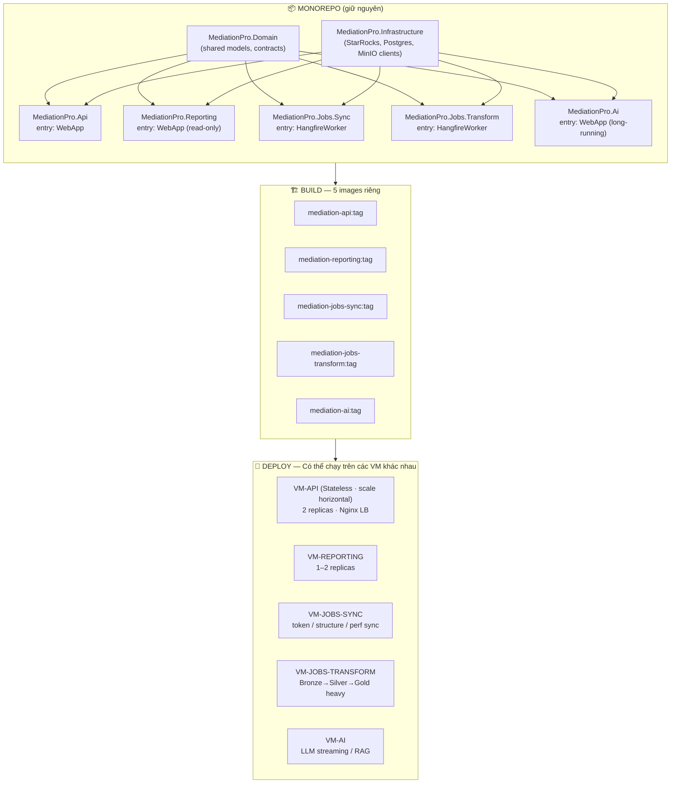

### 1.3 Mapping cụ thể từng service

| Service | Vai trò | Tài nguyên ưu tiên | Scale Strategy | Đặc tính |
|---------|--------|---------------------|----------------|----------|
| **API** | CRUD app/account, Waterfall apply, RBAC, websocket UI | CPU ổn định, RAM thấp | **Horizontal** — 2+ replicas | Stateless, no session |
| **Reporting** | Read-only — Dashboard query, Superset proxy, exports | RAM cao (cache), CPU burst | **Horizontal** — 2 replicas, sticky cache | Read-replica connection string ưu tiên |
| **Jobs-Sync** | Token refresh, structure sync, performance pull (API → Bronze) | Network I/O, RAM trung bình | **Vertical** — 1 instance, distributed lock | Idempotent, retry friendly |
| **Jobs-Transform** | Bronze → Silver → Gold, SoW, Waterfall Recommendation, DAU/DAV | RAM cao, CPU cao (StarRocks queries) | **Vertical** — heavy worker | Schedule windowed |
| **AI** | SQL Assistant, Daily Insight, MCP proxy, RAG | RAM rất cao (model context), GPU optional | **Vertical** — 1 instance | Long-running, streaming |

### 1.4 Lợi ích cụ thể

```
✅ Deploy API mới (UI fix)         →  Jobs vẫn chạy không gián đoạn
✅ Backfill nặng Bronze→Silver     →  Tăng replica Jobs-Transform tạm thời, sau giảm
✅ AI Engine memory leak           →  Restart riêng AI, không ảnh hưởng API/Reporting
✅ Dashboard heavy query           →  Cô lập trong Reporting, không drain connection pool API
✅ A/B test Reporting v2           →  Blue-green deploy chỉ trên Reporting service
✅ Crash 1 service                 →  3 services còn lại vẫn live
```

### 1.5 Cấu trúc thư mục đề xuất (monorepo)

```
Amobear.Mediation.Tools/
├── src/
│   ├── MediationPro.Domain/                ← shared models, contracts
│   ├── MediationPro.Infrastructure/        ← shared clients (SR, PG, MinIO, Redis)
│   ├── MediationPro.Application/           ← shared use-cases
│   │
│   ├── MediationPro.Api/                   ← entry 1: ASP.NET Core
│   │   ├── Dockerfile
│   │   └── Program.cs
│   ├── MediationPro.Reporting/             ← entry 2: ASP.NET Core (read-only DI)
│   │   ├── Dockerfile
│   │   └── Program.cs
│   ├── MediationPro.Jobs.Sync/             ← entry 3: Hangfire worker
│   │   ├── Dockerfile
│   │   └── Program.cs
│   ├── MediationPro.Jobs.Transform/        ← entry 4: Hangfire worker
│   │   ├── Dockerfile
│   │   └── Program.cs
│   └── MediationPro.Ai/                    ← entry 5: ASP.NET Core (streaming)
│       ├── Dockerfile
│       └── Program.cs
│
├── deploy/
│   ├── docker-compose.api.yml              ← VM-API
│   ├── docker-compose.reporting.yml        ← VM-REPORTING
│   ├── docker-compose.jobs-sync.yml        ← VM-JOBS-SYNC
│   ├── docker-compose.jobs-transform.yml   ← VM-JOBS-TRANSFORM
│   └── docker-compose.ai.yml               ← VM-AI
│
└── .github/workflows/
    ├── build-api.yml          ← trigger: src/MediationPro.Api/**
    ├── build-reporting.yml
    ├── build-jobs-sync.yml
    ├── build-jobs-transform.yml
    └── build-ai.yml
```

> **Path-filter trong GitHub Actions**: chỉ rebuild image bị thay đổi. Commit chỉnh sửa Reporting chỉ ra image Reporting — Jobs/AI không bị động chạm.

### 1.6 Hangfire — phân chia worker theo queue

Khi tách Jobs-Sync và Jobs-Transform thành 2 process riêng, dùng **Hangfire Queue** để route job:

```csharp
// MediationPro.Jobs.Sync/Program.cs
services.AddHangfireServer(opts => {
    opts.Queues = new[] { "sync", "default" };
    opts.WorkerCount = 8;
});

// MediationPro.Jobs.Transform/Program.cs
services.AddHangfireServer(opts => {
    opts.Queues = new[] { "transform", "heavy" };
    opts.WorkerCount = 4;  // ít hơn nhưng mỗi job nặng hơn
});

// Khi schedule:
RecurringJob.AddOrUpdate<PerformanceSyncJob>(
    "performance-sync-admob-today",
    j => j.SyncTodayAsync(),
    "5 * * * *",
    new RecurringJobOptions { Queue = "sync" }   // ← route
);

RecurringJob.AddOrUpdate<SilverGoldTransformJob>(
    "silver-gold-transform-job",
    j => j.RunTransformAsync(),
    "35 * * * *",
    new RecurringJobOptions { Queue = "transform" }
);
```

Cần migration `hangfire_job_schedules` để **thêm cột `queue`** (default `'default'`). Khi không truyền queue, job vào queue mặc định.

---

## 2. STARROCKS — XỬ LÝ TÌNH TRẠNG PHÌNH TO

### 2.1 Phân tích ảnh chụp Bronze hiện tại

```
Top 10 bảng Bronze theo dung lượng (từ ảnh):

  fb_holy_quran__deeper_journey       122 GB · 610M rows  ← Firebase events
  fb_ar_tracer_trace_drawing_ios      116 GB · 560M rows  ← Firebase events
  fb_face_swap_ai_photo_editor         44 GB · 273M rows  ← Firebase events
  fb_avnglobal_piano_keyboard_learn    36 GB · 246M rows  ← Firebase events
  fb_amb_wifinder_wifi_location_map    34 GB · 159M rows  ← Firebase events
  fb_lovia_ai                          31 GB · 156M rows  ← Firebase events
  mediation_table                      22 GB · 148M rows  ← AdMob mediation
  fb_ios_quran                         21 GB · 96M rows   ← Firebase events
  ...
  ─────────────────────────────────────────
  TỔNG ƯỚC: ~500–600 GB trên Bronze
```

**Quan sát quan trọng:**

1. **Firebase events chiếm ~80% dung lượng Bronze** — và đây là dữ liệu *ít khi cần truy vấn theo time-window xa*. PO/DA chủ yếu xem 7–30 ngày gần.
2. `mediation_table` (22 GB) và `admob_table` (2.6 GB) — **đây mới là Bronze "hot"** cho mediation team query hàng ngày.
3. `appmetrica_events` (928 MB · 20M rows) — vẫn vừa phải, nhưng sẽ growing.
4. **Replication 3× nghĩa là dung lượng thực trên 3 BE = ~1.5–1.8 TB.** Đây là lý do disk áp lực.

### 2.2 Vấn đề cốt lõi: Firebase Events không nên ở StarRocks Bronze

```
Anti-pattern hiện tại:

    BigQuery Firebase Export  ──►  StarRocks Bronze (3× replicated)
                                   • Granular event-level
                                   • Hàng trăm triệu rows
                                   • Chỉ truy vấn ad-hoc 5–10 lần/tuần
                                   • Không phục vụ dashboard production

  Hệ quả:
    ✗ NVMe SSD đắt → dùng cho data không hot
    ✗ Compaction phải work cho ~600M rows/bảng
    ✗ Tablet count rất cao → FE metadata pressure
    ✗ DA query event-level làm BE CPU 100%, dashboard chậm theo
```

### 2.3 Giải pháp 3 tầng — Lakehouse Pattern

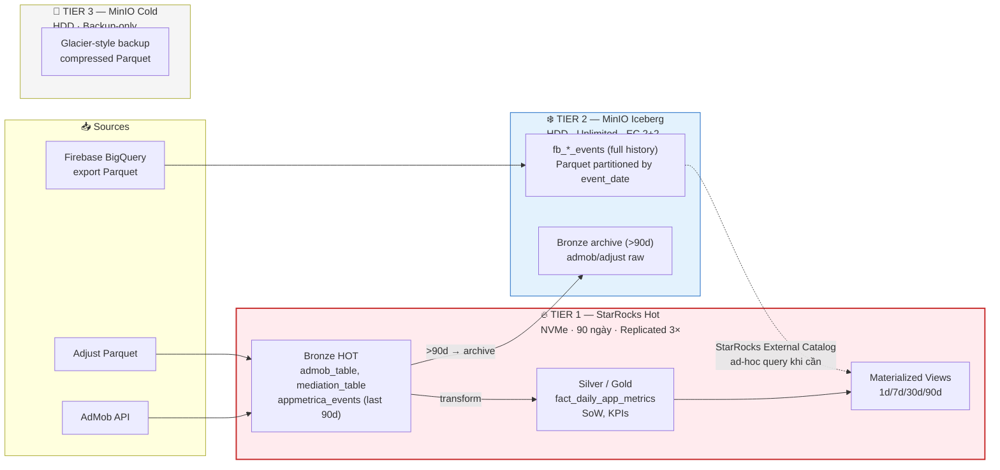

### 2.4 Chi tiết — 4 bước thực thi

#### Bước 1: Tạo External Catalog Iceberg trên StarRocks

```sql
-- StarRocks 3.2+ hỗ trợ Iceberg external catalog trên S3-compatible (MinIO)
CREATE EXTERNAL CATALOG iceberg_lake
PROPERTIES (
    "type" = "iceberg",
    "iceberg.catalog.type" = "rest",
    "iceberg.catalog.uri" = "http://minio-rest-catalog:8181",
    "aws.s3.endpoint" = "http://minio.internal:9000",
    "aws.s3.access_key" = "${MINIO_KEY}",
    "aws.s3.secret_key" = "${MINIO_SECRET}",
    "aws.s3.enable_path_style_access" = "true"
);

-- Query Firebase events đã archive — SQL y hệt
SELECT app_id, event_name, COUNT(*) 
FROM iceberg_lake.firebase.fb_holy_quran__deeper_journey
WHERE event_date BETWEEN '2025-01-01' AND '2025-03-31'
GROUP BY 1, 2;
```

> **Không cần load lại** — Firebase pipeline ghi thẳng Parquet vào MinIO theo partition `event_date=YYYY-MM-DD`, đăng ký Iceberg table. StarRocks "thấy" qua catalog.

#### Bước 2: Di dời Firebase events ra Iceberg

```python
# Ý tưởng: pipeline Firebase mới
#
#   BigQuery → Parquet export → MinIO bucket `firebase-lake/`
#                                            ├── app_id=com.holyquran/
#                                            │    └── event_date=2026-05-13/*.parquet
#                                            └── app_id=com.facetracker/
#                                                 └── event_date=2026-05-13/*.parquet
#
#   Iceberg metadata registered via Trino/Spark/pyiceberg

# StarRocks Bronze table fb_holy_quran__deeper_journey:
#   • Giữ lại 30 ngày gần nhất nếu mediation team cần join nhanh
#   • Hoặc xóa hoàn toàn, query 100% qua iceberg_lake
```

**Quyết định:** với 8 bảng Firebase lớn nhất → archive toàn bộ ra Iceberg. Giải phóng **~480 GB × 3 replicas ≈ 1.4 TB** trên BE.

#### Bước 3: Áp Partition TTL và Storage Cooldown cho Bronze "hot"

```sql
-- mediation_table: giữ hot 90 ngày, cooldown sang Iceberg
ALTER TABLE bronze.mediation_table SET (
    "dynamic_partition.enable" = "true",
    "dynamic_partition.time_unit" = "DAY",
    "dynamic_partition.start" = "-90",        -- giữ 90 ngày
    "dynamic_partition.end" = "3",
    "dynamic_partition.prefix" = "p",
    "dynamic_partition.buckets" = "8"
);

-- Job mới: hàng ngày 03:00, partition >90d → export Parquet, drop khỏi StarRocks
-- (Có thể dùng Spark/Trino, hoặc viết job .NET đọc qua Stream-Load)
```

#### Bước 4: Resource Groups — tách workload

```sql
-- DA / PO query Bronze ad-hoc — quota giới hạn
CREATE RESOURCE GROUP rg_da_exploration
TO (
    user='da_*',
    user='po_*'
)
WITH (
    'cpu_core_limit' = '4',          -- max 4 cores per BE
    'mem_limit' = '20%',             -- max 20% RAM per BE
    'concurrency_limit' = '5',
    'big_query_cpu_second_limit' = '300'   -- query >5 phút bị kill
);

-- Reporting service (Dashboard production) — ưu tiên cao
CREATE RESOURCE GROUP rg_reporting
TO (user='reporting_svc')
WITH (
    'cpu_core_limit' = '12',
    'mem_limit' = '60%',
    'concurrency_limit' = '50'
);

-- Jobs Transform — quota lớn nhưng off-peak
CREATE RESOURCE GROUP rg_jobs_transform
TO (user='jobs_svc')
WITH (
    'cpu_core_limit' = '14',
    'mem_limit' = '70%',
    'concurrency_limit' = '20'
);
```

> **Lợi ích trực tiếp:** PO chạy 1 query bậy không kill được dashboard. Jobs nặng giờ cao điểm bị throttle, không drain BE.

### 2.5 Kết quả dự kiến sau khi áp dụng

| Chỉ số | Trước | Sau |
|--------|-------|-----|
| BE disk Bronze | ~600 GB × 3 = 1.8 TB | ~80 GB × 3 = 240 GB |
| Tablet count | Rất cao (Firebase shards) | Giảm 70% |
| Compaction CPU | Liên tục 30–50% | <10% |
| Query Bronze hot | 30s–2 min | 2–8s |
| Query Bronze cold (Iceberg) | N/A | 10–30s acceptable |
| Dashboard production chậm khi DA query | Có | Không (Resource Group) |
| Cost MinIO cho Iceberg cold | — | $0 incremental (đã có MinIO) |

---

## 3. HANGFIRE vs AIRFLOW — Quyết định Hybrid

### 3.1 Đo lường thực tế độ phức tạp Hangfire hiện tại

Từ CSV `hangfire_job_schedules`:

```
📊 Phân tích 75 jobs đang chạy:

  Theo tần suất:
    Mỗi 30 phút         : 1  job  (token-refresh)
    Mỗi 1 giờ           : 8  jobs (performance sync, appmetrica logs, applovin...)
    Mỗi 2 giờ           : 11 jobs (appmetrica daily, adjust today, meta insights...)
    Mỗi 3–4 giờ         : 6  jobs (xmp last7, qonversion crawler, tiktok balance...)
    Mỗi 12 giờ          : 8  jobs (T-3..T-1 lookback)
    Hàng ngày           : 19 jobs
    Hàng tuần           : 6  jobs
    Monthly             : 1  job

  Theo loại:
    Sync data (Bronze)  : ~35 jobs (admob, applovin, adjust, meta, tiktok, appmetrica...)
    Transform (B→S→G)   : ~12 jobs (silver-gold, sow, dau-dav, appmetrica-game...)
    Cache/Aggregate     : ~6  jobs (dashboard-cache, mv refresh)
    Notification/AI     : ~8  jobs (digest, app-insight, alert)
    Ops                 : ~6  jobs (token, structure, alert calc)
    Reconciliation      : ~3  jobs (qonversion, apple)
    Other               : ~5
```

### 3.2 Hangfire — hạn chế lộ rõ ở quy mô này

| Vấn đề thực tế | Ví dụ cụ thể từ jobs hiện tại | Hậu quả |
|---------------|-------------------------------|---------|
| **Không có DAG** | `silver-gold-transform-job` (35 * * * *) phải chạy SAU `performance-sync-admob-today` (5 * * * *) nhưng chỉ dựa vào lệch giờ — nếu sync chậm, transform vẫn chạy với data cũ | Số liệu KPI thiếu, không phát hiện được |
| **Không có sensor/trigger** | `waterfall-recommendation-job` chỉ nên chạy khi SoW xong, nhưng schedule cứng `55 1-23/4 * * *` | Lãng phí compute / kết quả sai |
| **Backfill thủ công** | Khi 1 ngày Adjust fail → cần backfill 5 jobs theo thứ tự, làm tay | Mất 2-3 giờ ops |
| **Retry không context** | `meta-insights-sync-daily` fail → retry độc lập, không quan tâm downstream | Cascading failure |
| **Không có lineage** | Không biết Gold KPI hôm nay phụ thuộc Bronze sync nào, lần cuối success khi | Debug khó |
| **Quan sát kém** | Hangfire dashboard chỉ thấy status từng job; không thấy bức tranh pipeline | DA hỏi "data tươi chưa?" — không trả lời nhanh được |

### 3.3 Airflow — đúng cho data pipeline, nhưng không phải tất cả

**Airflow strong:**
```
✅ DAG-first        — express dependency rõ ràng
✅ Sensor           — chờ file MinIO, chờ job upstream
✅ Backfill         — `airflow dags backfill -s 2026-05-01 -e 2026-05-10`
✅ Branching        — if/else logic giữa task
✅ Lineage          — OpenLineage integration (DataHub, Marquez)
✅ Resource pools   — 1 sync nặng không chiếm hết worker
✅ UI quan sát      — Gantt chart, task duration, retry history
```

**Airflow weak (so với context Nexus):**
```
✗ Python stack     — team .NET hiện không quen
✗ Cần infra riêng  — scheduler + workers + metadata DB (PG riêng hoặc share)
✗ Overhead         — task nhỏ (token refresh) trên Airflow là overkill
✗ Latency          — task minimum ~30s overhead, không phù hợp short-job
✗ Code 2 ngôn ngữ  — DAG Python, business logic .NET → split brain
```

### 3.4 Đề xuất: Hybrid Architecture

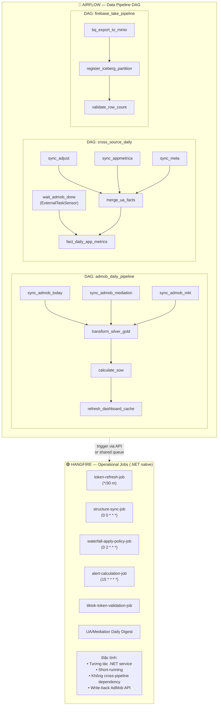

#### Phân loại 75 jobs theo platform:

| Loại job | Số lượng | Đề xuất | Lý do |
|----------|---------|---------|-------|
| Token refresh, structure sync, alert calc | ~6 | **Hangfire** | Operational, không có dependency phức tạp |
| Write-back AdMob (waterfall apply) | ~2 | **Hangfire** | Cần .NET AdMob SDK, transactional |
| AdMob sync (today/recent) | ~6 | **Airflow** → trigger .NET endpoint | Là leaf node của data DAG |
| Silver/Gold transform | ~12 | **Airflow DAG task** | Cốt lõi của pipeline |
| Cross-source merge (Adjust + AdMob + Meta) | ~5 | **Airflow DAG** | Có dependency rõ ràng |
| Dashboard cache, MV refresh | ~5 | **Airflow** sau Gold task | Downstream của Gold |
| Daily digest, AI insight | ~8 | **Hangfire** (trigger từ Airflow) | Long-running .NET, dùng RAG context |
| Reconciliation jobs | ~3 | **Airflow** | DAG of validation + comparison |
| **Total** | **~75** | **~25 stay Hangfire · ~50 move to Airflow** | |

#### Mẫu DAG Airflow gọi service .NET

```python
# dags/admob_daily_pipeline.py
from airflow import DAG
from airflow.providers.http.operators.http import SimpleHttpOperator
from airflow.sensors.external_task import ExternalTaskSensor
from datetime import datetime, timedelta

with DAG(
    "admob_daily_pipeline",
    start_date=datetime(2026, 5, 1),
    schedule_interval="5 * * * *",   # hourly
    catchup=False,
    default_args={
        "retries": 3,
        "retry_delay": timedelta(minutes=5),
        "pool": "starrocks_pool",     # giới hạn concurrent SR queries
    },
) as dag:

    sync_admob_perf = SimpleHttpOperator(
        task_id="sync_admob_performance",
        http_conn_id="jobs_sync_api",
        endpoint="/jobs/admob/performance/sync-today",
        method="POST",
        timeout=600,
        do_xcom_push=True,            # capture sync_id, row count
    )

    sync_admob_mediation = SimpleHttpOperator(
        task_id="sync_admob_mediation",
        http_conn_id="jobs_sync_api",
        endpoint="/jobs/admob/mediation/sync-today",
    )

    transform_silver_gold = SimpleHttpOperator(
        task_id="transform_silver_gold",
        http_conn_id="jobs_transform_api",
        endpoint="/jobs/transform/silver-gold",
    )

    # DAG semantics: chỉ chạy transform khi cả 2 sync xong
    [sync_admob_perf, sync_admob_mediation] >> transform_silver_gold
```

**Service .NET expose minimal HTTP endpoints** chỉ để Airflow trigger — internally chúng dispatch sang chính job class hiện có. **Reuse 100% business logic.**

### 3.5 Alternative: Dagster — đáng cân nhắc

Nếu team không muốn Python, **Dagster** cũng cùng họ orchestrator nhưng:
- API thân thiện hơn với data engineer
- Asset-based (lineage tự suy ra)
- Có thể chạy task remote qua gRPC → vẫn gọi .NET service được
- Học cost tương đương Airflow

> **Khuyến nghị:** Airflow là an toàn vì cộng đồng lớn, tutorial nhiều. Dagster là lựa chọn modern nếu team có 1 người chuyên data-eng.

### 3.6 Roadmap migration 8 tuần

```
Tuần 1–2: Airflow infra (1 VM mới hoặc collocate VM-MON)
           - LocalExecutor → CeleryExecutor scale sau
           - Metadata DB: dùng VM-PG (schema riêng)
           - Connection registry cho .NET service endpoints

Tuần 3–4: Migrate DAG #1: admob_daily_pipeline (10 jobs)
           - Hangfire job tương ứng disable
           - Chạy parallel 1 tuần để verify số khớp
           
Tuần 5–6: Migrate DAG #2: cross_source_daily, firebase_lake
           - Bao gồm Adjust, AppMetrica, Meta, TikTok

Tuần 7:    Migrate DAG #3: dashboard_cache, mv_refresh
           Test backfill 30 ngày — phải chạy được 1 lệnh

Tuần 8:    Cleanup Hangfire (giữ ~25 jobs operational)
           Documentation + runbook cho ops team
```

---

## 4. MMP-GRADE REPORTING — Đạt khả năng như Adjust/XMP

### 4.1 MMP làm gì khác với Nexus hiện tại?

| Aspect | Adjust / XMP | Nexus hiện tại | Gap |
|--------|-------------|----------------|-----|
| Dimension count | 20+ dimensions (campaign, source, country, device, OS, app_version, event...) | ~8 dimensions chính | Cần thêm cube |
| Time granularity | hour / day / week / month / custom | mostly day | Add hour-level cube |
| Concurrent users | 500+ analyst querying | ~30 | Cần resource pool + cache |
| Query response | <2s p95 cho top dashboard | 5–15s | MV layer + cache |
| Real-time vs batch | "fresh in 1 hour" cho most metrics | T-1 cho AdMob, gần realtime cho Firebase | Hợp lý với constraint API |
| Multi-tenancy | App × Org × Team isolation | RBAC có, nhưng chưa enforce ở storage | Resource group + filter |
| Export volume | Daily 100M rows CSV/Parquet export | Chưa scale | Cần streaming export |

### 4.2 Bốn trụ cột của MMP-grade Performance

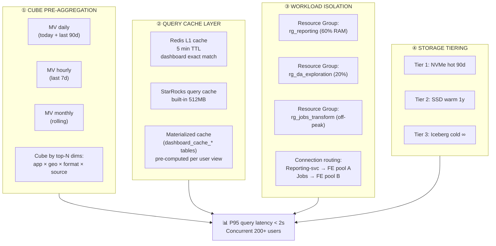

### 4.3 Materialized View Strategy — Đa tầng

```sql
-- Tier 1: Hourly cube (real-time-ish), 7 ngày retention
CREATE MATERIALIZED VIEW gold.mv_hourly_app_metrics
DISTRIBUTED BY HASH(app_id) BUCKETS 16
REFRESH ASYNC EVERY (INTERVAL 15 MINUTE)         -- gần realtime
PARTITION BY date_trunc('day', event_hour)
PROPERTIES (
    "partition_ttl_number" = "7",                -- giữ 7 ngày
    "replication_num" = "2"
) AS
SELECT
    date_trunc('hour', event_time) AS event_hour,
    app_id, platform, country, ad_format,
    SUM(impressions) AS impressions,
    SUM(revenue) AS revenue,
    APPROX_COUNT_DISTINCT(user_pseudo_id) AS uniq_users,
    HLL_UNION_AGG(user_hll) AS user_hll
FROM silver.admob_performance_hourly
GROUP BY 1, 2, 3, 4, 5;

-- Tier 2: Daily cube — 90 ngày
CREATE MATERIALIZED VIEW gold.mv_daily_app_metrics_cube
DISTRIBUTED BY HASH(app_id) BUCKETS 32
REFRESH ASYNC EVERY (INTERVAL 1 HOUR)
PARTITION BY event_date
PROPERTIES (
    "partition_ttl_number" = "90",
    "replication_num" = "3"
) AS
SELECT
    event_date,
    app_id, platform,
    country,
    ad_format,
    ua_source,                                    -- ← từ Adjust join
    install_age_bucket,                           -- new / 1-7d / 7-30d / 30+
    SUM(impressions) AS impressions,
    SUM(revenue) AS revenue,
    SUM(installs) AS installs,
    SUM(ua_cost) AS ua_cost,
    APPROX_COUNT_DISTINCT(user_pseudo_id) AS dau,
    BITMAP_UNION_AGG(user_bitmap) AS user_bitmap  -- ← exact distinct sau
FROM silver.fact_daily_app_metrics_enriched
GROUP BY 1, 2, 3, 4, 5, 6, 7;

-- Tier 3: Monthly rollup — 24 tháng
CREATE MATERIALIZED VIEW gold.mv_monthly_app_kpi
DISTRIBUTED BY HASH(app_id) BUCKETS 8
REFRESH ASYNC EVERY (INTERVAL 6 HOUR)
PARTITION BY date_trunc('month', event_date)
AS
SELECT
    date_trunc('month', event_date) AS month,
    app_id, platform, country,
    SUM(revenue) AS revenue,
    SUM(ua_cost) AS ua_cost,
    SUM(revenue) - SUM(ua_cost) AS net_profit,
    BITMAP_UNION_COUNT(user_bitmap) AS mau
FROM gold.mv_daily_app_metrics_cube
GROUP BY 1, 2, 3, 4;
```

> **StarRocks CBO** tự rewrite query người dùng sang MV tốt nhất. **Không phải sửa code Reporting** khi thêm MV.

### 4.4 Query Cache 2 lớp

```csharp
// MediationPro.Reporting — pseudo-code
public async Task<DashboardResult> GetAppMetrics(QueryRequest req)
{
    // L1: Redis exact-match cache (5 min)
    var cacheKey = $"dashboard:{req.Hash()}";
    var cached = await _redis.GetAsync<DashboardResult>(cacheKey);
    if (cached != null) return cached;

    // L2: StarRocks query — sẽ tự hit Materialized View hoặc built-in cache
    var result = await _starRocks.QueryAsync(req.BuildSql());

    // Lưu L1 với TTL phù hợp loại query
    var ttl = req.IsRealtime ? TimeSpan.FromSeconds(60)
             : req.IsToday    ? TimeSpan.FromMinutes(5)
             : TimeSpan.FromMinutes(30);
    await _redis.SetAsync(cacheKey, result, ttl);

    return result;
}
```

**Cache invalidation:**
- Khi `silver-gold-transform-job` xong → publish event `gold.refreshed` qua RabbitMQ
- Reporting subscribe → invalidate Redis keys với pattern `dashboard:*`
- Tránh stale cache khi data thực sự mới

### 4.5 Approximate Query cho top-N analytics

```sql
-- Adjust hỏi: "Top 20 campaigns theo revenue trong 30 ngày"
-- Exact: scan 90M rows, 8s
-- Approx (HLL + sampling): 0.5s với độ chính xác 99%

SELECT
    campaign_id,
    SUM(revenue) AS revenue,
    APPROX_COUNT_DISTINCT(user_pseudo_id) AS uniq_users  -- HLL
FROM gold.mv_daily_app_metrics_cube
WHERE event_date >= CURRENT_DATE - 30
GROUP BY campaign_id
ORDER BY revenue DESC
LIMIT 20;
```

Khi user click "drill down" trên 1 campaign → switch sang exact query trên smaller dataset.

### 4.6 Read Replica Pattern (Phase tiếp)

Nếu sau 6 tháng vẫn bị bottleneck:

```
            ┌─ FE Leader ────────────┐
            │                        │
   ┌────────┴────────┐    ┌──────────┴──────────┐
   │ BE Pool A       │    │ BE Pool B           │
   │ (Reporting)     │    │ (Jobs Transform)    │
   │ 3 BE · NVMe     │    │ 3 BE · SSD          │
   │ Replicated 3×   │    │ Replicated 1× (OK)  │
   └─────────────────┘    └─────────────────────┘
        ▲                          ▲
        │                          │
   Reporting svc              Jobs-Transform svc
```

**StarRocks Resource Group + label-based routing** đạt được điều này mà không cần cluster riêng.

---

## 5. KIẾN TRÚC MỚI — TỔNG HỢP

### 5.1 Sơ đồ tổng

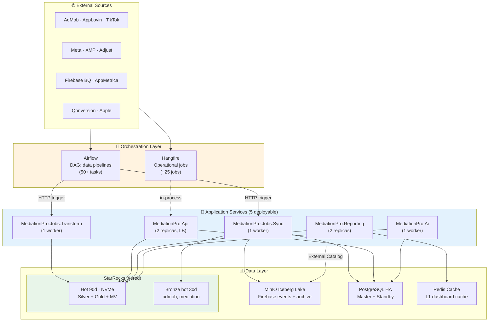

### 5.2 VM Layout đề xuất — 10 VMs (so với 8 hiện tại)

| VM | Vai trò | Spec | Note |
|----|--------|------|------|
| **VM-API** | API service (2 replicas) | 4c / 8 GB / 100 GB | Stateless, HA qua Nginx LB |
| **VM-REPORTING** | Reporting service (2 replicas) | 6c / 16 GB / 100 GB | Cache-friendly |
| **VM-JOBS-SYNC** | Hangfire Sync workers | 4c / 16 GB / 200 GB | Network I/O heavy |
| **VM-JOBS-TRANSFORM** | Hangfire Transform workers | 8c / 32 GB / 200 GB | StarRocks query heavy |
| **VM-AI** | AI Engine | 8c / 32 GB / 200 GB | LLM context, RAG |
| **VM-AIRFLOW** | Airflow scheduler + workers | 6c / 16 GB / 200 GB | New |
| **VM-PG1 / VM-PG2** | PostgreSQL HA | 4c / 16 GB / 500 GB | Existing |
| **VM-SR1/2/3** | StarRocks (FE×3 + BE×3) | 16c / 64 GB / 4 TB NVMe | **Giảm disk size khả thi sau Iceberg migration** |
| **VM-MN** | MinIO Distributed (now hosting Iceberg) | 4c / 16 GB / 4×4 TB HDD → **8×8 TB HDD** | Mở rộng cho cold tier |
| **VM-MON** | Observability + Airflow metadata | 6c / 16 GB / 1 TB | Existing |

> 💰 **Cost delta vs Recommended hiện tại:** ~+$3,000–4,000 CapEx (thêm 2 VMs ứng dụng), nhưng **NVMe StarRocks giảm 50% size** (4 TB → 2 TB) sau Iceberg migration → **net cost giảm 10–15%**.

### 5.3 Roadmap 90 ngày

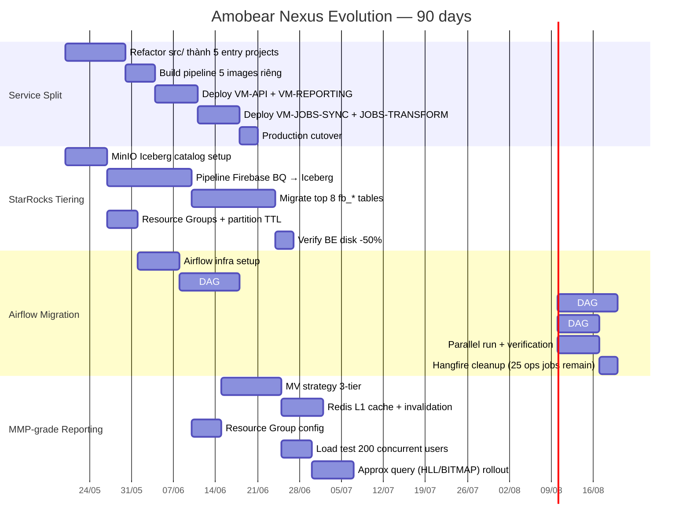

---

## 6. RỦI RO & GIẢM THIỂU

| # | Rủi ro | Likelihood | Impact | Mitigation |
|---|--------|------------|--------|------------|
| 1 | Refactor monorepo → break tích hợp DI | Trung bình | Cao | Tách dần: API tách trước, Reporting tách sau; mỗi bước có integration test |
| 2 | Iceberg migration mất data Firebase | Thấp | Rất cao | Không xóa StarRocks Bronze tới khi verify row count + sample query khớp 100% trong 30 ngày |
| 3 | Airflow team không quen Python | Cao | Trung bình | Bắt đầu DAG đơn giản, 1 senior backend học Airflow trước; DAG chỉ là orchestration — logic vẫn .NET |
| 4 | Resource Group sai cấu hình → DA hoàn toàn không query được | Trung bình | Trung bình | Bắt đầu với quota rộng, siết dần dựa trên telemetry |
| 5 | Cache invalidation sai → user thấy data cũ | Cao | Trung bình | Event-driven invalidate qua RabbitMQ; TTL ngắn cho today data |
| 6 | Double-write Hangfire + Airflow → job chạy 2 lần | Trung bình | Cao | Migration plan: disable Hangfire job NGAY khi enable Airflow DAG, không parallel quá 1 tuần |
| 7 | MV refresh quá thường xuyên → BE overload | Trung bình | Cao | Refresh interval theo data freshness yêu cầu; monitor compaction score |
| 8 | Phải scale-up MinIO khi đẩy Iceberg | Cao | Thấp | Đã có roadmap mở rộng disk; HDD rẻ |

---

## 7. KẾT LUẬN

### 7.1 Vì sao 4 thay đổi này đi cùng nhau

```
Tách service          ─────►  Cho phép scale từng phần workload
                                    ↓
StarRocks tiering     ─────►  Cho phép Reporting service nhanh hơn 5–10×
                                    ↓
Airflow DAG           ─────►  Đảm bảo data freshness khi pipeline phức tạp hơn
                                    ↓
MMP-grade reporting   ─────►  Mục tiêu cuối — bằng được Adjust/XMP về analytics
```

**Bốn thay đổi này không phải lựa chọn riêng lẻ — chúng là một chuỗi quan hệ nhân quả.** Bỏ 1 yếu tố nào, 3 yếu tố còn lại không đạt full value.

### 7.2 Ưu tiên triển khai

| Ưu tiên | Hạng mục | Effort | Impact | Khi nào start |
|---------|---------|--------|--------|---------------|
| 🥇 #1 | **StarRocks Resource Group + partition TTL** | 1 tuần | 🔴 Rất cao | **Ngay tuần này** — quick win, không cần refactor code |
| 🥈 #2 | **Tách Service: API + Reporting trước** | 3 tuần | 🔴 Cao | Tuần 2 |
| 🥉 #3 | **Iceberg Lake cho Firebase events** | 4 tuần | 🔴 Rất cao | Tuần 3 — chạy song song #2 |
| #4 | **Airflow cho data pipeline** | 8 tuần | 🟡 Cao | Tuần 5 |
| #5 | **MV multi-tier + Redis cache** | 4 tuần | 🟡 Cao | Tuần 9 — sau khi #3 xong |
| #6 | **Read replica pool / approx query** | 4 tuần | 🟢 Trung bình | Tuần 13 — chỉ nếu vẫn bị bottleneck |

### 7.3 Quyết định cần Stakeholder

```
□ Approve thêm 2 VMs ứng dụng (VM-REPORTING, VM-AIRFLOW)
    + 1 VM mở rộng MinIO?                              → ~$3-4K CapEx

□ Team có 1 người sẵn sàng học Airflow (Python)?      → 2 tuần ramp-up

□ Chấp nhận giai đoạn parallel-run 1 tuần
    (Hangfire + Airflow chạy cùng cho verify)?         → Risk thấp, gain cao

□ Cho phép Bronze Firebase events offline migration
    trong 4 tuần (đọc qua External Catalog tạm thời)?  → Cần báo trước DA team
```

---

> **Nguyên tắc chỉ đạo:** Không thay đổi tất cả cùng lúc. Bắt đầu với **#1 (Resource Group)** — đây là việc duy nhất có thể làm trong tuần này và đã giảm ngay áp lực hệ thống. Phần còn lại đi theo roadmap có chủ đích.
>
> Bộ phận R&D có thể xem mỗi mục là một spike riêng để estimate đúng effort trong sprint planning.

---

---

# PHẦN MỞ RỘNG v1.1

## 8. MULTI-FORMAT RAW DATA — Pattern 2-Layer Lake

### 8.1 Bối cảnh thực tế

Khảo sát layout hiện tại trên MinIO (`amobear-datalake`, 253.7 GiB / 102,050 objects):

```
amobear-datalake/
└── raw/
    ├── adjust/         → Parquet (export)
    ├── admob/          → JSON (API response)
    ├── apple/          → CSV/TSV (Store Connect)
    ├── applovin/       → JSON
    ├── appmetrica/     → JSON/CSV
    ├── appsflyer/      → CSV/Parquet
    ├── firebase/parquet/{app}/{date}/  → Parquet (đã chuẩn)
    ├── qonversion/     → JSON + CSV (crawler)
    └── xmp/            → JSON
```

**Phát hiện:** Layout này **đúng pattern** — raw zone luôn nên giữ native format từ vendor để audit/replay. Nhưng Iceberg yêu cầu Parquet/ORC/Avro — không đọc được trực tiếp JSON/CSV/TSV.

### 8.2 Giải pháp: 2-Layer Lake (Landing + Curated)

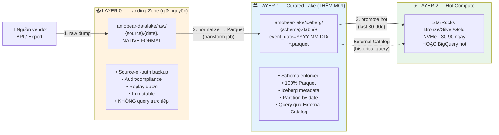

### 8.3 Mẫu xử lý từng nguồn

| Nguồn | Raw format | Bước normalize | Effort | Quick win? |
|-------|-----------|----------------|--------|------------|
| **Firebase** | Parquet ✓ | **Register Iceberg trên Parquet hiện tại** | Rất thấp | ✅ Làm ngay |
| **Adjust** | Parquet ✓ | Register Iceberg | Rất thấp | ✅ Làm ngay |
| **AppsFlyer** | Parquet (Master) ✓ | Register Iceberg | Rất thấp | ✅ Làm ngay |
| **AdMob** | JSON | Parse JSON → write Parquet vào lake | Trung bình | Cần job mới |
| **AppLovin** | JSON | Parse → Parquet | Trung bình | Cần job mới |
| **AppMetrica** | JSON/CSV | Parse → Parquet | Trung bình | Cần job mới |
| **Apple** | CSV/TSV | Parse with header → Parquet | Thấp | Cần job mới |
| **XMP** | JSON | Parse → Parquet | Trung bình | Cần job mới |
| **Qonversion** | JSON + CSV | Parse → Parquet | Trung bình | Cần job mới |

> **Quan trọng:** Việc convert format **không phải làm thêm việc** — job transform của Nexus vốn đã parse JSON/CSV để load Bronze StarRocks. Chỉ cần **thay đổi output target**: trước ghi thẳng vào StarRocks BE storage, giờ ghi Parquet sang `lake/` rồi StarRocks INSERT từ Parquet (nhanh hơn 5–10× nhờ vectorized read). Đồng thời có Iceberg snapshot luôn.

### 8.4 Quick win nhất — Firebase events

Layout hiện tại `raw/firebase/parquet/{app}/{date}/*.parquet` chỉ thiếu **Iceberg metadata layer**. Không cần migrate data:

```python
# pyiceberg — register existing Parquet as Iceberg table
from pyiceberg.catalog import load_catalog

catalog = load_catalog("amobear", **catalog_props)

table = catalog.create_table(
    identifier="firebase.events_holyquran",
    schema=infer_from_parquet(
        "s3://amobear-datalake/raw/firebase/parquet/ailab-lumia-ai-girl-rp-chat/"
    ),
    partition_spec=PartitionSpec(
        PartitionField(source_id=1, field_id=1000, name="event_date", transform="identity")
    ),
    location="s3://amobear-datalake/raw/firebase/parquet/ailab-lumia-ai-girl-rp-chat/"
)

# Sau đó StarRocks query trực tiếp:
# SELECT * FROM iceberg_lake.firebase.events_holyquran 
# WHERE event_date BETWEEN '2026-05-01' AND '2026-05-13';
```

**Tác động ngay:** Giải phóng ~500 GB StarRocks Bronze (×3 replication = ~1.5 TB BE disk) mà không phải copy/move data nào.

### 8.5 Layout buckets đề xuất

```
amobear-datalake/                       ← Bucket 1: LANDING (immutable, multi-format)
└── raw/
    ├── adjust/2026-05-13/*.parquet
    ├── admob/2026-05-13/api_resp.json
    ├── apple/2026-05/sales.tsv
    └── ...

amobear-lake/                           ← Bucket 2: CURATED (Parquet only, Iceberg)
├── iceberg/
│   ├── adjust.events/event_date=2026-05-13/*.parquet
│   ├── admob.performance/event_date=2026-05-13/*.parquet
│   ├── firebase.events_holyquran/event_date=2026-05-11/*.parquet
│   └── _metadata/                      (Iceberg manifest, snapshot, version)

amobear-archive/                        ← Bucket 3: COLD (>180d, auto-tier)
└── (GCS Coldline/Archive class, lifecycle policy)
```

### 8.6 Tác động đến doc 133 v1.0

| Section v1.0 | Cập nhật v1.1 |
|--------------|---------------|
| §2.3 "Lakehouse Pattern" | Vẫn đúng — Iceberg là Tier 2 |
| §2.4 Bước 2 "Migrate Firebase ra Iceberg" | **Đơn giản hơn nhiều** — không cần migrate, chỉ register metadata |
| §2.4 thêm | **Bước mới:** Cần job/pipeline cho `raw/{json,csv}/ → lake/{parquet}/` đối với non-Parquet sources |

---

## 9. CLOUD-NATIVE TRÊN GOOGLE CLOUD — Đi thẳng GKE, không Swarm

### 9.1 Quyết định cốt lõi: KHÔNG quay lại Docker Swarm

```
Tình trạng Docker Swarm năm 2026:
  ✗ Mirantis tiếp quản 2020, ngừng đầu tư đáng kể
  ✗ Last meaningful release > 3 năm trước
  ✗ Không có ecosystem cloud-native (operator, helm, service mesh)
  ✗ Cộng đồng đã hoàn toàn chuyển sang K8s
  ✗ Không có native HPA/VPA, không network policy nâng cao
  ✗ Không tích hợp managed services GCP/AWS/Azure
  ✗ Tuyển dụng khó — đa số dev đã skip Swarm

  → Quay lại Swarm = tự đào hố nợ kỹ thuật từ ngày 1
```

### 9.2 Bối cảnh thay đổi: deploy trên Google Cloud

Doc 112 được viết cho **on-premise VMware**. Khi target deploy là **Google Cloud**, calculation đổi hoàn toàn:

```
  ❌  GCE VMs + Docker Compose         → giống on-prem trên cloud, lãng phí
  ❌  GCE VMs + Docker Swarm           → cộng dồn 2 bất lợi
  ❌  Self-managed K8s trên GCE        → mất hết managed benefits
  ✅  GKE + GCP managed services       → cloud-native đúng nghĩa
```

### 9.3 Kiến trúc đề xuất — GKE + Managed Services

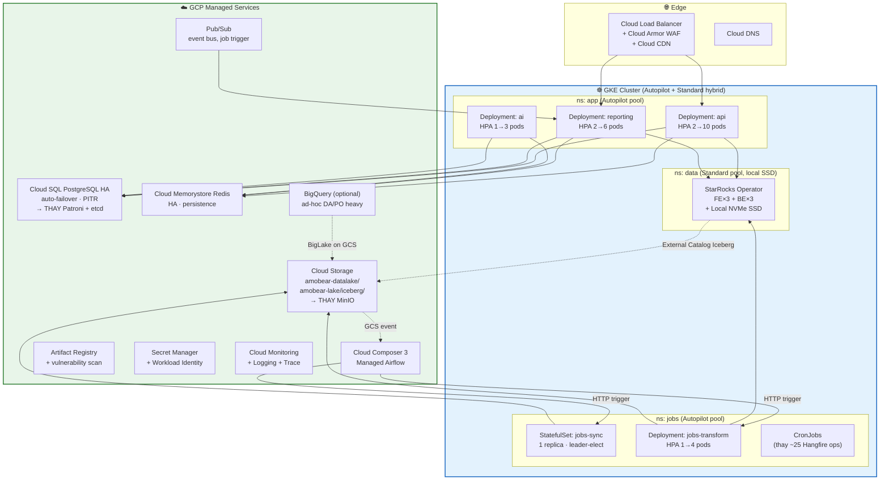

### 9.4 Mapping component on-prem → GCP

| Doc 112 (on-prem) | GCP Cloud-Native | Lý do chuyển |
|------------------|------------------|--------------|
| VM-APP × N + Docker Compose | **GKE Autopilot** (pay-per-pod) | Zero node management, auto-patch, native HPA |
| PostgreSQL + Patroni + etcd (3 VMs, complex) | **Cloud SQL PostgreSQL HA** | Bỏ Patroni complexity; auto-failover 60s; PITR built-in |
| Redis self-host | **Cloud Memorystore for Redis** | Managed HA, persistence sẵn |
| MinIO Distributed 4 drives | **Cloud Storage (GCS)** | Rẻ hơn 30-50%, durability 11×9, lifecycle policy |
| RabbitMQ self-host | **Pub/Sub** (+ RabbitMQ optional) | Pub/Sub cho event-driven; RabbitMQ giữ nếu cần work-queue |
| Airflow self-host (v1.0 đề xuất) | **Cloud Composer 3** | Managed Airflow, IAM + GCS + BQ tích hợp sẵn |
| Prometheus + Loki + Grafana | **Cloud Monitoring + Logging** (+ Grafana optional) | Giảm overhead; vẫn export Prom-style được |
| Harbor / GHCR | **Artifact Registry** | Vulnerability scan tự động, IAM |
| `.env` file secrets | **Secret Manager + Workload Identity** | Audit log, không secret trên disk |
| StarRocks trên VM | **StarRocks StatefulSet trên GKE Standard** | Cần local NVMe → Standard mode, không Autopilot |
| PRTG (VMware ESXi) | **Cloud Operations Suite** | Native cloud monitoring; GCE chỉ là VM thuê |

### 9.5 StarRocks trên GKE — điểm cần lưu ý

StarRocks BE **cần local NVMe SSD** cho query performance — phải dùng **GKE Standard** mode (không Autopilot), node pool riêng:

```yaml
# Node pool dedicated cho StarRocks BE
apiVersion: container.gke.io/v1
kind: NodePool
metadata:
  name: starrocks-be-pool
spec:
  nodeConfig:
    machineType: n2-standard-16        # 16 vCPU / 64 GB
    diskType: pd-ssd
    diskSizeGb: 100                    # boot disk
    localSsdCount: 2                   # 2 × 375 GB NVMe local
    taints:
      - key: workload
        value: starrocks
        effect: NoSchedule
    labels:
      workload: starrocks
  initialNodeCount: 3
  autoscaling:
    enabled: false                     # BE không auto-scale tùy ý
```

Dùng **StarRocks Kubernetes Operator** chính thức:

```yaml
apiVersion: starrocks.com/v1
kind: StarRocksCluster
metadata:
  name: amobear-nexus
  namespace: data
spec:
  starRocksFeSpec:
    replicas: 3
    image: starrocks/fe-ubuntu:3.2-latest
    resources:
      requests: { cpu: "4", memory: "16Gi" }
  starRocksBeSpec:
    replicas: 3
    image: starrocks/be-ubuntu:3.2-latest
    storageVolumes:
      - name: be-storage
        storageSize: 750Gi
        storageClassName: local-ssd
    nodeSelector:
      workload: starrocks
    tolerations:
      - key: workload
        operator: Equal
        value: starrocks
        effect: NoSchedule
```

### 9.6 Cluster + namespace layout đề xuất

```
GKE Cluster: amobear-nexus-prod  (region: asia-southeast1)
│
├── Node pool: app-pool (Autopilot mode — managed nodes)
│   ├── ns: app          ── api · reporting · ai (auto HPA)
│   ├── ns: jobs         ── jobs-sync · jobs-transform · cronjobs
│   └── ns: monitoring   ── Grafana (optional, song song Cloud Monitoring)
│
├── Node pool: starrocks-pool (Standard, local SSD, tainted)
│   └── ns: data         ── StarRocks Operator + FE×3 + BE×3
│
└── Node pool: spot-pool (preemptible)
    └── ns: batch        ── Backfill heavy · parquet conversion batch
```

### 9.7 CI/CD — GitOps pattern

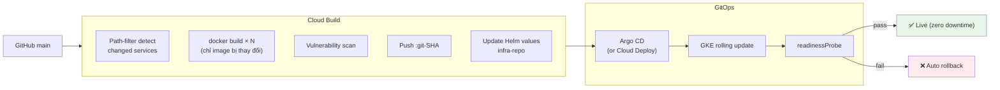

**Zero-downtime deploy** đạt tự nhiên qua K8s rolling update + readiness probe — không còn 5–10s gián đoạn API như Docker Compose.

### 9.8 So sánh chi phí

```
On-prem Recommended (Doc 112):
  CapEx:     ~$22,700–34,500 (hardware mua đứt)
  OpEx:      ~$620–1,090/tháng (IDC + điện + bandwidth)
  Hidden:    1 FTE ops infra (~$1,500–2,500/tháng VN)
  Year 1:    ~$50,000–80,000

GCP đề xuất (region asia-southeast1):
  GKE Autopilot (~10 pods avg)             $450–800/tháng
  GKE Standard nodes (StarRocks × 3)        $1,600–2,400/tháng
  Cloud SQL PostgreSQL HA (4vCPU, 16GB)     $300–450/tháng
  Cloud Memorystore Redis (5GB HA)          $180–250/tháng
  Cloud Storage (1–5 TB · ops)              $80–250/tháng
  Cloud Composer 3 (small)                  $400–600/tháng
  Cloud Load Balancer + egress              $100–300/tháng
  Cloud Monitoring + Logging                $100–200/tháng
  Artifact Registry + Secret Manager        $30–50/tháng
  Cloud Build + Deploy                      $50–100/tháng
  ─────────────────────────────────────────────────────────
  Tổng tháng:                                ~$3,300–5,400
  Year 1:                                   ~$40,000–65,000
  
  Hidden saving: 0.5–1 FTE infra ops         -$10,000–25,000/năm
```

**Đánh giá:** Year 1 ngang ngửa hoặc rẻ hơn on-prem khi tính đủ FTE. Lợi ích chính không nằm ở $$:

```
  ✓ Velocity feature mới cao hơn (team không phải build infra)
  ✓ Auto-scale khi seasonal spike (Q4 ad market)
  ✓ Disaster recovery cross-region trivial
  ✓ Compliance/audit (SOC2, ISO) sẵn từ GCP
  ✓ Team focus business logic, không infra firefight
```

### 9.9 Tối ưu chi phí GCP

```
✓ Spot VMs cho Jobs-Transform batch heavy    → giảm 60-80% cho workload đó
✓ Committed Use Discount 1-year StarRocks    → giảm 25-30%
✓ Cloud Storage Autoclass                     → tự move Nearline/Coldline khi >30d
✓ Cloud SQL right-sizing sau tháng đầu        → thường giảm 20-30%
✓ Workload Identity (không SA key file)       → security + zero cost
✓ VPC-native (alias IP) + Private Service Connect → tránh egress GKE ↔ Cloud SQL
✓ BigQuery cho DA ad-hoc heavy (pay-per-query)→ giảm load StarRocks
```

### 9.10 Câu hỏi đáng cân nhắc: BigQuery thay/bổ sung StarRocks?

Khi đã trên GCP, hybrid là lựa chọn hợp lý:

| Aspect | StarRocks | BigQuery |
|--------|-----------|----------|
| Latency p99 | <2s (production dashboard) | 5-30s |
| Concurrent users | Cao (resource group) | Unlimited (serverless) |
| Cost model | Pay per node (fixed) | Pay per query (variable) |
| MV với CBO rewrite | ✓ | ✓ (Materialized View) |
| BigLake on GCS | ✗ | ✓ (Iceberg native) |
| ML inline | ✗ | ✓ (ML.PREDICT, BQML) |
| Team familiar | ✓ (đã đầu tư) | Cần ramp-up |

**Pattern hybrid khuyến nghị:**
- **StarRocks** → Dashboard production (Reporting service) — <2s latency
- **BigQuery** → DA/PO exploration + ad-hoc + ML — pay-per-query, tách workload
- **GCS Iceberg** → Single source data, cả 2 engine cùng đọc được

> Phase đầu cứ giữ StarRocks. BigQuery thêm vào sau khi go-live ổn định và cần giải tỏa workload DA/PO.

### 9.11 Tác động đến doc 133 v1.0

| Section v1.0 | Cập nhật v1.1 |
|--------------|---------------|
| §1.4 VM-API, VM-REPORTING... | **Đổi thành GKE Deployment với HPA** — không còn khái niệm "VM riêng cho mỗi service" |
| §1.5 cấu trúc thư mục monorepo | Vẫn đúng — 5 Dockerfile riêng |
| §1.7 Hangfire Queue | Vẫn đúng cho Hangfire phần giữ lại; CronJobs K8s thay thế ~25 ops jobs |
| §2.x MinIO Iceberg | **Đổi thành GCS Iceberg** — đơn giản hơn, không phải quản EC |
| §3.x Airflow self-host | **Đổi thành Cloud Composer 3** — managed |
| §5.2 VM Layout 10 VMs | **Thay thế bằng GKE cluster + 3 node pools** |
| §5.3 Roadmap 90 ngày | Thêm phase migration to GCP trước |

### 9.12 Roadmap migration to GCP

```
Phase 0: Setup GCP foundation (Tuần 1-2)
  • GCP project, IAM, VPC, Cloud DNS
  • Artifact Registry, Secret Manager
  • GKE cluster (Autopilot + Standard pool)
  • Cloud SQL PostgreSQL HA setup
  • GCS buckets (datalake, lake, archive)

Phase 1: Stateless services (Tuần 3-5)
  • Migrate API service → GKE
  • Migrate Reporting service → GKE
  • Cloud SQL data migration từ on-prem PG
  • Memorystore Redis setup

Phase 2: StarRocks on GKE (Tuần 4-7) — chạy song song
  • Deploy StarRocks Operator
  • Replicate data từ on-prem cluster
  • Verify query parity
  • Cutover khi confidence cao

Phase 3: Data lake migration (Tuần 5-8)
  • Sync MinIO → GCS (gsutil rsync)
  • Iceberg metadata registration
  • Update sync jobs ghi vào GCS thay MinIO

Phase 4: Airflow → Cloud Composer (Tuần 6-9)
  • Composer 3 environment
  • Port DAG (giữ logic .NET service trigger)

Phase 5: Decommission on-prem (Tuần 9-10)
  • DNS cutover
  • Monitoring confirm 1 tuần
  • Shutdown on-prem VMs
```

---

## 10. TÓM TẮT QUYẾT ĐỊNH SAU v1.1

| Quyết định | v1.0 (on-prem) | v1.1 (GCP) |
|-----------|----------------|------------|
| Orchestration | Docker Compose nhiều VMs | **GKE (Autopilot + Standard hybrid)** |
| Docker Swarm | Đã loại | **Vẫn loại — không bring back** |
| PostgreSQL | Self + Patroni | **Cloud SQL HA** |
| Redis | Self-host | **Memorystore** |
| Object storage | MinIO Distributed | **Cloud Storage (GCS)** |
| Airflow | Self-host | **Cloud Composer 3** |
| StarRocks | VMs với NVMe | **GKE Standard + local SSD** |
| Raw data format | "JSON/CSV phải convert" | **2-layer lake: raw native + curated Parquet** |
| Iceberg location | MinIO | **GCS (với BigLake bonus)** |
| Firebase quick win | Migrate sang Iceberg | **Register Iceberg metadata trên Parquet hiện tại — không copy** |
| Monitoring | Prometheus + Loki self | **Cloud Monitoring + Logging** (Grafana optional) |

> **Nguyên tắc:** Trên GCP, **mọi component có managed equivalent đều nên dùng managed** trừ khi có lý do cụ thể không (case duy nhất: StarRocks cần local NVMe → GKE Standard).

---

---

# PHẦN MỞ RỘNG v1.2 — COST OPTIMIZATION

## 11. SO SÁNH CHI PHÍ: FULL MANAGED vs SELF-MANAGED TRÊN GCP

### 11.1 Triết lý chi phí cho saving-money platform

> Amobear Nexus được xây dựng để **tiết kiệm tiền nội bộ** (giảm thời gian thủ công, tăng eCPM, tối ưu UA) — không phải product bán ra. Vì vậy:
>
> **Mỗi đồng chi cho infra phải có ROI rõ ràng từ tiền tiết kiệm được.**
>
> Nguyên tắc:
> 1. **Start cheap** — chứng minh saving trước khi đầu tư managed services premium
> 2. **Pay for ops relief**, không pay for fancy features
> 3. **Phased migration** — mỗi phase phải có gate quyết định "continue/kill"
> 4. **CUD aggressive** sau khi workload ổn định (giảm 30-55% compute cost)

### 11.2 Phổ lựa chọn từ rẻ nhất đến đắt nhất

```
                 Self-managed                              Full Managed
                 (rẻ, tốn FTE)                            (đắt, ít FTE)
                      │                                          │
  Mô hình A     Mô hình B          Mô hình C            Mô hình D
  ─────────     ─────────          ─────────            ─────────
  Plain GCE     GKE Standard +     GKE Autopilot +      Full Managed
  + Docker      Self-host data     Cloud SQL only       (Composer,
  Compose       (PG, Redis,        (vẫn self Redis,     Memorystore,
                Airflow trên       Airflow)             everything)
                K8s)

  ~$1,300-1,800 ~$2,000-2,800     ~$2,800-3,800         ~$3,500-5,400
  /tháng        /tháng             /tháng                /tháng
  (1y CUD)      (1y CUD)           (1y CUD)              (1y CUD)
  
  +1 FTE ops    +0.5 FTE ops       +0.2 FTE ops          +0.1 FTE ops
```

### 11.3 Cost breakdown chi tiết — 4 mô hình

> **Lưu ý:** Giá ước tính cho region `asia-southeast1` (Jakarta) hoặc `asia-southeast2`. **Phải verify lại bằng [GCP Pricing Calculator](https://cloud.google.com/products/calculator) trước khi commit.** Giá có thể chênh ±15%.

#### Mô hình A — Plain GCE + Docker Compose (rẻ nhất)

Áp dụng layout giống Doc 112 nhưng trên GCE thay VMware.

| Component | Spec | On-demand | 1y CUD | 3y CUD |
|-----------|------|-----------|--------|--------|
| VM-API (×2 cho HA) | n2-standard-4 × 2 | $340 | $215 | $155 |
| VM-PG1 + Standby | n2-standard-4 × 2 + 2×500 GB SSD PD | $510 | $325 | $235 |
| VM-SR1 (FE+BE) | n2-standard-16 + 2×375 GB local SSD | $740 | $490 | $350 |
| VM-SR2 (BE) | n2-standard-16 + 2×375 GB local SSD | $740 | $490 | $350 |
| VM-SR3 (BE) | n2-standard-16 + 2×375 GB local SSD | $740 | $490 | $350 |
| VM-Cache (Redis+RMQ) | e2-small + 50 GB SSD | $33 | $24 | $18 |
| VM-Airflow | n2-standard-2 + 100 GB SSD | $90 | $58 | $42 |
| VM-Monitor | n2-standard-2 + 200 GB SSD | $107 | $68 | $50 |
| GCS Storage | 5 TB Standard + ops | $130 | $130 | $130 |
| Cloud Load Balancer | 1 forwarding rule + ~500 GB egress | $40 | $40 | $40 |
| Cloud DNS | 1 zone | $5 | $5 | $5 |
| Artifact Registry | ~50 GB storage | $5 | $5 | $5 |
| Secret Manager | ~20 secrets | $5 | $5 | $5 |
| **Tổng /tháng** |  | **$3,485** | **$2,345** | **$1,735** |
| **Tổng /năm** |  | **$41,820** | **$28,140** | **$20,820** |

**Hidden cost:** Cần **~1 FTE** xử lý ops (patch OS, monitor, debug Docker, manage Patroni failover, troubleshoot StarRocks, viết runbook). FTE Việt Nam mid-level ~$1,500-2,500/tháng.

```
True cost Mô hình A (1y CUD):  $2,345 infra + $2,000 FTE = ~$4,345/tháng
```

#### Mô hình B — GKE Standard + self-managed data layer (cân bằng)

GKE quản node, app on K8s, nhưng tự host PG/Redis/Airflow trên K8s/GCE.

| Component | Spec | On-demand | 1y CUD |
|-----------|------|-----------|--------|
| GKE cluster fee | 1 zonal cluster | $0 (free tier) | $0 |
| App node pool | 3× n2-standard-4 | $510 | $325 |
| StarRocks node pool | 3× n2-standard-16 + local SSD | $2,220 | $1,470 |
| PostgreSQL on GCE | n2-standard-4 + 500GB SSD PD HA pair | $510 | $325 |
| Redis self-host on GKE | included in app node | $0 | $0 |
| RabbitMQ self-host on GKE | included in app node | $0 | $0 |
| Airflow self-host on GKE | included in app node | $0 | $0 |
| Prometheus/Grafana on GKE | included in app node | $0 | $0 |
| GCS Storage | 5 TB Standard + ops | $130 | $130 |
| Cloud Load Balancer | 1 forwarding rule + egress | $40 | $40 |
| Cloud DNS + Artifact + Secrets | minimal | $15 | $15 |
| **Tổng /tháng** |  | **$3,425** | **$2,305** |
| **Tổng /năm** |  | **$41,100** | **$27,660** |

**Hidden cost:** **~0.5 FTE** — K8s tự manage nodes, nhưng vẫn phải tự host data services. FTE chi phí ~$1,000/tháng (50%).

```
True cost Mô hình B (1y CUD): $2,305 infra + $1,000 FTE = ~$3,305/tháng
```

#### Mô hình C — GKE + Cloud SQL only (managed nơi đắt đau nhất)

Premium chỉ cho component khó nhất (PostgreSQL HA), còn lại self-host.

| Component | Spec | On-demand | 1y CUD |
|-----------|------|-----------|--------|
| GKE Autopilot pods | ~15 vCPU / 30 GB avg | $620 | $620 *(Autopilot không có CUD trên pod)* |
| StarRocks GKE Standard pool | 3× n2-standard-16 + local SSD | $2,220 | $1,470 |
| **Cloud SQL PostgreSQL HA** | 4 vCPU/16GB + 500GB SSD | $580 | $400 *(SUD)* |
| Redis self-host on GKE | included | $0 | $0 |
| Airflow self-host on GKE | included | $0 | $0 |
| GCS Storage | 5 TB Standard + ops | $130 | $130 |
| Cloud Load Balancer + egress | minimal | $40 | $40 |
| Misc (DNS, Artifact, Secrets, Monitoring base) | | $30 | $30 |
| **Tổng /tháng** |  | **$3,620** | **$2,690** |
| **Tổng /năm** |  | **$43,440** | **$32,280** |

**Hidden cost:** **~0.2 FTE** — bỏ được Patroni complexity (đây là nguồn lực ops tốn kém nhất). FTE ~$400/tháng (20%).

```
True cost Mô hình C (1y CUD): $2,690 infra + $400 FTE = ~$3,090/tháng
```

#### Mô hình D — Full Managed (đắt nhất)

| Component | Spec | Tháng (1y CUD) |
|-----------|------|----------------|
| GKE Autopilot pods | ~15 vCPU / 30 GB avg | $620 |
| StarRocks GKE Standard pool | 3× n2-standard-16 + local SSD | $1,470 |
| Cloud SQL PostgreSQL HA | 4 vCPU/16GB + 500GB | $400 |
| **Cloud Memorystore Redis HA** | 5 GB Standard tier | $200 |
| **Cloud Composer 3** | Small environment | $480 |
| **Cloud Operations** (Logging + Monitoring) | ~100GB logs | $50 |
| GCS Storage | 5 TB + ops | $130 |
| Cloud Load Balancer + egress | | $50 |
| Pub/Sub | minimal | $15 |
| Misc (DNS, Artifact, Secrets) | | $25 |
| **Tổng /tháng (1y CUD)** | | **$3,440** |
| **Tổng /năm** | | **$41,280** |

**Hidden cost:** **~0.1 FTE** (~$200/tháng) — chỉ application engineering, không infra ops.

```
True cost Mô hình D (1y CUD): $3,440 infra + $200 FTE = ~$3,640/tháng
```

### 11.4 So sánh tổng hợp 4 mô hình

```
                           Mô hình A      Mô hình B      Mô hình C      Mô hình D
                           Plain GCE      GKE+self       GKE+CloudSQL   Full Managed
                          ─────────────  ─────────────  ─────────────  ─────────────
Infra /tháng (1y CUD)     $2,345         $2,305         $2,690         $3,440
FTE burden /tháng         $2,000 (1.0)   $1,000 (0.5)   $400 (0.2)     $200 (0.1)
TRUE COST /tháng          $4,345         $3,305         $3,090         $3,640
TRUE COST /năm            $52,140        $39,660        $37,080        $43,680

Downtime risk             Cao            Trung bình     Thấp           Rất thấp
Tự deploy time           1 giờ          15 phút         5 phút         5 phút
Patroni/etcd nightmare    ✓ Có          ✓ Có           ✗ Không        ✗ Không
PG backup management      ✓ Tự lo        ✓ Tự lo        ✗ Auto         ✗ Auto
PG point-in-time recover  Phức tạp       Phức tạp       1 click        1 click
K8s learning curve        ✗ Không        ✓ Cần          ✓ Cần          ✓ Ít hơn
Vendor lock-in            Thấp           Thấp           Trung bình     Cao
Portable to AWS/Azure?    ✅ Dễ          🟡 K8s OK      🔶 Cần migrate ❌ Khó
```

**Phát hiện quan trọng:**
- **Mô hình C** là sweet spot khi tính TRUE COST (infra + FTE) — chỉ đắt hơn B ~$200/tháng nhưng bỏ được Patroni complexity (giá trị lớn nhất với team nhỏ)
- **Mô hình A** rẻ nhất về infra nhưng **đắt nhất về true cost** vì FTE
- **Mô hình D** chỉ đáng tiền khi team không có data engineer — Composer + Memorystore premium đáng kể

### 11.5 Phân tích premium từng managed service

| Managed Service | Self-host alternative | Premium /tháng | Đáng tiền? |
|----------------|---------------------|---------------|------------|
| **Cloud SQL PostgreSQL HA** | PG + Patroni + etcd self-managed | +$200-300 | ✅ **Rất đáng** — bỏ được tất cả HA complexity, PITR sẵn, backup tự động |
| **Cloud Memorystore Redis HA** | Redis self-host trên K8s | +$170 (basic 1GB ~$30 vs HA 5GB ~$200) | 🟡 Marginal — Redis self-host stable, nên hold đến khi cần multi-AZ |
| **Cloud Composer 3** | Airflow self-host trên K8s | +$400-500 | ❌ **Đắt** — chỉ đáng khi team không Python/devops; self-host Airflow trên K8s không khó |
| **Cloud Storage** | Self-host MinIO trên GCE | -$50 (rẻ hơn!) | ✅ **Luôn dùng** — không lý do gì self-host trên cloud |
| **Cloud Operations** | Prometheus + Loki self-host | +$30-50 | 🟡 Marginal — self-host trong K8s gần như free, nhưng managed cho team nhỏ tiện |
| **Pub/Sub** | RabbitMQ self-host | +$10-20 | 🟢 Đáng — pay-per-message, scale tự động |
| **Cloud Load Balancer** | Nginx self-host | +$20-40 | ✅ Đáng — tích hợp với Cloud Armor, autoscale |
| **GKE Autopilot vs Standard** | Manage nodes mình | +$100-200 (pod overhead) | 🟡 Tùy — Autopilot tiện cho stateless, Standard buộc phải dùng cho StarRocks |
| **Cloud SQL backup vs gcloud sql backup** | pg_dump cron job | $0 thực tế | ✅ Bao gồm trong Cloud SQL |
| **Artifact Registry vs Harbor** | Harbor self-host | +$0-5 | ✅ Luôn dùng — vulnerability scan free |

### 11.6 Lộ trình chi phí có gate quyết định

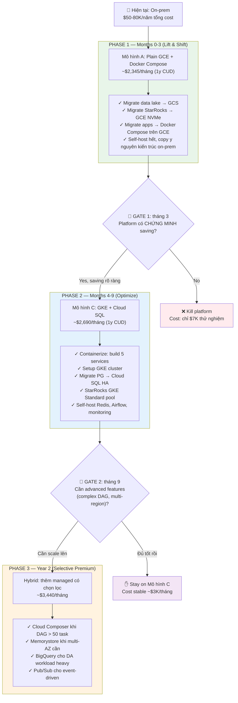

### 11.7 Phase 1 — Detail (Months 0-3, lift & shift)

**Mục tiêu:** Tối thiểu hóa rủi ro, tối thiểu chi phí, chứng minh saving.

**Layout VMs:**
```
GCP project: amobear-nexus-prod (asia-southeast1)
├── VM-APP1, VM-APP2     (n2-standard-4)   ← API + Jobs + Reporting
├── VM-PG1, VM-PG2       (n2-standard-4)   ← Patroni HA (giống doc 112)
├── VM-SR1, VM-SR2, VM-SR3 (n2-standard-16) ← StarRocks
├── VM-OPS               (n2-standard-2)   ← Airflow + Redis + Monitor
└── GCS bucket           amobear-datalake, amobear-lake
```

**Cost:**
- Tháng 1-3 (on-demand, vì chưa CUD): ~$3,485/tháng = $10,455 total
- Hoặc nếu commit 1y CUD ngay từ đầu (cho VMs ổn định): ~$2,345/tháng = $7,035 total
- **Đề xuất:** Chạy on-demand 1 tháng để verify size đúng, **sau đó commit CUD** cho VMs core (StarRocks BE × 3).

**Gate 1 — Sau 3 tháng, kiểm tra:**
- [ ] eCPM uplift đo được ≥ 3% portfolio average?
- [ ] Time-to-optimize app/GEO mới giảm từ 5-7 ngày → ≤24h?
- [ ] Mediation team thực sự dùng dashboard hàng ngày?
- [ ] Saving ước tính > $5,000/tháng (cao hơn infra cost)?

**Nếu Yes → Phase 2. Nếu No → Kill, total cost ~$7-10K (rẻ hơn lương 1 dev/tháng).**

### 11.8 Phase 2 — Detail (Months 4-9, containerize + Cloud SQL)

**Mục tiêu:** Giảm FTE ops burden, dễ scale, sẵn sàng cho growth.

**Thay đổi so với Phase 1:**
- Build 5 Dockerfiles (như §1)
- Setup GKE cluster với 2 node pools
- **Migrate PostgreSQL → Cloud SQL HA** (đây là benefit lớn nhất, bỏ Patroni)
- StarRocks chuyển từ docker-compose trên GCE → StatefulSet trên GKE Standard
- Setup Airflow trên GKE (Helm chart)
- Bắt đầu áp Resource Group trên StarRocks (§2)
- Iceberg lake setup trên GCS (§8)

**Cost:** ~$2,690/tháng (1y CUD)

**Gate 2 — Sau 9 tháng:**
- Có cần Cloud Composer? (DAG > 50 task?)
- Có cần Memorystore multi-AZ? (Redis single-node có downtime nào?)
- Có cần BigQuery? (DA workload heavy?)

### 11.9 Phase 3 — Detail (Year 2+, selective premium)

**Mục tiêu:** Chỉ thêm managed service khi có pain point cụ thể.

| Pain point | Managed service | Premium /tháng | Gate |
|-----------|----------------|---------------|------|
| Airflow self-host khó debug, DAG > 50 | Cloud Composer 3 | +$480 | DAG complexity, team size > 5 |
| Redis self-host single-node, có downtime | Memorystore HA | +$170 | Incidents ≥ 2/quarter |
| DA query làm chậm dashboard kể cả Resource Group | BigQuery ad-hoc | $5-10/TB processed | DA query volume > 1 TB/tháng |
| Multi-region DR cần thiết | Cloud SQL cross-region replica | +$300-400 | Compliance/SLA yêu cầu |
| Team scale, observability self-host overload | Cloud Operations | +$100-200 | Team > 10 engineers |

### 11.10 Tactics tối ưu chi phí GCP

```
SỬ DỤNG NGAY (giảm 30-55% compute cost):
✓ Commitment Use Discount 1-year     → -37% N2 instances
✓ Commitment Use Discount 3-year     → -55% N2 instances (cho StarRocks BE)
✓ Spot VMs cho batch workload        → -60-91% (chỉ cho jobs có thể retry)
✓ Sustained Use Discount auto        → -30% nếu chạy 24/7 (auto-apply)

STORAGE TIER:
✓ GCS Standard cho hot (< 30d)        → $0.020/GB
✓ GCS Nearline cho warm (30-90d)      → $0.010/GB
✓ GCS Coldline cho cold (90-365d)     → $0.004/GB
✓ GCS Archive cho cold (>365d)        → $0.0012/GB (rẻ hơn HDD on-prem)
✓ GCS Autoclass policy                → tự động move tier

NETWORK:
✓ VPC-native + Private Service Connect → tránh egress giữa GKE ↔ Cloud SQL
✓ Cloud CDN cho static asset           → giảm egress
✓ Same-region cho tất cả service       → không bị inter-region charge

COMPUTE OPTIMIZATION:
✓ Right-size sau 1 tháng dùng GCP Recommender
✓ Schedule shut-down VMs dev/staging (16-20h/day off)
✓ Preemptible cho jobs-transform batch (-91% nếu khéo retry)
✓ ARM (T2A) instances nếu workload tương thích → -20%

FREE TIER ALWAYS-ON (≈ $40-60/tháng saved):
✓ 1 GKE Autopilot cluster fee free
✓ Cloud Build 120 free build-minutes/day
✓ Cloud Functions 2M invocations/month free
✓ Cloud Logging 50 GB/month free
✓ Cloud Monitoring 150 MB metrics free
✓ Artifact Registry 0.5 GB storage free
✓ Secret Manager 6 active versions free

BILLING ALERTS:
✓ Setup budget alerts ngay từ ngày 1 (50%, 80%, 100%, 120%)
✓ Quota limits cho từng service (tránh runaway cost)
✓ Anomaly detection trong GCP Billing
```

### 11.11 ROI tracking framework

Để Gate 1, Gate 2 ra quyết định đúng:

```
HÀNG THÁNG, đo và report:

  💰 SAVINGS (tiền tiết kiệm)
  ├── eCPM uplift × total impressions       = $X/tháng
  ├── Fill rate uplift × revenue impact     = $X/tháng
  ├── UA optimization (ROAS improvement)    = $X/tháng
  ├── Manual hours saved × $/hour rate      = $X/tháng
  └── Faster app launch (revenue-day-zero)  = $X/tháng
  ─────────────────────────────────────────────────────
  TOTAL SAVING                              = $S /tháng

  💸 COST (chi phí thực)
  ├── GCP bill                              = $C1/tháng
  ├── Engineering time                      = $C2/tháng
  └── License/tool (Datadog, etc.)          = $C3/tháng
  ─────────────────────────────────────────────────────
  TOTAL COST                                = $C /tháng

  📊 ROI = (S - C) / C × 100%
  
  Target: ROI ≥ 200% sau Phase 1
          ROI ≥ 300% sau Phase 2
```

### 11.12 Khuyến nghị cuối — Path tối ưu cho Amobear Nexus

```
MONTH 0-3:    Mô hình A (Plain GCE + Docker Compose, lift & shift)
              Cost: ~$2,345/tháng × 3 = $7,035
              Risk: thấp nhất (giữ kiến trúc on-prem quen thuộc)
              Decision: chứng minh saving > $5K/tháng

         ↓ Gate 1 PASSED

MONTH 4-9:    Mô hình C (GKE + Cloud SQL HA, self-host phần khác)
              Cost: ~$2,690/tháng × 6 = $16,140
              Bonus: Áp Iceberg lake (§8), Resource Group (§2)
              Decision: scale platform, đo lường workload

         ↓ Gate 2 (selective)

YEAR 2+:      Hybrid — chỉ thêm managed khi có pain point cụ thể
              Cost: $2,700-$3,500/tháng tùy add-on
              Composer/Memorystore/BigQuery → chỉ khi data prove cần

  ────────────────────────────────────────────────
  Total 18 tháng đầu (gồm Phase 1+2):
    Infra: $7K + $16K = $23K
    + FTE 0.5 trong Phase 2: $9K
    = ~$32K /18 tháng
    = ~$1,800/tháng true cost
  
  So với on-prem Doc 112: $50-80K/năm
  → SAVING infra: ~$20-30K/năm
  + SAVING từ platform (business outcome): mục tiêu $60-120K/năm
  → Net ROI Year 1: $80-150K saving
```

### 11.13 Quyết định cần stakeholder approval

```
□ Approve Phase 1 budget: $7K cho 3 tháng GCP (rủi ro thấp nhất)

□ Approve criteria Gate 1:
    Saving > $5K/tháng → continue
    Saving < $5K/tháng → kill, mất $7K

□ Approve 1y CUD commitment sau tháng 1 (giảm 37% nhưng cam kết 1 năm)

□ Approve Phase 2 budget: $16K cho 6 tháng GCP nếu Gate 1 pass

□ Approve thêm 0.5 FTE data engineer cho Phase 2
    (build pipeline, tune StarRocks)

□ Approve việc bỏ Patroni complexity = approve Cloud SQL HA
    (đây là quyết định kỹ thuật quan trọng nhất Phase 2)
```

---

## 12. TÓM TẮT QUYẾT ĐỊNH SAU v1.2

| Quyết định | v1.1 | v1.2 (cost-aware) |
|-----------|------|-------------------|
| Khi nào lên GCP? | Ngay | **Phased — Phase 1 lift & shift trước** |
| Mô hình triển khai khởi đầu | GKE Autopilot + managed | **Plain GCE + Docker Compose (Mô hình A)** |
| Khi nào lên GKE? | Ngay | **Phase 2 (tháng 4) sau khi Gate 1 pass** |
| Cloud Composer | Có ngay | **Chỉ thêm khi DAG > 50 task hoặc team không devops** |
| Cloud Memorystore | Có ngay | **Chỉ thêm khi Redis self-host có incidents** |
| Cloud SQL HA | Có ngay | **Phase 2 — đây là managed service đáng tiền nhất** |
| Commitment Use Discount | Optional | **Bắt buộc cho VMs ổn định (StarRocks BE × 3)** |
| Spot VMs | Mention | **Bắt buộc cho jobs-transform batch (-91% cost)** |
| BigQuery | Optional Year 2 | **Chỉ khi DA query volume > 1 TB/tháng** |
| Gate review cadence | Không nêu | **3 tháng và 9 tháng — quyết định continue/kill/scale** |
| ROI tracking | Không nêu | **Bắt buộc — đo savings vs cost hàng tháng** |

> **Nguyên tắc vàng:** Infra cost phải có ROI ≥ 200%. **Không "đầu tư cho tương lai"** — chỉ đầu tư khi có pain point cụ thể chứng minh được.

---

*Tài liệu lập bởi Architecture Review — Amobear Nexus Q2/2026*
*Phiên bản 1.2 — Ngày: 2026-05-13*
*Liên quan: Doc 99 (Platform), 100 (Storage), 112 (Deployment v1.2), 120 (Multi-Mediation), 121 (App Health)*

*Changelog:*
- *v1.0 — Bốn vấn đề ban đầu (service split, StarRocks tier, Hangfire/Airflow, MMP reporting)*
- *v1.1 — Multi-format raw → 2-layer lake; Cloud-native trên GCP (GKE thay Docker Compose/Swarm)*
- *v1.2 — Cost optimization: so sánh 4 mô hình, phased migration với decision gate, ROI tracking framework*
- *v1.3 — .NET Core migration guide: code changes, Dockerfile, K8s manifests, common pitfalls*

---

# PHẦN MỞ RỘNG v1.3 — .NET CORE → KUBERNETES MIGRATION GUIDE

## 13. CHUYỂN ĐỔI .NET CORE PROJECTS TỪ DOCKER COMPOSE LÊN K8S

### 13.1 Mindset shift — khác biệt cơ bản

```
DOCKER COMPOSE (hiện tại)              KUBERNETES (sau migration)
──────────────────────────             ────────────────────────────
• Container chạy mãi đến khi stop      • Pod ephemeral — có thể chết bất cứ lúc nào
• Service name = container_name        • Service name = DNS qua kube-dns
• Volume = bind mount tới host         • Volume = PersistentVolumeClaim
• Network = bridge default             • Network = CNI plugin (Calico/Cilium)
• Restart: unless-stopped              • Self-healing tự động qua replicas
• Cấu hình: .env file mount            • Cấu hình: ConfigMap + Secret
• Deploy: docker compose up            • Deploy: kubectl apply (declarative)
• Health check: docker healthcheck     • Health: 3 loại probe (liveness/readiness/startup)
• Scale: docker compose scale          • Scale: HPA dựa metrics (auto)
• Logs: docker logs (file rotate)      • Logs: stdout → log aggregator
• Secrets: hardcode .env               • Secrets: K8s Secret + Workload Identity
```

> **Hệ quả kỹ thuật:** Pod có thể bị kill bất cứ lúc nào (node drain, scaling down, deploy mới). **Code .NET phải xử lý graceful shutdown, không lưu state trên local disk, không assume order khởi động.**

### 13.2 Tổng quan thay đổi cần thiết

```mermaid
flowchart LR
    subgraph CODE["📝 .NET Code Changes"]
        C1["Health check<br/>endpoints"]
        C2["Graceful shutdown<br/>SIGTERM handling"]
        C3["Config từ env vars<br/>(ConfigMap/Secret)"]
        C4["Structured logging<br/>JSON to stdout"]
        C5["No local file state<br/>Stateless design"]
        C6["Retry + Circuit Breaker<br/>(Polly)"]
        C7["Hangfire queue<br/>configuration"]
    end

    subgraph DOCKER["🐳 Dockerfile Changes"]
        D1["Multi-stage build"]
        D2["Non-root user"]
        D3["Signal handling<br/>(dotnet runtime)"]
        D4["Smaller base image"]
    end

    subgraph K8S["☸️ K8s Manifests"]
        K1["Deployment / StatefulSet"]
        K2["Service + Ingress"]
        K3["ConfigMap + Secret"]
        K4["HPA / PDB"]
        K5["ServiceAccount<br/>+ Workload Identity"]
        K6["NetworkPolicy"]
    end

    CODE --> DOCKER --> K8S
```

---

### 13.3 CODE CHANGES — Cụ thể trong .NET Core projects

#### 13.3.1 Thêm Health Check endpoints (BẮT BUỘC)

**Hiện tại** (giả định docker-compose có healthcheck):
```yaml
healthcheck:
  test: ["CMD", "curl", "-f", "http://localhost:5000/health"]
```

**Cần** trong K8s — **3 loại probe khác nhau**:

```csharp
// Program.cs — thêm vào tất cả 5 services
using Microsoft.Extensions.Diagnostics.HealthChecks;

var builder = WebApplication.CreateBuilder(args);

builder.Services.AddHealthChecks()
    // Liveness: app có sống không? (nếu fail → K8s restart pod)
    .AddCheck("self", () => HealthCheckResult.Healthy(), tags: new[] { "live" })
    
    // Readiness: sẵn sàng nhận traffic chưa? (nếu fail → K8s remove khỏi LB)
    .AddNpgSql(
        connectionString: builder.Configuration.GetConnectionString("Postgres")!,
        name: "postgres",
        tags: new[] { "ready" })
    .AddRedis(
        redisConnectionString: builder.Configuration.GetConnectionString("Redis")!,
        name: "redis",
        tags: new[] { "ready" })
    .AddMySql(   // StarRocks dùng MySQL protocol
        connectionString: builder.Configuration.GetConnectionString("StarRocks")!,
        name: "starrocks",
        tags: new[] { "ready" });

var app = builder.Build();

// 3 endpoints riêng biệt — quan trọng!
app.MapHealthChecks("/health/live", new HealthCheckOptions
{
    Predicate = check => check.Tags.Contains("live")
});

app.MapHealthChecks("/health/ready", new HealthCheckOptions
{
    Predicate = check => check.Tags.Contains("ready"),
    ResponseWriter = WriteJsonResponse  // Cho team debug
});

app.MapHealthChecks("/health/startup", new HealthCheckOptions
{
    Predicate = _ => true,   // Tất cả checks
    ResponseWriter = WriteJsonResponse
});
```

**Vì sao 3 endpoints khác nhau?**

| Probe | Mục đích | Fail → action | Tần suất |
|-------|---------|--------------|---------|
| **Liveness** | App có chết không? | K8s restart pod | 10s |
| **Readiness** | Có sẵn sàng nhận request? | Remove khỏi Service endpoints | 5s |
| **Startup** | Đã khởi động xong chưa? | Đợi (cho phép slow start) | 5s, timeout 60s |

> **Lỗi phổ biến:** Dùng chung 1 endpoint `/health` cho cả 3 → khi DB tạm chậm, pod bị restart liên tục (lặp Liveness fail). Phải tách: Liveness chỉ check process tồn tại, Readiness mới check dependencies.

#### 13.3.2 Graceful shutdown (BẮT BUỘC, đặc biệt cho Hangfire)

K8s gửi `SIGTERM` khi shutdown pod, đợi 30s mặc định rồi `SIGKILL`. .NET phải xử lý đúng:

```csharp
// Program.cs
var builder = WebApplication.CreateBuilder(args);

// Configure graceful shutdown timeout
builder.Services.Configure<HostOptions>(opts =>
{
    opts.ShutdownTimeout = TimeSpan.FromSeconds(60);   // > preStop hook
});

var app = builder.Build();

// Cleanup khi shutdown
app.Lifetime.ApplicationStopping.Register(() =>
{
    Log.Information("Graceful shutdown initiated...");
    // Stop accept new requests, drain in-flight
});

app.Lifetime.ApplicationStopped.Register(() =>
{
    Log.Information("Application stopped cleanly");
    Log.CloseAndFlush();
});

await app.RunAsync();
```

**Cho Hangfire service** (Jobs-Sync, Jobs-Transform) — đặc biệt quan trọng:

```csharp
// MediationPro.Jobs.Sync/Program.cs
builder.Services.AddHangfire(config => config
    .UsePostgreSqlStorage(connStr)
    .UseFilter(new AutomaticRetryAttribute { Attempts = 3 }));

builder.Services.AddHangfireServer(opts =>
{
    opts.Queues = new[] { "sync", "default" };
    opts.WorkerCount = Environment.ProcessorCount * 2;
    
    // CRITICAL: cho Hangfire 50s để hoàn thành job đang chạy
    opts.ShutdownTimeout = TimeSpan.FromSeconds(50);
    opts.StopTimeout = TimeSpan.FromSeconds(50);
});

var app = builder.Build();

// PreStop hook trong K8s phải đợi > opts.ShutdownTimeout
```

K8s manifest tương ứng:

```yaml
# Trong Deployment spec
spec:
  template:
    spec:
      terminationGracePeriodSeconds: 90   # > 50s Hangfire shutdown
      containers:
        - name: jobs-sync
          lifecycle:
            preStop:
              exec:
                command: ["/bin/sh", "-c", "sleep 10"]   # cho LB drain
```

#### 13.3.3 Configuration: từ .env → Environment variables (ConfigMap/Secret)

**Hiện tại** docker-compose:
```yaml
environment:
  - ConnectionStrings__Postgres=Host=pg;Database=mediation
  - ASPNETCORE_ENVIRONMENT=Production
```

**Trong K8s** — `appsettings.json` vẫn dùng, nhưng override qua env:

```csharp
// Program.cs — không cần sửa nếu đang dùng standard pattern
var builder = WebApplication.CreateBuilder(args);

// ASP.NET Core tự động đọc theo thứ tự:
// 1. appsettings.json
// 2. appsettings.{Environment}.json
// 3. Environment variables  ← K8s ConfigMap/Secret inject vào đây
// 4. Command line args

var connStr = builder.Configuration.GetConnectionString("Postgres");
```

K8s manifests cần tạo:

```yaml
# ConfigMap — non-sensitive config
apiVersion: v1
kind: ConfigMap
metadata:
  name: api-config
  namespace: app
data:
  ASPNETCORE_ENVIRONMENT: "Production"
  ASPNETCORE_URLS: "http://+:8080"
  Logging__LogLevel__Default: "Information"
  StarRocks__Host: "starrocks-fe.data.svc.cluster.local"
  StarRocks__Port: "9030"
---
# Secret — sensitive (DB password, API keys)
apiVersion: v1
kind: Secret
metadata:
  name: api-secrets
  namespace: app
type: Opaque
stringData:
  ConnectionStrings__Postgres: "Host=10.x.x.x;Database=mediation;Username=mediation_app;Password=xxx"
  ConnectionStrings__StarRocks: "Server=starrocks-fe;Port=9030;User=app;Password=xxx"
  AdMob__ClientSecret: "xxx"
  Adjust__ApiKey: "xxx"
```

**Tốt hơn: GCP Secret Manager + Workload Identity** (không lưu secret trong K8s):

```csharp
// Program.cs — tích hợp GCP Secret Manager
using Google.Cloud.SecretManager.V1;

var builder = WebApplication.CreateBuilder(args);

if (builder.Environment.IsProduction())
{
    builder.Configuration.AddSecretManager(
        projectId: "amobear-nexus-prod",
        configureClient: client => { /* uses Workload Identity */ });
}
```

#### 13.3.4 Structured Logging — JSON to stdout

**Hiện tại** (giả định):
```csharp
// Có thể đang log ra file hoặc plain text
Log.Logger = new LoggerConfiguration()
    .WriteTo.File("logs/app.log")  // ❌ không hoạt động trong K8s
    .CreateLogger();
```

**K8s pattern** — log JSON ra stdout, K8s tự collect:

```csharp
// Program.cs
using Serilog;
using Serilog.Formatting.Compact;

builder.Host.UseSerilog((ctx, cfg) => cfg
    .ReadFrom.Configuration(ctx.Configuration)
    .Enrich.FromLogContext()
    .Enrich.WithMachineName()        // pod name
    .Enrich.WithProperty("service", "api")
    .Enrich.WithProperty("version", Environment.GetEnvironmentVariable("APP_VERSION"))
    .WriteTo.Console(new CompactJsonFormatter())   // ← JSON stdout
);

// Correlation ID middleware (trace across services)
app.Use(async (context, next) =>
{
    var correlationId = context.Request.Headers["X-Correlation-Id"].FirstOrDefault()
                       ?? Guid.NewGuid().ToString();
    context.Response.Headers["X-Correlation-Id"] = correlationId;
    using (LogContext.PushProperty("CorrelationId", correlationId))
    {
        await next();
    }
});
```

**Lợi ích:** Cloud Logging tự parse JSON, search field như `service:api AND severity:ERROR AND CorrelationId:abc123`.

#### 13.3.5 Stateless — không lưu file local

**Cần audit code tìm:**

```csharp
// ❌ KHÔNG dùng:
File.WriteAllText("/tmp/cache.json", data);              // mất khi pod restart
Directory.CreateDirectory("./logs/");                     // mất
var path = HostingEnvironment.MapPath("~/uploads/");      // mất

// ✅ Thay bằng:
await _gcsClient.UploadAsync(bucket, key, stream);        // GCS persistent
await _redis.SetAsync(key, value, TimeSpan.FromHours(1)); // Redis cho cache
await _starRocks.InsertAsync(...);                        // DB cho data
```

**Hangfire job** — nếu đang ghi file tạm:

```csharp
// ❌ Cũ — ghi tạm Parquet ra disk
public async Task SyncTodayAsync()
{
    var tempFile = Path.Combine(Path.GetTempPath(), "today.parquet");
    await DownloadAndSave(tempFile);
    await UploadToMinIO(tempFile);
    File.Delete(tempFile);
}

// ✅ Mới — stream trực tiếp
public async Task SyncTodayAsync()
{
    using var stream = new MemoryStream();   // hoặc PipeReader
    await DownloadToStream(stream);
    stream.Position = 0;
    await UploadToGCS(stream);
}
```

> Nếu thực sự cần file tạm (lớn, không fit RAM) → dùng `emptyDir` volume trong K8s (xóa khi pod chết, OK).

#### 13.3.6 Connection management — Cloud SQL Proxy

Trên GCP với Cloud SQL, **không nên kết nối trực tiếp qua IP**:

```csharp
// ❌ Cũ — connection string IP
"ConnectionStrings:Postgres": "Host=10.x.x.x;Port=5432;..."

// ✅ Mới — qua Cloud SQL Auth Proxy sidecar
"ConnectionStrings:Postgres": "Host=127.0.0.1;Port=5432;..."
```

K8s manifest có 2 container:

```yaml
spec:
  containers:
    - name: api
      image: amobear/api:v1.0
      env:
        - name: ConnectionStrings__Postgres
          value: "Host=127.0.0.1;Port=5432;Database=mediation;..."
    
    - name: cloud-sql-proxy
      image: gcr.io/cloud-sql-connectors/cloud-sql-proxy:latest
      args:
        - "--structured-logs"
        - "--port=5432"
        - "amobear-nexus-prod:asia-southeast1:mediation-pg"
      securityContext:
        runAsNonRoot: true
      resources:
        requests: { cpu: "100m", memory: "128Mi" }
```

#### 13.3.7 Polly — Retry + Circuit Breaker (BẮT BUỘC)

Pod restart, DB failover, network blip — đều phải resilient:

```csharp
// MediationPro.Infrastructure/HttpClientExtensions.cs
using Polly;
using Polly.Extensions.Http;

builder.Services.AddHttpClient<IAdMobClient, AdMobClient>(client =>
{
    client.BaseAddress = new Uri("https://admob.googleapis.com/");
    client.Timeout = TimeSpan.FromSeconds(30);
})
.AddPolicyHandler(GetRetryPolicy())
.AddPolicyHandler(GetCircuitBreakerPolicy());

static IAsyncPolicy<HttpResponseMessage> GetRetryPolicy() =>
    HttpPolicyExtensions
        .HandleTransientHttpError()  // 5xx, 408
        .OrResult(r => r.StatusCode == HttpStatusCode.TooManyRequests)
        .WaitAndRetryAsync(
            retryCount: 3,
            sleepDurationProvider: retry =>
                TimeSpan.FromSeconds(Math.Pow(2, retry)),   // 2s, 4s, 8s
            onRetry: (outcome, ts, retry, ctx) =>
                Log.Warning("Retry {Retry} after {Delay}s", retry, ts.TotalSeconds));

static IAsyncPolicy<HttpResponseMessage> GetCircuitBreakerPolicy() =>
    HttpPolicyExtensions
        .HandleTransientHttpError()
        .CircuitBreakerAsync(
            handledEventsAllowedBeforeBreaking: 5,
            durationOfBreak: TimeSpan.FromMinutes(1));
```

**Tương tự cho DB connections** — EF Core có sẵn:

```csharp
builder.Services.AddDbContext<MediationDbContext>(opts =>
    opts.UseNpgsql(connStr, npgsql => npgsql.EnableRetryOnFailure(
        maxRetryCount: 5,
        maxRetryDelay: TimeSpan.FromSeconds(30),
        errorCodesToAdd: null))
);
```

#### 13.3.8 Hangfire — chuẩn bị cho multi-pod environment

**Vấn đề:** Nếu deploy Hangfire Worker với 2+ replicas → mỗi pod chạy lịch độc lập → cron jobs duplicate.

**Giải pháp:** Hangfire có built-in distributed lock qua PostgreSQL — đảm bảo chỉ 1 worker chạy 1 recurring job tại 1 thời điểm:

```csharp
// MediationPro.Jobs.Sync/Program.cs
builder.Services.AddHangfire(config => config
    .UsePostgreSqlStorage(c => c
        .UseNpgsqlConnection(connStr)
        .UseQueuePollInterval(TimeSpan.FromSeconds(5)))
    .UseFilter(new DisableConcurrentExecutionAttribute(60)));  // lock 60s per recurring job

builder.Services.AddHangfireServer(opts =>
{
    opts.ServerName = $"{Environment.MachineName}-{Guid.NewGuid():N}";  // unique per pod
    opts.Queues = new[] { "sync", "default" };
    opts.WorkerCount = 8;
});
```

> **Vẫn nên dùng StatefulSet với 1 replica** cho Hangfire Jobs-Sync để **đơn giản hóa debugging**, scaling theo queue depth khi cần. Jobs-Transform có thể nhiều replica vì job-level idempotent.

#### 13.3.9 Database migrations — KHÔNG chạy on startup

**Sai pattern phổ biến:**
```csharp
// ❌ Program.cs
var app = builder.Build();
using (var scope = app.Services.CreateScope())
{
    var db = scope.ServiceProvider.GetRequiredService<MediationDbContext>();
    db.Database.Migrate();   // ❌ Race condition khi 5 pod cùng start
}
```

**Đúng pattern** — Init Container hoặc Kubernetes Job:

```yaml
# k8s/jobs/migrate-db.yaml
apiVersion: batch/v1
kind: Job
metadata:
  name: db-migrate-v1-0-5
  namespace: app
spec:
  template:
    spec:
      restartPolicy: OnFailure
      containers:
        - name: migrate
          image: amobear/api:v1.0.5
          command: ["dotnet", "ef", "database", "update"]
          env:
            - name: ConnectionStrings__Postgres
              valueFrom:
                secretKeyRef: { name: api-secrets, key: pg-conn }
```

CI/CD chạy Job này **trước** khi deploy Deployment mới.

---

### 13.4 DOCKERFILE — Best practices cho K8s

**Hiện tại có thể đang dùng:**
```dockerfile
FROM mcr.microsoft.com/dotnet/sdk:8.0
COPY . .
RUN dotnet publish -c Release -o /app
CMD ["dotnet", "/app/MediationPro.Api.dll"]
```

**Cải tiến cho production K8s:**

```dockerfile
# syntax=docker/dockerfile:1.6

# ========= Stage 1: Build =========
FROM mcr.microsoft.com/dotnet/sdk:8.0-alpine AS build
WORKDIR /src

# Copy csproj first để Docker cache layer restore
COPY ["src/MediationPro.Domain/MediationPro.Domain.csproj", "MediationPro.Domain/"]
COPY ["src/MediationPro.Infrastructure/MediationPro.Infrastructure.csproj", "MediationPro.Infrastructure/"]
COPY ["src/MediationPro.Api/MediationPro.Api.csproj", "MediationPro.Api/"]

RUN dotnet restore "MediationPro.Api/MediationPro.Api.csproj"

# Copy source và build
COPY src/ .
RUN dotnet publish "MediationPro.Api/MediationPro.Api.csproj" \
    -c Release \
    -o /app/publish \
    /p:UseAppHost=false

# ========= Stage 2: Runtime =========
FROM mcr.microsoft.com/dotnet/aspnet:8.0-alpine AS runtime

# Tạo non-root user
RUN addgroup -g 1000 -S app && adduser -u 1000 -S app -G app

WORKDIR /app
COPY --from=build --chown=app:app /app/publish .

# K8s sẽ inject env qua ConfigMap; default cho local
ENV ASPNETCORE_URLS=http://+:8080 \
    ASPNETCORE_ENVIRONMENT=Production \
    DOTNET_RUNNING_IN_CONTAINER=true \
    DOTNET_PRINT_TELEMETRY_MESSAGE=false

USER app
EXPOSE 8080

# Health check ở K8s probe, không cần ở Docker
# HEALTHCHECK không hoạt động trong K8s — bỏ

# Signal handling: dotnet runtime đã xử lý SIGTERM đúng
ENTRYPOINT ["dotnet", "MediationPro.Api.dll"]
```

**Key changes:**
- Alpine base → image size từ ~210 MB → ~110 MB
- Non-root user (security)
- Multi-stage build (build artifacts không trong final image)
- Bỏ `HEALTHCHECK` Docker (K8s probe replace)
- `chown` đúng user

**Cho mỗi service trong monorepo** — Dockerfile riêng:

```
src/
├── MediationPro.Api/Dockerfile
├── MediationPro.Reporting/Dockerfile
├── MediationPro.Jobs.Sync/Dockerfile
├── MediationPro.Jobs.Transform/Dockerfile
└── MediationPro.Ai/Dockerfile
```

---

### 13.5 K8S MANIFESTS — Ví dụ đầy đủ cho 1 service

#### 13.5.1 API Service (stateless, HPA)

```yaml
# k8s/api/deployment.yaml
apiVersion: apps/v1
kind: Deployment
metadata:
  name: api
  namespace: app
  labels:
    app: api
    tier: frontend
spec:
  replicas: 2
  revisionHistoryLimit: 5
  strategy:
    type: RollingUpdate
    rollingUpdate:
      maxSurge: 1
      maxUnavailable: 0    # Zero downtime
  selector:
    matchLabels:
      app: api
  template:
    metadata:
      labels:
        app: api
      annotations:
        prometheus.io/scrape: "true"
        prometheus.io/port: "8080"
        prometheus.io/path: "/metrics"
    spec:
      serviceAccountName: api-sa                # Workload Identity
      terminationGracePeriodSeconds: 60
      containers:
        - name: api
          image: asia-southeast1-docker.pkg.dev/amobear-nexus-prod/images/api:v1.0.5
          imagePullPolicy: IfNotPresent
          
          ports:
            - name: http
              containerPort: 8080
          
          envFrom:
            - configMapRef: { name: api-config }
            - secretRef:    { name: api-secrets }
          
          env:
            - name: POD_NAME
              valueFrom: { fieldRef: { fieldPath: metadata.name } }
            - name: NODE_NAME
              valueFrom: { fieldRef: { fieldPath: spec.nodeName } }
            - name: APP_VERSION
              value: "v1.0.5"
          
          resources:
            requests:
              cpu: "200m"
              memory: "512Mi"
            limits:
              cpu: "1000m"
              memory: "1Gi"
          
          startupProbe:
            httpGet: { path: /health/startup, port: 8080 }
            failureThreshold: 30
            periodSeconds: 5     # 30 × 5s = 150s total cho phép slow start
          
          livenessProbe:
            httpGet: { path: /health/live, port: 8080 }
            periodSeconds: 10
            failureThreshold: 3
            timeoutSeconds: 5
          
          readinessProbe:
            httpGet: { path: /health/ready, port: 8080 }
            periodSeconds: 5
            failureThreshold: 2
            timeoutSeconds: 3
          
          lifecycle:
            preStop:
              exec:
                command: ["/bin/sh", "-c", "sleep 10"]   # cho LB drain
          
          securityContext:
            runAsNonRoot: true
            runAsUser: 1000
            readOnlyRootFilesystem: true
            allowPrivilegeEscalation: false
            capabilities: { drop: ["ALL"] }
          
          volumeMounts:
            - name: tmp
              mountPath: /tmp
        
        # Cloud SQL Auth Proxy sidecar
        - name: cloud-sql-proxy
          image: gcr.io/cloud-sql-connectors/cloud-sql-proxy:2.8.2
          args:
            - "--port=5432"
            - "--structured-logs"
            - "amobear-nexus-prod:asia-southeast1:mediation-pg"
          securityContext:
            runAsNonRoot: true
          resources:
            requests: { cpu: "50m", memory: "64Mi" }
            limits:   { cpu: "200m", memory: "128Mi" }
      
      volumes:
        - name: tmp
          emptyDir: { sizeLimit: "100Mi" }

      topologySpreadConstraints:
        - maxSkew: 1
          topologyKey: topology.kubernetes.io/zone
          whenUnsatisfiable: ScheduleAnyway
          labelSelector:
            matchLabels: { app: api }

---
# k8s/api/service.yaml
apiVersion: v1
kind: Service
metadata:
  name: api
  namespace: app
spec:
  type: ClusterIP
  selector: { app: api }
  ports:
    - name: http
      port: 80
      targetPort: 8080

---
# k8s/api/hpa.yaml
apiVersion: autoscaling/v2
kind: HorizontalPodAutoscaler
metadata:
  name: api
  namespace: app
spec:
  scaleTargetRef:
    apiVersion: apps/v1
    kind: Deployment
    name: api
  minReplicas: 2
  maxReplicas: 10
  metrics:
    - type: Resource
      resource:
        name: cpu
        target: { type: Utilization, averageUtilization: 70 }
    - type: Resource
      resource:
        name: memory
        target: { type: Utilization, averageUtilization: 75 }
  behavior:
    scaleDown:
      stabilizationWindowSeconds: 300
      policies:
        - type: Percent
          value: 50
          periodSeconds: 60
    scaleUp:
      stabilizationWindowSeconds: 30
      policies:
        - type: Percent
          value: 100
          periodSeconds: 30

---
# k8s/api/pdb.yaml
apiVersion: policy/v1
kind: PodDisruptionBudget
metadata:
  name: api
  namespace: app
spec:
  minAvailable: 1
  selector:
    matchLabels: { app: api }
```

#### 13.5.2 Jobs-Sync (StatefulSet, single replica)

```yaml
# k8s/jobs-sync/statefulset.yaml
apiVersion: apps/v1
kind: StatefulSet
metadata:
  name: jobs-sync
  namespace: jobs
spec:
  serviceName: jobs-sync
  replicas: 1               # Single replica for cron sanity
  selector:
    matchLabels: { app: jobs-sync }
  template:
    metadata:
      labels: { app: jobs-sync }
    spec:
      serviceAccountName: jobs-sync-sa
      terminationGracePeriodSeconds: 90    # > Hangfire shutdown 50s
      containers:
        - name: jobs-sync
          image: asia-southeast1-docker.pkg.dev/.../jobs-sync:v1.0.5
          envFrom:
            - configMapRef: { name: jobs-config }
            - secretRef:    { name: jobs-secrets }
          env:
            - name: HangfireQueues
              value: "sync,default"
            - name: HangfireWorkerCount
              value: "8"
          resources:
            requests: { cpu: "500m", memory: "1Gi" }
            limits:   { cpu: "2", memory: "2Gi" }
          # Liveness chỉ check Hangfire server alive
          livenessProbe:
            httpGet: { path: /health/live, port: 8080 }
            periodSeconds: 30
          # Readiness check connection DB/StarRocks
          readinessProbe:
            httpGet: { path: /health/ready, port: 8080 }
            periodSeconds: 10
```

#### 13.5.3 Workload Identity binding (GCP)

```yaml
# k8s/api/serviceaccount.yaml
apiVersion: v1
kind: ServiceAccount
metadata:
  name: api-sa
  namespace: app
  annotations:
    # Bind với GCP IAM service account
    iam.gke.io/gcp-service-account: api@amobear-nexus-prod.iam.gserviceaccount.com
```

GCP IAM:
```bash
# Cho phép K8s SA impersonate GCP SA
gcloud iam service-accounts add-iam-policy-binding \
  api@amobear-nexus-prod.iam.gserviceaccount.com \
  --role roles/iam.workloadIdentityUser \
  --member "serviceAccount:amobear-nexus-prod.svc.id.goog[app/api-sa]"

# Grant GCP permissions cho GCP SA
gcloud projects add-iam-policy-binding amobear-nexus-prod \
  --member "serviceAccount:api@amobear-nexus-prod.iam.gserviceaccount.com" \
  --role "roles/cloudsql.client"
```

→ Code .NET **không cần key file**, tự lấy credential qua Workload Identity.

---

### 13.6 INGRESS — Expose service ra ngoài

```yaml
# k8s/ingress.yaml
apiVersion: networking.k8s.io/v1
kind: Ingress
metadata:
  name: nexus-ingress
  namespace: app
  annotations:
    kubernetes.io/ingress.class: "gce"
    kubernetes.io/ingress.global-static-ip-name: "nexus-ip"
    networking.gke.io/managed-certificates: "nexus-cert"
    cloud.google.com/armor-config: '{"prod-armor-policy":"prod-armor-policy"}'
spec:
  rules:
    - host: api.nexus.amobear.internal
      http:
        paths:
          - path: /*
            pathType: ImplementationSpecific
            backend:
              service: { name: api, port: { number: 80 } }
    - host: dashboard.nexus.amobear.internal
      http:
        paths:
          - path: /*
            pathType: ImplementationSpecific
            backend:
              service: { name: reporting, port: { number: 80 } }
---
apiVersion: networking.gke.io/v1
kind: ManagedCertificate
metadata:
  name: nexus-cert
spec:
  domains:
    - api.nexus.amobear.internal
    - dashboard.nexus.amobear.internal
```

---

### 13.7 Mapping cụ thể 5 services Amobear Nexus

| Service | K8s resource | Replicas | HPA | Đặc thù |
|---------|-------------|----------|-----|---------|
| **MediationPro.Api** | `Deployment` | 2-10 | CPU 70% | Stateless, Ingress |
| **MediationPro.Reporting** | `Deployment` | 2-6 | CPU 70% + memory | Cache friendly, Ingress |
| **MediationPro.Jobs.Sync** | `StatefulSet` | 1 (fixed) | Không | Distributed lock qua DB |
| **MediationPro.Jobs.Transform** | `Deployment` | 1-4 | Queue depth (custom metric) | Idempotent jobs OK scale |
| **MediationPro.Ai** | `Deployment` | 1-3 | Memory | Long-running, sticky session optional |

**Operational jobs (CronJob native K8s)** — thay 1 phần Hangfire:

```yaml
# Token refresh — đơn giản hơn Hangfire
apiVersion: batch/v1
kind: CronJob
metadata:
  name: token-refresh
spec:
  schedule: "*/30 * * * *"
  concurrencyPolicy: Forbid
  successfulJobsHistoryLimit: 3
  failedJobsHistoryLimit: 3
  jobTemplate:
    spec:
      template:
        spec:
          restartPolicy: OnFailure
          containers:
            - name: token-refresh
              image: amobear/jobs-sync:v1.0.5
              command: ["dotnet", "MediationPro.Jobs.Sync.dll", "--job", "token-refresh"]
```

---

### 13.8 MIGRATION CHECKLIST — Trình tự an toàn

```
PHASE 0: Chuẩn bị code (Tuần 1-2)
□ Add health check endpoints (/live, /ready, /startup) cho 5 services
□ Implement graceful shutdown (HostOptions.ShutdownTimeout)
□ Audit code tìm File I/O local → thay GCS/Redis/DB
□ Add Polly retry policy cho HTTP clients + EF Core retry
□ Convert logging → Serilog JSON to stdout
□ Verify Hangfire DisableConcurrentExecutionAttribute áp dụng
□ Move appsettings secret → env var pattern
□ Test trên local Docker Compose với env vars (không dùng .env file)

PHASE 1: Dockerize đúng chuẩn (Tuần 2-3)
□ Refactor monorepo thành 5 csproj entry riêng (xem §1.5)
□ Viết 5 Dockerfile multi-stage non-root user
□ Build images, push lên Artifact Registry
□ Test local: kind cluster hoặc Docker Desktop K8s

PHASE 2: K8s manifests (Tuần 3-4)
□ ConfigMap + Secret cho từng service
□ Deployment/StatefulSet manifests
□ Service + Ingress
□ HPA + PDB
□ ServiceAccount + Workload Identity binding
□ NetworkPolicy (cho phép api → cloud sql proxy, etc.)
□ Migrate DB Job spec

PHASE 3: GKE deployment (Tuần 4-5)
□ GKE cluster setup (Autopilot pool + Standard pool)
□ Cloud SQL proxy sidecar trong từng pod cần PG
□ Deploy Migrate Job trước
□ Deploy 1 service (API) trước, verify health
□ Deploy lần lượt 4 service còn lại
□ Setup Cloud Monitoring dashboards
□ Setup Cloud Logging filter alerts

PHASE 4: Production cutover (Tuần 5-6)
□ DNS cutover về Cloud Load Balancer
□ Disable Docker Compose services on-prem
□ Monitor 1 tuần parallel
□ Decommission on-prem
```

---

### 13.9 COMMON PITFALLS — Lỗi thường gặp khi migrate

| # | Pitfall | Triệu chứng | Fix |
|---|---------|------------|-----|
| 1 | Liveness probe quá strict | Pod restart liên tục khi DB chậm | Liveness chỉ check process, không DB |
| 2 | Hangfire chạy 2 replica | Cron job trùng | StatefulSet 1 replica HOẶC DisableConcurrentExecution |
| 3 | Không có graceful shutdown | Job đang chạy bị mất | `terminationGracePeriodSeconds` > Hangfire `ShutdownTimeout` |
| 4 | Ghi file local | Mất khi pod restart | GCS / Redis / DB / emptyDir |
| 5 | Database migrate on startup | Race condition 5 pods cùng migrate | K8s Job riêng chạy trước Deployment |
| 6 | Hard-code connection string IP | Sai khi Cloud SQL failover | Cloud SQL Proxy sidecar |
| 7 | Log to file | Lost forever | Serilog Console JSON |
| 8 | Không setup readinessProbe | Traffic vào pod chưa ready → 500 | Required cho rolling update |
| 9 | resources.limits quá tight | Pod OOMKilled | Test profiling trước, set limits với buffer |
| 10 | Không có PDB | Cluster maintenance kill hết replica | PDB minAvailable: 1 |
| 11 | Service-to-service qua localhost | Sai (mỗi pod khác) | Dùng K8s Service DNS: `api.app.svc.cluster.local` |
| 12 | Secret trong ConfigMap | Lộ secret | Phải dùng Secret kind, hoặc Secret Manager + Workload Identity |
| 13 | Startup probe failureThreshold thấp | Pod chưa kịp khởi động đã bị kill | Tăng `failureThreshold × periodSeconds` ≥ thực tế startup time |
| 14 | Không config `topologySpreadConstraints` | Tất cả replicas cùng node → SPOF | Spread across zones |
| 15 | EF Core không retry | Transient failure → 500 | `EnableRetryOnFailure(5)` |

---

### 13.10 Effort estimate cho team .NET hiện tại

| Component | Effort | Người làm | Risk |
|-----------|--------|-----------|------|
| Health check + graceful shutdown | 1-2 ngày × 5 service | Backend dev | Thấp |
| Audit & fix File I/O | 2-3 ngày | Backend dev | Trung bình (có thể miss case) |
| Logging migration to Serilog JSON | 1 ngày | Backend dev | Thấp |
| Polly retry policies | 1-2 ngày | Backend dev | Thấp |
| Refactor monorepo thành 5 csproj | 3-5 ngày | Senior backend | Trung bình (DI rewiring) |
| Dockerfile × 5 | 1 ngày | Senior backend | Thấp |
| K8s manifests | 3-5 ngày | DevOps/Senior backend | Trung bình (cần học) |
| GKE cluster + Cloud SQL setup | 2-3 ngày | DevOps | Trung bình |
| CI/CD pipeline GitHub Actions → Cloud Build | 3-5 ngày | DevOps | Trung bình |
| Testing + cutover | 1 tuần | Cả team | Cao |
| **TỔNG ESTIMATE** | **6-8 tuần** | 2-3 người | Trung bình tổng thể |

> **Đề xuất:** 1 senior backend làm refactor + K8s manifests chính, 1 DevOps setup infra + CI/CD song song. Phase 0 (code changes) làm song song với Phase 2 (manifests) để rút ngắn timeline.

---

### 13.11 Tóm tắt — 10 thay đổi quan trọng nhất

```
①  Thêm 3 health check endpoints riêng biệt (live/ready/startup)
②  Implement graceful shutdown với SIGTERM handling
③  Convert logging sang Serilog JSON to stdout
④  Loại bỏ tất cả File I/O local → dùng GCS/Redis/DB
⑤  Thêm Polly retry + circuit breaker cho HTTP + DB
⑥  Hangfire DisableConcurrentExecutionAttribute cho recurring jobs
⑦  Database migration tách thành K8s Job riêng (không on startup)
⑧  Refactor monorepo thành 5 csproj entry độc lập
⑨  Dockerfile multi-stage build với non-root user, alpine base
⑩  Workload Identity thay vì service account key file
```

> **Bottom line:** Đa số change ở code .NET là **nhỏ và quy chuẩn cao** — đã có sẵn pattern trong .NET ecosystem. Không phải rewrite, chỉ là adopt best practices.
