# 135 — Nexus Reporting Feature Spec

> **Phân tích so sánh Adjust & XMP → Thiết kế tính năng Report cho Amobear Nexus**
>
> Ngày tạo: 2026-05-26 | Tham chiếu: `docs/reports/adjust/`, `docs/reports/xmp/`, `docs/reports/nexus/`

---

## 1. Hiện trạng Nexus Report

Nexus hiện có **hai** luồng báo cáo performance chính:


| Route                 | Mô tả                                                                                        |
| --------------------- | -------------------------------------------------------------------------------------------- |
| `/reports`            | **Custom Report** — granularity ad-unit, saved reports, filter metric nâng cao               |
| `/reports/my-reports` | **My Reports (Phase 1–3)** — flat table Adjust-style, charts, pivot, templates, cùng engine `POST /api/v1/reports/query` |
| `/reports/waterfall`  | **Waterfall Optimization Report** — SoW%, eCPM, Fill Rate theo ad network (Phase 3) |
| `/reports/overview`   | **Overview Report** — KPI Plan vs Actual, cột tháng, team scope                              |


Custom Report / Overview Report vẫn giữ giao diện và hành vi hiện có. My Reports Phase 1 (2026-06) bổ sung shell UI mới; chi tiết trạng thái xem **§15**.

**Custom Report** (và legacy view tương tự) vẫn có:

- Chọn **Yearly Month**, **BU**, **All apps**
- Bảng phẳng theo app: Ad Revenue, IAP, UA Cost, Profit
- Add filter, Export, Parameters & Metrics panel phải

**Chưa có (toàn platform / Phase 2b+):** dimension Country/Channel trên Gold grain hiện tại, cohort ROAS/LTV Meta/TikTok/AppsFlyer trên My Reports, per-channel Kanban reports, App P&L per-channel builder trong My Reports shell.

**Đã có trên My Reports (Phase 2 MVP):** Period Comparison (dual query + Δ%), Charts (line/bar/area/combo/pie/scorecard + multi-metric), Pin columns, tab Adjust metrics, Compare to external tag, IAP per-app overrides — xem **§15.2**.

**Đã có trên My Reports (Phase 3 MVP):** Custom Formula, Save/Load/Share templates, Pivot table, Waterfall optimization report — xem **§15.3**.

---

## 2. Phân tích Adjust — Điểm mạnh

### 2.1 Dữ liệu phẳng hóa (Flat Table)

Adjust phẳng hóa mọi dữ liệu về **1 bảng duy nhất** với hàng = ngày (hoặc dimension khác), cột = metrics tùy chọn. Người dùng xem được toàn bộ bức tranh revenue/cost/ROAS trên 1 màn hình mà không cần chuyển tab hay drill-down.


| Đặc điểm             | Chi tiết                                                                                                   |
| -------------------- | ---------------------------------------------------------------------------------------------------------- |
| **Dimension chính**  | Day (date) — có thể thay bằng App, Country, Platform, OS, Ad account ID, Channel, Currency, App Store type |
| **Metrics mặc định** | Ad spend, Ad revenue, In-app revenue, AD revenue, All revenue                                              |
| **ROAS series**      | 0D → 1D → 2D → 3D → 7D → 14D → 28D → 60D ROAS                                                              |
| **Retention series** | 14D → 28D → 38D → 45D → 50D → 60D Retention                                                                |
| **Tổng cộng**        | Dòng **Total** cuối bảng tự tính                                                                           |


### 2.2 So sánh thời kỳ (Compare to)

Một trong những tính năng mạnh nhất — dropdown cho phép chọn nhanh:


| Tùy chọn        | Khoảng so sánh (ví dụ kỳ gốc May 01–26, 2026) |
| --------------- | --------------------------------------------- |
| Previous period | Apr 05 – Apr 30, 2026                         |
| Day ago         | Apr 30 – May 25, 2026                         |
| Week ago        | Apr 24 – May 19, 2026                         |
| Month ago       | Apr 01 – Apr 26, 2026                         |
| Quarter ago     | Feb 01 – Feb 26, 2026                         |
| Year ago        | May 01 – May 26, 2025                         |
| Custom date     | Tự chọn                                       |
| No comparison   | Tắt                                           |


Khi bật compare, bảng hiển thị **2 giá trị + % thay đổi** trên mỗi ô metric.

### 2.3 IAP Revenue Mode

Adjust cho phép chọn **tỷ lệ quy đổi IAP revenue** thay vì dùng gross:

- **70% of Gross** (mặc định — trừ 30% Apple/Google commission)
- **85% of Gross** (cho Small Business Program — 15% commission)
- **100% (Gross)**
- Nexus nên hỗ trợ cấu hình tỷ lệ này **per app** (vì mỗi app có thể thuộc chương trình fee khác nhau).

### 2.4 Data Configuration Panel

Panel bên trái với 2 nhóm bộ lọc có thể search:

**Time:**

- Date Period (preset: This Month Rolling, Last 7 days, Last 30 days, Custom)
- Compare to

**Filters:**

- App (single/multi select)
- Monetization Partners
- Channel (All / specific)
- App Currency
- Store Type
- Ad Revenue Sources (vd. AppLovin MAX SDK)
- Attribution (types, source, status)

### 2.5 Edit Table — Dimensions & Metrics

Panel **Edit table** bên phải cho phép:

- **Tab Dimensions**: Chọn dimension làm cột nhóm — Day, App store ID, OS name, Platform, Currency, Country, Ad account ID
- **Tab Metrics**: Chọn từ danh mục phân nhóm:
  - Deliverable KPIs
  - Cohorted performance (Retention, Sessions, Time spent, Ad impressions, LTV, Revenue, Revenue per user)
  - SKAN
  - Aggregated ad revenue metrics
  - Purchase verification
  - Subscription metrics
  - Signature metrics
  - Custom metrics
- **Drag & drop** để sắp xếp thứ tự cột
- **Xóa** cột bằng icon thùng rác

### 2.6 Flat Table vs Pivot Table

Adjust cung cấp 2 chế độ xem — **cùng nguồn data API**, chỉ khác cách render:

- **Flat table**: Mỗi dimension = 1 cột; mỗi hàng = 1 tổ hợp dimension duy nhất (mặc định).
- **Pivot table** (≥ 2 dimensions): Cột đầu header `Dim1 > Dim2 > … > DimN` (theo thứ tự dimension trong Edit table). Frontend **group + sum** metrics theo cấp:
  - Hàng cấp 1 = gom theo Dimension 1 (bold, icon expand `+`/`-`).
  - Expand → hiện hàng con gom theo Dimension 2; đệ quy đến Dimension N (leaf, không expand).
  - Các cột metric giữ nguyên như Flat; Total row = tổng toàn bộ.

Khi chỉ có 1 dimension, chọn Pivot vẫn fallback hiển thị Flat.

### 2.7 Charts

Khi chuyển sang tab **Charts**:

- **2 chart song song** tự sinh dựa trên metrics + dimensions đã chọn
- Chart trái: Metrics chính theo dimension chính (vd. Ad spend + Ad revenue by Day)
- Chart phải: Breakdown theo dimension phụ (vd. Ad spend by Day × Channel — mỗi channel 1 đường, legend hiện Top 5)
- Có thể download chart, edit chart config
- Layout toggle: side-by-side hoặc stacked

### 2.8 Metrics Categories (từ metrics.html)

```
Deliverable KPIs
Cohorted performance
SKAN
Aggregated ad revenue metrics
Purchase verification
Subscription metrics
Signature metrics
Custom metrics
```

---

## 3. Phân tích XMP — Điểm mạnh

### 3.1 Report Templates

Sidebar trái của XMP tổ chức report theo **template** — người dùng không cần build report từ đầu:

**Shared Reports** (admin tạo, team dùng chung):

- Cost marketing, Cost superset, các Summary report

**My Reports** (user tự tạo/customize):

- Summary Game, Summary App, App, Creative, Summary_TeamApp, Summary for Channel

**Channel-specific Kanban** (mỗi nguồn 1 report riêng):

- Google Kanban, Apple Kanban, Meta Report, Applovin Kanban, TikTok Kanban, Mintegral Kanban, Unity Kanban, Ironsource Kanban

Đây là mô hình **"Save as template"** — tạo 1 lần, dùng lại nhiều lần với filter khác.

### 3.2 Dimension Selector

Dropdown chọn dimension chính (primary grouping):


| Dimension        | Mô tả                                  |
| ---------------- | -------------------------------------- |
| Date             | Theo ngày                              |
| User             | Theo người quản lý                     |
| Team             | Theo nhóm/team                         |
| Product          | Theo app/game                          |
| Product Platform | iOS / Android                          |
| Channel          | Kênh quảng cáo (Meta, TikTok, Google…) |
| Account          | Tài khoản quảng cáo                    |
| Campaign         | Chiến dịch                             |
| Ad Group         | Nhóm quảng cáo                         |


### 3.3 Filter Setup — 2 kiểu lọc

**Filter by attribute** (lọc theo thuộc tính):

- Date range + Contrast (so sánh thời kỳ)
- Team, User, Product, App OS, Channel, Account, Campaign, Ad Set, Ad, Area
- Multi-select cho mỗi attribute

**Filter by value** (lọc theo giá trị metric):

- Vd. chỉ hiện app có Cost > $100/ngày, hoặc ROAS > 50%

### 3.4 Metrics phân loại theo nguồn — Điểm mạnh nhất

XMP tổ chức metrics thành **tabs theo nguồn dữ liệu**, mỗi tab có nhóm metric riêng:

#### Tab Summary (XMP tự tổng hợp)


| Nhóm         | Metrics                                                                                           |
| ------------ | ------------------------------------------------------------------------------------------------- |
| **Basic**    | Cost, Cost (XMP Currency), Impression, Click, Conversion, CPM, CPC, CTR, Cost per conversion, CVR |
| **Download** | Download, Install, Cost per download/install                                                      |
| **Pacing**   | Pacing Rate, Pacing Counts, Pacing Money                                                          |


#### Tab AppsFlyer


| Nhóm                     | Metrics                                                                      |
| ------------------------ | ---------------------------------------------------------------------------- |
| **Base**                 | Install, Total Revenue, Profit, Profit Margin, Cohort Total Revenue/ROAS/LTV |
| **ROAS**                 | ROAS Day 0–14, 29, 44, 59                                                    |
| **Cohort Total Revenue** | Day 0–14, 29, 44, 59                                                         |
| **LTV**                  | Day 0–14, 29, 44, 59                                                         |
| **Retention**            | Retention 1–6+, Retention Rate 1–6+                                          |


#### Tab Meta


| Nhóm                | Metrics                                                                                                                      |
| ------------------- | ---------------------------------------------------------------------------------------------------------------------------- |
| **Base**            | Cost, Click, Impression, Conversion, CPM, CPC, CTR, Fullscreen CTR, CVR                                                      |
| **Standard Events** | Cost per purchase, Registration completed, Add to cart, Cost per install, Cost per mobile app install, Landing page views... |
| **Breakdowns**      | Purchase conversion, Trade, Purchase ROAS, Cost per registration                                                             |


#### Tab Apple


| Nhóm     | Metrics                                                                      |
| -------- | ---------------------------------------------------------------------------- |
| **Base** | Cost, CPA, Downloads/Taps, Impressions, Lat Off/On Install, CPI, Tap Through |
| **SKAN** | (có nhưng chưa mở rộng)                                                      |


#### Tab Google


| Nhóm                | Metrics                                                                      |
| ------------------- | ---------------------------------------------------------------------------- |
| **Base**            | Cost, Click, Impression, Conversion, CPM, CPC, CTR, CVR                      |
| **Conversion**      | Clicks value, Conv. value/cost, Value/conv., In-app action, Install (Google) |
| **Release metrics** | ad_impression 0–5+, all_conv, view_through                                   |


#### Tab Applovin


| Nhóm           | Metrics                                |
| -------------- | -------------------------------------- |
| **Base**       | Cost, Impression, CPA, CPM, Conversion |
| **SKAN**       | Event Data (d0_all, d0_m1–m4)          |
| **Breakdowns** | (expandable)                           |


#### Tab TikTok


| Nhóm                | Metrics                                                                  |
| ------------------- | ------------------------------------------------------------------------ |
| **Base**            | Cost, Impression, Click, CPM, CPC, CTR, CVR                              |
| **Standard Events** | Headline Conversion, Download, Real-time Result, Cost per Result, Pacing |
| **Pacing**          | Cost per Secondary Goal, Others (SKU), DMA Geo Cost, Frequency           |
| **Video Event**     | Cost per Real-time App Install, Installs                                 |
| **LPV**             | Registration Rate, Purchases                                             |


#### Tab Mintegral


| Nhóm          | Metrics                                   |
| ------------- | ----------------------------------------- |
| **Base**      | Cost, Impression, Initial conversion, VPR |
| **ROAS**      | xAP D0–D7 ROAS, xAE D0–D7 ROAS            |
| **LTV**       | xAP D0–D7 LTV, xAE D0–D7 LTV              |
| **Retention** | D1–D7 Retention                           |


#### Tab Unity


| Nhóm        | Metrics                              |
| ----------- | ------------------------------------ |
| **Base**    | Cost, Impression, CPA, Conversion    |
| **Revenue** | d0–d7 AdRevenue, d0–d7 IAPRevenue    |
| **ROAS**    | d0–d7 AdRevenueRoas, d0–d7 TotalRoas |


#### Tab Ironsource


| Nhóm         | Metrics                                                      |
| ------------ | ------------------------------------------------------------ |
| **Basic**    | Cost, Click, Impression, Conversion, CPM, CPC, CTR, CVR, IVR |
| **Billable** | Billable spend, Billable install, Billable ecpi              |
| **SKAN**     | skadcost, skadInstalls                                       |


#### Tab Custom Formula

Cho phép người dùng **tự tạo công thức** metric mới (vd. `Profit = Revenue - Cost`, `Custom ROAS = Revenue / Cost * 100`).

### 3.5 Selected Columns — Drag & Reorder

Panel phải hiển thị **Selected columns** (vd. "15 Selected"):

- Drag upward to **pin columns** (cố định bên trái khi scroll ngang)
- Drag để **reorder** thứ tự cột
- Click X để xóa
- Mỗi metric hiển thị kèm **(Source)** — vd. "Cost (Ironsource)", "Impression (Meta)"

### 3.6 Chart Types

XMP hỗ trợ 3 kiểu chart toggle:

- Line chart (mặc định)
- Bar chart
- Stacked area chart

Legend hiện **Top 10** theo dimension, có thể click để ẩn/hiện từng series.

---

## 4. So sánh Adjust vs XMP vs Nexus hiện tại


| Tính năng                    | Adjust                       | XMP                     | Nexus hiện tại        |
| ---------------------------- | ---------------------------- | ----------------------- | --------------------- |
| **Flat table**               | ✅                            | ✅                       | ✅ (cơ bản)            |
| **Pivot table**              | ✅                            | ❌                       | ❌                     |
| **So sánh thời kỳ**          | ✅ 7 preset + custom          | ✅ Contrast              | ❌                     |
| **IAP Revenue Mode**         | ✅ (70%/85%/100%)             | ❌                       | ❌                     |
| **Report templates**         | ❌ (save report thủ công)     | ✅ (Shared + My)         | ❌                     |
| **Metrics theo nguồn**       | ❌ (flat — 1 nguồn xử lý hết) | ✅ (tabs per source)     | ❌                     |
| **Custom Formula**           | ✅ Custom metrics             | ✅ Custom Formula        | ❌                     |
| **Dimension selector**       | ✅ (trong Edit table)         | ✅ (dropdown chính)      | ❌ (cố định)           |
| **Charts tích hợp**          | ✅ (2 chart song song)        | ✅ (1 chart + toggle)    | ❌                     |
| **Export**                   | ✅ CSV/download               | ✅                       | ✅                     |
| **Column drag/reorder**      | ✅                            | ✅ + pin                 | ❌                     |
| **Filter by value**          | ✅ (sort + filter per column) | ✅ (Filter by value tab) | ❌                     |
| **Channel-specific views**   | ❌                            | ✅ (Kanban per channel)  | ❌                     |
| **Column filter (per cell)** | ✅ (icon filter + "..." menu) | ❌                       | ❌                     |
| **KPI Plan vs Actual**       | ❌                            | ❌                       | ❌ (chỉ có trên Excel) |
| **Hierarchical BU/Team**     | ❌                            | ❌ (User/Team dimension) | ❌                     |
| **Waterfall/SoW report**     | ❌                            | ❌                       | ❌                     |
| **App P&L**                  | ❌                            | ❌                       | ❌                     |


---

## 5. Thiết kế Nexus Report — Tổng hợp từ cả 2

### 5.1 Kiến trúc tổng quan

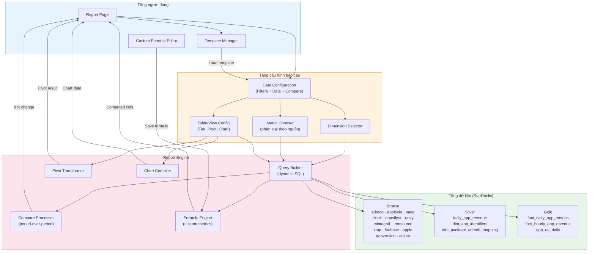


### 5.2 Luồng người dùng

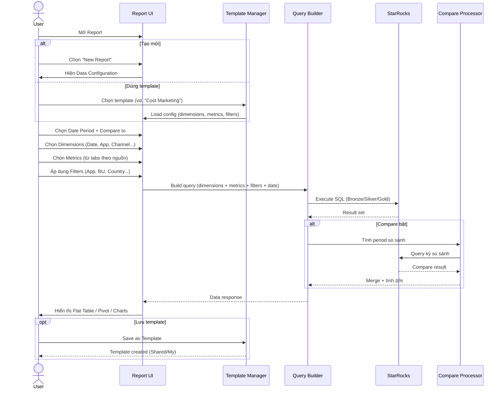


### 5.3 Module chi tiết

#### A. Data Configuration (học từ Adjust)

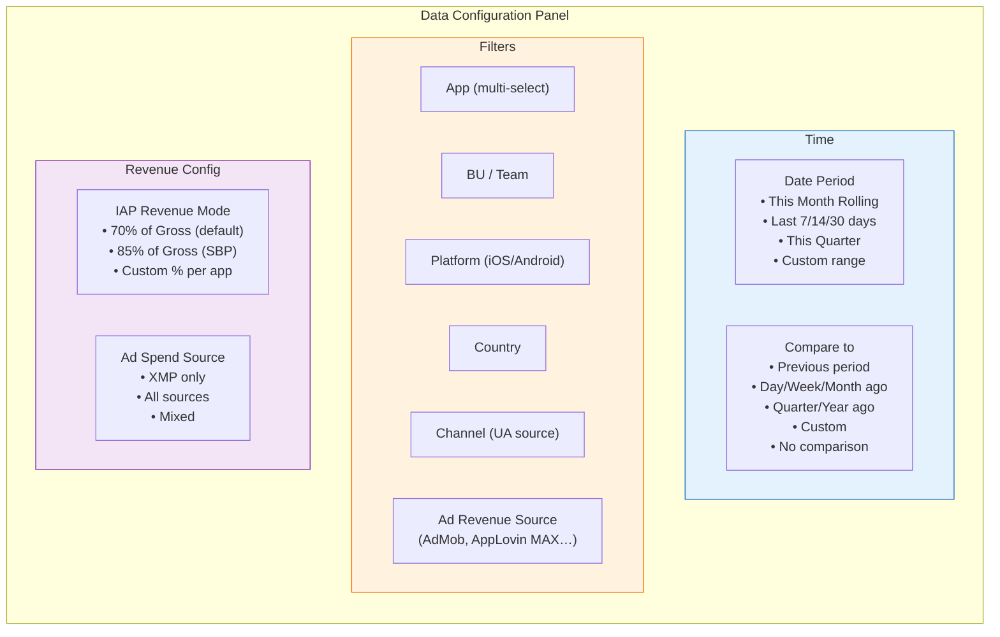


#### B. Metric Chooser (học từ XMP)

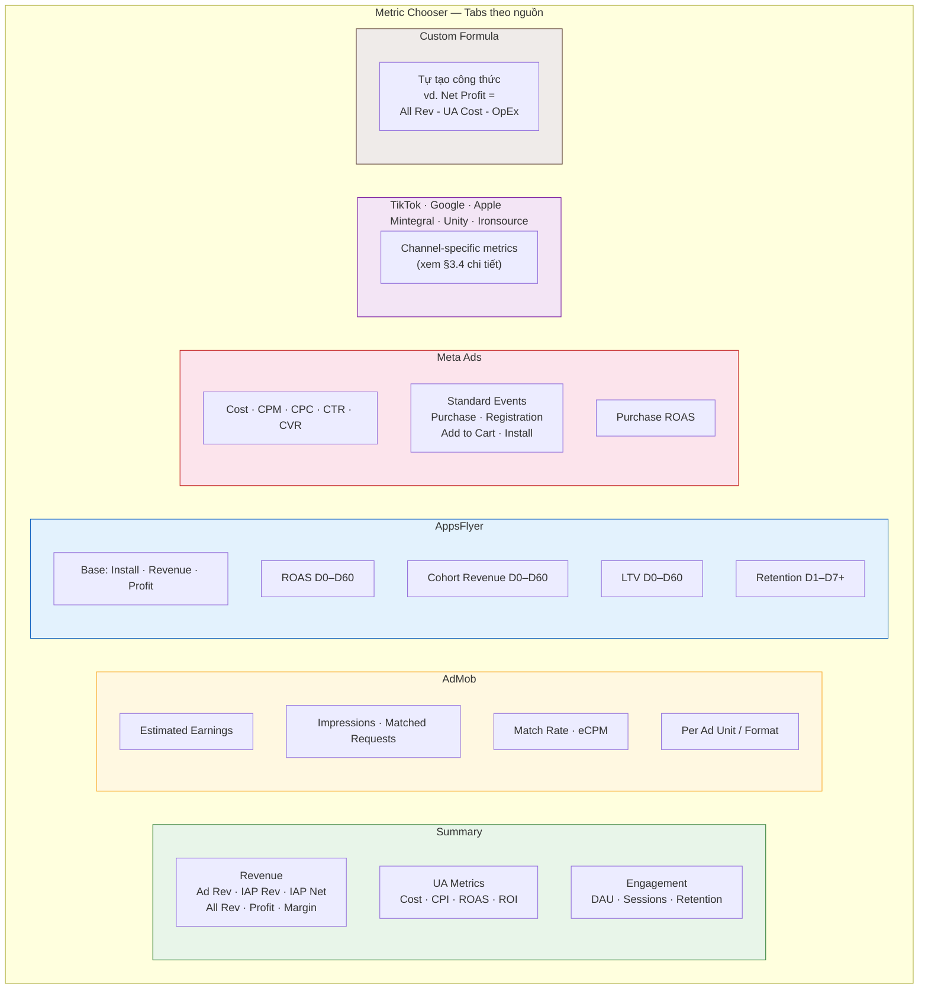


#### C. View Modes — Flat / Pivot / Chart

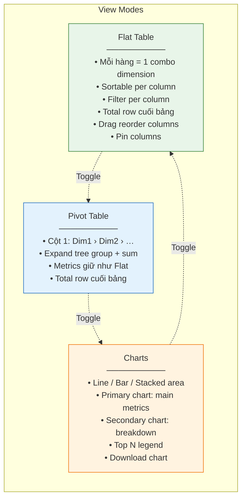


#### D. Template System (học từ XMP)

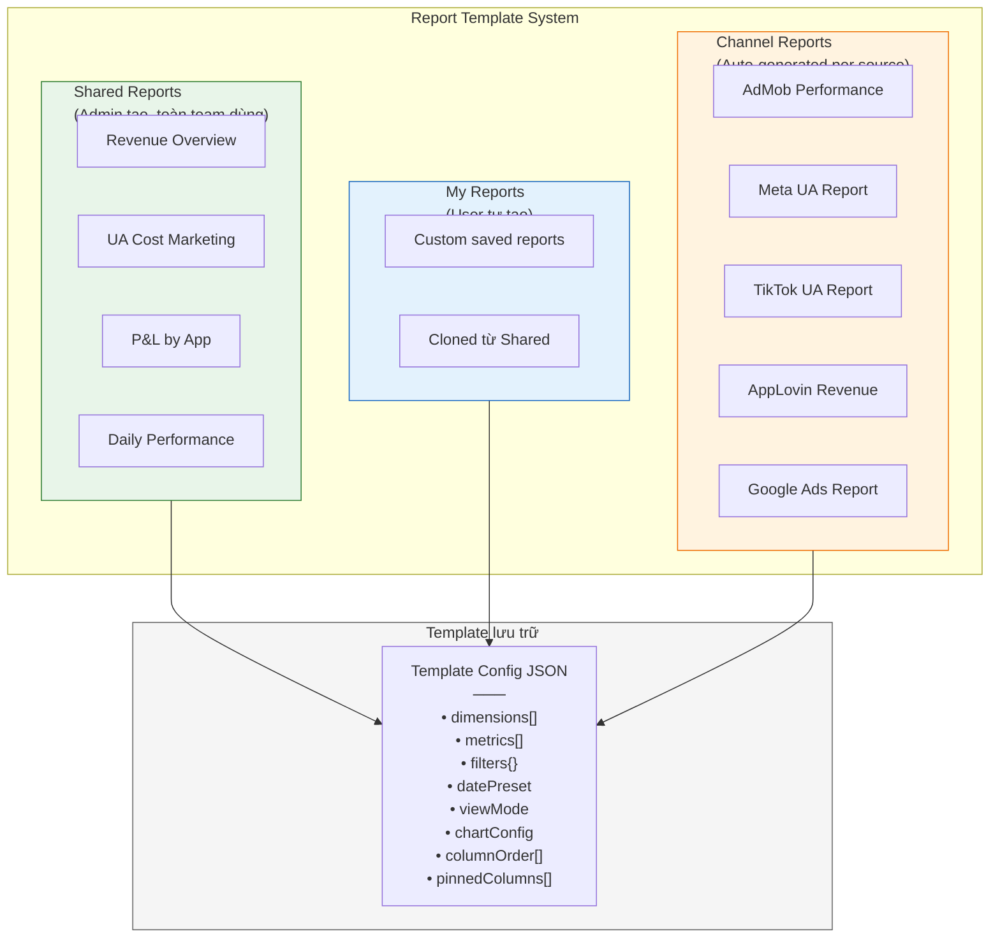


---

## 6. Nexus Metric Catalog — Tổng hợp

Dựa trên dữ liệu Nexus đã có (StarRocks Bronze/Silver/Gold) + metrics từ Adjust & XMP, dưới đây là catalog metrics cho Nexus:

### 6.1 Summary (Nexus tự tính)


| Metric              | Công thức / Nguồn                   | Ghi chú                                    |
| ------------------- | ----------------------------------- | ------------------------------------------ |
| Ad Revenue          | `silver.daily_app_revenue`          | Gộp AdMob + AppLovin, đã loại trùng        |
| IAP Revenue (Gross) | Qonversion / Apple Store / Firebase | Tùy app                                    |
| IAP Revenue (Net)   | `IAP Gross × IAP_Rate`              | IAP_Rate cấu hình per app (70%/85%/custom) |
| All Revenue         | `Ad Revenue + IAP Net`              |                                            |
| UA Cost             | `gold.app_ua_daily` hoặc XMP        | Tổng spend all channels                    |
| Profit              | `All Revenue - UA Cost`             |                                            |
| Profit Margin       | `Profit / All Revenue × 100`        | %                                          |
| ROAS (overall)      | `All Revenue / UA Cost × 100`       | %                                          |
| ROI                 | `Profit / UA Cost × 100`            | %                                          |


### 6.2 Ad Revenue (AdMob / AppLovin)


| Metric             | Nguồn                      |
| ------------------ | -------------------------- |
| Estimated Earnings | `bronze.admob_performance` |
| Ad Impressions     | `bronze.admob_performance` |
| Matched Requests   | `bronze.admob_performance` |
| Match Rate         | Tính từ Matched/Requests   |
| Observed eCPM      | `bronze.admob_performance` |
| AppLovin Revenue   | `bronze.applovin_revenue`  |


### 6.3 UA per Channel

Mỗi channel có metric riêng. Nexus nên map từ Bronze tables:


| Channel           | Bronze table            | Metrics chính                                                        |
| ----------------- | ----------------------- | -------------------------------------------------------------------- |
| **Meta**          | `bronze.meta_ads`_*     | Cost, Impressions, Clicks, CPM, CPC, CTR, Conversions, Purchase ROAS |
| **TikTok**        | `bronze.tiktok_ads_`*   | Cost, Impressions, Clicks, Conversions, CVR, Real-time Result        |
| **Google**        | `bronze.google_ads_`*   | Cost, Clicks, Impressions, Conversions, Conv. value                  |
| **Apple Search**  | `bronze.apple_search_`* | Cost, Taps, Impressions, CPA, Downloads                              |
| **AppLovin (UA)** | `bronze.applovin_`*     | Cost, Impressions, CPA, Conversions                                  |
| **Mintegral**     | `bronze.mintegral_`*    | Cost, Impressions, Conversions, ROAS D0–D7                           |
| **Unity**         | `bronze.unity_`*        | Cost, Impressions, CPA, d0–d7 Revenue                                |
| **Ironsource**    | `bronze.ironsource_`*   | Cost, Clicks, Impressions, CVR, IVR, Billable                        |


### 6.4 Cohort (AppsFlyer / MMP)


| Nhóm           | Metrics                     | Days                                                         |
| -------------- | --------------------------- | ------------------------------------------------------------ |
| ROAS           | ROAS Day N                  | 0, 1, 2, 3, 4, 5, 6, 7, 8, 9, 10, 11, 12, 13, 14, 29, 44, 59 |
| Cohort Revenue | Revenue Day N               | Tương tự                                                     |
| LTV            | LTV Day N                   | Tương tự                                                     |
| Retention      | Retention Day N, Rate Day N | 1–14, 29, 44, 59                                             |


### 6.5 Engagement (AppMetrica / Firebase)


| Metric               | Nguồn                            |
| -------------------- | -------------------------------- |
| DAU                  | `bronze.appmetrica_`* / Firebase |
| Sessions             | AppMetrica                       |
| Avg Session Duration | AppMetrica                       |
| New Users            | AppMetrica                       |
| Events (custom)      | Firebase / AppMetrica            |


### 6.6 IAP (Qonversion / Apple Store)


| Metric                    | Nguồn                  |
| ------------------------- | ---------------------- |
| Subscription Started      | Qonversion             |
| Subscription Renewed      | Qonversion             |
| Trial Started / Converted | Qonversion             |
| Non-Renewing Purchase     | Qonversion             |
| Refund                    | Qonversion             |
| Sales (Apple)             | `bronze.apple_store_*` |


---

## 7. Compare Processor — Chi tiết kỹ thuật

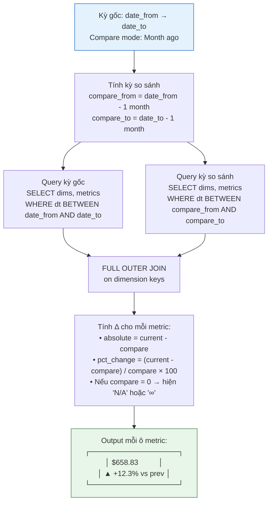


---

## 8. Custom Formula Engine

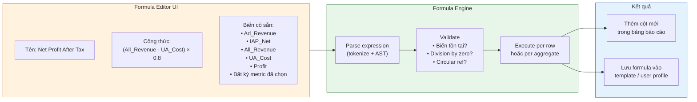


**Operators hỗ trợ:** `+`, `-`, `×`, `÷`, `%` (modulo), `( )`, hàm `IF(cond, true, false)`, `MIN()`, `MAX()`, `ABS()`, `ROUND(value, decimals)`.

---

## 9. Mapping dữ liệu StarRocks → Report

```mermaid
graph TB
    subgraph StarRocks["StarRocks — Data Sources"]
        B1["bronze.admob_performance"]
        B2["bronze.applovin_revenue"]
        B3["bronze.meta_ads_insights"]
        B4["bronze.tiktok_ads_report"]
        B5["bronze.google_ads_report"]
        B6["bronze.appsflyer_aggregate_daily"]
        B7["bronze.xmp_report"]
        B8["bronze.appmetrica_*"]
        B9["bronze.firebase_*"]
        B10["bronze.apple_store_*"]
        B11["bronze.qonversion_*"]
        B12["bronze.mintegral_*"]
        B13["bronze.unity_*"]
        B14["bronze.ironsource_*"]
        B15["bronze.adjust_*"]

        S1["silver.daily_app_revenue"]
        S2["silver.dim_app_identifiers"]

        G1["gold.fact_daily_app_metrics"]
        G2["gold.app_ua_daily"]
        G3["gold.fact_hourly_app_revenue"]
    end

    subgraph ReportTabs["Report Metric Tabs"]
        T1["Summary"]
        T2["AdMob"]
        T3["AppsFlyer"]
        T4["Meta"]
        T5["TikTok"]
        T6["Google"]
        T7["AppLovin"]
        T8["Mintegral / Unity / Ironsource"]
        T9["Apple / Qonversion"]
    end

    S1 --> T1
    G1 --> T1
    G2 --> T1
    S2 -.->|"JOIN display_name"| T1

    B1 --> T2
    B6 --> T3
    B3 --> T4
    B4 --> T5
    B5 --> T6
    B2 --> T7
    B12 --> T8
    B13 --> T8
    B14 --> T8
    B10 --> T9
    B11 --> T9

    style StarRocks fill:#fafafa,stroke:#bdbdbd
    style ReportTabs fill:#e8f5e9,stroke:#2e7d32
```


---

## 10. Báo cáo riêng Nexus (không có trên Adjust / XMP)

Ngoài báo cáo ad performance học từ Adjust/XMP, Nexus cần **3 loại báo cáo quản trị** đặc thù cho mô hình vận hành Amobear:

### 10.1 KPI Plan vs Actual — Tracking Revenue/Cost/Profit theo Team

**Bối cảnh:** Ban lãnh đạo cần theo dõi tiến độ KPI hàng tháng của từng BU/Team so với kế hoạch đã giao, dựa trên danh sách app được phân quyền cho từng leader.

#### Cấu trúc phân cấp (hierarchy)

```
TỔNG
├── SX APP (Sản xuất App)
│   ├── BU 01 (Vĩ Tú) ← leader, quản lý N apps
│   ├── BU 02 (Ngọc)
│   ├── BU 03 (Khánh)
│   ├── BU 07 (Việt)
│   └── BU 10 (Nguyên)
├── BU OurSource
├── SX GAME (Sản xuất Game)
│   ├── BU 01 - game dài (Lâm)
│   ├── BU 02 - game dài (Dũng)
│   ├── BU 03 - game ngắn (Tùng)
│   ├── BU04 - Game dài Puzzle (Cường)
│   └── Hubs 3
├── KINH DOANH APP
│   ├── HUBS1
│   ├── HUBS3
│   ├── App dài hạn
│   └── App ngắn hạn
└── KINH DOANH GAME
    ├── HUBS2
    └── Game Đình Công
```

#### Layout bảng KPI

```
┌──────────────────┬──────────┬──────────┬──────────┬──────────┬──────────────────┬───────────────────────┐
│                  │ THÁNG 1  │ THÁNG 2  │ THÁNG 3  │ THÁNG 4  │    THÁNG 5       │   PROFIT (realtime)   │
│       MỤC        │ REVENUE  │ REVENUE  │ REVENUE  │ REVENUE  ├────────┬────┬────┤────────┬────────┬────┤
│                  │   PLAN   │   PLAN   │   PLAN   │   PLAN   │  PLAN  │ACT │ %  │  PLAN  │ ACTUAL │ %  │
├──────────────────┼──────────┼──────────┼──────────┼──────────┼────────┼────┼────┼────────┼────────┼────┤
│ TỔNG             │9,643,242 │10,728,892│10,907,417│15,590,731│18,897K │3.3M│ 18%│1,090K  │ 113K   │ 10%│
│  SX APP          │2,340,817 │ 2,697,896│ 3,241,259│ 4,013,950│ 4,477K │1.7M│ 38%│  414K  │  57K   │ 14%│
│    BU 01 (Vĩ Tú) │  258,323 │  322,904 │  466,286 │  760,358 │  950K  │267K│ 28%│   86K  │ -60K   │-69%│
│    BU 02 (Ngọc)  │  519,244 │  603,632 │  686,332 │  838,795 │  963K  │152K│ 16%│  132K  │   0    │  0%│
│    ...           │          │          │          │          │        │    │    │        │        │    │
├──────────────────┼──────────┼──────────┼──────────┼──────────┼────────┼────┼────┼────────┼────────┼────┤
│  SX GAME         │5,822,525 │ 6,023,301│ 4,972,302│ 7,056,800│ 8,494K │169K│  2%│  185K  │  -8K   │ -4%│
│    ...           │          │          │          │          │        │    │    │        │        │    │
└──────────────────┴──────────┴──────────┴──────────┴──────────┴────────┴────┴────┴────────┴────────┴────┘
```

#### Dữ liệu nguồn

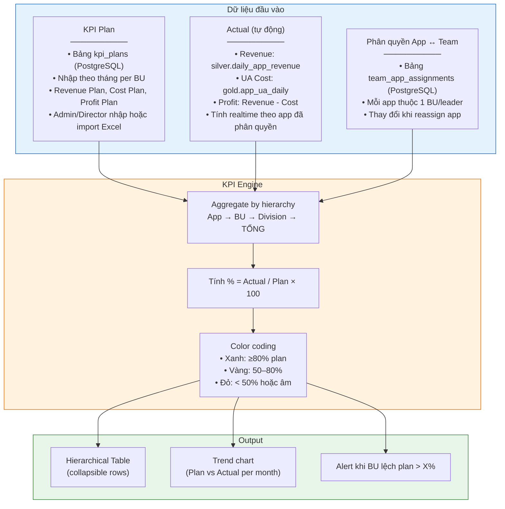


#### Tính năng chi tiết


| Tính năng             | Mô tả                                                                    |
| --------------------- | ------------------------------------------------------------------------ |
| **Hierarchical rows** | Expand/collapse: TỔNG → Division → BU → (tùy chọn) từng App              |
| **Plan import**       | Admin nhập plan theo tháng: manual form hoặc import Excel                |
| **Actual auto-fill**  | Tháng hiện tại: tự tính từ StarRocks; tháng cũ: dùng snapshot đã lưu     |
| **% Progress**        | `Actual / Plan × 100`, color-coded theo ngưỡng                           |
| **Profit realtime**   | Cột riêng: Plan vs Actual vs %, cập nhật liên tục                        |
| **Month columns**     | Hiện đủ 12 tháng hoặc chọn range; tháng tương lai chỉ có Plan            |
| **Drill-down per BU** | Click vào BU → xem chi tiết từng app trong BU đó                         |
| **Permission-based**  | Leader chỉ thấy BU của mình; Director/Admin thấy tất cả                  |
| **Snapshot monthly**  | Cuối tháng tự snapshot Actual → không thay đổi khi data Bronze reprocess |
| **Export**            | Excel (giữ format hierarchy + color)                                     |


#### Luồng hoạt động

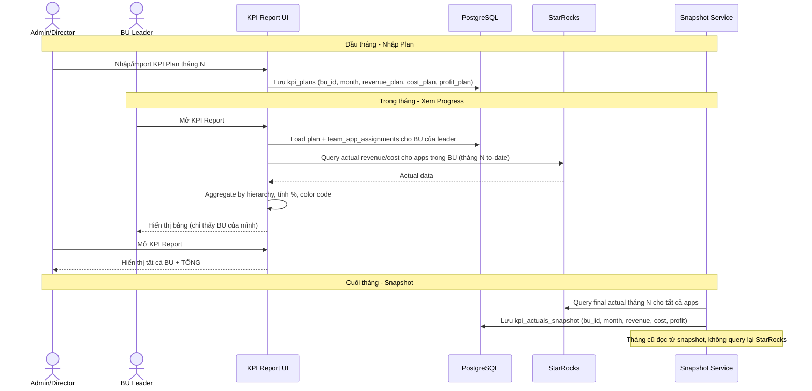


### 10.2 Waterfall Optimization Report

**Bối cảnh:** Core business của Nexus — quản lý mediation waterfall. Adjust/XMP không có loại báo cáo này vì họ không quản lý waterfall. Report này cho phép team so sánh hiệu suất từng ad network trong waterfall.


| Tính năng               | Mô tả                                                                         |
| ----------------------- | ----------------------------------------------------------------------------- |
| **Dimension**           | App × Ad Unit × Mediation Group                                               |
| **Metrics per network** | eCPM, Fill Rate, Impressions, Revenue, SoW (Share of Wallet)                  |
| **View**                | Stacked bar chart — mỗi bar = 1 mediation group, segment = ad network         |
| **Compare**             | SoW tháng này vs tháng trước (thay đổi % mỗi network)                         |
| **Recommendation**      | Highlight network có eCPM giảm → đề xuất điều chỉnh thứ tự waterfall          |
| **Data source**         | `bronze.admob_performance` (mediation report) + `gold.fact_daily_app_metrics` |


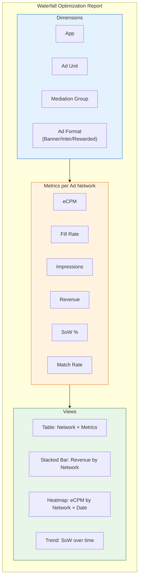


### 10.3 App P&L Statement

**Bối cảnh:** Mỗi app là 1 "business unit nhỏ" — cần xem lãi/lỗ rõ ràng gộp tất cả nguồn thu/chi.

```
┌──────────────────────────────────────────────────┐
│ P&L Statement — Lumia: AI Girl RP Chat           │
│ Period: May 2026                                 │
├──────────────────────────────────────────────────┤
│ REVENUE                                          │
│   Ad Revenue (AdMob)              $12,450.00     │
│   Ad Revenue (AppLovin MAX)        $2,738.68     │
│   IAP Revenue (Gross)              $8,200.00     │
│   Less: Platform Fee (30%)        -$2,460.00     │
│   ─────────────────────────────────────────────  │
│   IAP Revenue (Net)                $5,740.00     │
│   ─────────────────────────────────────────────  │
│   TOTAL REVENUE                   $20,928.68     │
├──────────────────────────────────────────────────┤
│ UA COST                                          │
│   Meta Ads                         $4,200.00     │
│   TikTok Ads                       $2,100.00     │
│   Google Ads                       $1,500.00     │
│   AppLovin (UA)                      $800.00     │
│   Mintegral                          $450.00     │
│   ─────────────────────────────────────────────  │
│   TOTAL UA COST                    $9,050.00     │
├──────────────────────────────────────────────────┤
│ PROFIT                                           │
│   Gross Profit                    $11,878.68     │
│   Profit Margin                       56.76%     │
│   ROAS                              231.25%     │
├──────────────────────────────────────────────────┤
│ ▲ vs Apr 2026: Revenue +12.3% | Cost -5.1%      │
│               Profit +18.7%                      │
└──────────────────────────────────────────────────┘
```


| Tính năng             | Mô tả                                                         |
| --------------------- | ------------------------------------------------------------- |
| **Scope**             | Per app hoặc per BU (gộp apps trong BU)                       |
| **Revenue breakdown** | Ad Revenue per network + IAP per source                       |
| **Cost breakdown**    | UA Cost per channel                                           |
| **IAP Mode**          | Tự trừ platform fee theo cấu hình (70/85/custom %)            |
| **Period compare**    | MoM, QoQ, YoY tự tính                                         |
| **Trend**             | Mini sparkline chart cho Revenue/Cost/Profit 6 tháng gần nhất |
| **Data source**       | Silver/Gold (gộp) + Bronze (chi tiết per network/channel)     |


---

## 11. Đề xuất phân pha triển khai

### Phase 1 — Foundation (MVP)


| Feature                        | Mô tả                                                                        | Ưu tiên |
| ------------------------------ | ---------------------------------------------------------------------------- | ------- |
| **Enhanced Flat Table**        | Sortable, filterable per column, Total row, column reorder (drag)            | P0      |
| **Dimension Selector**         | Chọn dimension chính: Date, App, Platform, Country, Channel                  | P0      |
| **Date Presets**               | This Month, Last 7/14/30 days, Custom range                                  | P0      |
| **Metric Chooser v1**          | Tab Summary + Tab AdMob — metrics từ Silver/Gold đã có                       | P0      |
| **IAP Revenue Mode**           | Cấu hình % per app (70/85/custom), tính IAP Net tự động                      | P0      |
| **Export CSV**                 | Giữ như hiện tại, bổ sung export toàn bộ metrics đã chọn                     | P0      |
| **KPI Plan vs Actual (basic)** | Bảng hierarchical: Division → BU, Plan/Actual/% theo tháng, permission-based | P0      |


> Trạng thái triển khai thực tế (My Reports Phase 1, hạng mục còn nợ, DoD): **§15. Tiến độ**.

### Phase 2 — Compare & Charts


| Feature               | Mô tả                                                          | Ưu tiên |
| --------------------- | -------------------------------------------------------------- | ------- |
| **Period Comparison** | 7 preset + custom date, hiển thị Δ% trên mỗi ô                 | P1      |
| **Charts**            | Line + Bar + Stacked area, primary + breakdown chart           | P1      |
| **Metric Chooser v2** | Thêm tab AppsFlyer (ROAS/LTV/Retention), Meta, TikTok          | P1      |
| **Pin Columns**       | Drag to pin cột bên trái                                       | P1      |
| **Filter by Value**   | Lọc hàng theo điều kiện metric (vd. Revenue > $100)            | P1      |
| **KPI Plan import**   | Import plan từ Excel, plan form UI cho admin, monthly snapshot | P1      |
| **App P&L Statement** | Báo cáo lãi/lỗ per app, gộp tất cả nguồn thu/chi, MoM compare  | P1      |


### Phase 3 — Templates & Advanced

> **Trạng thái triển khai:** ✅ MVP shipped (2026-06-10) — chi tiết **§15.3**. Wave 7 (Channel Reports) ⏸ chờ Phase 2b ETL.


| Feature                           | Mô tả                                                                     | Ưu tiên | Trạng thái |
| --------------------------------- | ------------------------------------------------------------------------- | ------- | ---------- |
| **Report Templates**              | Save/Load/Share template (Shared + My Reports)                            | P2      | ✅         |
| **Pivot Table**                   | Hierarchical tree (Dim1 › Dim2 › …), expand + sum trên frontend           | P2      | ✅         |
| **Custom Formula**                | Expression editor tự tạo computed metrics                                 | P2      | ✅         |
| **Waterfall Optimization Report** | eCPM/Fill Rate/SoW per network, stacked bar (heatmap/trend defer 3.1)     | P2      | ✅ MVP     |
| **Metric Chooser v3**             | Tabs AppsFlyer/Meta/TikTok/Google — ẩn nếu catalog chưa có metric         | P2      | ✅ infra   |
| **Channel Reports**               | Auto-generated report per ad source (như XMP Kanban)                      | P2      | ⏸ Phase 2b |


### Phase 4 — Tích hợp với hệ thống Nexus đã có


| Feature                      | Mô tả                                                            | Ưu tiên |
| ---------------------------- | ---------------------------------------------------------------- | ------- |
| **Scheduled Reports**        | Tự gửi report qua Email/Telegram theo lịch                       | P3      |
| **Anomaly Highlights**       | Tự highlight ô metrics có biến động bất thường (đỏ/xanh)         | P3      |
| **AI Summary**               | Tích hợp Nexus AI Engine sinh nhận xét tự động cho report        | P3      |
| **Dashboard Embed**          | Embed report vào Dashboard dạng widget                           | P3      |
| **KPI Alert**                | Tự cảnh báo Telegram khi BU lệch plan > ngưỡng (vd. < 50%)       | P3      |
| **Waterfall Recommendation** | AI đề xuất điều chỉnh thứ tự waterfall khi eCPM network thay đổi | P3      |


---

## 13. Report Template Config Schema (tham khảo)

```json
{
  "id": "uuid",
  "name": "UA Cost Marketing",
  "description": "Chi phí UA theo channel, so sánh tuần",
  "type": "shared",
  "created_by": "user_id",
  "config": {
    "dimensions": ["date", "channel"],
    "metrics": [
      { "source": "summary", "key": "ua_cost" },
      { "source": "summary", "key": "all_revenue" },
      { "source": "summary", "key": "roas" },
      { "source": "meta", "key": "cpm" },
      { "source": "meta", "key": "cpc" },
      { "source": "tiktok", "key": "cvr" },
      { "source": "custom", "key": "net_profit_formula_id" }
    ],
    "filters": {
      "apps": ["all"],
      "bu": ["BU01-VITU"],
      "platform": ["all"],
      "country": ["all"]
    },
    "datePreset": "this_month_rolling",
    "compareMode": "week_ago",
    "iapRevenueMode": { "default": 0.7, "overrides": { "app_123": 0.85 } },
    "viewMode": "flat_table",
    "columnOrder": ["date", "ua_cost", "all_revenue", "roas", "cpm", "cpc", "cvr"],
    "pinnedColumns": ["date"],
    "chartConfig": {
      "primaryMetrics": ["ua_cost", "all_revenue"],
      "breakdownDimension": "channel",
      "chartType": "line",
      "topN": 5
    }
  }
}
```

---

## 13. Tổng hợp các loại báo cáo Nexus

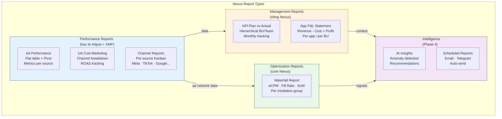


---

## 14. Tham chiếu


| Tài liệu                                     | Mô tả                                    |
| -------------------------------------------- | ---------------------------------------- |
| `docs/reports/adjust/`                       | Ảnh chụp Adjust Dashboard + metrics.html |
| `docs/reports/xmp/`                          | Ảnh chụp XMP Reports + metrics.html      |
| `docs/reports/nexus/`                        | Ảnh chụp Nexus hiện tại + bảng KPI Excel |
| `docs/99b - Ad Revenue Analytics.md`         | Kiến trúc Bronze/Silver/Gold StarRocks   |
| `docs/99 - MEDIATION PRO PLATFORM.md`        | Tổng quan Nexus platform                 |
| `docs/122_-_Nexus_AI_Engine_Architecture.md` | AI Engine cho Phase 4 integration        |
| `frontend/components/my-reports/`            | My Reports Phase 1 UI + hooks            |
| `frontend/lib/reports/my-report-*.ts`        | Defaults, catalog groups, shared utils   |
| **§15. Tiến độ** (doc này)                   | Trạng thái triển khai My Reports Phase 1 |


---

## 15. Tiến độ

Theo dõi trạng thái triển khai so với roadmap **§11**. Cập nhật khi hoàn thành phase hoặc thay đổi phạm vi.

### 15.1 My Reports — Phase 1 (2026-06)

> **Route:** `/reports/my-reports` · **Menu:** top-level (không nằm submenu Reports)  
> **Engine:** tái sử dụng `CustomReportService` + `CustomReportCatalog` — **không** tạo `NexusReportService` riêng.  
> **Roadmap tham chiếu:** §11 Phase 1 — Foundation (MVP)

#### Đã ship


| Hạng mục                              | Chi tiết implementation                                                                                                                                                                                         |
| ------------------------------------- | --------------------------------------------------------------------------------------------------------------------------------------------------------------------------------------------------------------- |
| Flat table + data thật                | `reportsApi.query` → StarRocks `gold.fact_daily_app_metrics`; xóa mock data                                                                                                                                     |
| Sort + Total row                      | Header click sort (`sortBy`/`sortDir`); dòng Total từ `response.totals`                                                                                                                                         |
| Reorder cột metrics + dimensions      | Edit panel + `@dnd-kit` — metrics **và** dimension order                                                                                        |
| Dimensions Phase 1                    | `date`, `app`, `platform` (catalog hiện có)                                                                                                                                                                     |
| Metric chooser v1                     | Tab **Summary** + **AdMob** (`frontend/lib/reports/my-report-catalog-groups.ts`)                                                                                                                                |
| IAP Revenue Mode (global + per app)   | 70/85/100/custom % global; **per-app overrides** qua `IapRevenueModeOverrides`; UI `my-report-iap-filter-editor.tsx`                            |
| Export                                | Excel/HTML qua `frontend/lib/reports/export-report-table.ts`; permission `s-reports` / `export-csv`                                                                                                             |
| **Data Configuration (Adjust-style)** | Dropdown checkbox bật/tắt filter hiển thị; Search / Reset / Apply; giá trị **read-only** trong panel — chỉnh qua **filter tags** bên ngoài (`data-configuration-panel.tsx`, `my-report-data-config-catalog.ts`) |
| **External filter tags**              | Tag cạnh nút Data Configuration (desktop) + hàng tag trên mobile sheet; popover chỉnh giá trị từng filter đã bật                                                                                                |
| **Date Period picker**                | Adjust-style: sidebar preset (Today, Yesterday, Last 7/14/30, …), lịch 2 tháng, Cancel/Apply (`report-date-period-picker.tsx`)                                                                                  |
| **App selector (2 chế độ)**           | **Permitted apps** (RBAC `getApps`) hoặc **App by team** (group theo team, `GET /team-apps/{teamId}`); avatar + name + App ID + Store ID + platform; search name/App ID/Store ID                                |
| Filters khác                          | Teams (`GroupedTeamMultiSelect`), IAP mode, revenue source                                                                                                                                                      |
| Apply pattern                         | Draft vs applied — tránh auto-query mỗi keystroke; sort header auto-apply                                                                                                                                       |
| **Filterable per column**             | ✅ Hàng filter dưới header; popover điều kiện (AND); **Reload Data** FAB; lọc **client-side** trên rows đã tải (không gọi lại API); Total row tính lại từ subset hiển thị — **đủ phạm vi Phase 1** |
| Mobile                                | Sticker **Filters & Metrics** kéo dọc + Sheet (data config + filter tags + edit panel)                                                                                                                          |
| Team ↔ app sync                       | Intersect app filter với team scope; **App by team** auto-gợi ý `CommissionTeamIds` khi chọn app (`my-report-app-selection.ts`)                   |
| Refactor toolbar                      | `my-reports-toolbar.tsx` — deep-link Profit Overview + Team plans; **Save** + template picker (Phase 3) |
| Shared utils                          | `report-format-utils`, `report-date-filter-utils`, `export-report-table`, `column-filter-utils`, `my-report-app-selection`, `my-report-config-tag-utils`                                                        |


**File chính:**

```
frontend/components/my-reports/my-reports-content.tsx
frontend/components/my-reports/data-configuration-panel.tsx
frontend/components/my-reports/external-filter-tag.tsx
frontend/components/my-reports/my-report-app-filter-editor.tsx
frontend/components/my-reports/my-report-table.tsx
frontend/components/my-reports/column-filter-popover.tsx
frontend/components/reports/report-date-period-picker.tsx
frontend/components/my-reports/hooks/use-my-report-config.ts
frontend/components/my-reports/hooks/use-my-report-query.ts
frontend/components/my-reports/hooks/use-my-report-team-app-groups.ts
frontend/lib/reports/my-report-defaults.ts
frontend/lib/reports/my-report-data-config-catalog.ts
frontend/lib/reports/my-report-config-tag-utils.ts
frontend/lib/reports/column-filter-utils.ts
frontend/lib/reports/my-report-app-selection.ts
backend/MediationPro.Core/DTOs/Reports/CustomReportQueryRequest.cs  (+ IAP fields)
backend/MediationPro.Infrastructure/Services/CustomReportService.cs   (+ IAP aggregate)
backend/MediationPro.Api.Tests/Services/CustomReportServiceTests.cs   (IAP mode test)
```

```
frontend/components/my-reports/my-reports-content.tsx
frontend/components/my-reports/my-reports-toolbar.tsx
frontend/components/my-reports/my-report-charts.tsx
frontend/components/my-reports/my-report-compare-picker.tsx
frontend/components/my-reports/my-report-iap-filter-editor.tsx
frontend/components/my-reports/data-configuration-panel.tsx
frontend/components/my-reports/external-filter-tag.tsx
frontend/components/my-reports/my-report-app-filter-editor.tsx
frontend/components/my-reports/my-report-table.tsx
frontend/components/my-reports/column-filter-popover.tsx
frontend/components/reports/report-date-period-picker.tsx
frontend/components/my-reports/hooks/use-my-report-config.ts
frontend/components/my-reports/hooks/use-my-report-query.ts
frontend/components/my-reports/hooks/use-my-report-team-app-groups.ts
frontend/lib/reports/my-report-defaults.ts
frontend/lib/reports/my-report-data-config-catalog.ts
frontend/lib/reports/my-report-config-tag-utils.ts
frontend/lib/reports/my-report-compare-utils.ts
frontend/lib/reports/column-filter-utils.ts
frontend/lib/reports/my-report-app-selection.ts
backend/MediationPro.Core/DTOs/Reports/CustomReportQueryRequest.cs  (+ IAP fields)
backend/MediationPro.Infrastructure/Services/CustomReportService.cs   (+ IAP aggregate)
backend/MediationPro.Api.Tests/Services/CustomReportServiceTests.cs   (IAP mode test)
```

#### Còn nợ / defer sau Wave 0


| Hạng mục                                          | Trạng thái  | Ghi chú                                                                                    |
| ------------------------------------------------- | ----------- | ------------------------------------------------------------------------------------------ |
| **Dimension Country, Channel**                    | ⏸ Phase 2b | Grain Gold `date × app × platform` — cần ETL Bronze UA                                     |
| **Date preset Static dates / dynamic template**   | ⏸ Phase 3  | Relative date trong saved template                                                         |
| **Custom Report shared date picker**              | ⚠️ Một phần | Custom Report giữ date UI riêng; export vẫn inline (có `app_store_id` column đặc thù)     |
| **Verify DoD / regression (manual)**              | ⚠️ QA       | Checklist bên dưới — chạy trước release                                                     |
| **Unit test IAP (CI)**                            | ⚠️ Blocked  | Test `QueryAsync_IapRevenueMode_RecalculatesNetFromGross` có; `MediationPro.Api.Tests` build lỗi unrelated |

#### Điều chỉnh phạm vi so với §11 Phase 1 (có chủ đích)


| Feature Phase 1 gốc                     | Quyết định thực tế                                                                                    |
| --------------------------------------- | ----------------------------------------------------------------------------------------------------- |
| **KPI Plan vs Actual (basic)**          | **Không** trên My Reports — deep-link `/reports/overview` + org **Team plans**                        |
| **ROAS 0D–3D… (Adjust-style cohort)**  | **Defer Phase 2b** — catalog chưa có cohort ROAS                                                      |
| **Save / Share template**               | **✅ Phase 3** — `my_report_saved`, Save dialog + Shared picker; relative dates trong template ⏸ |
| **Filterable per column**               | **Client-side only** — không wire `metricFilters` API                                                   |

#### Checklist DoD Phase 1 (manual)

- [ ] `/reports/my-reports` load catalog + Apply → bảng data thật
- [ ] Total row khớp Custom Report cùng filter (spot-check 1 app, 7 ngày)
- [ ] IAP 70% → 100% + per-app override đổi `iap_net_revenue`, `profit`, totals
- [ ] Sort cột date/metric
- [ ] Reorder metrics **và dimensions** trong Edit panel
- [ ] Data Configuration + external tags (Date, Compare, App 2 mode, Teams, IAP, …)
- [x] Column filter client-side + Total row subset
- [ ] Export tải được (kể cả cột compare khi bật)
- [ ] RBAC + mobile sticker/sheet
- [ ] Regression `/reports`, `/reports/overview`

### 15.2 My Reports — Phase 2 MVP (2026-06)

> **Engine:** vẫn `CustomReportService` + `gold.fact_daily_app_metrics` — compare = **2× POST /reports/query** merge client-side.

#### Wave tiến độ


| Wave | Hạng mục                         | Trạng thái | Chi tiết                                                                 |
| ---- | -------------------------------- | ---------- | ------------------------------------------------------------------------ |
| 0    | Đóng nợ Phase 1                  | ✅         | IAP per-app/custom %, dimension reorder, team↔app sync, toolbar refactor |
| 1    | Period Comparison + Compare tag  | ✅         | Presets §2.2, `my-report-compare-picker.tsx`, Δ% trên ô, export compare |
| 2    | Charts + Pin columns             | ✅         | `my-report-charts.tsx` (line/bar/area); pin cột sticky header            |
| 3    | Metric tab Adjust + deep-links   | ✅         | Tab **Adjust** từ catalog; link Overview + org profit plans              |
| 4    | Filter by Value                | ✅ (Phase 1) | Client-side column filter — không duplicate server `metricFilters`       |
| 2b   | Country/Channel, cohort chooser  | ⏸ Defer    | Cần DA/ETL — xem **§15.4**                                               |

#### Đã ship Phase 2


| Feature                       | File / ghi chú                                                                                                                   |
| ----------------------------- | -------------------------------------------------------------------------------------------------------------------------------- |
| Compare to                    | `my-report-compare-utils.ts`, dual query trong `use-my-report-query.ts`                                                          |
| Δ% trên bảng                  | `my-report-table.tsx` — current / previous / %                                                                                   |
| Charts — 7 chart types        | `my-report-charts.tsx`: **line, combo, bar, stacked-bar, area, scorecard, pie** (donut hollow, max 5 categories, 1-dim check)    |
| Charts — Multi-metric         | `chartMetricIds: string[]`, `breakdownChartMetricIds: string[]` — nhiều series trên 1 chart, mỗi metric màu riêng                |
| Charts — Edit panel           | `my-report-chart-edit-sheet.tsx` — side panel "Data Visualization" per chart; thêm/xóa metric, thêm/xóa dimension, chart type   |
| Charts — Export / Download    | Export as PNG (`canvas`), Download CSV per chart (`chart-export-utils.ts`)                                                       |
| Charts — Layout toggle        | Side-by-side ↔ Stacked (`panelLayout`); toggle `Chart` button ẩn/hiện chart section                                             |
| Pin columns                   | Icon pin header; `pinnedColumnIds` trong config                                                                                  |
| Tab Adjust                    | `MY_REPORT_ADJUST_METRIC_IDS` — metrics `adjust_*` từ catalog                                                                   |
| Deep-link management          | Profit Overview (check `s-reports:view`), Team plans (check `s-orgs:view-details` + `view-profit-plan`) — permission-gated links |
| Permission: view-profit-plan  | `PermissionScreensConstant.cs` — thêm `FnViewProfitPlan`, `FnManageProfitPlan` vào `s-orgs`                                     |

#### Kiến trúc compare (Phase 2)

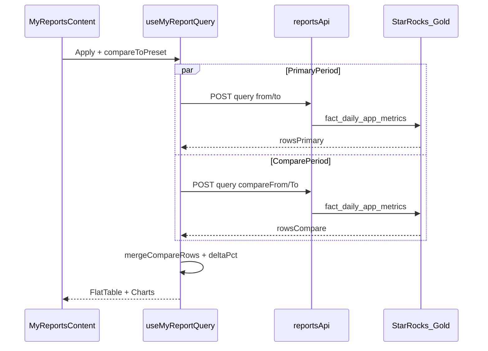

### 15.3 Phase 3 — Templates & Advanced

> **Trạng thái:** ✅ MVP shipped · Cập nhật: 2026-06-10  
> **Mục tiêu:** Save/Share template, Pivot Table, Custom Formula, Waterfall Report, Metric Chooser v3  
> **Roadmap gốc:** §11 Phase 3

---

#### Tổng hợp tiến độ Phase 3

| Wave | Feature | Trạng thái | Ghi chú |
| ---- | ------- | ---------- | ------- |
| 1 | Metric Chooser v3 (AppsFlyer, Meta, TikTok, Google) | ✅ Infra | Tabs động theo catalog; **ẩn tab** nếu catalog chưa có metric nguồn — chờ Phase 2b ETL |
| 2 | Custom Formula client-side | ✅ | `formula-engine.ts`, tab Custom trong Edit table, export |
| 3 | Report Templates Save/Load | ✅ | Bảng `my_report_saved`, API + Save dialog + template picker |
| 4 | Report Templates Share (Org) | ✅ | `visibility: private \| org`, `GET .../shared`, PATCH visibility |
| 5 | Pivot Table | ✅ | Toggle Flat/Pivot (tab Dimensions); tree expand; `buildPivotTree()` |
| 6 | Waterfall Optimization Report | ✅ | `POST /api/v1/reports/waterfall`, page `/reports/waterfall` |
| 7 | Channel Reports per source | ⏸ Blocked | Phase 2b ETL — xem **§15.4** |

---

#### Wave 1 — Metric Chooser v3 ✅ (infra)

| Task | Trạng thái | Chi tiết |
| ---- | ---------- | -------- |
| 1.1–1.4 Backend catalog metrics per source | ⏸ | Chưa có metric Meta/TikTok/AppsFlyer/Google trên `CustomReportCatalog` — **không mock** |
| 1.5 Dynamic metric tabs | ✅ | `METRIC_SOURCE_TABS`, `getVisibleMetricTabs()` trong `my-report-catalog-groups.ts` |
| 1.6 Guard empty tabs | ✅ | Chỉ hiện tab khi catalog có ≥1 metric khớp category/prefix |

**File:** `frontend/lib/reports/my-report-catalog-groups.ts`, `frontend/components/my-reports/my-reports-content.tsx`

---

#### Wave 2 — Custom Formula ✅

| Task | Trạng thái | File |
| ---- | ---------- | ---- |
| Schema `CustomFormulaMetric` | ✅ | `use-my-report-config.ts` — `customFormulas[]` |
| Formula parser + evaluate | ✅ | `frontend/lib/reports/formula-engine.ts` |
| Validate biến | ✅ | `validateFormula()` — biến phải tồn tại trong metrics đã chọn |
| UI Formula Editor | ✅ | `formula-metric-editor.tsx` — tab **Custom** trong Edit table |
| Evaluate per row | ✅ | `my-report-formula-utils.ts` → inject vào `tableRows` |
| Export computed columns | ✅ | `export-report-table.ts` — `formulaMetricIds` |

---

#### Wave 3–4 — Report Templates Save / Load / Share ✅

**Backend:**

| Task | Trạng thái | File |
| ---- | ---------- | ---- |
| Migration `my_report_saved` | ✅ | `20260610190000_AddMyReportSaved.cs` |
| Entity + DTO + Service | ✅ | `MyReportSaved.cs`, `MyReportSavedDtos.cs`, `MyReportSavedService.cs` |
| API endpoints | ✅ | `ReportsController` — `/api/v1/reports/my-reports/saved` (+ shared, visibility) |

**Frontend:**

| Task | Trạng thái | File |
| ---- | ---------- | ---- |
| Config serializer (dates → ISO) | ✅ | `my-report-config-serializer.ts` |
| API client | ✅ | `frontend/lib/api/my-report-saved.ts` |
| Save dialog | ✅ | `my-report-save-dialog.tsx` — nút **Save** enabled trên toolbar |
| Template picker (My + Shared) | ✅ | `my-report-template-picker.tsx` |
| Load → merge draft | ✅ | `loadConfig()` trong `use-my-report-config.ts` |

**API:**

```
GET    /api/v1/reports/my-reports/saved
GET    /api/v1/reports/my-reports/saved/shared
GET    /api/v1/reports/my-reports/saved/{id}
POST   /api/v1/reports/my-reports/saved
PUT    /api/v1/reports/my-reports/saved/{id}
DELETE /api/v1/reports/my-reports/saved/{id}
PATCH  /api/v1/reports/my-reports/saved/{id}/visibility
```

**Deploy:** chạy migration `20260610190000_AddMyReportSaved` trước khi dùng Save/Load.

---

#### Wave 5 — Pivot Table ✅

| Task | Trạng thái | File |
| ---- | ---------- | ---- |
| Hierarchical pivot tree + aggregate | ✅ | `pivot-utils.ts` — `buildPivotTree`, `flattenVisiblePivotNodes` |
| Expand/collapse UI (Adjust-style) | ✅ | `my-report-pivot-table.tsx` — `+`/`-`, indent, bold parent |
| Toggle Flat ↔ Pivot | ✅ | Tab **Dimensions** — `MyReportTableViewModeToggle` |
| Cùng API data với Flat | ✅ | Group/sum trên `tableRows` đã fetch |
| ≥ 2 dimensions required | ✅ | Fallback Flat khi chỉ 1 dimension |

**Quy tắc hiển thị:** thứ tự dimension = thứ tự trong Edit table (drag reorder). Metrics parent row = tổng các hàng con (sum additive).

---

#### Wave 6 — Waterfall Optimization Report ✅

| Task | Trạng thái | File |
| ---- | ---------- | ---- |
| StarRocks rollup date range | ✅ | `IMediationBronzeRollupReader.GetRollupByDateRangeAppAdSourceAsync` |
| WaterfallReportService | ✅ | eCPM, Fill Rate, SoW% aggregate theo ad network |
| API | ✅ | `POST /api/v1/reports/waterfall` |
| Page `/reports/waterfall` | ✅ | `waterfall-report-content.tsx` — table + stacked bar Top 10 |
| Mobile nav | ✅ | Hub Reports → Waterfall Report |
| Desktop sidebar | ✅ | Reports submenu → Waterfall Report |

**Chưa ship (defer Phase 3.1):** eCPM heatmap, SoW trend line, mediation group filter, pivot export Excel riêng.

**File chính Phase 3:**

```
frontend/lib/reports/formula-engine.ts
frontend/lib/reports/my-report-formula-utils.ts
frontend/lib/reports/my-report-config-serializer.ts
frontend/lib/reports/pivot-utils.ts
frontend/components/my-reports/formula-metric-editor.tsx
frontend/components/my-reports/my-report-save-dialog.tsx
frontend/components/my-reports/my-report-template-picker.tsx
frontend/components/my-reports/my-report-pivot-table.tsx
frontend/lib/reports/pivot-utils.test.ts
frontend/components/reports/waterfall-report-content.tsx
frontend/app/reports/waterfall/page.tsx
frontend/lib/api/my-report-saved.ts
backend/MediationPro.Core/Entities/MyReportSaved.cs
backend/MediationPro.Infrastructure/Services/MyReportSavedService.cs
backend/MediationPro.Infrastructure/Services/WaterfallReportService.cs
backend/MediationPro.Infrastructure/Migrations/20260610190000_AddMyReportSaved.cs
```

---

#### Wave 7 — Channel Reports ⏸ Blocked

| Blocker | Điều kiện mở khóa |
| ------- | ----------------- |
| Bronze UA tables chưa vào Gold grain | DA/ETL Phase 2b |
| Per-channel Kanban reports | Sau khi catalog có metrics Meta/TikTok/Google |

---

#### Phase 4 — Intelligence (chưa bắt đầu)

| Phase | Trạng thái | Ghi chú |
| ----- | ---------- | ------- |
| Scheduled Reports (Email/Telegram) | 🔲 Chưa | Hangfire job + Telegram bot; §11 Phase 4 |
| AI Summary (Nexus AI Engine) | 🔲 Chưa | Tích hợp doc 122; §11 Phase 4 |
| Anomaly Highlights | 🔲 Chưa | Statistical threshold per metric |
| Dashboard Embed (widget) | 🔲 Chưa | Iframe hoặc server component |
| KPI Alert (Telegram) | 🔲 Chưa | Cronjob check BU vs plan |
| Waterfall Recommendation (AI) | 🔲 Chưa | Sau Wave 6 + AI Engine |

---

#### Checklist DoD Phase 3 (manual)

- [ ] Migration `my_report_saved` applied
- [ ] Save template → reload page → Load template → config khôi phục
- [ ] Share org template → user cùng org thấy trong Shared
- [ ] Custom formula `profit - ua_cost` hiển thị đúng trên bảng + export
- [ ] Pivot: 2+ dimensions, expand Dim1 → Dim2 → leaf, parent sum khớp flat aggregate
- [ ] Waterfall report: chọn app + 7 ngày → networks + SoW%
- [ ] Metric tabs AppsFlyer/Meta ẩn khi catalog chưa có (expected)

---

#### Chi tiết plan gốc (tham khảo triển khai)

<details>
<summary>Wave plan chi tiết (collapsed)</summary>

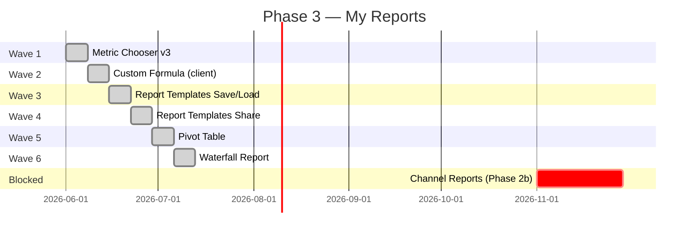

</details>

### 15.4 Phase 2b — backlog DA / ETL (defer)

| Feature | Blocker hiện tại | Hướng xử lý |
| ------- | ---------------- | ----------- |
| Dimension **Country**, **Channel** | Gold `fact_daily_app_metrics` không có grain | View/ETL join Bronze UA; mở rộng `CustomReportCatalog` |
| Metric chooser **Meta / TikTok / AppsFlyer** cohort | Không trong catalog (§6.3–6.4) | Bronze cohort tables + catalog metrics |
| **App P&L Statement** (MoM, per network) | Cần channel breakdown | Route riêng hoặc Phase 3 sau ETL |
| **Static dates / dynamic** trong template | Chưa có template engine | Phase 3 saved config + relative offset |

**Quy tắc:** Phase 2b **không mock** metrics — chỉ ship khi có data thật trên StarRocks/catalog.


