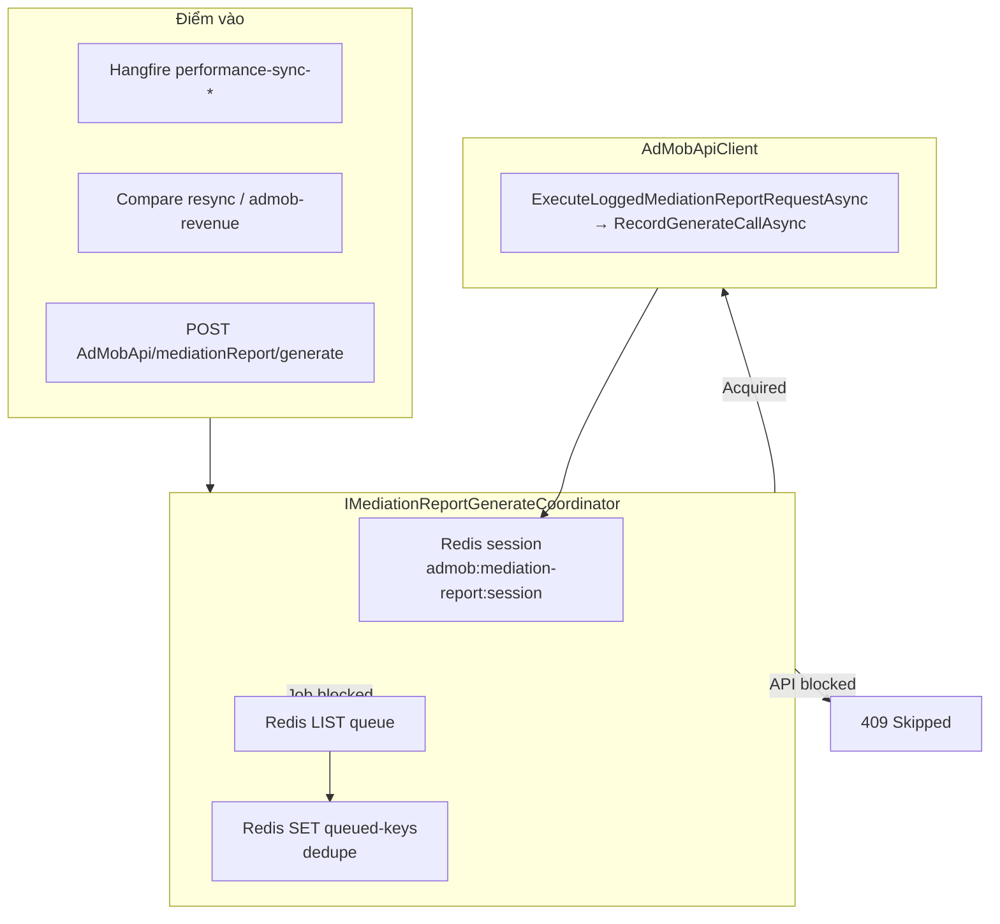

# 136 — AdMob mediationReport:generate — Redis Global Gate

> **Phiên bản:** 1.0 | **Ngày:** 2026-06-10  
> **Liên quan:** Doc **99** §6.2, **99b** §1.3, **101**, **02-TROUBLESHOOTING**

---

## 1. Mục đích

Google AdMob giới hạn quota **`mediationReport:generate`** (~180 request/phút/account). Nexus có **nhiều luồng** cùng gọi endpoint này:

- Hangfire jobs `performance-sync-admob-*`, `performance-sync-mkt-*`, `performance-sync-mediation-*`, `performance-sync-admob-revenue-*`
- Backfill / initial sync (`PerformanceInitialSyncJob`, Structure reprocess)
- Compare resync (`PerformanceSyncCompareQueueProcessor`, manual resync từ Monitoring AdMob)
- HTTP nội bộ `POST /api/AdMobApi/accounts/{accountName}/mediationReport/generate`

**Redis Global Gate** đảm bảo:

1. **Một session** chạy tại một thời điểm (job hoặc API batch).
2. **Cooldown 15 phút** kể từ lần gọi HTTP `mediationReport:generate` gần nhất — nếu session đang active và chưa đủ cooldown thì **chặn** luồng mới.
3. **API** bị chặn → **bỏ qua** (HTTP **409**, `skipped: true`).
4. **Job** bị chặn → **xếp hàng** Redis (FIFO, **không trùng** `queueKey`).
5. Khi session kết thúc → **drain** hàng đợi (tối đa 32 job/lần).
6. **Restart backend** → xóa session treo (`admob:mediation-report:session`); **giữ** hàng đợi.

---

## 2. Kiến trúc



### 2.1 Redis keys

| Key | Kiểu | Nội dung | Ghi chú |
|-----|------|----------|---------|
| `admob:mediation-report:session` | STRING (JSON) | `sessionId`, `ownerLabel`, `ownerKind`, `startedAtUtc`, **`lastGenerateAtUtc`** | Xóa khi job/API batch hoàn thành; **xóa khi API restart** |
| `admob:mediation-report:queue` | LIST | Payload JSON `MediationReportGenerateQueueItem` | FIFO — `RPUSH` enqueue, `LPOP` dequeue |
| `admob:mediation-report:queued-keys` | SET | `queueKey` dedupe | `SADD` trước khi push; `SREM` khi pop |

**Vì sao LIST + SET?** LIST giữ thứ tự và payload; SET cho phép kiểm tra “đã xếp hàng chưa” O(1) mà không scan toàn bộ LIST (tránh trùng khi nhiều Hangfire worker cùng bị chặn).

### 2.2 Quy tắc acquire

**Được chạy** khi:

- Không có key `session`, **hoặc**
- Có session nhưng `now - lastGenerateAtUtc ≥ cooldown` (takeover session cũ / stale)

**Bị chặn** khi:

- Có session **và** `now - lastGenerateAtUtc < cooldown`

| Loại | Hành vi khi bị chặn |
|------|---------------------|
| **Job** | Enqueue (nếu `queueKey` chưa có trong SET) → thoát sớm, Hangfire coi là success |
| **API** | `MediationReportGenerateSkippedException` → HTTP **409** |

Mỗi HTTP call trong session → `AdMobApiClient` gọi `RecordGenerateCallAsync()` → cập nhật `lastGenerateAtUtc`.

---

## 3. Cấu hình

`appsettings.json` → section `PerformanceSync`:

```json
"PerformanceSync": {
  "MediationGenerateGateEnabled": true,
  "MediationGenerateCooldownMinutes": 15
}
```

| Key | Mặc định | Mô tả |
|-----|----------|--------|
| `MediationGenerateGateEnabled` | `true` | `false` = bypass gate (hành vi cũ) |
| `MediationGenerateCooldownMinutes` | `15` | Khoảng cách tối thiểu giữa các session khi session còn active |

**Redis:** dùng `ConnectionStrings:Redis`. Không có Redis → gate no-op (mọi luồng chạy như trước).

**Rate limiter trong `AdMobApiClient`** (token bucket ~150 RPM) vẫn hoạt động **song song** với gate — gate điều phối *process*, rate limiter điều phối *từng HTTP* trong process.

---

## 4. Điểm tích hợp code

| Thành phần | File | Vai trò |
|------------|------|---------|
| Interface | `MediationPro.Core/Interfaces/IMediationReportGenerateCoordinator.cs` | Session + queue API |
| Implementation | `MediationPro.Infrastructure/AdMob/MediationReportGenerateCoordinator.cs` | Redis logic |
| Startup cleanup | `MediationReportGenerateSessionStartupCleanup.cs` | `IHostedService` — xóa session khi restart |
| Queue executor | `MediationPro.Jobs/MediationReportGenerateQueueExecutor.cs` | Chạy lại job đã dequeue |
| Session builder | `MediationPro.Jobs/MediationReportGenerateSessionBuilder.cs` | Tạo `queueKey` dedupe |
| Sync wrapper | `PerformanceSyncService` | `SyncAllBronzeScopesAsync`, `SyncAllAccountsAsync`, `SyncCompareQueueAsync`, `SyncAdmobRevenueForAppPlatformAsync` |
| HTTP API | `AdMobApiController.GenerateMediationReport` | Gate + 409 skip |
| HTTP generate | `AdMobApiClient.ExecuteLoggedMediationReportRequestAsync` | `RecordGenerateCallAsync` |
| DI | `Program.cs` | `AddSingleton<IMediationReportGenerateCoordinator>`, `AddHostedService<...StartupCleanup>`, `AddScoped<IMediationReportGenerateQueueExecutor>` |

### 4.1 Luồng job (nested session)

`SyncAllBronzeScopesAsync` acquire session **một lần**, gọi lần lượt 4 scope qua `SyncAllAccountsAsync` — inner call thấy `IsSessionActive` → **không** acquire lại.

### 4.2 Queue handlers & queueKey mẫu

| Handler | queueKey ví dụ |
|---------|----------------|
| `all-bronze-scopes` | `all-bronze:20260601:20260610:*:*` |
| `sync-accounts` | `sync:MktTable:20260609:20260609:*:*` |
| `compare-queue` | `compare:MediationReportFull:hash1,hash2,...` |
| `admob-revenue-app` | `admob-revenue:20260609:ca-app-pub-xxx:ANDROID` |

### 4.3 Call types log (`admob_mediation_report_api_logs.type`)

Xem `MediationPro.Core/Constants/AdmobMediationReportCallTypes.cs` — gate **không** thay đổi giá trị `type`; chỉ điều phối thời điểm gọi.

---

## 5. Jobs / API bị ảnh hưởng

Tất cả luồng gọi `IAdMobApiClient.GenerateMediationReport*` qua các entry point trên, gồm:

| Nguồn | Ghi chú |
|-------|---------|
| `performance-sync-admob-today/recent` | `AdmobBronzeSyncScope.AdmobTable` |
| `performance-sync-mkt-today/recent` | ~35 country chunks / ngày |
| `performance-sync-mediation-today/recent` | `MediationReportFull` |
| `performance-sync-admob-revenue-today/recent` | `AdmobRevenueTable` |
| `performance-initial-sync` / `admob-sync-date-range` | 4 bronze scopes tuần tự |
| Compare queue sau job recent | `PerformanceSyncCompareQueueProcessor` |
| Monitoring AdMob manual resync | `PerformanceSyncCompareManualResyncJob` |
| `POST .../mediationReport/generate` | 1 request = 1 session |

**Không** gate: Structure sync, Write APIs, các endpoint AdMob khác (list apps, MG, …).

---

## 6. Vận hành & troubleshooting

### 6.1 Log thường gặp

```text
Mediation report generate job queued (key=sync:MktTable:..., owner=sync-MktTable). Active session or cooldown < 15 min.
Cleared stale mediation report generate session key admob:mediation-report:session on startup.
Executing queued mediation report generate job (key=..., handler=sync-accounts, owner=...).
```

### 6.2 API skip

```http
POST /api/AdMobApi/accounts/accounts/pub-xxx/mediationReport/generate
→ 409 { "error": "...", "skipped": true }
```

### 6.3 Kiểm tra Redis (dev)

```bash
redis-cli GET admob:mediation-report:session
redis-cli LLEN admob:mediation-report:queue
redis-cli SMEMBERS admob:mediation-report:queued-keys
```

### 6.4 Session treo sau crash

- **Tự động:** restart API → `MediationReportGenerateSessionStartupCleanup` xóa session.
- **Thủ công:** `DEL admob:mediation-report:session` (không xóa queue trừ khi cố ý reset).

### 6.5 Job “không chạy” sau schedule

Có thể đã **enqueue** — kiểm tra `LLEN queue` và đợi session hiện tại + drain. Hangfire dashboard vẫn **Succeeded** vì job thoát sớm sau enqueue (by design).

### 6.6 Tắt gate tạm (debug)

```json
"MediationGenerateGateEnabled": false
```

---

## 7. Liên kết tài liệu

| Doc | Nội dung |
|-----|----------|
| **99** §6.2 | AdMob Read/Write APIs |
| **99** §17.2 | Lịch Performance Sync |
| **99b** §1.3, §3.3 | Bronze AdMob tables, ETL |
| **101** | AdMob account / OAuth |
| **02-TROUBLESHOOTING** | Mục AdMob mediation report gate |
