# AMOBEAR NEXUS PLATFORM

## Solution Document for Amobear (internal)

---

# TABLE OF CONTENTS

1. Giới thiệu và Mục tiêu (gồm **1.4 Kiến trúc & luồng hiện tại — 2026**)
2. Hiện trạng và Bài toán
3. Người dùng và Nhu cầu
4. Tổng quan Giải pháp
5. Chiến lược Phân kỳ
6. Phase 1: Foundation & Ad Optimization
7. Phase 2: Full Data Platform
8. Kiến trúc Công nghệ
9. Kiến trúc Dữ liệu
10. Thiết kế Database
11. Thiết kế Lưu trữ MinIO
12. Kiến trúc Tích hợp
13. SoW Analysis & Recommendation Engine
14. Dashboard & Analytics
15. **Visualization Strategy (Amobear Nexus + Superset)**
16. Hệ thống Alert & Monitoring
17. Lịch vận hành tự động
18. **AI Engine — Nexus Intelligence**
19. Lộ trình Triển khai
20. Team & Phân công
21. Hạ tầng
22. Quản lý Rủi ro
23. Tiêu chí Thành công
24. Roadmap Tương lai
25. **Ghi chú vận hành (tóm tắt)**
26. **Tài liệu triển khai & vận hành**

---

# 1. GIỚI THIỆU VÀ MỤC TIÊU

## 1.1 Tài liệu này là gì?

Tài liệu này mô tả giải pháp **Amobear Nexus** (tên cũ: Mediation Pro) — một hệ thống phần mềm giúp Amobear tự động hóa việc tối ưu quảng cáo (ad mediation), phân tích dữ liệu đa nguồn, và cung cấp AI-powered insights cho hệ sinh thái 200+ mobile apps. Tài liệu dành cho:

- **Product/Business stakeholders**: Hiểu platform giải quyết bài toán gì, cho ai, mang lại giá trị gì
- **Dev team mới**: Hiểu toàn cảnh hệ thống, luồng dữ liệu, các thành phần, logic nghiệp vụ
- **Management**: Nắm được scope, timeline, resource cần thiết

## 1.2 Amobear Nexus là gì?

**Amobear Nexus** là platform tập trung, thay thế quy trình thủ công hiện tại (Excel + tool Dolphin + AdMob Console) bằng hệ thống tự động, tích hợp AI:

- **Đầu vào**: Nhiều nguồn đã nối pipeline — ad networks (AdMob, AppLovin, Meta), analytics (Firebase, AppMetrica), UA/attribution (XMP, Adjust, AppsFlyer Master + Pull tùy chọn), IAP/subscriptions (**Qonversion** — API + export crawler), store (**Apple** App Store Connect / StoreKit)
- **Xử lý**: Tự động tính toán KPIs, phân tích SoW (Share of Wallet), chạy recommendation engine, **AI Engine** (RAG, Agentic Query, MCP Proxy, App Insight)
- **Đầu ra**: Dashboard real-time, AI-powered insights, recommendations có thể apply, alerts tự động, reports định kỳ

Biểu đồ dưới đây mô tả tổng quan: dữ liệu từ các nguồn bên ngoài được thu thập, xử lý qua nhiều tầng (raw → cleaned → aggregated), rồi phục vụ cho các team khác nhau thông qua dashboard, AI assistant và alerts.

```mermaid
flowchart LR
    subgraph Input["ĐẦU VÀO"]
        I1["AdMob API"]
        I2["Firebase / BigQuery"]
        I3["AppLovin MAX"]
        I4["XMP"]
        I5["Meta Ads"]
        I6["AppMetrica"]
        I7["Adjust"]
        I8["Qonversion"]
        I9["AppsFlyer"]
        I10["Apple App Store"]
    end
    
    subgraph Platform["AMOBEAR NEXUS"]
        P1["Thu thập dữ liệu"]
        P2["Phân tích và Tính toán"]
        P3["Recommendations"]
        P4["AI Engine"]
    end
    
    subgraph Output["ĐẦU RA"]
        O1["Dashboard"]
        O2["AI Insights"]
        O3["Alerts"]
        O4["Reports"]
        O5["API Actions"]
    end
    
    Input --> Platform --> Output
    
    style Input fill:#e3f2fd
    style Platform fill:#fff3e0
    style Output fill:#e8f5e9
```

## 1.3 Tại sao cần xây dựng?

| Câu hỏi | Trả lời |
|----------|---------|
| **Vấn đề là gì?** | Quản lý ~60,000 ad instances trên 200+ apps hoàn toàn thủ công |
| **Ai bị ảnh hưởng?** | Mediation team, UA team, Product team, Leadership |
| **Hậu quả?** | Mất 2-4 giờ/ngày, phát hiện sự cố chậm (>24h), bỏ lỡ cơ hội tối ưu |
| **Giải pháp?** | Tự động hóa thu thập, phân tích, đề xuất, cảnh báo |
| **Kỳ vọng?** | Giảm 80% thời gian thủ công, phát hiện sự cố <1h, tăng eCPM 10-15% |

## 1.4 Kiến trúc và luồng dữ liệu hiện tại (2026)

Phần này tóm tắt **trạng thái triển khai thực tế** trong monorepo (backend + frontend + docs), bổ sung cho các mục chi tiết phía dưới.

### 1.4.1 Cấu trúc triển khai (monorepo)

| Thành phần | Vai trò |
|------------|---------|
| **`backend/`** | .NET 8 — ASP.NET Core API, Hangfire jobs (sync, transform), EF Core (PostgreSQL), client StarRocks / MinIO / RabbitMQ |
| **`frontend/`** | Next.js 16, React 19, TypeScript, Tailwind 4, shadcn/ui — dashboard, quản lý apps, data accounts, AI assistant |
| **`docs/`** | Solution (doc 99), analytics (99b), tích hợp từng nguồn (AppsFlyer 128, Qonversion 126, Apple 127, …) |
| **Docker Compose** | Dev/prototype: PostgreSQL, Redis, RabbitMQ, MinIO, (tùy môi trường) StarRocks, Superset |

### 1.4.2 Luồng dữ liệu chuẩn (end-to-end)

Mọi nguồn bên ngoài đi theo cùng một pattern: **API / export → backup MinIO → Bronze (StarRocks) → Silver → Gold → tiêu thụ** (Nexus UI, Superset, AI). Hangfire đọc lịch từ PostgreSQL (`hangfire_job_schedules`).

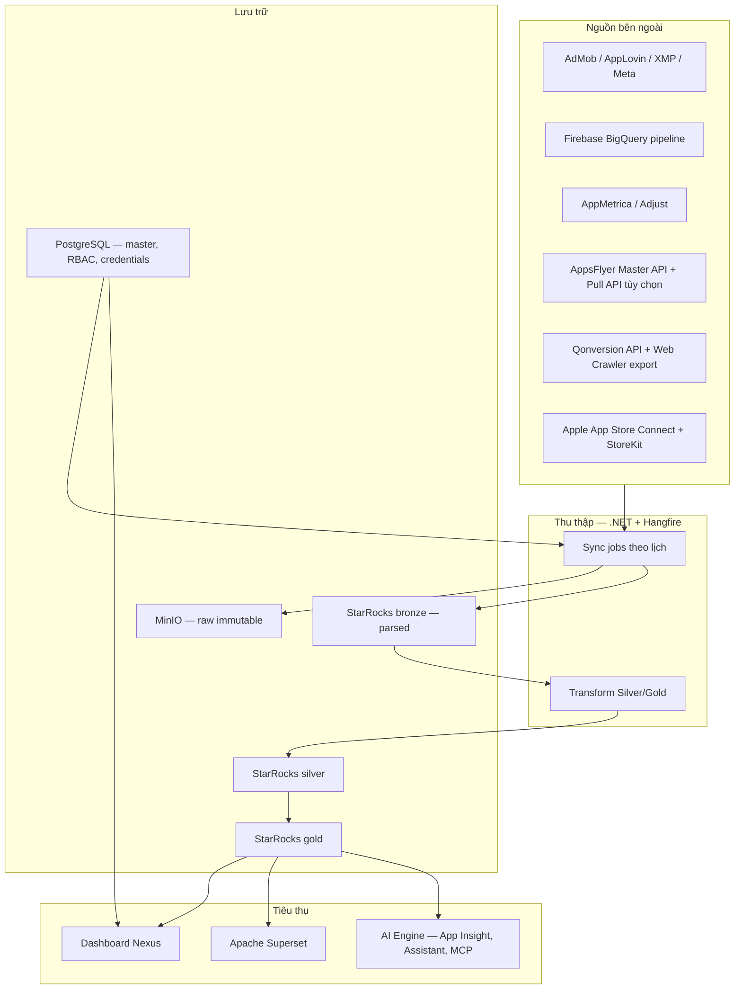

### 1.4.3 Nguyên tắc dữ liệu thống nhất

- **`app_id` analytics (Silver/Gold)**: thống nhất theo **AdMob app id** (`admob_app_id`), khớp `apps.app_id` trên PostgreSQL — xem **99b**, **STARROCKS-DDL-PITFALLS**.
- **Không double-count revenue**: gộp nhiều nguồn qua lớp Silver/Gold đã định nghĩa; IAP (Qonversion) và IAA được merge đúng chỉ số fact (ví dụ `gold.fact_daily_app_metrics`).
- **Raw đầy đủ vs lọc nghiệp vụ**: một số kênh (ví dụ Qonversion crawler) ghi **đủ dòng export** vào Bronze để đối chiếu nguồn; lọc event / tính KPI thực hiện ở bước transform hoặc báo cáo.
- **AppsFlyer**: **Master API** (aggregate theo pid/geo, cohort) chạy theo nhiều lịch; **Pull API** `installs_report` là kênh riêng (bật qua config), không thay thế Master — xem **128**.

---

# 2. HIỆN TRẠNG VÀ BÀI TOÁN

## 2.1 Quy trình hiện tại

Biểu đồ dưới đây mô tả quy trình làm việc hiện tại của Mediation team. Mỗi ngày, team phải thực hiện thủ công 5 bước: đăng nhập AdMob Console, export dữ liệu, phân tích trên Excel, đưa ra quyết định, và quay lại AdMob Console để apply thay đổi. Quy trình này tốn nhiều thời gian, dễ sai sót, và không có cơ chế cảnh báo tự động.

```mermaid
flowchart TB
    subgraph CurrentProcess["QUY TRÌNH HIỆN TẠI - HÀNG NGÀY"]
        subgraph Step1["Bước 1: Thu thập dữ liệu"]
            S1A["Đăng nhập AdMob Console"]
            S1B["Export CSV từng tài khoản"]
            S1C["Copy dữ liệu vào Excel"]
        end
        
        subgraph Step2["Bước 2: Phân tích Excel"]
            S2A["Paste vào sheet Raw"]
            S2B["Chạy Waterfall Optimizer"]
            S2C["Đọc Recommendations"]
        end
        
        subgraph Step3["Bước 3: Quyết định"]
            S3A["Team leader review"]
            S3B["Chọn recommendations"]
            S3C["Lên kế hoạch thay đổi"]
        end
        
        subgraph Step4["Bước 4: Apply thay đổi"]
            S4A["Mở Dolphin tool"]
            S4B["Chọn App, MG"]
            S4C["Sửa floor price"]
            S4D["Apply qua AdMob API"]
        end
        
        subgraph Step5["Bước 5: Theo dõi"]
            S5A["Ngày hôm sau check lại"]
            S5B["So sánh trước/sau"]
        end
    end
    
    Step1 --> Step2 --> Step3 --> Step4 --> Step5
    Step5 --> |"Lặp lại mỗi ngày"| Step1
    
    style Step1 fill:#ffebee
    style Step2 fill:#fff3e0
    style Step3 fill:#e3f2fd
    style Step4 fill:#fce4ec
    style Step5 fill:#f3e5f5
```

## 2.2 Các công cụ hiện tại

Hiện tại, Amobear sử dụng 3 công cụ chính, mỗi công cụ có vai trò riêng nhưng không kết nối với nhau. Bảng bên dưới mô tả chi tiết từng công cụ, ưu điểm, và hạn chế.

| Công cụ | Vai trò | Ưu điểm | Hạn chế |
|---------|---------|---------|---------|
| **File Excel Waterfall Optimizer** | Phân tích SoW, tạo recommendations | Logic tối ưu 8 rules đã proven, visual rõ ràng | Hoàn toàn thủ công, cần import data bằng tay |
| **Tool Dolphin 2.0** | Kết nối AdMob API, apply thay đổi | Tự động đọc/ghi AdMob API, apply floor changes | Client-side (credential không an toàn), không lưu lịch sử, không có alert |
| **AdMob Console** | Xem dữ liệu, quản lý trực tiếp | Dữ liệu chính thức, đầy đủ | Không export được tất cả, UI phức tạp với 200+ apps |

## 2.3 Những điểm đau (Pain Points)

Biểu đồ tư duy dưới đây tổng hợp các pain points theo 4 nhóm: Vận hành (mất nhiều thời gian thủ công), Dữ liệu (rời rạc và không tin cậy), Phản ứng (chậm phát hiện sự cố), và Mở rộng (không thể scale lên 500+ apps).

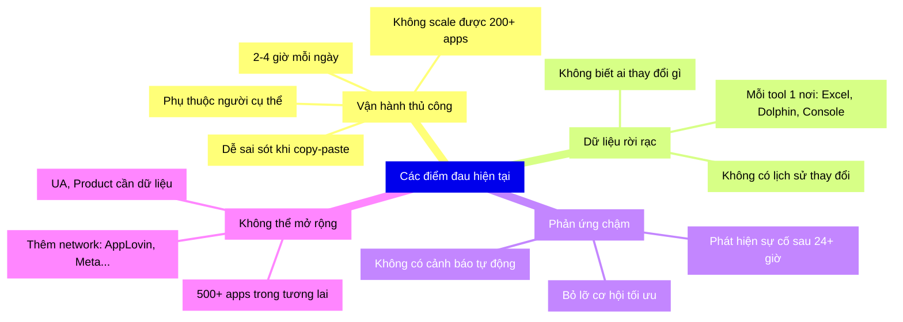

## 2.4 Ví dụ thiệt hại thực tế

| Tình huống | Ảnh hưởng | Thời gian phát hiện hiện tại |
|------------|-----------|------------------------------|
| eCPM giảm 20% ở app top revenue | Mất ~$500-1000/ngày | 24-48 giờ |
| Fill rate giảm do network lỗi | Mất 20-30% impressions | 24 giờ |
| Floor price không hợp lý | eCPM thấp hơn potential | Không phát hiện |
| Network mới performance tốt | Bỏ lỡ revenue tiềm năng | Tuần-tháng |

---

# 3. NGƯỜI DÙNG VÀ NHU CẦU

## 3.1 Tổng quan User Groups

Biểu đồ dưới đây mô tả 5 nhóm người dùng chính của hệ thống, từ Mediation team (người dùng chính trong Phase 1) cho đến Leadership (xem reports tổng hợp). Mỗi nhóm có nhu cầu khác nhau, và platform sẽ phục vụ lần lượt qua từng phase.

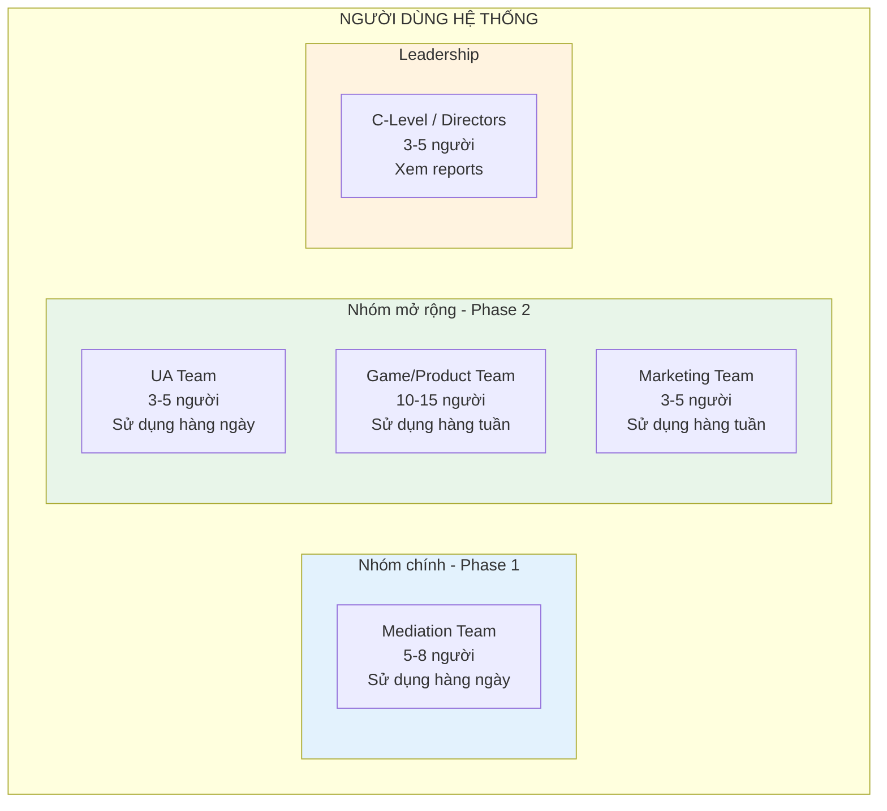

## 3.2 Chi tiết từng User Group

### Mediation Team (Ad Operations)

| Thuộc tính | Chi tiết |
|------------|----------|
| **Số lượng** | 5-8 người |
| **Sử dụng** | Hàng ngày, 2-4 giờ trên platform |
| **Mục tiêu** | Tối ưu eCPM, fill rate, quản lý waterfall |
| **Skill level** | Hiểu AdMob, biết phân tích số liệu |

**Tính năng cho Mediation Team:**

| Tính năng | Mô tả | Phase |
|-----------|--------|-------|
| Revenue Dashboard | Xem tổng revenue, trend, so sánh theo ngày | 1 |
| eCPM Analysis | Phân tích eCPM theo app, country, format, network | 1 |
| Fill Rate Monitor | Theo dõi fill rate, phát hiện giảm bất thường | 1 |
| SoW Analysis | Phân tích Share of Wallet từng instance trong MG | 1 |
| Recommendations | Đề xuất tự động dựa trên 8-rule engine | 1 |
| Waterfall Editor | Xem và chỉnh sửa waterfall configuration | 1 |
| Alert Dashboard | Quản lý cảnh báo, xem lịch sử | 1 |
| Network Comparison | So sánh performance giữa các ad network | 2 |
| A/B Testing | Test thay đổi waterfall trước khi rollout | 2 |
| Floor Price Optimizer | Gợi ý floor price tối ưu | 2 |

### UA Team (User Acquisition)

| Thuộc tính | Chi tiết |
|------------|----------|
| **Số lượng** | 3-5 người |
| **Sử dụng** | Hàng ngày, 1-2 giờ trên platform |
| **Mục tiêu** | Tối ưu chi phí UA, đảm bảo ROI dương |
| **Skill level** | Hiểu campaign management, biết phân tích ROI |

**Tính năng cho UA Team:**

| Tính năng | Mô tả | Phase |
|-----------|--------|-------|
| Campaign ROI Dashboard | Chi phí vs revenue cho từng campaign | 2 |
| CPI Tracking | Cost per Install theo channel, country | 2 |
| LTV/CAC Analysis | So sánh LTV với chi phí acquisition | 2 |
| Budget Allocation | Gợi ý phân bổ ngân sách tối ưu | 2 |
| Channel Attribution | Revenue attribution theo source | 2 |
| Cohort Analysis | Revenue theo cohort install date | 2 |

### Game / Product Team

| Thuộc tính | Chi tiết |
|------------|----------|
| **Số lượng** | 10-15 người |
| **Sử dụng** | Hàng tuần, xem metrics |
| **Mục tiêu** | Hiểu user behavior, optimize UX |
| **Skill level** | Product thinking, biết đọc metrics cơ bản |

**Tính năng cho Product Team:**

| Tính năng | Mô tả | Phase |
|-----------|--------|-------|
| App Performance Overview | KPIs tổng hợp cho mỗi app | 1 |
| DAU/DAV Tracking | Theo dõi active users, ad viewers | 1 |
| Retention Curves | D1, D7, D30 retention | 2 |
| Session Analytics | Độ dài session, frequency | 2 |
| Crash Correlation | Liên hệ crash với revenue drop | 2 |
| ARPDAU by Version | ARPDAU theo app version | 2 |

### Marketing Team

| Thuộc tính | Chi tiết |
|------------|----------|
| **Số lượng** | 3-5 người |
| **Sử dụng** | Hàng tuần, xem reports |
| **Mục tiêu** | Lên kế hoạch marketing, đánh giá hiệu quả |
| **Skill level** | Marketing analytics, campaign management |

**Tính năng cho Marketing Team:**

| Tính năng | Mô tả | Phase |
|-----------|--------|-------|
| Portfolio Overview | Performance toàn bộ portfolio | 2 |
| Geo Analysis | Revenue, users theo geography | 2 |
| Trend Reports | Xu hướng market, seasonal patterns | 2 |
| Competitive Insights | Benchmark với industry | 2 |

### Leadership (C-Level / Directors)

| Thuộc tính | Chi tiết |
|------------|----------|
| **Số lượng** | 3-5 người |
| **Sử dụng** | Hàng tuần/tháng, xem executive reports |
| **Mục tiêu** | Strategic decisions, resource allocation |

**Tính năng cho Leadership:**

| Tính năng | Mô tả | Phase |
|-----------|--------|-------|
| Executive Dashboard | KPIs tổng hợp toàn portfolio | 1 |
| Revenue Forecasting | Dự báo revenue tháng/quý | 2 |
| Budget vs Actual | So sánh kế hoạch vs thực tế | 2 |
| Team Productivity | Metrics hiệu suất team | 2 |

## 3.3 User Journey - Mediation Team (Primary)

Biểu đồ dưới đây mô tả hành trình sử dụng hàng ngày của Mediation team member, từ lúc nhận alert buổi sáng cho đến khi xong việc. Đây là luồng sử dụng chính mà platform cần tối ưu.

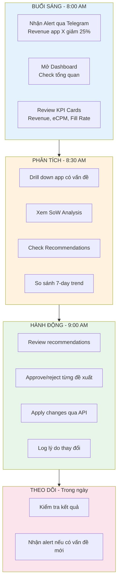

---

# 4. TỔNG QUAN GIẢI PHÁP

## 4.1 So sánh Trước và Sau

Biểu đồ dưới đây so sánh trực quan quy trình trước (thủ công, rời rạc) và sau khi có Amobear Nexus (tự động, tập trung, AI-powered). Các mũi tên đỏ thể hiện pain points hiện tại, mũi tên xanh thể hiện cải tiến.

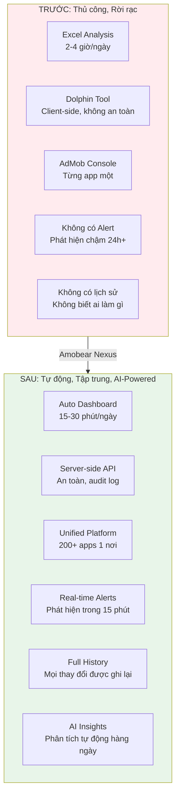

## 4.2 Bảng so sánh chi tiết

| Tiêu chí | Trước (Excel + Dolphin) | Sau (Amobear Nexus) |
|-----------|------------------------|---------------------|
| **Thời gian phân tích** | 2-4 giờ/ngày | 15-30 phút/ngày |
| **Phát hiện sự cố** | 24-48 giờ | < 15 phút (tự động) |
| **Độ chính xác** | Phụ thuộc người làm | Tính toán tự động, nhất quán |
| **Số apps quản lý được** | ~50 apps hiệu quả | 200-500+ apps |
| **Lịch sử thay đổi** | Không có | Đầy đủ audit trail |
| **Bảo mật** | Token lưu client-side | Server-side, encrypted |
| **Multi-team** | Không | Dashboard cho từng team |
| **Scalability** | Không thể mở rộng | Thiết kế cho 500+ apps |
| **AI Analysis** | Không có | AI Insight hàng ngày, Agentic chat, RAG |

## 4.3 Các thành phần giải pháp

Biểu đồ dưới đây mô tả 7 thành phần chính của giải pháp. Mỗi thành phần có vai trò riêng: Data Collection (thu thập), Storage (lưu trữ), Processing (xử lý), Analytics (phân tích), **AI Engine** (trí tuệ nhân tạo), Serving (phục vụ), Notification (thông báo).

```mermaid
flowchart TB
    subgraph Components["7 THÀNH PHẦN GIẢI PHÁP"]
        subgraph Collect["1. Data Collection"]
            C1["Sync Services"]
            C2["API Connectors"]
        end
        
        subgraph Store["2. Storage"]
            S1["MinIO - Raw backup"]
            S2["StarRocks - Analytics"]
            S3["PostgreSQL - Master"]
        end
        
        subgraph Process["3. Processing"]
            P1["Transform Jobs"]
            P2["SoW Calculator"]
            P3["Recommendation Engine"]
        end
        
        subgraph Analytics["4. Analytics"]
            A1["KPI Aggregations"]
            A2["Trend Analysis"]
            A3["Anomaly Detection"]
        end
        
        subgraph AI["5. AI Engine"]
            AI1["RAG / Knowledge Base"]
            AI2["Agentic Query Loop"]
            AI3["App Insight Generator"]
            AI4["MCP Proxy"]
        end
        
        subgraph Serve["6. Serving"]
            SV1["REST APIs"]
            SV2["Dashboard UI"]
            SV3["AI Assistant Chat"]
            SV4["Reports"]
        end
        
        subgraph Notify["7. Notification"]
            N1["Alert Engine"]
            N2["Telegram Bot"]
            N3["Email Reports"]
        end
    end
    
    Collect --> Store --> Process --> Analytics --> AI --> Serve
    Analytics --> Notify
    
    style Collect fill:#e3f2fd
    style Store fill:#fff3e0
    style Process fill:#e8f5e9
    style Analytics fill:#fce4ec
    style AI fill:#ede7f6
    style Serve fill:#f3e5f5
    style Notify fill:#e0f7fa
```

## 4.4 Quyết định Công nghệ Quan trọng

### Thay thế MongoDB bằng MinIO

Giải pháp ban đầu đề xuất sử dụng MongoDB để lưu raw data. Tuy nhiên, sau đánh giá kỹ, MinIO là lựa chọn tốt hơn vì: chi phí thấp hơn 10 lần, compression tốt hơn, và phù hợp với pattern "write once, read for recovery".

| Tiêu chí | MongoDB (Đề xuất cũ) | MinIO (Quyết định mới) |
|----------|----------------------|------------------------|
| Chi phí lưu trữ | ~$0.25/GB | ~$0.02/GB (rẻ hơn 10x) |
| Compression | WiredTiger ~2-3x | GZIP + Parquet ~8-10x |
| Query trên raw | Có nhưng chậm | Không cần (dùng StarRocks) |
| Recovery capability | Oplog replay | File-based replay (đơn giản hơn) |
| Vận hành | Cần DBA | Minimal ops |

### Unified .NET Core Stack

Toàn bộ backend sử dụng .NET Core 8, không pha trộn Python hay ngôn ngữ khác. Lý do: team Amobear có background .NET, việc thống nhất stack giúp dễ maintain, dễ tuyển, dễ chia sẻ code.

### StarRocks Standalone trước

Bắt đầu với StarRocks standalone thay vì cluster. Lý do: 200 apps hiện tại chưa cần cluster, standalone đơn giản hơn, tiết kiệm chi phí. Khi scale lên 500+ apps, upgrade lên cluster.

---

# 5. CHIẾN LƯỢC PHÂN KỲ

## 5.1 Tại sao chia 2 Phase?

Biểu đồ dưới đây giải thích logic phân kỳ: Phase 1 tập trung giải quyết pain point lớn nhất (tối ưu ad mediation thủ công) với scope nhỏ nhất (2 data sources), để team có value sớm nhất. Phase 2 mở rộng khi đã có foundation vững.

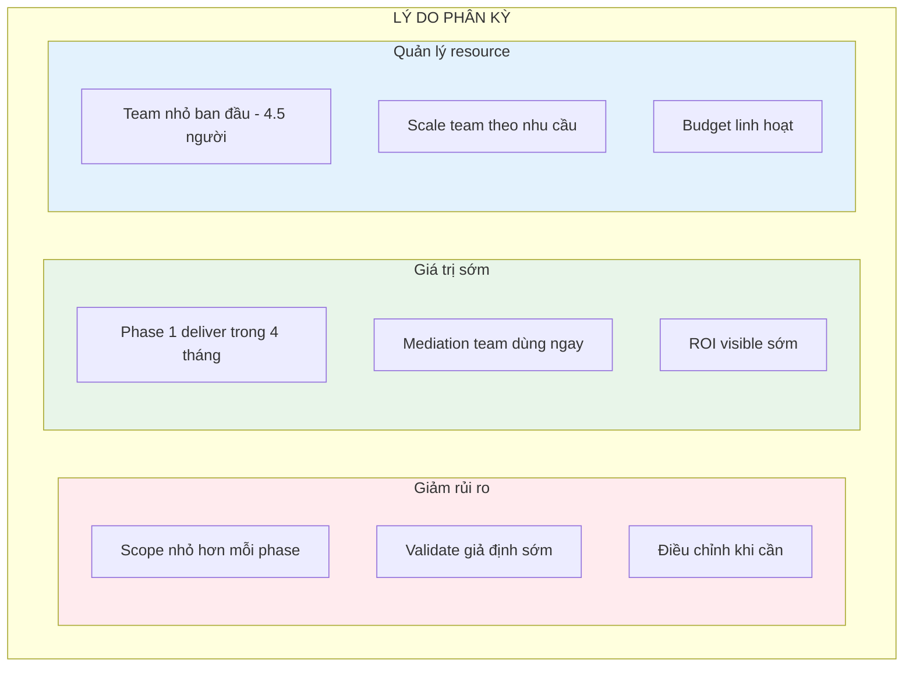

## 5.2 Scope từng Phase

```mermaid
flowchart LR
    subgraph P1["PHASE 1: Foundation<br>Q1-Q2 2025 — 16 tuần"]
        P1A["MinIO Data Lake"]
        P1B["StarRocks Standalone"]
        P1C["AdMob Integration"]
        P1D["Firebase/GA Integration"]
        P1E["SoW Analysis"]
        P1F["Recommendation Engine"]
        P1G["Mediation Dashboard"]
        P1H["Alert System"]
    end
    
    subgraph P2["PHASE 2: Full Platform<br>Q3-Q4 2025 — 16 tuần"]
        P2A["XMP Integration"]
        P2B["Meta Ads Integration"]
        P2C["AppLovin Integration"]
        P2D["AppMetrica Integration"]
        P2E["UA Dashboard"]
        P2F["Product Dashboard"]
        P2G["Unified ROI Metrics"]
        P2H["ML Foundation"]
    end
    
    P1 --> P2
    
    style P1 fill:#e3f2fd
    style P2 fill:#e8f5e9
```

## 5.3 So sánh 2 Phase

| Aspect | Phase 1 | Phase 2 |
|--------|---------|---------|
| **Data Sources** | 2 (AdMob, Firebase) | 6 (tất cả) |
| **User chính** | Mediation Team | Tất cả teams |
| **Focus** | Ad Optimization | Full Analytics |
| **Metrics** | Revenue, eCPM, DAU, SoW | + LTV, ROI, Retention, CPI |
| **Infra** | Standalone | Có thể upgrade cluster |
| **Team size** | 4.5 người | 8 người |

---

# 6. PHASE 1: FOUNDATION & AD OPTIMIZATION

## 6.1 Phase 1 Architecture

Biểu đồ dưới đây mô tả kiến trúc kỹ thuật Phase 1. Có 2 luồng chính:

1. **Luồng Read (mũi tên liền)**: Dữ liệu từ AdMob/Firebase → Sync → MinIO (backup) + StarRocks (analytics) → SoW → Recommendations → Dashboard
2. **Luồng Write (mũi tên đứt)**: User approve recommendation trên Dashboard → API gọi AdMob Write APIs → Apply thay đổi waterfall

Luồng Write là điểm khác biệt lớn nhất so với quy trình cũ: hệ thống tự apply thay đổi thay vì team phải vào Dolphin/Console làm thủ công.

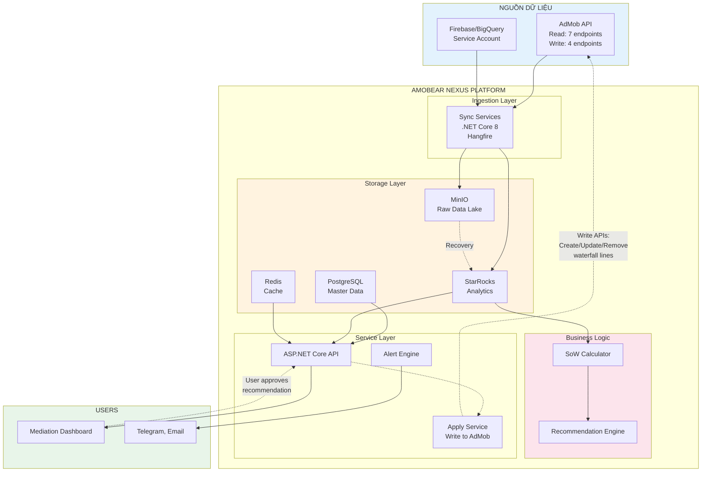


## 6.2 AdMob Integration

AdMob là nguồn dữ liệu quan trọng nhất, đồng thời cũng là hệ thống mà Amobear Nexus sẽ **ghi ngược** (apply changes). Tích hợp AdMob chia thành 2 nhóm API rõ ràng:

- **Read APIs** (7 endpoints): Thu thập dữ liệu structure, waterfall, performance — chạy tự động hàng ngày
- **Write APIs** (4 endpoints): Tạo/sửa/xóa waterfall ad units, apply recommendations — chạy khi user approve

Đây chính là phần thay thế hoàn toàn quy trình thủ công hiện tại: thay vì team mở Dolphin → chọn app → sửa floor → apply, giờ Amobear Nexus tự phân tích → đề xuất → team approve → hệ thống apply qua API.

> **Lưu ý quan trọng:** Write APIs yêu cầu Amobear phải có **AdMob Write API allowlist** từ Google. Đây là quyền đặc biệt cần apply riêng, không tự có.

### 6.2.1 AdMob API Overview

Biểu đồ dưới đây mô tả toàn bộ 11 endpoints chia thành 2 nhóm: Read (sync tự động) và Write (apply changes). Mũi tên từ Read APIs đi vào platform (thu thập), mũi tên từ platform đi ra Write APIs (apply).

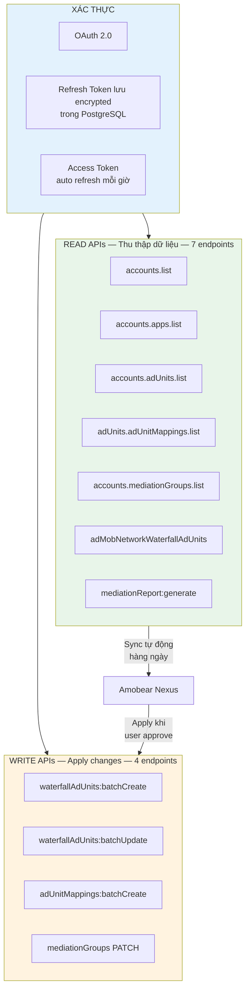

### 6.2.2 Read APIs — Sync dữ liệu

| # | Endpoint | Dữ liệu | Tần suất | Lưu ý |
|---|----------|----------|----------|-------|
| R1 | **accounts.list** | Account ID, name, currency, timezone | Daily 00:00 | Ít thay đổi, sync để đảm bảo mới nhất |
| R2 | **accounts.apps.list** | App ID, name, platform, store link | Daily 00:10 | Phát hiện app mới |
| R3 | **accounts.adUnits.list** | Ad unit ID, name, format (banner/inter/rewarded) | Daily 00:20 | Primary ad units — "slot" quảng cáo trong app |
| R4 | **adUnits.adUnitMappings.list** | Mapping giữa primary ad unit và network adapter | Daily 00:25 | Biết ad unit nào đã link với network nào |
| R5 | **accounts.mediationGroups.list** | MG ID, targeting, waterfall lines, floor prices | Daily 00:30 | **Quan trọng nhất** — chứa toàn bộ cấu trúc waterfall |
| R6 | **adMobNetworkWaterfallAdUnits** | Waterfall ad unit detail: floor price, format, adTypes | Daily 00:35 | AdMob Network ad units — cần cho SoW và Write API |
| R7 | **mediationReport:generate** | Revenue, impressions, eCPM, fill rate, match rate | Daily 02:30 | Metrics chính, query T-1 và T-2 |

> **Global Redis gate (Doc 136):** Mọi luồng gọi R7 (Hangfire performance-sync-*, compare resync, API nội bộ) đi qua **`IMediationReportGenerateCoordinator`**: một session Redis tại một thời điểm, cooldown **15 phút** giữa các lần gọi HTTP khi session active; job bị chặn → hàng đợi FIFO không trùng; API bị chặn → HTTP 409 skip. Restart API xóa session treo. Cấu hình: `PerformanceSync:MediationGenerateGateEnabled`, `MediationGenerateCooldownMinutes`.

### 6.2.2.1 mediationReport:generate — điều phối & hàng đợi

Chi tiết kiến trúc, Redis keys, queueKey, troubleshooting: **[136-ADMOB-MEDIATION-REPORT-GENERATE-GATE.md](./136-ADMOB-MEDIATION-REPORT-GENERATE-GATE.md)**.

Tóm tắt luồng job bị chặn:

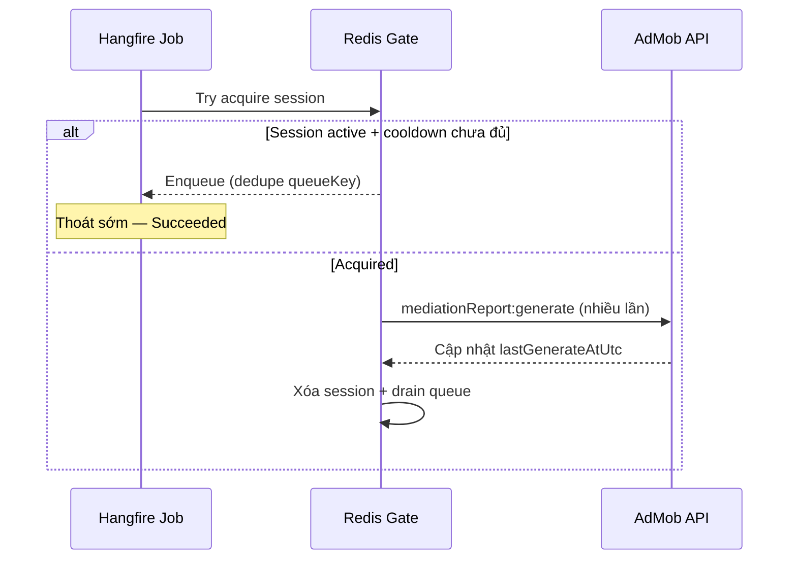

### 6.2.3 Hiểu về adMobNetworkWaterfallAdUnits

Đây là entity quan trọng cần hiểu rõ. Trong hệ thống AdMob, waterfall hoạt động như sau:

- **Primary Ad Unit** (`adUnits`): "Slot" quảng cáo đặt trong app — mỗi banner, interstitial, rewarded là 1 ad unit
- **Mediation Group**: Nhóm quy định ad unit nào serve quảng cáo, targeting đâu, waterfall thế nào
- **Waterfall Line**: 1 dòng trong waterfall — chứa network, floor price, trạng thái
- **Waterfall Ad Unit** (`adMobNetworkWaterfallAdUnits`): Ad unit riêng của **AdMob Network** trong waterfall — có floor price cụ thể

Biểu đồ dưới giải thích mối quan hệ giữa các entities. Primary Ad Unit là gốc, được link vào Mediation Group qua Waterfall Lines. Mỗi AdMob waterfall line cần có 1 Waterfall Ad Unit tương ứng (chứa floor price), và link qua Ad Unit Mapping.

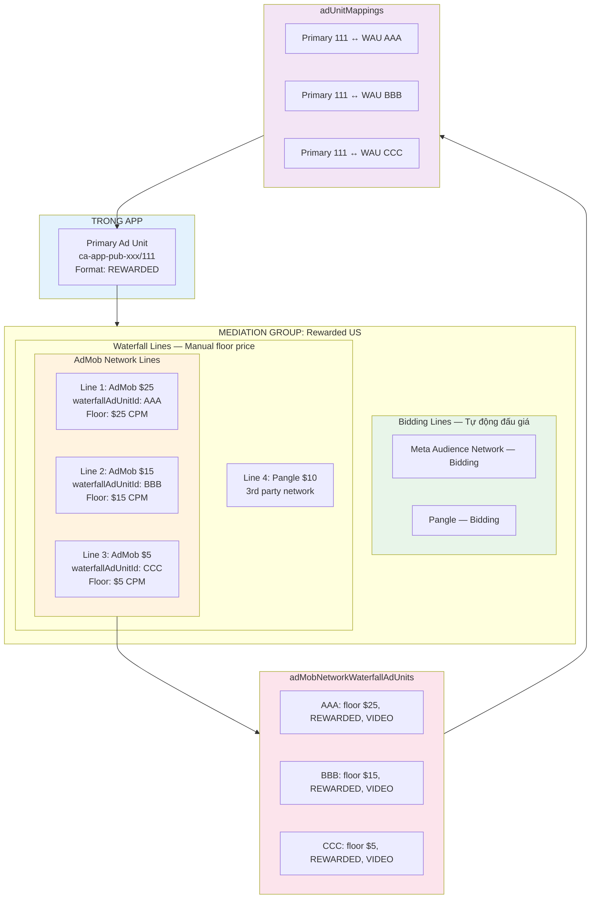

**Tóm lại mối quan hệ:**

| Entity | Ví dụ | Giải thích |
|--------|-------|------------|
| **Primary Ad Unit** | `ca-app-pub-xxx/111` | "Slot" quảng cáo trong app |
| **Mediation Group** | `Rewarded US` | Nhóm waterfall, quy định targeting và thứ tự networks |
| **Waterfall Line** | Line ID `"5"` trong MG | 1 dòng trong waterfall, chứa network + floor + state |
| **Waterfall Ad Unit** | ID: `AAA`, floor: $25 | Ad unit riêng của AdMob Network, chứa **floor price cụ thể** |
| **Ad Unit Mapping** | `111 → AAA` | Link primary ad unit với waterfall ad unit |

**Tại sao cần sync endpoint này?**

- Biết chính xác floor price hiện tại của mỗi AdMob waterfall line
- Có `waterfallAdUnitId` để gọi Write API update floor
- Verify sau khi apply — floor đã đúng chưa

### 6.2.4 Write APIs — Apply Recommendations

Đây là phần **giá trị cốt lõi** của Amobear Nexus so với Excel và Dolphin: sau khi SoW Analysis tạo recommendations, team approve trên Dashboard, hệ thống tự động apply thay đổi qua AdMob API. Không cần mở tool nào khác.

> **Prerequisite:** Amobear cần **AdMob Write API allowlist** từ Google. Đây là quyền đặc biệt, cần apply qua Google account manager.

#### Write Endpoints

| # | Endpoint | Method | Mô tả | Khi nào dùng |
|---|----------|--------|--------|-------------|
| W1 | **waterfallAdUnits:batchCreate** | POST | Tạo mới AdMob waterfall ad units với floor price cụ thể. Truyền: appId, displayName, format, adTypes, globalFloorMicros | Rule 7 (ADD LAYER), Rule 8 (ADD HIGHER): thêm floor mới |
| W2 | **waterfallAdUnits:batchUpdate** | POST | Cập nhật floor price (globalFloorMicros) hoặc displayName. Cần truyền updateMask chỉ định fields update | Rule 2/3 (REDUCE), Rule 5/6 (INCREASE): thay đổi floor |
| W3 | **adUnitMappings:batchCreate** | POST | Tạo mapping giữa primary ad unit và waterfall ad unit mới. **Bắt buộc** sau batchCreate — nếu không link, ad unit mới không serve | Luôn gọi sau W1 |
| W4 | **mediationGroups PATCH** | PATCH | Thêm line mới (negative ID: "-1", "-2"...), xóa line (state = "REMOVED"), disable line (state = "DISABLED"). Dùng updateMask | Rule 1 (REMOVE). Sau W1+W3: thêm line vào MG |

#### Luồng Apply Recommendation

Biểu đồ dưới mô tả toàn bộ luồng: từ recommendation → user approve → validate → gọi Write API theo action type → verify → log audit.

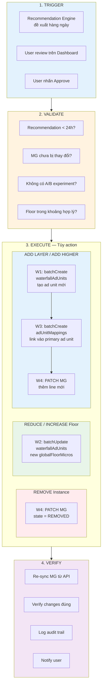

#### Mapping Rule → Write APIs

| Rule | Action | APIs cần gọi | Chi tiết |
|------|--------|--------------|----------|
| **Rule 1: REMOVE** | Xóa instance | W4 | PATCH MG, set line `state = "REMOVED"` |
| **Rule 2: TEST** | Giảm floor 15% | W2 | batchUpdate, `globalFloorMicros = current × 0.85` |
| **Rule 3: REDUCE** | Giảm floor 15% | W2 | batchUpdate, `globalFloorMicros = current × 0.85` |
| **Rule 4: KEEP** | Không làm gì | — | Không gọi API |
| **Rule 5: INCREASE** | Tăng floor 10% | W2 | batchUpdate, `globalFloorMicros = current × 1.10` |
| **Rule 6: INCREASE** | Tăng floor 5% | W2 | batchUpdate, `globalFloorMicros = current × 1.05` |
| **Rule 7: ADD LAYER** | Thêm floor trung gian | W1 → W3 → W4 | Tạo ad unit → link mapping → thêm vào MG |
| **Rule 8: ADD HIGHER** | Thêm floor × 1.25 | W1 → W3 → W4 | Tạo ad unit → link mapping → thêm vào MG |

#### Ví dụ: Apply Rule 8 (ADD HIGHER)

Giả sử MG "Rewarded US" có instance "AdMob $25" là floor cao nhất, SoW > 5%. Engine đề xuất thêm floor $31.25 (= $25 × 1.25). Biểu đồ sequence mô tả 4 bước API calls:

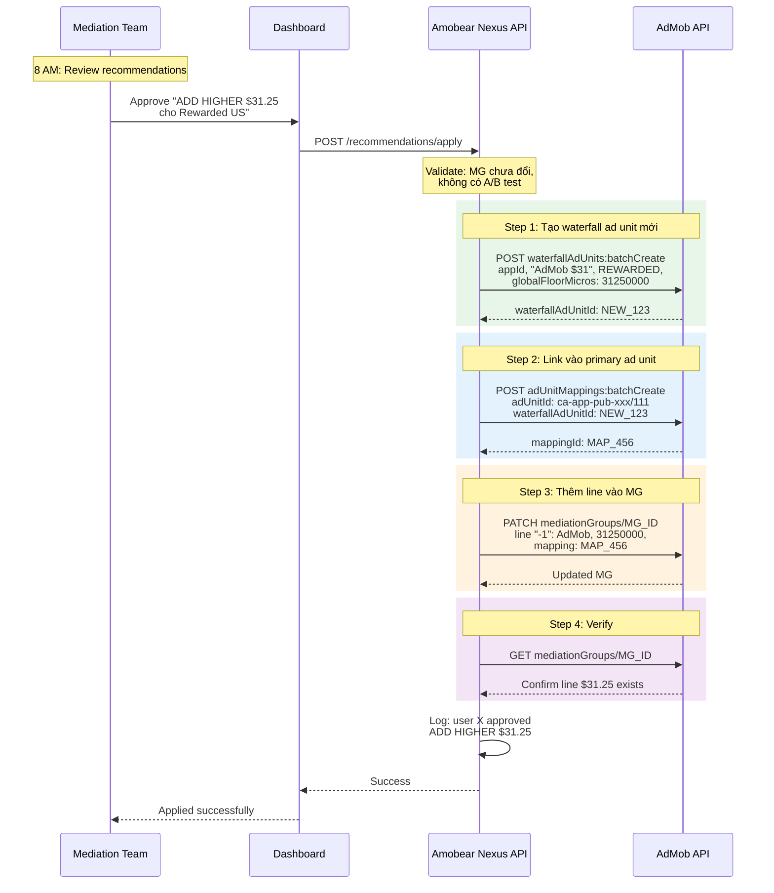

#### Safety Checks

Mỗi lần apply, hệ thống phải kiểm tra:

| Check | Mô tả | Nếu fail |
|-------|--------|----------|
| **Freshness** | Recommendation < 24 giờ | Reject, yêu cầu re-analyze |
| **MG unchanged** | MG chưa bị ai sửa kể từ lúc analyze | Reject, re-sync MG |
| **No A/B test** | Không có experiment đang chạy trên MG | Reject, phải stop experiment trước |
| **Floor sanity** | Floor mới trong khoảng $0.01 - $500 | Reject, flag anomaly |
| **Rate limit** | Không vượt AdMob API rate limit | Queue, retry sau |
| **Permission** | User có quyền apply cho account/app | Reject, insufficient permission |

## 6.3 Firebase/GA Integration

Firebase cung cấp dữ liệu user engagement (DAU, DAV, sessions). Dữ liệu được export tự động từ Firebase sang BigQuery, rồi Amobear Nexus tải về.

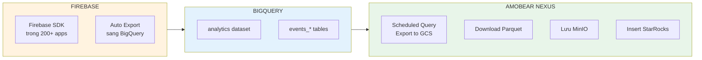

### Firebase Key Events

| Event | Ý nghĩa | Dùng để tính |
|-------|---------|--------------|
| `session_start` | User mở app | DAU |
| `first_open` | User mở app lần đầu | New Users |
| `user_engagement` | User tương tác | DAU |
| `ad_impression` | User xem quảng cáo | DAV (Daily Ad Viewers) |
| `ad_click` | User click quảng cáo | CTR |
| `in_app_purchase` | User mua IAP | IAP Revenue |

---

# 7. PHASE 2: FULL DATA PLATFORM

## 7.1 Additional Sources

Ngoài AdMob + Firebase (Phase 1), platform đã và đang tích hợp thêm nhiều nguồn dữ liệu:

### 7.1.1 Các nguồn đã LIVE

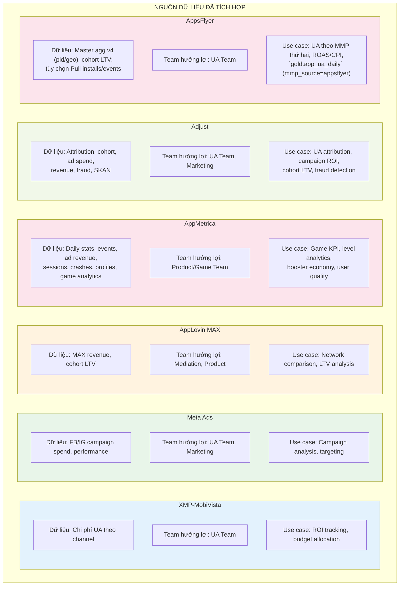

### 7.1.2 Các nguồn bổ sung (IAP & Store) — đã tích hợp pipeline

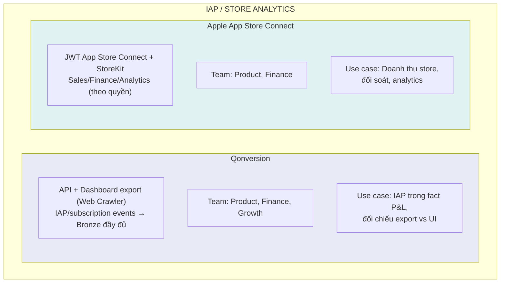

### 7.1.3 Tổng quan trạng thái tích hợp

| Nguồn | Trạng thái | Bronze Tables | Silver/Gold | Sync Jobs | Tài liệu |
|-------|-----------|---------------|-------------|-----------|-----------|
| **AdMob** | LIVE | 4 bảng | 5 silver, 2 gold | 3 recurring | §6.2 |
| **Firebase/BQ** | LIVE | Dynamic per-app (`fb_*`) | 7 MVs + 5 gold per-app | 2 recurring | §6.3 |
| **AppLovin MAX** | LIVE | 2 bảng | — | 1 recurring | — |
| **XMP** | LIVE | 1 bảng | — | 2 recurring | — |
| **Meta Ads** | LIVE | 1 bảng | 2 silver, 1 gold | 4 recurring | — |
| **AppMetrica** | LIVE | 10 bảng | 3 silver, 3 gold | 5 recurring | doc 006 |
| **Adjust** | LIVE | 1 bảng | dim + `gold.app_ua_daily` (`mmp_source=adjust`) | 2 recurring | doc 119 |
| **AppsFlyer** | LIVE | `appsflyer_installs_raw` (Pull `installs_report` khi bật), `events_raw`, `aggregate_daily`, `api_pull_raw`, `extended_pull`, `webhook_raw` | `dim_app_identifiers.appsflyer_af_app_id`; `appsflyer_installs_clean`, `appsflyer_ua_metrics` (khi Pull bật); `gold.app_ua_daily` (`mmp_source=appsflyer`) | Master v4: nhiều lịch (today, T-3..T-1, lookback); **Installs report**: job riêng (today, T-3..T-1, weekly) khi `EnablePullApi`; cohort: `appsflyer-master-cohort-weekly`; transform: `AppsFlyerUaTransformJob` | **128**, **128b** |
| **Qonversion** | LIVE (pipeline) | `qonversion_events_raw` (+ MinIO backup export) | Silver/Gold IAP theo transform (merge vào fact khi cấu hình) | API sync + `QonversionWebCrawlerJob` (cookie dashboard) | **126** |
| **Apple App Store** | LIVE (pipeline) | Bronze theo job Apple (sales/finance/analytics tùy bật) | Tùy mô-đun transform | `AppleStorePipelineJob` + lịch Hangfire | **127** |

## 7.2 Unified Metrics Engine

Với 9+ nguồn dữ liệu, platform tính toán unified KPIs xuyên suốt hệ sinh thái. Dữ liệu được enriched qua Medallion Architecture (Bronze → Silver → Gold) và phục vụ cho cả Dashboard lẫn AI Engine:

```mermaid
flowchart LR
    subgraph Inputs["DỮ LIỆU ĐẦU VÀO"]
        I1["AdMob Revenue"]
        I2["AppLovin Revenue"]
        I3["Firebase DAU/DAV"]
        I4["XMP Costs"]
        I5["Meta Costs"]
        I6["AppMetrica Stats + Game KPI"]
        I7["Adjust Attribution + Cohort"]
        I8["AppsFlyer Master v4 / Pull UA"]
        I9["Qonversion IAP / subs"]
    end
    
    subgraph Engine["TÍNH TOÁN"]
        C1["Total Revenue<br>= IAA + IAP (theo Gold)"]
        C2["Total UA Cost<br>= XMP + Meta + Adjust + AppsFlyer"]
        C3["DAU<br>= Firebase or AppMetrica"]
        C4["Attribution<br>= Adjust or AppsFlyer"]
    end
    
    subgraph KPIs["UNIFIED KPIs"]
        K1["ARPDAU = Revenue / DAU"]
        K2["ARPDAV = Revenue / DAV"]
        K3["UA ROI = Revenue minus Cost / Cost"]
        K4["LTV = Cohort Revenue Sum"]
        K5["CPI = Cost / Installs"]
        K6["Game KPI = Level Perf, Coin Economy"]
    end
    
    Inputs --> Engine --> KPIs
    
    style Inputs fill:#e3f2fd
    style Engine fill:#fff3e0
    style KPIs fill:#e8f5e9
```

## 7.3 Team-Specific Dashboards

Mỗi team nhận dashboard riêng, hiển thị metrics phù hợp:

| Dashboard | Audience | Key Views | Data Sources |
|-----------|----------|-----------|--------------|
| **Ad Ops Dashboard** | Mediation Team | Waterfall, SoW, Floor Price, Network A/B | AdMob, AppLovin |
| **UA Dashboard** | UA Team | Campaign ROI, CPI, LTV/CAC, Budget | XMP, Meta, Firebase |
| **Product Dashboard** | Product/Game Team | Retention, Sessions, Crashes, Feature Usage | Firebase, AppMetrica |
| **Finance Reports** | Leadership | Revenue Forecast, Budget vs Actual, Portfolio | All sources |

---

# 8. KIẾN TRÚC CÔNG NGHỆ

## 8.1 Technology Stack

Biểu đồ dưới đây mô tả toàn bộ technology stack. Điểm nhấn:
- Backend hoàn toàn .NET Core 8 (không Python) — team chỉ cần 1 skill set
- StarRocks làm OLAP database — tận dụng hạ tầng hiện có
- StarRocks hỗ trợ MySQL protocol — dùng MySqlConnector quen thuộc
- AI Engine tích hợp multi-provider (Claude, Gemini, GPT) với RAG và MCP Proxy

```mermaid
flowchart TB
    subgraph Stack["TECHNOLOGY STACK"]
        subgraph Backend[".NET Core 8 - Unified"]
            BE1["ASP.NET Core<br>REST APIs + SSE Streaming"]
            BE2["Worker Services<br>Sync Jobs"]
            BE3["Hangfire<br>Job Scheduling"]
            BE4["Dapper + Npgsql<br>PostgreSQL Access"]
            BE5["Dapper + MySqlConnector<br>StarRocks Access"]
            BE6["EF Core 8<br>Migrations + pgvector"]
        end
        
        subgraph AI["AI Engine"]
            AI1["Multi-Provider<br>Claude, Gemini, GPT"]
            AI2["RAG + pgvector<br>Knowledge Base"]
            AI3["MCP Proxy<br>StarRocks + Postgres"]
            AI4["Agentic Query Loop<br>Tool Calling"]
        end
        
        subgraph Data["Data Layer"]
            DA1["StarRocks<br>Analytics OLAP<br>MySQL Protocol"]
            DA2["PostgreSQL 15<br>Master Data + pgvector"]
            DA3["Redis 7<br>Caching + Pub/Sub"]
            DA4["MinIO<br>Object Storage"]
            DA5["RabbitMQ 3<br>Message Queue"]
        end
        
        subgraph Frontend["Frontend"]
            FE1["Next.js 16 + React 19 + TypeScript"]
            FE2["Recharts / charts theo màn"]
            FE3["Tailwind 4 + shadcn/ui"]
            FE4["SSE Client — AI Streaming"]
        end
        
        subgraph DevOps["Infrastructure"]
            DO1["Docker + Docker Compose"]
            DO2["Nginx Reverse Proxy"]
            DO3["Ubuntu Server"]
            DO4["Apache Superset<br>BI Platform"]
        end
    end
    
    style Backend fill:#e3f2fd
    style AI fill:#ede7f6
    style Data fill:#fff3e0
    style Frontend fill:#e8f5e9
    style DevOps fill:#fce4ec
```

### Tại sao dùng MySqlConnector cho StarRocks?

StarRocks hỗ trợ **MySQL protocol** hoàn toàn, nghĩa là:
- Dùng MySQL client tools quen thuộc (MySQL Workbench, DBeaver)
- Connect từ .NET bằng `MySqlConnector` — NuGet package phổ biến, stable
- Syntax SQL tương tự MySQL — team dễ làm quen
- Không cần học driver/protocol riêng (giữ đúng theo hạ tầng StarRocks hiện tại)

## 8.2 StarRocks Strategy

Amobear đã có hệ thống StarRocks đang chạy on-premise (128 CPU, 512GB RAM, 8TB SSD). Amobear Nexus **tận dụng hạ tầng này** thay vì triển khai thêm database mới. Điều này giúp:

- **Giảm chi phí**: Không cần server mới
- **Giảm complexity**: Team chỉ cần master 1 OLAP engine
- **Tận dụng capacity**: Server hiện tại còn rất nhiều headroom

### Tại sao chọn StarRocks?

| Tiêu chí | Lợi thế StarRocks |
|----------|-------------------|
| **Đã có hạ tầng** | Đang chạy on-premise, team đang học |
| **Complex JOINs** | CBO optimizer tự chọn join strategy, colocate join cho Cost + Revenue |
| **Real-time ingestion** | Routine Load, Stream Load — sẵn sàng cho near real-time tương lai |
| **UPDATE/UPSERT** | Native với Primary Key tables — cần cho update floor prices |
| **MySQL compatibility** | MySQL protocol — dễ integrate với .NET, tools quen thuộc |

### Kiến trúc StarRocks hiện tại

```mermaid
flowchart TB
    subgraph Current["HẠ TẦNG HIỆN TẠI"]
        subgraph Server["Server On-Premise"]
            HW["128 CPU • 512GB RAM • 8TB SSD"]
        end
        
        subgraph StarRocks["StarRocks Deployment"]
            FE["FE Node<br>Query planning, metadata"]
            BE["BE Node<br>Data storage, execution"]
        end
        
        subgraph Data["Dữ liệu hiện có"]
            D1["Firebase Events"]
            D2["AdMob Performance"]
            D3["XMP Costs"]
        end
    end
    
    subgraph MediationPro["AMOBEAR NEXUS MỚI"]
        M1["Thêm tables mới"]
        M2["Thêm materialized views"]
        M3["Không cần server mới"]
    end
    
    Server --> StarRocks
    StarRocks --> Data
    Data --> MediationPro
    
    style Current fill:#e8f5e9
    style MediationPro fill:#e3f2fd
```

### Capacity Planning

| Resource | Hiện tại | Sau Amobear Nexus | Headroom |
|----------|----------|-------------------|----------|
| **CPU** | ~20% used | ~35% used | 65% còn lại |
| **RAM** | ~100GB used | ~150GB used | 362GB còn lại |
| **Storage** | ~2TB used | ~4TB used | 4TB còn lại |

### Khi nào cần scale?

```mermaid
flowchart TB
    subgraph Current["HIỆN TẠI: Single Node"]
        C1["1 FE + 1 BE trên 1 server"]
        C2["Đủ cho 200-500 apps"]
        C3["Daily batch + near real-time"]
    end
    
    subgraph Triggers["KHI NÀO CẦN CLUSTER?"]
        T1["Data vượt 5TB"]
        T2["Query p95 > 3 giây"]
        T3["Concurrent users > 50"]
        T4["Cần HA 99.9%"]
    end
    
    subgraph Scale["SCALE OPTIONS"]
        S1["Thêm BE nodes cho storage"]
        S2["Thêm FE nodes cho HA"]
    end
    
    Current --> Triggers --> Scale
    
    style Current fill:#e8f5e9
    style Triggers fill:#fff3e0
    style Scale fill:#e3f2fd
```

## 8.3 Component Interaction

Biểu đồ sequence dưới đây mô tả luồng hoạt động trong một ngày: Sync Job chạy lúc 2AM, lưu raw vào MinIO, insert vào StarRocks, rồi chạy transform, SoW, recommendations. Alert Engine kiểm tra bất thường. Khi user mở Dashboard, API query StarRocks trả kết quả.

```mermaid
sequenceDiagram
    participant Scheduler as Hangfire Scheduler
    participant Job as Sync Job
    participant MinIO as MinIO
    participant CH as StarRocks
    participant SoW as SoW Calculator
    participant Rec as Recommendation Engine
    participant Alert as Alert Engine
    participant API as API Server
    participant UI as Dashboard
    
    Note over Scheduler: 2:00 AM - Daily Sync
    Scheduler->>Job: Trigger AdMob Sync
    Job->>MinIO: Save raw JSON.gz
    Job->>CH: Insert bronze tables
    
    Note over Scheduler: 4:00 AM - Transform
    Scheduler->>CH: Silver layer transforms
    Scheduler->>CH: Gold layer aggregations
    
    Note over Scheduler: 4:30 AM - Analysis
    Scheduler->>SoW: Calculate SoW for all MGs
    SoW->>CH: Read performance data
    SoW->>CH: Write SoW results
    SoW->>Rec: Trigger recommendations
    Rec->>CH: Generate recommendations
    
    Note over Scheduler: 5:00 AM - Alerts
    Scheduler->>Alert: Evaluate all rules
    Alert->>CH: Query conditions
    Alert-->>Alert: Send Telegram notifications
    
    Note over UI: 8:00 AM - User opens Dashboard
    UI->>API: GET /dashboard/summary
    API->>CH: Query gold tables
    CH-->>API: Results
    API-->>UI: KPIs, Charts, Alerts
    
    UI->>API: GET /recommendations
    API->>CH: Query recommendations
    API-->>UI: List of recommendations
```

---

# 9. KIẾN TRÚC DỮ LIỆU

## 9.1 Medallion Architecture

Dữ liệu chảy qua 3 tầng: Bronze (raw parsed), Silver (cleaned), Gold (aggregated KPIs). Mỗi tầng có mục đích khác nhau.

```mermaid
flowchart LR
    subgraph Bronze["BRONZE<br>Raw Parsed Data"]
        direction TB
        B1["Dữ liệu gốc từ API"]
        B2["Cấu trúc giữ nguyên"]
        B3["Có thể có duplicates"]
    end
    
    subgraph Silver["SILVER<br>Cleaned Data"]
        direction TB
        S1["Đã remove duplicates"]
        S2["Schema chuẩn hóa"]
        S3["Enriched với dimensions"]
    end
    
    subgraph Gold["GOLD<br>Business Metrics"]
        direction TB
        G1["Aggregated KPIs"]
        G2["Ready for dashboard"]
        G3["Materialized views"]
    end
    
    Bronze --> |"Transform<br>Clean, Validate"| Silver --> |"Aggregate<br>Calculate KPIs"| Gold
    
    style Bronze fill:#ffcc80
    style Silver fill:#b0bec5
    style Gold fill:#ffd54f
```

## 9.2 Data Lineage

Biểu đồ dưới cho thấy dữ liệu chảy từ tất cả các nguồn đến output cuối cùng, qua mỗi tầng được transform như thế nào.

```mermaid
flowchart TB
    subgraph Sources["NGUỒN"]
        EXT1["AdMob API"]
        EXT2["Firebase/BQ"]
        EXT3["AppLovin MAX"]
        EXT4["XMP"]
        EXT5["Meta Ads"]
        EXT6["AppMetrica"]
        EXT7["Adjust"]
        EXT8["AppsFlyer"]
        EXT9["Qonversion"]
        EXT10["Apple Store Connect"]
    end
    
    subgraph Landing["LANDING - MinIO"]
        RAW["raw/*.json.gz / *.parquet<br>Compressed, Immutable"]
    end
    
    subgraph Bronze["BRONZE - StarRocks"]
        BR1["admob_performance, admob_table,<br>mediation_table, mkt_table"]
        BR2["fb_* (Firebase per app)"]
        BR3["applovin_revenue, applovin_cohort"]
        BR4["xmp_report"]
        BR5["meta_insights"]
        BR6["appmetrica_stats, events,<br>ad_revenue, sessions, ..."]
        BR7["adjust_report"]
        BR8["appsflyer_* (aggregate_daily master_api_v4,<br>installs_report Pull khi bật)"]
        BR9["qonversion_events_raw (+ MinIO CSV)"]
        BR10["apple_store_* (sales/finance/analytics — theo pipeline)"]
    end
    
    subgraph Silver["SILVER - StarRocks"]
        SL1["daily_app_revenue"]
        SL2["daily_app_engagement, dau_dav_stats"]
        SL3["daily_sow_analysis"]
        SL4["dim_app_identifiers (+ appsflyer_af_app_id), dim_country"]
        SL5["dim_meta_campaign_app"]
        SL6["appmetrica_level_flat, ad_event_flat"]
        SL7["mv_daily_engagement_*, mv_retention_cohort_*"]
        SL8["appsflyer_installs_clean, appsflyer_ua_metrics<br>(khi Pull bật)"]
    end
    
    subgraph Gold["GOLD - StarRocks"]
        GL1["fact_daily_app_metrics<br>IAA + IAP, ARPDAU, eCPM, Fill Rate"]
        GL2["fact_sow_recommendations<br>8-rule results"]
        GL3["app_ua_daily<br>Adjust + AppsFlyer (mmp_source)"]
        GL4["appmetrica_daily_game_kpi,<br>appmetrica_level_performance"]
        GL5["fact_daily_overview_*,<br>fact_retention_overview_*"]
    end
    
    subgraph Serving["PHỤC VỤ"]
        SV1["Dashboard"]
        SV2["AI Assistant / App Insight"]
        SV3["Alerts"]
        SV4["Reports"]
    end
    
    Sources --> Landing --> Bronze --> Silver --> Gold --> Serving
    Landing -.-> |"Recovery replay"| Bronze
    
    style Landing fill:#fff3e0
    style Bronze fill:#ffcc80
    style Silver fill:#b0bec5
    style Gold fill:#ffd54f
    style Serving fill:#e8f5e9
```

---

# 10. THIẾT KẾ DATABASE

## 10.1 Three-Database Strategy

| Database | Vai trò | Pattern | Ví dụ data |
|----------|---------|---------|------------|
| **PostgreSQL** | Master data, configs | OLTP: reads/writes nhỏ, frequent | apps, accounts, users, alert_rules |
| **StarRocks** | Analytics | OLAP: queries lớn, scans | performance, events, KPIs |
| **MinIO** | Raw backup | Write once, read rarely | Original API responses |

## 10.2 PostgreSQL Tables

### Core Tables

| Table | Mô tả | Key Columns |
|-------|--------|-------------|
| **apps** | Danh sách toàn bộ apps trong hệ thống. Mỗi app có bundle_id duy nhất và mapping sang các hệ thống bên ngoài (AdMob, Firebase, AppMetrica). Đây là bảng trung tâm để join dữ liệu. | app_id, app_name, bundle_id, platform, status |
| **admob_accounts** | Thông tin tài khoản AdMob, bao gồm credentials (encrypted) để gọi API. Mỗi account có thể chứa nhiều apps. | account_id, account_name, currency_code, refresh_token |
| **applovin_accounts** | Thông tin tài khoản AppLovin MAX, dùng report_key để authenticate. | account_name, report_key (encrypted) |
| **xmp_accounts** | Credentials cho XMP platform, xác thực qua client_id + MD5 signature. | client_id, client_secret (encrypted) |
| **meta_accounts** | Facebook/Meta Ads credentials, access token cần refresh định kỳ. | account_id, access_token (encrypted) |
| **appmetrica_accounts** | AppMetrica OAuth token cho Reporting API và Logs API. | oauth_token (encrypted) |
| **appsflyer_accounts** | Tài khoản AppsFlyer (API V2 token encrypted). | account name, token |
| **appsflyer_apps** | App AF thuộc account (`af_app_id`, enabled). | appsflyer_account_id, af_app_id |

> Meta Ads direct edit (campaign config/ad set/ad name-status) dùng PATCH + resync đồng bộ; chi tiết triển khai: [`docs/138-meta-campaign-update/README.md`](138-meta-campaign-update/README.md).

### Mapping Tables

| Table | Mô tả | Key Columns |
|-------|--------|-------------|
| **app_account_mapping** | Liên kết giữa app nội bộ với account trên từng platform bên ngoài. Ví dụ: app "Weather Pro" → AdMob account pub-xxx + AppLovin package com.weather. | app_id, source, external_account_id |
| **campaign_app_mapping** | Mapping campaign ID (từ Meta, Google...) về app tương ứng, phục vụ cost attribution. | campaign_id, app_id, source |

### Operational Tables

| Table | Mô tả | Key Columns |
|-------|--------|-------------|
| **alert_rules** | Định nghĩa các rule cảnh báo: metric nào, ngưỡng bao nhiêu, gửi qua channel nào. Admin quản lý trên UI. | name, metric, operator, threshold, channels |
| **alert_history** | Lịch sử alert đã trigger: khi nào, app nào, đã xử lý chưa. | rule_id, triggered_at, app_id, status |
| **sync_jobs** | Log mỗi lần sync job chạy: thành công/thất bại, bao nhiêu records, lỗi gì. Dùng để debug khi data thiếu. | job_name, source, status, records_processed |
| **sync_state** | Lưu trạng thái sync cuối cùng của mỗi source/endpoint. Giúp sync incremental thay vì full. | source, endpoint, last_sync_at, last_data_date |
| **users** | Tài khoản người dùng platform, phân quyền theo role. | email, name, role, team |
| **audit_logs** | Mọi thay đổi trên hệ thống đều được ghi lại: ai, làm gì, lúc nào, giá trị cũ/mới. | user_id, action, entity, old_value, new_value |
| **change_history** | Lịch sử thay đổi waterfall/floor price, bao gồm lý do. Giúp track impact của mỗi thay đổi trước/sau. | app_id, mediation_group_id, change_type, reason |
| **recommendation_apply_log** | Log từng lần apply recommendation qua Write API: gọi API nào, request/response gì, thành công/thất bại. Dùng để debug và rollback nếu cần. | recommendation_id, action, api_calls, request_payload, response, status |

## 10.3 StarRocks Tables

### Bronze Layer — Raw Parsed Data

| Table | Mô tả | Key Columns | Partition |
|-------|--------|-------------|-----------|
| **bronze.admob_accounts** | Thông tin account AdMob sync từ API. Dùng Primary Key Table để tự merge khi data sync lại. | account_id, account_name, currency | None |
| **bronze.admob_apps** | Danh sách apps thuộc mỗi AdMob account. Cập nhật hàng ngày. | app_id, account_id, app_name, platform | None |
| **bronze.admob_ad_units** | Cấu trúc ad unit cơ bản: mỗi ad_unit thuộc 1 app, có format (banner/inter/rewarded/native). Đây là "container" — nơi quảng cáo được hiển thị trong app. | ad_unit_id, app_id, ad_unit_name, ad_format | None |
| **bronze.admob_waterfall_ad_units** | **Bảng cốt lõi cho waterfall management.** Mỗi record là 1 adMobNetworkWaterfallAdUnit — đại diện cho 1 dòng trong waterfall của AdMob Network, mang floor price cụ thể (lưu dạng micros). Ví dụ: "AdMob $25" có globalFloorMicros = 25000000. Đây là đối tượng chính mà Recommendation Engine đề xuất thay đổi (sửa floor, thêm mới, xóa). | waterfall_ad_unit_id, app_id, display_name, format, ad_types, global_floor_micros, state | None |
| **bronze.admob_mediation_groups** | Cấu trúc waterfall: mỗi MG chứa danh sách ad source instances với floor prices. Đây là bảng quan trọng cho SoW analysis. | mediation_group_id, targeting, waterfall_lines | None |
| **bronze.admob_performance** | **Bảng metrics chính.** Dữ liệu performance hàng ngày theo: date + app + ad_unit + country + format. Chứa revenue, impressions, eCPM, fill rate. | date, app_id, ad_unit_id, country, revenue, impressions, ecpm | By month |
| **bronze.fb_*** | Raw events Firebase **mỗi app một bảng** (vd. `bronze.fb_com_earthmap_livesatellite_worldmap_view`). Luồng: Firebase → BigQuery → GCS → MinIO → .NET Parse → StarRocks Stream Load. **Jobs:** Daily 4AM UTC (T-1, parallel 5 apps), Weekly Smart Recovery Chủ nhật 6AM UTC (chỉ reload nếu lệch >1%). Dùng để tính DAU, DAV; volume lớn (2-3M events/ngày/app). Schema & đối chiếu BigQuery–StarRocks: **100 - AMOBEAR DATA STORAGE ARCHITECTURE** và **docs/firebase-project/BIGQUERY-SCHEMA-STORAGE.md**. | event_date, event_name, user_pseudo_id, event_timestamp; raw_event_json chứa toàn bộ event BQ | By month (dynamic partition 36 months), ZSTD compression |

### Bronze Tables — Tích hợp mở rộng

| Table | Nguồn | Mô tả | Key Columns | Partition |
|-------|-------|--------|-------------|-----------|
| **bronze.applovin_revenue** | AppLovin | Revenue theo network, country, format. Kết hợp với AdMob cho total revenue. | date, package_name, country, ad_format, network, revenue | By month |
| **bronze.applovin_cohort** | AppLovin | Cohort analysis: revenue và retention theo install date. Cho LTV calculation. | cohort_date, day_number, installs, revenue, retention_rate | By month |
| **bronze.xmp_report** | XMP | Chi phí UA theo product/account/module, join apps qua bundle_id. | date, store_package_id, module, cost, xmp_cost | — |
| **bronze.meta_insights** | Meta Ads | Campaign metrics: spend, impressions, clicks, conversions. | date, campaign_id, spend, impressions, clicks | By month, ZSTD |
| **bronze.adjust_report** | Adjust | **Attribution/MMP:** revenue, cost, installs + cohort từ Report Service **Parquet**. Map app qua **dim_app_identifiers** (`adjust_id` = `app_token`). Metrics nhóm JSON: `conversion_metrics_json`, `cohort_metrics_json`, `ad_spend_metrics_json`, `revenue_metrics_json`, … Cấu hình: `Adjust:ParquetMetricGroups`. | date, app_token, country_code, os_name, network, *_metrics_json | DUPLICATE KEY |
| **bronze.appsflyer_installs_raw** | AppsFlyer | Pull installs CSV (khi `EnablePullApi`). `app_id` = AF app id. | install_date, app_id, appsflyer_id, media_source, country_code, install_time, … | DUPLICATE KEY, partition theo ngày |
| **bronze.appsflyer_events_raw** | AppsFlyer | Pull in-app events (khi Pull bật). | event_date, app_id, event_name, event_time, `raw_row_json`, `event_value`, revenue fields | DUPLICATE KEY |
| **bronze.appsflyer_aggregate_daily** | AppsFlyer | Tổng hợp ngày theo pid/geo. `report_type`: `rollup_installs` hoặc **`master_api_v4`** (Master GET `/app/all`). KPI phụ trong **`metrics_json`**. | report_date, app_id, media_source, campaign_id, country_code, report_type, cost, installs, revenue, metrics_json | DUPLICATE KEY |
| **bronze.appsflyer_api_pull_raw** | AppsFlyer | Audit CSV/body (legacy/optional). | pull_date, app_id, api_kind, response_body | DUPLICATE KEY |
| **bronze.appsflyer_extended_pull** | AppsFlyer | Extended reports (blob). | — | — |
| **bronze.appsflyer_webhook_raw** | AppsFlyer | Push API webhook payload. | — | — |
| **bronze.appmetrica_stats** | AppMetrica | Aggregate daily stats: users, sessions, crashes. | date, app_id, users, sessions, crashes | By month, ZSTD |
| **bronze.appmetrica_events** | AppMetrica | Event-level data với `event_json`. | date, app_id, event_name, event_json | By month, ZSTD |
| **bronze.appmetrica_ad_revenue** | AppMetrica | Ad revenue per device/network. | date, app_id, network, revenue | By month, ZSTD |
| **bronze.appmetrica_sessions** | AppMetrica | Session-level data. | date, app_id, session_id | By month, ZSTD |
| **bronze.appmetrica_revenue** | AppMetrica | IAP/purchase revenue. | date, app_id, revenue_usd | By month, ZSTD |
| **bronze.appmetrica_installations** | AppMetrica | Install attribution data. | date, app_id, publisher_name | By month, ZSTD |
| **bronze.appmetrica_crashes** | AppMetrica | Crash reports. | date, app_id, crash_json | By month, ZSTD |
| **bronze.appmetrica_profiles** | AppMetrica | User profile data. | app_id, device_id, profile_json | By month, ZSTD |
| **bronze.appmetrica_clicks** | AppMetrica | Attribution click data. | date, app_id, click_json | By month, ZSTD |
| **bronze.appmetrica_postbacks** | AppMetrica | Postback data. | date, app_id, postback_json | By month, ZSTD |

### Silver Layer — Cleaned & Enriched

| Table | Mô tả | Key Columns |
|-------|--------|-------------|
| **silver.daily_app_revenue** | Revenue hợp nhất từ tất cả ad networks: AdMob + AppLovin + Others. Breakdown theo format. | date, app_id, platform, country, total_revenue, ecpm, fill_rate |
| **silver.daily_app_engagement** | User engagement metrics: DAU, DAV, sessions. Tính từ Firebase events hoặc AppMetrica. | date, app_id, dau, dav, sessions, new_users |
| **silver.daily_app_costs** | UA costs hợp nhất từ XMP + Meta. Breakdown theo source (facebook, google, tiktok). | date, app_id, source, cost, installs, cpi |
| **silver.daily_sow_analysis** | Kết quả tính SoW cho mỗi ad source instance trong mỗi mediation group. Input cho Recommendation Engine. | date, mediation_group_id, ad_source_instance_id, sow_percent, match_rate, ecpm |
| **silver.dim_app_identifiers** | **Master app identity** — mapping admob_app_id, package_name, app_store_id, firebase_id, appmetrica_id, adjust_id, **appsflyer_af_app_id**. | admob_app_id, adjust_id, appsflyer_af_app_id, … |
| **silver.appsflyer_installs_clean** | Chuẩn hóa installs từ Pull (khi bật). | install_date, af_app_id, admob_app_id, appsflyer_id, media_source, country_code |
| **silver.appsflyer_ua_metrics** | Slice UA ngày từ Pull → nhánh `gold.app_ua_daily` (appsflyer). | report_date, admob_app_id, media_source, country_code, installs, cost_usd, sessions |
| **silver.dim_package_admob_mapping** | Package → AdMob app mapping. | package_name, admob_app_id |
| **silver.dim_country** | Country dimension table. | country_code, country_name |
| **silver.dau_dav_stats** | DAU/DAV calculated từ Firebase. | date, app_id, dau, dav |
| **silver.dim_meta_campaign_app** | Meta campaign → app mapping. | campaign_id, app_id |
| **silver.meta_daily_campaign_insights** | Enriched Meta campaign data với app_id. | date, campaign_id, app_id, spend, impressions |
| **silver.dim_booster_price** | AppMetrica game economy: booster pricing. | app_id, booster_type, price_coins |
| **silver.appmetrica_level_flat** | Flattened level events (start/complete/fail). | date, app_id, level, event_type |
| **silver.appmetrica_ad_event_flat** | Flattened ad events (RV/INT complete). | date, app_id, ad_type, event_type |
| **silver.mv_daily_engagement_{app_id}** | Firebase MV: daily engagement (DAU, sessions, revenue). | event_date, dau, sessions |
| **silver.mv_retention_cohort_{app_id}** | Firebase MV: retention cohort analysis. | install_date, retention_day, users |

### Gold Layer — Business Metrics

| Table | Mô tả | Key Columns |
|-------|--------|-------------|
| **gold.fact_daily_app_metrics** | **Bảng fact chính.** Unified KPIs hàng ngày cho mỗi app: revenue + engagement + costs = ARPDAU, ROI, DAV ratio. Dashboard và AI Engine query bảng này. | date, app_id, revenue, dau, dav, arpdau, ecpm, ua_cost, roi |
| **gold.fact_sow_recommendations** | Kết quả recommendation engine: mỗi record là 1 đề xuất (REMOVE, REDUCE, INCREASE, ADD) cho 1 instance. Mediation team review trên Dashboard. | date, mediation_group_id, instance_id, action, new_floor, reason, priority |
| **gold.app_ua_daily** | UA thống nhất theo **AdMob app_id**: `mmp_source` = `adjust` \| `appsflyer`. Adjust từ `bronze.adjust_report`; AppsFlyer từ `aggregate_daily` (master_api_v4) và/hoặc `silver.appsflyer_ua_metrics` khi Pull bật. | report_date, app_id, mmp_source, media_source, country_code, installs, cost_usd, cpi_usd, revenue_usd, roas, … |
| **gold.fact_user_ltv** | LTV theo user level. Tính từ cohort data. Dùng cho UA ROI analysis. | user_id, app_id, install_date, ltv_d7, ltv_d30, predicted_ltv |
| **gold.appmetrica_daily_game_kpi** | Daily game KPIs từ AppMetrica: DAU, DAV, revenue, ARPDAU cho game apps. | date, app_id, dau, dav, revenue, arpdau |
| **gold.appmetrica_level_performance** | Game level analytics: fail rate, reach rate, coin economy. | app_id, level, attempts, completions, fail_rate |
| **gold.appmetrica_level_group_coin** | Level group (100-level buckets) aggregation. | app_id, level_group, coin_gain, coin_spend |
| **gold.fact_daily_overview_{app_id}** | Firebase daily overview per app: DAU, revenue, ARPDAU. | event_date, dau, revenue, arpdau |
| **gold.fact_retention_overview_{app_id}** | Firebase retention/LTV per app by cohort. | install_date, retention_day, users, ltv |
| **gold.fact_ad_performance_{app_id}** | Firebase IAA performance per app (format, placement, country). | event_date, ad_format, impressions, revenue |
| **gold.fact_iap_performance_{app_id}** | Firebase IAP performance per app. | event_date, product_id, purchases, revenue |
| **gold.fact_level_performance_{app_id}** | Firebase level monitoring per app (win/lose/reach rates). | level, attempts, completions |

---

# 11. THIẾT KẾ LƯU TRỮ MINIO

## 11.1 MinIO Directory Structure

Mỗi raw API response được lưu thành file JSON compressed (.json.gz) theo cấu trúc: `raw/{source}/{endpoint}/{YYYY}/{MM}/{DD}/`. Cấu trúc này giúp dễ dàng tìm và replay dữ liệu theo source và ngày.

```
amobear-datalake/
├── raw/
│   ├── appsflyer/
│   │   └── master/v4/, master/cohort/ … (CSV gzip theo ngày / app)
│   ├── admob/
│   │   ├── accounts/
│   │   │   └── 2025/01/30/
│   │   │       └── accounts_20250130_020000.json.gz
│   │   ├── apps/
│   │   │   └── 2025/01/30/
│   │   │       └── apps_20250130_020100.json.gz
│   │   ├── ad_units/
│   │   │   └── 2025/01/30/
│   │   │       └── ad_units_20250130_020200.json.gz
│   │   ├── mediation_groups/
│   │   │   └── 2025/01/30/
│   │   │       └── mediation_groups_20250130_020300.json.gz
│   │   ├── waterfall_ad_units/
│   │   │   └── 2025/01/30/
│   │   │       └── waterfall_ad_units_20250130_020400.json.gz
│   │   └── performance/
│   │       └── 2025/01/30/
│   │           ├── performance_20250130_020500.json.gz
│   │           └── _manifest.json
│   │
│   └── firebase/
│       └── events/
│           └── 2025/01/30/
│               ├── events_20250130_000000.parquet.gz
│               └── _manifest.json
│
├── processed/
│   └── daily_metrics/
│       └── 2025/01/30/
│
├── archive/
│   └── 2023/
│
└── checkpoints/
```

## 11.2 Compression Strategy

Mọi dữ liệu raw đều được compress bằng GZIP level 6 trước khi lưu MinIO. Tỷ lệ compression ~8-10x, giúp tiết kiệm storage đáng kể.

| Source | Raw/ngày | Compressed/ngày | Tỷ lệ |
|--------|----------|-----------------|--------|
| AdMob Structure | 50 MB | 5 MB | ~10x |
| AdMob Performance | 500 MB | 50 MB | ~10x |
| Firebase Events | 10 GB | 1 GB | ~10x |
| **Total Phase 1** | ~10.5 GB | ~1 GB | ~10x |

**Chi phí ước tính:** ~32 GB/tháng compressed × $0.023/GB = **~$1/tháng** cho MinIO storage.

## 11.3 Manifest File

Mỗi sync job tạo 1 file _manifest.json, ghi lại: tổng files, tổng records, checksum, thời gian sync. Dùng để verify data completeness khi recovery.

## 11.4 Recovery Process

Biểu đồ dưới mô tả quy trình recovery khi phát hiện dữ liệu bị thiếu hoặc sai trong StarRocks. Nhờ có MinIO lưu raw data, có thể replay bất kỳ lúc nào.

```mermaid
flowchart TB
    subgraph Detect["1. PHÁT HIỆN"]
        D1["Alert: Data missing"]
        D2["Xác định scope:<br>source, date range"]
    end
    
    subgraph Prepare["2. CHUẨN BỊ"]
        P1["List files trên MinIO"]
        P2["Verify checksums"]
        P3["Optional: xóa data sai"]
    end
    
    subgraph Recover["3. RECOVERY"]
        R1["Chạy recovery job"]
        R2["Decompress + Parse JSON"]
        R3["Insert lại vào StarRocks"]
    end
    
    subgraph Verify["4. KIỂM TRA"]
        V1["So sánh row counts"]
        V2["Validate totals"]
        V3["Close incident"]
    end
    
    Detect --> Prepare --> Recover --> Verify
    
    style Detect fill:#ffebee
    style Prepare fill:#fff3e0
    style Recover fill:#e3f2fd
    style Verify fill:#e8f5e9
```

---

# 12. KIẾN TRÚC TÍCH HỢP

## 12.1 Sync Job Architecture

Tất cả sync jobs được viết trong **`backend/`** (.NET 8), lên lịch bởi **Hangfire** (cron đọc từ PostgreSQL `hangfire_job_schedules`, có thể reload qua API). Số lượng recurring job **thay đổi theo phiên bản** (thêm nguồn = thêm lịch; ví dụ AppsFlyer tách Master vs Installs report, Qonversion crawler, Apple pipeline).

```mermaid
flowchart TB
    subgraph Jobs["SYNC JOB ARCHITECTURE"]
        subgraph Scheduler["Hangfire"]
            H1["Recurring jobs — DB-driven"]
            H2["Retry Logic (3 retries)"]
            H3["Job Dashboard"]
            H4["Cron từ PostgreSQL<br>hangfire_job_schedules"]
        end
        
        subgraph Workers["Source Workers"]
            W1["AdMob Worker<br>(Structure + Performance)"]
            W2["Firebase Worker<br>(BigQuery Pipeline)"]
            W3["XMP Worker"]
            W4["Meta Worker<br>(Campaign + Insights)"]
            W5["AppLovin Worker"]
            W6["AppMetrica Worker<br>(Stats + Logs + DataStream)"]
            W7["Adjust Worker<br>(Parquet Sync)"]
            W8["AppsFlyer — Master + optional Pull installs"]
            W9["Qonversion — API + Web Crawler export"]
            W10["Apple Store — pipeline JWT"]
        end
        
        subgraph Transform["Transform & Analytics"]
            T1["Silver/Gold Transform"]
            T2["SoW Calculator"]
            T3["Recommendation Engine"]
            T4["DAU/DAV Calculation"]
            T5["Dashboard Cache"]
            T6["AppMetrica Game Analytics"]
            T7["AI App Insight Generator"]
        end
        
        subgraph Common["Shared Services"]
            C1["MinIO Client<br>Upload compressed"]
            C2["StarRocks Client<br>Stream Load + MySQL"]
            C3["Compression<br>GZIP level 6"]
            C4["Logging + Metrics"]
        end
    end
    
    Scheduler --> Workers --> Common
    Scheduler --> Transform --> Common
    
    style Scheduler fill:#e3f2fd
    style Workers fill:#fff3e0
    style Transform fill:#fce4ec
    style Common fill:#e8f5e9
```

## 12.2 Sync Job Flow

Mỗi sync job thực hiện 5 bước tuần tự. Bước 3 (lưu MinIO) đảm bảo raw data luôn có backup trước khi parse vào StarRocks.

```mermaid
flowchart LR
    subgraph Flow["SYNC JOB FLOW"]
        F1["1. Start Job<br>Log to PostgreSQL"] --> F2["2. Fetch from API<br>Handle pagination"]
        F2 --> F3["3. Save to MinIO<br>Compress + Upload"]
        F3 --> F4["4. Parse + Insert<br>StarRocks bronze"]
        F4 --> F5["5. Complete<br>Update sync state"]
    end
    
    F3 -.-> |"Recovery path"| F4
    
    style Flow fill:#e8f5e9
```

---

# 13. SOW ANALYSIS & RECOMMENDATION ENGINE

## 13.1 SoW là gì?

**SoW (Share of Wallet)** = Phần trăm revenue mà 1 ad source instance đóng góp so với tổng revenue của cả Mediation Group.

**Ví dụ cụ thể:**

Mediation Group "Banner US" có tổng revenue $1,000/ngày, gồm 5 ad source instances:

| Instance | Network | Floor Price | Revenue | SoW |
|----------|---------|-------------|---------|-----|
| AdMob Bidding | AdMob | Auto | $400 | **40%** |
| AdMob Network $5 | AdMob | $5.00 | $250 | **25%** |
| Meta Audience $3 | Meta | $3.00 | $200 | **20%** |
| Pangle $2 | Pangle | $2.00 | $100 | **10%** |
| Unity $1 | Unity | $1.00 | $50 | **5%** |

SoW giúp đánh giá: instance nào đang hoạt động tốt, instance nào cần điều chỉnh, instance nào nên loại bỏ.

## 13.2 8-Rule Recommendation Engine

Recommendation Engine phân tích SoW và Match Rate của mỗi instance, áp dụng 8 rules để đưa ra đề xuất. Đây là logic đã proven từ file Excel Waterfall Optimizer, được tự động hóa.

Biểu đồ decision tree dưới đây mô tả luồng quyết định: dựa vào SoW% chia thành 3 nhóm (thấp/trung bình/cao), mỗi nhóm có sub-conditions dẫn đến action cụ thể.

```mermaid
flowchart TD
    START["Instance Metrics<br>SoW, Match Rate, eCPM"] --> CHECK1{"SoW < 1%?"}
    
    CHECK1 -->|"Có"| CHECK2{"Match Rate < 3%?"}
    CHECK1 -->|"Không"| CHECK3{"SoW 1-3%?"}
    
    CHECK2 -->|"Có"| CHECK_LAST{"Instance cuối cùng<br>trong network?"}
    CHECK2 -->|"Không"| RULE3["RULE 3: REDUCE<br>Giảm floor 15%<br>Có tiềm năng, cần test"]
    
    CHECK_LAST -->|"Có"| RULE2["RULE 2: TEST<br>Giảm floor 15% và monitor<br>Không xóa vì là cuối cùng"]
    CHECK_LAST -->|"Không"| RULE1["RULE 1: REMOVE<br>Xóa instance<br>Không hiệu quả"]
    
    CHECK3 -->|"Có"| RULE4["RULE 4: KEEP<br>Giữ nguyên<br>Đang ổn định"]
    CHECK3 -->|"Không"| CHECK4{"SoW 3-5%?"}
    
    CHECK4 -->|"Có"| CHECK5{"Match Rate < 50%?"}
    CHECK4 -->|"Không"| CHECK6{"Là floor cao nhất<br>trong network?"}
    
    CHECK5 -->|"Có"| RULE6["RULE 6: INCREASE +5%<br>Tăng nhẹ floor<br>Demand chưa cao, test"]
    CHECK5 -->|"Không"| RULE5["RULE 5: INCREASE +10%<br>Tăng floor mạnh hơn<br>Demand cao"]
    
    CHECK6 -->|"Có"| RULE8["RULE 8: ADD HIGHER x1.25<br>Thêm floor cao hơn 25%<br>Capture high-value impressions"]
    CHECK6 -->|"Không"| RULE7["RULE 7: ADD LAYER<br>Thêm floor trung gian<br>Tối ưu hóa waterfall"]
    
    style RULE1 fill:#ffebee
    style RULE2 fill:#e3f2fd
    style RULE3 fill:#fff3e0
    style RULE4 fill:#e8f5e9
    style RULE5 fill:#e8f5e9
    style RULE6 fill:#e8f5e9
    style RULE7 fill:#e3f2fd
    style RULE8 fill:#e3f2fd
```

## 13.3 8 Rules Detail

| Rule | Condition | Action | Floor Change | Ý nghĩa | Priority |
|------|-----------|--------|--------------|---------|----------|
| **1** | SoW < 1% AND Match Rate < 3% AND không phải last instance | **REMOVE** | Xóa | Instance này gần như không mang revenue, match rate cũng rất thấp → loại bỏ để đơn giản waterfall | Critical |
| **2** | SoW < 1% AND Match Rate < 3% AND là last instance | **TEST** | -15% | Là instance cuối cùng của network, không nên xóa → giảm floor thử xem có cải thiện không | Medium |
| **3** | SoW < 1% AND Match Rate >= 3% | **REDUCE** | -15% | Match rate OK nhưng revenue thấp → floor đang quá cao, giảm để tăng win rate | High |
| **4** | SoW 1-3% | **KEEP** | Không đổi | Đang ở mức ổn định, không cần thay đổi | Low |
| **5** | SoW 3-5% AND Match Rate >= 50% | **INCREASE** | +10% | Performance tốt, demand cao → tăng floor mạnh để capture more value | High |
| **6** | SoW 3-5% AND Match Rate < 50% | **INCREASE** | +5% | Performance tốt nhưng demand chưa full → tăng nhẹ, test | Medium |
| **7** | SoW > 5% AND không phải floor cao nhất | **ADD LAYER** | Thêm floor trung gian | Instance đang chiếm nhiều revenue → cơ hội thêm layer ở giữa để capture high-value impressions | High |
| **8** | SoW > 5% AND là floor cao nhất | **ADD HIGHER** | ×1.25 | Floor cao nhất vẫn chiếm >5% → có demand ở mức cao hơn, thêm floor mới = current × 1.25 | High |

## 13.4 SoW Calculation Flow

Biểu đồ dưới mô tả luồng xử lý hàng ngày: từ raw performance data → tính SoW cho mỗi instance → áp dụng 8 rules → sinh recommendations → Mediation team review trên Dashboard.

```mermaid
flowchart TB
    subgraph Input["ĐẦU VÀO"]
        I1["bronze.admob_performance<br>Revenue per instance"]
        I2["bronze.admob_mediation_groups<br>Waterfall structure"]
    end
    
    subgraph Calculate["TÍNH TOÁN SOW"]
        C1["Group by Mediation Group"]
        C2["Sum revenue per MG"]
        C3["Calculate SoW = instance_rev / total_rev"]
        C4["Include match_rate, ecpm"]
    end
    
    subgraph Rules["APPLY 8 RULES"]
        R1["Check SoW thresholds"]
        R2["Check Match Rate"]
        R3["Check position in waterfall"]
        R4["Determine action + priority"]
    end
    
    subgraph Output["ĐẦU RA"]
        O1["gold.fact_sow_recommendations"]
        O2["Dashboard: Recommendations List"]
        O3["Alert nếu có Critical"]
    end
    
    Input --> Calculate --> Rules --> Output
    
    style Input fill:#e3f2fd
    style Calculate fill:#fff3e0
    style Rules fill:#fce4ec
    style Output fill:#e8f5e9
```

## 13.5 Recommendation Output

Mỗi recommendation gồm:

| Field | Mô tả | Ví dụ |
|-------|--------|-------|
| **App** | App nào | Weather Pro |
| **Mediation Group** | MG nào | Banner US |
| **Instance** | Ad source instance nào | AdMob Network $5 |
| **Current Floor** | Floor price hiện tại | $5.00 |
| **Current SoW** | SoW hiện tại | 0.5% |
| **Current Match Rate** | Match rate hiện tại | 2% |
| **Action** | Hành động đề xuất | REMOVE |
| **New Floor** | Floor mới (nếu có) | N/A |
| **Reason** | Lý do | SoW < 1% and Match Rate < 3%, not last instance |
| **Priority** | Mức ưu tiên | Critical |
| **Est. Impact** | Ước tính tác động | Simplify waterfall, reduce latency |

---

# 14. DASHBOARD & ANALYTICS

## 14.1 Dashboard Layout

```mermaid
flowchart TB
    subgraph Layout["MEDIATION DASHBOARD LAYOUT"]
        subgraph Header["Header"]
            H1["Date Range Picker"]
            H2["App/Account Filter"]
            H3["Platform Filter"]
            H4["Refresh + Export"]
        end
        
        subgraph KPIs["KPI Cards"]
            K1["Total Revenue<br>vs yesterday"]
            K2["Avg eCPM<br>vs 7d avg"]
            K3["Total DAU<br>vs yesterday"]
            K4["ARPDAU<br>vs 7d avg"]
            K5["Active Alerts"]
        end
        
        subgraph Charts["Charts"]
            CH1["Revenue Trend<br>Line chart 30 days"]
            CH2["eCPM by Country<br>Bar chart top 10"]
            CH3["DAU vs DAV<br>Area chart"]
        end
        
        subgraph Tables["Tables"]
            T1["Top Apps by Revenue<br>Sortable, searchable"]
            T2["Pending Recommendations<br>Accept/Reject actions"]
            T3["Active Alerts"]
        end
    end
    
    Header --> KPIs --> Charts --> Tables
    
    style Header fill:#f3e5f5
    style KPIs fill:#e3f2fd
    style Charts fill:#fff3e0
    style Tables fill:#e8f5e9
```

## 14.2 Key Metrics Definitions

### Revenue Metrics

| Metric | Công thức | Ý nghĩa |
|--------|-----------|---------|
| **Total Revenue** | SUM(estimated_earnings) | Tổng ad revenue toàn bộ apps |
| **eCPM** | (Revenue / Impressions) × 1000 | Revenue trung bình mỗi 1,000 lần hiển thị |
| **Fill Rate** | Matched Requests / Ad Requests | % requests được fill bởi ad network |
| **Show Rate** | Impressions / Matched Requests | % matched requests thực sự hiển thị |

### Engagement Metrics

| Metric | Công thức | Ý nghĩa |
|--------|-----------|---------|
| **DAU** | COUNT(DISTINCT users with engagement event) | Số user hoạt động trong ngày |
| **DAV** | COUNT(DISTINCT users with ad_impression event) | Số user xem quảng cáo trong ngày |
| **DAV Ratio** | DAV / DAU | % user xem quảng cáo (thường 60-80%) |

### Business KPIs

| Metric | Công thức | Ý nghĩa |
|--------|-----------|---------|
| **ARPDAU** | Total Revenue / DAU | Revenue trung bình mỗi user/ngày |
| **ARPDAV** | Total Revenue / DAV | Revenue trung bình mỗi ad viewer/ngày |
| **UA ROI** | (Revenue - UA Cost) / UA Cost | Return on UA investment (Phase 2) |
| **LTV D7** | Total Revenue D0-D7 / Installs | Revenue trung bình user mang lại trong 7 ngày đầu (Phase 2) |

## 14.3 Dashboard cache và phân quyền theo user

Phần này mô tả cách dashboard lấy dữ liệu nhanh qua cache: job sinh cache chạy thế nào, cache có những loại gì, so sánh kỳ trước (T-1), và cách số liệu đi theo quyền của từng user.

### Job sinh cache (Dashboard Cache)

Hệ thống có **bốn job cache** chạy định kỳ (Hangfire), đổ dữ liệu từ StarRocks/Postgres vào Redis (hoặc distributed cache):

| Job | Chu kỳ cache | Mô tả |
|-----|----------------|--------|
| **Today** | Hàng ngày (sau khi có dữ liệu T-1) | Cache dữ liệu **trong ngày** (today): metrics, chart, top apps, network, ad units, mediation groups theo app; all apps; all mediation groups; chi tiết từng mediation group (today). |
| **7 days** | Hàng ngày | Cache dữ liệu **7 ngày gần nhất**: cùng các nhóm dữ liệu trên với period 7days. |
| **14 days** | Hàng ngày | Cache dữ liệu **14 ngày gần nhất** (metrics, chart, top apps, network theo app; all apps khi đã bổ sung). |
| **30 days** | Hàng ngày | Cache dữ liệu **30 ngày gần nhất** (cùng cấu trúc 14 days). |

### Incremental cache sau khi có app mới (Structure Sync)

Khi **StructureSyncJob** đồng bộ apps từ AdMob API vào Postgres:

- **App mới** với `ApprovalState = APPROVED`: sau `SaveChanges`, enqueue Hangfire **`DashboardCacheJob.RefreshDashboardCacheForAppAsync(appDbId)`**.
- **App đã tồn tại** nhưng **vừa chuyển** từ trạng thái khác sang **APPROVED**: enqueue cùng method (để danh sách/cache không phải chờ job full).

Điều kiện và hành vi:

- Chỉ có ý nghĩa khi **StarRocks bật** (`IStarRocksAnalyticsReader.IsEnabled`). Nếu tắt StarRocks, method ghi log debug và thoát.
- Job incremental **không** thay thế bốn job định kỳ ở bảng trên; nó bổ sung **một app** vào cache ngay sau sync cấu trúc.
- Với period **today** và **7days**: build snapshot **chỉ cho app đó** (filter `restrictToAppDbId` trong `BuildPeriodSnapshotAsync` → truy vấn StarRocks theo đúng `app_id`), ghi các key per-app (`dashboard:app:{appId}:metrics|chart|topapps|network|adunits|mediationgroups|waterfall` theo period), rồi **merge** một dòng vào **`dashboard:apps:all:today`** và **`dashboard:apps:all:7days`**: xóa phần tử trùng `AppAdMobId`, thêm bản ghi mới, sort lại theo `DisplayName` — **không** rebuild toàn bộ danh sách app như `CacheTodayDataAsync` / `Cache7DaysDataAsync`.
- Trong luồng incremental **không** ghi **`dashboard:mediationgroups:all:today`** và **không** ghi hàng loạt **`dashboard:mediationgroup:{id}:detail:today`** (tránh ghi đè cache toàn cục bằng subset theo publisher).
- Nếu Redis **chưa có** key aggregate `dashboard:apps:all:{period}` (cold cache), bước merge **bỏ qua** (log info); API `GET` danh sách apps vẫn **fallback Postgres** như thiết kế hiện tại.

Ngoài ra **Waterfall Recommendation** có job riêng: cache gợi ý theo từng mediation group (`waterfall:recommendation:mg:{mgId}`), dùng cho màn SoW / recommendation.

### Cấu trúc cache (scope × chu kỳ)

Cache được tổ chức theo **phạm vi (scope)** và **chu kỳ thời gian (period)**:

- **Một app:** `dashboard:app:{appId}:metrics|chart|topapps|network|mediationgroups|adunits` với các period: **today**, **7days**, **14days**, **30days** (một số loại hiện mới có today + 7days, sẽ bổ sung 14d/30d).
- **Một mediation group (chi tiết):** `dashboard:mediationgroup:{mgId}:detail:today` (sẽ mở rộng thêm 7days, 14days, 30days).
- **Tất cả app:** `dashboard:apps:all:today|7days|14days|30days` — danh sách app kèm metrics tổng hợp.
- **Tất cả mediation group:** `dashboard:mediationgroups:all:today|7days|...` — danh sách MG kèm metrics.
- **Waterfall recommendation:** `waterfall:recommendation:mg:{mgId}` — một key cho mỗi MG, nội dung gợi ý (period nằm trong payload).

Khi hiển thị dashboard, hệ thống thường cần **so sánh với kỳ liền trước (T-1)** (ví dụ revenue hôm nay so với hôm qua, 7 ngày gần nhất so với 7 ngày trước đó). Cách làm: đọc **hai cache** — cache chu kỳ hiện tại và cache chu kỳ liền trước — rồi tính phần trăm thay đổi (revenue, eCPM, fill rate, …) ở tầng API hoặc service.

### Phân quyền theo app: cache all-apps + tính lại theo user

Phân quyền đi theo **App**: mỗi user chỉ được xem một tập app nhất định. Do đó tổng revenue, eCPM, danh sách app/MG mà user thấy sẽ **khác nhau theo user**.

**Chiến lược đã chọn (mô tả dễ hiểu):**

1. **Một nguồn “all”:** Toàn bộ dữ liệu tổng hợp (all-apps, all-mediationgroups) được cache **một lần** theo từng period (today, 7d, 14d, 30d). Không tạo cache riêng cho từng user (vì số user lớn sẽ tốn bộ nhớ và thời gian sinh cache).
2. **Khi user xem danh sách / tổng hợp:** API **không** chỉ đơn thuần lọc (filter) subset từ cache “all” rồi trả về — cách đó khi số app tăng sẽ chậm và không tối ưu. Thay vào đó: API lấy cache **all-apps** (all-mediationgroups nếu cần), dựa vào **danh sách app user được phép** (từ permission), **tính lại** các chỉ số (revenue, eCPM, …) chỉ trên tập app đó rồi trả về. Như vậy mỗi request vẫn chỉ đọc 1 cache “all”, nhưng kết quả là số liệu đã tổng hợp đúng theo quyền user.
3. **Khi user xem chi tiết một app:** Mỗi app đã có **cache riêng** (`dashboard:app:{appId}:...`). API kiểm tra user có quyền xem app đó không; nếu có thì đọc trực tiếp từ cache theo app — nhanh, không cần “filter” hay tính lại từ all.

Tóm lại: **all-apps (và all-mediationgroups)** làm nguồn duy nhất cho view tổng hợp; với mỗi user thì **tính lại metrics** theo permission từ nguồn đó; **chi tiết app** luôn lấy từ cache theo app. Checklist triển khai và bổ sung cache (đủ period, T-1, all-apps/all-MG) nằm ở **102 §1.7**.

---

# 15. VISUALIZATION STRATEGY (AMOBEAR NEXUS + SUPERSET)

## 15.1 Tổng quan Chiến lược

Amobear đã có Apache Superset đang chạy và kết nối với StarRocks. Thay vì build lại toàn bộ visualization trong Amobear Nexus, chúng ta áp dụng **Hybrid Strategy**:

- **Amobear Nexus (Custom)**: Xử lý các **operational workflows** — nơi cần click-to-action, real-time updates, AI Assistant, và tích hợp với AdMob API
- **Superset (Existing)**: Xử lý các **analytical tasks** — exploration, ad-hoc queries, complex charts, scheduled reports

Biểu đồ dưới đây mô tả phân chia trách nhiệm giữa 2 tools. Cả hai đều query từ StarRocks (single source of truth), nhưng phục vụ các use cases khác nhau.

```mermaid
flowchart TB
    subgraph DataLayer["DATA LAYER - StarRocks"]
        SR["StarRocks<br>128 CPU • 512GB RAM<br>Single Source of Truth"]
    end
    
    subgraph AppLayer["APPLICATION LAYER"]
        subgraph MP["AMOBEAR NEXUS<br>Custom React App"]
            MP1["Operational Dashboards"]
            MP2["Workflow Actions"]
            MP3["Real-time Alerts"]
        end
        
        subgraph SS["APACHE SUPERSET<br>BI Platform"]
            SS1["Analytical Dashboards"]
            SS2["Ad-hoc SQL Lab"]
            SS3["Scheduled Reports"]
        end
    end
    
    subgraph Users["USERS"]
        U1["Mediation Team"]
        U2["UA Team"]
        U3["Product Team"]
        U4["Leadership"]
        U5["Data Analysts"]
    end
    
    SR --> MP
    SR --> SS
    
    U1 --> MP
    U1 -.-> |"Deep dive"| SS
    U2 --> SS
    U2 -.-> |"Khi cần action"| MP
    U3 --> SS
    U4 --> SS
    U5 --> SS
    
    style MP fill:#e3f2fd
    style SS fill:#e8f5e9
    style DataLayer fill:#fff3e0
```

**Ad Revenue Analytics (Superset & StarRocks):** Tài liệu **99b - Ad Revenue Analytics** mô tả chi tiết cách xây dashboard phân tích doanh thu quảng cáo (revenue, cost, P&L, cohort LTV) với Superset và StarRocks: datasets từ Bronze/Silver/Gold, dedup AdMob/AppLovin, mapping package ↔ AdMob App ID, và các dashboard (Daily Revenue, Network Performance, Cohort, P&L, Executive). Khi bổ sung **Firebase** (Phase 1/2), luồng dữ liệu và dimension có thể mở rộng theo tài liệu đó và **99c - FIREBASE-ADMOB-MAPPING**.

## 15.2 Tại sao Hybrid?

### So sánh các options

| Option | Pros | Cons | Verdict |
|--------|------|------|---------|
| **100% Custom** | Unified UX, full control | Tốn 2-3 tháng thêm cho charting, SQL Lab | ❌ Reinvent wheel |
| **100% Superset** | Nhanh, team đã quen | Không có workflow, không apply recommendations | ❌ Thiếu operational |
| **Hybrid (Recommended)** | Best of both worlds | Cần maintain 2 tools | ✅ Optimal |

### Phân tích theo tiêu chí

| Tiêu chí | Amobear Nexus | Superset | Ai làm tốt hơn? |
|----------|---------------|----------|-----------------|
| **Click-to-action** (approve, apply, acknowledge) | ✅ Native support | ❌ Không có | Amobear Nexus |
| **Real-time alerts** | ✅ WebSocket, push notifications | ⚠️ Chỉ có polling | Amobear Nexus |
| **Complex workflows** (multi-step approval) | ✅ Custom logic | ❌ Không có | Amobear Nexus |
| **Audit trail** | ✅ Built-in | ⚠️ Limited | Amobear Nexus |
| **Ad-hoc SQL queries** | ❌ Không cần build | ✅ SQL Lab excellent | Superset |
| **40+ chart types** | ⚠️ Cần build từng loại | ✅ Có sẵn | Superset |
| **Self-service dashboards** | ❌ Cần dev | ✅ Business users tự tạo | Superset |
| **Scheduled reports** | ⚠️ Cần build | ✅ Native support | Superset |
| **Embedding** | ✅ React components | ✅ iframe embed | Cả hai |

## 15.3 Phân công Chi tiết

### Amobear Nexus — Operational Scope

Amobear Nexus tập trung vào các màn hình **cần hành động** (actionable). Đây là những workflows mà Superset không thể làm được.

```mermaid
flowchart TB
    subgraph MediationPro["AMOBEAR NEXUS - SCOPE"]
        subgraph Core["Core Operational"]
            C1["📊 SoW Dashboard<br>+ Apply Recommendations"]
            C2["🔔 Alert Center<br>+ Acknowledge/Assign"]
            C3["⚙️ Waterfall Editor<br>+ Save to AdMob"]
            C4["📝 Change History<br>+ Audit Trail"]
        end
        
        subgraph Overview["Quick Overview"]
            O1["📈 KPI Cards<br>Revenue, eCPM, DAU"]
            O2["🚨 Active Alerts Count"]
            O3["📋 Pending Recommendations"]
            O4["📱 Top Apps Summary"]
        end
        
        subgraph Navigation["Cross-links"]
            N1["🔗 Link to Superset<br>cho deep-dive analytics"]
        end
    end
    
    style Core fill:#e3f2fd
    style Overview fill:#fff3e0
    style Navigation fill:#e8f5e9
```

#### Màn hình trong Amobear Nexus

| Screen | Mô tả | Key Features | Users |
|--------|-------|--------------|-------|
| **Dashboard Home** | Tổng quan KPIs, alerts, recommendations | KPI cards, trend sparklines, action shortcuts | All |
| **SoW Analysis** | Phân tích Share of Wallet từng MG | Table với SoW %, recommendations, **Approve/Reject buttons** | Mediation |
| **Recommendation Queue** | Danh sách recommendations chờ xử lý | Filter by priority/app, **Bulk approve**, impact preview | Mediation |
| **Alert Center** | Quản lý alerts | Alert list, **Acknowledge button**, assign to team member, history | Mediation |
| **Waterfall Editor** | Xem và chỉnh sửa waterfall | Visual waterfall, **drag-drop reorder**, **edit floor price**, save to AdMob | Mediation |
| **Change History** | Lịch sử mọi thay đổi | Timeline view, filter by user/app, before/after comparison | All |
| **App Detail** | Chi tiết 1 app | KPIs, MGs list, recent changes, link to Superset | All |
| **Data Accounts** | Quản lý tài khoản kết nối ad networks | CRUD accounts (AdMob, AppLovin, XMP), status monitoring, OAuth connection, sync status | Admin |
| **Permission Management** | Quản lý phân quyền theo Role | Role selector, screen/function permission matrix, bulk toggle, save/discard changes | Admin |
| **Waterfall Rules** | Cấu hình rules cho recommendation engine | App configs (global/app-specific), rules CRUD, priority/conditions/actions, bulk operations | Mediation |

### Superset — Analytical Scope

Superset tập trung vào **exploration và reporting** — nơi users cần flexibility, không cần workflow.

```mermaid
flowchart TB
    subgraph Superset["SUPERSET - SCOPE"]
        subgraph Dashboards["Pre-built Dashboards"]
            D1["📊 Revenue Overview<br>Trends, breakdown by app/country"]
            D2["📈 Network Performance<br>Compare AdMob, AppLovin, Meta"]
            D3["👥 User Analytics<br>DAU, DAV, Retention"]
            D4["💰 UA ROI Analysis<br>Cost vs Revenue by campaign"]
            D5["📱 App Portfolio<br>All apps comparison"]
            D6["👔 Executive Summary<br>High-level KPIs"]
        end
        
        subgraph SelfService["Self-Service"]
            S1["🔍 SQL Lab<br>Ad-hoc queries"]
            S2["📉 Chart Builder<br>Create custom charts"]
            S3["📋 Custom Dashboards<br>Save personal views"]
        end
        
        subgraph Automation["Automation"]
            A1["📧 Scheduled Reports<br>Daily/Weekly emails"]
            A2["🔔 Alerts<br>Threshold-based notifications"]
        end
    end
    
    style Dashboards fill:#e8f5e9
    style SelfService fill:#fff3e0
    style Automation fill:#e3f2fd
```

#### Dashboard Inventory trong Superset

| Dashboard | Audience | Refresh | Key Charts | Phase |
|-----------|----------|---------|------------|-------|
| **Revenue Overview** | All teams | Daily | Revenue trend (line), Top 10 apps (bar), Country breakdown (map), Format split (pie) | 1 |
| **eCPM Analysis** | Mediation | Daily | eCPM trend, eCPM by network, eCPM by country, Fill rate correlation | 1 |
| **Network Comparison** | Mediation | Daily | Revenue by network (stacked bar), eCPM by network, Fill rate by network | 1 |
| **User Engagement** | Product | Daily | DAU trend, DAV trend, DAV ratio, Session duration | 1 |
| **App Performance** | All teams | Daily | App ranking table, App trend selector, App comparison | 1 |
| **Executive Summary** | Leadership | Weekly | Portfolio revenue, MoM growth, Top movers, Alerts summary | 1 |
| **UA ROI Dashboard** | UA Team | Daily | Campaign ROI, CPI trends, LTV/CAC ratio, Budget utilization | 2 |
| **LTV Cohort Analysis** | UA, Product | Weekly | Cohort matrix, LTV curves, Retention curves | 2 |
| **Campaign Deep Dive** | UA Team | Daily | Campaign performance table, Creative analysis, Targeting breakdown | 2 |

## 15.4 User Journeys

### Journey 1: Mediation Team — Daily Operations

Biểu đồ dưới mô tả hành trình sử dụng hàng ngày của Mediation team, bắt đầu từ Amobear Nexus (operational) và chuyển sang Superset khi cần deep-dive.

```mermaid
flowchart TB
    subgraph Morning["🌅 SÁNG 8:00 AM"]
        M1["Nhận alert qua Telegram"]
        M2["Mở Amobear Nexus"]
        M3["Check Alert Center"]
        M4["Acknowledge alerts"]
    end
    
    subgraph Analysis["🔍 PHÂN TÍCH 8:30 AM"]
        A1["Mở SoW Analysis"]
        A2["Review recommendations"]
        A3["Cần deep-dive?"]
        A4["Click link → Superset"]
        A5["Explore trong SQL Lab"]
        A6["Quay lại Amobear Nexus"]
    end
    
    subgraph Action["⚡ HÀNH ĐỘNG 9:30 AM"]
        AC1["Approve recommendations"]
        AC2["Apply to AdMob"]
        AC3["Log reason"]
    end
    
    subgraph Monitor["👀 THEO DÕI"]
        MO1["Check Change History"]
        MO2["Nhận alert nếu có vấn đề"]
    end
    
    Morning --> Analysis
    A3 -->|"Có"| A4 --> A5 --> A6
    A3 -->|"Không"| AC1
    A6 --> AC1
    Analysis --> Action --> Monitor
    
    style Morning fill:#e3f2fd
    style Analysis fill:#fff3e0
    style Action fill:#e8f5e9
    style Monitor fill:#fce4ec
```

### Journey 2: UA Team — Campaign Analysis

UA Team chủ yếu làm việc trên Superset, chỉ vào Amobear Nexus khi cần hiểu về ad monetization.

```mermaid
flowchart TB
    subgraph Start["🌅 BẮT ĐẦU"]
        S1["Mở Superset"]
        S2["UA ROI Dashboard"]
    end
    
    subgraph Explore["🔍 KHÁM PHÁ"]
        E1["Filter by campaign"]
        E2["Drill down by country"]
        E3["Check LTV cohorts"]
        E4["Compare channels"]
    end
    
    subgraph DeepDive["📊 DEEP DIVE"]
        D1["Open SQL Lab"]
        D2["Custom queries"]
        D3["Save to personal dashboard"]
    end
    
    subgraph CrossCheck["🔄 CROSS-CHECK"]
        C1["Cần hiểu revenue side?"]
        C2["Click link → Amobear Nexus"]
        C3["Xem App Detail"]
        C4["Hiểu eCPM, fill rate"]
    end
    
    Start --> Explore --> DeepDive
    DeepDive --> C1
    C1 -->|"Có"| C2 --> C3 --> C4
    
    style Start fill:#e8f5e9
    style Explore fill:#e8f5e9
    style DeepDive fill:#e8f5e9
    style CrossCheck fill:#e3f2fd
```

### Journey 3: Leadership — Weekly Review

Leadership chủ yếu xem Superset reports, không cần vào Amobear Nexus.

```mermaid
flowchart LR
    subgraph Weekly["📅 WEEKLY REVIEW"]
        W1["Nhận email report<br>từ Superset"]
        W2["Click link<br>mở dashboard"]
        W3["Xem Executive Summary"]
        W4["Drill down nếu cần"]
        W5["Export PDF<br>cho meeting"]
    end
    
    W1 --> W2 --> W3 --> W4 --> W5
    
    style Weekly fill:#e8f5e9
```

## 15.5 Cross-Linking Implementation

Để 2 tools hoạt động seamless, cần implement cross-linking:

### Từ Amobear Nexus → Superset

```mermaid
flowchart LR
    subgraph MP["Amobear Nexus"]
        MP1["App Detail Page"]
        MP2["Revenue card"]
        MP3["Deep Dive button"]
    end
    
    subgraph Link["URL Parameters"]
        L1["app_id=xxx"]
        L2["date_range=last_30d"]
    end
    
    subgraph SS["Superset"]
        SS1["App Performance Dashboard"]
        SS2["Pre-filtered by app_id"]
    end
    
    MP3 --> Link --> SS1
    
    style MP fill:#e3f2fd
    style SS fill:#e8f5e9
```

**Implementation:**

| Location trong MP | Link Target | URL Pattern |
|-------------------|-------------|-------------|
| App Detail → "Deep Dive" button | Superset App Dashboard | `/superset/dashboard/app-performance/?app_id={app_id}` |
| Dashboard → "Revenue Trends" | Superset Revenue Dashboard | `/superset/dashboard/revenue-overview/` |
| SoW Analysis → "Network Comparison" | Superset Network Dashboard | `/superset/dashboard/network-comparison/?mg_id={mg_id}` |
| Alert Detail → "Historical Analysis" | Superset with date filter | `/superset/dashboard/revenue-overview/?time_range=last_7d` |

### Từ Superset → Amobear Nexus

```mermaid
flowchart LR
    subgraph SS["Superset"]
        SS1["App Performance Dashboard"]
        SS2["Anomaly detected"]
        SS3["Action button"]
    end
    
    subgraph Link["URL Parameters"]
        L1["app_id=xxx"]
        L2["tab=recommendations"]
    end
    
    subgraph MP["Amobear Nexus"]
        MP1["App Detail Page"]
        MP2["Recommendations tab active"]
    end
    
    SS3 --> Link --> MP1
    
    style SS fill:#e8f5e9
    style MP fill:#e3f2fd
```

**Implementation:**

| Location trong Superset | Link Target | Use Case |
|------------------------|-------------|----------|
| App row → "Manage" button | MP App Detail | Khi cần thay đổi waterfall |
| Alert annotation → "Investigate" | MP Alert Center | Khi Superset alert fires |
| Dashboard header → "Operations" | MP Home | Quick access to MP |

## 15.6 Authentication & SSO

Để user không phải login 2 lần, implement SSO:

```mermaid
flowchart TB
    subgraph Auth["AUTHENTICATION"]
        subgraph IdP["Identity Provider"]
            IDP1["Keycloak / Auth0 / Azure AD"]
        end
        
        subgraph Apps["Applications"]
            MP["Amobear Nexus<br>OAuth 2.0 client"]
            SS["Superset<br>OAuth 2.0 client"]
        end
        
        subgraph Flow["SSO Flow"]
            F1["User login 1 lần"]
            F2["Token shared"]
            F3["Cả 2 apps authenticated"]
        end
    end
    
    IdP --> MP
    IdP --> SS
    F1 --> F2 --> F3
    
    style IdP fill:#fff3e0
    style Apps fill:#e3f2fd
```

**Options:**

| Option | Complexity | Recommendation |
|--------|------------|----------------|
| **Shared session (same domain)** | Low | ✅ Nếu cùng domain (*.amobear.com) |
| **OAuth 2.0 SSO (Keycloak)** | Medium | ✅ Production-ready, scalable |
| **SAML SSO** | Medium | ⚠️ Enterprise, more complex |
| **No SSO (separate logins)** | None | ❌ Poor UX, chấp nhận được cho Phase 1 |

**Phase 1 Recommendation:** Bắt đầu với separate logins, plan SSO cho Phase 2.

## 15.7 Dashboard Inventory Summary

### Amobear Nexus Screens

| # | Screen | Priority | Phase | Estimated Effort |
|---|--------|----------|-------|------------------|
| 1 | Dashboard Home | P0 | 1 | 1 week |
| 2 | SoW Analysis | P0 | 1 | 2 weeks |
| 3 | Recommendation Queue | P0 | 1 | 1.5 weeks |
| 4 | Alert Center | P0 | 1 | 1 week |
| 5 | Waterfall Editor | P1 | 1 | 2 weeks |
| 6 | Change History | P1 | 1 | 1 week |
| 7 | App Detail | P1 | 1 | 1 week |
| 8 | Settings | P2 | 1 | 0.5 week |
| 9 | Data Accounts | P1 | 1 | 1 week |
| 10 | Permission Management | P1 | 1 | 1 week |
| 11 | Waterfall Rules | P1 | 1 | 1.5 weeks |
| | **Total Phase 1** | | | **~13.5 weeks** |
| 12 | UA Cost Overview | P1 | 2 | 1 week |
| 13 | Campaign Linking | P2 | 2 | 1 week |

### Superset Dashboards

| # | Dashboard | Priority | Phase | Estimated Effort |
|---|-----------|----------|-------|------------------|
| 1 | Revenue Overview | P0 | 1 | 3 days |
| 2 | eCPM Analysis | P0 | 1 | 2 days |
| 3 | Network Comparison | P1 | 1 | 2 days |
| 4 | User Engagement | P1 | 1 | 2 days |
| 5 | App Performance | P1 | 1 | 2 days |
| 6 | Executive Summary | P1 | 1 | 2 days |
| | **Total Phase 1** | | | **~2 weeks** |
| 7 | UA ROI Dashboard | P0 | 2 | 3 days |
| 8 | LTV Cohort Analysis | P1 | 2 | 3 days |
| 9 | Campaign Deep Dive | P1 | 2 | 2 days |

## 15.8 Technical Integration

### Superset Configuration cho StarRocks

Superset kết nối StarRocks qua MySQL protocol. Configuration cần thiết:

| Setting | Value | Notes |
|---------|-------|-------|
| **Database driver** | `mysql+pymysql` | StarRocks compatible với MySQL protocol |
| **Host** | `starrocks-fe-host` | FE node address |
| **Port** | `9030` | MySQL protocol port |
| **Database** | `mediation_pro` | Database name |
| **SQL Lab enabled** | `true` | Cho ad-hoc queries |
| **Async query** | `true` | Cho long-running queries |

### Shared Semantic Layer

Để đảm bảo metrics consistent giữa 2 tools, define metrics 1 lần:

```mermaid
flowchart TB
    subgraph Metrics["METRIC DEFINITIONS - StarRocks"]
        M1["Gold layer tables<br>đã pre-aggregated"]
        M2["Views với business logic"]
        M3["Documented formulas"]
    end
    
    subgraph Consumers["CONSUMERS"]
        MP["Amobear Nexus<br>Query gold tables"]
        SS["Superset<br>Query gold tables"]
    end
    
    Metrics --> MP
    Metrics --> SS
    
    style Metrics fill:#fff3e0
```

**Key metrics defined in StarRocks:**

| Metric | Definition | Table |
|--------|------------|-------|
| `total_revenue` | SUM of all ad revenue | `gold.fact_daily_app_metrics` |
| `ecpm` | revenue / impressions * 1000 | `gold.fact_daily_app_metrics` |
| `fill_rate` | matched_requests / ad_requests | `gold.fact_daily_app_metrics` |
| `dau` | COUNT DISTINCT users with engagement | `gold.fact_daily_app_metrics` |
| `arpdau` | total_revenue / dau | `gold.fact_daily_app_metrics` |
| `sow_percent` | instance_revenue / mg_total_revenue | `gold.fact_sow_analysis` |

---

# 16. HỆ THỐNG ALERT & MONITORING

## 15.1 Alert Categories

```mermaid
mindmap
    root["Alert Categories"]
        Revenue["Revenue Alerts"]
            eCPM_Drop["eCPM giảm > 20%<br>so với 7-day avg"]
            Revenue_Drop["Revenue giảm > 30%<br>so với hôm qua"]
            Zero_Revenue["Revenue = 0<br>cho app đang active"]
        Performance["Performance Alerts"]
            Fill_Rate["Fill Rate giảm > 10%"]
            Match_Rate["Match Rate bất thường"]
        Engagement["Engagement Alerts"]
            DAU_Drop["DAU giảm > 25%"]
            DAV_Ratio["DAV Ratio bất thường"]
        System["System Alerts"]
            Sync_Fail["Sync job fail 2 lần liên tiếp"]
            Data_Delay["Data delay > 6 giờ"]
            Disk_Full["StarRocks disk > 80%"]
```

## 15.2 Alert Rules

| Rule | Metric | Condition | Severity | Channel |
|------|--------|-----------|----------|---------|
| eCPM Drop | ecpm | < 80% of 7d avg | Warning | Telegram |
| Revenue Drop | revenue | < 70% of yesterday | Critical | Telegram + Email |
| Zero Impressions | impressions | = 0 for active app | Critical | Telegram + Lark |
| Fill Rate Drop | fill_rate | < 90% of 7d avg | Warning | Telegram |
| DAU Drop | dau | < 75% of 7d avg | Warning | Telegram |
| Sync Failure | job_status | failed 2x consecutive | Critical | Telegram + Email |
| Data Delay | data_freshness | > 6 hours | Warning | Telegram |

## 15.3 Alert Lifecycle

```mermaid
stateDiagram-v2
    [*] --> Triggered: Condition Met
    Triggered --> Notified: Gửi notification
    Notified --> Acknowledged: Team xác nhận
    Notified --> AutoResolved: Tự hết khi metric trở lại normal
    Acknowledged --> Resolved: Team close
    AutoResolved --> [*]
    Resolved --> [*]
```

---

# 17. LỊCH VẬN HÀNH TỰ ĐỘNG

## 17.1 Daily Schedule

Biểu đồ Gantt dưới đây mô tả toàn bộ các jobs chạy tự động mỗi ngày, từ 00:00 đến 08:00 (UTC+7). Khi Mediation team đến văn phòng lúc 8-9 AM, dữ liệu đã sẵn sàng.

```mermaid
gantt
    title Daily Automated Schedule - UTC+7
    dateFormat HH:mm
    axisFormat %H:%M

    section AdMob Sync
    Structure Sync (0h)               :am1, 00:00, 60m
    Performance Daily 5 ngày          :am3a, 02:30, 60m

    section AdMob Performance Recent
    Performance Recent 2 ngày (2h/lần) :am3b, 00:00, 30m

    section Firebase Pipeline
    Daily Pipeline (T-1, parallel 5 apps)    :fb1, 04:00, 60m
    Weekly Smart Recovery (Chủ nhật)         :fb2, 06:00, 120m

    section Data Transform
    Bronze to Silver transforms        :tr1, 04:00, 20m
    Silver to Gold aggregations        :tr2, 04:20, 20m

    section Business Logic
    SoW Calculation                    :sow1, 04:40, 15m
    Recommendation Engine              :rec1, 04:55, 15m

    section Alerts
    Alert Rule Evaluation              :al1, 05:15, 15m
    Send Notifications                 :al2, 05:30, 10m

    section Reports
    Daily Summary Report               :rp1, 06:00, 10m
    Weekly Report - Monday only        :rp2, 06:10, 10m
```

## 17.2 Schedule Detail

### AdMob – Structure Sync (0h hàng ngày)

| Time (UTC+7) | Job | Mô tả | Frequency |
|--------------|-----|--------|-----------|
| **00:00** | AdMob Structure Sync | Sync toàn bộ structure: accounts, apps, ad_units, adMobNetworkWaterfallAdUnits, mediationGroups, adUnitMappings, adSources, adapters. **Đồng nhất với PostgreSQL:** upsert bản ghi có từ API; bản ghi **có trong Postgres nhưng không còn trong API** (đã xóa trên AdMob) cần được đánh dấu xóa hoặc xóa khỏi DB — vì API không trả về item đã xóa. | Daily |

**API đồng bộ theo 1 app (manual):** Cung cấp API (ví dụ `POST /api/v1/sync/structure-by-app`) nhận `app_id` / `admob_app_id`, gọi AdMob API lấy đủ thông tin **một app** (AdUnit, Waterfall AdUnit, MediationGroup, Mapping, AdSource, Adapter, …), cập nhật/insert vào Postgres chỉ các bảng liên quan app đó, áp dụng cùng quy tắc đồng nhất. Frontend có nút "Sync structure" tại trang App detail để gọi đồng bộ tay khi cần.

### AdMob – Performance Sync (tách job theo bronze scope)

> **Cập nhật 2026-06:** Legacy monolithic `performance-sync-job` đã bỏ schedule. Thay bằng các job riêng: `performance-sync-admob-*`, `performance-sync-mkt-*`, `performance-sync-mediation-*`, `performance-sync-admob-revenue-*` (today + recent). Tất cả gọi `mediationReport:generate` qua **Redis Global Gate** — xem **Doc 136**.

| Time (UTC+7) | Job (ví dụ) | Mô tả | Frequency |
|--------------|-------------|--------|-----------|
| **Theo cron Hangfire** | `performance-sync-admob-today/recent` | Bronze `admob_table` | today: 1×/ngày; recent: ~2h |
| | `performance-sync-mkt-today/recent` | Bronze `mkt_table` (country chunks) | idem |
| | `performance-sync-mediation-today/recent` | Bronze `mediation_table` (MediationReportFull) | idem |
| | `performance-sync-admob-revenue-today/recent` | Bronze `admob_revenue_table` | idem |
| **Manual / backfill** | `performance-initial-sync`, Structure reprocess | 4 scope tuần tự (`SyncAllBronzeScopesAsync`) | On demand |

**Lịch cũ (tham chiếu):**

| Time (UTC+7) | Job | Mô tả | Frequency |
|--------------|-----|--------|-----------|
| **02:30** (ví dụ) | AdMob Performance Sync **Daily** | Đồng bộ **5 ngày gần nhất** (T-1 đến T-5). Gọi mediationReport:generate cho từng account/app × date range; ghi StarRocks/Postgres. | **1 lần/ngày** |
| **0h, 2h, 4h, …** | AdMob Performance Sync **Recent** | Đồng bộ **2 ngày gần nhất** (T-1, T-2). Cùng API, chỉ 2 ngày; đảm bảo dữ liệu gần hiện tại được cập nhật thường xuyên. | **Mỗi 2 giờ** |

### AppLovin – Sync (tách 2 job)

| Time (UTC+7) | Job | Mô tả | Frequency |
|--------------|-----|--------|-----------|
| **02:00** (2h đầu ngày) | AppLovin Sync **Daily** | Đồng bộ **5 ngày gần nhất** (T-1 đến T-5). Gọi AppLovin API (revenue/cohort); ghi StarRocks/Postgres. | **1 lần/ngày** |
| **Mỗi 30 phút** (0:00, 0:30, 1:00, …) | AppLovin Sync **Recent** | Đồng bộ **dữ liệu 24h gần nhất** (T-1). Cùng API, chỉ 1 ngày; cập nhật gần real-time. | **Mỗi 30 phút** |

### XMP (chi phí UA) – Sync (tách 2 job)

| Time (UTC+7) | Job | Mô tả | Frequency |
|--------------|-----|--------|-----------|
| **02:00** (2h đầu ngày) | XMP Sync **Daily** | Đồng bộ **5 ngày gần nhất** (T-1 đến T-5). Gọi XMP API lấy cost theo ngày; ghi StarRocks/Postgres. | **1 lần/ngày** |
| **Mỗi 30 phút** | XMP Sync **Recent** | Đồng bộ **dữ liệu 24h gần nhất** (T-1). Cost data cập nhật thường xuyên. | **Mỗi 30 phút** |

### Các job khác

| Time (UTC+7) | Job | Mô tả | Frequency |
|--------------|-----|--------|-----------|
| **04:00 UTC** | Firebase Pipeline Daily | Load T-1 data từ GCS → MinIO → .NET Parse → StarRocks (parallel 5 apps) | Daily |
| **06:00 UTC Chủ nhật** | Firebase Pipeline Smart Recovery | Kiểm tra data integrity 7 ngày, chỉ reload nếu lệch >1% | Weekly |
| **04:00** | Bronze → Silver Transform | Clean, deduplicate, enrich | Daily |
| **04:20** | Silver → Gold Aggregation | Calculate unified KPIs | Daily |
| **04:40** | SoW Calculation | Tính SoW cho tất cả MGs | Daily |
| **04:55** | Recommendation Engine | Apply 8 rules, generate recommendations | Daily |
| **05:15** | Alert Evaluation | Check tất cả alert rules | Every 15 min |
| **06:00** | Daily Summary Report | Gửi summary qua Telegram/Email | Daily |
| **06:10** | Weekly Report | Gửi báo cáo tuần (Monday only) | Weekly |

## 17.3 Phase 2 Additional Schedules

AppLovin và XMP đã được tách 2 job (Daily 5 ngày + Recent 24h mỗi 30p), xem **§17.2** trên.

| Time (UTC+7) | Job | Mô tả | Frequency |
|--------------|-----|--------|-----------|
| **01:30** | Meta Insights Sync | Fetch campaign performance | Daily |
| **02:30** (ví dụ; xem Hangfire) | Adjust Parquet Sync **Today** | `AdjustParquetSyncJob.SyncTodayAsync` — ngày hiện tại; Phase 1 API → MinIO; Phase 2 → `bronze.adjust_report`. Thường lặp **mỗi 2 giờ**. doc 119. | 2h/lần |
| **02:30** (ví dụ) | Adjust Parquet Sync **T-1 → T-5** | `AdjustParquetSyncJob.SyncT1ToT5Async` — làm mới 5 ngày gần. Thường **mỗi 12 giờ**. doc 119. | 12h/lần |
| **02:30** | AppMetrica Stats Sync | Fetch user metrics | Daily |
| **04:40** | Cost Attribution | Map costs to apps | Daily |
| **04:50** | LTV Calculation | Update cohort LTV | Daily |
| **05:00** | ROI Calculation | Calculate campaign ROI | Daily |

## 17.4 Retry & Error Handling

```mermaid
flowchart TB
    subgraph Retry["RETRY STRATEGY"]
        R1["Attempt 1<br>Run job"]
        R2["Fail? Retry sau 5 min"]
        R3["Fail? Retry sau 15 min"]
        R4["Fail? Retry sau 30 min"]
        R5["3 fails → Alert CRITICAL"]
    end
    
    R1 --> R2 --> R3 --> R4 --> R5
    
    style R5 fill:#ffebee
```

---

# 18. AI ENGINE — NEXUS INTELLIGENCE

Amobear Nexus tích hợp AI Engine toàn diện, cho phép người dùng tương tác bằng ngôn ngữ tự nhiên với dữ liệu phân tích, nhận insight tự động hàng ngày, và thực hiện truy vấn phức tạp qua giao diện chat.

## 18.1 Tổng quan Kiến trúc AI

```mermaid
flowchart TB
    subgraph User["NGƯỜI DÙNG"]
        U1["AI Assistant Chat"]
        U2["App Insight Dashboard"]
        U3["Agentic Mode"]
    end
    
    subgraph AICore["AI ENGINE CORE"]
        subgraph Orchestrator["Orchestration Layer"]
            O1["AiAssistantService<br>Entry Point"]
            O2["SmartModelRouter<br>Lite/Standard/Expert"]
            O3["ProviderManager<br>Fallback Chain"]
        end
        
        subgraph Providers["Multi-Provider"]
            P1["Claude<br>sonnet-4, opus-4, haiku"]
            P2["Gemini<br>2.5 Pro, 2.5 Flash"]
            P3["OpenAI<br>GPT-4o, GPT-4o-mini"]
        end
        
        subgraph Context["Context & Memory"]
            C1["AI Context<br>Scoped Workspaces"]
            C2["Conversation History"]
            C3["Session Memory"]
            C4["Context Defense<br>200K Window"]
        end
        
        subgraph RAG["RAG & Knowledge"]
            R1["Knowledge Base<br>Hybrid Search"]
            R2["Document Indexer<br>Chunking + Embedding"]
            R3["Metrics Catalog<br>Business Definitions"]
            R4["pgvector<br>Similarity Search"]
        end
        
        subgraph Agentic["Agentic Layer"]
            A1["AgenticQueryLoop<br>Multi-turn, Max 10 iter"]
            A2["MCP Proxy<br>StarRocks + Postgres"]
            A3["Plan → Confirm → Execute"]
        end
        
        subgraph Insight["App Insight"]
            I1["Snapshot Builder<br>Query StarRocks"]
            I2["AI Analysis<br>Per-app Report"]
            I3["Health Scorer<br>Multi-dimension"]
            I4["Daily Job 6:30 AM"]
        end
    end
    
    subgraph Data["DATA LAYER"]
        D1["StarRocks<br>Bronze/Silver/Gold"]
        D2["PostgreSQL<br>KB, Contexts, Conversations"]
        D3["Redis<br>Token Quota Cache"]
    end
    
    User --> Orchestrator
    Orchestrator --> Providers
    Orchestrator --> Context
    Orchestrator --> RAG
    Orchestrator --> Agentic
    Orchestrator --> Insight
    Agentic --> Data
    Insight --> Data
    RAG --> Data
    
    style Orchestrator fill:#e3f2fd
    style Providers fill:#ede7f6
    style Context fill:#fff3e0
    style RAG fill:#e8f5e9
    style Agentic fill:#fce4ec
    style Insight fill:#f3e5f5
```

## 18.2 Smart Model Router

Hệ thống tự động phân loại độ phức tạp của câu hỏi và chọn model phù hợp, tối ưu chi phí và chất lượng:

| Tier | Khi nào | Model mặc định | Chi phí/1M tokens |
|------|---------|----------------|-------------------|
| **Lite** | Câu hỏi đơn giản, lookup, yes/no | Claude Haiku / Gemini Flash | ~$0.30 |
| **Standard** | Phân tích metrics, so sánh, trends | Claude Sonnet / Gemini Pro | ~$7-15 |
| **Expert** | Multi-app analysis, deep-dive, complex SQL | Claude Opus / GPT-4o | ~$10-75 |

Signal analysis tự động dựa trên: word count, deep/simple/analysis keywords, multi-app detection. Hỗ trợ escalation mid-session khi phát hiện query phức tạp hơn dự kiến.

## 18.3 RAG & Knowledge Base

### Knowledge Base (ai_knowledge_base)

Lưu trữ kiến thức domain-specific, được inject vào prompt theo focus area:

- **Hybrid Search**: Keyword scoring + pgvector similarity search
- **Focus Area Filtering**: Mỗi KB entry gắn với domain (monetization, engagement, UA, game, ...)
- **Token-Budget Aware**: Tự cắt/chọn KB entries phù hợp với context window còn trống
- **OpenAI Embeddings**: `text-embedding-3-small`, batch 20 vectors/lần

### Metrics Catalog (ai_metrics_catalog)

Định nghĩa business metrics chuẩn cho AI grounding:

| Thuộc tính | Mô tả |
|-----------|-------|
| **domain** | Phân nhóm: monetization, engagement, UA, retention |
| **formula** | Công thức tính (vd: ARPDAU = Revenue / DAU) |
| **sql_example** | SQL mẫu trên StarRocks |
| **context_pinned** | Metrics được ghim vào context cụ thể |

### CraftPromptBuilder

Xây dựng prompt theo cấu trúc phân tầng:

1. **Database Context** — Schema tables mà user có quyền truy cập
2. **App Scope** — Danh sách apps được phân quyền
3. **Pinned Metrics** — Metrics catalog đã ghim cho context
4. **KB Entries** — Knowledge Base documents liên quan
5. **RAG Documents** — Chunked documents từ Document Indexer
6. **History** — Conversation history (compressed)
7. **User Question** — Câu hỏi hiện tại

## 18.4 Agentic Query Loop

Chế độ Agentic cho phép AI tự động truy vấn dữ liệu qua MCP Proxy, lặp tối đa 10 lần, mỗi lần sinh SQL → thực thi → phân tích kết quả:

```mermaid
sequenceDiagram
    participant User
    participant Assistant as AiAssistantService
    participant Router as SmartModelRouter
    participant Agentic as AgenticQueryLoop
    participant MCP as MCP Proxy
    participant SR as StarRocks

    User->>Assistant: Câu hỏi phân tích
    Assistant->>Router: Classify complexity
    Router-->>Assistant: Expert tier → Agentic
    Assistant->>Agentic: Start loop (max 10 iter)
    
    loop Mỗi iteration
        Agentic->>MCP: Generate SQL tool call
        MCP->>MCP: Permission check (RLS)
        MCP->>SR: Execute query
        SR-->>MCP: Results
        MCP-->>Agentic: Tool result
        Agentic->>Agentic: Analyze → Need more data?
    end
    
    Agentic-->>Assistant: Final analysis
    Assistant-->>User: Streamed response (SSE)
```

### MCP Proxy Security Pipeline

| Layer | Service | Chức năng |
|-------|---------|----------|
| 1 | **McpQueryClassifier** | Phân loại query: StarRocks vs PostgreSQL |
| 2 | **McpPermissionPipeline** | Kiểm tra quyền truy cập |
| 3 | **McpRlsInjector** | Inject Row-Level Security vào SQL |
| 4 | **McpDateFilterGuard** | Đảm bảo có date filter (tránh full scan) |
| 5 | **McpRateLimiter** | Giới hạn tần suất query |
| 6 | **McpAuditLogger** | Ghi log mọi query |

### Agentic Plan Flow (UI)

Với Agentic mode, hệ thống hiển thị kế hoạch phân tích trước khi thực thi:

1. **User hỏi** → AI tạo plan (sử dụng context + KB + metrics)
2. **UI hiển thị plan** → User xem step-by-step, xác nhận hoặc hủy
3. **User xác nhận** → Agentic loop thực thi, streaming progress real-time (SSE)
4. **Kết quả** → Hiển thị phân tích + dữ liệu + recommendations

## 18.5 App Insight — Daily AI Report

App Insight tự động tạo báo cáo phân tích AI hàng ngày cho mỗi app được approved:

```mermaid
flowchart LR
    subgraph Trigger["TRIGGER"]
        T1["DailyAppInsightJob<br>6:30 AM UTC"]
    end
    
    subgraph Build["BUILD SNAPSHOT"]
        B1["Query gold/silver tables"]
        B2["Revenue, DAU, DAV, ARPDAU"]
        B3["Retention D1/D7/D30"]
        B4["Trends 7D/14D/30D"]
    end
    
    subgraph AI["AI ANALYSIS"]
        A1["Prompt + Snapshot"]
        A2["Multi-dimension scoring"]
        A3["Anomaly detection"]
        A4["Recommendations"]
    end
    
    subgraph Output["OUTPUT"]
        O1["Markdown Report"]
        O2["Health Score"]
        O3["Alert triggers"]
        O4["Investigation drill-down"]
    end
    
    Trigger --> Build --> AI --> Output
    
    style Trigger fill:#e3f2fd
    style Build fill:#fff3e0
    style AI fill:#ede7f6
    style Output fill:#e8f5e9
```

### Insight Template System

| Component | Mô tả |
|-----------|-------|
| **InsightTemplateCatalog** | Catalog các template phân tích (default + custom) |
| **InsightContextTemplateService** | Template riêng cho từng context/app |
| **AppHealthDimensionScorer** | Chấm điểm sức khỏe app theo nhiều chiều |
| **InsightInvestigateService** | Deep-dive investigation khi phát hiện anomaly |
| **AppInsightRegenerateAgenticEnrichment** | Chạy lại agentic enrichment trên insight có sẵn |

### Data Enrichment Fallback

AI Insight sử dụng chiến lược Gold → Silver → Bronze để đảm bảo có đủ dữ liệu:

| Ưu tiên | Layer | Ví dụ | Khi nào dùng |
|---------|-------|-------|-------------|
| 1 | Gold | `fact_daily_app_metrics`, `appmetrica_daily_game_kpi` | Luôn thử trước |
| 2 | Silver | `dau_dav_stats`, `daily_app_revenue` | Gold chưa có / thiếu |
| 3 | Bronze | `fb_*`, `appmetrica_events`, `adjust_report` | Silver chưa có, cần raw data |

## 18.6 Context & Memory System

| Service | Chức năng |
|---------|----------|
| **AiContextService** | Quản lý workspace: app IDs, focus areas, schema filters, preferred provider/model, role prompts |
| **AiConversationService** | CRUD conversation, share links, archive, message history |
| **SessionMemoryService** | Trích xuất key findings từ conversations cho cross-session memory |
| **ContextDefenseManager** | 3-layer context window defense: L1 truncation (>5000 tokens), L2 stale removal (>5 turns), L3 auto-compact (80% window). Default 200K context window |

## 18.7 Token Quota & Cost Monitoring

| Service | Chức năng |
|---------|----------|
| **TokenQuotaService** | Giới hạn daily/monthly tokens per user, Redis caching |
| **AiCostMonitoringService** | Track chi phí theo provider/model, aggregation daily/monthly |

### Chi phí tham khảo các model

| Provider | Model | Input ($/1M tokens) | Output ($/1M tokens) |
|----------|-------|---------------------|----------------------|
| Claude | opus-4 | $15 | $75 |
| Claude | sonnet-4 | $3 | $15 |
| Claude | haiku-3.5 | $0.25 | $1 |
| Gemini | 2.5-pro | $1.25 | $7 |
| Gemini | 2.5-flash | $0.075 | $0.30 |
| OpenAI | gpt-4o | $2.50 | $10 |
| OpenAI | gpt-4o-mini | $0.075 | $0.30 |

---

# 19. LỘ TRÌNH TRIỂN KHAI

## 19.1 Phase 1 Timeline — 16 Weeks

```mermaid
gantt
    title Phase 1: Foundation - 16 Weeks
    dateFormat YYYY-MM-DD
    
    section Infrastructure
    MinIO Setup              :infra1, 2025-02-01, 5d
    StarRocks Setup         :infra2, after infra1, 5d
    PostgreSQL Setup         :infra3, after infra2, 3d
    Redis Setup              :infra4, after infra3, 2d
    Infra Ready              :milestone, m1, after infra4, 0d
    
    section AdMob
    API Client + Auth        :admob1, after m1, 5d
    Structure Sync           :admob2, after admob1, 5d
    Performance Sync         :admob3, after admob2, 5d
    AdMob Ready              :milestone, m2, after admob3, 0d
    
    section Firebase
    BQ Export Setup          :fb1, after m1, 5d
    Event Pipeline           :fb2, after fb1, 7d
    DAU/DAV Calc             :fb3, after fb2, 5d
    Firebase Ready           :milestone, m3, after fb3, 0d
    
    section Analytics
    Silver Transforms        :ana1, after m2, 5d
    Gold Aggregations        :ana2, after ana1, 3d
    SoW Calculator           :ana3, after ana2, 5d
    Recommendation Engine    :ana4, after ana3, 5d
    Analytics Ready          :milestone, m4, after ana4, 0d
    
    section Dashboard
    API Development          :dash1, after m4, 7d
    Dashboard UI             :dash2, after dash1, 10d
    Alert System             :dash3, after dash2, 5d
    Dashboard Ready          :milestone, m5, after dash3, 0d
    
    section Launch
    Testing + QA             :launch1, after m5, 5d
    Documentation            :launch2, after launch1, 3d
    Go Live                  :milestone, m6, after launch2, 0d
```

## 19.2 Phase 1 Milestones

| Milestone | Week | Exit Criteria |
|-----------|------|---------------|
| **M1: Infrastructure** | 3 | MinIO, PostgreSQL, Redis setup. StarRocks tables created (dùng hạ tầng có sẵn) |
| **M2: AdMob Complete** | 6 | 5 endpoints sync, data trong StarRocks, MinIO backup |
| **M3: Firebase Complete** | 8 | Events flowing, DAU/DAV tính đúng |
| **M4: Analytics Complete** | 12 | SoW + Recommendations chạy, KPIs verified |
| **M5: Dashboard Complete** | 15 | UI hoạt động, alerts trigger đúng |
| **M6: Go Live** | 16 | Production, team đã training |

## 19.3 Phase 2 Timeline — 16 Weeks

```mermaid
gantt
    title Phase 2: Full Platform - 16 Weeks
    dateFormat YYYY-MM-DD
    
    section Data Sources
    XMP Integration          :src1, 2025-06-01, 10d
    Meta Integration         :src2, after src1, 10d
    AppLovin Integration     :src3, after src2, 10d
    AppMetrica Integration   :src4, after src3, 7d
    Sources Complete         :milestone, m1, after src4, 0d
    
    section Unified Metrics
    Cost Attribution         :met1, after m1, 7d
    LTV Calculation          :met2, after met1, 7d
    ROI Analysis             :met3, after met2, 5d
    Metrics Complete         :milestone, m2, after met3, 0d
    
    section Team Tools
    Ad Ops Advanced          :tool1, after m2, 7d
    UA Dashboard             :tool2, after tool1, 7d
    Product Dashboard        :tool3, after tool2, 5d
    Finance Reports          :tool4, after tool3, 5d
    Tools Complete           :milestone, m3, after tool4, 0d
    
    section ML Foundation
    Feature Engineering      :ml1, after m3, 10d
    LTV Model v1             :ml2, after ml1, 10d
    ML Complete              :milestone, m4, after ml2, 0d
```

---

# 20. TEAM & PHÂN CÔNG

## 20.1 Phase 1 Team

| Role | Headcount | Responsibilities |
|------|-----------|------------------|
| **Tech Lead** | 1 | Architecture decisions, StarRocks design, code review, mentoring |
| **Backend Engineer** | 2 | Sync services, APIs, SoW engine, transform jobs, alert engine |
| **Frontend Engineer** | 1 | Dashboard UI, charts, filters, responsive design |
| **DevOps** | 0.5 | MinIO/StarRocks/PostgreSQL setup, Docker, CI/CD, monitoring |
| **Total Phase 1** | **4.5** | |

## 20.2 Phase 2 Team (Additional)

| Role | Headcount | Responsibilities |
|------|-----------|------------------|
| **Data Engineer** | 1 | XMP/Meta/AppLovin/AppMetrica integrations, data quality |
| **Data Analyst** | 1 | KPI definitions, business logic validation, dashboard design |
| **ML Engineer** | 1 | LTV prediction model, feature engineering |
| **Frontend Engineer** | 0.5 | Team-specific dashboards, additional views |
| **Additional** | **3.5** | |
| **Total Phase 2** | **8** | |

---

# 21. HẠ TẦNG

## 21.1 Hạ tầng hiện có (Tận dụng)

Amobear đã có hạ tầng StarRocks mạnh mẽ. Amobear Nexus **tận dụng** thay vì triển khai mới:

| Component | Spec hiện tại | Sử dụng cho Amobear Nexus |
|-----------|---------------|---------------------------|
| **StarRocks Server** | 128 CPU, 512GB RAM, 8TB SSD | ✅ Dùng chung — thêm tables mới |
| **Network** | Internal network | ✅ Dùng chung |
| **Backup Storage** | Existing NAS/SAN | ✅ Dùng chung |

## 21.2 Hạ tầng mới cần triển khai

Chỉ cần thêm các components sau cho Amobear Nexus:

### Phase 1

| Component | Spec | Monthly Est. | Ghi chú |
|-----------|------|-------------|---------|
| PostgreSQL | 4 CPU, 8GB RAM, 200GB SSD | $80 | Master data, configs, audit logs |
| MinIO | 4 CPU, 8GB RAM, 2TB HDD | $100 | Raw data backup, recovery |
| Redis | 2 CPU, 4GB RAM | $40 | Caching, sessions |
| API Server | 4 CPU, 8GB RAM | $80 | .NET Core APIs |
| **Total mới** | **14 cores, 28GB RAM** | **~$300/month** | StarRocks đã có sẵn |

### Phase 2 (Upgraded)

| Component | Spec | Monthly Est. | Ghi chú |
|-----------|------|-------------|---------|
| PostgreSQL (upgraded) | 4 CPU, 16GB RAM, 500GB SSD | $120 | Thêm data từ 6 sources |
| MinIO (upgraded) | 4 CPU, 16GB RAM, 5TB HDD | $150 | Thêm raw data |
| Redis Cluster (3 nodes) | 6 CPU, 12GB RAM | $120 | HA caching |
| API Servers ×2 | 8 CPU, 16GB RAM | $160 | Load balancing |
| **Total mới** | **22 cores, 60GB RAM** | **~$550/month** | StarRocks vẫn đủ capacity |

### So sánh chi phí

| Scenario | Chi phí/tháng |
|----------|---------------|
| **Nếu dùng StarRocks hiện có** | ~$300-550/month (chỉ thêm PostgreSQL, MinIO, Redis, API) |
| **Nếu phải setup OLAP database mới** | ~$500-950/month (thêm cả OLAP database) |
| **Tiết kiệm** | ~$200-400/month |

---

# 22. QUẢN LÝ RỦI RO

| Risk | Probability | Impact | Mitigation |
|------|-------------|--------|------------|
| StarRocks downtime | Low | High | Backup daily sang MinIO, recovery procedure documented |
| API rate limit hit | Medium | Medium | Implement exponential backoff, queue requests |
| Data quality issues | Medium | Medium | Validation checks, reconciliation với AdMob Console |
| Sync job failures | Medium | Medium | 3 retries, alerting, manual recovery từ MinIO |
| Team capacity | Medium | Medium | Clear priorities, buffer trong timeline |
| AdMob API changes | Low | High | Version pinning, adapter pattern |

---

# 23. TIÊU CHÍ THÀNH CÔNG

## Phase 1

| Metric | Target |
|--------|--------|
| Data freshness | < 4 giờ |
| Query latency | < 500ms p95 |
| System uptime | > 99% |
| Apps covered | 100% (200+) |
| Alert accuracy | > 90% true positive |
| Mediation team adoption | > 80% daily active |
| Thời gian daily ops | < 1 giờ (từ 2-4 giờ) |

## Phase 2

| Metric | Target |
|--------|--------|
| Data sources integrated | 6/6 |
| All team adoption | > 80% |
| Manual work reduction | > 70% |
| UA ROI visibility | 100% campaigns |
| eCPM improvement | +10-15% |

---

# 24. ROADMAP TƯƠNG LAI

```mermaid
flowchart TB
    subgraph Done["ĐÃ HOÀN THÀNH (2025)"]
        D1["Phase 1: AdMob + Firebase"]
        D2["Phase 2: 9 nguồn dữ liệu"]
        D3["AI Engine v1: RAG + Agentic + App Insight"]
    end
    
    subgraph Current["ĐANG TRIỂN KHAI (2026)"]
        C1["Qonversion + Apple Store (AppsFlyer đã LIVE)"]
        C2["AI Engine v2: Advanced Planning"]
        C3["Near Real-time Pipeline"]
    end
    
    subgraph Future["ROADMAP 2026-2027"]
        subgraph Scale["Mở rộng"]
            S1["StarRocks Cluster Mode"]
            S2["Routine Load + Kafka"]
            S3["500+ Apps"]
        end
        
        subgraph AI["AI Advanced"]
            A1["LTV Prediction"]
            A2["Revenue Forecasting"]
            A3["Anomaly Detection AI"]
            A4["Auto-generated Alert Rules"]
        end
        
        subgraph Bidding["Self-Bidding System"]
            B1["User Value Prediction"]
            B2["Real-time Bidding Engine"]
            B3["Autonomous Optimization"]
        end
    end
    
    Done --> Current --> Future
    
    style Done fill:#e8f5e9
    style Current fill:#fff3e0
    style Scale fill:#e3f2fd
    style AI fill:#ede7f6
    style Bidding fill:#fce4ec
```

| Year | Focus | Key Milestones |
|------|-------|----------------|
| **2025 H1** | Foundation | MinIO + StarRocks + AdMob + Firebase ✅ |
| **2025 H2** | Full Platform | 7 sources (AppLovin, XMP, Meta, AppMetrica, Adjust) + Team dashboards ✅ |
| **2026 H1** | AI & Integrations | AI Engine (RAG, Agentic, MCP, App Insight) + AppsFlyer (LIVE, Master + Pull installs) + Qonversion (LIVE pipeline) + Apple Store (LIVE pipeline) |
| **2026 H2** | Scale & Intelligence | StarRocks Cluster + Near real-time + AI v2 (advanced planning, thinking modes) |
| **2027** | Autonomous | Self-bidding engine + LTV prediction + Revenue forecasting |

---

# 25. GHI CHÚ VẬN HÀNH (TÓM TẮT)

- **StarRocks Stream Load:** FE có thể redirect sang BE với `Location` = `127.0.0.1` — client phải rewrite host theo `StarRocks:HttpHost` (xem `StarRocksStreamLoadClient`).  
- **DELETE qua MySQL protocol:** cần **literal** trong `WHERE`, không dùng prepared parameter cho vế phải so sánh.  
- **Hangfire:** lịch recurring trong PostgreSQL `hangfire_job_schedules`; startup `EnsureSeededAsync` + `ApplySchedulesAsync`; áp lại lịch: `POST /api/v1/job-schedules/reload`.  
- **AdMob / Performance / AppLovin / XMP:** tách job Daily vs Recent, Structure 0h — chi tiết **102 - TEAM-CHECKLIST.md** (mục 1.6), **phần 17** tài liệu này.  
- **`bronze.mediation_table`:** cột `ad_source_instance_id`, `impression_ctr` phục vụ SoW theo instance và Revenue 30D ở MG detail — **docs/admob/MEDIATION_TABLE_EVALUATION.md**, **100 - AMOBEAR DATA STORAGE ARCHITECTURE**.  
- **Waterfall Revenue 30D:** hai mức — theo **line** (`ad_source_instance_id` trong `mediation_table`) vs theo **waterfall ad unit** (cache Redis `dashboard:app:{appId}:waterfalladunits:30days`); không trộn. Backfill theo app: `POST /api/v1/jobs-test/admob-sync/date-range`.

---

# 26. TÀI LIỆU TRIỂN KHAI & VẬN HÀNH

Các tài liệu dưới đây bổ sung cho bản solution này, dùng khi triển khai và vận hành platform trên server.

| # | Tài liệu | Nội dung |
|---|----------|----------|
| **103** | **103 - DOCKER-DEPLOYMENT.md** | Triển khai Backend & Frontend bằng Docker; config mount từ host (appsettings, env); CI/CD (GitHub Actions build & push image); checklist deploy. |
| **104** | **104 - SERVER-RESOURCE-RECOMMENDATION.md** | Khuyến nghị cấu hình server **24 CPU / 64 GB RAM / 2 TB SSD**: phân bổ RAM và CPU cho Postgres, Redis, RabbitMQ, MinIO, StarRocks, Superset, Backend, Frontend. |
| **105** | **105 - SCHEDULED-BACKUP.md** | Lịch backup định kỳ: **hàng ngày incremental** và **cuối tuần full** cho PostgreSQL và StarRocks; không backup code (GitHub + CI/CD); script mẫu, cron, retention, restore. |
| **99b** | **99b - Ad Revenue Analytics** | Training: xây dashboard phân tích doanh thu quảng cáo với Superset & StarRocks (Bronze/Silver/Gold, datasets, P&L, cohort, Executive); sẽ mở rộng khi có **Firebase**. |
| **99e** | **99e - STARROCKS-BACKUP-RESTORE.md** | Backup & restore StarRocks (schema + data), script theo OS, restore từ thư mục backup; tham chiếu khi thực hiện backup theo **105**. |
| **115** | **115 - DATA CONTEXT FOR AI ASSISTANT.md** | Bảng/khóa/partition StarRocks + Postgres cho AI/MCP; gồm AppsFlyer (bronze/silver/gold, `mmp_source`). |

---

*Lịch sử chỉnh sửa chi tiết: Git history. **Cập nhật 2026-05:** thêm **§1.4** (kiến trúc & luồng hiện tại), cập nhật Qonversion/Apple/AppsFlyer installs trong **§7.1**, lineage **§9.2**, Hangfire workers **§12.1**, stack frontend **§8.1**. Tài liệu bổ sung vận hành: **phần 26**, **103–105**, **99b**, **99e**, **115** (context dữ liệu cho AI/MCP).*

---

**Amobear — internal**
