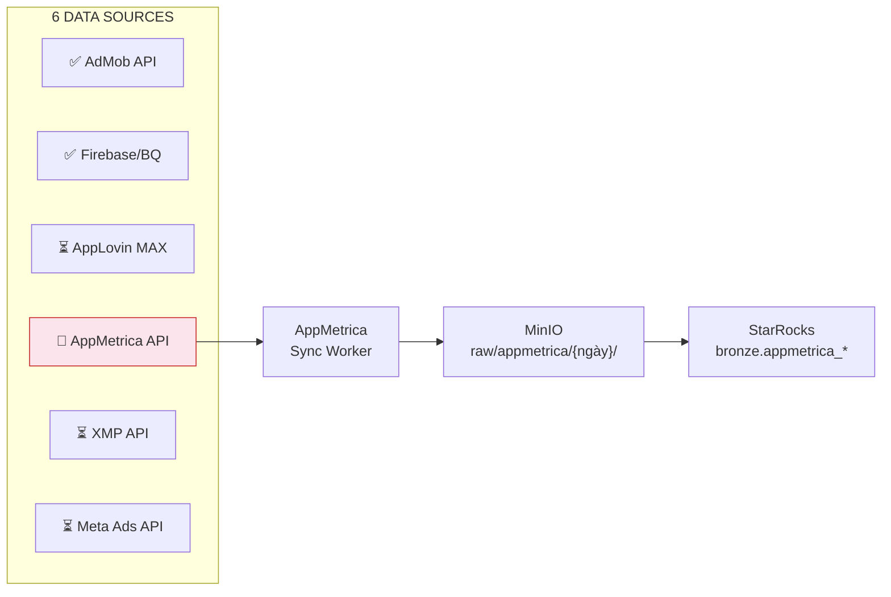
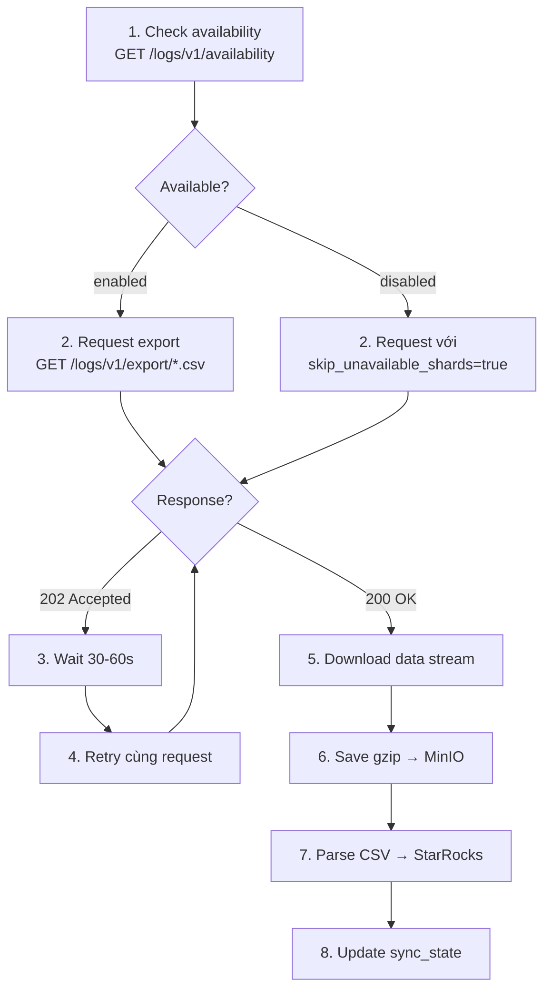
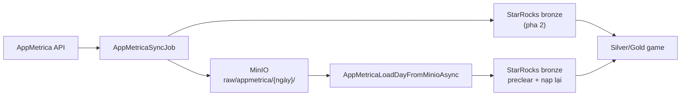

# 117 — APPMETRICA INTEGRATION GUIDE

## AppMetrica API → MinIO → StarRocks Pipeline

**Document Version:** 1.1  
**Date:** March 2026  
**Purpose:** Tài liệu **giải pháp đã triển khai** — AppMetrica API → MinIO (raw phẳng theo ngày) → StarRocks bronze → silver/gold (game analytics). Không còn mô tả class mẫu; tham chiếu trực tiếp code trong repo.  
**Tham chiếu:** doc 99 / 100 / 111; DDL: `docker/starrocks/migrations/006_bronze_appmetrica.sql`, `007_silver_gold_appmetrica_game.sql`.

---

# 1. TỔNG QUAN

## 1.1 AppMetrica trong kiến trúc Amobear

AppMetrica là data source thứ 4 (S4) trong hệ thống 6 nguồn. Vai trò chính: cung cấp user analytics sâu (sessions, events, profiles, crashes) và ad revenue cross-validation cho các app không dùng Firebase hoặc cần nguồn kiểm chứng bổ sung.



**Luồng job (`AppMetricaSyncJob`) — giống pattern nguồn khác:** (1) gọi API và **lưu toàn bộ raw** lên MinIO; (2) **sau khi pha 1 xong** cho toàn bộ app/endpoint trong lần chạy đó, **đọc lại từ MinIO** (tự giải nén `.gz` nếu có), parse, rồi mới ghi StarRocks.

**PostgreSQL `appmetrica_apps`:** Mỗi lần gọi Management API, hệ thống **upsert** danh sách app (`application_id`, `name`, `time_zone_name`, `package_name`, …). Cột **`is_enabled`** mặc định `true` cho app **mới**; khi cập nhật từ API **không** ghi đè `is_enabled` (có thể tắt tay để job bỏ qua app đó). Sync stats/logs chỉ chạy cho app **đang bật**.

**StarRocks `silver.dim_app_identifiers.appmetrica_id`:** Lưu **Application ID** AppMetrica (chuỗi số) để JOIN với `bronze.appmetrica_*`. Điền tự động khi chạy transform đồng bộ dim: map theo **`package_name`** trùng giữa `FirebaseAdmobMapping` và `appmetrica_apps` (account default). Nếu API không trả `package_name`, có thể map thủ công / mở rộng logic sau.

## 1.2 Scope dữ liệu cần lấy

| Endpoint | API | Mục đích | Bronze Table | Priority |
|----------|-----|----------|--------------|----------|
| Aggregated stats (DAU, sessions) | Reporting API | Daily KPIs | `bronze.appmetrica_stats` | P0 |
| Ad Revenue events | Logs API | Cross-validate AdMob/AppLovin | `bronze.appmetrica_ad_revenue` | P0 |
| Events (raw) | Logs API | User behavior analytics | `bronze.appmetrica_events` | P1 |
| Session starts | Logs API | DAU/session analysis | `bronze.appmetrica_sessions` | P1 |
| Revenue / IAP | Logs API | In-app purchase tracking | `bronze.appmetrica_revenue` | P1 |
| Installations | Logs API | Attribution & UA analysis | `bronze.appmetrica_installations` | P2 |
| Crashes | Logs API | App quality monitoring | `bronze.appmetrica_crashes` | P2 |
| Profiles | Logs API | User segmentation | `bronze.appmetrica_profiles` | P2 |
| App list | Management API | App discovery | PostgreSQL **`appmetrica_apps`** | P0 |

## 1.3 Đặc thù kỹ thuật quan trọng

**Logs API là async (2-phase request):**
1. Gửi request → nhận HTTP 202 Accepted (queued)
2. Gửi lại **cùng request** → nếu sẵn sàng thì nhận HTTP 200 + data stream
3. File có hiệu lực 24 giờ; sau đó phải request lại

**Reporting API là sync** — response trả về ngay, dùng cho daily aggregated KPIs.

**Quota:** Max 3 concurrent Logs API requests. Reporting API: 10 requests/giây.

**Logs export — field list:** Mỗi endpoint chỉ chấp nhận đúng tên field (ví dụ **postbacks** không có `country_iso_code`; dùng `device_locale`, `device_manufacturer`, … theo [docs postbacks](https://appmetrica.yandex.com/docs/en/mobile-api/logs/ref/postbacks)). Sai field → HTTP 400 `Undefined parameter: ... in fields`.

**Tốc độ sync:** Job logs pha 1 dùng `Parallel.ForEachAsync` với `AppMetrica:LogsPhase1MaxParallelism` (mặc định **3**, khớp quota). Mỗi request vẫn tuân `AppMetrica:MaxConcurrentLogsRequests` trong `ExportLogsCsvAsync` (semaphore theo account).

---

# 2. AUTHENTICATION

## 2.1 OAuth Token

AppMetrica sử dụng Yandex OAuth. Token được lưu encrypted trong PostgreSQL bảng `appmetrica_accounts`.

**Cách lấy token:**

1. Tạo app tại https://oauth.yandex.com/client/new
2. Platform: Web services, Redirect URI: `https://oauth.yandex.com/verification_code`
3. Scopes: `appmetrica:read` + `appmetrica:write`
4. Copy ClientID, truy cập: `https://oauth.yandex.ru/authorize?response_type=token&client_id=<client_id>`
5. Lưu token vào PostgreSQL

## 2.2 Cách truyền token

Mọi request đều truyền qua header:

```
Authorization: OAuth <token>
```

**KHÔNG** truyền qua URL parameter.

## 2.3 PostgreSQL (đã triển khai)

- **`appmetrica_accounts`:** OAuth token (mã hoá), gắn với tài khoản AppMetrica.  
- **`appmetrica_apps`:** Danh sách app từ Management API (`application_id`, `package_name`, `is_enabled`, …). Job sync chỉ xử lý app **`is_enabled = true`** (trừ khi gọi tay với `applicationId` cụ thể).

---

# 3. API REFERENCE

## 3.1 Base URL

```
https://api.appmetrica.yandex.com
```

## 3.2 Management API — App Discovery

**Endpoint:** `GET /management/v1/applications`

Response chứa danh sách apps với `id` (application_id dùng cho mọi request khác).

```json
{
  "applications": [
    {
      "id": 12345678,
      "name": "Weather Pro",
      "time_zone_name": "Asia/Ho_Chi_Minh",
      "package_name": "com.amobear.weather"
    }
  ]
}
```

**Sync logic:** Management API được gọi từ job sync → upsert PostgreSQL **`appmetrica_apps`** (không ghi đè `is_enabled` trên bản ghi đã có).

## 3.3 Reporting API — Aggregated Stats

**Endpoint:** `GET /stat/v1/data`

**Parameters quan trọng:**

| Param | Mô tả | Ví dụ |
|-------|--------|-------|
| `id` | Application ID | `12345678` |
| `metrics` | Danh sách metrics, phân cách bởi dấu phẩy | `ym:ge:users,ym:ge:sessions` |
| `dimensions` | Grouping columns | `ym:ge:date,ym:ge:operatingSystemInfo` |
| `date1` / `date2` | Khoảng ngày | `2026-03-15` / `2026-03-16` |
| `limit` | Max rows | `10000` |
| `filters` | Segmentation | `ym:ge:operatingSystem=='android'` |

**Prefix rules:**
- `ym:ge:` — Chỉ các metric trong [generic_events](https://appmetrica.yandex.com/docs/en/mobile-api/stat/metrics/generic_events/generic_events): `users`, `devices`, `sessions`, `genericSessions`, `totalEvents`. **Không** dùng tên kiểu `ym:ge:newUsers`, `ym:ge:avgSessionDuration`, `ym:ge:events`, `ym:ge:crashes`, `ym:ge:errors` — API trả **4002**.
- `ym:s:` — Session / thời lượng: vd. `ym:s:totalSessionDuration` ([sessions metrics](https://appmetrica.yandex.com/docs/en/mobile-api/stat/metrics/sessions/sessions)) — request **riêng**. **4011:** không được dùng `dimensions` kiểu `ym:ge:date` cùng metric `ym:s:*` — metrics và dimensions phải cùng prefix (trừ khi dùng `filters`). AppMetrica UI → Export → **Copy table API** để lấy chuỗi `dimensions` đúng cho `ym:s:`.
- `ym:u:` — Audience: **new users** = `ym:u:newUsers` ([users metrics](https://appmetrica.yandex.com/docs/en/mobile-api/stat/metrics/users/users)) — request **riêng**. **4011:** không dùng `ym:ge:date` làm `dimensions` cho `ym:u:newUsers` — phải dùng `ym:u:*` dimensions (Copy table API từ báo cáo Audience).
- `ym:ce:` — Client events (event counts, event users)
- **KHÔNG mix nhiều prefix trong cùng một tham số `metrics`.**

**Implementation (MediationPro):** `AppMetricaApiClient.GetDailyStatsAsync`:
1. **Luôn:** `ym:ge:users,sessions,totalEvents` + `dimensions=ym:ge:date,ym:ge:operatingSystemInfo,ym:ge:regionCountry`.
2. **Tùy chọn:** `ym:s:totalSessionDuration` + `AppMetrica:DailyStatsSessionDurationDimensions` (toàn `ym:s:*`, mặc định rỗng).
3. **Tùy chọn:** `ym:u:newUsers` + `AppMetrica:DailyStatsNewUsersDimensions` (toàn `ym:u:*`, mặc định rỗng).  
Gộp theo key (date + OS + country); **ngày** được chuẩn hóa `yyyy-MM-dd` để join giữa các nhóm.  
**crashes** / **errors** = 0 nếu chưa map.

**Request mẫu:**

```
GET /stat/v1/data?id={app_id}
  &metrics=ym:ge:users,ym:ge:sessions,ym:ge:totalEvents
  &dimensions=ym:ge:date,ym:ge:operatingSystemInfo,ym:ge:regionCountry
  &date1={date_from}&date2={date_to}
  &limit=10000&lang=en
```

```
GET /stat/v1/data?id={app_id}
  &metrics=ym:s:totalSessionDuration
  &dimensions=<ym:s:* do AppMetrica Export cung cấp — không dùng ym:ge:date>
  &date1={date_from}&date2={date_to}
  &limit=10000&lang=en
```

```
GET /stat/v1/data?id={app_id}
  &metrics=ym:u:newUsers
  &dimensions=<ym:u:* từ Export — không dùng ym:ge:date>
  &date1={date_from}&date2={date_to}
  &limit=10000&lang=en
```

**Response structure:**

```json
{
  "data": [
    {
      "dimensions": [
        {"name": "2026-03-15"},
        {"name": "android"},
        {"name": "US"}
      ],
      "metrics": [12500, 3200, 45000, 320.5, 180000, 12, 5]
    }
  ],
  "total_rows": 847,
  "sampled": false,
  "totals": [125000, 32000, 450000, 280.3, 1800000, 120, 50]
}
```

**Map vào StarRocks:** dimensions → date, operating_system, country; cột **events** = `totalEvents`; **avg_session_duration_sec** / **new_users** chỉ đầy đủ khi cấu hình đúng `DailyStatsSessionDurationDimensions` / `DailyStatsNewUsersDimensions` và join khớp; để trống → **0**; **crashes/errors** = 0 nếu chưa có nguồn aggregate.

**CSV format:** Thay `/stat/v1/data` bằng `/stat/v1/data.csv` → response là CSV, tiện cho pipeline.

## 3.4 Logs API — Raw Event Data (Async)

### 3.4.1 Flow tổng quát



### 3.4.2 Availability Check

```
GET /logs/v1/availability?application_id={app_id}
```

Response: `{"logs_api_availability_status": "enabled"}` hoặc `"disabled"`.

Nếu `disabled`, thêm `skip_unavailable_shards=true` vào request → data loss < 1%, tốt hơn fail toàn bộ.

### 3.4.3 Các Endpoints

**Events:**
```
GET /logs/v1/export/events.csv
  ?application_id={app_id}
  &date_since={yyyy-mm-dd}
  &date_until={yyyy-mm-dd}
  &date_dimension=default
  &fields=event_datetime,event_json,event_name,event_receive_datetime,event_receive_timestamp,event_timestamp,session_id,installation_id,appmetrica_device_id,city,connection_type,country_iso_code,device_locale,device_manufacturer,device_model,device_type,google_aid,ios_ifa,ios_ifv,os_name,os_version,profile_id,app_build_number,app_package_name,app_version_name,application_id
```

**Ad Revenue:** ⭐ Highest priority cho Mediation Pro
```
GET /logs/v1/export/ad_revenue_events.csv
  ?application_id={app_id}
  &date_since={yyyy-mm-dd}
  &date_until={yyyy-mm-dd}
  &date_dimension=default
  &fields=ad_revenue_datetime,ad_revenue_timestamp,ad_revenue_receive_datetime,ad_revenue_receive_timestamp,ad_revenue,ad_revenue_currency,ad_revenue_type,ad_revenue_data_source,ad_revenue_network,ad_revenue_placement_id,ad_revenue_placement_name,ad_revenue_unit_id,ad_revenue_unit_name,ad_revenue_precision,ad_revenue_payload,session_id,installation_id,appmetrica_device_id,city,connection_type,country_iso_code,device_manufacturer,device_model,device_type,google_aid,ios_ifa,os_version,profile_id,app_build_number,app_package_name,app_version_name
```

**Session Starts:**
```
GET /logs/v1/export/sessions_starts.csv
  ?application_id={app_id}
  &date_since={yyyy-mm-dd}
  &date_until={yyyy-mm-dd}
  &date_dimension=default
  &fields=session_id,session_start_datetime,session_start_receive_datetime,session_start_receive_timestamp,session_start_timestamp,appmetrica_device_id,city,connection_type,country_iso_code,device_locale,device_manufacturer,device_model,device_type,google_aid,ios_ifa,ios_ifv,os_name,os_version,profile_id,app_build_number,app_package_name,app_version_name,application_id
```

**Installations:**
```
GET /logs/v1/export/installations.csv
  ?application_id={app_id}
  &date_since={yyyy-mm-dd}
  &date_until={yyyy-mm-dd}
  &date_dimension=default
  &fields=application_id,installation_id,attributed_touch_type,click_datetime,click_url_parameters,profile_id,publisher_id,publisher_name,tracker_name,tracking_id,install_datetime,install_receive_datetime,install_timestamp,is_reattribution,is_reinstallation,match_type,appmetrica_device_id,city,country_iso_code,device_locale,device_manufacturer,device_model,device_type,google_aid,ios_ifa,ios_ifv,os_name,os_version,app_package_name,app_version_name
```

**Revenue / IAP:**
```
GET /logs/v1/export/revenue_events.csv
  ?application_id={app_id}
  &date_since={yyyy-mm-dd}
  &date_until={yyyy-mm-dd}
  &date_dimension=default
  &fields=revenue_quantity,revenue_price,revenue_currency,revenue_product_id,revenue_order_id,revenue_order_id_source,is_revenue_verified,is_revenue_autocollected,revenue_inapp_type,revenue_event_type,event_datetime,event_name,event_receive_datetime,event_receive_timestamp,event_timestamp,session_id,installation_id,appmetrica_device_id,city,connection_type,country_iso_code,device_locale,device_manufacturer,device_model,google_aid,ios_ifa,ios_ifv,os_version,profile_id,app_build_number,app_package_name,app_version_name
```

**Crashes:**
```
GET /logs/v1/export/crashes.csv
  ?application_id={app_id}
  &date_since={yyyy-mm-dd}
  &date_until={yyyy-mm-dd}
  &date_dimension=default
  &fields=crash,crash_datetime,crash_group_id,crash_id,crash_name,crash_receive_datetime,crash_receive_timestamp,crash_timestamp,appmetrica_device_id,city,country_iso_code,device_manufacturer,device_model,device_type,google_aid,ios_ifa,os_name,os_version,profile_id,app_package_name,app_version_name,application_id
```

**Profiles (`profiles_v2` — có date range):**

```
GET /logs/v1/export/profiles_v2.csv
  ?application_id={app_id}
  &date_since={yyyy-mm-dd hh:mm:ss}
  &date_until={yyyy-mm-dd hh:mm:ss}
  &date_dimension=default
  &fields=profile_id,appmetrica_gender,appmetrica_birth_date,...
```

**Lưu ý:** API `profiles_v2` **bắt buộc** `date_since` và `date_until` (khác mô tả cũ “snapshot không ngày”).

### 3.4.4 Filtering

Syntax: `filters=field_name=='value'`

Ví dụ:
- `filters=os_name=='android'` — chỉ Android
- `filters=event_name=='level_complete'` — chỉ event cụ thể
- `filters=ad_revenue_network=='admob'` — chỉ ad revenue từ AdMob

### 3.4.5 Cache-Control

| Header | Hành vi |
|--------|---------|
| Không gửi | Dùng file cached nếu có (trong 24h) |
| `Cache-Control: no-cache` | Force tạo file mới |
| `Cache-Control: max-age=N` | Dùng cached nếu tạo trong N giây gần nhất |

**Khuyến nghị production:** Không gửi header → tận dụng cache. Chỉ dùng `no-cache` khi recovery.

---

# 4. MINIO — CẤU TRÚC ĐÃ ĐƠN GIẢN HOÁ

Cùng pattern với các nguồn raw khác: **một thư mục theo ngày**, mọi object nằm phẳng trong đó.

## 4.1 Bucket & prefix

| | Giá trị (code: `AppMetricaMinioNaming`) |
|---|----------------------------------------|
| Bucket | `amobear-datalake` |
| Gốc | `raw/appmetrica/{yyyy-MM-dd}/` |

Ví dụ: `raw/appmetrica/2026-03-21/6244000_20260321_events.csv`

## 4.2 Quy tắc tên file

Code parse: `MediationPro.Infrastructure/Repositories/AppMetricaMinioNaming.cs`.

| Loại | Pattern | Ví dụ |
|------|---------|--------|
| **Reporting stats** (JSON) | `{appId}_{yyyyMMdd}_stats.json` | `6244000_20260321_stats.json` |
| **Logs export** | `{appId}_{yyyyMMdd}_{typeSlug}[_chunk].{csv\|json}` | `6244000_20260321_ad_revenue.csv`, `6244000_20260321_events.json` |
| **Snapshot Management API** (tuỳ lần sync) | `0_{yyyyMMdd}_{HHmmss}_apps.json` | `0_20260321_143052_apps.json` |

**`typeSlug`** khớp bảng bronze / endpoint log: `events`, `ad_revenue`, `sessions`, `installations`, `revenue`, `crashes`, `clicks`, `postbacks`, `profiles` (thứ tự match dài → ngắn để phân biệt `ad_revenue` vs `revenue`).

**Chunk:** hậu tố tùy chọn sau slug, ví dụ `…_events_part2.csv` → phần tail `part2` được ghi nhận là chunk khi parse.

**`.gz`:** Khi đọc, `AppMetricaRawRepository.ReadRawAsync` tự giải nén nếu object kết thúc bằng `.gz`.

## 4.3 Ghi file (pha 1 — API → MinIO)

- Stats: `AppMetricaRawRepository.SaveStatsJsonAsync`  
- Logs: `SaveLogsCsvAsync` — extension **`csv`** hoặc **`json`** theo `AppMetrica:LogsExportFormat` trong `appsettings.json`.  
- Apps list: `SaveManagementAppsJsonAsync`

**Không bắt buộc** manifest JSON; vận hành dựa trên **list object + parse tên file**.

---

# 5. STARROCKS SCHEMA — BRONZE LAYER

## 5.1 Nguồn DDL (bronze)

Toàn bộ bảng `bronze.appmetrica_*` (partition `stat_date`, dynamic partition tháng, ZSTD, …) nằm trong repo:

- **`docker/starrocks/migrations/006_bronze_appmetrica.sql`**

Áp dụng khi khởi tạo cluster / migration StarRocks (`20260321120000_BronzeAppMetrica` và các migration nén/partition liên quan trong `StarRocksSchemaInitializer`).

## 5.2 Danh sách bảng bronze (tóm tắt)

| Bảng | Nguồn / ghi chú |
|------|------------------|
| `bronze.appmetrica_stats` | Reporting API — KPI tổng hợp theo OS/country |
| `bronze.appmetrica_events` | Logs — `event_json` (STRING) cho game / analytics |
| `bronze.appmetrica_ad_revenue` | Logs — cross-check với AdMob/AppLovin (**không** cộng trùng vào gold revenue chung) |
| `bronze.appmetrica_sessions` | Logs — session starts |
| `bronze.appmetrica_revenue` | Logs — IAP / revenue events |
| `bronze.appmetrica_installations` | Logs — cài đặt / attribution |
| `bronze.appmetrica_crashes` | Logs — crash |
| `bronze.appmetrica_profiles` | Logs — profiles |
| `bronze.appmetrica_clicks`, `bronze.appmetrica_postbacks` | Logs — tuỳ cấu hình export |

Cột chung quan trọng: `stat_date`, `application_id` (BIGINT), `_synced_at`, `_source_file`.

## 5.3 Silver / Gold — Game analytics (LTV level / puzzle)

Phần này **ánh xạ trực tiếp** quy trình trong tài liệu nội bộ **`docs/AppMetrica/Tài liệu data step cho AI.pdf`** (Report LTV — Bước 1 → 3) sang lớp StarRocks **silver / gold** đã triển khai.

**Tham chiếu code:** `docker/starrocks/migrations/007_silver_gold_appmetrica_game.sql` (DDL), `StarRocksTransformService.AppMetricaGame.cs` (ETL), migration StarRocks `20260326183000_AppMetricaGameSilverGold`.

### 5.3.1 Ánh xạ PDF → pipeline Amobear

| Bước (PDF) | Nội dung PDF | Trong platform |
|------------|----------------|-----------------|
| **Bước 1** | Data Export: App Events, các field `os_name`, `event_name`, `event_json`, `event_datetime`, `country_iso_code`, `appmetrica_device_id`, … | `AppMetricaSyncJob` đồng bộ Logs → **bronze.appmetrica_events** (cùng các cột dimension + `event_json` STRING). Có thể lọc OS ở AppMetrica hoặc để nguyên và lọc khi query gold. |
| **Bước 2** | Làm sạch: chỉ `level_start` / `level_complete` (PDF), `is_online = 1`; parse JSON (`level_display`, `but_*`, `revive_coin_total`, `total_time_play`, `level_attempt`); `appmetrica_device_id` dạng text | **Silver `appmetrica_level_flat`:** event **`LevelStart` / `LevelComplete` / `LevelFail`** (PascalCase như SDK), **`CAST(get_json_string(event_json,'$.is_online') AS INT) = 1`**, flatten JSON. Thêm **LevelFail** + revive/fail để khớp báo cáo đầy đủ. Booster: gộp **`but_*` / `bu_*` (fail) / `bc_*` (start)** vào cột `but_*` trên silver. |
| **Bước 3** | Bảng LTV theo `level_display`: User Start/Complete, Fail rate, Avg booster, Avg revive, Total coin (giá cố định), Avg time play, Avg level attempt | **Gold `appmetrica_level_performance`** — công thức chi tiết mục 5.3.3. |
| **Sau bước 3** | Nhóm 100 level: `1–100`, `101–200`, … — **Total coin group** = SUM(Total Coin) | **Gold `appmetrica_level_group_coin`** — mục 5.3.4. |

**Cột “Tag” (độ khó / mapping GD)** trong PDF: **chưa có cột riêng** trong gold hiện tại; có thể bổ sung sau qua bảng dim (mapping `level_display` → tag) hoặc cột computed.

### 5.3.2 Silver — `silver.appmetrica_level_flat`

**Nguồn:** `bronze.appmetrica_events`.

**Điều kiện lọc (khớp Bước 2 PDF + mở rộng):**

- `event_name IN ('LevelStart','LevelComplete','LevelFail')`
- `CAST(get_json_string(event_json,'$.is_online') AS INT) = 1` — chỉ bộ level **online** (bộ mới nhất).

**Trích từ `event_json` (ví dụ; tên key có thể đổi theo game — sửa trong SQL/C# nếu cần):**

| Nhóm | Trường JSON (gợi ý) | Cột silver |
|------|---------------------|------------|
| Level | `level_id`, `level_display`, `is_loop`, `is_first` | `level_id`, `level_display`, … |
| Booster | Complete: `but_sort`, `but_shuffle`, `but_vip` — Fail: `bu_*` — Start: `bc_*` | `but_sort`, `but_shuffle`, `but_vip` (COALESCE các prefix) |
| Revive | `revive_coin_total`, `revive_ads`, `revive_coins` | đồng tên |
| Performance (chủ yếu Complete) | `time_play`, `total_time_play`, `level_attempt`, `fail_qty`, `coin_reward` | đồng tên |
| Fail | `fail_reason`, `object_total`, `object_unsolve` | đồng tên |
| Ngữ cảnh (thường Start) | `days_played`, `time_since_install`, `coin_balance` | đồng tên |

**Grain:** một dòng / (ngày, app, device, thời điểm event, loại event, level_display, …) — DUPLICATE KEY trên starrocks theo DDL 007.

**Silver — `silver.appmetrica_ad_event_flat`:** từ cùng bronze events, `event_name IN ('AdsRvComplete','AdsIntComplete')`, parse `level_id`, `level_display`, `amount`, `currency_code`, `daily_rv_views`, `daily_int_views`, `ad_duration`, … — phục vụ **doanh thu quảng cáo theo level** trên gold.

**Silver — `silver.dim_booster_price`:** `(application_id, booster_name, coin_price)` — **tuỳ chọn**; khi có dữ liệu, có thể sửa ETL gold để thay thế hệ số cứng 600 / 1000 / 2000 (mục 5.3.3).

### 5.3.3 Gold — `gold.appmetrica_level_performance` (Bước 3 / Power BI trong PDF)

**Grain:** `(stat_date, application_id, level_display, os_name)` — `os_name` lấy từ silver level flat (chuỗi rỗng nếu null).

**Đếm user (Distinct device — khớp DAX `DISTINCTCOUNT` trong PDF):**

| Cột gold | Định nghĩa (khớp PDF & code) |
|----------|-------------------------------|
| `user_start` | `COUNT(DISTINCT appmetrica_device_id)` với `event_name = 'LevelStart'` |
| `user_complete` | `COUNT(DISTINCT appmetrica_device_id)` với `event_name = 'LevelComplete'` |
| `user_fail` | `COUNT(DISTINCT appmetrica_device_id)` với `event_name = 'LevelFail'` |

**Đếm sự kiện (raw volume):**

| Cột | Định nghĩa |
|-----|------------|
| `start_count` | `SUM(1)` cho `LevelStart` |
| `complete_count` | `SUM(1)` cho `LevelComplete` |
| `fail_count` | `SUM(1)` cho `LevelFail` |

**Tỷ lệ:**

| Cột | Công thức |
|-----|-----------|
| `fail_rate` | **`1 - user_complete / NULLIF(user_start, 0)`** — giống PDF: `1 - [User Complete]/[User Start]` (dạng số thực, không nhân 100 trong DB). |
| `reach_rate` | **`user_start / NULLIF(max_user_start, 0)`** với `max_user_start` = **MAX(user_start)** trên tất cả `level_display` trong cùng `(stat_date, application_id, os_name)` — tức level nào có nhiều user start nhất trong ngày/app/OS được chuẩn hoá về 1 (mở rộng so với PDF). |

**Booster & revive (chỉ trên dòng `LevelComplete` — khớp PDF “Avg … / [User Complete]”):**

| Cột | Công thức |
|-----|-----------|
| `avg_but_sort` | `SUM(but_sort) / NULLIF(user_complete, 0)` (chỉ complete) — tương tự `avg_but_shuffle`, `avg_but_vip`. |
| `avg_revive` | **`SUM(revive_coin_total) / NULLIF(user_complete, 0)`** — khớp PDF “Avg Revive”. |

**Total coin (khớp PDF & macro Power BI trong PDF):**

\[
\text{total\_coin} = 600 \cdot \text{avg\_but\_sort} + 1000 \cdot (\text{avg\_but\_shuffle} + \text{avg\_but\_vip}) + 2000 \cdot \text{avg\_revive}
\]

Trong SQL triển khai dùng cùng hệ số trên **tổng/count** tương đương (xem `BuildInsertLevelPerformanceSql` trong `StarRocksTransformService.AppMetricaGame.cs`). **Đơn vị:** “coin trong game” (ước lượng tiêu thụ).

**Thời gian & attempt (PDF mục 9–10):**

| Cột | Công thức |
|-----|-----------|
| `avg_time_play` | `AVG(total_time_play)` chỉ khi `event_name = 'LevelComplete'` và `total_time_play IS NOT NULL` |
| `avg_level_attempt` | `AVG(level_attempt)` chỉ khi `LevelComplete` và `level_attempt IS NOT NULL` |

**Quảng cáo (bổ sung so với PDF — nguồn `silver.appmetrica_ad_event_flat`):**

| Cột | Công thức |
|-----|-----------|
| `ad_revenue_usd` | `SUM(amount)` gom theo `(stat_date, application_id, level_display, os_name)` — **giả định `amount` đã cùng đơn vị mong muốn**; nếu đa tiền tệ cần bổ sung FX hoặc lọc `currency_code`. |
| `ad_rv_views` | Số dòng (hoặc metric) với `event_name = 'AdsRvComplete'` |
| `ad_int_views` | Tương tự cho `AdsIntComplete` |

### 5.3.4 Gold — `gold.appmetrica_level_group_coin` (nhóm 100 level — PDF)

**Theo PDF:** sau bảng level, gom **100 level một nhóm**: `1–100`, `101–200`, …

**Công thức nhóm (đồng nhất với SQL 007 / C#):**

- `level_group_start = FLOOR((level_display - 1) / 100) * 100 + 1`
- `level_group_end = FLOOR((level_display - 1) / 100) * 100 + 100`
- `level_group` = chuỗi hiển thị `"start-end"`

**Cột:**

| Cột | Cách tính |
|-----|-----------|
| `total_coin_group` | `SUM(total_coin)` từ `gold.appmetrica_level_performance` trong nhóm |
| `avg_fail_rate` | `AVG(fail_rate)` trong nhóm |
| `avg_time_play` | `AVG(avg_time_play)` trong nhóm |
| `level_count` | `COUNT(*)` số level distinct trong nhóm |

### 5.3.5 Gold — `gold.appmetrica_daily_game_kpi` (bonus)

Tổng hợp **theo ngày + app** (và `os_name` — hiện **một dòng / ngày / app** với `os_name = ''` vì bronze ad revenue / IAP không có OS):

| Cột | Nguồn / logic |
|-----|----------------|
| `dau` | `COUNT(DISTINCT appmetrica_device_id)` từ `bronze.appmetrica_sessions` |
| `dav` | `COUNT(DISTINCT appmetrica_device_id)` từ `bronze.appmetrica_ad_revenue` |
| `new_users` | `COUNT(DISTINCT appmetrica_device_id)` từ `bronze.appmetrica_installations` |
| `total_sessions` | `COUNT(*)` sessions |
| `total_events` | `COUNT(*)` events |
| `ad_revenue_usd` | `SUM(CAST(ad_revenue AS DOUBLE))` từ `bronze.appmetrica_ad_revenue` |
| `iap_revenue` | `SUM(CAST(revenue_price AS DOUBLE))` từ `bronze.appmetrica_revenue` |
| `total_revenue` | `ad_revenue_usd + iap_revenue` |
| `arpdau` | `total_revenue / NULLIF(dau, 0)` |

### 5.3.6 Chạy ETL & vận hành

- **DDL:** `20260326183000_AppMetricaGameSilverGold` / file `007_silver_gold_appmetrica_game.sql`.
- **Thứ tự transform (mỗi lần chạy, theo app + khoảng ngày):**  
  xóa + nạp `level_flat` → xóa + nạp `ad_event_flat` → xóa + nạp `level_performance` → xóa + nạp `level_group_coin` → xóa + nạp `daily_game_kpi`.
- **Hangfire:** `appmetrica-game-silver-gold` → `AppMetricaGameAnalyticsTransformJob.RunTransformAsync`; cửa sổ **`Transform:AppMetricaGameDaysBack`** (mặc định 7).
- **Jobs test:** `POST /api/v1/jobs-test/appmetrica-game-silver-gold?startDate=yyyy-MM-dd&endDate=yyyy-MM-dd` [& `applicationId=`].

### 5.3.7 Khác biệt tên event PDF ↔ SDK

PDF / video mẫu dùng `level_start`, `LevelComplete` (không thống nhất hoa thường). **Pipeline chuẩn trong repo:** `LevelStart`, `LevelComplete`, `LevelFail` (PascalCase). Nếu game gửi tên khác, cần **chuẩn hoá ở SDK** hoặc mở rộng điều kiện `IN (...)` trong ETL.

---

# 6. TRIỂN KHAI .NET (THỰC TẾ TRONG REPO)

## 6.1 Luồng tổng quát



1. **Pha 1 — API → MinIO:** lưu raw đúng quy tắc mục 4 (`AppMetricaRawRepository`).  
2. **Pha 2 — đọc object vừa lưu → StarRocks bronze** trong cùng job sync.  
3. **Replay / sửa parser:** `AppMetricaLoadDayFromMinioAsync` — chỉ đọc MinIO (mục 6.3).

## 6.2 Class & cấu hình

| Thành phần | File / ghi chú |
|------------|----------------|
| `AppMetricaSyncJob` | `MediationPro.Jobs/AppMetricaSyncJob.cs` |
| `AppMetricaRawRepository`, `AppMetricaMinioNaming` | `MediationPro.Infrastructure/Repositories/` |
| `AppMetricaLogExportParser`, `AppMetricaCsvReader`, `AppMetricaJsonLogExportReader` | `MediationPro.Infrastructure/AppMetrica/` |
| `StarRocksAppMetricaWriter` | `MediationPro.Infrastructure/StarRocks/` |
| `IAppMetricaApiClient` | HTTP: Management, Reporting, Logs (poll 202→200) |

`AppMetrica:LogsExportFormat` trong `appsettings.json`: **`csv`** (mặc định) hoặc **`json`** — parser tự nhánh.

## 6.3 `AppMetricaLoadDayFromMinioAsync(statDate, applicationId?)`

- **`date` / `statDate`:** thư mục `raw/appmetrica/{yyyy-MM-dd}/` và `stat_date` trên StarRocks.  
- **`applicationId`:** có → một app; **null** → tất cả app **`appmetrica_apps.is_enabled`**.  
- **Preclear:** xoá hết bronze AppMetrica của **ngày đó** cho từng app được chọn (stats + mọi bảng log + profiles) rồi nạp lại từ mọi file khớp tên trong MinIO; MinIO trống → bronze vẫn sạch.  
- **Jobs test:** `POST /api/v1/jobs-test/appmetrica-load-from-minio?date=yyyy-MM-dd&applicationId=` (tuỳ chọn).

## 6.4 Silver / Gold game

Đã mô tả mục 5.3; code: `StarRocksTransformService.AppMetricaGame.cs`, job `appmetrica-game-silver-gold`.

## 6.5 Logs API (async) — tham chiếu code

**Không** chèn mã mẫu dài: poll 202→200 nằm trong client thực tế. Cấu hình: `AppMetrica:MaxConcurrentLogsRequests`, `AppMetrica:LogsPhase1MaxParallelism`.

**Parse CSV / JSON:** `AppMetricaLogExportParser` — CSV RFC4180 (field có xuống dòng, JSON trong cell), hoặc export JSON từ API khi bật `AppMetrica:LogsExportFormat=json`.

---

# 7. HANGFIRE SCHEDULING

## 7.1 Job Hangfire (thực tế)

Lịch lưu trong PostgreSQL (`hangfire_job_schedules`), seed mặc định từ `HangfireJobScheduleService` (`MediationPro.Api`). Có thể chỉnh cron/type/method trên UI admin mà không sửa code.

| job_id | Class / method (mặc định) | Cron mặc định (UTC) | Ghi chú |
|--------|---------------------------|---------------------|---------|
| `appmetrica-daily-stats` | `AppMetricaSyncJob.SyncDailyStatsAsync` | `0 */2 * * *` | Reporting → MinIO → StarRocks stats |
| `appmetrica-logs-today` | `AppMetricaSyncJob.SyncLogsTodayAsync` | `0 * * * *` | Logs hôm nay (pha 1+2) |
| `appmetrica-logs-backfill-t1` | `AppMetricaSyncJob.SyncLogsBackfillT1Async` | `0 0,12 * * *` | Backfill ngày T-1 |
| `appmetrica-logs-backfill-t2` | `AppMetricaSyncJob.SyncLogsBackfillT2Async` | `0 4,16 * * *` | Backfill ngày T-2 |
| `appmetrica-logs-backfill-t3` | `AppMetricaSyncJob.SyncLogsBackfillT3Async` | `0 8,20 * * *` | Backfill ngày T-3 |
| `appmetrica-game-silver-gold` | `AppMetricaGameAnalyticsTransformJob.RunTransformAsync` | `40 */4 * * *` | Silver/gold game (`Transform:AppMetricaGameDaysBack`) |

Toàn bộ pipeline sync chính nằm trong **`AppMetricaSyncJob`** (không phải nhiều class `*SyncService` như bản spec cũ).

## 7.2 Concurrent & quota Logs API

- AppMetrica giới hạn **tối đa 3** request Logs API đồng thời / account.  
- Code dùng `AppMetrica:LogsPhase1MaxParallelism` (mặc định 3) và semaphore `AppMetrica:MaxConcurrentLogsRequests` trong client export.  
- Ba job backfill (`T-1/T-2/T-3`) dùng chung lock `SkipConcurrentExecution("appmetrica-logs-backfill")` nên không chạy song song; khi job hiện tại chạy quá khung giờ của job kế tiếp thì có cơ chế catch-up trigger job kế tiếp (delay ngắn) để tránh miss vòng.
- Không cần queue Hangfire riêng `appmetrica-logs` trừ khi team tự thêm — cấu hình hiện tại dựa vào giới hạn trong `AppMetricaSyncJob` + API client.

## 7.3 Jobs test (`JobsTest:AllowRun` hoặc môi trường Development)

| Endpoint | Mô tả |
|----------|--------|
| `POST .../appmetrica-daily-stats` | Reporting stats |
| `POST .../appmetrica-logs-today` | Logs hôm nay |
| `POST .../appmetrica-logs-backfill` | Backfill ngắn (wrapper legacy: chạy tuần tự T-1 → T-2 → T-3) |
| `POST .../appmetrica-load-from-minio?date=yyyy-MM-dd&applicationId=` | Chỉ đọc MinIO → bronze (preclear ngày đó) |
| `POST .../appmetrica-game-silver-gold?startDate=&endDate=&applicationId=` | ETL silver/gold game |

---

# 8. DATA QUALITY & CROSS-VALIDATION

## 8.1 Ad Revenue Double-Counting Prevention

```
⚠️ QUAN TRỌNG NHẤT:
AppMetrica SDK autocollect ad_revenue phản ánh dữ liệu từ mediation SDK
(tương tự Adjust ad_revenue — xem doc 99 section "Avoid double-counting").

KHÔNG bao giờ cộng appmetrica_ad_revenue vào Gold layer revenue song song
với AdMob direct API hoặc AppLovin MAX API data.
```

**Đúng cách sử dụng:**
- Cross-validation: So sánh `bronze.appmetrica_ad_revenue` GROUP BY network, date với `bronze.admob_performance` và `bronze.applovin_revenue`
- User-level attribution: Join ad_revenue với device_id để tính ARPU per user segment
- Network coverage check: Xem AppMetrica có capture đủ networks không

## 8.2 Gợi ý kiểm tra nhanh (StarRocks)

Ví dụ: đếm theo `stat_date` + network trên `bronze.appmetrica_ad_revenue` để so khớp UI AppMetrica hoặc nguồn AdMob (điều chỉnh filter app/ngày theo môi trường). Chi tiết cột xem `006_bronze_appmetrica.sql`.

---

# 9. TRẠNG THÁI TRIỂN KHAI (TÓM TẮT)

Đã có trong codebase:

- OAuth + `appmetrica_accounts` / `appmetrica_apps`, job **`AppMetricaSyncJob`** (API → MinIO → bronze).  
- MinIO **`raw/appmetrica/{yyyy-MM-dd}/`** + quy tắc tên file (mục 4).  
- **`AppMetricaLoadDayFromMinioAsync`**: preclear + nạp lại bronze từ mọi file trong ngày.  
- Parse **`AppMetricaLogExportParser`** (CSV đa dòng / JSON).  
- Bronze đầy đủ bảng `appmetrica_*` (migration 006).  
- Silver/gold game (migration 007 + `AppMetricaGameAnalyticsTransformJob`).  
- Hangfire + Jobs test (mục 7).

**Có thể mở rộng sau:** MV silver tổng hợp engagement, dashboard cross-validation, gợi ý IAP theo segment (dựa trên `gold.appmetrica_*` + revenue events).

---

# 10. CẢNH BÁO & RỦI RO

| Rủi ro | Impact | Mitigation |
|--------|--------|------------|
| Logs API trả 202 quá lâu (>30 phút) | Sync job timeout | Max 60 polls × 30s = 30 phút. Sau đó fail + alert. Retry next run. |
| Token expired | Toàn bộ sync fail | Monitor 401 responses. Alert Telegram ngay. Token Yandex OAuth thường sống lâu nhưng cần monitor. |
| Logs API `disabled` (maintenance) | Data thiếu | Auto-detect qua availability check → `skip_unavailable_shards=true` → data loss < 1% |
| Ad Revenue double-counting | Sai revenue report | NEVER aggregate appmetrica_ad_revenue vào Gold. Chỉ dùng cho cross-validation. |
| Logs API quota (3 concurrent) | Requests bị reject | `AppMetrica:LogsPhase1MaxParallelism` + semaphore client; tránh chạy nhiều job nặng cùng lúc trên cùng account. |
| Large data volume (events) | MinIO/StarRocks overload | Tách ngày/part file; tăng timeout StarRocks (`StarRocks:CommandTimeoutSeconds`); cân nhắc giảm field export / filter event trên AppMetrica. |

---

# 11. GIÁM SÁT (GỢI Ý)

- Log ứng dụng: Hangfire + Serilog — theo dõi lỗi `AppMetricaSyncJob` / `AppMetricaLoadDayFromMinioAsync`.  
- Kiểm tra định kỳ: row count theo `stat_date` trên bronze; so sánh với MinIO (số object / kích thước).  
- Metrics Prometheus mẫu trong bản spec cũ **chưa** được wire sẵn trong repo — thêm exporter/metric khi cần.

---

**Document Version:** 1.1  
**Last Updated:** March 2026  
**Changelog:**  
- **v1.1** — Đồng bộ với code: MinIO phẳng `raw/appmetrica/{ngày}/`, tên file `{appId}_{yyyyMMdd}_{type}`, `AppMetricaLoadDayFromMinioAsync` (preclear), `AppMetricaSyncJob`, parse CSV/JSON, Hangfire/job_id thực tế; **§5.3** mở rộng silver/gold game theo PDF «Tài liệu data step cho AI» + công thức gold; bỏ mã mẫu / phased plan cũ; bronze DDL tham chiếu `006_*.sql`.  
- **v1.0** — Spec ban đầu (API, ý tưởng pipeline).
