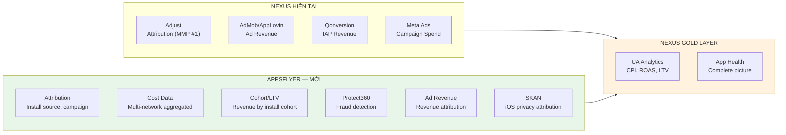
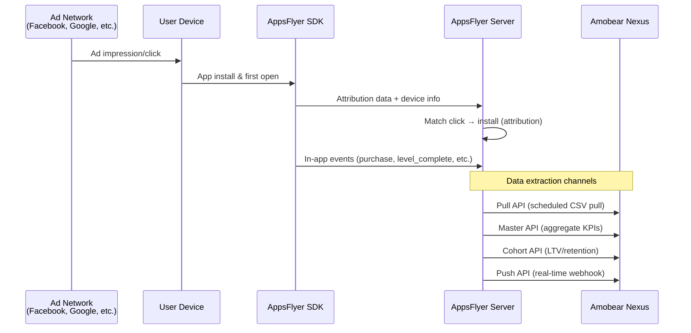
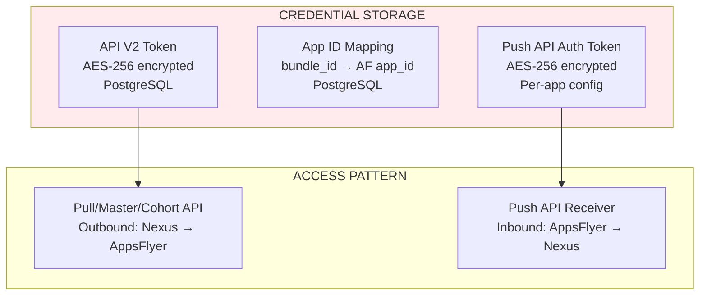
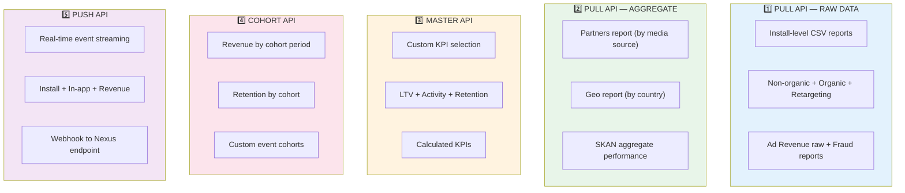
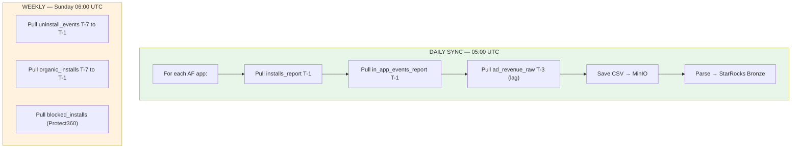
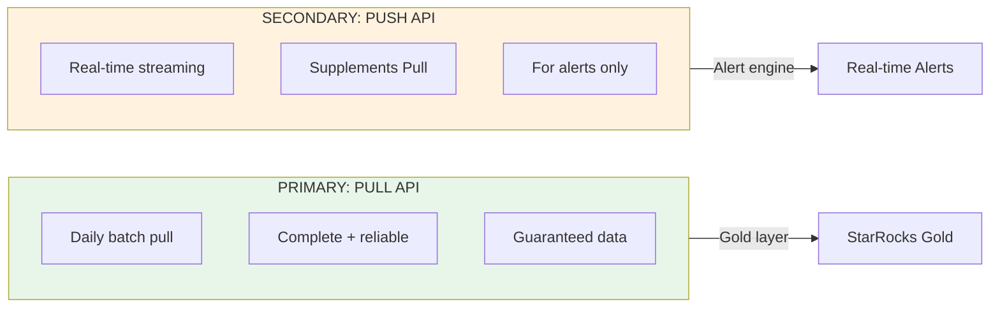
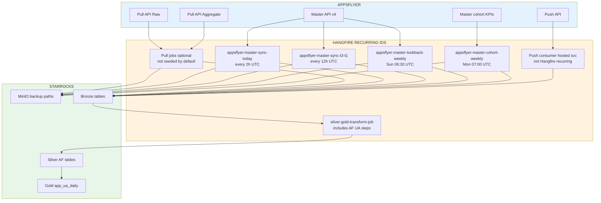
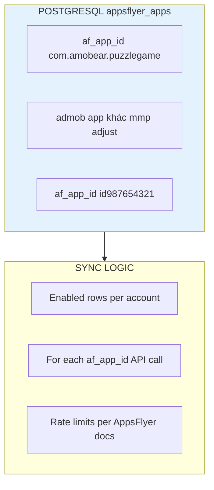
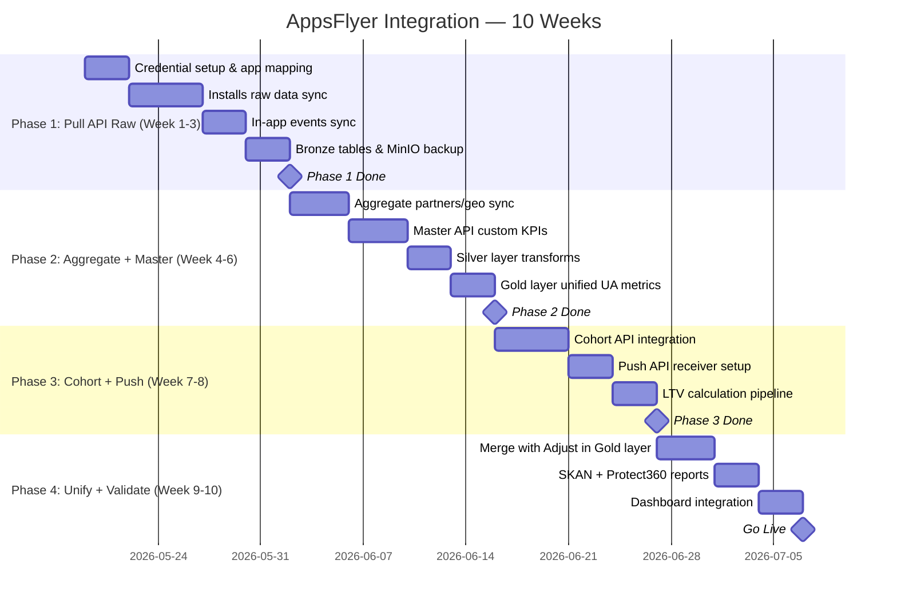

# 128 — AppsFlyer Integration: UA Attribution & Analytics Data Pipeline

> **Module:** Amobear Nexus — Data Source Integration  
> **Mục tiêu:** Tích hợp AppsFlyer làm nguồn dữ liệu Attribution/UA Analytics cho Nexus  
> **Stack:** .NET Core 8 + Hangfire + StarRocks + MinIO  
> **Reference:** 99 (Platform), 126 (Qonversion), 127 (Apple), 119 (Adjust Integration)  
> **Version:** 1.1 — 2026-04-09 (Master agg v4 all-apps; Pull API tạm tắt mặc định — xem §7.0)

---

## Mục lục

1. Tổng quan & Giá trị
2. AppsFlyer Platform Overview
3. Authentication & Credentials
4. API Landscape — 5 nhóm API chính
5. Pull API — Raw Data (tạm tắt mặc định)
6. Pull API — Aggregate Data (tạm tắt mặc định)
7. Master Aggregated Data v4 — **/app/all** (kênh UA chính)
8. Cohort API
9. Push API (Real-time streaming)
10. StarRocks Schema Design
11. Data Flow & Sync Strategy
12. Mapping AppsFlyer → Nexus Metrics
13. Anti-Double-Counting Strategy (AppsFlyer vs Adjust vs Qonversion)
14. Security & Credential Management
15. Phân kỳ triển khai
16. Rủi ro & Giảm thiểu
17. KPI/OKR

---

## 1. Tổng quan & Giá trị

### 1.1 Tại sao cần AppsFlyer trong Nexus?

Nexus hiện dùng **Adjust** làm MMP (Mobile Measurement Partner) chính (doc 119). Tuy nhiên, một số apps trong portfolio Amobear sử dụng **AppsFlyer** thay vì Adjust cho attribution. AppsFlyer bổ sung:

- **UA Attribution** cho apps dùng AppsFlyer SDK (install source, campaign, ad group, creative)
- **Cost data** từ media partners (Facebook, Google, TikTok, Unity Ads)
- **Cohort & LTV analytics** với granularity cao hơn
- **Protect360** — fraud detection data
- **Ad Revenue attribution** — map ad revenue tới install source
- **SKAdNetwork (SKAN)** data cho iOS post-ATT

### 1.2 Dữ liệu AppsFlyer bổ sung gì cho Nexus?



### 1.3 AppsFlyer vs Adjust — Phân vai

| Dimension | Adjust (doc 119) | AppsFlyer (doc 128) |
|-----------|------------------|---------------------|
| **Role** | MMP chính cho majority apps | MMP cho subset apps dùng AF SDK |
| **Data format** | Parquet (Report Service) | CSV/JSON (Pull API/Master API) |
| **Cohort** | Parquet metric groups | Cohort API (JSON query) |
| **Real-time** | Callbacks | Push API (webhook) |
| **Fraud** | Không tích hợp | Protect360 reports |
| **SKAN** | Có nhưng limited | Full SKAN aggregated reports |

> **Nguyên tắc:** Nexus cần handle **cả hai MMP** vì portfolio Amobear có apps dùng Adjust và apps dùng AppsFlyer. Gold layer phải normalize data từ cả hai nguồn.

---

## 2. AppsFlyer Platform Overview

### 2.1 AppsFlyer là gì?

AppsFlyer là mobile measurement & attribution platform. Nó track user acquisition journey: ad click → install → in-app events → revenue.



### 2.2 Data Categories

| Category | Mô tả | Freshness |
|----------|--------|-----------|
| **Raw Data (Non-organic)** | Install-level records: media source, campaign, device, geo | Real-time (Push) hoặc T-0 (Pull) |
| **Raw Data (Organic)** | Organic installs (no paid attribution) | T-0 |
| **Aggregate Performance** | Partners report: installs, revenue, cost by media source | LTV-based, T-0 |
| **Cohort** | Revenue, retention, ROAS by install cohort | T+1 (daily recalculation) |
| **Protect360** | Fraud: blocked installs, post-attribution fraud | T-0 |
| **Ad Revenue** | Ad monetization revenue attributed to install source | T+0~3 days lag |
| **SKAN** | iOS SKAdNetwork postback data | T+1~3 days |

---

## 3. Authentication & Credentials

### 3.1 API Token

AppsFlyer sử dụng **API V2 Token** (bearer token) cho tất cả API calls.

| Credential | Mô tả | Lấy ở đâu |
|-----------|--------|-----------|
| **API V2 Token** | Bearer token cho Pull API, Master API, Cohort API | Dashboard → Integration → API Access |
| **App ID** | Bundle ID (Android: `com.amobear.app`) hoặc Apple ID (iOS: `id1234567890`) | Dashboard → My Apps |

### 3.2 Authentication Pattern

**Pull API (raw-data / agg-data export CSV):** Token trong header **`Authorization: Bearer {API_TOKEN}`** (query `api_token` không còn được chấp nhận — API trả `Missing authorization header`).
```
GET https://hq1.appsflyer.com/api/raw-data/export/app/{app_id}/installs_report/v5?from=2026-04-01&to=2026-04-07
Authorization: Bearer {API_TOKEN}
```

**Master API & Cohort API & App List:** Cùng pattern Bearer
```
Authorization: Bearer {API_TOKEN}
```

### 3.3 Token Scope & Permissions

| API | Required Permission | Rate Limit |
|-----|-------------------|------------|
| Pull API — Raw Data | Raw Data Pull API enabled | 10 calls/min per app |
| Pull API — Aggregate | Performance Reports Pull API | 10 calls/min per app |
| Pull API — Organic | Organic Raw Data Pull API | 10 calls/min per app |
| Master API | Master API subscription (premium) | 40 calls/min |
| Cohort API | Cohort API subscription | 5 calls/min |
| Push API | Push API enabled per app | N/A (server push) |

### 3.4 Credential Storage trong Nexus



---

## 4. API Landscape — 5 nhóm API chính



---

## 5. Pull API — Raw Data (Kênh chính)

### 5.1 Base URL & Endpoints

Base URL: `https://hq1.appsflyer.com/api/raw-data/export/app/`

| Report | Endpoint | Mô tả |
|--------|----------|--------|
| **Non-organic Installs** | `/{app_id}/installs_report/v5` | Paid installs with attribution |
| **Non-organic In-app Events** | `/{app_id}/in_app_events_report/v5` | In-app events (purchase, etc.) |
| **Non-organic Uninstalls** | `/{app_id}/uninstall_events_report/v5` | Uninstall events |
| **Organic Installs** | `/{app_id}/organic_installs_report/v5` | Organic installs |
| **Organic In-app Events** | `/{app_id}/organic_in_app_events_report/v5` | Organic in-app events |
| **Retargeting Conversions** | `/{app_id}/installs_retarget/v5` | Re-engagements, re-attributions |
| **Ad Revenue (Attributed)** | `/{app_id}/ad_revenue_raw/v5` | Ad revenue mapped to install source |
| **Ad Revenue (Organic)** | `/{app_id}/ad_revenue_organic_raw/v5` | Organic ad revenue |
| **Protect360 Installs** | `/{app_id}/blocked_installs_report/v5` | Blocked fraud installs |

### 5.2 Key Parameters

| Parameter | Required | Mô tả |
|-----------|----------|--------|
| `Authorization: Bearer` | ✅ | Header: API V2 token (không dùng `api_token` query cho export v5) |
| `from` | ✅ | Start date (YYYY-MM-DD) |
| `to` | ✅ | End date (YYYY-MM-DD) |
| `media_source` | ❌ | Filter by media source |
| `event_name` | ❌ | Filter by event name (in-app events only) |
| `geo` | ❌ | Filter by country code |
| `additional_fields` | ❌ | Extra fields: `device_download_time,deeplink_url,...` |
| `currency` | ❌ | `preferred` = app setting, or specific currency |

### 5.3 Constraints

- Date range: **max 90 ngày** per request
- Rows: **max 1M rows** per request — nếu exceed, split by time range
- Format: CSV (default)
- Raw data retention: **90 ngày** historical

### 5.4 Sync Strategy cho Raw Data



---

## 6. Pull API — Aggregate Data

### 6.1 Endpoints

Base URL: `https://hq1.appsflyer.com/api/agg-data/export/app/`

| Report | Endpoint | Mô tả |
|--------|----------|--------|
| **Partners (by media source)** | `/{app_id}/partners_report/v5` | Installs, revenue, cost by partner |
| **Partners (by geo)** | `/{app_id}/geo_report/v5` | Installs, revenue by country |
| **Daily** | `/{app_id}/partners_by_date_report/v5` | Daily breakdown by partner |

### 6.2 Giá trị cho Nexus

Aggregate reports cung cấp **cost data** mà raw data không có (cost chỉ available ở aggregate level). Đây là nguồn quan trọng cho CPI/ROAS calculation.

| Field | Mô tả |
|-------|--------|
| `installs` | Total installs from partner |
| `cost` | UA spend (from partner API) |
| `impressions`, `clicks` | Ad engagement metrics |
| `revenue` | LTV revenue attributed to partner |
| `roi` | Return on investment |
| `average_ecpi` | Effective cost per install |

---

## 7. Master Aggregated Data v4 (Kênh UA chính trong Nexus)

### 7.0 Trạng thái triển khai Nexus

- **Pull API** (raw-data export, agg-data partners, extended SKAN/Protect360/ad revenue): **tắt theo mặc định**. Cấu hình `AppsFlyer:EnablePullApi` = `true` mới chạy job Pull / JobsTest tương ứng; mặc định không set = không gọi Pull (tránh lệch với spec 128b/Postman v3).
- **Master all-apps:** `GET /api/master-agg-data/v4/app/all` — **Bearer** token (API V2), **một** request cho toàn bộ app. Backup MinIO `raw/appsflyer/master/v4/…`; parse CSV → `bronze.appsflyer_aggregate_daily` (`report_type=master_api_v4`, replace theo khoảng ngày) và `metrics_json` cho KPI bổ sung — **không** ghi lại response vào StarRocks (trùng với MinIO + job chạy lặp).
- **Grouping ngày:** theo **128b** dùng **`install_time`** trong `groupings` (ví dụ `app_id,install_time,pid,geo`), không dùng `date` trong ví dụ Postman cũ nếu doc 128b quy định khác.
- **KPI mặc định (có thể tách call — 128b §4):** `installs,uninstalls,cost,revenue,roi,average_ecpi,sessions,loyal_users_rate,activity_revenue,retention_rate_day_1`. Cấu hình `AppsFlyer:Master:Kpis`, `AppsFlyer:Master:Groupings`, `AppsFlyer:Master:LookbackDays` (mặc định 30), và tùy chọn `AppsFlyer:Master:KpiFallbackSets:*` nếu API từ chối mix KPI.
- **Gold:** Khi Pull tắt, `RunAppsFlyerUaGoldPipelineAsync` **không** xóa/làm mới `silver.appsflyer_*` từ `installs_raw`; nhánh AppsFlyer trong `gold.app_ua_daily` lấy từ `bronze.appsflyer_aggregate_daily` (`master_api_v4`) join `silver.dim_app_identifiers` theo `appsflyer_af_app_id`, `id`+`app_store_id`, **hoặc** `package_name` = `aggregate.app_id` (Master CSV thường dùng package Android làm App ID). **Sau Master sync** cần chạy **`AppsFlyerUaTransformJob`** / transform có `RunAppsFlyerUaGoldPipelineAsync` cho đúng khoảng ngày — nếu không, `gold.app_ua_daily` sẽ thiếu `mmp_source='appsflyer'` dù aggregate đã có dữ liệu.
- **App Insight:** `snapshot.attribution` dùng `hasAppsFlyerAttributionSlice` / `appsFlyerInstallsByMediaSourceTop` / `appsFlyerOrganicSplit` từ chuỗi nguồn: Pull `installs_raw` → `gold.app_ua_daily` (AF) → `aggregate_daily` (Master), không bắt buộc Pull khi đã có Master.
- **Tài liệu chi tiết field/KPI:** `docs/AppsFlyer/128b_APPSFLYER_FIELD_REFERENCE.md`. **Postman v3:** `docs/AppsFlyer/Amobear_Nexus_AppsFlyer_APIs_v3_final.postman_collection.json`.

### 7.1 Mô tả

Master Aggregated Data API v4 cho phép chọn `groupings` và `kpis` linh hoạt. Nexus dùng endpoint **all apps** để không loop từng `af_app_id` như Pull. Cần quyền / gói Master phù hợp trên AppsFlyer.

**Base URL (Nexus):** `https://hq1.appsflyer.com/api/master-agg-data/v4/app/all`  
**Auth:** `Authorization: Bearer {API_V2_TOKEN}`

### 7.2 Key Features

- **Custom dimensions:** theo 128b (ví dụ `pid`, `geo`, `install_time`, `app_id`)
- **Custom KPIs:** tập KPI doc 128b / Postman v3; có thể **tách** nhiều request nếu API báo lỗi field (§4 128b)
- **CSV** (Nexus ingest mặc định `format=csv`)

### 7.3 Ví dụ Request (khớp Nexus)

```
GET /api/master-agg-data/v4/app/all
    ?from=2026-04-01&to=2026-04-07
    &groupings=app_id,install_time,pid,geo
    &kpis=installs,cost,revenue,roi,average_ecpi,sessions,retention_rate_day_1
    &format=csv
Authorization: Bearer <API_V2_TOKEN>
```

### 7.4 Nexus Use Cases

1. **Daily UA Performance:** Installs + Cost + Revenue by media_source × geo × date
2. **Retention Tracking:** D1, D3, D7 retention by campaign
3. **ROAS Monitoring:** Revenue vs Cost by ad creative
4. **Custom Calculated KPIs:** `calculated_kpi_roi_d7=(cohort_day_7_total_revenue_per_user-average_ecpi)/average_ecpi`

---

## 8. Cohort API

### 8.1 Mô tả

Cohort API (POST JSON theo app) mô tả dưới đây là **tham chiếu AppsFlyer**. Trong Nexus, job cohort **hàng tuần** dùng **Master Aggregated Data v4** `GET …/app/all` với `groupings` / `kpis` cohort (ví dụ `cohort_day_*_total_revenue_per_user`), lưu **chỉ** MinIO (`raw/appsflyer/master/cohort/…`) — không còn POST `/api/cohorts/v1/report` trong pipeline mặc định và không ghi audit pull vào StarRocks.

**Base URL (tham chiếu legacy):** `https://hq1.appsflyer.com/api/cohorts/v1/data/app/{app_id}`

### 8.2 Query Structure (POST, JSON body)

```json
{
  "cohort_type": "user_acquisition",
  "min_cohort_size": 1,
  "preferred_timezone": "UTC",
  "from": "2026-03-01",
  "to": "2026-03-31",
  "granularity": "day",
  "groupings": ["date", "media_source", "geo"],
  "filters": {
    "period": [0, 1, 3, 7, 14, 30],
    "partial_data": "excluded"
  },
  "kpis": ["revenue", "sessions", "event_counter", "unique_users"],
  "aggregation_type": "cumulative"
}
```

### 8.3 Giá trị cho Nexus

| Metric | Mô tả | Nexus Gold Use |
|--------|--------|----------------|
| `revenue` (cumulative, D7) | Revenue per user tới ngày thứ 7 | LTV D7 |
| `revenue` (cumulative, D30) | Revenue per user tới ngày 30 | LTV D30 |
| `sessions` (on_day, D1) | % users active ngày 1 | D1 Retention |
| `unique_users` / `conversions` | Cohort size | Retention calculation |

---

## 9. Push API (Real-time streaming)

### 9.1 Mô tả

Push API streams raw events real-time tới Nexus webhook endpoint. Complementary với Pull API (Pull = batch daily, Push = real-time).

### 9.2 Setup

1. AppsFlyer Dashboard → Export → API Access → Push API
2. Add Endpoint: `https://nexus.amobear.com/api/webhooks/appsflyer`
3. Select event types: Installs, In-app Events, Sessions
4. Select fields: mandatory + optional fields
5. Set authentication token

### 9.3 Event Types

| Event | Mô tả |
|-------|--------|
| `install` | New app install attributed |
| `in-app-event` | Custom events (purchase, level_complete) |
| `session` | App session start |
| `uninstall` | App uninstall detected |
| `re-engagement` | Retargeting re-engagement |
| `re-attribution` | Retargeting re-attribution |

### 9.4 Decision: Pull-first, Push-optional



> **Lý do Pull-first:** Pull API đảm bảo data completeness 100%. Push API có thể miss events nếu endpoint down. Dùng Push chỉ cho real-time alerting, không cho Gold layer aggregation.

---

## 10. StarRocks Schema Design

### 10.1 Bronze — `appsflyer_installs_raw`

```sql
CREATE TABLE IF NOT EXISTS bronze.appsflyer_installs_raw (
    install_date        DATE NOT NULL,
    app_id              VARCHAR(200) NOT NULL COMMENT 'AF App ID (bundle_id or idXXX)',
    appsflyer_id        VARCHAR(200) NOT NULL COMMENT 'AF device-level ID',
    media_source        VARCHAR(200) COMMENT 'facebook, googleadwords_int, etc.',
    campaign            VARCHAR(500),
    campaign_id         VARCHAR(200),
    adset               VARCHAR(500),
    adset_id            VARCHAR(200),
    ad                  VARCHAR(500),
    ad_id               VARCHAR(200),
    channel             VARCHAR(200),
    keywords            VARCHAR(500),
    country_code        VARCHAR(10),
    city                VARCHAR(200),
    platform            VARCHAR(20) COMMENT 'android, ios',
    device_type         VARCHAR(100),
    os_version          VARCHAR(50),
    app_version         VARCHAR(50),
    
    -- Attribution
    attributed_touch_type VARCHAR(50) COMMENT 'click, impression, tv',
    attributed_touch_time DATETIME,
    install_time        DATETIME,
    
    -- Revenue & Cost (aggregate level only, null in raw)
    event_revenue       DECIMAL(12, 4),
    event_revenue_currency VARCHAR(10),
    event_revenue_usd   DECIMAL(12, 4),
    cost_model          VARCHAR(20),
    cost_value          DECIMAL(12, 4),
    cost_currency       VARCHAR(10),
    
    -- Identifiers
    idfa                VARCHAR(200),
    advertising_id      VARCHAR(200),
    customer_user_id    VARCHAR(200) COMMENT 'Amobear internal user ID',
    
    -- Metadata
    is_retargeting      BOOLEAN DEFAULT FALSE,
    retargeting_conversion_type VARCHAR(50),
    is_primary_attribution BOOLEAN DEFAULT TRUE,
    
    -- Nexus
    raw_csv_line        TEXT,
    sync_batch_id       VARCHAR(50),
    received_at         DATETIME DEFAULT CURRENT_TIMESTAMP,
    source_channel      VARCHAR(20) COMMENT 'pull_api, push_api'
)
ENGINE = OLAP
DUPLICATE KEY(install_date, app_id, appsflyer_id)
PARTITION BY RANGE(install_date) (
    START ("2026-01-01") END ("2027-01-01") EVERY (INTERVAL 1 MONTH)
)
DISTRIBUTED BY HASH(app_id, appsflyer_id) BUCKETS 8
PROPERTIES ("replication_num" = "1");
```

### 10.2 Bronze — `appsflyer_events_raw`

```sql
CREATE TABLE IF NOT EXISTS bronze.appsflyer_events_raw (
    event_date          DATE NOT NULL,
    app_id              VARCHAR(200) NOT NULL,
    appsflyer_id        VARCHAR(200) NOT NULL,
    event_name          VARCHAR(200) NOT NULL COMMENT 'af_purchase, af_level_achieved, etc.',
    event_time          DATETIME,
    event_value         TEXT COMMENT 'JSON string with event params',
    event_revenue       DECIMAL(12, 4),
    event_revenue_currency VARCHAR(10),
    event_revenue_usd   DECIMAL(12, 4),
    
    -- Attribution (from install)
    media_source        VARCHAR(200),
    campaign            VARCHAR(500),
    campaign_id         VARCHAR(200),
    country_code        VARCHAR(10),
    
    -- Nexus
    sync_batch_id       VARCHAR(50),
    received_at         DATETIME DEFAULT CURRENT_TIMESTAMP
)
ENGINE = OLAP
DUPLICATE KEY(event_date, app_id, appsflyer_id, event_name)
PARTITION BY RANGE(event_date) (
    START ("2026-01-01") END ("2027-01-01") EVERY (INTERVAL 1 MONTH)
)
DISTRIBUTED BY HASH(app_id, appsflyer_id) BUCKETS 8;
```

### 10.3 Bronze — `appsflyer_aggregate_daily`

```sql
CREATE TABLE IF NOT EXISTS bronze.appsflyer_aggregate_daily (
    report_date         DATE NOT NULL,
    app_id              VARCHAR(200) NOT NULL,
    media_source        VARCHAR(200) NOT NULL,
    campaign            VARCHAR(500),
    campaign_id         VARCHAR(200),
    country_code        VARCHAR(10),
    
    -- Metrics
    installs            INT,
    impressions         BIGINT,
    clicks              INT,
    cost                DECIMAL(12, 4),
    revenue             DECIMAL(12, 4),
    roi                 DECIMAL(8, 4),
    average_ecpi        DECIMAL(12, 4),
    sessions            INT,
    loyal_users         INT,
    uninstalls          INT,
    
    -- Nexus
    report_type         VARCHAR(50) COMMENT 'partners, geo, daily',
    sync_batch_id       VARCHAR(50),
    received_at         DATETIME DEFAULT CURRENT_TIMESTAMP
)
ENGINE = OLAP
DUPLICATE KEY(report_date, app_id, media_source, campaign_id)
PARTITION BY RANGE(report_date) (
    START ("2026-01-01") END ("2027-01-01") EVERY (INTERVAL 1 MONTH)
)
DISTRIBUTED BY HASH(app_id) BUCKETS 4;
```

### 10.4 Gold — `app_ua_daily` (Unified UA metrics)

```sql
CREATE TABLE IF NOT EXISTS gold.app_ua_daily (
    report_date         DATE NOT NULL,
    app_id              VARCHAR(200) NOT NULL COMMENT 'Nexus internal app_id (bundle_id)',
    mmp_source          VARCHAR(20) NOT NULL COMMENT 'appsflyer or adjust',
    media_source        VARCHAR(200),
    country_code        VARCHAR(10),
    
    -- UA Metrics
    installs            INT,
    cost_usd            DECIMAL(12, 4),
    cpi_usd             DECIMAL(12, 4) COMMENT 'cost / installs',
    revenue_usd         DECIMAL(12, 4) COMMENT 'LTV revenue attributed',
    roas                DECIMAL(8, 4) COMMENT 'revenue / cost',
    
    -- Engagement
    sessions            INT,
    d1_retention        DECIMAL(5, 4),
    d7_retention        DECIMAL(5, 4),
    
    -- LTV (from Cohort API)
    ltv_d7_usd          DECIMAL(12, 4),
    ltv_d30_usd         DECIMAL(12, 4),
    
    updated_at          DATETIME DEFAULT CURRENT_TIMESTAMP
)
ENGINE = OLAP
UNIQUE KEY(report_date, app_id, mmp_source, media_source, country_code)
PARTITION BY RANGE(report_date) (
    START ("2026-01-01") END ("2027-01-01") EVERY (INTERVAL 1 MONTH)
)
DISTRIBUTED BY HASH(app_id) BUCKETS 4;
```

---

## 11. Data Flow & Sync Strategy

### 11.1 Complete Architecture



### 11.2 Sync Schedule (theo code Nexus)

**Seed PostgreSQL:** migration `SeedAppsFlyerHangfireJobSchedules` chèn bốn `job_id` Master/cohort nếu chưa có; migration `ReplaceAppsFlyerMasterHangfireSchedules` xóa `appsflyer-master-daily-sync` (bản cũ) và bảo đảm ba job tách + `sort_order` cohort = 99. API gọi `HangfireJobScheduleService.EnsureSeededAsync()` khi khởi động để backfill job mặc định còn thiếu.

| Hangfire `job_id` / entry point | Schedule (UTC) | Ghi chú |
|----------------------------------|----------------|---------|
| `appsflyer-master-sync-today` → `AppsFlyerMasterApiSyncJob.SyncTodayUtcMasterAsync` | `0 */2 * * *` | Master agg v4 `/app/all` chỉ **ngày UTC hiện tại** (intraday partial), cùng ý tưởng Adjust “today” |
| `appsflyer-master-sync-t3-t1` → `AppsFlyerMasterApiSyncJob.SyncT3ToT1MasterAsync` | `0 */12 * * *` | T−3…T−1 — chỉnh sửa trễ từ phía AF; khung hẹp hơn Adjust T−5…T−1 |
| `appsflyer-master-lookback-weekly` → `AppsFlyerMasterApiSyncJob.SyncDailyMasterAsync` | `30 6 * * 0` | Lookback dài tới T−1 theo `AppsFlyer:Master:LookbackDays` (mặc định 30) — chạy **hàng tuần** để giảm tải/rate limit |
| `appsflyer-master-cohort-weekly` → `AppsFlyerCohortSyncJob.SyncWeeklyCohortMasterAsync` | `0 7 * * 1` | Cohort KPIs qua Master v4 (~90 ngày một request) — **weekly** hợp lý; có thể giãn 2 tuần nếu cần giảm tải (xem §8) |
| `silver-gold-transform-job` → `SilverGoldTransformJob.RunTransformAsync` | `25 */2 * * *` | Gọi `RunAppsFlyerRollupAggregateFromInstallsAsync` + `RunAppsFlyerUaGoldPipelineAsync` trong cửa sổ `Transform:JobDaysBack` |
| **Pull** (`AppsFlyerInstallsReportSyncJob`, `AppsFlyerEventsSyncJob`, `AppsFlyerAggregateSyncJob`, `AppsFlyerExtendedReportsSyncJob`, …) | Install report: seed 3 lịch (today / T−3..T−1 / weekly lookback) khi migration + `EnsureSeededAsync` | Bật `AppsFlyer:EnablePullApi=true`, cấu hình account/app trong PostgreSQL; chạy thủ công qua `JobsTestController` (`appsflyer-installs-sync`) hoặc Hangfire |
| **JobsTest Master** | Thủ công | `POST .../jobs-test/appsflyer-master-sync?mode=lookback` (mặc định, `SyncDailyMasterAsync`), `today`, `t3t1` |
| **Push** | Real-time | `AppsFlyerWebhookController` + queue consumer → `bronze.appsflyer_webhook_raw` — không phải recurring Hangfire |

### 11.3 Quản trị UI và đồng bộ với `silver.dim_app_identifiers`

- **Data Accounts (Nexus UI):** network **AppsFlyer** — tạo/sửa `appsflyer_accounts` (API V2 token, base URL, Push webhook token, default account). Tab **AF Apps** quản lý `appsflyer_apps` (`af_app_id`, display name, enabled, token Push per-app).
- **Jobs đọc app list:** Pull/Master sync lặp theo các dòng **enabled** trong `appsflyer_apps` gắn với **default account** (`IsDefault` + `Enabled`) hoặc theo logic repository hiện tại (`GetDefaultAsync`, `GetEnabledForAccountAsync`).
- **Mapping StarRocks:** cột `silver.dim_app_identifiers.appsflyer_af_app_id` phải **khớp** giá trị `AfAppId` lưu trong `appsflyer_apps` (cùng chuỗi bundle hoặc `id…` iOS) để `StarRocksTransformService` join bronze/silver AF với app AdMob trong dim. Việc gán giá trị dim được thực hiện qua pipeline `SyncAppIdentifiers` / upsert dim (không tự đồng bộ từ bảng `appsflyer_apps` sang dim chỉ bằng việc thêm app trong UI — cần đảm bảo dim được cập nhật theo quy trình app onboarding hiện có).

### 11.4 Multi-App Handling

Với 200+ apps, một số dùng AppsFlyer:



---

## 12. Mapping AppsFlyer → Nexus Metrics

### 12.1 UA Metrics Mapping

| AppsFlyer Field | Nexus Gold Metric | Logic |
|-----------------|-------------------|-------|
| `installs` (aggregate) | `app_ua_daily.installs` | Sum by date × app × media_source |
| `cost` (aggregate) | `app_ua_daily.cost_usd` | Sum, convert to USD |
| `average_ecpi` | `app_ua_daily.cpi_usd` | cost / installs |
| `revenue` (aggregate) | `app_ua_daily.revenue_usd` | LTV revenue attributed |
| `roi` | `app_ua_daily.roas` | (revenue - cost) / cost |
| Cohort D7 revenue per user | `app_ua_daily.ltv_d7_usd` | From Cohort API |
| Cohort D30 revenue per user | `app_ua_daily.ltv_d30_usd` | From Cohort API |

### 12.2 Integration với App Health Score (Doc 121)

| Health Dimension | AppsFlyer Contribution |
|-----------------|------------------------|
| **Growth** | Install volume, organic vs paid ratio |
| **Unit Economics** | CPI, ROAS, LTV/CAC ratio |
| **Revenue** | Revenue attribution by channel |
| **Optimization Velocity** | Campaign optimization frequency |

---

## 13. Anti-Double-Counting Strategy (AppsFlyer vs Adjust vs Qonversion)

### 13.1 Rủi ro Double-counting

| Nguồn A | Nguồn B | Risk | Giải pháp |
|---------|---------|------|-----------|
| AppsFlyer installs | Adjust installs | Cùng user counted bởi cả hai | **Mỗi app chỉ dùng 1 MMP** → config table |
| AppsFlyer revenue | Qonversion IAP revenue | Cùng transaction | AF revenue = attribution view, Qonversion = source of truth cho IAP |
| AppsFlyer ad_revenue | AdMob/AppLovin direct | Cùng ad impression | AF ad_revenue **chỉ dùng cho attribution**, không aggregate vào total |
| AppsFlyer cost | Meta Ads cost | Cùng campaign spend | AF cost đã aggregate từ networks → **dùng AF** hoặc Meta, không cả hai |

### 13.2 Revenue Hierarchy Rule (Updated)

```
Gold.total_revenue = Gold.iaa_revenue (AdMob + AppLovin — direct API)
                   + Gold.iap_revenue (Qonversion — webhook)
                   
Gold.ua_attributed_revenue = AppsFlyer/Adjust aggregate revenue (for ROAS calc only)

⛔ NEVER add:
  - AppsFlyer revenue vào total_revenue (nó là LTV attribution view, NOT actual revenue)
  - AppsFlyer ad_revenue vào iaa_revenue (dùng cho attribution analysis only)
  - AppsFlyer cost + Meta cost cho cùng campaign
```

---

## 14. Security & Credential Management

| Credential | Storage | Rotation | Access |
|-----------|---------|----------|--------|
| API V2 Token | PostgreSQL (AES-256) | Manual via dashboard; token thay đổi khi admin email thay đổi | All sync jobs |
| Push API Auth Token | PostgreSQL (AES-256) | Manual per-app | Webhook receiver |
| App ID mapping | PostgreSQL (plain) | Auto-sync via config | All jobs |

---

## 15. Phân kỳ triển khai

### 15.1 Roadmap



### 15.2 Checklist

- [x] API V2 Token secured trong PostgreSQL
- [x] App ID mapping table populated (apps using AppsFlyer)
- [x] Pull API raw data sync running (installs + events)
- [x] MinIO backup path: `raw/appsflyer/{installs|events|aggregate|...}/{date}/`
- [x] Bronze tables receiving data (installs, events, aggregate, webhook); Master/cohort/extended pulls: MinIO raw + fact `aggregate_daily` (không duplicate `api_pull_raw` / `extended_pull`)
- [x] Aggregate sync: rollup từ installs + partners CSV → MinIO; extended reports MinIO-only khi bật Pull API
- [x] Master API sync (MinIO + parse → `bronze.appsflyer_aggregate_daily`; có thể 403 nếu không đăng ký)
- [x] Cohort job weekly (MinIO CSV cohort; không ghi `bronze.appsflyer_api_pull_raw`)
- [x] Push API endpoint + queue consumer (`POST /api/webhooks/appsflyer` → `nexus.appsflyer.push` → `bronze.appsflyer_webhook_raw`)
- [x] Silver transforms (`silver.appsflyer_installs_clean`, `silver.appsflyer_ua_metrics`)
- [x] Gold `app_ua_daily` unified with Adjust data (`mmp_source` = `adjust` | `appsflyer`)
- [ ] Anti-double-counting validated (cần kiểm thử theo app thực tế)
- [x] Postman collection: [docs/postman/appsflyer-nexus.postman_collection.json](postman/appsflyer-nexus.postman_collection.json) (26 requests)
- [x] Rate limit handling with exponential backoff (429/5xx trong `AppsFlyerApiClient`)

### 15.3 Backend MediationPro — triển khai đầy đủ (doc 128)

Pipeline **Adjust-style** + MinIO + StarRocks bronze/silver/gold + Hangfire + JobsTest:

| Thành phần | Mô tả |
|------------|--------|
| **PostgreSQL** | `appsflyer_accounts` / `appsflyer_apps`; cột `push_webhook_auth_token` (account + optional per-app). Migration `AddAppsFlyerPushWebhookTokens`. |
| **StarRocks** | `bronze.appsflyer_installs_raw`, `appsflyer_events_raw`, `appsflyer_aggregate_daily`, `appsflyer_webhook_raw`; bảng `appsflyer_api_pull_raw` / `appsflyer_extended_pull` vẫn có thể tồn tại trong schema (legacy) nhưng **job không ghi** — raw Master/cohort/extended chỉ MinIO. `silver.appsflyer_installs_clean`, `silver.appsflyer_ua_metrics`; `gold.app_ua_daily`; `silver.dim_app_identifiers.appsflyer_af_app_id` (migrations `20260411100000`…`20260411108000` trong `StarRocksSchemaInitializer`). |
| **HTTP** | `IAppsFlyerApiClient`: Pull/Agg CSV (Bearer) + Master/mng (Bearer) + POST Master/Cohort; retry exponential. |
| **MinIO** | `amobear-datalake` prefix `raw/appsflyer/...` (installs/events/aggregate partners/ad revenue/Protect360/SKAN). |
| **Jobs** | `AppsFlyerInstallsReportSyncJob` (installs_report Pull), `AppsFlyerEventsSyncJob`, `AppsFlyerAggregateSyncJob`, `AppsFlyerExtendedReportsSyncJob`, `AppsFlyerMasterApiSyncJob`, `AppsFlyerCohortSyncJob`, `AppsFlyerUaTransformJob` (manual/JobsTest); `SilverGoldTransformJob` gọi `RunAppsFlyerRollupAggregateFromInstallsAsync` + `RunAppsFlyerUaGoldPipelineAsync`. |
| **Hangfire** | Cron trong `HangfireJobScheduleService` (installs, events, aggregate, extended×3, master, cohort). |
| **Webhook** | `AppsFlyerWebhookController` + `AppsFlyerPushBronzeConsumer`. |
| **Transform** | `StarRocksTransformService` (`SyncAppIdentifiersAsync` map `appsflyer_af_app_id`; `RunAppsFlyerUaGoldPipelineAsync` gộp Adjust + AF vào `gold.app_ua_daily`; Master→gold join thêm `package_name`). |
| **App Insight** | `AppInsightSnapshotBuilder` + `StarRocksAnalyticsReader` (AppInsight): Q14/Q15 từ raw Pull hoặc gold AF hoặc `aggregate_daily` Master. |
| **Test API** | `POST /api/v1/jobs-test/appsflyer-*` (xem JobsTestController). |

**Cấu hình:** account default + `appsflyer_apps`; đặt `PushWebhookAuthToken` nếu dùng Push API; chạy API để áp StarRocks schema; `dotnet ef database update` cho PostgreSQL.

---

## 16. Rủi ro & Giảm thiểu

| # | Rủi ro | Impact | Probability | Giảm thiểu |
|---|--------|--------|-------------|-------------|
| 1 | Rate limit exceeded (10 calls/min) | Medium | High | Queue-based processing, stagger per-app |
| 2 | Raw data 90-day retention limit | High | Certain | Daily sync + MinIO permanent backup |
| 3 | Double-counting with Adjust | Critical | Medium | Config table: 1 app = 1 MMP strictly |
| 4 | Cost data lag (several hours) | Low | Certain | T-1 sync is sufficient; document lag |
| 5 | Master API premium subscription required | Medium | Low | Start with Pull API; add Master when needed |
| 6 | SKAN data incompleteness (Apple privacy) | Medium | Certain | Document limitations; combine with probabilistic |
| 7 | Token invalidation on admin email change | High | Low | Monitor + alert on 401 responses |

---

## 17. KPI/OKR

### OKR: AppsFlyer Integration live trong 10 tuần

| KR | Target | Measurement |
|----|--------|-------------|
| Raw data sync completeness | > 99% (vs dashboard) | Daily reconciliation |
| Data freshness | T-1 by 09:00 UTC | Monitoring |
| Zero double-counting incidents | 0 after go-live | Automated check |
| Cost data coverage | > 95% of AF-tracked spend | Compare AF cost vs network direct |
| Cohort LTV accuracy | ±5% vs AF dashboard | Weekly validation |
| Postman collection | 25+ requests tested | Collection count |

---

*Document maintained by: Amobear Nexus Team*  
*Last updated: 2026-04-09*
