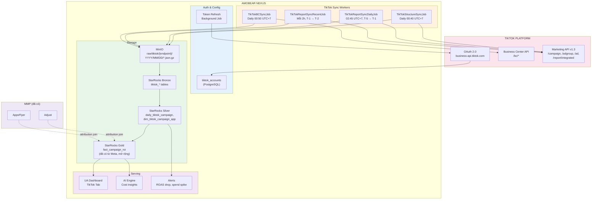
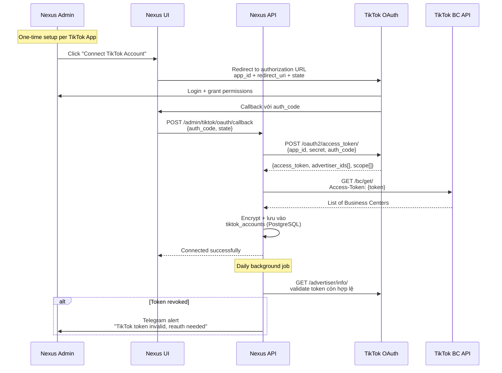
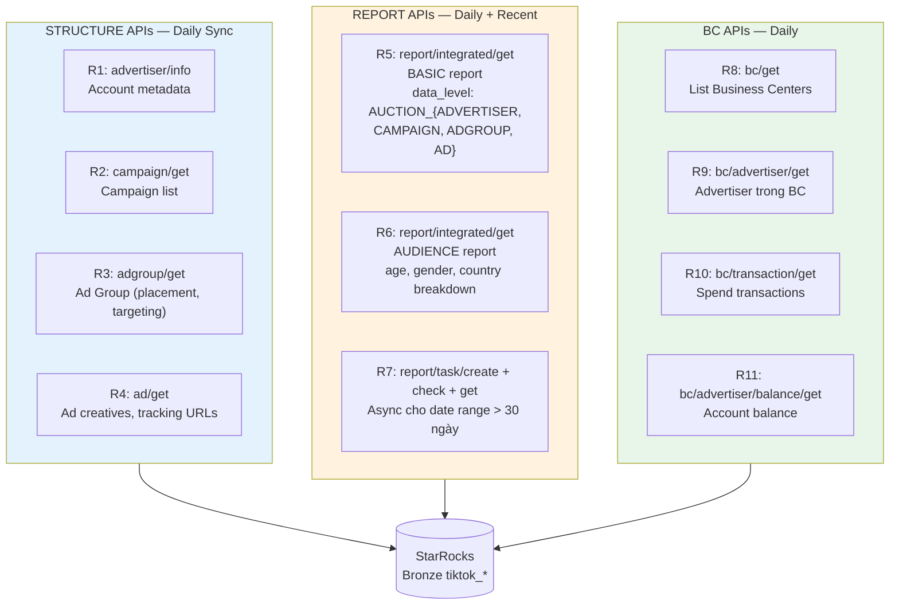
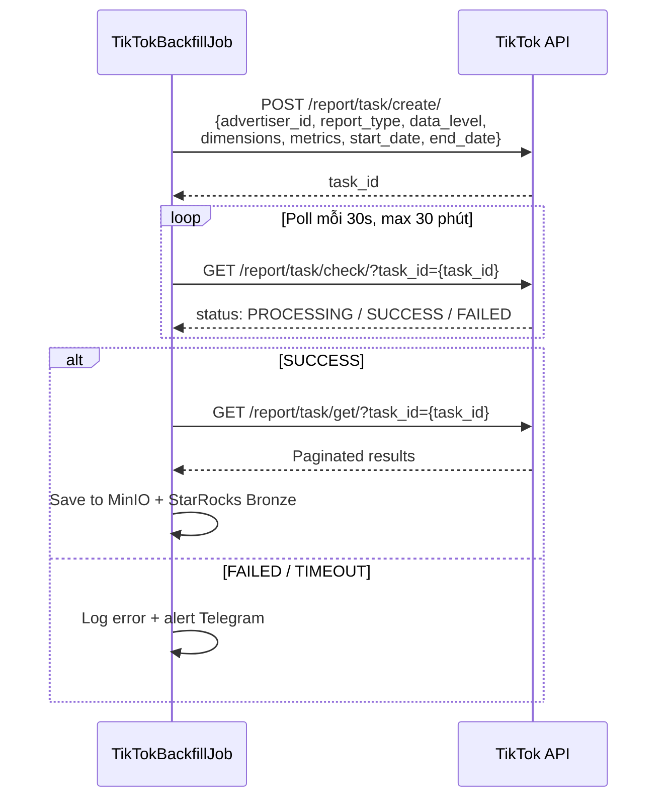
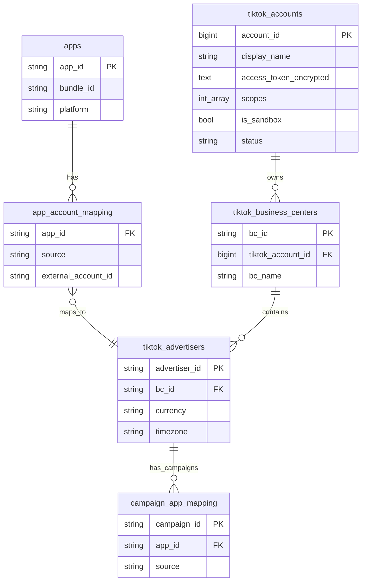
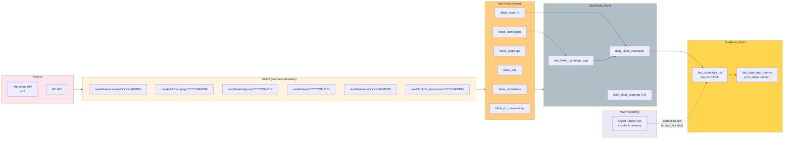
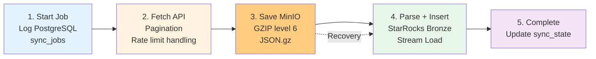
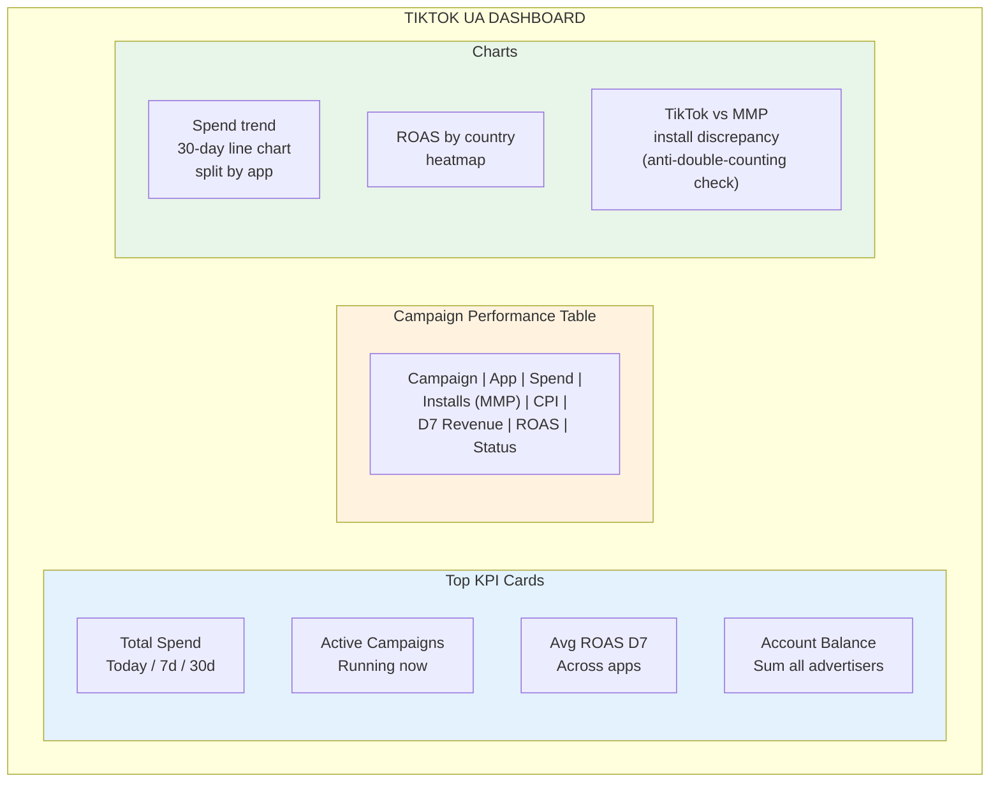
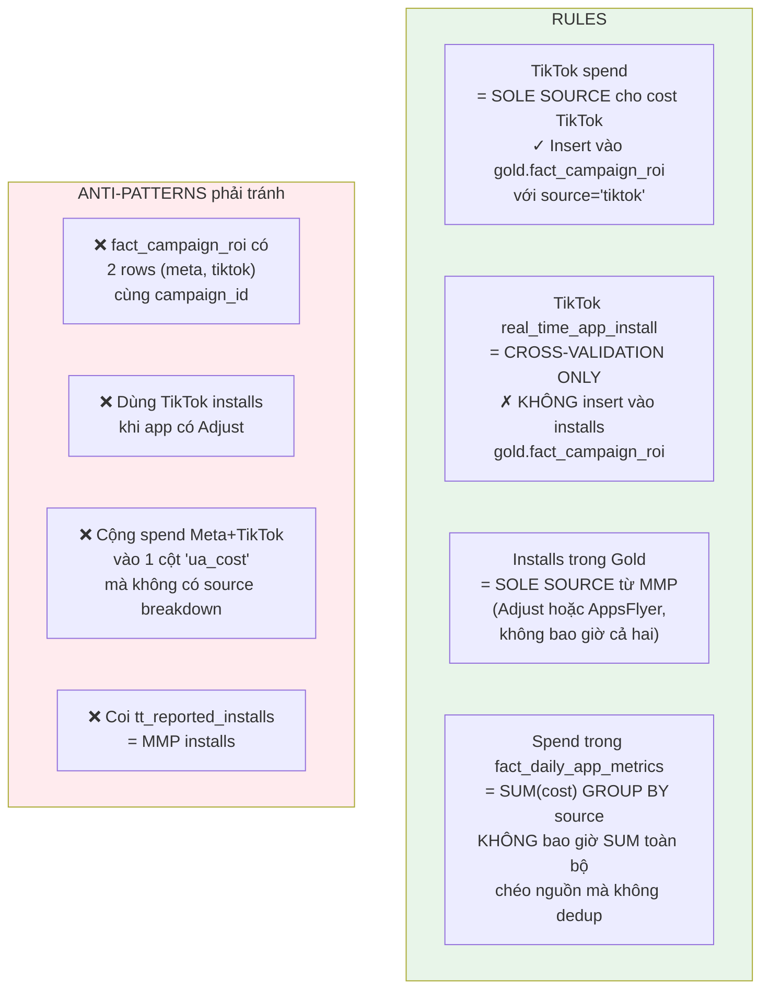
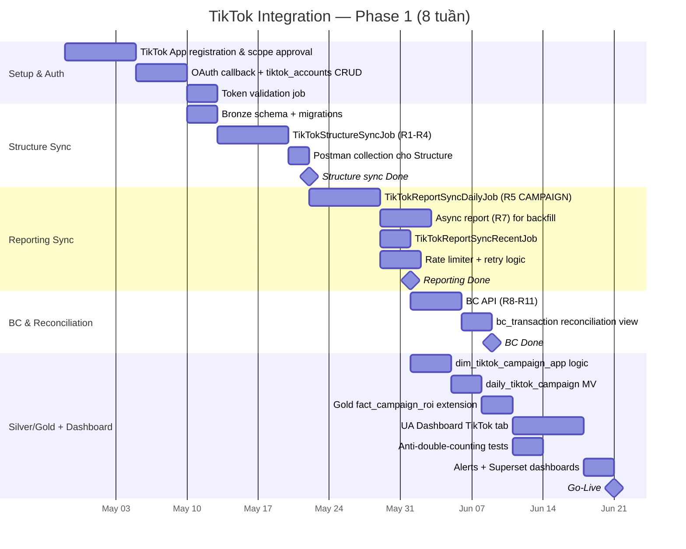

# 130 - TIKTOK MARKETING API & BM API INTEGRATION

**Trạng thái:** Planned — PRD v1.0  
**Ngày ban hành:** Apr 2026  
**Thuộc:** Amobear Nexus Platform  
**Tham chiếu chéo:** Doc 99 (Nexus Platform), Doc 100 (Data Storage Architecture), Doc 128 (AppsFlyer), Doc 127 (Apple Store), Doc 126 (Qonversion), Doc 129 (Unified Event Bus)  
**Người dùng hưởng lợi:** UA Team, Marketing Team, Finance Team

---

# 1. MỤC TIÊU & PHẠM VI

## 1.1 Mục tiêu nghiệp vụ

Amobear hiện đã tích hợp **Meta Ads** (campaign performance, insights) vào Nexus. Tuy nhiên, TikTok đã trở thành nguồn UA lớn thứ 2 sau Meta cho nhiều app game/utility trong portfolio, và hiện **dữ liệu TikTok vẫn phải export thủ công từ TikTok Ads Manager** → đưa vào Excel → đối chiếu với MMP (Adjust/AppsFlyer). Pain point rõ ràng:

- **Không có single-source-of-truth cho TikTok cost** → double-counting nguy cơ cao giữa MMP và nền tảng quảng cáo
- **Không có ROAS/ROI real-time cho TikTok campaigns** → UA team ra quyết định chậm 1–2 ngày
- **Không có automation rules theo ROAS** — team đang phải mở TikTok Ads Manager → sửa budget/pause tay
- **Business Center (BC) — nơi quản lý quyền truy cập advertiser accounts** chưa được đồng bộ, mỗi lần có app/account mới phải cấu hình thủ công

Tài liệu này mô tả phương án tích hợp **hai lớp API** của TikTok vào Nexus theo pattern đã chuẩn hóa với Meta:

- **Marketing API** — Campaign/AdGroup/Ad structure, performance reporting, audience, creative (tương đương Meta Marketing API)
- **Business Center (BC / BM) API** — Quản lý advertiser accounts, assets, permissions, transactions (tương đương Meta Business Manager API)

## 1.2 Phạm vi (MVP / Phase 1)

**In scope:**
- OAuth 2.0 authentication với **long-lived access token** qua Business Center
- Sync **structure**: Advertiser Accounts (qua BC), Campaigns, AdGroups, Ads (Read-only)
- Sync **performance reports**: Daily cost/impressions/clicks/conversions/ROAS theo 3 data level (ADVERTISER, CAMPAIGN, ADGROUP, AD)
- Sync **BC-level info**: Asset list, transactions, balance cho cost reconciliation
- **Anti-double-counting discipline**: TikTok Marketing API **chỉ cung cấp spend** (cross-validation với MMP attribution), **MMP vẫn là sole source cho installs/conversions** trong Gold layer
- Dashboard UA: TikTok cost breakdown, ROAS, campaign health
- Postman collection + tài liệu vận hành

**Out of scope (Phase 2+):**
- **Write APIs** — tạo/sửa/pause campaign qua Nexus (yêu cầu thêm scope & risk review)
- TikTok Events API (Server-to-Server conversion tracking) — nằm trong Doc SDK mới
- Creative Library sync (video assets)
- Audience management (custom audiences, lookalikes)
- Automated Rules qua API

## 1.3 Nguyên tắc thiết kế (nhất quán với Nexus)

| Nguyên tắc | Áp dụng |
|---|---|
| **Bronze/Silver/Gold** | Bronze giữ raw API response; Silver cleaned/joined; Gold = unified metrics |
| **Anti-double-counting** | TikTok = 1 trong N ad-spend sources; **không cộng với Meta/AdMob spend vào cùng 1 bucket trừ khi đã deduplicate ở Silver** |
| **One MMP per app** | TikTok cost phải join với MMP (Adjust HOẶC AppsFlyer) của app đó để có attribution — không tự tính installs |
| **Dual-job sync pattern** | Daily (T-5 → T-1) + Recent (mỗi 2h, T-1 → T-2) |
| **Documentation-first** | Postman collection + ERD + Mermaid diagrams đi kèm |
| **Simplicity** | Không build SDK wrapper tầng sâu; dùng HttpClient + System.Text.Json trong .NET 8 |

---

# 2. KIẾN TRÚC TỔNG QUAN



**Điểm khác biệt so với Meta:**

| Khía cạnh | Meta | TikTok |
|---|---|---|
| Auth | System User Access Token (vĩnh viễn) | OAuth 2.0 authorization code → Access Token (không hết hạn nhưng revoke-able) + Refresh Token (1 năm) |
| Base URL | `graph.facebook.com/v24.0` | `business-api.tiktok.com/open_api/v1.3` |
| Pagination | `paging.cursors` | `page` + `page_size` |
| Auth header | `Bearer {token}` | `Access-Token: {token}` (**không Bearer**) |
| Rate limit | API versioning + BUC (Business Use Case) | QPS theo app (Standard 10 QPS, Advanced 20 QPS), sliding 1 phút |
| Report | `/insights` + async jobs | `/report/integrated/get` (sync) + `/report/task/` (async cho data lớn) |
| Business layer | Business Manager API | Business Center API |

---

# 3. AUTHENTICATION & CONFIGURATION

## 3.1 OAuth 2.0 Flow

Khác với Meta (System User token gần như vĩnh viễn), TikTok dùng **OAuth 2.0 standard flow** với auth_code → access_token. Access token **không có expire time cứng**, nhưng sẽ invalid nếu:
- Advertiser revoke authorization
- Developer gọi `/oauth2/revoke_token/`
- App bị developer disable

Pattern tương tự AppMetrica (OAuth), không phải như Meta (System User).



## 3.2 Scopes cần thiết

Khi tạo TikTok App (cấu hình ở `https://business-api.tiktok.com/portal/app`), phải bật các scopes tương ứng:

| Scope | Mã | Mục đích | Phase |
|---|---|---|---|
| **Ad Account Management** | 4 | Đọc list advertiser, thông tin account | 1 |
| **Campaign Management** | 3 | Đọc campaign/adgroup/ad structure | 1 |
| **Reporting** | 7 | Gọi `/report/integrated/get` | 1 |
| **Business Center** | 19 | Đọc BC, assets, transactions | 1 |
| **Audience Management** | 9 | (Phase 2 — custom audiences) | 2 |
| **Creative Management** | 5 | (Phase 2 — video/image library) | 2 |
| **Campaign Management (Write)** | 3 | (Phase 3 — tạo/sửa campaign) | 3 |

> **Lưu ý:** TikTok review scope khi app submit. Đăng ký thừa scope → delay review. Nexus **chỉ request scope Phase 1 đầu tiên**, sau đó xin mở rộng sau.

## 3.3 Token Management

| Vấn đề | Giải pháp |
|---|---|
| Access token revoke silently | Job daily gọi `/advertiser/info/` kiểm tra; nếu nhận `code=40100` (auth expired) → disable account + alert |
| Multiple TikTok Apps | Hỗ trợ N tiktok_accounts; mỗi account có token riêng |
| Sandbox vs Production | Bật flag `is_sandbox` trong config; sandbox dùng base URL khác |
| Encryption at rest | AES-256 trên cột `access_token`, master key trong Vault/Env |

---

# 4. MARKETING API — READ ENDPOINTS

## 4.1 Tổng quan endpoints

Chia làm 4 nhóm, map 1-1 với pattern AdMob/Meta đã có:



## 4.2 Structure Endpoints

| # | Endpoint | Method | Input chính | Output chính | Tần suất |
|---|---|---|---|---|---|
| R1 | `/advertiser/info/` | GET | `advertiser_ids[]` (max 100/call) | name, currency, timezone, status, balance | Daily 00:40 |
| R2 | `/campaign/get/` | GET | `advertiser_id`, `page`, `page_size=1000` | campaign_id, name, objective_type, status, budget, budget_mode, create_time | Daily 00:45 |
| R3 | `/adgroup/get/` | GET | `advertiser_id`, filtering.campaign_ids[] | adgroup_id, placement_type, targeting (age, gender, location), bid, optimization_goal | Daily 00:50 |
| R4 | `/ad/get/` | GET | `advertiser_id`, filtering.adgroup_ids[] | ad_id, ad_name, video_id, image_ids[], call_to_action, status | Daily 00:55 |

**Chú ý về `objective_type`:**

TikTok bắt buộc dùng objective mới kể từ 2024. Cho app promotion, chỉ có 2 objective hợp lệ:
- `APP_PROMOTION` (đã replace `APP_INSTALL` cũ)
- `WEB_CONVERSIONS` (ngoài scope)

**Pattern khớp với Meta v24 breaking change** (`OUTCOME_APP_PROMOTION` bắt buộc) — ghi nhớ kinh nghiệm: **kiểm tra objective_type trong Bronze → nếu phát hiện legacy → flag warning**.

## 4.3 Reporting Endpoint (R5) — quan trọng nhất

Endpoint duy nhất cho mọi performance report: `/report/integrated/get/`. Phân biệt qua `data_level` và `dimensions/metrics`.

### 4.3.1 Tham số chính

| Param | Giá trị dùng cho Nexus | Ghi chú |
|---|---|---|
| `advertiser_id` | Từ tiktok_accounts | Bắt buộc |
| `report_type` | `BASIC` | AUDIENCE cho demographics, PLAYABLE_MATERIAL cho video metrics |
| `data_level` | `AUCTION_CAMPAIGN` (Phase 1), `AUCTION_ADGROUP` (Phase 2), `AUCTION_AD` (Phase 3) | Tăng granularity dần |
| `dimensions` | `["campaign_id", "stat_time_day", "country_code"]` | Bắt buộc có time dimension |
| `metrics` | spend, impressions, clicks, conversion, cost_per_conversion, cpm, ctr, cpc, real_time_app_install, real_time_app_install_cost | Tối đa 20 metrics/request |
| `start_date` / `end_date` | Format `YYYY-MM-DD` | Max 30 ngày/request, **nếu > 30 ngày → phải dùng async R7** |
| `page_size` | 1000 | Max hỗ trợ |
| `query_lifetime` | false | true = lifetime, Nexus dùng false (daily) |

### 4.3.2 Metrics dùng cho Nexus Phase 1

**Cost metrics (sole source từ TikTok):**
- `spend` — chi phí USD theo timezone advertiser
- `cpm`, `cpc`, `cost_per_conversion`
- `impressions`, `clicks`, `ctr`, `conversion`

**App install metrics (CROSS-VALIDATION với MMP, KHÔNG LẤY VÀO GOLD):**
- `real_time_app_install` — installs do TikTok tự track (SAN attribution, kém chính xác hơn MMP)
- `real_time_app_install_cost`

> **Anti-double-counting rule:** `real_time_app_install` từ TikTok **CHỈ dùng cross-validation** — nếu chênh lệch > 15% so với Adjust/AppsFlyer → flag discrepancy, KHÔNG tự động đưa vào `fact_campaign_roi`. Nguồn chính thức cho installs vẫn là MMP.

### 4.3.3 Đối ứng Meta

| Metric TikTok | Metric Meta tương đương | Dùng trong Gold |
|---|---|---|
| `spend` | `spend` | ✅ Sole source cho ad cost TikTok |
| `impressions` | `impressions` | ✅ |
| `clicks` | `clicks` (or `inline_link_clicks`) | ✅ |
| `conversion` | `actions.mobile_app_install` | ❌ Chỉ cross-validation |
| `cost_per_conversion` | `cost_per_action_type` | ❌ Derived ở Gold |

## 4.4 Async Report (R7) — cho backfill dài hạn

Khi cần backfill > 30 ngày hoặc data volume lớn (>20,000 rows):



---

# 5. BUSINESS CENTER (BC) API — READ ENDPOINTS

Business Center là lớp quản lý cấp cao hơn advertiser — một BC chứa nhiều advertiser accounts, assets (pixel, catalog), users, và transactions. Tương đương **Meta Business Manager**.

## 5.1 Vì sao cần BC API?

| Use case | Nếu không có BC API | Có BC API |
|---|---|---|
| Discover advertiser accounts mới | Admin nhập tay | Tự động detect |
| Reconcile spend với finance | Mở web BC → export CSV | Join `bc_transaction` với `daily_tiktok_campaign` |
| Audit permission (ai access app nào) | Không có | Query `bc/asset/` |
| Track account balance (prepaid) | Không | Alert khi balance < threshold |

## 5.2 Endpoints

| # | Endpoint | Output chính | Tần suất | Priority Phase 1 |
|---|---|---|---|---|
| R8 | `/bc/get/` | BC list: bc_id, bc_name, company_name, bc_type | Daily 00:30 | ✅ |
| R9 | `/bc/advertiser/get/` | Advertisers trong BC: advertiser_id, name, status | Daily 00:35 | ✅ |
| R10 | `/bc/transaction/get/` | Transactions: date, amount, type (RECHARGE/SPEND), advertiser_id | Daily 02:00 | ✅ (reconciliation) |
| R11 | `/bc/advertiser/balance/get/` | Balance, remaining balance, frozen balance | Every 4h | ✅ (alert) |
| R12 | `/bc/asset/get/` | Assets: pixel, catalog, app, business_entity | Weekly | ⚠️ Nice-to-have |
| R13 | `/bc/member/get/` | BC members (users) | Monthly | ⚠️ Nice-to-have |

## 5.3 BC-Advertiser-App Mapping

Điểm tricky: TikTok không có trực tiếp "app_id" trong BC như Google Play / App Store. Mapping qua các cách:

1. **`app_promotion_type` + `app_platform_ids`** trong campaign/adgroup — TikTok referance tới package_name (Android) hoặc app_id (iOS) đã register trong TikTok
2. **`/app/list/`** endpoint — lấy app đã register với TikTok

→ Silver layer phải có `dim_tiktok_campaign_app` resolve từ campaign.app_id → Nexus `apps.app_id`.

---

# 6. DATA MODEL — POSTGRESQL

## 6.1 Bảng master mới

### `tiktok_accounts`
```
account_id              BIGSERIAL PK
display_name            VARCHAR(255) NOT NULL   -- "Amobear TikTok App 1"
app_id                  VARCHAR(64)  NOT NULL   -- TikTok App ID (not app's)
app_secret_encrypted    TEXT         NOT NULL   -- AES-256
access_token_encrypted  TEXT         NOT NULL   -- AES-256, không hết hạn nhưng revoke-able
scopes                  INT[]                   -- [3, 4, 7, 19, ...]
is_sandbox              BOOLEAN      DEFAULT false
status                  VARCHAR(32)  DEFAULT 'ACTIVE'  -- ACTIVE / INVALID / DISABLED
last_validated_at       TIMESTAMPTZ
last_validation_error   TEXT
created_at              TIMESTAMPTZ DEFAULT now()
updated_at              TIMESTAMPTZ DEFAULT now()
```

### `tiktok_business_centers`
```
bc_id                   VARCHAR(64) PK   -- TikTok BC ID
tiktok_account_id       BIGINT FK tiktok_accounts
bc_name                 VARCHAR(255)
company_name            VARCHAR(255)
bc_type                 VARCHAR(32)
status                  VARCHAR(32)
last_synced_at          TIMESTAMPTZ
```

### `tiktok_advertisers`
```
advertiser_id           VARCHAR(64) PK   -- TikTok advertiser_id
bc_id                   VARCHAR(64) FK tiktok_business_centers
tiktok_account_id       BIGINT FK tiktok_accounts
name                    VARCHAR(255)
currency                VARCHAR(8)
timezone                VARCHAR(64)
status                  VARCHAR(32)
last_synced_at          TIMESTAMPTZ
```

## 6.2 Mapping với bảng hiện có

Thêm rows vào `app_account_mapping` với `source = 'tiktok'`:

```sql
INSERT INTO app_account_mapping (app_id, source, external_account_id)
VALUES ('weather-pro', 'tiktok', 'advertiser_id_xxx');
```

Và `campaign_app_mapping` nhận rows với `source = 'tiktok'`.

## 6.3 ERD mới thêm



---

# 7. DATA MODEL — STARROCKS

## 7.1 Bronze Layer

### `bronze.tiktok_advertisers`
Raw từ R1 (`/advertiser/info/`). Upsert theo `advertiser_id`.

| Column | Type | Note |
|---|---|---|
| advertiser_id | VARCHAR(64) | Primary key |
| name | VARCHAR(255) | |
| currency | VARCHAR(8) | |
| timezone | VARCHAR(64) | |
| status | VARCHAR(32) | |
| balance | DECIMAL(18,4) | |
| raw_json | JSON | Full response (debug) |
| sync_date | DATE | |
| sync_at | DATETIME | |

Partition: `PARTITION BY RANGE (sync_date)` — daily, 90 ngày retention.

### `bronze.tiktok_campaigns`
Raw từ R2. Upsert theo `(advertiser_id, campaign_id)`.

| Column | Type |
|---|---|
| advertiser_id | VARCHAR(64) |
| campaign_id | VARCHAR(64) |
| campaign_name | VARCHAR(512) |
| objective_type | VARCHAR(64) |
| app_promotion_type | VARCHAR(64) |
| status | VARCHAR(32) |
| budget | DECIMAL(18,4) |
| budget_mode | VARCHAR(32) |
| create_time | DATETIME |
| modify_time | DATETIME |
| raw_json | JSON |
| sync_date | DATE |

### `bronze.tiktok_adgroups`
Raw từ R3. Fields quan trọng: placement_type, targeting (JSON), optimization_goal, bid_price, pacing.

### `bronze.tiktok_ads`
Raw từ R4. Fields: ad_name, video_id, image_ids, call_to_action, landing_page_url, tracking_url.

### `bronze.tiktok_report` ⭐
**Bảng quan trọng nhất.** Raw từ R5 (`/report/integrated/get/`).

| Column | Type | Note |
|---|---|---|
| advertiser_id | VARCHAR(64) | |
| campaign_id | VARCHAR(64) | NULL khi data_level=ADVERTISER |
| adgroup_id | VARCHAR(64) | NULL khi data_level=CAMPAIGN |
| ad_id | VARCHAR(64) | NULL khi data_level=ADGROUP |
| data_level | VARCHAR(32) | AUCTION_CAMPAIGN, AUCTION_ADGROUP, AUCTION_AD |
| stat_time_day | DATE | |
| country_code | VARCHAR(4) | NULL nếu không request dimension này |
| spend | DECIMAL(18,4) | |
| impressions | BIGINT | |
| clicks | BIGINT | |
| conversion | BIGINT | |
| cost_per_conversion | DECIMAL(18,4) | |
| cpm | DECIMAL(18,4) | |
| cpc | DECIMAL(18,4) | |
| ctr | DOUBLE | |
| real_time_app_install | BIGINT | Cross-validation only |
| real_time_app_install_cost | DECIMAL(18,4) | |
| raw_json | JSON | |
| sync_date | DATE | |
| sync_at | DATETIME | |

**Key design:** `DUPLICATE KEY (advertiser_id, data_level, stat_time_day, campaign_id, adgroup_id, ad_id, country_code)` — dùng Duplicate Key Model để tận dụng partition pruning; dedup ở Silver layer qua window function.

Partition: `PARTITION BY RANGE (stat_time_day)` — monthly, 36 tháng retention, ZSTD compression.

### `bronze.tiktok_bc_transactions`
Raw từ R10.

| Column | Type |
|---|---|
| bc_id | VARCHAR(64) |
| advertiser_id | VARCHAR(64) |
| transaction_id | VARCHAR(64) |
| transaction_date | DATE |
| transaction_type | VARCHAR(32) |
| amount | DECIMAL(18,4) |
| currency | VARCHAR(8) |
| raw_json | JSON |
| sync_date | DATE |

## 7.2 Silver Layer

### `silver.dim_tiktok_campaign_app`
Resolve campaign → app. Tương đương `dim_meta_campaign_app` đã có.

| Column | Type | Note |
|---|---|---|
| campaign_id | VARCHAR(64) | PK |
| advertiser_id | VARCHAR(64) | |
| app_id | VARCHAR(64) | → apps.app_id |
| resolved_at | DATETIME | |
| resolve_method | VARCHAR(32) | AUTO_APP_ID, MANUAL, INFERRED_FROM_NAME |

**Resolve logic:**
1. Match campaign.app_id (nếu có) → `apps.bundle_id` hoặc `apps.ios_store_id`
2. Fallback: regex match campaign_name với pattern `{bundle_id}` hoặc tên app đã biết
3. Fallback cuối: manual UI cho admin mapping

### `silver.daily_tiktok_campaign`
Clean + dedup từ `bronze.tiktok_report` (data_level=AUCTION_CAMPAIGN).

```sql
CREATE MATERIALIZED VIEW silver.daily_tiktok_campaign AS
SELECT
  b.stat_time_day AS date,
  b.advertiser_id,
  b.campaign_id,
  m.app_id,
  c.campaign_name,
  c.objective_type,
  b.country_code,
  SUM(b.spend)              AS cost_usd,
  SUM(b.impressions)        AS impressions,
  SUM(b.clicks)             AS clicks,
  SUM(b.conversion)         AS tt_reported_conversions,
  SUM(b.real_time_app_install) AS tt_reported_installs
FROM bronze.tiktok_report b
LEFT JOIN silver.dim_tiktok_campaign_app m USING (campaign_id)
LEFT JOIN bronze.tiktok_campaigns c USING (campaign_id)
WHERE b.data_level = 'AUCTION_CAMPAIGN'
GROUP BY 1,2,3,4,5,6,7;
```

### `silver.daily_tiktok_adgroup` (Phase 2)
Tương tự nhưng data_level=AUCTION_ADGROUP.

## 7.3 Gold Layer — MỞ RỘNG

### `gold.fact_campaign_roi` (đã có từ Meta — mở rộng)

Bảng đã có cho Meta, nay thêm column `source`:

```sql
ALTER TABLE gold.fact_campaign_roi
ADD COLUMN source VARCHAR(16) DEFAULT 'meta';
-- giá trị: 'meta' | 'tiktok' | 'google' | ...
```

Nexus insert cho TikTok:

| Column | Nguồn | Ghi chú |
|---|---|---|
| date | silver.daily_tiktok_campaign.date | |
| campaign_id | silver.daily_tiktok_campaign.campaign_id | |
| app_id | dim_tiktok_campaign_app.app_id | |
| source | `'tiktok'` | |
| cost | silver.daily_tiktok_campaign.cost_usd | **Sole TikTok source** |
| installs | **MMP join** (Adjust HOẶC AppsFlyer) | **KHÔNG từ tt_reported_installs** |
| d7_revenue | MMP cohort | |
| roas | d7_revenue / cost | |

**Rule tuyệt đối:** một `(date, campaign_id, app_id)` chỉ có 1 row — nếu campaign TikTok không có trong MMP → `installs = 0`, `roas = NULL`, không gán default fake.

## 7.4 Data Lineage TikTok



---

# 8. SYNC JOBS

## 8.1 Danh sách jobs mới (5 jobs)

| Job ID | Tên | Method | Cron (UTC+7) | Scope |
|---|---|---|---|---|
| `tiktok-structure-sync-job` | TikTokStructureSyncJob | `SyncAllAsync` | `0 40 0 * * *` | R1+R2+R3+R4, daily |
| `tiktok-report-sync-daily-job` | TikTokReportSyncDailyJob | `SyncDailyAsync` | `0 45 2 * * *` | R5, T-5 → T-1, data_level=CAMPAIGN |
| `tiktok-report-sync-recent-job` | TikTokReportSyncRecentJob | `SyncRecentAsync` | `0 0 */2 * * *` | R5, T-1 → T-2 |
| `tiktok-bc-sync-job` | TikTokBCSyncJob | `SyncAllAsync` | `0 50 0 * * *` | R8+R9+R10 (T-7 → T-1), R11 |
| `tiktok-token-validation-job` | TikTokTokenValidationJob | `ValidateAsync` | `0 0 6 * * *` | Gọi R1 cho từng tiktok_account, detect revoke |

**Cấu hình trong `hangfire_job_schedules`** theo đúng pattern hiện tại (§25.3 Doc 99).

## 8.2 Job Flow chuẩn

Áp dụng 5-bước pattern đã chuẩn hóa (§12.2 Doc 99):



## 8.3 Pagination Strategy

TikTok trả `page_info: { page, page_size, total_number, total_page }`. Pagination bằng query param `page` (1-indexed).

```csharp
int page = 1;
while (true) {
    var resp = await tiktokClient.GetReportAsync(new {
        advertiser_id, report_type, data_level,
        dimensions, metrics, start_date, end_date,
        page, page_size = 1000
    });
    AppendToBatch(resp.data.list);
    if (page >= resp.data.page_info.total_page) break;
    page++;
    await RateLimiter.WaitAsync();
}
```

## 8.4 Rate Limit Handling

| Tier | QPS | Strategy |
|---|---|---|
| Standard (default) | 10 QPS / app | Token bucket 8 req/s, safety margin 20% |
| Advanced (approved) | 20 QPS / app | Token bucket 16 req/s |

**Khi 429:**
1. Parse `code=40100` hoặc header `X-RateLimit-*`
2. Exponential backoff: 2s, 4s, 8s, 16s (max 4 retries)
3. Sau 4 lần → fail job, alert Telegram

Singleton `TikTokRateLimiter` share across all TikTokSync jobs trong cùng process (vì limit tính theo app, không theo advertiser).

## 8.5 Cross-Advertiser Fan-Out

1 TikTok account → N advertisers → mỗi advertiser N campaigns. Strategy:

- **Parallel per advertiser, sequential per endpoint**: 5 advertisers sync song song, mỗi advertiser gọi tuần tự R1→R2→R3→R4→R5
- `Parallel.ForEachAsync` với `MaxDegreeOfParallelism = 5`
- Nếu có >50 advertisers → batch thành nhóm 10

---

# 9. DASHBOARD & USE CASES

## 9.1 UA Dashboard — TikTok Tab

Layout tương tự Meta tab đã có:



## 9.2 Alert Rules đề xuất

| Rule | Condition | Priority | Channel |
|---|---|---|---|
| TikTok token revoked | tiktok_accounts.status = 'INVALID' | Critical | Telegram + Email |
| Account balance low | balance < $500 | High | Telegram |
| Campaign spend spike | daily_spend > 2x avg_7d | Medium | Telegram |
| ROAS crash | roas_d7 < 50% of avg_7d | High | Telegram |
| Install discrepancy | ABS(tt_installs - mmp_installs) / mmp_installs > 20% | Medium | Email (UA lead only) |
| API rate limit hit | 429 errors > 10/hour | Low | Telegram (dev channel) |

## 9.3 AI Engine Use Cases

Với data trong Gold, các use case mới cho AI App Insight (Doc 115):
- "Tại sao ROAS TikTok app X giảm tuần này?" → AI query Silver/Gold, cross-ref Meta
- "So sánh CPI TikTok vs Meta cho app X" → multi-source comparison
- "Campaign nào TikTok có CPI bất thường cao?" → anomaly detection

---

# 10. ANTI-DOUBLE-COUNTING DISCIPLINE

Đây là phần QUAN TRỌNG NHẤT — nếu làm sai, cả hệ thống Gold layer sẽ bị lỗi và không thể tin được.

## 10.1 Nguyên tắc



## 10.2 Unit Test bắt buộc

```sql
-- Test 1: Không có campaign_id duplicate trong fact_campaign_roi cùng 1 date cùng source
SELECT date, source, campaign_id, COUNT(*) as cnt
FROM gold.fact_campaign_roi
GROUP BY 1,2,3
HAVING COUNT(*) > 1;
-- Expected: 0 rows

-- Test 2: fact_daily_app_metrics.ua_cost phải = SUM spend cross sources
WITH expected AS (
  SELECT date, app_id, SUM(cost) AS total_cost
  FROM gold.fact_campaign_roi
  GROUP BY 1,2
)
SELECT f.*, e.total_cost
FROM gold.fact_daily_app_metrics f
JOIN expected e USING (date, app_id)
WHERE ABS(f.ua_cost - e.total_cost) > 0.01;
-- Expected: 0 rows

-- Test 3: Cross-validation: TikTok-reported installs vs MMP installs
SELECT
  date, campaign_id, app_id,
  tt_reported_installs,
  mmp_installs,
  ABS(tt_reported_installs - mmp_installs) / NULLIF(mmp_installs, 0) AS drift_pct
FROM silver.v_tiktok_install_validation
WHERE drift_pct > 0.15;
-- Expected: < 5% of rows
```

## 10.3 Checklist trước khi go-live

- [ ] `gold.fact_campaign_roi` có column `source`, không rỗng
- [ ] Migration đổi unique constraint thành `(date, source, campaign_id, app_id)`
- [ ] Silver job `daily_tiktok_campaign` **không** insert `tt_reported_installs` vào Gold
- [ ] Superset dashboards review — "UA Cost" card đã có breakdown theo source
- [ ] AI Engine prompt — nêu rõ source breakdown khi trả lời câu hỏi về cost
- [ ] Test queries ở §10.2 cho 0 rows

---

# 11. SECURITY & COMPLIANCE

## 11.1 Token Security

| Risk | Control |
|---|---|
| Token leak trong logs | Mask `access_token` trong structured logging (Serilog `IDestructuringPolicy`) |
| Token leak qua stack trace | Try-catch ở HTTP layer, rethrow với error message đã redact |
| Unencrypted DB storage | AES-256 at-rest, key trong Env var (prod) / Vault (future) |
| Token in MinIO raw | Bronze raw_json field KHÔNG chứa access_token (kiểm tra trước save) |

## 11.2 Data Minimization

TikTok BC có thể trả về user info (member email, phone). **KHÔNG** sync `/bc/member/get/` trong Phase 1 — data nhạy cảm, chưa cần.

## 11.3 Audit

Mọi gọi API qua `audit_logs`:
- Structure sync: 1 log/account/day
- Report sync: 1 log/account/batch
- Token refresh: 1 log mỗi sự kiện
- BC access: 1 log/BC/day

---

# 12. ROADMAP & TIMELINE

## 12.1 Timeline Phase 1 (8 tuần)



## 12.2 Milestones

| Milestone | Week | Deliverables | Exit criteria |
|---|---|---|---|
| **M1: Auth Done** | W2 | OAuth working, 1 account connected | Token validation job xanh 3 ngày |
| **M2: Structure Done** | W3 | All 4 endpoints, Postman, data in Bronze | 100% advertisers synced daily |
| **M3: Reporting Done** | W5 | Daily + Recent + Async jobs | T-1 report có trước 10 AM daily |
| **M4: BC Done** | W6 | 4 BC endpoints | Reconciliation view query-able |
| **M5: Go-Live** | W8 | Gold extended, dashboard, alerts | Anti-double-counting tests pass 0 failures |

## 12.3 30-60-90 day checklist

**30 ngày:**
- [ ] TikTok App + scope approved từ TikTok review
- [ ] OAuth flow live + 1 production advertiser account connected
- [ ] Bronze schema migrations deployed to staging
- [ ] Structure sync job chạy daily trên staging

**60 ngày:**
- [ ] Tất cả 5 sync jobs LIVE trên production
- [ ] Silver/Gold tables có dữ liệu cho 10+ campaigns
- [ ] UA Dashboard TikTok tab lên staging
- [ ] Anti-double-counting tests có trong CI

**90 ngày:**
- [ ] Go-Live production
- [ ] UA team dùng dashboard daily
- [ ] Alert rules tuned cho signal-to-noise tốt
- [ ] Postman collection đã bàn giao team

## 12.4 Phase 2 Backlog

| Feature | Ưu tiên | Effort |
|---|---|---|
| AUCTION_AD level reporting (granular CPI per creative) | High | 2 tuần |
| AUDIENCE report (age/gender breakdown) | Medium | 1 tuần |
| Custom Audience sync (R13, audience list) | Medium | 1 tuần |
| Creative Library sync (video assets) | Low | 2 tuần |
| **Write APIs** — Campaign create/update/pause | High | 4 tuần (with risk review) |
| TikTok Events API (S2S conversion) | High | 3 tuần (coordinate with SDK team) |
| Automated Rules qua API | Medium | 2 tuần |

---

# 13. RỦI RO & MITIGATION

| Risk | Likelihood | Impact | Mitigation |
|---|---|---|---|
| TikTok app review delay (>4 tuần) | Medium | High | Nộp sớm tuần 1, chuẩn bị docs kỹ; trong lúc chờ vẫn dev với sandbox account |
| Token silently revoke (advertiser thay đổi permission) | Medium | High | Daily validation job + alert critical |
| Rate limit Standard (10 QPS) không đủ cho 200 apps | High | Medium | Apply Advanced tier (20 QPS); nếu vẫn không đủ → phân tán qua nhiều TikTok App IDs |
| Install discrepancy quá lớn (TikTok vs MMP) | High | Medium | Chỉ dùng MMP cho Gold installs; tt_reported_installs chỉ hiển thị side-by-side cho validation |
| Objective type breaking change (như Meta đã bắt buộc OUTCOME_APP_PROMOTION) | Medium | Medium | Parser ở Bronze detect legacy objective → warn; doc này tracking TikTok changelog |
| API versioning (v1.3 → v1.4) breaking | Low | Medium | Base URL dùng config, dễ đổi; monitor TikTok changelog email |
| Double-counting leak vào Gold | Medium | Critical | Unit tests ở §10.2 trong CI blocking merge |
| Cost attribution mismatch giữa TikTok timezone và app timezone | High | Medium | Silver normalize về UTC hoặc app-local-tz theo convention chung Nexus |

---

# 14. POSTMAN COLLECTION STRUCTURE

Collection: `TikTok Marketing & BM API - Amobear Nexus`

**Collection variables:**
- `base_url` = `https://business-api.tiktok.com/open_api/v1.3`
- `access_token` = `{{ACCESS_TOKEN}}`
- `advertiser_id` = `{{ADVERTISER_ID}}`
- `bc_id` = `{{BC_ID}}`
- `start_date` = dynamic (7 days ago)
- `end_date` = dynamic (yesterday)

**Folders:**

1. **Auth**
   - `POST /oauth2/access_token/` — exchange auth_code
   - `POST /oauth2/revoke_token/` — revoke
   - `GET /oauth2/advertiser/get/` — list advertisers for token

2. **Structure**
   - `GET /advertiser/info/` (R1)
   - `GET /campaign/get/` (R2)
   - `GET /adgroup/get/` (R3)
   - `GET /ad/get/` (R4)

3. **Reporting**
   - `GET /report/integrated/get/` — CAMPAIGN level (R5a)
   - `GET /report/integrated/get/` — ADGROUP level (R5b)
   - `GET /report/integrated/get/` — AD level (R5c)
   - `GET /report/integrated/get/` — with country dimension (R5d)
   - `POST /report/task/create/` (R7a)
   - `GET /report/task/check/` (R7b)
   - `GET /report/task/get/` (R7c)

4. **Business Center**
   - `GET /bc/get/` (R8)
   - `GET /bc/advertiser/get/` (R9)
   - `GET /bc/transaction/get/` (R10)
   - `GET /bc/advertiser/balance/get/` (R11)
   - `GET /bc/asset/get/` (R12)

**Headers chuẩn cho mọi request:**
```
Access-Token: {{access_token}}
Content-Type: application/json
```

---

# 15. CHECKLIST TRIỂN KHAI

## 15.1 Team & DoD

| Role | Effort | Responsibilities |
|---|---|---|
| Backend Engineer | 1 × 8 tuần | Sync jobs (.NET), APIs, Bronze/Silver logic |
| Data Engineer | 0.5 × 4 tuần | Gold extension, Superset dashboards |
| Frontend Engineer | 0.5 × 3 tuần | TikTok tab UA Dashboard |
| QA | 0.3 × 4 tuần | Anti-double-counting tests, E2E |
| DevOps | 0.2 × 1 tuần | Hangfire config, secrets |

**Definition of Done (per feature):**
- Code + migration merged
- Unit test + integration test pass
- Postman collection updated
- Doc 130 section cập nhật nếu thay đổi spec
- Staging verified 3+ ngày trước production

## 15.2 Pre-flight checklist

- [ ] TikTok for Business account đã có (company-level)
- [ ] TikTok Marketing API app đã register
- [ ] Scope đã approved (4, 3, 7, 19)
- [ ] Advanced QPS tier requested (nếu >100 advertisers)
- [ ] Redirect URI whitelisted trong TikTok app config
- [ ] `tiktok_accounts` migration deployed
- [ ] Encryption key configured
- [ ] Postman collection shared team
- [ ] Alert channels (Telegram dev + UA) đã setup

---

# 16. REFERENCES

| Tài liệu | Mục đích |
|---|---|
| https://business-api.tiktok.com/portal/docs | Official TikTok Marketing API reference |
| https://business-api.tiktok.com/portal/docs?id=1740859272887297 | Business Center API |
| https://developers.tiktok.com/doc/tiktok-api-v2-rate-limit | Rate limit policy |
| Doc 99 §7 (Amobear Nexus) | Integration pattern đã chuẩn |
| Doc 128 (AppsFlyer) | Tham khảo Master API similar patterns |
| Doc 129 (Event Bus) | Future: TikTok webhooks cho lead events |
| Doc 100 (Data Storage) | MinIO convention |

---

# DOCUMENT CONTROL

| Version | Date | Changes |
|---|---|---|
| 1.0 | Apr 2026 | **Initial PRD** — TikTok Marketing + BM API integration, nhất quán với pattern Meta/AppsFlyer. 5 sync jobs, 6 Bronze tables, 3 Silver objects, Gold extension. Anti-double-counting discipline codified. 8-tuần roadmap Phase 1. |

---

**Prepared by CTO Advisory for Amobear**  
*Classification: Internal - Confidential*
