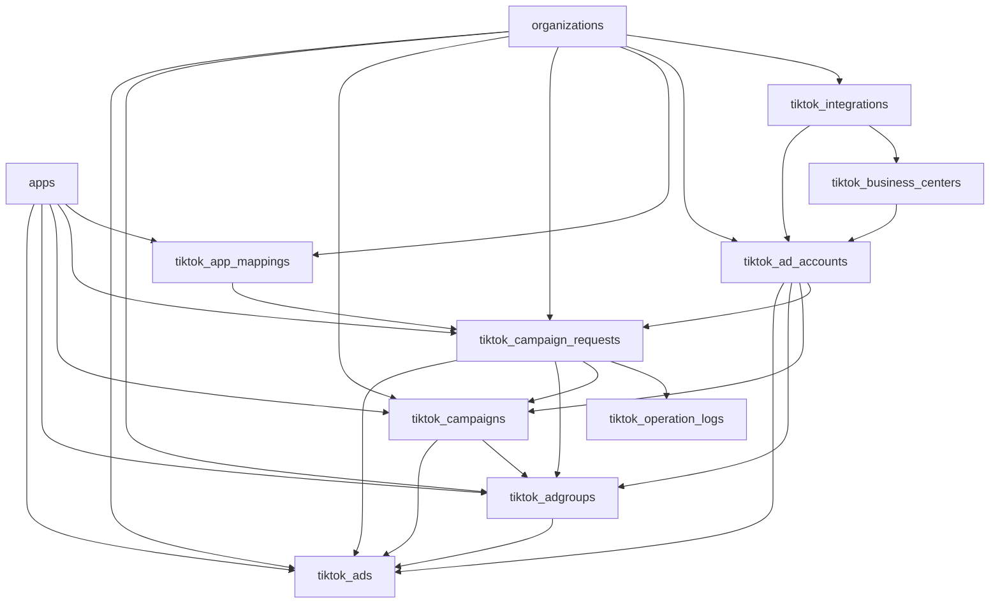

# TikTok Ads DB Design V1

## 1. Mục tiêu
- Hỗ trợ `connect TikTok integration → sync advertiser accounts → map app nội bộ → tạo campaign/adgroup/ad theo luồng approve rồi execute`.
- PostgreSQL chỉ giữ `config + auth + mapping + request lifecycle + local operational mirror + audit`.
- Chưa đưa `insights/reporting ETL`, `optimizer rules`, `budget automation` vào schema V1.
- Analytics pipeline (MinIO + StarRocks bronze/silver/gold) đã được mô tả ở Doc 130.

## 2. Phạm vi
### In scope
- Quản lý `tiktok_integrations`.
- Đồng bộ và quản lý `tiktok_ad_accounts`.
- Map `apps.id` sang cấu hình app promotion của TikTok bằng `tiktok_app_mappings`.
- Tạo request nội bộ bằng `tiktok_campaign_requests`.
- Log từng bước gọi TikTok API bằng `tiktok_operation_logs`.
- Mirror object đã tạo thành công vào `tiktok_campaigns`, `tiktok_adgroups`, `tiktok_ads`.

### Out of scope
- Daily insights tables trong PostgreSQL (dùng StarRocks — Doc 130 §7).
- ETL raw → bronze/silver/gold cho TikTok (Doc 130 §7-8).
- Rule engine tối ưu budget/CPI/ROAS tự động.
- Creative Library sync, Audience Management.

## 3. Nguyên tắc thiết kế
- Mỗi bảng TikTok đều bắt buộc có `organization_id`.
- Không tái dùng trực tiếp bảng nghiệp vụ AdMob/XMP/Meta.
- `apps.id` là FK chuẩn để tái sử dụng app catalog và app permissions hiện tại.
- Secret/token được lưu `encrypted-at-rest` bằng cột `bytea`; response API chỉ trả `hint` và cờ `Has*`.
- Mirror local không thay TikTok API làm source of truth; chỉ phục vụ UI, approval, retry và audit.

## 4. Ranh giới lưu trữ
- `PostgreSQL`: config, auth, mapping, lifecycle, audit, operational mirror.
- `MinIO`: raw request/response, raw sync payload (Doc 130 §4).
- `StarRocks`: analytics/reporting (Doc 130 §7), không thuộc migration V1.

## 5. So sánh TikTok vs Meta schema

| Khía cạnh | Meta | TikTok | Ghi chú |
|---|---|---|---|
| Integration | `meta_integrations` | `tiktok_integrations` | TikTok dùng OAuth, không có System User |
| Ad Account | `meta_ad_accounts` | `tiktok_ad_accounts` | TikTok gọi là "Advertiser" |
| Business layer | Business Manager (implicit) | `tiktok_business_centers` | TikTok có entity BC riêng |
| App Mapping | `meta_app_mappings` | `tiktok_app_mappings` | TikTok dùng `app_id` + `download_url` |
| Campaign Request | `meta_campaign_requests` | `tiktok_campaign_requests` | Cùng lifecycle |
| Operation Log | `meta_operation_logs` | `tiktok_operation_logs` | Cùng pattern |
| Mirror: Campaign | `meta_campaigns` | `tiktok_campaigns` | — |
| Mirror: Ad Set/Group | `meta_adsets` | `tiktok_adgroups` | Meta = Ad Set, TikTok = Ad Group |
| Mirror: Creative | `meta_creatives` | *(không tách riêng)* | TikTok creative inline trong Ad |
| Mirror: Ad | `meta_ads` | `tiktok_ads` | — |

## 6. ERD logic

## 7. Bảng dữ liệu

### `tiktok_integrations`
Mục đích: cấu hình 1 integration TikTok theo org. Tương đương `meta_integrations`.

Các cột chính:
- `id`, `organization_id`, `display_name`.
- `tiktok_app_id` — TikTok App ID (từ TikTok for Business Portal).
- `app_secret_encrypted`, `access_token_encrypted` — AES-256 encrypted bytea.
- `access_token_hint`, `app_secret_hint` — 4 ký tự cuối.
- `token_type` — mặc định `Bearer`.
- `scopes` (TEXT) — danh sách scope IDs, ví dụ `3,4,7,19`.
- `token_status` — `NOT_TESTED`, `VALID`, `REVOKED`, `INVALID`, `MISSING_SCOPES`.
- `last_validated_at`, `last_validation_error`.
- `authorized_advertiser_ids` (TEXT) — advertiser_ids trả về khi OAuth.
- `is_sandbox` (BOOLEAN), `is_default`, `is_enabled`, `status`.
- `created_by`, `updated_by`, `created_at`, `updated_at`.

Index/constraint:
- `ix_tiktok_integrations_organization_id`.
- Unique `ix_tiktok_integrations_org_display_name` trên `(organization_id, display_name)`.

> **Khác Meta:** TikTok access token không hết hạn cứng (no `token_expires_at`), nhưng có thể bị revoke bất kỳ lúc nào. Dùng `token_status = REVOKED` thay vì `EXPIRED`.

### `tiktok_business_centers`
Mục đích: lưu Business Center (BC) đã sync. BC tương đương Meta Business Manager.

Các cột chính:
- `id`, `organization_id`, `tiktok_integration_id`.
- `bc_id` — external TikTok BC ID.
- `bc_name`, `company_name`, `bc_type` (`SELF`, `AGENCY`).
- `status`, `last_synced_at`, `created_at`, `updated_at`.

Index: Unique `(organization_id, bc_id)`.

### `tiktok_ad_accounts`
Mục đích: advertiser account dưới một integration. Tương đương `meta_ad_accounts`.

Các cột chính:
- `id`, `organization_id`, `tiktok_integration_id`.
- `advertiser_id` — external TikTok advertiser ID.
- `bc_id` — FK nếu account thuộc BC.
- `name`, `currency`, `timezone`, `timezone_offset_minutes`.
- `balance` — snapshot cuối cùng sync.
- `status` — trạng thái TikTok (`STATUS_ENABLE`, `STATUS_DISABLE`, ...).
- `is_active`, `last_synced_at`, `created_at`, `updated_at`.

Index: Unique `(organization_id, advertiser_id)`.

### `tiktok_app_mappings`
Mục đích: map app nội bộ sang promoted object TikTok. Tương đương `meta_app_mappings`.

Các cột chính:
- `id`, `organization_id`, `app_row_id`.
- `tiktok_app_id` — App ID đã register trên TikTok.
- `download_url` — Google Play / App Store URL (tương đương Meta `object_store_url`).
- `package_name_override`, `bundle_id_override`.
- `deep_link_url_override`, `store_url_override`.
- `is_active`, audit columns.

Index: Unique `(organization_id, app_row_id)`.

### `tiktok_campaign_requests`
Mục đích: request lifecycle draft → approval → execute. Tương đương `meta_campaign_requests`.

Các cột chính:
- `id`, `organization_id`, `tiktok_ad_account_row_id`, `app_row_id`, `tiktok_app_mapping_id`.
- `campaign_name`, `objective`, `payload_json`.
- `status` — `draft|pending_approval|approved|rejected|executing|completed|failed`.
- `idempotency_key`, `validation_errors_json`, `failure_summary`, `correlation_id`.
- `requested_by`, `approved_by`, `rejected_by`, `executed_by`.
- `created_at`, `updated_at`, `submitted_at`, `approved_at`, `rejected_at`, `executed_at`, `failed_at`.

Index: Unique `(organization_id, idempotency_key)`.

### `tiktok_operation_logs`
Mục đích: audit từng bước khi execute.

Các cột chính:
- `id`, `tiktok_campaign_request_id`, `step`, `status`, `attempt_number`.
- `request_json`, `response_json`, `error_message`, `correlation_id`.
- `started_at`, `finished_at`, `created_at`.

Steps: `validation`, `campaign`, `adgroup`, `media_upload`, `ad` (4 create steps — không có `creative` object riêng như Meta, nhưng media upload là step riêng trước khi tạo ad).

### Mirror tables: `tiktok_campaigns`, `tiktok_adgroups`, `tiktok_ads`
Mục đích: local mirror object đã tạo thành công trên TikTok.

Nguyên tắc chung:
- Giữ `organization_id`, `tiktok_ad_account_row_id`, `app_row_id`, `created_from_request_id`.
- Giữ external id (`tiktok_campaign_id`, `tiktok_adgroup_id`, `tiktok_ad_id`).
- Giữ `name`, `status`, `config_json`, `last_synced_at`, timestamps.
- Unique theo `(organization_id, external_id)`.

**Khác Meta:** Không có `tiktok_creatives` riêng. Creative fields (video_id, image_ids, call_to_action) nằm trong `tiktok_ads.config_json`.

## 8. Enums (string)

### Token status
`NOT_TESTED`, `VALID`, `REVOKED`, `INVALID`, `MISSING_SCOPES`

### Request status
`draft`, `pending_approval`, `approved`, `rejected`, `executing`, `completed`, `failed`

### Operation step
`validation`, `campaign`, `adgroup`, `ad`

### Operation status
`pending`, `succeeded`, `failed`, `skipped`

### TikTok objective (V1 focus)
`APP_PROMOTION` ⭐, `WEB_CONVERSIONS`, `PRODUCT_SALES`, `REACH`, `TRAFFIC`, `VIDEO_VIEWS`, `LEAD_GENERATION`, `COMMUNITY_INTERACTION`

## 9. Mapping với hệ thống hiện tại
- `organizations`: tenant boundary.
- `apps`: app catalog, permission reuse.
- `app_permissions`: gate create/edit/execute theo app.
- `role_permissions`: thêm screen keys TikTok.
- `activity_logs`: audit thao tác user.

## 10. RBAC
Screen keys mới: `s-tiktok-accounts`, `s-tiktok-campaigns`, `s-tiktok-requests`, `s-tiktok-automation`.

Function keys V1: `view`, `create`, `edit`, `approve`, `execute`, `retry`, `disable-enable`.

## 11. Chiến lược bảo mật
- Không trả secret/token plaintext ra API response.
- Chỉ trả `HasAppSecret`, `HasAccessToken` và hint.
- Mã hóa bằng `TikTokSecretCryptoService`, key từ `TikTokAds:EncryptionKey`.
- Access token trong MinIO raw: PHẢI redact trước khi save.

## 12. Ghi chú migration
- `AddTikTokAdsV1Schema` tạo schema operational.
- `SeedTikTokAdsRolePermissions` seed quyền admin.
- Bảng `tiktok_accounts`/`tiktok_advertisers` từ Doc 130 sẽ migrate/rename sang `tiktok_integrations`/`tiktok_ad_accounts`.

## 13. Quan hệ với Doc 130
- Doc 130: Read phase (sync data về). Doc này: Write phase (tạo campaign qua approval).
- Share: `tiktok_integrations`, `tiktok_business_centers`, `tiktok_ad_accounts`.
- StarRocks tables thuộc Doc 130, không thuộc migration V1 này.
