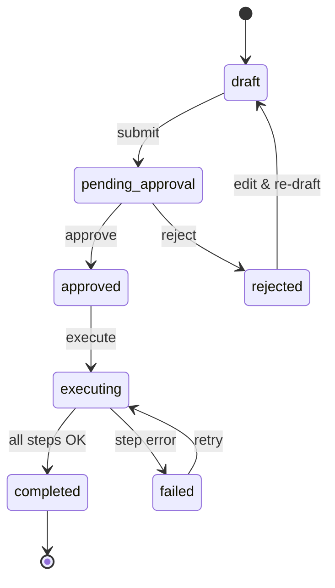
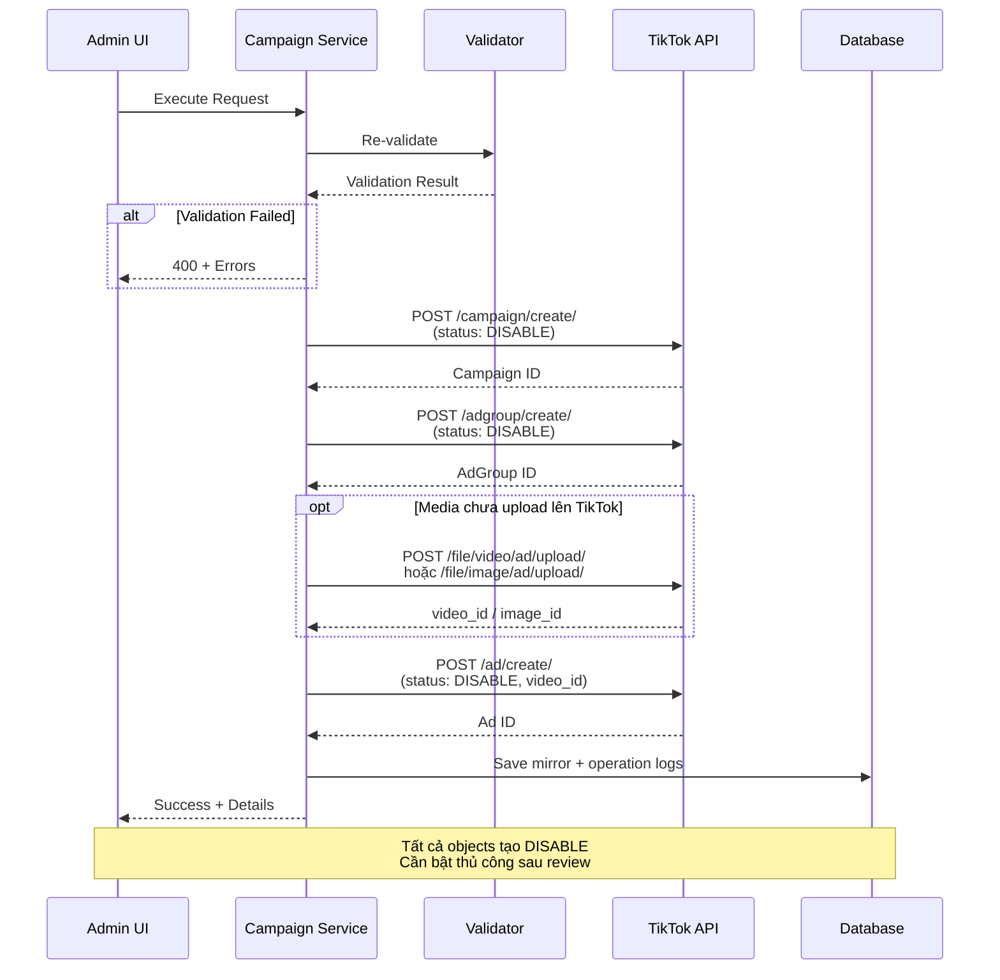

# TikTok Ads Campaign Request & Approval Flow

## 1. Mục tiêu vận hành
- UI không gọi TikTok API trực tiếp khi user bấm create.
- Backend luôn tạo `request nội bộ` trước.
- Chỉ user có quyền `approve` mới chuyển request sang trạng thái sẵn sàng execute.
- Chỉ khi `execute` mới gọi TikTok API theo thứ tự `campaign → adgroup → media upload (nếu cần) → ad`.
- Mọi object được tạo ở trạng thái `DISABLE` (TikTok dùng `DISABLE` thay vì `PAUSED` như Meta).

## 2. Phạm vi
### In scope
- Draft, validation, submit, approve, reject, execute, retry.
- Audit và operation log cho từng step.
- Mirror local object đã tạo.

### Out of scope
- Tự động optimize sau khi campaign chạy.
- Đồng bộ insights/revenue/install định kỳ (Doc 130).
- Auto-approval theo rule.

## 3. So sánh flow TikTok vs Meta

| Khía cạnh | Meta | TikTok | Ghi chú |
|---|---|---|---|
| Hierarchy | Campaign → Ad Set → Creative → Ad (4 steps) | Campaign → Ad Group → Media Upload → Ad (4 steps) | TikTok creative inline trong Ad, nhưng media upload là step riêng |
| Default status | `PAUSED` | `DISABLE` | TikTok dùng `STATUS_DISABLE` |
| Create endpoint | `POST /act_{id}/campaigns` | `POST /campaign/create/` | TikTok dùng JSON body, không path param |
| Auth header | `Authorization: Bearer {token}` | `Access-Token: {token}` | TikTok header riêng |
| Promoted object | `promoted_object.application_id` + `object_store_url` | `app_id` + `download_url` (trong ad group) | Field name khác |
| Budget unit | Cents (× 100) | Đơn vị tiền tệ thực | TikTok $50 = 50, Meta $50 = 5000000 |

## 4. Trạng thái request
- `draft`: request vừa tạo hoặc còn đang chỉnh.
- `pending_approval`: request đã submit, chờ user có quyền approve.
- `approved`: đã được duyệt, chưa gọi TikTok.
- `rejected`: bị từ chối, không execute được nếu chưa chỉnh và submit lại.
- `executing`: backend đang gọi TikTok API.
- `completed`: tạo xong đủ campaign/adgroup/ad.
- `failed`: lỗi validation hoặc lỗi ở một bước create.



## 5. Permission matrix
- `s-tiktok-requests:view`: xem danh sách/detail request.
- `s-tiktok-requests:create`: tạo draft, validate, submit.
- `s-tiktok-requests:approve`: approve hoặc reject request.
- `s-tiktok-requests:execute`: gọi TikTok API cho request approved/failed.
- `s-tiktok-requests:retry`: retry request failed.
- Ngoài RBAC, mọi thao tác liên quan app còn phải qua `app_permissions` với `PermissionLevel.View/Edit`.

## 6. Luồng chính

### Bước 1. Create draft
Input:
- `tiktok_ad_account_id`
- `app_row_id`
- `campaign`, `adgroup`, `ad` config
- `idempotency_key`

Xử lý:
- Kiểm tra user có `s-tiktok-requests:create`.
- Kiểm tra user có `Edit` trên app.
- Ghi `tiktok_campaign_requests.status = draft`.
- Gắn `payload_json` đúng business payload từ UI.

### Bước 2. Validate
Validation service kiểm tra:
- TikTok ad account (advertiser) tồn tại và đang active.
- TikTok integration tồn tại, enabled, có access token.
- Token status không phải `REVOKED`, `INVALID`, `MISSING_SCOPES`.
- App tồn tại và user có permission edit.
- TikTok app mapping tồn tại, active, có `tiktok_app_id` và `download_url`.
- Objective thuộc tập hỗ trợ V1:
  - `APP_PROMOTION`
- Phải có budget ở campaign hoặc ad group.
- Budget > 0 khi được cung cấp.
- `location_ids` (targeting country) không rỗng.
- `age_groups` hợp lệ (nếu có).
- Ad phải có ít nhất 1 trong: `videoId`, `videoAssetId`, `imageIds[]`, `imageAssetIds[]` (xem Doc 133 §5 Ad media resolution model).
- `ad.ad_name`, `adgroup.adgroup_name`, `campaign.campaign_name` không được rỗng.

Output:
- `is_valid`
- danh sách `errors`

### Bước 3. Submit for approval
Điều kiện: request đang ở `draft`.

Xử lý:
- Đổi `status = pending_approval`.
- Ghi `submitted_at`.
- Không gọi TikTok API.

### Bước 4. Approve / Reject
Approve:
- Yêu cầu quyền `approve`.
- Đổi `status = approved`, ghi `approved_by`, `approved_at`.

Reject:
- Yêu cầu quyền `approve`.
- Đổi `status = rejected`, ghi `rejected_by`, `rejected_at`, `failure_summary`.

### Bước 5. Execute
Điều kiện: request phải ở `approved` hoặc `failed`.

Xử lý tổng quát:
1. Validate draft lại trước khi gọi TikTok.
2. Nếu validation fail: `status = failed`, cập nhật errors.
3. Nếu validation pass: `status = executing`.
4. Tạo `campaign` trên TikTok (`POST /campaign/create/`), lưu mirror.
5. Tạo `adgroup` trên TikTok (`POST /adgroup/create/`), lưu mirror.
6. **Upload media** nếu cần (`POST /file/video/ad/upload/` hoặc `POST /file/image/ad/upload/`):
   - Nếu user đã cung cấp `video_id` / `image_id` có sẵn → skip step này.
   - Nếu user upload file vào Mediation Pro storage → backend upload lên TikTok tại bước này → nhận `video_id` / `image_id`.
   - Ghi operation_log step=`media_upload`.
7. Tạo `ad` trên TikTok (`POST /ad/create/`, dùng video_id/image_id từ step 6), lưu mirror.
8. Nếu thành công hết: `status = completed`, `executed_at` set.



## 7. Idempotency và retry
- Mức request: unique `(organization_id, idempotency_key)` chặn submit trùng.
- Mức execute: trước khi gọi API, service đọc mirror local theo `created_from_request_id`.
- Nếu object đã có:
  - Step tương ứng ghi log `skipped`.
  - Reuse external/local id hiện tại.
- Retry không tạo duplicate nếu TikTok đã tạo một phần trước khi request fail.

## 8. Operation logs
Mỗi step ghi một record ở `tiktok_operation_logs`:
- `step`: `validation|campaign|adgroup|media_upload|ad`
- `status`: `succeeded|failed|skipped`
- `attempt_number`
- `request_json`, `response_json`, `error_message`
- `correlation_id`
- `started_at`, `finished_at`

## 9. Payload create thực tế

### Campaign
```json
{
  "advertiser_id": "{{advertiser_id}}",
  "campaign_name": "App Install - Weather App - VN",
  "objective_type": "APP_PROMOTION",
  "budget": 500,
  "budget_mode": "BUDGET_MODE_DAY",
  "operation_status": "DISABLE"
}
```

### Ad Group
```json
{
  "advertiser_id": "{{advertiser_id}}",
  "campaign_id": "{{campaign_id}}",
  "adgroup_name": "VN - Android - 18-45",
  "placement_type": "PLACEMENT_TYPE_AUTOMATIC",
  "budget": 100,
  "budget_mode": "BUDGET_MODE_DAY",
  "schedule_type": "SCHEDULE_FROM_NOW",
  "optimization_goal": "INSTALL",
  "bid_type": "BID_TYPE_NO_BID",
  "billing_event": "OCPM",
  "app_id": "{{tiktok_app_id}}",
  "app_download_url": "https://play.google.com/store/apps/details?id=com.example",
  "operating_systems": ["ANDROID"],
  "location_ids": [1880251],
  "age_groups": ["AGE_18_24", "AGE_25_34", "AGE_35_44"],
  "gender": "GENDER_UNLIMITED",
  "operation_status": "DISABLE"
}
```

### Ad
```json
{
  "advertiser_id": "{{advertiser_id}}",
  "adgroup_id": "{{adgroup_id}}",
  "ad_name": "Weather App - Video 15s",
  "ad_format": "SINGLE_VIDEO",
  "video_id": "{{video_id}}",
  "ad_text": "Dự báo thời tiết chính xác nhất!",
  "call_to_action": "INSTALL_NOW",
  "landing_page_url": "https://play.google.com/store/apps/details?id=com.example",
  "tracking_url": "{{tracking_url}}",
  "operation_status": "DISABLE"
}
```

> **Lưu ý:** TikTok không tách `creative` thành object riêng. Video/image/text nằm trực tiếp trong Ad payload. Nếu cần reuse creative, dùng `identity_id` / `identity_type` hoặc tham chiếu `video_id` đã upload.

## 10. Failure handling
- Lỗi ở step nào thì request dừng ở step đó.
- `failure_summary` giữ lỗi cuối cùng ở request-level.
- `tiktok_operation_logs` giữ chi tiết sâu hơn cho debug.
- Retry dùng lại object đã tạo thành công trước đó.

## 11. TikTok error codes thường gặp khi create

| Code | Ý nghĩa | Xử lý |
|---|---|---|
| 0 | Success | OK |
| 40001 | Invalid params | Kiểm tra payload |
| 40002 | Unauthorized / token invalid | Disable integration, alert |
| 40100 | Auth expired / revoked | Token validation + alert |
| 40700 | Budget too low | Báo validation error |
| 40901 | Duplicate creation | Idempotency: skip step |
| 50000 | Server error | Retry with backoff |
| 50002 | Rate limit | Backoff + retry |

## 12. Audit logging
Controller ghi `activity_logs` cho các hành động:
- Tạo integration
- Cập nhật integration
- Sync advertiser accounts
- Tạo/cập nhật app mapping
- Tạo request
- Approve request
- Reject request
- Execute request
- Execute failed

## 13. Kết luận nghiệp vụ
V1 cố ý chọn luồng `internal request first, TikTok API later`. Điều này giúp:
- Tránh spend ngoài kiểm soát
- Dễ audit ai tạo/duyệt/chạy
- Hỗ trợ retry an toàn
- Chuẩn bị nền cho phase reporting/automation sau này
- Nhất quán với pattern đã triển khai thành công ở Meta Ads
