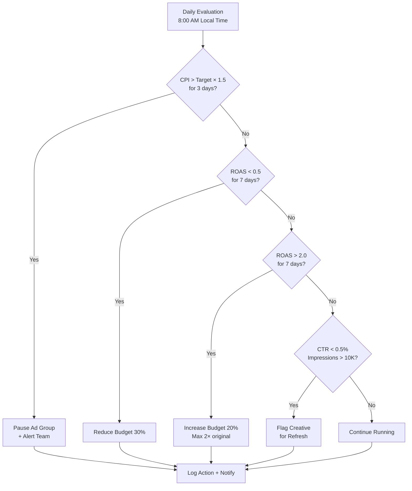

# TikTok Ads Future Analytics & Write API Roadmap

## 1. Mục tiêu tài liệu
Tài liệu này mô tả roadmap phase tiếp theo của TikTok Ads, bao gồm:
- Mở rộng analytics pipeline (đã có base ở Doc 130 §7-8).
- Thiết kế trước cho Write APIs (campaign create/update/pause).
- Optimizer rules cho TikTok campaigns.

Nội dung này không thuộc V1 PostgreSQL migration (Doc 131) hay V1 API contracts (Doc 133).

## 2. Phạm vi roadmap

> **Quy ước phase:** Tài liệu này tuân thủ phase numbering canonical trong Doc 136.
> Doc 130 (PRD gốc) dùng phase riêng — xem bảng mapping ở Doc 136.

### Phase 2 (Write/Campaign Mgmt — Doc 136 canonical)
- Write APIs: Campaign create/update/pause qua Nexus UI.
- Media upload phục vụ execute request (POST /file/video/ad/upload/, POST /file/image/ad/upload/).

> **Lưu ý:** Creative Library sync định kỳ (kéo toàn bộ video/image từ TikTok về) thuộc Phase 3+ (`tiktok-creative-sync-job`), không phải Phase 2. Phase 2 chỉ upload media khi execute request.

### Phase 3 (Optimize — Doc 136 canonical)
- **Granular reporting:** ADGROUP-level, AD-level report sync.
- **Audience report:** age/gender breakdown.
- Automated Rules qua TikTok API.
- TikTok Events API (S2S conversion tracking).
- Custom Audience sync.

## 3. Write APIs — Thiết kế trước

### 3.1 TikTok Write Endpoints cần dùng

| Endpoint | Method | Scope cần | Mục đích |
|---|---|---|---|
| `/campaign/create/` | POST | Campaign Management (Write) | Tạo campaign mới |
| `/campaign/update/status/` | POST | Campaign Management (Write) | Enable/Disable/Delete campaign |
| `/campaign/update/` | POST | Campaign Management (Write) | Sửa budget, name |
| `/adgroup/create/` | POST | Campaign Management (Write) | Tạo ad group |
| `/adgroup/update/status/` | POST | Campaign Management (Write) | Enable/Disable ad group |
| `/adgroup/update/` | POST | Campaign Management (Write) | Sửa targeting, bid, budget |
| `/ad/create/` | POST | Campaign Management (Write) | Tạo ad (với creative inline) |
| `/ad/update/status/` | POST | Campaign Management (Write) | Enable/Disable ad |
| `/file/video/ad/upload/` | POST | Creative Management | Upload video asset |
| `/file/image/ad/upload/` | POST | Creative Management | Upload image asset |

> **Lưu ý scope:** Phase 1 chỉ request scope Read. Phase 2 cần thêm scope Write — phải submit lại cho TikTok review.

### 3.2 So sánh Write flow Meta vs TikTok

| Khía cạnh | Meta | TikTok |
|---|---|---|
| Create order | Campaign → AdSet → Creative → Ad | Campaign → AdGroup → Ad |
| Creative handling | Tách riêng AdCreative object | Inline trong Ad (video_id, image_ids) |
| Status khi tạo | `PAUSED` | `DISABLE` |
| Budget update | `POST /{adset_id}` với `daily_budget` | `POST /adgroup/update/` với `budget` field |
| Pause/Enable | `POST /{id}` với `status` field | `POST /campaign/update/status/` riêng |
| Media upload | `POST /adimages` trả `image_hash` | `POST /file/video/ad/upload/` trả `video_id` |

### 3.3 Write flow đã thiết kế (Doc 132)
Flow `draft → validate → submit → approve → execute` đã sẵn sàng ở Doc 131-133. Khi implement Phase 2:
1. Bật scope Write trong TikTok App config.
2. Implement `TikTokCampaignExecutor` gọi write endpoints.
3. Mirror objects vào `tiktok_campaigns`, `tiktok_adgroups`, `tiktok_ads`.
4. Operation logs track từng step.

## 4. Analytics pipeline mở rộng

### 4.1 Raw storage trong MinIO
Đã mô tả ở Doc 130. Mở rộng thêm cho write operations:

```
raw/tiktok/{organization_id}/{date}/requests/{request_id}/campaign_create.json
raw/tiktok/{organization_id}/{date}/requests/{request_id}/adgroup_create.json
raw/tiktok/{organization_id}/{date}/requests/{request_id}/ad_create.json
raw/tiktok/{organization_id}/{date}/requests/{request_id}/media_upload.json
```

Nguyên tắc: raw request + raw response tách riêng nếu cần; metadata: `organization_id`, `integration_id`, `advertiser_id`, `request_id`, `api_version`.

### 4.2 Bronze layer mở rộng
Ngoài các bảng đã có ở Doc 130 (tiktok_advertisers, tiktok_campaigns, tiktok_adgroups, tiktok_ads, tiktok_report, tiktok_bc_transactions), thêm:

- `bronze.tiktok_audience_report` — demographics breakdown (age, gender, country từ R6).
- `bronze.tiktok_ad_level_report` — AD-level performance (R5c).

### 4.3 Silver layer mở rộng
Ngoài `silver.daily_tiktok_campaign` và `silver.dim_tiktok_campaign_app` (Doc 130):

- `silver.daily_tiktok_adgroup` — ADGROUP-level clean metrics.
- `silver.daily_tiktok_ad` — AD-level clean metrics.
- `silver.tiktok_audience_demographics` — age/gender/country breakdown.
- `silver.tiktok_creative_performance` — video/image performance by ad.

### 4.4 Gold layer
Đã có `gold.fact_campaign_roi` mở rộng với `source='tiktok'` (Doc 130 §7.3). Thêm:

- `gold.fact_adgroup_performance` — granular adgroup metrics (cho optimizer).
- `gold.fact_creative_performance` — creative-level metrics (cho creative refresh alerts).

## 5. Optimizer rules cho TikTok

### 5.1 Decision tree (tương đương Meta §6.1)



### 5.2 Metrics target cho TikTok Vietnam market

| Metric | Formula | Target | Alert Threshold |
|---|---|---|---|
| CPI | Spend / Installs (MMP) | < $0.25 | > $0.40 |
| CTR | Clicks / Impressions × 100 | > 1.0% | < 0.3% |
| CVR | Conversions / Clicks × 100 | > 5% | < 2% |
| ROAS | Revenue / Spend | > 1.5 | < 0.5 |

> **Lưu ý:** Installs phải lấy từ MMP (Adjust/AppsFlyer), KHÔNG từ `real_time_app_install` của TikTok (Doc 130 §10).

### 5.3 So sánh thresholds Meta vs TikTok

| Metric | Meta Target | TikTok Target | Ghi chú |
|---|---|---|---|
| CPI | < $0.30 | < $0.25 | TikTok thường rẻ hơn Meta ở SEA |
| CTR | > 1.5% | > 1.0% | TikTok CTR thấp hơn do video-first |
| ROAS | > 1.5 | > 1.5 | Target giống nhau |

## 6. Scheduler roadmap

### 6.1 Jobs hiện có (Doc 130)
- `tiktok-structure-sync-job`: Daily 00:40
- `tiktok-report-sync-daily-job`: Daily 02:45
- `tiktok-report-sync-recent-job`: Mỗi 2h
- `tiktok-bc-sync-job`: Daily 00:50
- `tiktok-token-validation-job`: Daily 06:00

### 6.2 Jobs mới cho Phase 3 (Granular Reporting + Optimizer)
- `tiktok-adgroup-report-sync-job`: Daily 03:00, ADGROUP-level
- `tiktok-ad-report-sync-job`: Daily 03:30, AD-level
- `tiktok-audience-report-sync-job`: Daily 04:00, demographics
- `tiktok-optimizer-daily-job`: Daily 08:00, evaluate rules

### 6.3 Jobs mới cho Phase 3+ (Automation)
- `tiktok-creative-sync-job`: Daily, sync video/image library
- `tiktok-audience-sync-job`: Weekly, sync custom audiences
- `tiktok-auto-rule-execution-job`: Mỗi 4h, execute approved auto rules

## 7. `tiktok_sync_runs` — khi nào thêm
Chỉ thêm khi bắt đầu build analytics runtime sync thật. Bảng lưu:
- `organization_id`, `integration_id`, `advertiser_id`
- `entity_type`, `time_window_start`, `time_window_end`
- `status`, `attempt_count`, `last_error`
- `started_at`, `finished_at`, `raw_object_count`

## 8. Kết luận
- PostgreSQL V1 (Doc 131) + API Contracts V1 (Doc 133) đã đủ cho write/request flow.
- Read/Sync phase đã có ở Doc 130.
- Future analytics (granular reporting, audience, creative) nên đi thẳng vào MinIO + StarRocks (không thêm bảng report ở PostgreSQL) — thuộc Phase 3 canonical.
- Optimizer rules nên dùng cùng engine với Meta, chỉ thay config/thresholds riêng cho TikTok.
