# 135 - TIKTOK ADS USER MANUAL

## Phase 2 Implementation Notes

Phase 2 adds the in-app TikTok admin screens under `TikTok Ads`:

- `Dashboard`: read-only spend, trend, campaign performance, discrepancy.
- `Integrations`: create TikTok App integration, store masked secret/token, start OAuth, test token, sync advertiser accounts.
- `Ad Accounts`: view synced advertiser accounts, status, balance, currency, timezone.
- `App Mappings`: map Mediation Pro app rows to TikTok App ID and download URL.
- `Requests`: create campaign request drafts, submit, approve/reject, execute/retry with dry-run by default.
- `Campaigns`: local mirror landing page for synced/request-created TikTok campaigns.

Safe execution default:

- `TikTokAds:WriteEnabled=false` keeps request execution in dry-run mode.
- Dry-run validates and returns payload preview, but does not call TikTok write APIs.
- Live write should only be enabled after TikTok approves create/upload scopes and ops confirms credentials.

Operational checklist:

1. Create integration with `App ID` and `Secret`.
2. Run OAuth from `TikTok Ads > Integrations`.
3. Test token until status is `VALID`.
4. Sync advertiser accounts from the integration.
5. Create app mapping with internal `appRowId`, TikTok App ID, and download URL.
6. Create request draft from `TikTok Ads > Requests`.
7. Validate, submit, approve, then execute dry-run.
8. Enable `TikTokAds:WriteEnabled=true` only when TikTok write scope is approved.

## Tổng quan

Tài liệu này hướng dẫn team vận hành sử dụng module `TikTok Ads` trong Mediation Pro theo flow thực tế, từ setup integration đến tạo request, execute, và monitor campaign live.

Mục tiêu của flow này:
- Dùng `OAuth access token` đúng cách cho production
- Đồng bộ `Advertiser Accounts` từ TikTok thay vì nhập tay
- Map app nội bộ với TikTok app đúng nghiệp vụ thực tế
- Tạo request qua quy trình `draft → submit → approve → execute`
- Monitor campaign/ad group/ad sau khi đã sync về hệ thống

## Screen Map

| Screen | Mục đích | Khi nào dùng |
|---|---|---|
| `Integrations` | Cấu hình kết nối TikTok App | Setup ban đầu, test token, kiểm tra token health |
| `Ad Accounts` | Xem advertiser account đã sync từ integration | Sau khi integration hợp lệ và cần chọn account để chạy ads |
| `App Mappings` | Map app nội bộ với TikTok app identity | Trước khi tạo request app promotion |
| `Requests` | Tạo, submit, approve, execute request | Khi cần tạo campaign mới qua quy trình có kiểm soát |
| `Campaigns` | Monitor campaign đã tồn tại trên TikTok | Sau khi campaign đã có trên TikTok hoặc cần sync để xem drilldown |

## End-to-End Flow

```mermaid
flowchart LR
    A["1. Create Integration"] --> B["2. Test Connection"]
    B --> C["3. Sync Advertiser Accounts"]
    C --> D["4. Build App Mappings"]
    D --> E["5. Create Request"]
    E --> F["6. Validate and Submit"]
    F --> G["7. Approve"]
    G --> H["8. Execute"]
    H --> I["9. Monitor Live Campaigns"]
```

## Trước khi bắt đầu

Cần có đầy đủ các điều kiện sau:
- Đã có `TikTok for Business` account và `TikTok App` hợp lệ trên portal
- Đã thực hiện OAuth flow và lấy được access token
- App cần chạy ads đã tồn tại trong Mediation Pro
- App cần map đã register trên TikTok (qua TikTok app management)

Lưu ý quan trọng:
- TikTok dùng **OAuth access token** — không có System User concept như Meta
- Access token **không hết hạn cứng** nhưng có thể bị **revoke** bất kỳ lúc nào
- Auth header là `Access-Token: {token}` (KHÔNG phải `Authorization: Bearer`)

## Step 1 — Create Integration

Vào `TikTok Ads > Integrations`.

### Mục tiêu
Tạo kết nối TikTok App an toàn cho backend gọi TikTok Marketing API.

### Các trường chính
- `Display Name`: tên để ops nhận diện integration
- `TikTok App ID`: lấy từ TikTok for Business Portal → App Management
- `App Secret`: secret key của TikTok App
- `Access Token`: token chính để backend gọi API
- `Scopes`: danh sách scope IDs đã approved (thường là `3,4,7,19`)
- `Is Sandbox`: bật cho môi trường test

### Quy tắc vận hành
- OAuth là mode duy nhất cho TikTok (khác Meta có System User)
- Access token lấy qua OAuth consent flow
- Nếu advertiser revoke quyền → token sẽ invalid → cần re-auth

### Action đúng
1. Bấm `Create Integration`
2. Điền thông tin app/token
3. Bấm `Test Connection`
4. Kiểm tra:
   - `Token Status` = `VALID`
   - `Authorized Advertiser IDs` hiển thị đúng
   - Scopes đủ
5. Nếu pass, save integration

### Kết quả mong đợi
- `Token Status = VALID`
- Có thể sync advertiser accounts từ integration đó

## Step 2 — Sync Advertiser Accounts

Vào `TikTok Ads > Ad Accounts`.

### Mục tiêu
Đồng bộ danh sách `Advertiser Account` từ integration về Mediation Pro.

### Quy tắc nghiệp vụ
- Danh sách account phải đi từ `Sync from Integration`
- Không dùng flow `Add Account` thủ công
- `Advertiser ID`, currency, timezone, balance là thông tin để ops đối chiếu với TikTok

### Các bước
1. Chọn integration đang `VALID`
2. Bấm `Sync from Integration`
3. Kiểm tra bảng account đã cập nhật
4. Dùng filter theo Advertiser ID, BC ID, hoặc search theo tên

### Khi nào cần sync lại
- Vừa cấp quyền business/advertiser trên TikTok
- Vừa tạo advertiser mới
- Vừa thay đổi asset access trong Business Center

> **Khác Meta:** TikTok sync trả về cả `balance` (số dư tài khoản). Nếu account prepaid, dùng field này để monitor ngân sách còn lại.

## Step 3 — Build App Mappings

Vào `TikTok Ads > App Mappings`.

### Mục tiêu
Nối `internal app` trong Mediation Pro với `TikTok App ID + download URL` để backend build được ad group khi execute.

### Quy tắc nghiệp vụ
- `Add Mapping` không tạo app mới trên TikTok
- `TikTok App ID` phải là app đã register trên TikTok platform
- `Download URL` phải là Google Play / App Store URL hợp lệ

### Tạo mapping thủ công
1. Vào tab `App Mappings`
2. Bấm `Add Mapping`
3. Chọn app nội bộ
4. Nhập:
   - `TikTok App ID` — lấy từ TikTok for Business → App Management
   - `Download URL` — URL store chính thức
   - Override fields nếu thật sự cần
5. Save mapping

### Ý nghĩa các field override
- `Store URL Override`: fallback URL cho `app_download_url`
- `Deep Link URL Override`: fallback cho ad landing page
- `Package Name Override` / `Bundle ID Override`: dự phòng khi metadata không khớp

### Đối với app mới
Nếu app mới chưa từng chạy ads:
- Ops phải tạo/register app ở phía TikTok trước
- Sau đó về Mediation Pro để map
- Khi mapping xong, app mới xuất hiện trong `Create Request`

## Step 4 — Create Request

Vào `TikTok Ads > Requests > Create`.

### Mục tiêu
Tạo request nội bộ để qua approval flow trước khi backend gọi TikTok API.

### Quy tắc nghiệp vụ quan trọng
- Request không gọi TikTok API ngay khi user bấm save/submit
- TikTok API chỉ được gọi khi request được `Approve` và `Execute`
- Dropdown app được filter theo `Advertiser Account` đã chọn
- Nếu app không hiện ra, thường là do chưa map hoặc account đó không advertise app đó

### Thứ tự thao tác đúng
1. Chọn `Advertiser Account`
2. Chọn `App`
3. Điền `Campaign` — name, objective (`APP_PROMOTION`), budget
4. Điền `Ad Group` — targeting, placement, bid, schedule
5. Điền `Ad` — video/image, ad text, call to action
6. Bấm `Save Draft` nếu chưa xong
7. Bấm `Validate`
8. Bấm `Submit`

### Ad formats hỗ trợ hiện tại

| Format | Khi nào dùng |
|---|---|
| `SINGLE_VIDEO` | Quảng cáo video đơn (phổ biến nhất TikTok) |
| `SINGLE_IMAGE` | Quảng cáo 1 ảnh tĩnh |
| `CAROUSEL` | Nhiều card hình ảnh |

> **Khác Meta:** TikTok là nền tảng video-first, `SINGLE_VIDEO` là format phổ biến nhất. Meta có thêm `EXISTING_POST` reuse Facebook post — TikTok không có concept này.

### Media upload
- Video/image upload vào Mediation Pro storage trước
- Chưa upload lên TikTok ở bước save draft
- Chỉ tới bước `Execute` backend mới upload asset lên TikTok

### Ad Group naming
`Ad Group Name` có chế độ auto-generate theo country, age, gender, placement.

## Step 5 — Approve và Execute

Vào `TikTok Ads > Requests` hoặc `Request Detail`.

### Flow trạng thái
- `draft`
- `pending_approval`
- `approved`
- `executing`
- `completed`
- `failed`

### Approval
User có quyền `approve` sẽ:
1. Mở request detail
2. Review payload và validation
3. Chọn `Approve` hoặc `Reject`

### Execute
User có quyền `execute` sẽ:
1. Mở request đã `approved`
2. Bấm `Execute Request`
3. Backend tạo trên TikTok theo thứ tự:
   - Campaign
   - Ad Group
   - Ad
4. Mọi object được tạo ở trạng thái `DISABLE`

> **Khác Meta (4 steps):** TikTok chỉ có 3 steps — không có Creative riêng. Creative (video/image) nằm inline trong Ad.

### Retry
Nếu request `failed`:
- Bấm `Retry`
- Hệ thống reuse object đã tạo thành công trước đó
- Không tạo duplicate

## Step 6 — Monitor Live Campaigns

Vào `TikTok Ads > Campaigns`.

### Mục tiêu
Xem campaign đã tồn tại trên TikTok, sync về DB nội bộ để filter nhanh và drilldown.

### Màn list
- Xem `Campaign`, `Advertiser Account`, `App`
- Xem `Objective`, `Status`, `Last Synced`
- Filter theo account, app, objective, status

### Sync from TikTok
Dùng khi cần cập nhật dữ liệu mới nhất từ TikTok.
- Sync campaign/ad group/ad về local DB
- Có thể partial sync nếu TikTok rate limit

## Step 7 — Campaign Detail và Drilldown

Vào `Campaign Detail` từ list `Campaigns`.

### Tab hiện có
- `Ad Groups`
- `Ads`

### Các action quan trọng
- `Sync This Campaign`: sync lại duy nhất campaign hiện tại
- `View JSON` ở ad: xem raw ad payload đã sync

### Lưu ý nghiệp vụ
- TikTok không có Creative object riêng (khác Meta)
- Creative info (video, image, text) nằm trong Ad detail
- Drilldown đến Ad level để xem creative configuration

## Common Operator Flows

### Flow A — Chạy ads cho app mới
1. Tạo app trong Mediation Pro
2. Register app trên TikTok for Business
3. Tạo `Integration` nếu chưa có
4. `Sync Advertiser Accounts`
5. Tạo `App Mapping` (TikTok App ID + Download URL)
6. Vào `Create Request`
7. Chọn account và app đã map
8. Submit → approve → execute

### Flow B — App đã từng chạy trên TikTok, muốn map
1. `Sync Advertiser Accounts`
2. Vào `App Mappings`
3. `Add Mapping` thủ công (nhập TikTok App ID)
4. Quay lại `Create Request`

### Flow C — Chỉ muốn monitor campaign đã có sẵn
1. Vào `Campaigns`
2. Bấm `Sync from TikTok`
3. Filter theo account/app/status
4. Mở `Campaign Detail`
5. Review ad groups, ads

## Troubleshooting

### 1. Token test pass nhưng sync account vẫn fail
Nguyên nhân thường gặp:
- Token hợp lệ nhưng advertiser chưa được authorize trong OAuth consent
- Business Center chưa assign đúng advertiser cho app

Xử lý:
- Kiểm tra `authorized_advertiser_ids` trong integration detail
- Kiểm tra BC asset assignment
- Chạy lại OAuth flow nếu cần thêm advertiser

### 2. App không hiện trong Create Request
Nguyên nhân:
- Chưa có `App Mapping`
- Mapping có nhưng `tiktok_app_id` không đúng
- Account đang chọn không advertise app đó

Xử lý:
- Kiểm tra `App Mappings`
- Verify `TikTok App ID` đúng với app đã register trên TikTok
- Đổi account khác nếu cần

### 3. Execute failed ở bước Ad Group
Nguyên nhân thường gặp:
- `location_ids` không hợp lệ (TikTok dùng location ID, không phải country code)
- `optimization_goal` không tương thích với `objective_type`
- Budget thấp hơn minimum của TikTok

Xử lý:
- Kiểm tra `tiktok_operation_logs` cho error detail
- Verify location_ids với TikTok reference data
- Tăng budget nếu dưới minimum ($20/day thường là min)

### 4. Token bị revoke bất ngờ
TikTok access token có thể bị revoke khi:
- Advertiser thu hồi quyền từ TikTok Business Center
- TikTok App bị disable
- Admin TikTok revoke authorization

Xử lý:
- Hệ thống daily validation job sẽ detect và alert qua Telegram
- Cần re-authorize qua OAuth flow
- Không tự khôi phục được — cần action thủ công

### 5. Campaign tạo thành công nhưng không thấy trên TikTok Ads Manager
Đây là behavior đúng ban đầu:
- Campaign tạo ở trạng thái `DISABLE`
- Cần bật `ENABLE` thủ công trên TikTok Ads Manager hoặc qua API Phase 2

## Quick Checklist For Ops

### Trước khi tạo request
- Integration `VALID`
- Advertiser Account đã sync
- App đã map (có TikTok App ID + Download URL)
- Chọn đúng account
- Video/image đã upload

### Trước khi approve
- Validation không còn lỗi blocking
- App mapping đúng app cần chạy
- Targeting (location, age, gender) đã review
- Budget đúng kế hoạch
- Ad creative đã review

### Sau khi execute
- Request `completed`
- Created objects có đủ campaign/adgroup/ad
- Campaign có thể xem lại ở `Campaigns`
- Bật campaign trên TikTok Ads Manager khi sẵn sàng

## Operator Notes

- Dùng OAuth cho production — TikTok không có System User token như Meta
- Token không hết hạn cứng nhưng CÓ THỂ bị revoke — monitor daily
- Dùng `Sync from Integration` làm source of truth cho advertiser list
- App mapping là lớp business logic nội bộ của Mediation Pro, không phải object tạo bởi TikTok API
- Request flow tồn tại để kiểm soát spend và audit
- TikTok budget dùng đơn vị tiền tệ thực (Meta dùng cents × 100) — cẩn thận khi điền
- TikTok creative (video/image) inline trong Ad — không có màn Creative riêng như Meta
