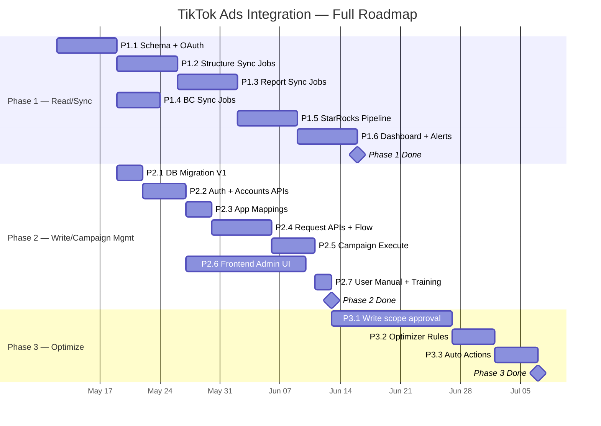
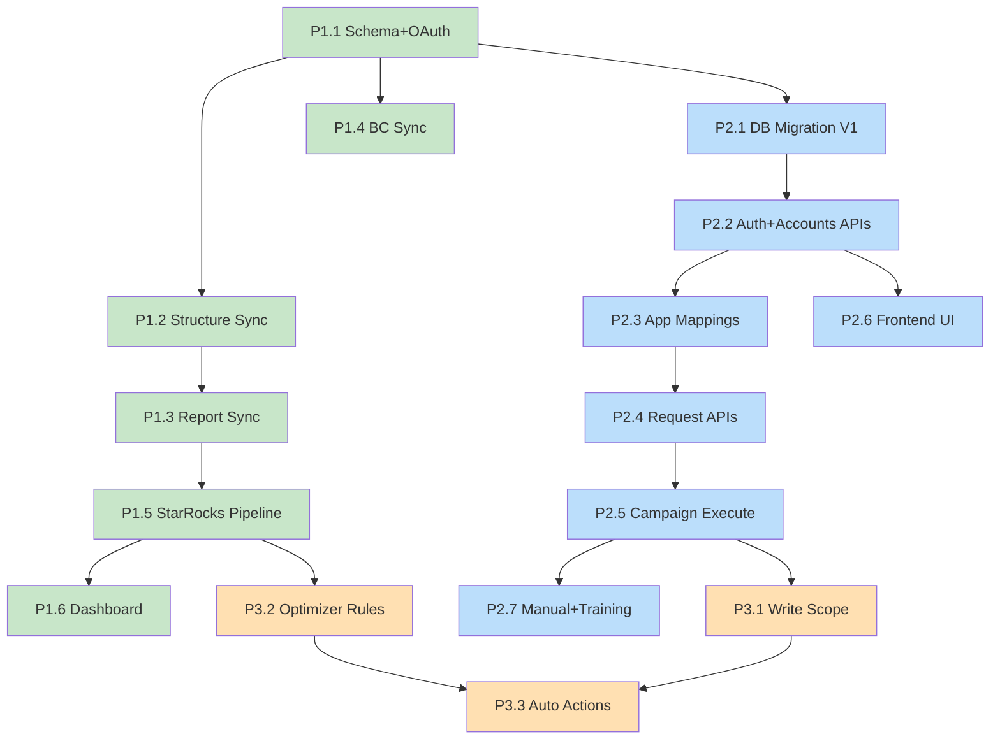

# 136 - TIKTOK ADS IMPLEMENTATION PHASES & AGENT PROMPTS

**Trạng thái:** Planning  
**Ngày:** May 2026  
**Mục đích:** Hướng dẫn thứ tự implement TikTok Ads integration, kèm prompt template cho AI agents thực thi từng task.

## ⚠️ Quy ước Phase giữa các tài liệu

> Doc 130 (PRD gốc) dùng phase numbering riêng: Phase 1 = Read, Phase 2+ = Write/Audience/Creative, Phase 3 = Automated Rules.
> **Tài liệu này (Doc 136) thống nhất lại thành 3 phases rõ ràng hơn để agent dễ thực thi:**

| Doc 136 (canonical) | Doc 130 (PRD gốc) | Nội dung |
|---|---|---|
| **Phase 1 — Read/Sync** | Phase 1 (MVP) | OAuth, structure sync, report sync (campaign-level), BC, StarRocks, dashboard |
| **Phase 2 — Write/Campaign Mgmt** | Phase 2+ (Write APIs) | DB schema write, API contracts, request flow, execute, frontend admin |
| **Phase 3 — Optimize** | Phase 3 (Automated Rules) | Optimizer rules, auto budget/pause, granular reporting (adgroup/ad level) |

> **Khi đọc Doc 130 và thấy "Phase 2+" hoặc "Phase 3" → map sang bảng trên.**

## Schema Naming Convention (Canonical — Doc 131)

> Doc 130 dùng tên cũ (`tiktok_accounts`, `tiktok_advertisers`). Từ đây trở đi, **tất cả code mới dùng tên canonical theo Doc 131:**

| Doc 130 (cũ) | Doc 131 (canonical) | Lý do |
|---|---|---|
| `tiktok_accounts` | `tiktok_integrations` | Nhất quán với `meta_integrations` |
| `tiktok_advertisers` | `tiktok_ad_accounts` | Nhất quán với `meta_ad_accounts` |
| `tiktok_business_centers` | `tiktok_business_centers` | Giữ nguyên |

> Migration P1.1 tạo bảng với tên canonical. Nếu đã deploy tên cũ → P2.1 sẽ rename.

---

# TỔNG QUAN 3 PHASES



---

# PHASE 1 — READ/SYNC

**Tài liệu gốc:** `docs/Tiktok/130_-_TikTok_Marketing_BM_API_Integration.md`  
**Mục tiêu:** Kéo toàn bộ data TikTok (structure + reports + BC) về MinIO + StarRocks, hiển thị trên dashboard.

## P1.1 — Schema PostgreSQL + OAuth Flow

**Docs:** Doc 130 §3, §6 + Doc 131 (canonical naming)  
**Effort:** 1 tuần  
**Output:** Migration deployed, OAuth working, 1 account connected

**Dependencies:** Không  
**Deliverables:**
- Migration `tiktok_integrations`, `tiktok_business_centers`, `tiktok_ad_accounts` *(tên canonical theo Doc 131)*
- OAuth callback endpoint
- Token encryption (AES-256)
- Token validation job (daily)
- Postman collection cho Auth

### Agent Prompt P1.1

```
## Context
Dự án Amobear Nexus (.NET 8, PostgreSQL, Hangfire). Tham khảo:
- `docs/Tiktok/130_-_TikTok_Marketing_BM_API_Integration.md` §3 (Auth), §6 (PostgreSQL schema)
- `docs/Tiktok/131-TIKTOK-ADS-DB-DESIGN-V1.md` §7 (canonical schema names)
- Pattern đã có: `backend/MediationPro.Infrastructure/Meta/` cho Meta Ads integration

## Schema Naming (QUAN TRỌNG)
Doc 130 dùng tên cũ. Dùng tên canonical theo Doc 131:
- `tiktok_integrations` (KHÔNG phải tiktok_accounts)
- `tiktok_ad_accounts` (KHÔNG phải tiktok_advertisers)
- `tiktok_business_centers` (giữ nguyên)

## Task
1. Tạo EF Core migration `AddTikTokReadSchema` với 3 bảng:
   - `tiktok_integrations` (tiktok_app_id, app_secret_encrypted, access_token_encrypted, scopes, is_sandbox, token_status, last_validated_at)
   - `tiktok_business_centers` (bc_id, bc_name, company_name, bc_type)
   - `tiktok_ad_accounts` (advertiser_id, name, currency, timezone, balance, status)
2. Tạo `TikTokCryptoService` mã hóa token (tham khảo `MetaSecretCryptoService`)
3. Tạo `TikTokOAuthService` với:
   - `GetAuthorizeUrl(redirectUri, state)` → build TikTok OAuth URL
   - `ExchangeCodeAsync(authCode)` → POST /oauth2/access_token/, lưu encrypted token
4. Tạo `TikTokTokenValidationJob` (Hangfire daily) gọi GET /advertiser/info/ kiểm tra token
5. TikTok API base: `https://business-api.tiktok.com/open_api/v1.3`
6. Auth header: `Access-Token: {token}` (KHÔNG Bearer)

## Constraints
- Không commit secrets vào code
- Token phải encrypted-at-rest
- Tuân thủ organization_id scoping
- Dùng tên bảng canonical theo Doc 131, KHÔNG dùng tên cũ trong Doc 130
```

---

## P1.2 — Structure Sync Jobs (R1-R4)

**Docs:** Doc 130 §4.2  
**Effort:** 1 tuần  
**Dependencies:** P1.1  
**Output:** 4 endpoints synced daily, data trong MinIO + StarRocks Bronze

### Agent Prompt P1.2

```
## Context
Dự án Amobear Nexus. TikTok OAuth đã hoạt động (P1.1 done).
- Doc 130 §4.2 (Structure endpoints), §8 (Sync jobs pattern)
- Pattern: 5-bước (Start → Fetch API → Save MinIO → Insert StarRocks Bronze → Complete)
- Tham khảo job pattern hiện có trong `backend/MediationPro.Jobs/`

## Task
Tạo `TikTokStructureSyncJob` (Hangfire, cron `0 40 0 * * *` UTC+7):
1. R1: GET /advertiser/info/ — sync metadata cho mỗi advertiser
2. R2: GET /campaign/get/ — sync campaigns (page_size=1000, pagination)
3. R3: GET /adgroup/get/ — sync ad groups
4. R4: GET /ad/get/ — sync ads

Cho mỗi endpoint:
- Save raw JSON → MinIO `raw/tiktok/{endpoint}/YYYY/MM/DD/*.json.gz`
- Parse → Insert StarRocks Bronze tables (bronze.tiktok_campaigns, etc.)
- TikTok pagination: `page` param (1-indexed), check `page_info.total_page`

## Technical
- Rate limit: Token bucket 8 req/s (Standard 10 QPS, safety 20%)
- Parallel per advertiser (max 5), sequential per endpoint
- StarRocks insert: Stream Load
- Redact access_token khỏi raw_json trước khi save MinIO
```

---

## P1.3 — Report Sync Jobs (R5-R7)

**Docs:** Doc 130 §4.3-4.4  
**Effort:** 1 tuần  
**Dependencies:** P1.2  
**Output:** Daily + Recent report sync, async backfill

> **Scope MVP (Phase 1):** Chỉ build **AUCTION_CAMPAIGN** level. ADGROUP/AD level reporting defer sang Phase 3 (Doc 134 §6.2). Doc 130 §4.3.1 có đề cập ADGROUP/AD nhưng đó là thiết kế cho full scope, không phải MVP.

### Agent Prompt P1.3

```
## Context
Structure sync đã hoạt động. Cần sync performance reports.
- Doc 130 §4.3 (Report endpoint), §7.1 (bronze.tiktok_report)
- Endpoint: POST /report/integrated/get/
- Anti-double-counting: Doc 130 §10

## MVP Scope
Phase 1 CHỈ build AUCTION_CAMPAIGN level.
AUCTION_ADGROUP và AUCTION_AD level → Phase 3 (Doc 134 §6.2).

## Task
1. `TikTokReportSyncDailyJob` (cron `0 45 2 * * *`):
   - report_type=BASIC, data_level=AUCTION_CAMPAIGN (CHỈ campaign level cho MVP)
   - dimensions: campaign_id, stat_time_day
   - metrics: spend, impressions, clicks, conversion, cost_per_conversion, cpm, cpc, ctr, real_time_app_install
   - Date range: T-5 → T-1
   - Save → MinIO + bronze.tiktok_report

2. `TikTokReportSyncRecentJob` (cron `0 0 */2 * * *`):
   - Cùng config nhưng T-1 → T-2

3. `TikTokBackfillJob` (manual trigger):
   - Cho date range > 30 ngày → dùng async: POST /report/task/create/ → poll /report/task/check/ → GET /report/task/get/

## Key Rule
- `real_time_app_install` CHỈ dùng cross-validation, KHÔNG đưa vào Gold installs
- Max 30 ngày/request cho sync report, > 30 ngày phải async
- Max 20 metrics/request
- bronze.tiktok_report thiết kế sẵn columns cho ADGROUP/AD level (nullable) nhưng Phase 1 chỉ populate campaign level
```

---

## P1.4 — BC Sync Jobs (R8-R11)

**Docs:** Doc 130 §5  
**Effort:** 5 ngày  
**Dependencies:** P1.1  
**Output:** BC data, transactions, balance alerting

### Agent Prompt P1.4

```
## Context
- Doc 130 §5 (BC API endpoints)
- Tạo `TikTokBCSyncJob` (cron `0 50 0 * * *`)

## Task
1. R8: GET /bc/get/ — list Business Centers
2. R9: GET /bc/advertiser/get/ — advertisers trong BC
3. R10: GET /bc/transaction/get/ — transactions (T-7 → T-1)
4. R11: GET /bc/advertiser/balance/get/ — balance (chạy mỗi 4h)

Save → MinIO + StarRocks Bronze (bronze.tiktok_bc_transactions).
Alert Telegram khi balance < $500.
```

---

## P1.5 — StarRocks Bronze/Silver/Gold Pipeline

**Docs:** Doc 130 §7  
**Effort:** 1 tuần  
**Dependencies:** P1.3  
**Output:** Silver/Gold tables populated, fact_campaign_roi extended

### Agent Prompt P1.5

```
## Context
Bronze tables đã có data. Cần build Silver + Gold layers.
- Doc 130 §7.2 (Silver), §7.3 (Gold)
- Anti-double-counting: Doc 130 §10

## Task
1. Silver:
   - `silver.dim_tiktok_campaign_app` — resolve campaign → app_id
   - `silver.daily_tiktok_campaign` — clean/dedup từ bronze.tiktok_report (AUCTION_CAMPAIGN)

2. Gold:
   - Mở rộng `gold.fact_campaign_roi` thêm column `source` (default 'meta')
   - Insert TikTok rows với source='tiktok'
   - cost từ silver.daily_tiktok_campaign
   - installs từ MMP (Adjust/AppsFlyer) — KHÔNG từ tt_reported_installs

3. Anti-double-counting tests (SQL):
   - Không duplicate (date, source, campaign_id)
   - ua_cost = SUM spend cross sources
   - TikTok vs MMP install drift < 15%
```

---

## P1.6 — Dashboard + Alerts

**Docs:** Doc 130 §9  
**Effort:** 1 tuần  
**Dependencies:** P1.5  
**Output:** UA Dashboard TikTok tab, alert rules

### Agent Prompt P1.6

```
## Context
Gold tables có data. Cần dashboard cho UA team.
- Doc 130 §9.1 (Dashboard layout), §9.2 (Alert rules)
- Frontend: Grafana/Superset đọc StarRocks Gold

## Task
1. Dashboard TikTok Tab:
   - KPI cards: Total Spend, Active Campaigns, Avg ROAS D7, Account Balance
   - Campaign Performance Table: Campaign | App | Spend | Installs(MMP) | CPI | ROAS | Status
   - Charts: Spend trend 30d, ROAS by country, TikTok vs MMP install discrepancy

2. Alert Rules:
   - Token revoked → Critical (Telegram + Email)
   - Balance < $500 → High (Telegram)
   - Spend spike > 2x avg_7d → Medium
   - ROAS crash < 50% avg_7d → High
   - Install discrepancy > 20% → Medium
```

---

# PHASE 2 — WRITE/CAMPAIGN MANAGEMENT

**Tài liệu gốc:** `docs/Tiktok/131-*.md`, `132-*.md`, `133-*.md`, `135-*.md`  
**Mục tiêu:** Tạo campaign TikTok từ Nexus UI qua approval flow.  
**Bắt đầu song song với Phase 1 từ khi P1.1 xong.**

## P2.1 — DB Migration V1 (Write phase)

**Docs:** Doc 131  
**Effort:** 3 ngày  
**Dependencies:** P1.1

### Agent Prompt P2.1

```
## Context
Tham khảo: docs/Tiktok/131-TIKTOK-ADS-DB-DESIGN-V1.md
Pattern Meta: backend EF Core migrations cho meta_* tables

## Task
Tạo migration `AddTikTokAdsV1Schema`:
1. **Nếu legacy tables tồn tại** (`tiktok_accounts`, `tiktok_advertisers` từ Doc 130 cũ) → rename sang canonical names (`tiktok_integrations`, `tiktok_ad_accounts`) và ALTER thêm columns mới (display_name, token_status, hints, is_default, etc.)
2. **Nếu canonical tables đã tồn tại** (P1.1 đã tạo `tiktok_integrations`, `tiktok_ad_accounts`) → ALTER TABLE thêm columns cho write phase (nếu chưa có)
3. Tạo `tiktok_app_mappings` (app_row_id, tiktok_app_id, download_url, overrides)
4. Tạo `tiktok_campaign_requests` (status lifecycle, payload_json, idempotency_key, approval fields)
5. Tạo `tiktok_operation_logs` (step, status, attempt, request/response json)
6. Tạo mirror: `tiktok_campaigns`, `tiktok_adgroups`, `tiktok_ads`
7. Tạo migration `SeedTikTokAdsRolePermissions`:
   - Screen keys: s-tiktok-accounts, s-tiktok-campaigns, s-tiktok-requests, s-tiktok-automation
   - Function keys: view, create, edit, approve, execute, retry, disable-enable

Tham khảo ERD trong Doc 131 §6. Mọi bảng có organization_id.
```

---

## P2.2 — Auth + Accounts APIs

**Docs:** Doc 133 §4.1-4.2  
**Effort:** 5 ngày  
**Dependencies:** P2.1

### Agent Prompt P2.2

```
## Context
Tham khảo: docs/Tiktok/133-TIKTOK-ADS-API-CONTRACTS-V1.md §4.1-4.2
Pattern: backend/MediationPro.Api/Controllers/Meta/ (MetaAuthController, MetaAccountsController)

## Task
1. `TikTokAuthController` (api/v1/tiktok-auth):
   - GET /integrations/{id}/authorize-url → OAuth redirect URL
   - POST /integrations/{id}/callback → exchange auth_code
   - POST /integrations/test → test draft credentials
   - POST /integrations/{id}/test → test persisted integration
   - GET /integrations/{id}/token-status

2. `TikTokAccountsController` (api/v1/tiktok-accounts):
   - Integration CRUD: GET/POST/PUT /integrations, enable/disable
   - POST /integrations/{id}/sync-ad-accounts → gọi TikTok API sync advertisers
   - Ad account: GET/POST/PUT /ad-accounts, enable/disable
   - App mapping: GET/POST/PUT /app-mappings, enable/disable

3. DTOs: TikTokIntegrationDto (KHÔNG trả plaintext token, chỉ hasAccessToken + hint)
4. Permissions: s-tiktok-accounts:view|create|edit|disable-enable
5. Connection test: gọi /advertiser/info/, verify scopes, normalize errors
```

---

## P2.3 — App Mappings

**Docs:** Doc 133 §4.2 (app-mappings), Doc 131 §7 (tiktok_app_mappings)  
**Effort:** 3 ngày  
**Dependencies:** P2.2

### Agent Prompt P2.3

```
## Context
Tham khảo: Doc 131 §7 (tiktok_app_mappings), Doc 133 §4.2
Pattern: MetaAppMappings service/controller

## Task
1. `TikTokAppMappingService`:
   - CRUD cho tiktok_app_mappings
   - Validate: app tồn tại, tiktok_app_id + download_url bắt buộc
   - Enable/disable mapping

2. API endpoints (đã define ở P2.2, implement logic):
   - GET /app-mappings → list active mappings
   - POST /app-mappings → create mapping (cần app-level edit permission)
   - PUT /app-mappings/{id} → update
   - POST /app-mappings/{id}/enable|disable

3. DTO: TikTokAppMappingDto (appRowId, tiktokAppId, downloadUrl, overrides, isActive)
```

---

## P2.4 — Reference + Campaign Request APIs

**Docs:** Doc 133 §4.3-4.4, Doc 132  
**Effort:** 7 ngày  
**Dependencies:** P2.3

### Agent Prompt P2.4

```
## Context
Tham khảo: Doc 132 (Approval Flow), Doc 133 §4.3-4.4
Pattern: MetaReferenceController, MetaCampaignRequestsController

## Task
1. `TikTokReferenceController` (api/v1/tiktok-reference):
   - GET /create-campaign → trả reference data cho UI form:
     - adAccounts, appMappings, objectives, placementTypes, bidTypes, optimizationGoals

2. `TikTokCampaignRequestsController` (api/v1/tiktok-campaign-requests):
   - GET / → list requests
   - GET /{id} → detail (include operation logs)
   - POST / → create draft
   - PUT /{id} → update draft
   - POST /{id}/validate → chạy validation rules
   - POST /{id}/submit → draft → pending_approval
   - POST /{id}/approve → approved
   - POST /{id}/reject → rejected
   - POST /{id}/execute → gọi TikTok API
   - POST /{id}/retry → retry failed request

3. `TikTokCampaignValidationService`:
   - Ad account active, integration enabled, token VALID
   - App mapping exists, has tiktok_app_id + download_url
   - Objective = APP_PROMOTION (V1)
   - Budget > 0, location_ids not empty
   - Ad has videoId OR videoAssetId OR imageIds OR imageAssetIds (see Doc 133 §5), name not empty

4. Permissions: s-tiktok-requests:view|create|approve|execute|retry
```

---

## P2.5 — Campaign Execute Flow (bao gồm Media Upload)

**Docs:** Doc 132 §5-7  
**Effort:** 5 ngày  
**Dependencies:** P2.4

### Agent Prompt P2.5

```
## Context
Tham khảo: Doc 132 (Execute flow, idempotency, error codes)
Pattern: MetaCampaignExecutor

## Task
1. `TikTokCampaignExecutor` — 4 steps (KHÔNG phải 3):
   - Re-validate trước khi gọi API
   - Step 1: POST /campaign/create/ (status=DISABLE) → save mirror tiktok_campaigns
   - Step 2: POST /adgroup/create/ (status=DISABLE) → save mirror tiktok_adgroups
   - Step 3: MEDIA UPLOAD (nếu có video/image chưa upload lên TikTok):
     - Video: POST /file/video/ad/upload/ → trả video_id
     - Image: POST /file/image/ad/upload/ → trả image_id
     - Nếu video_id/image_id đã có sẵn (user cung cấp) → skip step này
     - Ghi operation_log step=media_upload
   - Step 4: POST /ad/create/ (status=DISABLE, dùng video_id/image_id từ step 3) → save mirror tiktok_ads
   - Mỗi step ghi tiktok_operation_logs

2. Idempotency:
   - Trước mỗi step, check mirror table theo created_from_request_id
   - Nếu object đã có → skip step, reuse ID
   - Media upload: check resolved video_id/image_id(s) đã tồn tại → skip
   - Retry an toàn, không tạo duplicate

3. Error handling:
   - Lỗi ở step nào → dừng, status=failed, ghi failure_summary
   - TikTok errors: 40001 (invalid params), 40002 (unauthorized), 40100 (token revoked), 50002 (rate limit)
   - Media upload errors: file too large, format not supported → fail với message rõ
   - Rate limit: exponential backoff 2s/4s/8s/16s, max 4 retries

4. TikTok API specifics:
   - Auth header: Access-Token: {token}
   - Budget = đơn vị tiền thực (không nhân 100 như Meta)
   - All objects created with operation_status=DISABLE
   - Media upload endpoint khác base URL: có thể cần multipart/form-data
```

---

## P2.6 — Frontend Admin UI

**Docs:** Doc 135 (User Manual), Doc 133 (API contracts)  
**Effort:** 2 tuần  
**Dependencies:** P2.2 (APIs ready)  
**Bắt đầu song song với P2.3-P2.5**

### Agent Prompt P2.6

```
## Context
Tham khảo: Doc 135 (User Manual — screen map, flows), Doc 133 (API contracts)
Frontend: React + Refine (headless mode), pattern từ Meta Ads screens
5 màn hình cần tạo.

## Task
1. Integrations Screen:
   - List integrations, create/edit form
   - Test Connection button → gọi POST /tiktok-auth/integrations/{id}/test
   - Token status badge (VALID/REVOKED/INVALID)
   - Sync Ad Accounts button

2. Ad Accounts Screen:
   - List advertiser accounts synced
   - Filter: advertiser ID, BC, search
   - Enable/disable toggle
   - Hiển thị balance, currency, timezone

3. App Mappings Screen:
   - List mappings, create/edit form
   - Dropdown chọn internal app
   - Fields: TikTok App ID, Download URL, overrides
   - Enable/disable toggle

4. Requests Screen:
   - List requests với status badges
   - Create form: chọn account → app → campaign config → adgroup targeting → ad creative
   - Detail view: payload, validation errors, operation logs
   - Action buttons: Validate, Submit, Approve, Reject, Execute, Retry (theo permission)

5. Campaigns Screen:
   - List campaigns synced
   - Filter: account, app, objective, status
   - Campaign detail: tabs Ad Groups, Ads
   - Sync from TikTok button

## UX Notes
- Request form phức tạp nhất — tham khảo Meta Create Request UI
- TikTok video-first: ưu tiên video upload trong Ad form
- Budget hiển thị đơn vị tiền thực (không cents)
```

---

## P2.7 — User Manual + Ops Training

**Docs:** Doc 135  
**Effort:** 2 ngày  
**Dependencies:** P2.5, P2.6

```
Cập nhật Doc 135 với screenshots thực tế.
Training ops team theo 7-step flow trong Doc 135.
```

---

# PHASE 3 — OPTIMIZE

**Tài liệu gốc:** `docs/Tiktok/134-TIKTOK-ADS-FUTURE-ANALYTICS-ROADMAP.md`  
**Bắt đầu sau Phase 2 done + TikTok approve Write scope.**

## P3.1 — Write Scope Approval (2 tuần chờ)

```
Submit TikTok App để approve scope Campaign Management (Write) + Creative Management.
Trong lúc chờ, chuẩn bị optimizer rule config.
```

## P3.2 — Optimizer Rules

**Docs:** Doc 134 §5

### Agent Prompt P3.2

```
## Context
Tham khảo: Doc 134 §5 (Optimizer rules, decision tree)
Pattern: Meta optimizer engine đã có

## Task
1. TikTok optimizer decision tree:
   - CPI > Target × 1.5 (3 days) → Pause Ad Group
   - ROAS < 0.5 (7 days) → Reduce Budget 30%
   - ROAS > 2.0 (7 days) → Increase Budget 20%
   - CTR < 0.3% (10K+ impressions) → Flag Creative Refresh

2. `TikTokOptimizerDailyJob` (cron 08:00):
   - Query Gold metrics per adgroup
   - Evaluate rules
   - Log recommended actions
   - Phase 3.3 mới auto-execute

3. Target metrics (VN market):
   - CPI < $0.25, CTR > 1.0%, ROAS > 1.5
```

## P3.3 — Auto Actions

**Docs:** Doc 134 §5

```
Khi Write scope approved:
- Implement POST /campaign/update/status/ (enable/disable)
- Implement POST /adgroup/update/ (budget changes)
- Auto-execute optimizer recommendations
- Approval workflow cho auto-rules (semi-auto mode)
```

---

# DEPENDENCY MAP



# QUY TẮC KHI DÙNG AGENT PROMPTS

1. **Luôn đọc tài liệu gốc trước** — prompt chỉ là summary, doc có chi tiết đầy đủ hơn
2. **Tham khảo pattern Meta** — mọi module TikTok đều có tương đương Meta đã implement
3. **Không skip dependency** — mỗi task có prerequisite rõ ràng
4. **Test trước khi chuyển task** — mỗi task có exit criteria
5. **Giữ anti-double-counting** — rule quan trọng nhất ở Doc 130 §10
