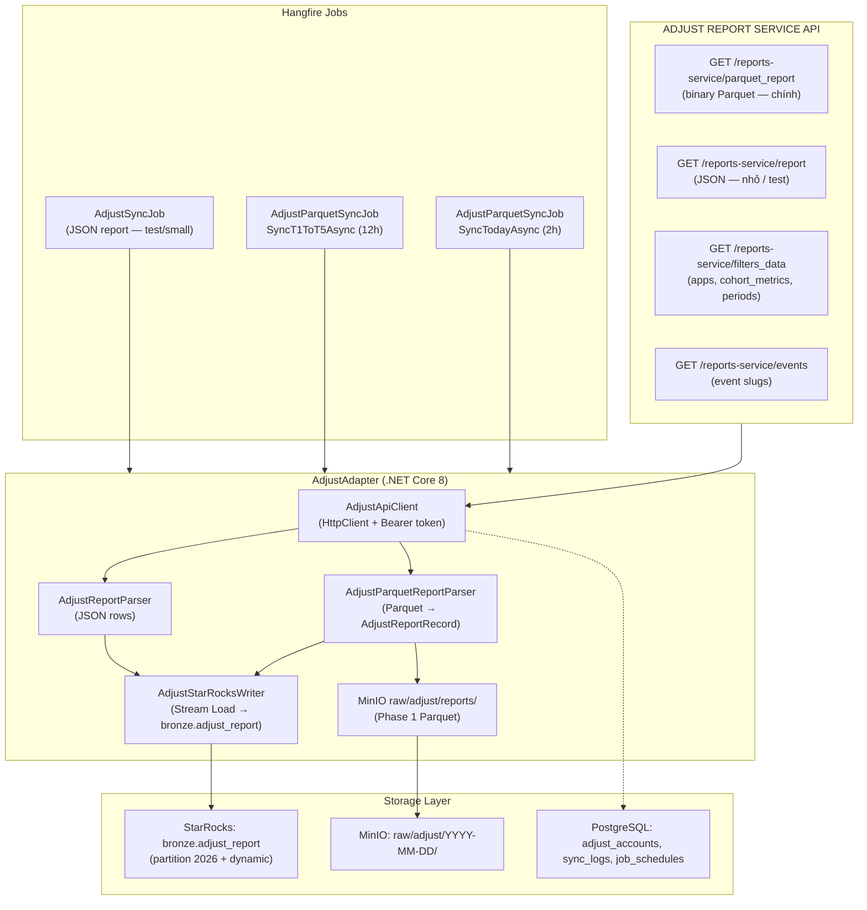

# Adjust Report Service API — Integration Guide for Mediation Pro

> **Mục đích tài liệu này:** Mô tả Report Service API, Parquet sync, cohort (`d{n}`), `filters_data`, và mapping code (`AdjustApiClient`, `AdjustParquetMetricGroups`, `AdjustMetricCategory`). Đồng bộ với [doc 119](../119%20-%20ADJUST%20REPORT%20SERVICE%20API%20PARQUET%20SYNC.md) (v1.1) và [doc 115](../115%20-%20DATA%20CONTEXT%20FOR%20AI%20ASSISTANT.md) (v1.5).

## 0. Liên hệ với Data Context (doc 115)

Adjust trong kiến trúc Amobear được xác định là **nguồn Attribution / Reference (MMP)** — không thay thế doanh thu/cost chính. Cần thống nhất với [docs/115 - DATA CONTEXT FOR AI ASSISTANT.md](../115%20-%20DATA%20CONTEXT%20FOR%20AI%20ASSISTANT.md):

| Hạng mục | Chi tiết |
|----------|----------|
| **Vai trò** | Nguồn tham khảo: revenue, cost, installs theo ad network (MMP). Dùng cho cross-validation, ROAS, phân loại chi phí theo network. |
| **Bronze** | `bronze.adjust_report` — raw từ Report Service API. Join với `dim_app_identifiers.adjust_app_token` để map sang app. |
| **Silver** | `silver.adjust_daily_metrics` — chuẩn hóa với `app_id = admob_app_id` (map từ adjust_app_token qua dim_app_identifiers). Feed vào `gold.fact_campaign_roi` (source = adjust). |
| **app_id** | Mọi bảng Silver/Gold dùng **admob_app_id** (vd: `ca-app-pub-xxx~yyy`). Adjust dùng `app_token`; cần mapping qua `dim_app_identifiers`. |
| **Anti-duplication** | Ad revenue primary = AdMob + AppLovin; Adjust ad_revenue chỉ cross-check. UA cost primary = XMP; Adjust network_cost dùng theo campaign/network. Installs attributed = Adjust. |

---

## 1. Tổng quan kiến trúc



---

## 2. Authentication & lưu tài khoản (PostgreSQL)

- **Type:** Bearer Token (API Key — không expire)
- **Header:** `Authorization: Bearer {ADJUST_API_TOKEN}`
- **Lưu trữ:** Giống AdMob/AppLovin — **tài khoản Adjust lưu trong PostgreSQL** (bảng `adjust_accounts`), không chỉ config file. Mỗi record: ApiToken, BaseUrl, DisplayName, IsDefault, Enabled. Token lấy từ Adjust Dashboard → Account Settings → My Profile → API Token, nhập vào UI quản lý Data Accounts (hoặc seed DB).
- **Config fallback:** Có thể đọc `Adjust:ApiToken` từ `appsettings.json` / secrets cho môi trường dev nếu chưa có record trong DB.

### 2.1 Danh sách app & khám phá filter — `filters_data`

- **`filters_data` là endpoint Report Service dùng cho nhiều loại filter**, không chỉ app: `apps`, `dimensions`, `cohort_metrics`, `full_cohort_periods`, `cohort_metric_names`, … Xem [Filters data endpoint](https://dev.adjust.com/en/api/rs-api/filters-data).
- **Danh sách app (khuyến nghị):** `GET .../filters_data?required_filters=apps` — response `{ "apps": [ { "id", "name", "short_name", "default_store_app_id", "currency", "platforms" } ] }` (`id` = app token cho `app_token__in`). Trong code: `AdjustApiClient.GetAppsAsync`. App Automation `apps/list` có thể **403** tùy quyền.
- **Khi gặp lỗi `Unsupported metric` với cohort:** gọi `required_filters=cohort_metrics,full_cohort_periods,cohort_metric_names` (có thể thêm `section=retention`) để lấy đúng **API Metric ID** và token chu kỳ cho tài khoản. Trong code: `IAdjustApiClient.GetFiltersDataRawAsync`.
- **Lưu PostgreSQL:** `adjust_apps` + sync `silver.dim_app_identifiers.adjust_id` (JOIN `bronze.adjust_report.app_token = dim_app_identifiers.adjust_id`).
- **Chunk:** tối đa **~25–100 app/request** cho `parquet_report` (config `Adjust:ParquetAppsPerChunk`); delay giữa chunk / nhóm metric để tránh 429.

---

## 3. API Endpoints

### Base URL
```
https://automate.adjust.com
```

**Tài liệu API chính thức:** [Adjust Developer Hub — Report service API](https://dev.adjust.com/en/api/rs-api)  
- [Parquet report endpoint](https://dev.adjust.com/en/api/rs-api/parquet/) (đồng bộ production — doc 119)  
- [JSON report endpoint](https://dev.adjust.com/en/api/rs-api/reports/)  
- [Filters data endpoint](https://dev.adjust.com/en/api/rs-api/filters-data)  
- [Pivot report endpoint](https://dev.adjust.com/en/api/rs-api/pivot/)  

### 3.1 JSON Report (main endpoint)

```
GET /reports-service/report
```

**Query Parameters (bắt buộc: `app_token__in`, `date_period`, `dimensions`, `metrics`):**

| Parameter | Type | Required | Description |
|-----------|------|----------|-------------|
| `app_token__in` | string | ✅ | Comma-separated app tokens. **Khuyến nghị:** tối đa 100 app/request để tránh timeout — xem §2.1. |
| `date_period` | string | ✅ | Absolute: `YYYY-MM-DD:YYYY-MM-DD`. Relative: `yesterday`, `last_7_days`, `-10d:-3d` (10 ngày trước đến 3 ngày trước). Logical: `this_month_until_yesterday`. |
| `dimensions` | string | ✅ | Comma-separated. See Section 4. |
| `metrics` | string | ✅ | Comma-separated KPIs. Danh sách đầy đủ: [Datascape metrics glossary](https://help.adjust.com/en/article/datascape-metrics-glossary) hoặc Filters Data endpoint. |
| `currency` | string | — | `USD` (default), `EUR`, `local` |
| `ad_spend_mode` | string | — | `network` (recommended), `adjust`, hoặc `mixed` |
| `attribution_types` | string | — | Comma-separated: `click`, `engaged_ad`, `impression`. Bỏ qua = tất cả. |
| `attribution_source` | string | — | `dynamic` (default) hoặc `first` |
| `reattributed` | string | — | `true` \| `false` \| `all` (default) — filter reattributed users |
| `cohort_maturity` | string | — | `mature` \| `immature` — cho cumulative cohort metrics |
| `iap_revenue_mode` | string | — | `GROSS_60`, `GROSS_70`, `GROSS_85`, `GROSS_100` |
| `sort` | string | — | Sort by metrics/dimensions; dùng `-` cho descending (vd: `-clicks,day`) |
| `utc_offset` | string | — | Timezone report (vd: `+07:00`) |

**Example cURL:**
```bash
curl -L -X GET \
  'https://automate.adjust.com/reports-service/report?app_token__in=abc123,def456&date_period=2025-02-20:2025-02-25&dimensions=day,app,app_token,country,os_name&metrics=installs,sessions,revenue,ad_revenue,impressions,clicks&currency=USD&ad_spend_mode=network' \
  -H 'Authorization: Bearer YOUR_API_TOKEN'
```

**Response JSON:**
```json
{
  "rows": [
    {
      "attr_dependency": {},
      "day": "2025-02-20",
      "app": "Amobear Android",
      "app_token": "abc123",
      "country": "US",
      "os_name": "android",
      "installs": 1234,
      "sessions": 45678,
      "revenue": 123.45,
      "ad_revenue": 98.76,
      "impressions": 50000,
      "clicks": 1200
    }
  ],
  "totals": {
    "installs": 1234,
    "revenue": 123.45
  },
  "warnings": []
}
```

### 3.2 Filters Data

```
GET /reports-service/filters_data?required_filters={comma-separated}
```

| `required_filters` (ví dụ) | Mục đích |
|----------------------------|----------|
| `apps` | Danh sách app → `app_token__in` |
| `dimensions` | Dimension hợp lệ |
| `cohort_metrics` | Slug metric cohort (theo glossary) |
| `full_cohort_periods` | Token chu kỳ (`d0`, `d7`, …) |
| `cohort_metric_names` | Tên hiển thị |

Tham số tùy chọn: `section=retention`, `cohort_metrics__contains=...` (xem doc Adjust). **Code:** `GetFiltersDataRawAsync(account, requiredFilters, extraQueryParameters?)`.

### 3.3 Parquet report (đồng bộ chính)

```
GET /reports-service/parquet_report
```

Cùng bộ filter cốt lõi như JSON report (`app_token__in`, `date_period`, `dimensions`, `metrics`, `utc_offset`, `ad_spend_mode`, `attribution_source`, `cohort_maturity`, …). Response: **binary Parquet** (`Accept: application/octet-stream`). **Code:** `FetchParquetReportAsync` trong `AdjustApiClient`. Luồng 2 pha: Phase 1 lưu raw vào MinIO `raw/adjust/reports/{yyyy-MM-dd}/`; Phase 2 parse + merge + StarRocks — chi tiết [doc 119](../119%20-%20ADJUST%20REPORT%20SERVICE%20API%20PARQUET%20SYNC.md).

### 3.4 Events

```
GET /reports-service/events?app_token__in={tokens}
```

Lấy slug của custom events để dùng làm metrics trong report.

---

## 4. Dimensions & Metrics

### Dimensions (dùng cho Mediation Pro)

| Dimension | Description |
|-----------|-------------|
| `day` | Date (YYYY-MM-DD) |
| `app` | App name |
| `app_token` | App token — **bắt buộc để join với Postgres apps table** |
| `country` | ISO-2 country code |
| `os_name` | `android`, `ios` |
| `partner_name` | Ad network name (AdMob, Meta AN, AppLovin…) |
| `campaign` | Campaign name |
| `adgroup` | Ad group name |
| `creative` | Creative name |
| `device_type` | `phone`, `tablet` |
| `store_type` | `google_play`, `itunes` |

### Metrics (dùng cho Mediation Pro)

| Metric | Description |
|--------|-------------|
| `installs` | Adjust-attributed installs |
| `sessions` | Session count |
| `revenue` | In-app purchase revenue (IAP) |
| `ad_revenue` | Ad revenue aggregated from networks |
| `impressions` | Ad impressions (alias: `ad_impressions`) |
| `clicks` | Ad clicks |
| `ad_ecpm` | Effective CPM |
| `network_cost` | UA spend reported by ad network |
| `network_installs` | Installs counted by ad network |
| `network_ecpi` | Effective CPI from network |
| `dau` | Daily Active Users |
| `mau` | Monthly Active Users |
| `cohort_revenue_d0`, `cohort_revenue_d7`, … | Cumulative cohort revenue — **chu kỳ theo Adjust là `d{số}`** (vd. `d0`, `d120`), không phải `0d`, `7d` |
| `revenue_total_per_user_d7`, `lifetime_value_iap_d30`, … | Cumulative cohort — slug đầy đủ `{base}_d{n}`; base lấy từ [Datascape metrics glossary](https://help.adjust.com/en/article/datascape-metrics-glossary) |

#### Cohort — đặt tên API & cột Parquet

- Trong [Datascape metrics glossary](https://help.adjust.com/en/article/datascape-metrics-glossary), công thức thường viết `{base}_{cohort_period}` với token kiểu **`d0`, `d7`, `d120`** (tuần/tháng: `w4`, `m12`, …).
- **Ví dụ:** `retention_rate_d7`, `revenue_total_per_user_d30`, `roas_iap_d90` (non-cumulative vs cumulative theo bảng glossary; code map trong `AdjustParquetMetricGroups` + `AdjustMetricCategory`).
- **Phân loại vào JSON Bronze:** `AdjustMetricCategory` bóc hậu tố `_d{n}` / `_w{n}` / `_m{n}` (và tương thích thêm `_7d` nếu gặp) rồi tra **tập base** cố định → `cohort_metrics_json` (cumulative) / `cohort_non_cumulative_metrics_json` — không suy đoán theo chuỗi con ngẫu nhiên.
- **Nhóm metric request:** `AdjustParquetMetricGroups` — `GetAllGroups` / `GetCoreGroups` / `GetUAGroups` (UA: conversion + cohort non-cum/cum + ad spend + revenue; chu kỳ ngày cấu hình trong mã, mặc định D0, D3, D7, …, D120). Cấu hình job: `Adjust:ParquetMetricGroups` = `all` \| `core` \| `ua` (job hiện có thể hard-code nhóm UA — xem `AdjustParquetSyncJob`).

> ⚠️ **Lưu ý quan trọng (thống nhất với doc 115 — Anti-duplication):**
> - `ad_revenue` từ Adjust là **aggregated từ mediation platforms** (MAX, AdMob) gửi về Adjust. **Không dùng làm primary revenue** — primary = AdMob + AppLovin; Adjust ad_revenue chỉ dùng để **cross-validation**.
> - **UA cost:** Primary = XMP; Adjust `network_cost` dùng theo campaign/network trong `gold.fact_campaign_roi`.
> - **Installs:** Adjust (attributed) là nguồn chính cho UA; Firebase first_open không dùng cho UA.
> - **Khuyến nghị:** Dùng Adjust cho **UA analytics** (installs, cost by network, ROAS), validation revenue, và feed vào `gold.fact_campaign_roi`.

---

## 5. StarRocks Schema

> **Schema đang chạy trên production** (Parquet sync): bảng **JSON theo nhóm** (`conversion_metrics_json`, `cohort_metrics_json`, `cohort_non_cumulative_metrics_json`, …) + cột dimension cố định — xem [doc 119](../119%20-%20ADJUST%20REPORT%20SERVICE%20API%20PARQUET%20SYNC.md) §4 và [doc 115](../115%20-%20DATA%20CONTEXT%20FOR%20AI%20ASSISTANT.md) §2.6.  
> DDL dưới đây là **mẫu legacy** (cột phẳng); cohort trong Adjust thực tế dùng hậu tố **`_d{n}`**.

### Table: `bronze.adjust_report`

- **Partition:** Tạo sẵn partition cho năm 2026 và bật **dynamic partition** để tự động tạo partition mới khi thiếu (theo ngày). Tránh full scan và timeout khi query/DELETE theo `date`.

```sql
CREATE TABLE IF NOT EXISTS bronze.adjust_report (
    date            DATE            NOT NULL COMMENT 'Report date',
    app_token       VARCHAR(64)     NOT NULL COMMENT 'Adjust app token — join dim_app_identifiers',
    app_name        VARCHAR(512)    COMMENT 'App display name from Adjust',
    country         VARCHAR(8)      COMMENT 'ISO-2 country code',
    os_name         VARCHAR(32)     COMMENT 'android / ios',
    partner_name    VARCHAR(256)    COMMENT 'Ad network name (populated when dimension=partner_name)',
    campaign        VARCHAR(512)    COMMENT 'Campaign name (populated when dimension=campaign)',
    
    -- UA metrics
    installs        BIGINT          DEFAULT 0,
    reinstalls      BIGINT          DEFAULT 0,
    reattributions  BIGINT          DEFAULT 0,
    sessions        BIGINT          DEFAULT 0,
    dau             BIGINT          DEFAULT 0,
    mau             BIGINT          DEFAULT 0,
    
    -- Revenue metrics
    revenue         DECIMAL(18,6)   DEFAULT 0,
    ad_revenue      DECIMAL(18,6)   DEFAULT 0,
    impressions     BIGINT          DEFAULT 0,
    clicks          BIGINT          DEFAULT 0,
    ad_ecpm         DECIMAL(18,6)   DEFAULT 0,
    
    -- UA cost metrics
    network_cost        DECIMAL(18,6)   DEFAULT 0,
    network_installs    BIGINT          DEFAULT 0,
    network_ecpi        DECIMAL(18,6)   DEFAULT 0,
    
    -- Cohort metrics (optional — ví dụ phẳng; production dùng JSON + tên cột dạng cohort_revenue_d0)
    cohort_revenue_d0   DECIMAL(18,6)   DEFAULT 0,
    cohort_revenue_d7   DECIMAL(18,6)   DEFAULT 0,
    cohort_revenue_d30  DECIMAL(18,6)   DEFAULT 0,
    
    currency        VARCHAR(8)      DEFAULT 'USD',
    _source_file    VARCHAR(512)    COMMENT 'MinIO path of raw JSON',
    _synced_at      DATETIME        DEFAULT CURRENT_TIMESTAMP
)
ENGINE = OLAP
PRIMARY KEY (date, app_token, country, os_name, partner_name, campaign)
PARTITION BY RANGE(date) (
    PARTITION p2026_01 VALUES LESS THAN ("2026-02-01"),
    PARTITION p2026_02 VALUES LESS THAN ("2026-03-01"),
    PARTITION p2026_03 VALUES LESS THAN ("2026-04-01"),
    PARTITION p2026_04 VALUES LESS THAN ("2026-05-01"),
    PARTITION p2026_05 VALUES LESS THAN ("2026-06-01"),
    PARTITION p2026_06 VALUES LESS THAN ("2026-07-01"),
    PARTITION p2026_07 VALUES LESS THAN ("2026-08-01"),
    PARTITION p2026_08 VALUES LESS THAN ("2026-09-01"),
    PARTITION p2026_09 VALUES LESS THAN ("2026-10-01"),
    PARTITION p2026_10 VALUES LESS THAN ("2026-11-01"),
    PARTITION p2026_11 VALUES LESS THAN ("2026-12-01"),
    PARTITION p2026_12 VALUES LESS THAN ("2027-01-01"),
    PARTITION p_default VALUES LESS THAN ("2020-01-01")
)
DISTRIBUTED BY HASH(app_token) BUCKETS 4
PROPERTIES (
    "replication_num" = "1",
    "dynamic_partition.enable" = "true",
    "dynamic_partition.time_unit" = "DAY",
    "dynamic_partition.start" = "-90",
    "dynamic_partition.end" = "60",
    "dynamic_partition.prefix" = "p",
    "dynamic_partition.buckets" = "4"
);
```

> **Lưu ý:** Partition được tạo sẵn cho 2026; partition mới (vd. 2027) sẽ tự động tạo nhờ `dynamic_partition`. `partner_name` và `campaign` có thể empty string `''` — nằm trong primary key để tránh duplicate khi chạy report với dimension khác nhau.

### Silver: `silver.adjust_daily_metrics` (thống nhất với doc 115)

Chuẩn hóa từ `bronze.adjust_report` + map **app_id = admob_app_id** qua `silver.dim_app_identifiers` (cột `adjust_app_token`). Toàn bộ Silver/Gold trong hệ thống dùng `admob_app_id`; view/table này feed vào `gold.fact_campaign_roi` (source = adjust).

```sql
-- silver.adjust_daily_metrics (planned): JOIN dim_app_identifiers ON d.adjust_id = ar.app_token → app_id = admob_app_id.
-- Bronze Parquet: metrics nằm trong các cột JSON; cohort keys kiểu revenue_total_per_user_d7 → parse từ cohort_metrics_json.
-- Xem doc 115 §3.9.
```

> **Lưu ý:** `dim_app_identifiers` phải có cột `adjust_app_token` (và `admob_app_id`) — xem doc 115 Section 5.3. Các bảng Silver/Gold khác đều dùng `app_id = admob_app_id` để JOIN với fact_daily_app_metrics, fact_campaign_roi.

---

## 6. Model Classes (.NET)

```csharp
// Models/AdjustReportRecord.cs
public class AdjustReportRecord
{
    public DateTime Date { get; set; }
    public string AppToken { get; set; } = string.Empty;
    public string AppName { get; set; } = string.Empty;
    public string Country { get; set; } = string.Empty;
    public string OsName { get; set; } = string.Empty;
    public string PartnerName { get; set; } = string.Empty;
    public string Campaign { get; set; } = string.Empty;

    // UA
    public long Installs { get; set; }
    public long Reinstalls { get; set; }
    public long Reattributions { get; set; }
    public long Sessions { get; set; }
    public long Dau { get; set; }
    public long Mau { get; set; }

    // Revenue
    public decimal Revenue { get; set; }
    public decimal AdRevenue { get; set; }
    public long Impressions { get; set; }
    public long Clicks { get; set; }
    public decimal AdEcpm { get; set; }

    // UA Cost
    public decimal NetworkCost { get; set; }
    public long NetworkInstalls { get; set; }
    public decimal NetworkEcpi { get; set; }

    // Cohort (optional)
    public decimal CohortRevenue0d { get; set; }
    public decimal CohortRevenue7d { get; set; }
    public decimal CohortRevenue30d { get; set; }

    // Metadata
    public string Currency { get; set; } = "USD";
    public string SourceFile { get; set; } = string.Empty;
}

// Models/AdjustApiResponse.cs
public class AdjustApiResponse
{
    [JsonPropertyName("rows")]
    public List<Dictionary<string, JsonElement>> Rows { get; set; } = new();

    [JsonPropertyName("totals")]
    public Dictionary<string, JsonElement>? Totals { get; set; }

    [JsonPropertyName("warnings")]
    public List<string> Warnings { get; set; } = new();
}
```

---

## 7. AdjustApiClient

```csharp
// Services/Adjust/AdjustApiClient.cs
public class AdjustApiClient
{
    private readonly HttpClient _http;
    private readonly AdjustOptions _options;
    private readonly ILogger<AdjustApiClient> _logger;

    public AdjustApiClient(
        IHttpClientFactory httpFactory,
        IOptions<AdjustOptions> options,
        ILogger<AdjustApiClient> logger)
    {
        _http = httpFactory.CreateClient("Adjust");
        _options = options.Value;
        _logger = logger;
    }

    /// <summary>
    /// Fetch JSON report for given date range and app tokens.
    /// Returns raw API response.
    /// </summary>
    public async Task<AdjustApiResponse?> FetchReportAsync(
        DateTime startDate,
        DateTime endDate,
        List<string>? appTokens = null,
        string? dimensions = null,
        string? metrics = null,
        CancellationToken ct = default)
    {
        var tokens = appTokens ?? _options.AppTokens;
        var dims = dimensions ?? _options.DefaultDimensions;
        var mets = metrics ?? _options.DefaultMetrics;

        var datePeriod = $"{startDate:yyyy-MM-dd}:{endDate:yyyy-MM-dd}";

        var url = QueryHelpers.AddQueryString(
            $"{_options.BaseUrl}/reports-service/report",
            new Dictionary<string, string?>
            {
                ["app_token__in"] = string.Join(",", tokens),
                ["date_period"] = datePeriod,
                ["dimensions"] = dims,
                ["metrics"] = mets,
                ["currency"] = _options.Currency,
                ["ad_spend_mode"] = _options.AdSpendMode,
                ["attribution_type"] = "all",
                ["attribution_source"] = "dynamic"
            });

        _logger.LogInformation("[Adjust] Fetching report {DatePeriod} apps={AppCount}", 
            datePeriod, tokens.Count);

        var response = await _http.GetAsync(url, ct);

        if (!response.IsSuccessStatusCode)
        {
            var body = await response.Content.ReadAsStringAsync(ct);
            _logger.LogError("[Adjust] API error {Status}: {Body}", response.StatusCode, body);
            throw new HttpRequestException($"Adjust API error {response.StatusCode}: {body}");
        }

        var content = await response.Content.ReadAsStringAsync(ct);
        return JsonSerializer.Deserialize<AdjustApiResponse>(content);
    }
}

// Options/AdjustOptions.cs
public class AdjustOptions
{
    public string ApiToken { get; set; } = string.Empty;
    public string BaseUrl { get; set; } = "https://automate.adjust.com";
    public List<string> AppTokens { get; set; } = new();
    public string Currency { get; set; } = "USD";
    public string AdSpendMode { get; set; } = "network";
    public string DefaultDimensions { get; set; } = "day,app,app_token,country,os_name";
    public string DefaultMetrics { get; set; } = "installs,sessions,revenue,ad_revenue,impressions,clicks";
    public int DailyLookbackDays { get; set; } = 7;
    public int RecentLookbackDays { get; set; } = 2;
}
```

**DI Registration (Program.cs):**
```csharp
builder.Services.Configure<AdjustOptions>(
    builder.Configuration.GetSection("Adjust"));

builder.Services.AddHttpClient("Adjust", (sp, client) =>
{
    var opts = sp.GetRequiredService<IOptions<AdjustOptions>>().Value;
    client.BaseAddress = new Uri(opts.BaseUrl);
    client.DefaultRequestHeaders.Authorization =
        new AuthenticationHeaderValue("Bearer", opts.ApiToken);
    client.Timeout = TimeSpan.FromMinutes(5);
});

builder.Services.AddScoped<AdjustApiClient>();
builder.Services.AddScoped<AdjustReportParser>();
builder.Services.AddScoped<IAdjustStarRocksWriter, AdjustStarRocksWriter>();
```

---

## 8. AdjustReportParser

```csharp
// Services/Adjust/AdjustReportParser.cs
public class AdjustReportParser
{
    public List<AdjustReportRecord> Parse(
        AdjustApiResponse response,
        string sourceFile = "")
    {
        var records = new List<AdjustReportRecord>();

        foreach (var row in response.Rows)
        {
            var record = new AdjustReportRecord
            {
                Date        = ParseDate(row, "day"),
                AppToken    = GetString(row, "app_token"),
                AppName     = GetString(row, "app"),
                Country     = GetString(row, "country"),
                OsName      = GetString(row, "os_name"),
                PartnerName = GetString(row, "partner_name"),
                Campaign    = GetString(row, "campaign"),

                Installs        = GetLong(row, "installs"),
                Reinstalls      = GetLong(row, "reinstalls"),
                Reattributions  = GetLong(row, "reattributions"),
                Sessions        = GetLong(row, "sessions"),
                Dau             = GetLong(row, "dau"),
                Mau             = GetLong(row, "mau"),

                Revenue     = GetDecimal(row, "revenue"),
                AdRevenue   = GetDecimal(row, "ad_revenue"),
                Impressions = GetLong(row, "impressions"),
                Clicks      = GetLong(row, "clicks"),
                AdEcpm      = GetDecimal(row, "ad_ecpm"),

                NetworkCost     = GetDecimal(row, "network_cost"),
                NetworkInstalls = GetLong(row, "network_installs"),
                NetworkEcpi     = GetDecimal(row, "network_ecpi"),

                CohortRevenue0d  = GetDecimal(row, "cohort_revenue_0d"),
                CohortRevenue7d  = GetDecimal(row, "cohort_revenue_7d"),
                CohortRevenue30d = GetDecimal(row, "cohort_revenue_30d"),

                Currency   = "USD",
                SourceFile = sourceFile
            };

            records.Add(record);
        }

        return records;
    }

    private DateTime ParseDate(Dictionary<string, JsonElement> row, string key)
        => row.TryGetValue(key, out var v)
            ? DateTime.Parse(v.GetString() ?? DateTime.UtcNow.ToString("yyyy-MM-dd"))
            : DateTime.UtcNow.Date;

    private string GetString(Dictionary<string, JsonElement> row, string key)
        => row.TryGetValue(key, out var v) ? (v.GetString() ?? string.Empty) : string.Empty;

    private long GetLong(Dictionary<string, JsonElement> row, string key)
    {
        if (!row.TryGetValue(key, out var v)) return 0;
        return v.ValueKind switch
        {
            JsonValueKind.Number => v.TryGetInt64(out var l) ? l : (long)v.GetDouble(),
            JsonValueKind.String => long.TryParse(v.GetString(), out var ls) ? ls : 0,
            _ => 0
        };
    }

    private decimal GetDecimal(Dictionary<string, JsonElement> row, string key)
    {
        if (!row.TryGetValue(key, out var v)) return 0m;
        return v.ValueKind switch
        {
            JsonValueKind.Number => v.GetDecimal(),
            JsonValueKind.String => decimal.TryParse(v.GetString(),
                System.Globalization.NumberStyles.Any,
                System.Globalization.CultureInfo.InvariantCulture, out var ds) ? ds : 0m,
            _ => 0m
        };
    }
}
```

---

## 9. AdjustStarRocksWriter

> Follow đúng pattern của `AppLovinStarRocksWriter` / `AdMobStarRocksWriter` hiện có.

```csharp
// Services/Adjust/AdjustStarRocksWriter.cs
public interface IAdjustStarRocksWriter
{
    Task WriteAsync(List<AdjustReportRecord> records, 
                    DateTime startDate, DateTime endDate,
                    List<string> appTokens,
                    CancellationToken ct = default);
}

public class AdjustStarRocksWriter : IAdjustStarRocksWriter
{
    private readonly IStarRocksStreamLoadClient _streamLoad;
    private readonly MySqlConnection _starrocks;
    private readonly ILogger<AdjustStarRocksWriter> _logger;

    // ... constructor injection

    public async Task WriteAsync(
        List<AdjustReportRecord> records,
        DateTime startDate, DateTime endDate,
        List<string> appTokens,
        CancellationToken ct = default)
    {
        if (!records.Any()) return;

        // 1. DELETE existing data for the date range + app tokens
        //    ⚠️ Use literal values — StarRocks DELETE does NOT support parameters
        foreach (var appToken in appTokens)
        {
            var safeToken = appToken.Replace("'", "''");
            var deleteSql = $@"
                DELETE FROM bronze.adjust_report
                WHERE app_token = '{safeToken}'
                  AND date >= '{startDate:yyyy-MM-dd}'
                  AND date <= '{endDate:yyyy-MM-dd}'";

            await _starrocks.ExecuteAsync(deleteSql);
        }

        // 2. Stream Load (preferred) or fallback INSERT
        var success = await TryStreamLoadAsync(records, ct);
        if (!success)
        {
            _logger.LogWarning("[Adjust] Stream Load failed, falling back to MySQL INSERT");
            await MysqlInsertAsync(records, ct);
        }

        _logger.LogInformation("[Adjust] Wrote {Count} records to StarRocks", records.Count);
    }

    private async Task<bool> TryStreamLoadAsync(
        List<AdjustReportRecord> records, 
        CancellationToken ct)
    {
        // Build JSON array for Stream Load
        var rows = records.Select(r => new
        {
            date            = r.Date.ToString("yyyy-MM-dd"),
            app_token       = r.AppToken,
            app_name        = r.AppName,
            country         = r.Country,
            os_name         = r.OsName,
            partner_name    = r.PartnerName,
            campaign        = r.Campaign,
            installs        = r.Installs,
            reinstalls      = r.Reinstalls,
            reattributions  = r.Reattributions,
            sessions        = r.Sessions,
            dau             = r.Dau,
            mau             = r.Mau,
            revenue         = r.Revenue,
            ad_revenue      = r.AdRevenue,
            impressions     = r.Impressions,
            clicks          = r.Clicks,
            ad_ecpm         = r.AdEcpm,
            network_cost    = r.NetworkCost,
            network_installs = r.NetworkInstalls,
            network_ecpi    = r.NetworkEcpi,
            cohort_revenue_0d  = r.CohortRevenue0d,
            cohort_revenue_7d  = r.CohortRevenue7d,
            cohort_revenue_30d = r.CohortRevenue30d,
            currency        = r.Currency,
            _source_file    = r.SourceFile,
            _synced_at      = DateTime.UtcNow.ToString("yyyy-MM-dd HH:mm:ss")
        });

        return await _streamLoad.LoadAsync(
            database: "bronze",
            table: "adjust_report",
            data: JsonSerializer.Serialize(rows),
            label: $"adjust_{DateTime.UtcNow:yyyyMMddHHmmss}",
            ct: ct);
    }

    private async Task MysqlInsertAsync(
        List<AdjustReportRecord> records, 
        CancellationToken ct)
    {
        const string sql = @"
            INSERT INTO bronze.adjust_report
            (date, app_token, app_name, country, os_name, partner_name, campaign,
             installs, reinstalls, reattributions, sessions, dau, mau,
             revenue, ad_revenue, impressions, clicks, ad_ecpm,
             network_cost, network_installs, network_ecpi,
             cohort_revenue_0d, cohort_revenue_7d, cohort_revenue_30d,
             currency, _source_file, _synced_at)
            VALUES
            (@date, @app_token, @app_name, @country, @os_name, @partner_name, @campaign,
             @installs, @reinstalls, @reattributions, @sessions, @dau, @mau,
             @revenue, @ad_revenue, @impressions, @clicks, @ad_ecpm,
             @network_cost, @network_installs, @network_ecpi,
             @cohort_revenue_0d, @cohort_revenue_7d, @cohort_revenue_30d,
             @currency, @source_file, @synced_at)";

        foreach (var r in records)
        {
            await _starrocks.ExecuteAsync(sql, new
            {
                date = r.Date,
                app_token = r.AppToken,
                app_name = r.AppName,
                country = r.Country,
                os_name = r.OsName,
                partner_name = r.PartnerName,
                campaign = r.Campaign,
                installs = r.Installs,
                reinstalls = r.Reinstalls,
                reattributions = r.Reattributions,
                sessions = r.Sessions,
                dau = r.Dau,
                mau = r.Mau,
                revenue = r.Revenue,
                ad_revenue = r.AdRevenue,
                impressions = r.Impressions,
                clicks = r.Clicks,
                ad_ecpm = r.AdEcpm,
                network_cost = r.NetworkCost,
                network_installs = r.NetworkInstalls,
                network_ecpi = r.NetworkEcpi,
                cohort_revenue_0d = r.CohortRevenue0d,
                cohort_revenue_7d = r.CohortRevenue7d,
                cohort_revenue_30d = r.CohortRevenue30d,
                currency = r.Currency,
                source_file = r.SourceFile,
                synced_at = DateTime.UtcNow
            });
        }
    }
}
```

---

## 10. Hangfire Jobs

```csharp
// Jobs/AdjustSyncDailyJob.cs
/// <summary>
/// Daily: sync T-1 to T-7 (cover Adjust data update window of ~4 days)
/// Schedule: 02:30 daily (after AdMob/AppLovin jobs)
/// </summary>
public class AdjustSyncDailyJob
{
    private readonly AdjustApiClient _client;
    private readonly AdjustReportParser _parser;
    private readonly IAdjustStarRocksWriter _writer;
    private readonly IMinioRawWriter _minioWriter;
    private readonly AdjustOptions _options;
    private readonly ILogger<AdjustSyncDailyJob> _logger;

    // ... constructor

    [AutomaticRetry(Attempts = 3, DelaysInSeconds = new[] { 60, 300, 600 })]
    public async Task ExecuteAsync(CancellationToken ct = default)
    {
        var endDate   = DateTime.UtcNow.Date.AddDays(-1);          // T-1
        var startDate = endDate.AddDays(-(_options.DailyLookbackDays - 1)); // T-7

        _logger.LogInformation("[AdjustSyncDaily] Start {Start} → {End}", startDate, endDate);

        var response = await _client.FetchReportAsync(startDate, endDate, ct: ct);
        if (response == null) return;

        if (response.Warnings.Any())
            _logger.LogWarning("[AdjustSyncDaily] API warnings: {Warnings}", 
                string.Join(", ", response.Warnings));

        // Save raw to MinIO
        var minioPath = await _minioWriter.WriteAsync(
            "raw/adjust",
            $"{startDate:yyyyMMdd}_{endDate:yyyyMMdd}",
            JsonSerializer.Serialize(response));

        var records = _parser.Parse(response, minioPath);
        
        await _writer.WriteAsync(records, startDate, endDate, _options.AppTokens, ct);

        _logger.LogInformation("[AdjustSyncDaily] Done. {Count} records.", records.Count);
    }
}

// Jobs/AdjustSyncRecentJob.cs
/// <summary>
/// Recent: sync T-1 to T-2 every 2 hours to catch intraday updates
/// Schedule: "0 */2 * * *"
/// </summary>
public class AdjustSyncRecentJob
{
    // Same dependencies as Daily

    [AutomaticRetry(Attempts = 2, DelaysInSeconds = new[] { 60, 180 })]
    public async Task ExecuteAsync(CancellationToken ct = default)
    {
        var endDate   = DateTime.UtcNow.Date.AddDays(-1);
        var startDate = endDate.AddDays(-(_options.RecentLookbackDays - 1));

        _logger.LogInformation("[AdjustSyncRecent] Start {Start} → {End}", startDate, endDate);

        var response = await _client.FetchReportAsync(startDate, endDate, ct: ct);
        if (response == null) return;

        var records = _parser.Parse(response);
        await _writer.WriteAsync(records, startDate, endDate, _options.AppTokens, ct);

        _logger.LogInformation("[AdjustSyncRecent] Done. {Count} records.", records.Count);
    }
}

// Jobs/AdjustInitialSyncJob.cs (manual backfill)
public class AdjustInitialSyncJob
{
    public async Task ExecuteAsync(
        DateTime startDate, 
        DateTime endDate, 
        CancellationToken ct = default)
    {
        // Chunk by 30 days to avoid large single requests
        var current = startDate;
        while (current <= endDate)
        {
            var chunkEnd = new DateTime(
                Math.Min(current.AddDays(29).Ticks, endDate.Ticks));
            
            _logger.LogInformation("[AdjustInitialSync] Chunk {Start} → {End}", 
                current, chunkEnd);

            var response = await _client.FetchReportAsync(current, chunkEnd, ct: ct);
            if (response != null)
            {
                var records = _parser.Parse(response);
                await _writer.WriteAsync(records, current, chunkEnd, _options.AppTokens, ct);
            }

            current = chunkEnd.AddDays(1);
            await Task.Delay(1000, ct); // Rate limit courtesy delay
        }
    }
}
```

---

## 11. Hangfire Job Schedule Seed

```csharp
// Thêm vào HangfireJobScheduleService.Defaults
public static readonly List<HangfireJobSchedule> Defaults = new()
{
    // ... existing jobs ...
    
    new HangfireJobSchedule
    {
        JobId          = "adjust-sync-daily",
        DisplayName    = "Adjust Sync Daily",
        JobTypeName    = "MediationPro.Jobs.AdjustSyncDailyJob",
        JobMethodName  = "ExecuteAsync",
        CronExpression = "30 2 * * *",   // 02:30 daily (UTC+7 adjust via timezone)
        TimeZoneId     = "SE Asia Standard Time",
        IsEnabled      = true,
        Description    = "Sync Adjust report T-1 to T-7. Covers Adjust 4-day data update window."
    },
    new HangfireJobSchedule
    {
        JobId          = "adjust-sync-recent",
        DisplayName    = "Adjust Sync Recent",
        JobTypeName    = "MediationPro.Jobs.AdjustSyncRecentJob",
        JobMethodName  = "ExecuteAsync",
        CronExpression = "0 */2 * * *",  // Every 2 hours
        TimeZoneId     = "SE Asia Standard Time",
        IsEnabled      = true,
        Description    = "Sync Adjust report T-1 to T-2 every 2h for intraday freshness."
    }
};
```

---

## 12. API Manual Trigger Endpoint

```csharp
// Controllers/Admin/JobsController.cs — thêm endpoint mới
[HttpPost("adjust-initial-sync")]
public async Task<IActionResult> TriggerAdjustInitialSync(
    [FromBody] InitialSyncRequest request)
{
    var jobId = BackgroundJob.Enqueue<AdjustInitialSyncJob>(
        job => job.ExecuteAsync(request.StartDate, request.EndDate, CancellationToken.None));

    return Ok(new { jobId, message = $"Adjust initial sync queued: {request.StartDate:yyyy-MM-dd} to {request.EndDate:yyyy-MM-dd}" });
}

[HttpPost("adjust-sync-now")]
public async Task<IActionResult> TriggerAdjustSyncNow()
{
    var jobId = BackgroundJob.Enqueue<AdjustSyncDailyJob>(
        job => job.ExecuteAsync(CancellationToken.None));

    return Ok(new { jobId, message = "Adjust daily sync queued immediately" });
}
```

---

## 13. Lịch chạy Job (tổng hợp)

```mermaid
gantt
    title Adjust Jobs trong Daily Schedule (UTC+7)
    dateFormat HH:mm
    axisFormat %H:%M

    section Adjust Sync
    Adjust Sync Daily (T-1→T-7)     :adj1, 02:30, 30m
    Adjust Sync Recent (mỗi 2h)     :adj2, 00:00, 15m
    Adjust Sync Recent              :adj3, 02:00, 15m
    Adjust Sync Recent              :adj4, 04:00, 15m

    section Existing Jobs
    AdMob Structure Sync (0h)       :am1, 00:00, 60m
    AdMob Performance Daily         :am2, 02:00, 60m
    AppLovin Sync Daily             :apl1, 02:00, 60m
    XMP Sync Daily                  :xmp1, 02:00, 30m
    Firebase Trigger BQ             :fb1, 02:00, 15m
    Bronze→Silver Transform         :tr1, 04:00, 20m
    Silver→Gold Aggregation         :tr2, 04:20, 20m
```



---

## 14. Bảng adjust_apps (PostgreSQL) và dim_app_identifiers.adjust_id

- **adjust_apps:** Đồng bộ từ `GET /reports-service/filters_data?required_filters=apps`. Cột: adjust_account_id, adjust_id (app token), name, short_name, default_store_app_id, currency_code, platforms_json. Mỗi lần sync report (hoặc job sync app), client gọi list apps và upsert vào bảng này.
- **silver.dim_app_identifiers:** Cột **adjust_id** (VARCHAR) — map với Adjust app token. Được điền khi sync dim_app_identifiers: match `adjust_apps.default_store_app_id` với `package_name` hoặc `app_store_id` của app (PostgreSQL). JOIN: `bronze.adjust_report.app_token = silver.dim_app_identifiers.adjust_id` để lấy admob_app_id.
- (Tùy chọn) Bảng **apps** trong PostgreSQL có thể thêm cột `adjust_app_token` để map thủ công; khi đó sync dim có thể ưu tiên giá trị từ apps.

---

## 15. Deduplication Logic & Cảnh báo

### ⚠️ Quan trọng: Adjust `ad_revenue` vs AdMob/AppLovin Revenue

| Nguồn | Dữ liệu | Dùng cho |
|-------|---------|----------|
| `AdMob API` | Revenue per ad unit, per app | Mediation optimization, waterfall |
| `AppLovin MAX API` | Revenue per placement, per network | Mediation optimization, waterfall |
| `Adjust ad_revenue` | Aggregated ad revenue gửi về Adjust từ mediation SDK | **Cross-validation, UA analytics** |
| `Adjust revenue` | IAP revenue | **ROAS calculation** |
| `Adjust network_cost` | UA spend per network | **P&L, CPI tracking** |

**Không dùng `adjust.ad_revenue` để thay thế AdMob/AppLovin revenue trong Gold layer.** Dùng để:
1. Validate discrepancy giữa AdMob/AppLovin vs Adjust-reported revenue
2. Combine với `network_cost` để tính ROAS trong silver layer
3. Cohort LTV analysis

### Dedup rule trong Gold layer:

```sql
-- Trong gold layer, ad_revenue source priority:
-- 1. AdMob direct API (admob_performance)
-- 2. AppLovin MAX direct API (applovin_revenue), trừ AdMob bidding
-- 3. Adjust ad_revenue: chỉ dùng cho validation/LTV, KHÔNG dùng làm primary revenue
```

---

## 16. Error Handling & Rate Limits

| Scenario | Action |
|----------|--------|
| HTTP 401 | Log error, không retry — token invalid |
| HTTP 429 | Retry sau 60s với exponential backoff |
| HTTP 500/503 | Retry 3 lần với delays [60s, 300s, 600s] |
| Empty `rows` | Log warning, không ghi StarRocks (skip) |
| `warnings` array không rỗng | Log nhưng vẫn process |
| Timeout (>5 min) | Retry một lần, nếu fail log + alert |

> **Rate Limits:** Adjust không document rõ rate limits. Thực tế: ~1 request/second là safe. Không cần throttle cho batch daily job (chỉ 1-2 requests). Nếu multi-app với nhiều batch: thêm `Task.Delay(500)` giữa chunks.

---

## 17. Checklist triển khai

- [ ] Lấy Adjust API Token từ Dashboard
- [ ] Xác định danh sách app tokens (lấy từ Adjust → Apps list)
- [ ] Thêm config `Adjust:*` vào `appsettings.json` / secrets
- [ ] Chạy migration tạo `bronze.adjust_report` trên StarRocks
- [ ] Chạy migration thêm cột `adjust_app_token` trên PostgreSQL (và đồng bộ sang `silver.dim_app_identifiers` nếu dùng StarRocks dim)
- [ ] Map `adjust_app_token` cho từng app (dim_app_identifiers phải có adjust_app_token ↔ admob_app_id — xem doc 115)
- [ ] Test Postman collection với API Token thực (Request #3, #8)
- [ ] Viết unit test cho `AdjustReportParser`
- [ ] Deploy và trigger `AdjustInitialSyncJob` cho 30-90 ngày backfill
- [ ] Verify row count trong StarRocks vs Adjust Dashboard
- [ ] Thêm `adjust-sync-daily` và `adjust-sync-recent` vào `hangfire_job_schedules` seed
- [ ] Tạo view/bảng `silver.adjust_daily_metrics` (app_id = admob_app_id) và thêm Superset dataset nếu cần

---

## 18. Tài liệu tham khảo

| Tài liệu | URL |
|----------|-----|
| Adjust Developer Hub — API | https://dev.adjust.com/en/api |
| Report service API | https://dev.adjust.com/en/api/rs-api |
| JSON report endpoint | https://dev.adjust.com/en/api/rs-api/reports/ |
| Filters data endpoint | https://dev.adjust.com/en/api/rs-api/filters-data |
| Pivot report endpoint | https://dev.adjust.com/en/api/rs-api/pivot/ |
| Datascape metrics glossary | https://help.adjust.com/en/article/datascape-metrics-glossary |
| Amobear Data Context (doc 115) | [docs/115 - DATA CONTEXT FOR AI ASSISTANT.md](../115%20-%20DATA%20CONTEXT%20FOR%20AI%20ASSISTANT.md) |

---

## 19. Files cần tạo (cho Cursor)

```
src/
├── Options/
│   └── AdjustOptions.cs
├── Models/
│   ├── AdjustReportRecord.cs
│   └── AdjustApiResponse.cs
├── Services/
│   └── Adjust/
│       ├── AdjustApiClient.cs
│       ├── AdjustReportParser.cs
│       ├── IAdjustStarRocksWriter.cs
│       └── AdjustStarRocksWriter.cs
├── Jobs/
│   ├── AdjustSyncDailyJob.cs
│   ├── AdjustSyncRecentJob.cs
│   └── AdjustInitialSyncJob.cs
└── Controllers/
    └── Admin/
        └── JobsController.cs  (thêm 2 endpoints)

migrations/
├── StarRocks_create_bronze_adjust_report.sql
└── PostgreSQL_add_adjust_app_token_to_apps.sql
```
