# 127 — Apple App Store Direct Integration: Analytics, Sales & Server API

> **Module:** Amobear Nexus — Data Source Integration  
> **Mục tiêu:** Tích hợp trực tiếp Apple APIs để bổ sung Store Analytics, Sales Reports, và Server Notifications  
> **Stack:** .NET Core 8 + Hangfire + StarRocks + MinIO  
> **Reference:** 99 (Platform), 126 (Qonversion Integration), 121 (App Health Framework)  
> **Version:** 1.1 — 2026-04-20  
> **Changelog v1.1:** Bổ sung mục 5 — hướng dẫn lấy thông tin trên App Store Connect để điền header/payload JWT; đánh số lại mục 6–16.

---

## Mục lục

1. Tổng quan & Quan hệ với Qonversion
2. Apple Credential Inventory
3. Apple APIs Landscape
4. Authentication — JWT Generation (ES256)
5. Hướng dẫn lấy thông tin trên App Store Connect (header & payload JWT)
6. API 1: App Store Connect API — Analytics Reports
7. API 2: App Store Connect API — Sales & Finance Reports
8. API 3: App Store Server API — Transaction & Subscription Management
9. API 4: App Store Server Notifications V2
10. StarRocks Schema Design
11. Data Flow Architecture
12. Phân vai: Apple vs Qonversion
13. Security & Key Management
14. Phân kỳ triển khai
15. Rủi ro & Giảm thiểu
16. KPI/OKR

---

## 1. Tổng quan & Quan hệ với Qonversion

### 1.1 Tại sao cần Apple Direct khi đã có Qonversion?

Qonversion (doc 126) cung cấp **real-time event-level IAP data** tốt cho operational analytics. Tuy nhiên Apple APIs cung cấp data mà Qonversion **không có**:

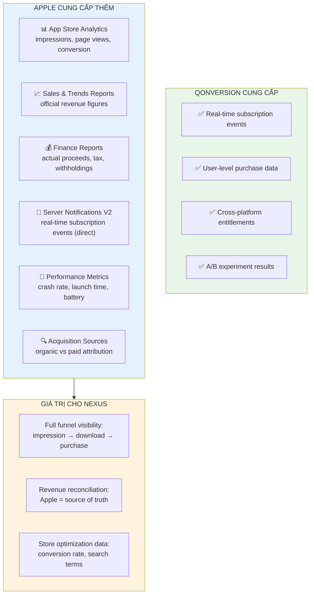

### 1.2 Phân vai rõ ràng

| Data Need | Primary Source | Reconciliation Source |
|-----------|---------------|----------------------|
| Real-time IAP events | **Qonversion** (webhook) | Apple S2S Notifications |
| Daily IAP revenue (operational) | **Qonversion** (Gold layer) | Apple Sales Report |
| Monthly official revenue (finance) | **Apple** Finance Report | — |
| App Store funnel (impressions → downloads) | **Apple** Analytics | — |
| Subscription lifecycle analytics | **Qonversion** | Apple Server API |
| Store performance (conversion rate) | **Apple** Analytics | — |
| App technical performance | **Apple** Performance Metrics | — |

> **Nguyên tắc:** Qonversion = operational data (fast, event-level). Apple = authoritative data (reconciliation, store analytics, finance).

---

## 2. Apple Credential Inventory

### 2.1 Credentials hiện có (qua Qonversion setup)

Các credentials sau đã được cấu hình cho Qonversion và sẽ được **tái sử dụng** cho Apple direct integration:

| Credential | Mô tả | Dùng cho API nào |
|-----------|--------|-----------------|
| **App-Specific Shared Secret** | Legacy receipt validation (deprecated) | ⛔ Không dùng — legacy |
| **App Store ID** | Numeric app identifier trên App Store | Tất cả Apple APIs |
| **App Store Connect Key ID** | Identifier cho API key | App Store Connect API (Analytics, Sales, Finance) |
| **App Store Connect Private Key (.p8)** | ES256 private key cho JWT signing | App Store Connect API |
| **App Store Connect Issuer ID** | Team/Org identifier | App Store Connect API |
| **In-App Purchase Key ID** | Identifier cho IAP-specific key | App Store Server API |
| **In-App Purchase Private Key (.p8)** | ES256 private key cho Server API | App Store Server API |
| **In-App Purchase Issuer ID** | IAP-specific issuer | App Store Server API |
| **S2S Notification URL** | Webhook URL cho Apple notifications | App Store Server Notifications V2 |

### 2.2 Hai bộ Key riêng biệt

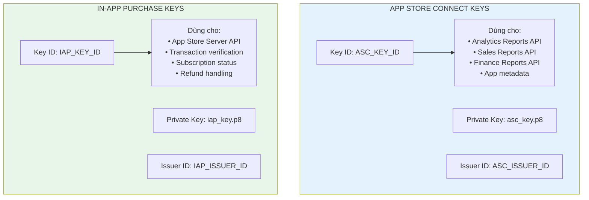

> ⚠️ **QUAN TRỌNG:** App Store Connect keys và In-App Purchase keys là **hai bộ key riêng biệt**, sử dụng cho các API khác nhau. Không nhầm lẫn.

---

## 3. Apple APIs Landscape

### 3.1 Bốn nhóm API chính

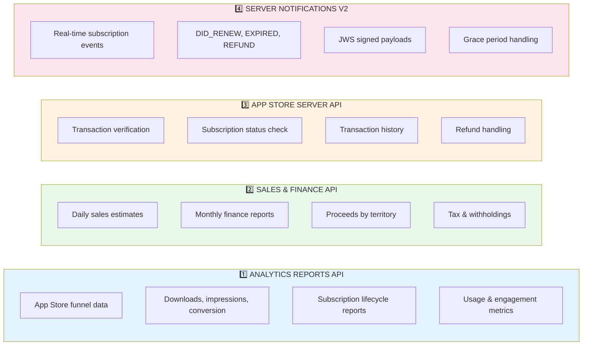

### 3.2 Authentication Summary

| API Group | Key Type | JWT Audience | Base URL |
|-----------|----------|-------------|----------|
| Analytics & Sales/Finance | App Store Connect Key | `appstoreconnect-v1` | `https://api.appstoreconnect.apple.com` |
| App Store Server API | In-App Purchase Key | `appstoreconnect-v1` | `https://api.storekit.itunes.apple.com` |
| Server Notifications V2 | N/A (inbound webhook) | N/A | Your server URL |

---

## 4. Authentication — JWT Generation (ES256)

### 4.1 JWT Structure

Apple sử dụng ES256 (Elliptic Curve) signed JWT cho tất cả API authentication.

**Header:**
```json
{
  "alg": "ES256",
  "kid": "<KEY_ID>",          
  "typ": "JWT"
}
```

**Payload cho App Store Connect API:**
```json
{
  "iss": "<ISSUER_ID>",       
  "iat": 1712534400,          
  "exp": 1712535300,          
  "aud": "appstoreconnect-v1"
}
```

**Payload cho App Store Server API (thêm `bid`):**
```json
{
  "iss": "<IAP_ISSUER_ID>",
  "iat": 1712534400,
  "exp": 1712535300,
  "aud": "appstoreconnect-v1",
  "bid": "com.amobear.puzzlegame"
}
```

### 4.2 JWT Generation Flow

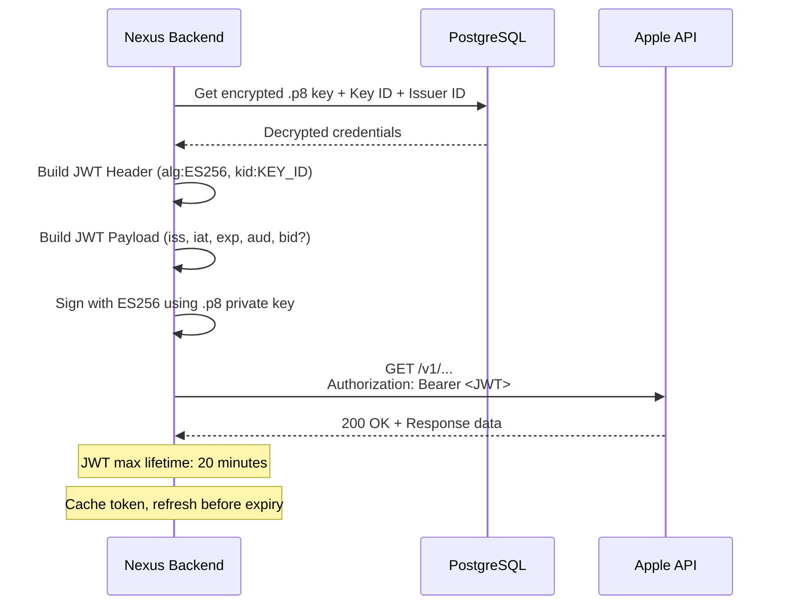

### 4.3 Implementation Notes

- JWT **max lifetime ~20 phút** — Apple reject tokens > 20 min
- **Khuyến nghị**: set \(exp = iat + 600\) (10 phút). Nếu cần, tối đa \(exp = iat + 1200\) (20 phút).
- **Cache JWT** tại application level (ngắn), refresh trước expiry (ví dụ 1–2 phút)
- .p8 private key phải được **stored encrypted** (AES-256) trong PostgreSQL
- Sử dụng thư viện .NET: `System.IdentityModel.Tokens.Jwt` + `Microsoft.IdentityModel.Tokens`
- **Không bao giờ** log JWT token vào application logs

### 4.4 Scoped JWT (Optional)

Apple cho phép giới hạn JWT scope cho security tốt hơn:

```json
{
  "iss": "<ISSUER_ID>",
  "iat": 1712534400,
  "exp": 1712535300,
  "aud": "appstoreconnect-v1",
  "scope": ["GET /v1/salesReports", "GET /v1/financeReports"]
}
```

> **Recommendation:** Tạo JWT riêng cho mỗi use case (analytics, sales, server API) với scope tối thiểu.

---

## 5. Hướng dẫn lấy thông tin trên App Store Connect (header & payload JWT)

Phần này mô tả **chỗ lấy từng giá trị** trên giao diện Apple để lấp vào **header** và **payload** JWT ở mục 4, và các tham số query cần cho API (Apple ID, Vendor Number).

### 5.1 Quyền truy cập & đường dẫn

| Yêu cầu | Ghi chú |
|--------|--------|
| Tài khoản Apple ID có quyền trên tổ chức | Thường cần **Account Holder**, **Admin**, **App Manager**, hoặc **Developer** tùy chính sách team — riêng **tạo key API** thường yêu cầu quyền cấp cao. |
| **App Store Connect (web)** | [https://appstoreconnect.apple.com](https://appstoreconnect.apple.com) — mục **Users and Access** là nguồn chính cho Key ID, Issuer ID, tải `.p8`. |
| **Developer (Certificates, IDs & Profiles)** | [https://developer.apple.com](https://developer.apple.com) — dùng cho profile/cert khác; **key JWT cho App Store Connect / Server API** tạo từ **App Store Connect** (khu vực **Keys**), không lấy từ mục Certificates. |

> **Lưu ý:** Giao diện Apple thay đổi theo thời gian. Nếu không thấy đúng tên mục, tìm theo từ khóa **“Keys”**, **“App Store Connect API”**, **“In-App Purchase”** trên cùng khu vực **Users and Access**.

### 5.2 Header JWT — trường `kid` (Key ID) & file `.p8`

1. Đăng nhập **App Store Connect**.
2. Mở **Users and Access** (hoặc **Cài đặt người dùng và truy cập**).
3. Vào tab / phần **Integrations** hoặc trực tiếp mục **Keys** (tùy bản dịch).

**A. App Store Connect API** (dùng cho **Analytics, Sales, Finance, metadata** trên `api.appstoreconnect.apple.com`):

- Tìm khối **App Store Connect API**.
- Bấm **Generate API Key** (hoặc tương đương) nếu chưa có key: đặt tên, chọn quyền tối thiểu (ví dụ bảo đảm quyền **Developer** trở lên tùy policy).
- Sau khi tạo, Apple cho **tải file `.p8` duy nhất một lần** — cất kỹ; mất sẽ phải tạo key mới.
- Cột **Key ID** (chuỗi 10 ký tự) chính là `kid` trong **header** JWT. Key ID còn xem lại mãi sau này trong bảng danh sách key.

**B. In-App Purchase** (dùng cho **App Store Server API** trên `api.storekit.itunes.apple.com`):

- Trong cùng vùng **Users and Access** → phần **In-App Purchase** (có thể tách tab hoặc section riêng).
- Tạo key riêng cho mục đích in-app / Server API (một số tổ chức đặt tên theo môi trường).
- Tải file `.p8` tương ứng; **Key ID** cột bảng = `kid` khi gọi Server API.

> **QUAN TRỌNG (xem mục 2.2):** Hai loại key **khác nhau** — **không** dùng Key ID + `.p8` của App Store Connect API để ký request Server API, trừ khi Apple tài liệu hiện hành cho phép tùy từng quyền. Luôn khớp bộ **kid + .p8 + Issuer** theo đúng khu vực tạo key trên màn hình.

### 5.3 Payload JWT — `iss` (Issuer ID)

- Ở **cùng trang Keys** (thường phía trên bảng danh sách API key), Apple hiển thị **Issuer ID** dạng **UUID** (một số tổ chức: một Issuer dùng chung).
- Chép **Issuer ID** — điền vào claim **`iss`** trong payload.
- Một số tài khoản có bảng tách **Issuer** theo từng dịch vụ; ưu tiên giá trị mà màn hình in kèm cạnh bộ key bạn dùng (App Store Connect API / In-App Purchase).

Nếu không thấy Issuer ID, kiểm tra: bạn thuộc tổ chức hợp lệ, không phải tài khoản chỉ có vài quyền tối hạn, hoặc liên hệ **Account Holder**.

### 5.4 Payload — `aud`, `iat`, `exp` (tạo phía server)

| Claim | Cách lấp |
|--------|----------|
| `aud` | Cố định **`appstoreconnect-v1`** (không có trên UI; xem bảng mục 3.2). |
| `iat` | **Unix time** tại thời điểm phát hành token. |
| `exp` | **Unix time** hết hạn; theo Apple, **JWT tối đa ~20 phút**. Khuyến nghị: \(exp = iat + 600\) (10 phút), tối đa \(iat + 1200\). Một số tool (ví dụ jwt.io) có thể để TTL dài (giờ) → sẽ bị 401. |

### 5.5 Payload — `bid` (Bundle ID, chỉ App Store Server API)

- **App Store Connect** → **My Apps** → chọn ứng dụng.
- Mục **App Information** hoặc **General** (tùy layout): tìm **Bundle ID** (dạng reverse-DNS, ví dụ `com.amobear.app`).
- Copy **chính xác** (kể cả chữ hoa thường) vào claim **`bid`**.
- Dùng **cùng Bundle ID** của bản build production; nhầm bundle sandbox/test khác sẽ bị 401/403 tùy tình huống.

### 5.6 Tham số bổ sung lấy từ giao diện (query / request body, không nằm trong JWT)

| Giá trị cần cho tích hợp | Lấy ở đâu (gợi ý) |
|-------------------------|-------------------|
| **Apple ID** (số) của app (App Store ID) | **My Apps** → chọn app → **App Information** (hoặc tổng quan ứng dụng) — cột/field “Apple ID”. Dùng trong API references app (`/v1/apps/...`), analytics request, v.v. |
| **Vendor Number** (Mã NCC / nhà cung cấp) | Thường ở **Agreements, Tax, and Banking**; hoặc tùy tài khoản hiển thị trong **Sales and Trends** / tài liệu thanh toán. Cần cho `filter[vendorNumber]` (Sales, Finance) — số, không dấu cách. |
| **SKUs, Product IDs** (IAP) | **My Apps** → app → **In-App Purchases** / **Subscriptions** — từng sản phẩm. |

> **Developer Portal (`developer.apple.com`)** — mục **Keys** ở đó phục vụ các dịch vụ Apple khác; **với tài liệu này, ưu tiên Keys trong App Store Connect** như trên. Nếu team tách quy trình, đảm bảo cùng một tổ chức/team với ứng dụng trên store.

### 5.7 Bảng ánh xạ nhanh (Mục 4 → màn hình)

| Thành phần | Trường (mục 4) | Lấy từ (tóm tắt) |
|------------|----------------|------------------|
| Header | `alg` = ES256, `typ` = JWT | Cố định. |
| Header | `kid` | **Users and Access** → **Keys** → cột **Key ID** (đúng loại key: ASC API hoặc In-App Purchase). |
| Ký số / private | File `.p8` | Tải khi **Generate** key, **một lần**. |
| Payload | `iss` | Cùng trang **Keys** → **Issuer ID** (UUID). |
| Payload | `aud` | Giá trị `appstoreconnect-v1` (cố định). |
| Payload | `iat` / `exp` | Tạo trên server (Unix giây). |
| Payload | `bid` | Chỉ Server API — **My Apps** → app → **Bundle ID**. |
| (API query) | Apple `app` id, vendor, … | **App Information** (Apple ID), **Agreements / Financial** (Vendor), v.v. |

### 5.8 Lỗi thường gặp

1. **Sai cặp key** — dùng `kid` của key A cùng file `.p8` của key B → 401. Đảm bảo 1-1 từ lúc tải.
2. **Dùng nhầm bộ key** — dùng App Store Connect API key để gọi **Server API** (cần In-App Purchase key theo tài liệu hiện hành).
3. **JWT hết hạn** — tạo lại token trước 20 phút, cache ngắn ở backend.
4. **Nhầm `bid`** — bundle lệch so với app thật trên store.
5. **Lộ `.p8`** — chỉ lưu mã hóa (xem mục 13); **không** commit vào Git.

Sau khi thu thập xong, quay lại mục **4** để tạo JWT; các API chi tiết bắt đầu từ mục **6** trở đi.

---

## 6. API 1: App Store Connect API — Analytics Reports

### 6.1 Mô tả

Analytics Reports API cung cấp downloadable reports về app performance trên App Store. Đây là nguồn data **duy nhất** cho store-level metrics.

### 6.2 Report Categories

| Category | Dữ liệu | Giá trị cho Nexus |
|----------|----------|-------------------|
| **App Store Discovery** | Impressions, page views, conversion rate | Store optimization, ASO tracking |
| **App Store Downloads** | First-time downloads, redownloads, by source | Growth tracking, UA attribution |
| **App Store Revenue** | Revenue, purchases, paying users, by source | Revenue attribution to channels |
| **Subscription Events** | Trials, conversions, renewals, churn, by source | Subscription funnel with attribution |
| **Subscription Summary** | Active subs, trials, billing issues | Point-in-time subscription health |
| **Usage** | Active devices, sessions, retention | Engagement deep-dive |

### 6.3 Setup Flow

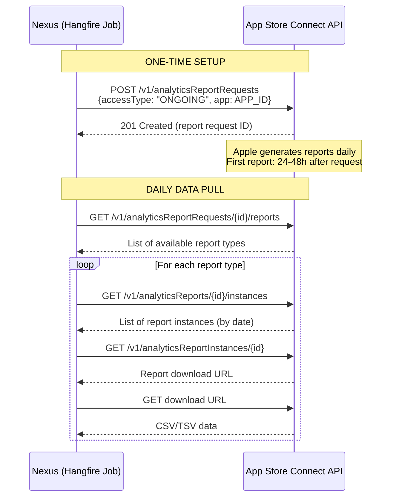

### 6.4 Report Request Types

| Access Type | Mô tả | Nexus Use |
|------------|--------|-----------|
| `ONGOING` | Auto-generates daily/weekly/monthly | ✅ Primary — set once, pull daily |
| `ONE_TIME_SNAPSHOT` | All historical data available | ✅ Initial backfill |

### 6.5 Data Completeness

> ⚠️ Apple data completeness: **T-2** (2 ngày sau reporting date mới coi là complete). Nexus sync job phải chạy cho T-2 data, không phải T-1.

### 6.6 Priority Reports cho Nexus

**Phase 1 (Must-have):**
1. **App Store Downloads** — first-time downloads, redownloads, by source
2. **App Store Revenue** — purchases, proceeds, paying users

**Phase 2 (Nice-to-have):**
3. **Subscription Events** — full lifecycle with source attribution
4. **App Store Discovery** — impressions, conversion rate

**Phase 3 (Future):**
5. **Usage** — active devices, retention (overlap với AppMetrica/Firebase)
6. **Performance** — crash rate, launch time

---

## 7. API 2: App Store Connect API — Sales & Finance Reports

### 7.1 Sales Reports

**Endpoint:** `GET /v1/salesReports`

| Parameter | Value | Mô tả |
|-----------|-------|--------|
| `filter[reportType]` | `SALES` | Sales and trends |
| `filter[reportSubType]` | `SUMMARY` | Daily summary |
| `filter[frequency]` | `DAILY` | Daily granularity |
| `filter[reportDate]` | `2026-04-06` | Date to report on |
| `filter[vendorNumber]` | `<VENDOR_ID>` | From App Store Connect |

**Response:** Gzipped TSV file chứa:
- Units sold / updated / refunded
- Revenue (customer price, proceeds)
- By product, territory, device type
- Currency codes + exchange rates

### 7.2 Finance Reports

**Endpoint:** `GET /v1/financeReports`

| Parameter | Value |
|-----------|-------|
| `filter[reportType]` | `FINANCE_DETAIL` |
| `filter[reportDate]` | `2026-03` (monthly) |
| `filter[regionCode]` | Region code (e.g., `US`, `EU`) |
| `filter[vendorNumber]` | From App Store Connect |

**Response:** Monthly financial statement — **official revenue figures** for accounting.

> ⚠️ **Finance Reports settlement cycle:** `reportDate` maps to Apple's fiscal period, không phải calendar month. Cần mapping logic.

### 7.3 Sync Strategy

```mermaid
flowchart TB
    subgraph Sales["SALES REPORTS — DAILY"]
        S1["Hangfire job: 06:00 UTC"]
        S2["Pull T-2 sales report"]
        S3["Parse TSV → MinIO backup"]
        S4["Insert → StarRocks Bronze"]
        S5["Transform → Gold (reconciliation)"]
    end
    
    subgraph Finance["FINANCE REPORTS — MONTHLY"]
        F1["Hangfire job: 5th of each month"]
        F2["Pull previous month finance report"]
        F3["Parse → MinIO backup"]
        F4["Insert → StarRocks Bronze"]
        F5["Flag: official_revenue = true"]
    end
    
    S1 --> S2 --> S3 --> S4 --> S5
    F1 --> F2 --> F3 --> F4 --> F5
    
    style Sales fill:#e3f2fd
    style Finance fill:#e8f5e9
```

---

## 8. API 3: App Store Server API — Transaction & Subscription Management

### 8.1 Mô tả

App Store Server API cho phép query transaction-level data trực tiếp từ Apple. Đây là API thay thế cho deprecated `verifyReceipt`.

**Base URL:** `https://api.storekit.itunes.apple.com`

### 8.2 Key Endpoints

| Endpoint | Method | Mô tả | Nexus Use |
|----------|--------|--------|-----------|
| `/inApps/v1/transactions/{transactionId}` | GET | Get transaction info | Verify specific transaction |
| `/inApps/v1/history/{originalTransactionId}` | GET | Full purchase history | User purchase audit |
| `/inApps/v1/subscriptions/{originalTransactionId}` | GET | All subscription statuses | Cross-validate with Qonversion |
| `/inApps/v1/refund/lookup/{originalTransactionId}` | GET | Refund history | Refund tracking |
| `/inApps/v1/notifications/test` | POST | Send test notification | Integration testing |
| `/inApps/v1/notifications/history` | POST | Get notification history | Recover missed notifications |

### 8.3 Response Format — JWS (JSON Web Signature)

Apple trả về `signedTransactionInfo` dạng JWS (3-part base64):

```
<header>.<payload>.<signature>
```

**Decoded payload chứa:**
```json
{
  "transactionId": "2000000123456789",
  "originalTransactionId": "2000000123456000",
  "bundleId": "com.amobear.puzzlegame",
  "productId": "com.amobear.app.premium.monthly",
  "purchaseDate": 1712534400000,
  "expiresDate": 1715126400000,
  "type": "Auto-Renewable Subscription",
  "environment": "Production",
  "storefront": "VNM",
  "storefrontId": "143478",
  "price": 99000,
  "currency": "VND",
  "offerType": 1,
  "transactionReason": "RENEWAL"
}
```

### 8.4 JWS Verification

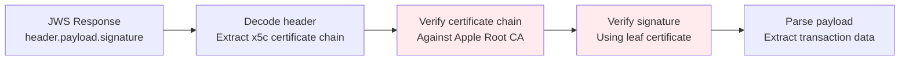

> **CRITICAL:** Luôn verify JWS certificate chain trước khi trust data. Apple cung cấp root certificate tại developer docs.

### 8.5 Use Cases trong Nexus

| Use Case | API Endpoint | Trigger |
|----------|-------------|---------|
| Verify questionable transaction | GET Transaction Info | Anomaly detection flag |
| Full user purchase audit | GET Transaction History | Admin/support request |
| Cross-validate Qonversion data | GET Subscription Statuses | Daily reconciliation |
| Recover missed notifications | POST Notification History | Webhook gap detected |
| Handle refund disputes | GET Refund History | Refund alert triggered |

---

## 9. API 4: App Store Server Notifications V2

### 9.1 Mô tả

Apple Server Notifications V2 push real-time events về subscription lifecycle đến server URL đã cấu hình.

### 9.2 Hiện trạng

S2S Notification URL **đã được cấu hình** cho Qonversion (qua App Store Connect → App Information). Có 2 options:

**Option A (Recommended):** Giữ Qonversion là primary receiver, Nexus nhận data qua Qonversion webhook.

**Option B:** Cấu hình Apple gửi notifications tới **cả Qonversion và Nexus** (Apple hỗ trợ production URL + sandbox URL, nhưng chỉ 1 production URL).

### 9.3 Decision: Option A

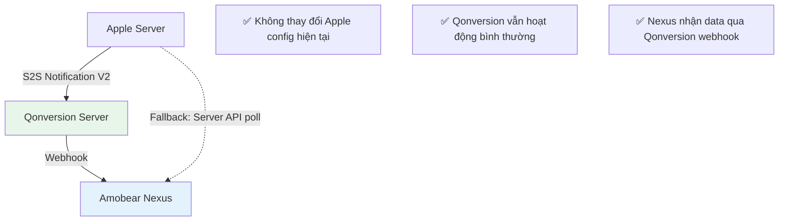

**Lý do chọn Option A:**
1. Thay đổi Apple S2S URL sẽ **break Qonversion** (Qonversion cần nhận notifications để update entitlements)
2. Apple chỉ cho phép **1 production URL** — không thể gửi song song
3. Qonversion webhook đã cung cấp đủ event data cho Nexus
4. Dùng Apple Server API `GET /notifications/history` làm fallback khi cần recover missed events

### 9.4 Notification Types (Reference)

| Notification Type | Subtypes | Mô tả |
|-------------------|----------|--------|
| `DID_RENEW` | — | Subscription renewed successfully |
| `DID_CHANGE_RENEWAL_STATUS` | `AUTO_RENEW_ENABLED`, `AUTO_RENEW_DISABLED` | Auto-renew toggled |
| `DID_CHANGE_RENEWAL_INFO` | — | Subscription plan changed |
| `DID_FAIL_TO_RENEW` | `GRACE_PERIOD`, `EXPIRED` | Payment failed |
| `EXPIRED` | `VOLUNTARY`, `BILLING_RETRY_PERIOD`, `PRICE_INCREASE` | Subscription expired |
| `REFUND` | — | Transaction refunded |
| `REFUND_REVERSED` | — | Refund reversed |
| `SUBSCRIBED` | `INITIAL_BUY`, `RESUBSCRIBE` | New subscription |
| `OFFER_REDEEMED` | Various | Promotional offer used |
| `GRACE_PERIOD_EXPIRED` | — | Grace period ended |

---

## 10. StarRocks Schema Design

### 10.1 Bronze — `apple_sales_daily_raw`

```sql
CREATE TABLE IF NOT EXISTS bronze.apple_sales_daily_raw (
    report_date         DATE NOT NULL,
    app_sku             VARCHAR(100),
    app_name            VARCHAR(500),
    apple_id            VARCHAR(50) NOT NULL COMMENT 'App Store ID',
    product_id          VARCHAR(200),
    product_type        VARCHAR(100) COMMENT 'IAP, Auto-Renewable, etc.',
    units               DECIMAL(12, 2),
    developer_proceeds  DECIMAL(12, 4),
    customer_price      DECIMAL(12, 4),
    proceeds_currency   VARCHAR(10),
    customer_currency   VARCHAR(10),
    country_code        VARCHAR(10),
    device              VARCHAR(50),
    promo_code          VARCHAR(100),
    
    -- Nexus metadata
    raw_line            TEXT COMMENT 'Original TSV line',
    sync_batch_id       VARCHAR(50),
    received_at         DATETIME DEFAULT CURRENT_TIMESTAMP
)
ENGINE = OLAP
DUPLICATE KEY(report_date, apple_id, product_id)
PARTITION BY RANGE(report_date) (
    START ("2026-01-01") END ("2027-01-01") EVERY (INTERVAL 1 MONTH)
)
DISTRIBUTED BY HASH(apple_id) BUCKETS 4;
```

### 10.2 Bronze — `apple_analytics_raw`

```sql
CREATE TABLE IF NOT EXISTS bronze.apple_analytics_raw (
    report_date         DATE NOT NULL,
    report_type         VARCHAR(100) NOT NULL COMMENT 'downloads, revenue, discovery, etc.',
    app_apple_id        VARCHAR(50) NOT NULL,
    
    -- Flexible metric storage (different report types have different columns)
    metric_name         VARCHAR(200) NOT NULL,
    metric_value        DECIMAL(18, 4),
    
    -- Dimension columns
    source_type         VARCHAR(100) COMMENT 'App Store Browse, Search, Web, etc.',
    territory           VARCHAR(10),
    device              VARCHAR(50),
    platform_version    VARCHAR(20),
    
    -- Nexus metadata
    report_instance_id  VARCHAR(200),
    sync_batch_id       VARCHAR(50),
    received_at         DATETIME DEFAULT CURRENT_TIMESTAMP
)
ENGINE = OLAP
DUPLICATE KEY(report_date, report_type, app_apple_id, metric_name)
PARTITION BY RANGE(report_date) (
    START ("2026-01-01") END ("2027-01-01") EVERY (INTERVAL 1 MONTH)
)
DISTRIBUTED BY HASH(app_apple_id) BUCKETS 4;
```

### 10.3 Gold — `apple_store_daily`

```sql
CREATE TABLE IF NOT EXISTS gold.apple_store_daily (
    report_date             DATE NOT NULL,
    app_id                  VARCHAR(200) NOT NULL COMMENT 'Bundle ID (mapped from Apple ID)',
    
    -- Store Funnel
    impressions             INT COMMENT 'App Store page impressions',
    page_views              INT COMMENT 'Product page views',
    first_time_downloads    INT,
    redownloads             INT,
    total_downloads         INT,
    conversion_rate         DECIMAL(5, 4) COMMENT 'downloads / impressions',
    
    -- Revenue (from Sales Report — reconciliation source)
    apple_sales_proceeds_usd DECIMAL(12, 4) COMMENT 'Official Apple proceeds',
    apple_units_sold         INT,
    apple_units_refunded     INT,
    
    -- Acquisition Sources (top 5)
    downloads_from_search    INT,
    downloads_from_browse    INT,
    downloads_from_referral  INT,
    downloads_from_web       INT,
    
    updated_at              DATETIME DEFAULT CURRENT_TIMESTAMP
)
ENGINE = OLAP
UNIQUE KEY(report_date, app_id)
PARTITION BY RANGE(report_date) (
    START ("2026-01-01") END ("2027-01-01") EVERY (INTERVAL 1 MONTH)
)
DISTRIBUTED BY HASH(app_id) BUCKETS 4;
```

---

## 11. Data Flow Architecture

### 11.1 Complete Data Flow

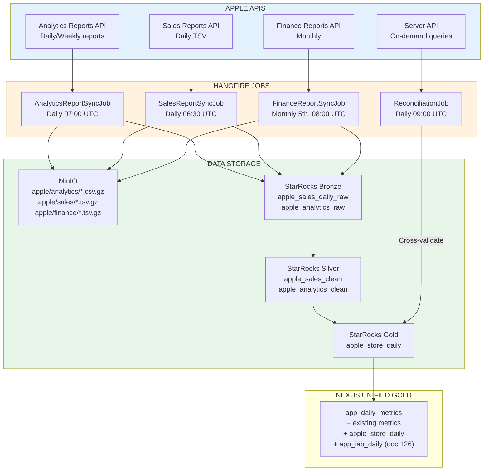

### 11.2 Sync Schedule

| Job | Schedule | Data | Latency |
|-----|----------|------|---------|
| `AppleAnalyticsReportSync` | Daily 07:00 UTC | T-2 analytics reports | T-2 |
| `AppleSalesReportSync` | Daily 06:30 UTC | T-1 sales summary | T-1 (estimates) |
| `AppleFinanceReportSync` | Monthly 5th 08:00 UTC | Previous month finance | Monthly |
| `AppleReconciliationJob` | Daily 09:00 UTC | Compare Qonversion vs Apple sales | T-2 |
| `AppleProductCatalogSync` | Weekly Monday 00:00 UTC | App metadata refresh | Weekly |

### 11.3 Reconciliation Logic

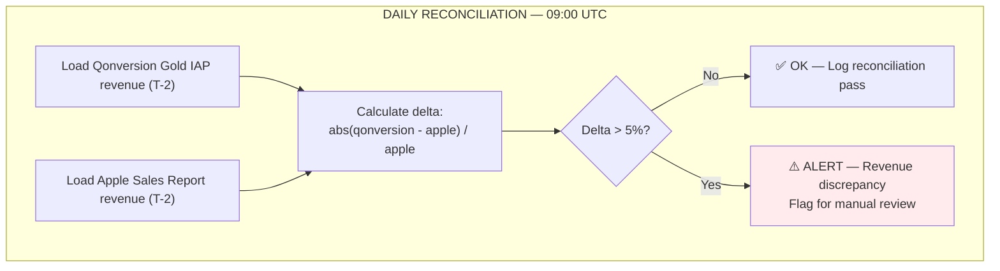

---

## 12. Phân vai: Apple vs Qonversion

### 12.1 Data Ownership Matrix

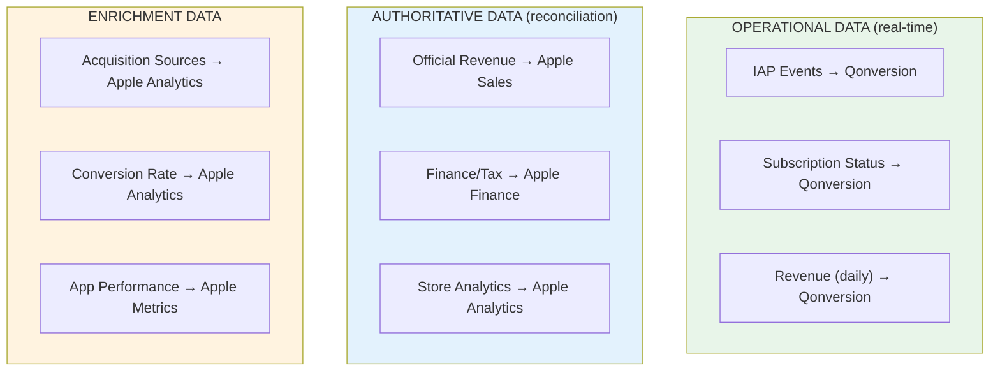

### 12.2 Revenue Reconciliation Hierarchy

```
LEVEL 1 (Daily operational): Qonversion Gold → iap_revenue
LEVEL 2 (Daily reconciliation): Apple Sales Report → cross-validate ±5%
LEVEL 3 (Monthly official): Apple Finance Report → final accounting figures

⚠️ Nếu discrepancy > 5% giữa Level 1 & 2:
   → Alert team
   → Use Apple Sales as authoritative
   → Investigate Qonversion config (missing events?)
```

---

## 13. Security & Key Management

### 13.1 Credential Storage

| Credential | Storage | Encryption | Access Pattern |
|-----------|---------|------------|----------------|
| ASC Private Key (.p8) | PostgreSQL BLOB | AES-256 | Decrypt at runtime for JWT signing |
| ASC Key ID | PostgreSQL | AES-256 | JWT header `kid` |
| ASC Issuer ID | PostgreSQL | AES-256 | JWT payload `iss` |
| IAP Private Key (.p8) | PostgreSQL BLOB | AES-256 | Decrypt at runtime for JWT signing |
| IAP Key ID | PostgreSQL | AES-256 | Server API JWT |
| IAP Issuer ID | PostgreSQL | AES-256 | Server API JWT |
| App Store ID | PostgreSQL | Plain | Non-sensitive, public info |

### 13.2 Key Rotation

- Apple **không** cho phép re-download .p8 keys — nếu mất phải revoke & tạo mới
- **Recommendation:** Backup encrypted .p8 keys tại 2 locations (DB + encrypted file on secure storage)
- Key rotation: Tạo key mới trên Apple → Update trong Nexus → Verify → Revoke key cũ

### 13.3 JWS Verification Security

Khi nhận JWS từ Apple Server API:
1. Extract certificate chain từ header `x5c`
2. Verify chain against Apple Root CA (download từ Apple PKI)
3. Verify signature using leaf certificate
4. **Cache Apple Root CA** — không download mỗi request

---

## 14. Phân kỳ triển khai

### 14.1 Roadmap

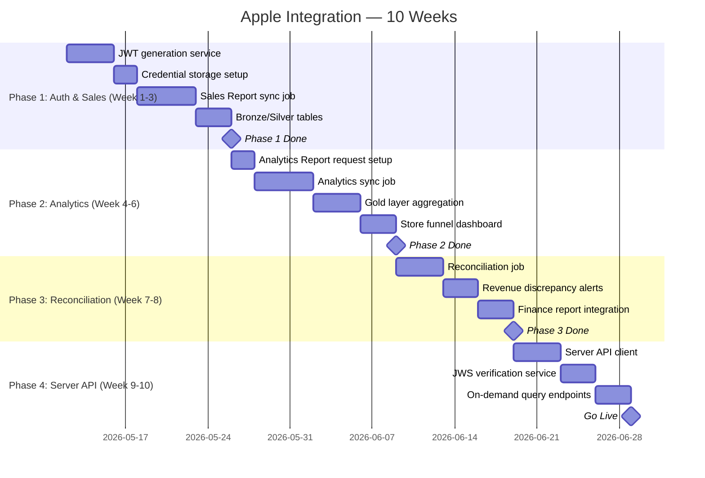

### 14.2 Phụ thuộc

| Task | Depends on |
|------|-----------|
| Apple Integration | Doc 126 (Qonversion) Phase 1 complete |
| Reconciliation | Cả Qonversion Gold + Apple Sales Gold phải có data |
| App Health Score update | Cả doc 126 + 127 Gold layers ready |

### 14.3 Checklist

- [ ] App Store Connect API key generated & stored encrypted
- [ ] In-App Purchase API key verified & stored encrypted
- [ ] JWT generation service implemented & tested
- [ ] `ONGOING` Analytics Report request created cho tất cả apps
- [ ] `ONE_TIME_SNAPSHOT` request cho historical backfill
- [ ] Sales Report daily sync job running
- [ ] Finance Report monthly sync job configured
- [ ] Bronze tables created & receiving data
- [ ] Silver transform jobs running
- [ ] Gold aggregation producing `apple_store_daily`
- [ ] Daily reconciliation job comparing Qonversion vs Apple (±5% threshold)
- [ ] Revenue discrepancy alert configured
- [ ] Server API client implemented (transaction lookup)
- [ ] JWS verification with Apple Root CA
- [ ] Postman collection created (20+ requests)
- [ ] App ID → Bundle ID mapping table maintained
- [ ] Documentation updated for multi-app support (200+ apps)

---

## 15. Rủi ro & Giảm thiểu

| # | Rủi ro | Impact | Probability | Giảm thiểu |
|---|--------|--------|-------------|-------------|
| 1 | Apple API rate limiting (200 req/hour) | High | Medium | Batch requests, cache JWT, stagger per-app calls |
| 2 | Analytics Report data T-2 delay | Medium | Certain | Design dashboards expecting T-2, not real-time |
| 3 | Finance Report settlement cycle mismatch | Medium | High | Build mapping logic for Apple fiscal periods |
| 4 | .p8 key loss (can't re-download) | Critical | Low | Encrypted backup at 2+ locations |
| 5 | JWS verification failure | High | Low | Pin Apple Root CA, monitor cert rotation |
| 6 | Multi-app scale (200+ apps × daily) | High | Medium | Parallel jobs, respect rate limits, priority queue |
| 7 | Apple API changes without notice | Medium | Low | Monitor Apple developer changelog, abstract via adapter |
| 8 | Revenue discrepancy Qonversion vs Apple | Medium | Medium | Automated alerts, manual review process |

---

## 16. KPI/OKR

### OKR: Apple Direct Integration live trong 10 tuần

| KR | Target | Measurement |
|----|--------|-------------|
| Sales Report sync success rate | > 99% daily | Hangfire job monitoring |
| Analytics Reports available | T-2 by 08:00 UTC | Data freshness check |
| Revenue reconciliation delta | < 5% vs Qonversion | Daily automated check |
| Finance Report captured | 100% monthly | Monthly verification |
| Store funnel data complete | All 200+ apps | Coverage report |
| Postman collection coverage | 20+ tested requests | Collection completeness |

---

## Related: UA / attribution (AppsFlyer MMP)

Apple Analytics (mục 1.x) bổ sung **store funnel**; **mobile attribution** (install source, campaign, cost) thường lấy từ MMP. Portfolio Amobear dùng **Adjust** (doc 119) và **AppsFlyer** (doc [128_APPSFLYER_INTEGRATION.md](./128_APPSFLYER_INTEGRATION.md)). Backend Nexus mirror pattern Adjust → PostgreSQL account + job → StarRocks bronze; chi tiết triển khai Pull installs V1 xem **§15.3** trong doc 128.

---

## Appendix A: App Store ID → Bundle ID Mapping

Nexus sử dụng `bundle_id` (e.g., `com.amobear.puzzlegame`) làm primary key cho apps. Apple Sales Reports dùng `Apple ID` (numeric). Cần maintain mapping table:

```sql
CREATE TABLE IF NOT EXISTS config.apple_app_mapping (
    bundle_id       VARCHAR(200) PRIMARY KEY,
    apple_id        VARCHAR(50) NOT NULL,
    app_name        VARCHAR(500),
    vendor_number   VARCHAR(50),
    sku             VARCHAR(100),
    platform        VARCHAR(20) DEFAULT 'iOS',
    is_active       BOOLEAN DEFAULT TRUE,
    updated_at      DATETIME DEFAULT CURRENT_TIMESTAMP
);
```

Populate via App Store Connect API: `GET /v1/apps` → map `bundleId` ↔ `id`.

---

## Appendix B: Apple API Rate Limits Reference

| API | Rate Limit |
|-----|-----------|
| App Store Connect API (general) | ~200 requests/hour (estimated, Apple không public chính xác) |
| Sales Reports | Daily/Weekly/Monthly availability |
| Analytics Reports | Report instances generated by Apple schedule |
| App Store Server API | Per-app, varies |

**Strategy cho 200+ apps:** Queue-based processing, 10 concurrent, exponential backoff, priority cho top-revenue apps.

---

*Document maintained by: Amobear Nexus Team*  
*Last updated: 2026-04-08*
