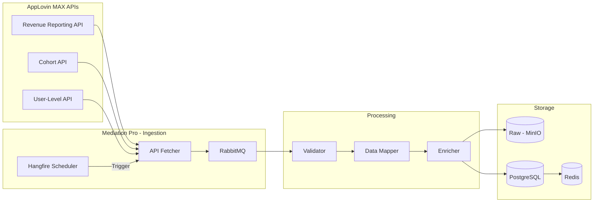
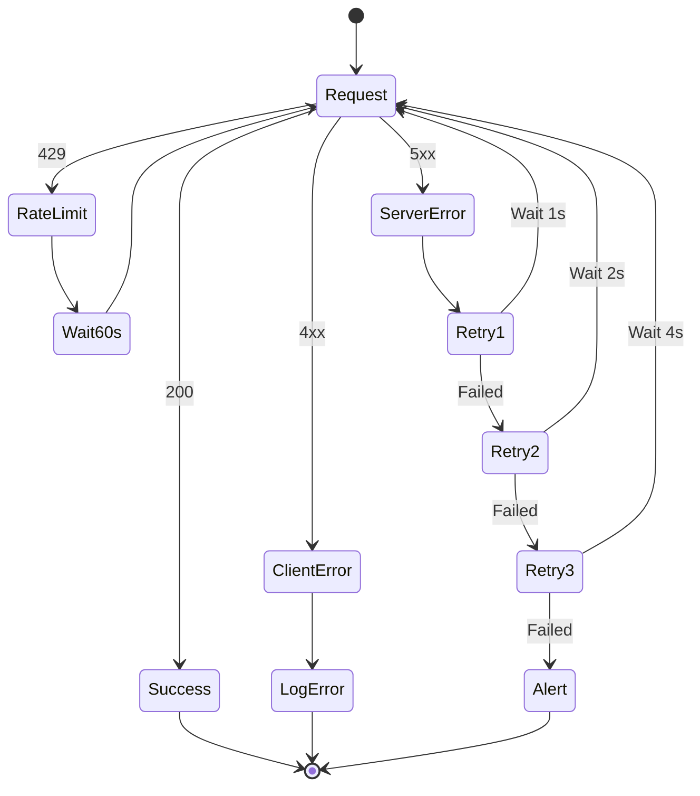

# AppLovin MAX Platform API Integration - Mediation Pro

## Executive Summary

Tài liệu này phân tích chi tiết AppLovin MAX API ecosystem để tích hợp vào hệ thống Mediation Pro Platform. Tài liệu được cập nhật theo official documentation từ AppLovin (support.axon.ai).

**Document Version:** 2.0  
**Last Updated:** 2025-02-03  
**Source:** https://support.axon.ai/en/max/reporting-apis/  
**Author:** CTO Advisor  

---

## 1. API Overview

### 1.1 Available Reporting APIs

| API | Base URL | Purpose |
|-----|----------|---------|
| Revenue Reporting API | `https://r.applovin.com/maxReport` | Aggregated statistics về MAX mediation |
| Cohort API | `https://r.applovin.com/maxCohort` | User performance data theo install date |
| User-Level Ad Revenue API | `https://r.applovin.com/max/userAdRevenueReport` | Granular ad revenue data per user |

### 1.2 Authentication

Tất cả APIs sử dụng **Report Key** trong query parameter `api_key`.

**Lấy Report Key:** Dashboard → Account → General → Keys → Report Key

### 1.3 Data Availability

- **Revenue Reporting API**: Aggregated data từ 1-2 giờ trước có thể incomplete
- **User-Level API**: Available 8 giờ sau UTC day end
- **Request Window**: 45 ngày (dates phải trong 45 ngày gần nhất)

---

## 2. Revenue Reporting API

### 2.1 API Specification

| Property | Value |
|----------|-------|
| **Base URL** | `https://r.applovin.com/maxReport` |
| **Method** | GET |
| **Authentication** | `api_key` parameter |
| **Request Window** | 45 days |
| **Timezone** | UTC |

### 2.2 Request Parameters

| Parameter | Description | Required | Example |
|-----------|-------------|----------|---------|
| `api_key` | Your Report Key | Yes | `api_key=Hyfi8Mkct...` |
| `columns` | Comma-separated columns to report | Yes | `columns=day,application,ecpm` |
| `start` | Start date (YYYY-MM-DD) | Yes | `start=2025-01-01` |
| `end` | End date (YYYY-MM-DD) | Yes | `end=2025-01-31` |
| `format` | Response format: `csv` or `json` | No | `format=json` |
| `filter_«x»` | Filter by column value | No | `filter_platform=android` |
| `sort_«x»` | Sort by column (ASC/DESC) | No | `sort_impressions=DESC` |
| `limit` | Number of results to return | No | `limit=1000` |
| `offset` | Skip entries for pagination | No | `offset=0` |
| `not_zero` | Filter zero values (set to 1) | No | `not_zero=1` |

### 2.3 Available Columns (OFFICIAL)

**Dimensions:**

| Column | Description | Example |
|--------|-------------|---------|
| `day` | Date (YYYY-MM-DD) | `2025-01-15` |
| `hour` | Hour of data (last 30 days only) | `20:00` |
| `application` | App name | `My App` |
| `package_name` | Package Name/Bundle ID | `com.my.test.app` |
| `store_id` | iTunes ID (iOS) or package name (Android) | `1207472156` |
| `platform` | Platform: `android`, `fireos`, `ios` | `android` |
| `country` | Two-letter ISO Country Code | `gb` |
| `ad_format` | Ad type: `INTER`, `BANNER`, `REWARD` | `INTER` |
| `max_ad_unit_id` | MAX Ad Unit ID | `deb878533ea4e76a` |
| `ad_unit_waterfall_name` | Name of the Ad Unit waterfall | `LAT` |
| `max_ad_unit_test` | MAX Ad Unit test group name | `Control` |
| `max_placement` | MAX mediation placement name | `launch_screen` |
| `network` | Ad network name | `AppLovin` |
| `network_placement` | External Ad Network placement | `ca-app-pub-12345678/0987654321` |
| `custom_network_name` | Custom network name | `Custom Network` |
| `device_type` | Device type: `phone`, `tablet`, `other` | `phone` |
| `has_idfa` | Has ad ID (0=LAT/GDPR opted out, 1=available) | `1` |

**Metrics:**

| Column | Description | Example |
|--------|-------------|---------|
| `impressions` | Number of impressions shown | `28942` |
| `estimated_revenue` | Estimated revenue (USD) | `245.12` |
| `ecpm` | Estimated eCPM (USD) | `8.47` |
| `requests` | Number of ad requests (không dùng với network/network_placement/max_placement) | `45651` |
| `attempts` | Attempts made to ad network (chỉ với network/network_placement) | `41734` |
| `responses` | Responses from ad network (chỉ với network/network_placement) | `39841` |
| `fill_rate` | responses / attempts (chỉ với network/network_placement) | `.8512` |

### 2.4a `gold.fact_hourly_app_revenue` không có bản ghi (StarRocks)

ETL `RunGoldFactHourlyAppRevenueAsync` chỉ INSERT từ `bronze.applovin_revenue` khi **đồng thời**:

1. **`hour` không NULL** và trong **0–23**. AppLovin chỉ trả cột **`hour`** trong **~30 ngày gần** (xem bảng dimension `hour` §2.3); ngày cũ hơn sync lại vẫn có thể `hour` rỗng → không vào gold hourly.
2. **`columns` của maxReport có `hour`**. Backend (`AppLovinSyncService`) phải gọi API với `day,hour,...` rồi **chạy lại AppLovin sync** + **SilverGoldTransform** để bronze/gold khớp.
3. **Lọc network:** dòng có `network` chứa **`admob`** hoặc **`google`** (không phân biệt hoa thường) **bị loại** (trùng logic dedup với AdMob trên silver). Nếu toàn bộ revenue MAX của bạn đều gắn network kiểu AdMob/Google thì **gold hourly (AppLovin) = 0 dòng** là đúng logic hiện tại.

**SQL kiểm tra nhanh (StarRocks):**

```sql
-- Có bao nhiêu dòng có hour?
SELECT COUNT(*) FROM bronze.applovin_revenue WHERE `date` >= '2026-04-01' AND hour IS NOT NULL;

-- Có dòng nào thoả hourly + không bị loại network?
SELECT COUNT(*) FROM bronze.applovin_revenue ar
WHERE ar.`date` >= '2026-04-01' AND ar.hour IS NOT NULL AND ar.hour BETWEEN 0 AND 23
  AND LOWER(COALESCE(ar.network,'')) NOT LIKE '%admob%'
  AND LOWER(COALESCE(ar.network,'')) NOT LIKE '%google%';
```

### 2.4 Column Compatibility Notes

**Important Restrictions:**
- `attempts`, `responses`, `fill_rate`: Chỉ available khi include `network` và/hoặc `network_placement`. KHÔNG available khi include `max_placement`.
- `requests`: KHÔNG available khi include `network`, `network_placement`, hoặc `max_placement`.

### 2.5 Response Format

**JSON Response:**
```json
{
  "code": 200,
  "results": [
    {
      "day": "2025-01-15",
      "hour": "00:00",
      "application": "My Test App",
      "impressions": "987654"
    },
    {
      "day": "2025-01-15",
      "hour": "01:00",
      "application": "My Test App",
      "impressions": "819127"
    }
  ],
  "count": 2
}
```

**CSV Response:**
```csv
day,hour,application,impressions
2025-01-15,00:00,"My Test App",987654
2025-01-15,01:00,"My Test App",819127
```

### 2.6 Example Requests

**Basic Revenue Report:**
```
https://r.applovin.com/maxReport?api_key=YOUR_KEY&start=2025-01-01&end=2025-01-31&columns=day,application,estimated_revenue,impressions,ecpm&format=json
```

**By Network with Fill Rate:**
```
https://r.applovin.com/maxReport?api_key=YOUR_KEY&start=2025-01-01&end=2025-01-31&columns=day,network,estimated_revenue,impressions,ecpm,attempts,responses,fill_rate&format=json
```

**Filtered by Platform:**
```
https://r.applovin.com/maxReport?api_key=YOUR_KEY&start=2025-01-01&end=2025-01-31&columns=day,application,ecpm&filter_platform=android&format=json
```

---

## 3. Cohort API

### 3.1 API Specification

| Property | Value |
|----------|-------|
| **Base URLs** | Revenue: `https://r.applovin.com/maxCohort` |
| | Impressions: `https://r.applovin.com/maxCohort/imp` |
| | Sessions: `https://r.applovin.com/maxCohort/session` |
| **Method** | GET |
| **Request Window** | 45 days |

### 3.2 Request Parameters

| Parameter | Description | Required | Example |
|-----------|-------------|----------|---------|
| `api_key` | Your Report Key | Yes | `api_key=YOUR_KEY` |
| `start` | Cohort start date | Yes | `start=2025-01-01` |
| `end` | Cohort end date | Yes | `end=2025-01-07` |
| `columns` | Comma-separated columns | Yes | `columns=day,country,installs` |
| `format` | csv or json | No | `format=json` |

### 3.3 Cohort Day Values

Cohort day có fixed set of values: **0, 1, 2, 3, 4, 5, 6, 7, 10, 14, 18, 21, 24, 27, 30, 45**

### 3.4 Available Columns

**Revenue Cohort (`/maxCohort`):**
- `day` - Install date
- `country` - Country code
- `application` - App name
- `package_name` - Package name
- `platform` - Platform
- `installs` - Number of installs
- `pub_revenue_x` - Publisher revenue at day x (x = cohort day value)

**Example Response:**
```csv
day,country,application,installs,pub_revenue_7
2025-01-15,gb,"My Test App",142,81.24
```

---

## 4. User-Level Ad Revenue API

### 4.1 API Specification

| Property | Value |
|----------|-------|
| **Base URL** | `https://r.applovin.com/max/userAdRevenueReport` |
| **Method** | GET |
| **Data Availability** | 8 hours after UTC day end |

### 4.2 Request Parameters

| Parameter | Description | Required |
|-----------|-------------|----------|
| `api_key` | Your Report Key | Yes |
| `date` | Report date (YYYY-MM-DD) | Yes |
| `application` | Package name | Yes |
| `columns` | Comma-separated columns | Yes |
| `aggregate` | 0=impression level, 1=user level | No |

### 4.3 Response

API returns a URL để download file CSV từ S3.

```json
{
  "code": 200,
  "ad_revenue_report_url": "https://applovin-externalreports.s3.amazonaws.com/..."
}
```

**CSV Format (User Aggregated):**
```csv
custom_data,max_placement,idfa_or_idfv,advertising_id,impressions,revenue
da39a3ee5e6b4b0,home_screen,04034992-E5AA-4BA1-890C-5075B2504050,4F2A07BC-315B-11E9-B210-D663BD873D93,20349,27,5.000025
```

---

## 5. Ad Unit Management API

### 5.1 API Specification

| Property | Value |
|----------|-------|
| **Base URL** | `https://o.applovin.com/mediation/v1/` |
| **Authentication** | `Api-Key` HTTP header |
| **Key Type** | Management Key (Account → Keys) |

### 5.2 Endpoints

| Method | Endpoint | Description |
|--------|----------|-------------|
| GET | `/ad_units` | List all ad units |
| GET | `/ad_unit/{ad-unit-ID}` | Get ad unit details |
| POST | `/ad_unit/` | Create new ad unit |
| POST | `/ad_unit/{ad-unit-ID}` | Update ad unit |
| GET | `/ad_unit/{ad-unit-ID}/{segment-ID}` | Get waterfall for segment |

### 5.3 Query Parameters

| Parameter | Description |
|-----------|-------------|
| `fields` | Additional fields to return (comma-separated) |

**Available Fields:**
- `ad_network_settings` (active only)
- `disabled_ad_network_settings` (disabled only)
- `frequency_capping_settings`
- `bid_floors`
- `segments`
- `banner_refresh_settings`
- `mrec_refresh_settings`

---

## 6. Data Flow Architecture



---

## 7. Data Mapping

### 7.1 Field Mapping

| AppLovin Column | Mediation Pro Field | Transformation |
|-----------------|---------------------|----------------|
| `day` | `report_date` | DATE parse |
| `application` | `app_name` | Direct |
| `package_name` | `app_id` | Lookup |
| `max_ad_unit_id` | `ad_instance_id` | Lookup/Create |
| `ad_unit_waterfall_name` | `waterfall_name` | Direct |
| `platform` | `platform` | Lowercase |
| `country` | `country_code` | Uppercase |
| `ad_format` | `ad_format` | Map to enum |
| `network` | `network_source` | Normalize |
| `estimated_revenue` | `revenue_usd` | Decimal |
| `impressions` | `impressions` | BigInt |
| `ecpm` | `ecpm` | Decimal |

### 7.2 Ad Format Mapping

| AppLovin | Mediation Pro |
|----------|---------------|
| `BANNER` | `banner` |
| `INTER` | `interstitial` |
| `REWARD` | `rewarded` |
| `MREC` | `mrec` |
| `APP_OPEN` | `app_open` |
| `NATIVE` | `native` |

---

## 8. Error Handling

### 8.1 HTTP Status Codes

| Code | Description | Action |
|------|-------------|--------|
| 200 | Success | Process response |
| 400 | Bad Request | Check parameters |
| 401 | Unauthorized | Verify API key |
| 403 | Forbidden | Check permissions |
| 404 | Not Found | Verify endpoint |
| 429 | Rate Limited | Backoff and retry |
| 500 | Server Error | Retry with exponential backoff |

### 8.2 Retry Strategy



---

## 9. Sync Schedule

```mermaid
gantt
    title AppLovin Daily Sync Schedule - UTC
    dateFormat HH:mm
    axisFormat %H:%M
    
    section Revenue
    Daily Revenue Sync    :rev, 06:00, 30m
    
    section Cohort
    Weekly Cohort Sync    :coh, 07:00, 60m
    
    section User-Level
    User Revenue Sync     :usr, 09:00, 120m
    
    section Validation
    Data Validation       :val, 11:00, 30m
```



---

## 10. Quick Reference

### API Endpoints

| API | URL |
|-----|-----|
| Revenue Report | `https://r.applovin.com/maxReport` |
| Cohort (Revenue) | `https://r.applovin.com/maxCohort` |
| Cohort (Impressions) | `https://r.applovin.com/maxCohort/imp` |
| Cohort (Sessions) | `https://r.applovin.com/maxCohort/session` |
| User-Level Revenue | `https://r.applovin.com/max/userAdRevenueReport` |
| Ad Unit Management | `https://o.applovin.com/mediation/v1/ad_unit` |

### Essential Parameters

**Revenue Report:**
```
api_key, start, end, columns, format
```

**Filters:**
```
filter_platform, filter_country, filter_ad_format, filter_max_ad_unit_id, filter_network
```

**Sorting:**
```
sort_impressions=DESC, sort_estimated_revenue=DESC, sort_day=ASC
```

---

## Appendix: Official Documentation Links

- Revenue Reporting API: https://support.axon.ai/en/max/reporting-apis/revenue-reporting-api/
- User-Level Ad Revenue API: https://support.axon.ai/en/max/reporting-apis/user-level-ad-revenue-api/
- Cohort API: https://support.axon.ai/en/max/reporting-apis/cohort-api/
- Ad Unit Management API: https://support.axon.ai/en/max/advanced-features/ad-unit-management-api/

---

*End of Document*
