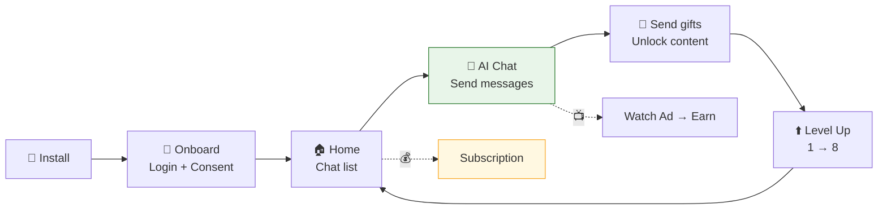
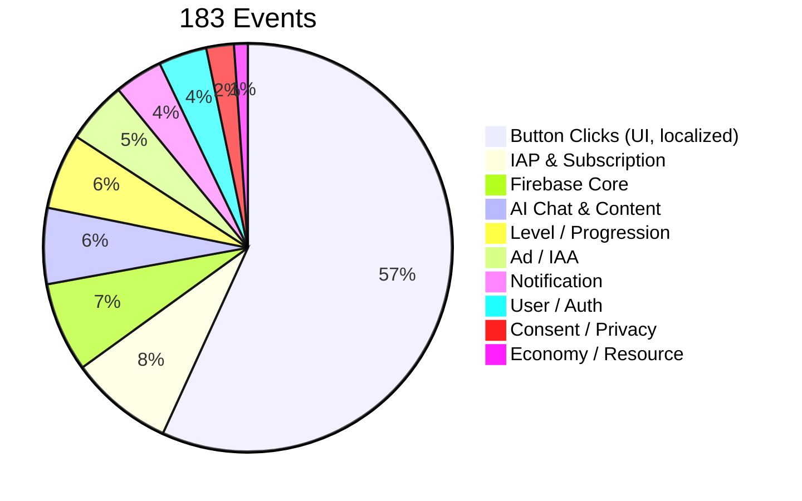
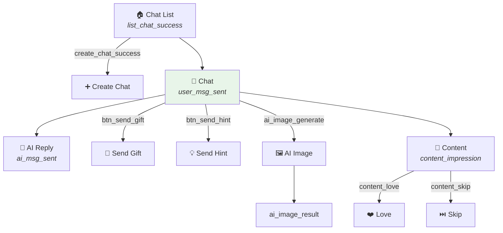
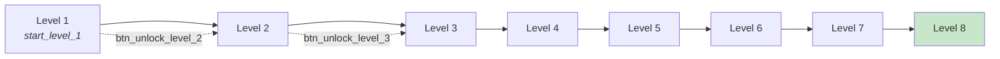

# Love AI · Virtual Character Chat
# Dashboard & Metric Guide

> **App:** Love AI — Virtual Character (`com.chatbotai.virtualcharacter.app`)
> **app_id:** `love_ai_virtual_character_android`
> **Platform:** Android (Google Play) | **Cập nhật:** T-1, ~05:00 UTC
> **Events:** 183 event types | **Bronze:** `bronze.fb_love_ai_virtual_character_android`

---

### Ai đọc tài liệu này?

| Team | Dashboards chính | Tần suất |
|------|-----------------|----------|
| **Product / Developer** | 1 (Overview), 3 (AI Chat), 4 (Progression), 6 (Onboarding) | Hàng tuần |
| **Marketing / Growth** | 1 (Overview), 2 (Retention) | Hàng ngày |
| **UA** | 2 (Retention), 8 (Attribution), 10 (ROI) | 2-3 lần/tuần |
| **Monetization** | 5 (IAP), 7 (IAA), 9 (Revenue) | 2-3 lần/tuần |
| **Mediation** | 7 (IAA), 9 (Revenue), 10 (Mediation) | Hàng ngày |

---

## App Profile & KPIs

Love AI là app **chat với AI virtual character**. User tạo/chọn nhân vật AI, trò chuyện, gửi quà, mở khóa content (ảnh, video) và level mới. Monetization qua **subscription** + **quảng cáo** (rewarded, interstitial, banner, native, app open).



**Core Product Loop:** Install → Login → Chat with AI → Send gifts/messages → Unlock photos/videos → Level up → More chat

**KPIs quan trọng nhất:**

| KPI | Ý nghĩa | Target tham khảo |
|-----|---------|-----------------|
| `chat_rate` | % DAU có gửi message | > 50% |
| `msg_per_user` | Số message TB / user / ngày | > 5 |
| `d1_retention` | % quay lại D1 | > 25% |
| `arpdau` | Revenue / DAU | — |
| `trial_to_sub_rate` | % trial → subscription | > 10% |
| `level_progression` | Level TB của active users | Tăng dần |

---

## Event Catalog — 183 Events

### Phân loại



### Events chính theo analytics

| Nhóm | Events | Metrics |
|------|--------|---------|
| **Firebase Core** | `session_start`, `user_engagement`, `first_open`, `screen_view`, `app_remove` | DAU, New Users, Sessions, Uninstall Rate |
| **AI Chat** | `user_msg_sent`, `ai_msg_sent`, `create_chat_success`, `list_chat_success`, `ai_image_generate`, `ai_image_result` | Chat Rate, Msg per User, AI Image Usage |
| **Content** | `content_impression`, `content_love`, `content_msg`, `content_skip` | Content Engagement Rate, Love vs Skip Ratio |
| **Level** | `level_start`, `level_exit`, `start_level_1`..`start_level_8`, `start_level_null` | Level Distribution, Level-up Rate, Drop Level |
| **Ad (5 format)** | `ad_impression1`(rewarded), `ad_impression2`(inter), `ad_impression3`(banner), `ad_impression4`(native), `ad_impression_custom`(app open), `ad_request`, `ad_complete`, `ad_reward` | eCPM, Fill Rate, Reward Rate |
| **IAP Funnel** | `iap_show`→`iap_click`→`iap_purchase`/`iap_close`, `in_app_purchase`, `iap_revenue` | Conversion Rate, ARPPU |
| **Subscription** | `subscription_canceled`, `subscription_expired`, `subscription_billing_retry_entered` | Churn Rate, Billing Retry |
| **Economy** | `resource_earn`, `resource_spend` | Economy Balance, Spend Rate |
| **Social** | `btn_like`, `btn_hate`, `btn_gift`, `btn_send_gift`, `btn_report`, `btn_delete` | Like/Hate Ratio, Gift Rate |
| **Unlock** | `btn_unlock_level_2`..`8`, `btn_unlock_a_photo`, `btn_unlock_a_video`, `btn_unlock_all_photo` | Unlock Rate, Monetization Trigger |
| **Notification** | `notification_permission_granted/denied`, `push_notification`, `request_notification` | Notification Opt-in Rate |
| **Auth** | `login_google_request/error`, `user_login`, `user_first_install` | Login Success Rate |
| **Buttons (localized)** | `btn_Flower`, `btn_Ring`, `btn_Coffee`, `btn_Letter`, `btn_Chocolate` (72 localized variants) | Gift Item Preference by Language |

### Gift Item Mapping (btn_ localized)

App dùng event name localized cho gift items. Các nhóm:

| Gift Item | Events (multi-language) |
|-----------|----------------------|
| **Flower** | `btn_Flower`, `btn_Fleur`, `btn_Blume`, `btn_Flor`, `btn_Hoa`, `btn_花`, `btn_꽃`, `btn_Kwiat`, `btn_Kukka`, `btn_Bunga`, `btn_Floare`, `btn_Virág`, `btn_زهرة` |
| **Ring** | `btn_Ring`, `btn_Anneau`, `btn_Anello`, `btn_Anillo`, `btn_Anel`, `btn_Nhẫn`, `btn_リング`, `btn_링`, `btn_Gyűrű`, `btn_Inel`, `btn_Cincin`, `btn_Pierścionek`, `btn_Renkaat`, `btn_حلقة`, `btn_แหวน`, `btn_戒指` |
| **Coffee** | `btn_Coffee`, `btn_Café`, `btn_Caffè`, `btn_Kaffee`, `btn_Kopi`, `btn_커피`, `btn_コーヒー`, `btn_Kawa`, `btn_Kahvi`, `btn_Kávé`, `btn_Cafea`, `btn_Koffie`, `btn_Kaffe`, `btn_قهوة`, `btn_กาแฟ`, `btn_咖啡` |
| **Letter** | `btn_Letter`, `btn_Lettre`, `btn_Lettera`, `btn_Brief`, `btn_Carta`, `btn_手紙`, `btn_رسالة`, `btn_จดหมาย` |
| **Chocolate** | `btn_Chocolate`, `btn_Chocolat`, `btn_Schokolade`, `btn_Czekoladowy`, `btn_Chocola`, `btn_巧克力`, `btn_초콜릿` |

---

## Data Sources

| Câu hỏi | Bảng | Layer |
|----------|------|-------|
| DAU, Revenue, ARPDAU? | `gold.fact_daily_app_metrics` | Gold ⚡ |
| Sessions, Engagement? | `gold.daily_overview` | Gold ⚡ |
| Retention cohort? | `gold.retention_overview` | Gold ⚡ |
| Chat rate, msg/user? | `gold.content_engagement` | Gold ⚡ |
| IAP funnel? | `gold.iap_performance` | Gold ⚡ |
| Ad eCPM by format? | `gold.ad_performance` | Gold ⚡ |
| Onboarding funnel? | `gold.onboarding_funnel` | Gold ⚡ |
| Revenue by country? | `silver.daily_app_revenue` | Silver ⚡ |
| Level distribution? | `silver.event_summary` | Silver ⚡ |
| Gift item popularity? | `silver.event_summary` | Silver ⚡ |
| Ad source eCPM? | `bronze.mediation_table` | Bronze ~1s |
| User journey? | `bronze.fb_*` | Bronze ~3s |

---

## Dashboard 1: Overview

> **Xem bởi:** Tất cả | **Filters:** Time range, Country

### Widget 1.1 · Daily Users & Revenue (Line + Bar)

```sql
SELECT f.date AS event_date, f.dau, e.new_users, f.dav,
    ROUND(f.total_revenue, 2) AS total_rev,
    ROUND(f.arpdau, 4) AS arpdau,
    e.paying_users, e.sessions
FROM gold.fact_daily_app_metrics f
LEFT JOIN silver.engagement e ON f.date = e.event_date AND e.app_id = f.app_id
WHERE f.app_id = 'love_ai_virtual_character_android'
  AND f.date BETWEEN '${start_date}' AND '${end_date}'
ORDER BY f.date;
```

### Widget 1.2 · Avg Sessions & Duration (Dual Line)

```sql
SELECT event_date,
    ROUND(sessions * 1.0 / NULLIF(dau, 0), 2) AS avg_sessions,
    ROUND(total_engagement_msec / NULLIF(dau, 0) / 60000.0, 1) AS avg_dur_min
FROM silver.engagement
WHERE app_id = 'love_ai_virtual_character_android'
  AND event_date BETWEEN '${start_date}' AND '${end_date}'
ORDER BY event_date;
```

### Widget 1.3 · Top Countries (Table)

```sql
WITH users AS (
    SELECT country, SUM(dau) AS dau, SUM(new_users) AS new_users
    FROM silver.geo WHERE app_id = 'love_ai_virtual_character_android'
      AND event_date BETWEEN '${start_date}' AND '${end_date}'
    GROUP BY country
),
rev AS (
    SELECT country, SUM(total_revenue) AS revenue
    FROM silver.daily_app_revenue WHERE app_id = 'love_ai_virtual_character_android'
      AND date BETWEEN '${start_date}' AND '${end_date}'
    GROUP BY country
)
SELECT u.country, u.dau,
    ROUND(u.dau * 100.0 / SUM(u.dau) OVER(), 1) AS user_pct,
    ROUND(r.revenue, 2) AS revenue,
    ROUND(r.revenue / NULLIF(u.dau, 0), 4) AS arpdau
FROM users u LEFT JOIN rev r ON u.country = r.country
ORDER BY u.dau DESC LIMIT 20;
```

### Widget 1.4 · Chat Adoption ⭐ (Line)

**KPI quan trọng nhất — % DAU thực sự chat.**

```sql
-- Từ gold.content_engagement (slot1 = chat_users)
SELECT event_date, dau,
    slot1_users AS chat_users,
    ROUND(slot1_users * 100.0 / NULLIF(dau, 0), 1) AS chat_rate,
    slot1_count AS total_messages
FROM gold.content_engagement
WHERE app_id = 'love_ai_virtual_character_android'
  AND event_date BETWEEN '${start_date}' AND '${end_date}'
ORDER BY event_date;
```

### Widget 1.5 · Uninstall Trend (Line)

```sql
SELECT event_date,
    SUM(CASE WHEN event_name = 'app_remove' THEN unique_users ELSE 0 END) AS uninstalls,
    SUM(CASE WHEN event_name = 'first_open' THEN unique_users ELSE 0 END) AS installs
FROM silver.event_summary
WHERE app_id = 'love_ai_virtual_character_android'
  AND event_date BETWEEN '${start_date}' AND '${end_date}'
  AND event_name IN ('app_remove', 'first_open')
GROUP BY event_date ORDER BY event_date;
```

---

## Dashboard 2: Engagement & Retention

> **Xem bởi:** UA, Marketing | **Filters:** Install time, Date range, Country

### Widget 2.1 · Retention by RDay (Table + Line)

```sql
SELECT retention_day, total_new_users, active_users,
    ROUND(retention_rate, 2) AS retention_rate,
    ROUND(avg_play_time_min, 1) AS avg_play_min,
    ROUND(total_ltv, 4) AS LTV, ROUND(impdau, 1) AS impdau
FROM gold.retention_overview
WHERE app_id = 'love_ai_virtual_character_android'
  AND install_date BETWEEN '${install_start}' AND '${install_end}'
ORDER BY retention_day;
```

### Widget 2.2 · Cohort Retention Heatmap

```sql
SELECT install_date,
    MAX(CASE WHEN retention_day = 0 THEN active_users END) AS D0,
    MAX(CASE WHEN retention_day = 1 THEN ROUND(retention_rate,1) END) AS D1,
    MAX(CASE WHEN retention_day = 3 THEN ROUND(retention_rate,1) END) AS D3,
    MAX(CASE WHEN retention_day = 7 THEN ROUND(retention_rate,1) END) AS D7,
    MAX(CASE WHEN retention_day = 14 THEN ROUND(retention_rate,1) END) AS D14,
    MAX(CASE WHEN retention_day = 30 THEN ROUND(retention_rate,1) END) AS D30
FROM gold.retention_overview
WHERE app_id = 'love_ai_virtual_character_android'
  AND install_date BETWEEN '${install_start}' AND '${install_end}'
GROUP BY install_date ORDER BY install_date;
```

### Widget 2.3 · Impact of Chat on Retention ⭐ (Grouped Bar)

**User chat nhiều tại D0 → retention có cao hơn?**

```sql
WITH d0_chat AS (
    SELECT user_pseudo_id,
        SUM(CASE WHEN event_name = 'user_msg_sent' THEN 1 ELSE 0 END) AS d0_msgs
    FROM bronze.fb_love_ai_virtual_character_android
    WHERE retention_day = 0 AND event_date BETWEEN '${time_start}' AND '${time_end}'
    GROUP BY user_pseudo_id
),
grouped AS (
    SELECT *, CASE WHEN d0_msgs=0 THEN '0 msgs' WHEN d0_msgs<=3 THEN '1-3 msgs'
        WHEN d0_msgs<=10 THEN '4-10 msgs' ELSE '11+ msgs' END AS grp
    FROM d0_chat
)
SELECT grp, COUNT(DISTINCT g.user_pseudo_id) AS users,
    ROUND(COUNT(DISTINCT CASE WHEN b.retention_day=1 THEN b.user_pseudo_id END)
        *100.0/NULLIF(COUNT(DISTINCT g.user_pseudo_id),0), 1) AS D1_ret,
    ROUND(COUNT(DISTINCT CASE WHEN b.retention_day=7 THEN b.user_pseudo_id END)
        *100.0/NULLIF(COUNT(DISTINCT g.user_pseudo_id),0), 1) AS D7_ret
FROM grouped g
LEFT JOIN bronze.fb_love_ai_virtual_character_android b
    ON g.user_pseudo_id = b.user_pseudo_id
    AND b.event_name IN ('session_start','user_engagement')
    AND b.event_date BETWEEN '${time_start}' AND '${time_end}'
GROUP BY grp ORDER BY grp;
```

---

## Dashboard 3: AI Chat & Content

> **Xem bởi:** Product | **Source:** `gold.content_engagement` + `silver.event_summary`

### Chat & Content Funnel



### Widget 3.1 · Chat Engagement (Line + KPIs)

| Metric | Ý nghĩa | Alert khi |
|--------|---------|-----------|
| `chat_rate` | % DAU gửi message | < 40% |
| `msg_per_user` | Messages / chat users | < 3 |
| `ai_response_rate` | AI replies / user msgs | < 80% |

```sql
SELECT event_date, dau,
    slot1_users AS chat_users,
    slot1_count AS user_messages,
    slot2_count AS ai_messages,
    ROUND(slot1_users * 100.0 / NULLIF(dau, 0), 1) AS chat_rate,
    ROUND(slot1_count * 1.0 / NULLIF(slot1_users, 0), 1) AS msg_per_user,
    ROUND(slot2_count * 100.0 / NULLIF(slot1_count, 0), 1) AS ai_response_rate
FROM gold.content_engagement
WHERE app_id = 'love_ai_virtual_character_android'
  AND event_date BETWEEN '${start_date}' AND '${end_date}'
ORDER BY event_date;
```

### Widget 3.2 · AI Image Usage (Line)

```sql
SELECT event_date,
    slot3_count AS image_generates,
    slot4_count AS image_results,
    ROUND(slot4_count * 100.0 / NULLIF(slot3_count, 0), 1) AS success_rate
FROM gold.content_engagement
WHERE app_id = 'love_ai_virtual_character_android'
  AND event_date BETWEEN '${start_date}' AND '${end_date}'
ORDER BY event_date;
```

### Widget 3.3 · Content Love vs Skip (Stacked Bar)

```sql
SELECT event_date,
    slot5_count AS content_impressions,
    slot6_count AS content_loves,
    slot7_count AS content_skips,
    ROUND(slot6_count * 100.0 / NULLIF(slot5_count, 0), 1) AS love_rate,
    ROUND(slot7_count * 100.0 / NULLIF(slot5_count, 0), 1) AS skip_rate
FROM gold.content_engagement
WHERE app_id = 'love_ai_virtual_character_android'
  AND event_date BETWEEN '${start_date}' AND '${end_date}'
ORDER BY event_date;
```

### Widget 3.4 · Gift Item Popularity (Horizontal Bar)

```sql
-- Aggregate localized btn_ events into gift categories
SELECT
    CASE
        WHEN event_name IN ('btn_Flower','btn_Fleur','btn_Blume','btn_Flor',
            'btn_Hoa','btn_花','btn_꽃','btn_Kwiat','btn_Kukka','btn_Bunga',
            'btn_Floare','btn_Virág','btn_زهرة') THEN 'Flower'
        WHEN event_name IN ('btn_Ring','btn_Anneau','btn_Anello','btn_Anillo',
            'btn_Anel','btn_Nhẫn','btn_リング','btn_링','btn_Gyűrű','btn_Inel',
            'btn_Cincin','btn_Pierścionek','btn_Renkaat','btn_حلقة','btn_แหวน','btn_戒指') THEN 'Ring'
        WHEN event_name IN ('btn_Coffee','btn_Café','btn_Caffè','btn_Kaffee',
            'btn_Kopi','btn_커피','btn_コーヒー','btn_Kawa','btn_Kahvi','btn_Kávé',
            'btn_Cafea','btn_Koffie','btn_Kaffe','btn_قهوة','btn_กาแฟ','btn_咖啡') THEN 'Coffee'
        WHEN event_name IN ('btn_Letter','btn_Lettre','btn_Lettera','btn_Brief',
            'btn_Carta','btn_手紙','btn_رسالة','btn_จดหมาย') THEN 'Letter'
        WHEN event_name IN ('btn_Chocolate','btn_Chocolat','btn_Schokolade',
            'btn_Czekoladowy','btn_Chocola','btn_巧克力','btn_초콜릿') THEN 'Chocolate'
        ELSE 'Other'
    END AS gift_item,
    SUM(event_count) AS total_sends, SUM(unique_users) AS senders
FROM silver.event_summary
WHERE app_id = 'love_ai_virtual_character_android'
  AND event_date BETWEEN '${start_date}' AND '${end_date}'
  AND event_name LIKE 'btn_%'
  AND event_name NOT LIKE 'btn_unlock%' AND event_name NOT LIKE 'btn_send%'
  AND event_name NOT LIKE 'btn_floating%' AND event_name NOT IN (
      'btn_ai_profile','btn_delete','btn_gift','btn_hate','btn_hint',
      'btn_language','btn_level','btn_like','btn_more_chat','btn_photo',
      'btn_report','btn_scenario','btn_store','btn_open_photo_detail',
      'btn_open_video_detail','button_click')
GROUP BY gift_item ORDER BY total_sends DESC;
```

### Widget 3.5 · Social Actions (Bar)

```sql
SELECT event_date,
    SUM(CASE WHEN event_name = 'btn_like' THEN event_count ELSE 0 END) AS likes,
    SUM(CASE WHEN event_name = 'btn_hate' THEN event_count ELSE 0 END) AS hates,
    SUM(CASE WHEN event_name IN ('btn_gift','btn_send_gift') THEN event_count ELSE 0 END) AS gifts,
    SUM(CASE WHEN event_name = 'btn_report' THEN event_count ELSE 0 END) AS reports
FROM silver.event_summary
WHERE app_id = 'love_ai_virtual_character_android'
  AND event_date BETWEEN '${start_date}' AND '${end_date}'
  AND event_name IN ('btn_like','btn_hate','btn_gift','btn_send_gift','btn_report')
GROUP BY event_date ORDER BY event_date;
```

---

## Dashboard 4: Level & Progression

> **Xem bởi:** Product | **Source:** `silver.event_summary`

### Progression Flow



### Widget 4.1 · Level Distribution (Horizontal Bar)

```sql
SELECT event_name AS level,
    SUM(event_count) AS starts, SUM(unique_users) AS users
FROM silver.event_summary
WHERE app_id = 'love_ai_virtual_character_android'
  AND event_date BETWEEN '${start_date}' AND '${end_date}'
  AND event_name LIKE 'start_level_%'
GROUP BY event_name ORDER BY event_name;
```

### Widget 4.2 · Level Unlock Rate (Funnel)

```sql
SELECT event_name,
    SUM(unique_users) AS users
FROM silver.event_summary
WHERE app_id = 'love_ai_virtual_character_android'
  AND event_date BETWEEN '${start_date}' AND '${end_date}'
  AND event_name IN ('btn_unlock_level_2','btn_unlock_level_3','btn_unlock_level_4',
      'btn_unlock_level_5','btn_unlock_level_6','btn_unlock_level_7','btn_unlock_level_8')
GROUP BY event_name ORDER BY event_name;
```

### Widget 4.3 · Economy Balance (Dual Line)

```sql
SELECT event_date,
    SUM(CASE WHEN event_name = 'resource_earn' THEN event_count ELSE 0 END) AS earned,
    SUM(CASE WHEN event_name = 'resource_spend' THEN event_count ELSE 0 END) AS spent
FROM silver.event_summary
WHERE app_id = 'love_ai_virtual_character_android'
  AND event_date BETWEEN '${start_date}' AND '${end_date}'
  AND event_name IN ('resource_earn', 'resource_spend')
GROUP BY event_date ORDER BY event_date;
```

---

## Dashboard 5: IAP & Subscription

> **Xem bởi:** Monetization | **Source:** `gold.iap_performance`

### Widget 5.1 · IAP Funnel (Funnel)

```sql
SELECT event_date,
    SUM(iap_shows) AS shows, SUM(iap_clicks) AS clicks,
    SUM(iap_purchases) AS purchases, SUM(iap_closes) AS closes,
    show_to_purchase_rate, click_to_purchase_rate,
    ROUND(SUM(iap_revenue_usd), 2) AS revenue
FROM gold.iap_performance
WHERE app_id = 'love_ai_virtual_character_android'
  AND event_date BETWEEN '${start_date}' AND '${end_date}'
GROUP BY event_date, show_to_purchase_rate, click_to_purchase_rate
ORDER BY event_date;
```

### Widget 5.2 · Subscription Health (Stacked Area)

```sql
SELECT event_date,
    SUM(sub_cancels) AS cancels, SUM(sub_expires) AS expires,
    SUM(CASE WHEN event_name = 'subscription_billing_retry_entered' THEN 1 ELSE 0 END) AS billing_retry
FROM gold.iap_performance
WHERE app_id = 'love_ai_virtual_character_android'
  AND event_date BETWEEN '${start_date}' AND '${end_date}'
GROUP BY event_date ORDER BY event_date;
```

### Widget 5.3 · Pay Rate by Country (Table)

```sql
SELECT country, SUM(active_users) AS active, SUM(iap_users) AS payers,
    pay_rate, ROUND(SUM(iap_revenue_usd), 2) AS revenue, arppu
FROM gold.iap_performance
WHERE app_id = 'love_ai_virtual_character_android'
  AND event_date BETWEEN '${start_date}' AND '${end_date}'
GROUP BY country, pay_rate, arppu HAVING active >= 100
ORDER BY revenue DESC LIMIT 20;
```

### Widget 5.4 · Remove Ads Dialog (Line)

```sql
SELECT event_date,
    SUM(CASE WHEN event_name = 'show_dialog_remove_ads' THEN event_count ELSE 0 END) AS dialog_shown,
    SUM(CASE WHEN event_name = 'show_dialog_remove_ads' THEN unique_users ELSE 0 END) AS users_shown
FROM silver.event_summary
WHERE app_id = 'love_ai_virtual_character_android'
  AND event_date BETWEEN '${start_date}' AND '${end_date}'
  AND event_name = 'show_dialog_remove_ads'
GROUP BY event_date ORDER BY event_date;
```

---

## Dashboard 6: Onboarding

> **Xem bởi:** Product | **Source:** `gold.onboarding_funnel`

### Widget 6.1 · Onboarding Funnel

```sql
-- Love AI onboarding: Install → Login → Consent → First Chat
SELECT event_date,
    step1_name, step1_users,  -- first_open
    step2_name, step2_users,  -- user_login
    step3_name, step3_users,  -- ConsentUpdate_Available
    step4_name, step4_users,  -- create_chat_success
    step5_name, step5_users,  -- user_msg_sent (first message)
    completion_rate
FROM gold.onboarding_funnel
WHERE app_id = 'love_ai_virtual_character_android'
  AND event_date BETWEEN '${start_date}' AND '${end_date}'
ORDER BY event_date;
```

### Widget 6.2 · Notification Opt-in (KPI)

```sql
SELECT event_date,
    SUM(CASE WHEN event_name = 'notification_permission_granted' THEN unique_users ELSE 0 END) AS granted,
    SUM(CASE WHEN event_name = 'notification_permission_denied' THEN unique_users ELSE 0 END) AS denied
FROM silver.event_summary
WHERE app_id = 'love_ai_virtual_character_android'
  AND event_date BETWEEN '${start_date}' AND '${end_date}'
  AND event_name IN ('notification_permission_granted','notification_permission_denied')
GROUP BY event_date ORDER BY event_date;
```

### Widget 6.3 · Login Success Rate (Line)

```sql
SELECT event_date,
    SUM(CASE WHEN event_name = 'login_google_request' THEN unique_users ELSE 0 END) AS attempts,
    SUM(CASE WHEN event_name = 'login_google_error' THEN unique_users ELSE 0 END) AS errors,
    SUM(CASE WHEN event_name = 'user_login' THEN unique_users ELSE 0 END) AS success
FROM silver.event_summary
WHERE app_id = 'love_ai_virtual_character_android'
  AND event_date BETWEEN '${start_date}' AND '${end_date}'
  AND event_name IN ('login_google_request','login_google_error','user_login')
GROUP BY event_date ORDER BY event_date;
```

---

## Dashboard 7: IAA (Firebase)

> **Xem bởi:** Mediation | **Source:** `gold.ad_performance`

### Widget 7.1 · Ad Metrics by Format

```sql
SELECT ad_format,
    SUM(impressions) AS imp, ecpm, ctr, fill_rate,
    ad_user_percent, video_complete_rate, reward_rate
FROM gold.ad_performance
WHERE app_id = 'love_ai_virtual_character_android'
  AND event_date BETWEEN '${start_date}' AND '${end_date}'
GROUP BY ad_format, ecpm, ctr, fill_rate, ad_user_percent, video_complete_rate, reward_rate
ORDER BY imp DESC;
```

### Widget 7.2 · eCPM Trend (Multi-line)

```sql
SELECT event_date, ad_format,
    ROUND(SUM(ad_revenue)/NULLIF(SUM(impressions),0)*1000, 2) AS ecpm
FROM gold.ad_performance
WHERE app_id = 'love_ai_virtual_character_android'
  AND event_date BETWEEN '${start_date}' AND '${end_date}'
GROUP BY event_date, ad_format ORDER BY event_date;
```

---

## Dashboard 8: UA & Attribution

> **Xem bởi:** UA | **Source:** Bronze (user_properties)

### Widget 8.1 · Install Source Quality

```sql
WITH src AS (
    SELECT COALESCE(get_json_string(raw_event_json,'$.app_info.install_source'),'Unknown') AS source,
        user_pseudo_id
    FROM bronze.fb_love_ai_virtual_character_android
    WHERE event_name = 'first_open' AND event_date BETWEEN '${start_date}' AND '${end_date}'
)
SELECT source, COUNT(DISTINCT s.user_pseudo_id) AS installs,
    ROUND(COUNT(DISTINCT CASE WHEN b.retention_day=1 THEN b.user_pseudo_id END)
        *100.0/NULLIF(COUNT(DISTINCT s.user_pseudo_id),0), 1) AS d1_ret
FROM src s LEFT JOIN bronze.fb_love_ai_virtual_character_android b
    ON s.user_pseudo_id = b.user_pseudo_id
    AND b.event_name IN ('session_start','user_engagement')
    AND b.event_date BETWEEN '${start_date}' AND DATE_ADD('${end_date}', INTERVAL 14 DAY)
GROUP BY source ORDER BY installs DESC;
```

---

## Dashboard 9-10: Revenue & Mediation

> Giống AR Tracer — dùng `gold.fact_daily_app_metrics`, `silver.daily_app_revenue`, `bronze.admob_table`, `bronze.mediation_table` với `app_id = 'love_ai_virtual_character_android'`.
> Xem AR Tracer Dashboard Guide sections 9-10 cho query patterns.

---

## gold.content_engagement INSERT cho Love AI

```sql
-- Slot mapping cho Love AI (khác hoàn toàn AR Tracer):
DELETE FROM gold.content_engagement
WHERE app_id = '${app_id}' AND event_date = '${target_date}';

INSERT INTO gold.content_engagement
SELECT es.event_date, '${app_id}', NULL, e.dau,
    -- Slot 1: User messages sent
    'user_messages', SUM(CASE WHEN es.event_name = 'user_msg_sent' THEN es.unique_users ELSE 0 END),
    SUM(CASE WHEN es.event_name = 'user_msg_sent' THEN es.event_count ELSE 0 END),
    -- Slot 2: AI messages
    'ai_messages', SUM(CASE WHEN es.event_name = 'ai_msg_sent' THEN es.unique_users ELSE 0 END),
    SUM(CASE WHEN es.event_name = 'ai_msg_sent' THEN es.event_count ELSE 0 END),
    -- Slot 3: AI image generate
    'ai_image_gen', SUM(CASE WHEN es.event_name = 'ai_image_generate' THEN es.unique_users ELSE 0 END),
    SUM(CASE WHEN es.event_name = 'ai_image_generate' THEN es.event_count ELSE 0 END),
    -- Slot 4: AI image result
    'ai_image_result', SUM(CASE WHEN es.event_name = 'ai_image_result' THEN es.unique_users ELSE 0 END),
    SUM(CASE WHEN es.event_name = 'ai_image_result' THEN es.event_count ELSE 0 END),
    -- Slot 5: Content impression
    'content_imp', SUM(CASE WHEN es.event_name = 'content_impression' THEN es.unique_users ELSE 0 END),
    SUM(CASE WHEN es.event_name = 'content_impression' THEN es.event_count ELSE 0 END),
    -- Slot 6: Content love
    'content_love', SUM(CASE WHEN es.event_name = 'content_love' THEN es.unique_users ELSE 0 END),
    SUM(CASE WHEN es.event_name = 'content_love' THEN es.event_count ELSE 0 END),
    -- Slot 7: Content skip
    'content_skip', SUM(CASE WHEN es.event_name = 'content_skip' THEN es.unique_users ELSE 0 END),
    SUM(CASE WHEN es.event_name = 'content_skip' THEN es.event_count ELSE 0 END),
    -- Slot 8: Create chat
    'create_chat', SUM(CASE WHEN es.event_name = 'create_chat_success' THEN es.unique_users ELSE 0 END),
    SUM(CASE WHEN es.event_name = 'create_chat_success' THEN es.event_count ELSE 0 END),
    -- Slot 9: Gifts sent
    'gifts_sent', SUM(CASE WHEN es.event_name IN ('btn_send_gift','btn_gift') THEN es.unique_users ELSE 0 END),
    SUM(CASE WHEN es.event_name IN ('btn_send_gift','btn_gift') THEN es.event_count ELSE 0 END),
    -- Slot 10: Unlock content
    'unlock_content',
    SUM(CASE WHEN es.event_name IN ('btn_unlock_a_photo','btn_unlock_a_video','btn_unlock_all_photo')
        THEN es.unique_users ELSE 0 END),
    SUM(CASE WHEN es.event_name IN ('btn_unlock_a_photo','btn_unlock_a_video','btn_unlock_all_photo')
        THEN es.event_count ELSE 0 END),
    NULL, NULL, NULL
FROM silver.event_summary es
JOIN silver.engagement e ON es.event_date = e.event_date AND es.app_id = e.app_id
WHERE es.app_id = '${app_id}' AND es.event_date = '${target_date}'
GROUP BY es.event_date, e.dau;
```

### gold.onboarding_funnel INSERT cho Love AI

```sql
DELETE FROM gold.onboarding_funnel
WHERE app_id = '${app_id}' AND event_date = '${target_date}';

INSERT INTO gold.onboarding_funnel
SELECT event_date, '${app_id}', NULL,
    'first_open', SUM(CASE WHEN event_name = 'first_open' THEN unique_users ELSE 0 END),
    'user_login', SUM(CASE WHEN event_name = 'user_login' THEN unique_users ELSE 0 END),
    'consent_available', SUM(CASE WHEN event_name = 'ConsentUpdate_Available' THEN unique_users ELSE 0 END),
    'notification_granted', SUM(CASE WHEN event_name = 'notification_permission_granted' THEN unique_users ELSE 0 END),
    'create_chat', SUM(CASE WHEN event_name = 'create_chat_success' THEN unique_users ELSE 0 END),
    'first_message', SUM(CASE WHEN event_name = 'user_msg_sent' THEN unique_users ELSE 0 END),
    'level_start', SUM(CASE WHEN event_name = 'level_start' THEN unique_users ELSE 0 END),
    'start_level_2', SUM(CASE WHEN event_name = 'start_level_2' THEN unique_users ELSE 0 END),
    NULL, NULL, NULL, NULL, NULL, NULL, NULL, NULL
FROM silver.event_summary
WHERE app_id = '${app_id}' AND event_date = '${target_date}'
GROUP BY event_date;
```

---

## Business Glossary — Love AI

| Chỉ số | Định nghĩa | Công thức |
|--------|-------------|-----------|
| **Chat Rate** | % DAU gửi ≥ 1 message | user_msg_sent users / DAU × 100 |
| **Msg per User** | Messages TB / chat user | user_msg_sent count / user_msg_sent users |
| **AI Response Rate** | % user msgs có AI reply | ai_msg_sent / user_msg_sent × 100 |
| **Content Love Rate** | % content được like | content_love / content_impression × 100 |
| **Gift Rate** | % DAU gửi gift | gift senders / DAU × 100 |
| **Level-up Rate** | % users unlock next level | unlock_level_N users / start_level_(N-1) users × 100 |
| **Economy Balance** | Earn vs Spend ratio | resource_earn / resource_spend |
| Các metrics chung (DAU, Retention, ARPDAU, eCPM...) | Xem Business Glossary ở AR Tracer Guide | — |

---

## Cách đọc số liệu & Hành động

| Tín hiệu | Dashboard | Hành động |
|-----------|-----------|-----------|
| Chat rate giảm | 3 AI Chat | Check AI response time, error rate |
| Content skip rate tăng | 3 Content | Review content quality, relevance |
| Level progression chậm | 4 Progression | Economy balance? Unlock difficulty? |
| Uninstall spike | 1 Overview | Check app_exception, recent update |
| Subscription cancel tăng | 5 IAP | Check billing retry, pricing |
| Like/Hate ratio xấu | 3 Social | Review AI character quality |
| Login error tăng | 6 Onboarding | Check Google auth integration |
