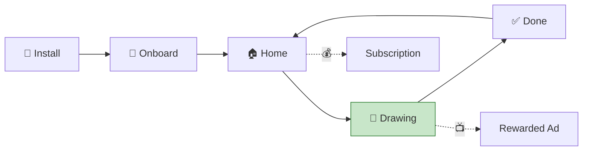
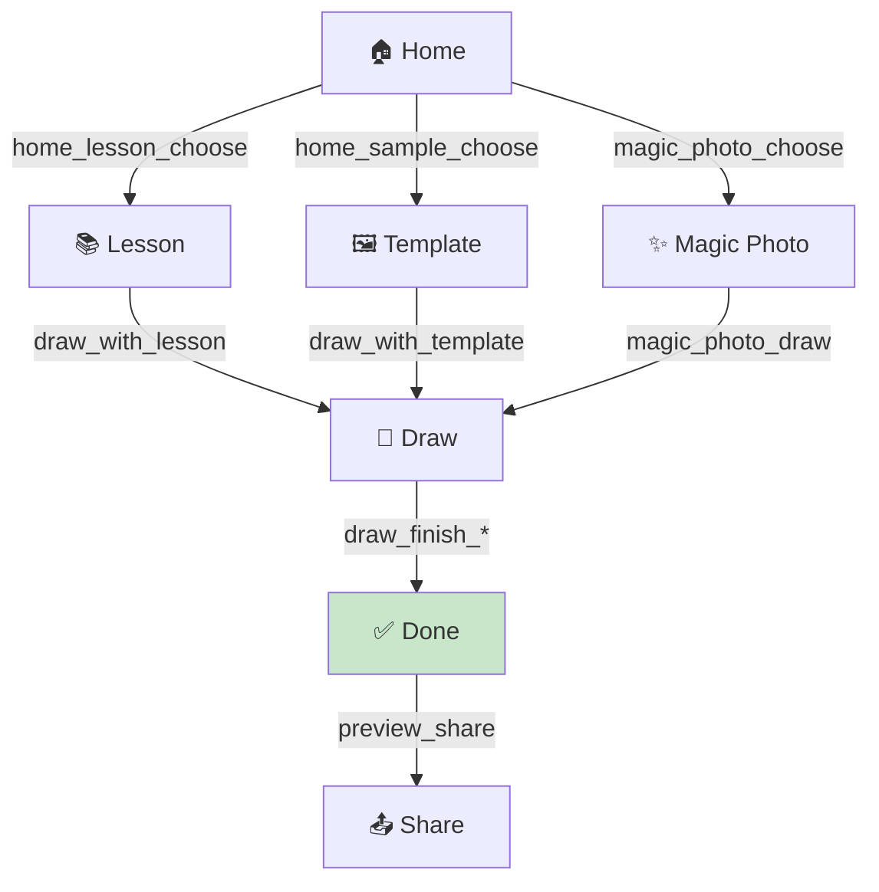
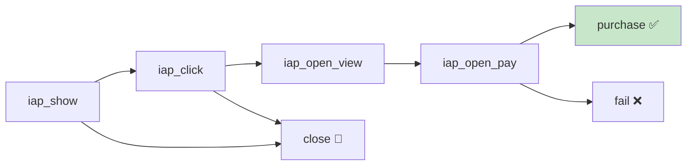
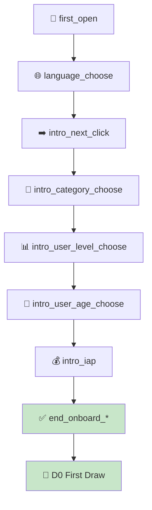

# AR Tracer · Trace Drawing iOS
# Dashboard & Metric Guide v2

> **App:** AR Tracer — Trace Drawing iOS (`com.avntech.ar-drawing`)
> **app_id:** `ar_tracer_trace_drawing_ios`
> **Platform:** iOS | **Cập nhật dữ liệu:** T-1, sẵn sàng ~05:00 UTC
> **Kiến trúc:** Multi-tenant Silver/Gold + `event_summary` (xem tài liệu hệ thống)
> **Dashboard tool:** Apache Superset

---

### Ai đọc tài liệu này?

| Team | Dashboards chính | Tần suất check |
|------|-----------------|----------------|
| **Marketing / Growth** | 1 (Overview), 9 (Revenue) | Hàng ngày |
| **UA (User Acquisition)** | 2 (Retention), 8 (Attribution), 11 (ROI) | 2-3 lần/tuần |
| **Product / Developer** | 3 (Content), 6 (Onboarding), 7 (Drop-off) | Hàng tuần |
| **Monetization / IAP** | 5 (IAP & Subscription) | 2-3 lần/tuần |
| **Mediation** | 4 (IAA), 9 (Revenue), 10 (Waterfall) | Hàng ngày |

---

## Mục lục

- [App Profile & KPIs](#app-profile--kpis)
- [Event Catalog — 290 Events](#event-catalog--290-events)
- [Data Sources](#data-sources)
- [Dashboard 1: Overview](#dashboard-1-overview)
- [Dashboard 2: Engagement & Retention](#dashboard-2-engagement--retention)
- [Dashboard 3: Content & Drawing](#dashboard-3-content--drawing)
- [Dashboard 4: IAA (Firebase)](#dashboard-4-iaa-firebase)
- [Dashboard 5: IAP & Subscription](#dashboard-5-iap--subscription)
- [Dashboard 6: Onboarding & Activation](#dashboard-6-onboarding--activation)
- [Dashboard 7: Drop-off & Churn](#dashboard-7-drop-off--churn)
- [Dashboard 8: UA & Attribution](#dashboard-8-ua--attribution)
- [Dashboard 9: Revenue & Monetization (AdMob)](#dashboard-9-revenue--monetization-admob)
- [Dashboard 10: Mediation & Waterfall](#dashboard-10-mediation--waterfall)
- [Dashboard 11: UA Performance & ROI](#dashboard-11-ua-performance--roi)
- [Business Glossary](#business-glossary)
- [Cách đọc số liệu & Hành động](#cách-đọc-số-liệu--hành-động)
- [Superset Configuration](#superset-configuration)
  - [Virtual Datasets](#virtual-datasets)
  - [Ad-hoc Filters](#ad-hoc-filters)
  - [Metrics Definitions](#metrics-definitions)
  - [Caching Strategy](#caching-strategy)
  - [StarRocks Views](#starrocks-views-optional)
- [Implementation Checklist](#implementation-checklist)

---

## App Profile & KPIs

AR Tracer là app **vẽ tranh qua camera AR**. User chọn lesson/template, rồi vẽ theo hình mẫu hiện trên camera. Monetization: **subscription** (trial → paid) + **quảng cáo** (rewarded, interstitial, banner, native, app open).



**KPIs quan trọng nhất:**

| KPI | Ý nghĩa | Target | Dashboard |
|-----|---------|--------|-----------|
| `drawing_rate` | % DAU có vẽ | > 40% | 1, 3 |
| `d0_activation_rate` | % install vẽ ngay D0 | > 25% | 6 |
| `d1_retention` | % quay lại D1 | > 30% | 2 |
| `arpdau` | Revenue / DAU | — | 9 |
| `trial_to_sub_rate` | % trial → paid | > 15% | 5 |
| `lesson_completion_rate` | % bắt đầu → hoàn thành | > 50% | 3 |
| `ecpm` | Revenue / 1000 imp | — | 4, 10 |

---

## Event Catalog — 290 Events

### Phân loại chính

| Nhóm | Số lượng | Events chính | Dùng cho |
|------|---------|-------------|---------|
| **Firebase Core** | 4 | `session_start`, `user_engagement`, `first_open`, `screen_view` | engagement, retention |
| **Ad (6 format)** | 12 | `ad_impression` (standard), `ad_impression1` (rewarded), `2` (inter), `3` (banner), `4` (native), `_custom` (app open), `ad_clicked`, `ad_complete`, `ad_reward`, `ad_request`, `ad_load_fail` | ad_metrics |
| **IAP & Sub** | 20 | `iap_show→click→open_view→open_pay→purchase/fail/close`, `trial_started/canceled/expired`, `subscription_upgraded/canceled/expired`, `refund` | iap_metrics |
| **Drawing** | 20 | `draw_with_lesson/template`, `lessons_free/Pro_start_drawing`, `draw_finish_with_*`, `content_start/draw/done`, `drawing_capture*`, `magic_photo_*` | event_summary |
| **Onboarding** | 17 | `language_choose→intro_next_click→intro_category_choose→intro_user_level_choose→intro_user_age_choose→intro_iap→end_onboard_*` | event_summary |
| **Browse** | 108 | `browser_category_*` (Animals×18, Cute×19, Nature×15, Realistic×14...) | event_summary |
| **Share** | 5 | `preview_share`, `preview_lesson_share`, `preview_template_share`, `my_creative_share` | event_summary |
| **Attribution** | 6 | `af_onConversionDataSuccess/Fail`, `Campain_Applied` + user_properties (`af_status`, `af_message`) | Bronze direct |

### Ad Format Mapping (đặc thù app)

| Event | Format | eCPM thường |
|-------|--------|------------|
| `ad_impression1` | Rewarded Video | Cao nhất |
| `ad_impression2` | Interstitial | Cao |
| `ad_impression3` | Banner | Thấp |
| `ad_impression4` | Native | Trung bình |
| `ad_impression_custom` | App Open | Trung bình |

---

## Data Sources

### Bảng nào cho câu hỏi nào?

| Câu hỏi | Bảng | Layer |
|----------|------|-------|
| DAU, Revenue, ARPDAU hôm qua? | `gold.fact_daily_app_metrics` | Gold ⚡ |
| DAU trend, sessions, engagement? | `gold.daily_overview` | Gold ⚡ |
| Retention D1/D7 cohort? | `gold.retention_overview` | Gold ⚡ |
| Revenue by country? | `silver.daily_app_revenue` | Silver ⚡ |
| Drawing rate, lesson completion? | `gold.content_engagement` | Gold ⚡ |
| Onboarding funnel? | `gold.onboarding_funnel` | Gold ⚡ |
| Top content categories? | `silver.event_summary` | Silver ⚡ |
| eCPM by format (Firebase)? | `gold.ad_performance` | Gold ⚡ |
| IAP conversion funnel? | `gold.iap_performance` | Gold ⚡ |
| eCPM by ad source (AdMob)? | `bronze.mediation_table` | Bronze ~1s |
| Ad unit revenue? | `bronze.admob_table` | Bronze ~1s |
| User journey cá nhân? | `bronze.fb_*` | Bronze ~3s |
| Attribution quality? | `bronze.fb_*` (user_properties) | Bronze ~3s |
| Map country code ↔ name? | `silver.dim_country` | Dimension ⚡ |
| App identifiers mapping? | `silver.dim_app_identifiers` | Dimension ⚡ |

### Dimension Tables

| Bảng | Mục đích | Columns chính |
|------|----------|---------------|
| `silver.dim_country` | Map ISO code (US, TH) ↔ tên đầy đủ | `country_code`, `country_name`, `country_name_firebase`, `region`, `tier` |
| `silver.dim_app_identifiers` | Map AdMob App ID ↔ Firebase ID | `admob_app_id`, `firebase_id`, `display_name`, `platform` |

**Lưu ý quan trọng:**
- `silver.geo.country` = tên đầy đủ từ Firebase (vd: `Thailand`, `United States`)
- `silver.daily_app_revenue.country` = ISO code từ AdMob (vd: `TH`, `US`)
- `bronze.mediation_table.country` = ISO code từ AdMob (vd: `TH`, `US`)
- Khi JOIN cross-source, **phải dùng `dim_country`** để map

---

## Dashboard 1: Overview

> **Xem bởi:** Tất cả | **Dataset:** `ds_daily_overview` | **Filters:** Time Range, App

### Layout

```
╔══════════════════════════════════════════════════════════════════════════════╗
║  📊 AR Tracer — Overview                          [ Last 30 days ▾ ] 🔄   ║
╠═══════════════╦═══════════════╦═══════════════╦══════════════════════════════╣
║  DAU          ║  New Users    ║  Revenue      ║  ARPDAU                      ║
║  ████ 12,450  ║  ████  3,210  ║  ████ $1,582  ║  ████ $0.0042                ║
║  ▲ 5.2% WoW  ║  ▼ 2.1% WoW  ║  ▲ 8.3% WoW  ║  ▲ 3.0% WoW                 ║
║  Chart 1.1    ║  Chart 1.1    ║  Chart 1.1    ║  Chart 1.1                   ║
╠═══════════════════════════════════════════════╦══════════════════════════════╣
║  Chart 1.2 · Daily Users & Revenue Trend      ║  Chart 1.3 · Sessions &      ║
║  ┌───────────────────────────────────────┐    ║  Duration                    ║
║  │ ▓▓▓   ▓▓▓▓  ▓▓▓  ▓▓▓▓▓ ▓▓▓   ← DAU │    ║  ┌────────────────────────┐  ║
║  │ ▒▒▒   ▒▒▒▒  ▒▒▒  ▒▒▒▒▒ ▒▒▒   ← New │    ║  │  ╱╲  ╱╲               │  ║
║  │  ──╱──────╲──────╱───── ← Rev        │    ║  │ ╱  ╲╱  ╲  ← Sessions  │  ║
║  │                          ← ARPDAU    │    ║  │ ─────── ── ← Duration  │  ║
║  │ Mar01  Mar02  Mar03  Mar04  Mar05    │    ║  │ Mar01   Mar03  Mar05   │  ║
║  └───────────────────────────────────────┘    ║  └────────────────────────┘  ║
║  [Line+Bar] X:event_date Y-L:users Y-R:$     ║  [Line] X:event_date         ║
║  W: 8/12 cols                                 ║  W: 4/12 cols                ║
╠═══════════════════════════════════════════════╦══════════════════════════════╣
║  Chart 1.4 · Top Countries                    ║  Chart 1.5 · Drawing ⭐      ║
║  ┌─────────────────────────────────────────┐  ║  ┌────────────────────────┐  ║
║  │ Country   │ DAU  │ Rev   │ eCPM │ARPDAU│  ║  │  ╱──╲  ╱───╲          │  ║
║  │───────────┼──────┼───────┼──────┼──────│  ║  │ ╱    ╲╱     ╲ ←Rate   │  ║
║  │ 🇺🇸 US    │5,200 │$820   │$8.50 │.0066│  ║  │───────────── ←Users   │  ║
║  │ 🇯🇵 JP    │1,800 │$320   │$12.2 │.0059│  ║  │ 40%──────── target    │  ║
║  │ 🇹🇭 TH    │1,200 │$ 95   │$3.20 │.0026│  ║  │ Mar01   Mar03  Mar05  │  ║
║  │ ...       │      │       │      │      │  ║  └────────────────────────┘  ║
║  └─────────────────────────────────────────┘  ║  [Line] ds_content           ║
║  [Table] ds_revenue_country | 20 rows         ║  W: 4/12 cols                ║
║  W: 8/12 cols                                 ║                              ║
╠═══════════════════════════════════════════════╩══════════════════════════════╣
║  Chart 1.6 · Device & OS                                                    ║
║  ┌──────────────────────────────────────────────────────────────────────┐    ║
║  │ Model            │ OS Version │ Users │   %  │                      │    ║
║  │──────────────────┼────────────┼───────┼──────│                      │    ║
║  │ iPhone 13 Pro    │ iOS 17.4   │ 1,250 │ 10.0%│                      │    ║
║  │ iPhone 14        │ iOS 17.5   │   980 │  7.9%│                      │    ║
║  └──────────────────────────────────────────────────────────────────────┘    ║
║  [Table] ds_daily_overview | 20 rows | W: 12/12 cols                        ║
╚══════════════════════════════════════════════════════════════════════════════╝
```

### Chart 1.1 · KPI Cards

| Chart Type | Big Number with Trendline |
|------------|---------------------------|
| **Dataset** | `ds_daily_overview` |
| **Time Column** | `event_date` |

| Card | Metric | Format | Alert |
|------|--------|--------|-------|
| DAU | `SUM(dau)` | #,### | < 10% WoW |
| New Users | `SUM(new_users)` | #,### | < 20% WoW |
| Revenue | `SUM(total_revenue)` | $#,###.## | < 15% WoW |
| ARPDAU | `SUM(total_revenue)/SUM(dau)` | $0.0000 | < 10% WoW |

---

### Chart 1.2 · Daily Users & Revenue Trend

| Property | Value |
|----------|-------|
| **Chart Type** | Mixed Chart (Line + Bar) |
| **Dataset** | `ds_daily_overview` |
| **X-Axis** | `event_date` (TIME) |

| Series | Metric | Chart Type | Y-Axis |
|--------|--------|------------|--------|
| DAU | `SUM(dau)` | Bar | Left |
| New Users | `SUM(new_users)` | Bar (stacked) | Left |
| Revenue | `SUM(total_revenue)` | Line | Right |
| ARPDAU | `SUM(total_revenue)/SUM(dau)` | Line | Right |

---

### Chart 1.3 · Avg Sessions & Duration

| Property | Value |
|----------|-------|
| **Chart Type** | Line Chart (Dual Y-Axis) |
| **Dataset** | `ds_daily_overview` |
| **X-Axis** | `event_date` |

| Series | Metric | Y-Axis |
|--------|--------|--------|
| Avg Sessions | `SUM(sessions)/SUM(dau)` | Left |
| Avg Duration (min) | `SUM(total_engagement_msec)/SUM(dau)/60000` | Right |

---

### Chart 1.4 · Top Countries

| Property | Value |
|----------|-------|
| **Chart Type** | Table |
| **Dataset** | `ds_revenue_country` |
| **Row Limit** | 20 |
| **Sort** | `dau` DESC |

| Column | Source | Format |
|--------|--------|--------|
| Country | `country_name` | Text |
| Region | `region` | Text |
| Tier | `tier` | Text |
| DAU | `SUM(dau)` | #,### |
| User % | `SUM(dau)*100/SUM(SUM(dau))` | 0.0% |
| Revenue | `SUM(total_revenue)` | $#,###.## |
| Rev % | `SUM(total_revenue)*100/SUM(SUM(total_revenue))` | 0.0% |
| eCPM | `SUM(total_revenue)/SUM(total_impressions)*1000` | $0.00 |
| ARPDAU | `SUM(total_revenue)/SUM(dau)` | $0.0000 |

**Dimensions:** `country_name`, `region`, `tier`

---

### Chart 1.5 · Drawing Adoption ⭐

| Property | Value |
|----------|-------|
| **Chart Type** | Line Chart |
| **Dataset** | `ds_content_engagement` |
| **X-Axis** | `event_date` |

| Series | Metric | Format |
|--------|--------|--------|
| Drawing Users | `SUM(drawing_users)` | #,### |
| Drawing Rate | `SUM(drawing_users)*100/SUM(dau)` | 0.0% |
| Completions | `SUM(completions)` | #,### |

> **KPI quan trọng nhất cho Product.** Target: Drawing Rate > 40%

---

### Chart 1.6 · Device & OS Version

| Property | Value |
|----------|-------|
| **Chart Type** | Table |
| **Dataset** | `ds_daily_overview` (hoặc tạo `ds_device`) |
| **Row Limit** | 20 |

| Column | Dimension/Metric |
|--------|------------------|
| Device Model | `device_model` (dimension) |
| OS Version | `os_version` (dimension) |
| Users | `SUM(dau)` |
| % | `SUM(dau)*100/SUM(SUM(dau))` |

---

### Dashboard 1 Filter Configuration

| Filter | Column | Dataset | Type |
|--------|--------|---------|------|
| Time Range | `event_date` | `ds_daily_overview` | Date Range |
| App | `app_name` | `ds_daily_overview` | Select |
| Country | `country_name` | `ds_revenue_country` | Multi-select |

---

## Dashboard 2: Engagement & Retention

> **Xem bởi:** UA, Marketing | **Dataset:** `ds_retention_cohort` | **Filters:** Install Date Range, App

### Layout

```
╔══════════════════════════════════════════════════════════════════════════════╗
║  📊 AR Tracer — Engagement & Retention     [ Install: Last 14 days ▾ ] 🔄  ║
╠══════════════════╦══════════════════╦══════════════════╦═════════════════════╣
║  D1 Retention    ║  D7 Retention    ║  D30 Retention   ║  Avg LTV            ║
║  ████ 32.5%      ║  ████ 14.2%      ║  ████  5.8%      ║  ████ $0.0125       ║
║  ▲ vs benchmark  ║  ▲ vs benchmark  ║  ▼ vs benchmark  ║  ▲ trend            ║
║  Chart 2.1       ║  Chart 2.1       ║  Chart 2.1       ║  Chart 2.1          ║
╠══════════════════════════════════════╦══════════════════════════════════════╣
║  Chart 2.2 · Retention by RDay       ║  Chart 2.4 · LTV Curve              ║
║  ┌────────────────────────────────┐  ║  ┌────────────────────────────────┐  ║
║  │  ●                            │  ║  │          ╱────── Mar 01        │  ║
║  │   ╲                           │  ║  │        ╱   ╱──── Mar 03       │  ║
║  │    ╲──●                       │  ║  │      ╱   ╱                    │  ║
║  │        ╲──●──●──● ← Ret%     │  ║  │    ╱  ╱                       │  ║
║  │ D0 D1 D3 D7 D14 D30          │  ║  │ D0 D3 D7  D14  D30           │  ║
║  └────────────────────────────────┘  ║  └────────────────────────────────┘  ║
║  [Line] X:retention_day              ║  [Line] Color:install_date(top5)     ║
║  W: 6/12 cols                        ║  W: 6/12 cols                        ║
╠══════════════════════════════════════════════════════════════════════════════╣
║  Chart 2.3 · Cohort Retention Heatmap                                       ║
║  ┌──────────────────────────────────────────────────────────────────────┐    ║
║  │ Install Date │  D0  │  D1  │  D3  │  D7  │  D14 │  D30 │          │    ║
║  │──────────────┼──────┼──────┼──────┼──────┼──────┼──────│          │    ║
║  │ 2026-03-01   │ 100% │ 33%  │ 22%  │ 14%  │  9%  │  6%  │ ██ dark  │    ║
║  │ 2026-03-02   │ 100% │ 31%  │ 20%  │ 13%  │  8%  │  ──  │ ▓▓ med   │    ║
║  │ 2026-03-03   │ 100% │ 35%  │ 24%  │ 15%  │  ──  │  ──  │ ░░ light │    ║
║  │ 2026-03-04   │ 100% │ 29%  │ 19%  │  ──  │  ──  │  ──  │          │    ║
║  └──────────────────────────────────────────────────────────────────────┘    ║
║  [Pivot/Heatmap] Rows:install_date Cols:retention_day Val:retention_rate     ║
║  Color: Red(0%) → Green(50%+) | W: 12/12 cols                              ║
╠══════════════════════════════════════╦══════════════════════════════════════╣
║  Chart 2.5 · Avg Playtime by RDay   ║  Chart 2.6 · Drawing Impact ⭐       ║
║  ┌────────────────────────────────┐  ║  ┌────────────────────────────────┐  ║
║  │  ▓▓▓  ▓▓  ▓▓  ▓   ▓  ← Users │  ║  │      D1 Ret    D7 Ret         │  ║
║  │  8m   6m  5m  4m  3m ← Time  │  ║  │ 0dr  ░░ 22%    ░░  8%         │  ║
║  │  D0   D1  D3  D7  D14        │  ║  │ 1dr  ▓▓ 35%    ▓▓ 15%         │  ║
║  └────────────────────────────────┘  ║  │ 2-3  ██ 42%    ██ 20%         │  ║
║  [Bar] X:retention_day               ║  │ 4+   ██ 51%    ██ 28%         │  ║
║  W: 6/12 cols                        ║  └────────────────────────────────┘  ║
║                                      ║  [Grouped Bar] Custom SQL Bronze     ║
║                                      ║  W: 6/12 cols                        ║
╚══════════════════════════════════════╩══════════════════════════════════════╝
```

### Chart 2.1 · Retention KPI Cards

| Chart Type | Big Number with Trendline |
|------------|---------------------------|
| **Dataset** | `ds_retention_cohort` |

| Card | Metric | Format | Benchmark |
|------|--------|--------|-----------|
| D1 Retention | `AVG(CASE WHEN retention_day=1 THEN retention_rate END)` | 0.0% | > 30% |
| D7 Retention | `AVG(CASE WHEN retention_day=7 THEN retention_rate END)` | 0.0% | > 12% |
| D30 Retention | `AVG(CASE WHEN retention_day=30 THEN retention_rate END)` | 0.0% | > 5% |
| Avg LTV | `AVG(total_ltv)` | $0.0000 | - |

---

### Chart 2.2 · Retention by RDay

| Property | Value |
|----------|-------|
| **Chart Type** | Line Chart |
| **Dataset** | `ds_retention_cohort` |
| **X-Axis** | `retention_day` |

| Series | Metric | Format |
|--------|--------|--------|
| Active Users | `SUM(active_users)` | #,### |
| Retention Rate | `AVG(retention_rate)` | 0.0% |
| Avg Playtime | `AVG(avg_play_time_min)` | 0.0 min |

---

### Chart 2.3 · Cohort Retention Heatmap

| Property | Value |
|----------|-------|
| **Chart Type** | Pivot Table / Heatmap |
| **Dataset** | `ds_retention_cohort` |
| **Rows** | `install_date` |
| **Columns** | `retention_day` (0, 1, 3, 7, 14, 30) |
| **Value** | `AVG(retention_rate)` |
| **Color Scale** | Red (0%) → Green (50%+) |

---

### Chart 2.4 · Cohort LTV Curve

| Property | Value |
|----------|-------|
| **Chart Type** | Line Chart |
| **Dataset** | `ds_retention_cohort` |
| **X-Axis** | `retention_day` |
| **Color By** | `install_date` (top 5 cohorts) |

| Series | Metric |
|--------|--------|
| LTV | `AVG(total_ltv)` |

---

### Chart 2.5 · Avg Playtime by RDay

| Property | Value |
|----------|-------|
| **Chart Type** | Bar Chart |
| **Dataset** | `ds_retention_cohort` |
| **X-Axis** | `retention_day` |

| Series | Metric |
|--------|--------|
| Active Users | `SUM(active_users)` |
| Avg Playtime (min) | `SUM(total_engagement_msec)/SUM(active_users)/60000` |

---

### Chart 2.6 · Impact Analysis (Custom SQL)

> **Lưu ý:** Chart này cần **Custom SQL** vì phải query Bronze để phân tích user-level behavior.

| Property | Value |
|----------|-------|
| **Chart Type** | Grouped Bar |
| **Dataset** | Custom SQL Dataset |

**SQL cho "Drawing Impact on Retention":**
```sql
WITH d0_draw AS (
    SELECT user_pseudo_id,
        SUM(CASE WHEN event_name IN ('draw_finish_with_lesson',
            'draw_finish_with_template','content_done') THEN 1 ELSE 0 END) AS draws
    FROM bronze.fb_ar_tracer_trace_drawing_ios
    WHERE retention_day = 0 
      AND event_date BETWEEN '${time_start}' AND '${time_end}'
    GROUP BY user_pseudo_id
),
grouped AS (
    SELECT *, 
        CASE WHEN draws=0 THEN '0' WHEN draws=1 THEN '1'
             WHEN draws<=3 THEN '2-3' ELSE '4+' END AS draw_group
    FROM d0_draw
)
SELECT g.draw_group,
    COUNT(DISTINCT g.user_pseudo_id) AS users,
    ROUND(COUNT(DISTINCT CASE WHEN b.retention_day=1 THEN b.user_pseudo_id END)
        *100.0/NULLIF(COUNT(DISTINCT g.user_pseudo_id),0), 1) AS d1_retention,
    ROUND(COUNT(DISTINCT CASE WHEN b.retention_day=7 THEN b.user_pseudo_id END)
        *100.0/NULLIF(COUNT(DISTINCT g.user_pseudo_id),0), 1) AS d7_retention
FROM grouped g
LEFT JOIN bronze.fb_ar_tracer_trace_drawing_ios b
    ON g.user_pseudo_id = b.user_pseudo_id
    AND b.event_name IN ('session_start','user_engagement')
GROUP BY g.draw_group 
ORDER BY g.draw_group;
```

| Dimension | Metric 1 | Metric 2 |
|-----------|----------|----------|
| `draw_group` | `d1_retention` | `d7_retention` |

---

### Dashboard 2 Filter Configuration

| Filter | Column | Dataset | Type |
|--------|--------|---------|------|
| Install Date | `install_date` | `ds_retention_cohort` | Date Range |
| App | `app_name` | `ds_retention_cohort` | Select |
| Retention Day | `retention_day` | `ds_retention_cohort` | Range (0-90) |

---

## Dashboard 3: Content & Drawing

> **Xem bởi:** Product, Developer | **Dataset:** `ds_content_engagement`, `ds_event_summary`

### Layout

```
╔══════════════════════════════════════════════════════════════════════════════╗
║  📊 AR Tracer — Content & Drawing              [ Last 30 days ▾ ] 🔄       ║
╠══════════════════╦══════════════════╦════════════════════════════════════════╣
║  Drawing Rate    ║  Completion Rate ║  Share Rate                           ║
║  ████ 42.3%      ║  ████ 56.1%      ║  ████ 3.8%                            ║
║  ▲ target 40%    ║  ▲ target 50%    ║  ▼ target 5%                          ║
║  Chart 3.1       ║  Chart 3.1       ║  Chart 3.1                            ║
╠══════════════════════════════════════╦════════════════════════════════════════╣
║  Chart 3.2 · Drawing Adoption       ║  Chart 3.3 · Lesson & Template Funnel ║
║  ┌────────────────────────────────┐  ║  ┌──────────────────────────────────┐ ║
║  │  ╱╲   ╱╲                      │  ║  │ Lesson Starts    ████████ 5,200  │ ║
║  │ ╱  ╲─╱  ╲── ← Rate %         │  ║  │ Lesson Complete  █████    3,100  │ ║
║  │ ─────────── ← Users           │  ║  │ Template Starts  ███      1,800  │ ║
║  │ Mar01       Mar15      Mar30  │  ║  │                   ↓ 59.6%       │ ║
║  └────────────────────────────────┘  ║  └──────────────────────────────────┘ ║
║  [Line Dual-Y] ds_content_eng       ║  [Funnel] ds_content_engagement       ║
║  W: 6/12                             ║  W: 6/12                              ║
╠══════════════════════════════════════╦════════════════════════════════════════╣
║  Chart 3.4 · Pro vs Free Lessons     ║  Chart 3.5 · Magic Photo & Share     ║
║  ┌────────────────────────────────┐  ║  ┌──────────────────────────────────┐ ║
║  │  ██  ██  ██  ██  ██  ← Pro    │  ║  │  ░░░░░░░░░░░                    │ ║
║  │  ▓▓  ▓▓  ▓▓  ▓▓  ▓▓  ← Free  │  ║  │  ▒▒▒▒▒▒▒                       │ ║
║  │  Pro Ratio: 28%                │  ║  │  ▓▓▓▓▓  ← Magic Photo          │ ║
║  │  Mar01    Mar15       Mar30    │  ║  │  ███    ← Share                 │ ║
║  └────────────────────────────────┘  ║  │  Mar01    Mar15      Mar30      │ ║
║  [Stacked Bar] ds_content_eng        ║  └──────────────────────────────────┘ ║
║  W: 6/12                             ║  [Area] ds_content_engagement         ║
║                                      ║  W: 6/12                              ║
╠══════════════════════════════════════╦════════════════════════════════════════╣
║  Chart 3.6 · Top Content Categories  ║  Chart 3.7 · Feature Discovery       ║
║  ┌────────────────────────────────┐  ║  ┌──────────────────────────────────┐ ║
║  │ Animals  ████████████ 12,500  │  ║  │ Event           │Cat    │Total   │ ║
║  │ Cute     ██████████   10,200  │  ║  │─────────────────┼───────┼────────│ ║
║  │ Nature   ████████      8,100  │  ║  │ draw_with_les.. │Draw   │ 5,200  │ ║
║  │ Realistic███████       7,500  │  ║  │ iap_show        │IAP    │ 3,100  │ ║
║  │ Cartoon  ████          4,200  │  ║  │ magic_photo_ch..│Camera │ 1,800  │ ║
║  └────────────────────────────────┘  ║  └──────────────────────────────────┘ ║
║  [H-Bar] ds_event_summary           ║  [Table] ds_event_summary             ║
║  W: 6/12                             ║  W: 6/12                              ║
╚══════════════════════════════════════╩════════════════════════════════════════╝
```

### Content Funnel



### Chart 3.1 · Content KPI Cards

| Chart Type | Big Number with Trendline |
|------------|---------------------------|
| **Dataset** | `ds_content_engagement` |

| Card | Metric | Format | Target |
|------|--------|--------|--------|
| Drawing Rate | `SUM(drawing_users)*100/SUM(dau)` | 0.0% | > 40% |
| Completion Rate | `SUM(completions)*100/SUM(drawing_starts)` | 0.0% | > 50% |
| Share Rate | `SUM(share_users)*100/SUM(dau)` | 0.00% | > 5% |

---

### Chart 3.2 · Drawing Adoption Trend

| Property | Value |
|----------|-------|
| **Chart Type** | Line Chart (Dual Y-Axis) |
| **Dataset** | `ds_content_engagement` |
| **X-Axis** | `event_date` |

| Series | Metric | Y-Axis |
|--------|--------|--------|
| Drawing Users | `SUM(drawing_users)` | Left |
| Drawing Rate % | `SUM(drawing_users)*100/SUM(dau)` | Right |
| Completions | `SUM(completions)` | Left |

---

### Chart 3.3 · Lesson & Template Funnel

| Property | Value |
|----------|-------|
| **Chart Type** | Funnel Chart |
| **Dataset** | `ds_content_engagement` |

| Step | Metric |
|------|--------|
| Lesson Starts | `SUM(lesson_starts)` |
| Lesson Complete | `SUM(lesson_completions)` |
| Template Starts | `SUM(template_starts)` |

---

### Chart 3.4 · Pro vs Free Lessons

| Property | Value |
|----------|-------|
| **Chart Type** | Stacked Bar |
| **Dataset** | `ds_content_engagement` |
| **X-Axis** | `event_date` |

| Series | Metric |
|--------|--------|
| Pro Lessons | `SUM(pro_lessons)` |
| Free Lessons | `SUM(free_lessons)` |

**Calculated Column:** `pro_ratio = SUM(pro_lessons)*100/(SUM(pro_lessons)+SUM(free_lessons))`

---

### Chart 3.5 · Magic Photo & Share

| Property | Value |
|----------|-------|
| **Chart Type** | Area Chart |
| **Dataset** | `ds_content_engagement` |
| **X-Axis** | `event_date` |

| Series | Metric |
|--------|--------|
| Magic Photo Users | `SUM(magic_photo_users)` |
| Share Users | `SUM(share_users)` |
| Captures | `SUM(captures)` |

---

### Chart 3.6 · Top Content Categories

| Property | Value |
|----------|-------|
| **Chart Type** | Horizontal Bar |
| **Dataset** | `ds_event_summary` |
| **Filter** | `event_category = 'browse'` |
| **Row Limit** | 20 |
| **Sort** | `SUM(event_count)` DESC |

| Dimension | Metric |
|-----------|--------|
| `browse_category` | `SUM(event_count)` |

---

### Chart 3.7 · Feature Discovery

| Property | Value |
|----------|-------|
| **Chart Type** | Table |
| **Dataset** | `ds_event_summary` |
| **Filter** | `event_category != 'browse'` AND `event_name NOT IN ('session_start','user_engagement','screen_view')` |
| **Row Limit** | 30 |
| **Sort** | `SUM(event_count)` DESC |

| Column | Source |
|--------|--------|
| Event Name | `event_name` |
| Category | `event_category` |
| Total | `SUM(event_count)` |
| Users | `SUM(unique_users)` |

---

### Dashboard 3 Filter Configuration

| Filter | Column | Dataset | Type |
|--------|--------|---------|------|
| Time Range | `event_date` | `ds_content_engagement` | Date Range |
| App | `app_name` | `ds_content_engagement` | Select |
| Country | `country_name` | `ds_content_engagement` | Multi-select |

---

## Dashboard 4: IAA (Firebase)

> **Xem bởi:** Mediation | **Dataset:** `ds_ad_performance`

### Layout

```
╔══════════════════════════════════════════════════════════════════════════════╗
║  📊 AR Tracer — IAA (Firebase Ad Events)     [ Last 30 days ▾ ] 🔄        ║
╠══════════════════╦══════════════════╦═══════════════╦════════════════════════╣
║ Total Impressions║  Ad Revenue      ║  eCPM         ║  Ad Penetration        ║
║ ████ 245,000     ║  ████ $1,225     ║  ████ $5.00   ║  ████ 68.2%            ║
║ Chart 4.1        ║  Chart 4.1       ║  Chart 4.1    ║  Chart 4.1             ║
╠══════════════════════════════════════════════════════════════════════════════╣
║  Chart 4.2 · Ad Metrics by Format                                           ║
║  ┌──────────────────────────────────────────────────────────────────────┐    ║
║  │ Format      │  Imp   │Clicks│ eCPM  │  CTR  │Complete│Fill% │Ad%   │    ║
║  │─────────────┼────────┼──────┼───────┼───────┼────────┼──────┼──────│    ║
║  │ rewarded    │ 85,000 │  450 │ $8.20 │ 0.53% │  92.1% │85.0% │42.5%│    ║
║  │ interstitial│ 72,000 │  380 │ $6.50 │ 0.53% │   ──   │88.2% │38.1%│    ║
║  │ banner      │ 55,000 │  120 │ $1.20 │ 0.22% │   ──   │92.5% │65.0%│    ║
║  │ native      │ 20,000 │   85 │ $3.80 │ 0.43% │   ──   │78.3% │15.2%│    ║
║  │ app_open    │ 13,000 │   40 │ $4.50 │ 0.31% │   ──   │90.1% │55.0%│    ║
║  └──────────────────────────────────────────────────────────────────────┘    ║
║  [Table] ds_ad_performance GroupBy:ad_format | W: 12/12                     ║
╠══════════════════════════════════════╦══════════════════════════════════════╣
║  Chart 4.3 · eCPM by Country        ║  Chart 4.4 · eCPM Trend by Format   ║
║  ┌────────────────────────────────┐  ║  ┌────────────────────────────────┐  ║
║  │ Country │Tier│ Imp   │ eCPM   │  ║  │ ──── rewarded ($8.20)         │  ║
║  │─────────┼────┼───────┼────────│  ║  │ ──── interstitial ($6.50)     │  ║
║  │ US      │ T1 │45,000 │ $10.50 │  ║  │ ──── banner ($1.20)          │  ║
║  │ JP      │ T1 │22,000 │ $14.20 │  ║  │ ──── native ($3.80)          │  ║
║  │ TH      │ T2 │18,000 │ $ 3.20 │  ║  │ Mar01       Mar15     Mar30  │  ║
║  └────────────────────────────────┘  ║  └────────────────────────────────┘  ║
║  [Table] W: 6/12                     ║  [Line] Color:ad_format W: 6/12     ║
╠══════════════════════════════════════╦══════════════════════════════════════╣
║  Chart 4.5 · Rewarded Video Funnel   ║  Chart 4.6 · Revenue by Placement  ║
║  ┌────────────────────────────────┐  ║  ┌────────────────────────────────┐  ║
║  │ Requests    █████████ 100,000 │  ║  │         ╭─────╮                │  ║
║  │ Impressions ███████    85,000 │  ║  │     ╭───┤Home ├───╮           │  ║
║  │ Completes   ██████     78,200 │  ║  │ ╭───┤   │ 45% │   ├───╮      │  ║
║  │ Rewards     █████      72,000 │  ║  │ │Lvl│   ╰─────╯   │End│      │  ║
║  │              ↓ 72% overall    │  ║  │ │30%│             │25%│      │  ║
║  └────────────────────────────────┘  ║  │ ╰───╯             ╰───╯      │  ║
║  [Funnel] filter:rewarded W: 6/12   ║  └────────────────────────────────┘  ║
║                                      ║  [Pie/Donut] W: 6/12               ║
╚══════════════════════════════════════╩══════════════════════════════════════╝
```

### Chart 4.1 · Ad KPI Cards

| Card | Metric | Format |
|------|--------|--------|
| Total Impressions | `SUM(impressions)` | #,### |
| Ad Revenue | `SUM(ad_revenue)` | $#,###.## |
| eCPM | `SUM(ad_revenue)/SUM(impressions)*1000` | $0.00 |
| Ad Penetration | `SUM(ad_users)*100/SUM(active_users)` | 0.0% |

---

### Chart 4.2 · Ad Metrics by Format

| Property | Value |
|----------|-------|
| **Chart Type** | Table |
| **Dataset** | `ds_ad_performance` |
| **Group By** | `ad_format` |

| Column | Metric | Format |
|--------|--------|--------|
| Format | `ad_format` | Text |
| Impressions | `SUM(impressions)` | #,### |
| Clicks | `SUM(clicks)` | #,### |
| eCPM | `SUM(ad_revenue)/SUM(impressions)*1000` | $0.00 |
| CTR | `SUM(clicks)*100/SUM(impressions)` | 0.00% |
| Complete Rate | `SUM(completes)*100/SUM(impressions)` | 0.0% |
| Fill Rate | `(SUM(requests)-SUM(load_fails))*100/SUM(requests)` | 0.0% |
| Ad Penetration | `SUM(ad_users)*100/SUM(active_users)` | 0.0% |

---

### Chart 4.3 · eCPM by Country

| Property | Value |
|----------|-------|
| **Chart Type** | Table |
| **Dataset** | `ds_ad_performance` |
| **Group By** | `country_name`, `region`, `tier` |
| **Sort** | `SUM(impressions)` DESC |
| **Row Limit** | 20 |

| Column | Metric |
|--------|--------|
| Country | `country_name` |
| Region | `region` |
| Tier | `tier` |
| Impressions | `SUM(impressions)` |
| eCPM | `SUM(ad_revenue)/SUM(impressions)*1000` |
| ARPU | `SUM(ad_revenue)/SUM(active_users)` |

---

### Chart 4.4 · eCPM Trend by Format

| Property | Value |
|----------|-------|
| **Chart Type** | Line Chart |
| **Dataset** | `ds_ad_performance` |
| **X-Axis** | `event_date` |
| **Color By** | `ad_format` |

| Metric | Format |
|--------|--------|
| eCPM | `SUM(ad_revenue)/SUM(impressions)*1000` | $0.00 |

---

### Chart 4.5 · Rewarded Video Funnel

| Property | Value |
|----------|-------|
| **Chart Type** | Funnel |
| **Dataset** | `ds_ad_performance` |
| **Filter** | `ad_format = 'rewarded'` |

| Step | Metric |
|------|--------|
| Requests | `SUM(requests)` |
| Impressions | `SUM(impressions)` |
| Completes | `SUM(completes)` |
| Rewards | `SUM(rewards)` |

---

### Chart 4.6 · Ad Revenue by Placement

| Property | Value |
|----------|-------|
| **Chart Type** | Pie / Donut |
| **Dataset** | `ds_ad_performance` |
| **Group By** | `ad_placement` |

| Metric |
|--------|
| `SUM(ad_revenue)` |

---

### Dashboard 4 Filter Configuration

| Filter | Column | Type |
|--------|--------|------|
| Time Range | `event_date` | Date Range |
| App | `app_name` | Select |
| Ad Format | `ad_format` | Multi-select |
| Country | `country_name` | Multi-select |
| Retention Day | `retention_day` | Range |

---

## Dashboard 5: IAP & Subscription

> **Xem bởi:** Monetization | **Dataset:** `ds_iap_performance`

### Layout

```
╔══════════════════════════════════════════════════════════════════════════════╗
║  📊 AR Tracer — IAP & Subscription              [ Last 30 days ▾ ] 🔄     ║
╠══════════════════╦══════════════════╦═══════════════╦════════════════════════╣
║  IAP Revenue     ║  Pay Rate        ║  ARPPU        ║  Trial→Sub             ║
║  ████ $2,850     ║  ████ 1.85%      ║  ████ $12.40  ║  ████ 16.2%            ║
║  Chart 5.1       ║  Chart 5.1       ║  Chart 5.1    ║  Chart 5.1             ║
╠══════════════════════════════════════╦══════════════════════════════════════╣
║  Chart 5.2 · IAP Funnel              ║  Chart 5.3 · Subscription Lifecycle ║
║  ┌────────────────────────────────┐  ║  ┌────────────────────────────────┐  ║
║  │ Shows     ██████████ 42,000   │  ║  │  ░░░░░░░░░░░ ← Trial Starts  │  ║
║  │ Clicks    ████        8,200   │  ║  │  ▓▓▓▓▓▓      ← Converted     │  ║
║  │ Views     ███         5,100   │  ║  │  ▒▒▒         ← Trial Cancel  │  ║
║  │ Pays      ██          3,200   │  ║  │  █           ← Refunds       │  ║
║  │ Purchases █           1,800   │  ║  │  Mar01     Mar15      Mar30  │  ║
║  │            ↓ 4.3% overall     │  ║  └────────────────────────────────┘  ║
║  └────────────────────────────────┘  ║  [Stacked Area] X:event_date        ║
║  [Funnel] ds_iap_performance         ║  W: 6/12                            ║
║  W: 6/12                             ║                                      ║
╠══════════════════════════════════════╦══════════════════════════════════════╣
║  Chart 5.4 · Pay Rate by Country     ║  Chart 5.5 · Pay Rate by Device    ║
║  ┌────────────────────────────────┐  ║  ┌────────────────────────────────┐  ║
║  │ Country│Active│Payers│Pay% │$$│  ║  │ Device       │Active│Pay% │$$  │  ║
║  │────────┼──────┼──────┼─────┼──│  ║  │──────────────┼──────┼─────┼────│  ║
║  │ US     │5,200 │  125 │2.40%│$$│  ║  │ iPhone 14 Pro│  980 │3.10%│$$  │  ║
║  │ JP     │1,800 │   52 │2.89%│$$│  ║  │ iPhone 13    │  850 │2.50%│$$  │  ║
║  │ DE     │  800 │   18 │2.25%│$$│  ║  │ iPad Pro     │  420 │4.20%│$$  │  ║
║  └────────────────────────────────┘  ║  └────────────────────────────────┘  ║
║  [Table] W: 6/12                     ║  [Table] W: 6/12                    ║
╠══════════════════════════════════════╦══════════════════════════════════════╣
║  Chart 5.6 · Trial→Sub by RDay      ║  Chart 5.7 · IAP Revenue Trend     ║
║  ┌────────────────────────────────┐  ║  ┌────────────────────────────────┐  ║
║  │  ▓▓  ▓▓▓  ▓▓▓▓  ▓▓  ▓        │  ║  │  ╱╲   ╱╲                      │  ║
║  │  D0  D1   D3    D7  D14       │  ║  │ ╱  ╲─╱  ╲── ← Revenue        │  ║
║  │  Trial→Sub peaks at D3         │  ║  │ ─────────── ← Payers          │  ║
║  └────────────────────────────────┘  ║  └────────────────────────────────┘  ║
║  [Bar] X:retention_day W: 6/12      ║  [Line] X:event_date W: 6/12       ║
╚══════════════════════════════════════╩══════════════════════════════════════╝
```

### IAP Funnel



### Chart 5.1 · IAP KPI Cards

| Card | Metric | Format | Benchmark |
|------|--------|--------|-----------|
| IAP Revenue | `SUM(iap_revenue_usd)` | $#,###.## | - |
| Pay Rate | `SUM(iap_users)*100/SUM(active_users)` | 0.00% | > 2% |
| ARPPU | `SUM(iap_revenue_usd)/SUM(iap_users)` | $0.00 | - |
| Trial→Sub | `SUM(sub_upgrades)*100/SUM(trial_starts)` | 0.0% | > 15% |

---

### Chart 5.2 · IAP Funnel

| Property | Value |
|----------|-------|
| **Chart Type** | Funnel Chart |
| **Dataset** | `ds_iap_performance` |

| Step | Metric |
|------|--------|
| Shows | `SUM(iap_shows)` |
| Clicks | `SUM(iap_clicks)` |
| Open Views | `SUM(iap_open_views)` |
| Open Pays | `SUM(iap_open_pays)` |
| Purchases | `SUM(iap_purchases)` |

---

### Chart 5.3 · Subscription Lifecycle

| Property | Value |
|----------|-------|
| **Chart Type** | Stacked Area |
| **Dataset** | `ds_iap_performance` |
| **X-Axis** | `event_date` |

| Series | Metric |
|--------|--------|
| Trial Starts | `SUM(trial_starts)` |
| Converted | `SUM(sub_upgrades)` |
| Trial Cancel | `SUM(trial_cancels)` |
| Sub Cancel | `SUM(sub_cancels)` |
| Refunds | `SUM(refunds)` |

---

### Chart 5.4 · Pay Rate by Country

| Property | Value |
|----------|-------|
| **Chart Type** | Table |
| **Dataset** | `ds_iap_performance` |
| **Group By** | `country_name`, `region`, `tier` |
| **Filter** | `SUM(active_users) >= 100` |
| **Sort** | `SUM(iap_revenue_usd)` DESC |
| **Row Limit** | 20 |

| Column | Metric |
|--------|--------|
| Country | `country_name` |
| Active Users | `SUM(active_users)` |
| Payers | `SUM(iap_users)` |
| Pay Rate | `SUM(iap_users)*100/SUM(active_users)` |
| Revenue | `SUM(iap_revenue_usd)` |
| ARPPU | `SUM(iap_revenue_usd)/SUM(iap_users)` |

---

### Chart 5.5 · Pay Rate by Device

| Property | Value |
|----------|-------|
| **Chart Type** | Table |
| **Dataset** | `ds_iap_performance` |
| **Group By** | `device_model` |
| **Sort** | `SUM(iap_revenue_usd)` DESC |
| **Row Limit** | 20 |

---

### Chart 5.6 · Trial→Sub by Retention Day

| Property | Value |
|----------|-------|
| **Chart Type** | Bar Chart |
| **Dataset** | `ds_iap_performance` |
| **X-Axis** | `retention_day` |

| Metric |
|--------|
| `SUM(sub_upgrades)*100/SUM(trial_starts)` |

---

### Chart 5.7 · IAP Revenue Trend

| Property | Value |
|----------|-------|
| **Chart Type** | Line Chart |
| **Dataset** | `ds_iap_performance` |
| **X-Axis** | `event_date` |

| Series | Metric |
|--------|--------|
| Revenue | `SUM(iap_revenue_usd)` |
| Purchases | `SUM(iap_purchases)` |
| Payers | `SUM(iap_users)` |

---

### Dashboard 5 Filter Configuration

| Filter | Column | Type |
|--------|--------|------|
| Time Range | `event_date` | Date Range |
| App | `app_name` | Select |
| Country | `country_name` | Multi-select |
| Device | `device_model` | Multi-select |

---

## Dashboard 6: Onboarding & Activation

> **Xem bởi:** Product, Developer | **Dataset:** `ds_onboarding_funnel`, `ds_event_summary`

### Layout

```
╔══════════════════════════════════════════════════════════════════════════════╗
║  📊 AR Tracer — Onboarding & Activation          [ Last 30 days ▾ ] 🔄    ║
╠══════════════════════════╦══════════════════════════╦════════════════════════╣
║  Installs                ║  Completion Rate          ║  D0 Activation        ║
║  ████ 3,210              ║  ████ 72.5%               ║  ████ 28.3%           ║
║  Chart 6.1               ║  Chart 6.1                ║  Chart 6.1            ║
╠══════════════════════════════════════════════════════════════════════════════╣
║  Chart 6.2 · Onboarding Funnel                                              ║
║  ┌──────────────────────────────────────────────────────────────────────┐    ║
║  │ 1. first_open          ████████████████████████████████████  3,210  │    ║
║  │ 2. language_choose      ██████████████████████████████████   3,050  │    ║
║  │ 3. intro_next_click      ████████████████████████████████    2,920  │    ║
║  │ 4. intro_category        ██████████████████████████████      2,780  │    ║
║  │ 5. intro_user_level       ████████████████████████████       2,650  │    ║
║  │ 6. intro_user_age         ██████████████████████████         2,520  │    ║
║  │ 7. intro_iap               ████████████████████████          2,400  │    ║
║  │ 8. end_onboard              ██████████████████████           2,330  │    ║
║  │                              ↓ Completion: 72.5%                    │    ║
║  └──────────────────────────────────────────────────────────────────────┘    ║
║  [Funnel] ds_onboarding_funnel | W: 12/12                                   ║
╠══════════════════════════════════════╦══════════════════════════════════════╣
║  Chart 6.3 · Drop-off Rate by Step  ║  Chart 6.4 · Onboarding by Country  ║
║  ┌────────────────────────────────┐  ║  ┌────────────────────────────────┐  ║
║  │  ▓▓▓  ▓▓  ▓▓  ▓▓  ▓▓  ▓  ▓   │  ║  │ Country│Install│Comp│ Rate   │  ║
║  │  5.0% 4.4% 4.8% 4.7% 4.9%3.0%│  ║  │────────┼───────┼────┼────────│  ║
║  │  1→2  2→3  3→4  4→5  5→6 7→8 │  ║  │ US     │ 1,200 │920 │ 76.7%  │  ║
║  │  Biggest drop: Step 1→2        │  ║  │ JP     │   450 │360 │ 80.0%  │  ║
║  └────────────────────────────────┘  ║  │ TH     │   380 │250 │ 65.8%  │  ║
║  [Bar] Calculated columns             ║  └────────────────────────────────┘  ║
║  W: 6/12                             ║  [Table] GroupBy:country W: 6/12    ║
╠══════════════════════════════════════════════════════════════════════════════╣
║  Chart 6.5 · D0 Activation Trend (Custom SQL — Bronze)                      ║
║  ┌──────────────────────────────────────────────────────────────────────┐    ║
║  │ ▓▓▓ ▓▓▓▓ ▓▓▓ ▓▓▓▓ ▓▓▓ ← Installs (Bar)                           │    ║
║  │  ──╱────╲────╱────── ← D0 Activation Rate % (Line)                 │    ║
║  │ 25%──────── target line                                              │    ║
║  │ Mar01        Mar15                Mar30                              │    ║
║  └──────────────────────────────────────────────────────────────────────┘    ║
║  [Mixed] Custom SQL Dataset | W: 12/12                                      ║
╚══════════════════════════════════════════════════════════════════════════════╝
```

### Onboarding Funnel (8 bước)



### Chart 6.1 · Onboarding KPI Cards

| Card | Metric | Format | Benchmark |
|------|--------|--------|-----------|
| Installs | `SUM(step1_users)` | #,### | - |
| Completion Rate | `SUM(step8_users)*100/SUM(step1_users)` | 0.0% | > 70% |
| D0 Activation | (custom query) | 0.0% | > 25% |

---

### Chart 6.2 · Onboarding Funnel

| Property | Value |
|----------|-------|
| **Chart Type** | Funnel Chart |
| **Dataset** | `ds_onboarding_funnel` |

| Step | Metric |
|------|--------|
| Step 1 (first_open) | `SUM(step1_users)` |
| Step 2 (language) | `SUM(step2_users)` |
| Step 3 (intro_next) | `SUM(step3_users)` |
| Step 4 (category) | `SUM(step4_users)` |
| Step 5 (level) | `SUM(step5_users)` |
| Step 6 (age) | `SUM(step6_users)` |
| Step 7 (iap) | `SUM(step7_users)` |
| Step 8 (end) | `SUM(step8_users)` |

---

### Chart 6.3 · Drop-off Rate by Step

| Property | Value |
|----------|-------|
| **Chart Type** | Bar Chart |
| **Dataset** | `ds_onboarding_funnel` |

**Calculated Columns:**
- `drop_1_2` = `(step1_users - step2_users)*100 / step1_users`
- `drop_2_3` = `(step2_users - step3_users)*100 / step2_users`
- ... (tương tự cho các step)

---

### Chart 6.4 · Onboarding by Country

| Property | Value |
|----------|-------|
| **Chart Type** | Table |
| **Dataset** | `ds_onboarding_funnel` |
| **Group By** | `country_name`, `region`, `tier` |
| **Sort** | `SUM(step1_users)` DESC |
| **Row Limit** | 20 |

| Column | Metric |
|--------|--------|
| Country | `country_name` |
| Installs | `SUM(step1_users)` |
| Completed | `SUM(step8_users)` |
| Completion Rate | `SUM(step8_users)*100/SUM(step1_users)` |

---

### Chart 6.5 · D0 Activation Trend (Custom SQL)

> **Lưu ý:** Cần **Custom SQL Dataset** vì phải query Bronze với `retention_day = 0`

```sql
SELECT event_date,
    COUNT(DISTINCT CASE WHEN event_name = 'first_open' THEN user_pseudo_id END) AS installs,
    COUNT(DISTINCT CASE WHEN event_name IN ('draw_with_lesson','draw_with_template','content_draw')
        AND retention_day = 0 THEN user_pseudo_id END) AS d0_drawers,
    ROUND(COUNT(DISTINCT CASE WHEN event_name IN ('draw_with_lesson','draw_with_template','content_draw')
        AND retention_day = 0 THEN user_pseudo_id END) * 100.0 /
        NULLIF(COUNT(DISTINCT CASE WHEN event_name = 'first_open' THEN user_pseudo_id END), 0), 1) AS d0_activation_rate
FROM bronze.fb_ar_tracer_trace_drawing_ios
WHERE event_date BETWEEN '${start_date}' AND '${end_date}'
GROUP BY event_date
ORDER BY event_date
```

---

### Dashboard 6 Filter Configuration

| Filter | Column | Type |
|--------|--------|------|
| Time Range | `event_date` | Date Range |
| App | `app_name` | Select |
| Country | `country_name` | Multi-select |

---

## Dashboard 7: Drop-off & Churn

> **Xem bởi:** Product | **Dataset:** Custom SQL (cần user-level từ Bronze)

### Layout

```
╔══════════════════════════════════════════════════════════════════════════════╗
║  📊 AR Tracer — Drop-off & Churn                [ Last 14 days ▾ ] 🔄     ║
╠══════════════════════════════════════════════════════════════════════════════╣
║  Chart 7.1 · Last Event before Drop-off                                     ║
║  ┌──────────────────────────────────────────────────────────────────────┐    ║
║  │ screen_view       ████████████████████████████  2,850 (22.8%)       │    ║
║  │ user_engagement   █████████████████████          2,150 (17.2%)       │    ║
║  │ ad_impression3    ████████████████               1,620 (13.0%)       │    ║
║  │ iap_close         ███████████                    1,100 ( 8.8%)       │    ║
║  │ exit_cancel       ████████                         820 ( 6.6%)       │    ║
║  │ content_done      ███████                          750 ( 6.0%)       │    ║
║  │ ...               ███                              ...               │    ║
║  └──────────────────────────────────────────────────────────────────────┘    ║
║  [Horizontal Bar] Custom SQL | W: 12/12                                     ║
╠══════════════════════╦═══════════════════╦══════════════════════════════════╣
║  New Users           ║  Drew on D0       ║  D0 Draw Rate                   ║
║  ████ 3,210          ║  ████ 1,250       ║  ████ 38.9%                     ║
║  Chart 7.2 KPI Cards ║  Chart 7.2        ║  Chart 7.2  ⚠️ < 40% target    ║
╠══════════════════════╩═══════════════════╩══════════════════════════════════╣
║  Chart 7.3 · Exit Points                                                    ║
║  ┌──────────────────────────────────────────────────────────────────────┐    ║
║  │          ╭──────────╮                                                │    ║
║  │     ╭────┤exit_cancel├────╮                                          │    ║
║  │     │    │   42%     │    │                                          │    ║
║  │ ╭───┤    ╰──────────╯    ├───╮                                      │    ║
║  │ │exit│                   │exit│                                      │    ║
║  │ │_ok │                   │_les│                                      │    ║
║  │ │35% │                   │23% │                                      │    ║
║  │ ╰───╯                   ╰───╯                                      │    ║
║  └──────────────────────────────────────────────────────────────────────┘    ║
║  [Pie] ds_event_summary filter:exit_* | W: 12/12                           ║
╚══════════════════════════════════════════════════════════════════════════════╝
```

### Chart 7.1 · Last Event before Drop

| Property | Value |
|----------|-------|
| **Chart Type** | Horizontal Bar |
| **Dataset** | Custom SQL |
| **Row Limit** | 20 |

**Custom SQL:**
```sql
WITH user_last AS (
    SELECT user_pseudo_id, MAX(event_timestamp) AS last_ts
    FROM bronze.fb_ar_tracer_trace_drawing_ios
    WHERE event_date BETWEEN '${start_date}' AND '${end_date}'
    GROUP BY user_pseudo_id
)
SELECT b.event_name, COUNT(*) AS users,
    ROUND(COUNT(*)*100.0/SUM(COUNT(*)) OVER(), 1) AS pct
FROM bronze.fb_ar_tracer_trace_drawing_ios b
JOIN user_last u ON b.user_pseudo_id = u.user_pseudo_id AND b.event_timestamp = u.last_ts
WHERE b.event_date BETWEEN '${start_date}' AND '${end_date}'
GROUP BY b.event_name 
ORDER BY users DESC 
LIMIT 20
```

---

### Chart 7.2 · Pre-Draw Drop KPIs

| Card | Metric | Format |
|------|--------|--------|
| New Users | `new_users` | #,### |
| Drew on D0 | `drew` | #,### |
| D0 Draw Rate | `d0_draw_rate` | 0.0% |

---

### Chart 7.3 · Exit Points

| Property | Value |
|----------|-------|
| **Chart Type** | Pie Chart |
| **Dataset** | `ds_event_summary` |
| **Filter** | `event_name IN ('exit_cancel','exit_ok','exit_with_lesson','exit_with_template')` |

| Dimension | Metric |
|-----------|--------|
| `event_name` | `SUM(event_count)` |

---

## Dashboard 8: UA & Attribution

> **Xem bởi:** UA | **Dataset:** Custom SQL (cần user_properties từ Bronze)

### Layout

```
╔══════════════════════════════════════════════════════════════════════════════╗
║  📊 AR Tracer — UA & Attribution                 [ Last 30 days ▾ ] 🔄    ║
╠══════════════════════════════════════╦══════════════════════════════════════╣
║  Chart 8.1 · Organic vs Paid (Pie)   ║  Chart 8.2 · Source Quality (Table) ║
║  ┌────────────────────────────────┐  ║  ┌────────────────────────────────┐  ║
║  │        ╭─────────╮            │  ║  │ Source   │Install│D1 Ret│D7 Ret│  ║
║  │   ╭────┤Organic  ├────╮      │  ║  │──────────┼───────┼──────┼──────│  ║
║  │   │    │  72%    │    │      │  ║  │ Organic  │ 2,310 │ 34%  │ 16%  │  ║
║  │   │    ╰─────────╯    │      │  ║  │ Facebook │   520 │ 28%  │ 11%  │  ║
║  │   │                   │      │  ║  │ Google   │   280 │ 25%  │ 10%  │  ║
║  │   ╰───────────────────╯      │  ║  │ TikTok   │   100 │ 22%  │  8%  │  ║
║  │         Non-Organic 28%       │  ║  └────────────────────────────────┘  ║
║  └────────────────────────────────┘  ║  [Table] Custom SQL                 ║
║  [Pie] Custom SQL | W: 6/12         ║  W: 6/12                            ║
╚══════════════════════════════════════╩══════════════════════════════════════╝
```

### Chart 8.1 · Organic vs Paid

| Property | Value |
|----------|-------|
| **Chart Type** | Pie Chart |
| **Dataset** | Custom SQL |

**Custom SQL:**
```sql
SELECT COALESCE(get_json_string(user_properties_json,'$.af_status'),'Unknown') AS attribution,
    COUNT(DISTINCT user_pseudo_id) AS installs
FROM bronze.fb_ar_tracer_trace_drawing_ios
WHERE event_name = 'first_open' 
  AND event_date BETWEEN '${start_date}' AND '${end_date}'
GROUP BY attribution 
ORDER BY installs DESC
```

---

### Chart 8.2 · Source Quality

| Property | Value |
|----------|-------|
| **Chart Type** | Table |
| **Dataset** | Custom SQL |

| Column | Source |
|--------|--------|
| Attribution | `attr` |
| Source | `msg` |
| Installs | `installs` |
| D1 Retention | `d1_ret` |
| D7 Retention | `d7_ret` |

---

## Dashboard 9: Revenue & Monetization (AdMob)

> **Xem bởi:** Mediation, Marketing | **Dataset:** `ds_daily_overview`, `ds_revenue_country`

### Layout

```
╔══════════════════════════════════════════════════════════════════════════════╗
║  📊 AR Tracer — Revenue & Monetization (AdMob)   [ Last 30 days ▾ ] 🔄    ║
╠══════════════════╦══════════════════╦═══════════════╦════════════════════════╣
║  Total Revenue   ║  ARPDAU          ║  eCPM         ║  Fill Rate             ║
║  ████ $4,250     ║  ████ $0.0042    ║  ████ $5.80   ║  ████ 86.5%            ║
║  Chart 9.1       ║  Chart 9.1       ║  Chart 9.1    ║  Chart 9.1             ║
╠══════════════════════════════════════════════════════════════════════════════╣
║  Chart 9.2 · Daily Revenue & ARPDAU Trend                                   ║
║  ┌──────────────────────────────────────────────────────────────────────┐    ║
║  │  ▓▓▓▓  ▓▓▓▓▓  ▓▓▓▓  ▓▓▓▓▓  ▓▓▓▓  ← Revenue ($, Bar)              │    ║
║  │   ──╱──────╲──────╱───────── ← ARPDAU ($, Line)                    │    ║
║  │   ────────────────────────── ← eCPM ($, Line)                      │    ║
║  │  Mar01         Mar15                  Mar30                          │    ║
║  └──────────────────────────────────────────────────────────────────────┘    ║
║  [Mixed Bar+Line] ds_daily_overview | W: 12/12                              ║
╠══════════════════════════════════════════════════════════════════════════════╣
║  Chart 9.3 · Revenue by Country                                             ║
║  ┌──────────────────────────────────────────────────────────────────────┐    ║
║  │ Country   │Region │Tier│ Revenue │  %   │ eCPM  │ DAU  │ ARPDAU   │    ║
║  │───────────┼───────┼────┼─────────┼──────┼───────┼──────┼──────────│    ║
║  │ US        │ NA    │ T1 │ $1,850  │43.5% │$10.50 │5,200 │ $0.0118  │    ║
║  │ Japan     │ APAC  │ T1 │ $  680  │16.0% │$14.20 │1,800 │ $0.0126  │    ║
║  │ Thailand  │ APAC  │ T2 │ $  320  │ 7.5% │$ 3.20 │3,100 │ $0.0034  │    ║
║  │ Germany   │ EMEA  │ T1 │ $  280  │ 6.6% │$ 9.80 │  800 │ $0.0117  │    ║
║  └──────────────────────────────────────────────────────────────────────┘    ║
║  [Table] ds_revenue_country GroupBy:country_name,region,tier | W: 12/12     ║
╠══════════════════════════════════════╦══════════════════════════════════════╣
║  Chart 9.4 · eCPM Trend by Format   ║  Chart 9.5 · Revenue by Ad Unit     ║
║  ┌────────────────────────────────┐  ║  ┌────────────────────────────────┐  ║
║  │ ──── REWARDED ($8.20)         │  ║  │ Ad Unit      │Format│Rev │eCPM│  ║
║  │ ──── INTERSTITIAL ($6.50)     │  ║  │──────────────┼──────┼────┼────│  ║
║  │ ──── BANNER ($1.20)           │  ║  │ Rewarded_Home│RW    │$850│$8.2│  ║
║  │ ──── NATIVE ($3.80)           │  ║  │ Inter_Level  │INT   │$620│$6.5│  ║
║  │ Mar01       Mar15      Mar30  │  ║  │ Banner_Bot   │BAN   │$180│$1.2│  ║
║  └────────────────────────────────┘  ║  └────────────────────────────────┘  ║
║  [Line] ds_mediation W: 6/12        ║  [Table] ds_mediation W: 6/12       ║
╚══════════════════════════════════════╩══════════════════════════════════════╝
```

### Chart 9.1 · Revenue KPI Cards

| Card | Metric | Format |
|------|--------|--------|
| Total Revenue | `SUM(total_revenue)` | $#,###.## |
| ARPDAU | `SUM(total_revenue)/SUM(dau)` | $0.0000 |
| eCPM | `SUM(total_revenue)/SUM(admob_impressions)*1000` | $0.00 |
| Fill Rate | `AVG(fill_rate)*100` | 0.0% |

---

### Chart 9.2 · Daily Revenue & ARPDAU Trend

| Property | Value |
|----------|-------|
| **Chart Type** | Mixed Chart (Bar + Line) |
| **Dataset** | `ds_daily_overview` |
| **X-Axis** | `event_date` |

| Series | Metric | Type | Y-Axis |
|--------|--------|------|--------|
| Revenue | `SUM(total_revenue)` | Bar | Left |
| ARPDAU | `SUM(total_revenue)/SUM(dau)` | Line | Right |
| eCPM | `SUM(total_revenue)/SUM(admob_impressions)*1000` | Line | Right |

---

### Chart 9.3 · Revenue by Country

| Property | Value |
|----------|-------|
| **Chart Type** | Table |
| **Dataset** | `ds_revenue_country` |
| **Group By** | `country_name`, `region`, `tier` |
| **Sort** | `SUM(total_revenue)` DESC |
| **Row Limit** | 20 |

| Column | Metric |
|--------|--------|
| Country | `country_name` |
| Region | `region` |
| Tier | `tier` |
| Revenue | `SUM(total_revenue)` |
| % | `SUM(total_revenue)*100/SUM(SUM(total_revenue))` |
| eCPM | `SUM(total_revenue)/SUM(total_impressions)*1000` |
| DAU | `SUM(dau)` |
| ARPDAU | `SUM(total_revenue)/SUM(dau)` |

---

### Chart 9.4 · eCPM Trend by Format

| Property | Value |
|----------|-------|
| **Chart Type** | Line Chart |
| **Dataset** | `ds_mediation` |
| **X-Axis** | `event_date` |
| **Color By** | `format` |

| Metric |
|--------|
| `SUM(estimated_earnings)/SUM(impressions)*1000` |

---

### Chart 9.5 · Revenue by Ad Unit

| Property | Value |
|----------|-------|
| **Chart Type** | Table |
| **Dataset** | `ds_mediation` |
| **Group By** | `ad_unit_name`, `format` |

| Column | Metric |
|--------|--------|
| Ad Unit | `ad_unit_name` |
| Format | `format` |
| Revenue | `SUM(estimated_earnings)` |
| Impressions | `SUM(impressions)` |
| eCPM | `SUM(estimated_earnings)/SUM(impressions)*1000` |

---

### Dashboard 9 Filter Configuration

| Filter | Column | Type |
|--------|--------|------|
| Time Range | `event_date` | Date Range |
| App | `app_name` | Select |
| Country | `country_name` | Multi-select |
| Format | `format` | Multi-select |

---

## Dashboard 10: Mediation & Waterfall

> **Xem bởi:** Mediation | **Dataset:** `ds_mediation`

### Layout

```
╔══════════════════════════════════════════════════════════════════════════════╗
║  📊 AR Tracer — Mediation & Waterfall  [ Last 30d ▾ ] [ Format ▾ ] 🔄     ║
╠══════════════════╦══════════════════╦═══════════════╦════════════════════════╣
║  Total Revenue   ║  Avg eCPM        ║  Fill Rate    ║  Ad Sources            ║
║  ████ $4,250     ║  ████ $5.80      ║  ████ 86.5%   ║  ████ 8                ║
║  Chart 10.1      ║  Chart 10.1      ║  Chart 10.1   ║  Chart 10.1            ║
╠══════════════════════════════════════════════════════════════════════════════╣
║  Chart 10.2 · Top Ad Sources                                                 ║
║  ┌──────────────────────────────────────────────────────────────────────┐    ║
║  │ Ad Source     │Format│ Revenue │  %   │ eCPM  │ Fill% │ Imp       │    ║
║  │───────────────┼──────┼─────────┼──────┼───────┼───────┼───────────│    ║
║  │ Meta Audience │ RW   │ $ 1,200 │28.2% │ $9.50 │ 82.0% │  126,315 │    ║
║  │ AdMob (Google)│ RW   │ $   850 │20.0% │ $7.80 │ 95.2% │  108,974 │    ║
║  │ Unity Ads     │ INT  │ $   620 │14.6% │ $6.20 │ 78.5% │  100,000 │    ║
║  │ AppLovin      │ RW   │ $   480 │11.3% │ $8.90 │ 72.1% │   53,933 │    ║
║  │ ironSource    │ BAN  │ $   350 │ 8.2% │ $1.80 │ 90.3% │  194,444 │    ║
║  └──────────────────────────────────────────────────────────────────────┘    ║
║  [Table] ds_mediation GroupBy:ad_source_name,format | W: 12/12              ║
╠══════════════════════════════════════╦══════════════════════════════════════╣
║ Chart 10.3 · eCPM Source×Format     ║  Chart 10.4 · Mediation Group       ║
║  ┌────────────────────────────────┐  ║  ┌────────────────────────────────┐  ║
║  │ Source   │ RW   │INT  │BAN    │  ║  │ Group     │Ad Unit│Src│Rev│eCPM│  ║
║  │──────────┼──────┼─────┼───────│  ║  │───────────┼───────┼───┼───┼────│  ║
║  │ Meta     │$9.50 │$6.80│$2.10  │  ║  │ Default RW│Rew_Hm │ 5 │$$ │$$  │  ║
║  │ AdMob    │$7.80 │$5.90│$1.50  │  ║  │ Default IN│Int_Lvl│ 4 │$$ │$$  │  ║
║  │ Unity    │$8.20 │$6.20│$1.80  │  ║  │ Default BN│Ban_Bot│ 3 │$$ │$$  │  ║
║  │ AppLovin │$8.90 │$7.10│$2.30  │  ║  └────────────────────────────────┘  ║
║  └────────────────────────────────┘  ║  [Table] GroupBy:group,ad_unit       ║
║  [Pivot] Rows:source Cols:format     ║  W: 6/12                            ║
║  W: 6/12                             ║                                      ║
╠══════════════════════════════════════╦══════════════════════════════════════╣
║  Chart 10.5 · Fill Rate Country      ║  Chart 10.6 · Ad Source Win Rate    ║
║  ┌────────────────────────────────┐  ║  ┌────────────────────────────────┐  ║
║  │ Country│Tier│ RW   │INT  │BAN │  ║  │ Meta      ████████████ 28.2%  │  ║
║  │────────┼────┼──────┼─────┼────│  ║  │ AdMob     █████████    20.0%  │  ║
║  │ US     │ T1 │85.2% │90.1%│95% │  ║  │ Unity     ███████      14.6%  │  ║
║  │ JP     │ T1 │82.0% │88.5%│93% │  ║  │ AppLovin  █████        11.3%  │  ║
║  │ TH     │ T2 │75.1% │82.0%│90% │  ║  │ ironSrc   ████          8.2%  │  ║
║  └────────────────────────────────┘  ║  └────────────────────────────────┘  ║
║  [Table/Heatmap] W: 6/12            ║  [H-Bar] W: 6/12                    ║
╠══════════════════════════════════════════════════════════════════════════════╣
║  Chart 10.7 · eCPM Trend by Ad Source                                       ║
║  ┌──────────────────────────────────────────────────────────────────────┐    ║
║  │  ──── Meta ($9.50)          ──── AppLovin ($8.90)                   │    ║
║  │  ──── Unity ($8.20)         ──── AdMob ($7.80)                      │    ║
║  │  ──── ironSource ($1.80)                                            │    ║
║  │  Mar01            Mar15                     Mar30                    │    ║
║  └──────────────────────────────────────────────────────────────────────┘    ║
║  [Line] Color:ad_source_name | W: 12/12                                     ║
╚══════════════════════════════════════════════════════════════════════════════╝
```

### Chart 10.1 · Mediation KPI Cards

| Card | Metric | Format |
|------|--------|--------|
| Total Revenue | `SUM(estimated_earnings)` | $#,###.## |
| Avg eCPM | `SUM(estimated_earnings)/SUM(impressions)*1000` | $0.00 |
| Fill Rate | `SUM(matched_requests)*100/SUM(ad_requests)` | 0.0% |
| Ad Sources | `COUNT(DISTINCT ad_source_name)` | # |

---

### Chart 10.2 · Top Ad Sources

| Property | Value |
|----------|-------|
| **Chart Type** | Table |
| **Dataset** | `ds_mediation` |
| **Group By** | `ad_source_name`, `format` |
| **Sort** | `SUM(estimated_earnings)` DESC |
| **Row Limit** | 20 |

| Column | Metric |
|--------|--------|
| Ad Source | `ad_source_name` |
| Format | `format` |
| Revenue | `SUM(estimated_earnings)` |
| % | `SUM(estimated_earnings)*100/SUM(SUM(estimated_earnings))` |
| eCPM | `SUM(estimated_earnings)/SUM(impressions)*1000` |
| Fill Rate | `SUM(matched_requests)*100/SUM(ad_requests)` |

---

### Chart 10.3 · eCPM by Source × Format (Pivot)

| Property | Value |
|----------|-------|
| **Chart Type** | Pivot Table |
| **Dataset** | `ds_mediation` |
| **Rows** | `ad_source_name` |
| **Columns** | `format` |
| **Values** | `SUM(estimated_earnings)/SUM(impressions)*1000` |

---

### Chart 10.4 · Mediation Group Performance

| Property | Value |
|----------|-------|
| **Chart Type** | Table |
| **Dataset** | `ds_mediation` |
| **Group By** | `mediation_group_name`, `ad_unit_name` |

| Column | Metric |
|--------|--------|
| Mediation Group | `mediation_group_name` |
| Ad Unit | `ad_unit_name` |
| Sources | `COUNT(DISTINCT ad_source_name)` |
| Revenue | `SUM(estimated_earnings)` |
| eCPM | `SUM(estimated_earnings)/SUM(impressions)*1000` |

---

### Chart 10.5 · Fill Rate by Country

| Property | Value |
|----------|-------|
| **Chart Type** | Heatmap / Table |
| **Dataset** | `ds_mediation` |
| **Group By** | `country_name`, `region`, `tier`, `format` |

| Column | Metric |
|--------|--------|
| Country | `country_name` |
| Region | `region` |
| Tier | `tier` |
| Format | `format` |
| Fill Rate | `SUM(matched_requests)*100/SUM(ad_requests)` |
| eCPM | `SUM(estimated_earnings)/SUM(impressions)*1000` |

---

### Chart 10.6 · Ad Source Win Rate

| Property | Value |
|----------|-------|
| **Chart Type** | Horizontal Bar |
| **Dataset** | `ds_mediation` |
| **Group By** | `ad_source_name` |

| Metric |
|--------|
| Win % = `SUM(impressions)*100/SUM(SUM(impressions))` |

---

### Chart 10.7 · eCPM Trend by Ad Source

| Property | Value |
|----------|-------|
| **Chart Type** | Line Chart |
| **Dataset** | `ds_mediation` |
| **X-Axis** | `event_date` |
| **Color By** | `ad_source_name` |

| Metric |
|--------|
| `SUM(estimated_earnings)/SUM(impressions)*1000` |

---

### Dashboard 10 Filter Configuration

| Filter | Column | Type |
|--------|--------|------|
| Time Range | `event_date` | Date Range |
| App | `app_name` | Select |
| Format | `format` | Multi-select |
| Country | `country_name` | Multi-select |
| Ad Source | `ad_source_name` | Multi-select |

---

## Dashboard 11: UA Performance & ROI

> **Xem bởi:** UA, Marketing | **Dataset:** `ds_daily_overview`, `ds_revenue_country`

### Layout

```
╔══════════════════════════════════════════════════════════════════════════════╗
║  📊 AR Tracer — UA Performance & ROI             [ Last 30 days ▾ ] 🔄    ║
╠══════════════════╦══════════════════╦═══════════════╦════════════════════════╣
║  Total Revenue   ║  UA Cost         ║  Profit       ║  ROI                   ║
║  ████ $4,250     ║  ████ $1,200     ║  ████ $3,050  ║  ████ 254%             ║
║  Chart 11.1      ║  Chart 11.1      ║  Chart 11.1   ║  Chart 11.1 ✅ > 100%  ║
╠══════════════════════════════════════════════════════════════════════════════╣
║  Chart 11.2 · ROI Trend                                                     ║
║  ┌──────────────────────────────────────────────────────────────────────┐    ║
║  │  ▓▓▓▓  ▓▓▓▓▓  ▓▓▓▓  ▓▓▓▓▓  ▓▓▓▓  ← Revenue (Bar, green)          │    ║
║  │  ░░░░  ░░░░░  ░░░░  ░░░░░  ░░░░  ← UA Cost (Bar, red)            │    ║
║  │  ───╱──────╲──────╱───────── ← ROI % (Line, right axis)            │    ║
║  │  ─ ─ ─ ─ ─ ─ ─ ─ ─ ─ ─ ─── 100% breakeven line                   │    ║
║  │  Mar01         Mar15                  Mar30                          │    ║
║  └──────────────────────────────────────────────────────────────────────┘    ║
║  [Mixed Bar+Line] ds_daily_overview | W: 12/12                              ║
╠══════════════════════════════════════════════════════════════════════════════╣
║  Chart 11.3 · ROI by Country                                                ║
║  ┌──────────────────────────────────────────────────────────────────────┐    ║
║  │ Country   │Region │ DAU  │Install│ Revenue │ eCPM  │ ARPDAU        │    ║
║  │───────────┼───────┼──────┼───────┼─────────┼───────┼───────────────│    ║
║  │ US        │ NA    │5,200 │ 1,200 │ $1,850  │$10.50 │ $0.0118       │    ║
║  │ Japan     │ APAC  │1,800 │   450 │ $  680  │$14.20 │ $0.0126       │    ║
║  │ Thailand  │ APAC  │3,100 │   380 │ $  320  │$ 3.20 │ $0.0034       │    ║
║  └──────────────────────────────────────────────────────────────────────┘    ║
║  [Table] ds_revenue_country | W: 12/12                                      ║
╠══════════════════════════════════════╦══════════════════════════════════════╣
║  Chart 11.4 · Source Quality         ║  Chart 11.5 · Revenue per Install   ║
║  (Custom SQL — Bronze)               ║  ┌────────────────────────────────┐  ║
║  ┌────────────────────────────────┐  ║  │  ▓▓▓ ▓▓▓▓ ▓▓▓ ← Rev (Bar)    │  ║
║  │ Source  │Install│D1 Ret│D7 Ret│  ║  │  ───╱───╲───── ← Rev/Install  │  ║
║  │─────────┼───────┼──────┼──────│  ║  │  ─ ─ ─ ─ ─ ── ← Installs     │  ║
║  │ Organic │ 2,310 │ 34%  │ 16%  │  ║  │  Mar01     Mar15     Mar30    │  ║
║  │ Facebook│   520 │ 28%  │ 11%  │  ║  └────────────────────────────────┘  ║
║  │ Google  │   280 │ 25%  │ 10%  │  ║  [Mixed] ds_daily_overview           ║
║  └────────────────────────────────┘  ║  W: 6/12                            ║
║  [Table] Custom SQL | W: 6/12       ║                                      ║
╠══════════════════════════════════════════════════════════════════════════════╣
║  Chart 11.6 · Complete Daily Report                                         ║
║  ┌──────────────────────────────────────────────────────────────────────┐    ║
║  │ Date    │ DAU  │New  │DAV  │Sess│Dur │Rev    │eCPM │Fill%│ARPDAU   │    ║
║  │─────────┼──────┼─────┼─────┼────┼────┼───────┼─────┼─────┼─────────│    ║
║  │ Mar 06  │12,450│3,210│8,480│2.1 │4.2m│$142.5 │$5.80│86.5%│$0.0042  │    ║
║  │ Mar 05  │11,890│3,050│8,120│2.0 │4.0m│$138.2 │$5.65│85.8%│$0.0041  │    ║
║  │ Mar 04  │12,100│3,180│8,250│2.1 │4.3m│$145.1 │$5.90│87.1%│$0.0043  │    ║
║  └──────────────────────────────────────────────────────────────────────┘    ║
║  [Table] ds_daily_overview GroupBy:event_date SortBy:event_date ASC          ║
║  W: 12/12                                                                    ║
╠══════════════════════════════════════════════════════════════════════════════╣
║  Chart 11.7 · eCPM × Engagement Correlation                                 ║
║  ┌──────────────────────────────────────────────────────────────────────┐    ║
║  │  eCPM    ●                                                          │    ║
║  │  $8 ─   ●  ●                                                       │    ║
║  │  $6 ─      ●  ● ●                                                  │    ║
║  │  $4 ─   ●  ● ●   ●                                                 │    ║
║  │  $2 ─                                                               │    ║
║  │      ├───┼───┼───┼───┤  Avg Duration (min)                          │    ║
║  │      2   3   4   5   6   (bubble size = DAU)                        │    ║
║  └──────────────────────────────────────────────────────────────────────┘    ║
║  [Scatter] X:Avg Duration Y:eCPM Size:DAU | W: 12/12                       ║
╚══════════════════════════════════════════════════════════════════════════════╝
```

### Chart 11.1 · ROI KPI Cards

| Card | Metric | Format |
|------|--------|--------|
| Total Revenue | `SUM(total_revenue)` | $#,###.## |
| UA Cost | `SUM(ua_cost)` | $#,###.## |
| Profit | `SUM(total_revenue)-SUM(ua_cost)` | $#,###.## |
| ROI | `(SUM(total_revenue)-SUM(ua_cost))*100/SUM(ua_cost)` | 0.0% |

---

### Chart 11.2 · ROI Trend

| Property | Value |
|----------|-------|
| **Chart Type** | Mixed Chart (Bar + Line) |
| **Dataset** | `ds_daily_overview` |
| **X-Axis** | `event_date` |

| Series | Metric | Type | Y-Axis |
|--------|--------|------|--------|
| Revenue | `SUM(total_revenue)` | Bar | Left |
| UA Cost | `SUM(ua_cost)` | Bar | Left |
| ROI % | `(SUM(total_revenue)-SUM(ua_cost))*100/SUM(ua_cost)` | Line | Right |

---

### Chart 11.3 · ROI by Country

| Property | Value |
|----------|-------|
| **Chart Type** | Table |
| **Dataset** | `ds_revenue_country` |
| **Group By** | `country_name`, `region`, `tier` |
| **Sort** | `SUM(total_revenue)` DESC |
| **Row Limit** | 20 |

| Column | Metric |
|--------|--------|
| Country | `country_name` |
| Region | `region` |
| DAU | `SUM(dau)` |
| Installs | `SUM(new_users)` |
| Revenue | `SUM(total_revenue)` |
| eCPM | `SUM(total_revenue)/SUM(total_impressions)*1000` |
| ARPDAU | `SUM(total_revenue)/SUM(dau)` |

---

### Chart 11.4 · Install Quality by Source (Custom SQL)

> **Lưu ý:** Cần **Custom SQL** vì query user_properties từ Bronze

| Property | Value |
|----------|-------|
| **Chart Type** | Table |
| **Dataset** | Custom SQL |

| Column | Metric |
|--------|--------|
| Attribution | `attr` |
| Installs | `installs` |
| D1 Retention | `d1_ret` |
| D7 Retention | `d7_ret` |

---

### Chart 11.5 · Revenue per Install

| Property | Value |
|----------|-------|
| **Chart Type** | Line Chart |
| **Dataset** | `ds_daily_overview` |
| **X-Axis** | `event_date` |

| Series | Metric |
|--------|--------|
| Revenue | `SUM(total_revenue)` |
| Installs | `SUM(new_users)` |
| Rev/Install | `SUM(total_revenue)/SUM(new_users)` |

---

### Chart 11.6 · Complete Daily Report

| Property | Value |
|----------|-------|
| **Chart Type** | Table |
| **Dataset** | `ds_daily_overview` |
| **Group By** | `event_date` |
| **Sort** | `event_date` ASC |

| Column | Metric |
|--------|--------|
| Date | `event_date` |
| DAU | `SUM(dau)` |
| New Users | `SUM(new_users)` |
| DAV | `SUM(dav)` |
| Sessions | `SUM(sessions)` |
| Avg Duration (min) | `SUM(total_engagement_msec)/SUM(dau)/60000` |
| Ad Revenue | `SUM(total_revenue)` |
| eCPM | `SUM(total_revenue)/SUM(admob_impressions)*1000` |
| Fill Rate | `AVG(fill_rate)*100` |
| ImpDAU | `SUM(admob_impressions)/SUM(dau)` |
| ARPDAU | `SUM(total_revenue)/SUM(dau)` |
| Paying Users | `SUM(paying_users)` |
| UA Cost | `SUM(ua_cost)` |
| ROI % | `(SUM(total_revenue)-SUM(ua_cost))*100/SUM(ua_cost)` |

---

### Chart 11.7 · eCPM × Engagement Correlation

| Property | Value |
|----------|-------|
| **Chart Type** | Scatter Plot |
| **Dataset** | `ds_daily_overview` |
| **X-Axis** | `SUM(total_engagement_msec)/SUM(dau)/60000` (Avg Duration) |
| **Y-Axis** | `SUM(total_revenue)/SUM(admob_impressions)*1000` (eCPM) |
| **Size** | `SUM(dau)` |

---

### Dashboard 11 Filter Configuration

| Filter | Column | Type |
|--------|--------|------|
| Time Range | `event_date` | Date Range |
| App | `app_name` | Select |
| Country | `country_name` | Multi-select |

---

## Business Glossary

| Chỉ số | Định nghĩa | Công thức |
|--------|-------------|-----------|
| **DAU** | Daily Active Users | session_start ∪ user_engagement |
| **DAV** | Daily Ad Viewers | ad_impression* users |
| **New Users** | Cài mới | first_open |
| **ARPDAU** | Revenue per DAU | total_revenue / DAU |
| **eCPM** | Revenue per 1000 impressions | revenue / imp × 1000 |
| **IMPDAU** | Impressions per DAU | impressions / DAU |
| **Fill Rate** | % request được fill | matched / requests × 100 |
| **CTR** | Click rate | clicks / imp × 100 |
| **LTV** | Lifetime value | cumulative_rev / D0_users |
| **Retention Dx** | % quay lại ngày X | active_Dx / D0 × 100 |
| **Pay Rate** | % DAU mua IAP | iap_users / DAU × 100 |
| **ARPPU** | Revenue per payer | revenue / iap_users |
| **Trial→Sub** | % trial → paid | sub_upgraded / trial_started × 100 |
| **ROI** | Return on investment | (revenue - cost) / cost × 100 |
| **Drawing Rate** | % DAU có vẽ | drawing_users / DAU × 100 |
| **D0 Activation** | % install vẽ D0 | d0_drawers / first_opens × 100 |
| **Pro Ratio** | % lesson Pro | pro / (pro+free) × 100 |
| **Completion Rate** | % bắt đầu → xong | completions / starts × 100 |

---

## Cách đọc số liệu & Hành động

| Tín hiệu | Dashboard | Nguyên nhân có thể | Hành động |
|-----------|-----------|-------------------|-----------|
| DAU giảm đột ngột | 1 Overview | UA budget cắt, bug, store issue | Check UA spend, crash reports |
| D1 retention giảm | 2 Retention | Onboarding xấu, traffic quality kém | Check D6, D8 |
| Drawing rate giảm | 3 Content | Content cũ, camera bug, UX thay đổi | Check completion rate, feature usage |
| eCPM giảm | 9-10 Revenue/Mediation | Seasonality, ad source issue, fill drop | Check fill rate, source trend |
| IAP revenue giảm | 5 IAP | Funnel broken, trial cancel spike | Check funnel steps, subscription |
| ARPDAU giảm | 9 Revenue | eCPM drop + DAU shift | Tách: eCPM × IMPDAU × penetration |
| ROI < 100% | 11 UA | UA cost cao / LTV thấp | Cut bad countries/sources |

### Tần suất check

| Tần suất | Dashboards | Team |
|----------|------------|------|
| **Hàng ngày** | 1, 9 | Marketing, Mediation |
| **2-3 lần/tuần** | 2, 5, 11 | UA, Monetization |
| **Hàng tuần** | 3, 4, 6, 10 | Product, Mediation |
| **Khi cần** | 7, 8 | Product, UA |

---

## Superset Configuration

### Dataset & Chart Summary

Tổng quan mapping Dashboard → Dataset → Charts:

| Dashboard | Dataset Chính | Số Charts |
|-----------|---------------|-----------|
| 1. Overview | `ds_daily_overview`, `ds_revenue_country`, `ds_content_engagement` | 6 |
| 2. Retention | `ds_retention_cohort` | 6 |
| 3. Content | `ds_content_engagement`, `ds_event_summary` | 7 |
| 4. IAA | `ds_ad_performance` | 6 |
| 5. IAP | `ds_iap_performance` | 7 |
| 6. Onboarding | `ds_onboarding_funnel`, `ds_event_summary` | 5 |
| 7. Drop-off | Custom SQL | 3 |
| 8. Attribution | Custom SQL | 2 |
| 9. Revenue | `ds_daily_overview`, `ds_revenue_country`, `ds_mediation` | 5 |
| 10. Mediation | `ds_mediation` | 7 |
| 11. ROI | `ds_daily_overview`, `ds_revenue_country` | 7 |

### Chart Types Used

| Chart Type | Dashboards | Use Case |
|------------|------------|----------|
| **Big Number + Trendline** | 1, 2, 3, 4, 5, 6, 9, 10, 11 | KPI Cards |
| **Line Chart** | 1, 2, 3, 4, 5, 6, 9, 10, 11 | Trends over time |
| **Mixed (Bar + Line)** | 1, 9, 11 | Revenue + ARPDAU dual-axis |
| **Table** | 1, 2, 4, 5, 6, 9, 10, 11 | Detail data |
| **Funnel** | 3, 4, 5, 6 | Conversion funnels |
| **Horizontal Bar** | 3, 7, 10 | Top N rankings |
| **Pie / Donut** | 4, 7, 8 | Distribution |
| **Pivot / Heatmap** | 2, 10 | Matrix comparisons |
| **Scatter Plot** | 11 | Correlations |

---

### ⚠️ Quan trọng: App ID Mapping

Hệ thống có **2 loại App ID** từ 2 nguồn khác nhau:

| Nguồn | Column | Ví dụ |
|-------|--------|-------|
| **Firebase** | `firebase_id` | `ar_tracer_trace_drawing_ios` |
| **AdMob** | `admob_app_id` | `ca-app-pub-xxx~yyy` |

**Bảng nào dùng ID nào?**

| Table | `app_id` là |
|-------|-------------|
| `gold.daily_overview` | `firebase_id` |
| `silver.engagement`, `geo` | `firebase_id` |
| `gold.fact_daily_app_metrics` | **`admob_app_id`** ⚠️ |
| `silver.daily_app_revenue` | `admob_app_id` |
| `bronze.mediation_table` | `admob_app_id` |

**Quy tắc JOIN Firebase ↔ AdMob:**
```sql
-- PHẢI qua dim_app_identifiers để map
FROM gold.daily_overview h                          -- firebase_id
INNER JOIN silver.dim_app_identifiers d 
    ON d.firebase_id = h.app_id                     -- Map firebase → admob
LEFT JOIN gold.fact_daily_app_metrics f 
    ON f.app_id = d.admob_app_id                    -- JOIN bằng admob_app_id!
    AND f.date = h.event_date
```

---

### Virtual Datasets

Tạo các Virtual Datasets trong Superset để tái sử dụng JOIN logic và enable semantic layer.

| Dataset | Mục đích | Tables | Cache |
|---------|----------|--------|-------|
| `ds_daily_overview` | Dashboard 1, 11 | `daily_overview` + `engagement` + `fact_daily_app_metrics` + `dim_app_identifiers` | 4h |
| `ds_retention_cohort` | Dashboard 2 | `retention_overview` + `retention_cohort` + `dim_app_identifiers` | 4h |
| `ds_content_engagement` | Dashboard 3 | `content_engagement` + `dim_country` + `dim_app_identifiers` | 4h |
| `ds_ad_performance` | Dashboard 4 | `ad_performance` + `dim_country` + `dim_app_identifiers` | 4h |
| `ds_iap_performance` | Dashboard 5 | `iap_performance` + `dim_country` + `dim_app_identifiers` | 4h |
| `ds_onboarding_funnel` | Dashboard 6 | `onboarding_funnel` + `dim_country` + `dim_app_identifiers` | 4h |
| `ds_revenue_country` | Dashboard 9, 11 | `daily_app_revenue` + `geo` + `dim_country` + `dim_app_identifiers` | 1h |
| `ds_mediation` | Dashboard 10 | `mediation_table` + `dim_country` + `dim_app_identifiers` | 1h |
| `ds_event_summary` | Dashboard 3, 7 | `event_summary` + `dim_app_identifiers` | 4h |

### Dataset 1: `ds_daily_overview`

> **Lưu ý:** `fact_daily_app_metrics.app_id` là `admob_app_id`, phải JOIN qua `d.admob_app_id`

```sql
SELECT 
    h.event_date,
    h.app_id AS firebase_app_id,
    d.admob_app_id,
    d.display_name AS app_name,
    d.platform,
    
    -- Firebase metrics
    h.dau, h.new_users, h.dav, h.sessions,
    h.avg_sessions, h.avg_dur_min,
    e.total_engagement_msec, e.paying_users,
    h.ad_impressions, h.ad_clicks, h.ad_penetration,
    
    -- AdMob metrics (JOIN qua admob_app_id)
    f.total_revenue,
    f.total_impressions AS admob_impressions,
    f.ecpm, f.fill_rate, f.ua_cost, f.roi,
    
    ROUND(f.total_revenue / NULLIF(h.dau, 0), 4) AS arpdau,
    ROUND(f.total_impressions * 1.0 / NULLIF(h.dau, 0), 1) AS impdau
    
FROM gold.daily_overview h
LEFT JOIN silver.engagement e 
    ON h.event_date = e.event_date AND h.app_id = e.app_id
INNER JOIN silver.dim_app_identifiers d 
    ON d.firebase_id = h.app_id
LEFT JOIN gold.fact_daily_app_metrics f 
    ON f.date = h.event_date 
    AND f.app_id = d.admob_app_id  -- ⚠️ Quan trọng: dùng admob_app_id
```

### Dataset 7: `ds_revenue_country`

> **Lưu ý:** Dùng alias `date AS event_date` để thống nhất với các dataset khác.

```sql
SELECT 
    r.date AS event_date,
    r.app_id AS admob_app_id,
    d.firebase_id AS app_id,
    d.display_name AS app_name,
    d.platform,
    r.country AS country_code,
    c.country_name,
    c.country_name_firebase,
    c.region,
    c.tier,
    r.total_revenue,
    r.total_impressions,
    r.total_ad_requests,
    r.total_matched_requests,
    r.ecpm,
    r.fill_rate,
    g.dau,
    g.new_users,
    ROUND(r.total_revenue / NULLIF(g.dau, 0), 4) AS arpdau
FROM silver.daily_app_revenue r
LEFT JOIN silver.dim_app_identifiers d ON d.admob_app_id = r.app_id
LEFT JOIN silver.dim_country c ON r.country = c.country_code
LEFT JOIN silver.geo g 
    ON g.country = c.country_name_firebase 
    AND g.event_date = r.date 
    AND g.app_id = d.firebase_id
```

### Dataset 8: `ds_mediation`

```sql
SELECT 
    m.date AS event_date,
    m.app_id AS admob_app_id,
    d.firebase_id AS app_id,
    d.display_name AS app_name,
    d.platform,
    m.country AS country_code,
    c.country_name,
    c.region,
    c.tier,
    m.ad_unit_id,
    m.ad_unit_name,
    m.format,
    m.ad_source_id,
    m.ad_source_name,
    m.ad_source_instance_id,
    m.ad_source_instance_name,
    m.mediation_group_id,
    m.mediation_group_name,
    m.ad_requests,
    m.matched_requests,
    m.impressions,
    m.impression_ctr,
    m.clicks,
    m.estimated_earnings,
    ROUND(m.estimated_earnings / NULLIF(m.impressions, 0) * 1000, 2) AS ecpm,
    ROUND(m.matched_requests * 100.0 / NULLIF(m.ad_requests, 0), 1) AS fill_rate
FROM bronze.mediation_table m
LEFT JOIN silver.dim_app_identifiers d ON d.admob_app_id = m.app_id
LEFT JOIN silver.dim_country c ON m.country = c.country_code
```

---

## Ad-hoc Filters

Tạo các filter chung cho toàn bộ dashboard.

| Filter | Column | Type | Default | Scope |
|--------|--------|------|---------|-------|
| **Time Range** | `event_date` | Date Range | Last 30 days | All |
| **App** | `app_name` | Single-select | AR Tracer | All |
| **Country** | `country_name` | Multi-select | All | 1, 9, 10, 11 |
| **Region** | `region` | Multi-select | All | 9, 10, 11 |
| **Tier** | `tier` | Multi-select | All | 9, 10, 11 |
| **Platform** | `platform` | Single-select | All | All |
| **Ad Format** | `format` | Multi-select | All | 4, 10 |
| **Retention Day** | `retention_day` | Select/Range | 0-30 | 2, 4, 5 |

### Filter Configuration: Country

```yaml
Filter Type: Select (Multi)
Dataset: dim_country
Column: country_name
Sort By: dau DESC (cross-filter from ds_daily_overview)
Default: All
Scope: Dashboard 1, 9, 10, 11
```

### Filter Configuration: Region & Tier

```yaml
# Region Filter
Filter Type: Select (Multi)
Dataset: dim_country
Column: region
Options: [APAC, EMEA, LATAM, NA, AFRICA]

# Tier Filter  
Filter Type: Select (Multi)
Dataset: dim_country
Column: tier
Options: [T1, T2, T3]
Description: T1=High eCPM (US, UK, JP...), T2=Medium (TH, VN, BR...), T3=Lower
```

---

## Metrics Definitions

### Core Metrics

| Metric | Expression | Format |
|--------|------------|--------|
| `dau` | `SUM(dau)` | #,### |
| `new_users` | `SUM(new_users)` | #,### |
| `sessions` | `SUM(sessions)` | #,### |
| `total_revenue` | `SUM(total_revenue)` | $#,###.## |
| `total_impressions` | `SUM(total_impressions)` | #,### |

### Calculated Metrics

| Metric | Expression | Format |
|--------|------------|--------|
| `arpdau` | `SUM(total_revenue) / NULLIF(SUM(dau), 0)` | $0.0000 |
| `ecpm` | `SUM(total_revenue) / NULLIF(SUM(total_impressions), 0) * 1000` | $0.00 |
| `impdau` | `SUM(total_impressions) / NULLIF(SUM(dau), 0)` | 0.0 |
| `fill_rate` | `SUM(matched_requests) * 100.0 / NULLIF(SUM(ad_requests), 0)` | 0.0% |
| `ctr` | `SUM(clicks) * 100.0 / NULLIF(SUM(impressions), 0)` | 0.00% |

### Retention Metrics

| Metric | Expression | Format |
|--------|------------|--------|
| `d1_retention` | `AVG(CASE WHEN retention_day = 1 THEN retention_rate END)` | 0.0% |
| `d7_retention` | `AVG(CASE WHEN retention_day = 7 THEN retention_rate END)` | 0.0% |
| `d30_retention` | `AVG(CASE WHEN retention_day = 30 THEN retention_rate END)` | 0.0% |
| `avg_ltv` | `AVG(total_ltv)` | $0.0000 |

### AR Tracer Specific Metrics

| Metric | Expression | Format |
|--------|------------|--------|
| `drawing_rate` | `SUM(drawing_users) * 100.0 / NULLIF(SUM(dau), 0)` | 0.0% |
| `completion_rate` | `SUM(completions) * 100.0 / NULLIF(SUM(drawing_starts), 0)` | 0.0% |
| `lesson_completion_rate` | `SUM(lesson_completions) * 100.0 / NULLIF(SUM(lesson_starts), 0)` | 0.0% |
| `share_rate` | `SUM(share_users) * 100.0 / NULLIF(SUM(dau), 0)` | 0.00% |

### IAP Metrics

| Metric | Expression | Format |
|--------|------------|--------|
| `pay_rate` | `SUM(iap_users) * 100.0 / NULLIF(SUM(active_users), 0)` | 0.00% |
| `arppu` | `SUM(iap_revenue_usd) / NULLIF(SUM(iap_users), 0)` | $0.00 |
| `trial_to_sub` | `SUM(sub_upgrades) * 100.0 / NULLIF(SUM(trial_starts), 0)` | 0.0% |
| `conversion_rate` | `SUM(iap_purchases) * 100.0 / NULLIF(SUM(iap_shows), 0)` | 0.00% |

---

## Caching Strategy

| Data Type | Cache TTL | Auto Refresh | Dashboards |
|-----------|-----------|--------------|------------|
| T-1 (Firebase) | 4 hours | 06:00 UTC | 1, 2, 3, 4, 5, 6 |
| Revenue (AdMob) | 1 hour | Hourly | 9, 10 |
| Slow-moving | 24 hours | 06:00 UTC | 7, 8 |
| Combined | 4 hours | 06:00 UTC | 11 |

---

## StarRocks Views (Optional)

Để tối ưu performance, có thể tạo views trong StarRocks thay vì Virtual Dataset trong Superset.

### View: `gold.v_daily_overview`

> **Lưu ý:** JOIN `fact_daily_app_metrics` qua `d.admob_app_id`, không phải `h.app_id`

```sql
CREATE VIEW IF NOT EXISTS gold.v_daily_overview AS
SELECT 
    h.event_date,
    h.app_id AS firebase_app_id,
    d.admob_app_id,
    d.display_name AS app_name,
    d.platform,
    h.dau, h.new_users, h.dav, h.sessions,
    h.avg_sessions, h.avg_dur_min,
    e.total_engagement_msec, e.paying_users,
    h.ad_impressions, h.ad_clicks, h.ad_penetration,
    f.total_revenue, f.total_impressions AS admob_impressions,
    f.ecpm, f.fill_rate, f.ua_cost, f.roi,
    ROUND(f.total_revenue / NULLIF(h.dau, 0), 4) AS arpdau,
    ROUND(f.total_impressions / NULLIF(h.dau, 0), 1) AS impdau
FROM gold.daily_overview h
LEFT JOIN silver.engagement e 
    ON h.event_date = e.event_date AND h.app_id = e.app_id
INNER JOIN silver.dim_app_identifiers d 
    ON d.firebase_id = h.app_id
LEFT JOIN gold.fact_daily_app_metrics f 
    ON f.date = h.event_date 
    AND f.app_id = d.admob_app_id;  -- ⚠️ JOIN bằng admob_app_id
```

### View: `gold.v_revenue_country`

```sql
CREATE VIEW IF NOT EXISTS gold.v_revenue_country AS
SELECT 
    r.date AS event_date,
    d.firebase_id AS app_id,
    d.display_name AS app_name,
    d.platform,
    c.country_code, c.country_name, c.region, c.tier,
    r.total_revenue, r.total_impressions, r.ecpm, r.fill_rate,
    g.dau, g.new_users,
    ROUND(r.total_revenue / NULLIF(g.dau, 0), 4) AS arpdau
FROM silver.daily_app_revenue r
LEFT JOIN silver.dim_app_identifiers d ON d.admob_app_id = r.app_id
LEFT JOIN silver.dim_country c ON r.country = c.country_code
LEFT JOIN silver.geo g 
    ON g.country = c.country_name_firebase 
    AND g.event_date = r.date 
    AND g.app_id = d.firebase_id;
```

### View: `gold.v_mediation_summary`

```sql
CREATE VIEW IF NOT EXISTS gold.v_mediation_summary AS
SELECT 
    m.date AS event_date,
    d.firebase_id AS app_id,
    d.display_name AS app_name,
    c.country_name, c.region, c.tier,
    m.format, m.ad_source_name, m.ad_unit_name, m.mediation_group_name,
    SUM(m.ad_requests) AS ad_requests,
    SUM(m.matched_requests) AS matched_requests,
    SUM(m.impressions) AS impressions,
    SUM(m.clicks) AS clicks,
    SUM(m.estimated_earnings) AS revenue,
    ROUND(SUM(m.estimated_earnings) / NULLIF(SUM(m.impressions), 0) * 1000, 2) AS ecpm,
    ROUND(SUM(m.matched_requests) * 100.0 / NULLIF(SUM(m.ad_requests), 0), 1) AS fill_rate
FROM bronze.mediation_table m
LEFT JOIN silver.dim_app_identifiers d ON d.admob_app_id = m.app_id
LEFT JOIN silver.dim_country c ON m.country = c.country_code
GROUP BY m.date, d.firebase_id, d.display_name, c.country_name, c.region, c.tier, 
         m.format, m.ad_source_name, m.ad_unit_name, m.mediation_group_name;
```

---

## Implementation Checklist

### Phase 1: Data Foundation
- [ ] Chạy `dim_country_seed.sql` để populate `silver.dim_country`
- [ ] Verify country mapping: `SELECT g.country, c.country_code FROM silver.geo g LEFT JOIN silver.dim_country c ON g.country = c.country_name_firebase WHERE c.country_code IS NULL GROUP BY g.country`
- [ ] Update missing mappings nếu có

### Phase 2: Superset Datasets
- [ ] Tạo `ds_daily_overview` dataset
- [ ] Tạo `ds_retention_cohort` dataset
- [ ] Tạo `ds_content_engagement` dataset
- [ ] Tạo `ds_ad_performance` dataset
- [ ] Tạo `ds_iap_performance` dataset
- [ ] Tạo `ds_onboarding_funnel` dataset
- [ ] Tạo `ds_revenue_country` dataset
- [ ] Tạo `ds_mediation` dataset
- [ ] Tạo `ds_event_summary` dataset

### Phase 3: Filters & Metrics
- [ ] Cấu hình Time Range filter
- [ ] Cấu hình App filter
- [ ] Cấu hình Country/Region/Tier filters
- [ ] Cấu hình Platform filter
- [ ] Cấu hình Ad Format filter
- [ ] Định nghĩa metrics trong mỗi dataset

### Phase 4: Dashboard Build
- [ ] Dashboard 1: Overview
- [ ] Dashboard 2: Retention
- [ ] Dashboard 3: Content
- [ ] Dashboard 4: IAA
- [ ] Dashboard 5: IAP
- [ ] Dashboard 6: Onboarding
- [ ] Dashboard 7: Drop-off
- [ ] Dashboard 8: Attribution
- [ ] Dashboard 9: Revenue
- [ ] Dashboard 10: Mediation
- [ ] Dashboard 11: ROI

### Phase 5: Optimization
- [ ] Cấu hình caching cho datasets
- [ ] Cấu hình auto-refresh cho dashboards
- [ ] Tạo StarRocks views (optional)
- [ ] Setup alerts cho KPI drops
