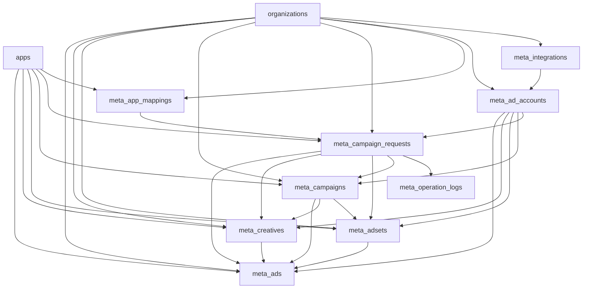

# Meta Ads DB Design V1

## 1. Mục tiêu
- Hỗ trợ `connect Meta integration -> sync ad accounts -> map app nội bộ -> tạo campaign/adset/creative/ad theo luồng approve rồi execute`.
- PostgreSQL chỉ giữ `config + auth + mapping + request lifecycle + local operational mirror + audit`.
- Chưa đưa `insights/reporting ETL`, `optimizer rules`, `budget automation` vào schema V1.

## 2. Phạm vi
### In scope
- Quản lý `meta_integrations`.
- Đồng bộ và quản lý `meta_ad_accounts`.
- Map `apps.id` sang cấu hình app promotion của Meta bằng `meta_app_mappings`.
- Tạo request nội bộ bằng `meta_campaign_requests`.
- Log từng bước gọi Meta API bằng `meta_operation_logs`.
- Mirror object đã tạo thành công vào `meta_campaigns`, `meta_adsets`, `meta_creatives`, `meta_ads`.

### Out of scope
- Daily insights tables trong PostgreSQL.
- ETL raw -> bronze/silver/gold cho Meta.
- Rule engine tối ưu budget/CPI/ROAS tự động.

## 3. Nguyên tắc thiết kế
- Mỗi bảng Meta đều bắt buộc có `organization_id`.
- Không tái dùng trực tiếp bảng nghiệp vụ AdMob/XMP.
- `apps.id` là FK chuẩn để tái sử dụng app catalog và app permissions hiện tại.
- Secret/token được lưu `encrypted-at-rest` bằng cột `bytea`; response API chỉ trả `hint` và cờ `Has*`.
- Mirror local không thay Meta API làm source of truth; chỉ phục vụ UI, approval, retry và audit.

## 4. Ranh giới lưu trữ
- `PostgreSQL`: config, auth, mapping, lifecycle, audit, operational mirror.
- `MinIO`: raw request/response, raw sync payload cho phase sau.
- `StarRocks`: analytics/reporting phase sau, không thuộc migration V1.

## 5. ERD logic

## 6. Bảng dữ liệu
### `meta_integrations`
Mục đích: cấu hình 1 integration Meta theo org.

Các cột chính:
- `id`, `organization_id`, `display_name`, `auth_mode`.
- `meta_business_id`, `meta_business_name`, `meta_app_id`.
- `app_secret_encrypted`, `access_token_encrypted`, `refresh_token_encrypted`.
- `*_hint`, `token_type`, `token_expires_at`, `last_token_refresh_at`, `last_validated_at`.
- `granted_scopes_json`, `status`, `last_error`, `is_default`, `is_enabled`.
- `created_by`, `updated_by`, `created_at`, `updated_at`.

Index/constraint:
- `ix_meta_integrations_organization_id`.
- Unique `ix_meta_integrations_org_display_name` trên `(organization_id, display_name)`.
- `ix_meta_integrations_org_status`.

### `meta_ad_accounts`
Mục đích: ad account có thể thao tác dưới một integration.

Các cột chính:
- `id`, `organization_id`, `meta_integration_id`.
- `meta_ad_account_id` là external id của Meta.
- `name`, `currency`, `time_zone_name`, `timezone_offset_minutes`.
- `business_id`, `business_name`, `amount_spent`, `balance`, `spend_cap`, `status`, `is_active`, `last_synced_at`.
- `Meta Integrations` co the hien thi `business_name` o cap integration; cac tong `total_amount_spent`, `total_balance`, `total_spend_cap` la aggregate tinh tu `meta_ad_accounts`, khong phai field native cua Meta Business.
- `created_at`, `updated_at`.

Index/constraint:
- Unique `ix_meta_ad_accounts_org_external_id` trên `(organization_id, meta_ad_account_id)`.
- `ix_meta_ad_accounts_meta_integration_id`.
- `ix_meta_ad_accounts_org_is_active`.

### `meta_app_mappings`
Mục đích: map app nội bộ sang promoted object của Meta.

Các cột chính:
- `id`, `organization_id`, `app_row_id`.
- `meta_application_id`, `object_store_url`.
- `package_name_override`, `bundle_id_override`, `deep_link_url_override`, `store_url_override`.
- `is_active`, audit columns.

Index/constraint:
- Unique `ix_meta_app_mappings_org_app_row_id` trên `(organization_id, app_row_id)`.
- `ix_meta_app_mappings_org_is_active`.

### `meta_campaign_requests`
Mục đích: lưu request lifecycle cho luồng draft -> approval -> execute.

Các cột chính:
- `id`, `organization_id`, `meta_ad_account_row_id`, `app_row_id`, `meta_app_mapping_id`.
- `campaign_name`, `objective`, `payload_json`.
- `status`, `idempotency_key`, `validation_errors_json`, `failure_summary`, `correlation_id`.
- `requested_by`, `approved_by`, `rejected_by`, `executed_by`.
- `created_at`, `updated_at`, `submitted_at`, `approved_at`, `rejected_at`, `executed_at`, `failed_at`.

Index/constraint:
- Unique `ix_meta_campaign_requests_org_idempotency_key` trên `(organization_id, idempotency_key)`.
- `ix_meta_campaign_requests_org_status`.
- `ix_meta_campaign_requests_meta_ad_account_row_id`.
- `ix_meta_campaign_requests_app_row_id`.

### `meta_operation_logs`
Mục đích: audit từng bước validate/create.

Các cột chính:
- `id`, `meta_campaign_request_id`, `step`, `status`, `attempt_number`.
- `request_json`, `response_json`, `error_message`, `correlation_id`.
- `started_at`, `finished_at`, `created_at`.

Index:
- `ix_meta_operation_logs_request_id`.
- `ix_meta_operation_logs_request_step`.
- `ix_meta_operation_logs_correlation_id`.

### `meta_campaigns`, `meta_adsets`, `meta_creatives`, `meta_ads`
Mục đích: local mirror của object đã tạo thành công trên Meta.

Nguyên tắc chung:
- Giữ `organization_id`, `meta_ad_account_row_id`, `app_row_id`, `created_from_request_id`.
- Giữ external id riêng của từng object (`meta_campaign_id`, `meta_adset_id`, `meta_creative_id`, `meta_ad_id`).
- Giữ `name`, `status`, `effective_status` nếu có, `config_json`, `last_synced_at`, timestamps.
- Unique theo `(organization_id, external_id)` để hỗ trợ idempotent retry.

## 7. Enums lưu dưới dạng string
### Auth mode
- `oauth_user`
- `system_user_token`
- `manual_access_token`

### Request status
- `draft`
- `pending_approval`
- `approved`
- `rejected`
- `executing`
- `completed`
- `failed`

### Operation step
- `validation`
- `campaign`
- `adset`
- `creative`
- `ad`

### Operation status
- `pending`
- `succeeded`
- `failed`
- `skipped`

## 8. Mapping với hệ thống hiện tại
- `organizations`: tenant boundary.
- `apps`: app catalog chuẩn để UI và permission reuse.
- `app_permissions`: gate create/edit/execute theo `app.AppId` hiện tại.
- `role_permissions`: thêm screen keys Meta, seed admin qua migration riêng.
- `activity_logs`: audit thao tác user ở layer controller/service.

## 9. RBAC
Screen keys mới:
- `s-meta-accounts`
- `s-meta-campaigns`
- `s-meta-requests`
- `s-meta-automation`

Function keys V1:
- `view`
- `create`
- `edit`
- `approve`
- `execute`
- `retry`
- `disable-enable`

## 10. Chiến lược bảo mật
- Không trả secret/token plaintext ra API response.
- Chỉ trả `HasAppSecret`, `HasAccessToken`, `HasRefreshToken` và các `hint`.
- Secret/token lưu `bytea` và được mã hóa bằng `MetaSecretCryptoService`.
- `MetaAds:EncryptionKey` là config ưu tiên; fallback chỉ dành cho môi trường dev.

## 11. Ghi chú migration
- `AddMetaAdsV1Schema` chỉ tạo schema Meta Ads.
- `SeedMetaAdsRolePermissions` seed quyền admin cho các screen Meta.
- Không tạo bảng insights/reporting trong migration V1.
