# Meta Marketing API Integration Solution

## Mediation Pro Platform - Phase 2

| Document Info | |
|---------------|---|
| **Version** | 2.0 |
| **API Version** | v24.0 (Released: October 8, 2025) |
| **Author** | CTO Advisor |
| **Last Updated** | February 2026 |
| **Status** | Ready for Implementation |

---

## 1. Executive Summary

### 1.1. Mục tiêu dự án

Tích hợp Meta Marketing API vào Mediation Pro Platform nhằm:

1. **Centralized Data**: Kéo toàn bộ dữ liệu campaigns, ad sets, ads về hệ thống chung
2. **Secure Campaign Management**: Tạo/quản lý campaigns qua hệ thống thay vì truy cập trực tiếp Meta Ads Manager
3. **Automated Optimization**: Tự động tối ưu dựa trên performance data

### 1.2. Business Value

```
┌─────────────────────────────────────────────────────────────────┐
│                    BUSINESS VALUE MATRIX                         │
├─────────────────────────────────────────────────────────────────┤
│                                                                  │
│  🔒 Security                                                     │
│  ├── Giảm 100% rủi ro từ personal account access                │
│  ├── Audit trail cho mọi thay đổi                               │
│  └── Role-based access control                                  │
│                                                                  │
│  ⚡ Efficiency                                                   │
│  ├── Giảm 80% thời gian manual reporting                        │
│  ├── Bulk operations cho 200+ apps                              │
│  └── Real-time monitoring                                       │
│                                                                  │
│  📈 Optimization                                                 │
│  ├── Auto-pause underperforming ads                             │
│  ├── Budget reallocation dựa trên ROAS                          │
│  └── Target CPI giảm 15-20%                                     │
│                                                                  │
└─────────────────────────────────────────────────────────────────┘
```

### 1.3. Scope

| In Scope | Out of Scope |
|----------|--------------|
| Campaign/Ad Set/Ad CRUD | Creative production |
| Insights data sync | Attribution modeling |
| Basic auto-optimization rules | ML-based bidding |
| Multi-account management | Cross-platform (TikTok, Google) |

---

## 2. System Architecture

### 2.1. High-Level Architecture

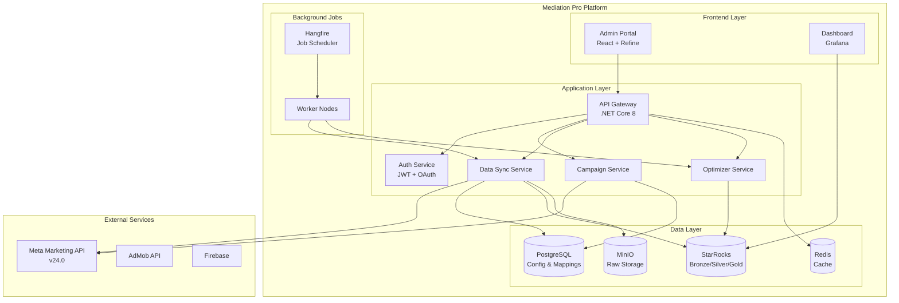
```mermaid
flowchart TB
    subgraph "Mediation Pro Platform"
        subgraph "Frontend Layer"
            UI[Admin Portal<br/>React + Refine]
            DASH[Dashboard<br/>Grafana]
        end
        
        subgraph "Application Layer"
            API[API Gateway<br/>.NET Core 8]
            AUTH[Auth Service<br/>JWT + OAuth]
            CAMP[Campaign Service]
            SYNC[Data Sync Service]
            OPT[Optimizer Service]
        end
        
        subgraph "Background Jobs"
            HF[Hangfire<br/>Job Scheduler]
            WORKER[Worker Nodes]
        end
        
        subgraph "Data Layer"
            PG[(PostgreSQL<br/>Config & Mappings)]
            SR[(StarRocks<br/>Bronze/Silver/Gold)]
            MINIO[(MinIO<br/>Raw Storage)]
            REDIS[(Redis<br/>Cache)]
        end
    end
    
    subgraph "External Services"
        META[Meta Marketing API<br/>v24.0]
        ADMOB[AdMob API]
        FIREBASE[Firebase]
    end
    
    UI --> API
    DASH --> SR
    API --> AUTH
    API --> CAMP
    API --> SYNC
    API --> OPT
    
    CAMP --> META
    SYNC --> META
    
    HF --> WORKER
    WORKER --> SYNC
    WORKER --> OPT
    
    CAMP --> PG
    SYNC --> PG
    SYNC --> SR
    SYNC --> MINIO
    OPT --> SR
    
    API --> REDIS
```

**Giải thích kiến trúc (khớp với 99 - MEDIATION PRO PLATFORM):**

- **Frontend Layer**: Admin Portal sử dụng React với Refine (headless mode). Dashboard analytics dùng Grafana đọc trực tiếp StarRocks (gold views).

- **Application Layer**: Tất cả services viết bằng .NET 8. `Campaign Service` chịu trách nhiệm CRUD với Meta Marketing API, `Data Sync Service` lo ingestion & transform, `Optimizer Service` dùng dữ liệu gold trong StarRocks để ra quyết định.

- **Background Jobs**: Hangfire scheduler chạy các jobs (Meta Worker) để sync cấu trúc & performance từ Meta về **MinIO + StarRocks** theo kiến trúc bronze/silver/gold (mô tả ở doc 99).

- **Data Layer**:
  - **PostgreSQL**: lưu cấu hình ứng dụng, mapping business (app ↔ ad account, campaign tags, rule config).
  - **MinIO**: lưu mọi raw JSON response từ Meta (bronze raw store) để có thể replay / recovery.
  - **StarRocks**: warehouse chính, có layer **bronze.meta_\*** (raw), **silver.meta_\*** (clean/enriched), **gold.fact_campaign_roi** & các fact khác, dùng chung với AdMob/XMP.
  - **Redis**: cache nóng cho cấu hình nhẹ (token, mapping) và throttling state nếu cần.

### 2.2. Data Flow Architecture

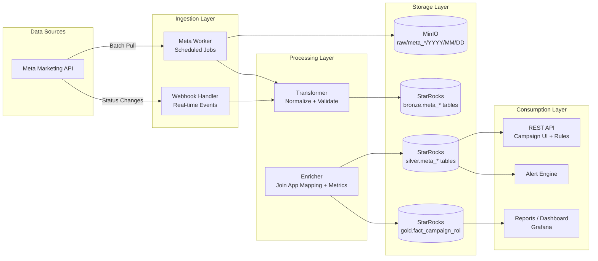
```mermaid
flowchart LR
    subgraph "Data Sources"
        META_API[Meta Marketing API]
    end
    
    subgraph "Ingestion Layer"
        PULL[Meta Worker<br/>Scheduled Jobs]
        WEBHOOK[Webhook Handler<br/>Real-time Events]
    end
    
    subgraph "Processing Layer"
        TRANSFORM[Transformer<br/>Normalize + Validate]
        ENRICH[Enricher<br/>Join App Mapping + Metrics]
    end
    
    subgraph "Storage Layer"
        MINIO_RAW[(MinIO<br/>raw/meta_*/YYYY/MM/DD)]
        BRONZE[(StarRocks<br/>bronze.meta_* tables)]
        SILVER[(StarRocks<br/>silver.meta_* tables)]
        GOLD[(StarRocks<br/>gold.fact_campaign_roi)]
    end
    
    subgraph "Consumption Layer"
        API_OUT[REST API<br/>Campaign UI + Rules]
        REPORT[Reports / Dashboard<br/>Grafana]
        ALERT[Alert Engine]
    end
    
    META_API -->|Batch Pull| PULL
    META_API -->|Status Changes| WEBHOOK
    
    PULL --> MINIO_RAW
    PULL --> TRANSFORM
    WEBHOOK --> TRANSFORM
    
    TRANSFORM --> BRONZE
    ENRICH --> SILVER
    ENRICH --> GOLD
    
    SILVER --> API_OUT
    GOLD --> REPORT
    SILVER --> ALERT
```

**Giải thích data flow (theo StarRocks + MinIO):**

1. **Ingestion**: Meta Worker (Hangfire) pull dữ liệu từ Meta Marketing API (accounts, campaigns, adsets, ads, insights) theo schedule; webhook nhận sự kiện realtime (status change, error).

2. **Raw Storage / Bronze**:
   - Mọi response được ghi xuống `MinIO /raw/meta/...` dạng `.json.gz`.
   - Job parse raw và insert vào StarRocks `bronze.meta_campaigns`, `bronze.meta_adsets`, `bronze.meta_ads`, `bronze.meta_insights`.

3. **Silver / Enrichment**:
   - Từ bronze, ETL build các bảng `silver.meta_campaigns`, `silver.meta_adsets`, `silver.meta_ads`, `silver.meta_daily_campaign_insights` (đã join app mapping, chuẩn hoá timezone, currency).
   - Một phần cost data được push vào `silver.daily_app_costs` (đã mô tả trong doc 99).

4. **Gold / Consumption**:
   - Từ silver, build `gold.fact_campaign_roi` join với LTV / revenue (AdMob, Firebase) để tính ROAS, CPI, v.v.
   - API & Dashboard đọc trực tiếp từ silver/gold; Alert engine dùng các gold views để bắn cảnh báo.

### 2.3. Meta API Integration Architecture

```mermaid
flowchart TB
    subgraph "Mediation Pro"
        CLIENT[Meta API Client<br/>.NET HttpClient]
        TOKEN[Token Manager<br/>Auto Refresh]
        RATE[Rate Limiter<br/>Leaky Bucket]
        RETRY[Retry Handler<br/>Exponential Backoff]
        BATCH[Batch Processor<br/>Max 50 requests]
    end
    
    subgraph "Meta Platform"
        GRAPH[Graph API<br/>v24.0]
        
        subgraph "Endpoints"
            ACC[/me/adaccounts]
            CAMP_EP[/campaigns]
            ADSET_EP[/adsets]
            ADS_EP[/ads]
            INSIGHTS[/insights]
            CREATIVE[/adcreatives]
        end
    end
    
    CLIENT --> TOKEN
    CLIENT --> RATE
    CLIENT --> RETRY
    CLIENT --> BATCH
    
    TOKEN -->|Bearer Token| GRAPH
    RATE -->|Throttled Requests| GRAPH
    RETRY -->|Failed Requests| GRAPH
    BATCH -->|Batch Requests| GRAPH
    
    GRAPH --> ACC
    GRAPH --> CAMP_EP
    GRAPH --> ADSET_EP
    GRAPH --> ADS_EP
    GRAPH --> INSIGHTS
    GRAPH --> CREATIVE
```

**Giải thích integration:**

- **Token Manager**: Tự động refresh token trước khi hết hạn 7 ngày, sử dụng System User token cho production.

- **Rate Limiter**: Implement leaky bucket algorithm để tránh hit rate limits. Monitor headers `x-business-use-case-usage`.

- **Retry Handler**: Exponential backoff cho transient errors (5xx, rate limits). Max 3 retries với delays 1s, 2s, 4s.

- **Batch Processor**: Gom requests vào batches (max 50) để giảm API calls và improve throughput.

---

## 3. Authentication & Authorization

### 3.1. Token Hierarchy

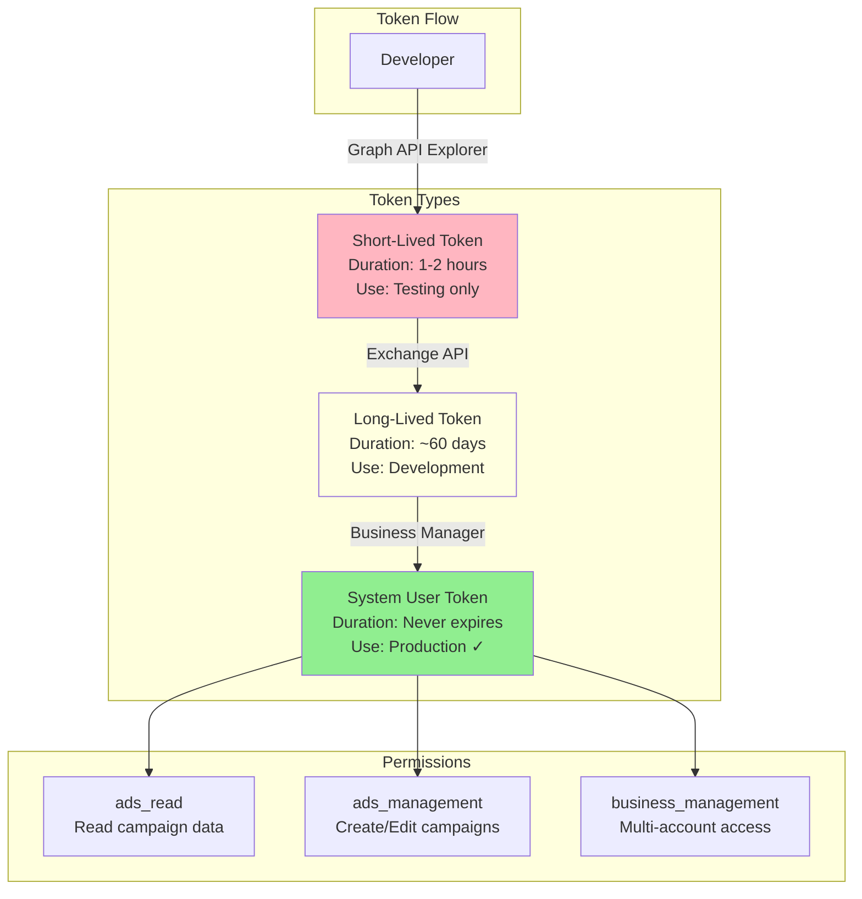
```mermaid
flowchart TB
    subgraph "Token Types"
        SHORT[Short-Lived Token<br/>Duration: 1-2 hours<br/>Use: Testing only]
        LONG[Long-Lived Token<br/>Duration: ~60 days<br/>Use: Development]
        SYSTEM[System User Token<br/>Duration: Never expires<br/>Use: Production ✓]
    end
    
    subgraph "Token Flow"
        DEV[Developer] -->|Graph API Explorer| SHORT
        SHORT -->|Exchange API| LONG
        LONG -->|Business Manager| SYSTEM
    end
    
    subgraph "Permissions"
        PERM1[ads_read<br/>Read campaign data]
        PERM2[ads_management<br/>Create/Edit campaigns]
        PERM3[business_management<br/>Multi-account access]
    end
    
    SYSTEM --> PERM1
    SYSTEM --> PERM2
    SYSTEM --> PERM3
    
    style SYSTEM fill:#90EE90
    style SHORT fill:#FFB6C1
    style LONG fill:#FFFFE0
```

**Giải thích token strategy:**

| Token Type | Khi nào dùng | Ưu điểm | Nhược điểm |
|------------|--------------|---------|------------|
| Short-Lived | Testing cá nhân | Dễ generate | Hết hạn nhanh |
| Long-Lived | Development, staging | 60 ngày | Cần refresh |
| **System User** | **Production** | **Never expires** | Cần Business verification |

### 3.2. OAuth Flow for Multi-Account

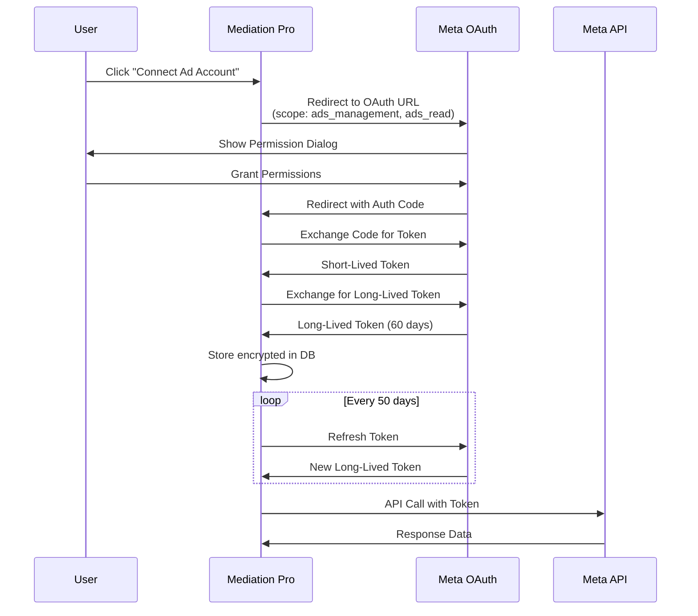
```mermaid
sequenceDiagram
    participant User as User
    participant App as Mediation Pro
    participant Meta as Meta OAuth
    participant API as Meta API
    
    User->>App: Click "Connect Ad Account"
    App->>Meta: Redirect to OAuth URL<br/>(scope: ads_management, ads_read)
    Meta->>User: Show Permission Dialog
    User->>Meta: Grant Permissions
    Meta->>App: Redirect with Auth Code
    App->>Meta: Exchange Code for Token
    Meta->>App: Short-Lived Token
    App->>Meta: Exchange for Long-Lived Token
    Meta->>App: Long-Lived Token (60 days)
    App->>App: Store encrypted in DB
    
    loop Every 50 days
        App->>Meta: Refresh Token
        Meta->>App: New Long-Lived Token
    end
    
    App->>API: API Call with Token
    API->>App: Response Data
```

**Giải thích OAuth flow:**

1. User click connect → redirect đến Meta OAuth với required scopes
2. User grant permissions → Meta redirect về với auth code
3. App exchange code → short-lived token → long-lived token
4. Token được encrypt và lưu trong database
5. Background job tự động refresh token 10 ngày trước khi hết hạn

### 3.3. Permission Matrix

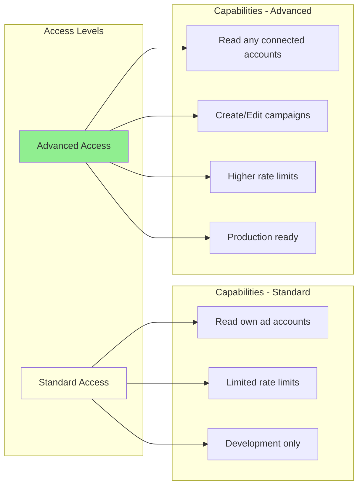
```mermaid
flowchart LR
    subgraph "Access Levels"
        STD[Standard Access]
        ADV[Advanced Access]
    end
    
    subgraph "Capabilities - Standard"
        S1[Read own ad accounts]
        S2[Limited rate limits]
        S3[Development only]
    end
    
    subgraph "Capabilities - Advanced"
        A1[Read any connected accounts]
        A2[Create/Edit campaigns]
        A3[Higher rate limits]
        A4[Production ready]
    end
    
    STD --> S1
    STD --> S2
    STD --> S3
    
    ADV --> A1
    ADV --> A2
    ADV --> A3
    ADV --> A4
    
    style ADV fill:#90EE90
    style STD fill:#FFFFE0
```

**Requirements for Advanced Access:**

| Requirement | Details |
|-------------|---------|
| Business Verification | Upload business documents (1-2 weeks) |
| App Review | Submit use case explanation |
| Data Use Checkup | Complete annual review |
| Technical Implementation | Demonstrate proper API usage |

---

## 4. Campaign Management

### 4.1. Campaign Hierarchy

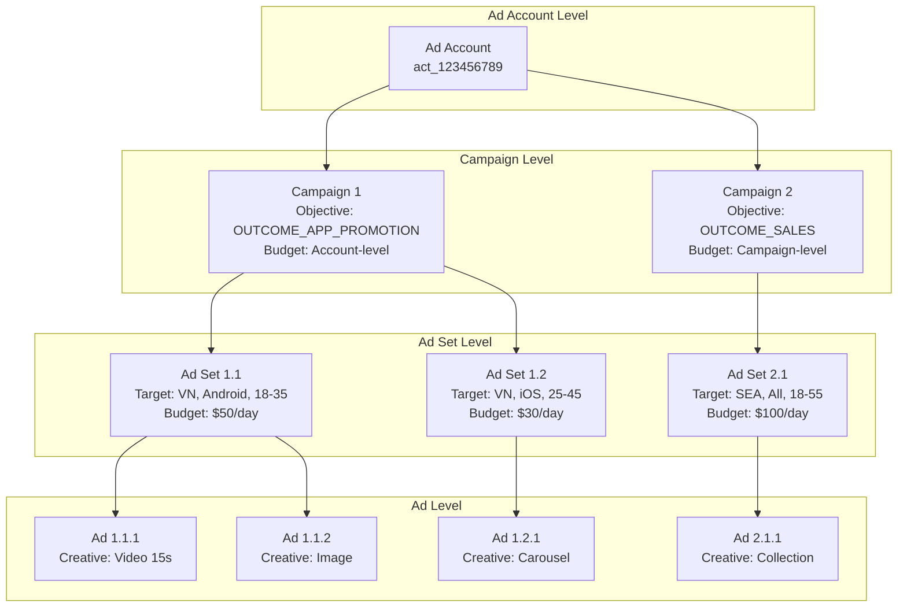
```mermaid
flowchart TB
    subgraph "Ad Account Level"
        ACC[Ad Account<br/>act_123456789]
    end
    
    subgraph "Campaign Level"
        C1[Campaign 1<br/>Objective: OUTCOME_APP_PROMOTION<br/>Budget: Account-level]
        C2[Campaign 2<br/>Objective: OUTCOME_SALES<br/>Budget: Campaign-level]
    end
    
    subgraph "Ad Set Level"
        AS1[Ad Set 1.1<br/>Target: VN, Android, 18-35<br/>Budget: $50/day]
        AS2[Ad Set 1.2<br/>Target: VN, iOS, 25-45<br/>Budget: $30/day]
        AS3[Ad Set 2.1<br/>Target: SEA, All, 18-55<br/>Budget: $100/day]
    end
    
    subgraph "Ad Level"
        AD1[Ad 1.1.1<br/>Creative: Video 15s]
        AD2[Ad 1.1.2<br/>Creative: Image]
        AD3[Ad 1.2.1<br/>Creative: Carousel]
        AD4[Ad 2.1.1<br/>Creative: Collection]
    end
    
    ACC --> C1
    ACC --> C2
    
    C1 --> AS1
    C1 --> AS2
    C2 --> AS3
    
    AS1 --> AD1
    AS1 --> AD2
    AS2 --> AD3
    AS3 --> AD4
```

**Giải thích hierarchy:**

- **Ad Account**: Container chứa tất cả campaigns, có currency và timezone settings
- **Campaign**: Định nghĩa objective và overall strategy
- **Ad Set**: Định nghĩa targeting, placement, budget, schedule
- **Ad**: Creative unit người dùng nhìn thấy

### 4.2. Campaign Objectives (ODAX Framework)

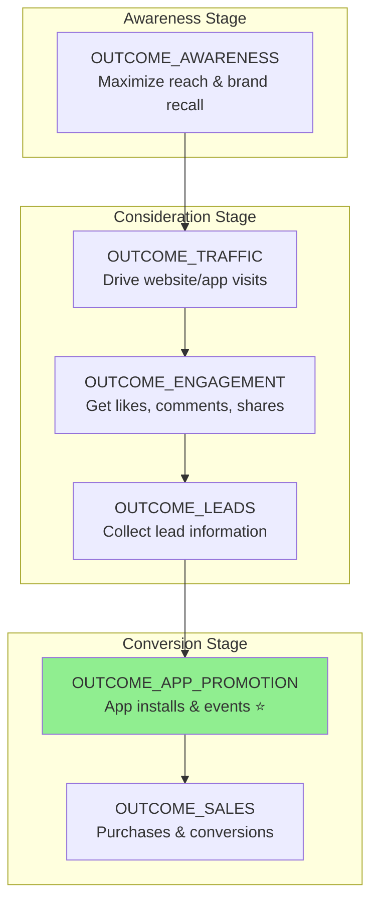
```mermaid
flowchart TB
    subgraph "Awareness Stage"
        OBJ1[OUTCOME_AWARENESS<br/>Maximize reach & brand recall]
    end
    
    subgraph "Consideration Stage"
        OBJ2[OUTCOME_TRAFFIC<br/>Drive website/app visits]
        OBJ3[OUTCOME_ENGAGEMENT<br/>Get likes, comments, shares]
        OBJ4[OUTCOME_LEADS<br/>Collect lead information]
    end
    
    subgraph "Conversion Stage"
        OBJ5[OUTCOME_APP_PROMOTION<br/>App installs & events ⭐]
        OBJ6[OUTCOME_SALES<br/>Purchases & conversions]
    end
    
    OBJ1 --> OBJ2
    OBJ2 --> OBJ3
    OBJ3 --> OBJ4
    OBJ4 --> OBJ5
    OBJ5 --> OBJ6
    
    style OBJ5 fill:#90EE90
```

**Lưu ý quan trọng về API v24.0:**

| Legacy Objective | New ODAX Objective | Status |
|------------------|-------------------|--------|
| APP_INSTALLS | OUTCOME_APP_PROMOTION | ✅ Use this |
| CONVERSIONS | OUTCOME_SALES | ✅ Use this |
| LINK_CLICKS | OUTCOME_TRAFFIC | ✅ Use this |
| BRAND_AWARENESS | OUTCOME_AWARENESS | ✅ Use this |

> ⚠️ **Breaking Change**: Legacy objectives sẽ return `400 error` từ v25.0 (Q1 2026). Advantage Shopping Campaign (ASC) và Advantage App Campaign (AAC) APIs đã deprecated từ v24.0.

### 4.3. Campaign Creation Flow

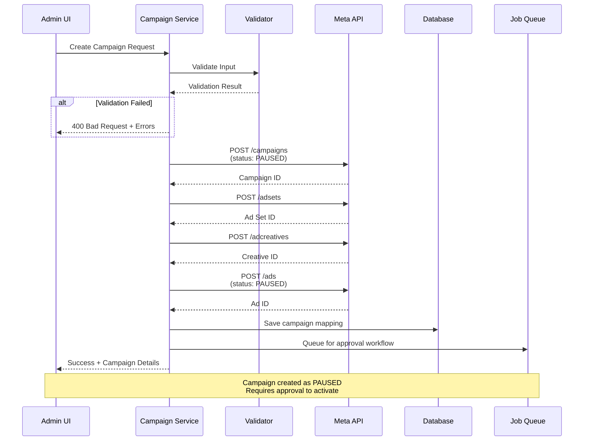
```mermaid
sequenceDiagram
    participant UI as Admin UI
    participant API as Campaign Service
    participant VAL as Validator
    participant META as Meta API
    participant DB as Database
    participant QUEUE as Job Queue
    
    UI->>API: Create Campaign Request
    API->>VAL: Validate Input
    VAL-->>API: Validation Result
    
    alt Validation Failed
        API-->>UI: 400 Bad Request + Errors
    end
    
    API->>META: POST /campaigns<br/>(status: PAUSED)
    META-->>API: Campaign ID
    
    API->>META: POST /adsets
    META-->>API: Ad Set ID
    
    API->>META: POST /adcreatives
    META-->>API: Creative ID
    
    API->>META: POST /ads<br/>(status: PAUSED)
    META-->>API: Ad ID
    
    API->>DB: Save campaign mapping
    API->>QUEUE: Queue for approval workflow
    
    API-->>UI: Success + Campaign Details
    
    Note over UI,QUEUE: Campaign created as PAUSED<br/>Requires approval to activate
```

**Giải thích flow:**

1. **Validation**: Check required fields, budget limits, targeting compliance
2. **Campaign Creation**: Luôn tạo với `status: PAUSED` để tránh spend ngay
3. **Hierarchy Build**: Tạo Campaign → Ad Set → Creative → Ad theo sequence
4. **Persistence**: Lưu mapping vào local DB để track
5. **Approval Queue**: Đưa vào approval workflow trước khi activate

---

## 5. Insights & Reporting

### 5.1. Insights Data Model

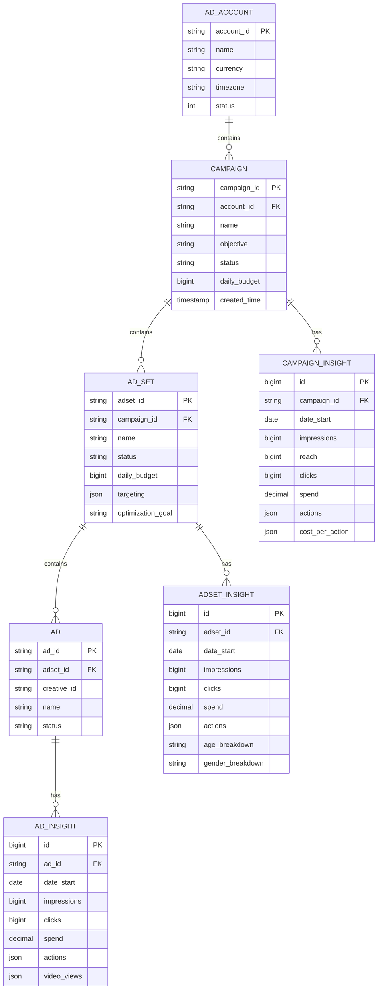
```mermaid
erDiagram
    AD_ACCOUNT ||--o{ CAMPAIGN : contains
    CAMPAIGN ||--o{ AD_SET : contains
    AD_SET ||--o{ AD : contains
    
    CAMPAIGN ||--o{ CAMPAIGN_INSIGHT : has
    AD_SET ||--o{ ADSET_INSIGHT : has
    AD ||--o{ AD_INSIGHT : has
    
    AD_ACCOUNT {
        string account_id PK
        string name
        string currency
        string timezone
        int status
    }
    
    CAMPAIGN {
        string campaign_id PK
        string account_id FK
        string name
        string objective
        string status
        bigint daily_budget
        timestamp created_time
    }
    
    AD_SET {
        string adset_id PK
        string campaign_id FK
        string name
        string status
        bigint daily_budget
        json targeting
        string optimization_goal
    }
    
    AD {
        string ad_id PK
        string adset_id FK
        string creative_id
        string name
        string status
    }
    
    CAMPAIGN_INSIGHT {
        bigint id PK
        string campaign_id FK
        date date_start
        bigint impressions
        bigint reach
        bigint clicks
        decimal spend
        json actions
        json cost_per_action
    }
    
    ADSET_INSIGHT {
        bigint id PK
        string adset_id FK
        date date_start
        bigint impressions
        bigint clicks
        decimal spend
        json actions
        string age_breakdown
        string gender_breakdown
    }
    
    AD_INSIGHT {
        bigint id PK
        string ad_id FK
        date date_start
        bigint impressions
        bigint clicks
        decimal spend
        json actions
        json video_views
    }
```

### 5.2. Sync Strategy

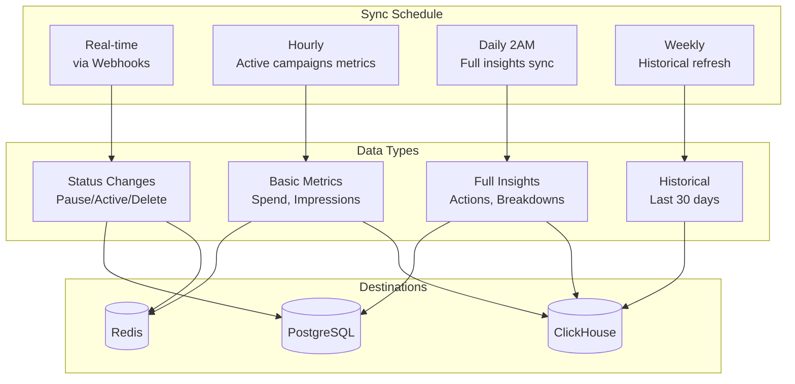
```mermaid
flowchart TB
    subgraph "Sync Schedule"
        RT[Real-time<br/>via Webhooks]
        H1[Hourly<br/>Active campaigns metrics]
        D1[Daily 2AM<br/>Full insights sync]
        W1[Weekly<br/>Historical refresh]
    end
    
    subgraph "Data Types"
        STATUS[Status Changes<br/>Pause/Active/Delete]
        BASIC[Basic Metrics<br/>Spend, Impressions]
        FULL[Full Insights<br/>Actions, Breakdowns]
        HIST[Historical<br/>Last 30 days]
    end
    
    subgraph "Destinations"
        PG[(PostgreSQL)]
        CH[(ClickHouse)]
        CACHE[(Redis)]
    end
    
    RT --> STATUS
    H1 --> BASIC
    D1 --> FULL
    W1 --> HIST
    
    STATUS --> PG
    STATUS --> CACHE
    BASIC --> CACHE
    BASIC --> CH
    FULL --> PG
    FULL --> CH
    HIST --> CH
```

**Sync schedule chi tiết:**

| Frequency | What | Why | Destination |
|-----------|------|-----|-------------|
| Real-time | Status changes | Immediate awareness | PG + Redis |
| Hourly | Spend, impressions | Budget monitoring | Redis + CH |
| Daily 2AM | Full insights (T-1) | Complete data | PG + CH |
| Weekly | Last 30 days | Attribution window | CH |

### 5.3. Insights API Query Patterns

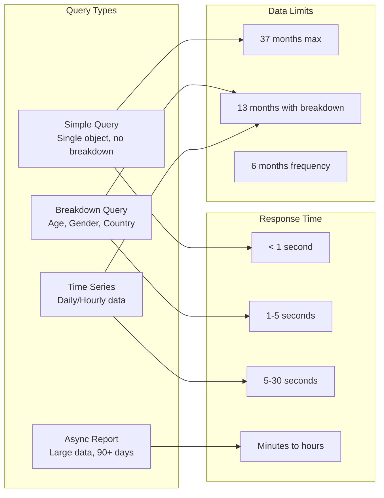
```mermaid
flowchart LR
    subgraph "Query Types"
        Q1[Simple Query<br/>Single object, no breakdown]
        Q2[Breakdown Query<br/>Age, Gender, Country]
        Q3[Time Series<br/>Daily/Hourly data]
        Q4[Async Report<br/>Large data, 90+ days]
    end
    
    subgraph "Response Time"
        T1[< 1 second]
        T2[1-5 seconds]
        T3[5-30 seconds]
        T4[Minutes to hours]
    end
    
    subgraph "Data Limits"
        L1[37 months max]
        L2[13 months with breakdown]
        L3[6 months frequency]
    end
    
    Q1 --> T1
    Q2 --> T2
    Q3 --> T3
    Q4 --> T4
    
    Q1 --> L1
    Q2 --> L2
    Q3 --> L2
```

**API v24.0 Data Limitations:**

| Metric Type | With Breakdowns | Without Breakdowns |
|-------------|-----------------|-------------------|
| Standard metrics | 13 months | 37 months |
| Reach | 13 months | 37 months |
| Frequency | **6 months** | 37 months |
| Hourly stats | 13 months | N/A |

---

## 6. Optimization Engine

### 6.1. Optimization Decision Tree

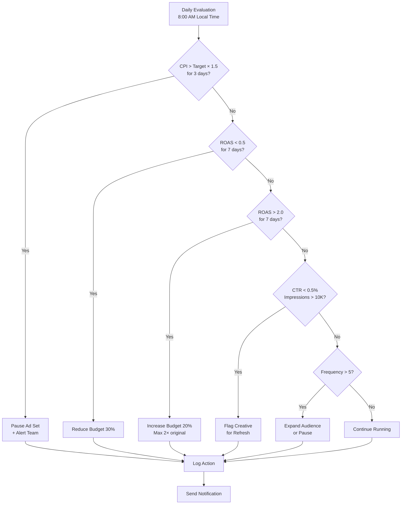
```mermaid
flowchart TB
    START[Daily Evaluation<br/>8:00 AM Local Time] --> CHECK1{CPI > Target × 1.5<br/>for 3 days?}
    
    CHECK1 -->|Yes| ACTION1[Pause Ad Set<br/>+ Alert Team]
    CHECK1 -->|No| CHECK2{ROAS < 0.5<br/>for 7 days?}
    
    CHECK2 -->|Yes| ACTION2[Reduce Budget 30%]
    CHECK2 -->|No| CHECK3{ROAS > 2.0<br/>for 7 days?}
    
    CHECK3 -->|Yes| ACTION3[Increase Budget 20%<br/>Max 2× original]
    CHECK3 -->|No| CHECK4{CTR < 0.5%<br/>Impressions > 10K?}
    
    CHECK4 -->|Yes| ACTION4[Flag Creative<br/>for Refresh]
    CHECK4 -->|No| CHECK5{Frequency > 5?}
    
    CHECK5 -->|Yes| ACTION5[Expand Audience<br/>or Pause]
    CHECK5 -->|No| CONTINUE[Continue Running]
    
    ACTION1 --> LOG[Log Action]
    ACTION2 --> LOG
    ACTION3 --> LOG
    ACTION4 --> LOG
    ACTION5 --> LOG
    CONTINUE --> LOG
    
    LOG --> NOTIFY[Send Notification]
```

**Giải thích optimization rules:**

| Rule | Condition | Action | Rationale |
|------|-----------|--------|-----------|
| High CPI | CPI > 1.5× target, 3 days | Pause | Wasting budget |
| Low ROAS | ROAS < 0.5, 7 days | -30% budget | Poor performance |
| High ROAS | ROAS > 2.0, 7 days | +20% budget | Scale winners |
| Low CTR | CTR < 0.5%, 10K+ impr | Flag creative | Ad fatigue |
| High Frequency | Freq > 5 | Expand/Pause | Audience exhaustion |

### 6.2. Optimization Workflow

```mermaid
sequenceDiagram
    participant SCHED as Scheduler
    participant OPT as Optimizer Service
    participant DB as Database
    participant META as Meta API
    participant NOTIFY as Notification
    
    SCHED->>OPT: Trigger Daily Optimization
    
    OPT->>DB: Get Active Ad Sets
    DB-->>OPT: Ad Set List
    
    loop For Each Ad Set
        OPT->>DB: Get 7-day Insights
        DB-->>OPT: Performance Data
        
        OPT->>OPT: Evaluate Rules
        
        alt Action Required
            OPT->>META: Update Ad Set<br/>(Budget/Status)
            META-->>OPT: Confirmation
            
            OPT->>DB: Log Optimization Action
            OPT->>NOTIFY: Send Alert
        end
    end
    
    OPT->>DB: Update Optimization Summary
    OPT-->>SCHED: Complete
```

### 6.3. Key Metrics for App Promotion

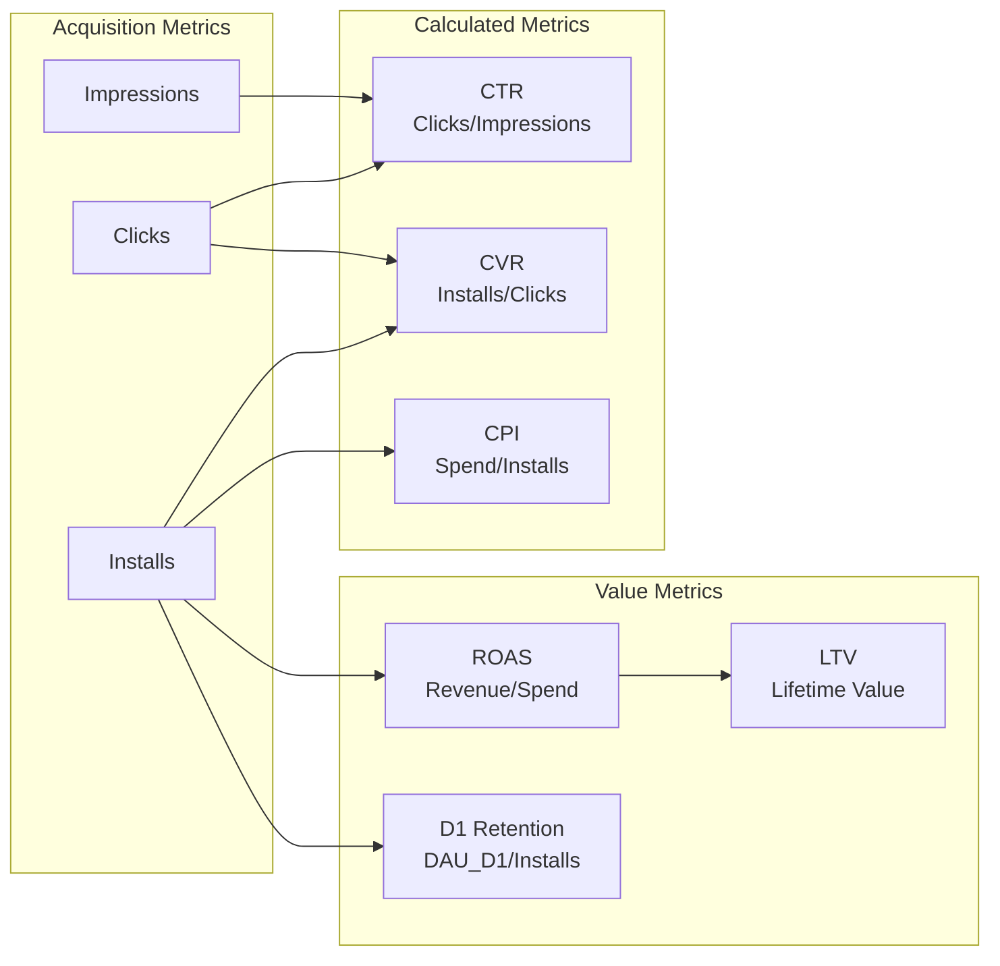
```mermaid
flowchart LR
    subgraph "Acquisition Metrics"
        IMP[Impressions]
        CLICK[Clicks]
        INSTALL[Installs]
    end
    
    subgraph "Calculated Metrics"
        CTR[CTR<br/>Clicks/Impressions]
        CVR[CVR<br/>Installs/Clicks]
        CPI[CPI<br/>Spend/Installs]
    end
    
    subgraph "Value Metrics"
        ROAS[ROAS<br/>Revenue/Spend]
        RET[D1 Retention<br/>DAU_D1/Installs]
        LTV[LTV<br/>Lifetime Value]
    end
    
    IMP --> CTR
    CLICK --> CTR
    CLICK --> CVR
    INSTALL --> CVR
    INSTALL --> CPI
    
    INSTALL --> ROAS
    INSTALL --> RET
    ROAS --> LTV
```

**Target metrics cho Vietnam market:**

| Metric | Formula | Target | Alert Threshold |
|--------|---------|--------|-----------------|
| CPI | Spend / Installs | < $0.30 | > $0.45 |
| CTR | Clicks / Impressions × 100 | > 1.5% | < 0.5% |
| CVR | Installs / Clicks × 100 | > 8% | < 3% |
| ROAS | Revenue / Spend | > 1.5 | < 0.5 |
| Frequency | Impressions / Reach | < 3 | > 5 |

---

## 7. Security & Compliance

### 7.1. Security Architecture

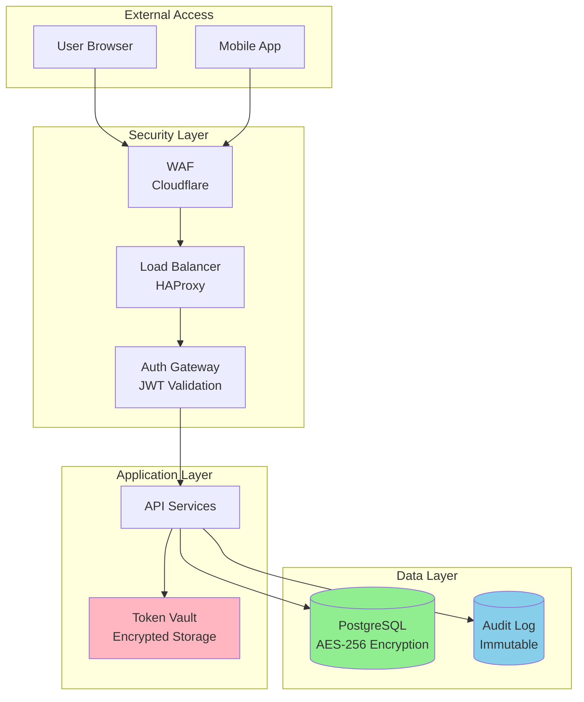
```mermaid
flowchart TB
    subgraph "External Access"
        USER[User Browser]
        MOBILE[Mobile App]
    end
    
    subgraph "Security Layer"
        WAF[WAF<br/>Cloudflare]
        LB[Load Balancer<br/>HAProxy]
        AUTH[Auth Gateway<br/>JWT Validation]
    end
    
    subgraph "Application Layer"
        API[API Services]
        TOKEN[Token Vault<br/>Encrypted Storage]
    end
    
    subgraph "Data Layer"
        DB[(PostgreSQL<br/>AES-256 Encryption)]
        AUDIT[(Audit Log<br/>Immutable)]
    end
    
    USER --> WAF
    MOBILE --> WAF
    WAF --> LB
    LB --> AUTH
    AUTH --> API
    API --> TOKEN
    API --> DB
    API --> AUDIT
    
    style TOKEN fill:#FFB6C1
    style DB fill:#90EE90
    style AUDIT fill:#87CEEB
```

### 7.2. Token Security Practices

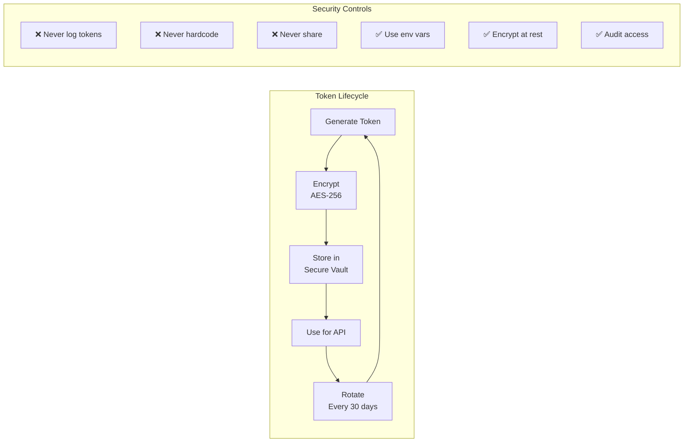
```mermaid
flowchart LR
    subgraph "Token Lifecycle"
        GEN[Generate Token] --> ENCRYPT[Encrypt<br/>AES-256]
        ENCRYPT --> STORE[Store in<br/>Secure Vault]
        STORE --> USE[Use for API]
        USE --> ROTATE[Rotate<br/>Every 30 days]
        ROTATE --> GEN
    end
    
    subgraph "Security Controls"
        NEVER1[❌ Never log tokens]
        NEVER2[❌ Never hardcode]
        NEVER3[❌ Never share]
        ALWAYS1[✅ Use env vars]
        ALWAYS2[✅ Encrypt at rest]
        ALWAYS3[✅ Audit access]
    end
```

**Security checklist:**

| Control | Implementation | Status |
|---------|---------------|--------|
| Token encryption | AES-256 in database | Required |
| Token rotation | Every 30 days automated | Required |
| Access logging | All API calls logged | Required |
| IP whitelist | Production servers only | Recommended |
| Rate limiting | Per-user and per-account | Required |
| Anomaly detection | Unusual activity alerts | Recommended |

### 7.3. Compliance Considerations

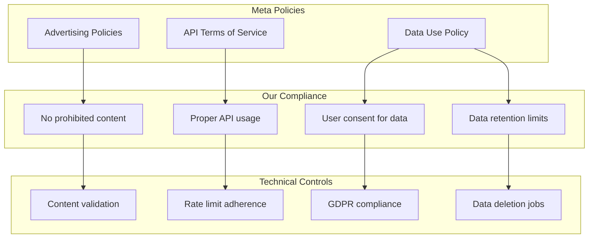
```mermaid
flowchart TB
    subgraph "Meta Policies"
        P1[Advertising Policies]
        P2[API Terms of Service]
        P3[Data Use Policy]
    end
    
    subgraph "Our Compliance"
        C1[No prohibited content]
        C2[Proper API usage]
        C3[User consent for data]
        C4[Data retention limits]
    end
    
    subgraph "Technical Controls"
        T1[Content validation]
        T2[Rate limit adherence]
        T3[GDPR compliance]
        T4[Data deletion jobs]
    end
    
    P1 --> C1 --> T1
    P2 --> C2 --> T2
    P3 --> C3 --> T3
    P3 --> C4 --> T4
```

---

## 8. API Reference

### 8.1. Core Endpoints

```
Base URL: https://graph.facebook.com/v24.0
```

| Endpoint | Method | Purpose |
|----------|--------|---------|
| `/me/adaccounts` | GET | List ad accounts |
| `/act_{id}/campaigns` | GET/POST | List/Create campaigns |
| `/act_{id}/adsets` | GET/POST | List/Create ad sets |
| `/act_{id}/ads` | GET/POST | List/Create ads |
| `/act_{id}/adcreatives` | GET/POST | List/Create creatives |
| `/act_{id}/adimages` | POST | Upload images |
| `/{object_id}/insights` | GET | Get performance data |

### 8.2. Request/Response Examples

**Create Campaign:**

```http
POST /v24.0/act_123456789/campaigns
Content-Type: application/json
Authorization: Bearer {access_token}

{
  "name": "App Install - Weather App - VN - Feb 2026",
  "objective": "OUTCOME_APP_PROMOTION",
  "status": "PAUSED",
  "special_ad_categories": [],
  "buying_type": "AUCTION",
  "bid_strategy": "LOWEST_COST_WITHOUT_CAP"
}
```

**Response:**

```json
{
  "id": "23851234567890123"
}
```

**Get Insights with Breakdowns:**

```http
GET /v24.0/23851234567890123/insights
  ?fields=impressions,clicks,spend,actions,cost_per_action_type
  &date_preset=last_7d
  &breakdowns=age,gender
  &level=adset
```

**Response:**

```json
{
  "data": [
    {
      "impressions": "125000",
      "clicks": "2500",
      "spend": "150.00",
      "actions": [
        {"action_type": "mobile_app_install", "value": "450"}
      ],
      "cost_per_action_type": [
        {"action_type": "mobile_app_install", "value": "0.33"}
      ],
      "age": "25-34",
      "gender": "male",
      "date_start": "2026-01-27",
      "date_stop": "2026-02-02"
    }
  ]
}
```

### 8.3. Error Handling

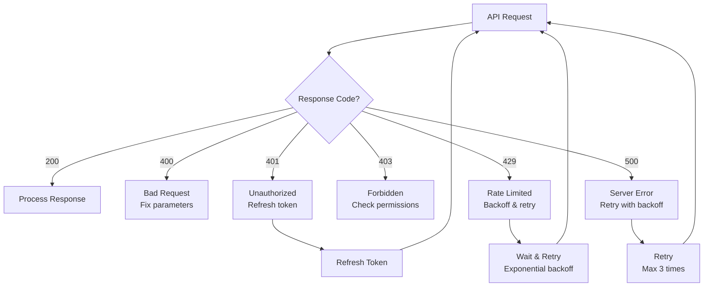
```mermaid
flowchart TB
    REQ[API Request] --> CHECK{Response Code?}
    
    CHECK -->|200| SUCCESS[Process Response]
    CHECK -->|400| E400[Bad Request<br/>Fix parameters]
    CHECK -->|401| E401[Unauthorized<br/>Refresh token]
    CHECK -->|403| E403[Forbidden<br/>Check permissions]
    CHECK -->|429| E429[Rate Limited<br/>Backoff & retry]
    CHECK -->|500| E500[Server Error<br/>Retry with backoff]
    
    E401 --> REFRESH[Refresh Token]
    REFRESH --> REQ
    
    E429 --> WAIT[Wait & Retry<br/>Exponential backoff]
    WAIT --> REQ
    
    E500 --> RETRY[Retry<br/>Max 3 times]
    RETRY --> REQ
```

**Common error codes:**

| Code | Subcode | Meaning | Solution |
|------|---------|---------|----------|
| 4 | - | Rate limit | Exponential backoff |
| 17 | - | User limit | Reduce concurrent calls |
| 100 | 33 | Invalid param | Check field names |
| 190 | - | Token expired | Refresh token |
| 200 | - | Permissions | Request missing scope |
| 613 | - | Too many calls | Batch requests |

---

## 9. Implementation Plan

### 9.1. Timeline Overview

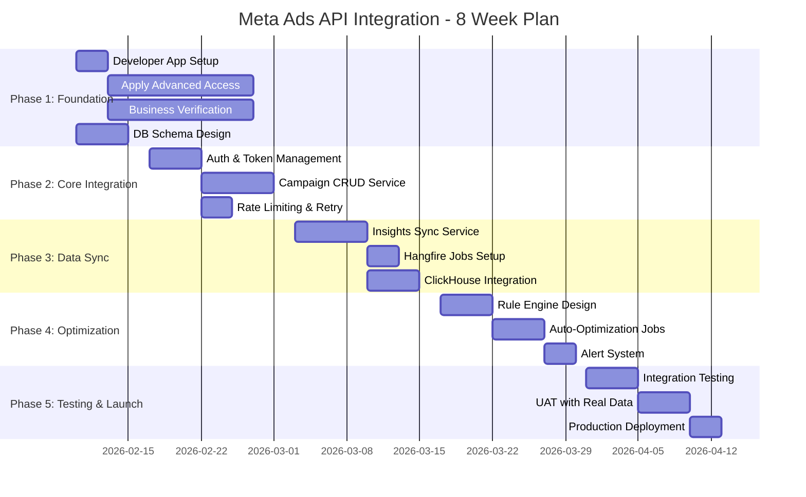
```mermaid
gantt
    title Meta Ads API Integration - 8 Week Plan
    dateFormat  YYYY-MM-DD
    
    section Phase 1: Foundation
    Developer App Setup       :a1, 2026-02-10, 3d
    Apply Advanced Access     :a2, after a1, 14d
    Business Verification     :a3, after a1, 14d
    DB Schema Design          :a4, 2026-02-10, 5d
    
    section Phase 2: Core Integration
    Auth & Token Management   :b1, 2026-02-17, 5d
    Campaign CRUD Service     :b2, after b1, 7d
    Rate Limiting & Retry     :b3, after b1, 3d
    
    section Phase 3: Data Sync
    Insights Sync Service     :c1, 2026-03-03, 7d
    Hangfire Jobs Setup       :c2, after c1, 3d
    ClickHouse Integration    :c3, after c1, 5d
    
    section Phase 4: Optimization
    Rule Engine Design        :d1, 2026-03-17, 5d
    Auto-Optimization Jobs    :d2, after d1, 5d
    Alert System              :d3, after d2, 3d
    
    section Phase 5: Testing & Launch
    Integration Testing       :e1, 2026-03-31, 5d
    UAT with Real Data        :e2, after e1, 5d
    Production Deployment     :e3, after e2, 3d
```

### 9.2. Phase Details

**Phase 1: Foundation (Week 1-2)**

| Task | Owner | Deliverable |
|------|-------|-------------|
| Create Meta Developer App | DevOps | App ID, App Secret |
| Apply for Advanced Access | Product | Approval (wait 1-2 weeks) |
| Complete Business Verification | Admin | Verified status |
| Design database schema | Backend | Migration scripts |
| Setup development environment | DevOps | Docker compose |

**Phase 2: Core Integration (Week 2-3)**

| Task | Owner | Deliverable |
|------|-------|-------------|
| Implement token management | Backend | TokenService class |
| Build Meta API client | Backend | MetaApiClient library |
| Campaign CRUD endpoints | Backend | REST API |
| Rate limiter implementation | Backend | RateLimitMiddleware |
| Unit tests | QA | 80% coverage |

**Phase 3: Data Sync (Week 4-5)**

| Task | Owner | Deliverable |
|------|-------|-------------|
| Insights sync service | Backend | InsightsSyncService |
| Hangfire job configuration | Backend | Scheduled jobs |
| ClickHouse schema | Data | Analytics tables |
| Data validation layer | Backend | Validators |

**Phase 4: Optimization (Week 5-6)**

| Task | Owner | Deliverable |
|------|-------|-------------|
| Rule engine design | Backend | RuleEngine class |
| Optimization rules | Product | Rule configurations |
| Auto-optimization jobs | Backend | OptimizationJob |
| Alert integration | Backend | Slack/Email alerts |

**Phase 5: Testing & Launch (Week 7-8)**

| Task | Owner | Deliverable |
|------|-------|-------------|
| Integration testing | QA | Test reports |
| UAT with real ad accounts | Product | Sign-off |
| Performance testing | QA | Load test results |
| Documentation | Tech Writer | User guides |
| Production deployment | DevOps | Live system |

### 9.3. Risk Matrix

```mermaid
quadrantChart
    title Risk Assessment Matrix
    x-axis Low Impact --> High Impact
    y-axis Low Probability --> High Probability
    quadrant-1 Monitor
    quadrant-2 High Priority
    quadrant-3 Accept
    quadrant-4 Mitigate
    
    "Advanced Access Delay": [0.7, 0.6]
    "Rate Limit Issues": [0.5, 0.7]
    "Token Expiry": [0.6, 0.3]
    "API Breaking Changes": [0.8, 0.4]
    "Budget Overspend": [0.9, 0.2]
    "Data Sync Failures": [0.4, 0.5]
```

**Risk mitigation strategies:**

| Risk | Probability | Impact | Mitigation |
|------|-------------|--------|------------|
| Advanced Access delay | High | High | Apply early, have backup plan |
| Rate limit issues | Medium | Medium | Implement proper throttling |
| Token expiry | Low | High | Auto-refresh 7 days before |
| API changes | Medium | High | Pin version, monitor changelog |
| Budget overspend | Low | Critical | Always create PAUSED, approval workflow |
| Data sync failures | Medium | Medium | Retry logic, alerting |

---

## 10. Appendix

### 10.1. Postman Collection

Import file `META_ADS_POSTMAN_COLLECTION.json` vào Postman với environment variables:

```json
{
  "base_url": "https://graph.facebook.com/v24.0",
  "access_token": "YOUR_TOKEN",
  "ad_account_id": "act_123456789",
  "page_id": "YOUR_PAGE_ID"
}
```

### 10.2. Database Schema (PostgreSQL)

```sql
-- Core tables
CREATE TABLE meta_ad_accounts (
    id BIGSERIAL PRIMARY KEY,
    account_id VARCHAR(50) UNIQUE NOT NULL,
    name VARCHAR(255),
    currency VARCHAR(10),
    timezone_name VARCHAR(100),
    account_status INT,
    last_synced_at TIMESTAMPTZ,
    created_at TIMESTAMPTZ DEFAULT NOW()
);

CREATE TABLE meta_campaigns (
    id BIGSERIAL PRIMARY KEY,
    campaign_id VARCHAR(50) UNIQUE NOT NULL,
    account_id VARCHAR(50) REFERENCES meta_ad_accounts(account_id),
    name VARCHAR(255),
    objective VARCHAR(50),
    status VARCHAR(20),
    daily_budget BIGINT,
    bid_strategy VARCHAR(50),
    created_time TIMESTAMPTZ,
    last_synced_at TIMESTAMPTZ
);

CREATE TABLE meta_ad_sets (
    id BIGSERIAL PRIMARY KEY,
    adset_id VARCHAR(50) UNIQUE NOT NULL,
    campaign_id VARCHAR(50) REFERENCES meta_campaigns(campaign_id),
    name VARCHAR(255),
    status VARCHAR(20),
    daily_budget BIGINT,
    optimization_goal VARCHAR(50),
    targeting JSONB,
    last_synced_at TIMESTAMPTZ
);

CREATE TABLE meta_ads (
    id BIGSERIAL PRIMARY KEY,
    ad_id VARCHAR(50) UNIQUE NOT NULL,
    adset_id VARCHAR(50) REFERENCES meta_ad_sets(adset_id),
    creative_id VARCHAR(50),
    name VARCHAR(255),
    status VARCHAR(20),
    last_synced_at TIMESTAMPTZ
);

-- Insights table (daily aggregation)
CREATE TABLE meta_insights_daily (
    id BIGSERIAL PRIMARY KEY,
    object_id VARCHAR(50) NOT NULL,
    object_type VARCHAR(20) NOT NULL,
    date_start DATE NOT NULL,
    impressions BIGINT DEFAULT 0,
    reach BIGINT DEFAULT 0,
    clicks BIGINT DEFAULT 0,
    spend DECIMAL(15,2) DEFAULT 0,
    actions JSONB,
    cost_per_action JSONB,
    created_at TIMESTAMPTZ DEFAULT NOW(),
    UNIQUE(object_id, object_type, date_start)
);

-- Indexes for performance
CREATE INDEX idx_insights_date ON meta_insights_daily(date_start);
CREATE INDEX idx_insights_object ON meta_insights_daily(object_id, object_type);
CREATE INDEX idx_campaigns_account ON meta_campaigns(account_id);
CREATE INDEX idx_adsets_campaign ON meta_ad_sets(campaign_id);
```

### 10.3. Quick Reference

| Item | Value |
|------|-------|
| API Version | v24.0 |
| Base URL | https://graph.facebook.com/v24.0 |
| Token Type (Production) | System User |
| Token Refresh | 7 days before expiry |
| Rate Limit Headers | x-business-use-case-usage |
| Max Batch Size | 50 requests |
| Insights Max History | 37 months (no breakdown) |
| Insights with Breakdown | 13 months |

### 10.4. References

- [Meta Marketing API Documentation](https://developers.facebook.com/docs/marketing-api)
- [Graph API Explorer](https://developers.facebook.com/tools/explorer/)
- [API Changelog](https://developers.facebook.com/docs/graph-api/changelog)
- [Rate Limiting Guide](https://developers.facebook.com/docs/marketing-api/overview/rate-limiting)
- [Advantage+ Migration Guide](https://developers.facebook.com/docs/marketing-api/asc-aac-migration)

---

*Document Version 2.0 | API Version: v24.0 | Last Updated: February 2026*
