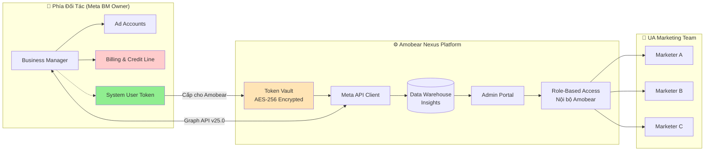
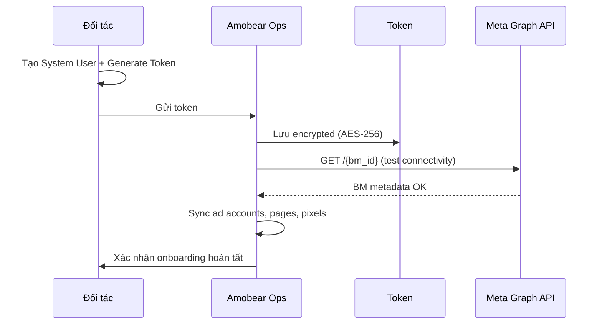
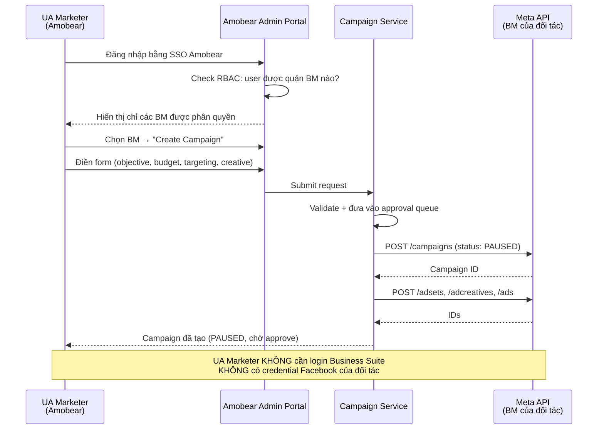
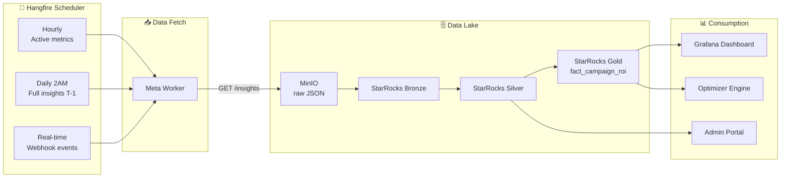
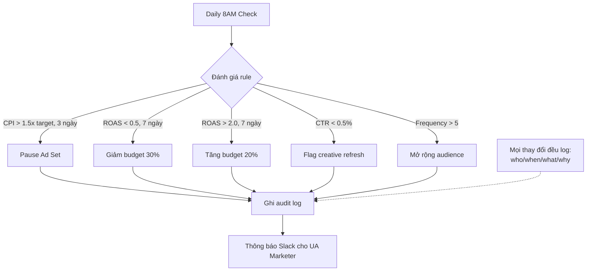
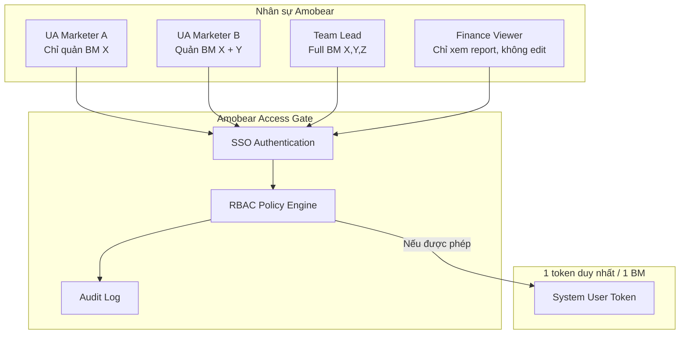

# Meta Business Manager — Hướng Dẫn Onboarding Dành Cho Đối Tác

> **Phiên bản:** 1.0
> **Cập nhật:** Tháng 04/2026
> **Meta API Version:** v25.0 (Graph API)
> **Đối tượng:** Đối tác cung cấp tài khoản Business Manager (BM) cho Amobear
> **Mục đích:** Hướng dẫn đối tác cấp quyền & phát hành token để Amobear tích hợp BM vào hệ thống Mediation Pro / Amobear Nexus

---

## 1. BỐI CẢNH & MỤC TIÊU

### 1.1. Mô hình hợp tác

Amobear là nền tảng vận hành Mobile App Marketing, chuyên chạy và tối ưu các chiến dịch User Acquisition (UA) cho hệ thống 200+ ứng dụng. Trong mô hình hợp tác với đối tác:

- **Đối tác**: Sở hữu và cung cấp tài khoản **Business Manager (BM)** cùng các **Ad Account** đi kèm. Đối tác chịu trách nhiệm về **billing, credit line, và thanh toán** với Meta.
- **Amobear**: Nhận quyền truy cập qua API để **tạo, vận hành, tối ưu, báo cáo** campaigns; **không can thiệp** vào phần billing/thanh toán của đối tác.

### 1.2. Tại sao cần tích hợp qua API thay vì truy cập Business Suite?

| Vấn đề | Truy cập Business Suite trực tiếp | Tích hợp qua API (giải pháp đề xuất) |
|--------|------------------------------------|--------------------------------------|
| Quyền riêng tư của đối tác | Amobear phải được add tài khoản cá nhân vào BM của đối tác | Đối tác chỉ cấp System User token — không lộ danh tính nhân sự |
| Bảo mật dữ liệu tài chính | Team Amobear thấy được billing, credit, invoice | Amobear chỉ thấy campaign data, KHÔNG thấy billing |
| Thao tác nhầm lẫn | Nhân sự có thể vô tình thay đổi setting BM | API chỉ cho phép các action được whitelist |
| Khả năng audit | Khó trace ai đã làm gì | Mọi thao tác đều log qua hệ thống Amobear Nexus |
| Quy mô | Mỗi UA Marketer cần 1 account → khó scale với 10+ BM | 1 token duy nhất cho 1 BM, phân quyền nội bộ ở Amobear |

### 1.3. Kết quả mong đợi sau onboarding

Sau khi đối tác hoàn tất các bước trong tài liệu này, Amobear sẽ có thể:

1. Tạo/chỉnh sửa/tạm dừng campaigns, ad sets, ads trên BM của đối tác.
2. Kéo số liệu performance (spend, impressions, clicks, installs, ROAS...) về dashboard nội bộ.
3. Tự động tối ưu budget, pause underperforming ads theo rule engine.
4. Phân quyền nội bộ cho từng UA Marketer của Amobear (ai được quản BM nào) mà **KHÔNG** cần cấp account BM trực tiếp cho họ.

---

## 2. LUỒNG HOẠT ĐỘNG TỔNG QUAN



**Phân rõ trách nhiệm:**

| Hạng mục | Đối tác | Amobear |
|----------|---------|---------|
| Sở hữu BM | ✅ | ❌ |
| Quản lý credit line / billing | ✅ | ❌ (không có quyền xem) |
| Phát hành & rotate token | ✅ | ❌ |
| Tạo / sửa / pause campaigns | ❌ | ✅ (qua API) |
| Theo dõi performance | ❌ | ✅ |
| Phân quyền UA Marketer nội bộ | ❌ | ✅ (tại hệ thống Amobear) |

---

## 3. YÊU CẦU TỪ PHÍA ĐỐI TÁC

Để Amobear có thể tích hợp, đối tác cần chuẩn bị:

### 3.1. Điều kiện tiên quyết

- [ ] **Business Manager đã được verify** (Business Verification complete). Xem: https://www.facebook.com/business/help/2058515294227817
- [ ] **Ad Account(s)** đã được thêm vào BM và có **credit line hoạt động** (payment method hợp lệ).
- [ ] **Primary Page** đã được link vào BM.
- [ ] Đối tác có một tài khoản Facebook cá nhân với **role Admin** trong BM đó để thực hiện các bước bên dưới.
- [ ] (Tuỳ chọn) **Meta Developer App** riêng để phát hành System User token — nếu chưa có, Amobear có thể cung cấp App ID đã qua App Review.

### 3.2. Thông tin cần gửi cho Amobear

Khi hoàn tất, đối tác gửi cho Amobear các thông tin sau qua kênh bảo mật :

| Thông tin | Ví dụ | Ghi chú |
|-----------|-------|---------|
| `Business Manager ID` | `123456789012345` | Số 15 chữ số, lấy từ Business Settings > Business Info |
| `Ad Account ID(s)` | `act_987654321098765` | Tất cả ad accounts cần tích hợp |
| `System User ID` | `100012345678901` | ID của System User vừa tạo |
| `System User Access Token` | `EAAB...` (chuỗi dài) | **Non-expiring token** |
| `Meta App ID` (nếu dùng App của đối tác) | `1234567890123456` | Không bắt buộc nếu dùng App của Amobear |
| Danh sách permissions đã grant | (xem mục 5) | Checklist |
---

## 4. HƯỚNG DẪN TẠO SYSTEM USER TOKEN

Amobear yêu cầu đối tác sử dụng **System User Token** (không phải User Access Token cá nhân) vì các lý do sau:

| Đặc tính | User Access Token | System User Token ✅ |
|----------|-------------------|---------------------|
| Thời hạn | Short-lived (~1h), extend được 60 ngày | **Không hết hạn** |
| Gắn với cá nhân | Có (hết hạn khi user rời công ty) | Không — gắn với BM |
| Phù hợp automation | Không — phải refresh liên tục | ✅ Có |
| Rủi ro bảo mật | Cao (lộ credential cá nhân) | Thấp — scope giới hạn theo assigned assets |

### 4.1. Các bước tạo System User

**Bước 1: Truy cập Business Settings**

1. Đăng nhập Facebook bằng tài khoản Admin của BM.
2. Vào: https://business.facebook.com/settings/
3. Chọn đúng BM ở góc trên bên trái.

**Bước 2: Tạo System User**

1. Menu trái → **Users** → **System Users**.
2. Click **Add** (góc trên bên phải).
3. Nhập thông tin:
   - **Name**: `Amobear Nexus Integration` (hoặc tên rõ ràng để dễ nhận diện)
   - **System User Role**: Chọn **Admin** (nếu muốn Amobear có quyền full trên BM này) hoặc **Employee** (quyền hạn chế — xem mục 5).
4. Click **Create System User**.
5. Xác nhận qua 2FA nếu được yêu cầu.

📖 Tham khảo chính thức: https://developers.facebook.com/docs/business-management-apis/system-users

**Bước 3: Assign Assets cho System User**

System User vừa tạo **chưa có quyền** truy cập bất cứ asset nào. Bạn cần gán thủ công:

1. Click vào System User vừa tạo.
2. Tab **Assigned Assets** → **Add Assets**.
3. Chọn từng loại asset:
   - **Ad Accounts**: Tick tất cả ad accounts muốn Amobear vận hành → chọn **Full control** (Manage Campaigns + Reporting + Manage).
   - **Pages**: Tick Pages dùng để chạy ads → chọn **Create Content, Moderate, Advertise, Analyze**.
   - **Pixels**: (nếu có) → chọn **View and Edit**.
   - **Catalogs**: (nếu chạy DPA/DABA) → chọn **Manage Catalog**.
4. Click **Save Changes**.

**Bước 4: Generate Access Token**

1. Vẫn ở màn hình System User → click **Generate New Token**.
2. Chọn **App** sẽ phát hành token:
   - Nếu đối tác có Meta Developer App riêng → chọn App đó.
   - Nếu dùng App của Amobear → Amobear sẽ gửi App ID & tên App trước.
3. Ở mục **Access Token Expiration**, chọn **Never** (System User token mặc định không hết hạn).
4. Ở mục **Permissions (Scopes)**, tick đủ các quyền trong [mục 5](#5-permissions-bắt-buộc) bên dưới.
5. Click **Generate Token**.
6. **Copy token ngay lập tức** và paste vào link Bitwarden Send mà Amobear đã cung cấp. Meta **không cho xem lại** token sau khi đóng dialog.

📖 Tham khảo: https://developers.facebook.com/docs/marketing-api/system-users/create-retrieve-update

---

## 5. PERMISSIONS BẮT BUỘC

Khi generate token ở bước 4, đối tác cần tick các permissions sau:

### 5.1. Core permissions (bắt buộc)

| Permission | Mục đích | Bắt buộc? |
|------------|----------|-----------|
| `ads_management` | Tạo, sửa, pause, delete campaigns / ad sets / ads | ✅ Bắt buộc |
| `ads_read` | Đọc performance data (impressions, spend, ROAS...) | ✅ Bắt buộc |
| `business_management` | Đọc metadata BM, list users, list assigned assets | ✅ Bắt buộc |

### 5.2. Optional permissions (tuỳ use case)

| Permission | Khi nào cần | Amobear có dùng? |
|------------|-------------|------------------|
| `pages_manage_metadata` | Quản lý Pages (upload creative dưới tên Page) | ✅ Có — bắt buộc nếu chạy Page Post Ads |
| `pages_read_engagement` | Đọc engagement data của Pages | Tuỳ — bật nếu muốn report organic metrics |
| `instagram_basic` | Chạy ads qua IG account | ✅ Có — bật nếu có chạy IG |
| `instagram_manage_insights` | Đọc IG insights | Tuỳ |
| `catalog_management` | Chạy Dynamic Product Ads (DPA) | Tuỳ — chỉ bật nếu có e-commerce catalog |
| `leads_retrieval` | Kéo Lead Ads data | Tuỳ |

### 5.3. Permissions KHÔNG cần cấp (Amobear không dùng)

Để giảm rủi ro, **KHÔNG tick** các permissions sau:

- ❌ `whatsapp_business_management` — Amobear không chạy WhatsApp Ads.
- ❌ `commerce_account_manage_orders` — Không chạm vào orders.
- ❌ Bất kỳ permission nào liên quan `finance_*` — Amobear **không cần và không được xem** billing.

📖 Đầy đủ danh sách permissions: https://developers.facebook.com/docs/permissions

---

## 6. LUỒNG HOẠT ĐỘNG CƠ BẢN CỦA HỆ THỐNG

Sau khi nhận được token, Amobear sẽ vận hành BM của đối tác qua 4 luồng chính:

### 6.1. Luồng 1 — Onboarding & Token Storage



### 6.2. Luồng 2 — UA Marketer tạo campaign (không dùng Business Suite)



### 6.3. Luồng 3 — Đồng bộ dữ liệu & báo cáo



### 6.4. Luồng 4 — Tự động tối ưu (Rule Engine)



---

## 7. PHÂN QUYỀN NỘI BỘ AMOBEAR (Đối tác không cần quan tâm chi tiết)

Để đối tác hiểu rằng **việc cấp 1 token duy nhất cho Amobear KHÔNG có nghĩa là tất cả nhân sự Amobear đều truy cập được BM**:



- 1 token = 1 BM. Amobear lưu token trong vault mã hoá.
- Chỉ **Backend Service** đọc token. UA Marketer **không bao giờ** thấy token.
- Mọi thao tác đều yêu cầu login SSO → kiểm tra RBAC → ghi audit log.
- Khi nhân sự Amobear nghỉ việc: chỉ cần disable SSO account, **không ảnh hưởng gì tới token** của đối tác.

---

## 8. BẢO MẬT TOKEN — CAM KẾT TỪ AMOBEAR

Amobear cam kết tuân thủ các biện pháp sau đối với token do đối tác cung cấp:

| Biện pháp | Mô tả |
|-----------|-------|
| **Encryption at rest** | Token mã hoá AES-256 trong PostgreSQL. Khoá mã hoá quản lý bởi AWS KMS / HashiCorp Vault. |
| **No logging** | Token **không** xuất hiện trong log, error trace, analytics. |
| **No query string** | Mọi request đến Meta API dùng `Authorization: Bearer` header, **không** `?access_token=`. |
| **Principle of least privilege** | Chỉ 2-3 service accounts backend có quyền đọc token. Không có user thông thường nào truy cập được. |
| **Audit trail** | Mọi lần token được đọc đều ghi log: timestamp, service, endpoint gọi, kết quả. |
| **IP whitelist** | Meta API calls chỉ được gọi từ dải IP production đã đăng ký. |
| **Rotation support** | Nếu đối tác muốn rotate token định kỳ (khuyến nghị: mỗi quý), Amobear hỗ trợ quy trình swap zero-downtime. |

**Đối tác có quyền revoke token bất cứ lúc nào** tại Business Settings → System Users → chọn user → **Revoke Access**. Amobear sẽ ngay lập tức mất quyền truy cập.

---

## 9. CHECKLIST NGHIỆM THU

Sau khi hoàn tất, đối tác và Amobear cùng check:

### Đối tác confirm:
- [ ] BM đã verify
- [ ] System User đã tạo, role phù hợp (Admin / Employee)
- [ ] Tất cả Ad Accounts cần tích hợp đã assign vào System User
- [ ] Pages / Pixels / Catalogs (nếu có) đã assign
- [ ] Token đã generate với đầy đủ permissions ở mục 5
- [ ] Token đã gửi cho Amobear qua kênh bảo mật
- [ ] Đã nhận confirm từ Amobear rằng API test OK

### Amobear confirm:
- [ ] Token đã lưu vào vault (encrypted)
- [ ] Test `GET /{bm_id}` trả về metadata đúng
- [ ] Test `GET /{bm_id}/owned_ad_accounts` list đúng ad accounts
- [ ] Test tạo 1 campaign `PAUSED` và rollback (delete) thành công
- [ ] Insights sync job chạy bình thường
- [ ] Gán quyền cho ít nhất 1 UA Marketer và test flow end-to-end
- [ ] Gửi báo cáo onboarding hoàn tất cho đối tác

---

## 10. LIÊN HỆ & HỖ TRỢ

| Vai trò | Email | Thời gian phản hồi |
|---------|-------|--------------------|
| Technical Lead (Amobear) | quangnguyen@amobear.vn | Trong 4h làm việc |
| Account Manager (Amobear) | thudh@amobear.vn | Trong 1 ngày làm việc |
| Security Escalation (nghi ngờ token leak) | tuan@amobear.vn | Ngay lập tức — 24/7 |

---

## 11. TÀI LIỆU THAM KHẢO GỐC TỪ META

### 11.1. Business Manager & Account Setup

| Tài liệu | URL |
|----------|-----|
| Business Manager Overview | https://www.facebook.com/business/help/113163272211510 |
| Business Verification Guide | https://www.facebook.com/business/help/2058515294227817 |
| Business Settings | https://business.facebook.com/settings/ |

### 11.2. System Users & Access Tokens

| Tài liệu | URL |
|----------|-----|
| System Users Guide | https://developers.facebook.com/docs/business-management-apis/system-users |
| Create & Retrieve System User | https://developers.facebook.com/docs/marketing-api/system-users/create-retrieve-update |
| Access Tokens Overview | https://developers.facebook.com/docs/facebook-login/guides/access-tokens |
| Long-Lived & Non-Expiring Tokens | https://developers.facebook.com/docs/facebook-login/guides/access-tokens/get-long-lived |

### 11.3. Permissions

| Tài liệu | URL |
|----------|-----|
| Permissions Reference (đầy đủ) | https://developers.facebook.com/docs/permissions |
| `ads_management` | https://developers.facebook.com/docs/permissions#ads_management |
| `ads_read` | https://developers.facebook.com/docs/permissions#ads_read |
| `business_management` | https://developers.facebook.com/docs/permissions#business_management |
| App Review Process | https://developers.facebook.com/docs/app-review |

### 11.4. Marketing API & Business Management API

| Tài liệu | URL |
|----------|-----|
| Marketing API Overview | https://developers.facebook.com/docs/marketing-apis |
| Business Management API | https://developers.facebook.com/docs/business-management-apis |
| Business Manager API Reference | https://developers.facebook.com/docs/marketing-api/reference/business/ |
| Ad Account Management | https://developers.facebook.com/docs/business-management-apis/business-asset-management/guides/ad-accounts/ |
| Graph API Explorer (tool test) | https://developers.facebook.com/tools/explorer/ |
| API Changelog | https://developers.facebook.com/docs/graph-api/changelog |
| Marketing API Changelog | https://developers.facebook.com/docs/marketing-api/marketing-api-changelog |

### 11.5. Bảo mật & Best Practices

| Tài liệu | URL |
|----------|-----|
| Rate Limiting | https://developers.facebook.com/docs/marketing-api/overview/rate-limiting |
| Securing Requests (appsecret_proof) | https://developers.facebook.com/docs/graph-api/security |
| Data Use Policy | https://developers.facebook.com/terms |

---

## 12. PHỤ LỤC — COMMAND TEST NHANH

Đối tác có thể tự kiểm tra token vừa tạo bằng các lệnh sau trước khi gửi cho Amobear:

```bash
# Test 1: Kiểm tra token hợp lệ & xem BM info
curl -H "Authorization: Bearer {ACCESS_TOKEN}" \
  "https://graph.facebook.com/v25.0/{BM_ID}?fields=id,name,verification_status"

# Test 2: Liệt kê các ad accounts System User có quyền truy cập
curl -H "Authorization: Bearer {ACCESS_TOKEN}" \
  "https://graph.facebook.com/v25.0/{BM_ID}/owned_ad_accounts?fields=id,name,account_status,currency"

# Test 3: Kiểm tra permissions của token
curl -H "Authorization: Bearer {ACCESS_TOKEN}" \
  "https://graph.facebook.com/v25.0/debug_token?input_token={ACCESS_TOKEN}"
```

**Kết quả mong đợi của Test 3** (trong JSON response phải có):

```json
{
  "data": {
    "app_id": "...",
    "type": "SYSTEM_USER",
    "is_valid": true,
    "expires_at": 0,
    "scopes": [
      "ads_management",
      "ads_read",
      "business_management",
      "pages_manage_metadata"
    ]
  }
}
```

- `expires_at: 0` → token **không hết hạn** ✅
- `type: SYSTEM_USER` → đúng loại ✅
- `scopes` → đầy đủ các permission ở mục 5 ✅

---

*Tài liệu version 1.0 | Meta API v25.0 | Cập nhật 04/2026 | Amobear × Partner*
