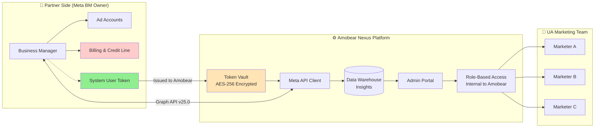
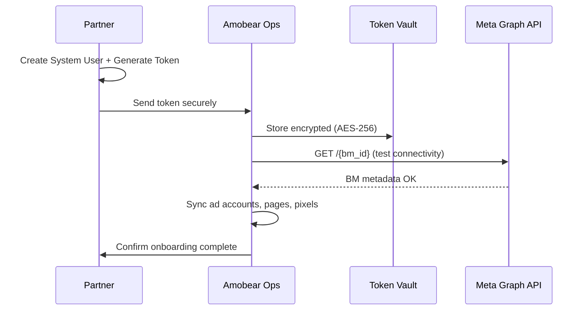
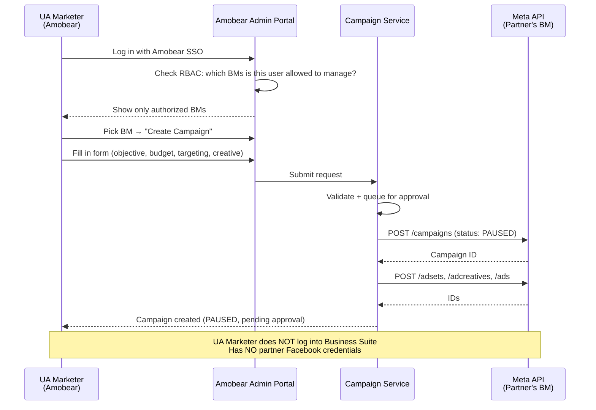
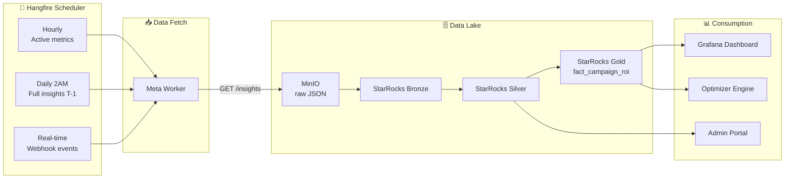
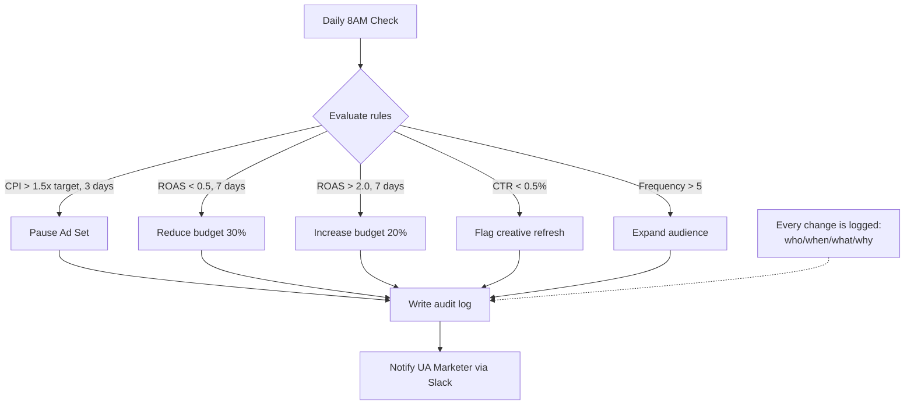
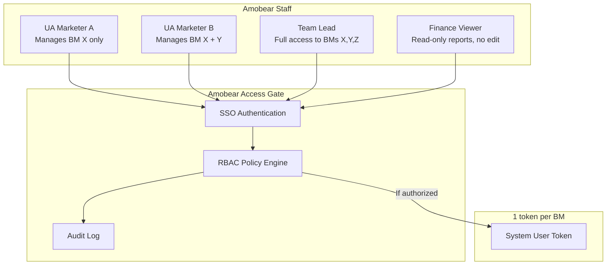

# Meta Business Manager — Partner Onboarding Guide

> **Version:** 1.0
> **Last Updated:** April 2026
> **Meta API Version:** v25.0 (Graph API)
> **Audience:** Partners providing Business Manager (BM) accounts to Amobear
> **Purpose:** Guide partners on granting permissions and issuing tokens so Amobear can integrate the BM into the Mediation Pro / Amobear Nexus platform

---

## 1. CONTEXT & OBJECTIVES

### 1.1. Partnership Model

Amobear is a Mobile App Marketing operations platform, specializing in running and optimizing User Acquisition (UA) campaigns for a portfolio of 200+ applications. In the partnership model:

- **Partner**: Owns and provides **Business Manager (BM)** accounts together with the associated **Ad Accounts**. The partner is responsible for **billing, credit line, and payment** with Meta.
- **Amobear**: Receives API-based access to **create, operate, optimize, and report** on campaigns; **does not interfere** with the partner's billing or payment matters.

### 1.2. Why integrate via API instead of direct Business Suite access?

| Concern | Direct Business Suite access | API integration (recommended) |
|---------|------------------------------|-------------------------------|
| Partner privacy | Amobear personal accounts must be added to the partner's BM | Partner only issues a System User token — no personal identities exposed |
| Financial data security | Amobear team can see billing, credit, invoices | Amobear only sees campaign data, NOT billing |
| Operational mistakes | Staff may accidentally change BM settings | API only allows whitelisted actions |
| Auditability | Hard to trace who did what | Every action is logged through Amobear Nexus |
| Scalability | Each UA Marketer needs a separate account → hard to scale with 10+ BMs | One token per BM, with internal permissions managed inside Amobear |

### 1.3. Expected outcomes after onboarding

Once the partner completes the steps in this guide, Amobear will be able to:

1. Create/edit/pause campaigns, ad sets, and ads on the partner's BM.
2. Pull performance metrics (spend, impressions, clicks, installs, ROAS, etc.) into internal dashboards.
3. Automatically optimize budgets and pause underperforming ads via the rule engine.
4. Grant internal, per-BM permissions to individual Amobear UA Marketers **WITHOUT** giving them direct BM account access.

---

## 2. HIGH-LEVEL OPERATING FLOW



**Clear responsibility split:**

| Area | Partner | Amobear |
|------|---------|---------|
| BM ownership | ✅ | ❌ |
| Credit line / billing management | ✅ | ❌ (no view access) |
| Token issuance & rotation | ✅ | ❌ |
| Create / edit / pause campaigns | ❌ | ✅ (via API) |
| Performance monitoring | ❌ | ✅ |
| Internal UA Marketer permissioning | ❌ | ✅ (within Amobear system) |

---

## 3. PARTNER-SIDE REQUIREMENTS

To enable integration, the partner needs to prepare the following:

### 3.1. Prerequisites

- [ ] **Business Manager is verified** (Business Verification complete). See: https://www.facebook.com/business/help/2058515294227817
- [ ] **Ad Account(s)** are added to the BM with an **active credit line** (valid payment method).
- [ ] **Primary Page** is linked to the BM.
- [ ] The partner has a personal Facebook account with **Admin role** on the BM to perform the steps below.
- [ ] (Optional) A dedicated **Meta Developer App** for issuing the System User token — if not available, Amobear can provide an App ID that has passed App Review.

### 3.2. Information to share with Amobear

When complete, the partner must send the following to Amobear through a secure channel:

| Information | Example | Notes |
|-------------|---------|-------|
| `Business Manager ID` | `123456789012345` | 15-digit number, taken from Business Settings > Business Info |
| `Ad Account ID(s)` | `act_987654321098765` | All ad accounts to be integrated |
| `System User ID` | `100012345678901` | ID of the newly created System User |
| `System User Access Token` | `EAAB...` (long string) | **Non-expiring token** |
| `Meta App ID` (if using the partner's App) | `1234567890123456` | Not required if using Amobear's App |
| List of granted permissions | (see section 5) | Checklist |
---

## 4. HOW TO CREATE A SYSTEM USER TOKEN

Amobear requires the partner to use a **System User Token** (not a personal User Access Token) for the following reasons:

| Attribute | User Access Token | System User Token ✅ |
|-----------|-------------------|---------------------|
| Lifetime | Short-lived (~1h), extendable to 60 days | **Never expires** |
| Tied to an individual | Yes (expires when the user leaves the company) | No — tied to the BM |
| Automation-friendly | No — needs constant refresh | ✅ Yes |
| Security risk | High (exposes personal credentials) | Low — scope limited to assigned assets |

### 4.1. Steps to create a System User

**Step 1: Open Business Settings**

1. Log into Facebook with an Admin account of the BM.
2. Go to: https://business.facebook.com/settings/
3. Select the correct BM in the top-left corner.

**Step 2: Create a System User**

1. Left menu → **Users** → **System Users**.
2. Click **Add** (top-right).
3. Fill in:
   - **Name**: `Amobear Nexus Integration` (or any clear, identifiable name)
   - **System User Role**: Choose **Admin** (to grant Amobear full control over this BM) or **Employee** (limited scope — see section 5).
4. Click **Create System User**.
5. Confirm via 2FA if prompted.

📖 Official reference: https://developers.facebook.com/docs/business-management-apis/system-users

**Step 3: Assign Assets to the System User**

The newly created System User **has no access** to any asset yet. You must assign them manually:

1. Click the System User you just created.
2. **Assigned Assets** tab → **Add Assets**.
3. For each asset type:
   - **Ad Accounts**: Select all ad accounts Amobear should operate → choose **Full control** (Manage Campaigns + Reporting + Manage).
   - **Pages**: Select the Pages used to run ads → choose **Create Content, Moderate, Advertise, Analyze**.
   - **Pixels**: (if any) → choose **View and Edit**.
   - **Catalogs**: (if running DPA/DABA) → choose **Manage Catalog**.
4. Click **Save Changes**.

**Step 4: Generate the Access Token**

1. On the same System User screen → click **Generate New Token**.
2. Select the **App** that will issue the token:
   - If the partner has their own Meta Developer App → select it.
   - If using Amobear's App → Amobear will provide the App ID & App name in advance.
3. For **Access Token Expiration**, choose **Never** (System User tokens are non-expiring by default).
4. For **Permissions (Scopes)**, tick all permissions listed in [section 5](#5-required-permissions) below.
5. Click **Generate Token**.
6. **Copy the token immediately** and paste it into the Bitwarden Send link provided by Amobear. Meta will **not display** the token again after the dialog is closed.

📖 Reference: https://developers.facebook.com/docs/marketing-api/system-users/create-retrieve-update

---

## 5. REQUIRED PERMISSIONS

When generating the token in Step 4, the partner must tick the following permissions:

### 5.1. Core permissions (required)

| Permission | Purpose | Required? |
|------------|---------|-----------|
| `ads_management` | Create, edit, pause, delete campaigns / ad sets / ads | ✅ Required |
| `ads_read` | Read performance data (impressions, spend, ROAS, …) | ✅ Required |
| `business_management` | Read BM metadata, list users, list assigned assets | ✅ Required |

### 5.2. Optional permissions (use-case dependent)

| Permission | When needed | Does Amobear use it? |
|------------|-------------|----------------------|
| `pages_manage_metadata` | Manage Pages (upload creatives under a Page's name) | ✅ Yes — required for Page Post Ads |
| `pages_read_engagement` | Read Page engagement data | Optional — enable for organic metric reporting |
| `instagram_basic` | Run ads via an IG account | ✅ Yes — enable when running IG ads |
| `instagram_manage_insights` | Read IG insights | Optional |
| `catalog_management` | Run Dynamic Product Ads (DPA) | Optional — only for e-commerce catalogs |
| `leads_retrieval` | Pull Lead Ads data | Optional |

### 5.3. Permissions NOT to grant (Amobear does not use them)

To reduce risk, **do NOT tick** the following:

- ❌ `whatsapp_business_management` — Amobear does not run WhatsApp Ads.
- ❌ `commerce_account_manage_orders` — Amobear does not touch orders.
- ❌ Any `finance_*` permission — Amobear **does not need and must not see** billing.

📖 Full permissions list: https://developers.facebook.com/docs/permissions

---

## 6. BASIC SYSTEM OPERATING FLOWS

After receiving the token, Amobear operates the partner's BM through 4 main flows:

### 6.1. Flow 1 — Onboarding & Token Storage



### 6.2. Flow 2 — UA Marketer creates a campaign (no Business Suite needed)



### 6.3. Flow 3 — Data sync & reporting



### 6.4. Flow 4 — Automated optimization (Rule Engine)



---

## 7. AMOBEAR INTERNAL PERMISSIONING (Partner does not need the details)

So the partner understands that **issuing a single token to Amobear does NOT mean every Amobear employee can access the BM**:



- 1 token = 1 BM. Amobear stores tokens in an encrypted vault.
- Only **Backend Services** read the token. UA Marketers **never** see it.
- Every action requires SSO login → RBAC check → audit log entry.
- When an Amobear employee leaves: simply disable their SSO account, with **no impact** on the partner's token.

---

## 8. TOKEN SECURITY — AMOBEAR'S COMMITMENTS

Amobear commits to the following controls for tokens provided by the partner:

| Control | Description |
|---------|-------------|
| **Encryption at rest** | Tokens are encrypted with AES-256 in PostgreSQL. Encryption keys are managed by AWS KMS / HashiCorp Vault. |
| **No logging** | Tokens **do not** appear in logs, error traces, or analytics. |
| **No query string** | All requests to Meta API use `Authorization: Bearer` header, **never** `?access_token=`. |
| **Principle of least privilege** | Only 2–3 backend service accounts can read tokens. No regular users have access. |
| **Audit trail** | Every token read is logged: timestamp, service, endpoint called, result. |
| **IP whitelist** | Meta API calls originate only from registered production IP ranges. |
| **Rotation support** | If the partner wishes to rotate tokens periodically (recommended: quarterly), Amobear supports a zero-downtime swap process. |

**The partner can revoke the token at any time** via Business Settings → System Users → select user → **Revoke Access**. Amobear will immediately lose access.

---

## 9. ACCEPTANCE CHECKLIST

Upon completion, both parties verify:

### Partner confirms:
- [ ] BM is verified
- [ ] System User is created with an appropriate role (Admin / Employee)
- [ ] All required Ad Accounts are assigned to the System User
- [ ] Pages / Pixels / Catalogs (if any) are assigned
- [ ] Token is generated with all permissions from section 5
- [ ] Token has been delivered to Amobear through a secure channel
- [ ] Received confirmation from Amobear that API tests passed

### Amobear confirms:
- [ ] Token is stored in the vault (encrypted)
- [ ] `GET /{bm_id}` test returns correct metadata
- [ ] `GET /{bm_id}/owned_ad_accounts` lists the correct ad accounts
- [ ] Successfully created a `PAUSED` test campaign and rolled back (deleted) it
- [ ] Insights sync job is running normally
- [ ] Assigned at least one UA Marketer and tested the end-to-end flow
- [ ] Onboarding completion report delivered to the partner

---

## 10. CONTACT & SUPPORT

| Role | Email | Response SLA |
|------|-------|--------------|
| Technical Lead (Amobear) | quangnguyen@amobear.vn | Within 4 business hours |
| Account Manager (Amobear) | thudh@amobear.vn | Within 1 business day |
| Security Escalation (suspected token leak) | tuan@amobear.vn | Immediate — 24/7 |

---

## 11. OFFICIAL META REFERENCE DOCUMENTATION

### 11.1. Business Manager & Account Setup

| Document | URL |
|----------|-----|
| Business Manager Overview | https://www.facebook.com/business/help/113163272211510 |
| Business Verification Guide | https://www.facebook.com/business/help/2058515294227817 |
| Business Settings | https://business.facebook.com/settings/ |

### 11.2. System Users & Access Tokens

| Document | URL |
|----------|-----|
| System Users Guide | https://developers.facebook.com/docs/business-management-apis/system-users |
| Create & Retrieve System User | https://developers.facebook.com/docs/marketing-api/system-users/create-retrieve-update |
| Access Tokens Overview | https://developers.facebook.com/docs/facebook-login/guides/access-tokens |
| Long-Lived & Non-Expiring Tokens | https://developers.facebook.com/docs/facebook-login/guides/access-tokens/get-long-lived |

### 11.3. Permissions

| Document | URL |
|----------|-----|
| Permissions Reference (full) | https://developers.facebook.com/docs/permissions |
| `ads_management` | https://developers.facebook.com/docs/permissions#ads_management |
| `ads_read` | https://developers.facebook.com/docs/permissions#ads_read |
| `business_management` | https://developers.facebook.com/docs/permissions#business_management |
| App Review Process | https://developers.facebook.com/docs/app-review |

### 11.4. Marketing API & Business Management API

| Document | URL |
|----------|-----|
| Marketing API Overview | https://developers.facebook.com/docs/marketing-apis |
| Business Management API | https://developers.facebook.com/docs/business-management-apis |
| Business Manager API Reference | https://developers.facebook.com/docs/marketing-api/reference/business/ |
| Ad Account Management | https://developers.facebook.com/docs/business-management-apis/business-asset-management/guides/ad-accounts/ |
| Graph API Explorer (test tool) | https://developers.facebook.com/tools/explorer/ |
| API Changelog | https://developers.facebook.com/docs/graph-api/changelog |
| Marketing API Changelog | https://developers.facebook.com/docs/marketing-api/marketing-api-changelog |

### 11.5. Security & Best Practices

| Document | URL |
|----------|-----|
| Rate Limiting | https://developers.facebook.com/docs/marketing-api/overview/rate-limiting |
| Securing Requests (appsecret_proof) | https://developers.facebook.com/docs/graph-api/security |
| Data Use Policy | https://developers.facebook.com/terms |

---

## 12. APPENDIX — QUICK TEST COMMANDS

The partner can self-verify the newly created token with the following commands before sending it to Amobear:

```bash
# Test 1: Validate token & inspect BM info
curl -H "Authorization: Bearer {ACCESS_TOKEN}" \
  "https://graph.facebook.com/v25.0/{BM_ID}?fields=id,name,verification_status"

# Test 2: List ad accounts the System User can access
curl -H "Authorization: Bearer {ACCESS_TOKEN}" \
  "https://graph.facebook.com/v25.0/{BM_ID}/owned_ad_accounts?fields=id,name,account_status,currency"

# Test 3: Inspect token permissions
curl -H "Authorization: Bearer {ACCESS_TOKEN}" \
  "https://graph.facebook.com/v25.0/debug_token?input_token={ACCESS_TOKEN}"
```

**Expected result of Test 3** (the JSON response should contain):

```json
{
  "data": {
    "app_id": "...",
    "type": "SYSTEM_USER",
    "is_valid": true,
    "expires_at": 0,
    "scopes": [
      "ads_management",
      "ads_read",
      "business_management",
      "pages_manage_metadata"
    ]
  }
}
```

- `expires_at: 0` → token **never expires** ✅
- `type: SYSTEM_USER` → correct type ✅
- `scopes` → contains all permissions listed in section 5 ✅

---

*Document version 1.0 | Meta API v25.0 | Last updated 04/2026 | Amobear × Partner*
