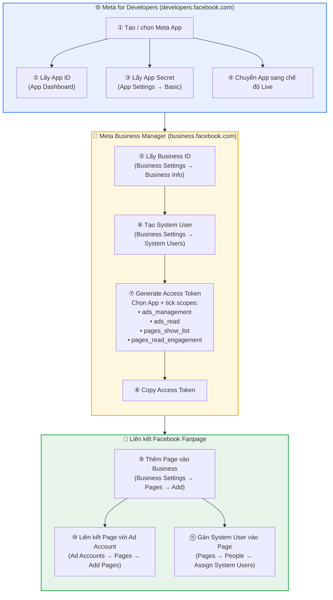
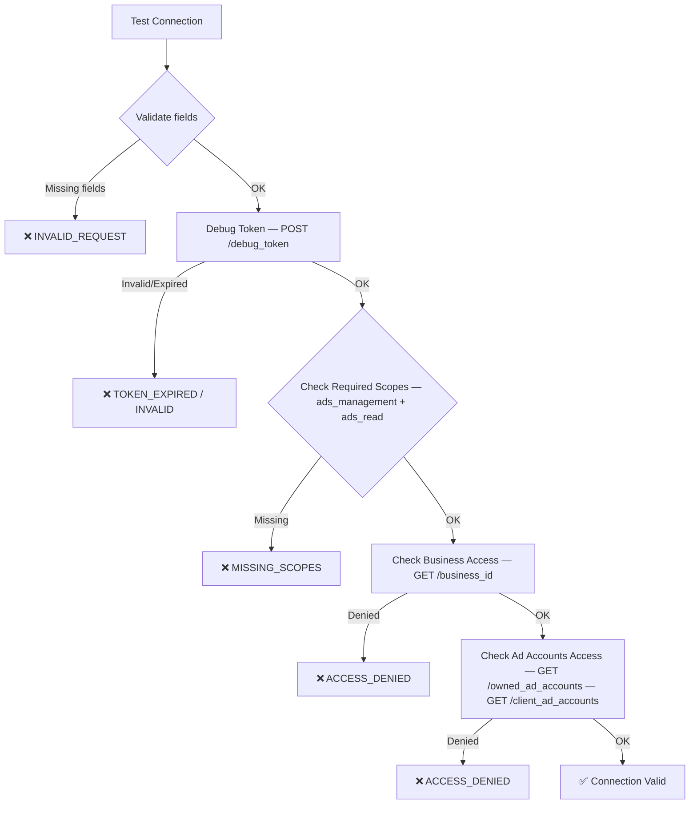

# Hướng dẫn tích hợp tài khoản Meta vào hệ thống

## Mục lục

1. [Tổng quan](#tổng-quan)
2. [Điều kiện tiên quyết](#điều-kiện-tiên-quyết)
3. [Thông tin tích hợp cơ bản](#thông-tin-tích-hợp-cơ-bản)
4. [Yêu cầu về Permission của Access Token](#yêu-cầu-về-permission-của-access-token)
5. [Kết nối Facebook Fanpage](#kết-nối-facebook-fanpage)
6. [Quy trình Test Connection](#quy-trình-test-connection)
7. [Troubleshooting](#troubleshooting)

---

## Tổng quan

Hệ thống sử dụng **Meta Marketing API** để quản lý và tối ưu hóa quảng cáo Meta (Facebook/Instagram). Mỗi tích hợp (Integration) đại diện cho một bộ thông tin xác thực (credentials) kết nối tới một Meta Business Account. Integration được sử dụng bởi backend để:

- Sync danh sách Ad Account
- Tạo và quản lý campaign, ad set, ad
- Đọc dữ liệu Insights (chi tiêu, ROAS...)
- Load danh sách Facebook Fanpage để chọn khi tạo quảng cáo

---

## Điều kiện tiên quyết

Trước khi tạo Integration, cần chuẩn bị:

| Mục | Nơi lấy | Ghi chú |
|-----|---------|---------|
| **Meta Business Account** | [business.facebook.com](https://business.facebook.com) | Tài khoản Business cần sở hữu hoặc quản lý các Ad Account |
| **Meta App** | [developers.facebook.com](https://developers.facebook.com) | App cần ở chế độ **Live** (không phải Development) |
| **System User** | Business Settings → System Users | Khuyến nghị dùng **Admin System User** cho production |
| **Access Token** | Tạo từ System User hoặc qua OAuth | Xem chi tiết bên dưới |

### Sơ đồ các bước lấy thông tin trên Meta



> [!NOTE]
> Bước ⑨–⑪ (Liên kết Fanpage) chỉ cần thực hiện nếu muốn chọn Facebook Fanpage khi tạo quảng cáo. Nếu chỉ sync Ad Account và đọc insights thì chỉ cần bước ①–⑧.

---

## Thông tin tích hợp cơ bản

Khi tạo mới một Integration tại trang **Data Account → tab Meta Integration → Create Integration**, cần điền các thông tin sau:

### Integration Setup

| Trường | Bắt buộc | Mô tả |
|--------|----------|-------|
| **Display Name** | ✅ | Tên hiển thị của integration (ví dụ: "Production - Company ABC") |
| **Auth Mode** | ✅ | Chế độ xác thực, có 2 lựa chọn (xem bảng bên dưới) |
| **Meta Business ID** | ✅ | Business ID lấy từ Meta Business Manager (Settings → Business Info) |
| **Meta App ID** | ✅ | App ID lấy từ Meta for Developers (App Dashboard) |
| **App Secret** | ✅ | App Secret lấy từ Meta for Developers (App Settings → Basic) |

### Auth Mode Options

| Giá trị | Hiển thị | Mục đích |
|---------|----------|----------|
| `system_user_token` | **SYSTEM_USER** | ✅ **Khuyến nghị cho production.** Token ổn định, không hết hạn (nếu dùng permanent token) |
| `oauth_user` | **USER_TOKEN** | ⚠️ Chỉ dùng cho dev/test. Token hết hạn sau ~60 ngày, cần refresh thường xuyên |

> [!IMPORTANT]
> **Luôn sử dụng `SYSTEM_USER` cho môi trường production.** `USER_TOKEN` chỉ phù hợp cho development/testing vì token có thời hạn hết hạn và phụ thuộc vào session của user cá nhân.

### Access & Permissions

| Trường | Bắt buộc | Mô tả |
|--------|----------|-------|
| **Access Token** | ✅ | Token được tạo từ System User hoặc OAuth |
| **Token Type** | Không | Mặc định: `Bearer` |
| **Token Expires At** | Không | Thời điểm hết hạn (tự động điền khi Test Connection) |
| **Scopes** | ✅ | Danh sách permission, cách nhau bằng dấu phẩy (xem mục tiếp theo) |

### Tùy chọn bổ sung

| Trường | Mô tả |
|--------|-------|
| **Set as Default** | Đánh dấu integration này là mặc định |
| **Enabled** | Bật/tắt integration |

---

## Yêu cầu về Permission của Access Token

### Scopes bắt buộc (Required Scopes)

Hệ thống **bắt buộc** access token phải có **đầy đủ** 2 scope sau:

| Scope | Mục đích |
|-------|----------|
| `ads_management` | Tạo, chỉnh sửa, xóa campaign / ad set / ad. Quản lý cấu hình quảng cáo |
| `ads_read` | Đọc dữ liệu campaign, insights (chi tiêu, impressions, ROAS...) |

> [!CAUTION]
> Nếu thiếu bất kỳ scope nào trong 2 scope trên, hệ thống sẽ **từ chối** sử dụng token. Khi test connection, trạng thái sẽ hiển thị **"MISSING_SCOPES"**.

### Scopes khuyến nghị bổ sung cho Facebook Fanpage

Ngoài 2 scope bắt buộc, để có thể **chọn Facebook Fanpage** khi tạo quảng cáo, access token cần thêm các scope sau:

| Scope | Mục đích |
|-------|----------|
| `pages_show_list` | Cho phép liệt kê danh sách các Facebook Pages mà user/system user có quyền truy cập (sử dụng bởi endpoint `me/accounts`) |
| `pages_read_engagement` | Cho phép đọc nội dung, bài viết và engagement của Facebook Pages (cần thiết khi chọn bài viết existing post cho quảng cáo) |

> [!NOTE]
> Nếu tokens thiếu `pages_show_list`, endpoint `me/accounts` sẽ **trả về danh sách rỗng** hoặc báo lỗi permission, khiến không thể chọn fanpage trong form tạo quảng cáo.

### Tổng hợp danh sách Scopes cần thiết

```
ads_management, ads_read, pages_show_list, pages_read_engagement
```

### Cách tạo Access Token với đầy đủ scope

#### Cách 1: System User Token (Production — Khuyến nghị)

1. Truy cập [Meta Business Manager](https://business.facebook.com) → **Business Settings**
2. Vào **System Users** → Chọn hoặc tạo System User (loại **Admin**)
3. Click **"Generate New Token"**
4. Chọn App tương ứng
5. Tick chọn các permission:
   - ☑️ `ads_management`
   - ☑️ `ads_read`
   - ☑️ `pages_show_list`
   - ☑️ `pages_read_engagement`
6. Click **Generate Token** → Copy token
7. Dán token vào trường **Access Token** trong form Integration

> [!TIP]
> System User Token **không hết hạn** (permanent), trừ khi bị thu hồi (revoke) thủ công hoặc App bị disable.

#### Cách 2: OAuth User Token (Dev/Test Only)

1. Trong trang Integrations, chọn Integration có Auth Mode = `USER_TOKEN`
2. Click nút **"Open Dev OAuth"** ở góc trên phải
3. Đăng nhập Facebook cá nhân và cấp quyền
4. Hệ thống tự động exchange code → short-lived token → long-lived token (~60 ngày)

---

## Kết nối Facebook Fanpage

### Cách hoạt động

Hệ thống load danh sách Facebook Fanpage từ **2 nguồn** (theo thứ tự ưu tiên):

#### Nguồn 1: Promote Pages (mặc định)

Lấy danh sách pages gắn với Ad Account thông qua Meta Graph API:

```
GET /{ad_account_id}?fields=promote_pages{id,name,category,tasks}
```

Nếu API trên không trả kết quả, fallback sang edge:

```
GET /{ad_account_id}/promote_pages?fields=id,name,category,tasks
```

**Đây là nguồn mặc định khi chọn fanpage trong form tạo quảng cáo.**

#### Nguồn 2: All Accessible Pages (tùy chọn)

Lấy **tất cả** pages mà access token có quyền truy cập:

```
GET /me/accounts?fields=id,name,category,tasks,access_token
```

Nguồn này được sử dụng khi API truyền query parameter `source=all`.

### Điều kiện để Fanpage xuất hiện trong danh sách

Để một Facebook Fanpage xuất hiện khi chọn trong form tạo quảng cáo, cần **đồng thời** đáp ứng:

#### Đối với Promote Pages (nguồn mặc định)

| # | Điều kiện | Cách thực hiện |
|---|-----------|----------------|
| 1 | **Fanpage phải được liên kết với Ad Account** | Trong Business Manager → chọn Ad Account → Tab **Pages** → Add Page |
| 2 | **Access Token có quyền quản lý Ad Account** | Token phải có scope `ads_management` |
| 3 | **Page phải được phép promote** | Page cần được cấp quyền `ADVERTISE` cho Ad Account |

#### Đối với All Accessible Pages

| # | Điều kiện | Cách thực hiện |
|---|-----------|----------------|
| 1 | **Token phải có scope `pages_show_list`** | Khi tạo token, tick permission `pages_show_list` |
| 2 | **System User phải được gán quyền trên Page** | Business Settings → Pages → chọn Page → Assign System User |
| 3 | **Token phải có scope `pages_read_engagement`** | Cần thiết để đọc bài viết trên page |

### Hướng dẫn liên kết Fanpage với Ad Account (Promote Pages)

1. Truy cập [Meta Business Manager](https://business.facebook.com) → **Business Settings**
2. Menu trái: **Accounts** → **Ad Accounts**
3. Chọn Ad Account cần liên kết
4. Chuyển sang tab **"Pages"**
5. Click **"Add Pages"** → Chọn Facebook Page muốn liên kết
6. Xác nhận liên kết
7. Quay lại hệ thống → Fanpage sẽ xuất hiện trong danh sách khi tạo quảng cáo

### Hướng dẫn gán System User vào Fanpage (All Accessible Pages)

1. Truy cập **Business Settings** → **Accounts** → **Pages**
2. Chọn Facebook Page cần gán
3. Tab **"People"** → Click **"Assign System Users"** (hoặc **"Add People"**)
4. Chọn System User → Gán quyền (khuyến nghị: **Content** hoặc **Admin**)
5. Lưu thay đổi

---

## Quy trình Test Connection

Sau khi điền đầy đủ thông tin, click nút **"Test Connection"** để hệ thống kiểm tra:



### Token Status và ý nghĩa

| Status | Ý nghĩa | Cách xử lý |
|--------|---------|-------------|
| ✅ **VALID** | Token hợp lệ, đủ scope | Không cần hành động |
| ⚠️ **NOT_TESTED** | Chưa test connection | Click "Test Connection" |
| ⚠️ **EXPIRED** | Token đã hết hạn | Tạo token mới và cập nhật |
| ❌ **MISSING_SCOPES** | Thiếu scope `ads_management` hoặc `ads_read` | Tạo lại token với đầy đủ scope |
| ❌ **ACCESS_DENIED** | Token không có quyền truy cập Business hoặc Ad Accounts | Kiểm tra lại System User đã được gán vào Business chưa |
| ❌ **INVALID** | Token không hợp lệ (sai token hoặc App Secret) | Kiểm tra lại thông tin App credentials |

---

## Troubleshooting

### Lỗi "Missing ads_management scope" hoặc "Missing ads_read scope"

**Nguyên nhân:** Token thiếu permission bắt buộc.

**Cách xử lý:**
1. Vào Meta Business Manager → System Users
2. Tạo lại token với đầy đủ scope: `ads_management`, `ads_read`
3. Cập nhật token mới vào Integration → Test Connection lại

### Lỗi "Meta business access denied"

**Nguyên nhân:** System User chưa được thêm vào Meta Business.

**Cách xử lý:**
1. Business Settings → System Users → Assign Assets
2. Gán Business cho System User
3. Test Connection lại

### Không thấy Facebook Fanpage trong danh sách

**Nguyên nhân có thể:**
1. **Page chưa được liên kết với Ad Account** → Thêm page vào Ad Account (xem hướng dẫn phần Promote Pages)
2. **System User chưa được gán quyền trên Page** → Gán System User vào Page
3. **Token thiếu scope `pages_show_list`** → Tạo lại token với scope bổ sung
4. **Page chưa thuộc Business** → Thêm Page vào Business (Business Settings → Pages → Add)

### Lỗi "Invalid app credentials"

**Nguyên nhân:** App ID hoặc App Secret không chính xác.

**Cách xử lý:**
1. Kiểm tra App ID tại [developers.facebook.com](https://developers.facebook.com) → App Dashboard
2. Kiểm tra App Secret tại App Settings → Basic → App Secret
3. Đảm bảo App đang ở chế độ **Live** (không phải Development)

### Token bị expired (USER_TOKEN)

**Nguyên nhân:** User Token có thời hạn ~60 ngày.

**Cách xử lý:**
- **Ngắn hạn:** Click "Open Dev OAuth" để refresh token
- **Dài hạn:** Chuyển sang sử dụng System User Token (không hết hạn)
