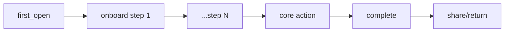

# Amobear Nexus — App Insight V1: Daily Report Structure
## Báo cáo sức khỏe app hàng ngày · Radar + Health Score + T+1 Action Tracking

> **Mục tiêu cuối cùng:** Mỗi sáng T+1, hệ thống sinh báo cáo insight cho từng app → DA review → export PDF gửi BOD → hệ thống tự kiểm tra actions ngày hôm trước đã giải quyết hay chưa.
> **Tham khảo thêm:** QOn App Intelligence (cách trình bày metrics/insight), doc 121 (8 dimensions + radar)
> **Format output:** Markdown (render trên Nexus UI + export PDF)

---

## 1. Cấu trúc báo cáo Daily Insight

### 1.1 Layout tổng thể (1 report = 1 app = 1 ngày)

```
╔══════════════════════════════════════════════════════════════════╗
║  DAILY APP HEALTH REPORT                                        ║
║  AR Tracer: Trace Drawing iOS — 2026-04-07                      ║
╠══════════════════════════════════════════════════════════════════╣
║                                                                  ║
║  ┌─────────────────────────┐  ┌──────────────────────────────┐  ║
║  │    HEALTH SCORE          │  │       RADAR CHART             │  ║
║  │                          │  │                               │  ║
║  │     ┌──────┐             │  │    Revenue ★★★★☆              │  ║
║  │     │  74  │  Good       │  │      /        \               │  ║
║  │     │ A-Tier│  ↑3        │  │  Velocity    Growth           │  ║
║  │     └──────┘             │  │    |    ╱  ╲    |             │  ║
║  │                          │  │  Portfolio   Engage           │  ║
║  │  vs hôm qua: 71 (+3)    │  │      \   ╲╱   /              │  ║
║  │  vs 7d avg: 68 (+6)     │  │   UnitEcon  Product           │  ║
║  │                          │  │        AdInfra                │  ║
║  └─────────────────────────┘  └──────────────────────────────┘  ║
║                                                                  ║
║  ┌──────────────────────────────────────────────────────────┐   ║
║  │  DIMENSION SCORES TABLE                                    │   ║
║  │  Revenue: 91 ↑ | Growth: 35 ↓ | Engage: 62 → | ...       │   ║
║  └──────────────────────────────────────────────────────────┘   ║
║                                                                  ║
║  ┌──────────────────────────────────────────────────────────┐   ║
║  │  T+1 ACTION REVIEW (từ báo cáo hôm qua)                  │   ║
║  │  ✅ Fill rate đã hồi phục 85.2% (hôm qua: 80.9%)         │   ║
║  │  ⏳ gold.daily_overview vẫn empty — chưa fix               │   ║
║  │  ❌ UA budget chưa điều chỉnh — ROI vẫn 18.3%             │   ║
║  └──────────────────────────────────────────────────────────┘   ║
║                                                                  ║
║  ════════════════════════════════════════════════════════════    ║
║  SECTION 1: Executive Summary                                    ║
║  SECTION 2: Revenue & Monetization + Ad Infrastructure           ║
║  SECTION 3: Engagement & Retention                               ║
║  SECTION 4: Product & Content Health                             ║
║  SECTION 5: Growth & Acquisition                                 ║
║  SECTION 6: Subscription Health (nếu có QOn)                    ║
║  SECTION 7: App Stability (nếu có AppMetrica)                   ║
║  SECTION 8: Anomalies & Alerts                                   ║
║  SECTION 9: Action Plan (mới) + Carried Forward (chưa xong)     ║
║  ════════════════════════════════════════════════════════════    ║
║                                                                  ║
║  APPENDIX: Data Sources & Gaps                                   ║
╚══════════════════════════════════════════════════════════════════╝
```

### 1.2 Nguyên tắc thiết kế

| Nguyên tắc | Chi tiết |
|-------------|----------|
| **BOD-ready** | Bất kỳ ai đọc Executive Summary + Radar đều nắm được tình hình trong 30 giây |
| **Data-grounded** | Mọi con số phải từ snapshot, không suy diễn. Ghi rõ data source |
| **Actionable** | Mỗi section kết thúc bằng KẾT LUẬN + action cụ thể với team tag |
| **T+1 Tracking** | Mở đầu báo cáo bằng review actions ngày hôm trước |
| **PDF-exportable** | Markdown chuẩn + Mermaid charts → render + export PDF |
| **Consistent** | Format số chuẩn, heading chuẩn, để AI sinh đồng nhất qua 500 apps |

---

## 2. Health Score & Radar — Hệ thống tính điểm

### 2.1 Tám Dimensions (giữ nguyên doc 121, chỉ tính khi CÓ DATA)

| # | Dimension | Key | Câu hỏi trả lời | Data Sources V1 |
|---|-----------|-----|-----------------|-----------------|
| 1 | 💰 Revenue & Monetization | `revenue` | App kiếm tiền tốt không? | AdMob Gold + Bronze, QOn |
| 2 | 📈 Growth & Acquisition | `growth` | App đang tăng trưởng không? UA hiệu quả? | XMP, Adjust, AppsFlyer, Firebase |
| 3 | 👥 Engagement & Retention | `engagement` | User có quay lại? Engage sâu không? | Firebase, AppMetrica |
| 4 | 🎮 Product & Content | `product` | Nội dung/game có vấn đề? Core loop? | Firebase events, AppMetrica (crash) |
| 5 | 📡 Ad Infrastructure | `adInfra` | Fill rate? Network balance? eCPM? | AdMob Bronze |
| 6 | 💵 Unit Economics | `unitEcon` | LTV vs CAC? ARPDAU? Profitable? | Derived (all sources) |
| 7 | 🌍 Portfolio Position | `portfolio` | App đứng đâu trong portfolio? | Cross-app (khi có) |
| 8 | ⚡ Optimization Velocity | `velocity` | Team có đang optimize? Actions có được thực hiện? | T+1 tracking, action log |

### 2.2 Scoring Weights theo Category

| Dimension | Creative Utility | AI Chat | Puzzle Game | Casual Game | Generic |
|-----------|:---:|:---:|:---:|:---:|:---:|
| Revenue | 20% | 20% | 15% | 20% | 20% |
| Growth | 10% | 10% | 10% | 10% | 15% |
| Engagement | 20% | 25% | 20% | 20% | 20% |
| Product | 20% | 15% | 25% | 20% | 15% |
| Ad Infra | 15% | 15% | 15% | 10% | 15% |
| Unit Econ | 10% | 10% | 10% | 10% | 10% |
| Portfolio | 5% | 5% | 5% | 5% | 5% |
| Velocity | — | — | — | 5% | — |

### 2.3 Composite Health Score

```
composite_score = Σ (dimension_score × weight) / Σ (weight of dimensions CÓ DATA)

Ví dụ: Chỉ 4/8 dimensions có data (revenue=91, adInfra=67, engagement=62, growth=35)
Weights (creative_utility): 20%, 15%, 20%, 10%
composite = (91×20 + 67×15 + 62×20 + 35×10) / (20+15+20+10) = 4915/65 = 75.6 → 76
```

### 2.4 Tier Classification

| Score | Tier | Badge | Ý nghĩa |
|-------|------|-------|---------|
| 90-100 | S-Tier | 🏆 | Star performer — scale aggressively |
| 80-89 | A-Tier | 🟢 | Healthy — monitor & optimize |
| 65-79 | B-Tier | 🔵 | Acceptable — has improvement areas |
| 50-64 | C-Tier | 🟡 | Warning — multiple areas declining |
| 30-49 | D-Tier | 🟠 | Unhealthy — needs intervention |
| 0-29 | F-Tier | 🔴 | Critical — consider sunset |

### 2.5 Radar Chart (Mermaid)


> Khi dimension = N/A (không có data), set value = 0 trên radar, ghi chú rõ "N/A — insufficient data". Radar vẫn render nhưng cạnh đó sẽ sập xuống tâm.

---

## 3. T+1 Action Tracking — Cơ chế theo dõi liên tục

### 3.1 Workflow hàng ngày

```
┌─────────────────────────────────────────────────────────────────┐
│                    DAILY INSIGHT WORKFLOW                         │
├─────────────────────────────────────────────────────────────────┤
│                                                                  │
│  04:00 UTC │ Pipeline chạy: Gold → Silver → Bronze queries       │
│            │ Snapshot builder tạo JSON cho mỗi app               │
│            │                                                     │
│  04:30 UTC │ AI generate insight report (Markdown + radar data)  │
│            │ ⭐ BƯỚC MỚI: Load actions từ báo cáo T-1            │
│            │ So sánh metrics hôm nay vs hôm qua                  │
│            │ Tự động classify: ✅ Resolved / ⏳ Ongoing / ❌ Worse │
│            │                                                     │
│  05:00 UTC │ Report sẵn sàng trên Nexus UI                      │
│            │ DA review + annotate (nếu cần)                      │
│            │                                                     │
│  08:00     │ BOD nhận PDF (auto-export hoặc DA gửi)             │
│            │                                                     │
│  Cả ngày   │ Teams execute actions → ghi nhận trong system       │
│            │                                                     │
│  Ngày mai  │ Insight T+1 mở đầu bằng review actions hôm nay     │
│            │ Cycle lặp lại                                       │
│                                                                  │
└─────────────────────────────────────────────────────────────────┘
```

### 3.2 Action Status Classification

```
Mỗi action từ báo cáo T-1 được AI tự động review dựa trên data T:

✅ RESOLVED — Metric đã cải thiện vượt ngưỡng cảnh báo
   Ví dụ: "Fill rate hôm qua 80.9% → hôm nay 86.2% (vượt 85% threshold)"
   → Ghi nhận, không cần action tiếp

⏳ ONGOING — Metric chưa cải thiện nhưng không xấu thêm
   Ví dụ: "gold.daily_overview vẫn empty — pipeline chưa fix"
   → Carry forward, escalate nếu >3 ngày

❌ WORSENED — Metric xấu hơn so với hôm qua
   Ví dụ: "Fill rate tiếp tục giảm 80.9% → 78.5%"
   → Escalate urgency, tag [BOD] nếu >2 ngày

🆕 NEW — Action mới phát sinh từ data hôm nay
```

### 3.3 T+1 Review Format trong report

```markdown
## 🔄 Action Review (từ báo cáo 2026-04-06)

| # | Action hôm qua | Status | Evidence | Next step |
|---|---------------|--------|----------|-----------|
| 1 | [Mediation] Rà soát fill rate 80.9% | ✅ Resolved | Fill rate phục hồi 86.2% (+5.3pp) | Tiếp tục monitor |
| 2 | [DA] Fix gold.daily_overview pipeline | ⏳ Ongoing (ngày 3) | Vẫn empty | ⚡ Escalate [Dev] — block DAU/ARPDAU |
| 3 | [UA] Siết budget ROI 18.3% | ❌ Worsened | ROI giảm tiếp 15.1% | 🔴 Escalate [BOD] — pause UA? |

**Tóm tắt:** 1/3 actions resolved. 1 ongoing >3 ngày cần escalate. 1 worsened cần BOD decision.
```

### 3.4 Dữ liệu cần lưu cho T+1 tracking

```json
// Lưu trong app_daily_insights table hoặc JSON metadata
{
  "report_date": "2026-04-07",
  "app_id": "ar_tracer_trace_drawing_ios",
  "actions": [
    {
      "id": "ACT-20260407-001",
      "description": "Rà soát fill rate giảm từ 89.4% xuống 80.9%",
      "team": "Mediation",
      "urgency": "24h",
      "trigger_metric": "fill_rate",
      "trigger_value": 0.809,
      "threshold": 0.85,
      "confidence": 95,
      "status": "new",
      "created_date": "2026-04-07",
      "resolved_date": null,
      "carried_days": 0
    }
  ],
  "previous_actions_review": [
    {
      "original_id": "ACT-20260406-002",
      "original_description": "Fix gold.daily_overview pipeline",
      "status": "ongoing",
      "evidence": "gold.daily_overview vẫn empty",
      "carried_days": 3,
      "escalated": true
    }
  ]
}
```

---

## 4. Output Format — Markdown Report Template

### 4.1 Template hoàn chỉnh (AI phải sinh đúng format này)

````markdown
# 📊 Daily App Health Report
## {app_name} — {date}

---

### 🏥 Health Score: {score}/100 — {tier_badge} {tier_name}

| | Score | Trend | Status |
|---|---:|---|---|
| 💰 Revenue & Monetization | {score} | {↑/↓/→}{delta} | {🟢/🔵/🟡/🟠/🔴} {label} |
| 📈 Growth & Acquisition | {score} | {trend} | {status} |
| 👥 Engagement & Retention | {score} | {trend} | {status} |
| 🎮 Product & Content | {score} | {trend} | {status} |
| 📡 Ad Infrastructure | {score} | {trend} | {status} |
| 💵 Unit Economics | {score} | {trend} | {status} |
| 🌍 Portfolio Position | {score} | {trend} | {status} |
| ⚡ Optimization Velocity | {score} | {trend} | {status} |

> **Composite:** {score}/100 ({tier}). Tính trên {N}/8 dimensions có data.


---

### 🔄 Action Review (từ báo cáo {date_t1})

| # | Action | Status | Evidence | Next |
|---|--------|--------|----------|------|
| {carried actions from previous report} |

**Tóm tắt:** {X}/{Y} resolved, {Z} ongoing, {W} worsened.

---

### 💰 Revenue & Monetization ({score}/100) {trend_icon}

**Revenue {date}:** **${revenue_t}** ({+/-}{dod_pct}% vs hôm qua)
vs 7d avg: **${revenue_7d}** ({+/-}{vs_7d_pct}%)
vs 14d avg: **${revenue_14d}** ({+/-}{vs_14d_pct}%)

{Phân tích 3-5 câu: IAA vs IAP, eCPM trend, fill rate cross-ref, volume vs quality}

```mermaid
xychart-beta
    title "Revenue 14 ngày"
    x-axis [{dates}]
    y-axis "USD" {min} --> {max}
    bar [{values}]
```


**Top Ad Units:**
1. {unit_1} — ${rev_1}
2. {unit_2} — ${rev_2}
3. {unit_3} — ${rev_3}

**KẾT LUẬN:** {1-2 câu: bền vững hay fragile? Action cần thiết?}

---

### 📡 Ad Infrastructure ({score}/100) {trend_icon}

**Fill Rate:** **{fill_t}%** (hôm qua: {fill_t1}%) {cảnh báo nếu <85%}
**eCPM:** **${ecpm_t}** (hôm qua: ${ecpm_t1})
**Impressions:** **{imp_t}** ({+/-}% vs hôm qua)

{SoW analysis, concentration risk, format breakdown}

**KẾT LUẬN:** {Ad delivery health assessment}

---

### 👥 Engagement & Retention ({score}/100) {trend_icon}

**DAU:** **{dau_t}** ({+/-}% vs 7d) ⚠️ {bronze fallback nếu cần}
**Sessions/user:** **{sessions_per_user}**
**DAV/DAU:** **{ad_penetration}%**

**Retention:**
| Cohort | D0 | D1 | D7 | D14 | D30 |
|--------|---:|---:|---:|----:|----:|
| {date range} | {d0} | {d1}% | {d7}% | {d14}% | {d30}% |

```mermaid
xychart-beta
    title "DAU + KPI #1 — 14 ngày"
    x-axis [{dates}]
    y-axis "Users" {min} --> {max}
    line [{dau_values}]
    bar [{kpi1_values}]
```

**KẾT LUẬN:** {Retention health, cross-ref với revenue/UA}

---

### 🎮 Product & Content ({score}/100) {trend_icon}

{Tuỳ category:}
- Creative Utility: Drawing rate, completion, onboarding funnel, D0 activation
- AI Chat: Chat rate, msg/user, content love/skip
- Puzzle Game: Level health, fail rate, progression



**KẾT LUẬN:** {Core loop health, product signals}

---

### 📈 Growth & Acquisition ({score}/100) {trend_icon}

**UA Cost:** **${ua_cost_t}** (hôm qua: ${ua_cost_t1})
**ROI:** **{roi_t}%** (hôm qua: {roi_t1}%)
**Organic/Paid:** {organic_pct}% / {paid_pct}% (source: {AppsFlyer/Adjust})

{Spend by channel nếu có XMP}

```mermaid
xychart-beta
    title "UA Cost vs Revenue"
    x-axis [{dates}]
    y-axis "USD" 0 --> {max}
    bar [{cost_values}]
    line [{revenue_values}]
```

**KẾT LUẬN:** {UA efficiency, sustainability}

---

### 💵 Unit Economics ({score}/100) {trend_icon}

**ARPDAU:** **${arpdau}** (7d avg: ${arpdau_7d})
**LTV D7 est.:** **${ltv_d7}** | **CPI avg:** **${cpi}**
**LTV/CPI ratio:** **{ratio}x** {> 1.5 = profitable, < 1.0 = burning}

**KẾT LUẬN:** {Profitability assessment}

---

### 💳 Subscription Health ({score}/100) {trend_icon}
> *Section này chỉ xuất hiện khi có QOn data*

**MRR:** **${mrr}** ({+/-}% vs tháng trước)
**Trial→Paid:** **{trial_to_paid}%** (hôm qua: {t1}%)
**Active Trials:** **{active_trials}** | New: {new_trials}
**Cancellation Rate:** **{cancel_rate}%** (hôm qua: {t1}%)
**Refund Rate:** **{refund_rate}%** | ${refund_dollars}

**KẾT LUẬN:** {Subscription health, churn risk}

---

### 🔧 App Stability ({score}/100) {trend_icon}
> *Section này chỉ xuất hiện khi có AppMetrica data hoặc crash events*

**Crash-free Rate:** **{crash_free}%** (hôm qua: {t1}%)
**Top crash:** {crash_reason_1}
**Version regression:** {version nếu có}

**KẾT LUẬN:** {Stability assessment}

---

### ⚠️ Anomalies & Alerts

| Alert | So sánh | Team | Confidence |
|-------|---------|------|----------:|
| {anomaly_1} | {comparison} | [{team}] | {conf}% |
| {anomaly_2} | {comparison} | [{team}] | {conf}% |

**Data Gaps:**
- {gap_1}
- {gap_2}

---

### ✅ Action Plan

| # | Action | Team | Urgency | Confidence | Từ section |
|---|--------|------|---------|----------:|-----------|
| 1 | {action cụ thể} | [{team}] | 🔴 24h | {conf}% | Revenue |
| 2 | {action} | [{team}] | 🟡 3d | {conf}% | Ad Infra |
| 3 | {action} | [{team}] | 🔵 7d | {conf}% | Engagement |

**Carried Forward (chưa giải quyết từ báo cáo trước):**
| # | Action gốc | Ngày tạo | Đã carry {N} ngày | Status | Escalate? |
|---|-----------|----------|-------------------|--------|-----------|
| CF-1 | {action} | {date} | {N} ngày | ⏳ | {Yes/No} |

---

### 📎 Appendix: Data Sources

| Block | Source | Layer | Freshness | Note |
|-------|--------|-------|-----------|------|
| Revenue | gold.fact_daily_app_metrics | Gold | T-1 | ✅ |
| DAU/Sessions | bronze.fb_* | Bronze ⚠️ | T-1 | gold.daily_overview empty |
| Ad Sources | bronze.admob_table | Bronze | T-1 | ✅ |
| UA Cost | bronze.xmp_report | Bronze | T-1 | ✅ |
| Attribution | AppsFlyer (Firebase) | Bronze | T-1 | af_status |
| Subscription | QOn | Bronze | T-1 | {available/unavailable} |
| Crashes | AppMetrica | Bronze | T-1 | {available/unavailable} |
````

---

## 5. Prompt Architecture — 3 Layers (cập nhật cho Report format)

### Layer 1: Global AI Instructions

```
[SYSTEM PROMPT — Layer 1: Global Instructions]

Bạn là AI App Health Analyst cho Amobear Nexus. Mỗi ngày bạn nhận:
1. Snapshot dữ liệu ngày T của 1 app
2. Actions từ báo cáo ngày T-1 (nếu có)

Nhiệm vụ: Tạo báo cáo Markdown theo ĐÚNG template format. Report này sẽ được:
- Hiển thị trên Nexus UI (có radar chart renderer)
- Export PDF gửi BOD
- Dùng làm input cho báo cáo T+1 (action tracking)

=== HEALTH SCORING ===
- 8 dimensions, mỗi dimension 0-100.
- Composite = weighted average CHỈ trên dimensions CÓ DATA. N/A → loại khỏi tính toán, set radar = 0.
- Tier: S(90+), A(80-89), B(65-79), C(50-64), D(30-49), F(<30).
- So sánh score hôm nay vs hôm qua → ghi trend ↑/↓/→ và delta.

=== T+1 ACTION TRACKING ===
- Nếu nhận được previous_actions: review từng action, classify ✅/⏳/❌ dựa trên data hôm nay.
- ✅ Resolved: metric đã cải thiện qua ngưỡng cảnh báo.
- ⏳ Ongoing: chưa cải thiện, ghi carried_days.
- ❌ Worsened: metric xấu hơn → escalate urgency.
- Nếu carried_days ≥ 3 → đề xuất escalate lên cấp trên.
- Actions mới + carried forward → tổng hợp cuối report.

=== FORMAT SỐ LIỆU ===
- Revenue: $#,###.## (KHÔNG 6 decimal). eCPM: $#.##. Tỉ lệ: #.#%.
- Fill rate: hiển thị % (78.8%) KHÔNG decimal raw (0.788).
- So sánh: ghi rõ "từ X lên/xuống Y ({+/-}#.#%)"
- Tiếng Việt, chuyên nghiệp.

=== CHARTS ===
- Radar: Mermaid radar-beta, 2 lines (hôm nay + hôm qua).
- Revenue trend: Mermaid xychart, 14 ngày.
- Revenue split: Mermaid pie.
- DAU + KPI#1: Mermaid xychart, 14 ngày.
- UA vs Revenue: Mermaid xychart.
- Onboarding funnel: Mermaid flowchart.

=== SECTIONS ===
Phải sinh ĐÚNG thứ tự:
1. Health Score + Radar + Dimension Table
2. T+1 Action Review (bỏ qua nếu không có previous_actions)
3. Revenue & Monetization
4. Ad Infrastructure  
5. Engagement & Retention
6. Product & Content
7. Growth & Acquisition
8. Unit Economics
9. Subscription Health (CHỈ khi QOn data available)
10. App Stability (CHỈ khi AppMetrica data available hoặc crash events)
11. Anomalies & Alerts
12. Action Plan + Carried Forward
13. Appendix: Data Sources

=== CROSS-REFERENCE RULES ===
Luôn kiểm tra:
- Revenue ↑ + Fill ↓ → "fragile growth, volume-driven"
- Revenue ↑ + DAU ↓ → "ads intensity tăng, không bền"
- D1 ↓ + New users ↑ → "UA quality kém"
- D7 ↓ + D1 OK → "core loop có vấn đề"
- Trial conversion ↓ + New trials ↑ → "funnel burning faster"
- Crash spike + Version mới → "version regression"
- Organic ↓ + UA cost ↑ → "paid dependency tăng"

=== QUY TẮC ===
- Chỉ dùng số từ snapshot. KHÔNG bịa.
- Mỗi section kết thúc bằng KẾT LUẬN 1-2 câu.
- Team tags: [Mediation], [UA], [Product], [DA], [Dev], [BOD], [Marketing]
- Section không có data → ghi N/A ngắn gọn, không viết dài.
```

### Layer 2: Category Context (giữ nguyên từ doc trước)

Viết 5-7 bộ: creative_utility, ai_chat, puzzle_game, casual_game, video_media, ai_utility, generic. Mỗi bộ ~150 words gồm: core loop, monetization model, KPI targets, dimension weights, scoring overrides.

### Layer 3: Auto-generated App Context (giữ nguyên)

SnapshotBuilder tự query: app name, bundle, platform, top 30 events, ad format mapping, data availability.

---

## 6. Dimension Scoring Rules — Chi tiết

### 6.1 💰 Revenue & Monetization (0-100)

```
INPUT: revenue_t, revenue_t1, revenue_7d_avg, revenue_14d_avg, ecpm_t, ecpm_7d, 
       iap_revenue (nếu có QOn/Firebase), iaa_pct

SCORING:
base = 50

Revenue trend (max +25):
  revenue_t > revenue_7d_avg × 1.15 → +25
  revenue_t > revenue_7d_avg × 1.05 → +15
  revenue_t > revenue_7d_avg × 0.95 → +5
  revenue_t < revenue_7d_avg × 0.85 → -15
  revenue_t < revenue_7d_avg × 0.75 → -25

eCPM trend (max +15):
  ecpm_t > ecpm_7d × 1.10 → +15
  ecpm_t stable (±5%) → +5
  ecpm_t < ecpm_7d × 0.90 → -10

Revenue mix (max +10):
  IAP exists + IAA < 90% → +10
  IAA > 95% → -5 (mono-source risk)

Score = clamp(base + trend + ecpm + mix, 0, 100)
```

### 6.2 📈 Growth & Acquisition (0-100)

```
INPUT: new_users_t, new_users_7d_avg, ua_cost_t, roi_t, organic_pct

SCORING:
base = 50

New users trend (max +20):
  new_users_t > 7d_avg × 1.15 → +20
  stable → +5
  declining >15% → -15

ROI (max +20):
  roi > 1.5 → +20
  roi 1.0-1.5 → +10
  roi 0.5-1.0 → -5
  roi < 0.5 → -20

Organic health (max +10):
  organic > 40% → +10
  organic 30-40% → +5
  organic < 30% → -5
  organic < 20% → -10

Score = clamp(base + users + roi + organic, 0, 100)
```

### 6.3 👥 Engagement & Retention (0-100)

```
INPUT: dau_t, dau_7d_avg, sessions_per_user, d1_retention, d7_retention, kpi1_rate

SCORING:
base = 50

DAU trend (max +15):
  dau_t > 7d × 1.10 → +15
  stable → +5
  declining >10% → -15

Retention (max +25):
  D1 > 40% → +25
  D1 30-40% → +15
  D1 25-30% → +5
  D1 < 25% → -10
  D1 < 20% → -20

Session quality (max +10):
  sessions/user > 2.5 → +10
  sessions/user 1.5-2.5 → +5
  sessions/user < 1.5 → -5

Score = clamp(base + dau + retention + sessions, 0, 100)
```

### 6.4-6.8 (Product, AdInfra, UnitEcon, Portfolio, Velocity)

Tương tự pattern trên — base 50, cộng/trừ theo metric thresholds từ KB. Xem KB-1 trong doc trước cho ngưỡng chi tiết.

**Velocity scoring đặc biệt** — dựa trên T+1 tracking:
```
base = 50
action_resolution_rate > 80% → +25
action_resolution_rate 50-80% → +10
action_resolution_rate < 30% → -15
carried_actions > 5 (>3 ngày) → -10
no actions taken in 7 days → -20
```

---

## 7. Data Sources đầy đủ V1

| # | Source | Bảng | Dữ liệu chính | JOIN key | Loại app |
|---|--------|------|---------------|----------|----------|
| 1 | AdMob Gold | `gold.fact_daily_app_metrics` | Revenue, eCPM, fill, impressions, ua_cost, roi | `app_id` (admob) via `dim_app_identifiers` | Tất cả |
| 2 | AdMob Bronze | `bronze.admob_table` | Revenue by ad unit | `app_id` (admob) via `dim_app_identifiers` | Tất cả |
| 3 | AdMob Bronze | `bronze.mediation_table` | Revenue by ad source × country | `app_id` (admob) via `dim_app_identifiers` | Tất cả |
| 4 | Firebase Bronze | `bronze.fb_<app_id>` | Events, DAU, retention, product metrics | `firebase_id` trực tiếp | Tất cả |
| 5 | XMP Bronze | `bronze.xmp_report` | UA cost by channel | `store_package_id` = bundle_id | Tất cả |
| 6 | Adjust Bronze | `bronze.adjust_report` | Installs by network/campaign | `app_token` = `dim_app_identifiers.adjust_id` | App có Adjust |
| 7 | AppsFlyer | Firebase `user_properties_json` | Organic/paid attribution | `$.af_status`, `$.af_message` | Tất cả (qua Firebase) |
| 8 | QOn | `bronze.qon_*` (đang tích hợp) | Subscription: MRR, trials, churn, refunds | TBD khi pipeline done | App có subscription |
| 9 | AppMetrica | `bronze.appmetrica_*` | Crashes, ANR, sessions, profiles | TBD | Game |

### Fallback Priority

```
Engagement:   Gold daily_overview → Silver engagement → Bronze fb_*
Retention:    Gold retention_overview → Bronze fb_* (install_date + retention_day)
Content:      Gold content_engagement → Silver event_summary → Bronze fb_*
IAP:          QOn → Gold iap_performance → Bronze fb_* (iap_* events)
Attribution:  Adjust → AppsFlyer (af_*) → Firebase first_open
Crashes:      AppMetrica → Firebase app_exception
Revenue:      Gold fact_daily → Silver daily_app_revenue → Bronze admob
```

---

## 8. Queries cho Snapshot Builder

*(Giữ nguyên 19 queries từ doc trước: Q1-Q2 Gold, Q3-Q4 AdMob, Q5-Q12 Firebase fallback, Q13-Q15 XMP/Adjust, Q16-Q17 AppsFlyer, Q18 QOn, Q19 AppMetrica)*

**Bổ sung query cho T+1 tracking:**

```sql
-- Q20: Load previous day's actions (từ app_daily_insights table)
SELECT 
  actions_json,
  dimension_scores_json,
  health_score,
  health_tier
FROM app_daily_insights
WHERE app_id = '{app_id}'
  AND insight_date = DATE_SUB('{report_date}', INTERVAL 1 DAY)
  AND status = 'completed'
ORDER BY created_at DESC
LIMIT 1;
```

---

## 9. Snapshot JSON Schema V1 (cập nhật)

```json
{
  "app": { "name": "...", "platform": "ios", "bundle_id": "...", "firebase_id": "...", "category": "creative_utility" },
  "date": "2026-04-07",
  "schemaVersion": 1,

  "revenue": { "dataSource": "gold", "revenue_t": 1369.65, "..." : "..." },
  "adInfrastructure": { "dataSource": "bronze", "top_ad_sources": [...], "top_ad_units": [...] },
  "engagement": { "dataSource": "bronze", "dau_14d": [...], "sessions_14d": [...] },
  "retention": { "dataSource": "bronze", "cohorts": [...] },
  "product": { "dataSource": "bronze", "...category-specific..." },
  "growth": { "dataSource": "gold+bronze", "ua_cost_t": 7494.27, "roi_t": 0.183, "spend_by_channel": [...] },
  "attribution": { "dataSource": "appsflyer", "organic_paid_ratio": {...}, "..." },
  "subscription": { "dataSource": "qon|null", "mrr_t": 12500, "trial_to_paid_rate": 17.46, "..." },
  "appStability": { "dataSource": "appmetrica|null", "crash_free_rate_t": 99.3, "..." },
  "systemHealth": { "gold_daily_overview": "empty", "data_gaps": [...] },

  "previousReport": {
    "date": "2026-04-06",
    "health_score": 71,
    "health_tier": "B",
    "dimension_scores": { "revenue": 85, "growth": 30, "engagement": 60, "adInfra": 72, "..." },
    "actions": [
      {
        "id": "ACT-20260406-001",
        "description": "Rà soát fill rate giảm",
        "team": "Mediation",
        "urgency": "24h",
        "trigger_metric": "fill_rate",
        "trigger_value": 0.809,
        "threshold": 0.85
      },
      {
        "id": "ACT-20260406-002",
        "description": "Fix gold.daily_overview pipeline",
        "team": "DA",
        "urgency": "24h",
        "trigger_metric": "gold_daily_overview",
        "trigger_value": "empty",
        "carried_days": 2
      }
    ]
  }
}
```

---

## 10. So sánh: Card-based vs Report-based

| Khía cạnh | Card-based (QOn style) | Report-based (chọn này) |
|-----------|----------------------|------------------------|
| **Đối tượng** | Team tự xem, quick glance | BOD + team, export PDF |
| **Depth** | Mỗi card độc lập, shallow | Sections liên kết, cross-reference sâu |
| **Health Score** | Chỉ overview | Radar + 8 dimension scores + trend |
| **Action tracking** | Không có T+1 | ✅ T+1 tracking tự động |
| **Charts** | Không có (card chỉ text) | Radar + trend + pie + funnel |
| **PDF export** | Khó layout | Markdown → PDF trực tiếp |
| **Scalability** | Render 5-12 cards | Render 1 report, 9-13 sections |
| **Tham khảo QOn** | Output format | Insight quality, metrics depth, headline style |

---

## 11. PDF Export Workflow

```
Markdown report (AI output)
    │
    ├── Nexus UI renders: Markdown + Mermaid charts + Radar component
    │
    ├── "Export PDF" button:
    │   1. Mermaid charts → SVG → inline images
    │   2. Radar chart (Recharts) → SVG snapshot
    │   3. Markdown + images → PDF (puppeteer hoặc prince)
    │   4. Header: Amobear logo + app name + date
    │   5. Footer: "Generated by Amobear Nexus AI · {timestamp} · Page X/Y"
    │
    └── Output: "{app_name}_Daily_Health_{date}.pdf"
```

---

## 12. Implementation Checklist

### Phase 1: Core Report (tuần 1-2)

- [ ] Layer 1 Global Instructions → lưu Template
- [ ] Layer 2: 4 Category Contexts (creative_utility, ai_chat, puzzle_game, generic)
- [ ] SnapshotBuilder V1: Gold → Bronze fallback + 19 queries
- [ ] Health Scoring Engine: 8 dimension scorers + composite calculator
- [ ] Radar data generator (8 values cho Mermaid)
- [ ] AppsFlyer attribution query (Q16-Q17)
- [ ] Test: AR Tracer full report → verify radar + scores + all sections

### Phase 2: T+1 Tracking + New Sources (tuần 3-4)

- [ ] T+1 Action Tracking: load previous actions (Q20) → auto-classify ✅/⏳/❌
- [ ] Action persistence: lưu actions JSON trong app_daily_insights
- [ ] QOn integration: confirm schema, implement Q18
- [ ] AppMetrica integration: confirm schema, implement Q19
- [ ] Velocity dimension scoring (dựa trên action resolution rate)
- [ ] Test: 3-day continuous run → verify T+1 tracking works

### Phase 3: Production + PDF (tuần 5-6)

- [ ] PDF export: Markdown + Mermaid → PDF pipeline
- [ ] Batch run: top 50 apps, verify report quality
- [ ] Category assignment cho top 50 apps
- [ ] Monitoring: report generation time, score distribution, action resolution rate
- [ ] DA review workflow: annotate → approve → send BOD
- [ ] Feedback loop: adjust thresholds based on DA feedback

---

*Tài liệu này là blueprint cho App Insight V1 format báo cáo. Output là Markdown report có radar, health score, charts, T+1 action tracking — sẵn sàng export PDF gửi BOD hàng ngày.*
