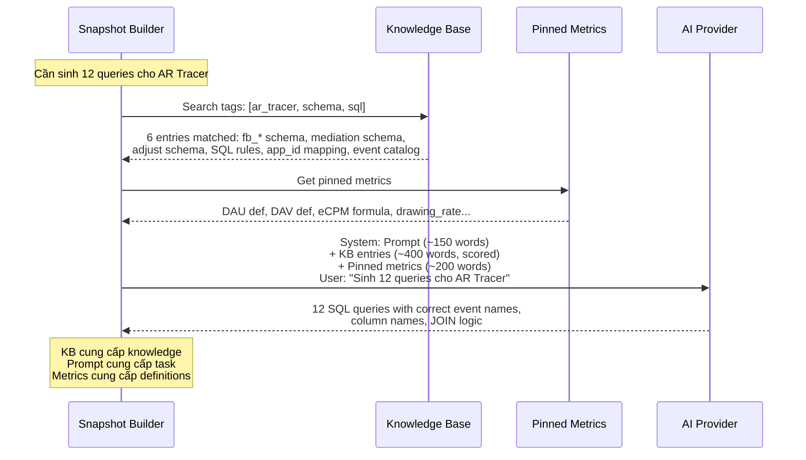

# App Insight — Prompt ↔ KB/RAG Split
## Tối ưu: 72% nội dung chuyển sang Knowledge Base

> **Trước:** ~550 words prompt (~730 tokens)
> **Sau:** ~150 words prompt + KB tự inject khi cần (~200 tokens prompt overhead)
> **KB entries cần tạo:** ~15 entries, tái sử dụng cho 500+ apps

---

## 1. Nguyên tắc phân tách

```
PROMPT (giữ ngắn):
  → "Làm GÌ" — task, output format, contract
  → Thay đổi mỗi lần chạy hoặc mỗi app

KB/RAG (inject khi match):
  → "Biết GÌ" — schema, rules, definitions, event catalogs
  → Tĩnh hoặc thay đổi chậm, dùng chung nhiều apps
  → AI search KB theo keywords trong câu hỏi/task

METRICS (đã có):
  → Pinned metrics: DAU, ARPDAU, eCPM... definitions
  → Luôn có mặt, không qua scoring
```

```
┌──────────────────────────────────────────────────────────────────┐
│                   TRƯỚC (tất cả trong prompt)                    │
│                                                                  │
│  ┌──────────────────────────────────────────────────────────┐    │
│  │ Task instructions + Schema rules + Column names +        │    │
│  │ Event catalogs + Metric definitions + SQL syntax rules   │    │
│  │                   ~550 words                              │    │
│  └──────────────────────────────────────────────────────────┘    │
│                                                                  │
│                   SAU (tách 3 nơi)                                │
│                                                                  │
│  ┌─────────────┐  ┌─────────────────┐  ┌─────────────────────┐  │
│  │ PROMPT      │  │ KB (RAG search) │  │ PINNED METRICS      │  │
│  │ ~150 words  │  │ ~15 entries     │  │ ~20 metrics         │  │
│  │             │  │ inject khi match│  │ luôn có mặt         │  │
│  │ - Task spec │  │ - Schema DDL    │  │ - DAU definition    │  │
│  │ - 12 keys   │  │ - SQL rules     │  │ - eCPM formula      │  │
│  │ - Output fmt│  │ - Event catalog │  │ - Fill rate def     │  │
│  │ - App name  │  │ - Column names  │  │ - drawing_rate def  │  │
│  └─────────────┘  │ - Join patterns │  │ - ARPDAU formula    │  │
│                   └─────────────────┘  └─────────────────────┘  │
└──────────────────────────────────────────────────────────────────┘
```

---

## 2. KB Entries cần tạo

### 2.1 Schema & SQL Rules (chung cho tất cả apps)

| # | KB Entry Title | Tags | Priority | Content tóm tắt |
|---|---------------|------|----------|-----------------|
| 1 | **StarRocks SQL Rules** | `sql`, `starrocks`, `syntax` | 9 | `get_json_string` không `JSON_EXTRACT`. GROUP BY không hỗ trợ alias. Backtick `` `date` ``. Chỉ SELECT. LIMIT bắt buộc. |
| 2 | **bronze.fb_* Schema** | `firebase`, `bronze`, `schema` | 8 | Cột: event_date, event_name, user_pseudo_id, install_date, retention_day, event_params_json, user_properties_json, device_json, geo_json, raw_event_json. KHÔNG có app_id. |
| 3 | **bronze.mediation_table Schema** | `mediation`, `admob`, `schema` | 8 | Cột ngày: `` `date` ``. Revenue: `estimated_earnings` (KHÔNG estimated_revenue). Requests: `ad_requests` (KHÔNG requests). Format: `format` (KHÔNG ad_format). app_id = admob. |
| 4 | **bronze.admob_table Schema** | `admob`, `schema` | 7 | Cột: hash_key, `date`, ad_unit_name, ad_unit_id, app_id (admob), format, estimated_earnings, impressions, matched_requests, match_rate, show_rate, observed_ecpm. |
| 5 | **bronze.adjust_report Schema** | `adjust`, `ua`, `schema` | 7 | Cột ngày: `` `date` ``. Join: app_token = dim_app_identifiers.adjust_id. Metrics trong JSON: conversion_metrics_json ($.installs), ad_spend_metrics_json ($.cost), dimensions_json ($.network, $.country_code). |
| 6 | **bronze.xmp_report Schema** | `xmp`, `ua`, `cost`, `schema` | 7 | Cột ngày: `` `date` ``. Filter: store_package_id = bundle_id. Breakdown: module (tiktok, google, facebook, apple, mintegral). Cost columns: cost, xmp_cost. |
| 7 | **App ID Mapping Rules** | `app_id`, `join`, `dim_app_identifiers` | 9 | Firebase tables (daily_overview, engagement...): app_id = firebase_id. AdMob tables (fact_daily_app_metrics, daily_app_revenue, mediation, admob): app_id = admob_app_id. PHẢI JOIN dim_app_identifiers khi cross-source. |
| 8 | **gold.fact_daily_app_metrics Schema** | `gold`, `revenue`, `schema` | 8 | app_id = admob_app_id. Cột: `date`, total_revenue, ecpm, fill_rate, total_impressions, dau (có thể NULL), dav, arpdau, ua_cost, roi. |
| 9 | **gold.daily_overview Schema** | `gold`, `engagement`, `schema` | 8 | app_id = firebase_id. Cột: event_date, dau, new_users, dav, sessions, avg_sessions, avg_dur_min, ad_penetration. |

### 2.2 App-Specific (per app, tạo 1 lần)

| # | KB Entry Title | Tags | Priority | Content tóm tắt |
|---|---------------|------|----------|-----------------|
| 10 | **AR Tracer: Event Catalog — Content & Drawing** | `ar_tracer`, `events`, `drawing`, `content` | 8 | Starts: draw_with_lesson, draw_with_template, content_draw, lessons_free_start_drawing, lessons_Pro_start_drawing. Completions: draw_finish_with_lesson, draw_finish_with_template, content_done. Share: preview_share, preview_lesson_share, preview_template_share, my_creative_share. Magic: magic_photo_draw. |
| 11 | **AR Tracer: Event Catalog — Onboarding** | `ar_tracer`, `events`, `onboarding` | 8 | 8 steps chính xác: first_open, language_choose, intro_next_click, intro_category_choose, intro_user_level_choose, intro_user_age_choose, intro_iap, end_onboard_global/end_onboard_iaa/end_onboard_jp. |
| 12 | **AR Tracer: Event Catalog — IAP & Subscription** | `ar_tracer`, `events`, `iap` | 8 | Funnel: iap_show, iap_click, iap_open_view, iap_open_pay, iap_purchase, iap_fail_purchase, iap_close, in_app_purchase. Subscription: trial_started, subscription_upgraded, trial_canceled, trial_expired, subscription_canceled, refund. KHÔNG có subscription_started, ecommerce_purchase. |
| 13 | **AR Tracer: Ad Format Mapping** | `ar_tracer`, `ad`, `format` | 7 | ad_impression1=rewarded, ad_impression2=interstitial, ad_impression3=banner, ad_impression4=native, ad_impression_custom=app_open, ad_impression=standard(all). |
| 14 | **AR Tracer: App Profile** | `ar_tracer`, `profile` | 6 | iOS, bundle: com.avntech.ar-drawing, firebase_id: ar_tracer_trace_drawing_ios. Category: creative_utility. Core loop: draw AR lessons/templates. |

### 2.3 Metrics (Pinned — luôn inject, không qua scoring)

| # | Metric | Definition | Tags |
|---|--------|-----------|------|
| M1 | **DAU** | COUNT(DISTINCT user_pseudo_id) WHERE event_name IN ('session_start','user_engagement'). KHÔNG đếm tất cả users. | `dau`, `engagement` |
| M2 | **DAV** | COUNT(DISTINCT user_pseudo_id) WHERE event_name LIKE 'ad_impression%'. | `dav`, `ad` |
| M3 | **ARPDAU** | total_revenue / DAU | `arpdau`, `revenue` |
| M4 | **eCPM** | revenue / impressions × 1000 | `ecpm`, `ad` |
| M5 | **Fill Rate** | matched_requests / ad_requests × 100 | `fill_rate`, `ad` |
| M6 | **Drawing Rate** | drawing_users / DAU × 100. Target >40% cho creative_utility. | `drawing_rate`, `content` |
| M7 | **D0 Activation** | D0 drawers / first_open installs × 100. Target >25%. | `d0_activation`, `onboarding` |
| M8 | **CPI** | UA cost (XMP) / installs (Adjust). By channel: xmp.module ≈ adjust.network. | `cpi`, `ua` |

---

## 3. Prompt sau tối ưu (chỉ giữ INSTRUCTION)

```
[MCP SQL Agent — AR Tracer | com.avntech.ar-drawing | firebase_id: ar_tracer_trace_drawing_ios]

Sinh ĐÚNG 12 câu SELECT cho StarRocks. Comment -- N. key trước mỗi query.
Tra KB khi cần schema, event names, column names, SQL rules.
KHÔNG BỊA event names — nếu không chắc, query topEvents trước.

BẢNG: fb_ar_tracer_trace_drawing_ios (Firebase), mediation_table + admob_table (AdMob), 
adjust_report (Adjust), xmp_report (XMP, store_package_id='com.avntech.ar-drawing').

12 KEYS (bắt buộc tất cả):
| key | Bảng | Window |
|-----|------|--------|
| engagement | fb_* | 15d |
| retention | fb_* (dùng install_date + retention_day CÓ SẴN) | 35d |
| contentDrawing | fb_* (event names từ KB) | 15d |
| onboardingFunnel | fb_* (8 steps từ KB) | 15d |
| iapSubscription | fb_* (funnel + sub events từ KB) | 15d |
| topEvents | fb_* | 7d, LIMIT 50 |
| d0Activation | fb_* (retention_day=0) | 15d |
| adByFormat | fb_* (CASE ad_impression*) | 15d |
| adjustInstalls | adjust_report (JSON metrics từ KB) | 15d |
| xmpCost | xmp_report | 15d |
| mediationDetail | mediation_table (column names từ KB) | 15d |
| admobAdUnit | admob_table | 15d |

THIẾU key = dimension N/A. Dùng KB cho schema chính xác.
```

**~150 words ≈ ~200 tokens** (giảm 72% từ ~550 words)

---

## 4. Flow: Prompt + KB + Metrics lúc runtime



---

## 5. Lợi ích

| Aspect | Trước (all-in-prompt) | Sau (prompt + KB/RAG) |
|--------|----------------------|----------------------|
| **Prompt size** | ~550 words | **~150 words** (-72%) |
| **Thêm app mới** | Copy-paste + sửa events | Tạo 4-5 KB entries (events, profile) |
| **Sửa schema** | Sửa prompt tất cả apps | Sửa 1 KB entry → apply tất cả |
| **Event bịa** | Vẫn xảy ra nếu prompt quá dài | KB inject đúng events khi query match |
| **Column name sai** | Phải nhớ viết đúng | KB tra cứu tự động |
| **Cross-app reuse** | 0% — mỗi app prompt riêng | **~60%** KB entries dùng chung (schema, SQL rules, metrics) |
| **Token cost** | ~730 tokens/run | **~200 tokens prompt + ~500 tokens KB** (KB chỉ inject entries matched) |

### KB reuse matrix

```
┌────────────────────────┬──────────┬─────────┬────────┬──────────┐
│ KB Entry               │ AR Tracer│ Love AI │ Puzzle │ 500 apps │
├────────────────────────┼──────────┼─────────┼────────┼──────────┤
│ StarRocks SQL Rules    │ ✅        │ ✅       │ ✅      │ ✅ ALL    │
│ fb_* Schema            │ ✅        │ ✅       │ ✅      │ ✅ ALL    │
│ mediation_table Schema │ ✅        │ ✅       │ ✅      │ ✅ ALL    │
│ admob_table Schema     │ ✅        │ ✅       │ ✅      │ ✅ ALL    │
│ adjust_report Schema   │ ✅        │ ✅       │ ✅      │ ✅ ALL    │
│ xmp_report Schema      │ ✅        │ ✅       │ ✅      │ ✅ ALL    │
│ App ID Mapping Rules   │ ✅        │ ✅       │ ✅      │ ✅ ALL    │
│ Gold schemas           │ ✅        │ ✅       │ ✅      │ ✅ ALL    │
│ ─────────────────────  │          │         │        │          │
│ AR Tracer Events       │ ✅        │          │        │          │
│ Love AI Events         │          │ ✅       │        │          │
│ Puzzle Events          │          │         │ ✅      │          │
│ App Profile            │ per app  │ per app │per app │ per app  │
│ Ad Format Mapping      │ per app  │ per app │per app │ per app  │
└────────────────────────┴──────────┴─────────┴────────┴──────────┘

Shared (9 entries): dùng cho TẤT CẢ 500 apps
Per-app (4-5 entries): events + profile + ad mapping
Tổng khi thêm app mới: chỉ cần tạo 4-5 KB entries
```

---

## 6. Checklist triển khai

### Phase 1: Tạo KB entries chung (1 lần)
- [ ] KB #1: StarRocks SQL Rules (tags: sql, starrocks) — đã có trong `[115] StarRocks naming`
- [x] KB #2: bronze.fb_* Schema (tags: firebase, bronze, schema) — đã có trong `[115] Bronze Firebase fb_* (no app_id)`
- [ ] KB #3: bronze.mediation_table Schema (tags: mediation, schema)
- [ ] KB #4: bronze.admob_table Schema (tags: admob, schema)
- [x] KB #5: bronze.adjust_report Schema (tags: adjust, ua, schema) — `[115] Adjust JSON Fields` (migration 20260407080000)
- [x] KB #6: bronze.xmp_report Schema (tags: xmp, ua, cost) — `[115] XMP Report Schema` (migration 20260407080000)
- [ ] KB #7: App ID Mapping Rules (tags: app_id, join, dim) — đã có trong `[115] Adjust & AppMetrica keys`
- [ ] KB #8-9: Gold table schemas (tags: gold, schema) — đã có trong `[115] StarRocks naming` (fact_daily_app_metrics, daily_overview)

### Phase 2: Tạo KB entries AR Tracer (test app)
- [x] KB #10: Event Catalog — Content & Drawing — `[115] AR Tracer — Drawing & Content Events` (migration 20260407080000)
- [x] KB #11: Event Catalog — Onboarding — `[115] AR Tracer — Onboarding Funnel (8 steps)` (migration 20260407080000)
- [x] KB #12: Event Catalog — IAP & Subscription — `[115] AR Tracer — IAP & Subscription Events` (migration 20260407080000)
- [x] KB #13: Ad Format Mapping — `[115] Ad Format Mapping — Firebase` (migration 20260407080000, shared all apps)
- [ ] KB #14: App Profile — chưa tạo entry riêng cho AR Tracer profile

### Phase 2b: Tạo KB entries Love AI
- [x] Love AI App Profile — `[115] Love AI — App Profile` (migration 20260407080000)
- [x] Love AI Chat & Content Events — `[115] Love AI — Chat & Content Events` (migration 20260407080000)
- [x] Love AI IAP & Subscription — `[115] Love AI — IAP & Subscription Events` (migration 20260407080000)
- [x] Love AI Level & Progression — `[115] Love AI — Level & Progression` (migration 20260407080000)
- [x] Love AI Onboarding + Gift Catalog — `[115] Love AI — Onboarding Funnel & Gift Catalog` (migration 20260407080000)
- [x] Organic vs Paid — Adjust — `[115] Organic vs Paid — Adjust` (migration 20260407080000, shared)

### Phase 3: Pinned Metrics
- [x] M1 DAU — đã có
- [x] M2 DAV — đã có
- [x] M3 ARPDAU — đã có
- [x] M4 eCPM — đã có
- [x] M5 Fill Rate — đã có
- [x] M6 Drawing Rate — `drawing_rate` (migration 20260407080000)
- [x] M7 D0 Activation — `d0_activation` (migration 20260407080000)
- [x] M8 CPI — `cpi` (migration 20260407080000)
- [x] M9 Organic Install Rate — `organic_install_rate` (migration 20260407080000)
- [x] M10 Chat Rate (Love AI) — `chat_rate` (migration 20260407080000)
- [x] M11 Msg per User (Love AI) — `msg_per_user` (migration 20260407080000)
- [x] M12 Trial-to-Sub Rate (Love AI) — `trial_to_sub_rate` (migration 20260407080000)
- [x] M13 Content Love Rate (Love AI) — `content_love_rate` (migration 20260407080000)
- [x] M14 AI Response Rate (Love AI) — `ai_response_rate` (migration 20260407080000)

### Phase 4: Test prompt mới (150 words) + KB injection
- [ ] Chạy AR Tracer với Claude → verify 12 queries correct
- [ ] Chạy AR Tracer với ChatGPT → verify 12 queries correct
- [ ] Chạy AR Tracer với Gemini → verify 12 queries correct
- [ ] So sánh score trước/sau

### Phase 5: Rollout
- [x] Tạo KB entries cho Love AI — hoàn thành (5 entries, migration 20260407080000)
- [ ] Tạo KB entries cho Puzzle Blast (4-5 entries)
- [ ] Template prompt chung cho tất cả apps (chỉ thay app name + firebase_id + bundle_id)
