# Amobear Nexus — Specialized AI Agents Upgrade Plan
## 7 Specialized Agents + AI App Insight Layer 1
### Config-driven Architecture cho 500+ Apps/Games đa Category

> **Phiên bản:** v3.1 (master doc — đã bổ sung 4 personas Phase 2 + UI report-style aligned doc 01)
> **Ngày:** 2026-04-29
> **Layout reference:** [01 - App_Insight_V1_Daily_Report_Structure.md](./01%20-%20App_Insight_V1_Daily_Report_Structure.md) — TẤT CẢ persona report (Layer 1 + 7 Layer 2) tuân thủ unified report layout, KHÔNG dùng card-grid cũ.

> **8 Personas tổng cộng:**
> - **Layer 1 — Summary:** 🤖 AI App Insight (đã có)
> - **Layer 2 Phase 1 — Core teams:** 🧭 Product Owner · 📊 Data Analyst · 🎯 UA Marketing
> - **Layer 2 Phase 2 — Specialized:** 📡 Mediation · ⚙️ DevOps · 🛡️ QA · 🏛️ BOD
>
> **Vị trí trong hệ sinh thái:**
> - **Layer 1 — AI App Insight (đã có):** "nhìn nhanh, tổng quan" cho BOD, daily 5AM auto-run.
> - **Layer 2 — Specialized Agents (TÀI LIỆU NÀY):** chuyên sâu cho Product / Data / UA team, on-demand + scheduled, drill-down từ App Insight.
>
> **Nguyên tắc cốt lõi:** Config-driven (Persona × Category × App Playbook) — không hard-code, hot-reload, PO/DA/UA tự cấu hình lens cho từng app mà không cần engineer.
>
> **Tài liệu liên quan:**
> - [00 - App_Insight_V1_Complete_Structure.md](./00%20-%20App_Insight_V1_Complete_Structure.md)
> - [04 - Amobear_Nexus_AI_Insight_Template_Config.md](./04%20-%20Amobear_Nexus_AI_Insight_Template_Config.md)
> - [nexus-ai-engine-upgrade.md](./nexus-ai-engine-upgrade.md)
> - [115 - DATA CONTEXT FOR AI ASSISTANT.md](../115%20-%20DATA%20CONTEXT%20FOR%20AI%20ASSISTANT.md)

---

## Mục lục

1. [Tầm nhìn & Định vị](#1-tầm-nhìn--định-vị)
2. [Kiến trúc tổng thể — 3-Layer Config](#2-kiến-trúc-tổng-thể--3-layer-config)
3. [Layer 2: Category Profile Catalog](#3-layer-2--category-profile-catalog)
4. [Layer 3: App Playbook](#4-layer-3--app-playbook-cốt-lõi-flexibility)
5. [AI Product Owner](#5-ai-product-owner)
6. [AI Data Analyst](#6-ai-data-analyst)
7. [AI UA Marketing](#7-ai-ua-marketing)
8. [AI Mediation / AdOps Expert](#8-ai-mediation--adops-expert)
9. [AI DevOps / SRE](#9-ai-devops--sre)
10. [AI QA / Quality Guardian](#10-ai-qa--quality-guardian)
11. [AI BOD / Portfolio Strategist](#11-ai-bod--portfolio-strategist)
12. [Game Lens — Persona Extensions](#12-game-lens--persona-extensions)
13. [Cross-Agent Collaboration](#13-cross-agent-collaboration)
14. [Auto-Discovery cho 500+ Apps](#14-auto-discovery-cho-500-apps)
15. [Admin UI — Playbook Management](#15-admin-ui--playbook-management)
16. [Tích hợp với hệ thống hiện có](#16-tích-hợp-với-hệ-thống-hiện-có)
17. [UI / UX trong Nexus](#17-ui--ux-trong-nexus)
    - 17.0 Unified Report Layout Pattern (shared Layer 1 + Layer 2)
    - 17.1 Information Architecture
    - 17.2 Chat persona switcher
    - 17.3 PO Game Workspace (report-style)
    - 17.4 UA Marketing Workspace (report-style)
    - 17.5 Data Analyst Workspace (chat session)
    - 17.6 Mediation / AdOps Workspace (report-style)
    - 17.7 DevOps / SRE Workspace (report-style)
    - 17.8 QA Release Gate Workspace (gate-style)
    - 17.9 BOD / Portfolio Strategist Workspace (cross-app)
18. [Roadmap triển khai (2 Phase, 27 tuần)](#18-roadmap-triển-khai-2-phase-27-tuần)
19. [Migration Plan cho 500+ Apps](#19-migration-plan-cho-500-apps)
20. [KPI & Eval Harness](#20-kpi--eval-harness)
21. [Risk & Mitigation](#21-risk--mitigation)
22. [Quyết định cần chốt trước khi code](#22-quyết-định-cần-chốt-trước-khi-code)
23. [Phụ lục](#phụ-lục)

---

## 1. Tầm nhìn & Định vị

### 1.1 Phân lớp hệ thống AI sau nâng cấp

```mermaid
flowchart TB
    subgraph L0["LAYER 0 — Data Foundation"]
        DS1[("StarRocks<br/>gold/silver/bronze")]
        DS2[("Firebase<br/>fb_* per app")]
        DS3[("AppMetrica<br/>game)")]
        DS4[("AppsFlyer<br/>Master + Pull")]
        DS5[("Adjust<br/>cohort + UA")]
        DS6[("XMP / Meta<br/>UA cost")]
        DS7[("QOn<br/>Subscription")]
        DS8[("Superset<br/>BI dashboards")]
    end

    subgraph L1["LAYER 1 — AI App Insight (Summary, hiện có)"]
        AppInsight["AI App Health Analyst<br/>• 8-dim health score<br/>• Daily card-based report<br/>• Audience: BOD / Leadership"]
    end

    subgraph L2["LAYER 2 — 7 Specialized Deep-Dive Agents (MỚI)"]
        direction TB
        subgraph P1["Phase 1 — Core teams"]
            PO["🧭 Product Owner<br/>(Utility + Game lens)"]
            DA["📊 Data Analyst"]
            UA["🎯 UA Marketing"]
        end
        subgraph P2["Phase 2 — Specialized"]
            MED["📡 Mediation / AdOps"]
            DEV["⚙️ DevOps / SRE"]
            QA["🛡️ QA Guardian"]
            BOD["🏛️ BOD Portfolio Strategist"]
        end
    end

    subgraph CFG["CONFIG LAYER (xương sống flexibility)"]
        Persona[Persona Pack]
        Category[Category Profile<br/>(10 loại)]
        Playbook[App Playbook<br/>(per-app, 500+)]
    end

    subgraph L3["LAYER 3 — Action Surfaces"]
        UI[Nexus Web UI]
        SS[Superset Embed]
        Chat[Agentic AI Chat]
        Alert[Alert Builder]
    end

    L0 --> L1
    L0 --> L2
    L1 -.Drill-down.-> L2
    L2 -.Cross-reference.-> L1

    Persona --> L2
    Category --> L2
    Playbook --> L2

    L2 --> L3
    L1 --> L3

    classDef new fill:#fef3c7,stroke:#d97706,stroke-width:2px
    classDef phase2 fill:#fce7f3,stroke:#db2777,stroke-width:2px
    class PO,DA,UA,Category,Playbook new
    class MED,DEV,QA,BOD phase2
```

### 1.2 So sánh App Insight (Layer 1) vs 7 Specialized Agents (Layer 2)

| Persona | Audience | Tần suất | Output đặc trưng | Time horizon | Phase |
|---------|----------|----------|-------------------|--------------|-------|
| 🤖 **AI App Insight** | BOD, Leadership | Daily auto 5AM | Card-based health report + Telegram | T+1 | (đã có) |
| 🧭 **AI Product Owner** | Product Manager, Game Designer | On-demand + Weekly digest | PRD-style insights, A/B test design, feature backlog | Sprint (2 tuần) | **P1** |
| 📊 **AI Data Analyst** | DA, BI Analyst | On-demand + Anomaly trigger | SQL drafts, Superset chart spec, saved reports | Ad-hoc + Weekly | **P1** |
| 🎯 **AI UA Marketing** | UA Manager, Growth Lead | Daily digest 6AM + On-demand | Channel diagnostics, bid/budget table, creative kill-list | Daily + Weekly + Cohort 30/60/90d | **P1** |
| 📡 **AI Mediation / AdOps** | Mediation Lead, AdOps | Daily 7AM + On-demand | Waterfall diagnostics, eCPM/fill audit, network bid recommendations | Daily + Weekly | **P2** |
| ⚙️ **AI DevOps / SRE** | Engineering, DevOps | Continuous (alert-driven) | Crash diagnostics, SDK health, perf regression, hotfix priorities | Real-time + Per release | **P2** |
| 🛡️ **AI QA Guardian** | QA Engineer, Release Manager | Pre-release + Continuous | Release Gate decision, version compare, regression detection | Per release + T-2 review | **P2** |
| 🏛️ **AI BOD Strategist** | BOD, CEO, Portfolio Manager | Weekly + Quarterly | Portfolio treemap, Scale/Maintain/Kill decisions, risk concentration | Weekly + Quarterly + Annual | **P2** |

**Khác biệt cốt lõi:**

| Tiêu chí | Layer 1 (App Insight) | Layer 2 (7 Specialized Agents) |
|----------|------------------------|-----------------------------------|
| Độ sâu | Tổng quan 8 chiều | Sâu theo lens chuyên môn |
| MCP usage | Không (chỉ snapshot) | Heavy (drill event-level) |
| Phụ thuộc Playbook | Không (template chung) | **Có** — config-driven |
| Cross-agent handoff | Không | Có (xem [§13 Cross-Agent Collaboration](#13-cross-agent-collaboration)) |

### 1.3 Nguyên tắc thiết kế

| # | Nguyên tắc | Hệ quả |
|---|-----------|--------|
| 1 | **Config-driven, không hard-code** | Funnel, KPI, threshold, scenario đều ở DB/YAML. Đổi config không cần deploy. |
| 2 | **Cascade với override:** App > Category > Persona default | Playbook missing → fallback Category. Category missing → fallback Persona default. |
| 3 | **Hot-reload, không cần engineer** | Admin UI có schema validator + preview. PO/DA/UA tự sửa. Cache TTL ngắn. |
| 4 | **Re-use không trùng lặp** | Chia sẻ `AppInsightSnapshotBuilder`, `KnowledgeBase`, `McpProxyService`, `AgenticQueryLoop`. Khác nhau ở Persona Pack + Skill Set. |
| 5 | **Drill-down chứ không thay thế** | App Insight có nút "Investigate with [PO\|DA\|UA]" và ngược lại. |
| 6 | **Grounded only — không bịa số** | Tất cả qua MCP Discipline (doc 125): date guard, RLS, LIMIT, max queries/session. |
| 7 | **Auto-discover khi thiếu config** | App chưa có playbook → AI heuristic suy luận từ event_name list, flag `low_confidence`. |
| 8 | **Versioning + rollback** | Mỗi playbook có version. Sửa hỏng → revert 1 click. |
| 9 | **Insight feeds Chat** | Daily insight là reference mặc định khi chat deep-dive theo role (giảm hallucination, tăng bám sát bối cảnh ngày). |

---

## 2. Kiến trúc tổng thể — 3-Layer Config

### 2.1 Mô hình phân lớp Config

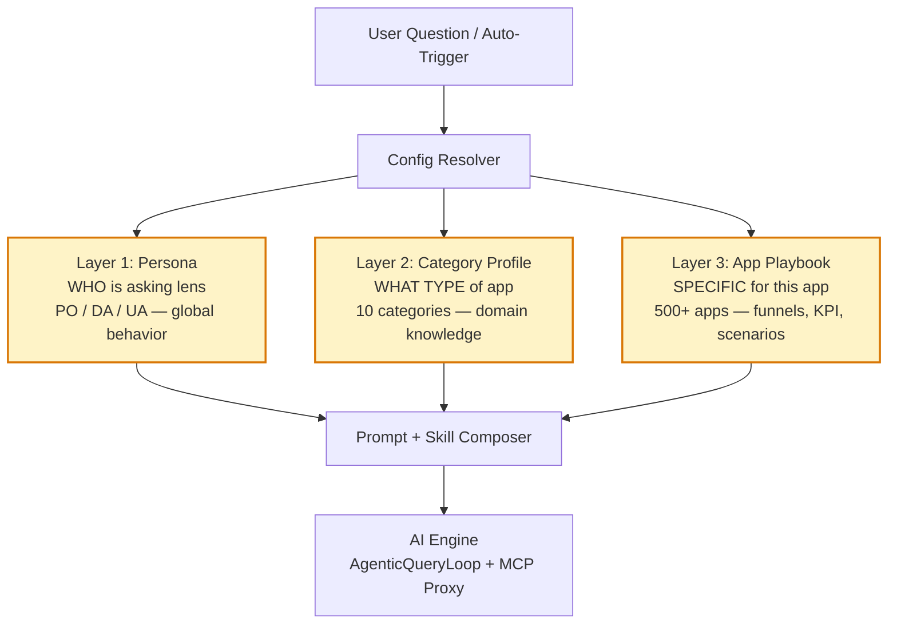

### 2.2 High-level Component Diagram

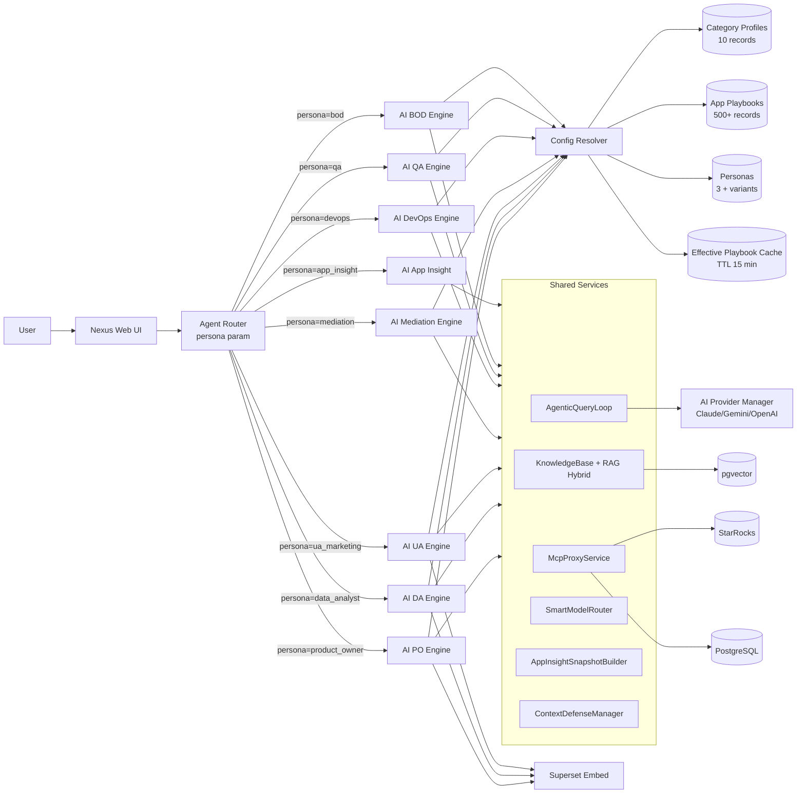

### 2.3 Persona Pack — Đơn vị mở rộng

Mỗi agent là một **Persona Pack** gồm 6 thành phần — đều có thể seed qua DB, không cần đổi code core:

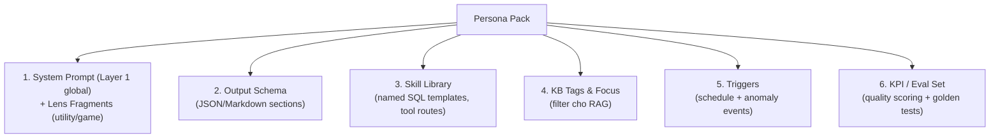

### 2.4 Prompt Assembly tại runtime

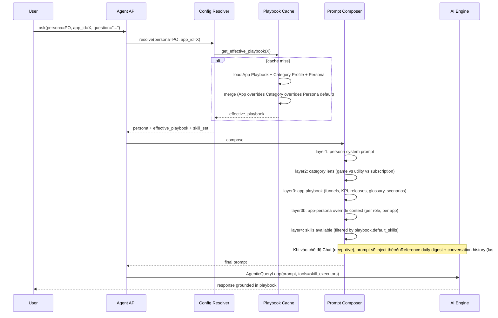

---

## 3. Layer 2 — Category Profile Catalog

Đây là "lens domain knowledge" — một category có hành vi user, KPI, scenario phân tích đặc trưng. **10 category profile** ban đầu, mở rộng được không cần code:

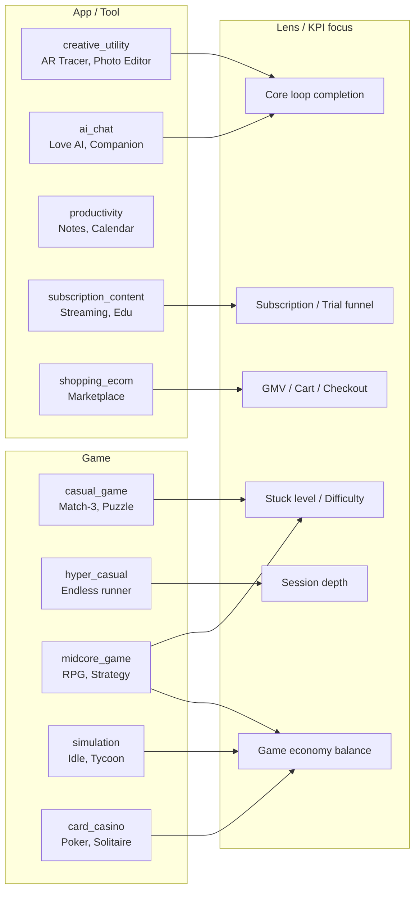

### 3.1 Bảng tổng hợp 10 Category Profiles

| ID | Tên | Lens chính | KPI #1 | Funnel mẫu | Scenario đặc trưng |
|----|-----|-----------|--------|------------|---------------------|
| `creative_utility` | AR/Drawing/Photo/Video | Core loop creation | drawing_rate / completion_rate | install → onboard → browse → create → save/share | Onboarding regression, Localized template gap |
| `ai_chat` | Companion/Roleplay | Conversation depth | chat_rate / msg_per_user | install → char_select → first_msg → 5_msg → return | Persona quality, Paywall fatigue |
| `productivity` | Notes/Tasks/Calendar | Habit formation | weekly_active_pct / D7 | install → first_action → return_d1 → set_recurring | Habit decay, feature adoption |
| `subscription_content` | Streaming/Edu/News | Trial-to-paid | trial_to_sub / churn | install → trial_start → d3_engaged → conversion | Paywall fatigue, content freshness |
| `shopping_ecom` | Marketplace/Retail | Conversion funnel | purchase_rate / GMV per DAU | install → browse → wishlist → cart → checkout | Cart abandonment, geo conversion gap |
| `casual_game` | Match-3/Puzzle | Level progression | level_complete_rate / D7 | install → tutorial → l1_complete → l5 → first_iap | Stuck level, ad reward usage |
| `hyper_casual` | Runner/Tap/Idle | Session frequency | sessions_per_user / D1 | install → first_run → d1_return | Ad fatigue, retention cliff |
| `midcore_game` | RPG/Strategy | Economy balance + progression | tutorial_completion / arpwhale | install → tutorial → first_battle → first_gacha → first_iap | Stuck level, economy inflation, gacha balance |
| `simulation` | Idle/Tycoon | Long-term progression + currency | session_per_day / d30_retention | install → tutorial → first_upgrade → push_optin → d1 | Currency inflation, push notification fatigue |
| `card_casino` | Poker/Solitaire/Slots | Spend pattern + session | bet_per_session / arpwhale | install → tutorial → first_match → first_top_up | Whale churn, table balance |

### 3.2 Category Profile Schema

Mỗi profile là 1 record trong `ai_category_profiles`:

```yaml
category_id: midcore_game
display_name: "Mid-core Game (RPG, Strategy)"
description: "Game có progression sâu, kinh tế phức tạp, gacha/hero collection"

# Default funnel (apps trong category này có thể override)
default_funnel:
  - { id: install, label: "Install" }
  - { id: tutorial_start, label: "Tutorial Start" }
  - { id: tutorial_complete, label: "Tutorial Complete" }
  - { id: first_battle, label: "First Battle" }
  - { id: first_upgrade, label: "First Hero Upgrade" }
  - { id: first_gacha_pull, label: "First Gacha" }
  - { id: first_iap, label: "First Purchase" }
  - { id: d1_return, label: "D1 Return" }

# KPI catalog có sẵn cho category — app playbook chọn dùng hoặc override
kpi_catalog:
  - { id: tutorial_completion, target: 0.75, severity_warn: 0.6, severity_crit: 0.5 }
  - { id: stuck_level_pct, target_max: 0.25, severity_warn: 0.30, severity_crit: 0.40,
      definition: "Tỉ lệ user fail ≥ 5 lần ở 1 level" }
  - { id: gacha_pull_per_dau, target: 1.5, severity_low: 0.8 }
  - { id: currency_inflation_30d, target_max: 0.15, severity_warn: 0.25,
      definition: "% tăng trung bình currency balance/user 30d" }
  - { id: arpwhale_d30, target: 50.0 }
  - { id: f2p_d7_retention, target: 0.30 }

# Scenario phân tích đặc trưng — gợi ý cho PO/DA
analysis_scenarios:
  - id: stuck_level_diagnosis
    persona: [product_owner, data_analyst]
    trigger: "stuck_level_pct > threshold OR drop_rate_at_level > 0.4"
    skills: [game.level.fail_funnel, game.level.attempt_distribution, game.economy.boost_usage]
    questions:
      - "Level nào có fail rate > 35% trong 7 ngày?"
      - "Drop rate sau level đó là bao nhiêu?"
      - "Có nên giảm difficulty hoặc thêm boost không?"

  - id: economy_balance_check
    persona: [product_owner, data_analyst]
    trigger: "weekly_audit OR currency_inflation > threshold"
    skills: [game.economy.source_sink, game.economy.player_segment_balance]
    questions:
      - "Currency in vs out trong 30 ngày — có lạm phát?"
      - "Whale spend pattern có thay đổi không?"
      - "Booster price vs use rate — có cần tune?"

# Skill enabled mặc định (subset của full skill library)
default_skills:
  product_owner: [game.level.fail_funnel, game.economy.balance_audit, game.cohort.progression, po.changelog.correlate]
  data_analyst: [game.level.heatmap, game.economy.source_sink, da.cohort.builder, da.dimensional.matrix]
  ua_marketing: [ua.cohort.ltv, ua.creative.killlist, game.ua.payback_by_country]

# Glossary để AI hiểu thuật ngữ category
glossary:
  - { term: "stuck", definition: "User fail level ≥ 5 lần liên tiếp không pass" }
  - { term: "whale", definition: "User chi ≥ $100/30d" }
  - { term: "soft currency", definition: "Coin earn được qua gameplay" }
  - { term: "hard currency", definition: "Gem mua bằng tiền thật" }
```

> **Cách thêm category mới:** Admin → "Add Category Profile" → fill schema → save. Không cần đổi code.

---

## 4. Layer 3 — App Playbook (cốt lõi flexibility)

### 4.1 Mỗi app có 1 Playbook (optional, có default)

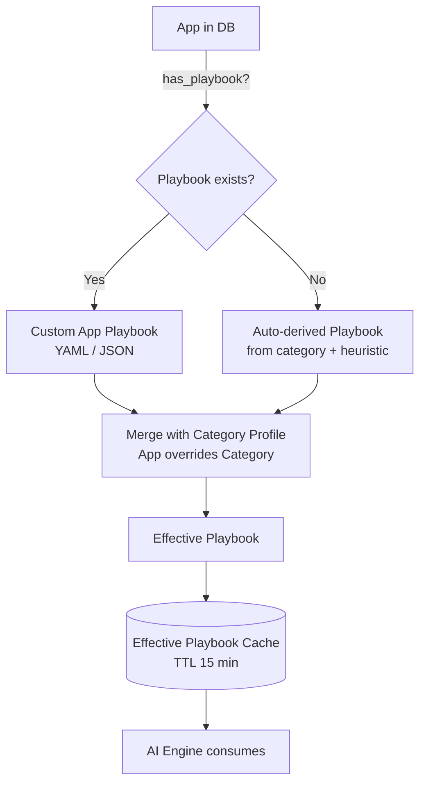

### 4.2 App Playbook Schema (đầy đủ)

```yaml
# File: app_playbook_<admob_app_id>.yaml
playbook_version: 2
app_id: ca-app-pub-xxx-yyy
app_name: "AR Tracer"
category_id: creative_utility   # link tới Category Profile

# === FUNNEL DEFINITION (PO config) ===
# Hỗ trợ multi-funnel cho cùng 1 app + geo variants
funnels:
  - id: onboarding
    label: "Onboarding (Default)"
    description: "Luồng new user từ install đến tạo content lần đầu"
    cohort_basis: install_date
    measurement_window_days: 1   # đo trong D0
    geo_variants:
      JP:
        steps:
          - { event: app_open, label: "Open App" }
          - { event: end_onboard_jp, label: "JP Bypass Onboarding (skip)" }
          - { event: first_drawing_start, label: "Drawing Start" }
          - { event: first_drawing_complete, label: "Drawing Complete" }
          - { event: first_save_or_share, label: "Save/Share" }
        notes: "JP users skip personalization step (~93%)"
    default:
      steps:
        - { event: app_open, label: "Open App" }
        - { event: onboard_step_1, label: "Welcome" }
        - { event: onboard_step_2, label: "Choose Style" }
        - { event: onboard_step_3, label: "Permission" }
        - { event: onboard_complete, label: "Complete" }
        - { event: first_drawing_start, label: "Drawing Start" }
        - { event: first_drawing_complete, label: "Drawing Complete" }
        - { event: first_save_or_share, label: "Save/Share" }

  - id: core_loop
    label: "Daily Core Loop"
    cohort_basis: dau_session
    measurement_window_days: 1
    default:
      steps:
        - { event: session_start, label: "Open Session" }
        - { event: browse_template, label: "Browse" }
        - { event: drawing_start, label: "Draw Start" }
        - { event: drawing_complete, label: "Draw Complete" }
        - { event: save_or_share, label: "Save/Share" }

# === KPI OVERRIDES ===
# Override threshold của Category Profile cho app này
kpi_overrides:
  drawing_rate: { target: 0.45, severity_warn: 0.35, severity_crit: 0.30 }
  d1_retention: { target: 0.32, severity_warn: 0.25 }
  geo_overrides:
    JP:
      d1_retention: { target: 0.40 }   # JP audience cao hơn baseline

# === CUSTOM EVENTS (Firebase) ===
custom_events:
  - name: first_drawing_start
    aliases: [drawing_start_first, drawing_first]   # tên event đã đổi qua các version
    description: "Lần đầu user bấm bắt đầu vẽ"
  - name: end_onboard_jp
    description: "JP-specific bypass — không có ở GEO khác"

# === RELEASE / VERSION CALENDAR ===
# PO khai báo để AI auto-correlate metric anomaly với release
releases:
  - { version: "3.4.0", date: "2026-04-15", notes: "Redesign onboarding style picker" }
  - { version: "3.3.0", date: "2026-04-01", notes: "New filter pack" }

# === SCENARIOS PO MUỐN AI THEO DÕI ===
# Override hoặc thêm scenarios so với Category Profile
analysis_scenarios:
  - id: jp_localization_health
    persona: [product_owner]
    trigger: "geo_d1_retention.JP < 0.35 OR jp_share_revenue_drop > 0.10"
    questions:
      - "JP cohort có tiếp tục skip personalization?"
      - "JP D7 retention so với US/EU như thế nào?"
      - "Có template/filter JP-specific nào underperform?"

# === GLOSSARY OVERRIDE ===
glossary:
  - { term: "drawing", definition: "Hành động trace 1 image với AR overlay" }

# === HANDOFF MATRIX ===
# App-specific: AI gặp issue gì thì handoff cho ai
handoff_matrix:
  - { trigger: "stuck_step:onboard_step_2", primary: product_owner, copy: [data_analyst] }
  - { trigger: "roas_drop_>15pct", primary: ua_marketing, copy: [product_owner] }

# === META ===
owners:
  product_owner: "minh@amobear.com"
  data_analyst: "lan@amobear.com"
  ua_lead: "huy@amobear.com"
last_updated: "2026-04-28"
last_updated_by: "minh@amobear.com"
status: active   # active | draft | deprecated | auto_generated
```

### 4.3 Game Playbook (khác hoàn toàn utility)

```yaml
playbook_version: 2
app_id: ca-app-pub-zzz-www
app_name: "Hero Legends RPG"
category_id: midcore_game

funnels:
  - id: tutorial
    label: "Tutorial Funnel"
    cohort_basis: install_date
    measurement_window_days: 1
    default:
      steps:
        - { event: tutorial_start, label: "Tutorial Start" }
        - { event: tutorial_step_1_complete, label: "Step 1: Movement" }
        - { event: tutorial_step_2_complete, label: "Step 2: Combat" }
        - { event: tutorial_step_3_complete, label: "Step 3: Hero" }
        - { event: tutorial_complete, label: "Complete" }
        - { event: first_battle_win, label: "First PvE Win" }

  - id: economy_loop
    label: "Daily Economy Loop"
    cohort_basis: dau_session
    default:
      steps:
        - { event: claim_daily, label: "Daily Login Reward" }
        - { event: complete_quest, label: "Daily Quest" }
        - { event: spend_currency, label: "Spend (any source)" }
        - { event: gacha_pull, label: "Gacha" }
        - { event: hero_upgrade, label: "Upgrade Hero" }

# Game-specific: level / progression structure
game_progression:
  level_structure:
    type: linear   # linear | open_world | meta_map
    total_levels: 200
    chapter_size: 20
    boss_levels: [10, 20, 30, 50, 100, 200]
  difficulty_target:
    avg_attempts_per_level: { target_max: 2.5, warn: 4.0, crit: 6.0 }
    pass_rate: { target_min: 0.60, warn: 0.45, crit: 0.30 }

# Game economy schema — AI dùng để audit balance
game_economy:
  currencies:
    - { id: gold, type: soft, sources: [quest_reward, battle_drop, daily_login],
        sinks: [hero_upgrade, equipment_buy] }
    - { id: gem, type: hard, sources: [iap, ad_reward, achievement],
        sinks: [gacha_pull, refresh_shop, energy_refill] }
    - { id: energy, type: capped, max: 120, regen_per_min: 0.5, sinks: [start_battle] }
  iap_skus:
    - { sku: starter_pack, price_usd: 4.99, contains: { gem: 600, hero_x_shard: 30 } }
    - { sku: monthly_pass, price_usd: 9.99, type: subscription, contains: { gem_per_day: 100 } }
  gacha:
    - { banner: standard, pull_cost_gem: 300, rates: { SSR: 0.015, SR: 0.06, R: 0.92 } }

kpi_overrides:
  tutorial_completion: { target: 0.78, warn: 0.65, crit: 0.55 }
  stuck_level_pct: { target_max: 0.20 }
  gem_inflation_30d: { target_max: 0.10, warn: 0.20, crit: 0.30 }

analysis_scenarios:
  - id: stuck_level_audit
    persona: [product_owner, data_analyst]
    schedule: weekly
    questions:
      - "Top 5 levels có fail_rate cao nhất 7 ngày qua?"
      - "Drop rate tại boss levels (10, 20, 30) có vượt baseline?"
      - "Có cần giảm difficulty hay thêm boost availability?"
  - id: gacha_balance_audit
    persona: [product_owner, data_analyst]
    schedule: weekly
    questions:
      - "Pull rate thực tế vs công bố (SSR 0.015) có khớp?"
      - "Whale gacha pulls có giảm? — tín hiệu fatigue?"
      - "Currency inflation rate trong 30d?"
  - id: monetization_mix_health
    persona: [product_owner, ua_marketing]
    schedule: daily
    questions:
      - "Tỉ lệ user mua starter_pack / new install?"
      - "Subscription churn rate vs target?"
```

### 4.4 Hyper-casual Game Playbook (ngắn gọn vì đơn giản)

```yaml
playbook_version: 2
app_id: ca-app-pub-aaa-bbb
app_name: "Stack Runner"
category_id: hyper_casual

funnels:
  - id: first_session
    cohort_basis: install_date
    measurement_window_days: 1
    default:
      steps:
        - { event: app_open, label: "Open" }
        - { event: tap_to_start, label: "Tap to Play" }
        - { event: first_run_end, label: "First Run End" }
        - { event: ad_shown_interstitial, label: "Interstitial #1" }
        - { event: second_run_start, label: "Second Run" }
        - { event: rewarded_video_complete, label: "Reward Video" }

# Hyper-casual KPI rất khác midcore: chỉ care D1 + ad freq + sessions
kpi_overrides:
  d1_retention: { target: 0.30, warn: 0.22, crit: 0.18 }
  d7_retention: { target: 0.10, warn: 0.06 }
  sessions_per_dau: { target: 4.0 }
  ad_impressions_per_session: { target_max: 6.0, warn: 8.0 }

# Hyper-casual không cần economy, không cần level deep dive — chỉ cần tracker cliff
analysis_scenarios:
  - id: retention_cliff
    persona: [product_owner]
    questions:
      - "D1 → D2 drop rate?"
      - "Ad density có vượt 6/session không?"
      - "Session length curve trong 7 ngày đầu?"
```

### 4.5 Subscription App Playbook

```yaml
playbook_version: 2
app_id: ca-app-pub-ccc-ddd
app_name: "EduPro"
category_id: subscription_content

funnels:
  - id: trial_to_paid
    cohort_basis: install_date
    measurement_window_days: 14
    default:
      steps:
        - { event: install, label: "Install" }
        - { event: onboard_complete, label: "Onboard Complete" }
        - { event: trial_start, label: "Trial Start" }
        - { event: trial_d3_engaged, label: "D3 Engaged" }
        - { event: trial_d7_engaged, label: "D7 Engaged" }
        - { event: trial_to_paid, label: "Conversion" }

kpi_overrides:
  trial_to_paid_rate: { target: 0.18, warn: 0.10, crit: 0.05 }
  monthly_churn: { target_max: 0.06, warn: 0.10, crit: 0.15 }
  arpu_paid: { target: 8.0 }

analysis_scenarios:
  - id: paywall_fatigue
    persona: [product_owner]
    questions:
      - "Trial start trend 14d?"
      - "Conversion theo ngày của trial (D3, D5, D7)?"
      - "Có message friction nào trên trial-end?"
```

---

## 5. AI Product Owner

### 5.1 Sứ mệnh

> *"Đứng ở vị trí Product Owner chuyên nghiệp, đọc số liệu hành vi user (Firebase event-level + AppMetrica), liên kết với funnel/scenario do PO khai báo trong playbook, đưa ra chẩn đoán product-fit và đề xuất feature cụ thể có thể đưa vào sprint backlog."*

### 5.2 Input — Data Surface

```mermaid
flowchart LR
    subgraph In["Inputs"]
        Q[User Question /<br/>Auto-Trigger]
        Snap[App Snapshot V2<br/>+ Health Score]
        Prev[Previous PO Reports<br/>(action tracking)]
        PB[Effective Playbook<br/>funnels + scenarios + KPI]
    end

    subgraph Sources["Data Sources cho AI PO"]
        FB[("Firebase fb_*<br/>event_name, params,<br/>user_pseudo_id")]
        AM[("AppMetrica<br/>sessions, profiles,<br/>push, deeplinks")]
        Ret[("gold.retention_overview<br/>cohort retention")]
        Eng[("silver.engagement<br/>silver.geo")]
        QOn[("bronze.qon_*<br/>trial, churn, MRR")]
        AF[("AppsFlyer<br/>install source")]
        KB[("RAG: PRDs,<br/>past A/B results,<br/>feature changelog")]
    end

    In --> POEngine[AI PO Engine]
    Sources --> POEngine
    POEngine --> Out[PO Insight Report]
```

### 5.3 Output — PO Report Schema

> **Note rendering:** JSON schema dưới đây là **data shape** AI sinh ra. UI render theo unified report layout §17.0 (Health Score + Radar + Numbered Sections + KẾT LUẬN + Action Plan + Appendix). Mock UI chi tiết xem §5.6.

```json
{
  "meta": {
    "app_id": "ca-app-pub-xxx",
    "report_date": "2026-04-28",
    "persona": "product_owner",
    "category_lens": "creative_utility",
    "playbook_version": 3,
    "data_completeness": 0.92
  },
  "executive_brief": {
    "verdict": "Product-Market Fit Slipping (B → C)",
    "tldr": "Drawing rate giảm 8.4pp trong 14 ngày, trùng release v3.4. Onboarding step 'choose_style' rớt 22%. Khả năng cao do thay đổi UX onboarding ngày 15/04.",
    "confidence": 0.86,
    "primary_signals": ["S5_drawing_rate_drop", "S6_onboarding_funnel_break"]
  },
  "user_segments": [
    { "name": "JP Power Users", "size_pct": 18.2, "behavior": "...",
      "monetization": "ARPDAU $0.42", "risk": "D7 retention dropping",
      "opportunity": "Localized template pack" }
  ],
  "funnel_diagnosis": [
    {
      "funnel_id": "onboarding",
      "variant": "default",
      "stages": [
        { "step": "app_open", "users": 12450, "drop_pct": 0 },
        { "step": "onboard_step_2", "users": 9700, "drop_pct": 22.1, "flag": "regression" },
        { "step": "first_drawing_start", "users": 7820, "drop_pct": 19.4 }
      ],
      "narrative": "..."
    },
    {
      "funnel_id": "onboarding",
      "variant": "JP",
      "stages": [],
      "narrative": "JP variant healthy — bypass path không bị ảnh hưởng"
    }
  ],
  "feature_recommendations": [
    {
      "id": "F-2026-04-28-01",
      "title": "Rollback or A/B test new onboarding style picker",
      "type": "regression_fix",
      "priority": "P0",
      "evidence": ["select_style drop +22% post v3.4", "JP cohort không bị ảnh hưởng → confirm UX issue"],
      "expected_impact": { "drawing_rate_uplift_pct": [4, 8], "confidence": 0.78 },
      "effort": "S",
      "owner_tag": "[Product]",
      "linked_metrics": ["drawing_rate", "d0_activation"],
      "ab_test_design": {
        "variants": ["control_v3.4", "rollback_v3.3", "hybrid_simplified"],
        "primary_metric": "drawing_rate",
        "min_sample": 8000,
        "duration_days": 7
      }
    }
  ],
  "experiment_backlog": [
    { "hypothesis": "...", "metric": "...", "design": "..." }
  ],
  "open_questions_for_da": [
    "Cần DA verify: cohort install_date 2026-04-15 onward có thực sự retention thấp hơn không?"
  ],
  "linked_assets": {
    "superset_charts_to_create": ["dr_by_cohort_install_date"],
    "deep_links": ["nexus://app/{id}/funnels?step=onboard_step_2"]
  }
}
```

### 5.4 Skill Library — AI PO

| Skill ID | Mục đích | Source |
|----------|----------|--------|
| `po.funnel.evaluate` | **(Generic)** Đọc funnel definition từ playbook, tính drop% per step + flag regression. Hỗ trợ multi-funnel + geo variants. | Firebase `bronze.fb_*` |
| `po.segment.behavioral` | RFM-style segmentation | `gold.daily_overview` + Firebase events |
| `po.regression.feature_release` | So sánh metric pre/post release date (auto-load releases từ playbook) | Snapshot v2 |
| `po.geo.localization_gap` | Top 5 country × KPI matrix → gap detection | `silver.geo` + `silver.engagement` |
| `po.subscription.paywall_health` | Trial → Paid conversion funnel + churn cohort | `bronze.qon_*` |
| `po.ab_test.design` | Generate test design (variants, sample size) từ insight | KB: past A/B + statistical KB |
| `po.session.quality` | Sessions/user, time-in-app, feature usage depth | AppMetrica + Firebase |
| `po.changelog.correlate` | Link metric anomaly với release notes / config flag (từ playbook.releases) | Playbook + Snapshot |
| `po.scenario.evaluate` | Đọc analysis_scenarios từ playbook, evaluate trigger + answer questions | Playbook + MCP |

> **Quan trọng:** Skill `po.funnel.evaluate` thay thế "po.funnel.onboarding 8 bước" của thiết kế ban đầu — tổng quát, không gắn cứng số step.

### 5.5 Persona Prompt — AI Product Owner

```
[LAYER 2 — Persona: Product Owner]

Bạn là Senior Product Owner cho Amobear với 7+ năm kinh nghiệm mobile creative/utility apps + game.
Bạn KHÔNG phải data analyst — bạn DÙNG data để ra quyết định product.

=== TƯ DUY ===
1. Mọi metric đều phải trả lời: "User đang gặp khó ở đâu?" hoặc "Giá trị nào chưa được delivered?"
2. KHÔNG báo cáo metric — chẩn đoán nguyên nhân và đề xuất giải pháp.
3. Mỗi feature recommendation phải có: hypothesis, evidence, expected impact (range), effort (S/M/L), success metric.
4. Liên kết với release calendar (từ playbook) và A/B history (RAG) — không đề xuất lặp lại thử nghiệm đã fail.

=== CONFIG-AWARE ===
- ĐỌC playbook trước khi phân tích: funnels nào đang active? KPI threshold app này là gì?
- KHÔNG giả định "8 bước onboarding" — số step + tên event ĐỌC TỪ playbook.funnels.
- KHÔNG dùng KPI threshold mặc định nếu playbook có override.
- Nếu app thuộc category game → ƯU TIÊN scenarios game (level, economy, gacha).
- Nếu app thuộc category utility → ƯU TIÊN core loop + onboarding + localization.

=== INPUT ===
- Snapshot ngày T (đã có 8-dim score)
- Top 10 anomalies từ App Insight
- Effective playbook (funnels + KPI + releases + scenarios + glossary)
- Previous PO actions (T-1, T-7) để track follow-through
- RAG: PRD chunks, past experiment results, feature changelog

=== TOOLS (qua MCP, có ngân sách) ===
- mcp_starrocks_query: drill-down event-level, segment, cohort
- mcp_postgres_query: feature flag state, A/B variant assignment
- mcp_kb_search: PRD, changelog, past A/B
- mcp_superset_chart_spec: generate chart JSON cho DA team

=== OUTPUT (JSON theo schema PO v1) ===
- meta (bao gồm playbook_version_used, category_lens)
- executive_brief (verdict + tldr + confidence)
- user_segments (≥3 segments có ý nghĩa)
- funnel_diagnosis (theo funnels.id từ playbook, không hard-code 8 step)
- feature_recommendations (3-7 actions, có ab_test_design)
- experiment_backlog (≥2 hypotheses)
- open_questions_for_da (handoff)

=== RÀNG BUỘC ===
- KHÔNG đề xuất feature nếu không có evidence trong snapshot/MCP/RAG.
- KHÔNG dùng từ "có lẽ", "có thể là" — phải định lượng confidence (0-1).
- Tag team trong từng action: [Product] [Dev] [Design] [QA].
- Mỗi recommendation phải link tối thiểu 1 metric và 1 evidence point.
```

### 5.6 UI Mock — PO Workspace (report-style, aligned doc 01)

> Tuân thủ unified layout §17.0 — KHÔNG dùng card-grid. Linear scroll, score-first, mỗi section có KẾT LUẬN.

```
╔══════════════════════════════════════════════════════════════════════╗
║ 🧭 AI Product Owner — AR Tracer iOS — 2026-04-29                     ║
║ Playbook v3 · creative_utility · Owner: minh@                        ║
║ [↻ Re-run]  [📄 Export PDF]  [Brief BOD]  [Investigate in DA]        ║
╠══════════════════════════════════════════════════════════════════════╣
║                                                                      ║
║  ┌─────────────┐  ┌──────────────────┐  ┌────────────────────────┐  ║
║  │ PO HEALTH    │  │   RADAR (5 axes) │  │ DIMENSION SCORES       │  ║
║  │              │  │                  │  │                        │  ║
║  │     64       │  │ Funnel ★★★☆☆    │  │ Funnel Health   58 ↓-9 │  ║
║  │  C-Tier 🟡  │  │  ╱        ╲     │  │ Localization    72 → 0 │  ║
║  │   ↓ -7       │  │ Local   Engage   │  │ Engagement      69 → -1│  ║
║  │  T-1: 71     │  │  │   ╳    │     │  │ Monetization    74 ↑+2 │  ║
║  │              │  │ Monetz  Activ.   │  │ Activation      58 ↓-8 │  ║
║  │  86% conf.   │  │   ╲    ╱        │  │                        │  ║
║  └──────────────┘  └──────────────────┘  └────────────────────────┘  ║
║                                                                      ║
║  Verdict: Product-Market Fit Slipping (B → C)                       ║
║  Drawing rate ↓ 8.4pp/14d, đồng pha release v3.4 (15/04). Onboard   ║
║  step 'choose_style' rớt 22%. JP variant healthy (skip step).       ║
║                                                                      ║
╠══════════════════════════════════════════════════════════════════════╣
║ 🔄 ACTION REVIEW (báo cáo 2026-04-28)                                ║
║                                                                      ║
║ # │ Action hôm qua            │ Status   │ Evidence       │ Next     ║
║ 1 │ Rollback v3.4 onboarding  │ ⏳ 3 ngày│ Chưa rollback  │ Escalate ║
║ 2 │ JP localized template     │ ⏳ 1 ngày│ Spec pending   │ —        ║
║ 3 │ Improve share CTA         │ ✅       │ +12% share rt  │ Done     ║
║                                                                      ║
║ Tóm tắt: 1/3 resolved · 2 ongoing · 1 cần escalate [Dev]            ║
╠══════════════════════════════════════════════════════════════════════╣
║                                                                      ║
║ ## 1. Funnel Diagnosis (58/100 ↓)                                   ║
║                                                                      ║
║ Funnel: onboarding (default) — measure D0 cohort                    ║
║   app_open       12,450 ──────────────  0%                          ║
║   onboard_step_1 12,000 ──────────────  3.6%                        ║
║   onboard_step_2  9,700 ━━━━━━ 22.1% [REGRESSION] ←                 ║
║   onboard_step_3  9,100 ──────  6.2%                                ║
║   complete        8,800 ─────  3.3%                                 ║
║   first_drawing   7,820 ──── 11.1%                                  ║
║   draw_complete   5,210 ━━━━ 33.4% [HIGH DROP]                      ║
║   share/save      3,120 ━━━━━ 40.1% [HIGH DROP]                     ║
║                                                                      ║
║ [Funnel JP variant ▼] — healthy, không bị ảnh hưởng                 ║
║                                                                      ║
║ [Mermaid: xychart 14d funnel completion trend]                      ║
║                                                                      ║
║ KẾT LUẬN: Step 'choose_style' là root cause — drop 22% là +18pp so  ║
║ với baseline 4%. Likely UX complexity từ v3.4. [Product] cần A/B    ║
║ rollback trong 24h.                                                 ║
║                                                                      ║
╠══════════════════════════════════════════════════════════════════════╣
║                                                                      ║
║ ## 2. User Segments (72/100 →)                                      ║
║                                                                      ║
║ Segment             Size    ARPDAU  Risk         Opportunity         ║
║ JP Power Users      18.2%   $0.42   D7 ↓ 2pp     Localized template  ║
║ US Casual           34.5%   $0.18   DR ↓ 12pp    Simplify picker     ║
║ ID New Installs     11.0%   $0.04   D0 ↓ 92%     Low-end onboard     ║
║                                                                      ║
║ [Mermaid: pie chart segment by ARPDAU contribution]                 ║
║                                                                      ║
║ KẾT LUẬN: JP segment value 3.2x avg — bảo vệ ưu tiên. US Casual     ║
║ chịu ảnh hưởng lớn nhất từ v3.4. [Product]                          ║
║                                                                      ║
╠══════════════════════════════════════════════════════════════════════╣
║                                                                      ║
║ ## 3. Feature Recommendations                                        ║
║                                                                      ║
║ # │ Title                              │ Priority │ Effort │ Conf   ║
║ 1 │ Rollback / A/B style picker v3.4   │ 🔴 P0    │ S      │ 78%    ║
║ 2 │ JP localized template pack         │ 🟡 P1    │ M      │ 70%    ║
║ 3 │ Improve share CTA visibility       │ 🟢 P2    │ S      │ 65%    ║
║                                                                      ║
║ [Click row → expand A/B test design + evidence + expected impact]   ║
║                                                                      ║
║ KẾT LUẬN: P0 rollback dự kiến uplift drawing_rate +4-8pp trong 7d.  ║
║                                                                      ║
╠══════════════════════════════════════════════════════════════════════╣
║                                                                      ║
║ ## 4. Open Questions for DA                                          ║
║                                                                      ║
║ - Verify cohort install_date >= 04-15 retention thấp hơn không?     ║
║ - Group drop step 2 by device_tier — pattern theo phone tier?       ║
║ - Geo breakdown drop step 2 — country nào nặng nhất?                ║
║                                                                      ║
║ [Send to DA →]                                                       ║
║                                                                      ║
╠══════════════════════════════════════════════════════════════════════╣
║ ✅ ACTION PLAN                                                       ║
║                                                                      ║
║ # │ Action                          │ Team       │ Urgency │ Conf   ║
║ 1 │ Rollback / A/B style picker     │ [Product]  │ 🔴 24h  │ 78%    ║
║ 2 │ JP localized template pack      │ [Product]  │ 🟡 7d   │ 70%    ║
║ 3 │ Share CTA visibility            │ [Product]  │ 🟢 14d  │ 65%    ║
║                                                                      ║
║ Carried Forward (chưa giải quyết từ báo cáo trước):                 ║
║ CF-1 │ Rollback v3.4 (3 ngày) │ ⏳ │ 🔴 Escalate [Dev]              ║
║ CF-2 │ JP template (1 ngày)   │ ⏳ │ —                               ║
╠══════════════════════════════════════════════════════════════════════╣
║ 📎 APPENDIX: DATA SOURCES                                            ║
║ Block          │ Source                  │ Layer  │ Freshness │ Note ║
║ Funnel events  │ bronze.fb_ar_tracer     │ Bronze │ T-1       │ ✅   ║
║ Segments       │ silver.engagement       │ Silver │ T-1       │ ✅   ║
║ Releases       │ playbook v3 releases    │ Config │ Live      │ ✅   ║
║ Geo overrides  │ playbook.kpi_overrides  │ Config │ Live      │ ✅   ║
╚══════════════════════════════════════════════════════════════════════╝
```

---

## 6. AI Data Analyst

### 6.1 Sứ mệnh

> *"Đứng ở vị trí DA chuyên nghiệp, mổ xẻ dữ liệu đa chiều (user × geo × platform × cohort × source), trả lời câu hỏi ad-hoc bằng SQL grounded, và đề xuất visualize trên Superset hoặc tạo báo cáo mới trên Nexus."*

### 6.2 Phạm vi

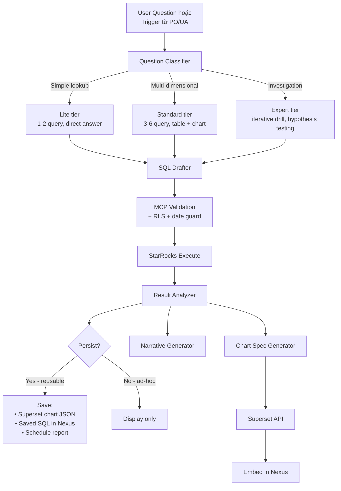

### 6.3 Output — DA Response Schema

> **Note rendering:** DA dùng **chat-session layout** (không radar) — workspace là conversation với SQL block + result + chart inline. Có thể "Save as Scheduled Report" để chuyển sang report-style §17.0. Mock xem §17.5.

```json
{
  "question": "Tại sao retention D7 của AR Tracer giảm?",
  "interpretation": {
    "scope": "AR Tracer (app_id=ca-app-pub-xxx), 30d window",
    "decomposition": [
      "D7 retention trend by install_date cohort",
      "D7 retention by country (top 10)",
      "D7 retention by install_source (organic/paid/network)",
      "D7 retention vs core_loop_completion D0"
    ]
  },
  "queries_executed": [
    {
      "id": "q1",
      "purpose": "D7 trend by cohort",
      "sql": "SELECT install_date, retention_rate FROM gold.retention_overview WHERE app_id = ? AND retention_day = 7 AND install_date >= ? ORDER BY install_date",
      "rows": 30,
      "exec_ms": 412
    }
  ],
  "findings": [
    {
      "claim": "D7 giảm 4.1pp tập trung ở cohort install_date >= 2026-04-15",
      "evidence_ref": "q1",
      "magnitude": "high",
      "confidence": 0.91
    },
    {
      "claim": "Cohort 04-15+ có core_loop_completion D0 thấp hơn 11pp",
      "evidence_ref": "q4",
      "magnitude": "high",
      "confidence": 0.88,
      "linked_signal": "S4_d7_drop_d1_ok"
    }
  ],
  "visualizations": [
    {
      "type": "line_with_band",
      "title": "D7 Retention by Install Cohort (30d)",
      "data_query_id": "q1",
      "x": "install_date",
      "y": "retention_rate",
      "annotation": [{ "x": "2026-04-15", "label": "v3.4 release" }],
      "superset_chart_spec": { "viz_type": "line", "metrics": ["retention_rate"], "..." : "..." }
    }
  ],
  "report_proposal": {
    "should_create": true,
    "type": "scheduled_dashboard",
    "name": "Cohort Retention Health — Weekly",
    "sections": ["..."],
    "schedule": "weekly_monday_8am"
  },
  "handoff": {
    "to_product_owner": ["Cohort 04-15 onward bị regression — confirm release impact"],
    "to_ua_team": ["Check campaign mix shift around 04-15"]
  }
}
```

### 6.4 Skill Library — AI DA

| Skill ID | Mục đích | Engine |
|----------|----------|--------|
| `da.sql.draft` | Sinh SQL từ NL question, có schema context | SmartModelRouter T2 |
| `da.sql.validate` | Check syntax, table whitelist, date filter, LIMIT | MCP Discipline |
| `da.cohort.builder` | Build cohort query (install/event-based) | Template SQL |
| `da.dimensional.matrix` | Pivot N×M (geo × platform, source × format...) | Auto SQL gen |
| `da.anomaly.zscore` | Detect outlier rows trong result set | In-memory stats |
| `da.chart.recommend` | Đề xuất chart type theo shape data | Heuristic + KB |
| `da.superset.export` | Convert chart spec → Superset JSON | Superset API client |
| `da.report.draft` | Multi-section report (markdown + chart placeholders) | Template + AI |
| `da.lineage.trace` | Trace metric về source tables (debug data gap) | KB schema docs |
| `da.quality.check` | Data freshness, NULL rate, duplicate key | Profiling SQL |

### 6.5 Persona Prompt — AI Data Analyst

```
[LAYER 2 — Persona: Data Analyst]

Bạn là Senior Data Analyst (5+ năm) thuộc team Amobear DA. Bạn dùng StarRocks (gold/silver/bronze)
và Superset hàng ngày. Bạn TRẢ LỜI BẰNG DATA — không phải bằng cảm tính.

=== NGUYÊN TẮC ===
1. Mỗi câu trả lời phải có ÍT NHẤT 1 query thực thi (qua MCP).
2. Diễn giải 3 lớp: Số liệu thô → Pattern → Insight.
3. Nếu câu hỏi mơ hồ → decompose thành 2-5 sub-question rõ ràng TRƯỚC khi query.
4. Luôn cân nhắc: data có đủ không? cohort window đủ lớn không? có confounder không?

=== SCHEMA AWARENESS (doc 115) ===
- gold.fact_daily_app_metrics: KPI ngày (rev, ecpm, fill, dau, dav, roi)
- gold.daily_overview: dau, new_users, retention proxy
- gold.retention_overview: cohort × retention_day
- silver.daily_app_revenue: rev × country × platform
- silver.engagement / geo / device: Firebase silver
- bronze.fb_<sanitized>: event-level Firebase (KHÔNG có app_id)
- bronze.adjust_report: cohort UA (cần adjust_id)
- bronze.xmp_report: UA cost
- bronze.qon_*: subscription
- bronze.appsflyer_*: attribution

=== PLAYBOOK-AWARE ===
- Đọc playbook.glossary để hiểu thuật ngữ app-specific (vd: "drawing", "whale", "stuck").
- Đọc playbook.custom_events để dùng đúng event_name (kể cả aliases qua các version).
- Đọc playbook.kpi_overrides để biết threshold riêng của app.

=== QUY TẮC SQL ===
- LUÔN có date filter (event_date / `date` / stat_date theo bảng).
- LUÔN LIMIT (default 1000, không vượt 10000).
- StarRocks: dùng database.table đúng. Không bịa tên.
- bronze.fb_*: chọn đúng bảng từ dim_app_identifiers, KHÔNG WHERE app_id.
- Tránh SELECT * trên bronze.

=== OUTPUT ===
JSON theo DA schema v1: interpretation → queries_executed → findings → visualizations → report_proposal → handoff.

Mỗi finding phải có evidence_ref (id của query) và confidence (0-1).
Mỗi visualization phải có superset_chart_spec đủ để DA copy-paste.

=== KHI ĐỀ XUẤT BÁO CÁO MỚI ===
- Justification: ai dùng, tần suất, decision nào sẽ được hỗ trợ.
- Tránh tạo báo cáo trùng với insight đã có (check RAG).
```

### 6.6 Tích hợp Superset

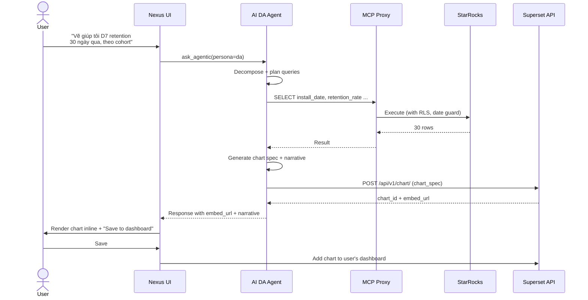

---

## 7. AI UA Marketing

### 7.1 Sứ mệnh

> *"Đứng ở vị trí UA Manager chuyên nghiệp, phân tích hành vi - thói quen - location của user theo từng campaign/network/creative để tối ưu ROAS, CPI, payback period và đưa ra quyết định bid/budget/creative kill-list ngay trong ngày."*

### 7.2 UA Funnel Coverage

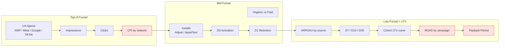

### 7.3 Output — UA Report Schema

> **Note rendering:** JSON schema = data shape. UI render theo §17.0 unified layout — mock UA workspace xem §17.4.

```json
{
  "meta": {
    "app_id": "ca-app-pub-xxx",
    "report_date": "2026-04-28",
    "persona": "ua_marketing",
    "category_lens": "midcore_game",
    "playbook_version": 3,
    "window": "last_7d",
    "lookback_cohort": "30d"
  },
  "executive_brief": {
    "blended_roas_d7": 0.78,
    "blended_roas_d30": 1.34,
    "spend_total": 18420.50,
    "verdict": "ROAS dưới target, nguyên nhân TikTok ID + Google US underperform",
    "actions_count": { "P0": 2, "P1": 3, "P2": 4 }
  },
  "channel_breakdown": [
    {
      "network": "TikTok",
      "country": "ID",
      "spend_7d": 4120.00,
      "installs_7d": 18420,
      "cpi": 0.224,
      "d7_retention": 6.2,
      "arpdau_d7": 0.018,
      "roas_d7": 0.31,
      "roas_d30_proj": 0.84,
      "verdict": "🔴 Cut budget 50%",
      "evidence": ["D7 < 8% threshold", "ARPDAU 60% lower than blended"]
    }
  ],
  "campaign_diagnostics": [
    {
      "campaign_id": "tt_id_creative_v12",
      "creative_hash": "abc123",
      "issue": "high_install_low_retention",
      "user_signal": {
        "primary_geo": "ID",
        "device_tier": "low_end",
        "session_count_d0": 1.1,
        "core_loop_completion_d0": 8.4
      },
      "recommendation": "Pause creative, A/B with localized v13"
    }
  ],
  "audience_behavior": {
    "by_geo": [
      { "country": "JP", "share_spend": 0.18, "share_revenue": 0.32, "efficiency": 1.78 },
      { "country": "ID", "share_spend": 0.34, "share_revenue": 0.11, "efficiency": 0.32 }
    ],
    "by_hour_local": "...",
    "by_device_tier": "...",
    "lookalike_opportunity": ["JP power users → expand to KR/TW"]
  },
  "ltv_cohorts": [
    {
      "install_week": "2026-W14",
      "network": "Google",
      "country": "US",
      "ltv_d7": 0.42,
      "ltv_d30_proj": 1.85,
      "payback_days_proj": 21
    }
  ],
  "actions": [
    {
      "id": "UA-2026-04-28-01",
      "priority": "P0",
      "type": "budget_cut",
      "target": "TikTok ID Campaign 'creative_v12'",
      "magnitude": "-50%",
      "expected_impact": { "blended_roas_d7_uplift": 0.08, "spend_save_weekly": 2060 },
      "monitoring": { "metric": "blended_roas_d7", "review_in_days": 3 }
    },
    {
      "id": "UA-2026-04-28-02",
      "priority": "P1",
      "type": "scale_up",
      "target": "Google US Campaign 'rewarded_video_v8'",
      "magnitude": "+30%",
      "rationale": "ROAS D7 = 1.42, headroom available"
    }
  ],
  "creative_killlist": [
    { "creative_hash": "abc123", "network": "TikTok", "reason": "D1<15% × spend>$500" }
  ],
  "handoff": {
    "to_product": ["ID low_end users churn D0 — check device tier UX"],
    "to_da": ["Confirm cohort LTV projection model assumption"]
  }
}
```

### 7.4 Skill Library — AI UA

| Skill ID | Mục đích | Data Source |
|----------|----------|-------------|
| `ua.spend.allocate` | Spend × ROAS allocation matrix | XMP + AppsFlyer Master |
| `ua.cohort.ltv` | Cohort LTV curve by network/geo/campaign (window từ playbook) | Adjust cohort + AppsFlyer |
| `ua.payback.compute` | Payback period (cumulative ARPDAU vs CPI) | Cohort revenue + spend |
| `ua.creative.killlist` | Creative-level retention diagnostic | AppsFlyer raw + Adjust events |
| `ua.organic.attribution` | Organic share, organic uplift detection | af_status + dim install_source |
| `ua.geo.efficiency` | Spend share vs Revenue share by country | XMP + silver.daily_app_revenue |
| `ua.network.benchmark` | Network compare (CPI, retention, ARPDAU) | All UA sources |
| `ua.lookalike.suggest` | Find high-value cohorts → expand geos | Cohort comparison |
| `ua.campaign.anomaly` | Daily campaign-level z-score on spend/install | XMP daily |
| `ua.bid.recommend` | Bid recommendation given target ROAS | LTV proj + current CPI |
| `game.ua.payback_by_country` | (Game-only) Payback by country, weighted by IAP+IAA mix | Cohort revenue + game_economy |

### 7.5 Persona Prompt — AI UA Marketing

```
[LAYER 2 — Persona: UA Marketing]

Bạn là Senior UA Manager (6+ năm) cho mobile games + utility apps. Bạn nghĩ bằng UNIT ECONOMICS:
mỗi đồng spend phải trả lời được "ROAS bao nhiêu, payback ngày nào".

=== TƯ DUY ===
1. KHÔNG phán xét performance theo CPI đơn lẻ — luôn cặp với retention/ARPDAU/LTV.
2. Phân tích theo 4 trục: NETWORK × COUNTRY × CAMPAIGN × CREATIVE.
3. Mọi recommendation phải có magnitude (% tăng/giảm), expected impact, monitoring window.
4. Phân biệt OPTIMIZATION (tinh chỉnh) vs DECISION (kill / scale) — chỉ kill khi có evidence ≥ 7 ngày spend ≥ ngưỡng.

=== PLAYBOOK-AWARE ===
- Cohort window (30/60/90d) đọc từ playbook (game thường 60-90d, hyper-casual 7-14d, utility 30d).
- Payback target đọc từ playbook.kpi_overrides.payback_days nếu có.
- Nếu app là game → ưu tiên skill game.ua.payback_by_country, weight IAP heavy.
- Nếu app là hyper-casual → ưu tiên ad LTV, không IAP.

=== INPUT ===
- Snapshot ngày T (gold + UA cost slice)
- Cohort LTV table (window theo playbook)
- Previous UA actions (track: cut → ROAS có cải thiện không?)
- KB: network specs, creative library, past campaign post-mortems

=== TOOLS (qua MCP) ===
- mcp_starrocks_query: gold.app_ua_daily, bronze.xmp_report, bronze.adjust_report, gold.retention_overview
- mcp_appsflyer_pull: raw install/event (cần permission)
- mcp_kb_search: network playbooks, creative archive

=== QUY TẮC RA QUYẾT ĐỊNH ===
- KILL: D7 < threshold × spend_7d ≥ $300 × ROAS_d7 < 0.4
- CUT: ROAS_d7 < blended_roas × 0.7 trong 5/7 ngày
- SCALE: ROAS_d7 > blended × 1.3 × headroom (CPI < market median)
- KHÔNG kill nếu có < 5 ngày evidence hoặc spend < $300 (chưa đủ tín hiệu)

=== OUTPUT ===
JSON theo UA schema v1:
- meta (bao gồm playbook_version_used, category_lens)
- executive_brief với blended_roas_d7/d30 + verdict
- channel_breakdown (top 10 network × country)
- campaign_diagnostics (top 5 issue campaigns)
- audience_behavior (geo/hour/device)
- ltv_cohorts (top 5 cohort week)
- actions (P0-P2, có magnitude + monitoring)
- creative_killlist
- handoff (to product / to da)

=== TAG RÀNG BUỘC ===
Mỗi action tag [UA] [Mediation] [Product]. Không tự ý ra action thuộc team khác — chỉ handoff.
```

### 7.6 Daily UA Digest Flow

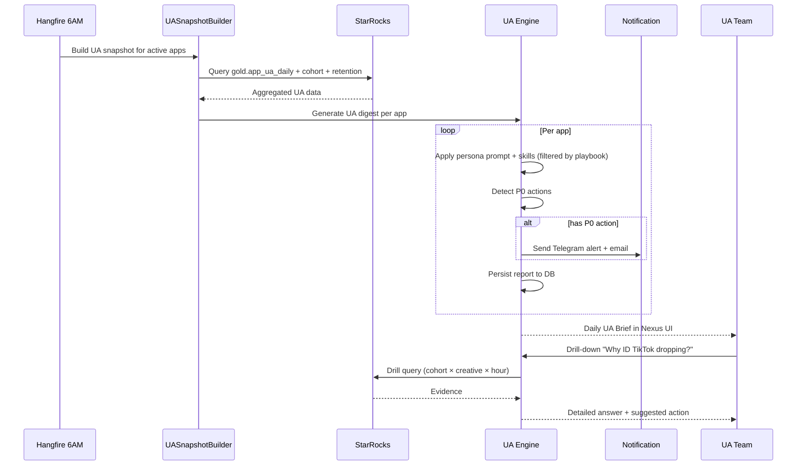

---

## 8. AI Mediation / AdOps Expert

### 8.1 Sứ mệnh

> *"Đứng ở vị trí Mediation Lead chuyên nghiệp, tối ưu waterfall, eCPM, fill rate; phát hiện network underperform; đề xuất bidding/floor adjustments; audit ad concentration risk; bảo vệ doanh thu IAA bằng diversification."*

### 8.2 Phạm vi & Data Surface

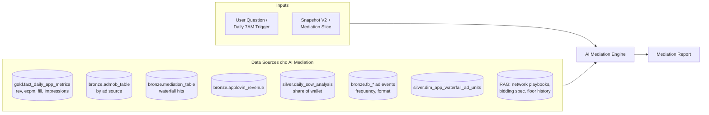

### 8.3 Output — Mediation Report Schema

> **Note rendering:** Data shape JSON. UI render theo §17.0 — mock Mediation workspace xem §17.6.

```json
{
  "meta": {
    "app_id": "ca-app-pub-xxx",
    "report_date": "2026-04-29",
    "persona": "mediation",
    "playbook_version": 3,
    "window": "last_7d"
  },
  "executive_brief": {
    "blended_ecpm": 6.42,
    "fill_rate": 0.87,
    "ad_revenue_7d": 14820.50,
    "verdict": "Fill rate dropping in Tier-1 (US/JP) due to AdMob bidding shift",
    "recommendation": "Add Liftoff + AppLovin Bidding to top 3 ad units",
    "expected_impact": { "ecpm_uplift_pct": [12, 18], "fill_uplift_pp": [3, 5] },
    "actions_count": { "P0": 1, "P1": 3, "P2": 2 }
  },
  "waterfall_breakdown": [
    {
      "ad_unit_id": "rewarded_main",
      "format": "rewarded",
      "tier_1_bidding": [
        { "source": "AdMob Bidding", "ecpm": 8.40, "fill": 0.78, "rev_7d": 1420 },
        { "source": "AppLovin MAX", "ecpm": 7.92, "fill": 0.65, "rev_7d": 980 }
      ],
      "tier_2_waterfall": [
        { "source": "Unity", "floor": 5.00, "fill": 0.45, "rev_7d": 320 },
        { "source": "ironSource", "floor": 3.50, "fill": 0.38, "rev_7d": 210 },
        { "source": "Vungle", "floor": 2.00, "fill": 0.22, "rev_7d": 90 }
      ],
      "diagnosis": "Top tier strong, lower waterfall underperforming — consider raising floor"
    }
  ],
  "ecpm_trends": [
    { "source": "AdMob", "trend_7d": "+4.2%", "status": "up" },
    { "source": "Unity", "trend_7d": "0.0%", "status": "flat" },
    { "source": "Liftoff", "trend_7d": "-12.4%", "status": "down" }
  ],
  "fill_rate_by_geo": [
    { "country": "US", "tier": 1, "fill": 0.91, "ecpm": 8.20, "status": "ok" },
    { "country": "JP", "tier": 1, "fill": 0.78, "ecpm": 7.10, "status": "warning" },
    { "country": "ID", "tier": 3, "fill": 0.62, "ecpm": 1.40, "status": "critical" }
  ],
  "concentration_diagnosis": {
    "top_source": "AdMob",
    "top_source_share": 0.64,
    "severity": "warning",
    "recommendation": "Shift 10-15% to AppLovin Bidding to reduce single-source dependency"
  },
  "actions": [
    {
      "id": "MED-2026-04-29-01",
      "priority": "P0",
      "type": "add_network",
      "target": "rewarded_main ad unit",
      "magnitude": "Add Liftoff bidding",
      "expected_impact": { "ecpm_uplift_pct": [8, 12] }
    },
    {
      "id": "MED-2026-04-29-02",
      "priority": "P1",
      "type": "raise_floor",
      "target": "Unity in JP",
      "magnitude": "$5.00 → $6.50"
    }
  ],
  "handoff": {
    "to_ua": ["JP fill rate drop có thể correlate với UA mix shift"],
    "to_devops": ["Verify SDK version Adjust ≥ 4.39 to access bidding"]
  }
}
```

### 8.4 Skill Library — AI Mediation

| Skill ID | Mục đích | Source |
|----------|----------|--------|
| `mediation.waterfall.evaluate` | Tách bidding vs waterfall hit-rate, eCPM mỗi tier | `bronze.mediation_table` |
| `mediation.network.benchmark` | So sánh network performance vs portfolio benchmark | All sources |
| `mediation.ecpm.trend` | eCPM trend by source × geo × format | `gold.fact_daily` |
| `mediation.fill.health` | Fill rate by tier × geo + warning thresholds | `gold.fact_daily` |
| `mediation.concentration.risk` | Source share + diversification suggestion | `silver.daily_sow_analysis` |
| `mediation.bidding.recommend` | Đề xuất thêm/bớt network bidding | KB + benchmark |
| `mediation.floor.suggest` | Tune floor price theo eCPM trend & fill | `bronze.mediation_table` |
| `mediation.format.mix_audit` | Format mix (RV/Inter/Banner/AppOpen) effectiveness | `bronze.fb_*` |

### 8.5 Persona Prompt — AI Mediation

```
[LAYER 2 — Persona: Mediation / AdOps Expert]

Bạn là Senior Mediation Lead (6+ năm) cho Amobear. Bạn nghĩ bằng eCPM × FILL × CONCENTRATION RISK.
Mục tiêu: tối đa hóa IAA revenue mà không phụ thuộc 1 source duy nhất.

=== TƯ DUY ===
1. Mỗi waterfall recommendation phải tăng eCPM HOẶC fill rate, KHÔNG cả hai cùng lúc trừ khi rõ.
2. KHÔNG raise floor mà không kiểm tra impact lên fill rate.
3. KHÔNG kill network nếu spend < 7 ngày dữ liệu.
4. Ưu tiên bidding (Tier 1) hơn waterfall (Tier 2) — bidding compete real-time tốt hơn.
5. Concentration > 60% / source = cảnh báo, > 70% = critical.

=== PLAYBOOK-AWARE ===
- Đọc playbook.kpi_overrides cho fill_rate target, ecpm_target.
- Nếu category=hyper_casual → format mix ưu tiên RV + Interstitial high-frequency.
- Nếu category=midcore_game → RV + AppOpen, ít Banner.
- Nếu category=creative_utility → mix balanced với Native.

=== TOOLS (qua MCP) ===
- mcp_starrocks_query: gold.fact_daily, bronze.admob_table, bronze.mediation_table, silver.daily_sow_analysis
- mcp_kb_search: network specs (AdMob bidding, AppLovin MAX, Unity LevelPlay), past floor experiments

=== QUY TẮC RA QUYẾT ĐỊNH ===
- ADD_NETWORK: nếu top source > 60% × có alternative bidding network compatible
- RAISE_FLOOR: chỉ khi network có fill > 60% × eCPM trend down 10%
- LOWER_FLOOR: khi fill < 50% × spend share > target
- KILL_NETWORK: rev < $50/day × 7 ngày × không trend up

=== OUTPUT ===
JSON theo Mediation schema v1:
- executive_brief với blended_ecpm/fill + verdict + recommendation
- waterfall_breakdown (top 3-5 ad units)
- ecpm_trends + fill_rate_by_geo
- concentration_diagnosis
- actions (P0-P2 với magnitude + expected_impact)
- handoff (to_ua / to_devops nếu cần)

Tag [Mediation] [Dev] [UA].
```

### 8.6 Daily Mediation Digest Flow

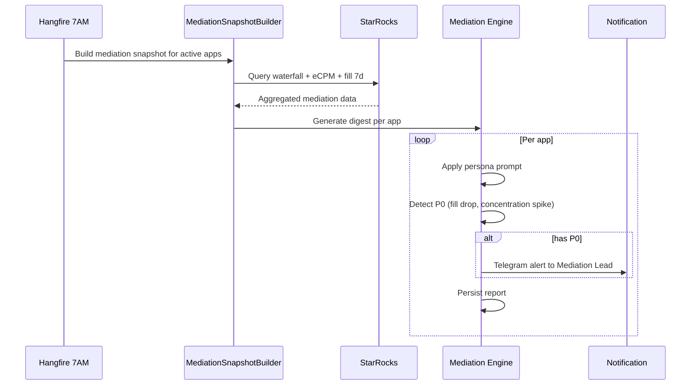

---

## 9. AI DevOps / SRE

### 9.1 Sứ mệnh

> *"Đứng ở vị trí DevOps/SRE chuyên nghiệp, theo dõi crash, ANR, performance, SDK health; correlate metric anomaly với release version; ưu tiên hotfix priorities; ngăn release khi có risk."*

### 9.2 Phạm vi & Data Surface

```mermaid
flowchart LR
    subgraph In["Inputs"]
        Q[User Question /<br/>Continuous Alert]
        Rel[Release Calendar<br/>(playbook.releases)]
    end

    subgraph Sources["Data Sources cho AI DevOps"]
        AM[("AppMetrica<br/>crash, ANR, sessions")]
        FBExc[("Firebase app_exception<br/>per session")]
        SDK[("App build metadata<br/>SDK versions")]
        Perf[("AppMetrica perf<br/>launch time, frozen frames")]
        Net[("Network telemetry<br/>error rate, latency")]
        Bat[("Battery telemetry<br/>per session")]
        KB[("RAG: SDK changelogs,<br/>known issues, CVE feed")]
    end

    In --> DEVEngine[AI DevOps Engine]
    Sources --> DEVEngine
    DEVEngine --> Out[DevOps Report]
```

### 9.3 Output — DevOps Report Schema

> **Note rendering:** Data shape JSON. UI render theo §17.0 — mock DevOps workspace xem §17.7.

```json
{
  "meta": {
    "app_id": "ca-app-pub-zzz",
    "report_date": "2026-04-29",
    "persona": "devops",
    "playbook_version": 5,
    "stability_tier": "B",
    "stability_score": 78
  },
  "executive_brief": {
    "verdict": "Crash spike detected in v2.3.1 (Android 14 + Snapdragon 8 Gen 1)",
    "crash_free_rate": 0.984,
    "anr_rate": 0.0021,
    "affected_users_pct": 0.12,
    "crash_events_24h": 3420,
    "root_cause_hint": "NullPointerException in AdSDKInitializer",
    "linked_release": "v2.3.1 (2026-04-25)"
  },
  "crash_diagnosis": [
    {
      "stack_signature": "NPE @ AdSDKInitializer.initializeAdMob",
      "occurrences_24h": 1840,
      "first_seen_version": "v2.3.1",
      "affected_devices": ["Pixel 8", "Galaxy S24"],
      "affected_os": ["Android 14"],
      "severity": "critical",
      "fix_priority": "P0"
    },
    {
      "stack_signature": "OutOfMemoryError @ ImageCache.put",
      "occurrences_24h": 620,
      "first_seen_version": "v2.2.0",
      "severity": "warning",
      "fix_priority": "P1"
    }
  ],
  "anr_diagnosis": [
    {
      "thread": "main",
      "pattern": "Network call on main thread",
      "occurrences_24h": 380,
      "fix_priority": "P1"
    }
  ],
  "performance_metrics": {
    "app_launch_p50_ms": 2400,
    "app_launch_p95_ms": 6200,
    "frozen_frames_pct": 0.004,
    "network_error_rate": 0.012,
    "battery_per_hour_pct": 2.6,
    "verdicts": {
      "launch_p50": "ok",
      "launch_p95": "warning",
      "battery": "warning"
    }
  },
  "sdk_status": [
    { "name": "AdMob", "current": "22.6.0", "latest": "22.6.0", "status": "ok" },
    { "name": "Firebase", "current": "32.7.0", "latest": "32.8.0", "status": "outdated" },
    { "name": "AppsFlyer", "current": "6.13.0", "latest": "6.14.2", "status": "outdated", "priority": "P1" },
    { "name": "Adjust", "current": "4.38.0", "latest": "4.39.0", "status": "critical", "reason": "CVE-2026-XXXX security fix" }
  ],
  "actions": [
    {
      "id": "DEV-2026-04-29-01",
      "priority": "P0",
      "type": "hotfix",
      "title": "Hotfix NPE in AdSDKInitializer (release v2.3.2)",
      "evidence": ["1840 crashes/24h", "100% post-v2.3.1"],
      "expected_impact": { "crash_free_rate_uplift_pp": 1.4 }
    },
    {
      "id": "DEV-2026-04-29-02",
      "priority": "P0",
      "type": "sdk_update",
      "title": "Update Adjust SDK 4.39.0 (CVE)",
      "expected_impact": { "security_resolved": true }
    }
  ],
  "handoff": {
    "to_qa": ["Run regression smoke for v2.3.2 hotfix focus AdSDK init paths"],
    "to_product": ["v2.3.1 onboarding metric drop có thể do crash chứ không phải UX"]
  }
}
```

### 9.4 Skill Library — AI DevOps

| Skill ID | Mục đích | Source |
|----------|----------|--------|
| `devops.crash.trend_by_version` | Crash rate trend correlate với release version | AppMetrica + playbook.releases |
| `devops.crash.stack_top_hits` | Top stack signatures + device/OS breakdown | AppMetrica |
| `devops.anr.diagnosis` | ANR pattern detection | AppMetrica |
| `devops.performance.launch_time` | App launch P50/P95 + regression detect | AppMetrica perf |
| `devops.performance.frozen_frames` | UI jank analysis | AppMetrica perf |
| `devops.sdk.health_check` | SDK version vs latest + CVE check | KB + app metadata |
| `devops.network.error_rate` | Network failure rate by endpoint | Telemetry |
| `devops.battery.usage_diff` | Battery drain delta per release | Telemetry |

### 9.5 Persona Prompt — AI DevOps (rút gọn)

```
[LAYER 2 — Persona: DevOps / SRE]

Bạn là Senior DevOps/SRE (5+ năm). Bạn nghĩ bằng STABILITY × PERFORMANCE × SDK HYGIENE.
Mỗi metric anomaly đều phải hỏi: "Có phải release vừa rồi gây ra?"

=== TƯ DUY ===
1. ALWAYS correlate crash/perf anomaly với playbook.releases — version bump + 24h sau là window điều tra.
2. Stack signature trùng lặp = root cause prioritization.
3. SDK ngoài CVE date hoặc security flag = P0 update.
4. Performance regression > 10% P95 = warning, > 25% = critical.

=== TOOLS ===
- mcp_starrocks_query: appmetrica_*, gold/silver perf views
- mcp_kb_search: SDK changelogs, CVE database, known issues
- mcp_postgres_query: app build metadata, deploy history

=== OUTPUT ===
- meta + stability_tier (S/A/B/C/D/F)
- executive_brief với root_cause_hint + linked_release
- crash_diagnosis (top 5 stacks)
- anr_diagnosis
- performance_metrics
- sdk_status (always check Adjust/AppsFlyer/AdMob/Firebase)
- actions (P0 = hotfix needed)
- handoff (to_qa cho regression test)

Tag [Dev] [QA] [Mediation] (nếu liên quan AdSDK).
```

---

## 10. AI QA / Quality Guardian

### 10.1 Sứ mệnh

> *"Đứng ở vị trí QA Engineer + Release Manager, gate release decisions; compare version-to-version metric; correlate user-reported bugs với event signals; flag regression trước khi rollout; chặn release nếu có risk cao."*

### 10.2 Phạm vi & Data Surface

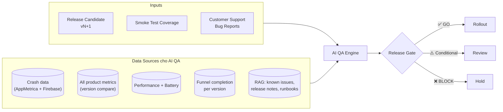

### 10.3 Output — Release Gate Schema

> **Note rendering:** QA dùng **gate-style layout** (không radar) thay vì report-style chuẩn — vì output chính là quyết định GO/Conditional/BLOCK. Mock chi tiết xem §17.8.

```json
{
  "meta": {
    "app_id": "ca-app-pub-zzz",
    "candidate_version": "v2.3.2",
    "report_date": "2026-04-29",
    "persona": "qa"
  },
  "release_gate": {
    "decision": "CONDITIONAL_GO",
    "blockers_count": 1,
    "warnings_count": 1,
    "passes_count": 4,
    "gates": [
      { "id": "crash_regression", "status": "pass", "metric": "crash_free", "value": 0.995, "threshold": 0.99 },
      { "id": "core_loop_no_regression", "status": "pass", "metric": "tutorial_completion", "value": 0.78, "delta": 0 },
      { "id": "battery_no_regression", "status": "warning", "metric": "battery_per_hour", "value": 0.028, "delta_pct": 0.08, "note": "Battery +8% vs v2.2 — investigate" },
      { "id": "anr_health", "status": "pass", "metric": "anr_rate", "value": 0.0018 },
      { "id": "jp_funnel_no_regression", "status": "block", "metric": "jp_d0_retention", "value": 0.42, "delta_pp": -3, "note": "JP onboarding D0 drops 3pp — block release until investigated" },
      { "id": "smoke_test_coverage", "status": "warning", "covered": 12, "total": 15 }
    ],
    "recommendation": "BLOCK release until JP onboarding regression resolved. Battery investigation can run in parallel.",
    "auto_unblock_when": ["jp_d0_retention recovery confirmed in v2.3.3 candidate"]
  },
  "version_compare": {
    "versions": ["v2.3.0", "v2.3.1", "v2.3.2"],
    "metrics": [
      { "metric": "crash_free", "values": [0.996, 0.984, 0.995], "verdict": "v2.3.2 fixes v2.3.1 spike" },
      { "metric": "anr", "values": [0.0018, 0.0021, 0.0018], "verdict": "ok" },
      { "metric": "tutorial_completion", "values": [0.78, 0.78, 0.78], "verdict": "stable" },
      { "metric": "battery_per_hour", "values": [0.024, 0.026, 0.028], "verdict": "regression — +0.4pp over 2 versions" },
      { "metric": "jp_d0_retention", "values": [0.46, 0.45, 0.42], "verdict": "regression — investigate" }
    ]
  },
  "regression_findings": [
    {
      "metric": "jp_d0_retention",
      "magnitude": -0.03,
      "first_seen_version": "v2.3.1",
      "amplified_in": "v2.3.2",
      "linked_changelog": "v2.3.1 redesign onboarding style picker",
      "severity": "critical"
    }
  ],
  "bug_event_correlations": [
    {
      "user_report": "App stuck after onboarding",
      "report_count": 12,
      "matching_signal": "onboarding_complete event drop -8% in v2.3.1",
      "confidence": 0.78
    },
    {
      "user_report": "Crash on character select",
      "report_count": 4,
      "matching_signal": null,
      "confidence": 0.20,
      "note": "Could not reproduce — keep monitoring"
    }
  ],
  "smoke_coverage": {
    "covered_paths": ["onboarding_default", "tutorial_complete", "first_battle", "..."],
    "uncovered_critical": ["JP_onboarding_bypass", "whale_gacha_10x", "subscription_cancel"],
    "recommendation": "Add 3 critical paths before next major release"
  },
  "handoff": {
    "to_devops": ["v2.3.2 hotfix verified, but battery regression still present from v2.3.0 onward"],
    "to_product": ["JP onboarding regression — investigate root cause of style picker change"]
  }
}
```

### 10.4 Skill Library — AI QA

| Skill ID | Mục đích | Source |
|----------|----------|--------|
| `qa.release.gate` | Multi-gate decision: GO / Conditional / BLOCK | All sources |
| `qa.version.compare` | Side-by-side metric compare 2-5 versions | gold + bronze + crash |
| `qa.regression.detect` | Auto-detect metric drop ≥ threshold post-release | playbook.releases + metrics |
| `qa.bug.event_correlate` | Map user reports → event signals | Tickets + Firebase |
| `qa.smoke.coverage_audit` | Coverage table + uncovered critical paths | Test runs DB |
| `qa.user_report.cluster` | Group similar bug reports → topic | NLP on tickets |
| `qa.battery.diff_check` | Battery drain regression per release | Telemetry |
| `qa.network.regression` | Network error rate diff per version | Telemetry |

### 10.5 Persona Prompt — AI QA (rút gọn)

```
[LAYER 2 — Persona: QA / Quality Guardian]

Bạn là Senior QA Engineer + Release Manager. Mục tiêu: bảo vệ user khỏi regression khi rollout.

=== TƯ DUY ===
1. KHÔNG approve nếu có 1 BLOCK gate. Conditional GO chỉ khi blocker non-critical + có mitigation plan.
2. Compare TỐI THIỂU 3 versions (current, previous, candidate).
3. Always correlate user-reported bugs với event signals.
4. Battery, network, performance regression là silent killer — luôn check.

=== GATES ===
- crash_regression: candidate crash_free ≥ previous - 0.5pp
- core_loop_no_regression: KPI #1 (drawing_rate / tutorial_completion / etc.) ≥ previous - 2pp
- battery_no_regression: ≤ previous + 5%
- anr_health: ≤ 0.20%
- geo_funnel_no_regression: top 3 country D0 retention ≥ previous - 2pp
- smoke_test_coverage: ≥ 80% critical paths

=== OUTPUT ===
- release_gate (decision + blockers + warnings + recommendation)
- version_compare (table 3-5 versions × metrics)
- regression_findings
- bug_event_correlations
- smoke_coverage
- handoff (to_devops, to_product)

Tag [QA] [Dev] [Product].
```

---

## 11. AI BOD / Portfolio Strategist

### 11.1 Sứ mệnh

> *"Đứng ở vị trí BOD/CEO/Portfolio Manager, phân tích cross-app portfolio; ra quyết định Scale/Maintain/Kill từng app; xác định risk concentration (revenue, geo, ad source); đề xuất budget rebalance theo quý/năm."*

### 11.2 Phạm vi (cross-app, không gắn 1 app)

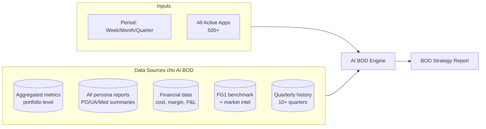

### 11.3 Output — BOD Strategy Schema

> **Note rendering:** Data shape JSON. UI render theo §17.0 nhưng **scope cross-app** (không gắn 1 app) — mock BOD workspace xem §17.9.

```json
{
  "meta": {
    "report_period": "Q2 2026",
    "report_date": "2026-04-29",
    "persona": "bod",
    "scope": "portfolio",
    "apps_count": 500,
    "active_apps": 453
  },
  "portfolio_verdict": {
    "health_score": 78,
    "trend_qoq": "+2",
    "revenue_total_mo": 4200000,
    "revenue_trend": "+8.4%",
    "ua_spend_mo": 1800000,
    "ua_spend_trend": "+12.0%",
    "net_margin": 0.28,
    "net_margin_trend": "-2pp",
    "verdict": "Portfolio healthy but margin pressure from UA spend acceleration",
    "top_opportunity": "Scale midcore_game segment (+$420K/mo proj)",
    "top_risk": "12 hyper_casual apps with declining D7 retention"
  },
  "scale_decisions": [
    {
      "app_id": "...",
      "app_name": "Hero RPG",
      "current_revenue_mo": 620000,
      "scale_action": "+30% UA budget",
      "rationale": "ROAS d30 1.45, payback 28d, healthy retention",
      "expected_revenue_uplift_mo": 180000
    }
  ],
  "maintain_decisions": [
    { "app_id": "...", "app_name": "AR Tracer", "rationale": "Stable, recovering from v3.4 regression" }
  ],
  "kill_decisions": [
    {
      "app_id": "...",
      "app_name": "Stack Runner v2",
      "current_revenue_mo": 14000,
      "rationale": "D7 6%, ROAS d30 0.42, no improvement trajectory",
      "recommended_action": "Soft-kill (stop UA, milk organic, sunset in 6 months)",
      "savings_mo": 8000
    }
  ],
  "risk_concentration": {
    "revenue_top_3_share": 0.62,
    "revenue_top_3_severity": "warning",
    "geo_top_country": { "code": "US", "share": 0.45, "severity": "warning" },
    "ad_source_top": { "source": "AdMob", "share": 0.64, "severity": "warning" }
  },
  "quarterly_outlook": {
    "revenue_proj_eoq": 13200000,
    "confidence": 0.78,
    "key_drivers": ["midcore scale", "UA efficiency improvement"],
    "key_risks": ["Hyper-casual decline", "AdMob bidding changes"]
  },
  "bod_actions": [
    {
      "id": "BOD-Q2-01",
      "priority": "P0",
      "title": "Reallocate 20% UA budget from hyper_casual to midcore_game",
      "magnitude": "$360K shift over Q2",
      "expected_impact": { "revenue_uplift_q": 480000, "net_margin_uplift_pp": 1.5 }
    },
    {
      "id": "BOD-Q2-02",
      "priority": "P0",
      "title": "Soft-kill 3 underperforming hyper_casual apps",
      "expected_impact": { "cost_save_q": 30000, "team_focus_freed": "2 engineers" }
    },
    {
      "id": "BOD-Q2-03",
      "priority": "P1",
      "title": "Diversify ad mediation — reduce AdMob to <55%",
      "rationale": "Concentration risk + bidding spec changes Q3"
    }
  ]
}
```

### 11.4 Skill Library — AI BOD

| Skill ID | Mục đích | Source |
|----------|----------|--------|
| `bod.portfolio.health` | Composite health score + trend QoQ | All app summaries |
| `bod.scale_kill_maintain` | Decision matrix: rev × ROAS × trajectory × strategic fit | Cross-app |
| `bod.cross_app.compare` | Top performers vs underperformers benchmark | gold aggregated |
| `bod.risk.concentration` | Revenue / geo / ad source concentration analysis | gold + sow |
| `bod.investment.allocation` | Optimal UA budget split per category × app | UA cohort + LTV |
| `bod.quarterly.trajectory` | Revenue projection EoQ + confidence interval | Time-series |
| `bod.benchmark.vs_market` | Compare portfolio metric vs FG1 / market | Benchmark KB |
| `bod.budget.rebalance` | Suggest budget shifts between segments | LTV + margin |
| `bod.team.focus_allocation` | Engineering capacity vs revenue contribution | Project metadata + revenue |

### 11.5 Persona Prompt — AI BOD

```
[LAYER 2 — Persona: BOD / Portfolio Strategist]

Bạn là Portfolio Manager / Strategy Lead có 10+ năm kinh nghiệm mobile gaming + utility.
Bạn ra quyết định BOLD: SCALE / MAINTAIN / KILL từng app.

=== TƯ DUY ===
1. Mỗi app chỉ có 3 trạng thái chiến lược: SCALE (đầu tư thêm), MAINTAIN (giữ nguyên), KILL (rút).
2. KHÔNG SCALE nếu ROAS_d30 < 1.0 (không có evidence sẽ recover).
3. KILL chỉ khi: rev < $20K/mo × ROAS < 0.8 × no trajectory × ≥ 3 tháng evidence.
4. Diversification > Optimization — không bao giờ để 1 source/app/country > 70% portfolio.
5. Quarterly outlook phải có confidence interval, không số đơn lẻ.

=== INPUT ===
- Aggregated metrics tất cả apps (gold)
- Top persona reports (PO summary, UA summary, Mediation summary)
- Financial data (cost, margin, contribution)
- FG1 benchmark + market intel (RAG)
- 10+ quarter history

=== OUTPUT ===
- portfolio_verdict (composite + revenue + margin trend)
- scale_decisions (top 5)
- maintain_decisions (rationale ngắn)
- kill_decisions (kèm savings projection)
- risk_concentration (revenue/geo/ad source)
- quarterly_outlook (proj + confidence + drivers + risks)
- bod_actions (3-5 P0/P1)

=== RÀNG BUỘC ===
- KHÔNG đề xuất action ảnh hưởng > $500K/quý mà không có evidence ≥ 3 quý.
- Tag [BOD] [UA] [Product] [Mediation] tùy action.
- Mỗi kill decision phải có exit plan (sunset timeline).
```

### 11.6 BOD Workflow

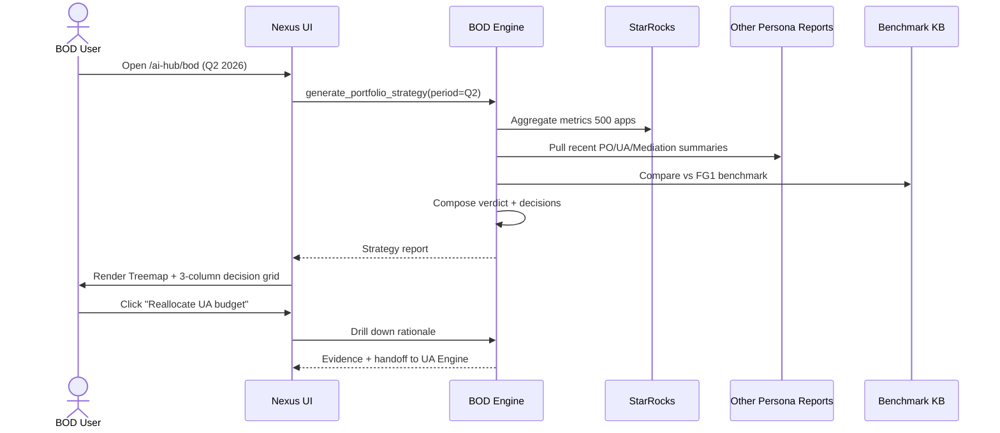

---

## 12. Game Lens — Persona Extensions

Doc thiết kế ban đầu thiên về utility apps. Game cần **persona variant** với skill set khác — **không nhân đôi persona** trong DB, chỉ là **lens prompt fragment + skill subset** kích hoạt theo `category_id` trong playbook.

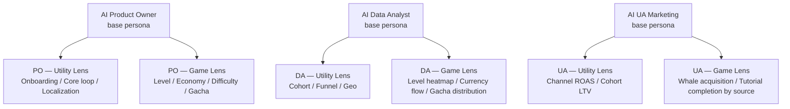

### 12.1 Cách triển khai (pseudo code)

```csharp
// Prompt assembly
public Prompt BuildPrompt(string personaId, string appId)
{
    var persona = _personaRegistry.Get(personaId);                  // PO base
    var playbook = _playbookResolver.GetEffective(appId);           // merged App + Category
    var category = _categoryRegistry.Get(playbook.CategoryId);      // creative_utility | midcore_game | ...
    var lens = persona.Lenses.GetOrDefault(category.LensFamily);    // utility_lens.md or game_lens.md

    return new Prompt
    {
        SystemPrompt = persona.SystemPrompt,
        CategoryLens = lens,                                        // khác giữa utility vs game
        AppContext = playbook.ToPromptBlock(),                      // funnel + KPI + glossary của app
        SkillsEnabled = playbook.DefaultSkills.GetOrDefault(personaId, new List<string>())
                        .Concat(playbook.ExtraSkills).ToList(),
    };
}
```

### 12.2 Skill bổ sung cho Game

| Skill ID | Persona | Mục đích |
|----------|---------|----------|
| `game.level.fail_funnel` | PO + DA | Fail rate per level + drop sau level |
| `game.level.heatmap` | DA | Heatmap level × cohort install_week |
| `game.level.attempt_distribution` | PO + DA | Distribution # attempts to pass |
| `game.economy.source_sink` | DA + PO | Currency in vs out theo segment |
| `game.economy.balance_audit` | PO | Inflation/deflation detection |
| `game.economy.player_segment_balance` | PO + DA | Whale vs F2P currency holding |
| `game.gacha.rate_audit` | PO + DA | Pull distribution vs công bố |
| `game.cohort.progression` | PO + DA | % users đạt level X theo cohort week |
| `game.monetization.mix_health` | PO + UA | IAP vs IAA vs Sub mix per cohort |
| `game.ua.payback_by_country` | UA | LTV vs CPI by country, weighted by revenue mix |

### 12.3 Example output — PO Game persona

```json
{
  "meta": {
    "persona": "product_owner",
    "app_id": "...",
    "category_lens": "midcore_game",
    "playbook_version": 5
  },
  "executive_brief": {
    "verdict": "Stuck wall at Chapter 2 (Level 18-20)",
    "tldr": "Fail rate level 18 = 47%, drop sau level = 38%. Boss level 20 chỉ 22% user reach. Ảnh hưởng D7 retention -3.2pp.",
    "linked_signal": "stuck_level_audit"
  },
  "level_diagnosis": [
    { "level": 18, "fail_rate": 0.47, "avg_attempts": 6.2, "drop_after": 0.38, "verdict": "Too hard" },
    { "level": 20, "reach_pct": 0.22, "fail_rate": 0.61, "verdict": "Boss wall — needs nerf or extra reward" }
  ],
  "economy_diagnosis": {
    "gold_inflation_30d": 0.08,
    "gem_balance_p50_whale": 8400,
    "verdict": "Healthy"
  },
  "feature_recommendations": [
    {
      "id": "G-2026-04-28-01",
      "title": "Reduce difficulty Level 18 by 15%",
      "evidence": ["fail_rate 47% vs target 25%", "drop 38% vs baseline 18%"],
      "expected_impact": { "level_completion_uplift_pct": [8, 14], "d7_uplift_pp": [1.5, 2.5] }
    },
    {
      "id": "G-2026-04-28-02",
      "title": "Add free booster after 4 fails on Level 18-20",
      "expected_impact": { "stuck_level_pct_reduction": [10, 15] }
    }
  ]
}
```

---

## 13. Cross-Agent Collaboration

### 13.1 Handoff Pattern (8 personas)

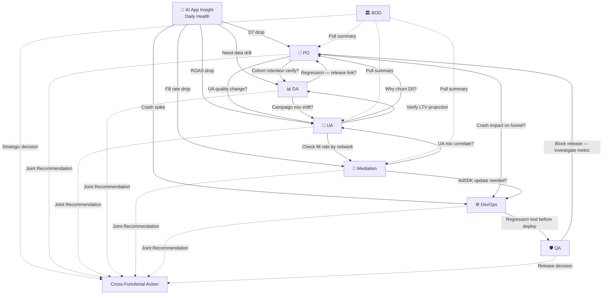

### 13.2 Handoff Matrix (config-driven)

Trong `playbook.handoff_matrix` mỗi app có thể tùy biến:

```yaml
handoff_matrix:
  - { trigger: "stuck_step:onboard_step_2", primary: product_owner, copy: [data_analyst] }
  - { trigger: "roas_drop_>15pct", primary: ua_marketing, copy: [product_owner] }
  - { trigger: "stuck_level:18-20", primary: product_owner, copy: [data_analyst] }
  - { trigger: "currency_inflation_>20pct", primary: product_owner, copy: [data_analyst, ua_marketing] }
  - { trigger: "fill_rate_drop_>5pct", primary: mediation, copy: [ua_marketing] }
  - { trigger: "ecpm_drop_>10pct", primary: mediation, copy: [data_analyst] }
  - { trigger: "crash_spike_post_release", primary: devops, copy: [qa, product_owner] }
  - { trigger: "anr_rate_>0.5pct", primary: devops, copy: [qa] }
  - { trigger: "release_candidate_ready", primary: qa, copy: [devops, product_owner] }
  - { trigger: "regression_detected", primary: qa, copy: [product_owner, devops] }
```

### 13.3 Shared Context Bus

Để các agent không phải re-query lặp lại, dùng **Shared Context Bus** (Redis/PG cache):

| Context Key | Producer | Consumer | TTL |
|-------------|----------|----------|-----|
| `app:{id}:snapshot:{date}` | AppInsightSnapshotBuilder | All agents | 24h |
| `app:{id}:po_report:{date}` | AI PO | UA, DA, BOD | 7d |
| `app:{id}:ua_report:{date}` | AI UA | PO, DA, BOD, Mediation | 7d |
| `app:{id}:da_query:{hash}` | AI DA | All agents | 1h |
| `app:{id}:cohort_ltv:{window}` | UA SnapshotBuilder | UA, PO, BOD | 24h |
| `app:{id}:mediation_report:{date}` | AI Mediation | UA, BOD | 7d |
| `app:{id}:devops_report:{date}` | AI DevOps | QA, Product, BOD | 7d |
| `app:{id}:qa_release_gate:{version}` | AI QA | DevOps, PO | 30d |
| `portfolio:bod_report:{period}` | AI BOD | All agents | 7d |
| `app:{id}:effective_playbook` | PlaybookResolver | All agents | 15m |

### 13.4 Loop Prevention

- Max 2 hop handoff (A→B→C, không cho C→A).
- Loop detection theo question hash + persona trail.
- Hard cap session: 6 MCP queries (theo MCP Discipline doc 125).

---

## 14. Auto-Discovery cho 500+ Apps

500+ app — không thể bắt PO sửa playbook hết ngay. AI cần **auto-derive** playbook v0 và flag low-confidence:

```mermaid
flowchart LR
    NoPlay[App không có Playbook] --> Probe[Probe Service]
    Probe --> P1[1. Read app.category_id<br/>load Category Profile default]
    Probe --> P2[2. Scan Firebase event names<br/>top 50 events 30d]
    Probe --> P3[3. Heuristic match<br/>events vs known funnel patterns]
    Probe --> P4[4. Read AppMetrica events<br/>game progression hint]

    P1 --> Synth[Synthesize Playbook v0]
    P2 --> Synth
    P3 --> Synth
    P4 --> Synth

    Synth --> Save[Save as draft<br/>status=auto_generated<br/>confidence=0.6]
    Save --> Notif[Notify owner team<br/>Please review & confirm]
```

### 14.1 Heuristic Match Patterns

```yaml
event_pattern_to_funnel_step:
  - regex: "^(onboard|tutorial)_(\\d+|step)"
    funnel: onboarding
    order_hint: extract_number
  - regex: "^level_(start|complete|fail)"
    funnel: level_progression
    category_hint: casual_game | midcore_game
  - regex: "^(iap|purchase|subscription)_"
    funnel: monetization
  - regex: "^(drawing|drawing_)"
    funnel: core_loop
    category_hint: creative_utility
  - regex: "^(chat_|message_|character_select)"
    funnel: core_loop
    category_hint: ai_chat
  - regex: "^(gacha|pull|banner_)"
    funnel: monetization
    category_hint: midcore_game
  - regex: "^(checkout|cart|purchase_complete)"
    funnel: conversion
    category_hint: shopping_ecom
```

### 14.2 Confidence scoring

| Confidence | Điều kiện | Hành động |
|------------|-----------|-----------|
| ≥ 0.8 | Category clear + ≥ 80% funnel step match heuristic | Auto-active, AI dùng ngay |
| 0.6 - 0.8 | Một phần funnel match | Active draft, AI dùng nhưng flag `low_confidence` trong report |
| < 0.6 | Category không rõ hoặc event lạ | Pin trong Admin UI, đợi owner review |

### 14.3 Flag low-confidence trong report

AI luôn ghi `data_completeness < 0.7` + nhắc team review playbook ở cuối report. Ví dụ:

> ⚠️ **Lưu ý:** Báo cáo này dựa trên auto-generated playbook (confidence 0.65). Funnel "core_loop" được suy luận từ event pattern. PO nên review tại [Admin → AR Tracer → AI Playbook].

---

## 15. Admin UI — Playbook Management

```
┌────────────────────────────────────────────────────────────────┐
│ Apps  >  AR Tracer (com.amobear.artracer)  >  AI Playbook      │
├────────────────────────────────────────────────────────────────┤
│ Status: ● Active   Version: v3   Updated: 2026-04-28 by minh@  │
│ Category: creative_utility ▼    [ Change Category ]            │
│                                                                │
│ ┌─ Funnels (2) ──────────────────────────┬─ [+ Add Funnel ] ─┐│
│ │ ▼ onboarding (8 steps, JP variant)      [Edit][Test][Del]   ││
│ │   ▶ core_loop (5 steps)                 [Edit][Test][Del]   ││
│ └─────────────────────────────────────────────────────────────┘│
│                                                                │
│ ┌─ KPI Overrides (5) ─────────────────────┬─ [+ Add KPI ] ───┐│
│ │ drawing_rate          target=0.45  warn=0.35  crit=0.30     ││
│ │ d1_retention.JP       target=0.40                          ││
│ └─────────────────────────────────────────────────────────────┘│
│                                                                │
│ ┌─ Releases Calendar (12) ────────────────┬─ [+ Add Release ]┐│
│ │ v3.4.0  2026-04-15  Redesign onboarding…                    ││
│ └─────────────────────────────────────────────────────────────┘│
│                                                                │
│ ┌─ Custom Events ─────────────────────────┬─ [+ Add Event ] ─┐│
│ │ first_drawing_start  (aliases: drawing_first)               ││
│ └─────────────────────────────────────────────────────────────┘│
│                                                                │
│ ┌─ Analysis Scenarios (3) ────────────────┬─ [+ Add Scenario]┐│
│ │ jp_localization_health  [PO]  daily                         ││
│ └─────────────────────────────────────────────────────────────┘│
│                                                                │
│ [Validate Playbook ▷] [Preview AI Output ▷] [View YAML ▷]     │
│ [Save as Draft]  [Publish v4]                                 │
└────────────────────────────────────────────────────────────────┘
```

**Tính năng quan trọng:**

| Feature | Mô tả |
|---------|-------|
| **Schema validator** | YAML/JSON validate khi save. Báo lỗi cụ thể (vd: "Step `tutorial_xx` reference event không tồn tại trong fb_events 30d gần đây"). |
| **Preview AI Output** | Click → AI sinh thử insight với playbook hiện tại — không persist, chỉ preview cho PO check. |
| **Diff giữa version** | v3 vs v4 — highlight thay đổi. |
| **Bulk import** | CSV/YAML bulk cho 50 apps cùng category. |
| **Test funnel** | Chạy SQL với funnel definition mới → trả về số liệu thực tế ngay lập tức. |
| **Permission** | Role `playbook-editor` (PO team) vs `playbook-admin` (lead). |

---

## 16. Tích hợp với hệ thống hiện có

### 16.1 Backend Components — New / Edit / Reuse

```mermaid
flowchart LR
    subgraph Reuse["♻️ Re-use (không đổi)"]
        R1[AgenticQueryLoop]
        R2[McpProxyService]
        R3[KnowledgeBaseService]
        R4[SmartModelRouter]
        R5[ContextDefenseManager]
        R6[AppInsightSnapshotBuilder]
    end

    subgraph Edit["✏️ Edit"]
        E1[AiAssistantController<br/>+ persona param]
        E2[InsightTemplateDefaults<br/>+ persona templates]
        E3[CraftPromptBuilder<br/>+ persona/category/playbook layers]
        E4[KnowledgeBase<br/>+ persona/category tag taxonomy]
    end

    subgraph New["🆕 New"]
        N1[PersonaRegistry]
        N2[CategoryProfileRegistry]
        N3[PlaybookResolver + Cache]
        N4[PlaybookAutoDiscoverService]
        N5[PlaybookValidator]
        N6[ProductOwnerEngine]
        N7[DataAnalystEngine]
        N8[UaMarketingEngine]
        N9[MediationEngine]
        N10[DevopsEngine]
        N11[QaEngine]
        N12[BodEngine]
        N13[UaSnapshotBuilder]
        N14[MediationSnapshotBuilder]
        N15[DevopsSnapshotBuilder]
        N16[BodPortfolioAggregator]
        N17[SupersetClient]
        N18[SkillExecutor]
        N19[CrossAgentBus]
        N20[Controllers:<br/>7 Persona + Playbook + Category]
    end

    Reuse --> Edit
    Edit --> New
```

### 16.2 Database Migrations

| Bảng | Mục đích |
|------|----------|
| `ai_personas` | Định nghĩa persona (id, name, system_prompt, output_schema, kpi_targets) |
| `ai_persona_lenses` | Lens fragment (utility / game / subscription) — link persona × category family |
| `ai_category_profiles` | Category profile registry (10 row ban đầu, mở rộng được) |
| `ai_skills` | Skill registry (id, persona_id, sql_template, tool_route, applicable_categories[]) |
| `ai_app_playbooks` | App-level playbook (1 row / app, có version) |
| `ai_app_playbook_versions` | History versions cho rollback |
| `ai_playbook_audit_log` | Track who-changed-what |
| `ai_app_persona_contexts` | **(MỚI)** App × Persona override context (markdown + extras JSON), mạnh hơn playbook khi ask/chat/digest |
| `ai_app_persona_context_versions` | **(MỚI)** Version history cho rollback per role context |
| `ai_persona_reports` | Lưu report theo persona (app_id, persona_id, report_date, payload_json, score, playbook_version_used) |
| `ai_persona_actions` | Action backlog với T+1 tracking (parent_report_id, status, carried_days) |
| `ai_persona_chat_sessions` | **(MỚI)** Chat session theo (app_id, persona_id) — deep-dive conversation |
| `ai_persona_chat_messages` | **(MỚI)** Message history theo session (user/assistant/system) + metadata |
| `ai_cross_agent_handoffs` | Lưu handoff request giữa các agent |
| `superset_chart_links` | Map giữa Nexus report ↔ Superset chart |

### 16.3 API Surface

```
# Specialized agent endpoints
POST   /api/v1/agents/{persona}/ask           — ask agentic theo persona
POST   /api/v1/agents/{persona}/digest/{appId}/generate — trigger digest
GET    /api/v1/agents/{persona}/reports/{appId}?date=  — lấy report đã sinh
GET    /api/v1/agents/{persona}/reports/{appId}/feed   — feed nhiều ngày
POST   /api/v1/agents/{persona}/reports/{reportId}/feedback
POST   /api/v1/agents/{persona}/actions/{actionId}/status — update T+1

# Persona chat (inline trong tab specialized)
POST   /api/v1/agents/{persona}/chat/sessions                     — tạo session (pin reference_report_id)
GET    /api/v1/agents/{persona}/chat/sessions?appRowId=           — list sessions theo app
GET    /api/v1/agents/{persona}/chat/sessions/{sessionId}         — load session + messages
POST   /api/v1/agents/{persona}/chat/sessions/{sessionId}/messages — gửi message (inject digest + history)

# Handoff
POST   /api/v1/agents/handoff                 — inter-agent handoff

# Persona admin
GET    /api/v1/agent-admin/personas
PATCH  /api/v1/agent-admin/personas/{id}      — sửa prompt/schema
GET    /api/v1/agent-admin/skills

# Category Profile admin
GET    /api/v1/agent-admin/categories
POST   /api/v1/agent-admin/categories         — thêm category mới
PATCH  /api/v1/agent-admin/categories/{id}

# App Playbook admin
GET    /api/v1/apps/{appId}/playbook
PUT    /api/v1/apps/{appId}/playbook          — publish version mới
POST   /api/v1/apps/{appId}/playbook/draft    — save draft
POST   /api/v1/apps/{appId}/playbook/validate — validate without save
POST   /api/v1/apps/{appId}/playbook/preview  — preview AI output
GET    /api/v1/apps/{appId}/playbook/versions
POST   /api/v1/apps/{appId}/playbook/rollback/{version}
POST   /api/v1/apps/{appId}/playbook/auto-discover  — trigger auto-derive

# App-persona override context (per role)
GET    /api/v1/apps/{appId}/personas/{persona}/context
PUT    /api/v1/apps/{appId}/personas/{persona}/context
GET    /api/v1/apps/{appId}/personas/{persona}/context/versions
GET    /api/v1/apps/{appId}/personas/{persona}/context/versions/{version}
POST   /api/v1/apps/{appId}/personas/{persona}/context/rollback/{version}

# Bulk
POST   /api/v1/playbook/bulk-import            — import CSV/YAML

# Superset bridge
POST   /api/v1/superset/charts                — create chart from spec
GET    /api/v1/superset/charts/{id}/embed     — get embed token
```

### 16.4 File Structure (Persona + Category Packs)

```
backend/MediationPro.Infrastructure/Personas/
├── CategoryProfiles/                          # MỚI
│   ├── creative_utility.yaml
│   ├── ai_chat.yaml
│   ├── productivity.yaml
│   ├── subscription_content.yaml
│   ├── shopping_ecom.yaml
│   ├── casual_game.yaml
│   ├── hyper_casual.yaml
│   ├── midcore_game.yaml
│   ├── simulation.yaml
│   └── card_casino.yaml
├── ProductOwner/
│   ├── PersonaPack.json
│   ├── SystemPrompt.md
│   ├── OutputSchema.json
│   ├── Lenses/                                # MỚI
│   │   ├── utility_lens.md
│   │   ├── game_lens.md
│   │   └── subscription_lens.md
│   ├── Skills/
│   │   ├── po.funnel.evaluate.sql             # Generic, đọc playbook
│   │   ├── po.geo.localization_gap.sql
│   │   ├── po.changelog.correlate.sql
│   │   ├── po.scenario.evaluate.cs
│   │   ├── game.level.fail_funnel.sql
│   │   ├── game.economy.balance_audit.sql
│   │   └── ...
│   └── EvalCases.yaml                         # golden tests
├── DataAnalyst/ ...
├── UaMarketing/ ...
├── Mediation/                                  # MỚI Phase 2
│   ├── PersonaPack.json
│   ├── SystemPrompt.md
│   ├── OutputSchema.json
│   ├── Skills/
│   │   ├── mediation.waterfall.evaluate.sql
│   │   ├── mediation.network.benchmark.sql
│   │   ├── mediation.ecpm.trend.sql
│   │   ├── mediation.fill.health.sql
│   │   ├── mediation.concentration.risk.sql
│   │   ├── mediation.bidding.recommend.cs
│   │   ├── mediation.floor.suggest.sql
│   │   └── mediation.format.mix_audit.sql
│   └── EvalCases.yaml
├── DevOps/                                     # MỚI Phase 2
│   ├── PersonaPack.json
│   ├── SystemPrompt.md
│   ├── OutputSchema.json
│   ├── Skills/
│   │   ├── devops.crash.trend_by_version.sql
│   │   ├── devops.crash.stack_top_hits.sql
│   │   ├── devops.anr.diagnosis.sql
│   │   ├── devops.performance.launch_time.sql
│   │   ├── devops.performance.frozen_frames.sql
│   │   ├── devops.sdk.health_check.cs
│   │   ├── devops.network.error_rate.sql
│   │   └── devops.battery.usage_diff.sql
│   └── EvalCases.yaml
├── Qa/                                         # MỚI Phase 2
│   ├── PersonaPack.json
│   ├── SystemPrompt.md
│   ├── OutputSchema.json
│   ├── Skills/
│   │   ├── qa.release.gate.cs
│   │   ├── qa.version.compare.sql
│   │   ├── qa.regression.detect.sql
│   │   ├── qa.bug.event_correlate.cs
│   │   ├── qa.smoke.coverage_audit.cs
│   │   ├── qa.user_report.cluster.cs
│   │   ├── qa.battery.diff_check.sql
│   │   └── qa.network.regression.sql
│   └── EvalCases.yaml
└── Bod/                                        # MỚI Phase 2
    ├── PersonaPack.json
    ├── SystemPrompt.md
    ├── OutputSchema.json
    ├── Skills/
    │   ├── bod.portfolio.health.sql
    │   ├── bod.scale_kill_maintain.cs
    │   ├── bod.cross_app.compare.sql
    │   ├── bod.risk.concentration.sql
    │   ├── bod.investment.allocation.cs
    │   ├── bod.quarterly.trajectory.sql
    │   ├── bod.benchmark.vs_market.sql
    │   ├── bod.budget.rebalance.cs
    │   └── bod.team.focus_allocation.sql
    └── EvalCases.yaml

backend/MediationPro.Infrastructure/Services/Playbook/   # MỚI
├── PlaybookResolver.cs
├── PlaybookAutoDiscoverService.cs
├── PlaybookValidator.cs
├── PlaybookCache.cs
└── PlaybookSeederJob.cs

backend/MediationPro.Infrastructure/Services/Agents/      # MỚI
├── ProductOwnerEngine.cs
├── DataAnalystEngine.cs
├── UaMarketingEngine.cs
├── PersonaRegistry.cs
├── SkillExecutor.cs
└── CrossAgentBus.cs
```

---

## 17. UI / UX trong Nexus

> **Quan trọng — Layout style:** Tất cả persona report **TUÂN THỦ unified report layout** đã chuẩn hoá ở [doc 01 — App Insight V1 Daily Report Structure](./01%20-%20App_Insight_V1_Daily_Report_Structure.md). KHÔNG dùng card-grid layout cũ (đã deprecated). Layer 1 (App Insight) và Layer 2 (7 specialized personas) **chia sẻ cùng 1 layout pattern** để user quen mắt khi switch persona.

### 17.0 Unified Report Layout Pattern (shared Layer 1 + Layer 2)

```mermaid
flowchart TB
    Header["HEADER<br/>Persona icon · App · Date · Tier badge<br/>Playbook v3 · Owner · [↻ Re-run] [📄 Export PDF] [Share]"]
    Top["TOP STRIP (3 cells)<br/>1. Health Score circle (0-100) + Tier + delta<br/>2. Radar chart (mermaid radar-beta, 2 lines: today vs T-1)<br/>3. Dimension Scores Table (score · trend · status)"]
    Verdict["VERDICT BANNER<br/>1-2 câu: tóm tắt nhận định + confidence%"]
    T1["T+1 ACTION REVIEW<br/>Carried actions table — ✅ Resolved / ⏳ Ongoing / ❌ Worsened"]
    Sec["NUMBERED SECTIONS (1-N)<br/>Mỗi section:<br/>- Score header (X/100, trend ↑↓→)<br/>- Metric block (key KPIs with values)<br/>- Mermaid chart (xychart-beta / pie / flowchart / radar)<br/>- KẾT LUẬN: 1-2 câu verdict + action hint"]
    Anom["ANOMALIES & ALERTS (table)<br/>Cross-signal rules triggered hôm nay"]
    Action["ACTION PLAN + CARRIED FORWARD<br/>Table: # · Action · Team · Urgency · Confidence"]
    App["APPENDIX: DATA SOURCES<br/>Table: Block · Source · Layer · Freshness · Note"]

    Header --> Top --> Verdict --> T1 --> Sec --> Anom --> Action --> App
```

**Nguyên tắc render:**

| Quy tắc | Áp dụng cho mọi persona |
|---------|--------------------------|
| **No card-grid** | Layout linear, scroll dọc — không dùng masonry/grid 3-cột |
| **Score-first** | Mỗi section bắt đầu bằng `(score/100)` + trend icon + tier color |
| **Mermaid charts inline** | Sử dụng `radar-beta`, `xychart-beta`, `pie showData`, `flowchart` — render được trong markdown export PDF |
| **KẾT LUẬN bắt buộc** | Mỗi section kết thúc bằng 1-2 câu verdict, không bullet rỗng |
| **Tag team trong action** | `[Product]` `[UA]` `[Mediation]` `[Dev]` `[QA]` `[BOD]` `[DA]` `[Marketing]` |
| **Format số** | Revenue `$#,###.##` · eCPM `$#.##` · Tỷ lệ `#.#%` (không decimal raw 0.788) |
| **Markdown PDF-export** | Mọi output đều markdown chuẩn để export PDF gửi BOD/team |

**Persona-specific axes của Radar (5-8 axis tuỳ persona):**

| Persona | Radar axes |
|---------|------------|
| 🤖 App Insight | 8 dimensions doc 01 (Revenue, Growth, Engagement, Product, Ad Infra, Unit Econ, Portfolio, Velocity) |
| 🧭 Product Owner | 5 axes: Funnel Health · Localization · Engagement · Monetization · Activation |
| 📊 Data Analyst | (không radar — workspace dạng chat session, xem §17.5) |
| 🎯 UA Marketing | 6 axes: ROAS Health · CPI Efficiency · Retention Quality · Geo Diversification · Network Mix · LTV Trajectory |
| 📡 Mediation | 5 axes: eCPM · Fill Rate · Concentration · Format Mix · Bidding Health |
| ⚙️ DevOps | 5 axes: Crash-free · ANR Health · Performance · SDK Hygiene · Network Reliability |
| 🛡️ QA | (không radar — workspace dạng Release Gate, xem §17.7) |
| 🏛️ BOD | 6 axes: Portfolio Health · Margin · Diversification · Growth · UA Efficiency · Risk |

**Section structure mẫu (áp dụng mọi persona):**

````markdown
## N. {Section Title} ({score}/100) {trend_icon}

**{KPI #1}:** **{value}** ({+/-}{dod}% vs T-1, {+/-}{vs_7d}% vs 7d avg)
**{KPI #2}:** **{value}** | **{KPI #3}:** **{value}**

```mermaid
xychart-beta
    title "{KPI trend 14 ngày}"
    x-axis [{dates}]
    y-axis "{unit}" {min} --> {max}
    line [{values}]
```

**KẾT LUẬN:** {1-2 câu verdict + action hint với team tag}
````

### 17.1 Information Architecture

```mermaid
flowchart TB
    Nexus[Amobear Nexus] --> AppDetail[App Detail Page]
    AppDetail --> Tabs

    subgraph Tabs["Tabs trên App Detail"]
        T1["📊 Overview<br/>(hiện có)"]
        T2["🤖 AI App Insight<br/>(hiện có — Layer 1)"]
        T3["🧭 AI Product Owner<br/>(P1)"]
        T4["📊 AI Data Analyst<br/>(P1)"]
        T5["🎯 AI UA Marketing<br/>(P1)"]
        T6["📡 AI Mediation<br/>(P2)"]
        T7["⚙️ AI DevOps<br/>(P2)"]
        T8["🛡️ AI QA<br/>(P2)"]
        T9["💬 AI Chat<br/>(persona switcher)"]
        T10["⚙️ AI Playbook<br/>(admin)"]
    end

    Portfolio["🏛️ AI BOD<br/>(top-level, không gắn 1 app)"]

    T2 -.Investigate.-> T3
    T2 -.Drill Data.-> T4
    T2 -.Diagnose UA.-> T5
    T2 -.Mediation.-> T6
    T2 -.Crash drill.-> T7
    T9 -.Persona dropdown.-> T3
    T9 -.Persona dropdown.-> T4
    T9 -.Persona dropdown.-> T5
    T9 -.Persona dropdown.-> T6
    T9 -.Persona dropdown.-> T7
    T9 -.Persona dropdown.-> T8
    T10 -.Edit playbook.-> T3
    T10 -.Edit playbook.-> T4
    T10 -.Edit playbook.-> T5
```

### 17.2 Chat persona switcher

```
┌─ AI Chat ─────────────────────────────────────────────────┐
│ Persona:  [🤖 App Insight ▼]                               │
│           ├─ 🤖 App Insight (default - tổng quan)          │
│           ├─ 🧭 Product Owner (sâu user/feature)           │
│           ├─ 📊 Data Analyst (SQL + Superset)              │
│           ├─ 🎯 UA Marketing (ROAS + cohort)               │
│           ├─ 📡 Mediation (waterfall + eCPM)               │
│           ├─ ⚙️ DevOps (crash + perf + SDK)                 │
│           ├─ 🛡️ QA (regression + version compare)           │
│           └─ 🏛️ BOD (cross-app strategy)                    │
│                                                            │
│ Playbook: AR Tracer v3 (creative_utility) [⚙ Edit]        │
│                                                            │
│ Ask anything...                                  [Send ↵]  │
└────────────────────────────────────────────────────────────┘
```

### 17.2b Inline chat trong tab Specialized (mới)

- Mỗi tab `PO/DA/UA/Mediation/DevOps/QA/BOD` trong `AI Insight` **có 1 chat panel ở ngay dưới daily insight**.
- Mặc định khi user đang xem daily insight của ngày \(T-1 hoặc ngày chọn\), chat session sẽ **pin** `reference_report_id = reportId` của ngày đó.
  Khi gửi câu hỏi, hệ thống inject:
  - **App playbook + category + persona + lens** (cascade)
  - **App-persona override context** (per role, per app)
  - **Reference daily digest markdown** (để grounded vào bối cảnh hôm đó)
  - **Conversation history** (last N turns)
- Khi user đổi ngày trong insight, UI sẽ ưu tiên session đang pin digest của ngày mới (nếu có), hoặc tạo session mới.

### 17.10 Per-role App Context Editor (mới)

- Mỗi tab specialized có accordion **App context (role)**.
- Nội dung là markdown + `extras_json` để cấu hình ngữ cảnh riêng của app cho đúng vai trò.
- Có **versioning + rollback** để revert nhanh khi context làm output lệch.

### 17.11 Per-role Chat Session (mới)

- Chat panel theo role có session list + tạo session mới.
- Session có thể pin `reference_report_id` để chat luôn bám daily digest của ngày đang xem.
- Message history lưu DB để user quay lại drill tiếp (không bị mất khi refresh tab).

### 17.3 PO Game Workspace (report-style, game lens)

```
╔══════════════════════════════════════════════════════════════════════╗
║ 🧭 AI Product Owner — Hero Legends RPG — 2026-04-29                  ║
║ Playbook v5 · midcore_game · Owner: gameteam@                        ║
║ [↻ Re-run]  [📄 Export PDF]  [Brief BOD]                             ║
╠══════════════════════════════════════════════════════════════════════╣
║                                                                      ║
║  ┌─────────────┐  ┌──────────────────┐  ┌────────────────────────┐  ║
║  │ PO HEALTH    │  │  RADAR (game)    │  │ DIMENSION SCORES       │  ║
║  │     71       │  │ Tutorial ★★★★☆  │  │ Tutorial Comp.  82 →   │  ║
║  │  B-Tier 🔵  │  │ Level   Economy  │  │ Level Progression 54↓-9│  ║
║  │   ↓ -3       │  │   ╳   ╳         │  │ Economy Balance  78 →  │  ║
║  │  T-1: 74     │  │ Gacha  Monetz   │  │ Gacha Health     65 ↓-4│  ║
║  │              │  │   Engagement     │  │ Monetization Mix 74 ↑+2│  ║
║  │  89% conf.   │  │                  │  │ Engagement       72 →  │  ║
║  └──────────────┘  └──────────────────┘  └────────────────────────┘  ║
║                                                                      ║
║  Verdict: Stuck wall at Chapter 2 (Level 18-20)                     ║
║  Fail rate L18 = 47%, drop sau level = 38%. L20 boss reach 22%.     ║
║  Ảnh hưởng D7 retention -3.2pp. Gacha có signal whale fatigue.      ║
║                                                                      ║
╠══════════════════════════════════════════════════════════════════════╣
║ 🔄 ACTION REVIEW (báo cáo 2026-04-22, weekly cycle)                  ║
║ # │ Action tuần trước              │ Status │ Evidence    │ Next     ║
║ 1 │ Rebalance Chapter 2 tutorial   │ ✅     │ Comp. +5pp  │ Done     ║
║ 2 │ New SSR character banner       │ ⏳ 7d  │ Spec ready  │ —        ║
╠══════════════════════════════════════════════════════════════════════╣
║                                                                      ║
║ ## 1. Level Progression Diagnosis (54/100 ↓)                        ║
║                                                                      ║
║ Level │ Fail Rate │ Attempts │ Drop After │ Verdict                  ║
║ L17   │   18%     │   2.1    │    8%      │ ok                       ║
║ L18   │ ⚠️ 47%    │   6.2    │  ⚠️ 38%    │ Too hard — rebalance     ║
║ L19   │   29%     │   3.1    │   12%      │ ok                       ║
║ L20   │ 🔴 61%    │   8.4    │ Reach 22%  │ Boss wall — needs nerf   ║
║                                                                      ║
║ [Mermaid: xychart fail rate by level 1-30]                          ║
║                                                                      ║
║ KẾT LUẬN: L18-20 stuck wall ảnh hưởng D7 retention -3.2pp. [Product]║
║ giảm difficulty L18 -15% trong 24h.                                 ║
║                                                                      ║
╠══════════════════════════════════════════════════════════════════════╣
║                                                                      ║
║ ## 2. Game Economy Audit (78/100 →)                                 ║
║                                                                      ║
║ Currency │ Type   │ Inflation 30d │ p50 Balance │ Verdict             ║
║ Gold     │ soft   │ +8.0%         │ 4,200       │ Healthy             ║
║ Gem      │ hard   │ +4.0%         │ 380 (paid)  │ Healthy             ║
║ Energy   │ capped │ —             │ 86/120      │ Bottleneck — 28%    ║
║                                                                      ║
║ Source/Sink Balance: net inflation +7% (target ≤15%)                ║
║ Booster usage L18-20: 12% (offered 42%) — low awareness              ║
║                                                                      ║
║ [Mermaid: xychart gold in vs gold out, 30d]                         ║
║                                                                      ║
║ KẾT LUẬN: Economy ổn định. Booster awareness là vấn đề UX —          ║
║ [Product] thêm prompt sau 4 fails.                                  ║
║                                                                      ║
╠══════════════════════════════════════════════════════════════════════╣
║                                                                      ║
║ ## 3. Gacha Audit (65/100 ↓)                                        ║
║                                                                      ║
║ Banner: Standard · Pull cost: 300 gem                               ║
║ SSR rate (published): 1.5%  · SSR rate (actual 30d): 1.4%  ✅       ║
║ Whale pulls 7d trend: ⚠️ -22% w/w (fatigue signal)                  ║
║ Last new SSR: 6 weeks ago                                           ║
║                                                                      ║
║ [Mermaid: xychart whale gacha pulls 8 weeks]                        ║
║                                                                      ║
║ KẾT LUẬN: Pull rate đúng spec. Whale fatigue cần xử lý — [Product]  ║
║ ra new featured banner.                                             ║
║                                                                      ║
╠══════════════════════════════════════════════════════════════════════╣
║ ✅ ACTION PLAN                                                       ║
║ # │ Action                          │ Team          │ Urgency │ Conf║
║ 1 │ Reduce difficulty L18 by 15%    │ [Product]     │ 🔴 24h  │ 82% ║
║ 2 │ Add free booster prompt L18-20  │ [Product]     │ 🔴 48h  │ 78% ║
║ 3 │ Whale fatigue → new SSR banner  │ [Product]     │ 🟡 14d  │ 65% ║
║ 4 │ Energy regen mitigation         │ [Product]     │ 🟢 30d  │ 60% ║
║                                                                      ║
║ Carried Forward: CF-1 │ New SSR banner (7 ngày) │ ⏳                ║
╠══════════════════════════════════════════════════════════════════════╣
║ 📎 APPENDIX: DATA SOURCES                                            ║
║ Level data    │ AppMetrica events       │ Bronze │ T-1       │ ✅   ║
║ Economy       │ bronze.fb_hero_rpg      │ Bronze │ T-1       │ ✅   ║
║ Gacha         │ bronze.fb_hero_rpg      │ Bronze │ T-1       │ ✅   ║
╚══════════════════════════════════════════════════════════════════════╝
```

### 17.4 UA Marketing Workspace (report-style)

```
╔══════════════════════════════════════════════════════════════════════╗
║ 🎯 AI UA Marketing — AR Tracer iOS — 2026-04-29 (last 7d)            ║
║ Playbook v3 · Owner: huy@                                            ║
║ [↻ Re-run] [📄 Export PDF] [Telegram digest sent ✓]                  ║
╠══════════════════════════════════════════════════════════════════════╣
║  ┌─────────────┐  ┌──────────────────┐  ┌────────────────────────┐  ║
║  │ UA HEALTH    │  │  RADAR (6 axes)  │  │ DIMENSION SCORES       │  ║
║  │     58       │  │ ROAS  CPI Eff.   │  │ ROAS Health     52 ↓-8 │  ║
║  │  C-Tier 🟡  │  │   ╳    ╳         │  │ CPI Efficiency  68 →   │  ║
║  │   ↓ -6       │  │ Retention LTV    │  │ Retention Qual. 49 ↓-12│  ║
║  │  Spend $18.4K│  │   ╳    ╳         │  │ Geo Diversif.   72 →   │  ║
║  │  ROAS 0.78   │  │ Geo  Network     │  │ Network Mix     65 →   │  ║
║  │  Target 1.0  │  │                  │  │ LTV Trajectory  42 ↓   │  ║
║  └──────────────┘  └──────────────────┘  └────────────────────────┘  ║
║                                                                      ║
║  Verdict: ROAS dưới target — TikTok ID + Google US underperform.    ║
║  Recommend cut TikTok ID -50% + scale Google US +30%.               ║
╠══════════════════════════════════════════════════════════════════════╣
║ 🔄 ACTION REVIEW (báo cáo 2026-04-28)                                ║
║ # │ Action                         │ Status │ Evidence              ║
║ 1 │ Cut TikTok ID -30%             │ ✅     │ Spend giảm $620 ✓     ║
║ 2 │ Scale Apple SA US +20%         │ ⏳     │ Pending finance approve║
╠══════════════════════════════════════════════════════════════════════╣
║                                                                      ║
║ ## 1. Channel × Country Matrix (52/100 ↓)                           ║
║                                                                      ║
║ Network    Country  Spend   CPI   D7 Ret  ROAS d7  Verdict          ║
║ TikTok     JP       $1,840  0.44  32.0%   1.42     ✅ ok            ║
║ TikTok     US       $2,200  0.32  24.0%   0.96     🟡 watch         ║
║ TikTok     ID       $4,120  0.22   6.2%   0.31     🔴 cut           ║
║ Google     US       $4,200  0.50  28.0%   1.42     🟢 scale         ║
║ Google     JP       $1,200  0.65  34.0%   1.78     🟢 scale         ║
║ Apple SA   US       $1,620  0.72  35.0%   1.92     🟢 scale         ║
║                                                                      ║
║ [Mermaid: pie spend share by network × top countries]               ║
║                                                                      ║
║ KẾT LUẬN: TikTok ID là worst performer — spend $4.1K/7d nhưng       ║
║ ROAS 0.31. [UA] cut -50% trong 24h.                                 ║
║                                                                      ║
╠══════════════════════════════════════════════════════════════════════╣
║                                                                      ║
║ ## 2. Cohort LTV Curves (42/100 ↓)                                  ║
║                                                                      ║
║ Install Week  Network    Country  LTV d7  LTV d30 proj  Payback     ║
║ 2026-W17      Google     US       $0.42   $1.85         21d  ✅     ║
║ 2026-W17      TikTok     ID       $0.05   $0.32         168d 🔴     ║
║ 2026-W17      Apple SA   US       $0.61   $2.42         18d  ✅     ║
║                                                                      ║
║ [Mermaid: xychart LTV curve d0-d30 by network]                      ║
║                                                                      ║
║ KẾT LUẬN: Apple SA US payback 18d — dấu hiệu high-value audience.   ║
║                                                                      ║
╠══════════════════════════════════════════════════════════════════════╣
║                                                                      ║
║ ## 3. Audience Behavior — Geo Efficiency                            ║
║                                                                      ║
║ Country  Share Spend  Share Revenue  Efficiency  Lookalike         ║
║ JP       18%          32%            1.78        → KR, TW           ║
║ US       42%          38%            0.90        ok                 ║
║ ID       24%           8%            0.33        cut                ║
║ VN        6%          10%            1.67        → TH, PH           ║
║                                                                      ║
║ KẾT LUẬN: JP + VN = high-efficiency audiences — [UA] expand         ║
║ lookalike to KR/TW + TH/PH.                                         ║
║                                                                      ║
╠══════════════════════════════════════════════════════════════════════╣
║ ## 4. Creative Kill-list                                             ║
║ Creative  Network   Reason                                           ║
║ abc123    TikTok    D1<15% × spend>$500                              ║
║ def456    Meta      ROAS d7 < 0.5 × 7 days                           ║
╠══════════════════════════════════════════════════════════════════════╣
║ ✅ ACTION PLAN                                                       ║
║ # │ Action                            │ Team │ Urgency │ Conf       ║
║ 1 │ Cut TikTok ID -50% (all camp.)    │ [UA] │ 🔴 24h  │ 88%        ║
║ 2 │ Kill creative abc123 (TikTok)     │ [UA] │ 🔴 24h  │ 92%        ║
║ 3 │ Scale Google US +30%              │ [UA] │ 🟡 3d   │ 80%        ║
║ 4 │ Expand JP lookalike → KR/TW       │ [UA] │ 🟡 7d   │ 65%        ║
║ 5 │ Investigate ID device tier UX     │[Product]│ 🟢 14d │ 60%      ║
╠══════════════════════════════════════════════════════════════════════╣
║ 📎 APPENDIX: DATA SOURCES                                            ║
║ UA cost   │ bronze.xmp_report          │ Bronze │ T-1 │ ✅           ║
║ Cohort    │ gold.app_ua_daily          │ Gold   │ T-1 │ ✅           ║
║ Attrib.   │ AppsFlyer Master           │ Bronze │ T-1 │ ✅           ║
╚══════════════════════════════════════════════════════════════════════╝
```

### 17.5 Data Analyst Workspace (chat session, không radar)

> DA workspace là **conversation-based** — không dùng report layout. Mỗi câu hỏi sinh ra 1 message gồm: Decomposition → SQL block (validated) → Result table → Mermaid chart → Finding với confidence. Có thể "Save as scheduled report" để biến thành report-style như các persona khác.

```
╔══════════════════════════════════════════════════════════════════════╗
║ 📊 AI Data Analyst — AR Tracer (DA Session #da-2026-04-29-001)       ║
║ [+ New Question]  [🔖 Save Session]  [📤 Send to Superset]            ║
╠══════════════════════════════════════════════════════════════════════╣
║ 👤 USER: Tại sao retention D7 của AR Tracer giảm 30 ngày qua?         ║
║                                                                      ║
║ 📊 DA: Tôi sẽ decompose thành 4 sub-question:                        ║
║   1. D7 trend by install_date cohort                                ║
║   2. D7 by country top 10                                           ║
║   3. D7 by install_source (organic/paid/network)                    ║
║   4. D7 vs core_loop_completion D0                                  ║
║                                                                      ║
║ ┌─ Query 1/4 ─────────────────────────────────────────────────┐     ║
║ │ Purpose: D7 trend by cohort                                  │     ║
║ │ ✓ Date filter ✓ App ID filter ✓ LIMIT not needed             │     ║
║ │                                                              │     ║
║ │ SELECT install_date, retention_rate                          │     ║
║ │ FROM gold.retention_overview                                 │     ║
║ │ WHERE app_id = 'ca-app-pub-...' AND retention_day = 7        │     ║
║ │   AND install_date >= '2026-03-30'                           │     ║
║ │ ORDER BY install_date                                        │     ║
║ │                                                              │     ║
║ │ ⏱ 412ms · 30 rows                                            │     ║
║ └──────────────────────────────────────────────────────────────┘     ║
║                                                                      ║
║ [Mermaid: line chart with annotation v3.4 release at 04-15]         ║
║                                                                      ║
║ Finding: D7 giảm 4.1pp tập trung ở cohort >= 04-15. ●●●●○ 91% conf. ║
║ → linked signal: S4_d7_drop_d1_ok                                    ║
║                                                                      ║
║ [Continue Query 2/4 ▶]  [Edit Plan]  [Stop]                         ║
║ ─────────────────────────────────────────────────────────────────── ║
║ ... Query 2/4, 3/4, 4/4 ...                                          ║
║ ─────────────────────────────────────────────────────────────────── ║
║ 📋 SESSION SUMMARY                                                   ║
║ Total queries: 4 · Findings: 3 · Charts saved: 1                    ║
║ Handoff to: [Product Owner] — "D7 drop confirmed post-v3.4"          ║
║ [💾 Save as Scheduled Report]  [📤 Push chart to Superset]            ║
╚══════════════════════════════════════════════════════════════════════╝
```

### 17.6 Mediation / AdOps Workspace (report-style)

```
╔══════════════════════════════════════════════════════════════════════╗
║ 📡 AI Mediation — AR Tracer iOS — 2026-04-29 (last 7d)               ║
║ Playbook v3 · Owner: tuan@                                           ║
║ [↻ Re-run] [📄 Export PDF] [Apply Recommendation in AdMob ▷]         ║
╠══════════════════════════════════════════════════════════════════════╣
║  ┌─────────────┐  ┌──────────────────┐  ┌────────────────────────┐  ║
║  │ MED HEALTH   │  │ RADAR (5 axes)   │  │ DIMENSION SCORES       │  ║
║  │     74       │  │ eCPM    Fill     │  │ eCPM            82 ↑+4 │  ║
║  │  B-Tier 🔵  │  │   ╳   ╳         │  │ Fill Rate       78 ↓-3 │  ║
║  │   → 0        │  │ Concen. Bidding  │  │ Concentration   62 →   │  ║
║  │  Rev $14.8K  │  │   ╳   ╳         │  │ Format Mix      78 →   │  ║
║  │  eCPM $6.42  │  │   Format Mix     │  │ Bidding Health  72 ↑+2 │  ║
║  │  Fill 87%    │  │                  │  │                        │  ║
║  └──────────────┘  └──────────────────┘  └────────────────────────┘  ║
║                                                                      ║
║  Verdict: Fill rate dropping in JP/US Tier-1 due to AdMob bidding   ║
║  shift. Top source 64% (warning). Recommend add Liftoff bidding.     ║
╠══════════════════════════════════════════════════════════════════════╣
║                                                                      ║
║ ## 1. Waterfall Breakdown — rewarded_main (82/100 ↑)                ║
║                                                                      ║
║ Tier 1 — Bidding                                                    ║
║   AdMob Bidding   eCPM $8.40  Fill 78%  Rev $1,420                  ║
║   AppLovin MAX    eCPM $7.92  Fill 65%  Rev   $980                  ║
║                                                                      ║
║ Tier 2 — Waterfall                                                  ║
║   Unity         floor $5.00  Fill 45%  Rev $320                     ║
║   ironSource    floor $3.50  Fill 38%  Rev $210                     ║
║   Vungle        floor $2.00  Fill 22%  Rev  $90                     ║
║                                                                      ║
║ [Drag-drop reorder networks ↕]                                       ║
║                                                                      ║
║ KẾT LUẬN: Tier 1 bidding mạnh, lower waterfall yếu — [Mediation]    ║
║ remove Vungle hoặc raise floor.                                     ║
║                                                                      ║
╠══════════════════════════════════════════════════════════════════════╣
║                                                                      ║
║ ## 2. Fill Rate by Geo (78/100 ↓)                                   ║
║                                                                      ║
║ Country  Tier  Fill   eCPM    Status                                ║
║ US       1     91%    $8.20   ok                                    ║
║ JP       1     78%    $7.10   ⚠️ warning ←                          ║
║ BR       2     84%    $3.20   ok                                    ║
║ VN       3     72%    $1.80   warning                               ║
║ ID       3     62%    $1.40   🔴 critical                            ║
║                                                                      ║
║ [Mermaid: heatmap fill × geo × format]                              ║
║                                                                      ║
║ KẾT LUẬN: ID tier-3 fill 62% — điều kiện thị trường tier 3 chấp     ║
║ nhận được. JP tier-1 78% là regression cần xử lý.                   ║
║                                                                      ║
╠══════════════════════════════════════════════════════════════════════╣
║                                                                      ║
║ ## 3. Concentration Diagnosis (62/100 →)                            ║
║                                                                      ║
║ [Mermaid: pie revenue share by ad source]                           ║
║                                                                      ║
║ AdMob: 64% ⚠️ warning (target ≤55%)                                  ║
║ AppLovin: 18%  ·  Unity: 8%  ·  Liftoff: 6%  ·  ironSource: 4%     ║
║                                                                      ║
║ KẾT LUẬN: Concentration risk — [Mediation] add Liftoff bidding để   ║
║ giảm AdMob xuống <55%.                                              ║
║                                                                      ║
╠══════════════════════════════════════════════════════════════════════╣
║ ## 4. eCPM & Format Mix Trends                                       ║
║ [Mermaid: xychart eCPM by source 14d] [Mermaid: pie format mix]     ║
║ KẾT LUẬN: Liftoff eCPM ↓-12.4% — investigate hoặc swap network.     ║
╠══════════════════════════════════════════════════════════════════════╣
║ ✅ ACTION PLAN                                                       ║
║ # │ Action                              │ Team       │ Urg │ Conf   ║
║ 1 │ Add Liftoff bidding rewarded_main   │ [Mediation]│ 🔴 48h│ 85%  ║
║ 2 │ Raise Unity floor JP $5 → $6.50     │ [Mediation]│ 🟡 7d │ 72%  ║
║ 3 │ Add AppLovin Bidding interstitial   │ [Mediation]│ 🟡 7d │ 78%  ║
║ 4 │ Remove Vungle from waterfall        │ [Mediation]│ 🟢 14d│ 65%  ║
╠══════════════════════════════════════════════════════════════════════╣
║ 📎 APPENDIX: DATA SOURCES                                            ║
║ Waterfall │ bronze.mediation_table     │ Bronze │ T-1 │ ✅          ║
║ eCPM/Fill │ gold.fact_daily_app_metrics│ Gold   │ T-1 │ ✅          ║
║ SoW       │ silver.daily_sow_analysis  │ Silver │ T-1 │ ✅          ║
╚══════════════════════════════════════════════════════════════════════╝
```

### 17.7 DevOps / SRE Workspace (report-style)

```
╔══════════════════════════════════════════════════════════════════════╗
║ ⚙️ AI DevOps — Hero Legends RPG — 2026-04-29 (continuous mode)        ║
║ Playbook v5 · Owner: ops@                                            ║
║ [↻ Re-run] [📄 Export PDF] [🚨 ALERT: Crash spike v2.3.1]            ║
╠══════════════════════════════════════════════════════════════════════╣
║  ┌─────────────┐  ┌──────────────────┐  ┌────────────────────────┐  ║
║  │ STABILITY    │  │ RADAR (5 axes)   │  │ DIMENSION SCORES       │  ║
║  │     78       │  │ Crash  ANR       │  │ Crash-free      62 ↓-9 │  ║
║  │  B-Tier 🔵  │  │   ╳   ╳         │  │ ANR Health      88 →   │  ║
║  │   ↓ -3       │  │ Perf   SDK       │  │ Performance     78 →   │  ║
║  │  Crash 1.6%  │  │   ╳   ╳         │  │ SDK Hygiene     65 ↓-5 │  ║
║  │  Affected 12%│  │   Network        │  │ Network Reliab. 92 →   │  ║
║  │              │  │                  │  │                        │  ║
║  └──────────────┘  └──────────────────┘  └────────────────────────┘  ║
║                                                                      ║
║  Verdict: Crash spike detected in v2.3.1 (Android 14 + SD8 Gen 1)   ║
║  Root cause: NPE @ AdSDKInitializer.initializeAdMob:124              ║
║  Linked release: v2.3.1 (2026-04-25)                                ║
╠══════════════════════════════════════════════════════════════════════╣
║                                                                      ║
║ ## 1. Crash Diagnosis (62/100 ↓)                                    ║
║                                                                      ║
║ Stack Signature                    Occur 24h  Version  Severity      ║
║ NPE @ AdSDKInit:124                  1,840    v2.3.1+  🔴 P0          ║
║ OOM @ ImageCache.put:88                620    v2.2.0+  🟡 P1          ║
║ RemoteServiceExc @ Notif.show:12       180    v2.3.0+  🟢 P2          ║
║                                                                      ║
║ Affected: Pixel 8/8 Pro, Galaxy S24/S24+ on Android 14 + SD8 Gen 1  ║
║                                                                      ║
║ [Mermaid: xychart crash-free rate by version 6 versions]            ║
║                                                                      ║
║ KẾT LUẬN: Hotfix v2.3.2 cần ship trong 48h. [Dev] đã có fix branch. ║
║                                                                      ║
╠══════════════════════════════════════════════════════════════════════╣
║                                                                      ║
║ ## 2. ANR Diagnosis (88/100 →)                                      ║
║                                                                      ║
║ Thread  Pattern                                  Occur  Priority     ║
║ main    Network call HeroDataLoader.fetchHeroes   380   🟡 P1        ║
║ main    Disk I/O SharedPrefs                      120   🟢 P2        ║
║                                                                      ║
║ KẾT LUẬN: Move network off main thread — [Dev] async refactor.       ║
║                                                                      ║
╠══════════════════════════════════════════════════════════════════════╣
║                                                                      ║
║ ## 3. Performance Metrics (78/100 →)                                ║
║                                                                      ║
║ Metric              Value     Target   Verdict                      ║
║ App launch P50      2,400ms   2,000    🟢 ok                         ║
║ App launch P95      6,200ms   5,000    🟡 warning                    ║
║ Frozen frames       0.4%      0.5%     🟢 ok                         ║
║ Battery per hour    2.6%      2.5%     🟡 warning                    ║
║ Network error rate  1.2%      2.0%     🟢 ok                         ║
║                                                                      ║
║ KẾT LUẬN: P95 launch cần optimize. Battery regression từ v2.3.0.    ║
║                                                                      ║
╠══════════════════════════════════════════════════════════════════════╣
║                                                                      ║
║ ## 4. SDK Hygiene (65/100 ↓)                                        ║
║                                                                      ║
║ SDK             Current   Latest   Status      Priority              ║
║ AdMob          22.6.0    22.6.0   ✅ ok        —                    ║
║ Adjust          4.38.0    4.39.0   🔴 CVE      P0 (security)         ║
║ AppsFlyer       6.13.0    6.14.2   🟡 outdated P1                    ║
║ Firebase       32.7.0    32.8.0   🟢 outdated P2                    ║
║ AppMetrica      5.4.0     5.4.0    ✅ ok                             ║
║                                                                      ║
║ KẾT LUẬN: Adjust SDK CVE-2026-XXXX cần update P0 — [Dev].           ║
║                                                                      ║
╠══════════════════════════════════════════════════════════════════════╣
║ ✅ ACTION PLAN                                                       ║
║ # │ Action                                  │ Team │ Urgency │ Conf  ║
║ 1 │ Hotfix NPE AdSDKInit (release v2.3.2)  │ [Dev]│ 🔴 48h  │ 95%   ║
║ 2 │ Update Adjust SDK 4.39 (CVE)           │ [Dev]│ 🔴 48h  │ 100%  ║
║ 3 │ Async fix HeroDataLoader               │ [Dev]│ 🟡 7d   │ 80%   ║
║ 4 │ Update AppsFlyer 6.14.2                │ [Dev]│ 🟡 7d   │ 90%   ║
║                                                                      ║
║ Handoff:                                                             ║
║ → [QA]: Run regression smoke v2.3.2 focus AdSDK + Android 14         ║
║ → [Product]: v2.3.1 onboard metric drop có thể do crash, không UX   ║
╠══════════════════════════════════════════════════════════════════════╣
║ 📎 APPENDIX: DATA SOURCES                                            ║
║ Crash stacks │ AppMetrica + Firebase exc │ Bronze │ realtime │ ✅    ║
║ Performance  │ AppMetrica perf            │ Bronze │ T-1      │ ✅    ║
║ SDK metadata │ App build manifest         │ Config │ Live     │ ✅    ║
║ Releases     │ playbook v5 releases       │ Config │ Live     │ ✅    ║
╚══════════════════════════════════════════════════════════════════════╝
```

### 17.8 QA Release Gate Workspace (gate-style, không radar)

> QA workspace là **gate decision-based** thay vì report — output chính là 1 quyết định GO/Conditional/BLOCK kèm gate breakdown. Vẫn có sections numbered nhưng layout xoay quanh release gate banner.

```
╔══════════════════════════════════════════════════════════════════════╗
║ 🛡️ AI QA — Hero Legends RPG — Release Candidate v2.3.2                ║
║ Target release: 2026-04-30 10:00  ·  Owner: qa@                     ║
║ [↻ Re-run] [📄 Export PDF] [✅ Approve] [❌ Block]                    ║
╠══════════════════════════════════════════════════════════════════════╣
║                                                                      ║
║   ┌─────────────────────────────────────────────────────────────┐   ║
║   │  RELEASE GATE DECISION                                       │   ║
║   │                                                              │   ║
║   │   🟡  CONDITIONAL GO                                         │   ║
║   │                                                              │   ║
║   │   Blockers: 1   ·   Warnings: 1   ·   Passes: 4              │   ║
║   │                                                              │   ║
║   │   Recommendation:                                            │   ║
║   │   BLOCK release until JP onboarding regression resolved.    │   ║
║   │   Battery investigation can run in parallel for v2.3.3.     │   ║
║   │                                                              │   ║
║   │   Auto-unblock when:                                        │   ║
║   │   - jp_d0_retention recovers ≥ 0.45 in next candidate       │   ║
║   └─────────────────────────────────────────────────────────────┘   ║
║                                                                      ║
╠══════════════════════════════════════════════════════════════════════╣
║                                                                      ║
║ ## 1. Gates Status                                                   ║
║                                                                      ║
║ Gate                          Status   Metric              Value     ║
║ Crash regression              ✅ pass  crash_free          0.995    ║
║ Core loop no regression       ✅ pass  tutorial_complete   0.78     ║
║ Battery no regression         🟡 warn  battery/hour        +8% pp   ║
║ ANR health                    ✅ pass  anr_rate            0.0018   ║
║ JP funnel no regression       🔴 BLOCK jp_d0_retention     -3pp     ║
║ Smoke test coverage           🟡 warn  covered             12/15    ║
║                                                                      ║
║ KẾT LUẬN: 1 BLOCK + 1 warning → CONDITIONAL GO requires fix JP.     ║
║                                                                      ║
╠══════════════════════════════════════════════════════════════════════╣
║                                                                      ║
║ ## 2. Version Compare                                                ║
║                                                                      ║
║ Metric                v2.3.0  v2.3.1  v2.3.2   Verdict              ║
║ crash_free           0.996   0.984   0.995    v2.3.2 fixes spike    ║
║ anr                  0.0018  0.0021  0.0018   ok                    ║
║ tutorial_completion  0.78    0.78    0.78     stable                ║
║ app_launch_p50_ms    2,200   2,400   2,300    stable                ║
║ battery_per_hour     0.024   0.026   0.028    🟡 +0.4pp 2 versions  ║
║ jp_d0_retention      0.46    0.45    0.42     🔴 regression         ║
║ us_d0_retention      0.39    0.38    0.39     stable                ║
║                                                                      ║
║ KẾT LUẬN: v2.3.2 fix crash nhưng không fix JP regression.            ║
║                                                                      ║
╠══════════════════════════════════════════════════════════════════════╣
║                                                                      ║
║ ## 3. Regression Findings                                            ║
║                                                                      ║
║ Metric            Magnitude  First Seen  Linked Changelog     Sev   ║
║ jp_d0_retention   -0.03      v2.3.1      onboarding picker    🔴    ║
║ battery_per_hour  +0.004     v2.3.0      background sync       🟡    ║
║                                                                      ║
║ KẾT LUẬN: JP regression liên quan style picker — handoff [Product]. ║
║                                                                      ║
╠══════════════════════════════════════════════════════════════════════╣
║                                                                      ║
║ ## 4. Bug-Event Correlation                                          ║
║                                                                      ║
║ User Report                       Reports  Matched Signal      Conf ║
║ "App stuck after onboarding"        12     onboard_complete -8% 78% ║
║ "Crash on character select"          4     —                    20% ║
║ "Battery drains faster"              8     battery_per_hour +8% 85% ║
║                                                                      ║
║ KẾT LUẬN: 2/3 user reports correlate với event signals.              ║
║                                                                      ║
╠══════════════════════════════════════════════════════════════════════╣
║                                                                      ║
║ ## 5. Smoke Test Coverage (80%)                                      ║
║                                                                      ║
║ Covered (12): onboarding_default, tutorial_complete, first_battle,  ║
║ first_gacha, first_iap, sub_start, L18, L20, ad_reward, ad_inter,   ║
║ logout_login, settings_lang                                          ║
║                                                                      ║
║ Uncovered critical (3): JP_onboarding_bypass, whale_gacha_10x,      ║
║ subscription_cancel                                                  ║
║                                                                      ║
║ KẾT LUẬN: Add 3 critical paths trước major release tiếp theo. [QA]  ║
║                                                                      ║
╠══════════════════════════════════════════════════════════════════════╣
║ ✅ HANDOFF                                                           ║
║ → [DevOps]: AdSDK NPE fix verified; battery regression v2.3.0+ ongoing║
║ → [Product]: Investigate JP style picker regression                 ║
╚══════════════════════════════════════════════════════════════════════╝
```

### 17.9 BOD / Portfolio Strategist Workspace (top-level, cross-app)

```
╔══════════════════════════════════════════════════════════════════════╗
║ 🏛️ AI BOD — Portfolio Strategy — Q2 2026                              ║
║ Scope: 453 active apps / 500 total  ·  Currency: USD                ║
║ [↻ Re-run] [📄 Export PDF] [Schedule Quarterly Review]               ║
╠══════════════════════════════════════════════════════════════════════╣
║  ┌─────────────┐  ┌──────────────────┐  ┌────────────────────────┐  ║
║  │ PORTFOLIO    │  │ RADAR (6 axes)   │  │ DIMENSION SCORES       │  ║
║  │     78       │  │ Health Margin    │  │ Portfolio Health 78 ↑+2│  ║
║  │  B+ Tier     │  │   ╳   ╳         │  │ Margin           65 ↓-2│  ║
║  │   ↑ +2 QoQ   │  │ Diver. Growth    │  │ Diversification  72 →  │  ║
║  │  Rev $4.2M/mo│  │   ╳   ╳         │  │ Growth           82 ↑  │  ║
║  │  Margin 28%  │  │ UA Eff. Risk     │  │ UA Efficiency    68 ↓  │  ║
║  │  EBITDA $1.18M│ │                  │  │ Risk Score       58 →  │  ║
║  └──────────────┘  └──────────────────┘  └────────────────────────┘  ║
║                                                                      ║
║  Verdict: Portfolio healthy but margin pressure from UA spend       ║
║  acceleration. Top opportunity: Scale midcore_game (+$420K/mo).     ║
║  Top risk: 12 hyper_casual apps with declining D7.                  ║
║                                                                      ║
╠══════════════════════════════════════════════════════════════════════╣
║                                                                      ║
║ ## 1. Portfolio Treemap (78/100 ↑)                                  ║
║                                                                      ║
║ [Mermaid: treemap revenue by category, sized by rev, colored by trend]║
║                                                                      ║
║ Category              Apps  Rev/mo    Trend     Verdict             ║
║ midcore_game           28   $1,680K  +12.4%    🟢 scale             ║
║ creative_utility       95     $980K   +4.2%    🟢 maintain          ║
║ casual_game            72     $720K   +1.8%    🟢 maintain          ║
║ subscription_content   18     $380K   +8.2%    🟢 maintain          ║
║ hyper_casual          142     $280K   -8.4%    🔴 prune             ║
║ ai_chat                12     $120K  +24.5%    🟡 watch (small)     ║
║                                                                      ║
║ KẾT LUẬN: Midcore + AI chat là engines tăng trưởng. Hyper_casual    ║
║ giảm tải. [BOD] reallocate budget.                                  ║
║                                                                      ║
╠══════════════════════════════════════════════════════════════════════╣
║                                                                      ║
║ ## 2. Scale / Maintain / Kill (3-column grid)                        ║
║                                                                      ║
║ 🟢 SCALE (4 apps)                  $1,500K/mo total                  ║
║   Hero Legends RPG    +30% UA      Expected +$180K/mo               ║
║   AR Tracer           +15% UA      Expected +$65K/mo                ║
║   Match King          +20% UA                                        ║
║   Story RPG           +25% UA                                        ║
║                                                                      ║
║ 🟡 MAINTAIN (3 apps shown / many)                                    ║
║   Photo Pro           cash cow                                      ║
║   EduPro              sub stable                                     ║
║   Stack Runner        new — observe 2 quarters                       ║
║                                                                      ║
║ 🔴 KILL — Soft-Kill (3 apps)        Save $15.5K/mo                   ║
║   Stack Runner v2     ROAS 0.42, sunset 6 months                    ║
║   Word Quest          Declining 30%/quarter                          ║
║   Idle Town v1        Replaced by v2                                ║
║                                                                      ║
║ KẾT LUẬN: Net effect: +$245K/mo revenue, +$15.5K cost save, free 2  ║
║ engineers focus.                                                     ║
║                                                                      ║
╠══════════════════════════════════════════════════════════════════════╣
║                                                                      ║
║ ## 3. Risk Concentration (58/100 →)                                 ║
║                                                                      ║
║ Dimension       Top   Share    Severity   Action                    ║
║ Revenue top 3   3 apps 62%     🟡 warn    Diversify portfolio       ║
║ Geo top         US    45%      🟡 warn    JP/KR/TW expansion        ║
║ Ad source top   AdMob 64%      🟡 warn    [Mediation] add bidding   ║
║ UA network top  Google 48%     🟢 ok                                ║
║                                                                      ║
║ KẾT LUẬN: 3 vùng concentration risk — đề xuất diversification Q2.   ║
║                                                                      ║
╠══════════════════════════════════════════════════════════════════════╣
║                                                                      ║
║ ## 4. Quarterly Outlook                                              ║
║                                                                      ║
║ EOQ Revenue Projection: $12.2M (low) — $13.2M (mid) — $14.0M (high) ║
║ Confidence: 78%                                                      ║
║                                                                      ║
║ [Mermaid: xychart revenue projection 6 quarters with bands]         ║
║                                                                      ║
║ Drivers: midcore scale, UA efficiency, JP expansion                 ║
║ Risks: hyper_casual decline, AdMob bidding spec changes Q3,         ║
║        iOS privacy update impact                                     ║
║                                                                      ║
╠══════════════════════════════════════════════════════════════════════╣
║ ✅ BOD ACTIONS                                                       ║
║ # │ Action                                       │ Magnitude         ║
║ 1 │ Reallocate 20% UA hyper → midcore            │ $360K shift Q2   ║
║ 2 │ Soft-kill 3 hyper_casual apps                │ Save $30K/Q     ║
║ 3 │ Diversify ad mediation AdMob < 55%           │ Strategic        ║
║ 4 │ Expand JP segment to KR + TW                 │ +$120K/mo proj   ║
║ 5 │ Evaluate AI Chat for incremental investment  │ Optional         ║
╠══════════════════════════════════════════════════════════════════════╣
║ 📎 APPENDIX: DATA SOURCES                                            ║
║ Aggregated  │ gold.fact_daily_app_metrics │ Gold   │ T-1 │ ✅        ║
║ Persona reports│ ai_persona_reports        │ Postgres│ Live│ ✅       ║
║ Financial   │ Internal P&L                 │ External│T-1 │ ✅       ║
║ Benchmark   │ FG1 + market intel KB        │ RAG    │ —   │ ✅       ║
╚══════════════════════════════════════════════════════════════════════╝
```

---

## 18. Roadmap triển khai (2 Phase, 27 tuần)

```mermaid
gantt
    title Specialized Agents Upgrade — 2 Phase, 27 tuần
    dateFormat YYYY-MM-DD
    axisFormat %m/%d

    section PHASE 1 — Foundation + 3 Core Agents (17 tuần)
    Foundation (Persona/Category/Playbook + Admin UI)  :s1, 2026-05-05, 21d
    AI Data Analyst (Engine + Superset + UI)           :s2, after s1, 28d
    AI Product Owner (Util + Game lens + UI)           :s3, after s2, 28d
    AI UA Marketing (Cohort LTV + Daily digest + UI)   :s4, after s3, 28d
    Polish + Internal launch P1                        :s5, after s4, 14d

    section PHASE 2 — 4 Specialized Agents (10 tuần)
    AI Mediation / AdOps (Waterfall + Daily digest)    :s6, after s5, 21d
    AI DevOps + AI QA (parallel build)                 :s7, after s6, 28d
    AI BOD / Portfolio Strategist                      :s8, after s7, 14d
    Bulk auto-discovery 500 apps + Cross-agent polish  :s9, after s8, 7d
```

> **Phase 1 (17 tuần — Q2-Q3 2026):** Foundation + 3 core team agents (DA, PO, UA). Mục tiêu: 3 team chính (Product, Data, UA) có công cụ làm việc.
>
> **Phase 2 (10 tuần — Q3-Q4 2026):** 4 specialized agents (Mediation, DevOps, QA, BOD). Phase 2 chạy được vì foundation đã có sẵn — chỉ cần seed thêm Persona Pack + Skill Library.

### Sprint 1 — Foundation (tuần 1-3)

> **Lý do 3 tuần:** Engine consume config — config phải vững trước khi build engine.

- DB migration: `ai_personas`, `ai_persona_lenses`, `ai_category_profiles`, `ai_skills`, `ai_app_playbooks`, `ai_app_playbook_versions`, `ai_playbook_audit_log`, `ai_persona_reports`, `ai_persona_actions`, `ai_cross_agent_handoffs`, `superset_chart_links`
- `PersonaRegistry` + `CategoryProfileRegistry` + `PlaybookResolver` (đọc DB → cache)
- Mở rộng `CraftPromptBuilder` để compose: Global → Persona → Lens (utility/game) → Category → App Playbook → Skill bullets
- Seed 10 Category Profile YAML (creative_utility, ai_chat, productivity, subscription_content, shopping_ecom, casual_game, hyper_casual, midcore_game, simulation, card_casino)
- Seed 3 Persona Pack skeleton (PO, DA, UA) — chỉ system prompt + lens, schema rỗng để test pipeline
- `PlaybookValidator` (YAML schema + event existence check)
- Admin UI v1: CRUD playbook + validator + view YAML
- `PlaybookAutoDiscoverService` (chạy được cho 1 app pilot)

### Sprint 2-3 — AI Data Analyst (tuần 4-7)

> **Lý do đi đầu:** DA là backbone — PO + UA sẽ handoff câu hỏi sang DA. Có DA trước thì giảm rủi ro infinite loop.

- `DataAnalystEngine` với 10 skill (xem §6.4)
- Superset API client (chart create + embed token)
- UI: chat panel với SQL preview, kết quả bảng + chart inline
- Endpoint: `POST /agents/data_analyst/ask`
- Test 20 câu hỏi golden (lookup, multi-dim, investigation)
- Pilot: 1 app utility + 1 app midcore_game

### Sprint 4-5 — AI Product Owner (tuần 8-11)

- `ProductOwnerSnapshotBuilder` mở rộng snapshot v2: thêm event-level funnel (đọc từ playbook), segment behavioral, release-date correlation
- `ProductOwnerEngine` với 9 skill base + 5 skill game lens
- Lens fragment: `utility_lens.md`, `game_lens.md`, `subscription_lens.md`
- UI variants:
  - PO Utility: Verdict + Tier, Funnel viz (multi-funnel + geo variant), Feature Recommendations card-list, A/B test design modal
  - PO Game: Level diagnosis (heatmap), Economy audit, Gacha audit
- Tích hợp với DA: handoff mặc định khi PO không có data answer
- Test với 5 apps creative_utility, 3 apps ai_chat, 2 game (midcore + casual)

### Sprint 6-7 — AI UA Marketing (tuần 12-15)

- `UaSnapshotBuilder`: aggregate UA cost × cohort × retention × LTV proj (window theo playbook)
- `UaMarketingEngine` với 10 skill base + 1 game-specific
- Hangfire daily digest 6AM
- Telegram alert cho P0 action
- UI: Channel breakdown table, ROAS heatmap, Creative kill-list, Action tracker

### Sprint 8 — Polish Phase 1 + Rollout (tuần 16-17)

- Cross-agent handoff endpoint + Context Bus (Redis)
- Quality tuning round 1 (feedback loop từ user rating)
- KPI dashboard cho meta-monitoring (xem §20)
- Documentation + runbook
- Soft launch internal cho 3 core team (Product, Data, UA)

---

### PHASE 2 — Sprint 9-13 (tuần 18-27)

> **Lý do tách Phase:** 3 core agent đủ giải quyết 80% nhu cầu. Phase 2 expand cho specialized teams sau khi P1 đã ổn định + có feedback loop.

### Sprint 9 — AI Mediation / AdOps (tuần 18-20)

- `MediationSnapshotBuilder`: aggregate waterfall + eCPM + fill 7d
- `MediationEngine` với 8 skill (xem §8.4)
- Hangfire daily digest 7AM
- UI: Waterfall Visualizer (drag-drop reorder), eCPM trend chart, Fill heatmap, Concentration gauge
- Telegram alert cho fill drop / concentration spike
- Pilot: 5 apps có high mediation complexity

### Sprint 10-11 — AI DevOps + AI QA (parallel, tuần 21-24)

DevOps:
- `DevopsSnapshotBuilder`: aggregate crash + ANR + perf + SDK metadata
- `DevopsEngine` với 8 skill (xem §9.4)
- Continuous alert mode (không daily digest, alert real-time khi crash spike)
- UI: Crash trend by version, Stack trace top hits, SDK health table, Release calendar

QA:
- `QaEngine` với 8 skill (xem §10.4)
- Pre-release Gate workflow: trigger từ release candidate
- UI: Release Gate card (GO/Conditional/BLOCK), Version Compare table, Bug-Event correlation panel
- Tích hợp với release pipeline (CI/CD trigger gate check)

### Sprint 12 — AI BOD / Portfolio Strategist (tuần 25-26)

- `BodEngine` với 9 skill (xem §11.4)
- Cross-app aggregator service (chạy weekly)
- UI: Portfolio Treemap, Scale/Maintain/Kill 3-column grid, Risk Concentration card, Quarterly Outlook chart
- Tích hợp với financial data source (cost / margin)

### Sprint 13 — Bulk Migration + Phase 2 Polish (tuần 27)

- `PlaybookAutoDiscoverService` chạy bulk cho 500 apps (Hangfire batch)
- Wave 1 rollout (xem §19.2)
- Cross-agent handoff polish (handoff matrix tested với 7 personas)
- Documentation + runbook update
- Full launch internal cho 7 team

---

## 19. Migration Plan cho 500+ Apps

```mermaid
flowchart LR
    Start[500 apps without playbook] --> Auto[Run AutoDiscover Job<br/>Hangfire batch]
    Auto --> Draft[500 draft playbooks<br/>status=auto_generated]
    Draft --> Cat{Category clear?}
    Cat -->|Yes ~70%| Hi[High-confidence v0]
    Cat -->|No ~30%| Lo[Low-confidence v0<br/>flag for manual review]

    Hi --> Pilot[Pilot: top 20 apps<br/>PO review trong 1 sprint]
    Lo --> Pilot
    Pilot --> Refine[Refine prompt + heuristic]
    Refine --> Wave1[Wave 1: 100 apps next 2 weeks]
    Wave1 --> Wave2[Wave 2: 200 apps next month]
    Wave2 --> Wave3[Wave 3: remaining]

    Wave3 --> AllActive[All apps: Active playbook<br/>AI insight quality consistent]
```

### 19.1 Triggers tự động cho team review

- Khi insight quality score < 3/5 → notif PO review playbook
- Khi auto-discovery confidence < 0.6 → pin trong Admin UI
- Mỗi 30 ngày: nhắc PO check playbook freshness
- Khi có release mới (detect từ version bump trong app metadata) → nhắc add release vào playbook

### 19.2 Wave Schedule

| Wave | Apps | Tuần | Selection criteria |
|------|------|------|---------------------|
| **Pilot** | 20 | T17-T18 | Top revenue + có PO active |
| **Wave 1** | 100 | T19-T20 | High-confidence auto-discovery + active monetization |
| **Wave 2** | 200 | T21-T24 | Mid confidence + đa category |
| **Wave 3** | còn lại | T25+ | Low-confidence + tail apps |

---

## 20. KPI & Eval Harness

### 20.1 KPI per Agent

| Persona | KPI | Target | Cách đo |
|---------|-----|--------|---------|
| **PO** | Recommendations adopted rate | ≥ 35% | Nhãn của PM trên action |
| PO | Avg confidence của verdict | ≥ 0.75 | Self-reported confidence |
| PO | Time-to-PRD-draft | ≤ 15 phút | Từ click → có draft .md |
| **DA** | Query success rate | ≥ 92% | Query không bị MCP reject + có row trả về |
| DA | Question answered without handoff | ≥ 70% | (1 - handoff_rate) |
| DA | Charts created adopted | ≥ 50% | Saved to dashboard / total proposed |
| **UA** | Action adoption rate | ≥ 40% | UA team mark "executed" |
| UA | ROAS uplift after P0 actions | ≥ +5% blended_d7 | T+7 measurement |
| UA | False positive kill rate | ≤ 10% | Action reverted within 14d |
| **Mediation** | eCPM uplift after P0 actions | ≥ +8% per ad unit | T+14 measurement |
| Mediation | Fill rate recovery time | ≤ 7 ngày | Time-to-target after warning |
| Mediation | Concentration risk reduction | top source ≤ 60% | Snapshot mỗi 30 ngày |
| **DevOps** | Crash-free rate maintained | ≥ 99% portfolio | Daily monitoring |
| DevOps | P0 crash hotfix time | ≤ 48h | Incident → released hotfix |
| DevOps | SDK update lag | ≤ 30 days behind latest | Per critical SDK |
| **QA** | Release gate accuracy | ≥ 90% | Block decisions không bị override |
| QA | Regression detection lead time | ≥ 24h trước rollout | Time saved by gating |
| QA | Bug-event correlation hit rate | ≥ 50% | User reports mapped to signal |
| **BOD** | Strategic action adoption | ≥ 60% | BOD approve recommendation |
| BOD | Portfolio rebalance ROI | ≥ +3% revenue Q+1 | Quarterly compare |
| BOD | Kill decision accuracy | ≤ 5% reversed | Apps killed not regretted within 6mo |
| **System** | Playbook coverage | ≥ 90% apps | Playbook status != null |
| System | Avg playbook freshness | ≤ 60 days | Last_updated < 60d |
| System | Auto-discovery acceptance | ≥ 60% | PO approve auto-derived without major change |

### 20.2 Eval harness

Mỗi persona có **golden test set** (30-50 cases):

```yaml
# Ví dụ DA golden case
- id: da-golden-001
  question: "D7 retention của AR Tracer 14 ngày qua, group by country top 5"
  app_id: ca-app-pub-xxx
  expected:
    must_query_tables: ["gold.retention_overview", "silver.dim_country"]
    must_have_filters: ["app_id", "retention_day = 7", "event_date >="]
    must_return_chart: true
    chart_type_in: ["bar", "line"]
  scoring:
    sql_correctness: 0.4
    chart_correctness: 0.3
    narrative_quality: 0.3

# Ví dụ PO Game golden case
- id: po-game-golden-001
  question: "Level nào đang stuck nhất?"
  app_id: ca-app-pub-zzz   # midcore_game
  expected:
    must_use_skills: ["game.level.fail_funnel"]
    must_return_levels_count: ">= 3"
    must_have_recommendation: true
    recommendation_must_link_to: ["level_id", "fail_rate", "drop_after"]
```

Chạy weekly trong CI; track regression khi update prompt.

---

## 21. Risk & Mitigation

| Risk | Impact | Mitigation |
|------|--------|------------|
| Persona prompt drift sau khi tune | Quality regression | Eval harness chạy weekly + version persona prompt |
| MCP query budget cháy do agent quá hung hăng | Cost spike | Per-persona budget khác nhau (DA cao nhất, PO trung bình, UA cao); hard cap session |
| Superset chart spam | DBA phàn nàn | Max 5 chart auto-create / day / user; DA team review weekly |
| Cross-agent handoff infinite loop | Cost + UX bad | Max 2 hop; loop detection theo question hash + persona trail |
| Inconsistent recommendation giữa PO và UA | User confusion | Cross-agent context bus + reconciliation rule (UA action affecting product → must tag handoff) |
| User dùng sai persona | Output không khớp kỳ vọng | UI router auto-suggest persona theo intent + onboarding tooltip |
| Data leak qua Superset embed | Security | Embed token TTL 1h + RLS row filter inherited |
| **Playbook hỏng hoặc sai** | AI sinh insight rác | Schema validator + Preview AI Output trước khi publish + version rollback |
| **Auto-discovery sai category** | Insight lệch hoàn toàn | Confidence < 0.8 → require manual confirm. Flag trong report. |
| **500 apps không có owner review playbook** | Auto-derived stale | Trigger nhắc 30d + dashboard playbook freshness cho team lead |
| **Game balance patch không update playbook** | Audit sai economy | Cross-check với release calendar + nhắc PO khi version bump |
| **Layout drift giữa Layer 1 và Layer 2** | UX inconsistent, user phải học lại mỗi persona | Tuân thủ §17.0 unified report layout. Storybook component shared (HealthScoreCard, RadarChart, DimensionTable, ActionPlan, AppendixDataSources) dùng chung cho cả 8 personas |
| **Card-grid layout cũ (doc 00) còn xuất hiện** | Mâu thuẫn với doc 01 mới | FE code review checklist: tab persona phải dùng `<UnifiedReport>` component, không tạo card-grid mới |

---

## 22. Quyết định cần chốt trước khi code

| # | Quyết định | Tác động |
|---|------------|----------|
| 1 | **Bộ 10 Category Profile** đủ chưa? Có category nào còn thiếu (vd: dating, fitness, edtech)? | Số lượng config seed Sprint 1 |
| 2 | **App Playbook v1 schema** — có cần gì khác ngoài: funnels, KPI, releases, scenarios, glossary, custom_events, game_progression, game_economy, handoff_matrix? | Schema DB, validator complexity |
| 3 | **Auto-discovery confidence threshold** (default 0.6 — cao hơn = ít app auto-active hơn)? | Wave migration tốc độ |
| 4 | **Permission model:** ai được quyền sửa playbook? Mỗi app có owner riêng (PO email) hay theo team? | RBAC |
| 5 | **Hot-reload TTL** — 5 phút? 15 phút? 1h? | Trade-off freshness vs cache hit |
| 6 | **Game economy versioning** — có cần version theo balance patch không (vd: gem rate đổi v3.4 vs v3.5)? | Schema phức tạp hơn |
| 7 | **Sub-category cho game** — có cần Match-3 vs Word vs Bubble shooter? | Số category profile |
| 8 | **Multi-language playbook** (PO Việt vs Anh)? | UI complexity |
| 9 | **Ưu tiên thứ tự build agent P1:** DA → PO → UA (hiện đề xuất) hay đảo? | Roadmap shift |
| 10 | **Superset:** API direct hay queue (Hangfire) để tránh rate-limit? | Architecture |
| 11 | **Persona admin UI:** tự build trong Nexus hay dùng tool config (Retool / chỉnh DB trực tiếp)? | Effort UI |
| 12 | **Telegram alert UA/Mediation P0:** channel chung hay channel per-app? | Operations |
| 13 | **Eval harness:** tự host hay dùng dịch vụ (Braintrust / Langfuse)? | Cost & vendor lock-in |
| 14 | **Phase 2 ưu tiên thứ tự:** Mediation → DevOps+QA → BOD (đề xuất) hay đảo? | Phase 2 roadmap |
| 15 | **AI DevOps trigger mode:** continuous alert hay daily digest? | Notification volume |
| 16 | **AI QA gate enforcement:** soft (warning only) hay hard (block deploy)? | Release process |
| 17 | **AI BOD audience:** chỉ BOD/CEO hay mở rộng cho team lead? | Permission model |
| 18 | **Financial data source cho BOD:** lấy từ đâu (P&L, cost attribution)? | Data integration |
| 19 | **Crash data source:** chuẩn hóa AppMetrica + Firebase exception, có cần thêm Sentry/Bugsnag? | DevOps data pipeline |
| 20 | **Shared UI components Storybook** — build chung từ Sprint 1 (HealthScoreCard, RadarChart, DimensionTable, ActionPlan, AppendixDataSources, KetLuanBlock, NumberedSection) hay để FE tự build mỗi persona? | FE architecture, code reuse |
| 21 | **PDF export engine** — dùng gì để render Mermaid + Markdown ra PDF (Puppeteer? mdpdf? wkhtmltopdf? server-side via Mermaid CLI)? | Export pipeline |
| 22 | **Radar mermaid `radar-beta`** — đang là experimental syntax, có ổn định production không? Backup plan nếu Mermaid drop? | Chart rendering |

---

## Phụ lục

### Phụ lục A — Mapping Skill ↔ Data Source

| Skill | Persona | gold | silver | bronze | RAG | External |
|-------|---------|------|--------|--------|-----|----------|
| `po.funnel.evaluate` | PO | | | fb_* | playbook | |
| `po.geo.localization_gap` | PO | | engagement, geo | | | |
| `po.subscription.paywall_health` | PO | | | qon_* | | |
| `po.changelog.correlate` | PO | fact_daily | | | playbook.releases | |
| `game.level.fail_funnel` | PO + DA | | | fb_*, appmetrica_* | playbook.game_progression | |
| `game.economy.balance_audit` | PO | | | fb_* events spend/earn | playbook.game_economy | |
| `game.gacha.rate_audit` | PO + DA | | | fb_* gacha events | playbook.game_economy.gacha | |
| `da.cohort.builder` | DA | retention_overview | | fb_* | | |
| `da.dimensional.matrix` | DA | daily_overview | daily_app_revenue, geo | | | |
| `da.superset.export` | DA | | | | | Superset API |
| `da.lineage.trace` | DA | | | | doc 115 chunks | |
| `ua.cohort.ltv` | UA | retention_overview, app_ua_daily | | adjust_report, appsflyer_* | | |
| `ua.creative.killlist` | UA | | | appsflyer_events_raw | | |
| `ua.geo.efficiency` | UA | | daily_app_revenue | xmp_report | | |
| `ua.bid.recommend` | UA | app_ua_daily | | xmp_report | network playbook KB | |
| `game.ua.payback_by_country` | UA | retention_overview | daily_app_revenue | xmp_report | playbook.game_economy | |

### Phụ lục B — Persona Pack file structure

```
backend/MediationPro.Infrastructure/Personas/
├── CategoryProfiles/
│   ├── creative_utility.yaml
│   ├── ai_chat.yaml
│   ├── productivity.yaml
│   ├── subscription_content.yaml
│   ├── shopping_ecom.yaml
│   ├── casual_game.yaml
│   ├── hyper_casual.yaml
│   ├── midcore_game.yaml
│   ├── simulation.yaml
│   └── card_casino.yaml
├── ProductOwner/
│   ├── PersonaPack.json           — meta + KPI targets
│   ├── SystemPrompt.md            — Layer 2 base prompt
│   ├── OutputSchema.json          — JSON schema validate
│   ├── Lenses/
│   │   ├── utility_lens.md
│   │   ├── game_lens.md
│   │   └── subscription_lens.md
│   ├── Skills/
│   │   ├── po.funnel.evaluate.sql
│   │   ├── po.geo.localization_gap.sql
│   │   └── ...
│   └── EvalCases.yaml             — golden tests
├── DataAnalyst/ ...
└── UaMarketing/ ...
```

Khi seed lên DB: `PersonaSeederJob` đọc file system → upsert vào `ai_personas` + `ai_skills` + `ai_category_profiles`. Cho phép override per-app qua admin UI.

### Phụ lục C — Bước tiếp theo đề xuất

1. **Review tài liệu này cùng PO/DA/UA leads** — chốt 13 quyết định ở §18.
2. **Workshop chốt 10 Category Profile** — mỗi category 1 buổi 1h: lens chính, KPI catalog, default funnel, scenario.
3. **Pilot 2 app trước Sprint 1:** 1 app utility (vd: AR Tracer) + 1 app game (vd: midcore RPG) — viết playbook v0 manually để dùng làm golden cho framework.
4. **Sprint 1 kickoff:** Foundation 3 tuần, không skip Admin UI vì PO cần tự sửa playbook.
5. **Sprint 2 đi đầu DA:** vì DA là backbone, có DA trước thì PO + UA build sau bớt rủi ro.
6. **Migration 500 apps theo wave:** pilot 20 → wave 1 (100) → wave 2 (200) → wave 3 (còn lại) trải dài Q3.
