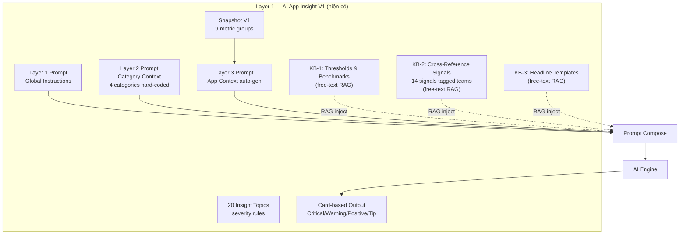
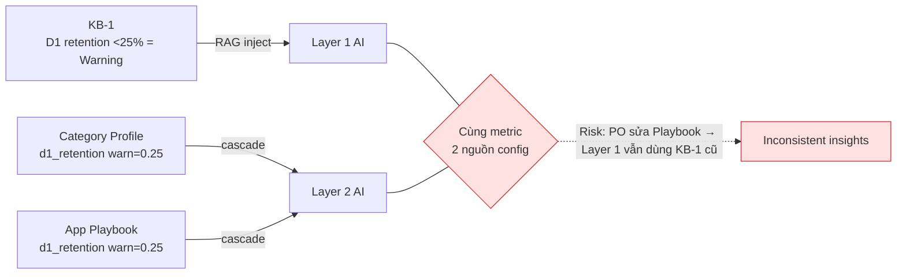
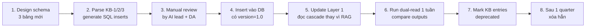

# Nexus AI — Layer 1 ↔ Layer 2 Consolidation Analysis
## Phân tích trùng lặp giữa AI App Insight V1 và Specialized Agents V2

> **Phiên bản:** v1.0
> **Ngày:** 2026-04-29
> **Mục đích:** Trả lời câu hỏi "Layer 1 và Layer 2 có trùng lặp không?" — Có. Document này liệt kê **5 vùng overlap chính**, đề xuất cascade resolution model, và migration plan để 2 layer dùng chung **Single Source of Truth**.
>
> **Liên quan:**
> - [00 - App_Insight_V1_Complete_Structure.md](./00%20-%20App_Insight_V1_Complete_Structure.md) — Layer 1 hiện trạng
> - [10 - Nexus_AI_Specialized_Agents_Upgrade_Plan.md](./10%20-%20Nexus_AI_Specialized_Agents_Upgrade_Plan.md) — Layer 2 design
> - [04 - Amobear_Nexus_AI_Insight_Template_Config.md](./04%20-%20Amobear_Nexus_AI_Insight_Template_Config.md) — Template + KB hiện có

---

## TL;DR

| Câu hỏi | Trả lời |
|---------|---------|
| Có trùng lặp không? | **Có**, ở 5 vùng (Thresholds KB-1, Cross-Signals KB-2, Category Prompts, Insight Topics, Severity Templates). |
| Vấn đề chính? | KB-1/KB-2 hiện ở dạng **free-text** trong RAG. Layer 2 đang định nghĩa **structured YAML**. Sửa threshold 1 nơi, không đồng bộ nơi khác. |
| Giải pháp? | **Cascade Resolution Model**: Global Defaults → Category Profile → App Playbook. Migrate KB-1/KB-2 free-text sang structured tables. |
| Layer 1 có bị xóa không? | **Không.** Layer 1 vẫn giữ vai trò Summary cho BOD. Chỉ thay đổi **nguồn đọc threshold/rules** (từ KB free-text → structured cascade). |
| Effort? | ~5 ngày trong Sprint 1 (đã có trong roadmap doc 10) — thêm 3 bảng + migration script + update Layer 1 codepath. |

---

## 1. Layer 1 hiện trạng (đọc lại từ doc 00)

AI App Insight V1 đang có:



**Đặc biệt quan trọng:** KB-1, KB-2, KB-3 đang nằm trong table `ai_knowledge_base` ở dạng **free-text content** với `category=Rules`, được search qua hybrid (keyword + vector) và inject vào prompt.

---

## 2. Overlap Matrix — 5 vùng trùng lặp

| # | Layer 1 (V1) | Layer 2 (V2 đang xây) | Loại overlap | Mức độ nghiêm trọng |
|---|---|---|---|---|
| 1 | **KB-1 Thresholds** (revenue, fill, retention, UA ROI, subscription, crash...) | App Playbook `kpi_overrides` + Category Profile `kpi_catalog` | **DUPLICATE** | 🔴 High — sửa 1 nơi không đồng bộ |
| 2 | **KB-2 Cross-Signal Rules** (14 signals đã tag team) | Playbook `handoff_matrix` + Cross-Agent §13 | **DUPLICATE** | 🔴 High |
| 3 | **Layer 2 Category Prompts** (4 categories: creative_utility, ai_chat, puzzle_game, generic) | Category Profile YAML (10 categories) | **EXTEND** (V2 superset của V1) | 🟡 Medium — cần migrate |
| 4 | **20 Insight Topics** trong V1 | Persona-specific deep-dive reports | **SUMMARY vs DEEP-DIVE** | 🟢 Low — bổ sung, không trùng |
| 5 | **KB-3 Headline + Severity templates** | Persona reports cũng dùng severity | **SHARED** | 🟢 Low — chỉ cần centralize |

---

## 3. Phân tích chi tiết từng vùng overlap

### 3.1 ⚠️ KB-1 Thresholds vs `kpi_overrides` / `kpi_catalog` (DUPLICATE — High severity)

**Layer 1 (doc 00 §4 KB-1):**

```
REVENUE: tăng >15% vs 7d → Positive | giảm >15% → Warning | giảm >25% → Critical
FILL RATE: >90% Excellent | 85-90% Good | 80-85% Warning | <80% Critical
RETENTION D1: >40% Excellent | 30-40% Good | 25-30% Acceptable | <25% Warning | <20% Critical
UA/ROI: >1.5 Positive | 1.0-1.5 Acceptable | 0.5-1.0 Warning | <0.5 Critical
SUBSCRIPTION: trial-to-paid <10% Warning | <5% Critical | churn >8% Critical
APP STABILITY: crash-free <99% Critical | ANR >0.5% Warning
ATTRIBUTION: organic <30% Warning | <20% Critical
... (free-text trong KB)
```

**Layer 2 (doc 10 §3.2 + §4.2):**

```yaml
# Category Profile
kpi_catalog:
  - { id: stuck_level_pct, target_max: 0.25, severity_warn: 0.30, severity_crit: 0.40 }
  - { id: tutorial_completion, target: 0.75, severity_warn: 0.6, severity_crit: 0.5 }

# App Playbook
kpi_overrides:
  drawing_rate: { target: 0.45, severity_warn: 0.35, severity_crit: 0.30 }
  d1_retention: { target: 0.32, severity_warn: 0.25 }
```

**Vấn đề cụ thể:**



**Hậu quả thực tế:**
- PO sửa Playbook nâng `d1_retention.warn = 0.30` cho app cao cấp → **Layer 2 (PO Engine) hiểu**, **Layer 1 (App Insight) KHÔNG hiểu** vì vẫn đọc KB-1 free-text 0.25.
- BOD đọc App Insight thấy "D1 27% — Acceptable", PO đọc PO Report thấy "D1 27% — Warning". Mâu thuẫn message.

**Số lượng threshold trùng:** đếm sơ trong KB-1: **~35 thresholds** đang là free-text, sẽ trùng với `kpi_catalog` của 10 category × ~5-8 KPI.

---

### 3.2 ⚠️ KB-2 Cross-Signal Rules vs `handoff_matrix` (DUPLICATE — High severity)

**Layer 1 (doc 00 §4 KB-2):** 14 cross-signal rules đã tag team:

```
SIGNAL 1: Rev↑ + Fill↓ → Action: [Mediation] | Severity: Warning
SIGNAL 4: D1↓ + New Users↑ → Action: [UA] | Severity: Warning
SIGNAL 7: ROI<0.5 → Action: [BOD][UA] | Severity: Critical
SIGNAL 12: Crash spike + Version mới → Action: [Dev] | Severity: Critical
... (14 rules total)
```

**Layer 2 (doc 10 §13.2):**

```yaml
handoff_matrix:
  - { trigger: "fill_rate_drop_>5pct", primary: mediation, copy: [ua_marketing] }
  - { trigger: "crash_spike_post_release", primary: devops, copy: [qa, product_owner] }
  - { trigger: "roas_drop_>15pct", primary: ua_marketing, copy: [product_owner] }
```

**Vấn đề:**
- KB-2 14 rules đã có sẵn — đang ở free-text RAG.
- Layer 2 propose `handoff_matrix` mới — đang là YAML structured.
- 2 hệ thống cùng route signal về team, nhưng **không cùng định nghĩa**.

**Ví dụ mâu thuẫn:**

| Signal | KB-2 (Layer 1) | handoff_matrix (Layer 2) |
|--------|----------------|---------------------------|
| Crash spike | tag `[Dev]` | primary `devops`, copy `[qa, product_owner]` |
| ROI < 0.5 | tag `[BOD][UA]` | (chưa có trong handoff_matrix) |
| Rev↑ + Fill↓ | tag `[Mediation]` | trigger `fill_rate_drop` route mediation |

→ KB-2 mạnh hơn vì có 14 rules; handoff_matrix mới chỉ có ~10 rules.
→ Cần **merge** chứ không tạo lại.

---

### 3.3 🟡 Category Layer 2 Prompts vs Category Profile (EXTEND — Medium severity)

**Layer 1 (doc 00 §3 Layer 2):** 4 category prompts hard-coded trong code/DB:

```
2a. Creative Utility (AR Tracer, Photo Editor)
2b. AI Chat (Love AI, Chat Bot)
2c. Puzzle Game
2d. Generic
```

Mỗi prompt có: Core Loop, Monetization, KPI #1, KPI Targets, Insight Priority, Severity Overrides.

**Layer 2 (doc 10 §3):** 10 Category Profiles YAML:

```
creative_utility, ai_chat, productivity, subscription_content, shopping_ecom,
casual_game, hyper_casual, midcore_game, simulation, card_casino
```

Schema giàu hơn: kpi_catalog, analysis_scenarios, default_skills, glossary.

**Đây không hoàn toàn duplicate — V2 là superset của V1.** Nhưng nếu deploy V2 mà không migrate V1:
- App Insight V1 vẫn dùng 4 prompt hard-code
- Specialized Agents dùng 10 Category Profile
- App `creative_utility` lỡ sửa Category Profile → V1 không update

→ **Phải migrate**: 4 categories V1 chuyển vào Category Profile V2 (giữ nguyên content + bổ sung schema mới).

---

### 3.4 🟢 Insight Topics V1 (20 topics) vs Persona Deep-Dive (LOW — không phải duplicate)

**Layer 1 (doc 00 §2.2):** 20 Insight Topics:

```
1. Revenue Trend       11. Core Loop
2. Fill Rate Health    12. UA ROI
3. eCPM Trend          13. UA Spend by Channel
4. Ad Concentration    14. Revenue vs UA Cost
5. Top Ad Units        15. Pipeline Health
6. DAU/DAV Trend       16. IAP Funnel
7. Ad Penetration      17. Subscription Health
8. Session Quality     18. MRR & Revenue Mix
9. Retention D1/D7     19. Crash & Stability
10. Onboarding Comp    20. Attribution Quality
```

**Layer 2 (doc 10 §5-§11):** Persona-specific reports:

- AI Mediation deep-dive: topic 2/3/4/5
- AI DevOps deep-dive: topic 19
- AI PO deep-dive: topic 9/10/11/16/17
- AI UA deep-dive: topic 12/13/14/20
- AI BOD aggregate cross-app

**Đây KHÔNG phải duplicate — đây là Summary vs Deep-Dive:**

| Topic | Layer 1 (Summary) | Layer 2 (Deep-Dive) |
|-------|-------------------|----------------------|
| Fill Rate | "Fill 82% — Warning" (1 card, 5s đọc) | Mediation report: waterfall breakdown, root cause "AdMob bidding shift JP", recommendation "add Liftoff", expected eCPM uplift 8-12% |
| Crash | "Crash-free 98.4% — Critical" (1 card) | DevOps report: top stack signature, affected devices, linked release, hotfix priority list |

**Tuy nhiên có 1 vấn đề nhỏ:** cùng metric "Fill 82%" có thể được tính 2 nơi → cần consistency. Giải pháp: Snapshot V2 = superset của V1 (V1 fields + thêm persona-specific slices). Layer 1 và Layer 2 cùng đọc Snapshot V2.

---

### 3.5 🟢 Severity Templates (SHARED — Low severity)

KB-3 Headline Templates (Surges, Drops, Collapses, Holds Steady...) và Severity (Critical/Warning/Positive/Tip) — Layer 2 cũng dùng.

**Đây là SHARED, không duplicate.** Centralize trong cùng table thay vì copy.

---

## 4. Đề xuất kiến trúc — Cascade Resolution Model

### 4.1 Single Source of Truth

```mermaid
flowchart TB
    GD[("ai_global_kpi_defaults<br/>(migrate từ KB-1)")]
    CSR[("ai_cross_signal_rules<br/>(migrate từ KB-2)")]
    ST[("ai_severity_templates<br/>(migrate từ KB-3)")]

    Cat[("ai_category_profiles<br/>10 categories<br/>chứa OVERRIDE so với defaults")]
    PB[("ai_app_playbooks<br/>500+ apps<br/>chứa OVERRIDE so với category")]

    Resolver[Config Resolver<br/>cascade merge]
    Cache[(Effective Config Cache<br/>15m TTL)]

    GD -->|fallback layer 1| Resolver
    Cat -->|override layer 2| Resolver
    PB -->|override layer 3| Resolver
    CSR --> Resolver
    ST --> Resolver

    Resolver --> Cache

    Cache --> L1[AI App Insight V1<br/>(Layer 1 — Summary)]
    Cache --> L2[7 Specialized Agents<br/>(Layer 2 — Deep-Dive)]

    classDef structured fill:#dcfce7,stroke:#16a34a
    classDef consumer fill:#dbeafe,stroke:#2563eb
    class GD,CSR,ST,Cat,PB structured
    class L1,L2 consumer
```

### 4.2 Bảng cần thêm/migrate

| Bảng mới | Nguồn migration | Ví dụ row |
|----------|-----------------|-----------|
| `ai_global_kpi_defaults` | KB-1 free-text | `(d1_retention, target=0.25, warn=0.25, crit=0.20)` |
| `ai_cross_signal_rules` | KB-2 14 rules | `(id=S1, trigger="rev_up_fill_down", primary=mediation, copy=[], severity=warning)` |
| `ai_severity_templates` | KB-3 templates | `(critical, verbs=["Collapses","Plummets"], color=red)` |

**Bảng đã có trong doc 10 (§16.2):**

| Bảng | Vai trò sau refactor |
|------|----------------------|
| `ai_category_profiles` | Chỉ chứa **overrides** so với global defaults |
| `ai_app_playbooks` | Chỉ chứa **overrides** so với category |
| `ai_knowledge_base` | Giữ — nhưng KB-1/KB-2/KB-3 entries chuyển status `deprecated` (sau 1 quarter xóa) |

### 4.3 RAG vẫn hoạt động — đúng mục đích của nó

**RAG GIỮ LẠI cho:**
- ✅ Schema docs (doc 115 chunks) — natural language explanation
- ✅ PRD chunks
- ✅ Past A/B experiment results
- ✅ Network playbooks (TikTok bidding spec, Google Ads docs...)
- ✅ Changelog free-text
- ✅ Runbooks, troubleshooting guides

**RAG KHÔNG dùng cho:**
- ❌ Threshold values (cần structured + versioned)
- ❌ Signal routing rules (cần evaluate được runtime)
- ❌ Severity tiers (cần lookup nhanh)

→ RAG cho **kiến thức tự nhiên ngôn ngữ**, structured tables cho **rules + thresholds**.

---

## 5. Migration Plan (chèn vào Sprint 1)

### 5.1 Effort estimate

| Task | Effort | Owner |
|------|--------|-------|
| Schema design 3 bảng mới | 0.5 ngày | BE-1 |
| Migration script: parse KB-1 free-text → rows | 1.5 ngày | BE-1 (cần regex + manual review) |
| Migration script: parse KB-2 → rows | 0.5 ngày | BE-1 (rule cấu trúc đơn giản hơn) |
| Migration script: parse KB-3 → rows | 0.5 ngày | BE-1 |
| Update Layer 1 codepath đọc cascade | 1 ngày | BE-2 |
| Update Layer 2 codepath đọc cascade | 0.5 ngày | BE-2 (mới design — không tốn) |
| Test: golden snapshot V1 sau migration KHÔNG đổi output | 1 ngày | QA |
| **Tổng** | **~5.5 ngày** | Bao gồm trong Sprint 1 (3 tuần) |

### 5.2 Migration steps



### 5.3 Rollback plan

- KB free-text giữ trong DB với flag `deprecated` — không xóa luôn.
- Code có feature flag `use_cascade_resolver=true` — set false nếu issue.
- Golden test snapshot: trước migration vs sau migration, output Layer 1 phải giống nhau ≥ 99%.

---

## 6. Tác động lên các tài liệu hiện có

### 6.1 Doc 00 (Layer 1 V1) — không xóa

- Vẫn là tài liệu reference cho Layer 1 functionality.
- Thêm note đầu doc: "KB-1/KB-2/KB-3 đã migrate sang structured tables — xem doc 14".

### 6.2 Doc 10 (Master plan) — cập nhật nhỏ

Cần update các điểm sau:

1. **§16.2 Database Migrations** — thêm 3 bảng:
   - `ai_global_kpi_defaults`
   - `ai_cross_signal_rules`
   - `ai_severity_templates`
2. **§4.2 App Playbook schema** — thêm note:
   ```yaml
   # Lưu ý: kpi_overrides chỉ cần điền khi KHÁC global default.
   # Nếu để trống, hệ thống dùng cascade: Category > Global Defaults.
   ```
3. **§13.2 Handoff Matrix** — thêm note:
   ```yaml
   # Default 14 rules từ ai_cross_signal_rules (migrate từ KB-2 V1).
   # Playbook chỉ override khi cần custom cho app.
   ```
4. **§18 Roadmap Sprint 1** — thêm task:
   - "5.5 ngày: Migrate KB-1/KB-2/KB-3 free-text → structured tables"
5. **§22 Decisions** — thêm 2 decision:
   - "20. KB free-text deprecation timeline — 1 quarter sau migration đủ chưa?"
   - "21. Có dual-read (KB + cascade) trong 1 tuần để verify không?"

### 6.3 Doc 13 (Sample data) — bổ sung

Thêm 1 sample data file: `global-kpi-defaults.yaml`:

```yaml
# File: frontend/mock-data/global-kpi-defaults.yaml
# Migrate từ KB-1 — global defaults mọi app dùng nếu không có override

defaults:
  # Revenue
  - { metric: revenue_vs_7d_pct, severity_positive: 0.15, severity_warn: -0.15, severity_crit: -0.25 }

  # Fill Rate
  - { metric: fill_rate, severity_positive: 0.90, severity_warn: 0.85, severity_crit: 0.80 }

  # Retention
  - { metric: d1_retention, target: 0.30, severity_warn: 0.25, severity_crit: 0.20 }
  - { metric: d7_retention, target: 0.12, severity_warn: 0.10, severity_crit: 0.08 }

  # UA / ROI
  - { metric: roi, target: 1.5, severity_warn: 1.0, severity_crit: 0.5 }

  # Subscription
  - { metric: trial_to_paid_rate, target: 0.15, severity_warn: 0.10, severity_crit: 0.05 }
  - { metric: monthly_churn, target_max: 0.05, severity_warn: 0.08, severity_crit: 0.10 }

  # App Stability
  - { metric: crash_free_rate, target: 0.998, severity_warn: 0.995, severity_crit: 0.99 }
  - { metric: anr_rate, target_max: 0.002, severity_warn: 0.005, severity_crit: 0.01 }

  # Attribution
  - { metric: organic_pct, target: 0.40, severity_warn: 0.30, severity_crit: 0.20 }

  # Engagement
  - { metric: sessions_per_user, target: 2.5, severity_warn: 1.5 }
  - { metric: ad_penetration, target: 0.80, severity_warn: 0.60 }
```

```yaml
# File: frontend/mock-data/cross-signal-rules.yaml
# Migrate từ KB-2 — 14 default cross-signal rules

rules:
  - id: S1
    label: "Revenue Up + Fill Rate Down"
    trigger:
      - { metric: revenue_dod, op: ">", value: 0 }
      - { metric: fill_rate_dod, op: "<", value: 0 }
    primary_persona: mediation
    copy_personas: []
    severity: warning
    insight_template: "Revenue tăng nhờ volume/eCPM bù, nhưng fill giảm = fragile growth"

  - id: S4
    label: "D1 Down + New Users Up"
    trigger:
      - { metric: d1_retention_trend, op: "<", value: 0 }
      - { metric: new_users_trend, op: ">", value: 0 }
    primary_persona: ua_marketing
    copy_personas: []
    severity: warning
    insight_template: "UA đang mang về low-quality users"

  - id: S7
    label: "ROI < 0.5"
    trigger:
      - { metric: roi, op: "<", value: 0.5 }
    primary_persona: bod
    copy_personas: [ua_marketing]
    severity: critical
    insight_template: "App đang đốt tiền, UA chưa tự hoàn vốn"

  - id: S12
    label: "Crash Spike + New Version"
    trigger:
      - { metric: crash_rate_spike, op: ">", value: 0.30 }
      - { metric: version_changed_24h, op: "==", value: true }
    primary_persona: devops
    copy_personas: [qa, product_owner]
    severity: critical
    insight_template: "Version X gây crash regression"

  # ... (14 rules total — all from KB-2)
```

---

## 7. Kết luận

**Trả lời câu hỏi của bạn:**

> *"Liên hệ với tính năng đang xây dựng này có đang bị trùng lặp gì không vì tôi thấy cũng đang có các ngưỡng của từng Roles được thiết lập"*

**Có, trùng lặp ở 5 vùng — nghiêm trọng nhất là:**

1. **Thresholds (KB-1):** Layer 1 đọc free-text, Layer 2 đọc structured YAML — sửa 1 nơi không đồng bộ. **Đây chính xác là cái bạn nhận thấy.**
2. **Cross-signal rules (KB-2):** 14 rules cũ + handoff_matrix mới — overlap.

**Không phải trùng lặp:**

3. **Insight Topics (20 topics) vs Persona Deep-Dive:** Summary vs Deep-Dive — bổ sung lẫn nhau.
4. **Severity templates:** SHARED — cần centralize chứ không tạo lại.
5. **Category prompts:** V2 là superset của V1 — chỉ cần migrate.

**Hành động khuyến nghị:**

| Khi nào | Làm gì |
|---------|--------|
| **Trước khi code Sprint 1** | Approve cascade model + 3 bảng mới |
| **Sprint 1 (tuần 1-3 đã có)** | Thêm 5.5 ngày migration KB → structured tables |
| **Sprint 1 cuối** | Dual-read 1 tuần, verify Layer 1 output không đổi |
| **Sau Sprint 1** | Layer 2 build trên cùng nguồn config — không có rủi ro inconsistency |
| **+1 quarter** | Xóa hẳn KB-1/KB-2/KB-3 deprecated entries |

**Lợi ích sau khi consolidate:**
- ✅ PO sửa threshold 1 nơi → cả Layer 1 + Layer 2 đồng bộ
- ✅ Versioned + audit trail
- ✅ Per-app override không cần code change
- ✅ Eval golden test có ground truth từ 1 nơi
- ✅ Frontend Admin UI thống nhất (sửa Playbook là sửa cho cả 2 layer)

**Bạn cần quyết định:**

| # | Quyết định | Default đề xuất |
|---|------------|-----------------|
| 1 | Approve cascade model? | Yes |
| 2 | Migration timing? | Sprint 1 (cùng lúc với foundation) |
| 3 | Dual-read window? | 1 tuần |
| 4 | KB deprecation timeline? | 1 quarter sau migration |
| 5 | Owner migration script? | BE-1 (Senior, owner foundation) |

Sau khi bạn duyệt, tôi sẽ cập nhật doc 10 (master plan) các điểm §16.2, §4.2, §13.2, §18, §22 để đồng bộ với consolidation này.
