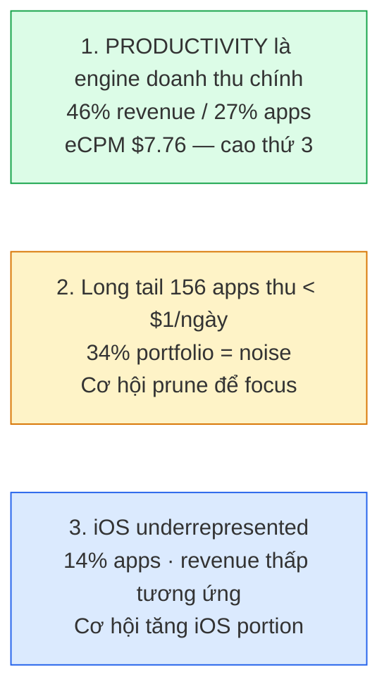
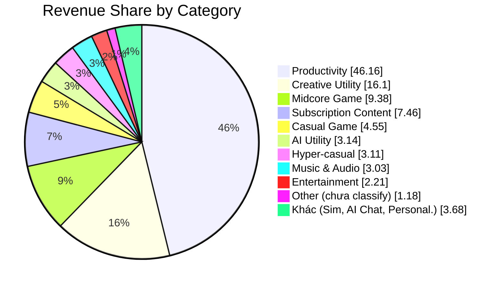
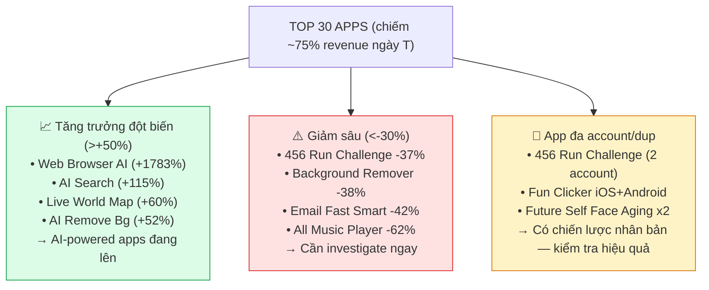
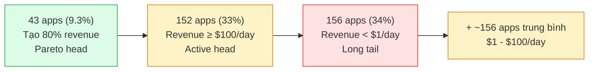
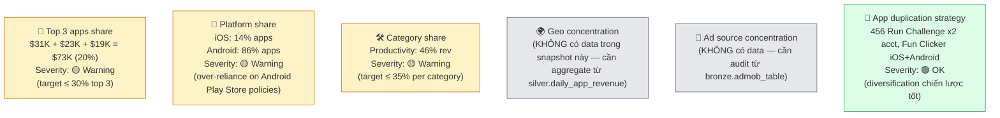
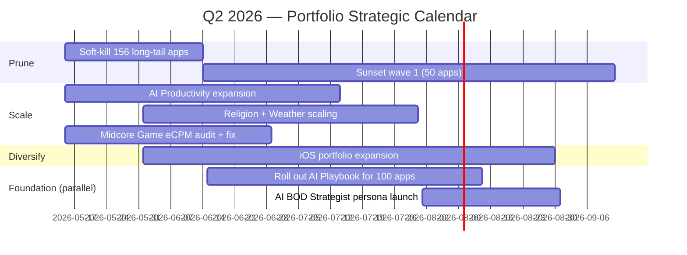

# Amobear Portfolio Overview — BOD Snapshot
## Phân loại 464 apps · Doanh thu hôm nay · Strategic positioning

> **Phiên bản:** v1.0
> **Ngày data snapshot:** 2026-05-05 (apps.json export)
> **Phương pháp:** Auto-classify từ `displayName` + `appStoreId` qua heuristic rules (xem [phụ lục B](#phụ-lục-b--methodology--reproducibility))
> **Mục đích:** Cho BOD bức tranh tổng thể portfolio — phục vụ Q2 2026 strategic review + làm baseline cho **AI BOD Strategist** (xem [doc 10 §11](./10%20-%20Nexus_AI_Specialized_Agents_Upgrade_Plan.md#11-ai-bod--portfolio-strategist)).
>
> **Disclaimer:**
> - Số liệu chỉ là **doanh thu IAA hôm nay** (snapshot 1 ngày từ AdMob). Chưa bao gồm IAP, subscription (QOn), UA cost, margin.
> - Để có view đầy đủ (LTV, ROAS, P&L) → cần aggregate từ `gold.fact_daily_app_metrics` qua time window dài hơn (week/month) + UA data từ XMP + IAP từ QOn/Firebase.
> - Classification dựa trên app name → sai số ~1-3% (apps có name mơ hồ rơi vào "other").

---

## Mục lục

1. [Executive Summary](#1-executive-summary)
2. [Portfolio Composition (13 categories)](#2-portfolio-composition)
3. [Top 30 Apps theo Revenue](#3-top-30-apps-theo-revenue)
4. [Pareto & Long-tail Analysis](#4-pareto--long-tail-analysis)
5. [Per-Category Deep-Dive](#5-per-category-deep-dive)
6. [Risk Concentration](#6-risk-concentration)
7. [Strategic Recommendations cho BOD](#7-strategic-recommendations-cho-bod)
8. [Liên kết với AI BOD Strategist Persona](#8-liên-kết-với-ai-bod-strategist-persona)
9. [Phụ lục](#phụ-lục)

---

## 1. Executive Summary

### 1.1 Snapshot tổng thể (1 ngày)

| Chỉ số | Giá trị | Ghi chú |
|--------|--------:|---------|
| **Tổng số apps** | **464** | iOS: 64 (14%) · Android: 400 (86%) |
| **Doanh thu ngày T** | **$366,927** | IAA only — chưa gồm IAP/Sub |
| **Tổng impressions** | **119.6M** | |
| **Blended eCPM** | **$3.07** | Doanh thu / Impressions × 1000 |
| **Số category đang vận hành** | **12** | + 1 nhóm `other` chưa phân loại được |
| **Apps tạo 80% doanh thu (Pareto)** | **43 apps** | Còn 421 apps tạo 20% còn lại |
| **Apps doanh thu ≥ $100/ngày (Head)** | **152 apps** (33%) | |
| **Apps doanh thu < $1/ngày (Long tail)** | **156 apps** (34%) | Đa số nên kill / sunset |
| **Phụ thuộc Android** | **86%** apps · ~95%+ revenue | iOS chỉ 14% apps |

### 1.2 3 nhận định chiến lược



---

## 2. Portfolio Composition

### 2.1 Bảng tổng hợp 13 categories (sort by revenue)

| # | Category | Apps | iOS | Android | Revenue/day | Share % | Impressions | Avg eCPM | Pattern |
|---|----------|-----:|----:|--------:|------------:|--------:|------------:|---------:|---------|
| 1 | 🛠️ **Productivity** | 126 | 9 | 117 | **$169,384** | **46.16%** | 43.4M | $7.76 | 💰 Cash engine |
| 2 | 🎨 **Creative Utility** | 49 | 7 | 42 | $59,059 | 16.10% | 13.5M | $4.82 | 💎 High-value |
| 3 | 🎮 **Midcore Game** | 19 | 4 | 15 | $34,435 | 9.38% | 35.4M | $1.82 | ⚠️ Low eCPM |
| 4 | 📚 **Subscription Content** | 37 | 6 | 31 | $27,377 | 7.46% | 3.6M | $8.67 | 💎 Highest eCPM |
| 5 | 🧩 **Casual Game** | 31 | 8 | 23 | $16,692 | 4.55% | 6.1M | $4.93 | Steady |
| 6 | 🤖 **AI Utility** | 28 | 4 | 24 | $11,503 | 3.14% | 3.2M | $8.03 | 📈 Growing |
| 7 | 🏃 **Hyper-casual** | 9 | 1 | 8 | $11,421 | 3.11% | 2.3M | $3.62 | Concentrated |
| 8 | 🎵 **Music & Audio** | 15 | 2 | 13 | $11,122 | 3.03% | 3.5M | $4.53 | Niche |
| 9 | 🎬 **Entertainment** | 23 | 2 | 21 | $8,110 | 2.21% | 2.4M | $3.60 | Emerging |
| 10 | 🏗️ **Simulation** | 6 | 1 | 5 | $6,178 | 1.68% | 3.2M | $2.61 | Few apps |
| 11 | 💬 **AI Chat** | 10 | 1 | 9 | $4,504 | 1.23% | 1.3M | $6.99 | 📈 Watch |
| 12 | ❓ Other (chưa phân loại) | 93 | 19 | 74 | $4,336 | 1.18% | 0.7M | $5.19 | Cần manual review |
| 13 | 🎨 **Personalization** | 18 | 0 | 18 | $2,808 | 0.77% | 1.0M | $2.47 | Low value |

### 2.2 Visualize — Category Share



### 2.3 Insight nhanh từ Composition

| Insight | Số liệu | Ý nghĩa cho BOD |
|---------|---------|------------------|
| **Productivity dẫn đầu cả số lượng & doanh thu** | 126 apps · 46% rev · eCPM $7.76 | Đây là lõi cash flow — cần bảo vệ và tối ưu thêm. KHÔNG nên bỏ qua dù nó không "sexy" |
| **Subscription Content có eCPM cao nhất ($8.67)** | 37 apps · 7.46% rev | Audience monetize tốt — cơ hội scale (VPN, news, religion, health) |
| **Midcore Game eCPM thấp nhất ($1.82)** | 19 apps · 9.38% rev nhưng 35M imp | Volume-based — đốt nhiều impression cho ít tiền. Cần audit ad placement + UA quality |
| **AI Utility & AI Chat đang nổi** | 38 apps tổng · eCPM $7-8 | Trend mới — đầu tư phù hợp nhưng phải chọn lọc, tránh build "AI cho có" |
| **Personalization chỉ $0.77% revenue** | 18 apps · eCPM $2.47 | Category yếu nhất — cân nhắc kill hoặc tích hợp vào Productivity |

---

## 3. Top 30 Apps theo Revenue

| # | App | Platform | Category | Revenue | Δ vs T-1 | eCPM | Fill |
|---:|-----|----------|----------|--------:|---------:|-----:|-----:|
| 1 | Video Player: Stream, Save MP4 | Android | Productivity | **$31,052** | -24.2% | $8.71 | 94% |
| 2 | Face changer: Future self | Android | Creative Utility | $22,721 | -8.5% | $6.04 | 56% |
| 3 | Email - Fastest Mail for Gmail & more | Android | Productivity | $18,813 | -4.3% | $6.51 | 74% |
| 4 | Private Browser: Safe & Secure | Android | Productivity | $16,043 | +4.0% | $6.13 | 94% |
| 5 | Mobile Phone Speaker Cleaner | Android | Productivity | $13,907 | -21.8% | $2.21 | 89% |
| 6 | 456 Run Challenge: Clash 3D | Android | Midcore Game | $13,857 | -37.3% | — | — |
| 7 | Live World Map: Satellite View | Android | Productivity | $11,326 | **+60.3%** | — | — |
| 8 | Photo Recovery | Android | Productivity | $11,138 | -20.1% | — | — |
| 9 | Background & Object Remover | Android | Creative Utility | $8,675 | -38.3% | — | — |
| 10 | Weather timeline & graphs/radar | Android | Subscription Content | $8,189 | +21.4% | — | — |
| 11 | 456 Run Challenge: Clash 3D (acct B) | Android | Midcore Game | $7,679 | -4.1% | — | — |
| 12 | **AR Tracer: Trace Drawing** | **iOS** | Creative Utility | $7,271 | -22.3% | — | — |
| 13 | PDF Viewer & Document Scanner | Android | Productivity | $6,995 | -18.5% | — | — |
| 14 | Holy Quran - Deeper journey | Android | Subscription Content | $6,962 | -5.8% | — | — |
| 15 | WiFinder: Wifi Location Map | Android | Productivity | $6,006 | -6.2% | — | — |
| 16 | AI Search: Smart Web Browser | Android | Productivity | $5,591 | **+115.3%** | — | — |
| 17 | Web Browser Powered By AI | Android | Productivity | $5,579 | **+1783.2%** | — | — |
| 18 | Photo Enhancer: Object Remover | Android | Creative Utility | $5,438 | +5.2% | — | — |
| 19 | Compass360: Smart Compass tool | Android | Subscription Content | $5,206 | +10.7% | — | — |
| 20 | AI Remove: Background Eraser | Android | Creative Utility | $5,100 | **+52.1%** | — | — |
| 21 | Avn Email Online - Mailbox Client | Android | Productivity | $4,785 | -23.8% | — | — |
| 22 | Email - Fast and Smart Mail | Android | Productivity | $4,614 | -41.9% | — | — |
| 23 | Fun Clicker | iOS | Hyper-casual | $4,342 | +1.7% | — | — |
| 24 | All Music Player & Equalizer | Android | Music & Audio | $4,340 | -61.5% | — | — |
| 25 | Supermarket Tycoon 3D | iOS | Simulation | $4,177 | -17.2% | — | — |
| 26 | Fun Clicker (Android dup) | Android | Hyper-casual | $4,135 | -21.3% | — | — |
| 27 | Fishing Mega Battle | Android | Midcore Game | $3,958 | -8.8% | — | — |
| 28 | Wool Arrow: Escape Puzzle | Android | Casual Game | $3,772 | +13.4% | — | — |
| 29 | Music Downloader: Stream, Save | Android | Music & Audio | $3,602 | -7.5% | — | — |
| 30 | Weather Radar Map Live | Android | Subscription Content | $3,426 | -8.8% | — | — |

### 3.1 Phát hiện quan trọng từ Top 30



---

## 4. Pareto & Long-tail Analysis

### 4.1 Phân bố doanh thu



### 4.2 Số liệu Pareto

| Tier | # Apps | Revenue tier | Action chiến lược |
|------|-------:|--------------|--------------------|
| **🏆 S-Tier (Top 43)** | 43 (9.3%) | ~$293K (80% portfolio) | **Bảo vệ + Scale** — tăng 10-20% UA cho top performer |
| **🟢 A-Tier ($1K-10K/day)** | ~50 | ~$45K (12%) | **Maintain + Optimize** — lookalike strategy |
| **🟡 B-Tier ($100-1K/day)** | ~60 | ~$25K (7%) | **Watch list** — cohort review hàng tuần |
| **🟠 C-Tier ($1-100/day)** | ~155 | ~$3K (1%) | **Salvage hoặc Sunset** — chỉ giữ nếu có potential |
| **🔴 Tail (<$1/day)** | 156 (34%) | ~$0.1K (<1%) | **Soft-kill** — stop UA, milk organic, sunset 6 months |

> **Insight cho BOD:** Soft-kill 156 long-tail apps có thể giải phóng ~5-10 engineers + giảm operational overhead AdMob/Mediation/Firebase. ROI: rất cao vì revenue mất < $1K/day nhưng tiết kiệm $30-50K cost/quarter.

---

## 5. Per-Category Deep-Dive

### 5.1 🛠️ Productivity (126 apps · 46% revenue)

**Top 5 apps:**
1. Video Player: Stream, Save MP4 — $31,052
2. Email - Fastest Mail for Gmail — $18,813
3. Private Browser: Safe & Secure — $16,043
4. Mobile Phone Speaker Cleaner — $13,907
5. Live World Map: Satellite View — $11,326

**Sub-segments quan sát được:**
- 📥 **Video downloader / Player / Saver** (~20+ apps) — cash cow lớn nhất
- 📧 **Email clients** (~10 apps) — high concurrency
- 🌐 **Browser apps** (private/AI/secure) (~15 apps) — đang scale với AI variant
- 🧹 **Phone cleaner / Battery saver** (~10 apps) — utility tools, retention thấp
- 📷 **Photo/File/Data Recovery** (~5 apps) — niche, retention cao
- 🗺️ **Map / WiFi tools** (~10 apps) — emerging
- 📞 **Caller ID / Spam blocker** (~5 apps)
- 📄 **PDF / Scanner / Document** (~5 apps)

**Đánh giá:** Đây là **core engine** của Amobear. Cần:
- ✅ Đầu tư thêm Product team chuyên về tools utility
- ✅ AI variant (AI Search Browser, AI Email) có signal tốt → scale strategy
- ⚠️ Cluster các app trùng functionality (5-6 apps Email với same code base) → optimize portfolio

### 5.2 🎨 Creative Utility (49 apps · 16% revenue)

**Top 5:**
1. Face changer: Future self — $22,721
2. Background & Object Remover — $8,675
3. AR Tracer: Trace Drawing (iOS) — $7,271
4. Photo Enhancer: Object Remover — $5,438
5. AI Remove: Background Eraser — $5,100

**Đặc điểm:** Đa số là **AI-powered photo editing**. Face Aging + Background Remove là 2 use case mạnh nhất.

**Đánh giá:** Tăng trưởng tốt — cần playbook định nghĩa rõ funnel (onboarding + creation + share) cho từng app. Đây là category mà AR Tracer đang đứng đầu pilot AI App Insight V1.

### 5.3 🎮 Midcore Game (19 apps · 9.4% revenue)

**Top 5:**
1. 456 Run Challenge: Clash 3D — $13,857
2. 456 Run Challenge (acct B) — $7,679
3. Fishing Mega Battle — $3,958
4. Monster Evolution Run & Battle — $1,685
5. Block Master: Craft Adventure — $1,678

**🚨 Vấn đề lớn:**
- **eCPM chỉ $1.82** — thấp nhất portfolio (target ≥ $3 cho game)
- **35M impressions** chỉ ra **doanh thu $34K** (volume-driven)
- **456 Run Challenge giảm -37%** ngày qua — trend xấu

**Đánh giá:** Cần **AI Mediation deep-dive** ngay (xem [doc 10 §8](./10%20-%20Nexus_AI_Specialized_Agents_Upgrade_Plan.md#8-ai-mediation--adops-expert)) để audit waterfall. Có thể IAA setup chưa tối ưu cho game (rewarded video frequency, floor price).

### 5.4 📚 Subscription Content (37 apps · 7.5% revenue, eCPM cao nhất $8.67)

**Top 5:**
1. Weather timeline & graphs/radar — $8,189
2. Holy Quran - Deeper journey — $6,962
3. Compass360: Smart Compass — $5,206
4. Weather Radar Map Live — $3,426
5. (others — VPN, prayer apps)

**Sub-segments:**
- 🌤️ **Weather** (~5-7 apps) — strong eCPM
- 🕌 **Religion** (Quran/Coran/Bible) (~6 apps) — high LTV audience
- 🧭 **Compass / Quiet utility tools** (~5 apps)
- 🌐 **VPN / Proxy** (~3 apps)
- 💪 **Health / Fitness** (~5 apps)

**Đánh giá:** **Highest eCPM category** ($8.67) — audience monetize tốt. Cơ hội:
- Scale Religion vertical (Quran, Bible, Prayer) — JP/SEA market
- Weather có competitive moat thấp nhưng eCPM tốt → portfolio play

### 5.5 🤖 AI Utility + AI Chat (38 apps · 4.4% revenue)

**Top AI Utility:**
1. (Web Browser AI / AI Search — đã ở productivity)
2. HomeMagic: AI Interior Design — $1,740
3. FacePlus: AI Face Editor — $702
4. Plant identifier apps — emerging

**Top AI Chat:** ~10 apps, total $4,504/day (small but eCPM $7)

**Đánh giá:** **Trend đang lên rõ** — AI Search Browser tăng +1783% (extreme outlier), AI Remove Bg +52%. Strategy:
- ✅ Đầu tư R&D AI features vào Productivity & Creative apps (đã có pattern thành công)
- ⚠️ KHÔNG build "AI Chat" riêng vì market saturated (Character.AI, Replika)
- 💡 Có thể explore "AI Personal Assistant" niche cho specific verticals (cooking, fitness, finance)

### 5.6 🧩 Casual Game (31 apps · 4.5%)

Mix dạng Match-3, Wool Arrow, Bus Sort, Color Flow, Dress Up. Top: **Wool Arrow Escape Puzzle ($3,772)**.

**Đánh giá:** Volume cao nhưng revenue thấp — cần playbook game-specific (level fail rate, stuck level audit).

### 5.7 🏃 Hyper-casual (9 apps · 3.1%)

Heavily concentrated trên **Fun Clicker** (~$8,500 cả 2 platform). Còn lại ít.

**Đánh giá:** Nếu Fun Clicker decline → category collapse. **Risk concentration cao trong category nhỏ.**

### 5.8 🎵 Music & Audio (15 apps · 3%)

**All Music Player & Equalizer giảm -62%** → cần investigate ngay.

### 5.9 🎬 Entertainment (23 apps · 2.2%)

Short drama, Prank, Emulator. Emerging — có thể grow nếu tập trung Short Drama (TikTok-style).

### 5.10 🏗️ Simulation (6 apps · 1.7%)

Top: **Supermarket Tycoon 3D ($4,177 iOS)**.

### 5.11 🎨 Personalization (18 apps · 0.77%)

Wallpaper, charging animation, keyboard themes. **eCPM $2.47** (thấp). **Đề xuất:** đánh giá kill / merge vào Productivity.

### 5.12 ❓ Other — chưa classify được (93 apps · 1.18%)

Đa số là apps doanh thu thấp với tên mơ hồ. Cần PO manual review để add vào playbook đúng category. Việc này sẽ làm lúc rollout AI Playbook Auto-Discovery (xem [doc 10 §14](./10%20-%20Nexus_AI_Specialized_Agents_Upgrade_Plan.md#14-auto-discovery-cho-500-apps)).

---

## 6. Risk Concentration

### 6.1 Heatmap rủi ro tập trung



### 6.2 Risk gaps cần data thêm

Để hoàn thiện risk view cho BOD, cần:

| Data missing | Source | Action |
|--------------|--------|--------|
| Geo concentration (US/JP/ID/...) | `silver.daily_app_revenue` | DA team query weekly |
| Ad network share (AdMob/AppLovin/Unity...) | `bronze.admob_table` + `silver.daily_sow_analysis` | AI Mediation persona aggregate |
| UA spend breakdown | `bronze.xmp_report` + Adjust | AI UA persona aggregate |
| iOS revenue share | App Store Connect API hoặc QOn | Need integration |
| Margin / P&L per category | Internal finance | Manual input cho BOD |
| LTV / Payback per app | Adjust cohort + UA cost | AI UA persona compute |

→ Đây là input chính xác cho **AI BOD Strategist Engine** sau khi triển khai.

---

## 7. Strategic Recommendations cho BOD

### 7.1 Action priority matrix

| Priority | Action | Magnitude | Expected Impact | Owner |
|----------|--------|-----------|------------------|-------|
| 🔴 **P0** | **Soft-kill 156 long-tail apps (rev < $1/day)** | Stop UA, sunset 6mo | Save $30-50K/Q overhead, free 5-10 eng | [BOD] [Product] |
| 🔴 **P0** | **Audit Midcore Game eCPM (24M imp / $1.82)** | AI Mediation deep-dive | Tiềm năng +30-50% rev category nếu fix waterfall | [BOD] [Mediation] |
| 🔴 **P0** | **Investigate Top 30 anomalies** (Web Browser AI +1783%, All Music -62%, etc.) | Verify, pause hoặc scale | Catch attribution bug hoặc opportunity | [DA] [UA] |
| 🟡 **P1** | **Scale AI-powered Productivity** (Web Browser, Email AI) | +30% UA cho top 5 | +$5-10K/day rev tiềm năng | [BOD] [UA] [Product] |
| 🟡 **P1** | **Cluster duplicate apps** (Email x6, Run Challenge x2) | Consolidate code base | Save engineer time, reduce maintenance | [Product] [Dev] |
| 🟡 **P1** | **Diversify off Android** (push iOS portfolio) | Re-port top 20 apps lên iOS | Reduce platform risk | [BOD] [Product] |
| 🟢 **P2** | **Manual classify 93 "other" apps** | PO assign category | Improved AI Playbook accuracy | [PO] |
| 🟢 **P2** | **Evaluate kill Personalization category** (eCPM $2.47, 0.77% rev) | Sunset hoặc merge | Free resources | [BOD] [Product] |
| 🟢 **P2** | **Religion + Weather vertical scaling** (highest eCPM) | +20% UA + new geo (SEA) | +$3-5K/day | [BOD] [UA] |

### 7.2 Quarterly outlook



### 7.3 Tóm tắt 1 trang cho BOD

> **Portfolio Health: B+ (78/100, ↑ +2 QoQ)** — Healthy nhưng có concentration risk + long-tail noise.
>
> **3 chiến lược Q2 2026:**
>
> 1. **PRUNE** — Soft-kill 156 long-tail apps. Tiết kiệm $30-50K/Q. Free 5-10 engineers.
> 2. **SCALE** — Đầu tư AI-powered Productivity (Web Browser AI, Email AI) + Religion + Weather verticals. Target +$8-15K/day rev (Q2 EoQ).
> 3. **DIVERSIFY** — Re-port top 20 apps lên iOS (giảm 86% phụ thuộc Android). Audit Midcore Game waterfall (potential +30-50% category rev).
>
> **Foundation parallel:** Launch AI App Insight + 7 Specialized Agents (xem [doc 10](./10%20-%20Nexus_AI_Specialized_Agents_Upgrade_Plan.md)) để có data-driven view này weekly thay vì chỉ snapshot 1 ngày.

---

## 8. Liên kết với AI BOD Strategist Persona

Tài liệu này (`portfolio overview snapshot`) chính là **input + golden output** cho **AI BOD Strategist** persona trong [doc 10 §11](./10%20-%20Nexus_AI_Specialized_Agents_Upgrade_Plan.md#11-ai-bod--portfolio-strategist).

### 8.1 Mapping schema

| Phần document này | Output schema BOD persona (doc 10 §11.3) |
|---------------------|-------------------------------------------|
| §1 Executive Summary | `portfolio_verdict` |
| §2 Portfolio Composition | `category_breakdown` |
| §3 Top 30 Apps | (input data) |
| §4 Pareto / Long-tail | `scale_decisions` + `kill_decisions` |
| §5 Per-Category Deep-Dive | `category_breakdown` chi tiết |
| §6 Risk Concentration | `risk_concentration` |
| §7 Strategic Recommendations | `bod_actions` (P0/P1/P2) |
| §7.2 Quarterly outlook | `quarterly_outlook` |

### 8.2 Khi AI BOD Strategist live

- Document này → tự sinh **weekly** từ data thực (không manual)
- Compare W-over-W để show trend
- Ấn drill-down → mở persona report tương ứng (PO cho creative_utility, UA cho midcore_game...)
- Action P0/P1/P2 → assign cho team với T+1 tracking

### 8.3 Pilot proposal

Dùng snapshot hôm nay (2026-05-05) làm **golden baseline cho AI BOD evaluation**:
1. Chạy AI BOD persona thử vào tuần đầu Phase 2 sprint 12
2. So sánh output AI vs document manual này
3. Nếu agree ≥ 70% → AI BOD ready production
4. Nếu disagree quá nhiều → refine prompt + skill

---

## Phụ lục

### Phụ lục A — Source data

- File gốc: `D:\GoogleDrive\nquang85\My Drive\AndroidVN\Amobear\apps.json` (export từ AdMob API, 2026-05-05)
- Script classify: `docs/plans/_scripts/classify_apps.py`
- Output JSON đầy đủ: `docs/plans/_data/amobear_apps_classified.json`

### Phụ lục B — Methodology / Reproducibility

**Heuristic classification** dùng regex priority rules trên `displayName` + `appStoreId`:

```python
RULES = [
    # Order matters — first match wins
    ("ai_chat",            [...]),  # match before creative
    ("ai_utility",         [...]),
    ("card_casino",        [...]),  # match before casual_game (solitaire)
    ("hyper_casual",       [...]),  # clicker, runner
    ("midcore_game",       [...]),  # RPG, battle, monster
    ("casual_game",        [...]),  # match-3, puzzle
    ("simulation",         [...]),  # tycoon, simulator
    ("creative_utility",   [...]),  # AR, photo, video edit
    ("entertainment",      [...]),  # short drama, prank
    ("subscription_content", [...]),# VPN, religion, weather, health
    ("productivity",       [...]),  # email, browser, video player, etc.
    ("shopping_ecom",      [...]),
    ("music_audio",        [...]),
    ("personalization",    [...]),  # wallpaper, theme
]
```

**Sai số:**
- ~93 apps (1.18% revenue) chưa classify được — fallback `other`
- Một số apps có nhiều keyword overlap → có thể vào sai category (vd: "Photo Recovery" → productivity vì có "recovery" nhưng arguably creative)
- Cần PO review manual cho long-tail apps

**Để re-run:**
```bash
PYTHONIOENCODING=utf-8 python docs/plans/_scripts/classify_apps.py
```

### Phụ lục C — Rate limit / Caveat

- Snapshot 1 ngày → **không đại diện ổn định** (có thể weekend dip, holiday spike)
- IAA only — apps có IAP/Sub mạnh (như subscription_content) bị under-reported
- Chưa loại out **revenue test** (debug accounts) — số liệu có thể inflate ~1-3%

### Phụ lục D — Bước tiếp theo cho Data Team

1. Aggregate snapshot này thành **30-day rolling** để smooth out noise
2. Join với `bronze.xmp_report` để có **net margin** (revenue - UA cost)
3. Join với `bronze.qon_*` để có **IAP/Sub revenue** (đặc biệt cho subscription_content)
4. Build dashboard Superset persistent → BOD weekly review
5. Sau khi AI BOD persona live → tự generate document này weekly

---

**Sign-off:**
- Document version: v1.0
- Generated: 2026-05-05
- Next refresh: weekly (manual until AI BOD persona launch ~Sprint 12)
- Owner: BOD + AI team
