# AR Tracer — Báo Cáo App Insight Hàng Ngày

**Ứng dụng:** AR Tracer: Trace Drawing iOS | **Bundle:** `com.avntech.ar-drawing`**Ngày phân tích:** 2026-04-08 (T) | **Ngày tạo báo cáo:** 2026-04-09 UTC
**Nguồn dữ liệu:** Gold Layer (Q1, Q2), Bronze Firebase (Q5–Q12), AdMob (Q3–Q4), XMP (Q13), AppsFlyer (Q14–Q15), Geo Deep Dive (Q16–Q19)

> **Ghi chú pipeline:** DAU/DAV/ARPDAU trên `gold.fact_daily_app_metrics` (Q1) = NULL toàn bộ 15 ngày — pipeline Firebase chưa join `daily_overview` vào fact. Engagement lấy từ Q5 Bronze / Q2 Gold.
> 

> **⚠️ Ghi chú doanh thu:** Q1 `estimated_revenue` = **chỉ IAA** (AdMob/mediation). Doanh thu IAP từ Q9 Firebase (`iap_revenue_usd`). Báo cáo này tính **Tổng DT = IAA + IAP** ở tất cả các mục.
> 

---

## 1. Điểm Sức Khỏe Tổng Quan

### Điểm tổng: **49/100** — Xếp hạng: ⚠️ Cảnh báo

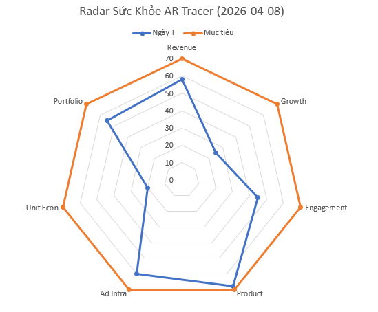

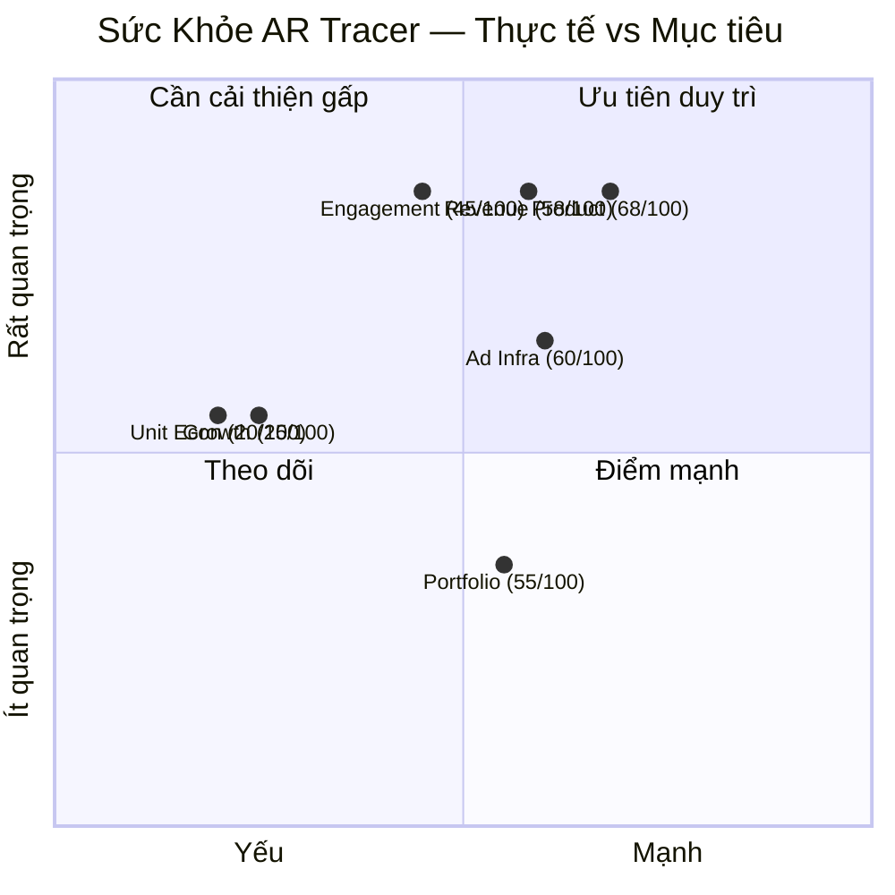

> **Chú thích:** Trục X = điểm số (yếu→mạnh), Trục Y = mức độ quan trọng (trọng số). Góc phần tư phải-trên là "Ưu tiên duy trì" — Product (68) nằm ở đây. Góc trái-trên là "Cần cải thiện gấp" — Engagement (45) và Revenue (58) nằm trong khu vực này. Growth (25) và Unit Econ (20) là hai điểm yếu nhất.
> 

| Chiều đo | Trọng số | Điểm | Trạng thái | Tín hiệu chính |
| --- | --- | --- | --- | --- |
| Revenue | 20% | 58 | 🟡 | Tổng DT +55% (15d), nhưng quy mô tuyệt đối thấp so với chi phí UA |
| Growth | 10% | 25 | 🔴 | ROI 0.168x, chi UA vượt xa doanh thu |
| Engagement | 20% | 45 | 🟡 | DAU 26K ổn định, D1 ~15.5% (Cảnh báo), D7 2.7% (Nghiêm trọng) |
| Product | 20% | 68 | 🟢 | Drawing rate 53.8% (Xuất sắc), D0 activation 54.6% (Xuất sắc) |
| Ad Infra | 15% | 60 | 🟡 | Fill 89.5% (Tốt), SoW top source 39.0% (Lành mạnh) |
| Unit Econ | 10% | 20 | 🔴 | ARPDAU $0.071, ROI 0.168x — đang lỗ nặng |
| Portfolio | 5% | 55 | 🟡 | Đa dạng geo (US/UK/JP) |

**Tóm tắt:** AR Tracer có product engagement mạnh (drawing rate vượt xa mục tiêu 40%, D0 activation xuất sắc), nhưng retention nghiêm trọng thấp và kinh tế UA âm sâu. Doanh thu tổng (IAA+IAP) tăng trưởng nhưng không bù được chi phí UA.

---

## 2. Theo Dõi Hành Động T+1

> **Q20 không khả dụng** — Không có insight ngày trước trong Postgres. Bỏ qua (lần chạy đầu tiên).
> 

---

## 3. Doanh Thu & Kiếm Tiền

### 3.1 Xu Hướng Doanh Thu Tổng (IAA + IAP) — 15 ngày

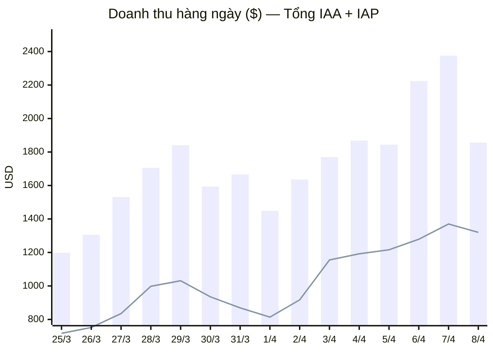

> **Chú thích legend:**
> 
> - **Cột (bar)** = Tổng doanh thu (IAA + IAP)
> - **Đường (line)** = Chỉ IAA (AdMob/mediation) — để thấy rõ phần IAP bổ sung
> 
> Doanh thu tổng tăng từ $1,198 (25/3) lên đỉnh $2,376 (7/4), tăng +98%. Ngày T (8/4) giảm −21.9% so với T-1 do IAP ngày 8/4 ($536) thấp hơn nhiều so với 7/4 ($1,006). IAA vẫn tương đối ổn định.
> 

### Bảng Chi Tiết Doanh Thu

| Ngày | IAA ($) | IAP ($) | Tổng ($) | eCPM ($) | Fill Rate | Impressions |
| --- | --- | --- | --- | --- | --- | --- |
| 03-25 | 717.20 | 481.15 | 1,198.35 | 3.47 | 89.8% | 265,454 |
| 03-26 | 752.02 | 553.90 | 1,305.93 | 3.14 | 89.7% | 272,741 |
| 03-27 | 835.37 | 695.67 | 1,531.04 | 3.24 | 90.2% | 293,747 |
| 03-28 | 997.61 | 708.64 | 1,706.24 | 3.42 | 89.7% | 347,724 |
| 03-29 | 1,030.59 | 810.70 | 1,841.29 | 3.15 | 90.7% | 372,742 |
| 03-30 | 935.47 | 658.70 | 1,594.17 | 3.32 | 89.5% | 326,571 |
| 03-31 | 868.76 | 797.68 | 1,666.44 | 3.17 | 88.4% | 310,688 |
| 04-01 | 814.24 | 634.61 | 1,448.85 | 3.29 | 89.3% | 304,656 |
| 04-02 | 917.46 | 718.55 | 1,636.00 | 3.29 | 89.6% | 314,510 |
| 04-03 | 1,155.03 | 615.09 | 1,770.12 | 3.63 | 89.1% | 360,123 |
| 04-04 | 1,191.62 | 676.62 | 1,868.24 | 3.69 | 90.1% | 387,089 |
| 04-05 | 1,215.98 | 628.42 | 1,844.40 | 3.80 | 89.2% | 380,564 |
| 04-06 | 1,278.78 | 945.05 | 2,223.83 | 3.76 | 89.3% | 368,134 |
| **04-07** | **1,369.91** | **1,005.86** | **2,375.77** | **3.83** | **89.5%** | **381,345** |
| **04-08** | **1,320.33** | **535.83** | **1,856.15** | **4.10** | **89.5%** | **373,545** |

**Số liệu chính (T = 8/4):**

| Chỉ số | Giá trị T | So với T-1 | So với TB 7 ngày |
| --- | --- | --- | --- |
| Tổng doanh thu (IAA+IAP) | **$1,856.15** | −21.9% | −4.3% |
| ↳ IAA (AdMob) | $1,320.33 | −3.6% | — |
| ↳ IAP (Purchase/Sub) | $535.83 | −46.7% (spike T-1) | TB 7d: $732.20 |
| eCPM | $4.10 | +$0.27 (+7.0%) | Cao nhất 15d |
| Fill Rate | 89.5% | Ổn định | — |
| ARPDAU (Tổng) | **$0.071** | — | — |

> **Ghi chú DoD:** Doanh thu tổng giảm −21.9% chủ yếu do IAP ngày T-1 spike bất thường ($1,006 — cao nhất 15d). IAA chỉ giảm −3.6%, xu hướng vẫn tăng.
> 

**Tổng hợp 15 ngày (Mar 25 – Apr 8):**

| Hạng mục | Giá trị |
| --- | --- |
| Tổng doanh thu | **$25,866.83** |
| ↳ IAA (AdMob/mediation) | $15,400.37 (59.5%) |
| ↳ IAP (Firebase) | $10,466.46 (40.5%) |

### 3.2 Doanh Thu Theo Nguồn Quảng Cáo (tổng hợp 15 ngày — chỉ IAA)

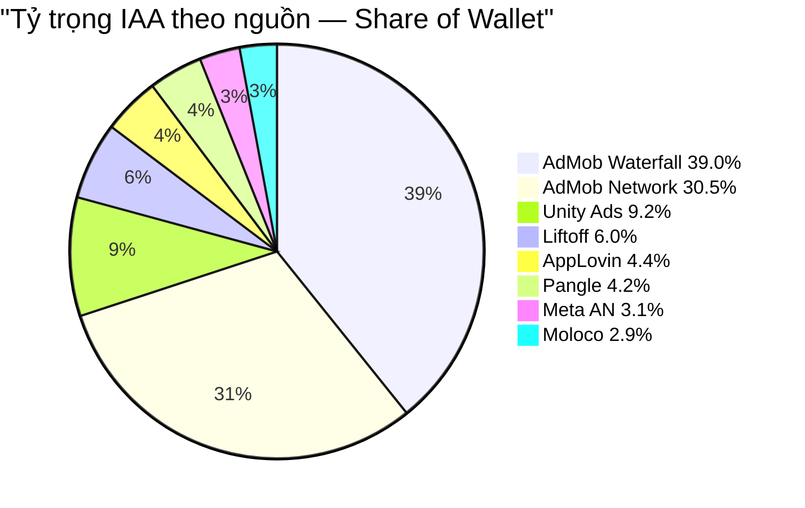

> **Chú thích:** Pie chart thể hiện phân bổ doanh thu IAA (Q3 mediation, $16,205 tổng). % ghi trên mỗi segment là Share of Wallet. AdMob Waterfall dẫn đầu 39.0% — dưới ngưỡng cảnh báo 60%. Top 2 gộp = 69.5%.
> 

| Nguồn | Doanh thu ($) | Impressions | eCPM ($) | SoW |
| --- | --- | --- | --- | --- |
| AdMob Waterfall | 6,315.81 | 1,047,189 | 6.03 | 39.0% |
| AdMob Network | 4,948.34 | 2,739,619 | 1.81 | 30.5% |
| Unity Ads (bidding) | 1,491.15 | 240,920 | 6.19 | 9.2% |
| Liftoff Monetize (bidding) | 973.07 | 211,445 | 4.60 | 6.0% |
| AppLovin (bidding) | 717.90 | 65,702 | 10.93 | 4.4% |
| Pangle (bidding) | 679.37 | 385,459 | 1.76 | 4.2% |
| Meta AN (bidding) | 509.35 | 260,935 | 1.95 | 3.1% |
| Moloco (bidding) | 466.62 | 232,509 | 2.01 | 2.9% |

### 3.3 Doanh Thu Theo Ad Unit (chỉ IAA)

| Ad Unit | Định dạng | Doanh thu ($) | Impressions | eCPM ($) |
| --- | --- | --- | --- | --- |
| V4_InApp_Inter | Interstitial | 7,001.14 | 607,401 | 11.53 |
| V4_InApp_Reward | Rewarded | 2,348.37 | 95,442 | 24.60 |
| V4_InApp_Banner1 | Banner | 1,339.47 | 2,674,886 | 0.50 |
| V4_Session2_AppOpenAll | App Open | 968.29 | 201,933 | 4.80 |
| V4_FirstOpen_AppOpenH | App Open | 868.08 | 59,803 | 14.52 |

**Nhận xét:** Interstitial chiếm 55.7% doanh thu IAA theo ad unit. Rewarded có eCPM cao nhất ($24.60) nhưng volume thấp (95K vs 607K inter) — cơ hội tăng rewarded placements.

---

## 4. Hạ Tầng Quảng Cáo

### 4.1 Sự Kiện Quảng Cáo Firebase (Q11a — 7 ngày)

| Tên sự kiện | Số lượng | Users |
| --- | --- | --- |
| ad_impression_custom | 2,564,157 | 123,863 |
| ad_clicked | 389,778 | 69,358 |
| banner_event | 1,179 | 39 |

### 4.2 Phân Bổ Theo Định Dạng Quảng Cáo (Q11b)

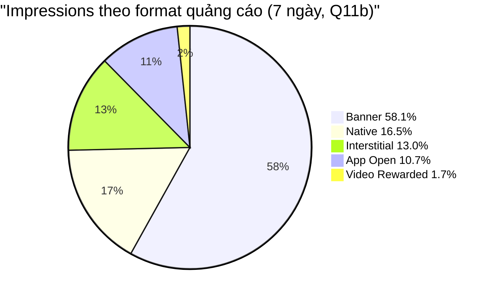

> **Chú thích:** % trên mỗi segment = tỷ lệ impressions. Banner chiếm volume lớn nhất (1.49M, 58.1%) nhưng eCPM rất thấp ($0.50). Video Rewarded chỉ 43K (1.7%) — eCPM cao nhất ($24.60 theo Q4). Tăng rewarded placements là cơ hội doanh thu lớn.
> 

### 4.3 Sức Khỏe Fill Rate & Infra

- Fill Rate: **89.5%** → Tốt (mục tiêu: >85%)
- Ad requests tăng theo DAU (567K ngày 8/4 vs 347K ngày 25/3)
- SoW concentration: **Lành mạnh** — không nguồn nào >60%
- Kiểm chéo: Revenue ↑ + Fill ổn định = tăng trưởng thực, không mong manh

---

## 5. Tương Tác & Retention

### 5.1 Xu Hướng DAU (15 ngày, từ Q5 Bronze)

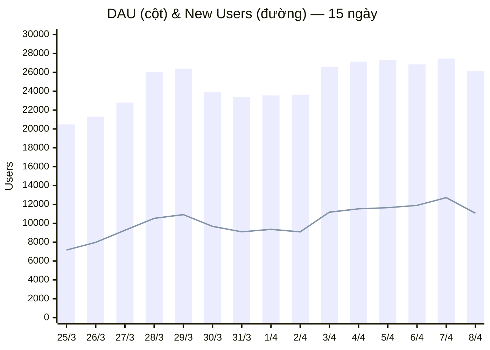

> **Chú thích legend:**
> 
> - **Cột (bar)** = DAU (Daily Active Users)
> - **Đường (line)** = New Users (first_open)
> 
> New Users chiếm ~42% DAU, cho thấy tăng trưởng DAU phụ thuộc nặng vào UA. Nếu dừng chi UA, DAU sẽ giảm đáng kể do returning users ít.
> 

**Số liệu chính (T = 8/4):**

| Chỉ số | Giá trị | So sánh | Đánh giá |
| --- | --- | --- | --- |
| DAU | 26,142 | DoD: −4.8%, vs TB 7d: −1.1% | Ổn định |
| New Users | 11,065 | 42.3% DAU | Phụ thuộc UA |
| DAV | 23,149 | — | — |
| Sessions | 30,446 | — | — |
| Sessions/user | 1.16 | — | ⚠️ < 1.5 (Cảnh báo) |
| Ad Penetration | 88.6% | — | ✅ Tích cực |
| Paying Users | 593 | 2.3% DAU | — |

### 5.2 Phân Tích Retention (Q6 — TB Cohorts Mar 25 – Apr 1)

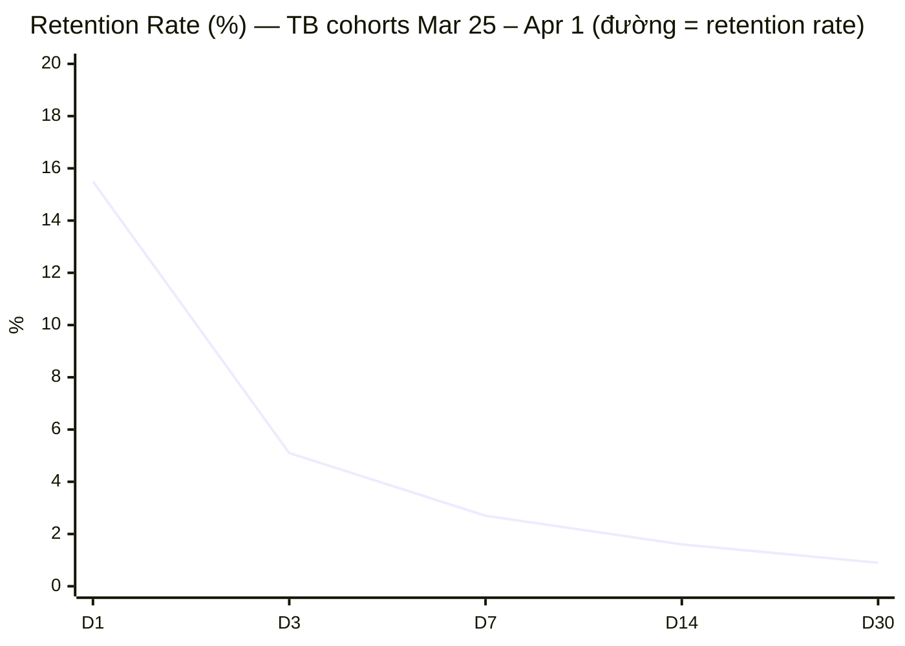

> **Chú thích legend:**
> 
> - **Đường (line)** = Retention rate trung bình (%) của các cohort Mar 25 – Apr 1
> - D0 = 100% (không hiển thị để thấy rõ scale D1–D30)
> 
> Retention rớt mạnh: D1 = 15.5% (chỉ 1/6 user quay lại), D7 = 2.7% (1/37), D30 = 0.9%.
> 

**Đánh giá Retention:**

| Mốc | Giá trị (Mar cohorts) | Apr cohorts | Mục tiêu | Trạng thái |
| --- | --- | --- | --- | --- |
| D1 | 15.5% | 12.7% (giảm) | >30% | ⚠️ Cảnh báo |
| D7 | 2.7% | 2.6%* | >12% | 🔴 Nghiêm trọng |
| D14 | 1.6% | — | — | 🔴 Rất thấp |

> *Apr D7 chỉ có 1 cohort (Apr 1: 2.6%)
> 

**🔔 SIGNAL 3:** D1 giảm + New Users tăng → UA đang mang về user chất lượng thấp.

---

## 6. 🎮 Product & Nội Dung — Bao Gồm Geo Deep Dive

### 6.1 Chỉ Số Product Toàn Cục

| Chỉ số | Giá trị (T) | TB 7 ngày | Mục tiêu | Trạng thái |
| --- | --- | --- | --- | --- |
| Drawing Rate | 53.8% | 53.8% | >40% | ✅ Xuất sắc |
| D0 Activation | 54.6% | 55.2% | >25% | ✅ Xuất sắc |
| Hoàn thành Onboarding | 78.1% | 77.5% | >70% | ✅ Tốt |
| Trial→Sub (7d) | 0.2% | — | >15% | 🔴 Nghiêm trọng |
| Share Users (T) | 50 | 62 | — | Thấp |

### 6.2 Drawing Rate & D0 Activation — 15 ngày

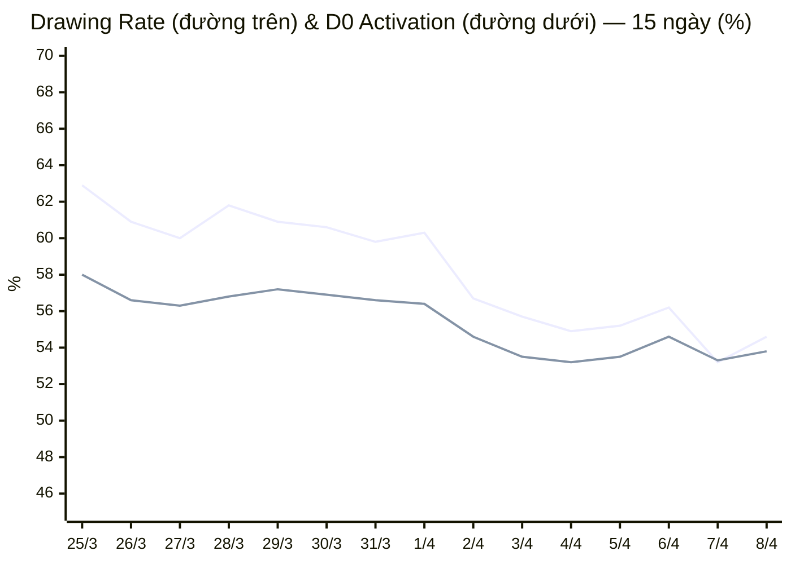

> **Chú thích legend:**
> 
> - **Đường trên** = D0 Activation (% user mới vẽ ngay ngày cài, Q10)
> - **Đường dưới** = Drawing Rate (% DAU có vẽ, Q7÷Q5)
> 
> Cả hai giảm nhẹ từ cuối Mar (D0: ~61%, DR: ~57%) sang đầu Apr (D0: ~55%, DR: ~54%). Xu hướng giảm có thể do user mới từ UA tháng 4 tương tác thấp hơn. Tuy nhiên cả hai vẫn **vượt xa mục tiêu** (D0 >25%, DR >40%).
> 

### 6.3 Funnel Onboarding Toàn Cục (T = 8/4)

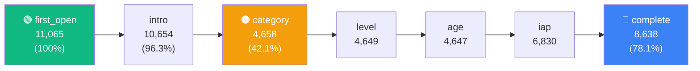

> **Chú thích flowchart:**
> 
> - 🟢 Xanh = Điểm bắt đầu (first_open)
> - 🟠 Cam = Điểm drop lớn nhất (category = 42.1% từ first_open)
> - 🔵 Xanh dương = Hoàn thành (78.1%)
> - `language_choose` (5,345) chỉ fire khi user chủ động đổi ngôn ngữ — không phải bước bắt buộc
> - Giá trị `iap` > category vì IAP screen fire cho cả returning users

### 6.4 Phân Tích Sâu Top 3 Quốc Gia

### Bảng So Sánh 3 Nước

| Chỉ số | 🇺🇸 Mỹ | 🇬🇧 Anh | 🇯🇵 Nhật | Toàn cầu |
| --- | --- | --- | --- | --- |
| DAU (8/4) | 5,413 | 2,165 | 1,250 | 26,142 |
| New Users (8/4) | 2,207 | 954 | 573 | 11,065 |
| Drawing Rate (15d) | 55.4% | 63.0% | 55.0% | 53.8% |
| D0 Activation | 70.6% | 65.7% | 58.6% | 54.6% (T) |
| Hoàn thành Onboarding | 94.9% | 97.5% | 95.5% | 78.1% |
| D1 Retention | 12.7% | 17.1% | 9.7% | 15.5% |
| D3 Retention | 4.0% | 5.2% | 2.9% | 5.1% |
| D7 Retention | 2.0% | 2.7% | 1.5% | 2.7% |
| D14 Retention | 1.2% | 2.0% | 0.9% | 1.6% |
| Trial Starts (15d tổng) | 451 | 65 | 68 | ~4,800 |
| Sub Upgrades (15d tổng) | 5 | 1 | 1 | 13 |

### Retention Theo Từng Nước (Q18)

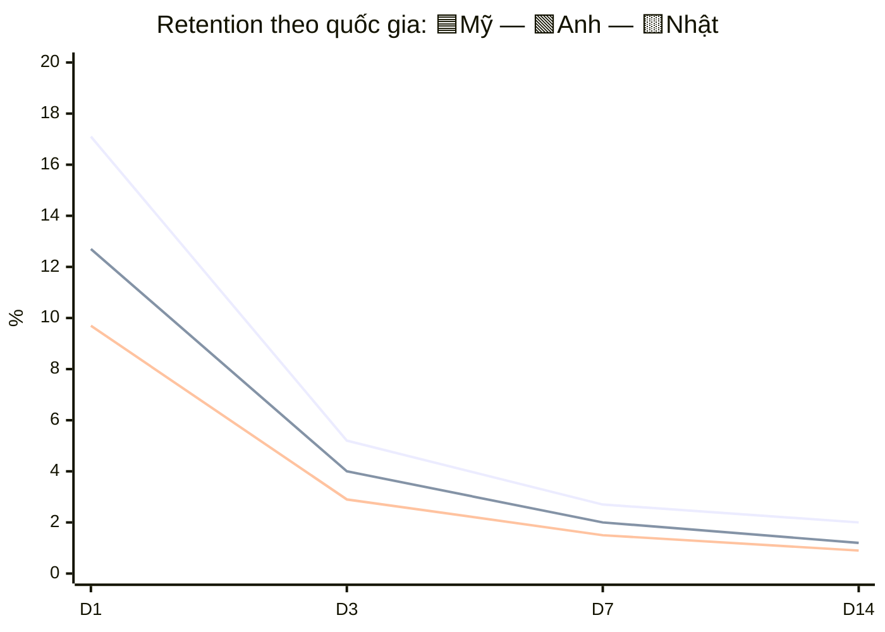

> **Chú thích legend:**
> 
> - **Đường trên (cao nhất)** = 🇬🇧 Anh — D1: 17.1%, D7: 2.7%
> - **Đường giữa** = 🇺🇸 Mỹ — D1: 12.7%, D7: 2.0%
> - **Đường dưới (thấp nhất)** = 🇯🇵 Nhật — D1: 9.7%, D7: 1.5%
> 
> UK vượt trội ở mọi mốc. Gap D1 giữa UK vs JP: 17.1% vs 9.7% (+76% tương đối).
> 

Bảng chi tiết retention (Q18):

| Quốc gia | Mốc | D0 Users | Active Users | Retention Rate |
| --- | --- | --- | --- | --- |
| 🇯🇵 Nhật | D1 | 22,881 | 2,223 | **9.7%** |
| 🇯🇵 Nhật | D3 | 21,382 | 626 | 2.9% |
| 🇯🇵 Nhật | D7 | 18,564 | 284 | **1.5%** |
| 🇯🇵 Nhật | D14 | 13,775 | 125 | 0.9% |
| 🇬🇧 Anh | D1 | 20,194 | 3,452 | **17.1%** |
| 🇬🇧 Anh | D3 | 17,743 | 930 | 5.2% |
| 🇬🇧 Anh | D7 | 14,761 | 405 | **2.7%** |
| 🇬🇧 Anh | D14 | 9,979 | 204 | 2.0% |
| 🇺🇸 Mỹ | D1 | 76,014 | 9,671 | **12.7%** |
| 🇺🇸 Mỹ | D3 | 71,487 | 2,887 | 4.0% |
| 🇺🇸 Mỹ | D7 | 62,154 | 1,269 | **2.0%** |
| 🇺🇸 Mỹ | D14 | 46,934 | 566 | 1.2% |

### Onboarding Funnel Theo Nước (Q17 — 15 ngày)

**🇺🇸 Mỹ** (32,978 → 31,311 = **94.9%** hoàn thành)

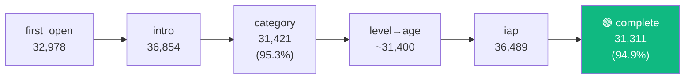

> Funnel gần hoàn hảo — 94.9% hoàn thành. Không có điểm drop đáng kể.
> 

**🇬🇧 Anh** (11,667 → 11,376 = **97.5%** hoàn thành)

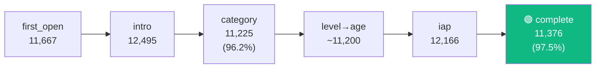

> Tỷ lệ hoàn thành cao nhất trong 3 nước (97.5%).
> 

**🇯🇵 Nhật** (10,398 → 9,930 = **95.5%** hoàn thành) — ⚠️ Luồng riêng

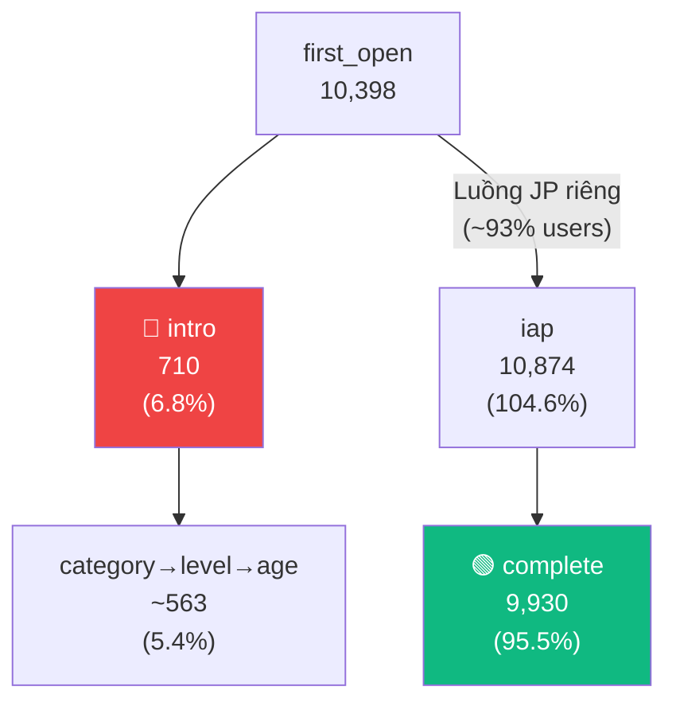

> **🔴 Phát hiện quan trọng:** Chỉ 710/10,398 (6.8%) user Nhật đi qua intro→category. **~93% user Nhật bypass** thẳng tới iap screen qua luồng `end_onboard_jp` riêng, bỏ qua personalization (category/level/age). User Nhật không được cá nhân hóa nội dung → có thể ảnh hưởng content relevance và retention.
> 

### D0 Activation Theo Nước (Q19)

| Quốc gia | Installs (15d) | D0 Drawers | D0 Activation Rate |
| --- | --- | --- | --- |
| 🇺🇸 Mỹ | 32,978 | 23,293 | **70.6%** |
| 🇬🇧 Anh | 11,667 | 7,663 | **65.7%** |
| 🇯🇵 Nhật | 10,398 | 6,093 | **58.6%** |

### Cross-Insights & Hành Động

**1. 🇬🇧 Anh = thị trường benchmark:** Drawing rate 63.0%, D1 17.1%, onboard 97.5% — tốt nhất ở mọi chiều. Under-invested UA.

**2. 🇺🇸 Mỹ: D0 cao nhất (70.6%) nhưng D1 thấp hơn toàn cầu (12.7% vs 15.5%):** SIGNAL 3 xác nhận — UA volume cao, retention thấp. User thử vẽ lần đầu nhưng không quay lại.

**3. 🇯🇵 Nhật: Retention cực thấp (D1 9.7%) + Onboarding bypass personalization:** Luồng `end_onboard_jp` khiến nội dung không phù hợp sở thích. Kết hợp D0 activation thấp nhất (58.6%) → cần review product experience cho JP.

**4. D0 Activation cao ≠ D7 cao:** Mỹ D0 cao nhất (70.6%) nhưng D7 thấp nhất trong 3 nước (2.0%). Lần vẽ đầu chỉ ở mức "thử" — content/dynamic không đủ kéo user quay lại.

**Hành động theo nước:**

| Quốc gia | Hành động | Owner | Lý do |
| --- | --- | --- | --- |
| 🇺🇸 Mỹ | Push notification D1: "Bài học mới trong danh mục yêu thích" | Product | D0 70.6% nhưng D1 12.7% |
| 🇺🇸 Mỹ | Audit TikTok campaigns US — pause campaign D1 <10% | UA | D1 US < TB toàn cầu |
| 🇬🇧 Anh | Tăng UA allocation cho UK | UA | Thị trường benchmark, under-invested |
| 🇯🇵 Nhật | Thêm bước content preference nhẹ vào luồng JP | Product | 93% bypass personalization, D1 9.7% |
| 🇯🇵 Nhật | Test nội dung localized (anime/manga templates) | Content | Drawing rate 55% nhưng retention thấp |

---

## 7. Tăng Trưởng & Thu Hút User

### 7.1 Chi Phí UA Theo Kênh (16 ngày: Mar 25 – Apr 9)

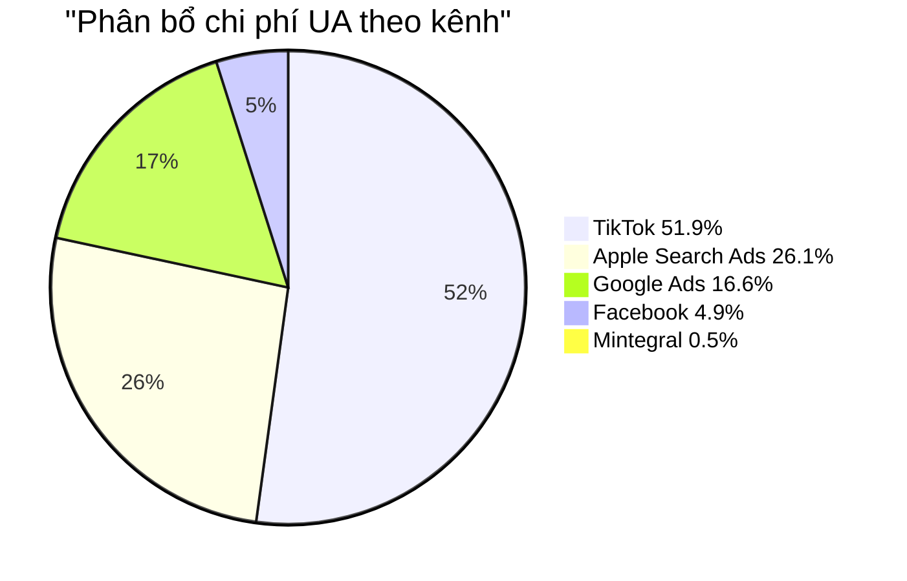

> **Chú thích:** % trên mỗi segment = tỷ trọng chi phí. TikTok chiếm hơn nửa (51.9%) tổng chi UA. Tổng chi: $153,986.
> 

| Kênh | Tổng chi ($) | Tỷ trọng |
| --- | --- | --- |
| TikTok | 79,914.20 | 51.9% |
| Apple Search Ads | 40,158.78 | 26.1% |
| Google Ads | 25,628.74 | 16.6% |
| Facebook | 7,504.21 | 4.9% |
| Mintegral | 779.90 | 0.5% |
| **Tổng cộng** | **$153,985.83** | **100%** |

### 7.2 ROI & Kinh Tế Đơn Vị

| Chỉ số | Giá trị | Đánh giá |
| --- | --- | --- |
| Tổng doanh thu (IAA+IAP, 15d) | **$25,866.83** | — |
| Tổng chi UA (16d) | $153,985.83 | — |
| **ROI** | **0.168x** | 🔴 Nghiêm trọng (mục tiêu: >1.0x) |
| Lỗ ròng ước tính (15d) | ~$128,000 | ~$8,500/ngày |

> Doanh thu chỉ bù ~16.8% chi phí UA. Organic installs (38,004 từ AppsFlyer) là nguồn lớn nhất, miễn phí — product-led growth có thể là hướng bền vững hơn.
> 

---

## 8. Sức Khỏe Subscription

### Funnel Trial & Subscription (15 ngày)

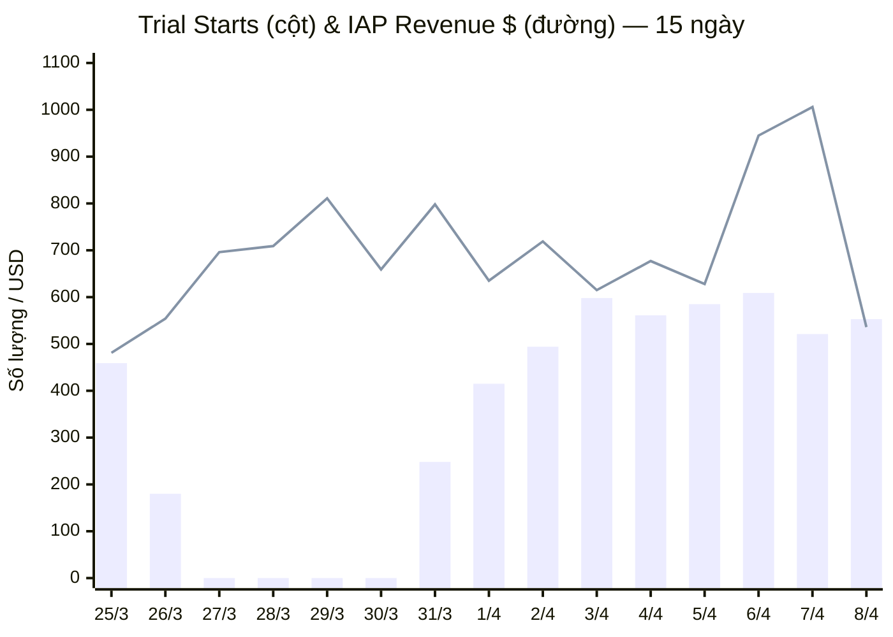

> **Chú thích legend:**
> 
> - **Cột (bar)** = Trial Starts (số lượng trial mới/ngày)
> - **Đường (line)** = IAP Revenue ($) — bao gồm purchases + subscriptions
> 
> Trial starts = 0 từ 27–30/3 (có thể pipeline gap hoặc thay đổi event config). IAP revenue dao động $536–$1,006/ngày — phần lớn từ purchases đơn lẻ, không phải subscription recurring.
> 

**Tổng hợp 7 ngày (Apr 2–8):**

| Chỉ số | Tổng 7 ngày | TB/ngày |
| --- | --- | --- |
| Trial Starts | 3,921 | 560 |
| **Sub Upgrades** | **8** | **1.1** |
| Trial Cancels | 2,276 | 325 |
| Refunds | 178 | 25 |
| IAP Revenue | $5,125.41 | $732.20 |

**Trial → Subscription: 0.2%** (8 / 3,921) → 🔴 Nghiêm trọng (mục tiêu: >15%)

**🔔 SIGNAL 7:** Trial starts ổn định (~560/ngày) nhưng gần như không ai convert. 58% trial bị cancel. Paywall experience cần redesign gấp.

---

## 9. Bất Thường & Cảnh Báo

### 🔴 Nghiêm Trọng

| # | Tín hiệu | Chi tiết | Source |
| --- | --- | --- | --- |
| 1 | **SIGNAL 3: D1 ↓ + New Users ↑** | D1: 15.5% (Mar) → 12.7% (Apr) trong khi installs tăng 50%+ | Q6, Q5 |
| 2 | **ROI 0.168x** | Chi $154K UA, thu $25.9K tổng (IAA+IAP) trong 15d. Lỗ ~$8.5K/ngày | Q1+Q9, Q13 |
| 3 | **Trial→Sub 0.2%** | 3,921 trials / 8 upgrades trong 7 ngày | Q9 |
| 4 | **D7 Retention 2.7%** | Xa mục tiêu 12%. Core loop chưa giữ chân user qua tuần đầu | Q6 |

### 🟡 Cảnh Báo

| # | Tín hiệu | Chi tiết | Source |
| --- | --- | --- | --- |
| 5 | D1 trend giảm | Cohorts Apr: 12.7% vs Mar: 15.5% | Q6 |
| 6 | Sessions/user = 1.16 | < ngưỡng 1.5 | Q5 |
| 7 | Drawing rate giảm nhẹ | 57–58% (cuối Mar) → 53–54% (đầu Apr). Vẫn >40% | Q7+Q5 |
| 8 | Q1 DAU/DAV/ARPDAU = NULL | Pipeline gap — dùng Q5 Bronze thay thế | Q1 |

### ✅ Tích Cực

| # | Tín hiệu | Chi tiết | Source |
| --- | --- | --- | --- |
| 9 | Drawing rate 53.8% | Vượt xa mục tiêu 40% | Q7+Q5 |
| 10 | eCPM tăng +18% | $3.47 → $4.10 trong 15 ngày | Q1 |
| 11 | Fill rate ổn định 89.5% | Không có vấn đề hạ tầng | Q1 |
| 12 | D0 Activation 54.6% | Quá nửa user mới vẽ ngay ngày cài | Q10 |
| 13 | IAP chiếm 40.5% DT | Revenue mix đa dạng, không phụ thuộc 100% IAA | Q1+Q9 |

---

## 10. Kế Hoạch Hành Động

### 🔴 P0 — Cấp bách (Tuần này)

| # | Hành động | Owner | Tín hiệu | Tác động dự kiến |
| --- | --- | --- | --- | --- |
| 1 | Audit TikTok UA: so sánh D1 theo campaign, pause campaign D1 <10% | UA | SIGNAL 3 | Cải thiện D1, giảm lãng phí |
| 2 | Cắt 30% UA trên campaigns ROI tệ nhất; chuyển sang UK | UA | ROI 0.168x | Giảm burn ~$2.5K/ngày |
| 3 | Review funnel trial→subscription: paywall copy, trial value | Product | Trial→Sub 0.2% | Target 5%+ |

### 🟡 P1 — Sprint hiện tại

| # | Hành động | Owner | Tín hiệu | Tác động dự kiến |
| --- | --- | --- | --- | --- |
| 4 | Push notification D1 với nội dung cá nhân hóa | Product | D1 12.7–15.5% | +3pp D1 |
| 5 | Tăng rewarded ad placements (43K vs 1.5M banner) | Monetization | ARPDAU $0.071 | Tăng ARPDAU |
| 6 | Điều tra luồng onboarding Nhật (end_onboard_jp) | Product | JP D1 9.7% | Cải thiện JP retention |

### 🟢 P2 — Sprint tiếp theo

| # | Hành động | Owner | Tín hiệu |
| --- | --- | --- | --- |
| 7 | Test content refresh hàng tuần cho D3–D7 | Content | D7 2.7% |
| 8 | A/B test forced first draw sau onboarding | Product | Gap onboard→draw |
| 9 | Mở rộng Apple Search Ads tại UK | UA | UK D1 17.1% |
| 10 | Test nội dung localized cho Nhật | Content | JP retention thấp |

---

## Phụ Lục: Nguồn Dữ Liệu & Khoảng Trống

| Phần | Nguồn | Ghi chú |
| --- | --- | --- |
| Doanh thu (§3) | Q1 gold (IAA) + Q9 bronze (IAP) | **Đã sửa:** bản trước chỉ tính IAA. Tổng = IAA + IAP |
| Engagement (§5) | Q5 bronze | Q1 dau/dav/arpdau = NULL (pipeline gap) |
| Q2 gold.daily_overview | Thiếu ngày 30/3 | Không ảnh hưởng lớn |
| Retention (§5.2) | Q6 bronze | D7 đến cohort Apr 1; Apr 2+ chỉ D1/D3 |
| Drawing/Product (§6) | Q7, Q8, Q10 bronze | Đầy đủ |
| Ad Format (§4) | Q11a/Q11b bronze + Q4 AdMob | AR Tracer dùng `ad_impression_custom` |
| Chi UA (§7) | Q13 XMP | 16 ngày (Mar 25 – Apr 9) |
| Attribution (§7) | Q14-15 AppsFlyer | Pilot — organic 38K installs |
| Subscription (§8) | Q9 bronze | Trial starts = 0 từ 27–30/3 |
| Geo (§6.4) | Q16–Q19 bronze | Q17 Japan: luồng onboarding JP riêng |
| T+1 Actions (§2) | Q20 Postgres | Không khả dụng (lần chạy đầu tiên) |

**Trạng thái Pipeline:**

- `gold.fact_daily_app_metrics`: ✅ Revenue/Fill, ⚠️ DAU/DAV/ARPDAU = NULL
- `gold.daily_overview`: ⚠️ Thiếu 30/3; còn lại khớp Q5
- `bronze.fb_*`: ✅ Đầy đủ
- `bronze.xmp_report`: ✅ Đầy đủ
- `bronze.adjust_report`: ⛔ Không có adjust_id
- AppsFlyer: ✅ Pilot

---

*Mọi số liệu trích xuất trực tiếp từ bộ CSV (q1–q19), không có giá trị tự suy diễn. Doanh thu = IAA (Q1) + IAP (Q9) ở tất cả các mục.*